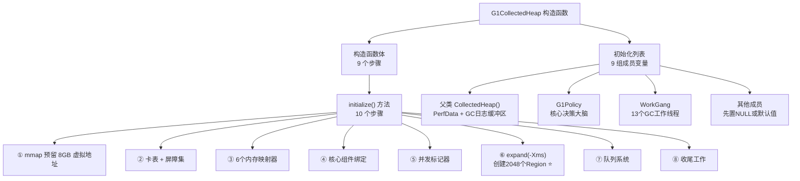
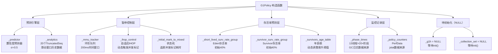
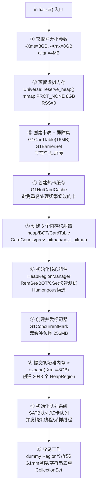

# G1CollectedHeap 构造函数完整深度分析

> 基于 OpenJDK 11 源码分析
> 标准环境：`-Xms8g -Xmx8g -XX:+UseG1GC`，G1 Region = 4MB
> 源码文件：`src/hotspot/share/gc/g1/g1CollectedHeap.cpp`，第 1444 行

---

## 一、宏观概览

整个 G1 堆的初始化分为**两个阶段**：

```
阶段一：G1CollectedHeap 构造函数（第 1444~1536 行）
  ├── 初始化列表（: 后面的部分）—— "搭骨架"，初始化能立即确定的成员变量
  └── 构造函数体（{ 后面的部分）—— "装零件"，创建核心组件对象

阶段二：G1CollectedHeap::initialize() 方法（第 1538~2450 行）
  └── "盖房子"，真正分配内存、创建 Region、初始化所有辅助数据结构
```



---

## 二、初始化列表完整深度讲解

初始化列表按**功能分组**，共 9 组。

### 第 0 项：父类构造 `CollectedHeap()`

```cpp
// g1CollectedHeap.cpp:1444
G1CollectedHeap::G1CollectedHeap(G1CollectorPolicy *collector_policy) :
    CollectedHeap(),   // ← 必须放第一个，C++ 规定父类先于成员初始化
```

**为什么必须放第一个？** C++ 规定：父类构造函数必须在所有成员初始化之前执行。

`CollectedHeap()` 无参构造做了 3 件事：

1. **初始化基础字段**：`_gc_cause = _no_gc`、`_total_collections = 0`、`_total_full_collections = 0`
2. **创建 PerfData 计数器**：
   - `_perf_gc_cause`：写入 `/tmp/hsperfdata_<user>/<pid>` 共享内存，`jstat -gc` 读取 GC 原因
   - `_perf_gc_lastcause`：记录上次 GC 原因
3. **创建 GC 日志环形缓冲区**：`_gc_heap_log`（20 条 GC 前后堆状态），JVM 崩溃时写入 `hs_err_pid.log`

---

### 第 1 组：线程与策略

```cpp
_young_gen_sampling_thread(NULL),    // 年轻代采样线程（后续创建）
_collector_policy(collector_policy), // 收集器策略（传入参数）
_soft_ref_policy(),                  // 软引用策略（默认构造）
```

**`_young_gen_sampling_thread(NULL)`**
- 先置 NULL，后续在 `initialize()` 的 `initialize_young_gen_sampling_thread()` 中创建
- **作用**：每 300ms 采样一次各 Region 的 RSet 大小，给 `G1Policy` 提供数据，用于动态调整年轻代大小（`-XX:G1NewSizePercent` ~ `-XX:G1MaxNewSizePercent`）

**`_collector_policy(collector_policy)`**
- 直接保存传入的 `G1CollectorPolicy*` 指针
- **注意**：`G1CollectorPolicy` 在 `G1CollectedHeap` **之前**创建（在 `Universe::initialize_heap()` 里），因为 Region 大小的计算（`HeapRegion::setup_heap_region_size()`）必须在堆创建之前完成

**`_soft_ref_policy()`**
- 调用 `SoftRefPolicy` 的默认构造函数
- **核心字段**：`_should_clear_all_soft_refs = false`（默认不清理）
- 只有 Full GC 时才设为 true，强制清理所有软引用

---

### 第 2 组：卡表与 JMX 内存管理器

```cpp
_card_table(NULL),
_memory_manager("G1 Young Generation", "end of minor GC"),
_full_gc_memory_manager("G1 Old Generation", "end of major GC"),
```

**`_card_table(NULL)`**
- 先置 NULL，在 `initialize()` 第 3 步创建 `G1CardTable`
- **为什么不在这里创建？** 卡表大小依赖堆的虚拟地址范围（`reserved_region()`），而地址范围在 `initialize()` 的 `Universe::reserve_heap()` 之后才确定

**`_memory_manager("G1 Young Generation", "end of minor GC")`**
- `GCMemoryManager` 的构造，两个参数是字符串常量：
  - `"G1 Young Generation"` → JMX 中 `java.lang:type=GarbageCollector,name=G1 Young Generation` 的名字
  - `"end of minor GC"` → GC 通知的动作描述
- 你用 `jconsole` 或 `VisualVM` 看到的 GC 名称就来自这里

**`_full_gc_memory_manager("G1 Old Generation", "end of major GC")`**
- 同上，对应 Full GC 的 JMX 监控项

---

### 第 3 组：JMX 内存池（先置 NULL）

```cpp
_eden_pool(NULL),
_survivor_pool(NULL),
_old_pool(NULL),
```

这三个都是 `G1MemoryPool*`，先置 NULL，在 `G1MonitoringSupport` 创建时（`initialize()` 收尾阶段）才真正创建并注册到 JMX。

**为什么要分 3 个池？** JMX 规范要求 GC 收集器必须关联内存池，`jstat -gc` 看到的 `EU`（Eden Used）、`SU`（Survivor Used）、`OU`（Old Used）就来自这 3 个池的数据。

---

### 第 4 组：GC 计时与追踪（⭐ 注意内存分配方式）

```cpp
_gc_timer_stw(new(ResourceObj::C_HEAP, mtGC) STWGCTimer()),
_gc_tracer_stw(new(ResourceObj::C_HEAP, mtGC) G1NewTracer()),
```

**关键细节：`new(ResourceObj::C_HEAP, mtGC)`**

这不是普通的 `new`，而是 JVM 内部的**带内存类型标记的分配**：
- `ResourceObj::C_HEAP`：分配在 C 堆（malloc 区域），生命周期与 JVM 进程相同
- `mtGC`：内存类型标记为 GC 相关，用于 `-XX:+PrintNMTStatistics` 的 NMT（Native Memory Tracking）统计

**为什么 `_gc_timer_stw` 要先于 `_g1_policy` 初始化？**

看下一行：
```cpp
_g1_policy(new G1Policy(_gc_timer_stw)),  // ← 把 _gc_timer_stw 传给 G1Policy
```

`G1Policy` 的构造函数需要 `STWGCTimer*` 来创建 `G1GCPhaseTimes`（记录每个 GC 阶段耗时）。**C++ 初始化列表按声明顺序执行**，所以 `_gc_timer_stw` 必须在 `_g1_policy` 之前声明，否则传入的是未初始化的指针！

---

### 第 5 组：G1 核心策略与收集集（⭐ 最重要的两个）

```cpp
_g1_policy(new G1Policy(_gc_timer_stw)),
_collection_set(this, _g1_policy),
```

**`_g1_policy(new G1Policy(_gc_timer_stw))`**

`G1Policy` 是 G1 的**大脑**，详细分析见第四章。

**`_collection_set(this, _g1_policy)`**

`G1CollectionSet` 的构造函数：

```cpp
// g1CollectionSet.cpp:53-72
G1CollectionSet::G1CollectionSet(G1CollectedHeap* g1h, G1Policy* policy) :
  _g1h(g1h),
  _policy(policy),
  _cset_chooser(new CollectionSetChooser()),  // 选择 Old Region 的优先队列
  _eden_region_length(0),
  _survivor_region_length(0),
  _old_region_length(0),
  _collection_set_regions(NULL),              // Region 索引数组（initialize() 中分配）
  _collection_set_cur_length(0),
  _collection_set_max_length(0),
  _inc_build_state(Inactive),                 // 增量构建状态：初始为非活跃
  ...
```

注意 `_collection_set_regions(NULL)`：这个数组在构造时还没分配，要等到 `initialize()` 最后的 `_collection_set.initialize(max_regions())` 才分配 2048 个 `uint` 的数组。

---

### 第 6 组：引用处理器（两套，STW + 并发）

```cpp
_dirty_card_queue_set(false),
_ref_processor_stw(NULL),
_is_alive_closure_stw(this),
_is_subject_to_discovery_stw(this),
_ref_processor_cm(NULL),
_is_alive_closure_cm(this),
_is_subject_to_discovery_cm(this),
```

**为什么有两套引用处理器？**

| | STW 引用处理器 | 并发标记引用处理器 |
|---|---|---|
| 使用时机 | Young GC / Mixed GC 暂停期间 | 并发标记阶段（与 Java 线程并发） |
| 线程安全 | 不需要（STW 期间无 Java 线程） | 需要（Java 线程仍在运行） |
| 处理的引用 | 软/弱/虚/终结器引用 | 同上，但并发处理 |

**`_dirty_card_queue_set(false)`**
- `false` 参数表示"这不是 SATB 队列"
- `DirtyCardQueueSet` 的构造函数根据这个参数决定是否需要 SATB 相关的初始化

**`_is_alive_closure_stw(this)` 和 `_is_subject_to_discovery_stw(this)`**
- 这两个是**闭包对象**（函数对象），传入 `this`（G1CollectedHeap 指针）
- `_is_alive_closure_stw`：判断一个对象是否存活（用于引用处理时决定是否清理引用）
- `_is_subject_to_discovery_stw`：判断一个引用是否需要被发现（只处理堆内的引用）

---

### 第 7 组：辅助数据结构（先置 NULL）

```cpp
_bot(NULL),
_hot_card_cache(NULL),
_g1_rem_set(NULL),
_cr(NULL),
_g1mm(NULL),
```

这 5 个全部先置 NULL，在 `initialize()` 中按顺序创建：

| 字段 | 创建时机 | 依赖 |
|------|---------|------|
| `_hot_card_cache` | 第 4 步 `new G1HotCardCache` | 无 |
| `_bot` | 第 6 步绑定 `bot_storage` | `reserve_heap()` 后的地址 |
| `_g1_rem_set` | 第 6 步 `new G1RemSet` | `reserve_heap()` 后的地址 |
| `_cr` | 第 9 步 `initialize_concurrent_refinement()` | 无 |
| `_g1mm` | 第 10 步 `new G1MonitoringSupport` | 堆完全初始化后 |

---

### 第 8 组：Region 集合与 Evacuation 相关

```cpp
_preserved_marks_set(true /* in_c_heap */),
_old_set("Old Set", false /* humongous */, new OldRegionSetMtSafeChecker()),
_humongous_set("Master Humongous Set", true /* humongous */,
               new HumongousRegionSetMtSafeChecker()),
_humongous_reclaim_candidates(),
_has_humongous_reclaim_candidates(false),
_archive_allocator(NULL),
```

**`_preserved_marks_set(true /* in_c_heap */)`**
- `true` 表示分配在 C 堆（而非 Java 堆）
- **作用**：Evacuation 失败时（对象无法复制到目标 Region），需要保存对象的原始 `mark word`（因为 GC 会临时修改 mark word 来存转发指针），等 GC 结束后恢复

**`_old_set("Old Set", false, new OldRegionSetMtSafeChecker())`**
- 管理所有 Old Region 的链表
- `false` 表示不是 Humongous Region 集合
- `OldRegionSetMtSafeChecker`：在 debug 模式下验证多线程访问的安全性

**`_humongous_set("Master Humongous Set", true, ...)`**
- 管理所有 Humongous Region 的链表
- `true` 表示是 Humongous Region 集合
- Humongous 对象（> 2MB）直接分配到连续的 Region，不走普通分配路径

**`_humongous_reclaim_candidates()` + `_has_humongous_reclaim_candidates(false)`**
- 记录**可以被回收的 Humongous 对象**（没有强引用指向它们）
- G1 有一个优化：在 Young GC 期间顺便回收没有引用的 Humongous 对象，不需要等 Mixed GC

---

### 第 9 组：统计与标志

```cpp
_summary_bytes_used(0),
_survivor_evac_stats("Young", YoungPLABSize, PLABWeight),
_old_evac_stats("Old", OldPLABSize, PLABWeight),
_expand_heap_after_alloc_failure(true),
_old_marking_cycles_started(0),
_old_marking_cycles_completed(0),
_in_cset_fast_test(),
```

**`_survivor_evac_stats` 和 `_old_evac_stats`**
- 类型是 `G1EvacStats`（继承自 `PLABStats`）
- **PLAB = Promotion Local Allocation Buffer**：每个 GC 线程的本地分配缓冲区，避免多线程竞争同一个 Region
- 参数含义：
  - `"Young"` / `"Old"`：名称（用于日志）
  - `YoungPLABSize`：初始 PLAB 大小（默认 4096 words = 32KB）
  - `PLABWeight`：PLAB 大小调整的权重（默认 75%，即新值占 75%，旧值占 25%）

**`_expand_heap_after_alloc_failure(true)`**
- 分配失败时是否尝试扩展堆（默认 true）
- 触发条件：Eden 满了，GC 后仍然无法分配 → 尝试扩展堆到 `-Xmx`

**`_old_marking_cycles_started(0)` / `_old_marking_cycles_completed(0)`**
- 用于追踪并发标记周期的进度
- `started - completed > 0` 表示有正在进行的并发标记
- 通过 `wait_for_concurrent_cycle()` 等待标记完成

**`_in_cset_fast_test()`**
- 调用 `G1InCSetStateFastTestBiasedMappedArray` 的默认构造
- 这是一个**偏置映射数组**（Biased Mapped Array）：通过将数组基地址偏移，使得可以直接用 Region 的起始地址作为索引，O(1) 判断一个 Region 是否在 CSet 中
- 真正的内存分配在 `initialize()` 的 `_in_cset_fast_test.initialize(start, end, HeapRegion::GrainBytes)` 中

---

### 初始化列表的整体设计逻辑

```
初始化列表的顺序 = 声明顺序（C++ 规定）
                 ≠ 代码中写的顺序（只是风格）

关键依赖链：
_gc_timer_stw → _g1_policy（G1Policy 需要 timer）
_g1_policy → _collection_set（CSet 需要 policy）
this → _collection_set（CSet 需要堆引用）

先置 NULL 的原因：
依赖 reserve_heap() 后的地址范围 → _card_table/_bot/_hot_card_cache/_g1_rem_set/_cr/_g1mm
依赖 JMX 框架初始化 → _eden_pool/_survivor_pool/_old_pool
```

**一句话总结**：初始化列表做的是"搭骨架"——把能立即确定的值（策略、计时器、统计器、Region 集合）直接初始化，把依赖堆地址的组件（卡表、BOT、RSet）先置 NULL，等 `initialize()` 拿到虚拟地址后再创建。

---

## 三、构造函数体完整深度讲解

构造函数体（`{` 后面的部分）共 9 个步骤，按**功能依赖顺序**排列。

### Step 1：创建 GC 工作线程池

```cpp
// g1CollectedHeap.cpp:1499-1503
_workers = new WorkGang("GC Thread", ParallelGCThreads,
        /* are_GC_task_threads */true,
        /* are_ConcurrentGC_threads */false);
_workers->initialize_workers();
```

**解决什么问题？** G1 的 Evacuation（对象复制）是并行的，需要多个线程同时工作。

**`WorkGang` 构造函数**（`workgroup.cpp` 第 290 行）：

```cpp
WorkGang::WorkGang(const char* name,   // "GC Thread"
                   uint workers,       // ParallelGCThreads = 13（8GB堆）
                   bool are_GC_task_threads,       // true → STW GC 线程
                   bool are_ConcurrentGC_threads)  // false → 不是并发线程
    : AbstractWorkGang(name, workers, ...),
      _dispatcher(create_dispatcher())  // 创建任务分发器（互斥锁+条件变量）
```

**`initialize_workers()` 做了两件事**：
1. 分配 `AbstractGangWorker*` 指针数组（13 个槽位，在 C 堆上）
2. 调用 `add_workers(true)` → `WorkerManager::add_workers(...)` 真正创建并启动线程

**关键细节：`are_GC_task_threads = true` vs `are_ConcurrentGC_threads = false`**

| 参数 | 含义 | 影响 |
|------|------|------|
| `are_GC_task_threads = true` | STW GC 工作线程 | `is_GC_task_thread()` 返回 true，SafePoint 期间可以运行 |
| `are_ConcurrentGC_threads = false` | 不是并发线程 | 线程类型为 `os::pgc_thread`（Parallel GC Thread），而非 `os::cgc_thread` |

**为什么 `initialize_workers()` 要单独调用，而不在构造函数里完成？** 这是一个设计模式：构造函数只做"轻量级"初始化（分配内存、设置字段），真正的"重量级"操作（创建 OS 线程）放在单独的 `initialize` 方法里，方便子类覆盖或延迟初始化。

---

### Step 2：创建堆验证器

```cpp
// g1CollectedHeap.cpp:1504
_verifier = new G1HeapVerifier(this);
```

**解决什么问题？** `-XX:+VerifyBeforeGC`、`-XX:+VerifyAfterGC`、`-XX:+VerifyDuringGC` 等参数需要一个专门的组件来验证堆的一致性。

`G1HeapVerifier` 持有 `G1CollectedHeap*`，在 GC 前后遍历所有 Region，检查：
- 对象头是否合法
- RSet 是否完整（跨 Region 引用是否都被记录）
- 标记位图是否与对象存活状态一致

**注意**：`_verifier` 在初始化列表中没有出现（因为它依赖 `this` 指针，而 `this` 在构造函数体中才完全可用）。

---

### Step 3：创建分配器

```cpp
// g1CollectedHeap.cpp:1506
_allocator = new G1Allocator(this);
```

**解决什么问题？** Java 线程分配对象时，需要一个高效的分配器，避免每次分配都竞争同一个 Region。

`G1Allocator` 管理 **TLAB（Thread Local Allocation Buffer）** 和 **GCLAB（GC Local Allocation Buffer）**：
- **TLAB**：每个 Java 线程的本地分配缓冲区，线程内分配无锁（bump pointer）
- **GCLAB**：GC 线程在 Evacuation 时的本地分配缓冲区，避免多线程竞争目标 Region

此时 `_allocator` 只是创建了对象，还没有分配任何 Region（Region 在 `initialize()` 的 `expand()` 之后才有）。

---

### Step 4：创建堆大小调整策略

```cpp
// g1CollectedHeap.cpp:1509
_heap_sizing_policy = G1HeapSizingPolicy::create(this, _g1_policy->analytics());
```

**解决什么问题？** `-Xms` 和 `-Xmx` 不同时，JVM 需要动态决定何时扩展/收缩堆。

**`G1HeapSizingPolicy` 构造函数**（`g1HeapSizingPolicy.cpp` 第 34 行）：

```cpp
G1HeapSizingPolicy::G1HeapSizingPolicy(const G1CollectedHeap* g1h,
                                        const G1Analytics* analytics) :
  _g1h(g1h),
  _analytics(analytics),
  _num_prev_pauses_for_heuristics(analytics->number_of_recorded_pause_times()),
  clear_ratio_check_data()  // _ratio_over_threshold_count=0, _ratio_over_threshold_sum=0.0
```

**核心方法 `expansion_amount()`**：每次 GC 后调用，根据以下逻辑决定扩展多少：
- 如果最近 GC 的 GC 时间占比 > `GCTimeRatio`（默认 9，即 GC 时间 < 10%），则扩展
- 扩展量 = `min(当前堆大小 × 20%, -Xmx - 当前堆大小)`

**为什么传入 `_g1_policy->analytics()`？** 扩展决策需要历史 GC 数据（最近几次 GC 的暂停时间比率），这些数据存在 `G1Analytics` 的滑动窗口里。

---

### Step 5 & 6：计算 Humongous 阈值 + 设置填充数组上限

```cpp
// g1CollectedHeap.cpp:1511-1516
_humongous_object_threshold_in_words = humongous_threshold_for(HeapRegion::GrainWords);
_filler_array_max_size = _humongous_object_threshold_in_words;
```

**`humongous_threshold_for` 的实现**（`g1CollectedHeap.hpp` 第 1252 行）：

```cpp
static size_t humongous_threshold_for(size_t region_size) {
    return (region_size / 2);  // Region大小的一半
}
```

**具体计算**（8GB 堆，Region = 4MB）：
```
HeapRegion::GrainWords = 4MB / 8字节 = 524288 words
_humongous_object_threshold_in_words = 524288 / 2 = 262144 words = 2MB
```

**为什么是 Region 大小的一半？** 如果对象 > 2MB，它就无法和其他对象共享一个 4MB Region，必须独占一个或多个连续 Region（Humongous Region）。这类对象走特殊分配路径，不经过 TLAB。

**`_filler_array_max_size = _humongous_object_threshold_in_words`**

**解决什么问题？** GC 有时需要用填充对象（`int[]`）填满 Region 的剩余空间，使堆保持可解析性（parseable）。如果填充对象本身超过 2MB，它就变成了 Humongous 对象，反而造成问题。

设置这个上限后，如果需要填充的空间 > 2MB，GC 会用**多个小填充对象**代替一个大填充对象。

---

### Step 7：创建任务队列集合（⭐ 重要）

```cpp
// g1CollectedHeap.cpp:1518-1520
uint n_queues = ParallelGCThreads;  // = 13
_task_queues = new RefToScanQueueSet(n_queues);

_evacuation_failed_info_array = NEW_C_HEAP_ARRAY(EvacuationFailedInfo, n_queues, mtGC);
```

**类型定义**（`g1CollectedHeap.hpp` 第 98 行）：

```cpp
typedef OverflowTaskQueue<StarTask, mtGC>         RefToScanQueue;
typedef GenericTaskQueueSet<RefToScanQueue, mtGC> RefToScanQueueSet;
```

**`RefToScanQueue` 的数据结构层次**：

```
RefToScanQueue
  = OverflowTaskQueue<StarTask, mtGC>
      ├── GenericTaskQueue<StarTask, mtGC, N=131072>  ← 主队列（环形数组）
      │     └── volatile StarTask* _elems             ← 131072 个槽位（1MB）
      └── Stack<StarTask, mtGC> _overflow_stack       ← 溢出栈（动态增长）
```

**关键参数**：
- `StarTask`：存储对象引用（可以是普通 oop 或 narrowOop）
- `TASKQUEUE_SIZE = 1 << 17 = 131072`（64 位系统）
- 每个队列容量 = 131072 - 2 = 131070 个 `StarTask`

**`GenericTaskQueueSet` 的结构**：

```cpp
class GenericTaskQueueSet {
    uint _n;      // = 13（队列数量）
    T** _queues;  // 指向 13 个 RefToScanQueue 指针的数组
};
```

**为什么每个 GC 线程需要独立的队列？** 这是**工作窃取（Work Stealing）**算法的核心：
- 每个 GC 线程优先处理自己队列里的对象（`pop_local`，无锁）
- 自己队列空了，就从其他线程的队列"偷"任务（`pop_global`，有 CAS）
- 避免了全局队列的锁竞争，大幅提升并行效率

**`_evacuation_failed_info_array`**：

```cpp
// NEW_C_HEAP_ARRAY 展开后：
_evacuation_failed_info_array = (EvacuationFailedInfo*) AllocateHeap(
    13 * sizeof(EvacuationFailedInfo), mtGC);
```

`EvacuationFailedInfo` 继承自 `CopyFailedInfo`，记录 Evacuation 失败的统计信息：

```cpp
class CopyFailedInfo {
    size_t _first_size;    // 第一个失败对象的大小
    size_t _smallest_size; // 最小失败对象的大小
    size_t _total_size;    // 所有失败对象的总大小
    uint   _count;         // 失败次数
};
class EvacuationFailedInfo : public CopyFailedInfo {};  // 无额外字段
```

**为什么每个 GC 线程需要独立的 `EvacuationFailedInfo`？** Evacuation 是并行的，多个线程同时复制对象。如果共享一个统计对象，需要加锁。每线程独立统计，GC 结束后汇总，避免竞争。

---

### Step 8：初始化每个队列 + EvacuationFailedInfo

```cpp
// g1CollectedHeap.cpp:1522-1528
for (uint i = 0; i < n_queues; i++) {
    RefToScanQueue *q = new RefToScanQueue();  // 创建队列对象
    q->initialize();                           // 分配 _elems 数组（1MB）
    _task_queues->register_queue(i, q);        // 注册到 QueueSet
    ::new(&_evacuation_failed_info_array[i]) EvacuationFailedInfo();  // placement new
}
```

**`q->initialize()` 做了什么？**（`taskqueue.hpp` 第 280 行）：

```cpp
void GenericTaskQueue<E, F, N>::initialize() {
    _elems = ArrayAllocator<E>::allocate(N, F);
    // 分配 131072 * sizeof(StarTask) = 131072 * 8 = 1MB 的数组
}
```

**`::new(&_evacuation_failed_info_array[i]) EvacuationFailedInfo()`**

这是 **placement new**（定位 new）：
- `&_evacuation_failed_info_array[i]`：已分配好的内存地址（Step 7 中 `NEW_C_HEAP_ARRAY` 分配的）
- `EvacuationFailedInfo()`：在这块内存上调用构造函数（初始化 4 个字段为 0）

**为什么用 placement new 而不是普通 new？** 因为 `NEW_C_HEAP_ARRAY` 只分配了原始内存，没有调用构造函数。C++ 规定：对于有构造函数的对象，必须显式调用构造函数来初始化。placement new 就是"在已有内存上调用构造函数"的标准方式。

**`register_queue(i, q)` 做了什么？**

```cpp
void GenericTaskQueueSet<T, F>::register_queue(uint i, T* q) {
    assert(i < _n, "index out of range.");
    _queues[i] = q;  // 把队列指针存入数组
}
```

---

### Step 9：初始化 GC 追踪器

```cpp
// g1CollectedHeap.cpp:1531-1535
NOT_PRODUCT(reset_evacuation_should_fail();)  // 仅 debug 版本
_gc_tracer_stw->initialize();
guarantee(_task_queues != NULL, "task_queues allocation failure.");
```

**`_gc_tracer_stw->initialize()` 做了什么？**（`gcTrace.cpp` 第 233 行）：

```cpp
void G1NewTracer::initialize() {
    JFR_ONLY(register_jfr_type_constants());
    // 向 JFR（Java Flight Recorder）注册 G1 特有的类型常量
    // 例如：G1YCType（Mixed/Young/InitialMark/LastYoung）的枚举值
}
```

**`G1NewTracer` 的职责**：每次 GC 结束时，`_gc_tracer_stw` 会被调用来发送 JFR 事件：
- `report_yc_type(type)`：记录本次 GC 类型（Young/Mixed/InitialMark）
- `report_evacuation_info(info)`：记录 Evacuation 统计（复制了多少对象、多少字节）
- `report_evacuation_failed(ef_info)`：记录 Evacuation 失败信息
- `report_gc_end_impl(...)`：发送 GC 结束事件（`jdk.G1GarbageCollection` JFR 事件）

**`NOT_PRODUCT(reset_evacuation_should_fail())`**：

这是一个**仅在非 product 版本（debug/fastdebug）中编译的代码**，用于初始化 `-XX:G1EvacuationFailureALot*` 相关的计数器和标志。这些参数可以人为触发 Evacuation 失败，用于测试 Evacuation 失败的处理逻辑。

**`guarantee(_task_queues != NULL, ...)`**：

`guarantee` 是比 `assert` 更强的断言——**在 product 版本中也会执行**（`assert` 在 product 版本中被编译掉）。这里是最后的安全检查，确保任务队列分配成功。

---

## 四、`G1Policy` 构造函数完整深度讲解

`G1Policy` 是 G1 的**决策大脑**，源码位于 `g1Policy.cpp` 第 49 行。

### 完整构造函数源码

```cpp
// g1Policy.cpp:49-72
G1Policy::G1Policy(STWGCTimer* gc_timer) :
  _predictor(G1ConfidencePercent / 100.0),                          // ① 置信度预测器
  _analytics(new G1Analytics(&_predictor)),                         // ② 历史数据分析器
  _remset_tracker(),                                                 // ③ RSet 追踪策略
  _mmu_tracker(new G1MMUTrackerQueue(
      GCPauseIntervalMillis / 1000.0,                               // ④ MMU 追踪器
      MaxGCPauseMillis / 1000.0)),
  _old_gen_alloc_tracker(),                                         // ⑤ 老年代分配追踪器
  _ihop_control(create_ihop_control(&_old_gen_alloc_tracker,        // ⑥ IHOP 控制器
                                    &_predictor)),
  _policy_counters(new GCPolicyCounters("GarbageFirst", 1, 2)),     // ⑦ PerfData 计数器
  _young_list_fixed_length(0),                                      // ⑧ 固定年轻代长度
  _short_lived_surv_rate_group(new SurvRateGroup()),                 // ⑨ 短命对象存活率组
  _survivor_surv_rate_group(new SurvRateGroup()),                   // ⑩ Survivor 存活率组
  _reserve_factor((double) G1ReservePercent / 100.0),               // ⑪ 保留区比例
  _reserve_regions(0),                                              // ⑫ 保留 Region 数
  _rs_lengths_prediction(0),                                        // ⑬ RSet 长度预测值
  _initial_mark_to_mixed(),                                         // ⑭ IM→Mixed 时间追踪
  _collection_set(NULL),                                            // ⑮ 先置 NULL
  _g1h(NULL),                                                       // ⑯ 先置 NULL
  _phase_times(new G1GCPhaseTimes(gc_timer, ParallelGCThreads)),    // ⑰ GC 阶段耗时记录
  _tenuring_threshold(MaxTenuringThreshold),                        // ⑱ 晋升阈值
  _max_survivor_regions(0),                                         // ⑲ 最大 Survivor Region 数
  _survivors_age_table(true),                                       // ⑳ 年龄表
  _collection_pause_end_millis(os::javaTimeNanos() /                // ㉑ 上次 GC 结束时间
                               NANOSECS_PER_MILLISEC) {
}
```

---

### ① `_predictor(G1ConfidencePercent / 100.0)` — 置信度预测器

**解决什么问题？** G1 需要预测 GC 暂停时间，但历史数据有波动，需要一个"保守估计"机制，避免低估导致暂停超时。

**实现**（`g1Predictions.hpp` 第 31 行）：

```cpp
class G1Predictions {
  double _sigma;  // 置信度系数，默认 = G1ConfidencePercent / 100.0 = 0.5

  double get_new_prediction(TruncatedSeq const* seq) const {
    // 核心公式：预测值 = 历史均值 + σ × 标准差估计
    return seq->davg() + _sigma * stddev_estimate(seq);
  }
};
```

**关键设计**：`G1ConfidencePercent` 默认 50，即 `_sigma = 0.5`。

预测公式：`预测值 = 均值 + 0.5 × 标准差`

这是一个**保守估计**：不是用均值，而是用"均值 + 半个标准差"。这样预测出来的暂停时间会比实际均值稍大，宁可年轻代小一点（GC 更频繁），也不要暂停超时。

**特殊处理小样本**：样本数 < 5 时，标准差估计用 `均值 × (5-n) / 2` 代替，避免小样本的标准差不可靠。

---

### ② `_analytics(new G1Analytics(&_predictor))` — 历史数据分析器

**解决什么问题？** G1 需要记录大量历史 GC 数据（每次 GC 的耗时、分配速率、RSet 大小等），并基于这些数据做预测。

**`G1Analytics` 内部有 20 个 `TruncatedSeq`**（`g1Analytics.hpp` 第 36 行），每个都是**长度为 10 的滑动窗口序列**：

| 字段 | 含义 | 用于预测什么 |
|------|------|-------------|
| `_recent_gc_times_ms` | 最近 10 次 GC 耗时 | 下次 GC 耗时 |
| `_alloc_rate_ms_seq` | 分配速率（bytes/ms） | 下次 GC 前分配量 |
| `_rs_length_diff_seq` | RSet 长度误差 | 修正 RSet 预测 |
| `_cost_per_card_ms_seq` | 每张卡处理耗时 | UpdateRS 时间 |
| `_cost_per_entry_ms_seq` | 每个 RSet 条目扫描耗时 | ScanRS 时间 |
| `_cost_per_byte_ms_seq` | 每字节复制耗时 | 对象复制时间 |
| `_young_other_cost_per_region_ms_seq` | 年轻代每 Region 其他耗时 | 年轻代 GC 总时间 |
| `_rs_lengths_seq` | RSet 总长度 | 下次 RSet 大小 |
| `_pending_cards_seq` | 待处理脏卡数 | UpdateRS 时间 |

**为什么用长度 10 的滑动窗口？** 太短（如 3）对突发波动过于敏感；太长（如 100）对应用行为变化反应迟钝。10 是经验值，能在稳定性和响应性之间取得平衡。

**注意依赖顺序**：`_analytics` 需要 `&_predictor`，所以 `_predictor` 必须在 `_analytics` 之前初始化。

---

### ③ `_remset_tracker()` — RSet 追踪策略

**解决什么问题？** 不是所有 Region 都需要维护完整的 RSet。Old Region 在并发标记期间需要特殊处理（从"粗粒度"升级到"细粒度"）。

`G1RemSetTrackingPolicy` 是一个**策略对象**，决定：
- 哪些 Region 需要开始追踪 RSet（`update_at_gc_start`）
- 哪些 Region 可以停止追踪（`update_at_gc_end`）
- 并发标记期间如何处理 RSet 的精度升级

默认构造，无参数，内部状态全部清零。

---

### ④ `_mmu_tracker(new G1MMUTrackerQueue(...))` — MMU 追踪器（⭐ 最核心）

**解决什么问题？** `-XX:MaxGCPauseMillis=200` 这个目标怎么实现？需要一个机制追踪"最近一段时间内 GC 占用了多少时间"，确保不超标。

**MMU = Minimum Mutator Utilization（最小 Mutator 利用率）**

```cpp
_mmu_tracker(new G1MMUTrackerQueue(
    GCPauseIntervalMillis / 1000.0,  // time_slice = 200ms / 1000 = 0.2s（时间窗口）
    MaxGCPauseMillis / 1000.0))      // max_gc_time = 200ms / 1000 = 0.2s（最大 GC 时间）
```

**内部数据结构**（`g1MMUTracker.cpp` 第 44 行）：

```cpp
G1MMUTrackerQueue::G1MMUTrackerQueue(double time_slice, double max_gc_time) :
  G1MMUTracker(time_slice, max_gc_time),  // 保存 _time_slice=0.2s, _max_gc_time=0.2s
  _head_index(0),
  _tail_index(trim_index(_head_index+1)),
  _no_entries(0) { }
```

这是一个**固定大小的环形队列**（`QueueLength` 个槽位），每个槽位记录一次 GC 暂停的 `(start_time, end_time)`。

**核心算法**：每次 GC 结束时，调用 `add_pause(start, end)`：
1. 清除队列中超过 200ms 时间窗口的旧记录
2. 计算当前 200ms 窗口内所有 GC 暂停的总时间
3. 如果总时间 ≥ 200ms，打印警告：`MMU target violated`

**`when_sec()` 方法**：给定当前时间和计划暂停时长，计算**最早可以开始下次 GC 的时间**，这是 G1 控制暂停频率的核心。

---

### ⑤ `_old_gen_alloc_tracker()` — 老年代分配追踪器

**解决什么问题？** IHOP（Initiating Heap Occupancy Percent）控制器需要知道老年代的分配速率，才能预测何时触发并发标记。

`G1OldGenAllocationTracker` 追踪两个值：
- 老年代在两次 GC 之间分配了多少字节（晋升量）
- 老年代的分配速率（bytes/ms）

默认构造，内部清零。

---

### ⑥ `_ihop_control(create_ihop_control(...))` — IHOP 控制器（⭐ 重要）

**解决什么问题？** 何时触发并发标记？太早浪费 CPU；太晚导致 Full GC（并发标记没完成，堆就满了）。

**`create_ihop_control` 的逻辑**（`g1Policy.cpp` 第 787 行）：

```cpp
G1IHOPControl* G1Policy::create_ihop_control(...) {
  if (G1UseAdaptiveIHOP) {  // 默认 true
    return new G1AdaptiveIHOPControl(
        InitiatingHeapOccupancyPercent,  // 初始阈值 = 45%（8GB堆 = 3.6GB）
        old_gen_alloc_tracker,
        predictor,
        G1ReservePercent,                // 保留区 = 10%
        G1HeapWastePercent);             // 允许浪费 = 5%
  } else {
    return new G1StaticIHOPControl(
        InitiatingHeapOccupancyPercent,  // 固定阈值 = 45%
        old_gen_alloc_tracker);
  }
}
```

**两种 IHOP 控制器的区别**：

| | `G1StaticIHOPControl` | `G1AdaptiveIHOPControl` |
|---|---|---|
| 触发条件 | 老年代占用 > 45% 时触发 | 动态计算触发点 |
| 计算方式 | 固定阈值 | 根据分配速率 + 标记时间预测 |
| 适用场景 | `-XX:-G1UseAdaptiveIHOP` | 默认（推荐） |

**自适应 IHOP 的核心思路**：
```
触发点 = 堆大小 - (标记期间预计分配量)
       = 堆大小 - (分配速率 × 并发标记时间)
```
即：在堆满之前，留出足够时间让并发标记完成。

---

### ⑦ `_policy_counters(new GCPolicyCounters("GarbageFirst", 1, 2))` — PerfData 计数器

**解决什么问题？** `jstat -gcutil` 看到的 GC 策略信息从哪来？

```cpp
new GCPolicyCounters("GarbageFirst",  // 收集器名称（jstat 显示）
                     1,               // 年轻代空间数 = 1（Eden）
                     2)               // 总空间数 = 2（Eden + Old）
```

这会在 `/tmp/hsperfdata_<user>/<pid>` 的共享内存文件中创建计数器，`jstat` 通过 mmap 读取这个文件。

---

### ⑧ `_young_list_fixed_length(0)` — 固定年轻代长度

初始为 0，表示**自适应模式**（默认）。

只有在 `init()` 方法中，当 `!adaptive_young_list_length()` 为 true 时（即用户设置了 `-XX:NewSize=MaxNewSize` 或 `-XX:NewRatio`），才会被设置为具体值。

---

### ⑨⑩ `_short_lived_surv_rate_group` / `_survivor_surv_rate_group` — 存活率组（⭐ 重要）

**解决什么问题？** G1 需要预测年轻代 Region 中有多少对象会存活（用于预测 GC 耗时和 Survivor 大小）。

**`SurvRateGroup` 构造函数**（`survRateGroup.cpp` 第 33 行）：

```cpp
SurvRateGroup::SurvRateGroup() :
    _accum_surv_rate_pred(NULL),  // 累积存活率预测数组（按 age 索引）
    _surv_rate_pred(NULL),        // 每个 age 的存活率历史序列
    _stats_arrays_length(0) {
  reset();           // 初始化数组，设置初始存活率 = 0.4（40%）
  start_adding_regions();  // 开始记录新 Region
}
```

**初始存活率为什么是 0.4？** 这是经验值。G1 没有历史数据时，假设年轻代 40% 的对象会存活（晋升到 Survivor 或 Old）。

**两个组的区别**：

| | `_short_lived_surv_rate_group` | `_survivor_surv_rate_group` |
|---|---|---|
| 管理的 Region | Eden Region | Survivor Region |
| 对象特征 | 新分配的对象，存活率低 | 已经存活过一次 GC，存活率高 |
| 用途 | 预测 Eden 的 evacuation 时间 | 预测 Survivor 的 evacuation 时间 |

---

### ⑪ `_reserve_factor((double) G1ReservePercent / 100.0)` — 保留区比例

```cpp
_reserve_factor = G1ReservePercent / 100.0 = 10 / 100.0 = 0.1
```

**解决什么问题？** Evacuation 时需要目标 Region 来存放存活对象。如果所有 Region 都被分配出去，Evacuation 就会失败（Evacuation Failure）。

保留区 = 10% 的 Region 不分配给 Java 线程，专门留给 GC 的 Evacuation 使用。

8GB 堆 = 2048 个 Region，保留区 = 2048 × 10% ≈ 205 个 Region（820MB）。

---

### ⑭ `_initial_mark_to_mixed()` — InitialMark 到 Mixed GC 的时间追踪器

**解决什么问题？** 自适应 IHOP 需要知道"从 InitialMark 结束到第一次 Mixed GC 开始"经过了多少时间（扣除 STW 暂停），这段时间就是并发标记的实际耗时。

**`G1InitialMarkToMixedTimeTracker` 的状态机**（`g1InitialMarkToMixedTimeTracker.hpp` 第 35 行）：

```
初始状态（_active=false）
    ↓ record_initial_mark_end(end_time)
追踪中（_active=true，记录 _initial_mark_end_time）
    ↓ add_pause(time)（每次 Young GC 都调用，累积 _total_pause_time）
    ↓ record_mixed_gc_start(start_time)
完成（_active=false，记录 _mixed_start_time）
    ↓ last_marking_time()
返回结果 = (_mixed_start_time - _initial_mark_end_time) - _total_pause_time
    ↓ reset()
回到初始状态
```

**为什么要减去 `_total_pause_time`？** 因为 STW 暂停期间并发标记线程也停了，不算在并发标记时间里。

---

### ⑰ `_phase_times(new G1GCPhaseTimes(gc_timer, ParallelGCThreads))` — GC 阶段耗时记录器（⭐ 重要）

**解决什么问题？** `-Xlog:gc+phases=debug` 输出的每个 GC 阶段耗时从哪来？

`G1GCPhaseTimes` 为每个 GC 阶段创建一个 `WorkerDataArray<double>`（每个 GC 线程一个槽位）：

```cpp
// 8GB 堆，ParallelGCThreads = 13
_gc_par_phases[GCWorkerStart]  = new WorkerDataArray<double>(13, "GC Worker Start (ms):");
_gc_par_phases[ExtRootScan]    = new WorkerDataArray<double>(13, "Ext Root Scanning (ms):");
_gc_par_phases[ThreadRoots]    = new WorkerDataArray<double>(13, "Thread Roots (ms):");
_gc_par_phases[UpdateRS]       = new WorkerDataArray<double>(13, "Update RS (ms):");
_gc_par_phases[ScanRS]         = new WorkerDataArray<double>(13, "Scan RS (ms):");
_gc_par_phases[ObjCopy]        = new WorkerDataArray<double>(13, "Object Copy (ms):");
_gc_par_phases[Termination]    = new WorkerDataArray<double>(13, "Termination (ms):");
// ... 共 20+ 个阶段
```

**为什么需要 `gc_timer`？** `G1GCPhaseTimes` 内部有 `_ref_phase_times`（引用处理阶段计时），它需要 `GCTimer` 来记录 JFR 事件。

---

### ⑱ `_tenuring_threshold(MaxTenuringThreshold)` — 晋升阈值

```cpp
_tenuring_threshold = MaxTenuringThreshold = 15（默认）
```

**含义**：对象在 Survivor 区存活超过 15 次 GC 后，晋升到 Old 区。

**注意**：这是**初始值**，G1 会在每次 GC 后根据 Survivor 区的实际使用情况动态调整（`update_survivors_policy()`）。如果 Survivor 区快满了，会降低阈值（提前晋升），避免 Survivor 溢出。

---

### ⑳ `_survivors_age_table(true)` — 年龄表

```cpp
AgeTable _survivors_age_table(true);  // true = 分配在 C 堆
```

**解决什么问题？** 决定晋升阈值。年龄表记录每个年龄段（0~15）的 Survivor 对象总大小，GC 后根据这个表计算：如果把年龄 ≥ N 的对象都晋升，Survivor 区还剩多少空间？找到最小的 N 使得 Survivor 不溢出，这个 N 就是新的晋升阈值。

---

### ㉑ `_collection_pause_end_millis(os::javaTimeNanos() / NANOSECS_PER_MILLISEC)` — 上次 GC 结束时间

```cpp
_collection_pause_end_millis = os::javaTimeNanos() / 1000000  // 当前时间（毫秒）
```

**为什么初始化为当前时间？** 这个字段用于计算"距上次 GC 结束过了多久"（mutator 运行时间）。初始化为当前时间，相当于假设"JVM 刚启动时做了一次 GC"，这样第一次真正的 GC 时，mutator 时间 = JVM 启动到第一次 GC 的时间，是合理的。

---

### G1Policy 整体总结



**一句话总结**：`G1Policy` 的构造函数搭建了 G1 的**决策大脑**——预测引擎（`_predictor` + `_analytics`）负责从历史数据中学习，暂停控制层（`_mmu_tracker` + `_ihop_control`）负责实现暂停时间目标，存活率预测层负责估算 GC 工作量，监控记录层负责输出 GC 日志和 JMX 数据。构造完成后，`G1Policy` 还不能工作，需要等 `init()` 注入 `_g1h` 和 `_collection_set` 后才真正激活。

---

## 五、`G1CollectedHeap::initialize()` 方法完整分析

`initialize()` 是真正的"重头戏"，分为 **10 个步骤**，源码位于 `g1CollectedHeap.cpp` 第 1538 行。

### 整体流程图



---

### ① 获取堆大小参数

```cpp
size_t init_byte_size = collector_policy()->initial_heap_byte_size(); // -Xms = 8GB
size_t max_byte_size  = collector_policy()->max_heap_byte_size();     // -Xmx = 8GB
size_t heap_alignment = collector_policy()->heap_alignment();         // = Region大小 = 4MB
```

**为什么要对齐到 Region 大小？** G1 的堆必须是 Region 的整数倍，否则最后一个 Region 不完整，无法使用。

---

### ② 预留虚拟内存（两阶段内存分配的第一阶段）

```cpp
ReservedSpace heap_rs = Universe::reserve_heap(max_byte_size, heap_alignment);
// 底层调用：mmap(preferred_addr, 8GB, PROT_NONE, MAP_PRIVATE|MAP_ANONYMOUS, -1, 0)
// 结果：占用 8GB 虚拟地址空间，不消耗物理内存，RSS = 0

initialize_reserved_region(heap_rs.base(), heap_rs.base() + heap_rs.size());
// 将地址范围保存到 CollectedHeap::_reserved（MemRegion 对象）
```

**关键认知**：Java 堆不在 C 堆（malloc 区域）里，而是在**进程的 mmap 映射区**！

---

### ③ 创建卡表 + 屏障集

```cpp
G1CardTable *ct = new G1CardTable(reserved_region());
// 卡表大小 = 8GB / 512B = 16MB（每 512 字节堆内存对应 1 字节卡表项）

G1BarrierSet *bs = new G1BarrierSet(ct);
bs->initialize();
BarrierSet::set_barrier_set(bs);  // 设置为全局唯一屏障集
_card_table = ct;
```

**两种屏障的作用**：
- **写前屏障（pre-write）**：引用被覆盖前，把旧值记入 SATB 队列 → 支持并发标记
- **写后屏障（post-write）**：引用修改后，把卡标记为脏 → 记录跨 Region 引用

---

### ④ 创建热卡缓存

```cpp
_hot_card_cache = new G1HotCardCache(this);
```

**解决的问题**：频繁修改的"热卡"如果每次都立即处理，会造成大量重复工作。热卡缓存先积累，GC 暂停时统一处理。

---

### ⑤ 创建 6 个内存映射器（`G1RegionToSpaceMapper`）

这是 `initialize()` 中最核心的内存布局步骤：

```
虚拟地址空间布局（8GB 堆）：
┌─────────────────────────────────────────────────────────────────┐
│  heap_storage（8GB）                                             │
│  Java 对象实际存放的地方，2048 个 4MB Region                      │
│  mmap 预留，按需提交（-Xms 时提交 8GB）                           │
├─────────────────────────────────────────────────────────────────┤
│  bot_storage（16MB）                                             │
│  Block Offset Table：快速定位对象起始地址                         │
│  每 512 字节堆内存对应 1 字节                                     │
├─────────────────────────────────────────────────────────────────┤
│  cardtable_storage（16MB）                                       │
│  卡表：记录跨 Region 引用，每 512 字节对应 1 字节                  │
├─────────────────────────────────────────────────────────────────┤
│  card_counts_storage（16MB）                                     │
│  热卡计数：记录每张卡被修改的次数                                  │
├─────────────────────────────────────────────────────────────────┤
│  prev_bitmap_storage（128MB）                                    │
│  上一轮并发标记的结果（只读，Mixed GC 使用）                       │
│  每 64 字节堆内存对应 1 bit                                       │
├─────────────────────────────────────────────────────────────────┤
│  next_bitmap_storage（128MB）                                    │
│  当前并发标记的工作区（可写，标记线程使用）                         │
│  标记完成后与 prev 交换指针（O(1) 操作）                           │
└─────────────────────────────────────────────────────────────────┘
总计：8GB + 16MB + 16MB + 16MB + 128MB + 128MB ≈ 8.3GB 虚拟地址空间
```

**两种创建方式的区别**：
- `create_mapper(g1_rs, ...)`：使用已有的 `ReservedSpace`（堆本身）
- `create_aux_memory_mapper(...)`：内部新建独立的 `ReservedSpace`（辅助结构，与堆地址分离）

---

### ⑥ 初始化核心组件

```cpp
// HeapRegionManager：统一管理所有 Region 及其辅助数据结构
_hrm.initialize(heap_storage, prev_bitmap_storage, next_bitmap_storage,
                bot_storage, cardtable_storage, card_counts_storage);

_card_table->initialize(cardtable_storage);   // 卡表绑定存储
_hot_card_cache->initialize(card_counts_storage); // 热卡缓存绑定存储

// G1RemSet：记忆集，记录跨 Region 引用
_g1_rem_set = new G1RemSet(this, _card_table, _hot_card_cache);
_g1_rem_set->initialize(max_capacity(), max_regions());

// BOT：块偏移表
_bot = new G1BlockOffsetTable(reserved_region(), bot_storage);

// CSet 快速判断数组（2048 个元素，O(1) 判断 Region 是否在 CSet 中）
_in_cset_fast_test.initialize(start, end, HeapRegion::GrainBytes);

// Humongous 回收候选数组
_humongous_reclaim_candidates.initialize(start, end, HeapRegion::GrainBytes);
```

---

### ⑦ 创建并发标记器

```cpp
_cm = new G1ConcurrentMark(this, prev_bitmap_storage, next_bitmap_storage);
_cm_thread = _cm->cm_thread();  // 并发标记线程 G1ConcurrentMarkThread
```

`G1ConcurrentMark` 管理整个并发标记周期，包含：
- 双缓冲位图（256MB）
- 每个 GC 线程的任务队列（灰色对象队列）
- 全局标记栈（处理队列溢出）
- 区域存活率统计数组

---

### ⑧ 提交初始堆内存（⭐ 最关键的一步！）

```cpp
if (!expand(init_byte_size, _workers)) {  // init_byte_size = -Xms = 8GB
    vm_shutdown_during_initialization("Failed to allocate initial heap.");
    return JNI_ENOMEM;
}
```

`expand()` 做了 3 件事：
1. **提交物理内存**：`mmap(addr, 8GB, PROT_READ|PROT_WRITE, MAP_FIXED, ...)` → 修改页表权限，触发 Page Fault 时才真正分配物理页
2. **创建 HeapRegion 对象**：为每个 4MB Region 创建一个 `HeapRegion` 对象（C++ 对象，在 C 堆上）
3. **加入空闲列表**：所有 2048 个 Region 都加入 `_hrm._free_list`，等待分配

---

### ⑨ 初始化队列系统

```cpp
// G1 策略初始化（设置年轻代大小边界）
g1_policy()->init(this, &_collection_set);

// SATB 队列集合（并发标记用）
G1BarrierSet::satb_mark_queue_set().initialize(
    SATB_Q_CBL_mon, SATB_Q_FL_lock,
    G1SATBProcessCompletedThreshold,  // = 20，完成队列达到 20 个时触发处理
    Shared_SATB_Q_lock);

// 创建并发精炼线程（后台处理脏卡）
initialize_concurrent_refinement();

// 创建年轻代采样线程（每 300ms 采样一次 RSet 大小）
initialize_young_gen_sampling_thread();

// 全局脏卡队列集合（Java 线程写屏障产生的脏卡汇聚于此）
G1BarrierSet::dirty_card_queue_set().initialize(
    DirtyCardQ_CBL_mon, DirtyCardQ_FL_lock,
    concurrent_refine()->yellow_zone(),  // = 39，触发精炼的阈值
    concurrent_refine()->red_zone(),     // = 65，队列长度上限
    Shared_DirtyCardQ_lock, NULL, true);
```

---

### ⑩ 收尾工作

```cpp
// 创建 dummy Region（G1AllocRegion 的占位符，分配必定失败）
HeapRegion *dummy_region = _hrm.get_dummy_region();
dummy_region->set_eden();
dummy_region->set_top(dummy_region->end());  // top = end，标记为"满的"
G1AllocRegion::setup(this, dummy_region);

// 初始化 Java 线程分配器（指向 dummy_region，第一次分配时触发 slow path）
_allocator->init_mutator_alloc_region();

// G1 监控支持（jstat/JMX/VisualVM 数据）
_g1mm = new G1MonitoringSupport(this);

// 字符串去重（-XX:+UseStringDeduplication）
G1StringDedup::initialize();

// CollectionSet 初始化（分配 Region 索引数组）
_collection_set.initialize(max_regions());  // max_regions = 2048

return JNI_OK;
```

---

## 六、数据结构关系图

```mermaid
graph TD
    G1["G1CollectedHeap"] --> Policy["G1Policy\n决策大脑"]
    G1 --> Workers["WorkGang\n13个GC线程"]
    G1 --> Allocator["G1Allocator\nTLAB+GCLAB"]
    G1 --> Verifier["G1HeapVerifier\n堆验证器"]
    G1 --> CSet["G1CollectionSet\n待回收Region集合"]
    G1 --> CM["G1ConcurrentMark\n并发标记器"]
    G1 --> RemSet["G1RemSet\n记忆集"]
    G1 --> CardTable["G1CardTable\n卡表 16MB"]
    G1 --> HRM["HeapRegionManager\n2048个Region管理"]
    G1 --> BOT["G1BlockOffsetTable\n块偏移表 16MB"]
    G1 --> HotCache["G1HotCardCache\n热卡缓存"]
    G1 --> G1mm["G1MonitoringSupport\nJMX/jstat数据"]

    Policy --> Predictor["G1Predictions\n置信度预测器 σ=0.5"]
    Policy --> Analytics["G1Analytics\n20个滑动窗口序列"]
    Policy --> MMU["G1MMUTrackerQueue\n200ms时间窗口"]
    Policy --> IHOP["G1AdaptiveIHOPControl\n动态触发并发标记"]
    Policy --> PhaseTimes["G1GCPhaseTimes\n13线程×20+阶段"]
    Policy --> SurvRate1["SurvRateGroup\nEden存活率 初始40%"]
    Policy --> SurvRate2["SurvRateGroup\nSurvivor存活率 初始40%"]

    Workers --> TaskQueues["RefToScanQueueSet\n13个工作窃取队列"]
    TaskQueues --> Queue["RefToScanQueue\n环形数组131072槽\n+溢出栈"]

    HRM --> Regions["2048个HeapRegion\n每个4MB"]
    CM --> PrevBitmap["prev_bitmap\n128MB 上轮标记结果"]
    CM --> NextBitmap["next_bitmap\n128MB 当前标记工作区"]
```



---

## 七、总结

### 7.1 数据结构层面

| 结构 | 大小 | 核心特征 |
|------|------|---------|
| `G1Policy` | ~1KB | 20个滑动窗口 + MMU环形队列 + IHOP控制器 |
| `WorkGang` | 13个OS线程 | 工作窃取架构，STW期间并行执行 |
| `RefToScanQueueSet` | 13×1MB=13MB | 每线程独立队列，避免锁竞争 |
| `G1CardTable` | 16MB | 每512字节堆对应1字节，记录跨Region引用 |
| `prev/next_bitmap` | 各128MB | 双缓冲，标记完成后O(1)交换 |
| `HeapRegion` | 2048个C++对象 | 每个管理4MB Java堆内存 |

### 7.2 算法层面

| 算法 | 核心设计决策 |
|------|------------|
| **置信度预测** | `均值 + 0.5×标准差`，保守估计避免暂停超时 |
| **MMU 追踪** | 200ms滑动时间窗口，控制GC暂停频率 |
| **自适应 IHOP** | `触发点 = 堆大小 - 分配速率×标记时间`，动态调整 |
| **工作窃取** | 每线程独立队列，空时从其他线程"偷"任务 |
| **两阶段内存** | mmap预留虚拟地址（PROT_NONE）→ expand提交物理内存 |
| **双缓冲位图** | prev/next交换指针O(1)，避免复制256MB数据 |

### 7.3 核心要点

1. **构造函数 ≠ 初始化**：构造函数只做"搭骨架"，`initialize()` 才是真正的"盖房子"
2. **依赖顺序很重要**：`_gc_timer_stw` → `_g1_policy` → `_collection_set`，C++ 初始化列表按声明顺序执行
3. **G1Policy 是大脑**：所有 GC 决策（何时 GC、回收哪些 Region、暂停时间预测）都在 `G1Policy` 里
4. **内存是分层的**：Java 堆（8GB）+ 辅助结构（BOT/CardTable/Bitmap 共 304MB）≈ 8.3GB 虚拟地址
5. **并行是核心**：13 个 GC 线程 + 工作窃取队列，是 G1 高吞吐量的基础
