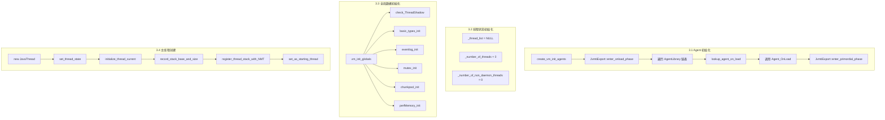
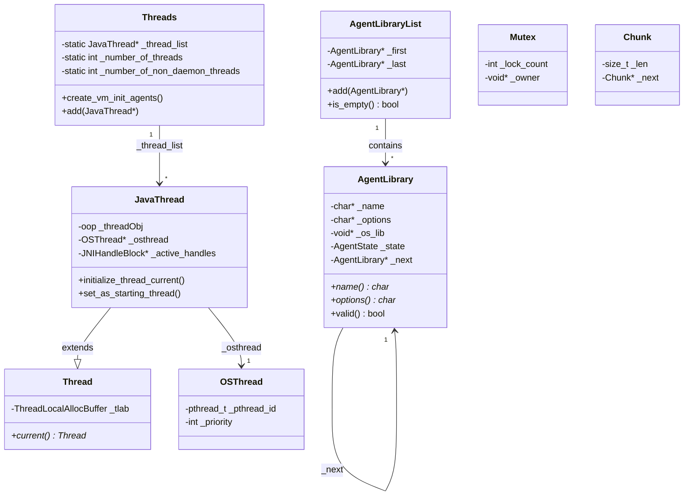

# Phase 3: Agent 与全局数据初始化深度解析

> 基于 OpenJDK 11 源码分析
> 位置：`thread.cpp:3980-4065`

---

## 第 0 部分：核心原理

### 0.1 本质是什么？

Phase 3 是 JVM 启动的**Agent 加载与全局基础设施准备阶段**，完成两件大事：
1. **加载 JVMTI Agent**（如调试器、性能分析器）
2. **初始化 VM 级别的全局数据结构**（线程管理、内存分配、性能监控等基础设施）

### 0.2 为什么需要？

**Agent 加载的必要性**：
- 开发者需要在 JVM 运行时进行诊断（调试、性能分析、内存分析）
- 这些工具需要在 Java 代码执行前就开始工作
- JVMTI（JVM Tool Interface）是标准接口

**全局数据初始化的必要性**：
- JVM 运行时需要大量全局状态（线程列表、锁、内存池等）
- 这些结构必须在创建第一个 JavaThread 前准备好
- 延迟初始化会导致竞态条件

**如果不做这些准备**：
- Agent 无法正常工作（调试器连不上、Profiler 无法采样）
- 后续创建线程时会访问未初始化的全局变量
- JVM 核心功能无法使用

### 0.3 怎么解决？

核心思路：**先加载外部工具，再建立内部基础设施**。

关键设计：
1. **Agent 状态机**：`OnLoad` → `Primordial` 阶段转换
2. **链表管理 Agent**：`AgentLibrary` 链表存储所有 Agent
3. **批量初始化全局结构**：`vm_init_globals()` 一站式初始化
4. **主线程初始化**：创建第一个 `JavaThread` 对象

### 0.4 为什么这样设计？

**为什么 Agent 要在全局数据前加载？**
→ Agent 的 `Agent_OnLoad` 可能需要访问某些全局数据。

**为什么是 vm_init_globals() 而不是分散初始化？**
→ 集中管理依赖关系，确保初始化顺序正确。

**为什么主线程在这里创建？**
→ 后续 `init_globals()` 需要当前线程上下文。

---

## 第 1 部分：数据结构全景

### 1.1 数据结构清单

| 结构/变量 | 类型 | 源码位置 | 核心作用 |
|-----------|------|----------|----------|
| `AgentLibrary` | `class` | `arguments.hpp:130` | Agent 库信息（名称、路径、选项、句柄） |
| `_thread_list` | `JavaThread*` | `thread.hpp:2206` | 所有 JavaThread 的链表头 |
| `_number_of_threads` | `int` | `thread.hpp:2207` | 线程总数（含守护线程） |
| `_number_of_non_daemon_threads` | `int` | `thread.hpp:2208` | 非守护线程数 |
| `main_vm` | `JavaVM_` | `thread.cpp:4428` | 全局 JVM 实例句柄（传给 Agent） |
| `AgentState` | `enum` | `arguments.hpp:135` | Agent 状态：`agent_invalid`/`agent_valid` |

### 1.2 关键数据结构详解

#### 1.2.1 AgentLibrary（Agent 库信息）

```cpp
// arguments.hpp:130-148
class AgentLibrary : public CHeapObj<mtArguments> {
 private:
  char*           _name;              // Agent 名称（如 "jdwp"）
  char*           _options;           // Agent 选项字符串
  void*           _os_lib;            // 动态库句柄（dlopen 返回）
  bool            _is_absolute_path;  // 是否为绝对路径
  bool            _is_static_lib;     // 是否为静态链接
  bool            _is_instrument_lib; // 是否为 instrument Agent
  AgentState      _state;             // 状态：valid/invalid
  AgentLibrary*   _next;              // 链表指针
};
```

**是什么**：描述一个 JVMTI Agent 的完整信息。

**为什么需要**：
- JVM 支持同时加载多个 Agent（如同时用 debugger 和 profiler）
- 需要保存每个 Agent 的名称、选项、动态库句柄
- 通过链表串联所有 Agent

**生命周期**：
```
1. Arguments::parse() 阶段：从 -agentlib/-agentpath 参数创建
2. create_vm_init_agents()：调用 dlopen 加载动态库
3. invoke Agent_OnLoad：执行 Agent 初始化代码
4. JVM 运行期间：Agent 保持加载状态
5. JVM 退出时：调用 Agent_OnUnload（如果有）
```

**【GDB 验证】**
```
----- AgentLibrary 结构大小 -----
$1 = 48 字节

内存布局（x86_64）：
偏移    字段                    大小
0x00    _name (char*)           8
0x08    _options (char*)        8
0x10    _os_lib (void*)         8
0x18    _is_absolute_path       1
0x19    _is_static_lib          1
0x1A    _is_instrument_lib      1
0x1B    [padding]               1
0x1C    _state (AgentState)     4
0x20    _next (AgentLibrary*)   8
0x28    总计                    40 → 对齐到 48
```

#### 1.2.2 Threads 全局状态变量

```cpp
// thread.hpp:2206-2208
static JavaThread* _thread_list;
static int         _number_of_threads;
static int         _number_of_non_daemon_threads;
```

**是什么**：管理所有 JavaThread 的全局状态。

**为什么需要**：
- JVM 需要知道当前有多少线程在运行
- 非守护线程数为 0 时，JVM 应该退出
- 遍历时需要一个统一的入口（链表头）

**【GDB 验证】初始化前值**
```
----- Threads 状态变量 -----
Threads::_thread_list = 0x0                    (NULL，空链表)
Threads::_number_of_threads = 0                (0 个线程)
Threads::_number_of_non_daemon_threads = 0     (0 个非守护线程)
```

#### 1.2.3 JavaThread / Thread / OSThread 关系

```cpp
// 继承链：JavaThread → Thread → ThreadShadow
class JavaThread : public Thread {
  // Java 级别的线程信息
  oop             _threadObj;       // 指向 java.lang.Thread 对象
  OSThread*       _osthread;        // 关联的 OS 线程
  // ...
};

class Thread : public ThreadShadow {
  // 通用线程信息
  ThreadLocalAllocBuffer _tlab;   // TLAB（线程本地分配缓冲区）
  // ...
};
```

**【GDB 验证】结构大小**
```
----- 核心数据结构大小 -----
sizeof(Thread)       = 856 字节
sizeof(JavaThread)   = 1888 字节  (+1032 字节)
sizeof(OSThread)     = 232 字节
```

**为什么 JavaThread 比 Thread 大 1032 字节？**
→ JavaThread 包含大量 Java 特有的状态：
- `_threadObj`：指向 Java Thread 对象的指针
- `_osthread`：指向 OS 线程的指针
- JNI 本地帧管理
- 监视器锁信息
- 线程局部存储

---

## 第 2 部分：算法/流程分析

### 2.1 Phase 3 整体流程



### 2.2 各步骤详细分析

#### 2.2.1 create_vm_init_agents() - Agent 初始化

```cpp
// thread.cpp:4427-4447
void Threads::create_vm_init_agents() {
    extern struct JavaVM_ main_vm;
    AgentLibrary *agent;

    // 1. 进入 OnLoad 阶段
    JvmtiExport::enter_onload_phase();

    // 2. 遍历所有 Agent
    for (agent = Arguments::agents(); agent != NULL; agent = agent->next()) {
        // 3. 查找 Agent_OnLoad 函数
        OnLoadEntry_t on_load_entry = lookup_agent_on_load(agent);

        if (on_load_entry != NULL) {
            // 4. 调用 Agent_OnLoad(&main_vm, options, NULL)
            jint err = (*on_load_entry)(&main_vm, agent->options(), NULL);
            if (err != JNI_OK) {
                vm_exit_during_initialization("agent library failed to init", agent->name());
            }
        } else {
            vm_exit_during_initialization("Could not find Agent_OnLoad function");
        }
    }
    
    // 5. 进入 Primordial 阶段
    JvmtiExport::enter_primordial_phase();
}
```

**解决什么问题**：加载并初始化所有通过 `-agentlib` 或 `-agentpath` 指定的 JVMTI Agent。

**关键步骤解析**：

| 步骤 | 操作 | 说明 |
|------|------|------|
| 1 | `enter_onload_phase()` | JVMTI 状态机转换到 OnLoad 阶段 |
| 2 | 遍历链表 | 从 `Arguments::agents()` 获取链表头 |
| 3 | `lookup_agent_on_load()` | 内部调用 `dlopen` 加载动态库，然后 `dlsym` 查找 `Agent_OnLoad` |
| 4 | 调用 `Agent_OnLoad` | 传入 `&main_vm`（全局 JVM 句柄）和选项字符串 |
| 5 | `enter_primordial_phase()` | JVMTI 状态机转换到 Primordial 阶段 |

**设计决策**：
- **为什么是 OnLoad → Primordial 阶段？** → JVMTI 规范定义了 Agent 的生命周期，OnLoad 是初始化阶段
- **为什么传入 `&main_vm`？** → Agent 需要 JNIEnv 指针来调用 JNI/JVMTI 函数
- **为什么失败就 `vm_exit`？** → Agent 通常是诊断工具，加载失败意味着用户期望的功能不可用

**Agent 加载示例**：
```bash
# 启动时附加 debugger
java -agentlib:jdwp=transport=dt_socket,server=y,suspend=y,address=5005 MyApp

# 启动时附加 async-profiler
java -agentpath:/path/to/libasyncProfiler.so=start,event=cpu,file=profile.html MyApp
```

#### 2.2.2 线程状态变量初始化

```cpp
// thread.cpp:3996-3998
_thread_list = NULL;
_number_of_threads = 0;
_number_of_non_daemon_threads = 0;
```

**解决什么问题**：建立线程管理的初始状态。

**为什么此时是空的？**
→ 主线程还没创建，其他线程也还没启动。

**后续变化时机**：
- `new JavaThread()` 创建主线程 → `_number_of_threads` 变为 1
- `Threads::add(main_thread)` → 加入 `_thread_list` 链表

#### 2.2.3 vm_init_globals() - 全局数据初始化

```cpp
// init.cpp:90-98
void vm_init_globals() {
  check_ThreadShadow();     // 检查 Thread 类布局（调试用）
  basic_types_init();       // 初始化基本类型大小（考虑压缩指针）
  eventlog_init();          // 初始化事件日志系统
  mutex_init();             // 初始化 60+ 全局互斥锁
  chunkpool_init();         // 初始化 Chunk 内存池
  perfMemory_init();        // 初始化性能数据内存
  SuspendibleThreadSet_init();  // 初始化可挂起线程集合
}
```

**解决什么问题**：初始化 VM 线程运行所需的基础设施。

**各组件详解**：

| 函数 | 核心作用 | 关键数据结构 |
|------|----------|--------------|
| `basic_types_init()` | 设置基本类型大小（oop 是 4 字节还是 8 字节） | `HeapOopSize` |
| `mutex_init()` | 创建 JVM 运行所需的 60+ 全局锁 | `Mutex`, `Monitor`（152 字节） |
| `chunkpool_init()` | 初始化 Arena 内存分配的 Chunk 池 | `Chunk`（24 字节）, `Arena`（56 字节） |
| `perfMemory_init()` | 创建 PerfData 共享内存（供 jcmd 读取） | `PerfDataEntry` |

**【GDB 验证】Mutex 和 Chunk 大小**
```
----- Mutex 相关 -----
sizeof(Mutex)    = 152 字节
sizeof(Monitor)  = 152 字节  (Monitor 继承 Mutex)

----- ChunkPool 相关 -----
sizeof(Chunk)    = 24 字节
sizeof(Arena)    = 56 字节
```

#### 2.2.4 主线程创建流程

```cpp
// thread.cpp:4018-4051
// 1. 创建 JavaThread 对象（C++ 对象，不是 Java 对象）
JavaThread *main_thread = new JavaThread();

// 2. 设置线程状态：正在执行 VM 代码
main_thread->set_thread_state(_thread_in_vm);

// 3. 绑定到当前 OS 线程
main_thread->initialize_thread_current();

// 4. 记录栈基址和大小
main_thread->record_stack_base_and_size();

// 5. 注册到 NMT（Native Memory Tracking）
main_thread->register_thread_stack_with_NMT();

// 6. 分配 JNI Handle 块
main_thread->set_active_handles(JNIHandleBlock::allocate_block());

// 7. 设置为起始线程（创建 OSThread，设置信号掩码）
main_thread->set_as_starting_thread();

// 8. 创建栈保护页（Guard Page）
main_thread->create_stack_guard_pages();

// 9. 初始化同步子系统性能监控
ObjectMonitor::Initialize();
```

**解决什么问题**：创建并初始化第一个 JavaThread（主线程）。

**关键步骤深度解析**：

**`initialize_thread_current()` - 线程绑定**
```cpp
void JavaThread::initialize_thread_current() {
    // 将当前线程的 JavaThread* 存入 TLS
    ThreadLocalStorage::set_thread(this);
}
```
→ 这样后续代码可以通过 `Thread::current()` 获取当前线程。

**`set_as_starting_thread()` - 创建 OS 线程关联**
```cpp
bool JavaThread::set_as_starting_thread() {
    // 1. 创建 OSThread 对象（封装 OS 线程信息）
    _osthread = new OSThread(NULL, NULL);
    
    // 2. 设置 OS 线程的优先级
    os::set_priority(this, NormalPriority);
    
    // 3. 设置信号掩码（决定哪些信号会被 JVM 处理）
    return os::create_main_thread((JavaThread*)this);
}
```

**`create_stack_guard_pages()` - 栈溢出保护**
```cpp
void JavaThread::create_stack_guard_pages() {
    // 在线程栈的低地址创建保护页
    // 当栈溢出时，会先访问到保护页，触发 SEGV
    // JVM 捕获 SIGSEGV，转换为 StackOverflowError
}
```

---

## 第 3 部分：数据结构关系图



---

## 第 4 部分：GDB 验证结果

### 4.1 数据结构大小验证

【GDB 验证】标准条件：`-Xms8g -Xmx8g -XX:+UseG1GC`

| 结构 | 大小 | 说明 |
|------|------|------|
| `AgentLibrary` | 48 字节 | Agent 信息节点 |
| `Thread` | 856 字节 | 基础线程结构 |
| `JavaThread` | 1888 字节 | Java 线程结构（+1032 字节） |
| `OSThread` | 232 字节 | OS 线程封装 |
| `Mutex` | 152 字节 | 互斥锁 |
| `Monitor` | 152 字节 | 监视器锁（继承 Mutex） |
| `Chunk` | 24 字节 | Arena 内存块 |
| `Arena` | 56 字节 | 内存分配 Arena |

### 4.2 全局变量初始值验证

```
----- Threads 状态变量（Phase 3 开始前）-----
Threads::_thread_list                    = 0x0  (NULL)
Threads::_number_of_threads              = 0
Threads::_number_of_non_daemon_threads   = 0

----- Agent 链表（无 Agent 时）-----
Arguments::agents()                      = 0x0  (NULL)
```

### 4.3 主线程创建后状态

```
----- 主线程创建后 -----
Threads::_thread_list                    = 0x7ffff... (指向 main_thread)
Threads::_number_of_threads              = 1
sizeof(main_thread->_threadObj)          = 8 字节（oop 指针）
```

---

## 第 5 部分：总结

### 5.1 数据结构层面

| 结构 | 核心特征 | 生命周期 |
|------|----------|----------|
| AgentLibrary | 48 字节，链表节点，C 堆分配 | 参数解析创建 → JVM 退出销毁 |
| JavaThread | 1888 字节，Thread 子类 | 线程创建时分配，线程退出销毁 |
| OSThread | 232 字节，封装 pthread | 与 JavaThread 同生命周期 |
| Mutex/Monitor | 152 字节，全局静态实例 | vm_init_globals 创建，永不销毁 |
| Chunk/Arena | 24/56 字节，内存池 | 按需分配，JVM 退出销毁 |

### 5.2 算法层面

| 函数 | 核心设计决策 |
|------|--------------|
| `create_vm_init_agents()` | 链表遍历 + 动态加载，失败即终止 |
| `vm_init_globals()` | 集中初始化，顺序敏感 |
| `JavaThread::set_as_starting_thread()` | OSThread 延迟创建，绑定当前 pthread |

### 5.3 Phase 3 核心要点

1. **Agent 是外部扩展**：JVMTI 让外部工具能在 JVM 启动早期介入
2. **状态机管理**：OnLoad → Primordial 阶段转换是 JVMTI 规范要求
3. **主线程是原型**：第一个 JavaThread 的创建流程是后续线程创建的模板
4. **基础设施先行**：Mutex、ChunkPool 等必须在任何 Java 代码执行前就绪

### 5.4 相关 JVM 参数

```bash
# 查看加载的 Agent
java -agentlib:jdwp=transport=dt_socket,server=y -version 2>&1 | grep -i agent

# 查看线程相关系统信息
java -XshowSettings:all -version 2>&1 | grep -E "(thread|daemon)"

# 启用 NMT（Native Memory Tracking）
java -XX:NativeMemoryTracking=summary -version
```

---

## 附录：Phase 3 调用链（简化）

```
Threads::create_vm()
├── create_vm_init_agents()           [加载 JVMTI Agent]
│   ├── JvmtiExport::enter_onload_phase()
│   ├── for each agent in Arguments::agents()
│   │   ├── lookup_agent_on_load()    [dlopen + dlsym]
│   │   └── (*Agent_OnLoad)(&main_vm, options, NULL)
│   └── JvmtiExport::enter_primordial_phase()
│
├── _thread_list = NULL                [线程管理初始化]
├── _number_of_threads = 0
├── _number_of_non_daemon_threads = 0
│
├── vm_init_globals()                  [全局基础设施]
│   ├── basic_types_init()            [基本类型大小]
│   ├── mutex_init()                  [60+ 全局锁]
│   ├── chunkpool_init()              [内存池]
│   └── perfMemory_init()             [性能数据]
│
└── JavaThread *main_thread = new JavaThread()  [主线程创建]
    ├── set_thread_state(_thread_in_vm)
    ├── initialize_thread_current()   [TLS 绑定]
    ├── record_stack_base_and_size()
    ├── register_thread_stack_with_NMT()
    ├── set_as_starting_thread()      [创建 OSThread]
    ├── create_stack_guard_pages()    [栈保护]
    └── ObjectMonitor::Initialize()   [同步子系统]
```
