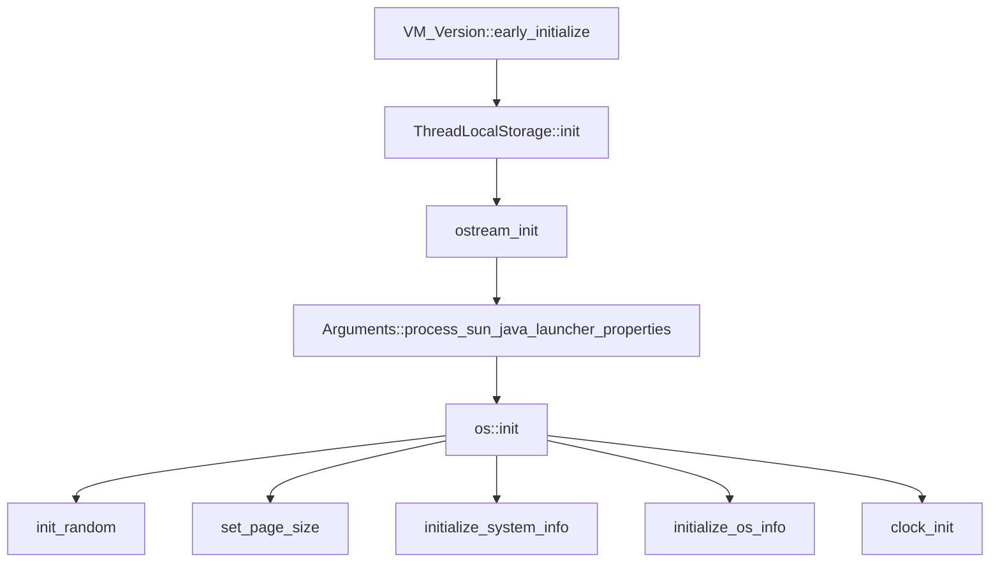
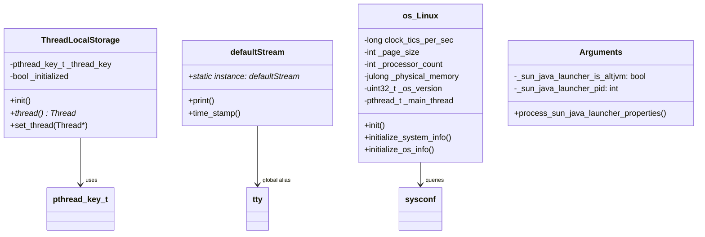

# Phase 1: 基础环境初始化深度解析

> 基于 OpenJDK 11 源码分析
> 位置：`thread.cpp:3876-3915`

---

## 第 0 部分：核心原理

### 0.1 本质是什么？

Phase 1 是 JVM 启动的**最底层基础设施准备阶段**，目标是建立 JVM 运行所需的最小操作系统级环境。

### 0.2 为什么需要？

JVM 是一个运行在操作系统之上的虚拟机，它依赖以下底层能力：
- **获取当前线程**：每个线程需要能获取自己的 Thread 对象（TLS）
- **输出日志**：错误报告、调试信息需要输出通道
- **感知硬件能力**：CPU 数量、内存大小决定 JVM 的默认配置
- **系统调用准备**：时钟、随机数、信号处理等机制需要预初始化

**如果不做这些准备**：后续阶段会崩溃或无法正常工作。

### 0.3 怎么解决？

核心思路：**从操作系统获取必要信息，建立 JVM 与 OS 的桥梁**。

关键设计：
1. **TLS 预初始化**：用 `pthread_key_create` 创建线程私钥
2. **流系统初始化**：创建 `defaultStream` 单例，建立输出通道
3. **启动器属性处理**：解析 `sun.java.launcher.*` 参数
4. **OS 信息采集**：通过 `sysconf()` 获取 CPU/内存/页大小

### 0.4 为什么这样设计？

**为什么先初始化 TLS？**
→ 后续代码需要 `Thread::current()` 来获取当前线程，TLS 是根基。

**为什么 os::init() 放在后面？**
→ TLS 和流系统必须在 OS 初始化前完成，否则 OS 初始化出错时无法报告。

**为什么是 sysconf() 而不是直接读取 /proc？**
→ `sysconf()` 是标准 POSIX 接口，跨平台兼容性更好。

---

## 第 1 部分：数据结构全景

### 1.1 数据结构清单

| 结构/变量 | 类型 | 源码位置 | 核心作用 |
|-----------|------|----------|----------|
| `_thread_key` | `pthread_key_t` | `threadLocalStorage_posix.cpp:28` | TLS 私钥，线程访问自身 Thread 对象的钥匙 |
| `defaultStream::instance` | `defaultStream*` | `ostream.cpp` | 全局输出流单例 |
| `tty` | `outputStream*` | `ostream.cpp` | 全局输出流指针别名 |
| `clock_tics_per_sec` | `long` | `os_linux.cpp` | 内核时钟频率（用于时间计算） |
| `_rand_seed` | `unsigned` | `os.cpp` | 随机数种子（固定值 1234567） |
| `_page_size` | `int` | `os_linux.cpp` | 系统内存页大小（通常是 4KB） |
| `_processor_count` | `int` | `os_linux.cpp` | 处理器核心数 |
| `_physical_memory` | `julong` | `os_linux.cpp` | 物理内存总大小 |
| `_os_version` | `uint32_t` | `os_linux.cpp` | Linux 内核版本号 |

### 1.2 关键数据结构详解

#### 1.2.1 pthread_key_t（TLS 私钥）

```cpp
// threadLocalStorage_posix.cpp:28
static pthread_key_t _thread_key;
```

**是什么**：POSIX 线程本地存储的私钥句柄。

**为什么需要**：
- JVM 中每个 OS 线程对应一个 `JavaThread` 对象
- 线程需要随时获取自己的 `JavaThread` 对象（如 `Thread::current()`）
- 使用 TLS 实现 O(1) 复杂度的线程自引用

**怎么用**：
```cpp
// 存储：pthread_setspecific(_thread_key, thread_ptr);
// 读取：Thread* t = (Thread*)pthread_getspecific(_thread_key);
```

**创建位置**：`ThreadLocalStorage::init()`

---

#### 1.2.2 defaultStream（全局输出流）

```cpp
// ostream.hpp
class defaultStream : public xmlTextStream {
  static defaultStream* instance;  // 单例
};

outputStream* tty = NULL;  // 全局别名
```

**是什么**：JVM 的全局标准输出流，单例模式。

**为什么需要**：
- JVM 需要输出日志、错误报告、GC 日志等
- 必须在最早阶段初始化，否则出错时无法输出
- 支持重定向到文件（`-Xlog` 参数）

**创建位置**：`ostream_init()` 中通过 `new` 在 C 堆上分配

```cpp
// ostream.cpp:921
defaultStream::instance = new(ResourceObj::C_HEAP, mtInternal) defaultStream();
tty = defaultStream::instance;
```

---

#### 1.2.3 OS 信息采集变量

| 变量 | 获取方式 | 典型值 | 用途 |
|------|----------|--------|------|
| `clock_tics_per_sec` | `sysconf(_SC_CLK_TCK)` | 100 | 将内核 tick 转换为秒 |
| `_page_size` | `sysconf(_SC_PAGESIZE)` | 4096 | 内存分配对齐、卡表计算 |
| `_processor_count` | `sysconf(_SC_NPROCESSORS_CONF)` | 8 | 并行 GC 线程数默认依据 |
| `_physical_memory` | `sysconf(_SC_PHYS_PAGES) * _page_size` | 32GB | 堆大小自动调优依据 |
| `_os_version` | `uname()` + 解析 | 0x05040000 (5.4.0) | 内核特性判断 |

---

## 第 2 部分：算法/流程分析

### 2.1 Phase 1 整体流程



### 2.2 各步骤详细分析

#### 2.2.1 VM_Version::early_initialize()

```cpp
// abstract_vm_version.hpp:96
static void early_initialize() { }
```

**解决什么问题**：留给特定平台做 CPU 特性预初始化。

**实际情况**：x86 平台是空函数，无操作。某些嵌入式平台可能在这里检测 CPU 特性。

---

#### 2.2.2 ThreadLocalStorage::init()

```cpp
// threadLocalStorage_posix.cpp:51-58
void ThreadLocalStorage::init() {
  assert(!_initialized, "initializing TLS more than once!");
  int rslt = pthread_key_create(&_thread_key, restore_thread_pointer);
  assert_status(rslt == 0, rslt, "pthread_key_create");
  _initialized = true;
}
```

**解决什么问题**：创建 TLS 私钥，让每个线程能存储和获取自己的 `Thread*` 指针。

**核心调用**：
```cpp
pthread_key_create(&_thread_key, restore_thread_pointer);
```

**参数说明**：
- `_thread_key`：输出的私钥句柄
- `restore_thread_pointer`：线程退出时的析构函数（防止 JNI 代码导致的崩溃）

**使用场景**：
```cpp
// 线程创建时设置
ThreadLocalStorage::set_thread(java_thread);

// 任意时刻获取当前线程
Thread* current = ThreadLocalStorage::thread();  // 内部调用 pthread_getspecific
```

**设计决策**：
- **为什么用 pthread TLS 而不是 ThreadLocal 变量？** → C++ 线程本地存储在动态库中行为不一致，POSIX TLS 更可靠。
- **为什么需要 restore_thread_pointer 析构函数？** → 防止 JNI 代码设置了自己的析构函数导致 JVM 崩溃。

---

#### 2.2.3 ostream_init()

```cpp
// ostream.cpp:918-930
void ostream_init() {
  if (defaultStream::instance == NULL) {
    defaultStream::instance = new(ResourceObj::C_HEAP, mtInternal) defaultStream();
    tty = defaultStream::instance;
    tty->time_stamp().update_to(1);
  }
}
```

**解决什么问题**：建立 JVM 的输出通道。

**关键点**：
- `new(ResourceObj::C_HEAP, mtInternal)`：使用 C 堆分配（而非 Java 堆）
- `mtInternal`：内存追踪标记，用于 NMT（Native Memory Tracking）
- `tty`：全局别名，后续代码通过 `tty->print()` 输出

**时间戳初始化**：
```cpp
tty->time_stamp().update_to(1);
```
确保 GC 日志等时间戳从 JVM 启动开始计算，而非第一次调用时间函数。

---

#### 2.2.4 Arguments::process_sun_java_launcher_properties()

```cpp
// arguments.cpp:358-383
void Arguments::process_sun_java_launcher_properties(JavaVMInitArgs* args) {
  for (int index = 0; index < args->nOptions; index++) {
    const JavaVMOption* option = args->options + index;
    const char* tail;

    if (match_option(option, "-Dsun.java.launcher=", &tail)) {
      process_java_launcher_argument(tail, option->extraInfo);
      continue;
    }
    if (match_option(option, "-Dsun.java.launcher.is_altjvm=", &tail)) {
      if (strcmp(tail, "true") == 0) {
        _sun_java_launcher_is_altjvm = true;
      }
      continue;
    }
    if (match_option(option, "-Dsun.java.launcher.pid=", &tail)) {
      _sun_java_launcher_pid = atoi(tail);
      continue;
    }
  }
}
```

**解决什么问题**：识别启动器类型（java/javaw/jspawnhelper）。

**处理的属性**：
| 属性 | 示例值 | 用途 |
|------|--------|------|
| `sun.java.launcher` | `SUN_STANDARD` | 标识启动器类型 |
| `sun.java.launcher.is_altjvm` | `true/false` | 是否使用替代 JVM |
| `sun.java.launcher.pid` | `12345` | 启动器进程 PID |

**为什么重要**：
- 影响后续系统属性的设置
- 决定错误报告的格式
- 某些平台特定逻辑依赖启动器类型

---

#### 2.2.5 os::init()

```cpp
// os_linux.cpp:5770-5817
void os::init(void) {
  char dummy;
  
  // 1. 获取内核时钟频率
  clock_tics_per_sec = sysconf(_SC_CLK_TCK);
  
  // 2. 初始化随机数种子
  init_random(1234567);
  
  // 3. 获取内存页大小（通常是 4KB）
  Linux::set_page_size(sysconf(_SC_PAGESIZE));
  init_page_sizes((size_t) Linux::page_size());
  
  // 4. 获取处理器数量和物理内存
  Linux::initialize_system_info();
  
  // 5. 获取内核版本
  Linux::initialize_os_info();
  
  // 6. 保存主线程 ID
  Linux::_main_thread = pthread_self();
  
  // 7. 初始化时钟
  Linux::clock_init();
  initial_time_count = javaTimeNanos();
  
  // 8. 获取 pthread_setname_np 函数指针
  Linux::_pthread_setname_np = 
    (int (*)(pthread_t, const char *)) dlsym(RTLD_DEFAULT, "pthread_setname_np");
  
  // 9. 检查 PaX/grsecurity
  check_pax();
  
  // 10. POSIX 通用初始化
  os::Posix::init();
}
```

**核心系统调用分析**：

| 调用 | 系统调用 | 用途 |
|------|----------|------|
| `sysconf(_SC_CLK_TCK)` | sysconf | 获取内核时钟频率（通常 100Hz） |
| `sysconf(_SC_PAGESIZE)` | sysconf | 获取内存页大小（通常 4096） |
| `sysconf(_SC_NPROCESSORS_CONF)` | sysconf | 获取配置的逻辑 CPU 数 |
| `sysconf(_SC_PHYS_PAGES)` | sysconf | 获取物理内存页数量 |
| `uname()` | uname | 获取内核版本信息 |
| `pthread_self()` | pthread | 获取当前线程 ID |
| `dlsym()` | dlopen | 动态获取 pthread_setname_np |

**initialize_system_info() 详解**：

```cpp
// os_linux.cpp:404-422
void os::Linux::initialize_system_info() {
  // 获取处理器数量
  set_processor_count(sysconf(_SC_NPROCESSORS_CONF));
  
  // 单核时检查是否在 chroot 环境
  if (processor_count() == 1) {
    // 检查 /proc/{pid} 是否可访问
  }
  
  // 计算物理内存大小
  _physical_memory = (julong) sysconf(_SC_PHYS_PAGES) 
                   * (julong) sysconf(_SC_PAGESIZE);
}
```

**为什么需要这些信息**：
- **处理器数量**：决定并行 GC 线程数、编译线程数
- **物理内存**：堆大小自动调优的依据（`-XX:+UseAutoHeapSizing`）
- **页大小**：卡表（CardTable）计算的基础（每页对应一个卡）
- **内核版本**：某些特性需要特定内核版本（如容器支持）

---

## 第 3 部分：数据结构关系图



---

## 第 4 部分：总结

### 4.1 数据结构层面

| 结构 | 核心特征 | 生命周期 |
|------|----------|----------|
| TLS 私钥 | `pthread_key_t`，进程级唯一 | 初始化一次，进程结束销毁 |
| defaultStream | C 堆分配，单例模式 | 启动时创建，退出时销毁 |
| OS 信息变量 | 基本类型，全局存储 | 初始化后只读 |

### 4.2 算法层面

| 函数 | 核心设计决策 |
|------|--------------|
| `TLS::init()` | 用 POSIX TLS 而非 C++ thread_local（兼容性） |
| `ostream_init()` | 单例模式，C 堆分配，NMT 追踪 |
| `os::init()` | 批量 `sysconf()` 查询，缓存结果避免重复系统调用 |

### 4.3 Phase 1 核心要点

1. **最底层准备**：Phase 1 是 JVM 的地基，所有后续阶段依赖它建立的基础设施
2. **零依赖设计**：Phase 1 的函数只能使用 OS 提供的原始能力，不能依赖 JVM 的其他子系统
3. **失败即终止**：任何一步失败都会导致 JVM 启动失败（没有容错空间）
4. **信息收集为主**：Phase 1 主要是"感知环境"而非"构建功能"

### 4.4 相关 JVM 参数

```bash
# 查看 Phase 1 相关的系统信息
java -XshowSettings:os -version

# 输出示例：
# os.arch = amd64
# os.name = Linux
# os.version = 5.4.0
# availableProcessors = 8
# maxMemory = 8589934592
```

---

## 附录：Phase 1 调用链（简化）

```
Threads::create_vm()
├── VM_Version::early_initialize()     [x86: 空函数]
├── ThreadLocalStorage::init()
│   └── pthread_key_create()           [POSIX]
├── ostream_init()
│   └── new defaultStream()            [C_HEAP]
├── Arguments::process_sun_java_launcher_properties()
│   └── 遍历 args 解析 -Dsun.java.launcher.*
└── os::init()
    ├── sysconf(_SC_CLK_TCK)           [时钟频率]
    ├── init_random(1234567)           [随机种子]
    ├── sysconf(_SC_PAGESIZE)          [页大小]
    ├── initialize_system_info()
    │   ├── sysconf(_SC_NPROCESSORS_CONF)  [CPU数]
    │   └── sysconf(_SC_PHYS_PAGES)        [内存页数]
    ├── initialize_os_info()
    │   └── uname()                    [内核版本]
    ├── pthread_self()                 [主线程ID]
    └── clock_init()                   [高精度时钟]
```
