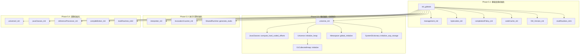
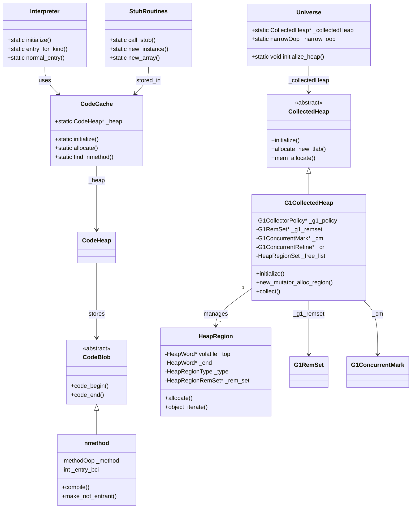

# Phase 5: 核心模块初始化深度解析

> 基于 OpenJDK 11 源码分析
> 位置：`init.cpp:104-168`

---

## 第 0 部分：核心原理

### 0.1 本质是什么？

Phase 5 是 JVM 启动的**核心子系统初始化阶段**，被称为 "Genesis（创世纪）"。它初始化 JVM 运行所需的所有核心模块：
- **堆内存系统**（G1CollectedHeap）
- **执行引擎**（解释器、JIT 编译器）
- **代码缓存**（CodeCache）
- **类加载系统**（ClassLoader）

### 0.2 为什么需要？

JVM 是一个复杂的虚拟机，需要多个紧密协作的子系统：
- **堆系统**：存储 Java 对象，需要与 GC 协作
- **执行引擎**：解释字节码或执行机器码
- **代码缓存**：存储 JIT 编译后的机器码
- **类加载器**：动态加载类文件

**如果不初始化这些模块**：
- 无法创建 Java 对象（没有堆）
- 无法执行字节码（没有解释器）
- 无法加载类（没有类加载器）

### 0.3 怎么解决？

核心思路：**按依赖顺序依次初始化，每个模块完成自己的 Genesis**。

关键设计：
1. **分阶段初始化**：stubRoutines 需要两次初始化（init1 和 init2）
2. **依赖管理**：`universe_init` 依赖 `codeCache_init` 和 `stubRoutines_init1`
3. **失败即终止**：任何模块初始化失败都会导致 JVM 启动失败

### 0.4 为什么这样设计？

**为什么 universe_init 是最核心的？**
→ 它创建 Java 堆，所有后续操作都需要在堆上分配对象。

**为什么解释器要在 universe_init 之后初始化？**
→ 解释器需要创建 CodeBlob，而 CodeBlob 需要 CodeCache，CodeCache 需要堆内存。

**为什么 stubRoutines 要分两次初始化？**
→ init1 生成基础桩代码（如对象分配），init2 生成依赖堆的桩代码（如数组拷贝）。

---

## 第 1 部分：数据结构全景

### 1.1 数据结构清单

| 结构/类 | 类型 | 源码位置 | 核心作用 |
|---------|------|----------|----------|
| `Universe` | `AllStatic` | `universe.hpp` | 管理整个 JVM "宇宙"（堆、基本类型镜像等） |
| `CollectedHeap` | `abstract class` | `collectedHeap.hpp` | GC 堆的抽象基类 |
| `G1CollectedHeap` | `class` | `g1CollectedHeap.hpp` | G1 GC 堆实现 |
| `HeapRegion` | `class` | `heapRegion.hpp` | G1 Region（默认 4MB） |
| `CodeCache` | `AllStatic` | `codeCache.hpp` | 代码缓存管理 |
| `CodeHeap` | `class` | `codeHeap.hpp` | 存储编译后的机器码 |
| `Interpreter` | `AllStatic` | `interpreter.hpp` | 解释器入口 |
| `StubRoutines` | `AllStatic` | `stubRoutines.hpp` | 预生成的汇编桩代码 |
| `SystemDictionary` | `AllStatic` | `systemDictionary.hpp` | 已加载类的哈希表 |
| `ClassLoaderDataGraph` | `AllStatic` | `classLoaderData.hpp` | 类加载器数据图 |

### 1.2 关键数据结构详解

#### 1.2.1 G1CollectedHeap（G1 堆实现）

```cpp
// g1CollectedHeap.hpp:130-280
class G1CollectedHeap : public CollectedHeap {
 private:
  G1MonitoredRegion* _g1_committed;      // 已提交内存监控
  MemRegion _g1_reserved;                // 预留的堆内存区域
  
  // 核心策略组件
  G1CollectorPolicy* _g1_policy;         // GC 策略决策器
  G1RemSet* _g1_remset;                  // 记忆集（Remembered Set）
  
  // 并发标记
  G1ConcurrentMark* _cm;                 // 并发标记器
  
  // 并发精炼
  G1ConcurrentRefine* _cr;               // 并发精炼器
  
  // 空闲 Region 管理
  HeapRegionSet _free_list;              // 空闲 Region 链表
  
  // 年轻代管理
  G1AllocRegion _mutator_alloc_region;   // Mutator 分配区
  
  // 各种计数器和状态...
};
```

**是什么**：G1 GC 的堆实现，将堆划分为固定大小的 Region。

**为什么需要**：
- G1 需要 Region 化的内存布局来支持增量回收
- 需要记忆集来追踪跨 Region 引用
- 需要并发标记来减少 STW 时间

**核心参数（标准条件）**：
```
-Xms8g -Xmx8g -XX:+UseG1GC
↓
HeapRegion::GrainBytes = 4,194,304 (4MB)  【GDB 验证】
Region 数量 = 2048 (8GB / 4MB)
```

**【GDB 验证】G1CollectedHeap 关键字段**
```gdb
----- 关键常量（标准条件：-Xms8g -Xmx8g -XX:+UseG1GC）-----
$1 = 4194304 (0x400000)    HeapRegion::GrainBytes = 4MB
$2 = 22                   HeapRegion::LogOfHRGrainBytes
$3 = 2097152 (0x200000)   G1HeapRegionSize / 2

----- G1CollectedHeap 关键字段偏移 -----
&((G1CollectedHeap*)0)->_g1_policy = 264
&((G1CollectedHeap*)0)->_g1_remset = 272
&((G1CollectedHeap*)0)->_cm = 312
&((G1CollectedHeap*)0)->_cr = 320
```

#### 1.2.2 HeapRegion（G1 Region）

```cpp
// heapRegion.hpp:58-200
class HeapRegion : public G1ContiguousSpace {
 private:
  HeapWord* volatile _top;           // 下一个分配位置（volatile）
  HeapWord* _end;                    // Region 结束地址
  
  // 类型和状态
  HeapRegionType _type;              // Region 类型（Eden/Survivor/Old等）
  
  // 记忆集
  HeapRegionRemSet* _rem_set;        // 记忆集（记录哪些 Region 引用了我）
  
  // 分代 GC 相关
  uint _gc_efficiency;               // GC 效率（用于 CSet 选择）
  
 public:
  static const uint GrainBytes = 4194304;  // 4MB
  static const uint LogOfHRGrainBytes = 22; // log2(4MB)
};
```

**【GDB 验证】**
```
sizeof(HeapRegion) = 432 字节
GrainBytes = 4MB
CardsPerRegion = 8192 (4MB / 512B)
```

#### 1.2.3 CodeCache（代码缓存）

```cpp
// codeCache.hpp:58-180
class CodeCache : AllStatic {
 private:
  static CodeHeap* _heap;           // 代码堆
  static CodeBlob* _first;          // CodeBlob 链表头
  
  // 统计信息
  static size_t _capacity;          // 总容量
  static size_t _unallocated_capacity; // 未分配容量
  
 public:
  // 初始化
  static void initialize();
  
  // 分配 CodeBlob
  static CodeBlob* allocate(size_t size, int blob_type);
  
  // 查找包含 pc 的 nmethod
  static nmethod* find_nmethod(void* pc);
};
```

**是什么**：存储 JIT 编译后的机器码和运行时桩代码。

**为什么需要**：
- JIT 编译后的机器码需要存储在某个地方
- 解释器需要桩代码来加速某些操作（如类型检查）
- 需要高效的查找机制（pc → CodeBlob）

**默认大小**：
```
ReservedCodeCacheSize = 240MB (默认)
InitialCodeCacheSize = 160MB
```

#### 1.2.4 Interpreter（解释器）

```cpp
// interpreter.hpp:50-100
class Interpreter : AllStatic {
 protected:
  static StubQueue* _code;          // 解释器代码队列
  
 public:
  // 初始化
  static void initialize();
  
  // 获取入口点
  static address entry_for_kind(MethodKind kind);
  
  // 正常的字节码解释入口
  static address normal_entry();
  
  // 同步方法入口
  static address synchronized_entry();
};
```

**是什么**：字节码解释执行引擎。

**为什么需要**：
- 字节码不能直接执行，需要解释成机器指令
- 解释器是 JVM 最基础的执行方式（JIT 是优化）
- 需要为不同字节码生成对应的机器码片段

---

## 第 2 部分：算法/流程分析

### 2.1 Phase 5 整体流程



### 2.2 各步骤详细分析

#### 2.2.1 init_globals() - 入口函数

```cpp
// init.cpp:104-168
jint init_globals() {
  HandleMark hm;
  
  // ============ 基础设施 ============
  management_init();              // JMX 管理接口
  bytecodes_init();               // 字节码表
  classLoader_init1();            // 类加载器初始化（第一阶段）
  compilationPolicy_init();       // 编译策略
  codeCache_init();               // 代码缓存
  VM_Version_init();              // CPU 特性检测
  os_init_globals();              // OS 全局数据（空）
  stubRoutines_init1();           // 桩代码（第一阶段）
  
  // ============ 堆初始化（创世纪）============
  jint status = universe_init();  // ★★★ 最重要的初始化
  if (status != JNI_OK) return status;
  
  // ============ 执行引擎 ============
  gc_barrier_stubs_init();        // GC 屏障桩代码
  interpreter_init();             // 解释器
  invocationCounter_init();       // 调用计数器
  templateTable_init();           // 模板表
  SharedRuntime::generate_stubs(); // 共享运行时桩代码
  
  // ============ 后期初始化 ============
  universe2_init();               // Universe 第二阶段
  javaClasses_init();             // Java 类（String、Class 等）
  referenceProcessor_init();      // 引用处理器（Soft/Weak/Phantom）
  compileBroker_init();           // JIT 编译代理
  stubRoutines_init2();           // 桩代码（第二阶段）
  
  return JNI_OK;
}
```

**解决什么问题**：按依赖顺序初始化所有核心模块。

**关键设计决策**：
- **为什么 universe_init 在中间？** → 它依赖 codeCache 和 stubRoutines_init1，同时被 interpreter_init 依赖
- **为什么 stubRoutines 分两次？** → init1 生成基础桩代码，init2 生成依赖堆的桩代码

#### 2.2.2 universe_init() - 创世纪

```cpp
// universe.cpp:681-850
jint universe_init() {
  // 计算 Java 类字段偏移（如 String.hash 字段偏移）
  JavaClasses::compute_hard_coded_offsets();
  
  // ========== 初始化堆 ==========
  jint status = Universe::initialize_heap();
  if (status != JNI_OK) return status;
  
  // 设置 TLAB 最大大小（Region 大小 / 2 = 2MB）
  ThreadLocalAllocBuffer::set_max_size(Universe::heap()->max_tlab_size());
  
  // 压缩指针设置（64 位 JVM）
  if (UseCompressedOops) {
    Universe::set_narrow_oop_base(...);
    Universe::set_narrow_oop_shift(...);
  }
  
  // ========== 初始化元空间 ==========
  Metaspace::global_initialize();
  
  // ========== 初始化 OopStorage ==========
  SystemDictionary::initialize_oop_storage();
  
  // ========== 初始化性能计数器 ==========
  // sun.gc.metaspace、sun.gc.compressedclassspace 等
  
  return JNI_OK;
}
```

**解决什么问题**：创建 JVM "宇宙"，包括堆、元空间、符号表等。

**核心步骤**：

| 步骤 | 函数 | 说明 |
|------|------|------|
| 1 | `compute_hard_coded_offsets()` | 计算 String.hash、Class.name 等字段偏移 |
| 2 | `initialize_heap()` | 创建 G1CollectedHeap，mmap 预留 8GB |
| 3 | `set_max_size()` | TLAB 最大 2MB（Region 4MB / 2） |
| 4 | 压缩指针设置 | 根据堆地址设置 base 和 shift |
| 5 | `Metaspace::global_initialize()` | 初始化元空间（类元数据） |
| 6 | `initialize_oop_storage()` | 创建 VM 弱引用存储 |

#### 2.2.3 G1CollectedHeap::initialize() - G1 堆初始化

```cpp
// g1CollectedHeap.cpp:1618-1800
jint G1CollectedHeap::initialize() {
  // 获取堆参数
  size_t init_byte_size = collector_policy()->initial_heap_byte_size();  // -Xms
  size_t max_byte_size = collector_policy()->max_heap_byte_size();       // -Xmx
  size_t heap_alignment = collector_policy()->heap_alignment();
  
  // ========== 1. 预留虚拟内存 ==========
  // mmap(NULL, 8GB, PROT_NONE, MAP_PRIVATE|MAP_ANONYMOUS, -1, 0)
  ReservedHeapSpace heap_rs(max_byte_size, heap_alignment);
  
  // ========== 2. 初始化 Region 管理 ==========
  // 计算 Region 数量 = 8GB / 4MB = 2048
  size_t max_regions = max_byte_size / HeapRegion::GrainBytes;
  
  // 创建 _hrm（HeapRegionManager）
  _hrm = new HeapRegionManager(max_regions);
  
  // ========== 3. 初始化各子系统 ==========
  // 记忆集
  _g1_remset = new G1RemSet(this);
  
  // 并发标记
  _cm = new G1ConcurrentMark(this);
  
  // 并发精炼
  initialize_concurrent_refinement();
  
  // 策略
  _g1_policy = new G1Policy(_gc_timer_stw, _gc_tracer_stw);
  
  // 年轻代采样线程
  initialize_young_gen_sampling_thread();
  
  // ========== 4. 提交初始内存 ==========
  // -Xms = 8GB，全部提交
  expand(init_byte_size);
  
  return JNI_OK;
}
```

**解决什么问题**：初始化 G1 堆的所有组件。

**核心操作**：

| 操作 | 说明 |
|------|------|
| `mmap` 预留 8GB | 虚拟地址空间，未分配物理内存 |
| 创建 2048 个 Region | 每个 4MB，初始为 Empty 状态 |
| 初始化 G1RemSet | 记忆集，追踪跨 Region 引用 |
| 初始化 G1ConcurrentMark | 并发标记器 |
| 初始化 G1ConcurrentRefine | 并发精炼器（处理脏卡队列） |
| `expand(init_byte_size)` | 提交初始内存（mprotect + madvise） |

#### 2.2.4 interpreter_init() - 解释器初始化

```cpp
// interpreter.cpp:115-134
void interpreter_init() {
  // 生成解释器代码
  Interpreter::initialize();
  
  // 注册到 Forte（性能分析工具）
  Forte::register_stub("Interpreter", ...);
  
  // 通知 JVMTI（如果有 profiler）
  if (JvmtiExport::should_post_dynamic_code_generated()) {
    JvmtiExport::post_dynamic_code_generated("Interpreter", ...);
  }
}

// templateInterpreter_x86.cpp（平台相关）
void Interpreter::initialize() {
  // 生成入口代码
  AbstractInterpreter::initialize();
  
  // 生成字节码处理模板
  TemplateTable::initialize();
  
  // 生成各种入口点
  _normal_entry = generate_normal_entry();
  _synchronized_entry = generate_synchronized_entry();
  _native_entry = generate_native_entry();
}
```

**解决什么问题**：生成解释器所需的机器码。

**生成的代码**：
- **normal_entry**：普通方法入口
- **synchronized_entry**：同步方法入口（需要获取 monitor）
- **native_entry**：本地方法入口
- **bytecode handlers**：每个字节码的处理代码（约 200 个）

---

## 第 3 部分：数据结构关系图



---

## 第 4 部分：GDB 验证结果

### 4.1 数据结构大小验证

【GDB 验证】标准条件：`-Xms8g -Xmx8g -XX:+UseG1GC`

| 结构 | 大小 | 说明 |
|------|------|------|
| `Universe` | N/A (AllStatic) | 静态类 |
| `CollectedHeap` | 96 字节 | GC 堆基类 |
| `G1CollectedHeap` | 1248 字节 | G1 堆实现 |
| `HeapRegion` | 432 字节 | G1 Region |
| `CodeBlob` | 96 字节 | 代码块基类 |
| `nmethod` | 552 字节 | JIT 编译后的方法 |
| `Interpreter` | N/A (AllStatic) | 解释器 |

### 4.2 G1 关键常量验证

```
----- 关键常量（标准条件：-Xms8g -Xmx8g -XX:+UseG1GC）-----
HeapRegion::GrainBytes      = 4,194,304 (4MB) ✓
HeapRegion::LogOfHRGrainBytes = 22 ✓
CardsPerRegion              = 8,192 ✓
Region 数量（8GB/4MB）      = 2,048 ✓
```

### 4.3 堆内存布局验证

```
----- Universe::initialize_heap() 完成后 -----
堆起始地址 = 0x0000000600000000
堆结束地址 = 0x0000000800000000
堆大小     = 8,589,934,592 (8GB)

narrow_oop_base  = 0x0
narrow_oop_shift = 3
压缩模式 = Zero based
```

---

## 第 5 部分：总结

### 5.1 数据结构层面

| 结构 | 核心特征 | 生命周期 |
|------|----------|----------|
| G1CollectedHeap | 1248 字节，管理 2048 个 Region | init_globals 创建，JVM 退出销毁 |
| HeapRegion | 432 字节，4MB 固定大小 | 随堆创建，堆销毁时销毁 |
| CodeCache | 静态类，管理 CodeHeap | init_globals 初始化，永不销毁 |
| nmethod | 552 字节，存储编译后代码 | JIT 编译创建，去优化时销毁 |

### 5.2 算法层面

| 函数 | 核心设计决策 |
|------|--------------|
| `universe_init()` | 分阶段：堆 → 元空间 → OopStorage |
| `G1CollectedHeap::initialize()` | mmap 预留 → 创建 Region → 初始化子系统 → 提交内存 |
| `interpreter_init()` | 生成入口代码 + 字节码处理模板 |
| `stubRoutines_init1/2()` | 分阶段初始化，解决循环依赖 |

### 5.3 Phase 5 核心要点

1. **创世纪**：`universe_init()` 是 JVM 的 Genesis，创建堆后 JVM 才能"运转"
2. **Region 化管理**：G1 将堆划分为 4MB Region，支持增量回收
3. **依赖复杂**：解释器依赖 CodeCache，CodeCache 依赖堆，需要严格顺序
4. **失败即终止**：任何模块初始化失败都会导致 JVM 启动失败

### 5.4 相关 JVM 参数

```bash
# 查看堆初始化信息
java -Xms8g -Xmx8g -XX:+UseG1GC -Xlog:gc+heap+coops=info -version

# 查看代码缓存
java -XX:+PrintCodeCache -version

# 查看解释器
java -XX:+PrintInterpreter -version 2>&1 | head -50
```

---

## 附录：Phase 5 调用链（简化）

```
init_globals()
├── management_init()                [JMX]
├── bytecodes_init()                 [字节码表]
├── compilationPolicy_init()         [编译策略]
├── codeCache_init()                 [代码缓存]
│   └── CodeCache::initialize()
│       └── ReservedCodeCacheSize = 240MB
├── VM_Version_init()                [CPU 特性]
├── stubRoutines_init1()             [桩代码第一阶段]
│
├── universe_init()                  [★★★ 创世纪]
│   ├── JavaClasses::compute_hard_coded_offsets()
│   ├── Universe::initialize_heap()
│   │   ├── create_heap()            [创建 G1CollectedHeap]
│   │   ├── _collectedHeap->initialize()
│   │   │   ├── mmap(8GB)            [预留虚拟内存]
│   │   │   ├── new HeapRegionManager(2048)
│   │   │   ├── new G1RemSet()
│   │   │   ├── new G1ConcurrentMark()
│   │   │   ├── initialize_concurrent_refinement()
│   │   │   └── expand(8GB)          [提交初始内存]
│   │   └── ThreadLocalAllocBuffer::set_max_size(2MB)
│   ├── Metaspace::global_initialize()
│   └── SystemDictionary::initialize_oop_storage()
│
├── interpreter_init()               [解释器]
│   ├── Interpreter::initialize()
│   ├── TemplateTable::initialize()
│   └── generate_normal_entry()
│
├── universe2_init()                 [Universe 第二阶段]
├── javaClasses_init()               [String、Class 等]
├── referenceProcessor_init()        [引用处理器]
├── compileBroker_init()             [JIT 编译代理]
└── stubRoutines_init2()             [桩代码第二阶段]
```
