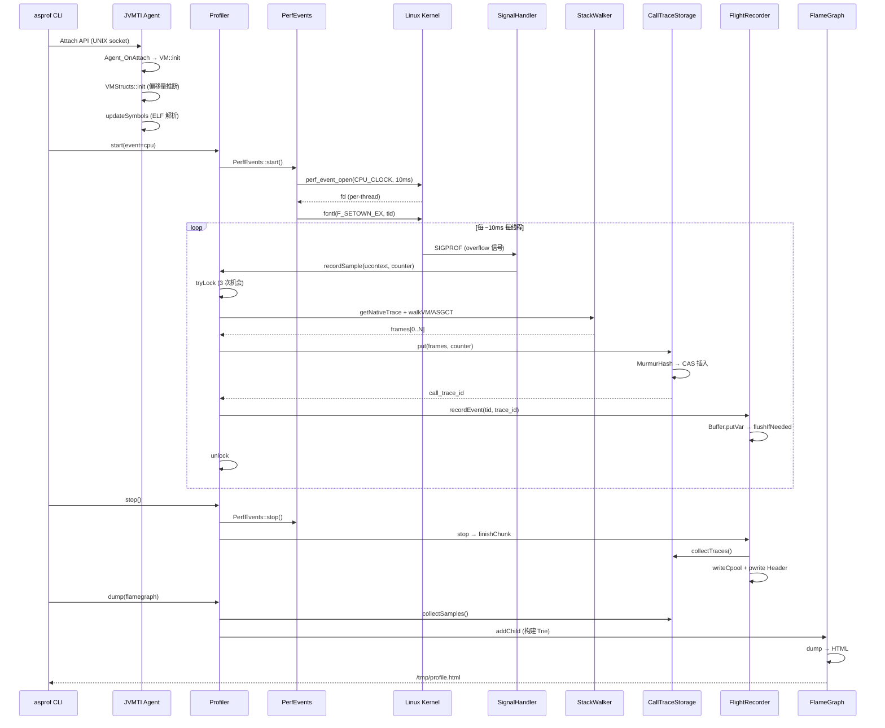

# 12.1 完整采样流程时序图 — 从 `asprof start` 到火焰图

> 本节是 async-profiler 源码分析系列的收尾章节（Part 12）
> 前置: Part 1-11 所有内容
> 目标: 将 11 个 Part 的知识串联成完整的数据流

---

## 核心问题

当用户执行 `asprof start -e cpu -f /tmp/profile.html <pid>` 时，从命令发出到最终打开火焰图 HTML，数据经历了哪些组件？每个组件做了什么？

---

## 一、全景数据流图

```
用户命令                            JVM 进程 (目标)
─────────                          ───────────────
asprof start -e cpu -f profile.html <pid>
    │
    ├─① Attach API: /tmp/.java_pid<pid>
    │   → UNIX socket → JVMTI Agent_OnAttach
    │
    ▼
┌─── JVMTI Agent 初始化 ──────────────────────────────────────────────────┐
│ Agent_OnAttach()                                                        │
│  ├── VM::init() → 获取 JNI 环境 + JVMTI 环境                           │
│  ├── AddCapabilities → 14 项能力                                        │
│  ├── SetEventCallbacks → 8 个回调                                       │
│  └── VMInit callback:                                                   │
│      ├── Hooks::init() → LD_PRELOAD / GOT Patch 双模式                  │
│      ├── VMStructs::init() → 偏移量推断（130+ 字段）                    │
│      └── Profiler::updateSymbols() → ELF 解析 + CodeCache 构建          │
└─────────────────────────────────────────────────────────────────────────┘
                    │
                    ▼
┌─── Profiler::start() ──────────────────────────────────────────────────┐
│  ├── ① 参数解析: _event_mask=EM_CPU, _cstack=CSTACK_VM               │
│  ├── ② 引擎选择: selectEngine("cpu") → PerfEvents                     │
│  ├── ③ 重置: _call_trace_storage.clear()                              │
│  ├── ④ 分配: _calltrace_buffer[16] (每个线程一份栈回溯缓冲区)          │
│  ├── ⑤ 符号更新: updateSymbols(true) → 内核符号 + 所有 .so 符号       │
│  ├── ⑥ Trap 安装: installTraps() → 分配断点(如果是 AllocTracer)       │
│  ├── ⑦ JFR 启动: _jfr.start() → 打开文件 → 写 Header + Metadata      │
│  ├── ⑧ 引擎启动: PerfEvents::start()                                  │
│  │   ├── perf_event_open(PERF_COUNT_SW_CPU_CLOCK, 10ms)               │
│  │   ├── 每个线程一个 fd → ioctl(PERF_EVENT_IOC_SET_OUTPUT, mmap_page)│
│  │   └── fcntl(fd, F_SETOWN_EX, tid) → 信号投递目标                   │
│  ├── ⑨ 其他引擎: WallClock/AllocTracer/LockTracer (如果启用)          │
│  ├── ⑩ 线程事件: switchThreadEvents(JVMTI_ENABLE)                     │
│  └── ⑪ _state = RUNNING, _start_time = now                            │
└────────────────────────────────────────────────────────────────────────┘
                    │
                    ▼
┌─── 采样循环 (信号驱动，持续 N 秒) ────────────────────────────────────┐
│                                                                        │
│  perf_event overflow → 内核投递 SIGPROF                                │
│      │                                                                 │
│      ▼                                                                 │
│  PerfEvents::signalHandler(signo, siginfo, ucontext)                   │
│      │                                                                 │
│      ├── readCounter(tid) → 从 mmap ring buffer 读取计数器值           │
│      │                                                                 │
│      ▼                                                                 │
│  Profiler::recordSample(ucontext, counter, PERF_SAMPLE, event)         │
│      │                                                                 │
│      ├─① tryLock: _locks[tid%16].tryLock() (3 次机会)                  │
│      │   → 失败: _failures++ → return                                  │
│      │                                                                 │
│      ├─② Native 栈回溯:                                               │
│      │   ├── CSTACK_DEFAULT/FP: walkFP() → FP-chain 遍历              │
│      │   ├── CSTACK_DWARF: walkDwarf() → DWARF CFI 解析               │
│      │   └── CSTACK_VM: StackWalker::walkVM() → VMStructs 直接读帧    │
│      │                                                                 │
│      ├─③ Java 栈回溯:                                                 │
│      │   ├── CSTACK_VM: (已包含 Java 帧，混合输出)                     │
│      │   └── 其他: getJavaTraceAsync() → AsyncGetCallTrace             │
│      │       → JVM 内部遍历解释器帧和编译帧                            │
│      │       → 不需要 Safepoint！                                      │
│      │                                                                 │
│      ├─④ 去重存储:                                                     │
│      │   _call_trace_storage.put(num_frames, frames, counter)          │
│      │   ├── MurmurHash64A(frames) → 64-bit hash                      │
│      │   ├── LongHashTable: CAS 开放寻址插入                           │
│      │   ├── LinearAllocator: CAS bump-pointer 分配 CallTrace          │
│      │   └── 返回 call_trace_id                                       │
│      │                                                                 │
│      ├─⑤ JFR 记录:                                                    │
│      │   _jfr.recordEvent(lock_index, tid, call_trace_id, ...)         │
│      │   ├── Buffer[lock_index].putVar(event_type, time, tid, ...)     │
│      │   └── flushIfNeeded → write(fd, buf, len) 到磁盘               │
│      │                                                                 │
│      └─⑥ unlock                                                       │
│                                                                        │
│  ← 重复每 ~10ms 对每个活跃线程采样一次 →                               │
│                                                                        │
└────────────────────────────────────────────────────────────────────────┘
                    │
                    ▼
┌─── Profiler::stop() ──────────────────────────────────────────────────┐
│  ├── ① uninstallTraps()                                               │
│  ├── ② 停止所有引擎: engine->stop(), wall_clock.stop(), ...           │
│  ├── ③ switchLibraryTrap(false)                                       │
│  ├── ④ updateThreadNames() → 获取最终线程名                           │
│  ├── ⑤ stopTimer()                                                    │
│  ├── ⑥ logStats() → 统计信息写入 JFR                                  │
│  ├── ⑦ lockAll() → 获取所有 16 把 SpinLock                            │
│  ├── ⑧ _jfr.stop() → finishChunk()                                   │
│  │   ├── flush 所有 Buffer                                             │
│  │   ├── writeCpool() → 写 Constant Pool (11 个子池)                   │
│  │   │   ├── collectTraces() → CallTraceStorage → map<id, trace>       │
│  │   │   ├── writeStackTraces() → Lookup::resolveMethod() → 帧解析    │
│  │   │   ├── writeMethods/Classes/Packages/Symbols → 符号池            │
│  │   │   └── writeThreads() → 线程名                                   │
│  │   └── pwrite() 回填 Header (chunk_size, cpool_offset)              │
│  └── ⑨ _state = IDLE                                                  │
└────────────────────────────────────────────────────────────────────────┘
                    │
                    ▼
┌─── Profiler::dump() → 导出 (非 JFR 格式时) ──────────────────────────┐
│                                                                        │
│  OUTPUT_FLAMEGRAPH → dumpFlameGraph(out, args)                         │
│      ├── ① collectSamples() → 从 CallTraceStorage 收集所有有效样本    │
│      ├── ② 构建 Trie (前缀树):                                        │
│      │   for each sample:                                              │
│      │       for each frame (栈顶→栈底):                               │
│      │           frameName.name(frame) → 解析帧名                      │
│      │           flamegraph.addChild(trie, name, type, counter)        │
│      ├── ③ 输出 HTML:                                                  │
│      │   flamegraph.dump(out, tree=false)                              │
│      │   ├── printCpool() → 前缀压缩的帧名常量池                       │
│      │   ├── DFS Trie → printFrame() → u()/n()/f() 增量编码           │
│      │   └── 嵌入 flame.html 模板                                      │
│      └── ④ 写入文件: /tmp/profile.html                                 │
│                                                                        │
│  OUTPUT_COLLAPSED → dumpCollapsed()                                    │
│      → 每行: "frameA;frameB;frameC count"                              │
│                                                                        │
│  OUTPUT_JFR → _jfr.flush() (实时输出，不需要额外 dump)                 │
│                                                                        │
└────────────────────────────────────────────────────────────────────────┘
                    │
                    ▼
        /tmp/profile.html → 浏览器打开 → 交互式火焰图
```

---

## 二、时序图 (Mermaid)



---

## 三、11 个 Part 在数据流中的位置

```
数据流阶段                   对应 Part              核心组件
─────────────────────────────────────────────────────────────────────
① Agent 加载               Part 1 (1.1-1.3)     vmEntry.cpp, VM, Hooks
② 偏移量推断               Part 2 (2.1-2.3)     VMStructs
③ 引擎选择                 Part 3 (3.1-3.2)     Engine 继承层次, Profiler 状态机
④ CPU 采样配置             Part 4 (4.1-4.3)     PerfEvents, CTimer, ITimer
⑤ 信号处理 + 栈回溯        Part 5 (5.1-5.5)     recordSample, ASGCT, walkFP/Dwarf/VM
⑥ WallClock 采样           Part 6 (6.1)         WallClock timerLoop
⑦ 分配追踪                 Part 7 (7.1-7.2)     AllocTracer, ObjectSampler
⑧ 锁追踪                   Part 8 (8.1-8.2)     LockTracer, NativeLockTracer
⑨ Hook/Malloc/Instrument   Part 9 (9.1-9.3)     Hooks, MallocTracer, Instrument
⑩ 符号解析                 Part 10 (10.1-10.2)  ELF Parser, CodeCache, FrameName
⑪ 存储/JFR/火焰图          Part 11 (11.1-11.3)  CallTraceStorage, FlightRecorder, FlameGraph
```

---

## 四、关键路径的性能指标

### 4.1 热路径：信号处理器内的操作

```
recordSample() 内的操作及其时间复杂度:
━━━━━━━━━━━━━━━━━━━━━━━━━━━━━━━━━━━━━━━━━━━━━━━━━━━━━━━
操作                          时间             约束
━━━━━━━━━━━━━━━━━━━━━━━━━━━━━━━━━━━━━━━━━━━━━━━━━━━━━━━
tryLock (SpinLock)            O(1) ~10ns       CAS 操作
readCounter (ring buffer)     O(1) ~50ns       mmap 内存读取
getNativeTrace (walkVM)       O(N) ~1-5μs      N = 帧数(20-40)
getJavaTraceAsync (ASGCT)     O(N) ~2-10μs     JVM 内部帧遍历
MurmurHash64A                 O(N) ~100ns      N = 帧数 × 16B
LongHashTable::put (CAS)      O(1) ~50ns       平均情况
LinearAllocator::alloc (CAS)  O(1) ~30ns       bump-pointer
JFR Buffer::put               O(1) ~200ns      LEB128 编码
flushIfNeeded (write)         O(1) ~1μs        仅在 buffer 满时
━━━━━━━━━━━━━━━━━━━━━━━━━━━━━━━━━━━━━━━━━━━━━━━━━━━━━━━
总计                          ~5-20μs/sample   ← 远小于 10ms 采样间隔
```

### 4.2 冷路径：stop/dump 阶段

```
stop() + dump(flamegraph) 内的操作:
━━━━━━━━━━━━━━━━━━━━━━━━━━━━━━━━━━━━━━━━━━━━━━━━━━━━━━━
操作                          时间             约束
━━━━━━━━━━━━━━━━━━━━━━━━━━━━━━━━━━━━━━━━━━━━━━━━━━━━━━━
collectTraces/collectSamples  O(N) ~1ms        N = 哈希表大小
JVMTI 解析帧名                O(M) ~100ms      M = 唯一方法数
构建 Trie                     O(S×F) ~10ms     S = 样本数, F = 平均帧数
DFS 输出 HTML                 O(T) ~5ms        T = Trie 节点数
写 Constant Pool (JFR)        O(M) ~50ms       M = 唯一方法数
━━━━━━━━━━━━━━━━━━━━━━━━━━━━━━━━━━━━━━━━━━━━━━━━━━━━━━━
总计                          ~100-500ms       ← 一次性开销，可接受
```

---

## 五、端到端 GDB 验证

### 5.1 Profiler::start 验证

```
=== Profiler::start ===                                              ✅
engine = cpu
cstack = 0 (CSTACK_DEFAULT → 自动选择 CSTACK_VM)
jstackdepth = 2048
CONCURRENCY_LEVEL = 16

→ 引擎选择: PerfEvents (event=cpu)
→ 默认栈深度: 2048 帧（远大于实际需要）
→ 16 路并发锁 + 16 个采样缓冲区
```

### 5.2 第一个采样

```
=== Profiler::recordSample (1st sample) ===                          ✅
event_type = 0 (PERF_SAMPLE)
counter = 10,020,917 ns ≈ 10ms

→ 第一个 CPU 采样在 ~10ms 后触发
→ counter 值与 perf_event_open 配置的 sample_period 一致
```

### 5.3 Profiler::stop 验证

```
=== Profiler::stop ===                                               ✅
_state = 2 (RUNNING → 正在运行中被停止)
_total_samples = 2 (GDB 调试环境下采样少量正常)
_engine = 0x7ffff7bf3a08 (PerfEvents 单例地址)

→ stop 后 _state 变为 IDLE
```

### 5.4 输出文件验证

```
JFR 输出:   /tmp/profile_e2e2.jfr   16,407 bytes
HTML 输出:  /tmp/profile_busy.html   21,987 bytes

Collapsed 格式示例（2 个采样，混合 Java + Native 帧）:
sun/launcher/LauncherHelper.checkAndLoadMain;...;Unsafe_CompareAndSetLong;assert_field_offset_sane;... 1
sun/launcher/LauncherHelper.checkAndLoadMain;...;SystemDictionary::resolve_or_null;...;Method::sort_methods;... 1

→ Java 帧（sun/launcher/...）和 Native 帧（SystemDictionary::...）无缝混合
→ 栈从栈底到栈顶排列，用分号分隔
→ 末尾数字是采样计数
```

---

## 六、数据流中的关键"信号安全"约束

整个热路径（信号处理器内）的操作必须满足以下约束：

| 约束 | 原因 | async-profiler 的解决方案 |
|------|------|--------------------------|
| **不能 malloc** | malloc 持有内部锁，信号处理器中调用会死锁 | LinearAllocator (CAS bump-pointer) |
| **不能 mutex** | mutex 可能被当前线程持有 → 自死锁 | SpinLock (tryLock 3 次) |
| **不能 printf** | printf 内部有 mutex | 完全不输出 |
| **不能 JVMTI 查询** | JVMTI 需要 Safepoint | AsyncGetCallTrace (异步) |
| **不能 mprotect** | 可能死锁 | 只在 start/stop 时设置 Trap |
| **不能 read/write(阻塞)** | 阻塞导致信号处理器不返回 | Buffer + flushIfNeeded (非阻塞写) |
| **不能 dlopen/dlclose** | dl 内部有 mutex | UnloadProtection (RAII) |

---

*创建日期: 2026-02-10*
*GDB 验证环境: OpenJDK 11 slowdebug + async-profiler v4.0*
