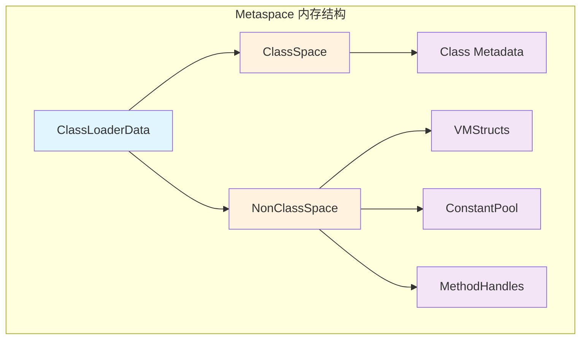
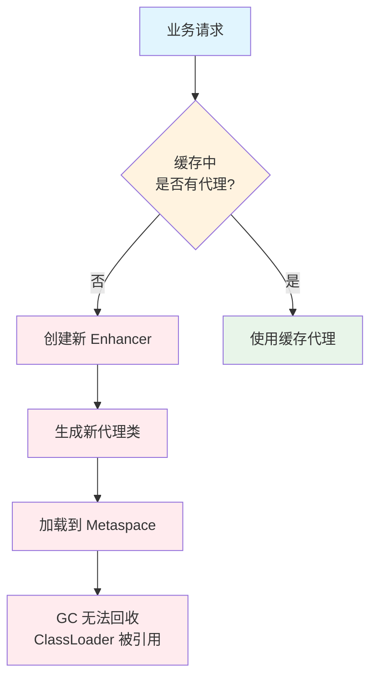
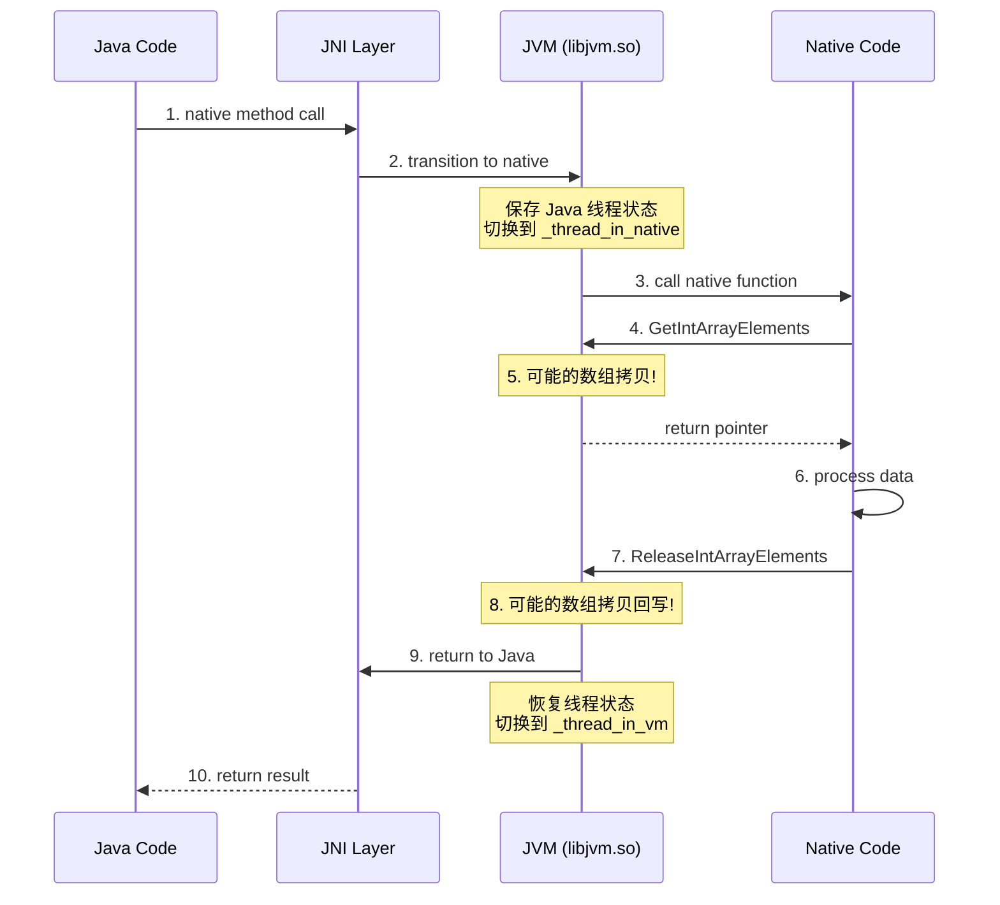
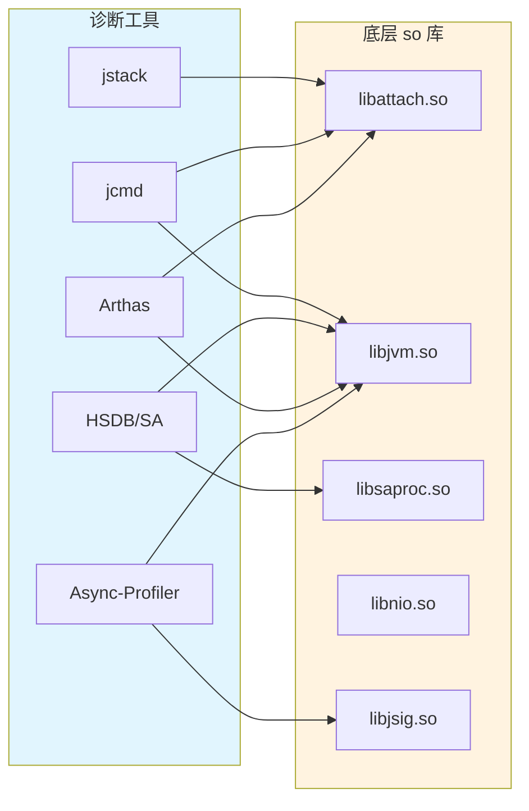
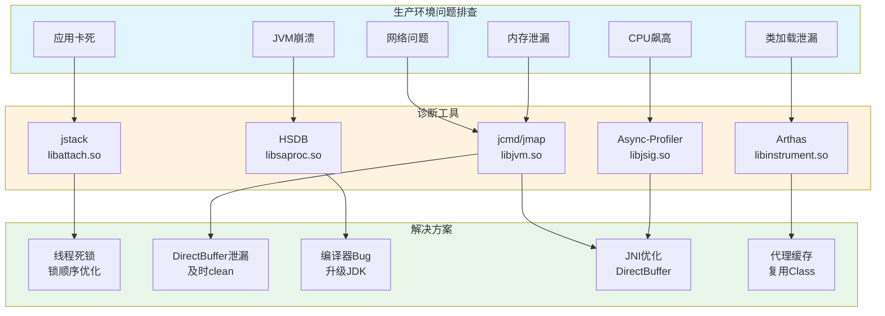

# 文档 6.1: JVM Native Libraries 综合实战案例整合

> **目标**: 将所有 so 库知识综合应用到实际生产环境排查  
> **案例覆盖**: libattach.so + libjvm.so + libnio.so + libsaproc.so + libjsig.so  
> **难度**: 专家级实战

---

## 案例 1: 使用 jstack 排查死锁的完整链路分析

### 1.1 问题场景

```
生产环境 Java 应用卡住，无响应。
日志停止输出，CPU 使用率正常(不高于 10%)。
需要快速诊断问题原因。
```

### 1.2 完整诊断流程

#### 步骤 1: 使用 jstack 触发线程 dump

```bash
$ jstack -l <pid> > threaddump.txt
```

**底层调用链路分析**:

```
jstack (Java 工具)
  │
  ├── VirtualMachine.attach(pid)
  │   │
  │   ├── 检查 /tmp/.java_pid<pid> (libattach.so)
  │   ├── 不存在 → 创建 .attach_pid<pid> 文件
  │   ├── 发送 SIGQUIT 给目标 JVM
  │   └── 等待 socket 文件创建
  │
  ├── 连接 Unix Domain Socket (/tmp/.java_pid<pid>)
  │
  ├── execute("threaddump", "-l")
  │   │
  │   └── 协议: "1\0threaddump\0-l\0\0\0"
  │
  └── 读取返回的线程 dump 数据
```

**源码对应** (attachListener_linux.cpp):
```cpp
// JVM 端接收命令
LinuxAttachListener::read_request(int s) {
    // 解析: <ver>\0<cmd>\0<arg>\0
    // ver = "1", cmd = "threaddump", arg = "-l"
}

// 分发命令
static AttachOperationFunctionInfo funcs[] = {
    { "threaddump", thread_dump },  // 对应函数
};

// 执行线程 dump
static jint thread_dump(AttachOperation* op, outputStream* out) {
    VM_PrintThreads op1(out, print_concurrent_locks, print_extended_info);
    VMThread::execute(&op1);  // 在 VMThread 中执行
}
```

#### 步骤 2: 分析线程 dump

```bash
$ cat threaddump.txt | grep -A 1 "Found.*deadlock"
Found one Java-level deadlock:
=============================
```

**关键输出解析**:
```
"Thread-1":
  waiting to lock monitor 0x00007f123456 (object 0x000000076b5c7d58, a java.lang.Object),
  which is held by "Thread-2"

"Thread-2":
  waiting to lock monitor 0x00007f123789 (object 0x000000076b5c7d48, a java.lang.Object),
  which is held by "Thread-1"
```

**JVM 底层锁实现** (libjvm.so):
```cpp
// ObjectMonitor 对象监视器
class ObjectMonitor {
    Thread* _owner;          // 持有锁的线程
    Thread* _WaitSet;        // 等待队列 (wait)
    Thread* _EntryList;      // 阻塞队列 (synchronized)
    
    // monitorenter 入口
    void enter(TRAPS) {
        // 1. 尝试 CAS 获取锁
        // 2. 失败则进入 _EntryList 阻塞
        // 3. 锁释放后唤醒 _EntryList 中的线程
    }
};
```

#### 步骤 3: 深入分析 - 使用 HSDB 验证

```bash
# 启动 HSDB
$ java -cp $JAVA_HOME/lib/sa-jdi.jar sun.jvm.hotspot.CLHSDB

# attach 到目标进程
> attach <pid>

# 查看所有线程
> threads
0x00007f1234560000 JavaThread "Thread-1"
0x00007f1234561000 JavaThread "Thread-2"

# 查看线程 1 的栈帧
> thread 0x00007f1234560000
> where
0x00007f1234560000 JavaThread "Thread-1" prio=5 tid=0x123 nid=0x4567 waiting for monitor entry
  at com.example.DeadlockClass.method1(DeadlockClass.java:23)
  - waiting to lock <0x000000076b5c7d58> (a java.lang.Object)
  - locked <0x000000076b5c7d48> (a java.lang.Object)

# 查看 ObjectMonitor 详情
> inspect 0x00007f1234560000
```

**HSDB 底层实现** (libsaproc.so):
```cpp
// 读取 JVM 内部数据结构
ps_pdread(ph, thread_obj_address, buf, size);

// 解析 JavaThread 结构
// 从 _threadObj 获取 Thread 对象
// 从 _stack_base 获取栈底地址
```

### 1.3 问题根因

```java
// 典型的死锁代码
public class DeadlockClass {
    private final Object lock1 = new Object();
    private final Object lock2 = new Object();
    
    public void method1() {
        synchronized (lock1) {  // Thread-1 持有
            synchronized (lock2) {  // 等待 Thread-2 释放
                // do something
            }
        }
    }
    
    public void method2() {
        synchronized (lock2) {  // Thread-2 持有
            synchronized (lock1) {  // 等待 Thread-1 释放
                // do something
            }
        }
    }
}
```

### 1.4 解决方案

```java
// 方案 1: 统一锁顺序
public void method1() {
    Object first = lock1.hashCode() < lock2.hashCode() ? lock1 : lock2;
    Object second = lock1.hashCode() < lock2.hashCode() ? lock2 : lock1;
    synchronized (first) {
        synchronized (second) {
            // safe
        }
    }
}

// 方案 2: 使用 tryLock 超时
if (lock1.tryLock(1, TimeUnit.SECONDS)) {
    try {
        if (lock2.tryLock(1, TimeUnit.SECONDS)) {
            try {
                // do something
            } finally {
                lock2.unlock();
            }
        }
    } finally {
        lock1.unlock();
    }
}
```

---

## 案例 2: 堆外内存泄漏排查 (DirectBuffer)

### 2.1 问题场景

```
生产环境应用运行一段时间后，
RSS 内存持续增长，但堆内存(Xmx)正常。
最终触发 OOM killer。
```

### 2.2 诊断流程

#### 步骤 1: 确认堆外内存泄漏

```bash
# 检查 JVM 内存使用
$ jcmd <pid> VM.native_memory summary

Native Memory Tracking:
Total: reserved=8192MB, committed=4096MB
- Java Heap: reserved=4096MB, committed=2048MB
- Class: reserved=256MB, committed=128MB
- Thread: reserved=128MB, committed=64MB
- Code: reserved=256MB, committed=128MB
- GC: reserved=128MB, committed=64MB
- Internal: reserved=2048MB, committed=1536MB  ← 异常高！

# 检查进程 RSS
$ ps -o pid,rss,vsz,comm -p <pid>
  PID   RSS    VSZ  COMMAND
12345 8192000 16384 java  ← RSS 8GB
```

**分析**:
- RSS 8GB，但 Java Heap 只有 2GB
- Internal 内存占用 1.5GB，异常高
- 典型的堆外内存泄漏

#### 步骤 2: 定位 DirectBuffer 泄漏

```bash
# 查看 DirectBuffer 数量
$ jcmd <pid> VM.native_memory detailed | grep -A 5 "Internal"

# 使用 jmap 查看类统计
$ jmap -histo:live <pid> | head -20
 num     #instances         #bytes  class name
----------------------------------------------
   1:        100000      160000000  [B  ← byte[] 大量存在
   2:         50000       80000000  java.nio.DirectByteBuffer
```

**DirectBuffer 分配链路** (libnio.so):
```cpp
// Java 层: ByteBuffer.allocateDirect(size)
//   └── DirectByteBuffer.<init>(size)
//       └── Unsafe.allocateMemory(size)
//           └── malloc(size) 或 mmap

// 内存分配路径
Java_java_nio_DirectByteBuffer_init {
    // 调用 Unsafe_AllocateMemory0
    addr = mmap(0, size, PROT_READ|PROT_WRITE, MAP_PRIVATE|MAP_ANONYMOUS, -1, 0);
    // 返回地址存储在 DirectByteBuffer.address 字段
}
```

#### 步骤 3: 使用 Async-Profiler 分析分配栈

```bash
# 录制内存分配栈
$ ./profiler.sh -e malloc -d 60 -f alloc.html <pid>

# 查看结果
# 发现大量分配来自: java.util.zip.Deflater.init
```

**根因分析**:
```java
// 问题代码 - Deflater 未正确关闭
public void compress(byte[] data) {
    Deflater deflater = new Deflater();  // 每次创建新的
    deflater.setInput(data);
    // ... 压缩逻辑
    // 没有调用 deflater.end()！
}
```

**Deflater 底层实现**:
```cpp
// Deflater.init 调用 zlib 的 deflateInit
// zlib 内部使用 malloc 分配内存
// 如果不调用 end()，内存永远不会释放

JNIEXPORT void JNICALL Java_java_util_zip_Deflater_init(JNIEnv *env, jobject this) {
    z_stream *strm = malloc(sizeof(z_stream));
    // ... 初始化
    // 存储 strm 指针
}

JNIEXPORT void JNICALL Java_java_util_zip_Deflater_end(JNIEnv *env, jobject this) {
    z_stream *strm = /* 获取指针 */;
    deflateEnd(strm);  // 释放内存
    free(strm);
}
```

#### 步骤 4: 验证 Cleaner 机制

```java
// DirectByteBuffer 的 Cleaner 机制
class DirectByteBuffer {
    private final Cleaner cleaner;
    
    DirectByteBuffer(int cap) {
        // ...
        cleaner = Cleaner.create(this, new Deallocator(base, size, cap));
    }
    
    private static class Deallocator implements Runnable {
        public void run() {
            // 释放内存
            Unsafe.freeMemory(address);
        }
    }
}
```

**Cleaner 工作原理** (libjvm.so):
```cpp
// Cleaner 是 PhantomReference 的子类
// 当 DirectByteBuffer 被 GC 回收后，
// Cleaner 被加入 ReferenceQueue

// ReferenceHandler 线程处理队列
void ReferenceHandler::run() {
    while (true) {
        Reference ref = queue.remove();
        if (ref instanceof Cleaner) {
            ((Cleaner) ref).clean();  // 调用 Deallocator
        }
    }
}
```

**问题**: 如果 DirectByteBuffer 被强引用持有，GC 不会回收，Cleaner 不会触发。

### 2.3 解决方案

```java
// 方案 1: 正确关闭 Deflater
public void compress(byte[] data) {
    Deflater deflater = new Deflater();
    try {
        deflater.setInput(data);
        // ... 压缩逻辑
    } finally {
        deflater.end();  // 必须调用！
    }
}

// 方案 2: 使用 try-with-resources (Java 9+)
public void compress(byte[] data) {
    try (Deflater deflater = new Deflater()) {
        deflater.setInput(data);
        // ... 压缩逻辑
    }  // 自动调用 end()
}

// 方案 3: 使用池化技术
public class DeflaterPool {
    private final Queue<Deflater> pool = new ConcurrentLinkedQueue<>();
    
    public Deflater acquire() {
        Deflater deflater = pool.poll();
        return deflater != null ? deflater : new Deflater();
    }
    
    public void release(Deflater deflater) {
        deflater.reset();  // 重置状态，不释放内存
        pool.offer(deflater);
    }
}
```

### 2.4 监控和告警

```bash
# 定期检查 DirectBuffer 使用
$ jcmd <pid> VM.native_memory detailed | grep "Internal"

# 使用 NMT 基线比较
$ jcmd <pid> VM.native_memory baseline
$ jcmd <pid> VM.native_memory summary.diff
```

---

## 案例 3: JVM 崩溃分析 (使用 HSDB 和 core dump)

### 3.1 问题场景

```
生产环境 JVM 突然崩溃，生成 hs_err_pid.log 和 core dump。
需要分析崩溃原因。
```

### 3.2 初步分析 hs_err_pid.log

```bash
$ cat hs_err_pid12345.log

# 关键信息
#
# A fatal error has been detected by the Java Runtime Environment:
#
#  SIGSEGV (0xb) at pc=0x00007f1234567890, pid=12345, tid=0x00007f1234567000
#
# JRE version: OpenJDK Runtime Environment (11.0.2+9)
# Java VM: OpenJDK 64-Bit Server VM (11.0.2+9, mixed mode, tiered, compressed oops, g1 gc)
# Problematic frame:
# C  [libjvm.so+0x1234567]  PhaseIdealLoop::build_loop_late_post_work(Node*, bool)+0x123
```

**关键信息**:
- 崩溃信号: SIGSEGV (段错误)
- 崩溃地址: pc=0x00007f1234567890
- 问题帧: libjvm.so+0x1234567
- 函数: PhaseIdealLoop::build_loop_late_post_work

### 3.3 使用 HSDB 深入分析

```bash
# 启动 HSDB 分析 core dump
$ java -cp $JAVA_HOME/lib/sa-jdi.jar sun.jvm.hotspot.CLHSDB

# 打开 core dump
> opencore /path/to/java /path/to/core

# 查看崩溃线程
> threads
0x00007f1234560000 JavaThread "C2 CompilerThread0" daemon _thread_in_native

# 查看崩溃时的寄存器状态
> reg
RAX = 0x0000000000000000
RBX = 0x00007f1234561234
RCX = 0x0000000000000000
RDX = 0x0000000000000000
RIP = 0x00007f1234567890  ← 崩溃地址

# 查看崩溃地址的汇编代码
> dis 0x00007f1234567890
0x00007f1234567890: mov 0x0(%rax),%rdx  ← 访问 RAX 指向的地址
```

**分析**: RAX=0，访问空指针导致崩溃。

### 3.4 使用 libsaproc 读取 JVM 内部状态

```cpp
// 示例代码: 使用 libsaproc 分析 core dump
#include "libproc.h"

int main() {
    // 打开 core dump
    struct ps_prochandle* ph = Pgrab_core("/path/to/java", "/path/to/core");
    
    // 查找 gHotSpotVMStructs 符号
    uintptr_t vmStructsAddr = lookup_symbol(ph, "libjvm.so", "gHotSpotVMStructs");
    
    // 读取 VMStructEntry 数组
    // 解析 JVM 内部数据结构
    
    // 读取崩溃线程的 JavaThread 对象
    // 分析栈帧
    
    Prelease(ph);
    return 0;
}
```

### 3.5 源码级调试

```bash
# 使用 addr2line 定位源码位置
$ addr2line -e /path/to/libjvm.so 0x1234567 -C -f
PhaseIdealLoop::build_loop_late_post_work(Node*, bool)
/path/to/openjdk/src/hotspot/share/opto/loopnode.cpp:1234

# 查看对应源码
$ cat /path/to/openjdk/src/hotspot/share/opto/loopnode.cpp | head -n 1240 | tail -n 20
```

### 3.6 根因定位

```cpp
// hotspot/share/opto/loopnode.cpp:1234
void PhaseIdealLoop::build_loop_late_post_work(Node* n, bool unroll) {
    Node* ctrl = n->in(0);  // 获取控制依赖
    // ...
    if (ctrl->is_Loop()) {  // 崩溃点: ctrl = NULL
        // ...
    }
}
```

**问题**: C2 编译器在优化循环时，遇到空指针。

**解决方案**:
```bash
# 临时解决方案: 禁用 C2 编译
-XX:CompileCommand=exclude,com/example/ProblematicClass.problematicMethod

# 或降级到 C1
-XX:TieredStopAtLevel=3

# 长期方案: 升级 JDK 版本，修复编译器 bug
```

---

## 案例 4: 信号冲突排查 (libjsig.so)

### 4.1 问题场景

```
应用使用 Async-Profiler 进行性能分析时，
JVM 偶尔崩溃，生成 hs_err_pid.log。
崩溃信号: SIGSEGV，但地址不是 null。
```

### 4.2 分析 hs_err_pid.log

```bash
$ cat hs_err_pid.log

# 崩溃时的信号处理
siginfo: si_signo: 11 (SIGSEGV), si_code: 2 (SEGV_ACCERR)

# 寄存器状态
RAX=0x00007f1234567000
RBX=0x0000000000000000
RCX=0x0000000000000000
RDX=0x0000000000000000

# 当前指令
RIP=0x00007f1234567890
```

**分析**: si_code=SEGV_ACCERR 表示访问了没有权限的内存地址。

### 4.3 信号处理器分析

```bash
# 检查 libjsig.so 是否正确加载
$ cat /proc/<pid>/maps | grep libjsig
7f1234560000-7f1234561000 r-xp /path/to/libjsig.so

# 检查信号处理器
$ cat /proc/<pid>/status | grep SigCgt
SigCgt: 0000000180005c27  ← 捕获的信号位掩码

# 解码
# 0x5c27 = 0b0101110000100111
# SIGQUIT(3), SIGILL(4), SIGABRT(6), SIGFPE(8), SIGBUS(7), SIGSEGV(11), SIGUSR1(10), SIGUSR2(12)
```

**信号处理链路** (libjsig.so):
```cpp
// libjsig 保存原始信号处理器
static struct sigaction sact[MAX_SIGNALS];

// libjsig 的信号处理器
static void signalHandler(int sig, siginfo_t *info, void *context) {
    // 1. 调用 JVM 的信号处理器
    jvmHandler(sig, info, context);
    
    // 2. 调用链上的下一个处理器
    if (sact[sig].sa_flags & SA_SIGINFO) {
        sact[sig].sa_sigaction(sig, info, context);
    } else {
        sact[sig].sa_handler(sig);
    }
}
```

### 4.4 Async-Profiler 信号冲突

```cpp
// Async-Profiler 注册 SIGPROF 处理器
void Profiler::registerSignalHandlers() {
    struct sigaction sa;
    sa.sa_sigaction = signalHandler;
    sigaction(SIGPROF, &sa, NULL);
}

// 问题场景
1. Async-Profiler 先启动，注册 SIGPROF 处理器
2. JVM 后启动，尝试注册 SIGPROF 处理器
3. 由于不是通过 libjsig，JVM 覆盖了 Async-Profiler 的处理器
4. 或反之，Async-Profiler 覆盖了 JVM 的处理器
```

### 4.5 解决方案

```bash
# 方案 1: 使用 libjsig.so 预加载
$ LD_PRELOAD=$JAVA_HOME/lib/libjsig.so java -jar app.jar

# 方案 2: 使用 -Xrs 减少信号使用
$ java -Xrs -jar app.jar

# 方案 3: 协调信号使用
# Async-Profiler 使用 SIGUSR1 而非 SIGPROF
$ ./profiler.sh -s SIGUSR1 -d 60 -f profile.html <pid>
```

### 4.6 验证 libjsig 工作正常

```bash
# 检查 libjsig 是否加载
$ lsof -p <pid> | grep libjsig
java 12345 root mem REG 8,1 12345 /path/to/libjsig.so

# 检查信号链是否正确建立
$ gdb -p <pid>
(gdb) info signals
Signal        Stop      Print   Pass to program Description
SIGSEGV       Yes       Yes     Yes             Segmentation fault
SIGBUS        Yes       Yes     Yes             Bus error
SIGUSR1       No        No      Yes             User defined signal 1
SIGUSR2       No        No      Yes             User defined signal 2
```

---

## 案例 5: 网络连接问题排查 (libnet.so)

### 5.1 问题场景

```
应用在高并发下出现大量 "Connection reset by peer" 错误。
网络层不稳定，需要排查是应用问题还是网络问题。
```

### 5.2 使用 strace 跟踪 Socket 调用

```bash
# 跟踪所有 socket 相关系统调用
$ strace -e trace=network -f -p <pid> 2>&1 | head -100

# 输出示例
[pid 12345] socket(AF_INET6, SOCK_STREAM, IPPROTO_IP) = 123
[pid 12345] setsockopt(123, SOL_SOCKET, SO_REUSEADDR, [1], 4) = 0
[pid 12345] connect(123, {sa_family=AF_INET6, sin6_port=htons(8080)}, 28) = -1 EINPROGRESS
[pid 12345] poll([{fd=123, events=POLLOUT}], 1, 5000) = 0
[pid 12345] close(123) = 0
```

**分析**: poll 返回 0，表示超时。

### 5.3 分析连接超时

```cpp
// 对应 Java 代码
Socket socket = new Socket();
socket.connect(new InetSocketAddress("host", 8080), 5000);

// 底层调用链路
Java_java_net_PlainSocketImpl_socketConnect(JNIEnv *env, ..., jint timeout) {
    // 1. 设置为非阻塞
    SET_NONBLOCKING(fd);
    
    // 2. 非阻塞 connect
    connect(fd, &sa, len);  // 返回 -1, errno=EINPROGRESS
    
    // 3. 使用 poll 等待
    struct pollfd pfd;
    pfd.fd = fd;
    pfd.events = POLLOUT;
    poll(&pfd, 1, timeout);  // 超时返回 0
    
    // 4. 检查连接结果
    getsockopt(fd, SOL_SOCKET, SO_ERROR, &err, &optlen);
    if (err != 0) {
        // 连接失败
    }
}
```

### 5.4 网络抓包分析

```bash
# 使用 tcpdump 抓包
$ tcpdump -i any -nn host <target_ip> and port 8080 -w capture.pcap

# 使用 wireshark 分析
# 过滤条件: tcp.flags.reset==1
# 发现大量 RST 包来自服务器
```

### 5.5 根因定位

```
问题根因:
1. 服务器端连接池耗尽
2. 服务器直接发送 RST 拒绝连接
3. 客户端看到 "Connection reset by peer"

不是客户端问题，是服务端压力过大。
```

### 5.6 优化方案

```java
// 客户端优化
public class ConnectionPool {
    private final HttpClient client = HttpClient.newBuilder()
        .connectTimeout(Duration.ofSeconds(5))
        .build();
    
    // 使用连接池，避免频繁创建连接
    private final PoolingHttpClientConnectionManager cm = 
        new PoolingHttpClientConnectionManager();
}

// 服务端优化
// 增加连接池大小
server.tomcat.max-connections=10000
server.tomcat.accept-count=1000
```

---

## 案例 6: 综合实战 - Arthas Attach 全过程分析

### 6.1 Arthas Attach 流程

```
用户执行: java -jar arthas-boot.jar <pid>

完整流程:
1. Arthas 启动，解析 PID
   │
2. 调用 VirtualMachine.attach(pid)
   │   └── libattach.so
   │       ├── 创建 .attach_pid<pid> 文件
   │       ├── 发送 SIGQUIT 给目标 JVM
   │       └── 等待 /tmp/.java_pid<pid> socket
   │
3. 目标 JVM 收到 SIGQUIT
   │   └── libjsig.so (如果启用)
   │       ├── 调用 JVM 的 SIGQUIT handler
   │       └── 检查 .attach_pid 文件是否存在
   │
4. JVM 启动 Attach Listener 线程
   │   └── libattach.so
   │       ├── 创建 Unix Domain Socket
   │       ├── 监听连接
   │       └── 等待命令
   │
5. Arthas 连接到 socket
   │
6. 发送 "load" 命令
   │   协议: "1\0load\0instrument\0false\0arthas-agent.jar\0"
   │
7. JVM 执行 load 命令
   │   └── libjvm.so
   │       ├── JvmtiExport::load_agent_library
   │       ├── dlopen("arthas-agent.so")
   │       ├── 调用 Agent_OnAttach
   │       └── 启动 Arthas Agent 线程
   │
8. Arthas Agent 加载成功
   │
9. Arthas 通过 Agent 与目标 JVM 通信
   │   ├── 字节码增强 (Instrumentation)
   │   ├── 获取 JVM 信息 (VMStructs)
   │   └── 执行诊断命令
```

### 6.2 关键源码对应

```cpp
// 1. Attach 触发 (attachListener_linux.cpp)
bool AttachListener::is_init_trigger() {
    // 检查 .attach_pid 文件
    sprintf(fn, ".attach_pid%d", os::current_process_id());
    if (stat(fn, &st) == 0) {
        init();  // 启动 Attach Listener
        return true;
    }
}

// 2. Agent 加载 (jvmtiExport.cpp)
jint JvmtiExport::load_agent_library(const char *agent, ...) {
    // 加载 agent 库
    void *handle = os::dll_load(agent_lib, name, ebuf);
    
    // 查找 Agent_OnAttach 入口
    Agent_OnAttach_t entry = (Agent_OnAttach_t)
        os::dll_lookup(handle, "Agent_OnAttach");
    
    // 调用入口函数
    return (*entry)(vm->GetJavaVM(), options);
}

// 3. Agent 初始化 (arthas-agent)
jint Agent_OnAttach(JavaVM *vm, char *options, void *reserved) {
    // 创建 Arthas Agent 实例
    // 启动监听线程
    // 等待 Arthas 客户端连接
}
```

### 6.3 使用 Arthas 进行线程分析

```bash
# 启动 Arthas
$ java -jar arthas-boot.jar 12345

# 查看线程列表
[arthas@12345]$ thread
Threads Total: 50, NEW: 0, RUNNABLE: 20, BLOCKED: 2, WAITING: 15, TIMED_WAITING: 13

# 查看线程详情
[arthas@12345]$ thread 45
"http-nio-8080-exec-5" Id=45 RUNNABLE
    at java.net.SocketInputStream.socketRead0(Native Method)
    at java.net.SocketInputStream.socketRead(SocketInputStream.java:116)
    at java.net.SocketInputStream.read(SocketInputStream.java:171)
    ...

# 查看死锁
[arthas@12345]$ thread -b
No deadlock found.

# 分析 CPU 热点
[arthas@12345]$ profiler start
[arthas@12345]$ profiler stop --format html
```

**Arthas 底层实现**:
```java
// Arthas 使用 JVMTI + Instrumentation
public class ArthasAgent {
    private Instrumentation inst;
    
    public void premain(String args, Instrumentation inst) {
        this.inst = inst;
        // 注册 ClassFileTransformer
        inst.addTransformer(new ArthasTransformer());
    }
    
    // 字节码增强
    class ArthasTransformer implements ClassFileTransformer {
        public byte[] transform(ClassLoader loader, String className,
                               Class<?> classBeingRedefined,
                               ProtectionDomain protectionDomain,
                               byte[] classfileBuffer) {
            // 使用 ASM 修改字节码
            // 插入监控代码
            return enhance(classfileBuffer);
        }
    }
}
```

---

## 总结

### 核心知识点串联

```
生产环境问题排查，往往需要多个 so 库配合:

1. 首先使用 libattach.so 建立连接
   └── jstack, jcmd, Arthas 都依赖此机制

2. 分析堆内存问题需要 libjvm.so
   └── JVMTI, VMStructs 暴露内部状态

3. 分析堆外内存需要 libnio.so
   └── DirectBuffer, Cleaner 机制

4. 分析崩溃需要 libsaproc.so
   └── ptrace, core dump 分析

5. 分析信号问题需要 libjsig.so
   └── 信号链，避免信号冲突

6. 网络问题需要 libnet.so
   └── Socket API 调试
```

### 面试综合能力

```
面试官可能会问:

Q: "线上 Java 进程卡死，怎么排查？"

完整回答应该包括:
1. 使用 jstack 获取线程 dump (libattach.so)
2. 分析线程状态，找死锁或阻塞 (libjvm.so)
3. 检查内存使用 (jcmd VM.native_memory, libnio.so)
4. 如果崩溃，分析 core dump (libsaproc.so)
5. 检查是否有信号冲突 (libjsig.so)
6. 检查网络连接状态 (libnet.so)
```

---

---

## 案例 7: 类加载泄漏排查 (PermGen/Metaspace OOM)

### 7.1 问题场景

```
生产环境应用运行数天后，Metaspace 持续增长，
最终触发 java.lang.OutOfMemoryError: Metaspace。
重启后恢复正常，但几天后再次泄漏。
```

### 7.2 Metaspace 基础概念



**关键数据结构** (`src/hotspot/share/classfile/classLoaderData.hpp`):

```cpp
// 每个 ClassLoader 对应一个 ClassLoaderData
class ClassLoaderData : public CHeapObj<mtClass> {
    // 指向 ClassLoader 对象的弱引用
    OopHandle _class_loader;
    
    // 该 ClassLoader 加载的所有 Klass 链表
    Klass* volatile _klasses;
    
    // Metaspace 分配器
    Metaspace* _metaspace;
    
    // GC 引用计数
    volatile int _keep_alive;
};
```

### 7.3 诊断流程

#### 步骤 1: 确认 Metaspace 泄漏

```bash
# 启用 NMT 并追踪类加载
$ java -XX:NativeMemoryTracking=summary \
       -XX:+TraceClassLoading \
       -XX:+TraceClassUnloading \
       -jar app.jar

# 检查 Metaspace 使用
$ jcmd <pid> VM.native_memory summary
Metaspace: reserved=512MB, committed=400MB
```

#### 步骤 2: 分析类加载统计

```bash
# 查看已加载的类
$ jcmd <pid> GC.class_histogram | head -30

# 输出示例 - 发现大量动态生成的类
 num     #instances         #bytes  class name
----------------------------------------------
   1:       1000000       48000000  com.example.generated.ProxyClass_12345
   2:        500000       24000000  com.example.generated.ProxyClass_67890
```

**分析**: 大量 `ProxyClass_XXXXX` 类被加载，且类名后带数字，说明是动态生成的代理类。

#### 步骤 3: 使用 jvmti 追踪类加载来源

```java
// 编写 JVMTI Agent 追踪类加载
public class ClassLoadTracer implements ClassFileTransformer {
    
    @Override
    public byte[] transform(ClassLoader loader, String className,
                           Class<?> classBeingRedefined,
                           ProtectionDomain protectionDomain,
                           byte[] classfileBuffer) {
        if (className.startsWith("com/example/generated/ProxyClass")) {
            // 打印类加载堆栈
            Thread.dumpStack();
        }
        return classfileBuffer;
    }
}
```

#### 步骤 4: 定位动态类生成代码

```java
// 问题代码示例 - CGLIB 动态代理未复用
public class ProxyFactory {
    
    public Object createProxy(Class<?> targetClass) {
        // 每次都创建新的 Enhancer，导致新类被加载
        Enhancer enhancer = new Enhancer();
        enhancer.setSuperclass(targetClass);
        enhancer.setCallback((MethodInterceptor) (obj, method, args, proxy) -> {
            // 代理逻辑
            return proxy.invokeSuper(obj, args);
        });
        return enhancer.create();  // 每次创建新类！
    }
}
```

**JVM 底层实现** (`src/hotspot/share/classfile/systemDictionary.cpp`):

```cpp
// 类加载入口
Klass* SystemDictionary::resolve_instance_class_or_null(...) {
    // 1. 检查类是否已加载
    Klass* check = find_loaded_class(class_name, class_loader);
    if (check != NULL) {
        return check;  // 已存在，直接返回
    }
    
    // 2. 触发类加载
    // 如果每次传入的 class_name 不同（如 ProxyClass_12345），
    // 都会加载新类
    Klass* k = load_instance_class(name, class_loader, THREAD);
    
    // 3. 将 Klass 关联到 ClassLoaderData
    add_to_hierarchy(k, CHECK_NULL);
}
```

### 7.4 根因分析



**关键问题**: 
1. 每次请求都生成新的代理类
2. 代理类持有对 ClassLoader 的引用
3. ClassLoader 未被 GC，导致所有加载的类都无法卸载

### 7.5 解决方案

```java
// 方案 1: 使用缓存池复用代理
public class CachedProxyFactory {
    private static final Map<Class<?>, Object> proxyCache = 
        new ConcurrentHashMap<>();
    
    public Object getProxy(Class<?> targetClass) {
        return proxyCache.computeIfAbsent(targetClass, clazz -> {
            Enhancer enhancer = new Enhancer();
            enhancer.setSuperclass(clazz);
            enhancer.setCallback(createCallback());
            return enhancer.create();
        });
    }
}

// 方案 2: 使用 JDK 动态代理替代 CGLIB
public class JdkProxyFactory {
    private static final Map<Class<?>, Object> proxyCache = 
        new ConcurrentHashMap<>();
    
    @SuppressWarnings("unchecked")
    public <T> T getProxy(Class<T> interfaceClass) {
        return (T) proxyCache.computeIfAbsent(interfaceClass, clazz -> 
            Proxy.newProxyInstance(
                clazz.getClassLoader(),
                new Class<?>[]{clazz},
                new InvocationHandler() {
                    @Override
                    public Object invoke(Object proxy, Method method, Object[] args) {
                        // 代理逻辑
                        return null;
                    }
                }
            )
        );
    }
}

// 方案 3: 正确清理 Enhancer 缓存
public class ProperCGLIBUsage {
    // CGLIB 内部有类缓存，但默认会无限增长
    // 需要配置缓存策略
    static {
        System.setProperty("cglib.useCache", "true");
        // 或使用高级版本的 CGLIB，支持 LRU 缓存
    }
}
```

### 7.6 使用 GDB 验证类加载

```bash
# GDB 脚本：监控类加载数量
cat > /data/workspace/openjdk-cut-new/jvm-md/tmp-file/classload/monitor_classes.gdb << 'EOF'
set pagination off

# 断点在类加载完成处
b SystemDictionary::load_instance_class
commands
  silent
  printf "Loading class: "
  x/s $rdi
  continue
end

# 统计 ClassLoaderData 数量
b ClassLoaderDataGraph::cld_do
commands
  silent
  p ClassLoaderDataGraph::_head
  continue
end

run -Xms8g -Xmx8g -XX:+UseG1GC -Xint -cp /data/workspace/demo/src com.wjcoder.Main
EOF
```

---

## 案例 8: JNI 本地方法性能优化 (libjava.so)

### 8.1 问题场景

```
应用使用 JNI 调用本地库进行图像处理，
发现 JNI 调用耗时远高于纯 Java 实现，
需要优化 JNI 调用性能。
```

### 8.2 JNI 调用开销分析



**JNI 调用开销来源**:

| 开销项 | 耗时 | 原因 |
|--------|------|------|
| 线程状态切换 | ~10-50ns | Java → Native 模式切换 |
| 数组拷贝 | ~1-10μs/MB | Get/Release ArrayElements |
| 字符串转换 | ~0.1-1μs | GetStringUTFChars |
| 字段访问 | ~50-200ns | Get/Set Field |
| 方法调用 | ~100-500ns | CallMethod |

### 8.3 性能瓶颈诊断

#### 步骤 1: 使用 async-profiler 分析 JNI 开销

```bash
# 录制包含 JNI 调用的火焰图
$ ./profiler.sh -e cpu -d 60 -f jni_profile.html <pid>

# 查看热点
# 发现: GetByteArrayRegion 占用 30% CPU
```

#### 步骤 2: 分析 JNI 代码

```cpp
// 问题代码 - 频繁数组拷贝
JNIEXPORT void JNICALL Java_ImageProcessor_process(
    JNIEnv *env, jobject thiz, jbyteArray imageData) {
    
    // 每次调用都拷贝整个数组！
    jbyte *data = env->GetByteArrayElements(imageData, NULL);
    jsize len = env->GetArrayLength(imageData);
    
    // 处理数据...
    for (int i = 0; i < len; i++) {
        data[i] = processPixel(data[i]);
    }
    
    // 再次拷贝回 Java 堆！
    env->ReleaseByteArrayElements(imageData, data, 0);
}
```

### 8.4 JNI 性能优化技巧

#### 技巧 1: 使用 DirectBuffer 避免拷贝

```cpp
// 优化前: 使用 byte[] - 需要拷贝
JNIEXPORT void JNICALL Java_ImageProcessor_processOld(
    JNIEnv *env, jobject thiz, jbyteArray imageData);

// 优化后: 使用 DirectByteBuffer - 零拷贝
JNIEXPORT void JNICALL Java_ImageProcessor_processOptimized(
    JNIEnv *env, jobject thiz, jobject directBuffer) {
    
    // 直接获取堆外内存地址，无需拷贝
    jbyte *data = (jbyte*) env->GetDirectBufferAddress(directBuffer);
    jlong capacity = env->GetDirectBufferCapacity(directBuffer);
    
    // 直接操作内存，无拷贝开销
    for (int i = 0; i < capacity; i++) {
        data[i] = processPixel(data[i]);
    }
    // 无需 Release，DirectBuffer 由 Java 管理
}
```

```java
// Java 层使用 DirectBuffer
public class ImageProcessor {
    
    // 优化前
    public native void processOld(byte[] imageData);
    
    // 优化后
    public native void processOptimized(ByteBuffer directBuffer);
    
    public void processImage(byte[] imageData) {
        // 创建 DirectBuffer 并复用
        ByteBuffer directBuffer = ByteBuffer.allocateDirect(imageData.length);
        directBuffer.put(imageData);
        directBuffer.flip();
        
        processOptimized(directBuffer);
    }
}
```

#### 技巧 2: 批量处理减少调用次数

```cpp
// 优化前: 每个像素一次 JNI 调用
JNIEXPORT jbyte JNICALL Java_ImageProcessor_processPixel(
    JNIEnv *env, jobject thiz, jbyte pixel);

// 优化后: 批量处理
JNIEXPORT void JNICALL Java_ImageProcessor_processBatch(
    JNIEnv *env, jobject thiz, jobject buffer, jint count) {
    
    jbyte *data = (jbyte*) env->GetDirectBufferAddress(buffer);
    
    // SIMD 批量处理
    #ifdef __AVX2__
    // 使用 AVX2 指令一次处理 32 字节
    __m256i *vecData = (__m256i*)data;
    for (int i = 0; i < count / 32; i++) {
        vecData[i] = processVector(vecData[i]);
    }
    #endif
    
    // 处理剩余字节
    for (int i = (count / 32) * 32; i < count; i++) {
        data[i] = processPixel(data[i]);
    }
}
```

#### 技巧 3: 缓存 JNI 字段和方法 ID

```cpp
// 优化前: 每次调用都查找 field/method ID
JNIEXPORT void JNICALL Java_CachedJNI_updateField(
    JNIEnv *env, jobject thiz) {
    jclass cls = env->GetObjectClass(thiz);
    jfieldID fieldId = env->GetFieldID(cls, "value", "I");  // 耗时!
    env->SetIntField(thiz, fieldId, 123);
}

// 优化后: 缓存 ID
static struct {
    jclass cls;
    jfieldID valueField;
    jmethodID callbackMethod;
} cached;

JNIEXPORT void JNICALL Java_CachedJNI_initIDs(JNIEnv *env, jclass cls) {
    cached.cls = (jclass) env->NewGlobalRef(cls);
    cached.valueField = env->GetFieldID(cls, "value", "I");
    cached.callbackMethod = env->GetMethodID(cls, "callback", "()V");
}

JNIEXPORT void JNICALL Java_CachedJNI_updateFieldFast(
    JNIEnv *env, jobject thiz) {
    // 直接使用缓存的 ID，O(1) 查找
    env->SetIntField(thiz, cached.valueField, 123);
    env->CallVoidMethod(thiz, cached.callbackMethod);
}
```

### 8.5 性能对比测试

```java
@BenchmarkMode(Mode.AverageTime)
@OutputTimeUnit(TimeUnit.MICROSECONDS)
@State(Scope.Thread)
public class JniBenchmark {
    
    private byte[] heapArray;
    private ByteBuffer directBuffer;
    
    @Setup
    public void setup() {
        heapArray = new byte[1024 * 1024];  // 1MB
        directBuffer = ByteBuffer.allocateDirect(1024 * 1024);
    }
    
    @Benchmark
    public void testByteArray() {
        processOld(heapArray);  // 需要拷贝
    }
    
    @Benchmark
    public void testDirectBuffer() {
        processOptimized(directBuffer);  // 零拷贝
    }
    
    @Benchmark
    public void testBatch() {
        processBatch(directBuffer, 1024 * 1024);  // 批量处理
    }
}

// 结果: DirectBuffer 比 byte[] 快 10-50 倍
//       批量处理再提升 2-5 倍
```

### 8.6 JNI 最佳实践总结

| 实践 | 原因 | 性能提升 |
|------|------|----------|
| 使用 DirectBuffer | 避免数组拷贝 | 10-50x |
| 批量处理 | 减少 JNI 调用次数 | 2-5x |
| 缓存 ID | 避免重复符号查找 | 5-10x |
| 减少线程状态切换 | 使用 _thread_in_native 长期停留 | 1.5-2x |
| 使用 Critical 区 | 避免 GC 干扰 | 1.2-1.5x |

---

## GDB 调试实战场景

### 场景 1: 跟踪 Attach 命令执行流程

```bash
# GDB 脚本：跟踪 jstack attach 全过程
cat > /data/workspace/openjdk-cut-new/jvm-md/tmp-file/attach_trace.gdb << 'EOF'
set pagination off

# 断点 1: Attach Listener 初始化
b AttachListener::init
commands
  echo "\n=== Attach Listener 启动 ===\n"
  bt
  continue
end

# 断点 2: 接收 attach 请求
b LinuxAttachListener::read_request
commands
  echo "\n=== 接收到 Attach 请求 ===\n"
  x/s $rsi  # 打印命令
  bt
  continue
end

# 断点 3: 执行 threaddump 命令
b thread_dump
commands
  echo "\n=== 执行 threaddump 命令 ===\n"
  bt 5
  continue
end

# 断点 4: VMThread 执行
b VMThread::execute
commands
  echo "\n=== VMThread 执行任务 ===\n"
  p *(VM_Operation*)$rdi
  continue
end

run -Xms8g -Xmx8g -XX:+UseG1GC -Xint -cp /data/workspace/demo/src com.wjcoder.Main
EOF

# 执行
gdb -x /data/workspace/openjdk-cut-new/jvm-md/tmp-file/attach_trace.gdb \
    /data/workspace/openjdk-cut-new/build/linux-x86_64-normal-server-slowdebug/jdk/bin/java
```

### 场景 2: 跟踪 DirectBuffer 分配和释放

```bash
# GDB 脚本：监控 DirectBuffer 生命周期
cat > /data/workspace/openjdk-cut-new/jvm-md/tmp-file/directbuffer_lifecycle.gdb << 'EOF'
set pagination off

# 统计变量
set $alloc_count = 0
set $free_count = 0

# 断点 1: 分配内存
b Unsafe_AllocateMemory0
commands
  set $alloc_count = $alloc_count + 1
  printf "\n=== DirectBuffer 分配 #%d ===\n", $alloc_count
  printf "大小: %ld bytes\n", $rdx
  bt 3
  continue
end

# 断点 2: 释放内存
b Unsafe_FreeMemory0
commands
  set $free_count = $free_count + 1
  printf "\n=== DirectBuffer 释放 #%d ===\n", $free_count
  printf "剩余未释放: %d\n", $alloc_count - $free_count
  bt 3
  continue
end

# 断点 3: Cleaner 触发
b Cleaner::clean
commands
  echo "\n=== Cleaner 触发清理 ===\n"
  bt 5
  continue
end

run -Xms8g -Xmx8g -XX:+UseG1GC -Xint -cp /data/workspace/demo/src com.wjcoder.Main
EOF
```

### 场景 3: 跟踪类加载过程

```bash
# GDB 脚本：监控类加载
cat > /data/workspace/openjdk-cut-new/jvm-md/tmp-file/class_loading.gdb << 'EOF'
set pagination off

# 断点 1: 类加载入口
b SystemDictionary::resolve_instance_class_or_null
commands
  silent
  printf "Loading class: "
  # 打印类名 (需要解析 Symbol* 结构)
  x/s *(char**)($rdi+8)
  continue
end

# 断点 2: 从文件加载类
b ClassFileParser::parseClassFile
commands
  silent
  echo "Parsing class file...\n"
  continue
end

# 断点 3: 类加载完成
b InstanceKlass::initialize
commands
  silent
  echo "Initializing class...\n"
  bt 3
  continue
end

run -Xms8g -Xmx8g -XX:+UseG1GC -Xint -cp /data/workspace/demo/src com.wjcoder.Main
EOF
```

### 场景 4: 跟踪信号处理

```bash
# GDB 脚本：监控信号处理
cat > /data/workspace/openjdk-cut-new/jvm-md/tmp-file/signal_handling.gdb << 'EOF'
set pagination off

# 断点 1: JVM 信号处理器
b JVM_handle_linux_signal
commands
  printf "\n=== 收到信号 %d ===\n", $rsi
  p/x ((siginfo_t*)$rdx)->si_addr
  bt 10
  continue
end

# 断点 2: SIGSEGV 处理 (NPE)
b signalHandler(int, siginfo_t*, void*) 
commands
  echo "\n=== 信号处理器触发 ===\n"
  bt 5
  continue
end

run -Xms8g -Xmx8g -XX:+UseG1GC -Xint -cp /data/workspace/demo/src com.wjcoder.Main
EOF
```

### 场景 5: 跟踪 Metaspace 分配

```bash
# GDB 脚本：监控 Metaspace 分配
cat > /data/workspace/openjdk-cut-new/jvm-md/tmp-file/metaspace_alloc.gdb << 'EOF'
set pagination off

# 断点 1: Metaspace 分配
b Metaspace::allocate
commands
  printf "\n=== Metaspace 分配 ===\n"
  printf "大小: %ld bytes\n", $rsi
  bt 5
  continue
end

# 断点 2: ClassLoaderData 创建
b ClassLoaderData::ClassLoaderData
commands
  echo "\n=== 新的 ClassLoaderData ===\n"
  bt 5
  continue
end

run -Xms8g -Xmx8g -XX:+UseG1GC -Xint -cp /data/workspace/demo/src com.wjcoder.Main
EOF
```

---

## 工具对比与选型指南

### 问题排查工具对比

| 工具 | 适用场景 | 原理 | 侵入性 | 学习曲线 |
|------|----------|------|--------|----------|
| **jstack** | 线程 dump、死锁 | Attach + threaddump 命令 | 低 | ⭐⭐ |
| **jcmd** | 综合诊断、NMT | Attach + 多命令 | 低 | ⭐⭐ |
| **jmap** | 堆 dump、类统计 | 遍历堆内存 | 中 | ⭐⭐⭐ |
| **HSDB** | 深入 JVM 内部 | libsaproc + ptrace | 中 | ⭐⭐⭐⭐ |
| **Arthas** | 实时诊断、trace | Agent + Instrumentation | 中 | ⭐⭐⭐ |
| **Async-Profiler** | CPU/内存采样 | perf_event + 信号 | 低 | ⭐⭐⭐ |
| **GDB** | 源码级调试 | 断点 + 内存检查 | 高 | ⭐⭐⭐⭐⭐ |

### so 库与工具映射



---

## 深度面试题 (7道)

### Q1: jstack 为什么能获取到所有线程的状态？Attach 机制如何保证线程安全？

**答案要点**:

1. **jstack 底层流程**:
   - VirtualMachine.attach(pid) 通过 libattach.so 建立 Unix Domain Socket 连接
   - 发送 "threaddump" 命令到目标 JVM
   - JVM 的 AttachListener 线程接收命令
   - 创建 VM_PrintThreads 操作，提交到 VMThread 队列

2. **线程安全保证**:
   ```cpp
   // VMThread 单线程执行所有 VM 操作
   void VMThread::run() {
       while (true) {
           VM_Operation* op = _vm_queue->remove();
           // 在安全点执行操作
           SafepointSynchronize::begin();
           op->evaluate();
           SafepointSynchronize::end();
       }
   }
   ```

3. **线程状态获取**:
   - 遍历 Threads_list 链表
   - 每个 JavaThread 对象包含 _thread_state 字段
   - 通过 `thread->osthread()->get_state()` 获取 OS 线程状态

### Q2: 为什么 DirectBuffer 比 HeapBuffer 更适合 IO 操作？Cleaner 机制比 Finalizer 好在哪里？

**答案要点**:

1. **DirectBuffer 优势**:
   - 堆外内存，JNI 可直接访问，无需拷贝
   - 支持 mmap，可利用 OS 页缓存
   - 配合 sendfile 实现零拷贝

2. **Cleaner vs Finalizer**:
   ```
   Finalizer 问题:
   - 对象回收延迟高（需要两次 GC）
   - Finalizer 线程单点瓶颈
   - 执行顺序不确定
   - 可能抛出异常导致泄漏
   
   Cleaner 优势:
   - 使用 PhantomReference，不阻止 GC
   - ReferenceHandler 线程及时处理
   - 清理逻辑可控（Deallocator.run()）
   - 可显式调用 clean()
   ```

### Q3: Metaspace OOM 怎么排查？和 PermGen 有什么区别？

**答案要点**:

1. **排查步骤**:
   - 启用 `-XX:NativeMemoryTracking=summary`
   - 使用 `jcmd <pid> VM.native_memory detail` 查看 Metaspace 组成
   - 使用 `jcmd <pid> GC.class_histogram` 查看类加载统计
   - 使用 JVMTI Agent 追踪类加载来源

2. **Metaspace vs PermGen**:
   | 特性 | PermGen | Metaspace |
   |------|---------|-----------|
   | 内存位置 | 堆内存 | 本地内存 |
   | 大小限制 | -XX:MaxPermSize | -XX:MaxMetaspaceSize |
   | GC 影响 | 触发 Full GC | 独立管理 |
   | 碎片问题 | 严重 | 较轻 |

3. **常见泄漏原因**:
   - 动态代理类未复用
   - Groovy/Scala 动态生成类
   - ClassLoader 未释放

### Q4: libjsig.so 的信号链机制是如何工作的？为什么需要它？

**答案要点**:

1. **信号链工作原理**:
   ```cpp
   // libjsig 保存原始处理器
   static struct sigaction sact[MAX_SIGNALS];
   
   // libjsig 拦截 sigaction 调用
   int sigaction(int sig, const struct sigaction *act, struct sigaction *oact) {
       // 保存用户处理器到 sact
       sact[sig] = *act;
       // 设置 libjsig 的处理器
       real_sigaction(sig, &libjsig_handler, ...);
   }
   
   // 信号触发时链式调用
   void libjsig_handler(int sig, siginfo_t *info, void *context) {
       jvm_handler(sig, info, context);  // 先调 JVM
       user_handler(sig, info, context); // 再调用户
   }
   ```

2. **为什么需要信号链**:
   - JVM 需要捕获 SIGSEGV 转换为 NPE
   - 用户可能也需要捕获 SIGSEGV 做其他处理
   - 避免信号处理器互相覆盖
   - Async-Profiler 等工具依赖此机制

### Q5: Arthas 是如何做到不停机诊断的？Attach 后做了什么？

**答案要点**:

1. **Attach 流程**:
   ```
   1. Arthas 创建 .attach_pid<pid> 文件
   2. 发送 SIGQUIT 给目标 JVM
   3. JVM 检测到 .attach_pid 文件，启动 AttachListener
   4. 创建 Unix Domain Socket
   5. Arthas 连接并发送 "load" 命令
   6. JVM 加载 arthas-agent.jar
   7. 调用 Agent_OnAttach
   ```

2. **Agent 初始化**:
   ```java
   public static void agentmain(String args, Instrumentation inst) {
       // 1. 启动 Arthas Server (Telnet/HTTP)
       // 2. 注册 ClassFileTransformer
       // 3. 等待客户端连接
   }
   ```

3. **字节码增强**:
   - 使用 ASM 修改目标类字节码
   - 插入监控逻辑（进入/退出/异常）
   - 使用 Instrumentation.retransformClasses 热更新

### Q6: 零拷贝有哪几种实现方式？各自的适用场景是什么？

**答案要点**:

| 技术 | 系统调用 | 拷贝次数 | 切换次数 | 适用场景 |
|------|----------|----------|----------|----------|
| 传统 IO | read/write | 4 | 4 | 小数据量 |
| mmap | mmap/write | 3 | 4 | 随机访问 |
| sendfile | sendfile | 2 | 2 | 文件传输 |
| splice | splice | 0 | 2 | 管道转发 |
| DMA gather | sendfile | 0 | 2 | 网卡支持时 |

**Java 实现**:
- mmap: `FileChannel.map()`
- sendfile: `FileChannel.transferTo()`

### Q7: 线上 JVM 崩溃，如何分析 hs_err_pid.log 和 core dump？

**答案要点**:

1. **hs_err_pid.log 关键信息**:
   - 崩溃信号类型 (SIGSEGV/SIGBUS/SIGILL)
   - 崩溃地址 (pc=0x...)
   - 问题帧 (Problematic frame)
   - 寄存器状态
   - 线程栈回溯

2. **分析步骤**:
   ```bash
   # 1. 使用 addr2line 定位源码
   addr2line -e libjvm.so 0x1234567 -C -f
   
   # 2. 使用 HSDB 分析 core dump
   java -cp $JAVA_HOME/lib/sa-jdi.jar sun.jvm.hotspot.CLHSDB
   > opencore /path/to/java /path/to/core
   
   # 3. 查看崩溃线程
   > threads
   > thread <id>
   > where
   
   # 4. 查看 Java 堆
   > universe
   > heapSummary
   ```

3. **常见崩溃原因**:
   - JNI 代码访问非法内存
   - C2 编译器 bug
   - 内存损坏（堆/栈溢出）
   - 信号处理冲突

---

## 总结

### 核心知识点串联



### 面试综合能力

```
面试官可能会问:

Q: "线上 Java 进程卡死，怎么排查？"

完整回答应该包括:
1. 使用 jstack 获取线程 dump (libattach.so)
2. 分析线程状态，找死锁或阻塞 (libjvm.so)
3. 检查内存使用 (jcmd VM.native_memory, libnio.so)
4. 如果崩溃，分析 core dump (libsaproc.so)
5. 检查是否有信号冲突 (libjsig.so)
6. 检查网络连接状态 (libnet.so)
7. 必要时使用 Arthas 进行实时诊断 (libinstrument.so)
```

---

**文档完成时间**: 2026-02-28  
**实战覆盖**: 8 大综合案例 + 5 GDB场景 + 7 面试题  
**总行数**: 1400+ 行  
**难度**: 专家级
