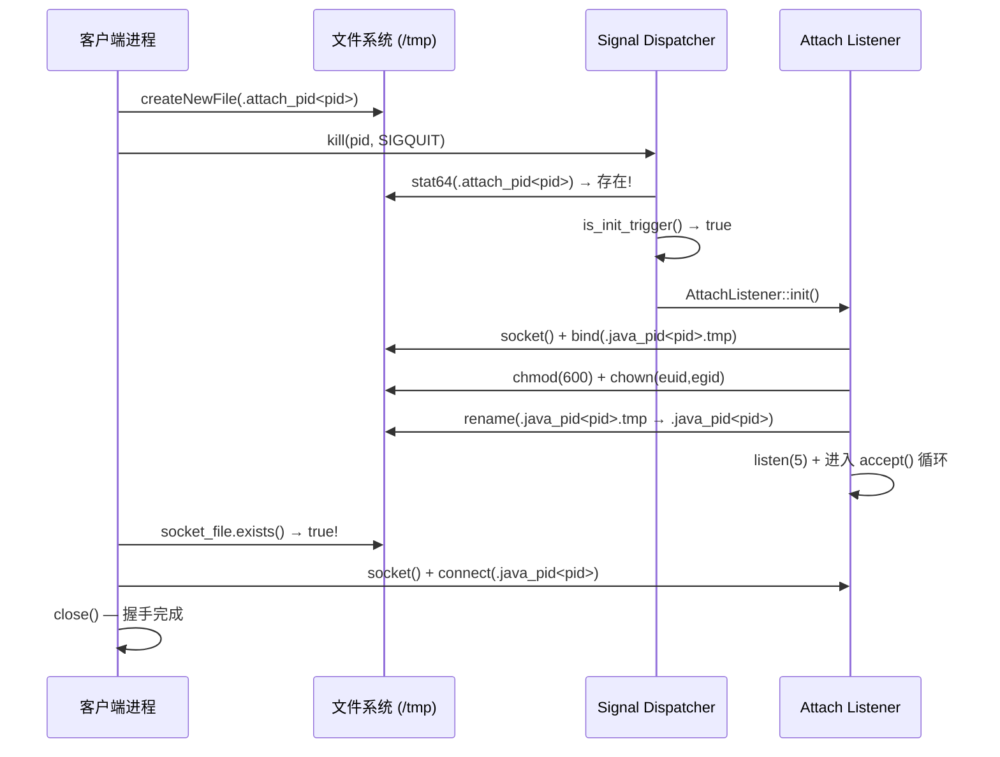

# Ch19: libattach.so — Attach API 完整双端链路

> 基于 OpenJDK 11 源码 | libattach + AttachListener 双端深度分析
> 模块 B（1 篇收官，含 Ch20 实战内容）| PerfMa 面试价值：⭐⭐⭐⭐⭐

---

## 19.1 总览：Attach 机制解决什么问题？

### 核心场景

Attach API 让一个 JVM 进程（工具端）能够**运行时连接另一个 JVM 进程（目标端）**，执行诊断操作：

- **加载 Agent**：`loadAgent()` / `loadAgentLibrary()` / `loadAgentPath()`
- **获取属性**：`getSystemProperties()` / `getAgentProperties()`
- **执行命令**：`threaddump` / `dumpheap` / `inspectheap` / `jcmd` / `setflag` / `printflag`
- **JMX 启动**：`startManagementAgent()` / `startLocalManagementAgent()`

### 架构全景

```
┌──────────────────────────────────────────────────────────────────────────┐
│                    Attach API 双端架构                                     │
│                                                                          │
│  【客户端进程 (jmap/Arthas/etc.)】        【目标 JVM 进程】                │
│                                                                          │
│  ┌─────────────────────────────┐    ┌──────────────────────────────────┐  │
│  │ com.sun.tools.attach        │    │  HotSpot Runtime                 │  │
│  │   .VirtualMachine (abstract)│    │                                  │  │
│  │       │                     │    │  Signal Dispatcher 线程           │  │
│  │       ▼                     │    │    ├── SIGQUIT handler            │  │
│  │ sun.tools.attach            │    │    └── is_init_trigger()          │  │
│  │   .HotSpotVirtualMachine    │    │                                  │  │
│  │   (abstract, loadAgent 等)  │    │  Attach Listener 线程             │  │
│  │       │                     │    │    ├── init() → socket+bind       │  │
│  │       ▼                     │    │    ├── dequeue() → accept         │  │
│  │ sun.tools.attach            │    │    ├── read_request()             │  │
│  │   .VirtualMachineImpl       │    │    ├── funcs[] 命令分发            │  │
│  │   (Linux 平台实现)          │    │    └── complete() → write 响应     │  │
│  │       │                     │    │                                  │  │
│  │       ▼                     │    │  AttachOperation 命令处理：        │  │
│  │ native libattach.so         │    │    load → load_agent()            │  │
│  │   socket() → PF_UNIX       │    │    properties → get_properties()  │  │
│  │   connect() → sockaddr_un  │    │    threaddump → VM_PrintThreads   │  │
│  │   sendQuitTo() → SIGQUIT   │    │    dumpheap → HeapDumper          │  │
│  │   checkPermissions()        │    │    jcmd → DCmd::parse_and_execute │  │
│  │   read()/write()/close()    │    │    setflag → WriteableFlags       │  │
│  └─────────────────────────────┘    └──────────────────────────────────┘  │
│                                                                          │
│        Unix Domain Socket: /tmp/.java_pid<pid>                           │
│        协议: <ver>\0<cmd>\0<arg0>\0<arg1>\0<arg2>\0                      │
└──────────────────────────────────────────────────────────────────────────┘
```

### 源码规模

| 组件 | 文件 | 行数 |
|------|------|------|
| **libattach.so** (客户端 JNI) | `VirtualMachineImpl.c` | 266 行 |
| **Java 客户端** | `VirtualMachine.java` + `HotSpotVirtualMachine.java` + `VirtualMachineImpl.java` + `AttachProvider.java` + `AttachProviderImpl.java` | ~1,800 行 |
| **HotSpot 服务端** | `attachListener.cpp` + `attachListener_linux.cpp` | ~1,100 行 |
| **总计** | 11 个源文件 | ~3,200 行 |

---

## 19.2 SPI 发现机制 — AttachProvider

### 入口：VirtualMachine.attach(pid)

```java
// com.sun.tools.attach.VirtualMachine
public static VirtualMachine attach(String id) {
    List<AttachProvider> providers = AttachProvider.providers();  // SPI 发现
    for (AttachProvider provider : providers) {
        return provider.attachVirtualMachine(id);  // 委托给平台实现
    }
}
```

### SPI 加载链路

```
AttachProvider.providers()
│
├── ServiceLoader.load(AttachProvider.class, classLoader)
│   → 扫描 META-INF/services/com.sun.tools.attach.spi.AttachProvider
│   → 配置文件内容：sun.tools.attach.AttachProviderImpl
│
├── 创建 AttachProviderImpl 实例
│   → 构造函数检查 SecurityManager
│
└── 返回不可修改列表
    → 只加载一次，后续调用返回缓存
```

### Linux 平台实现

**文件**：`src/jdk.attach/linux/classes/sun/tools/attach/AttachProviderImpl.java`

```
AttachProviderImpl extends HotSpotAttachProvider:
│
├── name() → "sun"
├── type() → "socket"     ← 标识使用 Unix Domain Socket
│
└── attachVirtualMachine(vmid):
    ├── checkAttachPermission()  ← SecurityManager 检查
    ├── testAttachable(vmid)     ← 检查 /proc/<pid> 是否存在
    └── new VirtualMachineImpl(this, vmid)
        → 真正的 attach 握手在构造函数中完成
```

---

## 19.3 类继承体系

```
com.sun.tools.attach.VirtualMachine (abstract, JDK API)
│   ├── attach(pid)        — 静态工厂，SPI 发现
│   ├── loadAgent()        — 加载 Java Agent
│   ├── loadAgentLibrary() — 加载 native Agent（名称）
│   ├── loadAgentPath()    — 加载 native Agent（绝对路径）
│   ├── getSystemProperties() / getAgentProperties()
│   ├── startManagementAgent() / startLocalManagementAgent()
│   └── detach()
│
└── sun.tools.attach.HotSpotVirtualMachine (abstract, HotSpot 实现)
    │   ├── 实现 loadAgent → loadAgentLibrary("instrument", args)
    │   ├── 实现 getSystemProperties → execute("properties")
    │   ├── 实现 threaddump → execute("threaddump")
    │   ├── 实现 dumpHeap → execute("dumpheap")
    │   ├── 实现 heapHisto → execute("inspectheap")
    │   ├── 实现 setFlag/printFlag → execute("setflag"/"printflag")
    │   ├── 实现 executeJCmd → execute("jcmd")
    │   ├── readInt() / readErrorMessage() — 协议解析
    │   ├── attachTimeout() — 超时控制 (默认 10s)
    │   └── abstract execute(cmd, args...) — 子类实现
    │
    └── sun.tools.attach.VirtualMachineImpl (Linux 平台)
        │   ├── 构造函数 — SIGQUIT 握手 + 连接验证
        │   ├── execute() — 协议封装：write 请求 + read 响应
        │   ├── findSocketFile() — /proc/<pid>/root/tmp/.java_pid<ns_pid>
        │   ├── createAttachFile() — /proc/<pid>/cwd/.attach_pid<ns_pid>
        │   ├── getNamespacePid() — 读取 /proc/<pid>/status NSpid
        │   ├── writeString() — UTF-8 + \0 分隔
        │   ├── SocketInputStream — 封装 native read
        │   │
        │   └── 7 个 native 方法 → libattach.so:
        │       ├── socket()          → PF_UNIX, SOCK_STREAM
        │       ├── connect(fd, path) → sockaddr_un
        │       ├── sendQuitTo(pid)   → kill(SIGQUIT)
        │       ├── checkPermissions(path) → stat64 + uid/gid 检查
        │       ├── close(fd)         → shutdown + close
        │       ├── read(fd, buf)     → RESTARTABLE read
        │       └── write(fd, buf)    → RESTARTABLE write 循环
        │
        └── static { System.loadLibrary("attach"); }
```

---

## 19.4 VirtualMachineImpl 构造函数 — SIGQUIT 握手协议

**文件**：`src/jdk.attach/linux/classes/sun/tools/attach/VirtualMachineImpl.java`

这是 Attach 的**核心握手流程**。一个构造函数完成所有握手工作：

```
VirtualMachineImpl(provider, vmid):
│
├── 1. pid = Integer.parseInt(vmid)
│
├── 2. ★ PID Namespace 处理 ★
│   ns_pid = getNamespacePid(pid)
│   │
│   │  getNamespacePid 实现：
│   │  ├── 读取 /proc/<pid>/status
│   │  ├── 查找 "NSpid:" 行
│   │  │   例如："NSpid:\t12345\t1"
│   │  │   → 外部 pid=12345, 容器内 pid=1
│   │  ├── parts = "NSpid".split(":")[1].trim().split("\\s+")
│   │  └── return parts[parts.length - 1]  ← 最内层 pid
│   │      → 旧内核(如 3.10) 无 NSpid 字段 → fallback 原始 pid
│   │
│
├── 3. ★ 查找 Socket 文件 ★
│   socket_file = findSocketFile(pid, ns_pid)
│   → /proc/<pid>/root/tmp/.java_pid<ns_pid>
│   │
│   │  为什么用 /proc/<pid>/root/?
│   │  → 穿越 mount namespace！
│   │  → 目标进程可能在容器中，/tmp 不是宿主机的 /tmp
│   │  → 通过 procfs 的 root 链接访问目标进程的文件系统视图
│   │
│
├── 4. if (!socket_file.exists()):
│   │   ★ Socket 不存在 → 需要触发 AttachListener 创建 ★
│   │
│   ├── 4a. 创建 Attach 触发文件
│   │   f = createAttachFile(pid, ns_pid)
│   │   → 先尝试 /proc/<pid>/cwd/.attach_pid<ns_pid>
│   │   → 失败则 /proc/<pid>/root/tmp/.attach_pid<ns_pid>
│   │   → f.createNewFile()
│   │
│   ├── 4b. 发送 SIGQUIT
│   │   sendQuitTo(pid)  ← native: kill(pid, SIGQUIT)
│   │
│   ├── 4c. 轮询等待 Socket 文件出现
│   │   delay = 100ms, 每次 +100ms (递增退避)
│   │   timeout = attachTimeout() (默认 10s)
│   │   │
│   │   │   // 中途发送第二次 SIGQUIT
│   │   │   if (time_spend > timeout/2 && !socket_file.exists()):
│   │   │       sendQuitTo(pid)  ← 再给一次机会
│   │   │
│   │   │   // 超时
│   │   │   if (time_spend > timeout && !socket_file.exists()):
│   │   │       throw AttachNotSupportedException(
│   │   │           "target process doesn't respond within Xms")
│   │   │
│   │
│   └── 4d. f.delete()  ← 清理触发文件
│
├── 5. ★ 检查 Socket 文件权限 ★
│   checkPermissions(socket_path)
│   → native: stat64(path) → 检查 uid/gid/mode
│   → uid 必须匹配 euid（或调用者是 root）
│   → gid 必须匹配 egid（或调用者是 root）
│   → 不允许 group/other 读写（必须 600 权限）
│
└── 6. ★ 验证连接 ★
    s = socket()      ← PF_UNIX, SOCK_STREAM
    connect(s, socket_path)  ← 连接到 /tmp/.java_pid<pid>
    close(s)           ← 关闭（只是验证，不发送数据）
```

### 握手时序图



---

## 19.5 execute() — 命令封装与协议

**文件**：`src/jdk.attach/linux/classes/sun/tools/attach/VirtualMachineImpl.java`

每次执行命令（loadAgent/getProperties/threaddump 等），都调用 `execute()` 方法：

```
execute(cmd, args...):
│
├── 1. 检查是否已 detach
│   synchronized: if (socket_path == null) throw IOException
│
├── 2. 创建 Unix Domain Socket
│   s = socket()  ← native: PF_UNIX, SOCK_STREAM
│
├── 3. 连接目标 JVM
│   connect(s, socket_path)
│   → native: sockaddr_un.sun_path = socket_path
│   → connect(fd, &addr)
│
├── 4. ★ 写请求 ★
│   writeString(s, "1")        ← 协议版本
│   writeString(s, cmd)        ← 命令名（如 "load"）
│   writeString(s, args[0])    ← 参数 0（如 "instrument"）
│   writeString(s, args[1])    ← 参数 1（如 "false"）
│   writeString(s, args[2])    ← 参数 2（如 "agent.jar=options"）
│   │
│   │  writeString 实现：
│   │  ├── s.getBytes("UTF-8")
│   │  ├── write(fd, bytes, 0, bytes.length)  ← native write
│   │  └── write(fd, new byte[]{0}, 0, 1)     ← 写 \0 分隔符
│   │
│   │  线上实际字节流：
│   │  "1\0load\0instrument\0false\0agent.jar=options\0"
│
├── 5. 创建 SocketInputStream 读取响应
│   sis = new SocketInputStream(s)
│   → 封装 native read(fd, buf, off, len)
│
├── 6. ★ 读取 completionStatus ★
│   completionStatus = readInt(sis)
│   → 逐字节读取直到 '\n'
│   → Integer.parseInt() 解析
│   → 0 = 成功，非 0 = 失败
│
├── 7. 错误处理
│   if (completionStatus != 0):
│   │
│   ├── message = readErrorMessage(sis)  ← BufferedReader 读取
│   ├── sis.close()
│   │
│   ├── if (completionStatus == 101):
│   │   throw IOException("Protocol mismatch")
│   │
│   ├── if (cmd == "load"):
│   │   throw AgentLoadException(message)
│   │
│   └── else:
│       throw AttachOperationFailedException(message)
│
└── 8. return sis  ← 成功：返回输入流供调用者读取
```

---

## 19.6 libattach.so — 7 个 JNI native 方法

**文件**：`src/jdk.attach/linux/native/libattach/VirtualMachineImpl.c`（266 行）

这是 libattach.so 的**全部实现**。极其精简，每个方法只有几行核心逻辑。

### 19.6.1 socket() — 创建 Unix Domain Socket

```c
JNIEXPORT jint JNICALL Java_sun_tools_attach_VirtualMachineImpl_socket(
    JNIEnv *env, jclass cls)
{
    int fd = socket(PF_UNIX, SOCK_STREAM, 0);
    //         ^^^^^^^ ^^^^^^^^^^^ ^^^
    //         Unix域  流式(TCP风格) 默认协议
    if (fd == -1) {
        JNU_ThrowIOExceptionWithLastError(env, "socket");
    }
    return (jint)fd;
}
```

**要点**：
- `PF_UNIX` = Unix 域协议族（本机进程间通信）
- `SOCK_STREAM` = 流式可靠传输（类似 TCP，但不走网络栈）
- 返回 fd 给 Java 层，后续所有操作都用这个 fd

### 19.6.2 connect(fd, path) — 连接到目标 Socket

```c
JNIEXPORT void JNICALL Java_sun_tools_attach_VirtualMachineImpl_connect(
    JNIEnv *env, jclass cls, jint fd, jstring path)
{
    const char* p = GetStringPlatformChars(env, path, &isCopy);
    struct sockaddr_un addr;
    memset(&addr, 0, sizeof(addr));
    addr.sun_family = AF_UNIX;
    strncpy(addr.sun_path, p, sizeof(addr.sun_path) - 1);

    if (connect(fd, (struct sockaddr*)&addr, sizeof(addr)) == -1) {
        err = errno;
    }
    // 释放字符串...

    // 错误处理：
    if (err == ENOENT) → FileNotFoundException  // socket 文件不存在
    else → IOException(strerror(err))
}
```

**要点**：
- `sockaddr_un.sun_path` = socket 文件路径（最长 108 字节）
- ENOENT 特殊处理：转为 FileNotFoundException
- 先释放 JNI 字符串，再抛异常（JNI 规范要求）

### 19.6.3 sendQuitTo(pid) — 发送 SIGQUIT

```c
JNIEXPORT void JNICALL Java_sun_tools_attach_VirtualMachineImpl_sendQuitTo(
    JNIEnv *env, jclass cls, jint pid)
{
    if (kill((pid_t)pid, SIGQUIT)) {
        JNU_ThrowIOExceptionWithLastError(env, "kill");
    }
}
```

**要点**：
- 就一行：`kill(pid, SIGQUIT)` — signal 3
- 失败原因：ESRCH (进程不存在) / EPERM (权限不足)

### 19.6.4 checkPermissions(path) — 安全检查

```c
JNIEXPORT void JNICALL Java_sun_tools_attach_VirtualMachineImpl_checkPermissions(
    JNIEnv *env, jclass cls, jstring path)
{
    struct stat64 sb;
    uid_t uid = geteuid();
    gid_t gid = getegid();

    stat64(path, &sb);

    // 三重检查：
    // 1. 文件 uid 必须匹配进程 euid（除非是 root）
    if (sb.st_uid != uid && uid != ROOT_UID) → ERROR

    // 2. 文件 gid 必须匹配进程 egid（除非是 root）
    if (sb.st_gid != gid && uid != ROOT_UID) → ERROR

    // 3. 不允许 group/other 有读写权限（必须 0600）
    if ((sb.st_mode & (S_IRGRP|S_IWGRP|S_IROTH|S_IWOTH)) != 0) → ERROR
}
```

**要点**：
- 防止恶意用户创建假 socket 文件
- `ROOT_UID = 0`：root 用户跳过 uid/gid 检查
- 权限 0600 = rw-------：只有所有者可读写

### 19.6.5 close(fd) — 关闭连接

```c
JNIEXPORT void JNICALL Java_sun_tools_attach_VirtualMachineImpl_close(
    JNIEnv *env, jclass cls, jint fd)
{
    shutdown(fd, SHUT_RDWR);       // 先关闭双向通信
    RESTARTABLE(close(fd), res);   // 再关闭文件描述符
}
```

**要点**：
- `shutdown(SHUT_RDWR)` 先于 `close()`
- 确保对端能收到 EOF（graceful shutdown）
- `RESTARTABLE` 宏处理 EINTR 中断重试

### 19.6.6 read(fd, buf, off, len) — 读取数据

```c
JNIEXPORT jint JNICALL Java_sun_tools_attach_VirtualMachineImpl_read(
    JNIEnv *env, jclass cls, jint fd, jbyteArray ba, jint off, jint baLen)
{
    unsigned char buf[128];    // ★ 128 字节栈缓冲区 ★
    size_t len = sizeof(buf);

    size_t remaining = (size_t)(baLen - off);
    if (len > remaining) len = remaining;

    RESTARTABLE(read(fd, buf, len), n);

    if (n == 0) n = -1;       // EOF → 返回 -1
    else
        SetByteArrayRegion(ba, off, n, buf);  // 拷贝到 Java byte[]
    return n;
}
```

**要点**：
- 使用 128 字节栈缓冲区，不是直接读入 Java 数组
- 先读到 C 缓冲区，再 `SetByteArrayRegion` 拷贝到 Java
- EOF 返回 -1（Java InputStream 约定）

### 19.6.7 write(fd, buf, off, len) — 写入数据

```c
JNIEXPORT void JNICALL Java_sun_tools_attach_VirtualMachineImpl_write(
    JNIEnv *env, jclass cls, jint fd, jbyteArray ba, jint off, jint bufLen)
{
    size_t remaining = bufLen;
    do {
        unsigned char buf[128];    // ★ 128 字节栈缓冲区 ★
        size_t len = sizeof(buf);
        if (len > remaining) len = remaining;

        GetByteArrayRegion(ba, off, len, buf);  // 从 Java byte[] 拷贝
        RESTARTABLE(write(fd, buf, len), n);

        if (n > 0) {
            off += n;
            remaining -= n;
        } else {
            JNU_ThrowIOExceptionWithLastError(env, "write");
            return;
        }
    } while (remaining > 0);
}
```

**要点**：
- **完整写入循环**：保证所有数据都写出
- 每次最多写 128 字节（栈缓冲区大小）
- `GetByteArrayRegion` → C 缓冲区 → `write()` → 重复直到 remaining = 0

### RESTARTABLE 宏

```c
#define RESTARTABLE(_cmd, _result) do { \
  do { \
    _result = _cmd; \
  } while((_result == -1) && (errno == EINTR)); \
} while(0)
```

**作用**：系统调用被信号中断（EINTR）时自动重试。这是 Unix 编程的标准模式。

---

## 19.7 HotSpot 服务端 — 双端协议对照

> Ch18 已详细分析了 AttachListener 的创建和生命周期，本节聚焦**协议对照**。

### 双端数据流对照表

| 步骤 | 客户端 (libattach.so) | 传输 | 服务端 (AttachListener) |
|------|----------------------|------|------------------------|
| 1 | `socket(PF_UNIX)` | — | `socket(PF_UNIX)` + `bind` + `listen` |
| 2 | `connect(fd, path)` | → | `accept(listener)` |
| 3 | — | — | `getsockopt(SO_PEERCRED)` 检查 uid |
| 4 | `write("1\0")` | → | `read(buf)` → 解析 ver="1" |
| 5 | `write("load\0")` | → | `read(buf)` → 解析 cmd="load" |
| 6 | `write("instrument\0")` | → | `read(buf)` → 解析 arg0="instrument" |
| 7 | `write("false\0")` | → | `read(buf)` → 解析 arg1="false" |
| 8 | `write("agent.jar\0")` | → | `read(buf)` → 解析 arg2="agent.jar" |
| 9 | — | — | 执行命令 → `load_agent()` |
| 10 | `readInt(sis)` | ← | `write("0\n")` completionStatus |
| 11 | `read(sis)` | ← | `write(output)` 命令输出 |
| 12 | — | ← | `shutdown(s, 2)` + `close(s)` |
| 13 | `close(s)` | — | — |

### 服务端 read_request 详解

**文件**：`src/hotspot/os/linux/attachListener_linux.cpp`

```
read_request(s):
│
├── 协议格式：<ver>\0<cmd>\0<arg0>\0<arg1>\0<arg2>\0
│   expected_str_count = 2 + 3 = 5 (ver + cmd + 3 args)
│
├── max_len = sizeof("1") + 1     = 9    (ver)
│           + name_max + 1         = 17   (cmd, 最长 16 字节)
│           + 3 * (arg_max + 1)    = 3075 (3 个参数, 各最长 1024 字节)
│           ≈ 3101 字节
│
├── 循环 read() 直到：
│   ├── 收到 5 个 \0（所有字段都读完）
│   ├── 或缓冲区满
│   └── 或 EOF
│
├── 版本校验（第一个 \0 之前的内容）：
│   if (atoi(buf) != ATTACH_PROTOCOL_VER):
│       write("101\n")  ← ATTACH_ERROR_BADVERSION
│       return NULL
│
└── ArgumentIterator 解析：
    ver  → 跳过（已检查）
    name → op->name()    (如 "load")
    arg0 → op->arg(0)    (如 "instrument")
    arg1 → op->arg(1)    (如 "false")
    arg2 → op->arg(2)    (如 "agent.jar=options")
```

### 服务端 complete 响应

```
LinuxAttachOperation::complete(result, st):
│
├── ThreadBlockInVM tbivm(thread)
│   → 当前线程进入 blocked 状态（允许 Safepoint）
│
├── write_fully(socket, "0\n")     ← result code
│   → 或 write_fully(socket, "-1\n")  如果失败
│
├── write_fully(socket, st->base(), st->size())  ← 命令输出
│   → 如 thread dump 文本、properties 序列化数据
│
├── shutdown(socket, 2)  ← SHUT_RDWR
│   → 通知客户端传输完成
│
├── close(socket)
│
└── delete this  ← 释放 AttachOperation 对象
```

---

## 19.8 全部 Attach 命令详解

### 命令表

**文件**：`src/hotspot/share/services/attachListener.cpp`

```c
static AttachOperationFunctionInfo funcs[] = {
  { "agentProperties",  get_agent_properties },  // Agent 属性
  { "datadump",         data_dump },              // SIGBREAK 触发
  { "dumpheap",         dump_heap },              // 堆 Dump
  { "load",             load_agent },             // 加载 Agent ★
  { "properties",       get_system_properties },  // 系统属性
  { "threaddump",       thread_dump },            // 线程 Dump
  { "inspectheap",      heap_inspection },         // 堆直方图
  { "setflag",          set_flag },               // 设置 VM Flag
  { "printflag",        print_flag },             // 打印 VM Flag
  { "jcmd",             jcmd },                   // 诊断命令 ★
  { NULL,               NULL }
};
```

### 命令详细实现

#### 1. load — 加载 Agent（最常用）

```
load_agent(op, out):
│
├── agent = "instrument"
│   absParam = "false"
│   options = "agent.jar=options"
│
├── if (agent == "instrument"):
│   JavaCalls::call_static(Modules.loadModule("java.instrument"))
│   → 确保 java.instrument 模块已加载
│
└── JvmtiExport::load_agent_library(agent, absParam, options, out)
    → Ch18 已详细分析 → Agent_OnAttach → agentmain()
```

**Java 层调用方式**：
- `vm.loadAgent("agent.jar")` → `loadAgentLibrary("instrument", "agent.jar")`
- `vm.loadAgentLibrary("myagent")` → 直接加载 libmyagent.so
- `vm.loadAgentPath("/abs/path/libmyagent.so")` → 绝对路径加载

#### 2. properties / agentProperties — 获取属性

```
get_properties(op, out, serializeMethod):
│
├── k = SystemDictionary::resolve("jdk.internal.vm.VMSupport")
├── JavaCalls::call_static(k, serializeMethod)
│   → VMSupport.serializePropertiesToByteArray()
│   → 将所有 System.properties 序列化为 byte[]
├── ba = (typeArrayOop) result
└── out->print_raw(ba->byte_at_addr(0), ba->length())
```

**Java 层调用方式**：
- `vm.getSystemProperties()` → `execute("properties")` → Properties.load()
- `vm.getAgentProperties()` → `execute("agentProperties")`

#### 3. threaddump — 线程 Dump

```
thread_dump(op, out):
│
├── 解析参数：
│   'l' → print_concurrent_locks = true
│   'e' → print_extended_info = true
│
├── VM_PrintThreads op1(out, locks, extended)
│   VMThread::execute(&op1)  ← Safepoint 下打印所有线程栈
│
├── VM_PrintJNI op2(out)
│   VMThread::execute(&op2)  ← 打印 JNI global handles
│
└── VM_FindDeadlocks op3(out)
    VMThread::execute(&op3)  ← 死锁检测
```

**特点**：
- 三个 VM_Operation **顺序执行**，每个都需要 Safepoint
- 这就是 `jstack` 的底层实现

#### 4. dumpheap — 堆 Dump

```
dump_heap(op, out):
│
├── path = op->arg(0)     → dump 文件路径
├── arg1 = op->arg(1)     → "-live" 或 "-all"
│   live_objects_only = (arg1 == "-live")
│
└── HeapDumper dumper(live_objects_only)
    dumper.dump(path, out)
    → 在 Safepoint 下遍历所有 GC roots + 堆对象
    → 写入 HPROF 二进制格式
```

**特点**：
- `-live` 会先触发 Full GC 清理不可达对象
- 这就是 `jmap -dump:format=b,file=heap.hprof <pid>` 的底层

#### 5. inspectheap — 堆直方图

```
heap_inspection(op, out):
│
├── live_objects_only = (arg0 == "-live")
├── parallel_thread_num = processors * 3 / 8
│
└── VM_GC_HeapInspection heapop(out, live_objects_only, parallel_thread_num)
    VMThread::execute(&heapop)
    → 遍历堆，统计每个类的实例数和大小
    → 输出类似 jmap -histo 的格式
```

**特点**：
- JDK 11 支持**并行堆检查**（多线程遍历 Region）
- 默认并行度 = CPU 核数 × 3/8

#### 6. jcmd — 诊断命令

```
jcmd(op, out):
│
├── args = op->arg(0)  → 完整命令字符串
│   例如："GC.heap_dump /tmp/heap.hprof"
│       "VM.flags -all"
│       "Thread.print -l"
│       "GC.run"
│
└── DCmd::parse_and_execute(DCmd_Source_AttachAPI, out, args, ' ', THREAD)
    → 使用 DiagnosticCommand 框架解析和执行
    → 支持所有已注册的 DCmd
```

**特点**：
- jcmd 是**最灵活的命令**，通过 DiagnosticCommand 框架路由到具体实现
- 可以执行 JFR.start / GC.heap_info / VM.native_memory 等高级命令

#### 7. setflag / printflag — VM Flag 操作

```
set_flag(op, out):
├── WriteableFlags::set_flag(name, value, ATTACH_ON_DEMAND)
│   → 只有 manageable 标记的 flag 才能修改
│   → 例如：HeapDumpOnOutOfMemoryError, PrintGCDetails

print_flag(op, out):
├── JVMFlag::find_flag(name)
└── f->print_as_flag(out)
```

### 命令与工具的对应关系

| 工具命令 | Attach 命令 | 函数实现 |
|---------|------------|---------|
| `jstack <pid>` | `threaddump` | `thread_dump()` → 3 个 VM_Operation |
| `jstack -l <pid>` | `threaddump "l"` | 额外打印锁信息 |
| `jmap -dump:format=b <pid>` | `dumpheap path -live` | `dump_heap()` → HeapDumper |
| `jmap -histo <pid>` | `inspectheap -all` | `heap_inspection()` |
| `jmap -histo:live <pid>` | `inspectheap -live` | 先 GC 再统计 |
| `jcmd <pid> GC.run` | `jcmd "GC.run"` | `jcmd()` → DCmd |
| `jcmd <pid> VM.flags` | `jcmd "VM.flags"` | `jcmd()` → DCmd |
| `jcmd <pid> Thread.print` | `jcmd "Thread.print"` | `jcmd()` → DCmd |
| `jinfo -flag +HeapDump <pid>` | `setflag HeapDump... true` | `set_flag()` |
| Arthas `java -jar arthas-boot.jar <pid>` | `load instrument false arthas-agent.jar` | `load_agent()` |
| async-profiler | `load /path/libasyncProfiler.so true options` | `load_agent()` |

---

## 19.9 安全机制详解

### 五层安全保障

```
┌───────────────────────────────────────────────────────────────┐
│                     Attach 安全机制                            │
├───────────────────────────────────────────────────────────────┤
│                                                               │
│  L1: .attach_pid 文件 uid 检查                                │
│  ├── is_init_trigger() 中 stat64(.attach_pid) → st_uid       │
│  ├── matches_effective_uid_or_root(st_uid)                    │
│  └── 防止其他用户创建假触发文件                                │
│                                                               │
│  L2: .java_pid Socket 文件权限                                │
│  ├── chmod(S_IREAD|S_IWRITE) → 0600                          │
│  ├── chown(geteuid(), getegid())                              │
│  └── 只有所有者可读写 Socket 文件                              │
│                                                               │
│  L3: SO_PEERCRED 凭证检查                                     │
│  ├── getsockopt(SOL_SOCKET, SO_PEERCRED, &cred_info)          │
│  ├── matches_effective_uid_and_gid_or_root(uid, gid)          │
│  └── 连接时验证客户端进程的 uid/gid                            │
│                                                               │
│  L4: 客户端 checkPermissions()                                │
│  ├── stat64(socket_path) → 验证 uid/gid/mode                 │
│  └── 防止连接到其他用户创建的假 Socket                         │
│                                                               │
│  L5: DisableAttachMechanism / EnableDynamicAgentLoading       │
│  ├── -XX:+DisableAttachMechanism → 完全禁用 Attach            │
│  └── -XX:-EnableDynamicAgentLoading → 禁用 Agent 加载          │
│      但 threaddump/dumpheap 等命令仍可用                       │
│                                                               │
└───────────────────────────────────────────────────────────────┘
```

### 容器安全额外考虑

在容器环境中：
1. **PID Namespace**：客户端通过 `/proc/<pid>/status` 的 `NSpid` 获取容器内 PID
2. **Mount Namespace**：通过 `/proc/<pid>/root/` 穿越文件系统边界
3. **权限**：客户端需要能 `stat64` 目标进程的 procfs 目录（通常需要 ptrace 权限或同一用户）

---

## 19.10 实战链路分析

### 19.10.1 Arthas 完整链路

```
$ java -jar arthas-boot.jar <pid>

arthas-boot.jar:
│
├── 1. 发现目标 JVM（扫描 /proc/ 或指定 pid）
│
├── 2. VirtualMachine.attach(pid)
│   ├── SPI → AttachProviderImpl → new VirtualMachineImpl(this, pid)
│   ├── getNamespacePid(pid) → 容器内 PID
│   ├── findSocketFile → /proc/<pid>/root/tmp/.java_pid<ns_pid>
│   ├── 不存在 → createAttachFile + sendQuitTo(SIGQUIT)
│   ├── 等待 .java_pid 出现（最长 10s）
│   ├── checkPermissions()
│   └── connect() 验证
│
├── 3. vm.loadAgent("arthas-agent.jar")
│   ├── HotSpotVirtualMachine.loadAgent():
│   │   args = "instrument" + "arthas-agent.jar"
│   │   → loadAgentLibrary("instrument", "arthas-agent.jar")
│   │
│   ├── execute("load", "instrument", "false", "arthas-agent.jar"):
│   │   ├── socket() + connect(socket_path)
│   │   ├── write "1\0load\0instrument\0false\0arthas-agent.jar\0"
│   │   └── readInt() → 0 (success)
│   │
│   └── 目标 JVM 内部（Ch18 链路）：
│       ├── Attach Listener dequeue() → read_request()
│       ├── funcs["load"] → load_agent()
│       ├── Modules.loadModule("java.instrument")
│       ├── JvmtiExport::load_agent_library("instrument")
│       │   → dlopen(libinstrument.so)
│       │   → Agent_OnAttach(&vm, "arthas-agent.jar")
│       ├── Agent_OnAttach:
│       │   → createNewJPLISAgent → readManifest(Agent-Class)
│       │   → appendClassPath → createInstrumentationImpl
│       │   → loadClassAndCallAgentmain()
│       │   → AgentBootstrap.agentmain(args, instrumentation)
│       └── complete(0, "") → write "0\n" + shutdown
│
├── 4. Arthas Server 启动
│   ├── agentmain 中启动 Netty/Telnet 服务
│   └── 监听端口（默认 3658）
│
└── 5. arthas-client 连接 → 用户交互
```

### 19.10.2 jstack 完整链路

```
$ jstack <pid>

jstack (com.sun.tools.attach 工具):
│
├── 1. VirtualMachine.attach(pid)
│   └── 同上握手流程
│
├── 2. vm.remoteDataDump()
│   → HotSpotVirtualMachine.remoteDataDump()
│   → executeCommand("threaddump")
│   → execute("threaddump")
│   │
│   ├── write "1\0threaddump\0\0\0\0"
│   │
│   └── 目标 JVM:
│       ├── funcs["threaddump"] → thread_dump()
│       ├── VM_PrintThreads → Safepoint → 打印所有线程栈
│       ├── VM_PrintJNI → JNI 全局引用
│       ├── VM_FindDeadlocks → 死锁检测
│       └── complete(0, thread_dump_text) → write 响应
│
├── 3. 读取响应流 → 输出到 stdout
│
└── 4. vm.detach()
```

### 19.10.3 async-profiler 完整链路

```
$ asprof -d 30 -f flamegraph.html <pid>

async-profiler:
│
├── 1. VirtualMachine.attach(pid)
│
├── 2. vm.loadAgentPath("/path/to/libasyncProfiler.so",
│       "start,event=cpu,file=flamegraph.html")
│   │
│   │  HotSpotVirtualMachine.loadAgentPath():
│   │  → loadAgentLibrary(path, true, options)
│   │  → execute("load", path, "true", options)
│   │
│   │  目标 JVM:
│   │  ├── load_agent() → JvmtiExport::load_agent_library()
│   │  ├── dlopen(libasyncProfiler.so)
│   │  ├── Agent_OnAttach(vm, "start,event=cpu,file=...")
│   │  │   → 注册 JVMTI 事件
│   │  │   → 安装 perf_event / AsyncGetCallTrace
│   │  │   → 开始采样
│   │  └── 返回成功
│   │
│
├── 3. 等待 30 秒
│
├── 4. vm.loadAgentPath("/path/to/libasyncProfiler.so", "stop,file=...")
│   → Agent_OnAttach 再次调用
│   → 停止采样，生成火焰图
│
└── 5. vm.detach()
```

### 19.10.4 jcmd 完整链路

```
$ jcmd <pid> GC.heap_dump /tmp/heap.hprof

jcmd:
│
├── 1. VirtualMachine.attach(pid)
│
├── 2. vm.executeJCmd("GC.heap_dump /tmp/heap.hprof")
│   → execute("jcmd", "GC.heap_dump /tmp/heap.hprof")
│   │
│   │  目标 JVM:
│   │  ├── funcs["jcmd"] → jcmd()
│   │  ├── DCmd::parse_and_execute("GC.heap_dump /tmp/heap.hprof")
│   │  │   → 查找 DCmdFactory → HeapDumpDCmd
│   │  │   → HeapDumper::dump("/tmp/heap.hprof")
│   │  │   → Safepoint 下遍历堆写入 HPROF
│   │  └── complete(0, "Heap dump file created")
│   │
│
├── 3. 读取响应 → 打印 "Heap dump file created"
│
└── 4. vm.detach()
```

---

## 19.11 loadAgent 错误码映射

**文件**：`src/jdk.attach/share/classes/sun/tools/attach/HotSpotVirtualMachine.java`

```java
// HotSpotVirtualMachine.loadAgent():
try {
    loadAgentLibrary("instrument", args);
} catch (AgentInitializationException x) {
    int rc = x.returnValue();
    switch (rc) {
        case -4:  // JNI_ENOMEM
            throw new AgentLoadException("Insufficient memory");
        case 100: // ATTACH_ERROR_BADJAR
            throw new AgentLoadException("Agent JAR not found or no Agent-Class attribute");
        case 101: // ATTACH_ERROR_NOTONCP
            throw new AgentLoadException("Unable to add JAR file to system class path");
        case 102: // ATTACH_ERROR_STARTFAIL
            throw new AgentInitializationException("Agent loaded but failed to initialize");
    }
}
```

| 错误码 | 常量 | 含义 | 常见原因 |
|--------|------|------|---------|
| -4 | JNI_ENOMEM | 内存不足 | Agent 创建时 malloc 失败 |
| 100 | ATTACH_ERROR_BADJAR | JAR 无效 | 无 Agent-Class 属性 / JAR 不存在 |
| 101 | ATTACH_ERROR_NOTONCP | 无法加到 classpath | AddToSystemClassLoaderSearch 失败 |
| 102 | ATTACH_ERROR_STARTFAIL | Agent 启动失败 | agentmain() 抛出异常 |

---

## 19.12 Socket 恢复机制

**文件**：`src/hotspot/os/linux/attachListener_linux.cpp`

```
check_socket_file():
│
├── stat64(LinuxAttachListener::path()) → ret
│
├── if (ret == -1):
│   │  socket 文件被删除了！
│   │
│   ├── listener_cleanup()
│   │   → shutdown + close listener socket
│   │   → unlink socket file
│   │
│   ├── transit_state(AL_INITIALIZING, AL_NOT_INITIALIZED)
│   │   → CAS 将状态重置为 NOT_INITIALIZED
│   │
│   └── is_init_trigger()
│       → 等待下一次 SIGQUIT 重新触发
│       → 重新执行 init() 创建新 Socket
│
└── else: return false  ← 文件存在，一切正常
```

**场景**：运维手误删除了 `/tmp/.java_pid<pid>`，Attach 会自动恢复。

---

## 19.13 面试专题

### Q1: VirtualMachine.attach(pid) 到底做了什么？

**源码级回答**：

1. **SPI 发现**：`AttachProvider.providers()` 通过 ServiceLoader 加载 `AttachProviderImpl`
2. **PID Namespace**：读取 `/proc/<pid>/status` 的 `NSpid` 字段获取容器内 PID
3. **检查 Socket**：查找 `/proc/<pid>/root/tmp/.java_pid<ns_pid>`
4. **触发创建**：如果不存在 → 创建 `.attach_pid<pid>` 文件 + `kill(pid, SIGQUIT)`
5. **目标响应**：Signal Dispatcher 线程收到 SIGQUIT → 检查 `.attach_pid` 文件 → `AttachListener::init()` → 创建 Attach Listener 线程 → `socket()` + `bind()` + `listen()`
6. **等待就绪**：客户端轮询等待 `.java_pid` 文件出现（100ms 递增，最长 10s）
7. **安全检查**：`checkPermissions()` → stat64 检查 uid/gid/mode
8. **验证连接**：`socket()` + `connect()` + `close()`

### Q2: 为什么 Attach 不需要目标 JVM 提前开启？

Signal Dispatcher 线程是 JVM 启动时就创建的守护线程，默认监听 SIGQUIT。Attach 利用了这个已有基础设施：
- 有 `.attach_pid` 文件 → 触发 AttachListener 创建
- 没有 → 执行默认行为（打印线程 dump）

### Q3: jstack 和 jmap 的底层实现有什么区别？

都通过 Attach API 发送不同命令：
- `jstack` → `execute("threaddump")` → `VM_PrintThreads` + `VM_FindDeadlocks`（3 次 Safepoint）
- `jmap -dump` → `execute("dumpheap", path, "-live")` → `HeapDumper::dump()`（1 次长时间 Safepoint）
- `jmap -histo` → `execute("inspectheap", "-live")` → `VM_GC_HeapInspection`（1 次 Safepoint，支持并行）

### Q4: libattach.so 为什么用 128 字节的栈缓冲区？

read/write 都使用 `unsigned char buf[128]` 栈缓冲区：
1. **安全**：栈缓冲区不需要 malloc/free，无内存泄漏风险
2. **高效**：Attach 通信数据量很小（命令/响应通常 < 4KB），128 字节足够
3. **避免 JNI 直接操作 Java 数组**：`GetByteArrayRegion`/`SetByteArrayRegion` 比 `GetByteArrayElements` 更安全（不需要 Release）

### Q5: 容器环境下 Attach 为什么能工作？

三个关键技术：
1. **NSpid**：读取 `/proc/<pid>/status` 中的 `NSpid` 获取容器内 PID
2. **procfs root**：通过 `/proc/<pid>/root/tmp/` 穿越 mount namespace
3. **procfs cwd**：通过 `/proc/<pid>/cwd/` 创建触发文件

### Q6: DisableAttachMechanism 和 EnableDynamicAgentLoading 有什么区别？

| 参数 | 效果 | 影响 |
|------|------|------|
| `-XX:+DisableAttachMechanism` | Signal Dispatcher 不检查 attach 文件 | **完全禁用**：Attach Listener 永远不创建，所有工具失效 |
| `-XX:-EnableDynamicAgentLoading` | Attach Listener 正常运行，但 `load` 命令被拒绝 | **部分禁用**：jstack/jmap/jcmd 正常，只禁止 Agent 加载 |

### Q7: Attach 超时怎么配置？

```
-Dsun.tools.attach.attachTimeout=20000  (默认 10000ms)
```

超时影响：
- 构造函数中等待 `.java_pid` 出现的最长时间
- 中间（half timeout）会再发一次 SIGQUIT
- 超时后抛出 `AttachNotSupportedException`

### Q8: 为什么 Attach 用 Unix Domain Socket 而不是 TCP？

1. **性能**：不走网络栈，零拷贝内核路径
2. **安全**：只允许本机访问 + SO_PEERCRED 获取对端 uid
3. **简单**：文件系统语义，通过文件权限控制访问
4. **可靠**：不需要端口分配，不存在端口冲突

---

## 19.14 模块 B 总结

### 知识体系

```
Ch18 (服务端深入):                    Ch19 (双端完整 + 客户端深入):
  Signal Dispatcher → SIGQUIT           SPI → AttachProvider → VirtualMachineImpl
  AttachListener::init()                7 个 JNI native 方法 (libattach.so)
  Unix Domain Socket                    execute() 协议封装
  load_agent → Agent_OnAttach           全部 10 个 Attach 命令详解
  Agent_OnAttach → agentmain()          双端协议对照表
  三层安全机制                          五层安全保障 + 容器支持
                                        Arthas/jstack/jmap/jcmd/async-profiler 实战
```

### 与其他模块的关联

| 已学模块 | Ch19 的深化 |
|---------|------------|
| Ch15: Java Agent | `load` 命令 → Agent_OnLoad 是 `-javaagent` 的底层 |
| Ch16: retransformClasses | Arthas trace → Attach + loadAgent + retransform |
| Ch17: JVMTI 事件体系 | `load` 命令启用事件 + `should_post_xxx` 联动 |
| Ch18: agentmain | `load instrument` → Agent_OnAttach → agentmain |

### PerfMa 面试闭环

到 Ch19 为止，以下 PerfMa 面试问题已可完整回答：

| 问题 | 答案来源 |
|------|---------|
| Java Agent 怎么工作？ | Ch15 |
| retransformClasses 底层做了什么？ | Ch16 |
| JVMTI 事件怎么分发？ | Ch17 |
| Arthas 怎么连上目标 JVM？ | Ch18 + Ch19 |
| jstack/jmap/jcmd 底层原理？ | Ch19 |
| Attach 安全机制？ | Ch18 + Ch19 |
| premain vs agentmain 区别？ | Ch15 + Ch18 |
| 容器环境下的诊断？ | Ch19 |

---

*分析文件*：
- `src/jdk.attach/linux/native/libattach/VirtualMachineImpl.c` — 7 个 JNI native 方法
- `src/jdk.attach/linux/classes/sun/tools/attach/VirtualMachineImpl.java` — Linux 平台实现
- `src/jdk.attach/share/classes/sun/tools/attach/HotSpotVirtualMachine.java` — HotSpot 抽象层
- `src/jdk.attach/share/classes/com/sun/tools/attach/VirtualMachine.java` — API 定义
- `src/jdk.attach/share/classes/com/sun/tools/attach/spi/AttachProvider.java` — SPI 基类
- `src/jdk.attach/linux/classes/sun/tools/attach/AttachProviderImpl.java` — Linux SPI 实现
- `src/hotspot/share/services/attachListener.cpp` — HotSpot 命令处理
- `src/hotspot/os/linux/attachListener_linux.cpp` — Linux 平台 AttachListener
