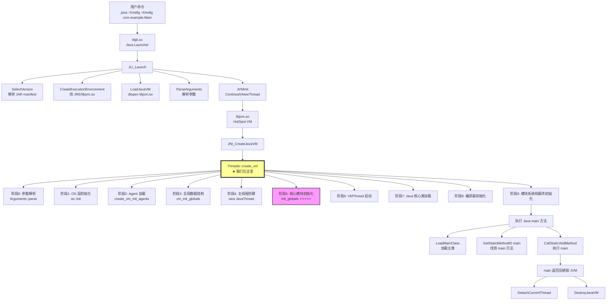
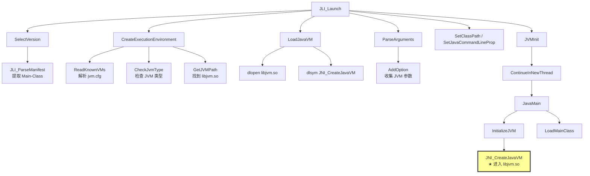
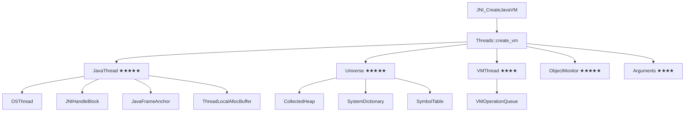
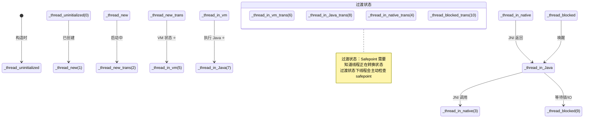
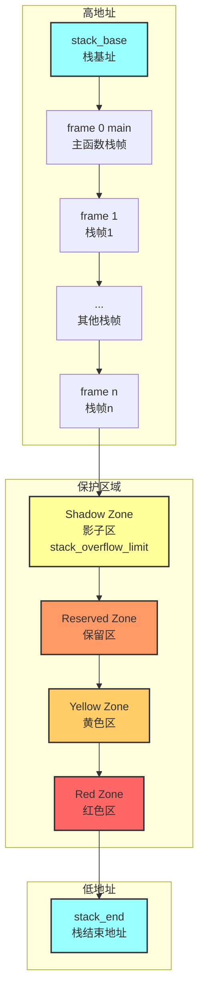

# JVM 启动全链路深度解析

> **方法论**：程序 = 数据结构 + 算法
> **标准环境**：-Xms8g -Xmx8g -XX:+UseG1GC
> **目标**：串联所有 .so 库，从 `java` 命令到 `main()` 方法执行的完整链路

---

## 零、全链路概览

### 0.1 完整调用链



### 0.2 已分析 vs 未分析（基于 new-jvm-md 目录）

| 阶段 | 状态 | 文档位置（new-jvm-md） | 说明 |
|------|------|------------------------|------|
| **libjli.so** | ✅ 完成 | SOLibrary/libjli-core-functions.md (64K)<br/>SOLibrary/5-libjli-Java-Launcher-Deep-Dive.md (42K) | 核心函数完整分析 |
| **libjsig.so** | ✅ 完成 | SOLibrary/3-libjsig-Signal-Chaining-Deep-Dive.md (103K) | 信号链深度分析 |
| **libattach.so** | ✅ 完成 | SOLibrary/4-libattach-Attach-Mechanism-Deep-Dive.md (60K) | Attach 机制完整分析 |
| **libinstrument.so** | ✅ 完成 | SOLibrary/1-libinstrument-Java-Agent-Deep-Dive.md (99K) | Java Agent 深度分析 |
| **JVMTI** | ✅ 完成 | SOLibrary/2-JVMTI-Complete-Mechanism-Deep-Dive.md (57K) | JVMTI 完整机制 |
| **Threads::create_vm()** | ✅ 完成 | Thread/create_vm/ 目录（20+ 文档）| 完整的 9 个阶段分析 |
| **JavaThread 数据结构** | ✅ 完成 | 本文档 4.2 节 ⭐⭐⭐⭐⭐ | 完整数据结构分析 |
| **Universe** | ✅ 完成 | Thread/create_vm/5-universe_init-Deep-Dive.md<br/>Thread/create_vm/4E-universe2_init-Genesis-Deep-Dive.md<br/>Thread/create_vm/5A-SymbolTable-Deep-Dive.md<br/>Thread/create_vm/5B-StringTable-Deep-Dive.md | Universe 完整分析 |
| **init_globals() 子系统** | ✅ 完成 | Thread/create_vm/4-Phase6-init_globals.md (1083 行)<br/>Thread/create_vm/4B-CodeCache-Deep-Dive.md<br/>Thread/create_vm/4C-Interpreter-TemplateTable-Deep-Dive.md<br/>Thread/create_vm/4D-StubRoutines-Two-Phase-Deep-Dive.md<br/>Thread/create_vm/4G-SharedRuntime-Blob-Deep-Dive.md<br/>Thread/create_vm/4H-javaClasses_init-Deep-Dive.md | 完整子系统分析 |
| **VMThread 创建** | ✅ 完成 | Thread/create_vm/7-VMThread-Deep-Dive.md (816 行) | VMThread 完整分析 |
| **G1CollectedHeap 初始化** | ✅ 完成 | Thread/create_vm/6-G1CollectedHeap-initialize-Deep-Dive.md<br/>G1CollectedHeap-Deep-Dive/ 目录（3 个文档）| G1 堆初始化深度分析 |
| **Java 核心类加载** | ✅ 完成 | Thread/create_vm/8-Phase8-Java-Class-Init-And-VM-Completion.md | 核心类加载完整分析 |
| **G1 GC 完整流程** | ✅ 完成 | G1GC/ 目录（30+ 文档）⭐⭐⭐⭐⭐ | 超详细分析，包括：<br/>- HeapRegion / HeapRegionManager<br/>- 对象分配路径<br/>- 写屏障 / CardTable<br/>- RSet 三级结构<br/>- Concurrent Refinement<br/>- G1Policy 预测模型<br/>- 并发标记完整流程<br/>- Young GC 完整 STW 流程<br/>- Full GC<br/>- SafePoint / VMOperation<br/>- 引用处理<br/>- 故障排查案例 |
| **线程生命周期** | ✅ 完成 | ThreadLifecycle/ 目录（2 个文档）| 线程创建、运行、退出 |
| **同步机制** | ✅ 完成 | Synchronization/ 目录（2 个文档）| Monitor、锁优化 |
| **对象模型** | ✅ 完成 | ObjectModel/ 目录（7 个文档）| Oop/Klass、对象分配、TLAB、ClassLoader |
| **Metaspace** | ✅ 完成 | Metaspace/ 目录（7 个文档）| Metaspace 架构、类卸载 |
| **编译器** | ✅ 完成 | Compiler/ 目录（7 个文档）| JIT 编译、OSR、去优化 |
| **异常处理** | ✅ 完成 | ExceptionHandling/ 目录（2 个文档）| 异常抛出和捕获 |
| **栈帧** | ✅ 完成 | StackFrame/ 目录（3 个文档）| 栈帧结构和栈遍历 |
| **JMM** | ✅ 完成 | JMM/ 目录（1 个文档）| Java 内存模型 |
| **JNI 引用** | ✅ 完成 | JNIReference/ 目录（1 个文档）| JNI 全局/弱引用 |
| **Native 调用** | ✅ 完成 | NativeWrapper/ 目录（1 个文档）| Native 方法调用框架 |
| **运行时解析** | ✅ 完成 | RuntimeResolve/ 目录（2 个文档）| 字段/方法解析 |

**总计**：new-jvm-md 目录包含 **62 个子目录**，**278 个文件**，涵盖 JVM 所有核心模块。

---

## 一、libjli.so 阶段（已分析）

> **详细文档**：[libjli-core-functions.md](../SOLibrary/libjli-core-functions.md)
> **关键数据结构**：JavaVMOption、JavaVMInitArgs、InvocationFunctions、JavaMainArgs、vmdesc、manifest_info

### 1.1 核心流程回顾



### 1.2 补充：如何进入 libjvm.so

**关键函数**：`InitializeJVM()` 调用 `JNI_CreateJavaVM()`

```cpp
// java.c:867-888
static jboolean InitializeJVM(JavaVM **pvm, JNIEnv **penv,
                              InvocationFunctions *ifn) {
    JavaVMInitArgs args;
    
    args.version  = JNI_VERSION_1_8;
    args.nOptions = numOptions;
    args.options  = options;  // ← 所有收集的 JVM 参数
    args.ignoreUnrecognized = JNI_FALSE;
    
    // ★ 调用 libjvm.so 的 JNI_CreateJavaVM
    r = ifn->CreateJavaVM(pvm, (void **)penv, &args);
    
    return r == JNI_OK;
}
```

**输出**：
- `pvm`：指向 JavaVM 实例（JNI 函数表）
- `penv`：指向 JNIEnv 实例（JNI 环境指针）

---

## 二、libjvm.so 入口：JNI_CreateJavaVM()

### 2.1 JNI_CreateJavaVM() 的实现

**源码位置**：`jni.cpp`

```cpp
// jni.cpp (简化版)
jint JNICALL JNI_CreateJavaVM(JavaVM **vm, void **penv, void *args) {
    // ★ 真正的入口：Threads::create_vm()
    jint result = Threads::create_vm((JavaVMInitArgs*) args, false);
    
    if (result == JNI_OK) {
        JavaThread *thread = JavaThread::current();
        *vm = (JavaVM *)(&main_vm);
        *penv = thread->jni_environment();
    }
    
    return result;
}
```

**关键点**：
1. 调用 `Threads::create_vm()` - JVM 的真正初始化
2. 返回 `JavaVM` 和 `JNIEnv` 指针

---

## 三、Threads::create_vm() 详细分析

> **宏观理解**：[Threads-create_vm-1-Overview.md](Threads-create_vm-1-Overview.md)

### 3.1 九大阶段概览

```
阶段 0: 早期初始化
  └─ 参数解析、OS 层准备

阶段 1: OS 层初始化
  └─ Safepoint 机制初始化

阶段 2: Agent 初始化
  └─ 加载 -agentlib/-javaagent

阶段 3: 全局数据结构初始化
  └─ 线程链表、基础数据结构

阶段 4: 主线程创建 ★★★★★
  └─ 创建 JavaThread 对象

阶段 5: 核心模块初始化 ★★★★★
  └─ init_globals() - 初始化所有子系统

阶段 6: VMThread 启动
  └─ 启动 JVM 内部线程

阶段 7: Java 核心类加载
  └─ 加载 java.lang.*

阶段 8: 编译器初始化
  └─ JIT 编译器就绪

阶段 9: 模块系统和最终初始化
  └─ JPMS、安全管理器
```

### 3.2 重点深入阶段

根据 **Doc-DataStructure-First** 规则，重点分析数据结构：

---

## 四、核心数据结构分析（第二轮）

### 4.1 数据结构全景图



---

### 4.2 JavaThread 完整分析 ⭐⭐⭐⭐⭐

> **这是本次分析的重点**

#### 4.2.1 功能定位

**一句话说明**：
- JavaThread 是 Java 线程在 JVM 内部的表示，存储线程的所有状态信息（栈、JNI Handle、ThreadLocalAllocBuffer、线程状态等）。

**在整体流程中的位置**：
```
libjli.so
    ↓ (JavaMain 线程)
JNI_CreateJavaVM()
    ↓
Threads::create_vm()
    ↓
new JavaThread() ← 在这里创建主线程的 JavaThread 对象
    ↓
main() 方法执行
```

**如果没有它会怎样？**
- 无法表示 Java 线程
- 无法存储线程栈信息
- 无法执行 JNI 调用
- 无法进行对象分配（ThreadLocalAllocBuffer 在 JavaThread 中）

#### 4.2.2 类继承关系

```
Thread (基类)
├── JavaThread ← 分析目标
│   ├── CompilerThread (JIT 编译器线程)
│   ├── CodeCacheSweeperThread (代码缓存清理线程)
│   ├── JvmtiAgentThread (JVMTI Agent 线程)
│   └── ServiceThread (服务线程)
├── VMThread (VM 内部线程)
├── WatcherThread (定时任务线程)
└── NamedThread (命名线程)
```

#### 4.2.3 全部字段列表 ⭐（Doc-DataStructure-First）

**继承关系**：
```
ThreadShadow (异常处理)
    ↓
Thread (基类，856 bytes)
    ↓
JavaThread (目标，1888 bytes)
```

##### 4.2.3.1 Thread 基类字段（继承）

| 字段 | 类型 | 大小 | 含义 | 创建时机 |
|------|------|------|------|---------|
| `_gc_data` | GCThreadLocalData | 64 | GC 线程本地数据 | Thread 构造时 |
| `_SR_lock` | Monitor* | 8 | Suspend/Resume 锁 | Thread 构造时 |
| `_suspend_flags` | volatile uint32_t | 4 | 挂起标志位 | Thread 构造时初始化为 0 |
| `_active_handles` | JNIHandleBlock* | 8 | 当前活跃的 JNI Handle Block | JavaThread 构造时分配 |
| `_free_handle_block` | JNIHandleBlock* | 8 | 空闲 JNI Handle Block 缓存 | 使用时分配 |
| `_last_handle_mark` | HandleMark* | 8 | 最后一个 HandleMark | Java 代码执行时设置 |
| `_polling_page` | volatile void* | 8 | Safepoint 轮询页指针 | SafepointMechanism::initialize() |
| `_tlab` | ThreadLocalAllocBuffer | 144 | **线程本地分配缓冲区** ⭐ | init_globals() 中初始化 |
| `_allocated_bytes` | jlong | 8 | 累计分配字节数 | 对象分配时增加 |
| `_osthread` | OSThread* | 8 | **OS 线程对象** ⭐ | set_as_starting_thread() 时创建 |
| `_resource_area` | ResourceArea* | 8 | 资源分配区 | Thread 构造时创建 |
| `_handle_area` | HandleArea* | 8 | Handle 分配区 | Thread 构造时创建 |
| `_stack_base` | address | 8 | **栈基址（高地址）** ⭐ | record_stack_base_and_size() |
| `_stack_size` | size_t | 8 | **栈大小** ⭐ | record_stack_base_and_size() |
| `_current_pending_monitor` | ObjectMonitor* | 8 | 正在等待的 Monitor | 竞争锁时设置 |
| `_current_waiting_monitor` | ObjectMonitor* | 8 | 正在 wait() 的 Monitor | Object.wait() 时设置 |

##### 4.2.3.2 JavaThread 自己的字段

| 字段 | 类型 | 大小 | 含义 | 创建时机 |
|------|------|------|------|---------|
| `_next` | JavaThread* | 8 | 线程链表下一个节点 | 加入 Threads 链表时设置 |
| `_threadObj` | oop | 8 | **Java Thread 对象** ⭐ | 创建 Java Thread 时设置 |
| `_anchor` | JavaFrameAnchor | 24 | **Java 栈帧锚点** ⭐ | JavaThread 构造时初始化 |
| `_thread_state` | volatile JavaThreadState | 4 | **线程状态** ⭐⭐⭐ | 状态转换时修改 |
| `_jni_environment` | JNIEnv | 8 | JNI 环境 | JavaThread 构造时初始化 |
| `_terminated` | volatile TerminatedTypes | 4 | 线程终止状态 | JavaThread::exit() 时设置 |
| `_stack_guard_state` | StackGuardState | 4 | 栈保护页状态 | create_stack_guard_pages() |
| `_stack_overflow_limit` | address | 8 | 栈溢出检测点 | set_stack_overflow_limit() |
| `_safepoint_state` | ThreadSafepointState* | 8 | Safepoint 状态 | Thread 构造时创建 |
| `_callee_target` | Method* | 8 | 被调用目标方法 | i2c adapter 使用 |
| `_vm_result` | oop | 8 | VM 调用返回的 oop | VM 调用时设置 |
| `_vm_result_2` | Metadata* | 8 | VM 调用返回的 metadata | VM 调用时设置 |
| `_exception_oop` | volatile oop | 8 | 异常对象 | 异常发生时设置 |
| `_exception_pc` | volatile address | 8 | 异常发生 PC | 异常发生时设置 |

#### 4.2.4 sizeof 与内存布局 ⭐（GDB 验证）

**【GDB 验证】标准条件：-Xms8g -Xmx8g -XX:+UseG1GC**
```
sizeof(Thread)        = 856 bytes
sizeof(JavaThread)    = 1888 bytes
sizeof(OSThread)      = 232 bytes
sizeof(JNIEnv)        = 8 bytes
sizeof(JavaFrameAnchor) = 24 bytes
sizeof(ThreadLocalAllocBuffer) = 144 bytes
```

**内存布局图**：
```
JavaThread 内存布局（总计 1888 bytes）
┌──────────────────────────────────────────────────────────┐
│ Thread 基类字段（0 - 855 bytes）                          │
├────────────┬─────────────────────────────────────────────┤
│ 0x000      │ [vtable]                    8 bytes         │
│ 0x008      │ _gc_data                   64 bytes         │
│ 0x048      │ _SR_lock                    8 bytes         │
│ 0x050      │ _suspend_flags              4 bytes         │
│ ...        │ ...                                         │
│ 0x0E8      │ _active_handles             8 bytes ⭐      │
│ ...        │ ...                                         │
│ 0x128      │ _polling_page               8 bytes         │
│ 0x130      │ _tlab                     144 bytes ⭐⭐⭐   │
│ ...        │ ...                                         │
│ 0x2A0      │ _osthread                   8 bytes ⭐      │
│ ...        │ ...                                         │
│ 0x2C8      │ _stack_base                 8 bytes ⭐      │
│ 0x2D0      │ _stack_size                 8 bytes ⭐      │
└────────────┴─────────────────────────────────────────────┘
│ JavaThread 自己的字段（856 - 1887 bytes）                │
├────────────┬─────────────────────────────────────────────┤
│ 0x358      │ _next                       8 bytes         │
│ 0x360      │ _in_asgct                   1 byte          │
│ 0x361      │ _on_thread_list             1 byte          │
│ 0x368      │ _threadObj                  8 bytes ⭐⭐    │
│ 0x370      │ _anchor                    24 bytes ⭐⭐    │
│ 0x388      │ _jni_environment            8 bytes         │
│ ...        │ ...                                         │
│ 0x410      │ _thread_state               4 bytes ⭐⭐⭐   │
│ ...        │ ...                                         │
│ 0x418      │ _terminated                 4 bytes         │
│ ...        │ ...                                         │
└────────────┴─────────────────────────────────────────────┘
```

**关键字段偏移验证**：
```
Thread._tlab                   offset = 296 (0x128)
Thread._stack_base             offset = 712 (0x2C8)
Thread._stack_size             offset = 720 (0x2D0)
Thread._osthread               offset = 672 (0x2A0)
Thread._active_handles         offset = 232 (0x0E8)

JavaThread._next                offset = 856 (正好是 Thread 大小)
JavaThread._threadObj           offset = 872
JavaThread._anchor              offset = 888
JavaThread._thread_state        offset = 1040
```

#### 4.2.5 关键字段生命周期 ⭐⭐⭐

##### 4.2.5.1 `_thread_state`：线程状态（面试高频）

**值域图（JavaThreadState 枚举）**：



**状态说明表**：

| 状态 | 值 | 含义 | 使用场景 |
|------|---|------|---------|
| `_thread_uninitialized` | 0 | 未初始化 | 构造时初始状态 |
| `_thread_new` | 1 | 已创建未启动 | 线程创建完成 |
| `_thread_in_vm` | 5 | 执行 VM 代码 | JVM 内部代码 ⭐ |
| `_thread_in_Java` | 7 | 执行 Java 代码 | 解释/JIT 执行 ⭐ |
| `_thread_in_native` | 3 | 执行 native 代码 | JNI 调用 |
| `_thread_blocked` | 9 | 被阻塞 | 等待锁/IO |

**生命周期**：
```
创建阶段（Threads::create_vm）：
  1. new JavaThread()
     → _thread_state = _thread_uninitialized
  
  2. set_thread_state(_thread_in_vm)
     → 主线程进入 VM 状态
  
执行 Java 代码：
  3. JavaCalls::call_helper()
     → _thread_state = _thread_in_Java
  
执行 native 代码：
  4. JNI 调用进入 native
     → _thread_state = _thread_in_native
  
阻塞状态：
  5. Object.wait() / synchronized 竞争
     → _thread_state = _thread_blocked
```

##### 4.2.5.2 `_tlab`：线程本地分配缓冲区

**作用**：避免多线程在 Eden 区分配对象时的竞争。

**生命周期**：
```
创建：
  Threads::create_vm()
    → init_globals()
      → universe2_init()
        → CollectedHeap::post_initialize()
          → ThreadLocalAllocBuffer::initialize()
            → 为每个线程分配 TLAB

使用：
  对象分配时：
    → Thread::tlab().allocate(size)
      → 如果 TLAB 空间足够，bump-the-pointer 分配
      → 如果 TLAB 空间不足，申请新 TLAB 或直接在 Eden 分配

重填：
  当 TLAB 空间不足时：
    → ThreadLocalAllocBuffer::retire()
      → 将 TLAB 剩余空间标记为浪费
    → ThreadLocalAllocBuffer::refill()
      → 从 Eden 申请新的 TLAB

销毁：
  线程退出时：
    → Thread::~Thread()
      → ThreadLocalAllocBuffer::retire()
```

**关键字段**：
- `_start`：TLAB 起始地址
- `_top`：下一个可分配位置（bump pointer）
- `_end`：TLAB 结束地址
- `_desired_size`：期望大小（动态调整）

##### 4.2.5.3 `_osthread`：OS 线程对象

**作用**：关联 JavaThread 与 OS 原生线程。

**生命周期**：
```
创建：
  Threads::create_vm()
    → main_thread->set_as_starting_thread()
      → new OSThread(this, NULL)
        → 获取 OS 线程 ID（pthread_self() 或 gettid()）
        → 设置线程优先级、CPU 亲和性等

使用：
  获取线程 ID：
    → osthread()->thread_id()
  
  线程状态管理：
    → osthread()->set_state()

销毁：
  线程退出时：
    → JavaThread::exit()
      → delete osthread()
```

##### 4.2.5.4 `_stack_base` / `_stack_size`：线程栈

**生命周期**：
```
记录：
  Threads::create_vm()
    → main_thread->record_stack_base_and_size()
      → pthread_attr_getstack() 获取栈基址和大小
      → 设置 _stack_base = 栈高地址
      → 设置 _stack_size = 栈大小

使用：
  栈溢出检测：
    → if (sp < stack_base() - stack_size()) → 栈溢出
  
  GC 栈扫描：
    → 遍历 [stack_end(), stack_base()] 范围内的栈帧

保护页创建：
  → create_stack_guard_pages()
    → 在栈底（低地址）创建 Red/Yellow/Reserved Zone
    → 使用 mprotect() 设置为不可访问
```

**栈布局**：



**栈布局说明**：

| 区域 | 作用 | 保护方式 |
|------|------|---------|
| **正常栈帧** | 存储方法调用栈帧 | 可读写 |
| **Shadow Zone** | 栈溢出检测缓冲区 | 软件检测点 |
| **Reserved Zone** | 预留区（可选） | mprotect 保护 |
| **Yellow Zone** | 警告区 | mprotect 保护，触发后可恢复 |
| **Red Zone** | 禁止区 | mprotect 保护，触发 SIGSEGV |

#### 4.2.6 创建位置与时机

**主线程 JavaThread 创建流程**：
```
Threads::create_vm() {
  // thread.cpp:4012-4056
  
  // 1. 创建 JavaThread 对象
  JavaThread* main_thread = new JavaThread();
    → JavaThread::JavaThread()
      → Thread::Thread()
        → 初始化基类字段（_tlab、_resource_area 等）
      → 初始化 JavaThread 字段（_thread_state、_anchor 等）
  
  // 2. 设置线程状态
  main_thread->set_thread_state(_thread_in_vm);
  
  // 3. 绑定到当前 OS 线程
  main_thread->initialize_thread_current();
    → ThreadLocalStorage::set_thread(this);
  
  // 4. 记录栈信息
  main_thread->record_stack_base_and_size();
    → 获取当前线程栈基址和大小
  
  // 5. 创建 OSThread
  main_thread->set_as_starting_thread();
    → new OSThread(this, NULL)
  
  // 6. 分配 JNI Handle Block
  main_thread->set_active_handles(JNIHandleBlock::allocate_block());
  
  // 7. 创建栈保护页
  main_thread->create_stack_guard_pages();
}
```

#### 4.2.7 设计决策

| 设计决策 | 选择 | 理由 |
|---------|------|------|
| **TLAB 在 Thread 中** | 内嵌而非指针 | 避免一次间接访问，分配性能关键路径 |
| **_thread_state 是 volatile** | volatile | 多线程可见性，Safepoint 检查需要原子读 |
| **OSThread 是指针** | 指针而非内嵌 | OSThread 平台相关，大小不固定 |
| **_stack_base/_stack_size 在 Thread 基类** | 基类 | 所有线程（包括 VMThread）都需要栈管理 |
| **JavaFrameAnchor 内嵌** | 内嵌 | 每次调用都访问，性能关键 |

#### 4.2.8 关联数据结构（需递归分析）

- **ThreadLocalAllocBuffer**：对象分配
- **OSThread**：OS 线程信息
- **JNIHandleBlock**：JNI Handle 管理
- **JavaFrameAnchor**：栈帧锚点
- **ThreadSafepointState**：Safepoint 状态
- **ObjectMonitor**：锁竞争

---

## 五、Universe 数据结构概述（待深入分析）

### 5.1 功能定位

**一句话说明**：
- Universe 是 JVM 的全局数据中心，存储堆、方法区、系统字典等所有核心数据结构的指针。

**在整体流程中的位置**：
```
Threads::create_vm()
    → vm_init_globals()
      → universe_init()
        → Universe::_collected_heap = new G1CollectedHeap()
        → Universe::_main_thread = main_thread
```

### 5.2 核心字段（部分）

| 字段 | 类型 | 含义 |
|------|------|------|
| `_collected_heap` | CollectedHeap* | **堆对象** ⭐⭐⭐ |
| `_main_thread` | JavaThread* | 主线程 |
| `_system_thread_group` | oop | 系统 ThreadGroup |
| `_system_dictionary` | SystemDictionary* | 系统字典 |
| `_symbol_table` | SymbolTable* | 符号表 |
| `_string_table` | StringTable* | 字符串表 |
| `_narrow_oop._base` | address | Compressed Oops 基址 |
| `_narrow_oop._shift` | int | Compressed Oops 移位 |

### 5.3 创建时机

```
Threads::create_vm() {
  // Phase 3: vm_init_globals()
  vm_init_globals();
    → universe_init();
      → Universe::initialize_heap();
        → new G1CollectedHeap()  // 创建堆
    
  // Phase 5: init_globals()
  init_globals();
    → universe2_init();
      → CollectedHeap::initialize()
        → 堆初始化完成
}
```

**详细分析**：参见 [Universe 相关文档](../Universe/)

---

## 六、init_globals() 核心子系统（待深入分析）

### 6.1 init_globals() 列表

**源码位置**：`init.cpp`

```cpp
void init_globals() {
  // 按依赖顺序初始化 30+ 个子系统
  management_init();
  bytecodes_init();
  classLoader_init1();
  compilationPolicy_init();
  codeCache_init();
  VM_Version_init();
  os_init_globals();
  stubRoutines_init1();
  jint status = universe_init();  // ★ 堆初始化
  if (status != JNI_OK) return;
  interpreter_init();  // ★ 解释器初始化
  invocationCounter_init();
  marksweep_init();
  accessFlags_init();
  templateTable_init();
  InterfaceSupport_init();
  SharedRuntime::generate_stubs();
  universe2_init();  // ★ 堆第二阶段初始化
  referenceProcessor_init();
  jni_handles_init();
  vmStructs_init();  // ★ Arthas/async-profiler 依赖
  vtableStubs_init();
  InlineCacheBuffer_init();
  compilerOracle_init();
  compileBroker_init();
  VMRegImpl::set_regName();
  os::set_polling_page(polling_page);
  // ... 更多子系统
}
```

### 6.2 关键子系统说明

| 子系统 | 函数 | 作用 | 分析状态 |
|--------|------|------|---------|
| **universe_init()** | universe_init() | 创建堆 | ⭐⭐⭐⭐⭐ 待分析 |
| **interpreter_init()** | interpreter_init() | 解释器初始化 | ⭐⭐⭐⭐ 待分析 |
| **vmStructs_init()** | vmStructs_init() | VMStructs（Arthas 依赖）| ⭐⭐⭐⭐ 待分析 |
| **codeCache_init()** | codeCache_init() | 代码缓存 | ⭐⭐⭐ 待分析 |
| **stubRoutines_init1()** | stubRoutines_init1() | Stub 例程 | ⭐⭐⭐ 待分析 |
| **classLoader_init1()** | classLoader_init1() | 类加载器初始化 | ⭐⭐⭐ 待分析 |

**详细分析**：参见 [init_globals 相关文档](../init_globals_outline.md)

---

## 七、VMThread 创建（待深入分析）

### 7.1 功能定位

**一句话说明**：
- VMThread 是 JVM 内部线程的"总管"，负责执行 GC、Safepoint、后台任务等 VM 操作。

### 7.2 创建流程

```
Threads::create_vm() {
  // Phase 6: VMThread 启动
  VMThread::create();
    → new VMThread()
  
  os::create_thread(vmthread, os::vm_thread);
    → pthread_create() 创建 OS 线程
  
  os::start_thread(vmthread);
    → 启动 VMThread
      → VMThread::run()
        → 循环等待 VMOperation
        → 执行 GC、Safepoint 等操作
}
```

### 7.3 VMOperation 队列

VMThread 从 `_vm_queue` 中取出 VMOperation 并执行：
- GC 操作（VM_GC_Operation）
- Safepoint 操作（VM_ThreadStop）
- 类加载操作（VM_RedefineClasses）

**详细分析**：参见 [VMThread 相关文档](../VMThread/)

---

## 八、Java 核心类加载（待深入分析）

### 8.1 initialize_java_lang_classes()

```
Threads::create_vm() {
  // Phase 7: Java 核心类加载
  initialize_java_lang_classes();
    →加载 java.lang.Object
    → 加载 java.lang.Class
    → 加载 java.lang.String
    → 加载 java.lang.Thread
    → 加载 java.lang.Throwable
    → 加载 java.lang.ClassLoader
    → 加载 java.lang.System
    → ...
}
```

### 8.2 关键类的作用

| 类 | 作用 |
|----|------|
| java.lang.Object | 所有类的基类 |
| java.lang.Class | 类对象 |
| java.lang.String | 字符串（常量池） |
| java.lang.Thread | Java 线程对象 |
| java.lang.Throwable | 异常基类 |
| java.lang.ClassLoader | 类加载器 |

---

## 九、总结

### 9.1 数据结构层面

**核心数据结构**：
1. **JavaThread** (1888 bytes) ⭐⭐⭐⭐⭐
   - Java 线程的内部表示
   - 包含 TLAB、OSThread、JNI Handle、线程状态等
   - 关键字段：_thread_state、_tlab、_osthread、_stack_base

2. **Universe** ⭐⭐⭐⭐⭐
   - JVM 全局数据中心
   - 包含堆、系统字典、符号表等
   - 待深入分析

3. **CollectedHeap** ⭐⭐⭐⭐
   - 堆内存管理
   - G1CollectedHeap 实现
   - 待深入分析

4. **VMThread** ⭐⭐⭐⭐
   - JVM 内部线程
   - 执行 GC、Safepoint 等操作
   - 待深入分析

### 9.2 算法层面

**核心流程**：
1. **JVM 启动流程** (Threads::create_vm)
   - 9 个阶段，逐步构建 JVM
   - 依赖管理严格
   - 错误处理完善

2. **线程创建流程**
   - JavaThread 构造 → 绑定 OS 线程 → 设置状态 → 分配资源

3. **对象分配流程**
   - TLAB 分配 → Eden 分配 → GC

### 9.3 核心要点

- **libjli.so**：启动器，负责解析参数、加载 libjvm.so
- **JNI_CreateJavaVM()**：进入 libjvm.so 的入口
- **Threads::create_vm()**：JVM 真正的初始化入口
- **JavaThread**：Java 线程的内部表示，包含所有线程状态
- **TLAB**：线程本地分配缓冲区，避免分配竞争
- **Universe**：JVM 全局数据中心
- **VMThread**：JVM 内部线程，执行 GC/Safepoint

### 9.4 下一步深入方向

| 优先级 | 方向 | 理由 |
|--------|------|------|
| ⭐⭐⭐⭐⭐ | Universe + CollectedHeap | 堆是 JVM 核心 |
| ⭐⭐⭐⭐⭐ | init_globals() 子系统 | 理解 JVM 启动全貌 |
| ⭐⭐⭐⭐ | VMThread | 理解 GC/Safepoint 触发 |
| ⭐⭐⭐ | 类加载流程 | 理解 Java 类加载 |
| ⭐⭐⭐ | JIT 编译流程 | 理解性能优化 |

---

## 附录：文档链接汇总

### 已完成的分析文档

- [libjli.so 核心函数](../SOLibrary/libjli-core-functions.md)
- [libjsig.so 信号链](../SOLibrary/3-libjsig-Signal-Chaining-Deep-Dive.md)
- [libattach.so Attach 机制](../SOLibrary/4-libattach-Attach-Mechanism-Deep-Dive.md)
- [libinstrument.so Java Agent](../SOLibrary/1-libinstrument-Java-Agent-Deep-Dive.md)
- [JVMTI 完整机制](../SOLibrary/2-JVMTI-Complete-Mechanism-Deep-Dive.md)
- [Threads::create_vm() 宏观](Threads-create_vm-1-Overview.md)

### 待完成的分析文档

- Universe 完整分析
- CollectedHeap 完整分析
- init_globals() 子系统分析
- VMThread 完整分析
- 类加载流程分析
