# Threads::create_vm() 第一轮：宏观理解

> **分析方法**：Read-TopDown（自顶向下阅读法）
> **目标**：建立 JVM 初始化流程的骨架，理解整体架构
> **标准环境**：-Xms8g -Xmx8g -XX:+UseG1GC

---

## 一、一句话总结

**Threads::create_vm() 是 JVM 的真正入口，负责从零开始初始化整个 JVM，包括操作系统层、内存管理、线程系统、类加载、编译器等所有子系统。**

---

## 二、在 JVM 中的位置

```
libjli.so (Java Launcher)
    ↓
JNI_CreateJavaVM() (jni.cpp)
    ↓
Threads::create_vm() ← 我们在这里
    ↓
    ├── init_globals() → 初始化全局模块（Heap、Universe、Interpreter...）
    ├── initialize_java_lang_classes() → 加载核心类（Object、Class、String...）
    ├── VMThread::create() → 启动 VMThread（GC、Safepoint 的执行者）
    └── call_initPhase2/3() → 初始化模块系统、安全管理器
```

**如果没有它**：
- JVM 无法启动
- 无法分配堆内存
- 无法加载任何 Java 类
- 无法执行任何 Java 代码

---

## 三、主干流程（9 大阶段）

### 阶段 0：早期初始化（3876-3929）

```cpp
Threads::create_vm() {
  // ========== 阶段 0：早期初始化 ==========
  1. VM_Version::early_initialize()
     → 预初始化版本信息
  
  2. ThreadLocalStorage::init()
     → 初始化线程本地存储（TLS）★ 关键：每个线程通过 Thread::current() 获取 JavaThread
  
  3. ostream_init()
     → 初始化输出流模块
  
  4. Arguments::process_sun_java_launcher_properties()
     → 处理启动器属性（sun.java.launcher=SUN_STANDARD）
  
  5. os::init()
     → 操作系统初始化（Linux: 设置页大小、CPU 数量等）★
  
  6. Arguments::init_system_properties()
     → 初始化系统属性（java.home、java.class.path 等）
  
  7. LogConfiguration::initialize()
     → 初始化日志配置（支持 -Xlog:gc*）
  
  8. Arguments::parse(args)
     → 解析 JVM 参数（-Xms8g -Xmx8g -XX:+UseG1GC）★★★
  
  9. os::init_before_ergo()
     → 自动调优前置准备（活跃 CPU 核心数、大页支持）
  
  10. Arguments::apply_ergo()
      → 自动调优（根据系统资源调整参数）★★
}
```

**阶段总结**：
- **输入**：`JavaVMInitArgs`（从 libjli.so 传递的参数）
- **输出**：参数解析完成，自动调优完成
- **关键步骤**：`Arguments::parse()` 和 `Arguments::apply_ergo()`

---

### 阶段 1：OS 层初始化（3951-3972）

```cpp
  // ========== 阶段 1：OS 层初始化 ==========
  11. os::init_2()
      → OS 模块第二阶段初始化 ★
        - Linux: 设置线程优先级、内存页大小、信号处理
  
  12. SafepointMechanism::initialize()
      → Safepoint 机制初始化 ★★
        - 分配 polling page（线程检查 safepoint 的内存页）
        - 设置 safepoint 检查机制
```

**阶段总结**：
- **输入**：参数解析完成
- **输出**：OS 层准备就绪，Safepoint 机制可用
- **关键步骤**：`SafepointMechanism::initialize()`

---

### 阶段 2：Agent 初始化（3974-3993）

```cpp
  // ========== 阶段 2：Agent 初始化 ==========
  13. convert_vm_init_libraries_to_agents()
      → 转换 -Xrun 为 -agentlib（向后兼容）
  
  14. create_vm_init_agents()
      → 启动 Agent（-agentlib:jdwp、-javaagent:myagent.jar）★
        - 调用 Agent_OnLoad()
        - 加载 instrumentation 库
```

**阶段总结**：
- **输入**：参数中指定的 Agent 列表
- **输出**：所有 Agent 已加载并调用 OnLoad
- **关联**：这里串联了我们之前分析的 `libinstrument.so`

---

### 阶段 3：全局数据结构初始化（3995-4003）

```cpp
  // ========== 阶段 3：全局数据结构初始化 ==========
  15. 初始化线程链表
      _thread_list = NULL
      _number_of_threads = 0
      _number_of_non_daemon_threads = 0
  
  16. vm_init_globals()
      → 初始化 JVM 全局数据结构 ★★★
        - universe_init() → 堆初始化
        - interpreter_init() → 解释器初始化
        - stubRoutines_init() → Stub 初始化
        - ...（后续详细展开）
```

**阶段总结**：
- **输入**：无（全局变量初始化）
- **输出**：所有全局数据结构已创建
- **关键步骤**：`vm_init_globals()` - 这是真正的核心

---

### 阶段 4：主线程创建（4012-4056）

```cpp
  // ========== 阶段 4：主线程创建 ==========
  17. new JavaThread()
      → 创建主线程的 JavaThread 对象 ★★★
        - 分配 JavaThread 结构（C++ 对象，不是 Java 对象）
        - 初始化线程属性
  
  18. main_thread->set_thread_state(_thread_in_vm)
      → 设置线程状态为 "in_vm"（正在执行 VM 代码）
  
  19. main_thread->initialize_thread_current()
      → 绑定到当前 OS 线程 ★
        - 使用 TLS 存储 JavaThread 指针
        - 让 Thread::current() 能够工作
  
  20. main_thread->record_stack_base_and_size()
      → 记录栈基址和大小
  
  21. main_thread->register_thread_stack_with_NMT()
      → 注册到 NMT（Native Memory Tracking）
  
  22. JNIHandleBlock::allocate_block()
      → 为主线程分配 JNI Handle Block ★
        - 用于在 native 代码中安全引用 Java 对象
  
  23. main_thread->set_as_starting_thread()
      → 设置为启动线程 ★
        - 创建 OSThread 对象
        - 设置线程 ID
  
  24. main_thread->create_stack_guard_pages()
      → 创建栈保护页（防止栈溢出）
  
  25. ObjectMonitor::Initialize()
      → 初始化同步子系统性能计数器
```

**阶段总结**：
- **输入**：当前 OS 线程（从 libjli.so 的 JavaMain 线程）
- **输出**：主线程的 JavaThread 对象创建完成，可以执行 Java 代码
- **关键数据结构**：JavaThread、OSThread、JNIHandleBlock

---

### 阶段 5：核心模块初始化（4058-4065）

```cpp
  // ========== 阶段 5：核心模块初始化 ==========
  26. init_globals()
      → 初始化 JVM 核心模块 ★★★★★ （超级核心！）
        - universe2_init() → 创建堆
        - referenceProcessor_init() → 引用处理器
        - jni_handles_init() → JNI Handles
        - vmStructs_init() → VMStructs（Arthas/async-profiler 依赖）
        - vtableStubs_init() → Vtable Stub
        - interpreter_init() → 解释器
        - lookupCache_init() → 方法查找缓存
        - ...（30+ 个模块）
```

**阶段总结**：
- **输入**：参数解析完成，主线程创建完成
- **输出**：所有核心子系统已初始化
- **关键步骤**：这是最核心的步骤，需要单独深入分析

---

### 阶段 6：VMThread 启动（4083-4104）

```cpp
  // ========== 阶段 6：VMThread 启动 ==========
  27. VMThread::create()
      → 创建 VMThread 对象 ★★★
        - VMThread 是 JVM 内部线程的"总管"
        - 负责 GC、Safepoint、后台任务
  
  28. os::create_thread(vmthread, os::vm_thread)
      → 创建 OS 线程
  
  29. os::start_thread(vmthread)
      → 启动 VMThread 线程
        - 等待 VMThread::run() 初始化完成
```

**阶段总结**：
- **输入**：核心模块初始化完成
- **输出**：VMThread 线程运行
- **作用**：VMThread 负责 GC、Safepoint 等后台操作

---

### 阶段 7：Java 核心类加载（4130-4142）

```cpp
  // ========== 阶段 7：Java 核心类加载 ==========
  30. initialize_java_lang_classes()
      → 加载 java.lang 核心类 ★★★
        - Object、Class、String、Thread
        - Throwable、Error、Exception
        - ClassLoader、System
  
  31. quicken_jni_functions()
      → 加速 JNI 函数调用
  
  32. StubCodeDesc::freeze()
      → 冻结 Stub 生成（不再生成新的 Stub）
  
  33. set_init_completed()
      → 标记基础初始化完成 ★
        - 从现在开始可以创建异常对象
```

**阶段总结**：
- **输入**：核心模块初始化完成
- **输出**：java.lang 核心类已加载
- **关键**：可以创建 Java 对象了

---

### 阶段 8：编译器初始化（4178-4202）

```cpp
  // ========== 阶段 8：编译器初始化 ==========
  34. CompileBroker::compilation_init_phase1()
      → 编译器初始化第一阶段 ★
        - 创建编译器线程（C1、C2）
  
  35. CompileBroker::compilation_init_phase2()
      → 编译器初始化第二阶段
        - 启动编译器线程
```

**阶段总结**：
- **输入**：Java 核心类加载完成
- **输出**：JIT 编译器就绪
- **关联**：可以开始 JIT 编译了

---

### 阶段 9：模块系统和最终初始化（4210-4306）

```cpp
  // ========== 阶段 9：模块系统和最终初始化 ==========
  36. call_initPhase2()
      → 初始化模块系统（JPMS）★★
        - 加载 java.base 模块
  
  37. call_initPhase3()
      → 初始化安全管理器和系统类加载器 ★★
        - 创建 System ClassLoader
        - 初始化 SecurityManager
  
  38. SystemDictionary::compute_java_loaders()
      → 缓存系统类加载器和平台类加载器
  
  39. JvmtiExport::post_vm_initialized()
      → 通知 JVMTI：VM 初始化完成
  
  40. Management::initialize()
      → 初始化 JMX 管理功能
  
  41. WatcherThread::start()
      → 启动 WatcherThread（定时任务线程）
  
  42. return JNI_OK
      → 返回成功
```

**阶段总结**：
- **输入**：编译器初始化完成
- **输出**：JVM 完全启动，可以执行用户代码
- **最后一步**：返回 JNI_OK，告诉调用者（libjli.so）初始化成功

---

## 四、调用链全景图（Mermaid）

```mermaid
graph TD
    A[JNI_CreateJavaVM] --> B[Threads::create_vm]
    
    B --> C[阶段0: 早期初始化]
    C --> C1[VM_Version::early_initialize]
    C --> C2[ThreadLocalStorage::init]
    C --> C3[os::init]
    C --> C4[Arguments::parse ★★★]
    C --> C5[Arguments::apply_ergo]
    
    B --> D[阶段1: OS层初始化]
    D --> D1[os::init_2]
    D --> D2[SafepointMechanism::initialize ★★]
    
    B --> E[阶段2: Agent初始化]
    E --> E1[create_vm_init_agents]
    
    B --> F[阶段3: 全局数据结构]
    F --> F1[vm_init_globals ★★★]
    
    B --> G[阶段4: 主线程创建]
    G --> G1[new JavaThread ★★★]
    G --> G2[set_as_starting_thread]
    G --> G3[create_stack_guard_pages]
    
    B --> H[阶段5: 核心模块]
    H --> H1[init_globals ★★★★★]
    
    B --> I[阶段6: VMThread启动]
    I --> I1[VMThread::create ★★★]
    I --> I2[os::start_thread]
    
    B --> J[阶段7: Java核心类加载]
    J --> J1[initialize_java_lang_classes ★★★]
    J --> J2[set_init_completed]
    
    B --> K[阶段8: 编译器初始化]
    K --> K1[CompileBroker::compilation_init_phase1]
    K --> K2[CompileBroker::compilation_init_phase2]
    
    B --> L[阶段9: 模块系统和最终初始化]
    L --> L1[call_initPhase2]
    L --> L2[call_initPhase3]
    L --> L3[Management::initialize]
    L --> L4[WatcherThread::start]
    
    L --> M[return JNI_OK]
```



---

## 五、创建了什么（数据结构清单）

### 5.1 线程相关

| 数据结构 | 创建位置 | 作用 |
|---------|---------|------|
| **JavaThread** | `new JavaThread()` | 主线程的 Java 线程对象 |
| **OSThread** | `set_as_starting_thread()` | 主线程的 OS 线程对象 |
| **JNIHandleBlock** | `JNIHandleBlock::allocate_block()` | 主线程的 JNI Handle 存储 |
| **VMThread** | `VMThread::create()` | JVM 内部线程（GC、Safepoint） |

### 5.2 全局数据结构（在 init_globals() 中创建）

| 数据结构 | 作用 | 后续分析 |
|---------|------|---------|
| **Universe** | JVM 全局数据（堆、方法区等） | 需要深入 |
| **ObjectSynchronizer** | 同步子系统（Monitor） | 需要深入 |
| **Interpreter** | 解释器 | 需要深入 |
| **StubRoutines** | Stub 代码 | 需要深入 |
| **SystemDictionary** | 系统字典（类加载） | 需要深入 |
| **CodeCache** | 代码缓存（JIT） | 需要深入 |

### 5.3 OS 层资源

| 资源 | 创建位置 | 作用 |
|------|---------|------|
| **Polling Page** | `SafepointMechanism::initialize()` | Safepoint 检查页 |
| **Stack Guard Pages** | `create_stack_guard_pages()` | 栈溢出保护 |

---

## 六、关键路径（标注 ★ 的步骤）

### 必须深入分析的步骤：

1. ★★★★★ **init_globals()**
   - 初始化所有核心模块
   - 包含 30+ 个子系统
   - 需要逐个分析

2. ★★★ **Arguments::parse()**
   - 解析所有 JVM 参数
   - 面试常问：参数如何生效

3. ★★★ **new JavaThread()**
   - Java 线程模型的入口
   - 面试常问：Java 线程 vs OS 线程

4. ★★★ **VMThread::create()**
   - JVM 内部线程的"总管"
   - 负责 GC、Safepoint

5. ★★ **SafepointMechanism::initialize()**
   - Safepoint 是 JVM 的核心概念
   - 面试常问：Safepoint 是什么

6. ★★ **call_initPhase2/3()**
   - 模块系统和安全管理器
   - 面试常问：类加载器层级

---

## 七、遗留问题（待深入分析）

### 高优先级：
1. **init_globals() 内部调用了哪些函数？每个函数做什么？**
2. **Universe 是如何创建堆的？**
3. **JavaThread 的内存布局是什么？包含哪些字段？**
4. **VMThread 的生命周期是怎样的？**

### 中优先级：
5. **Arguments::parse() 如何解析 -XX 参数？**
6. **SafepointMechanism 如何工作？**
7. **initialize_java_lang_classes() 加载了哪些类？**

### 低优先级：
8. **Agent 如何加载？（已分析过 libinstrument.so）**
9. **Management::initialize() 做了什么？**
10. **CompileBroker 如何初始化？**

---

## 八、下一步计划

### 建议分析顺序：

```
Step 1: init_globals() - 分析所有全局初始化函数
    ├─ universe_init() → Universe 创建
    ├─ interpreter_init() → 解释器初始化
    └─ ... （30+ 个函数）

Step 2: JavaThread 数据结构分析
    ├─ 字段详解
    ├─ 内存布局
    └─ 创建流程

Step 3: VMThread 分析
    ├─ 创建流程
    ├─ 运行循环
    └─ GC/Safepoint 触发

Step 4: SafepointMechanism 分析
    ├─ Polling Page 原理
    ├─ Safepoint 触发流程
    └─ 线程停顿机制
```

---

## 九、时间线（启动顺序）

```
时间轴  |  阶段                    |  关键操作
────────┼──────────────────────────┼─────────────────────────
T0      |  参数解析                |  Arguments::parse()
T1      |  OS 层初始化             |  os::init(), os::init_2()
T2      |  Safepoint 机制         |  SafepointMechanism::initialize()
T3      |  Agent 加载             |  create_vm_init_agents()
T4      |  全局数据结构           |  vm_init_globals()
T5      |  主线程创建             |  new JavaThread()
T6      |  核心模块初始化         |  init_globals() ★★★★★
T7      |  VMThread 启动          |  VMThread::create()
T8      |  Java 核心类加载        |  initialize_java_lang_classes()
T9      |  编译器初始化           |  CompileBroker::compilation_init()
T10     |  模块系统               |  call_initPhase2()
T11     |  安全管理器             |  call_initPhase3()
T12     |  最终完成               |  return JNI_OK
```

---

## 十、总结

### 10.1 整体流程

**Threads::create_vm() 的职责**：
1. 解析参数 → 自动调优
2. 初始化 OS 层 → Safepoint 机制
3. 创建主线程 → JavaThread + OSThread
4. 初始化全局模块 → init_globals() ★★★★★
5. 启动内部线程 → VMThread
6. 加载核心类 → java.lang.*
7. 初始化编译器 → JIT 就绪
8. 初始化模块系统 → JPMS
9. 返回成功 → JNI_OK

### 10.2 设计模式

1. **阶段化初始化**：9 个阶段，逐步构建 JVM
2. **依赖管理**：严格按照依赖顺序初始化
3. **错误处理**：每步检查返回值，失败立即退出
4. **延迟初始化**：某些模块延迟到 Phase 2/3

### 10.3 关键设计决策

| 决策 | 选择 | 理由 |
|------|------|------|
| 初始化顺序 | 阶段化 | 管理复杂的依赖关系 |
| 主线程何时创建 | 在 init_globals() 之前 | 需要主线程执行某些初始化 |
| VMThread 何时启动 | 在 init_globals() 之后 | 需要 Heap 已创建 |
| 编译器何时初始化 | 在 Java 核心类加载后 | 需要能创建 Java 对象 |

---

## 附录：完整函数签名

```cpp
// thread.cpp:3876-4307
jint Threads::create_vm(JavaVMInitArgs *args, bool *canTryAgain)

输入：
  - args: JVM 参数（从 libjli.so 传递）
  - canTryAgain: 是否可以重试（输出参数）

输出：
  - JNI_OK: 成功
  - JNI_ERR: 失败
  - 其他错误码: 具体错误

副作用：
  - 创建整个 JVM 运行时环境
  - 启动 VMThread
  - 加载 Java 核心类
```
