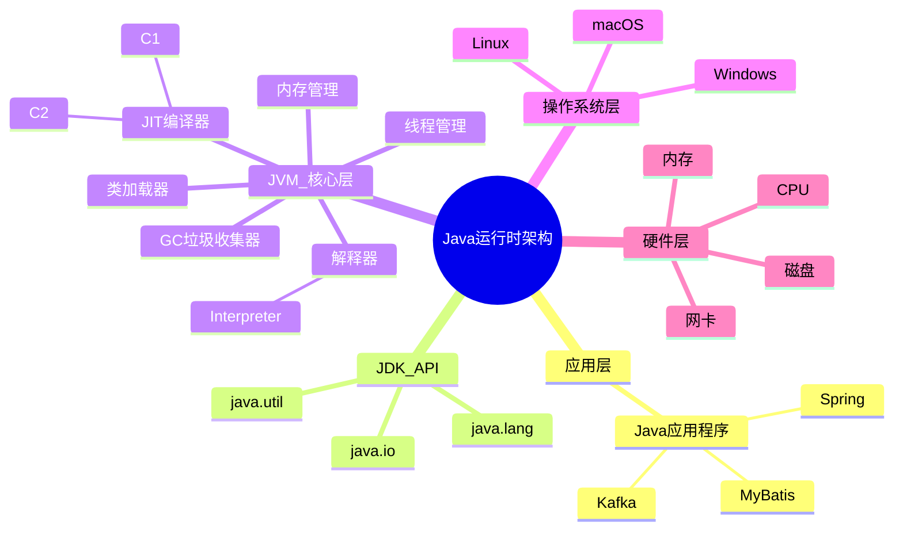
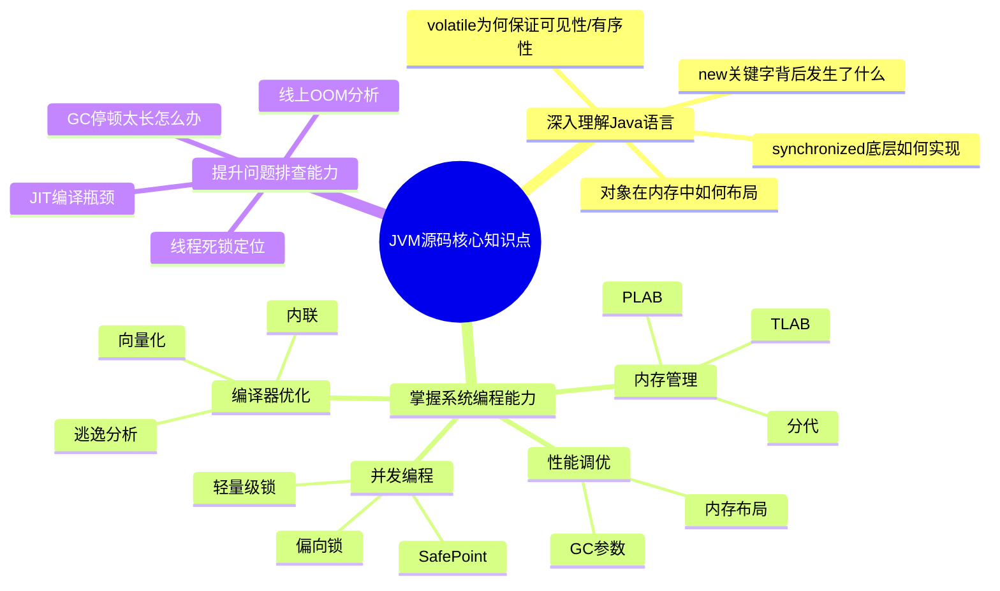
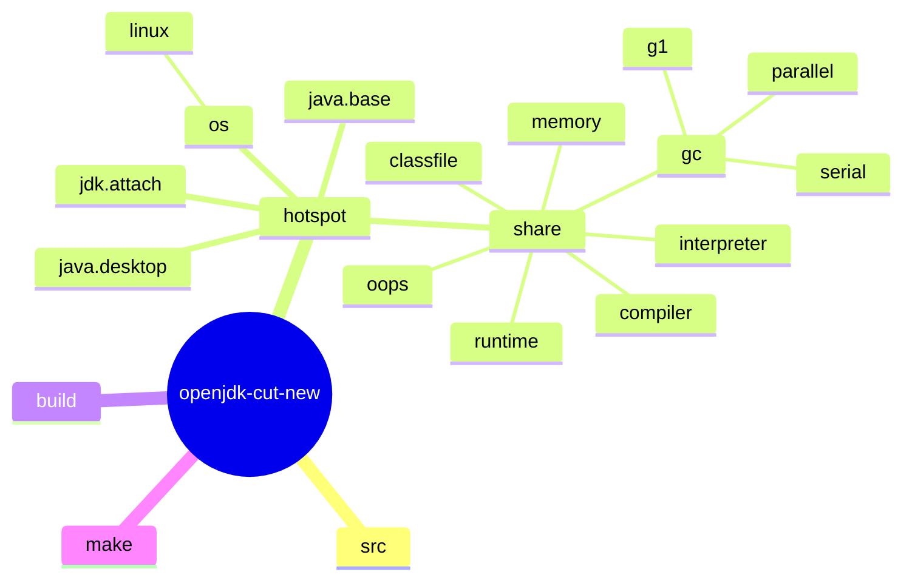
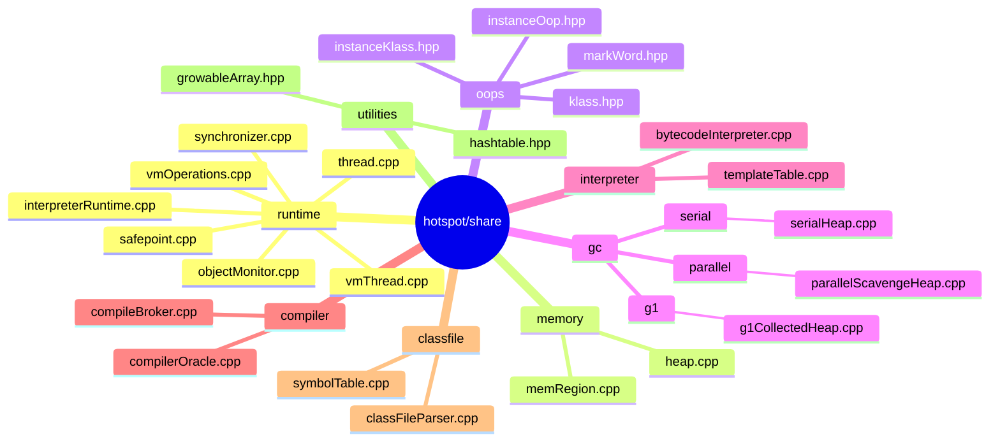
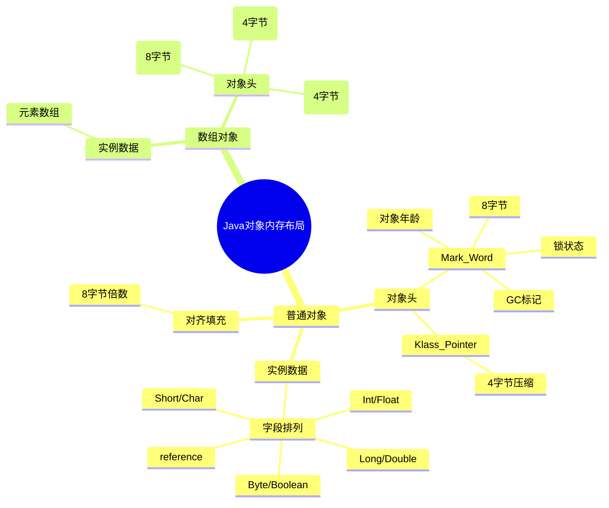
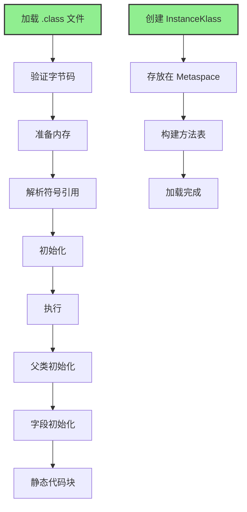
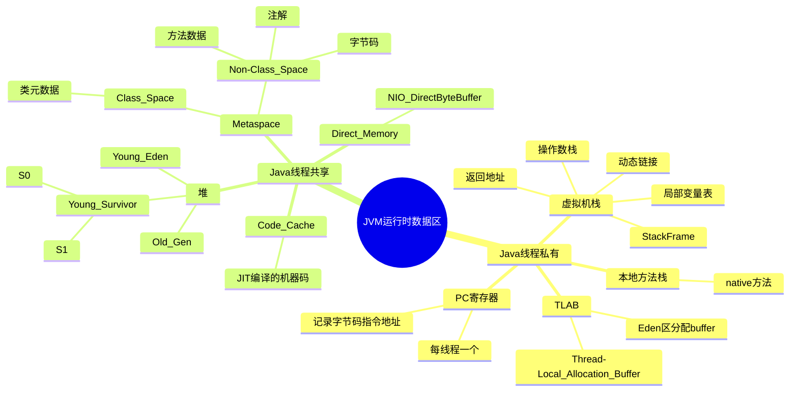
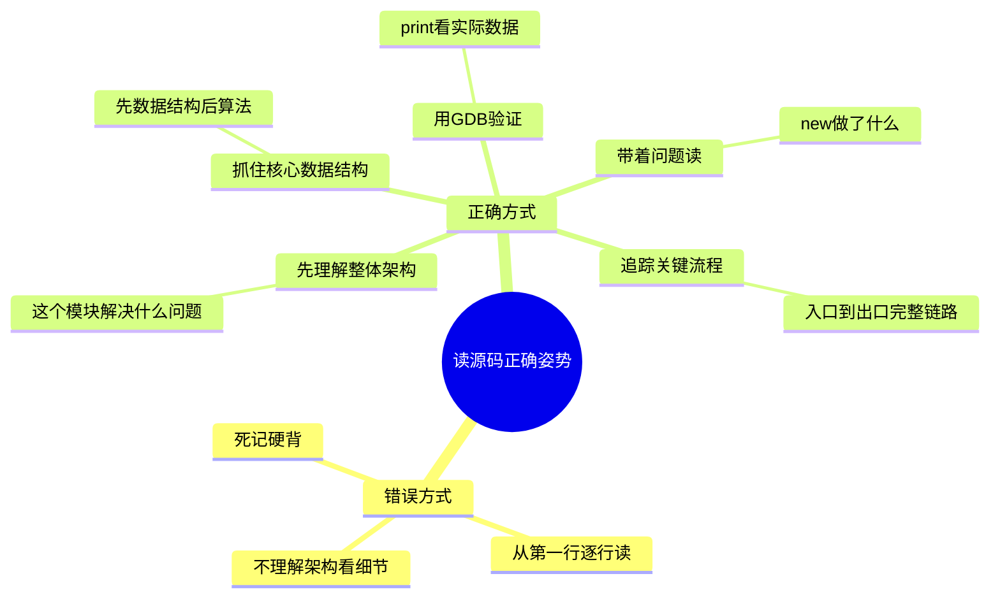
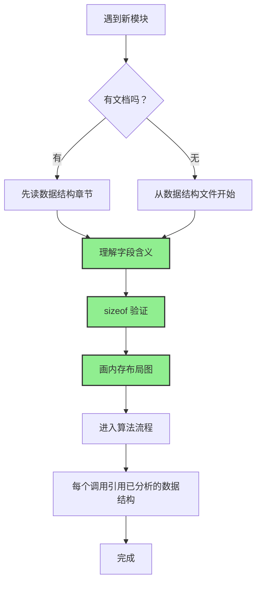
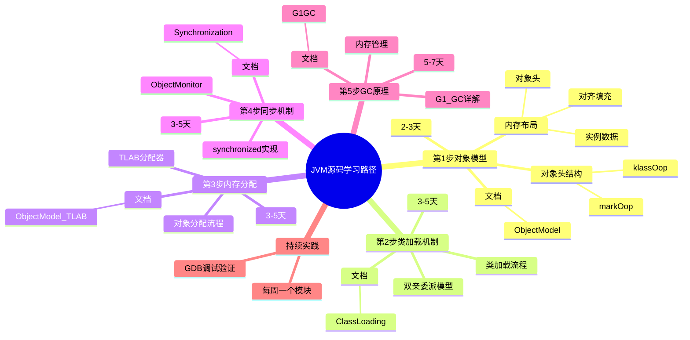

# JVM 源码分析入门指南

> 学习时间：2-4 周  
> 目标：掌握 JVM 源码分析方法，具备独立分析能力

---

## 第 0 部分：核心原理 ⭐

### 0.1 本质是什么？

本文对 **JVM 源码分析入门指南** 进行源码级分析：追踪关键函数的执行路径，分析涉及的数据结构，解释每个设计决策的原因。

### 0.2 为什么需要？

仅靠文档和注释无法完全理解 JVM 的行为——很多关键细节只存在于源码中。源码级分析能建立对 JVM 行为的精确理解。

### 0.3 怎么解决？

从入口函数出发，自顶向下追踪调用链；对每个关键函数，分析其输入/输出/副作用；对每个数据结构，分析其字段含义和生命周期。

### 0.4 为什么这样设计？

分析过程中重点关注「为什么」：为什么选择这个数据结构？为什么这样处理边界情况？这些问题的答案往往揭示了 JVM 设计的精髓。

---


## 1.1 JVM 是什么？为什么要读源码？

### 1.1.1 JVM 在整个系统中的位置



### 1.1.2 为什么需要读 JVM 源码？

| 场景 | 不读源码 | 读源码后 |
|-----|---------|---------|
| **线上故障** | "GC 频繁，但是为什么？" | 能分析 GC 日志，定位问题根因 |
| **性能调优** | "JVM 参数太多了不知道怎么调" | 理解底层机制，调参有理有据 |
| **技术面试** | "背答案，面试官深入就挂" | 源码级理解，面试官刮目相看 |
| **技术选型** | "G1 还是 ZGC？听别人说" | 理解各 GC 原理，做出正确选择 |
| **解决问题** | "OOM 了，怎么分析 dump" | 能理解对象分配、GC  Roots、引用类型 |

### 1.1.3 读 JVM 源码能学到什么？



---

## 1.2 JVM 源码目录结构

### 1.2.1 OpenJDK 整体目录



### 1.2.2 hotspot/share/vm 核心目录



### 1.2.3 快速定位文件

| 想了解... | 看这个文件 | 对应文档位置 |
|---------|-----------|-------------|
| 对象头结构 | `oops/markWord.hpp` | [ObjectModel/1-Oop-Klass-Architecture-Deep-Dive.md](../ObjectModel/1-Oop-Klass-Architecture-Deep-Dive.md) |
| 类加载流程 | `classfile/classLoader.cpp` | [ClassLoading/ClassLoading-Part1-Bootstrap.md](../ClassLoading/ClassLoading-Part1-Bootstrap.md) |
| synchronized | `runtime/objectMonitor.cpp` | [Synchronization/monitor_implementation.md](../Synchronization/monitor_implementation.md) |
| G1 GC | `gc/g1/g1CollectedHeap.cpp` | [G1GC/G1-CollectedHeap-Deep-Dive.md](../G1GC/G1-CollectedHeap-Deep-Dive.md) |
| 解释器 | `interpreter/bytecodeInterpreter.cpp` | [Interpreter/bytecode_interpreter.md](../Interpreter/bytecode_interpreter.md) |
| JIT 编译 | `compiler/compileBroker.cpp` | [Compiler/compilation_pipeline.md](../Compiler/compilation_pipeline.md) |
| SafePoint | `runtime/safepoint.cpp` | [Safepoint/safepoint_mechanism.md](../Safepoint/safepoint_mechanism.md) |

---

## 1.3 核心概念图解

### 1.3.1 Java 对象内存布局



### 1.3.2 类加载流程



### 1.3.3 JVM 运行时数据区



---

## 1.4 开发工具准备

### 1.4.1 源码阅读工具

| 工具 | 用途 | 推荐配置 |
|-----|------|---------|
| **VS Code** | 核心阅读环境 | 插件：C/C++、Rainbow CSV |
| **CLion** | 专业 C++ IDE | 适合大型项目调试 |
| **gedit/kate** | 快速查看 | 轻量级 |
| **Source Insight** | 传统阅读神器 | Windows 下推荐 |

### 1.4.2 调试工具

```bash
# GDB 调试 JVM（核心工具）
# 参考: /data/workspace/c/linux_c/c_syscall/part1_basics/chapter12_debug/
# 详细文档: [GDB 调试 JVM 入门]()
```

```bash
# 编译带调试信息的 JVM
# 参考: /data/workspace/c/linux_c/c_syscall/part1_basics/chapter1_dev_env/
cd /data/workspace/openjdk-cut-new
bash configure --with-debug-level=slowdebug
make all DEBUG_BINARIES=1

# 调试 JVM
cd build/linux-x86_64-normal-server-slowdebug/jdk/bin
gdb ./java

# 设置断点
(gdb) breakInterpreter
(gdb) break HandleMark::HandleMark

# 运行
(gdb) run -Xms512m -Xmx512m -cp /path/to/your/class MainClass

# 常用命令
(gdb) bt              # 查看调用栈
(gdb) p *this         # 打印对象
(gdb) info threads    # 查看线程
(gdb) thread 2        # 切换线程
```

### 1.4.3 源码搜索工具

```bash
# 推荐使用 ctags + cscope
# 参考: /data/workspace/c/linux_c/c_syscall/part1_basics/chapter1_dev_env/
# 在 openjdk 目录下生成标签

cd /data/workspace/openjdk-cut-new/src/hotspot
ctags -R --c++-kinds=+p --fields=+iaS --extra=+q . &
cscope -Rbqk &

# 使用
vim -t ClassLoader   # 跳转到 ClassLoader 定义
Ctrl+]              # 跳转
Ctrl+t              # 返回
```

---

## 1.5 第一个调试案例

### 1.5.1 场景：跟踪 Java 对象创建

**目标**：理解 `new Object()` 在 JVM 内部是如何实现的

**前置条件**：
- 已编译的 OpenJDK（slowdebug 版本）
- GDB 调试工具

**步骤 1：编写测试程序**

```java
// /data/workspace/demo/src/com/wjcoder/jvm/DebugDemo.java
package com.wjcoder.jvm;

public class DebugDemo {
    public static void main(String[] args) {
        Object obj = new Object();  // 在这里设断点
        System.out.println(obj);
    }
}
```

**步骤 2：编译**

```bash
cd /data/workspace/demo
javac src/com/wjcoder/jvm/DebugDemo.java
```

**步骤 3：GDB 调试**

```bash
cd /data/workspace/openjdk-cut-new/build/linux-x86_64-normal-server-slowdebug/jdk/bin

# 启动 GDB
gdb ./java

# 设置断点：在对象分配时停下
(gdb) break InterpreterRuntime::_new

# 设置参数（注意：set args 不加等号）
(gdb) set args -Xms512m -Xmx512m -cp /data/workspace/demo/src com.wjcoder.jvm.DebugDemo

# 运行
(gdb) run

# 程序会在 _new 断点停下，此时查看调用栈
(gdb) bt

# 查看参数：当前正在创建的对象类
(gdb) print *(ConstantPool*)0x12345678
```

**步骤 4：关键源码分析**

```cpp
// src/hotspot/share/interpreter/interpreterRuntime.cpp
IRT_ENTRY(void, InterpreterRuntime::_new(JavaThread* thread, ConstantPool* pool, int index))
  // 1. 从常量池获取类信息
  // 2. 检查类是否已加载
  // 3. 分配内存（TLAB 或 堆）
  // 4. 设置对象头
  // 5. 返回对象引用
IRT_END
```

### 1.5.2 常见调试任务

| 任务 | 断点位置 | 关键观察点 |
|-----|---------|-----------|
| 对象分配 | `InterpreterRuntime::_new` | TLAB vs 堆分配 |
| 方法调用 | `InterpreterRuntime::resolve_invoke` | vtable 调用 |
| 异常抛出 | `InterpreterRuntime::throw_pending_exception` | 异常表查找 |
| GC 根遍历 | `G1CollectedHeap::object_iterate` | roots 枚举 |
| 类加载 | `SystemDictionary::resolve_instance_class_or_null` | 加载器委派 |

---

## 1.6 C++ 基础速查

> JVM 源码主要是 C++，不需要精通，但需要掌握以下基础

### 1.6.1 智能指针

```cpp
// JVM 中大量使用 ResourceMark 管理临时内存
ResourceMark rm;  // 类似 try-with-resources，自动释放内存

// C++ 智能指针（JVM 中不常用，但看源码需要了解）
std::unique_ptr<int> p1(new int(5));
std::shared_ptr<int> p2 = std::make_shared<int>(5);
```

### 1.6.2 模板

```cpp
// JVM 中 GrowableArray 是最常用的模板
GrowableArray<oop>* array = new GrowableArray<oop>(10);
array->push(obj);
oop obj = array->at(0);

// 类似 Java 的 ArrayList<String>
```

### 1.6.3 虚函数与多态

```cpp
// oop 是所有对象的基类
class oop {
public:
    virtual bool is_oop() const { return true; }
    virtual oopDesc* obj() const { return _obj; }
private:
    void* _obj;
};

// instanceOop 继承 oop
class instanceOop : public oop {
public:
    instanceKlass* klass() const;  // 获取类的元数据
};
```

### 1.6.4 常见宏和关键字

| 宏/关键字 | 含义 | 示例 |
|----------|------|------|
| `TRAPS` | 异常处理宏 | `Thread* THREAD` |
| `NOT_PRODUCT` | 非产品版代码 | `NOT_PRODUCT(debug_only(...))`` |
| `assert()` | 断言（debug 版） | `assert(size > 0, "invalid size")` |
| `instanceof` | C++ 中的类型检查 | `if (obj->is_instance())` |
| `static_cast` | 编译期类型转换 | `static_cast<oop>(p)` |
| `reinterpret_cast` | 任意指针转换 | `reinterpret_cast<void*>(p)` |

---

## 1.7 分析方法论

### 1.7.1 读源码的正确姿势



### 1.7.2 数据结构优先原则

> 这是 JVM 分析的核心方法论



### 1.7.3 推荐的 Skill 使用

| 场景 | 使用 Skill | 说明 |
|-----|-----------|------|
| "new Object() 做了什么？" | `Read-TopDown` | 从入口追踪到实现 |
| "InstanceKlass 是干什么的？" | `Read-BottomUp` | 从类出发反向推导 |
| "对象头里的值怎么算出来的？" | `Read-DataFlow` | 追踪值的变化 |
| "轻量级锁和偏向锁有什么区别？" | `Read-Diff` | 对比分析 |
| "为什么需要 GC？" | `Read-WhyNot` | 理解存在理由 |
| "这段代码太复杂了" | `Read-Layered` | 分层剥离 |
| "这个函数需要看多深？" | `Read-Boundary` | 边界探测 |
| "不确定走哪个分支" | `Read-Runtime-First` | GDB 验证 |
| "对象头字段偏移是多少？" | `JVM-Object-Layout` | 内存布局分析 |

---

## 1.8 本章实践任务

### 任务1：搭建开发环境

```bash
# 1. 确认 OpenJDK 源码存在
ls -la /data/workspace/openjdk-cut-new/src/hotspot/share/runtime/

# 2. 安装 GDB（如果未安装）
# 参考: /data/workspace/c/linux_c/c_syscall/part1_basics/chapter1_dev_env/
sudo apt-get install gdb

# 3. 确认 JVM 可执行文件
ls -la /data/workspace/openjdk-cut-new/build/linux-x86_64-normal-server-slowdebug/jdk/bin/java

# 4. 运行测试
/data/workspace/openjdk-cut-new/build/linux-x86_64-normal-server-slowdebug/jdk/bin/java -version
```

### 任务2：定位关键文件

```bash
# 使用 find 命令查找以下文件（答案在表格中）

# 1. 找到对象头定义文件
find /data/workspace/openjdk-cut-new -name "markWord*" 

# 2. 找到类加载器实现
find /data/workspace/openjdk-cut-new -name "classLoader.*"

# 3. 找到 synchronized 实现
find /data/workspace/openjdk-cut-new -name "objectMonitor.*"

# 4. 找到 G1 GC 实现
find /data/workspace/openjdk-cut-new -name "g1CollectedHeap.*"
```

### 任务3：用 GDB 调试 Java 程序

```bash
# 参考 1.5 节的步骤，尝试：
# 1. 用 GDB 启动 java
# 2. 设置断点在 InterpreterRuntime::_new
# 3. 运行任意 Java 程序
# 4. 观察断点命中时的调用栈
```

---

## 1.9 常见问题

### Q1: JVM 源码那么多，从哪里开始？
**A**: 推荐顺序：对象头 → 类加载 → 内存分配 → 同步机制 → GC。参考 [3-Month-Mastery-Plan.md](./3-Month-Mastery-Plan.md)

### Q2: 需要多少 C++ 基础？
**A**: 理解指针、引用、虚函数、模板即可。看 [1.6 节](#16-c-基础速查) 的速查

### Q3: GDB 调试 JVM 很慢怎么办？
**A**: 使用 `hsdis` + `jitwatch` 可视化查看编译后的机器码，或者直接看反汇编

### Q4: 文档里的代码在哪个版本？
**A**: 本文档基于 OpenJDK 11，路径为 `/data/workspace/openjdk-cut-new/`

---

## 1.10 参考资料

### 必读
- 《深入理解 Java 虚拟机》（周志明）- 中文 JVM 入门圣经
- OpenJDK 官方源码： `/data/workspace/openjdk-cut-new/src/hotspot/`
- JVM 规范官方文档： https://docs.oracle.com/javase/specs/

### 选读
- 《The JVM Specification》（Java SE Edition）- 英文原版
- 《Inside the Java Virtual Machine》（Bill Venners）

### 配套资源
- Linux C 编程基础： [../c/linux_c/c_syscall/part1_basics/chapter1_dev_env/README.md](../c/linux_c/c_syscall/part1_basics/chapter1_dev_env/README.md)
- GDB 调试入门： 参考 c 目录对应章节

---

## 1.11 章节检查清单

- [ ] 1.1 理解 JVM 在系统中的位置
- [ ] 1.2 掌握源码目录结构，能快速定位文件
- [ ] 1.3 理解核心概念（对象布局、类加载流程、运行时数据区）
- [ ] 1.4 准备好开发工具（GDB、源码阅读工具）
- [ ] 1.5 完成第一个调试案例
- [ ] 1.6 掌握基本 C++ 语法（智能指针、模板、虚函数）
- [ ] 1.7 理解分析方法论（数据结构优先、带着问题读）

---

## 1.12 下一步学习路径



---

## 1.13 相关文档链接

| 文档 | 说明 |
|-----|------|
| [ObjectModel/1-Oop-Klass-Architecture-Deep-Dive.md](../ObjectModel/1-Oop-Klass-Architecture-Deep-Dive.md) | OOP-Klass 架构 |
| [ObjectModel/4-TLAB-Deep-Dive.md](../ObjectModel/4-TLAB-Deep-Dive.md) | TLAB 深入分析 |
| [ClassLoading/ClassLoading-Part1-Bootstrap.md](../ClassLoading/ClassLoading-Part1-Bootstrap.md) | 启动类加载器 |
| [ClassLoading/class_linking_initialization.md](../ClassLoading/class_linking_initialization.md) | 类链接与初始化 |
| [Synchronization/monitor_implementation.md](../Synchronization/monitor_implementation.md) | synchronized 实现 |
| [G1GC/G1-CollectedHeap-Deep-Dive.md](../G1GC/G1-CollectedHeap-Deep-Dive.md) | G1 GC 深入 |
| [3-Month-Mastery-Plan.md](./3-Month-Mastery-Plan.md) | 三个月精通计划 |

---

## 1.14 本章总结

恭喜您完成了 JVM 源码分析入门指南！现在您已经理解了：

1. **JVM 在整个系统中的位置** - 位于应用层和操作系统层之间
2. **源码目录结构** - hotspot/share/vm 是核心，runtime/memory/oops 是关键
3. **核心概念** - 对象布局、类加载、运行时数据区
4. **开发工具** - GDB 是调试 JVM 的核心工具
5. **分析方法论** - 数据结构优先、带着问题读

**下一步**：开始 [ObjectModel/1-Oop-Klass-Architecture-Deep-Dive.md](../ObjectModel/1-Oop-Klass-Architecture-Deep-Dive.md) 对象模型的学习！

---

**版本历史**
| 版本 | 日期 | 说明 |
|-----|------|------|
| 1.0 | 2026-02-28 | 初始版本，对标 c 目录 Linux C 编程教程风格 |

---

## 参考链接

- OpenJDK 源码： `/data/workspace/openjdk-cut-new/src/hotspot/`
- JVM 规范： https://docs.oracle.com/javase/specs/
- GDB 文档： https://sourceware.org/gdb/documentation/
