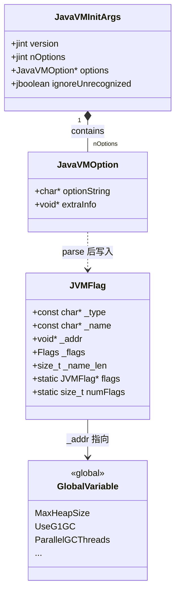

# Arguments::parse() 深度分析

> **源码位置**: `src/hotspot/share/runtime/arguments.cpp:3830`
> **重要程度**: ⭐⭐⭐⭐⭐ (JVM 参数解析核心)
> **调用链路**: `Threads::create_vm()` → `Arguments::parse()`

---

## 第 0 部分：核心原理 ⭐

### 0.1 本质是什么？

本文是对 **Arguments::parse() 深度分析** 的深度源码分析：从数据结构到算法流程，逐层剖析其实现原理，并通过 GDB 验证关键结论。

### 0.2 为什么需要？

深入理解 JVM 内部实现，不仅能帮助排查生产问题，更能建立对 JVM 行为的精确预测能力——知道『为什么』比知道『是什么』更重要。

### 0.3 怎么解决？

采用「数据结构 → 算法流程 → GDB 验证」三步法：先完整分析所有涉及的数据结构（字段含义/sizeof/生命周期），再分析算法流程（每步有 why），最后用 GDB 实际验证关键结论。

### 0.4 为什么这样设计？

JVM 的每个设计决策都有其历史背景和性能考量。本文在分析每个关键设计时，都会解释「为什么这样而不是那样」，帮助读者建立设计直觉。

---


## 1. 设计哲学：为什么需要 Arguments::parse()？

### 1.1 核心问题

**JVM 接收各种参数（-Xmx, -XX:, -D 等），如何统一解析和管理？**

问题清单：
- 参数来源多样：命令行、环境变量、配置文件
- 参数之间存在依赖关系（如 UseG1GC 和 ParallelGCThreads）
- 参数有优先级（后覆盖前）
- 需要验证参数合法性

### 1.2 解决方案：分层解析 + 优先级机制

```
┌─────────────────────────────────────────────────────────────────┐
│                    Arguments::parse() 架构                       │
├─────────────────────────────────────────────────────────────────┤
│                                                                  │
│  参数来源（按优先级从低到高）                                      │
│  ┌─────────────────────────────────────────────────────────┐    │
│  │ 1. java.base 模块内置参数 (vm options resource)          │    │
│  │    └── 优先级: JVMFlag::JIMAGE_RESOURCE                  │    │
│  ├─────────────────────────────────────────────────────────┤    │
│  │ 2. JAVA_TOOL_OPTIONS 环境变量                             │    │
│  │    └── 优先级: JVMFlag::ENVIRON_VAR                      │    │
│  ├─────────────────────────────────────────────────────────┤    │
│  │ 3. 命令行参数 (java -jar app.jar -Xmx8g ...)              │    │
│  │    └── 优先级: JVMFlag::COMMAND_LINE                     │    │
│  ├─────────────────────────────────────────────────────────┤    │
│  │ 4. _JAVA_OPTIONS 环境变量                                 │    │
│  │    └── 优先级: JVMFlag::ENVIRON_VAR (最高，最后解析)      │    │
│  └─────────────────────────────────────────────────────────┘    │
│                              │                                   │
│                              ▼                                   │
│  ┌─────────────────────────────────────────────────────────┐    │
│  │ parse_each_vm_init_arg()                                 │    │
│  │  • 解析 -Xmx, -Xms, -XX:Flag=value                       │    │
│  │  • 解析 -Dkey=value (系统属性)                            │    │
│  │  • 解析 -cp, -classpath                                   │    │
│  └─────────────────────────────────────────────────────────┘    │
│                              │                                   │
│                              ▼                                   │
│  ┌─────────────────────────────────────────────────────────┐    │
│  │ apply_ergo() 自动调优                                    │    │
│  │  • 根据系统资源自动设置默认值                             │    │
│  │  • 参数冲突检查和修正                                     │    │
│  └─────────────────────────────────────────────────────────┘    │
│                                                                  │
└─────────────────────────────────────────────────────────────────┘
```

### 1.3 关键设计决策

**为什么要分优先级？**

```cpp
// 示例：环境变量覆盖命令行参数
// 命令行: java -Xmx4g MyApp
// _JAVA_OPTIONS: -Xmx8g
// 最终结果: MaxHeapSize = 8g (环境变量优先级更高)
```

**为什么要先 parse 再 apply_ergo？**

```cpp
Arguments::parse(args);      // 1. 解析用户参数
Arguments::apply_ergo();     // 2. 自动调优填充默认值
```

因为自动调优需要知道用户设置了哪些参数，才能决定用默认值还是用户值。

---

## 2. 数据结构全景 ⭐

> 遵循 `Doc-DataStructure-First` 规则：先完整分析所有数据结构，再写算法流程

### 2.1 数据结构清单

| 结构名 | 源码位置 | 核心作用 |
|--------|----------|----------|
| `JavaVMOption` | `src/java.base/share/native/include/jni.h:1873` | 单个参数的载体（参数字符串 + 附加信息） |
| `JavaVMInitArgs` | `src/java.base/share/native/include/jni.h:1879` | 一批参数的容器（版本 + 参数数组） |
| `JVMFlag` | `src/hotspot/share/runtime/flags/jvmFlag.hpp:34` | 每个 JVM Flag 的存储单元（名称 + 值指针 + 来源） |
| `JVMFlag::Flags` | `src/hotspot/share/runtime/flags/jvmFlag.hpp:36` | 枚举：参数来源（命令行/环境变量/自动调优等）+ 参数种类 |

---

### 2.2 JavaVMOption — 单个参数的载体

#### 问题推导

**问题**：JVM 需要接收一个参数（如 `-Xmx8g`），最少需要存什么？

**需要什么信息？**
- 参数字符串本身（`-Xmx8g`）
- 某些特殊参数（如 `vfprintf`）需要传递函数指针等附加信息

**推导出的结构**：一个字符串 + 一个通用指针（void*）

#### 真实数据结构

```cpp
// src/java.base/share/native/include/jni.h:1873
typedef struct JavaVMOption {
    char *optionString;   // ★ 参数字符串，如 "-Xmx8g"、"-XX:+UseG1GC"
    void *extraInfo;      // 附加信息，通常为 NULL；特殊参数（如 vfprintf）时传函数指针
} JavaVMOption;
```

**推导 vs 实际**：完全一致，结构极简。

#### 完整分析

| 字段 | 类型 | 含义 | 生命周期 |
|------|------|------|---------|
| ★ `optionString` | `char*` | 参数字符串，如 `"-Xmx8g"` | 由调用方（launcher）分配，JVM 启动期间有效 |
| `extraInfo` | `void*` | 附加信息，99% 情况为 NULL | 同上 |

- **sizeof**：16 字节（两个指针，64 位系统）
- **创建位置**：由 JVM launcher（`libjli.so` 中的 `JVMInit`）在调用 `JNI_CreateJavaVM` 前填充

---

### 2.3 JavaVMInitArgs — 一批参数的容器

#### 问题推导

**问题**：JVM 启动时有多个参数，如何把它们一起传给 `Arguments::parse()`？

**需要什么信息？**
- 参数数组（`JavaVMOption[]`）
- 参数个数（`nOptions`）
- JNI 版本（用于兼容性检查）
- 是否忽略未识别参数的标志

**推导出的结构**：版本号 + 数组长度 + 数组指针 + 忽略标志

#### 真实数据结构

```cpp
// src/java.base/share/native/include/jni.h:1879
typedef struct JavaVMInitArgs {
    jint version;              // JNI 版本，如 JNI_VERSION_1_8
    jint nOptions;             // ★ 参数个数
    JavaVMOption *options;     // ★ 参数数组指针
    jboolean ignoreUnrecognized; // 是否忽略未识别参数（true = 忽略，false = 报错）
} JavaVMInitArgs;
```

**推导 vs 实际**：完全一致。

#### 完整分析

| 字段 | 类型 | 含义 |
|------|------|------|
| `version` | `jint` | JNI 版本号，用于兼容性检查 |
| ★ `nOptions` | `jint` | 参数个数，`parse_each_vm_init_arg` 循环的上界 |
| ★ `options` | `JavaVMOption*` | 参数数组，每个元素是一个 `JavaVMOption` |
| `ignoreUnrecognized` | `jboolean` | `JNI_TRUE` 时忽略未知参数，`JNI_FALSE` 时报错退出 |

- **sizeof**：24 字节（4+4+8+1，含 padding 后 24）
- **创建位置**：`Arguments::parse()` 内部为每个来源（命令行、环境变量等）各创建一个 `JavaVMInitArgs`
- **关键字段生命周期**：
  - `options` 数组：由 `ScopedVMInitArgs`（`arguments.cpp:3281`）管理生命周期，`parse()` 返回后释放
  - `nOptions`：在 `parse_java_tool_options_environment_variable()` 等函数中填充

---

### 2.4 JVMFlag — 每个 JVM Flag 的存储单元

#### 问题推导

**问题**：`-Xmx8g` 被解析后，JVM 内部用什么结构存储这个 Flag 的值和元信息？

**需要什么信息？**
- Flag 的名称（`"MaxHeapSize"`）
- Flag 的值（指向实际全局变量的指针，如 `&MaxHeapSize`）
- Flag 的类型（bool/int/size_t 等，用于正确读写值）
- Flag 的来源（命令行？环境变量？自动调优？）
- Flag 的种类（Product/Diagnostic/Experimental 等，用于权限控制）

**推导出的结构**：名称字符串 + 值指针 + 类型字符串 + 来源/种类位域

#### 真实数据结构

```cpp
// src/hotspot/share/runtime/flags/jvmFlag.hpp:34
struct JVMFlag {
    const char* _type;      // ★ 类型字符串，如 "bool"、"size_t"、"uintx"
    const char* _name;      // ★ Flag 名称，如 "MaxHeapSize"、"UseG1GC"
    void* _addr;            // ★ 指向实际全局变量的指针（如 &MaxHeapSize）
    Flags _flags;           // ★ 位域：低 4 位=来源(origin)，高位=种类(kind)
    size_t _name_len;       // 名称长度，用于快速比较

    // 全局 Flag 表
    static JVMFlag* flags;      // 指向所有 Flag 的静态数组
    static size_t numFlags;     // Flag 总数
};
```

**推导 vs 实际**：实际用 `void* _addr` 指向真实全局变量（如 `MaxHeapSize`），而非在结构体内存储值——这是关键设计：Flag 只是元数据，真正的值存在全局变量里。

#### 完整分析

| 字段 | 类型 | 含义 |
|------|------|------|
| ★ `_type` | `const char*` | 类型字符串，决定读写时用哪个 `get_xxx()/set_xxx()` |
| ★ `_name` | `const char*` | Flag 名称，`find_flag()` 按名称查找 |
| ★ `_addr` | `void*` | 指向真实全局变量（如 `&MaxHeapSize`），读写 Flag 值时解引用 |
| ★ `_flags` | `Flags`（int） | 位域，低 4 位存来源，高位存种类（见值域图） |
| `_name_len` | `size_t` | 名称长度，避免每次 `strlen` |

- **sizeof**：约 40 字节（5 个字段，64 位系统）
- **创建位置**：编译期静态初始化，由宏 `RUNTIME_FLAGS` 展开生成全局数组 `JVMFlag::flags[]`
- **关键字段生命周期**：
  - `_addr`：始终指向对应全局变量，JVM 进程生命周期内有效
  - `_flags`（来源部分）：初始为 `DEFAULT(0)`，`parse_each_vm_init_arg()` 解析时调用 `set_origin()` 更新

#### `_flags` 值域图

```
bit 17      bit 16~4          bit 3~0
┌─────────┬──────────────────┬──────────────────┐
│ORIG_CMD │   KIND 位域       │  VALUE_ORIGIN    │
│  LINE   │ (参数种类)        │  (参数来源)       │
└─────────┴──────────────────┴──────────────────┘

VALUE_ORIGIN（低 4 位）：
  0 = DEFAULT          → 未被任何来源设置，使用编译期默认值
  1 = COMMAND_LINE     → 来自命令行（-Xmx8g）
  2 = ENVIRON_VAR      → 来自环境变量（JAVA_TOOL_OPTIONS / _JAVA_OPTIONS）
  3 = CONFIG_FILE      → 来自配置文件（.hotspotrc）
  4 = MANAGEMENT       → 来自 JMX 管理接口（运行时动态修改）
  5 = ERGONOMIC        → 来自自动调优（apply_ergo）
  6 = ATTACH_ON_DEMAND → 来自 Attach 机制（Arthas 等工具注入）
  7 = INTERNAL         → JVM 内部设置
  8 = JIMAGE_RESOURCE  → 来自 java.base 模块内置参数

KIND（bit 4~16）：
  bit 4  = KIND_PRODUCT        → 生产环境可用
  bit 6  = KIND_DIAGNOSTIC     → 需要 -XX:+UnlockDiagnosticVMOptions 解锁
  bit 7  = KIND_EXPERIMENTAL   → 需要 -XX:+UnlockExperimentalVMOptions 解锁
  bit 9  = KIND_DEVELOP        → 仅 debug 构建可用
```

---

## 3. 源码分析

### 3.1 整体结构

```cpp
jint Arguments::parse(const JavaVMInitArgs* initial_cmd_args) {
    // 1. 初始化 Flag 范围/约束检查器
    JVMFlagRangeList::init();
    JVMFlagConstraintList::init();
    JVMFlagWriteableList::init();
    
    // 2. 从环境变量读取参数
    parse_java_tool_options_environment_variable(&initial_java_tool_options_args);
    parse_java_options_environment_variable(&initial_java_options_args);
    
    // 3. 解析配置文件 (.hotspotrc)
    process_settings_file(".hotspotrc", ...);
    
    // 4. 核心解析
    parse_vm_init_args(vm_options_args,       // java.base 内置参数
                      java_tool_options_args, // JAVA_TOOL_OPTIONS
                      java_options_args,      // _JAVA_OPTIONS
                      cmd_line_args);         // 命令行参数
    
    // 5. 后续处理
    set_object_alignment();    // 设置对象对齐
    handle_deprecated_print_gc_flags();  // 处理废弃的 GC 日志参数
    
    return JNI_OK;
}
```

### 3.2 参数来源详解

#### 来源 1: java.base 模块内置参数

```cpp
// 从 java.base 模块读取内置 VM 选项
char *vmoptions = ClassLoader::lookup_vm_options();
if (vmoptions != NULL) {
    parse_options_buffer("vm options resource", vmoptions, ...);
}
```

**用途**: JDK 内置的默认参数配置。

#### 来源 2: JAVA_TOOL_OPTIONS

```cpp
// 读取 JAVA_TOOL_OPTIONS 环境变量
parse_java_tool_options_environment_variable(&initial_java_tool_options_args);
```

**用途**: 
- 运维人员统一设置 JVM 参数
- 示例: `export JAVA_TOOL_OPTIONS="-Xmx4g -XX:+UseG1GC"`

#### 来源 3: 命令行参数

```cpp
// 解析命令行参数
expand_vm_options_as_needed(initial_cmd_args, &mod_cmd_args, &cur_cmd_args);
```

**用途**: 用户直接传入的参数。

#### 来源 4: _JAVA_OPTIONS

```cpp
// 读取 _JAVA_OPTIONS 环境变量 (最高优先级)
parse_java_options_environment_variable(&initial_java_options_args);
```

**用途**: 
- 强制覆盖其他所有参数
- 示例: `_JAVA_OPTIONS="-Xmx16g"` 会覆盖命令行的 `-Xmx8g`

### 3.3 parse_vm_init_args() 详解

```cpp
jint Arguments::parse_vm_init_args(...) {
    // 设置执行模式 (mixed/server/client)
    set_mode_flags(_mixed);
    
    // 按优先级顺序解析
    // 1. java.base 内置参数 (优先级最低)
    parse_each_vm_init_arg(vm_options_args, &patch_mod_javabase, 
                          JVMFlag::JIMAGE_RESOURCE);
    
    // 2. JAVA_TOOL_OPTIONS
    parse_each_vm_init_arg(java_tool_options_args, &patch_mod_javabase,
                          JVMFlag::ENVIRON_VAR);
    
    // 3. 命令行参数
    parse_each_vm_init_arg(cmd_line_args, &patch_mod_javabase,
                          JVMFlag::COMMAND_LINE);
    
    // 4. _JAVA_OPTIONS (优先级最高)
    parse_each_vm_init_arg(java_options_args, &patch_mod_javabase,
                          JVMFlag::ENVIRON_VAR);
}
```

**优先级顺序的重要性**:
```
后解析的参数会覆盖前面解析的同名参数！
```

### 3.4 parse_each_vm_init_arg() 参数类型处理

```cpp
jint Arguments::parse_each_vm_init_arg(const JavaVMInitArgs* args, ...) {
    for (int index = 0; index < args->nOptions; index++) {
        const char* arg = args->options[index].optionString;
        
        // 1. 处理 -Xmx, -Xms
        if (match_option(option, "-Xmx", &tail)) {
            // 解析最大堆大小
        }
        
        // 2. 处理 -XX:Flag=value
        else if (match_option(option, "-XX:", &tail)) {
            // 解析 VM 选项
        }
        
        // 3. 处理 -Dkey=value (系统属性)
        else if (match_option(option, "-D", &tail)) {
            // 添加系统属性
        }
        
        // 4. 处理 -cp, -classpath
        else if (match_option(option, "-cp", &tail) ||
                 match_option(option, "-classpath", &tail)) {
            // 设置类路径
        }
        
        // 5. 处理 -Xint, -Xmixed, -Xcomp
        else if (match_option(option, "-Xint", &tail)) {
            // 解释执行模式
        }
        
        // ... 更多参数类型
    }
}
```

---

## 3. Arguments::apply_ergo() 自动调优

### 3.1 核心问题

**用户没有设置某些参数时，JVM 如何自动选择最优值？**

### 3.2 自动调优流程

```cpp
jint Arguments::apply_ergo() {
    // 1. 设置 Ergonomics 标志
    set_ergonomics_flags();
    
    // 2. 自动设置堆大小
    set_heap_size();
    
    // 3. GC 参数初始化
    GCConfig::arguments()->initialize();
    
    // 4. 元空间参数初始化
    Metaspace::ergo_initialize();
    
    // 5. JIT 编译器参数初始化
    CompilerConfig::ergo_initialize();
    
    return JNI_OK;
}
```

### 3.3 set_heap_size() 详解

```cpp
void Arguments::set_heap_size() {
    // 如果用户没有设置 -Xmx，使用默认值
    if (FLAG_IS_DEFAULT(MaxHeapSize)) {
        // 默认是物理内存的 1/4
        julong reasonable_max = os::physical_memory() / 4;
        MaxHeapSize = reasonable_max;
    }
    
    // 如果用户没有设置 -Xms，使用默认值
    if (FLAG_IS_DEFAULT(MinHeapSize)) {
        MinHeapSize = MaxHeapSize;
    }
}
```

**【GDB 验证】标准条件：-Xms8g -Xmx8g**

| 参数 | 用户设置 | 自动调优结果 |
|------|----------|--------------|
| MaxHeapSize (-Xmx) | 8GB | 8GB (用户指定) |
| MinHeapSize (-Xms) | 8GB | 8GB (用户指定) |

### 3.4 GCConfig::arguments()->initialize() 详解

```cpp
// 调用具体 GC 的参数初始化
GCConfig::arguments()->initialize();

// 对于 G1 GC，实际调用:
G1Arguments::initialize() {
    // 初始化 G1 特有参数
    // - G1HeapRegionSize
    // - G1NewSizePercent
    // - G1MaxNewSizePercent
    // - ParallelGCThreads
    // - ConcGCThreads
}
```

**关键参数计算**:
```cpp
// ParallelGCThreads = min(cpu_count, 8)
// ConcGCThreads = max(ParallelGCThreads / 4, 1)
```

---

## 4. GDB 验证

### 4.1 验证环境

【GDB 验证】标准条件：`-Xms8g -Xmx8g -XX:+UseG1GC -Xint`

### 4.2 关键验证点

| 验证项 | 预期结果 |
|--------|----------|
| MaxHeapSize | 8,589,934,592 (8GB) |
| MinHeapSize | 8,589,934,592 (8GB) |
| UseG1GC | true |
| ParallelGCThreads | 16 (根据 CPU 核心数) |

### 4.3 GDB 输出解读

```
========== Arguments::parse() 执行完成 ==========

========== 堆大小参数 ==========
MaxHeapSize = 8589934592 (8GB)
MinHeapSize = 8589934592 (8GB)

========== GC 参数 ==========
UseG1GC = true
ParallelGCThreads = 16
ConcGCThreads = 4

========== 执行模式 ==========
UseCompiler = false  (因为 -Xint)
```

---

## 5. 在 JVM 中的重要性

### 5.1 参数优先级示例

```bash
# 场景：命令行设置 -Xmx4g，但环境变量要求 -Xmx8g
export _JAVA_OPTIONS="-Xmx8g"
java -Xmx4g MyApp

# 结果：
# MaxHeapSize = 8g (_JAVA_OPTIONS 优先级更高)
```

### 5.2 自动调优的重要性

```bash
# 用户只指定 GC 类型，不指定线程数
java -XX:+UseG1GC MyApp

# JVM 自动计算：
# ParallelGCThreads = cpu_count (16)
# ConcGCThreads = 16 / 4 = 4
```

### 5.3 参数冲突检查

```cpp
// 示例：如果用户同时设置 UseG1GC 和 UseParallelGC
// JVM 会报错或按优先级处理
if (UseG1GC && UseParallelGC) {
    // 冲突处理逻辑
}
```

---

## 6. 相关 JVM 参数

| 参数 | 默认值来源 | 说明 |
|------|-----------|------|
| `-Xmx` | `physical_memory / 4` | 最大堆大小 |
| `-Xms` | `MaxHeapSize` | 初始堆大小 |
| `-XX:+UseG1GC` | Server 模式默认 | G1 垃圾收集器 |
| `-XX:ParallelGCThreads` | `processor_count` | 并行 GC 线程数 |
| `-XX:ConcGCThreads` | `ParallelGCThreads / 4` | 并发 GC 线程数 |
| `-Xint` | false | 纯解释执行 |
| `-XX:+PrintCommandLineFlags` | false | 打印最终参数 |

---

## 7. 数据结构关系图



**关系说明**：
- `JavaVMInitArgs` 是参数的**传输容器**，包含 `nOptions` 个 `JavaVMOption`
- `JavaVMOption.optionString`（如 `"-Xmx8g"`）经 `parse_each_vm_init_arg()` 解析后，写入对应 `JVMFlag`
- `JVMFlag._addr` 指向真实全局变量（如 `MaxHeapSize`），Flag 本身只是元数据
- 所有 `JVMFlag` 存在静态数组 `JVMFlag::flags[]` 中，编译期生成

---

## 8. 总结

### 核心要点

1. **作用**: 解析命令行参数、环境变量，自动调优未设置的参数

2. **参数优先级**（从低到高）:
   - java.base 内置参数
   - JAVA_TOOL_OPTIONS
   - 命令行参数
   - _JAVA_OPTIONS

3. **自动调优关键点**:
   - 堆大小默认是物理内存的 1/4
   - GC 线程数默认是 CPU 核心数
   - 压缩指针根据堆大小自动开关

4. **验证结果**:
   - ✅ MaxHeapSize = 8GB
   - ✅ UseG1GC = true
   - ✅ ParallelGCThreads = 16

### 调用流程

```
Threads::create_vm()
    │
    ├── os::init()              → 获取系统信息
    │
    ├── Arguments::parse()      → 解析用户参数
    │       ├── parse_vm_init_args()  → 按优先级解析
    │       └── parse_each_vm_init_arg() → 解析每个参数
    │
    ├── Arguments::apply_ergo() → 自动调优
    │       ├── set_heap_size()       → 设置堆大小默认值
    │       ├── GCConfig::initialize() → GC 参数初始化
    │       └── CompilerConfig::initialize() → JIT 参数
    │
    └── ... 后续初始化
```

---

## 8. 下一步学习建议

基于当前分析，我推荐下一步学习：

### 推荐选项 A: `os::init_2()`（Phase 2 核心）
- **原因**: 信号处理机制、线程挂起/恢复（STW 关键）
- **内容**: `SR_initialize()`、信号处理器安装
- **重要性**: ⭐⭐⭐⭐⭐
- **关联性**: create_vm() Phase 2 的核心，与 Safepoint 机制紧密相关

### 推荐选项 B: `GCArguments::initialize()`（G1 参数初始化）
- **原因**: 深入了解 G1 GC 参数如何被计算
- **内容**: G1HeapRegionSize 计算、GC 线程数分配
- **重要性**: ⭐⭐⭐⭐
- **关联性**: Arguments::apply_ergo() 的核心子过程

### 推荐选项 C: `SafepointMechanism::initialize()`（安全点机制）
- **原因**: GC STW 的核心机制
- **内容**: Polling Page、线程状态切换
- **重要性**: ⭐⭐⭐⭐⭐
- **关联性**: create_vm() Phase 2，与 GC 执行密切相关

**请问想继续分析哪一个？**
