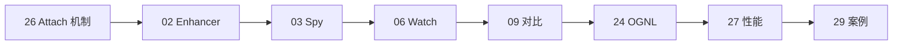
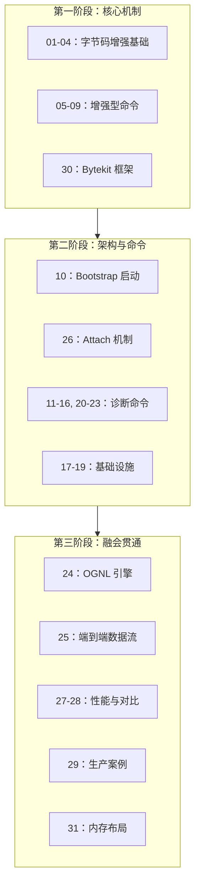
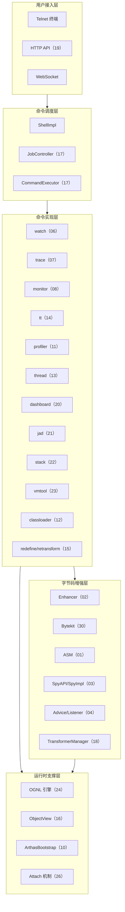
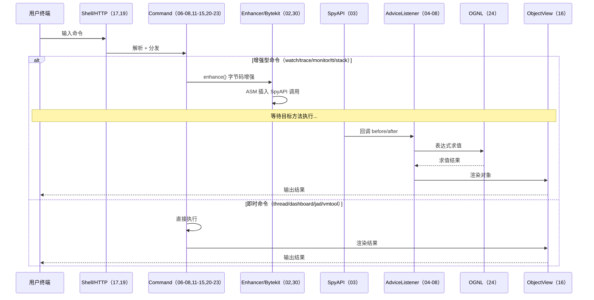

# Arthas 核心源码深度分析 — 总索引

> 基于 Arthas 4.1.2 源码分析
> 方法论：程序 = 数据结构 + 算法
> 源码位置：`/data/workspace/arthas-4.1.2/arthas/core/src/main/java/com/taobao/arthas/core/`
> 总计 32 篇文档（含前置知识），约 28,400 行

---

## 零、前置知识

> 零基础读者请先阅读此文档，再进入正式分析系列

| # | 文档 | 行数 | 主题 |
|---|------|------|------|
| 00 | [前置知识：从 Java 源码到字节码增强](00-Prerequisites.md) | ~320 | 字节码基础、Java Agent 机制、ClassLoader 隔离、Arthas 整体架构 |

---

## 一、文档全景图

```mermaid
flowchart TB
    subgraph Foundation["基础层（01-04）"]
        direction TB
        F1["01 ASM 框架前置知识"]
        F2["02 Enhancer 字节码增强"]
        F3["03 Spy 拦截器机制"]
        F4["04 Advice 上下文"]
    end

    subgraph Command["命令层（05-15, 20-23）"]
        direction TB
        C0["05 EnhancerCommand 基类"]
        C1["06 watch 命令"]
        C2["07 trace 命令"]
        C3["08 monitor 命令"]
        C4["09 watch/trace/monitor 对比"]
        C5["11 profiler 命令"]
        C6["12 classloader 命令"]
        C7["13 thread 命令"]
        C8["14 tt 时光隧道命令"]
        C9["15 redefine/retransform"]
        C10["20 dashboard 命令"]
        C11["21 jad 命令"]
        C12["22 stack 命令"]
        C13["23 vmtool 命令"]
    end

    subgraph Infra["基础设施层（10, 16-19）"]
        direction TB
        I1["10 ArthasBootstrap 启动"]
        I2["16 ObjectView 对象渲染"]
        I3["17 CommandExecutor 命令执行"]
        I4["18 TransformerManager"]
        I5["19 HTTP API"]
    end

    subgraph Cross["横切分析（24-31）"]
        direction TB
        X1["24 OGNL 表达式引擎"]
        X2["25 端到端数据流"]
        X3["26 Attach 机制"]
        X4["27 性能影响分析"]
        X5["28 工具对比"]
        X6["29 生产实战案例"]
        X7["30 Bytekit 框架"]
        X8["31 对象内存布局"]
    end

    Foundation --> Command
    Foundation --> Infra
    Command --> Cross
    Infra --> Cross
```

---

## 二、完整文档清单

### 第一篇章：字节码增强核心（01-04）

| # | 文档 | 行数 | 主题 | 面试权重 |
|---|------|------|------|----------|
| 01 | [ASM 框架前置知识](01-ASM-Framework-Prerequisite.md) | 1,293 | ASM Visitor 模式、ClassReader/ClassWriter/ClassVisitor、字节码结构 | ⭐⭐⭐ |
| 02 | [Enhancer 字节码增强](02-Enhancer-Deep-Dive.md) | 897 | Enhancer.enhance() 全流程、ClassFileTransformer 注册、字节码重转换 | ⭐⭐⭐⭐⭐ |
| 03 | [Spy 拦截器机制](03-Spy-Interceptor-Deep-Dive.md) | 590 | SpyAPI → SpyImpl → AdviceListenerManager 回调链、Bootstrap 可见性 | ⭐⭐⭐⭐⭐ |
| 04 | [Advice 上下文](04-Advice-Context-Deep-Dive.md) | 380 | Advice 10 字段、AdviceListener 7 回调、对象内存布局 48 字节 | ⭐⭐⭐⭐ |

**阅读路径**：01 → 02 → 03 → 04（依赖递进，必须按序）

### 第二篇章：增强型命令（05-09）

| # | 文档 | 行数 | 主题 | 面试权重 |
|---|------|------|------|----------|
| 05 | [EnhancerCommand 基类](05-EnhancerCommand-Deep-Dive.md) | 842 | enhance() 模板方法、AdviceListener 注册/销毁生命周期 | ⭐⭐⭐⭐ |
| 06 | [WatchCommand](06-WatchCommand-Deep-Dive.md) | 672 | 条件过滤 + OGNL 求值、WatchAdviceListener 40 字节 | ⭐⭐⭐⭐⭐ |
| 07 | [TraceCommand](07-TraceCommand-Deep-Dive.md) | 672 | TraceTree 调用树构建、MethodNode 104 字节、耗时计算 | ⭐⭐⭐⭐⭐ |
| 08 | [MonitorCommand](08-MonitorCommand-Deep-Dive.md) | 684 | CAS 原子聚合、MonitorData 48 字节、定时输出 | ⭐⭐⭐⭐ |
| 09 | [Watch/Trace/Monitor 对比](09-Watch-Trace-Monitor-Comparison.md) | 272 | 三命令数据结构/算法/性能/场景横向对比 | ⭐⭐⭐⭐⭐ |

**阅读路径**：05（基类）→ 06/07/08（任意顺序）→ 09（对比总结）

### 第三篇章：核心架构（10, 17-19）

| # | 文档 | 行数 | 主题 | 面试权重 |
|---|------|------|------|----------|
| 10 | [ArthasBootstrap 启动](10-ArthasBootstrap-Deep-Dive.md) | 1,129 | bind() 全流程、6 大核心服务初始化、优雅关闭 | ⭐⭐⭐⭐⭐ |
| 17 | [CommandExecutor 命令执行](17-CommandExecutor-Deep-Dive.md) | 733 | 命令查找/匹配/执行、Job/Process 生命周期 | ⭐⭐⭐ |
| 18 | [TransformerManager](18-TransformerManager-Deep-Dive.md) | 551 | 三链 Transformer（reset/watch/trace）、CopyOnWriteArrayList | ⭐⭐⭐⭐ |
| 19 | [HTTP API](19-HttpApiHandler-Deep-Dive.md) | 780 | exec_sync/exec_async、API Action 分发、结果 JSON 化 | ⭐⭐⭐ |

### 第四篇章：诊断命令（11-16, 20-23）

| # | 文档 | 行数 | 主题 | 面试权重 |
|---|------|------|------|----------|
| 11 | [ProfilerCommand](11-ProfilerCommand-Deep-Dive.md) | 993 | async-profiler 集成、CPU/Alloc/Lock 采样、动态库加载 | ⭐⭐⭐⭐⭐ |
| 12 | [ClassLoaderCommand](12-ClassLoaderCommand-Deep-Dive.md) | 945 | ClassLoader 树遍历、类搜索、资源定位 | ⭐⭐⭐⭐⭐ |
| 13 | [ThreadCommand](13-ThreadCommand-Deep-Dive.md) | 774 | CPU 采样、死锁检测、线程状态统计 | ⭐⭐⭐⭐ |
| 14 | [TimeTunnelCommand (tt)](14-TimeTunnelCommand-Deep-Dive.md) | 1,344 | 方法调用录制/重放、TimeFragment、ObjectStack | ⭐⭐⭐⭐ |
| 15 | [Redefine/Retransform](15-RedefineRetransform-Deep-Dive.md) | 737 | 热替换 vs 重转换、Instrumentation API 差异 | ⭐⭐⭐⭐⭐ |
| 16 | [ObjectView 对象渲染](16-ObjectView-Deep-Dive.md) | 694 | 递归展开、深度/宽度限制、循环引用检测 | ⭐⭐⭐ |
| 20 | [DashboardCommand](20-DashboardCommand-Deep-Dive.md) | 1,071 | 线程/内存/GC/Runtime 四面板、定时刷新 | ⭐⭐⭐ |
| 21 | [JadCommand (jad)](21-JadCommand-Deep-Dive.md) | 959 | 字节码获取 → CFR 反编译 → 源码输出 | ⭐⭐⭐⭐ |
| 22 | [StackCommand (stack)](22-StackCommand-Deep-Dive.md) | 1,144 | Thread.getStackTrace()、调用栈过滤 | ⭐⭐⭐ |
| 23 | [VmToolCommand (vmtool)](23-VmToolCommand-Deep-Dive.md) | 1,242 | JVMTI 原生能力封装、getInstances/forceGC | ⭐⭐⭐⭐ |

### 第五篇章：横切分析（24-31）

| # | 文档 | 行数 | 主题 | 面试权重 |
|---|------|------|------|----------|
| 24 | [OGNL 表达式引擎](24-OGNL-Engine-Deep-Dive.md) | 1,080 | 表达式编译/求值、ClassLoader 隔离、ThreadLocal 复用 | ⭐⭐⭐⭐⭐ |
| 25 | [端到端数据流](25-End-to-End-DataFlow.md) | 1,284 | Shell → Job → Process → Command → Result → View 全链路 | ⭐⭐⭐⭐⭐ |
| 26 | [Attach 机制](26-Attach-Mechanism-Deep-Dive.md) | 1,264 | arthas-boot → VirtualMachine.attach → agentmain → ClassLoader 隔离 | ⭐⭐⭐⭐⭐ |
| 27 | [性能影响分析](27-Performance-Impact-Analysis.md) | 1,285 | 各命令开销量化、OGNL 瓶颈、开销爆炸场景 | ⭐⭐⭐⭐ |
| 28 | [工具对比](28-Tool-Comparison.md) | 609 | Arthas vs async-profiler vs JProfiler 实现/功能/性能/成本 | ⭐⭐⭐⭐ |
| 29 | [生产实战案例](29-Production-Cases.md) | 1,080 | 9 个生产案例（CPU 飙高/慢查询/内存泄漏/死锁/热修复...） | ⭐⭐⭐⭐⭐ |
| 30 | [Bytekit 框架](30-Bytekit-Framework-Deep-Dive.md) | 909 | @Binding 注解 → ASM 指令生成、SpyInterceptors 三拦截器 | ⭐⭐⭐⭐ |
| 31 | [对象内存布局](31-Object-Memory-Layout-Analysis.md) | 876 | 12 个核心类精确布局、CompressedOops 影响、估算纠正 | ⭐⭐⭐ |

---

## 三、按主题的推荐阅读路径

### 路径 A：面试速成（8 篇，约 7,000 行）

> 适合 2-3 天突击准备 Arthas 面试

| 顺序 | 文档 | 学到什么 |
|------|------|----------|
| 1 | 26-Attach | Arthas 怎么注入到目标 JVM |
| 2 | 02-Enhancer | 字节码增强核心流程 |
| 3 | 03-Spy | 方法拦截回调机制 |
| 4 | 06-Watch | 最常用命令的完整实现 |
| 5 | 09-Comparison | watch/trace/monitor 区别一网打尽 |
| 6 | 24-OGNL | 表达式引擎为什么是性能瓶颈 |
| 7 | 27-Performance | 性能开销量化数据 |
| 8 | 29-Cases | 9 个生产案例展示源码理解深度 |

### 路径 B：全面掌握（全部 31 篇）

> 适合系统学习 Arthas 内部实现

### 路径 C：按问题查阅

| 面试问题 | 直达文档 |
|----------|----------|
| "Arthas 怎么连接到运行中的 JVM？" | 26-Attach |
| "watch 命令底层怎么实现？" | 02-Enhancer → 03-Spy → 06-Watch |
| "watch/trace/monitor 区别？" | 09-Comparison |
| "Arthas 对性能有多大影响？" | 27-Performance |
| "OGNL 表达式为什么慢？" | 24-OGNL |
| "字节码增强怎么做的？" | 01-ASM → 02-Enhancer → 30-Bytekit |
| "redefine 和 retransform 区别？" | 15-RedefineRetransform |
| "Arthas 和 async-profiler 区别？" | 28-Tool-Comparison |
| "profiler 命令底层原理？" | 11-Profiler |
| "ClassLoader 隔离怎么实现？" | 12-ClassLoader + 26-Attach |
| "从输入命令到看到结果经历了什么？" | 25-End-to-End-DataFlow |
| "tt 命令怎么实现重放？" | 14-TimeTunnel |
| "生产环境怎么用 Arthas？" | 29-Production-Cases |

---

## 四、核心架构一览

### 4.1 Arthas 五层架构

### 4.2 数据流全景

---

## 五、统计信息

| 指标 | 数值 |
|------|------|
| 分析文档总数 | 31 篇 |
| 文档总行数 | ~27,800 行 |
| 涉及 Arthas 源码文件 | 60+ 个 |
| Mermaid 图表总数 | 100+ 个 |
| 面试 ⭐⭐⭐⭐⭐ 文档 | 12 篇 |
| 面试 ⭐⭐⭐⭐ 文档 | 11 篇 |

### 各篇章行数分布

| 篇章 | 文档数 | 总行数 | 占比 |
|------|--------|--------|------|
| 字节码增强核心（01-04） | 4 | 3,160 | 11% |
| 增强型命令（05-09） | 5 | 3,342 | 12% |
| 核心架构（10,17-19） | 4 | 3,193 | 12% |
| 诊断命令（11-16,20-23） | 10 | 9,798 | 35% |
| 横切分析（24-31） | 8 | 8,287 | 30% |

---

## 六、文档质量标准

所有文档遵循统一规范：

1. **方法论**：程序 = 数据结构 + 算法
2. **结构模板**：第 0 部分（核心原理）→ 第 1 部分（数据结构全景）→ 第 2 部分（算法/流程）→ 数据结构关系图 → 总结
3. **源码深度**：L4+ 标准（真实源码 + 逐行注释 + 设计解释），禁止伪代码
4. **每个函数 4 要素**：源码文件:行号、解决什么问题、真实源码+注释、设计决策
5. **数据结构 6 项**：全部字段、含义、sizeof、创建位置、关键字段生命周期、值域图
6. **必含 Mermaid 图**：流程图 + 数据结构关系图
7. **对象内存布局**：关键结构均有精确字节级布局（CompressedOops 开启）

---

*索引版本：v3.0*
*更新日期：2026-03-01*
*基于 Arthas 4.1.2 源码，全部 31 篇文档已完成*
