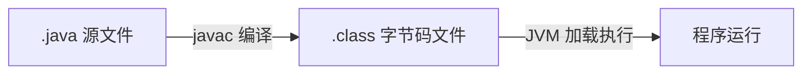
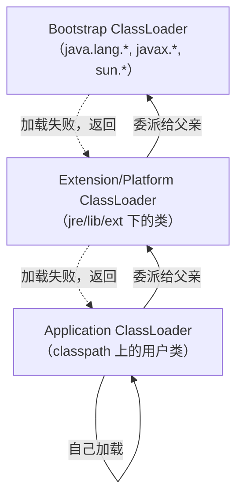
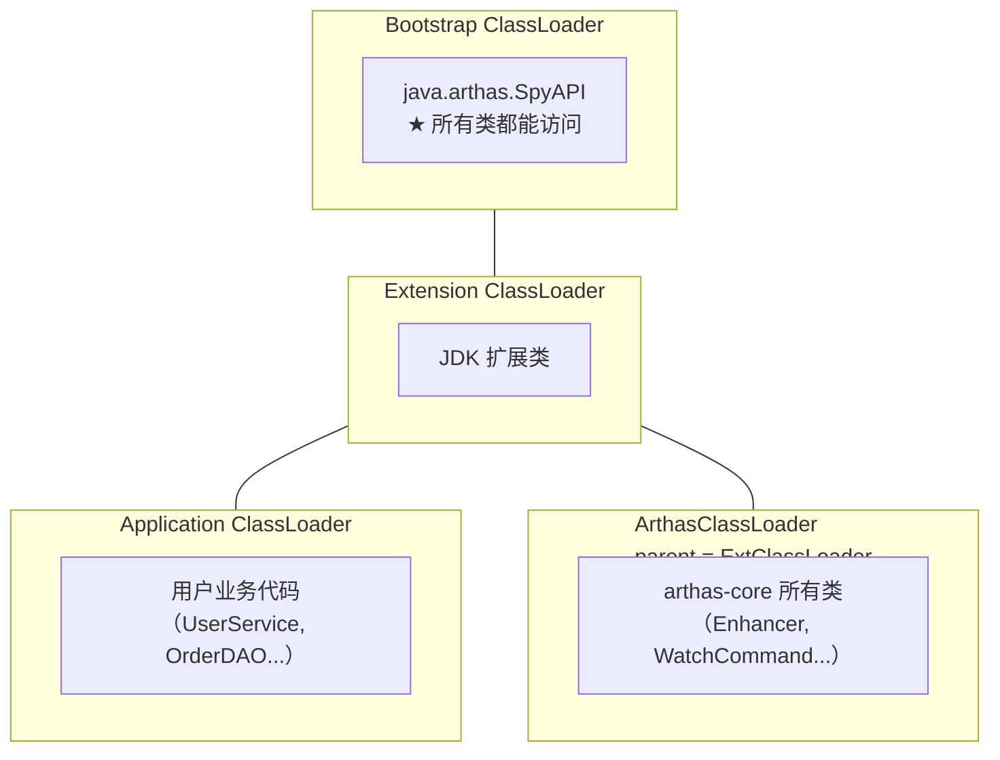
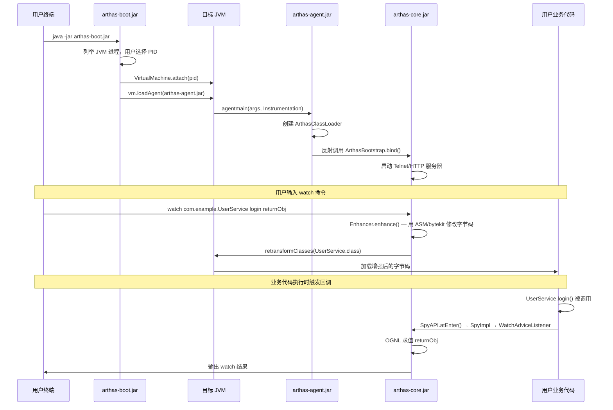
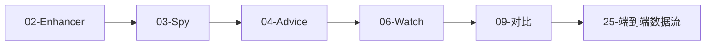

# 前置知识：从 Java 源码到字节码增强

> 阅读 Arthas 源码分析系列之前，你需要了解的背景知识
> 不需要精通，只需要"知道是什么、为什么需要"
> 预计阅读时间：30-40 分钟

---

## 第 0 部分：核心原理 ⭐

### 0.1 本质是什么？

本文深入分析 **前置知识：从 Java 源码到字节码增强**：从源码角度理解其设计原理、实现机制和关键细节。

### 0.2 为什么需要？

理解 JVM 内部实现是排查复杂问题、进行性能优化的基础。表面的 API 文档无法解释 JVM 的实际行为，只有深入源码才能建立精确的心智模型。

### 0.3 怎么解决？

结合源码阅读、数据结构分析和 GDB 运行时验证，从多个角度建立对该机制的完整理解。

### 0.4 为什么这样设计？

每个设计决策都有其权衡：性能 vs 正确性、简单性 vs 灵活性、内存占用 vs 查找速度。理解这些权衡是理解 JVM 设计的关键。

---


## 一、Java 程序的编译与执行

### 1.1 问题：JVM 不认识 .java 文件，那它执行的是什么？

Java 程序的执行分两步：



- **javac**：把人类可读的 `.java` 文件编译成 JVM 可执行的 `.class` 文件
- **字节码**：一种介于源码和机器码之间的**中间表示**（Intermediate Representation）
- **JVM**：逐条解释执行字节码指令（或 JIT 编译成机器码后执行）

**关键理解**：JVM 眼中只有 `.class` 字节码，不知道也不关心原始 `.java` 文件长什么样。

### 1.2 ClassFile 结构速览

`.class` 文件有固定的二进制格式（[JVM 规范 §4](https://docs.oracle.com/javase/specs/jvms/se11/html/jvms-4.html)），核心结构：

```
ClassFile {
    u4             magic;                // 0xCAFEBABE — 魔数，标识这是 class 文件
    u2             minor_version;        // 次版本号
    u2             major_version;        // 主版本号（Java 11 = 55）
    u2             constant_pool_count;  // 常量池大小
    cp_info        constant_pool[];      // ★ 常量池：存储所有字符串、类名、方法签名
    u2             access_flags;         // 类的访问标志（public/abstract/final...）
    u2             this_class;           // 当前类名（指向常量池）
    u2             super_class;          // 父类名
    u2             interfaces_count;
    u2             interfaces[];         // 实现的接口
    u2             fields_count;
    field_info     fields[];             // ★ 字段表
    u2             methods_count;
    method_info    methods[];            // ★ 方法表（每个方法包含字节码指令）
    u2             attributes_count;
    attribute_info attributes[];         // 属性表（源文件名、注解等）
}
```

> **不需要背这个结构**，只需要理解：字节码是有固定格式的二进制文件，里面存了类名、字段、方法、以及每个方法的**指令序列**。

### 1.3 字节码指令模型

JVM 采用**基于操作数栈**的指令集（不是寄存器）。

一个简单例子——`int add(int a, int b) { return a + b; }` 对应的字节码：

```
0: iload_1        // 把参数 a 压入操作数栈
1: iload_2        // 把参数 b 压入操作数栈
2: iadd           // 弹出栈顶两个 int，相加，结果压栈
3: ireturn        // 弹出栈顶 int 作为返回值
```

**你需要记住的**：
- 每个方法的代码就是一串字节码指令
- 指令操作的对象是**操作数栈**和**局部变量表**
- 方法调用指令有 4 种：`invokevirtual`（虚方法）、`invokespecial`（构造方法/私有方法）、`invokestatic`（静态方法）、`invokeinterface`（接口方法）

**用 javap 查看字节码**：
```bash
javac Demo.java
javap -c -p Demo.class    # -c 反汇编字节码，-p 显示 private 成员
```

> 这就是 Arthas `jad` 命令的逆向过程：jad 把字节码还原回 Java 源码（通过 CFR 反编译器），详见 [21-JadCommand](21-JadCommand-Deep-Dive.md)。

---

## 二、为什么需要在运行时修改字节码？

### 2.1 问题：想在一个方法执行前后插入代码，有几种方案？

假设你想在 `UserService.login()` 方法执行前后打印日志，但**不能修改 UserService 的源码**（可能是第三方库）。

| 方案 | 做法 | 局限性 |
|------|------|--------|
| A. 修改源码 | 直接在 login() 里加 println | 侵入式，第三方库无法修改 |
| B. Spring AOP | `@Around` 切面 | 只对 Spring Bean 有效，对 new 出来的对象无效 |
| C. 动态代理 | `java.lang.reflect.Proxy` | 只支持接口，不支持类 |
| **D. Java Agent + 字节码增强** | **运行时替换类的字节码** | **✅ 对任意类有效，Arthas 的方案** |

**方案 D 的核心思路**：在 JVM 加载类的 `.class` 字节码时（或加载后），拦截并修改字节码，在目标方法的入口/出口插入额外指令。

### 2.2 Java Agent 机制

Java Agent 是 JDK 提供的标准机制，允许在 JVM 启动时或运行时注入代码。

```mermaid
flowchart TB
    subgraph 启动时挂载["方式 A：启动时挂载（premain）"]
        A1["java -javaagent:myagent.jar MyApp"]
        A2["JVM 启动"]
        A3["调用 Agent 的 premain(inst)"]
        A4["inst.addTransformer(transformer)"]
        A5["MyApp.main() 开始执行"]
        A1 --> A2 --> A3 --> A4 --> A5
    end

    subgraph 运行时挂载["方式 B：运行时挂载（agentmain）★ Arthas 使用"]
        B1["MyApp 已在运行中"]
        B2["外部进程调用 VirtualMachine.attach(pid)"]
        B3["vm.loadAgent(agent.jar)"]
        B4["JVM 调用 Agent 的 agentmain(inst)"]
        B5["inst.addTransformer + retransformClasses"]
        B1 --> B2 --> B3 --> B4 --> B5
    end
```



**两个关键 API**：

```java
// 1. Instrumentation — JVM 提供给 Agent 的操控接口
public interface Instrumentation {
    // 注册一个类文件转换器：每当类被加载/重转换时，JVM 会调用 transformer
    void addTransformer(ClassFileTransformer transformer, boolean canRetransform);
    
    // 触发指定类的重转换（让已加载的类再走一遍 transformer）
    void retransformClasses(Class<?>... classes);
    
    // 重新定义类（直接替换字节码）
    void redefineClasses(ClassDefinition... definitions);
}

// 2. ClassFileTransformer — 字节码转换器
public interface ClassFileTransformer {
    // JVM 在加载/重转换类时调用此方法
    // 输入：原始字节码 classfileBuffer
    // 输出：修改后的字节码（返回 null 表示不修改）
    byte[] transform(ClassLoader loader, String className,
                     Class<?> classBeingRedefined,
                     ProtectionDomain protectionDomain,
                     byte[] classfileBuffer);
}
```

**Arthas 的核心就是方式 B**：通过 `VirtualMachine.attach()` 连接到运行中的 JVM，加载 agent，注册 ClassFileTransformer，在 transform 方法中用 ASM/bytekit 修改字节码，插入 `SpyAPI.atEnter()/atExit()` 调用。

→ 详见 [26-Attach-Mechanism](26-Attach-Mechanism-Deep-Dive.md) 和 [02-Enhancer](02-Enhancer-Deep-Dive.md)

### 2.3 字节码操作框架

直接操作 `byte[]` 修改字节码极其痛苦（需要手动计算偏移量、维护常量池索引）。所以有了框架：

| 框架 | 抽象层级 | Arthas 是否使用 |
|------|----------|----------------|
| **ASM** | 最底层，访问者模式逐条操作指令 | ✅ 底层使用 |
| **bytekit** | 在 ASM 之上，用 `@Binding` 注解声明式插桩 | ✅ Arthas 4.x 实际使用 |
| Byte Buddy | 更高层，流畅 API | ❌ 未使用 |
| Javassist | 最高层，直接写 Java 字符串 | ❌ 未使用 |

```
抽象层级（从低到高）：

byte[]  →  ASM  →  bytekit  →  Byte Buddy / Javassist
               ↑           ↑
          Arthas 底层   Arthas 4.x 实际用
```

→ ASM 详见 [01-ASM-Framework](01-ASM-Framework-Prerequisite.md)
→ bytekit 详见 [30-Bytekit-Framework](30-Bytekit-Framework-Deep-Dive.md)

---

## 三、ClassLoader 隔离

### 3.1 问题：两个同名类可以在 JVM 中共存吗？

**可以。** 在 JVM 中，一个类的唯一标识是 **ClassLoader + 全限定类名**，不仅仅是类名。

```
Bootstrap ClassLoader 加载的 java.lang.String
    ≠
自定义 ClassLoader 加载的 java.lang.String（如果允许的话）
```

实际应用场景：Tomcat 的每个 webapp 用独立的 WebAppClassLoader，所以两个 webapp 可以各自部署不同版本的同名库。

### 3.2 双亲委派模型

JVM 默认的类加载策略——先让父加载器尝试，父亲加载不了再自己加载：



### 3.3 这跟 Arthas 有什么关系？

Arthas 注入到目标 JVM 后，面临一个关键问题：**Arthas 自己的类不能污染应用的 ClassLoader。**

如果 Arthas 的类和应用的类混在一起：
- 可能引发类冲突（如 Arthas 用的 Guava 版本和应用不同）
- 应用卸载后 Arthas 的类还在，造成内存泄漏

**解决方案**：三层 ClassLoader 隔离架构。



关键设计：
- **SpyAPI 放在 Bootstrap ClassLoader**：被插桩的方法会调用 `SpyAPI.atEnter()`，这个调用在用户代码中执行，所以 SpyAPI 必须对所有 ClassLoader 可见
- **ArthasClassLoader 的 parent 是 ExtClassLoader**（不是 AppClassLoader）：Arthas 的类看不到应用的类，应用的类也看不到 Arthas 的类，实现隔离
- **SpyAPI → SpyImpl 的桥接**：SpyAPI（Bootstrap）通过一个 volatile 引用指向 SpyImpl（ArthasClassLoader），实现跨 ClassLoader 回调

```java
// SpyAPI.java — 在 Bootstrap ClassLoader 中
// 源码位置：spy/src/main/java/java/arthas/SpyAPI.java
public class SpyAPI {
    private static volatile AbstractSpy spyInstance = NOPSPY;  // ★ 桥接点
    
    public static void atEnter(Class<?> clazz, String methodName, ...) {
        spyInstance.atEnter(clazz, methodName, ...);  // 委托给 SpyImpl
    }
}
```

→ 详见 [03-Spy-Interceptor](03-Spy-Interceptor-Deep-Dive.md) 和 [26-Attach-Mechanism](26-Attach-Mechanism-Deep-Dive.md)

---

## 四、Arthas 整体架构一览

有了以上背景知识，你可以理解 Arthas 的核心工作原理：



**这就是全貌。** 后续 31 篇文档会逐一深入每个环节的实现细节。

---

## 五、阅读路径建议

### 路径 A：零基础入门


### 路径 B：有字节码基础



### 路径 C：面试速成（8 篇核心）


### 路径 D：按问题查阅

| 你想知道... | 直达文档 |
|------------|----------|
| Arthas 怎么连接到 JVM？ | [26-Attach](26-Attach-Mechanism-Deep-Dive.md) |
| watch 命令底层怎么实现？ | [02-Enhancer](02-Enhancer-Deep-Dive.md) → [03-Spy](03-Spy-Interceptor-Deep-Dive.md) → [06-Watch](06-WatchCommand-Deep-Dive.md) |
| watch/trace/monitor 区别？ | [09-Comparison](09-Watch-Trace-Monitor-Comparison.md) |
| OGNL 表达式为什么慢？ | [24-OGNL](24-OGNL-Engine-Deep-Dive.md) |
| Arthas 对性能影响多大？ | [27-Performance](27-Performance-Impact-Analysis.md) |
| 字节码增强怎么做的？ | [01-ASM](01-ASM-Framework-Prerequisite.md) → [30-Bytekit](30-Bytekit-Framework-Deep-Dive.md) |
| 生产环境怎么用？ | [29-Cases](29-Production-Cases.md) |
| 从输入命令到看到结果经历了什么？ | [25-DataFlow](25-End-to-End-DataFlow.md) |

---

## 六、术语速查表

| 术语 | 含义 | 首次出现 |
|------|------|----------|
| **字节码（Bytecode）** | `.class` 文件中的 JVM 指令序列 | 本文 §1 |
| **ClassFile** | `.class` 文件的二进制格式规范 | 本文 §1.2 |
| **操作数栈** | JVM 执行字节码时用的栈结构 | 本文 §1.3 |
| **Java Agent** | JDK 标准机制，允许在 JVM 中注入代码 | 本文 §2.2 |
| **premain** | Agent 在 JVM 启动时的入口方法 | 本文 §2.2 |
| **agentmain** | Agent 在运行时 attach 的入口方法 | 本文 §2.2 |
| **Instrumentation** | JVM 给 Agent 的操控接口 | 本文 §2.2 |
| **ClassFileTransformer** | 字节码转换器，修改类的字节码 | 本文 §2.2 |
| **retransformClasses** | 触发已加载类的重新转换 | 本文 §2.2 |
| **ASM** | 底层字节码操作框架（访问者模式） | 本文 §2.3 |
| **bytekit** | ASM 之上的声明式字节码框架 | 本文 §2.3 |
| **ClassLoader** | 类加载器，负责加载 `.class` 文件 | 本文 §3 |
| **双亲委派** | 类加载时先委托父加载器的策略 | 本文 §3.2 |
| **Bootstrap ClassLoader** | 最顶层加载器，加载 `java.*` 等核心类 | 本文 §3.2 |
| **SpyAPI** | Arthas 放在 Bootstrap CL 中的桥接类 | 本文 §3.3 |
| **ArthasClassLoader** | Arthas 自定义 CL，隔离 Arthas 代码 | 本文 §3.3 |
| **OGNL** | 运行时表达式求值引擎 | [24-OGNL](24-OGNL-Engine-Deep-Dive.md) |

---

*版本：v1.0*
*创建日期：2026-03-02*
*定位：前置知识入口，面向零基础读者*
