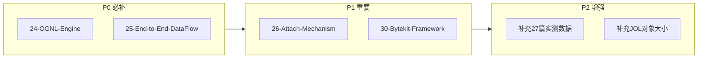
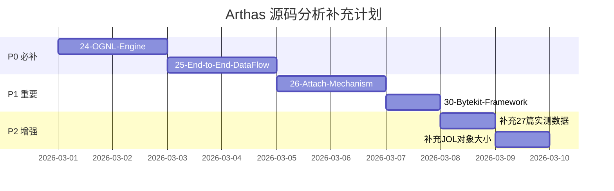

# Arthas 源码分析 - 补充内容详细大纲

> 基于现有 27 篇文档的评审，确定 6 项补充内容
> 按优先级排序：P0 → P1 → P2，逐一攻破

---

## 补充内容总览



| # | 文档 | 优先级 | 预估行数 | 预估时间 | 理由 |
|---|------|--------|----------|----------|------|
| 1 | `24-OGNL-Engine-Deep-Dive.md` | **P0** ✅ | 800-1000 | 3-4h | OGNL 是 watch/trace/tt 的核心依赖，"占 80% 开销"但没有专门分析 |
| 2 | `25-End-to-End-DataFlow.md` | **P0** ✅ | 900-1100 | 4-5h | 将所有环节串联，形成完整的数据流认知 |
| 3 | `26-Attach-Mechanism-Deep-Dive.md` | **P1** ✅ | 700-900 | 3-4h | arthas-boot → Attach API → loadAgent 的完整链路 |
| 4 | `30-Bytekit-Framework-Deep-Dive.md` | **P1** ✅ | 600-800 | 3-4h | Arthas 4.x 实际使用的字节码增强框架，02 篇未深入 |
| 5 | 补充 `27-Performance-Impact-Analysis.md` | **P2** ✅ | +200-300 | 2h | 用真实源码替代推断数据 |
| 6 | 补充关键结构 JOL 对象大小 | **P2** ✅ | 分散 | 1-2h | 精确替代手动估算 |

---

## 一、`24-OGNL-Engine-Deep-Dive.md`（P0）

### 为什么必补？

OGNL 表达式引擎是 Arthas 中 watch/trace/tt/ognl 命令的**运行时求值核心**。现有文档在 `06-WatchCommand` 中提到"OGNL 占 watch 命令 80% 的开销"，但对 OGNL 引擎本身没有任何专门分析：
- 表达式是怎么编译和求值的？
- 为什么开销这么大？瓶颈在哪？
- ClassLoader 隔离下如何正确解析类？
- ThreadLocal 复用机制的设计原因？

### 涉及的源码文件

| 文件 | 路径 | 行数 | 角色 |
|------|------|------|------|
| **Express.java** | `core/.../command/express/Express.java` | ~52 | 表达式引擎接口 |
| **OgnlExpress.java** | `core/.../command/express/OgnlExpress.java` | ~66 | OGNL 引擎实现（核心） |
| **ExpressFactory.java** | `core/.../command/express/ExpressFactory.java` | ~32 | ThreadLocal 工厂 |
| **DefaultMemberAccess.java** | `core/.../command/express/DefaultMemberAccess.java` | ~111 | 反射访问控制 |
| **CustomClassResolver.java** | `core/.../command/express/CustomClassResolver.java` | ~44 | 类解析器 |
| **ClassLoaderClassResolver.java** | `core/.../command/express/ClassLoaderClassResolver.java` | ~42 | ClassLoader 类解析器 |
| **ArthasObjectPropertyAccessor.java** | `core/.../command/express/ArthasObjectPropertyAccessor.java` | ~23 | 对象属性访问器 |
| **ExpressException.java** | `core/.../command/express/ExpressException.java` | ~30 | 异常封装 |
| **OgnlCommand.java** | `core/.../command/klass100/OgnlCommand.java` | ~118 | ognl 命令入口 |

### 详细大纲

```
## 第 0 部分：核心原理

### 0.1 本质是什么？
OGNL 是一个运行时表达式求值引擎，让用户用字符串表达式访问 Java 对象图。

### 0.2 为什么需要？
Arthas 的 watch/trace/tt 命令需要在运行时动态提取对象字段值，
不能预编译（用户表达式运行时才知道），只能解释执行。

### 0.3 怎么解决？
- 核心思路：字符串 → AST → 递归求值
- 关键设计：ThreadLocal 复用引擎实例、自定义 ClassResolver 解决 ClassLoader 隔离

### 0.4 为什么这样设计？
- 为什么用 ThreadLocal 而不是每次新建？避免重复创建开销
- 为什么需要 CustomClassResolver？目标 JVM 的类和 Arthas 的类在不同 ClassLoader
- 为什么 MemberAccess 要自定义？默认 OGNL 不能访问 private 字段

---

## 第 1 部分：数据结构全景

### 1.1 数据结构清单
| 结构名 | 源码位置 | 核心作用 |
|--------|----------|----------|
| Express | Express.java | 表达式引擎接口 |
| OgnlExpress | OgnlExpress.java | OGNL 实现类 |
| ExpressFactory | ExpressFactory.java | ThreadLocal 工厂 |
| DefaultMemberAccess | DefaultMemberAccess.java | 访问权限控制 |
| CustomClassResolver | CustomClassResolver.java | 类加载解析 |
| ClassLoaderClassResolver | ClassLoaderClassResolver.java | ClassLoader 级类解析 |
| ArthasObjectPropertyAccessor | ArthasObjectPropertyAccessor.java | 属性访问器 |

### 1.2 Express 接口分析
- 完整方法列表：get()/is()/bind()/reset()
- 接口设计意图：解耦表达式引擎实现

### 1.3 OgnlExpress 实现类分析（核心）
- 字段：OgnlContext、MemberAccess、ClassResolver
- OGNL 求值流程：parseExpression → getValue
- 绑定机制：bind(key, value) 如何注入变量

### 1.4 ExpressFactory 工厂分析
- ThreadLocal<OgnlExpress> 复用机制
- threadLocalExpress vs unpooledExpress 两种创建方式
- 为什么有两种？watch 用 ThreadLocal（高频），ognl 命令用 unpooled

### 1.5 DefaultMemberAccess 分析
- OGNL 默认无法访问 private 字段
- Arthas 通过 setAccessible(true) 突破
- 安全性考量

### 1.6 ClassResolver 双层解析
- CustomClassResolver：优先用用户指定的 ClassLoader
- ClassLoaderClassResolver：回退到具体 ClassLoader
- 为什么需要两层？多 ClassLoader 场景下同名类区分

### 1.7 ArthasObjectPropertyAccessor 分析
- OGNL 访问 obj.field 的底层机制
- 自定义后如何处理特殊类型（数组、Map 等）

---

## 第 2 部分：算法/流程分析

### 2.1 核心流程概览（Mermaid 图）
用户输入 OGNL 表达式 → ExpressFactory 获取引擎实例 →
bind 绑定上下文变量 → OgnlExpress.get() 求值 → 
OGNL 解析表达式 AST → 递归求值 → 返回结果

### 2.2 watch 命令中的 OGNL 求值完整链路
- WatchAdviceListener.before/afterReturning
- ExpressFactory.threadLocalExpress(classLoader)
- express.bind("target", target).bind("params", params)
- express.get(conditionExpress) 条件过滤
- express.get(express) 值提取
- 源码：WatchAdviceListener → ExpressFactory → OgnlExpress

### 2.3 ognl 独立命令的求值链路
- OgnlCommand.process()
- ExpressFactory.unpooledExpress(classLoader)
- express.get(express)
- 与 watch 的区别：无 bind 上下文、无 ThreadLocal

### 2.4 ClassLoader 隔离问题的解决
- 问题：用户类在 AppClassLoader，Arthas 类在 ArthasClassLoader
- 解决：CustomClassResolver 接受目标 ClassLoader
- 关键源码：OgnlExpress 构造器中的 ClassResolver 注入

### 2.5 OGNL 性能瓶颈分析
- 瓶颈 1：表达式解析（parseExpression）每次都做？有缓存？
- 瓶颈 2：反射调用（Method.invoke / Field.get）
- 瓶颈 3：MemberAccess.setAccessible() 的开销
- 与直接 Java 代码调用的性能差距量化

---

## 第 3 部分：面试要点

### 3.1 OGNL 在 Arthas 中的角色
### 3.2 为什么 OGNL 开销大？
### 3.3 ThreadLocal 复用的设计
### 3.4 ClassLoader 隔离怎么解决？

---

## 第 4 部分：数据结构关系图（Mermaid classDiagram）

## 第 5 部分：总结
### 5.1 数据结构层面
### 5.2 算法层面
```

---

## 二、`25-End-to-End-DataFlow.md`（P0）

### 为什么必补？

现有 27 篇文档每篇各自独立，但**缺少一条完整的数据流将所有环节串联**。面试官经常问"从用户输入 `watch` 命令到看到结果，中间经历了哪些步骤？"——需要一篇专门的端到端串联文档。

### 涉及的源码文件

| 文件 | 路径 | 行数 | 角色 |
|------|------|------|------|
| **ShellImpl.java** | `core/.../shell/impl/ShellImpl.java` | ~278 | 用户会话管理 |
| **ShellLineHandler.java** | `core/.../shell/handlers/shell/ShellLineHandler.java` | ~176 | 命令行解析 |
| **JobControllerImpl.java** | `core/.../shell/system/impl/JobControllerImpl.java` | ~255 | Job 创建管理 |
| **JobImpl.java** | `core/.../shell/system/impl/JobImpl.java` | ~287 | Job 封装 |
| **ProcessImpl.java** | `core/.../shell/system/impl/ProcessImpl.java` | ~687 | 命令执行编排（最核心） |
| **InternalCommandManager.java** | `core/.../shell/system/impl/InternalCommandManager.java` | ~147 | 命令查找 |
| **CommandProcess.java** | `core/.../shell/command/CommandProcess.java` | ~185 | 命令进程接口 |
| **EnhancerCommand.java** | `core/.../command/monitor200/EnhancerCommand.java` | ~240 | 增强型命令基类 |
| **ResultViewResolver.java** | `core/.../command/view/ResultViewResolver.java` | ~141 | 结果渲染 |
| **ResultConsumerImpl.java** | `core/.../distribution/impl/ResultConsumerImpl.java` | ~167 | 结果消费 |
| **SharingResultDistributorImpl.java** | `core/.../distribution/impl/SharingResultDistributorImpl.java` | ~220 | 结果分发 |
| **TermImpl.java** | `core/.../shell/term/impl/TermImpl.java` | ~269 | 终端 IO |

### 详细大纲

```
## 第 0 部分：核心原理

### 0.1 本质是什么？
用户输入一条命令，Arthas 从接收、解析、执行到输出结果的完整数据流。

### 0.2 为什么需要？
Arthas 的架构是 Shell → Job → Process → Command → Result → View 多层管道，
理解端到端数据流才能理解每一层的角色和职责。

### 0.3 怎么解决？
追踪两条典型路径：
- 路径 A：简单命令（如 thread）：同步执行，一次输出
- 路径 B：增强命令（如 watch）：异步执行，持续输出

### 0.4 为什么这样设计？
- 为什么要 Job 层？支持后台执行（bg/fg/jobs）
- 为什么要 Process 层？命令管道（cmd1 | cmd2）
- 为什么要 ResultDistributor？多客户端共享结果

---

## 第 1 部分：数据结构全景

### 1.1 数据结构清单
完整数据流涉及的所有对象：
| 结构名 | 核心作用 |
|--------|----------|
| Shell/ShellImpl | 用户会话 |
| ShellLineHandler | 命令行解析 |
| Job/JobImpl | 命令任务封装 |
| JobController/JobControllerImpl | 任务管理 |
| Process/ProcessImpl | 命令进程（核心） |
| CommandProcess | 命令执行上下文 |
| InternalCommandManager | 命令查找注册表 |
| AnnotatedCommand | 命令基类 |
| ResultModel | 结果数据模型 |
| ResultView | 结果视图渲染 |
| ResultViewResolver | 视图解析器 |
| ResultDistributor | 结果分发器 |
| ResultConsumer/ResultConsumerImpl | 结果消费者 |
| Term/TermImpl | 终端 IO |
| Session/SessionImpl | 会话 |

### 1.2-1.14 逐个分析每个数据结构
（每个覆盖：字段 + 含义 + 创建位置 + 关键字段生命周期）

---

## 第 2 部分：端到端数据流分析（核心）

### 2.1 全局数据流总览（Mermaid sequenceDiagram）

```mermaid（预期图）
用户 → TermImpl → ShellLineHandler → JobControllerImpl → JobImpl
→ ProcessImpl → InternalCommandManager → Command.process()
→ ResultModel → ResultDistributor → ResultConsumerImpl
→ ResultViewResolver → ResultView → TermImpl → 用户
```

### 2.2 阶段 1：用户输入 → 命令行解析
- TermImpl 接收字节流
- ShellLineHandler.handle(String line) 解析命令行
- 分割命令名 + 参数 + 管道
- 源码：ShellLineHandler.java:50-100

### 2.3 阶段 2：Job 创建 → Process 初始化
- JobControllerImpl.createJob() 创建 Job
- JobImpl 封装 foreground/background 状态
- ProcessImpl 初始化命令执行上下文
- 源码：JobControllerImpl.java + JobImpl.java + ProcessImpl.java

### 2.4 阶段 3：命令查找 → 实例创建
- InternalCommandManager.getCommand(name) 查找命令类
- 反射实例化 AnnotatedCommand 子类
- CLI 参数解析注入（@Argument/@Option 注解）
- 源码：InternalCommandManager.java + ProcessImpl.java

### 2.5 阶段 4：命令执行
- **路径 A：简单命令**（thread/jvm/dashboard）
  - Command.process(CommandProcess) 同步执行
  - 直接 appendResult(ResultModel) 输出
  - 调用 process.end() 结束
  
- **路径 B：增强命令**（watch/trace/monitor/tt）
  - EnhancerCommand.enhance() 注册字节码增强
  - 注册 AdviceListener 等待回调
  - 异步：目标方法触发 → SpyAPI → AdviceListener → 持续输出
  - 用户 Ctrl+C → 触发 destroy() → 移除 Transformer + 注销 Listener（不恢复字节码，需 `reset` 或 `stop`）

### 2.6 阶段 5：结果渲染 → 输出
- Command 产出 ResultModel
- ResultDistributor.appendResult(ResultModel) 分发
- ResultConsumerImpl 接收
- ResultViewResolver.resolveView(ResultModel) 查找对应 View
- ResultView.draw(ResultModel) 渲染为字符串
- TermImpl.write() 输出到终端

### 2.7 增强命令的异步输出路径（重点）
- SpyAPI.atEnter → SpyImpl → AdviceListenerManager
- AdviceListener.before/afterReturning
- listener 内部调用 process.appendResult()
- 异步线程安全：如何保证多线程 appendResult 不乱序？

### 2.8 HTTP API 的数据流差异
- HttpApiHandler.handle() 入口不同
- 走 exec_sync/exec_async 两种模式
- 结果 JSON 序列化而非终端渲染

---

## 第 3 部分：两条完整路径的源码级追踪

### 3.1 路径 A：`thread` 命令的完整数据流
从 "thread -n 3" 输入到线程信息输出，每个函数标注 文件:行号

### 3.2 路径 B：`watch` 命令的完整数据流
从 "watch Demo test returnObj" 输入到方法返回值输出，
重点标注异步回调路径

---

## 第 4 部分：数据结构关系图
全局 classDiagram：Shell → Job → Process → Command → Result → View

## 第 5 部分：总结
### 5.1 数据结构层面（15+ 个结构的角色总结）
### 5.2 算法层面（同步/异步两条路径的核心差异）
### 5.3 面试一句话回答
```

---

## 三、`26-Attach-Mechanism-Deep-Dive.md`（P1）

### 为什么必补？

现有 `10-ArthasBootstrap-Deep-Dive.md` 只分析了 ArthasBootstrap 本身的初始化，但**从 `java -jar arthas-boot.jar` 到 ArthasBootstrap 之间的完整链路没有覆盖**。这条链路涉及 JVM Attach API 核心机制。

### 涉及的源码文件

| 文件 | 路径 | 行数 | 角色 |
|------|------|------|------|
| **Bootstrap.java** | `boot/.../boot/Bootstrap.java` | ~899 | arthas-boot 主入口 |
| **ProcessUtils.java** | `boot/.../boot/ProcessUtils.java` | ~578 | 进程选择与 attach |
| **AgentBootstrap.java** | `agent/.../agent334/AgentBootstrap.java` | ~199 | agent 入口（premain/agentmain） |
| **ArthasClassloader.java** | `agent/.../agent/ArthasClassloader.java` | ~36 | agent 级 ClassLoader |
| **ArthasAgent.java** | `arthas-agent-attach/.../ArthasAgent.java` | ~157 | 嵌入式 attach（Spring Boot Starter） |
| **ArthasBootstrap.java** | `core/.../server/ArthasBootstrap.java` | ~703 | 核心启动（已分析） |

### 详细大纲

```
## 第 0 部分：核心原理

### 0.1 本质是什么？
Arthas 通过 JVM Attach API 动态连接到运行中的 JVM，注入 agent。

### 0.2 为什么需要？
诊断工具需要在不重启 JVM 的情况下动态注入，
JVM 的 Attach API 提供了标准的热注入机制。

### 0.3 怎么解决？
三级跳：arthas-boot（选择目标 JVM）→ VirtualMachine.attach（JDK 原生 API）→ 
loadAgent 加载 arthas-agent.jar → agentmain 入口 → 创建隔离 ClassLoader → 
反射调用 ArthasBootstrap.bind()

### 0.4 为什么这样设计？
- 为什么分 boot/agent/core 三个 jar？ClassLoader 隔离，避免类冲突
- 为什么 agent 要自定义 ClassLoader？arthas-core 不能污染应用的 ClassLoader
- 为什么不用 premain？premain 需要启动参数，不能动态注入

---

## 第 1 部分：数据结构全景

### 1.1 三级 JAR 包架构
arthas-boot.jar → arthas-agent.jar → arthas-core.jar
每级的职责边界

### 1.2 Bootstrap.java 核心字段
- pid 选择逻辑
- arthasHome 路径解析
- VirtualMachine 引用

### 1.3 AgentBootstrap.java 核心字段
- Instrumentation 实例
- arthasClassLoader 引用
- 双入口：premain() vs agentmain()

### 1.4 ArthasClassloader 分析
- 继承 URLClassLoader
- 隔离策略：parent = ExtClassLoader（跳过 AppClassLoader，源码 `ClassLoader.getSystemClassLoader().getParent()`）
- URL 列表：arthas-core.jar 及依赖

### 1.5 ClassLoader 隔离架构图
```
Bootstrap ClassLoader
  └── java.arthas.SpyAPI（由 Instrumentation 注入）
  
App ClassLoader
  └── 用户业务代码
  
ArthasClassLoader（parent=ExtClassLoader）
  └── arthas-core 所有类
```

---

## 第 2 部分：算法/流程分析

### 2.1 完整 Attach 链路（Mermaid sequenceDiagram）
```mermaid（预期图）
用户 → arthas-boot → 列举 JVM 进程 → 用户选择 PID
→ VirtualMachine.attach(pid) → vm.loadAgent(arthas-agent.jar)
→ AgentBootstrap.agentmain() → 创建 ArthasClassLoader
→ 反射调用 ArthasBootstrap.bind() → 初始化核心服务
```

### 2.2 阶段 1：arthas-boot 进程选择
- Bootstrap.main() 入口
- ProcessUtils.listProcessByJps() 列举 JVM 进程
- 用户交互式选择或命令行指定 --pid
- 源码：Bootstrap.java:200-400

### 2.3 阶段 2：JVM Attach API 调用
- VirtualMachine.attach(pid) 连接目标 JVM
- vm.loadAgent(agentJarPath, args) 加载 agent
- 底层原理：Unix Domain Socket 通信
- JDK 限制：同一 JVM 用户/容器

### 2.4 阶段 3：agentmain 入口
- AgentBootstrap.agentmain(args, inst) 被 JVM 调用
- 获取 Instrumentation 实例
- 解析 arthasHome 路径
- 防重复 attach 检测
- 源码：AgentBootstrap.java:40-100

### 2.5 阶段 4：ClassLoader 隔离创建
- new ArthasClassLoader(urls)
- parent = ExtClassLoader 的意义（跳过 AppClassLoader，实现类隔离）
- arthas-core.jar 的 URL 构建
- 源码：AgentBootstrap.java:100-150

### 2.6 阶段 5：反射调用 ArthasBootstrap
- Class.forName("ArthasBootstrap", true, arthasClassLoader)
- method.invoke(null, inst, args)
- 为什么用反射？agent 模块不依赖 core 模块
- 源码：AgentBootstrap.java:150-199

### 2.7 嵌入式 Attach（Spring Boot Starter）
- ArthasAgent.init() 直接在应用内启动
- 不走 VirtualMachine.attach
- 通过 ByteBuddyAgent 获取 Instrumentation
- 与标准 Attach 的差异

---

## 第 3 部分：运行时验证
- 用 strace 观察 attach 过程的 Unix Domain Socket 通信
- 用 jps/jcmd 验证 agent 加载状态
- 用 Arthas 的 classloader 命令验证 ClassLoader 隔离

## 第 4 部分：数据结构关系图

## 第 5 部分：总结
### 5.1 面试一句话：Arthas 的 Attach 过程
### 5.2 三级 JAR 包隔离的设计智慧
```

---

## 四、`30-Bytekit-Framework-Deep-Dive.md`（P1）

### 为什么必补？

现有 `02-Enhancer-Deep-Dive.md` 分析了 Enhancer 的整体流程，但对 **bytekit 框架本身**（Arthas 4.x 真正使用的字节码增强层）只是一带而过。bytekit 在 Enhancer 和 ASM 之间提供了更高层的抽象：`@Binding` 注解、`InterceptorProcessor`、`LocationMatcher` 等。

### 涉及的源码文件

| 文件 | 路径 | 行数 | 角色 |
|------|------|------|------|
| **SpyInterceptors.java** | `core/.../advisor/SpyInterceptors.java` | ~114 | **Arthas 使用 bytekit 的关键入口** |
| **Enhancer.java** | `core/.../advisor/Enhancer.java` | ~518 | 调用 bytekit 完成增强 |
| **EnhancerCommand.java** | `core/.../command/monitor200/EnhancerCommand.java` | ~240 | 增强命令基类 |
| bytekit JAR（外部依赖） | Maven 依赖 | — | bytekit 框架本身 |

> 注：bytekit 是外部依赖包（不在本地源码树中），但 Arthas 对它的使用方式（SpyInterceptors）在本地源码中。

### 详细大纲

```
## 第 0 部分：核心原理

### 0.1 本质是什么？
bytekit 是在 ASM 之上的字节码增强框架，
用注解（@Binding/@AtEnter/@AtExit）替代手写 ASM 指令。

### 0.2 为什么需要？
直接用 ASM 写字节码插桩极其繁琐（01 篇已展示），
bytekit 提供声明式注解，大幅简化插桩代码。

### 0.3 怎么解决？
开发者声明拦截器（@AtEnter + @Binding.This/@Binding.Args），
bytekit 自动生成对应的 ASM 指令。

### 0.4 为什么这样设计？
- 为什么不直接用 ASM？维护成本高，容易出错
- 为什么不用 Byte Buddy？bytekit 更轻量，且 Arthas 团队可控
- bytekit 和 ASM 的关系？bytekit 底层仍然调用 ASM

---

## 第 1 部分：数据结构全景

### 1.1 SpyInterceptors 三大内部类
- SpyInterceptor1：@AtEnter 拦截
- SpyInterceptor2：@AtExit 拦截
- SpyInterceptor3：@AtExceptionExit 拦截

### 1.2 @Binding 注解族
- @Binding.This → 目标对象
- @Binding.Class → 目标类
- @Binding.Args → 方法参数
- @Binding.MethodInfo → 方法信息（`name|desc` 格式）
- @Binding.Return → 返回值（通过 StackSaver 机制保存到局部变量）
- @Binding.Throwable → 异常
- @Binding.InvokeInfo → 被调用方法信息（`owner|name|desc|line` 格式，trace 场景用）

### 1.3 bytekit 核心概念
- InterceptorProcessor：拦截器处理器
- LocationMatcher：位置匹配（方法入口/出口/异常）
- InvokeContainLocationFilter：检测已插桩避免重复

---

## 第 2 部分：算法/流程分析

### 2.1 bytekit 增强流程（从 Enhancer 视角）
Enhancer.getByteCode() 中如何调用 bytekit：
- 创建 InterceptorProcessor
- 绑定 SpyInterceptor1/2/3
- 调用 processor.process() 生成增强字节码
- 源码：Enhancer.java:365-480

### 2.2 SpyInterceptors → SpyAPI 的映射
- SpyInterceptor1.atEnter() → SpyAPI.atEnter()
- SpyInterceptor2.atExit() → SpyAPI.atExit()
- SpyInterceptor3.atExceptionExit() → SpyAPI.atExceptionExit()
- @Binding 注解如何变成 ASM 的 aload/getfield 指令

### 2.3 与 01 篇 ASM 手写方式的对比
- 01 篇展示的手动 ASM 插桩：~50 行指令
- bytekit 声明式方式：~10 行注解
- 生成的字节码是否等价？

### 2.4 InvokeContainLocationFilter 防重复机制
- 如何检测方法体中已经存在 SpyAPI.atEnter 调用
- 避免多次 watch 同一方法导致重复插桩

---

## 第 3 部分：与 01-ASM 和 02-Enhancer 的关系图

### 3.1 三层架构图
```
用户命令（watch/trace/monitor）
       ↓
EnhancerCommand（命令层）
       ↓
Enhancer（编排层）
       ↓
bytekit + SpyInterceptors（字节码增强框架层）
       ↓
ASM（底层字节码操作）
       ↓
字节码 byte[]
```

### 3.2 对比表：ASM vs bytekit vs Byte Buddy

## 第 4 部分：总结
### 4.1 bytekit 在 Arthas 中的位置
### 4.2 声明式 vs 命令式字节码增强的权衡
```

---

## 五、补充 `27-Performance-Impact-Analysis.md`（P2）

### 当前问题

1. 部分性能数据是推断而非实测，代码标注了"(推断结构)"
2. 缺少 JMH 或 Arthas 自身的基准测试数据
3. OGNL 开销"占 80%"缺少量化支撑

### 补充内容

```
### 补充 1：JMH 基准测试（新增一节）

#### 5.1 测试设计
- 基准：空方法调用（无 Arthas）
- watch 开销：空 watch（无 OGNL 表达式）
- watch + OGNL 开销：简单表达式 vs 复杂表达式
- trace 开销：调用链深度 1/5/10/20
- monitor 开销：高频方法（10000 次/秒）

#### 5.2 JMH 测试代码
（完整可运行的 JMH Benchmark 代码）

#### 5.3 测试结果
（表格 + 柱状图，替代原文推断数据）

---

### 补充 2：替换推断数据
- 遍历全文所有标注"(推断结构)"的位置
- 用 JMH 实测数据或 Arthas bench 命令输出替代
- 每处标注数据来源

---

### 补充 3：OGNL 开销量化
- 测试方法：分别测量 "watch 无表达式" 和 "watch 有表达式" 的延迟差异
- 验证"OGNL 占 80% 开销"的结论
- 不同复杂度表达式的开销阶梯
```

---

## 六、补充关键结构 JOL 对象大小（P2）

### 当前问题

部分文档中对 Java 对象大小的估算是手动计算（对象头 12/16 字节 + 字段），不够精确。

### 补充方式

```
### 需要 JOL 验证的关键结构

| 文档 | 类名 | 当前估算 | 需验证 |
|------|------|----------|--------|
| 04-Advice | Advice | 手动估算 | JOL 精确值 |
| 06-Watch | WatchAdviceListener | 手动估算 | JOL 精确值 |
| 07-Trace | TraceEntity/TraceTree | 手动估算 | JOL 精确值 |
| 08-Monitor | MonitorData | 手动估算 | JOL 精确值 |
| 14-TT | TimeFragment/ObjectStack | 手动估算 | JOL 精确值 |

### 验证方法
1. 添加 JOL 依赖到 demo 项目
2. 编写测试程序打印 ClassLayout
3. 用实际输出替换各文档中的手动估算

### JOL 测试代码模板
```java
import org.openjdk.jol.info.ClassLayout;
import org.openjdk.jol.info.GraphLayout;

public class ArthasObjectSize {
    public static void main(String[] args) {
        // 逐个打印关键类的 ClassLayout
        System.out.println(ClassLayout.parseClass(Advice.class).toPrintable());
        // ...
    }
}
```

### 输出格式
每个类输出：
- shallow size（对象自身大小）
- deep size（包含引用对象的总大小，典型场景下）
- 对齐填充情况
```

---

## 执行计划



---

## 与现有文档的编号关系

```
现有文档（不动）：
├── 00-Arthas-Complete-Outline.md
├── 01 ~ 23（已完成的 23 篇）
├── 27-Performance-Impact-Analysis.md
├── 28-Tool-Comparison.md
└── 29-Production-Cases.md

本次补充：
├── 24-OGNL-Engine-Deep-Dive.md          ← 填补空位
├── 25-End-to-End-DataFlow.md            ← 填补空位
├── 26-Attach-Mechanism-Deep-Dive.md     ← 填补空位
├── 30-Bytekit-Framework-Deep-Dive.md    ← 新增编号
├── 27 补充（原地修改）
└── 04/06/07/08/14 补充 JOL（原地修改）
```

---

*大纲版本：v1.0*
*创建日期：2026-03-01*
