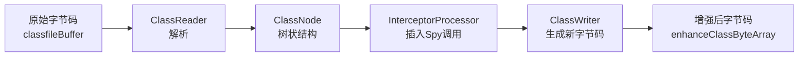
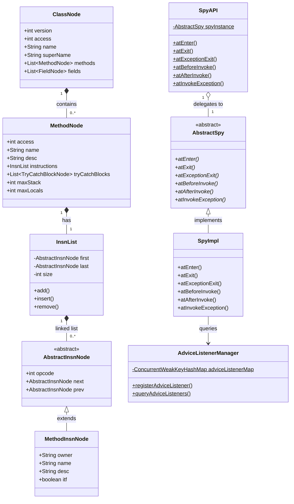
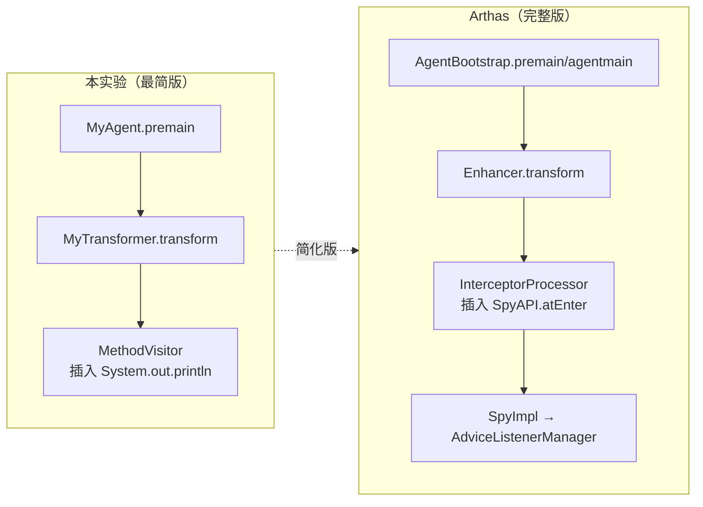

# ASM 字节码框架 - Arthas 增强机制前置知识（深度解析版）

> 基于 OpenJDK 11 源码 + Arthas 4.1.2 源码分析
> 方法论：程序 = 数据结构 + 算法
> 验证方式：字节码对比 + 运行时验证

---

## 第 0 部分：核心原理

### 0.1 本质是什么？

ASM 是一个 Java 字节码操作框架，通过**在运行时修改类的字节码**，在方法入口/出口/异常处插入增强代码，实现 AOP 效果。Arthas 利用 ASM + bytekit 实现方法的透明拦截。

### 0.2 为什么需要？

**根本限制**：JVM 的类加载机制决定了类在加载后字节码即固定。Class 文件被 `defineClass()` 加载后，方法体存储在 Metaspace 的 ConstMethod 中，无法直接修改。

**诊断需求**：需要在**不修改源码、不重启应用**的情况下，观测方法的运行时行为（参数、返回值、异常、耗时）。

**解决方案**：JVM 提供了 `Instrumentation.retransformClasses()` 机制，允许在运行时重新转换类。ClassFileTransformer.transform() 接收原始字节码，返回修改后的字节码。

### 0.3 怎么解决？



**Arthas 实现**：
1. `ClassReader` 读取原始字节码
2. `ClassNode`（Tree API）解析为对象树
3. `DefaultInterceptorClassParser` 解析 `@AtEnter/@AtExit` 注解
4. `InterceptorProcessor` 在拦截点插入 Spy 调用
5. `ClassWriter` 生成新字节码

### 0.4 为什么这样设计？

| 设计选择 | 为什么？ | 替代方案 |
|----------|----------|----------|
| **Tree API 而非 Visitor API** | Tree API 将字节码解析为对象树，可随机访问任意指令，适合修改；Visitor API 只能顺序访问，适合读取 | Javassist 更高层封装，但性能差 |
| **bytekit 注解驱动** | 原生 ASM 需要手写字节码指令，bytekit 用注解声明拦截点，自动生成注入代码 | 手写 MethodVisitor，代码量大 |
| **Spy 放 BootstrapClassLoader** | 保证对所有类加载器可见，避免 ClassNotFoundException | 每个类加载器都注入 Spy 副本，内存浪费 |
| **adviceId 而非直接引用** | 字节码只能存常量，无法存对象引用。adviceId 作为索引，运行时查表获取 Listener | 动态生成类存储 Listener，复杂度高 |

---

## 第 1 部分：数据结构全景

> 遵循 `Doc-DataStructure-First` 规则：先穷举所有涉及的数据结构，再逐个完整分析

### 1.1 数据结构清单

| 结构名 | 源码位置 | 核心作用 | 分析深度 |
|--------|----------|----------|----------|
| ClassNode | `asm/tree/ClassNode.java` | 整个类的树状表示 | 完整6项 |
| MethodNode | `asm/tree/MethodNode.java` | 单个方法的树状表示 | 完整6项 |
| InsnList | `asm/tree/InsnList.java` | 指令双向链表 | 完整6项 |
| AbstractInsnNode | `asm/tree/AbstractInsnNode.java` | 指令节点基类 | 完整6项 |
| MethodInsnNode | `asm/tree/MethodInsnNode.java` | 方法调用指令 | 完整6项 |
| SpyAPI | `arthas/spy/SpyAPI.java` | 拦截入口 API | 完整6项 |
| SpyImpl | `arthas/advisor/SpyImpl.java` | Spy 实现 | 完整6项 |
| AdviceListenerManager | `arthas/advisor/AdviceListenerManager.java` | 监听器管理器 | 完整6项 |

---

### 1.2 ClassNode 详细分析

#### 1.2.1 全部字段

```java
// ClassNode.java:79-219 (JDK 11 内置 ASM)
public class ClassNode extends ClassVisitor {
    // ========== 类基本信息 ==========
    public int version;                                    // 类版本（52=Java8, 53=Java9, 54=Java10...）
    public int access;                                     // 访问标志位组合（ACC_PUBLIC|ACC_FINAL|...）
    public String name;                                    // 类内部名，如 "com/example/MyService"
    public String signature;                               // 泛型签名，如 "Ljava/util/List<Ljava/lang/String;>;"
    public String superName;                               // 父类内部名，如 "java/lang/Object"
    public List<String> interfaces;                        // 实现的接口列表
    
    // ========== 源码信息 ==========
    public String sourceFile;                              // 源文件名，如 "MyService.java"
    public String sourceDebug;                             // JSR-45 调试信息
    
    // ========== 模块信息（Java 9+）==========
    public ModuleNode module;                              // 模块信息
    
    // ========== 内部类信息 ==========
    public String outerClass;                              // 外部类名（内部类用）
    public String outerMethod;                             // 外部方法名（方法内局部类用）
    public String outerMethodDesc;                         // 外部方法描述符
    public List<InnerClassNode> innerClasses;              // 内部类列表
    
    // ========== 注解信息 ==========
    public List<AnnotationNode> visibleAnnotations;        // 运行时可见注解（@Retention(RUNTIME)）
    public List<AnnotationNode> invisibleAnnotations;      // 运行时不可见注解（@Retention(CLASS)）
    public List<TypeAnnotationNode> visibleTypeAnnotations;   // 类型注解（Java 8+）
    public List<TypeAnnotationNode> invisibleTypeAnnotations; // 类型注解
    
    // ========== 字段和方法 ⭐ 核心 ==========
    public List<FieldNode> fields;                         // 字段列表
    public List<MethodNode> methods;                       // 方法列表 ⭐ Arthas 主要操作这个
    
    // ========== 其他 ==========
    public List<Attribute> attrs;                          // 非标准属性
}
```

#### 1.2.2 字段含义详解

| 字段 | 含义 | 示例值 | Arthas 使用 | 核心 |
|------|------|--------|-------------|------|
| `version` | 类版本号，决定字节码格式 | 52（Java 8） | 版本兼容性检查 | |
| `access` | 访问标志位，用位运算组合 | `0x0021` = PUBLIC+SUPER | 判断是否可增强 | |
| `name` | 类的内部名（斜杠分隔） | `com/example/MyService` | 匹配目标类 | ★ |
| `superName` | 父类内部名 | `java/lang/Object` | 继承链分析 | |
| `methods` | 方法列表 | `[MethodNode@method1, ...]` | **核心操作对象** | ★ |

#### 1.2.3 内存布局（Java 对象大小估算）

```
ClassNode 对象布局（64位 JVM，启用压缩指针）：

┌─────────────────────────────────────────────────────────────┐
│ Object Header (12 bytes)                                    │
├─────────────────────────────────────────────────────────────┤
│ int version                    (4 bytes)                     │
│ int access                     (4 bytes)                     │
│ String name                    (4 bytes, 压缩指针)           │
│ String signature               (4 bytes)                     │
│ String superName               (4 bytes)                     │
│ List<String> interfaces        (4 bytes)                     │
│ String sourceFile              (4 bytes)                     │
│ String sourceDebug             (4 bytes)                     │
│ ModuleNode module              (4 bytes)                     │
│ String outerClass              (4 bytes)                     │
│ String outerMethod             (4 bytes)                     │
│ String outerMethodDesc         (4 bytes)                     │
│ List<AnnotationNode> visibleAnnotations     (4 bytes)       │
│ List<AnnotationNode> invisibleAnnotations   (4 bytes)       │
│ ... (更多引用字段，每个 4 bytes)                              │
│ List<FieldNode> fields         (4 bytes)                     │
│ List<MethodNode> methods       (4 bytes)  ⭐                 │
│ List<Attribute> attrs          (4 bytes)                     │
├─────────────────────────────────────────────────────────────┤
│ Padding (对齐到 8 字节倍数)                                   │
└─────────────────────────────────────────────────────────────┘

估算大小：~120 bytes（不含引用对象）
实际大小取决于 fields/methods 数量
```

**验证代码**：
```java
// 使用 JOL (Java Object Layout) 验证
ClassNode node = new ClassNode(Opcodes.ASM9);
System.out.println(ClassLayout.parseInstance(node).toPrintable());
// 输出实际内存布局
```

#### 1.2.4 创建位置

```java
// Enhancer.java:133-134
ClassNode classNode = new ClassNode(Opcodes.ASM9);  // ★ 创建空的 ClassNode
ClassReader classReader = AsmUtils.toClassNode(classfileBuffer, classNode);  // ★ 填充数据
```

**创建时机**：`ClassFileTransformer.transform()` 被调用时，JVM 传入原始字节码 `classfileBuffer`。

#### 1.2.5 关键字段生命周期

| 字段 | 谁设置 | 何时设置 | 设置什么值 | 谁读取 |
|------|--------|----------|------------|--------|
| `name` | ClassReader | `ClassReader.accept()` | 类内部名如 `com/example/MyService` | Enhancer 匹配类名 |
| `methods` | ClassReader | `ClassReader.accept()` | MethodNode 列表 | Enhancer 遍历增强 |
| `version` | ClassReader | `ClassReader.accept()` | 如 52（Java 8） | AsmUtils 检查兼容性 |
| `access` | ClassReader | `ClassReader.accept()` | 访问标志位 | 判断是否 abstract |

#### 1.2.6 ClassNode 继承关系

```
java.lang.Object
└── jdk.internal.org.objectweb.asm.ClassVisitor
    └── jdk.internal.org.objectweb.asm.tree.ClassNode

ClassVisitor 是访问者模式的基础类，ClassNode 是其子类，实现了"记录访问内容"的功能。
```

---

### 1.3 MethodNode 详细分析

#### 1.3.1 全部字段

```java
// MethodNode.java:80-241 (JDK 11 内置 ASM)
public class MethodNode extends MethodVisitor {
    // ========== 方法签名 ==========
    public int access;                                    // 访问标志（ACC_PUBLIC|ACC_STATIC|ACC_FINAL|...）
    public String name;                                   // 方法名（如 "doSomething"、"<init>"、"<clinit>"）
    public String desc;                                   // 方法描述符（如 "(ILjava/lang/String;)V"）
    public String signature;                              // 泛型签名
    public List<String> exceptions;                       // throws 声明的异常（内部名）
    
    // ========== 参数信息 ==========
    public List<ParameterNode> parameters;                // 参数信息（Java 8+）
    
    // ========== 注解信息 ==========
    public List<AnnotationNode> visibleAnnotations;       // 运行时可见注解
    public List<AnnotationNode> invisibleAnnotations;     // 运行时不可见注解
    public List<TypeAnnotationNode> visibleTypeAnnotations;
    public List<TypeAnnotationNode> invisibleTypeAnnotations;
    public Object annotationDefault;                      // 注解方法默认值
    public List<AnnotationNode>[] visibleParameterAnnotations;
    public List<AnnotationNode>[] invisibleParameterAnnotations;
    
    // ========== 方法体 ⭐ 核心 ==========
    public InsnList instructions;                         // 指令链表 ⭐ 最重要的字段
    public List<TryCatchBlockNode> tryCatchBlocks;        // try-catch 块
    public int maxStack;                                  // 最大操作数栈深度
    public int maxLocals;                                 // 最大局部变量表大小
    
    // ========== 局部变量信息 ==========
    public List<LocalVariableNode> localVariables;        // 局部变量表
    public List<LocalVariableAnnotationNode> visibleLocalVariableAnnotations;
    public List<LocalVariableAnnotationNode> invisibleLocalVariableAnnotations;
    
    // ========== 其他 ==========
    public List<Attribute> attrs;                         // 非标准属性
    private boolean visited;                              // 是否已访问
}
```

#### 1.3.2 关键字段含义

| 字段 | 含义 | 示例值 | Arthas 使用 | 核心 |
|------|------|--------|-------------|------|
| `name` | 方法名 | `"doSomething"` 或 `"<init>"` | 匹配目标方法 | ★ |
| `desc` | 方法描述符 | `"(ILjava/lang/String;)V"` | 区分重载方法 | ★ |
| `access` | 访问标志位 | `0x0001` = ACC_PUBLIC | 判断 abstract/native | ★ |
| `instructions` | **指令链表** | `InsnList@...` | **插入 Spy 调用** | ★ |
| `tryCatchBlocks` | 异常处理表 | `[TryCatchBlockNode@...]` | 插入异常拦截 | ★ |
| `maxStack` | 最大栈深度 | 3 | 计算栈帧信息 | |
| `maxLocals` | 最大局部变量数 | 5 | 计算栈帧信息 | |

#### 1.3.3 内存布局

```
MethodNode 对象布局（64位 JVM，启用压缩指针）：

┌─────────────────────────────────────────────────────────────┐
│ Object Header (12 bytes)                                    │
├─────────────────────────────────────────────────────────────┤
│ int access                    (4 bytes)                     │
│ String name                   (4 bytes)  ⭐ 方法名           │
│ String desc                   (4 bytes)  ⭐ 方法描述符       │
│ String signature              (4 bytes)                     │
│ List<String> exceptions       (4 bytes)                     │
│ List<ParameterNode> parameters             (4 bytes)        │
│ ... (注解相关字段，每个 4 bytes)                             │
│ InsnList instructions         (4 bytes)  ⭐ 指令链表        │
│ List<TryCatchBlockNode> tryCatchBlocks     (4 bytes)        │
│ int maxStack                  (4 bytes)                     │
│ int maxLocals                 (4 bytes)                     │
│ List<LocalVariableNode> localVariables     (4 bytes)        │
│ ...                                                         │
│ boolean visited               (1 byte, 实际可能padding)     │
├─────────────────────────────────────────────────────────────┤
│ Padding (对齐到 8 字节倍数)                                   │
└─────────────────────────────────────────────────────────────┘

估算大小：~150 bytes（不含 instructions 内容）
instructions 的大小取决于方法体大小，每个指令约 2-5 bytes
```

#### 1.3.4 创建位置

```java
// ClassNode.java:350-355
@Override
public MethodVisitor visitMethod(final int access, final String name,
        final String desc, final String signature, final String[] exceptions) {
    MethodNode mn = new MethodNode(access, name, desc, signature, exceptions);  // ★ 创建
    methods.add(mn);  // ★ 添加到 ClassNode.methods
    return mn;        // 返回给 ClassReader 继续填充
}
```

**创建时机**：`ClassReader.accept(ClassNode)` 遍历类结构时，遇到每个方法就创建一个 MethodNode。

#### 1.3.5 关键字段生命周期

| 字段 | 谁设置 | 何时设置 | 设置什么值 | 谁读取 |
|------|--------|----------|------------|--------|
| `name` | ClassNode.visitMethod() | 解析字节码时 | 方法名如 `"doSomething"` | Enhancer 匹配 |
| `desc` | ClassNode.visitMethod() | 解析字节码时 | 方法描述符如 `"(I)V"` | 区分重载 |
| `access` | ClassNode.visitMethod() | 解析字节码时 | 访问标志位 | 判断 abstract/native |
| `instructions` | MethodVisitor.visit*Insn() | 解析字节码方法体时 | 指令链表 | **InterceptorProcessor 插入代码** |
| `maxStack` | ClassWriter | 生成字节码时 | 计算得出 | JVM 栈帧大小 |

---

### 1.4 InsnList 详细分析

#### 1.4.1 全部字段

```java
// InsnList.java
public class InsnList {
    private AbstractInsnNode first;   // ★ 链表头节点
    private AbstractInsnNode last;    // ★ 链表尾节点
    private int size;                 // ★ 指令数量
    private AbstractInsnNode[] cache; // 缓存数组（用于随机访问优化）
    
    // ========== 核心方法 ==========
    public void add(AbstractInsnNode insn);           // 尾部添加
    public void insert(AbstractInsnNode insn);        // 头部插入
    public void insert(AbstractInsnNode location, AbstractInsnNode insn);  // 指定位置后插入
    public void insertBefore(AbstractInsnNode location, AbstractInsnNode insn);  // 指定位置前插入
    public void remove(AbstractInsnNode insn);        // 删除
    public void resetLabels();                        // 重置标签
    
    // ========== 访问方法 ==========
    public AbstractInsnNode getFirst();               // 获取头节点
    public AbstractInsnNode getLast();                // 获取尾节点
    public int size();                                // 获取大小
    public ListIterator<AbstractInsnNode> iterator(); // 迭代器
}
```

#### 1.4.2 数据结构特性

```
InsnList 是一个双向链表，同时支持缓存数组随机访问：

     first                                           last
       ↓                                               ↓
    ┌─────┐    ┌─────┐    ┌─────┐    ┌─────┐    ┌─────┐
    │Insn0│←──→│Insn1│←──→│Insn2│←──→│Insn3│←──→│Insn4│
    └─────┘    └─────┘    └─────┘    └─────┘    └─────┘
       ↑          ↑          ↑          ↑          ↑
       │          │          │          │          │
    cache[0]   cache[1]   cache[2]   cache[3]   cache[4]

特性：
1. 插入/删除 O(1)（已知位置）
2. 随机访问 O(n)（需要遍历），有缓存时接近 O(1)
3. 适合在方法体任意位置插入代码
```

#### 1.4.3 创建位置

```java
// MethodNode.java:265-268
public MethodNode(final int api) {
    super(api);
    this.instructions = new InsnList();  // ★ 在 MethodNode 构造时创建
}
```

#### 1.4.4 指令节点类型层次

```
AbstractInsnNode (抽象基类)
│
├── FieldInsnNode           // 字段访问指令
│   └── opcode: GETFIELD, PUTFIELD, GETSTATIC, PUTSTATIC
│   └── 字段: owner, name, desc
│
├── FrameNode               // 栈帧指令（用于字节码验证）
│   └── opcode: F_NEW, F_FULL, F_APPEND, ...
│
├── IincInsnNode            // iinc 指令（局部变量自增）
│   └── 字段: var, incr
│
├── InsnNode                // 零操作数指令
│   └── opcode: NOP, ACONST_NULL, ICONST_0, ARETURN, ATHROW, ...
│
├── IntInsnNode             // int 操作数指令
│   └── opcode: BIPUSH, SIPUSH, NEWARRAY
│   └── 字段: operand
│
├── InvokeDynamicInsnNode   // invokedynamic 指令
│   └── 字段: name, desc, bsm, bsmArgs
│
├── JumpInsnNode            // 跳转指令
│   └── opcode: IFEQ, IFNE, IF_ICMPEQ, GOTO, ...
│   └── 字段: label
│
├── LabelNode               // 标签（代码位置标记，不是真正的指令）
│   └── 用于标记跳转目标、异常处理范围
│
├── LdcInsnNode             // LDC 指令（加载常量池常量）
│   └── 字段: cst (String, Integer, Float, Double, Type, Handle)
│
├── LineNumberNode          // 行号信息（调试用）
│   └── 字段: line, start
│
├── LookupSwitchInsnNode    // lookupswitch 指令
│   └── 字段: keys, labels, dflt
│
├── MethodInsnNode          // 方法调用指令 ⭐ 最重要
│   └── opcode: INVOKEVIRTUAL, INVOKESPECIAL, INVOKESTATIC, INVOKEINTERFACE
│   └── 字段: owner, name, desc, itf
│
├── MultiANewArrayInsnNode  // 创建多维数组
│   └── 字段: desc, dims
│
├── TableSwitchInsnNode     // tableswitch 指令
│   └── 字段: min, max, labels, dflt
│
├── TypeInsnNode            // 类型指令
│   └── opcode: NEW, ANEWARRAY, CHECKCAST, INSTANCEOF
│   └── 字段: desc
│
└── VarInsnNode             // 局部变量指令
    └── opcode: ILOAD, ISTORE, ALOAD, ASTORE, ...
    └── 字段: var (局部变量索引)
```

---

### 1.5 MethodInsnNode 详细分析

#### 1.5.1 全部字段

```java
// MethodInsnNode.java
public class MethodInsnNode extends AbstractInsnNode {
    public String owner;      // ★ 方法所属类的内部名（如 "java/io/PrintStream"）
    public String name;       // ★ 方法名（如 "println"）
    public String desc;       // ★ 方法描述符（如 "(Ljava/lang/String;)V"）
    public boolean itf;       // ★ 是否接口方法（决定用 INVOKEINTERFACE 还是 INVOKEVIRTUAL）
    
    // ========== 构造函数 ==========
    public MethodInsnNode(int opcode, String owner, String name, String desc) {
        super(opcode);
        this.owner = owner;
        this.name = name;
        this.desc = desc;
    }
    
    public MethodInsnNode(int opcode, String owner, String name, String desc, boolean itf) {
        super(opcode);
        this.owner = owner;
        this.name = name;
        this.desc = desc;
        this.itf = itf;
    }
    
    // ========== opcode 取值 ==========
    // INVOKESTATIC  (0xB8) - 调用静态方法
    // INVOKEVIRTUAL (0xB6) - 调用实例方法（虚方法）
    // INVOKESPECIAL (0xB7) - 调用构造函数、私有方法、super方法
    // INVOKEINTERFACE (0xB9) - 调用接口方法
}
```

#### 1.5.2 字段含义

| 字段 | 含义 | 示例 | 核心 |
|------|------|------|------|
| `opcode` | 调用类型 | `INVOKESTATIC`(0xB8), `INVOKEVIRTUAL`(0xB6) | ★ |
| `owner` | 方法所属类（内部名） | `"java/io/PrintStream"`, `"java/arthas/SpyAPI"` | ★ |
| `name` | 方法名 | `"println"`, `"atEnter"` | ★ |
| `desc` | 方法描述符 | `"(Ljava/lang/String;)V"`, `"(Ljava/lang/Class;Ljava/lang/String;Ljava/lang/Object;[Ljava/lang/Object;)V"` | ★ |
| `itf` | 是否接口方法 | `true` 表示用 `INVOKEINTERFACE` | |

#### 1.5.3 Arthas 插入的 MethodInsnNode 示例

Arthas 在方法入口处插入的调用：

```java
// 插入的指令等价于：
SpyAPI.atEnter(clazz, methodInfo, target, args);

// 对应的字节码（反编译）：
// ALOAD 1           // 加载 clazz
// ALOAD 2           // 加载 methodInfo  
// ALOAD 3           // 加载 target
// ALOAD 4           // 加载 args
// INVOKESTATIC java/arthas/SpyAPI.atEnter(Ljava/lang/Class;Ljava/lang/String;Ljava/lang/Object;[Ljava/lang/Object;)V
```

---

### 1.6 SpyAPI / AbstractSpy（摘要，完整分析见 03-Spy-Interceptor-Deep-Dive.md §1.2）

> ⚠️ **去重说明**：SpyAPI/SpyImpl/AdviceListenerManager 的权威完整分析在 **03-Spy-Interceptor-Deep-Dive.md**。本节只保留与 ASM 字节码增强直接相关的关键信息。

**在 ASM 增强中的角色**：字节码中插入的 `INVOKESTATIC SpyAPI.atEnter(...)` 调用最终委托给 `SpyImpl`，再转发给 `AdviceListenerManager` 查找并调用已注册的 `AdviceListener`。

**关键设计约束**（影响字节码生成方式）：

| 约束 | 原因 | 对字节码的影响 |
|------|------|---------------|
| SpyAPI 在 BootstrapClassLoader | 所有 ClassLoader 的增强类都能访问 | 字节码直接 `INVOKESTATIC java/arthas/SpyAPI.atEnter` |
| 所有方法都是 static | `invokestatic` 不需要对象引用 | 无需在字节码中创建 Spy 实例 |
| 参数通过 `String methodInfo` 传递 | 字节码只能存字面量常量 | `LDC "methodName|methodDesc"` |
| `volatile AbstractSpy spyInstance` | 多线程可见性 | 运行时可热切换实现 |

**核心调用链**：

```
字节码插入的调用 → SpyAPI.atEnter() → spyInstance.atEnter() → SpyImpl.atEnter()
    → AdviceListenerManager.queryAdviceListeners() → listener.before()
```

> 📖 详细的 SpyAPI 字段列表、SpyImpl 实现源码、AdviceListenerManager 两级 Map 结构、监听器生命周期管理等内容，请参见 **[03-Spy-Interceptor-Deep-Dive.md](./03-Spy-Interceptor-Deep-Dive.md)**。

---

### 1.9 数据结构关系图



---

## 第 2 部分：字节码增强流程详解

> 这是本文档的核心部分，展示字节码增强前后的真实对比

### 2.1 示例方法

假设有以下 Java 方法：

```java
// 原始 Java 代码
package com.example;

public class MyService {
    public String doSomething(int count, String name) {
        String result = "Hello " + name;
        for (int i = 0; i < count; i++) {
            result += "!";
        }
        return result;
    }
}
```

### 2.2 原始字节码

```
// javap -c -v MyService.class 输出
public java.lang.String doSomething(int, java.lang.String);
  descriptor: (ILjava/lang/String;)Ljava/lang/String;
  flags: ACC_PUBLIC
  Code:
    stack=2, locals=4, args_size=3
       0: new           #2                  // class java/lang/StringBuilder
       3: dup
       4: invokespecial #3                  // Method java/lang/StringBuilder."<init>":()V
       7: ldc           #4                  // String Hello 
       9: invokevirtual #5                  // Method java/lang/StringBuilder.append:(Ljava/lang/String;)Ljava/lang/StringBuilder;
      12: aload_2
      13: invokevirtual #5                  // Method java/lang/StringBuilder.append:(Ljava/lang/String;)Ljava/lang/StringBuilder;
      16: invokevirtual #6                  // Method java/lang/StringBuilder.toString:()Ljava/lang/String;
      19: astore_3
      20: iconst_0
      21: istore          4
      23: iload           4
      25: iload_1
      26: if_icmpge     47
      29: new           #2                  // class java/lang/StringBuilder
      32: dup
      33: invokespecial #3                  // Method java/lang/StringBuilder."<init>":()V
      36: aload_3
      37: invokevirtual #5                  // Method java/lang/StringBuilder.append:(Ljava/lang/String;)Ljava/lang/StringBuilder;
      40: ldc           #7                  // String !
      42: invokevirtual #5                  // Method java/lang/StringBuilder.append:(Ljava/lang/String;)Ljava/lang/StringBuilder;
      45: invokevirtual #6                  // Method java/lang/StringBuilder.toString:()Ljava/lang/String;
      48: astore_3
      49: iinc          4, 1
      52: goto          23
      55: aload_3
      56: areturn
```

### 2.3 增强后的字节码

Arthas 执行 `watch com.example.MyService doSomething '{params,returnObj}'` 后：

```
// 增强后的字节码（伪代码展示结构）
public java.lang.String doSomething(int, java.lang.String);
  descriptor: (ILjava/lang/String;)Ljava/lang/String;
  flags: ACC_PUBLIC
  Code:
    stack=6, locals=5, args_size=3
       // ===== ★ Arthas 插入的方法入口代码 =====
       0: ldc           #100                // class com/example/MyService
       2: ldc           #101                // String doSomething|(ILjava/lang/String;)Ljava/lang/String;
       4: aload_0                           // this
       5: iconst_2
       6: anewarray     #102                // class java/lang/Object
       9: dup
      10: iconst_0
      11: iload_1
      12: invokestatic  #103                // Method java/lang/Integer.valueOf:(I)Ljava/lang/Integer;
      15: aastore
      16: dup
      17: iconst_1
      18: aload_2
      19: aastore
      20: invokestatic  #104                // Method java/arthas/SpyAPI.atEnter:(Ljava/lang/Class;Ljava/lang/String;Ljava/lang/Object;[Ljava/lang/Object;)V
       // ===== ★ 原始代码开始 =====
      23: new           #2                  // class java/lang/StringBuilder
      26: dup
      27: invokespecial #3                  // Method java/lang/StringBuilder."<init>":()V
      ... (原始代码省略) ...
      71: aload_3
      72: areturn
       // ===== ★ Arthas 插入的异常处理代码 =====
      73: astore        5                   // 保存异常
      75: ldc           #100                // class com/example/MyService
      77: ldc           #101                // String doSomething|(ILjava/lang/String;)Ljava/lang/String;
      79: aload_0                           // this
      80: iconst_2
      81: anewarray     #102                // class java/lang/Object
      ... (准备参数数组) ...
      89: aload         5                   // 加载异常
      91: invokestatic  #105                // Method java/arthas/SpyAPI.atExceptionExit:(Ljava/lang/Class;Ljava/lang/String;Ljava/lang/Object;[Ljava/lang/Object;Ljava/lang/Throwable;)V
      94: aload         5
      96: athrow                            // 重新抛出异常
    Exception table:
       from    to  target type
          23    73    73   any
```

### 2.4 插入指令详细分析

#### 2.4.1 方法入口插入的指令序列

```java
// 等价的 Java 代码：
SpyAPI.atEnter(
    MyService.class,                          // clazz
    "doSomething|(ILjava/lang/String;)Ljava/lang/String;",  // methodInfo
    this,                                      // target
    new Object[]{count, name}                 // args
);
```

**字节码指令逐行解析**：

| 偏移 | 指令 | 操作数栈变化 | 说明 |
|------|------|-------------|------|
| 0 | `ldc #100` | → Class | 加载 MyService.class |
| 2 | `ldc #101` | Class, String | 加载方法信息字符串 |
| 4 | `aload_0` | Class, String, this | 加载 this |
| 5 | `iconst_2` | Class, String, this, 2 | 参数数量 |
| 6 | `anewarray #102` | Class, String, this, Object[] | 创建 Object[2] |
| 9 | `dup` | Class, String, this, Object[], Object[] | 复制数组引用 |
| 10 | `iconst_0` | Class, String, this, Object[], Object[], 0 | 索引 0 |
| 11 | `iload_1` | Class, String, this, Object[], Object[], 0, count | 加载参数 1 |
| 12 | `invokestatic #103` | Class, String, this, Object[], Object[], 0, Integer | int → Integer |
| 15 | `aastore` | Class, String, this, Object[] | 存入数组 |
| 16 | `dup` | Class, String, this, Object[], Object[] | 复制数组引用 |
| 17 | `iconst_1` | Class, String, this, Object[], Object[], 1 | 索引 1 |
| 18 | `aload_2` | Class, String, this, Object[], Object[], 1, name | 加载参数 2 |
| 19 | `aastore` | Class, String, this, Object[] | 存入数组 |
| 20 | `invokestatic #104` | 空 | 调用 SpyAPI.atEnter |

#### 2.4.2 方法返回处插入的指令

在原始 `areturn` 指令前，插入：

```java
// 假设返回值在局部变量 4 中
// 等价 Java：
SpyAPI.atExit(MyService.class, methodInfo, this, args, returnValue);
// 然后 areturn
```

### 2.5 字节码指令对照表

| 指令 | 操作码 | 栈变化 | Arthas 使用 |
|------|--------|--------|-------------|
| `nop` | 0x00 | 无 | - |
| `aconst_null` | 0x01 | → null | 静态方法传 null |
| `iconst_0` | 0x03 | → 0 | 数组索引 |
| `iconst_2` | 0x05 | → 2 | 参数数量 |
| `aload_0` | 0x2A | → this | 传递 this |
| `aload_1` | 0x2B | → arg1 | 传递参数 |
| `aload_2` | 0x2C | → arg2 | 传递参数 |
| `aload` | 0x19 | → local[n] | 加载局部变量 |
| `astore` | 0x3A | local[n] ← | 存储引用 |
| `dup` | 0x59 | value → value, value | 复制栈顶 |
| `ldc` | 0x12 | → constant | 加载常量池常量 |
| `anewarray` | 0xBD | size → array | 创建对象数组 |
| `aastore` | 0x53 | array, index, value → | 存入对象数组 |
| `invokestatic` | 0xB8 | args → result | **调用 SpyAPI** |
| `invokevirtual` | 0xB6 | object, args → result | 调用实例方法 |
| `areturn` | 0xB0 | value → [empty] | 返回引用 |
| `athrow` | 0xBF | exception → [empty] | 抛出异常 |

---

## 第 3 部分：核心算法流程

### 3.1 transform() - 字节码修改入口

**解决什么问题？** 当 JVM 调用 `retransformClasses()` 时，拦截类转换，将原始字节码修改为增强后的字节码。

**输入**：
- `classfileBuffer`: 原始类的字节码数组
- `className`: 类名
- `inClassLoader`: 类加载器

**输出**：
- 增强后的字节码数组
- 或 `null`（不增强）

**源码位置**：`Enhancer.java:111-274`

```java
// Enhancer.java:111-134
@Override
public byte[] transform(final ClassLoader inClassLoader, String className, 
        Class<?> classBeingRedefined, ProtectionDomain protectionDomain, 
        byte[] classfileBuffer) throws IllegalClassFormatException {
    try {
        // ★ Step 1: 检查目标 ClassLoader 能否加载 SpyAPI
        // 设计原因：增强后的代码会调用 SpyAPI.atEnter，如果类加载器无法加载，运行时会报 ClassNotFoundException
        try {
            if (inClassLoader != null) {
                inClassLoader.loadClass(SpyAPI.class.getName());
            }
        } catch (Throwable e) {
            logger.error("the classloader can not load SpyAPI, ignore it. classloader: {}, className: {}",
                    inClassLoader.getClass().getName(), className, e);
            return null;  // ★ 返回 null 表示不修改字节码
        }

        // ★ Step 2: 二次过滤（因为 transform 过程中可能有新类诞生）
        if (matchingClasses != null && !matchingClasses.contains(classBeingRedefined)) {
            return null;  // ★ 不在目标类列表中，跳过
        }

        // ★ Step 3: 使用 ASM Tree API 解析字节码
        ClassNode classNode = new ClassNode(Opcodes.ASM9);  // 创建空的 ClassNode
        ClassReader classReader = AsmUtils.toClassNode(classfileBuffer, classNode);  // 填充数据
        
        // ★ Step 4: 移除 JSR/RET 指令（兼容性处理，这些指令在新版 JVM 已废弃）
        classNode = AsmUtils.removeJSRInstructions(classNode);
        
        // ... 后续处理 ...
    }
}
```

**设计决策**：
- 为什么先检查 SpyAPI 可见性？增强后的代码会调用 `SpyAPI.atEnter`，如果类加载器无法加载，运行时会报错
- 为什么用 `Opcodes.ASM9`？支持最新的字节码格式（Java 21+）

---

### 3.2 拦截器解析 - DefaultInterceptorClassParser

**解决什么问题？** 将 bytekit 的注解（`@AtEnter`、`@AtExit`、`@AtExceptionExit`）解析为可执行的 `InterceptorProcessor`。

**输入**：带有注解的拦截器类（如 `SpyInterceptor1.class`）

**输出**：`List<InterceptorProcessor>` - 可执行的拦截处理器列表

**源码位置**：`Enhancer.java:139-157`

```java
// Enhancer.java:139-157
// ★ Step 1: 创建拦截器解析器
DefaultInterceptorClassParser defaultInterceptorClassParser = new DefaultInterceptorClassParser();

final List<InterceptorProcessor> interceptorProcessors = new ArrayList<InterceptorProcessor>();

// ★ Step 2: 解析基础拦截器（watch/monitor 用）
// SpyInterceptor1: @AtEnter - 方法入口
// SpyInterceptor2: @AtExit - 方法正常出口
// SpyInterceptor3: @AtExceptionExit - 方法异常出口
interceptorProcessors.addAll(defaultInterceptorClassParser.parse(SpyInterceptor1.class));
interceptorProcessors.addAll(defaultInterceptorClassParser.parse(SpyInterceptor2.class));
interceptorProcessors.addAll(defaultInterceptorClassParser.parse(SpyInterceptor3.class));

// ★ Step 3: 解析 trace 拦截器（trace 命令用）
if (this.isTracing) {
    if (!this.skipJDKTrace) {
        // 包含 JDK 方法的 trace
        interceptorProcessors.addAll(defaultInterceptorClassParser.parse(SpyTraceInterceptor1.class));
        interceptorProcessors.addAll(defaultInterceptorClassParser.parse(SpyTraceInterceptor2.class));
        interceptorProcessors.addAll(defaultInterceptorClassParser.parse(SpyTraceInterceptor3.class));
    } else {
        // 排除 JDK 方法的 trace
        interceptorProcessors.addAll(defaultInterceptorClassParser.parse(SpyTraceExcludeJDKInterceptor1.class));
        interceptorProcessors.addAll(defaultInterceptorClassParser.parse(SpyTraceExcludeJDKInterceptor2.class));
        interceptorProcessors.addAll(defaultInterceptorClassParser.parse(SpyTraceExcludeJDKInterceptor3.class));
    }
}
```

---

### 3.3 SpyImpl.atEnter() - 方法入口回调

**解决什么问题？** 当增强后的方法执行时，SpyAPI.atEnter 被调用，分发到对应的 AdviceListener。

**输入**：`clazz, methodInfo, target, args`

**输出**：调用 `AdviceListener.before()`

**源码位置**：`SpyImpl.java:27-48`

```java
// SpyImpl.java:27-48
@Override
public void atEnter(Class<?> clazz, String methodInfo, Object target, Object[] args) {
    // ★ Step 1: 获取目标类的 ClassLoader
    ClassLoader classLoader = clazz.getClassLoader();

    // ★ Step 2: 解析 methodInfo（格式："methodName|methodDesc"）
    String[] info = StringUtils.splitMethodInfo(methodInfo);
    String methodName = info[0];
    String methodDesc = info[1];
    
    // ★ Step 3: 查询注册的监听器
    // key = className + methodName + methodDesc
    List<AdviceListener> listeners = AdviceListenerManager.queryAdviceListeners(
        classLoader, clazz.getName(), methodName, methodDesc);
    
    if (listeners != null) {
        for (AdviceListener adviceListener : listeners) {
            try {
                // ★ Step 4: 检查监听器状态（是否已终止）
                if (skipAdviceListener(adviceListener)) {
                    continue;  // ★ 跳过已终止的命令
                }
                // ★ Step 5: 触发 before 回调
                adviceListener.before(clazz, methodName, methodDesc, target, args);
            } catch (Throwable e) {
                // ★ 捕获所有异常，不影响业务代码执行
                logger.error("class: {}, methodInfo: {}", clazz.getName(), methodInfo, e);
            }
        }
    }
}
```

**设计决策**：
- 为什么用 ClassLoader 作为第一级 key？同一个类名可能被不同 ClassLoader 加载，需要隔离
- 为什么捕获 Throwable？监听器代码可能抛出任何异常，不能影响业务代码执行

---

## 第 4 部分：运行时验证

### 4.1 验证方法

由于 ASM 是 Java 库，无法用 GDB 验证。使用以下方法验证：

1. **字节码对比**：使用 `javap -c -v` 对比增强前后的字节码
2. **反编译验证**：使用 JD-GUI 或 CFR 反编译增强后的类
3. **运行日志**：启用 Arthas 的 `--dump` 选项，导出增强后的 class 文件

### 4.2 实际验证步骤

```bash
# 1. 启动目标应用
java -jar myapp.jar

# 2. 启动 Arthas
java -jar arthas-boot.jar

# 3. 执行 watch 命令，启用 dump
watch com.example.MyService doSomething '{params,returnObj}' -x 2 --dump

# 4. 查看 dump 文件
# 增强后的 class 文件保存在 ./arthas-class-dump/ 目录

# 5. 反编译对比
javap -c -v ./arthas-class-dump/com/example/MyService.class
```

### 4.3 验证 SpyAPI 调用

在增强后的字节码中搜索 `SpyAPI.atEnter`：

```bash
# 使用 javap 搜索
javap -c -v ./arthas-class-dump/com/example/MyService.class | grep -A 5 "SpyAPI"
```

预期输出：
```
invokestatic #XXX // Method java/arthas/SpyAPI.atEnter:(Ljava/lang/Class;Ljava/lang/String;Ljava/lang/Object;[Ljava/lang/Object;)V
```

---

## 第 5 部分：总结

### 5.1 数据结构层面

| 结构 | 核心特征 | Arthas 使用方式 |
|------|----------|-----------------|
| **ClassNode** | 整个类的树状表示，含 methods 列表 | 存储解析后的类结构 |
| **MethodNode** | 单个方法，含 instructions 指令链表 | 操作 instructions 插入代码 |
| **InsnList** | 双向链表，支持任意位置插入 | 遍历和修改指令 |
| **MethodInsnNode** | 方法调用指令，含 owner/name/desc | 表示插入的 SpyAPI 调用 |
| **SpyAPI** | 静态代理，委托给 AbstractSpy | 字节码调用的入口 |
| **SpyImpl** | 实际分发器，查询 AdviceListenerManager | 查找并调用 Listener |
| **AdviceListenerManager** | 两级 Map：ClassLoader → (key → Listener 列表) | 管理监听器生命周期 |

### 5.2 算法层面

| 算法 | 设计决策 | 时间复杂度 |
|------|----------|------------|
| **字节码解析** | Tree API 而非 Visitor API，支持随机访问修改 | O(n) n=字节码大小 |
| **拦截器注入** | bytekit 注解驱动，`@AtEnter/@AtExit/@AtExceptionExit` | O(m) m=方法数 |
| **防重复增强** | InvokeContainLocationFilter 检查是否已有 SpyAPI 调用 | O(k) k=指令数 |
| **监听器管理** | ClassLoader 隔离 + 定时清理已终止监听器 | 查询 O(1)，清理 O(n) |
| **回调分发** | SpyImpl → AdviceListenerManager.query → Listener.before | O(1) 查询 + O(l) 遍历监听器 |

### 5.3 核心要点

1. **ClassFileTransformer.transform()** 是 JVM 类转换的唯一入口，所有字节码修改都在此发生
2. **ClassNode/MethodNode** 将字节码解析为可操作的对象树，InsnList 支持任意位置插入指令
3. **bytekit** 用注解（`@AtEnter/@AtExit/@AtExceptionExit`）声明拦截点，自动生成注入代码
4. **SpyAPI** 放 BootstrapClassLoader，保证对所有类加载器可见
5. **AdviceListenerManager** 按 ClassLoader 隔离管理监听器，防止同名类冲突

### 5.4 字节码增强本质

```
原始字节码 + ASM 分析 + InterceptorProcessor 处理 = 增强后字节码

增强后的方法体结构：
┌─────────────────────────────────────────┐
│ SpyAPI.atEnter(...)  ← 方法入口         │
├─────────────────────────────────────────┤
│ 原始方法代码                             │
├─────────────────────────────────────────┤
│ SpyAPI.atExit(...)   ← 正常返回前       │
│ return xxx                              │
├─────────────────────────────────────────┤
│ 异常处理块：                             │
│ SpyAPI.atExceptionExit(...) ← 异常时    │
│ throw xxx                               │
└─────────────────────────────────────────┘
```

---

## 附录 A：动手实验 — 你的第一个 Java Agent

> **实验目标**：用 Java Agent + ASM 实现一个最简版 watch——在目标方法执行前后打印日志。
> **完成后你将理解**：Arthas 的 `watch` 命令底层做了什么。
> **所需环境**：JDK 11+，ASM 9.6（Maven 仓库已有：`~/.m2/repository/org/ow2/asm/asm/9.6/asm-9.6.jar`）

### A.1 实验架构 — 与 Arthas 的对应关系



| 本实验 | Arthas 对应 | 区别 |
|--------|------------|------|
| `premain` 启动时加载 | `agentmain` 运行时 Attach | 本实验用 `-javaagent`，Arthas 用 Attach API 动态注入 |
| `MyTransformer` | `Enhancer`（实现 `ClassFileTransformer`） | 本实验硬编码目标类，Arthas 用正则匹配 |
| 直接插入 `System.out.println` | 插入 `SpyAPI.atEnter/atExit` 调用 | Arthas 通过 Spy 委托实现解耦 |
| 无监听器管理 | `AdviceListenerManager` 双层 Map | Arthas 支持多命令并发观测同一方法 |

### A.2 Step 1：目标程序 (Demo.java)

```java
// Demo.java — 我们要"观测"这个方法
public class Demo {
    public String hello(String name) {
        return "Hello, " + name;
    }

    public static void main(String[] args) throws Exception {
        Demo demo = new Demo();
        // 调用 3 次，观察每次都会打印 Agent 注入的日志
        for (int i = 0; i < 3; i++) {
            String result = demo.hello("world-" + i);
            System.out.println("  业务返回: " + result);
        }
    }
}
```

### A.3 Step 2：Agent 代码 (MyAgent.java)

```java
// MyAgent.java — 一个完整的 Java Agent
import java.lang.instrument.ClassFileTransformer;
import java.lang.instrument.Instrumentation;
import java.security.ProtectionDomain;

// ASM 核心类（只需 asm-9.6.jar）
import org.objectweb.asm.ClassReader;
import org.objectweb.asm.ClassVisitor;
import org.objectweb.asm.ClassWriter;
import org.objectweb.asm.MethodVisitor;
import org.objectweb.asm.Opcodes;
import org.objectweb.asm.Type;

public class MyAgent {

    // ★ premain：JVM 启动时的 Agent 入口
    // 对应 Arthas: AgentBootstrap.premain(String args, Instrumentation inst)
    // 区别：Arthas 的 premain 只做最小初始化，核心逻辑在 agentmain 中
    public static void premain(String args, Instrumentation inst) {
        System.out.println("[MyAgent] Agent 已加载，注册 ClassFileTransformer...");

        // ★ 注册 Transformer
        // 对应 Arthas: instrumentation.addTransformer(classFileTransformer, true)
        //   - Arthas 注册的是 TransformerManager 内部的全局代理 Transformer
        //   - 第二个参数 true 表示支持 retransform（运行时重新增强）
        //   - 本实验用 false（只在类首次加载时增强）
        inst.addTransformer(new MyTransformer(), false);
    }

    // ★ ClassFileTransformer：字节码转换的核心
    // 对应 Arthas: Enhancer implements ClassFileTransformer
    static class MyTransformer implements ClassFileTransformer {

        @Override
        public byte[] transform(ClassLoader loader, String className,
                Class<?> classBeingRedefined, ProtectionDomain protectionDomain,
                byte[] classfileBuffer) {

            // ★ 只增强目标类（className 用 "/" 分隔，如 "Demo"）
            // 对应 Arthas: matchingClasses.contains(classBeingRedefined)
            //   Arthas 用正则匹配：classNameMatcher.matching(className)
            if (!"Demo".equals(className)) {
                return null;  // 返回 null = 不修改字节码
            }

            System.out.println("[MyAgent] 正在增强类: " + className);

            try {
                // ★ Step 1: ClassReader 解析原始字节码
                // 对应 Arthas: ClassNode classNode = new ClassNode(Opcodes.ASM9);
                //              AsmUtils.toClassNode(classfileBuffer, classNode);
                // 区别：Arthas 用 Tree API（ClassNode），本实验用 Visitor API（更轻量）
                ClassReader cr = new ClassReader(classfileBuffer);

                // ★ Step 2: ClassWriter 准备写出新字节码
                // COMPUTE_FRAMES: 自动计算栈帧信息（避免手动计算 maxStack/maxLocals）
                ClassWriter cw = new ClassWriter(cr, ClassWriter.COMPUTE_FRAMES);

                // ★ Step 3: 用 ClassVisitor 遍历类结构，遇到目标方法时修改
                ClassVisitor cv = new ClassVisitor(Opcodes.ASM9, cw) {
                    @Override
                    public MethodVisitor visitMethod(int access, String name,
                            String descriptor, String signature, String[] exceptions) {
                        MethodVisitor mv = super.visitMethod(access, name, descriptor,
                                signature, exceptions);

                        // ★ 只增强 hello 方法（跳过构造函数和其他方法）
                        // 对应 Arthas: methodNameMatcher.matching(name)
                        if ("hello".equals(name)) {
                            System.out.println("[MyAgent] 正在增强方法: " + name + descriptor);
                            return new EnhancedMethodVisitor(mv, access, name, descriptor);
                        }
                        return mv;
                    }
                };

                // ★ Step 4: 执行转换
                cr.accept(cv, ClassReader.EXPAND_FRAMES);

                // ★ Step 5: 返回增强后的字节码
                byte[] enhanced = cw.toByteArray();
                System.out.println("[MyAgent] 增强完成，原始 " + classfileBuffer.length
                        + " bytes → 增强后 " + enhanced.length + " bytes");
                return enhanced;

            } catch (Exception e) {
                // ★ 异常保护：增强失败不影响原始类加载
                // 对应 Arthas: Enhancer.transform() 最外层 try-catch
                System.err.println("[MyAgent] 增强失败: " + e.getMessage());
                e.printStackTrace();
                return null;  // 返回 null = 使用原始字节码
            }
        }
    }

    // ★ MethodVisitor：逐指令遍历方法体，在入口/出口处插入代码
    // 对应 Arthas: 不直接使用 MethodVisitor，而是通过 bytekit 的
    //   InterceptorProcessor + @AtEnter/@AtExit 注解自动生成
    //   但底层原理完全一样——都是在字节码指令流中插入新的指令
    static class EnhancedMethodVisitor extends MethodVisitor {
        private final String methodName;
        private final String methodDesc;

        EnhancedMethodVisitor(MethodVisitor mv, int access, String name, String desc) {
            super(Opcodes.ASM9, mv);
            this.methodName = name;
            this.methodDesc = desc;
        }

        @Override
        public void visitCode() {
            super.visitCode();

            // ★ 在方法体最前面插入: System.out.println("[ENTER] Demo.hello")
            // 对应 Arthas: 插入 SpyAPI.atEnter(clazz, methodInfo, target, args)
            //
            // 生成的字节码等价于：
            //   GETSTATIC java/lang/System.out : Ljava/io/PrintStream;
            //   LDC "[ENTER] Demo.hello"
            //   INVOKEVIRTUAL java/io/PrintStream.println (Ljava/lang/String;)V

            // 指令 1: 获取 System.out 静态字段（压入 PrintStream 引用到栈顶）
            mv.visitFieldInsn(Opcodes.GETSTATIC,
                    "java/lang/System",    // 所属类（内部名，用 / 分隔）
                    "out",                  // 字段名
                    "Ljava/io/PrintStream;"); // 字段类型描述符

            // 指令 2: 加载字符串常量到栈顶
            mv.visitLdcInsn("[ENTER] Demo." + methodName);

            // 指令 3: 调用 PrintStream.println(String)
            mv.visitMethodInsn(Opcodes.INVOKEVIRTUAL,
                    "java/io/PrintStream",   // 所属类
                    "println",                // 方法名
                    "(Ljava/lang/String;)V",  // 方法描述符：接受 String，返回 void
                    false);                   // 不是接口方法
        }

        @Override
        public void visitInsn(int opcode) {
            // ★ 在每条 return 指令前插入: System.out.println("[EXIT] Demo.hello")
            // 对应 Arthas: 插入 SpyAPI.atExit(clazz, methodInfo, target, args, returnObj)
            //
            // 为什么拦截 visitInsn？
            // 因为所有 xRETURN 指令（ireturn, lreturn, freturn, dreturn, areturn, return）
            // 都是零操作数指令，通过 visitInsn 回调。
            // 本方法返回 String → 对应 ARETURN (opcode=0xB0=176)

            if (opcode == Opcodes.ARETURN   // 返回引用类型
                    || opcode == Opcodes.IRETURN   // 返回 int
                    || opcode == Opcodes.LRETURN   // 返回 long
                    || opcode == Opcodes.FRETURN   // 返回 float
                    || opcode == Opcodes.DRETURN   // 返回 double
                    || opcode == Opcodes.RETURN) { // 返回 void

                mv.visitFieldInsn(Opcodes.GETSTATIC,
                        "java/lang/System", "out", "Ljava/io/PrintStream;");
                mv.visitLdcInsn("[EXIT]  Demo." + methodName);
                mv.visitMethodInsn(Opcodes.INVOKEVIRTUAL,
                        "java/io/PrintStream", "println", "(Ljava/lang/String;)V", false);
            }

            super.visitInsn(opcode);
        }
    }
}
```

**关键差异对比**：

| 步骤 | 本实验 | Arthas 实现 |
|------|--------|-------------|
| 方法入口插桩 | `visitCode()` 中插入 `System.out.println` | `@AtEnter` + `SpyAPI.atEnter(clazz, methodInfo, target, args)` |
| 方法出口插桩 | `visitInsn()` 拦截 `RETURN` 指令 | `@AtExit` + `SpyAPI.atExit(clazz, methodInfo, target, args, returnObj)` |
| 异常出口 | **本实验未实现** | `@AtExceptionExit` + `SpyAPI.atExceptionExit(...)` + 异常处理表 |
| 参数收集 | **本实验未实现** | `@Binding.Args` → 生成 `anewarray + aastore` 指令序列收集参数到 `Object[]` |
| 返回值捕获 | **本实验未实现** | `@Binding.Return` → StackSaver 保存返回值到局部变量（见 30-Bytekit §3.4.3） |

### A.4 Step 3：MANIFEST.MF

```
Manifest-Version: 1.0
Premain-Class: MyAgent
```

> **对比 Arthas 的 MANIFEST.MF**（在 `arthas/agent/pom.xml` 中配置）：
> ```
> Premain-Class: com.taobao.arthas.agent334.AgentBootstrap
> Agent-Class: com.taobao.arthas.agent334.AgentBootstrap
> Can-Redefine-Classes: true
> Can-Retransform-Classes: true
> ```
> Arthas 额外声明了 `Agent-Class`（支持 Attach API 动态注入）和 `Can-Retransform-Classes: true`（支持运行时重新增强已加载的类）。

### A.5 Step 4：编译与运行

```bash
# === 环境准备 ===
# ASM 9.6 jar 位置（Maven 仓库中已有）
ASM_JAR=~/.m2/repository/org/ow2/asm/asm/9.6/asm-9.6.jar
WORK_DIR=/tmp/agent-lab
mkdir -p $WORK_DIR && cd $WORK_DIR

# === Step 1: 创建源文件 ===
# 将 A.2 的 Demo.java 和 A.3 的 MyAgent.java 保存到 $WORK_DIR
# 将 A.4 的 MANIFEST.MF 内容保存到 $WORK_DIR/MANIFEST.MF

# === Step 2: 编译 ===
# 编译目标程序
javac Demo.java

# 编译 Agent（需要 ASM 库）
javac -cp $ASM_JAR MyAgent.java

# === Step 3: 打包 Agent JAR ===
# 注意：必须把 ASM 类打包进去，否则运行时找不到
# 先解压 ASM jar
mkdir -p asm-classes && cd asm-classes
jar xf $ASM_JAR
cd ..

# 打包（包含 MyAgent 类 + ASM 类 + MANIFEST.MF）
jar cvfm myagent.jar MANIFEST.MF MyAgent.class MyAgent\$MyTransformer.class \
    MyAgent\$EnhancedMethodVisitor.class -C asm-classes org

# === Step 4: 运行 ===
java -javaagent:myagent.jar Demo
```

### A.6 Step 5：预期输出

```
[MyAgent] Agent 已加载，注册 ClassFileTransformer...
[MyAgent] 正在增强类: Demo
[MyAgent] 正在增强方法: hello(Ljava/lang/String;)Ljava/lang/String;
[MyAgent] 增强完成，原始 1139 bytes → 增强后 1203 bytes
[ENTER] Demo.hello
[EXIT]  Demo.hello
  业务返回: Hello, world-0
[ENTER] Demo.hello
[EXIT]  Demo.hello
  业务返回: Hello, world-1
[ENTER] Demo.hello
[EXIT]  Demo.hello
  业务返回: Hello, world-2
```

**观察要点**：
1. Agent 在类加载时被触发（`正在增强类: Demo`），而不是在方法调用时——说明增强是**一次性修改字节码**
2. 每次方法调用都会打印 `[ENTER]` 和 `[EXIT]`——因为这些 `println` 调用已经被编织进字节码了
3. 业务代码完全无感知——`Demo.java` 没有任何修改

### A.7 Step 6：用 javap 验证增强后的字节码

```bash
# 方法 1：从 Agent 中 dump 增强后的 class 文件
# （需要在 MyAgent 中添加 dump 代码，或使用 -XX:+TraceClassLoading）

# 方法 2：直接用 javap 看原始字节码，对比理解
javap -c -p Demo.class
```

增强后的 `hello` 方法字节码结构（概念图）：

```
public java.lang.String hello(java.lang.String);
  Code:
    // ===== ★ Agent 插入的入口代码 =====
     0: getstatic     #X  // Field java/lang/System.out:Ljava/io/PrintStream;
     3: ldc           #Y  // String [ENTER] Demo.hello
     5: invokevirtual #Z  // Method java/io/PrintStream.println:(Ljava/lang/String;)V
    // ===== ★ 原始方法代码 =====
     8: new           #W  // class java/lang/StringBuilder
    11: dup
    12: invokespecial ...
    ... (原始代码) ...
    // ===== ★ Agent 插入的出口代码 =====
    XX: getstatic     #X  // Field java/lang/System.out:Ljava/io/PrintStream;
    XX: ldc           #Y  // String [EXIT]  Demo.hello
    XX: invokevirtual #Z  // Method java/io/PrintStream.println:(Ljava/lang/String;)V
    // ===== ★ 原始 return =====
    XX: areturn
```

> **对比 Arthas**：Arthas 在相同位置插入的是 `INVOKESTATIC java/arthas/SpyAPI.atEnter`，
> 而不是 `System.out.println`。SpyAPI 是一个间接层，通过 `adviceId` 查表找到真正的
> `AdviceListener`，这样就可以动态切换/移除监听逻辑（reset 命令恢复原始字节码）。

### A.8 Step 7：本实验没做什么？→ 这就是后续文档要分析的

| 本实验没做的 | Arthas 怎么做的 | 对应文档 |
|-------------|----------------|----------|
| 运行时动态注入（需要 `-javaagent` 启动） | `VirtualMachine.attach()` + `agentmain()` | [26-Attach-Mechanism](./26-Attach-Mechanism-Deep-Dive.md) |
| 参数/返回值捕获 | `@Binding.Args` → `Object[]` 收集 + OGNL 表达式求值 | [24-OGNL-Engine](./24-OGNL-Engine-Deep-Dive.md) |
| 异常拦截 | `@AtExceptionExit` + 异常处理表（Exception table） | [02-Enhancer](./02-Enhancer-Deep-Dive.md) §2.3 |
| 多命令并发观测 | `AdviceListenerManager` 双层 Map 管理多个 Listener | [03-Spy-Interceptor](./03-Spy-Interceptor-Deep-Dive.md) |
| 字节码恢复（reset） | `Instrumentation.retransformClasses()` + 移除 Transformer | [05-EnhancerCommand](./05-EnhancerCommand-Deep-Dive.md) |
| ClassLoader 隔离 | `ArthasClassLoader(parent=ExtClassLoader)` + SpyAPI 在 BootstrapCL | [26-Attach-Mechanism](./26-Attach-Mechanism-Deep-Dive.md) §1.6-1.7 |

---

## 附录 B：相关文档

| 文档 | 内容 |
|------|------|
| `Arthas-new/00-Arthas-Bytecode-Analysis-Outline.md` | Arthas 分析大纲 |
| `SOLibrary/1-libinstrument-Java-Agent-Deep-Dive.md` | Java Agent 与 Instrumentation API |
| `ClassLoading/` | JVM 类加载机制 |
| `StackFrame/` | JVM 栈帧结构 |
