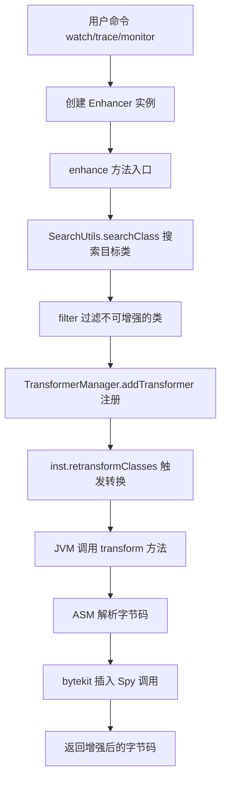
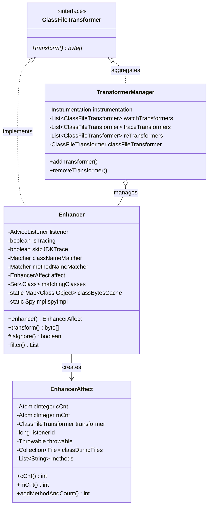
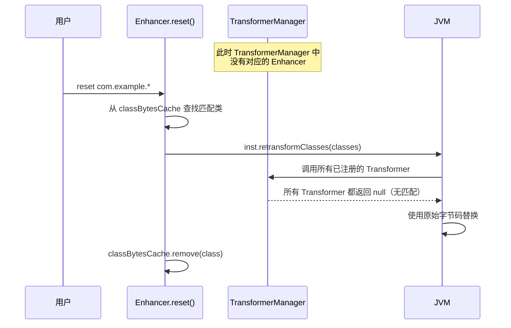

# Enhancer 字节码增强核心 - 深度解析

> 基于 Arthas 4.1.2 源码分析
> 方法论：程序 = 数据结构 + 算法
> 标准环境：-Xms8g -Xmx8g -XX:+UseG1GC

---

## 第 0 部分：核心原理

### 0.1 本质是什么？

Enhancer 是 Arthas 字节码增强的核心入口类，实现了 `ClassFileTransformer` 接口。当 JVM 调用 `retransformClasses()` 时，Enhancer 拦截类的字节码，使用 ASM + bytekit 在方法入口/出口/异常处插入 Spy 调用。

### 0.2 为什么需要 Enhancer？

**问题**：JVM 的 `Instrumentation.retransformClasses()` 需要一个 `ClassFileTransformer` 来修改字节码，但这个接口非常底层，只提供原始字节数组。

**解决方案**：Enhancer 封装了字节码增强的完整流程：
1. 类搜索与过滤
2. 字节码解析与修改
3. 监听器注册与管理
4. 结果统计与输出

### 0.3 怎么解决？



### 0.4 为什么这样设计？

| 设计选择 | 为什么？ | 替代方案 |
|----------|----------|----------|
| **实现 ClassFileTransformer** | JVM 的标准扩展点，无需修改 JVM 源码 | JVMTI Agent 更底层但复杂度高 |
| **三层 Transformer 链** | reTransformers → watchTransformers → traceTransformers，保证执行顺序 | 单一列表，顺序不可控 |
| **WeakHashMap 缓存** | 避免内存泄漏，类卸载时自动清理 | 强引用导致类无法卸载 |
| **CopyOnWriteArrayList** | 读多写少场景，遍历无锁 | synchronized 降低并发性能 |

---

## 第 1 部分：数据结构全景

> 遵循 `Doc-DataStructure-First` 规则：先穷举所有涉及的数据结构，再逐个完整分析

### 1.1 数据结构清单

| 结构名 | 源码位置 | 核心作用 | 分析深度 |
|--------|----------|----------|----------|
| **Enhancer** | `advisor/Enhancer.java` (518行) | 字节码增强核心 | 完整6项 |
| **EnhancerAffect** | `util/affect/EnhancerAffect.java` (162行) | 增强结果统计 | 完整6项 |
| **TransformerManager** | `advisor/TransformerManager.java` (98行) | Transformer 管理 | 完整6项 |

---

### 1.2 Enhancer 详细分析

#### 问题推导

**问题**：要在运行时修改一个类的字节码，增强引擎需要知道什么？

**需要什么信息？**
- 要增强**哪些类**（类名匹配）和**哪些方法**（方法名匹配）→ 需要匹配器
- 增强后**通知谁**（回调监听器）→ 需要 AdviceListener 引用
- 增强完成后**统计结果**（增强了多少类/方法）→ 需要统计对象
- 恢复时需要**原始字节码**→ 需要字节码缓存

**推导出的结构**：一个实现了 `ClassFileTransformer` 的类，持有匹配器、监听器、统计对象和字节码缓存。

#### 1.2.1 全部字段

```java
// Enhancer.java:68-84
public class Enhancer implements ClassFileTransformer {

    // ========== 静态字段 ==========
    private static final Logger logger = LoggerFactory.getLogger(Enhancer.class);  // 日志
    private static final ClassLoader selfClassLoader = Enhancer.class.getClassLoader();  // Arthas 自身的 ClassLoader
    private final static Map<Class<?>, Object> classBytesCache = new WeakHashMap<>();  // ★ 已增强类的缓存
    private static SpyImpl spyImpl = new SpyImpl();  // ★ Spy 实现（单例）

    // ========== 实例字段（每个命令创建一个 Enhancer）==========
    private final AdviceListener listener;           // ★ 监听器回调
    private final boolean isTracing;                 // 是否 trace 模式
    private final boolean skipJDKTrace;              // 是否跳过 JDK 方法
    private final Matcher classNameMatcher;          // 类名匹配器
    private final Matcher classNameExcludeMatcher;   // 类名排除匹配器
    private final Matcher methodNameMatcher;         // 方法名匹配器
    private final EnhancerAffect affect;             // 增强结果统计
    private Set<Class<?>> matchingClasses = null;    // 匹配到的类集合
}
```

#### 1.2.2 字段含义详解

| 字段 | 类型 | 含义 | 创建时机 | 使用场景 | 核心 |
|------|------|------|----------|----------|------|
| `listener` | AdviceListener | 回调监听器，如 WatchAdviceListener | 构造函数 | transform 时注册到 Manager | ★ |
| `isTracing` | boolean | 是否 trace 模式（trace 命令用） | 构造函数 | 决定加载哪些 Interceptor | ★ |
| `skipJDKTrace` | boolean | 是否跳过 JDK 方法的 trace | 构造函数 | trace 时过滤 JDK 方法 | |
| `classNameMatcher` | Matcher | 类名匹配器（支持通配符） | 构造函数 | 搜索目标类 | ★ |
| `methodNameMatcher` | Matcher | 方法名匹配器 | 构造函数 | 过滤目标方法 | ★ |
| `affect` | EnhancerAffect | 统计增强结果 | 构造函数 | 返回给调用方 | ★ |
| `matchingClasses` | Set<Class<?>> | 匹配到的类 | enhance() 中 | transform 时二次过滤 | ★ |
| `classBytesCache` | WeakHashMap | 已增强类的缓存 | 静态初始化 | reset 时恢复原始字节码 | |
| `spyImpl` | SpyImpl | Spy 实现单例 | 静态初始化 | 设置到 SpyAPI | |

#### 1.2.3 内存布局（估算）

```
Enhancer 对象布局（64位 JVM，启用压缩指针）：

┌─────────────────────────────────────────────────────────────┐
│ Object Header (12 bytes)                                    │
├─────────────────────────────────────────────────────────────┤
│ AdviceListener listener      (4 bytes, 压缩指针)            │
│ boolean isTracing            (1 byte)                       │
│ boolean skipJDKTrace         (1 byte)                       │
│ [padding 2 bytes]                                          │
│ Matcher classNameMatcher     (4 bytes)                      │
│ Matcher classNameExcludeMatcher (4 bytes)                   │
│ Matcher methodNameMatcher    (4 bytes)                      │
│ EnhancerAffect affect        (4 bytes)                      │
│ Set<Class<?>> matchingClasses (4 bytes)                     │
├─────────────────────────────────────────────────────────────┤
│ Padding (对齐到 8 字节倍数)                                   │
└─────────────────────────────────────────────────────────────┘

估算大小：~48 bytes（不含引用对象）

静态字段（类级别，所有实例共享）：
- classBytesCache: WeakHashMap (~32 bytes header + Entry 数组)
- spyImpl: SpyImpl 对象
```

#### 1.2.4 创建位置

```java
// EnhancerCommand.java 中创建 Enhancer
Enhancer enhancer = new Enhancer(
    listener,           // AdviceListener 子类实例
    isTracing,          // trace 命令为 true
    skipJDKTrace,       // trace 命令的 --skipJDKMethod 选项
    classNameMatcher,   // 类名匹配器
    classNameExcludeMatcher,  // 排除匹配器
    methodNameMatcher   // 方法名匹配器
);
```

**创建时机**：用户执行 watch/trace/monitor 命令时，EnhancerCommand 创建 Enhancer 实例。

#### 1.2.5 关键字段生命周期

| 字段 | 谁设置 | 何时设置 | 设置什么值 | 谁读取 |
|------|--------|----------|------------|--------|
| `listener` | 构造函数 | 创建 Enhancer 时 | WatchAdviceListener 等子类 | transform() 中注册 |
| `matchingClasses` | enhance() | 执行增强时 | SearchUtils 搜索结果 | transform() 中二次过滤 |
| `classBytesCache` | transform() | 增强成功后 | `new Object()` 作为标记 | reset() 中恢复类 |
| `spyImpl` | static 块 | 类加载时 | `new SpyImpl()` | SpyAPI.setSpy() |

#### 1.2.6 类继承关系

```
java.lang.Object
└── java.lang.instrument.ClassFileTransformer (接口)
    └── com.taobao.arthas.core.advisor.Enhancer

ClassFileTransformer 接口方法：
byte[] transform(ClassLoader loader, String className, Class<?> classBeingRedefined,
                 ProtectionDomain protectionDomain, byte[] classfileBuffer)
```

---

### 1.3 EnhancerAffect 详细分析

#### 问题推导

**问题**：增强操作完成后，用户需要知道什么？

**需要什么信息？**
- 增强了**多少个类**、**多少个方法**→ 需要原子计数器（多线程安全）
- 这次增强对应的 **Transformer** 是哪个 → 需要引用，用于后续 reset 时移除
- 增强耗时 → 继承自父类 Affect

**推导出的结构**：包含两个原子计数器（类数、方法数）和一个 Transformer 引用的统计类。

#### 1.3.1 全部字段

```java
// EnhancerAffect.java:21-37
public final class EnhancerAffect extends Affect {

    // ========== 统计计数（线程安全）==========
    private final AtomicInteger cCnt = new AtomicInteger();  // ★ 增强的类数量
    private final AtomicInteger mCnt = new AtomicInteger();  // ★ 增强的方法数量

    // ========== 元数据 ==========
    private ClassFileTransformer transformer;  // 关联的 Transformer
    private long listenerId;                   // 监听器 ID
    private Throwable throwable;               // 增强过程中的异常
    private String overLimitMsg;               // 超过类数量限制的提示

    // ========== 详细记录 ==========
    private final Collection<File> classDumpFiles = new ArrayList<>();  // dump 文件列表
    private final List<String> methods = new ArrayList<>();              // 增强的方法列表
}
```

#### 1.3.2 字段含义

| 字段 | 类型 | 含义 | 使用场景 |
|------|------|------|----------|
| `cCnt` | AtomicInteger | 增强的类数量（线程安全） | 统计输出 |
| `mCnt` | AtomicInteger | 增强的方法数量 | 统计输出 |
| `transformer` | ClassFileTransformer | 关联的 Enhancer | 用于移除 |
| `listenerId` | long | 监听器 ID | 命令停止时注销 |
| `throwable` | Throwable | 增强异常 | 错误提示 |
| `overLimitMsg` | String | 超限提示 | 类数量超过限制时 |
| `classDumpFiles` | Collection<File> | dump 文件 | 启用 --dump 时 |
| `methods` | List<String> | 方法列表 | verbose 输出 |

#### 1.3.3 核心方法

```java
// EnhancerAffect.java:48-70
public int cCnt(int cc) {
    return cCnt.addAndGet(cc);  // ★ 原子操作，线程安全
}

public int mCnt(int mc) {
    return mCnt.addAndGet(mc);
}

public int addMethodAndCount(ClassLoader classLoader, String clazz, String method, String methodDesc) {
    // 格式：classLoaderHash|className#methodName|methodDesc
    this.methods.add(ClassLoaderUtils.classLoaderHash(classLoader) + "|" 
        + clazz.replace('/', '.') + "#" + method + "|" + methodDesc);
    return mCnt.addAndGet(1);
}
```

---

### 1.4 TransformerManager 详细分析

#### 问题推导

**问题**：多个命令（watch、trace、monitor）同时增强不同的类，怎么管理这些 Transformer？

**需要什么信息？**
- JVM 的 `Instrumentation` 只有一个注册入口 → 需要一个统一的 Transformer 分发器
- watch/trace 命令退出后要移除增强 → 需要按命令分开存储
- retransform 命令的增强要和 watch/trace 隔离 → 需要独立的列表
- 多线程并发注册/移除 → 需要线程安全容器

**推导出的结构**：持有 Instrumentation 引用，内部用多个列表分别管理不同类型的 Transformer。

#### 1.4.1 全部字段

```java
// TransformerManager.java:21-32
public class TransformerManager {

    private Instrumentation instrumentation;  // JVM Instrumentation 实例
    private List<ClassFileTransformer> watchTransformers = new CopyOnWriteArrayList<>();  // watch/monitor
    private List<ClassFileTransformer> traceTransformers = new CopyOnWriteArrayList<>();  // trace
    private List<ClassFileTransformer> reTransformers = new CopyOnWriteArrayList<>();     // 重置用
    
    private ClassFileTransformer classFileTransformer;  // ★ 聚合 Transformer
}
```

#### 1.4.2 三层 Transformer 链

```
TransformerManager 管理的 Transformer 执行顺序：

retransformClasses() 触发
        ↓
classFileTransformer.transform() (聚合入口)
        ↓
┌─────────────────────────────────────────────────────────────────┐
│ Layer 1: reTransformers                                         │
│   - 用于 reset 恢复原始字节码                                    │
│   - 最先执行，保证恢复操作在增强之前                              │
├─────────────────────────────────────────────────────────────────┤
│ Layer 2: watchTransformers                                      │
│   - watch/monitor/stack/tt 命令的 Enhancer                      │
│   - 在方法入口/出口/异常处插入 Spy 调用                           │
├─────────────────────────────────────────────────────────────────┤
│ Layer 3: traceTransformers                                      │
│   - trace 命令的 Enhancer                                       │
│   - 在每个方法调用前后插入 Spy 调用                              │
└─────────────────────────────────────────────────────────────────┘
        ↓
返回最终字节码
```

#### 1.4.3 核心方法

```java
// TransformerManager.java:37-71
public TransformerManager(Instrumentation instrumentation) {
    this.instrumentation = instrumentation;

    // ★ 创建聚合 Transformer
    classFileTransformer = new ClassFileTransformer() {
        @Override
        public byte[] transform(ClassLoader loader, String className, Class<?> classBeingRedefined,
                ProtectionDomain protectionDomain, byte[] classfileBuffer) throws IllegalClassFormatException {
            
            // ★ 按顺序执行三层 Transformer
            for (ClassFileTransformer classFileTransformer : reTransformers) {
                byte[] transformResult = classFileTransformer.transform(...);
                if (transformResult != null) {
                    classfileBuffer = transformResult;  // ★ 链式传递
                }
            }

            for (ClassFileTransformer classFileTransformer : watchTransformers) {
                byte[] transformResult = classFileTransformer.transform(...);
                if (transformResult != null) {
                    classfileBuffer = transformResult;
                }
            }

            for (ClassFileTransformer classFileTransformer : traceTransformers) {
                byte[] transformResult = classFileTransformer.transform(...);
                if (transformResult != null) {
                    classfileBuffer = transformResult;
                }
            }

            return classfileBuffer;  // ★ 返回最终结果
        }
    };
    
    // ★ 注册到 JVM
    instrumentation.addTransformer(classFileTransformer, true);
}
```

---

### 1.5 数据结构关系图



---

## 第 2 部分：算法/流程分析

> 遵循 `Source-Code-Depth` 规则：禁止伪代码，必须真实源码 + 逐行注释 + 设计解释

### 2.1 enhance() - 增强入口方法

**解决什么问题？** 搜索目标类，过滤不可增强的类，触发 JVM 的 retransformClasses。

**输入**：
- `inst`: Instrumentation 实例
- `maxNumOfMatchedClass`: 最大匹配类数量限制

**输出**：`EnhancerAffect` - 增强结果统计

**源码位置**：`Enhancer.java:415-473`

```java
// Enhancer.java:415-473
public synchronized EnhancerAffect enhance(final Instrumentation inst, int maxNumOfMatchedClass) 
        throws UnmodifiableClassException {
    
    // ★ Step 1: 搜索目标类
    // GlobalOptions.isDisableSubClass: 是否禁用子类搜索
    this.matchingClasses = GlobalOptions.isDisableSubClass
            ? SearchUtils.searchClass(inst, classNameMatcher)  // 只搜索直接匹配的类
            : SearchUtils.searchSubClass(inst, SearchUtils.searchClass(inst, classNameMatcher));  // 包含子类

    // ★ Step 2: 检查类数量限制
    if (matchingClasses.size() > maxNumOfMatchedClass) {
        affect.setOverLimitMsg("The number of matched classes is " + matchingClasses.size() 
            + ", greater than the limit value " + maxNumOfMatchedClass 
            + ". Try to change the limit with option '-m <arg>'.");
        return affect;  // ★ 超限直接返回，不增强
    }
    
    // ★ Step 3: 过滤不可增强的类
    List<Pair<Class<?>, String>> filtedList = filter(matchingClasses);
    if (!filtedList.isEmpty()) {
        for (Pair<Class<?>, String> filted : filtedList) {
            logger.info("ignore class: {}, reason: {}", filted.getFirst().getName(), filted.getSecond());
        }
    }

    logger.info("enhance matched classes: {}", matchingClasses);

    // ★ Step 4: 设置 Transformer 引用（用于后续移除）
    affect.setTransformer(this);

    try {
        // ★ Step 5: 注册到 TransformerManager
        ArthasBootstrap.getInstance().getTransformerManager().addTransformer(this, isTracing);

        // ★ Step 6: 触发 JVM 重新转换类
        if (GlobalOptions.isBatchReTransform) {
            // 批量增强模式
            final int size = matchingClasses.size();
            final Class<?>[] classArray = new Class<?>[size];
            arraycopy(matchingClasses.toArray(), 0, classArray, 0, size);
            if (classArray.length > 0) {
                inst.retransformClasses(classArray);  // ★ 一次调用，批量转换
                logger.info("Success to batch transform classes: " + Arrays.toString(classArray));
            }
        } else {
            // 逐个增强模式
            for (Class<?> clazz : matchingClasses) {
                try {
                    inst.retransformClasses(clazz);  // ★ 逐个调用
                    logger.info("Success to transform class: " + clazz);
                } catch (Throwable t) {
                    logger.warn("retransform {} failed.", clazz, t);
                    if (t instanceof UnmodifiableClassException) {
                        throw (UnmodifiableClassException) t;
                    } else if (t instanceof RuntimeException) {
                        throw (RuntimeException) t;
                    } else {
                        throw new RuntimeException(t);
                    }
                }
            }
        }
    } catch (Throwable e) {
        logger.error("Enhancer error, matchingClasses: {}", matchingClasses, e);
        affect.setThrowable(e);
    }

    return affect;
}
```

**设计决策**：
- 为什么用 `synchronized`？防止同一时间多个命令同时增强，避免 Transformer 链混乱
- 为什么有两种模式？批量模式效率高但出错难定位；逐个模式便于调试

---

### 2.2 transform() - 字节码修改核心

**解决什么问题？** 当 JVM 调用 `retransformClasses()` 时，拦截类转换，修改字节码。

**输入**：
- `classfileBuffer`: 原始字节码
- `className`: 类名
- `inClassLoader`: 类加载器

**输出**：增强后的字节码，或 `null`（不修改）

**源码位置**：`Enhancer.java:111-274`

```java
// Enhancer.java:111-274
@Override
public byte[] transform(final ClassLoader inClassLoader, String className, Class<?> classBeingRedefined,
        ProtectionDomain protectionDomain, byte[] classfileBuffer) throws IllegalClassFormatException {
    try {
        // ========== Step 1: 前置检查 ==========
        
        // ★ 检查 SpyAPI 可见性
        try {
            if (inClassLoader != null) {
                inClassLoader.loadClass(SpyAPI.class.getName());
            }
        } catch (Throwable e) {
            logger.error("the classloader can not load SpyAPI, ignore it. classloader: {}, className: {}",
                    inClassLoader.getClass().getName(), className, e);
            return null;  // ★ 返回 null = 不修改
        }

        // ★ 二次过滤（transform 过程中可能有新类诞生）
        if (matchingClasses != null && !matchingClasses.contains(classBeingRedefined)) {
            return null;
        }

        // ========== Step 2: 解析字节码 ==========
        
        ClassNode classNode = new ClassNode(Opcodes.ASM9);
        ClassReader classReader = AsmUtils.toClassNode(classfileBuffer, classNode);
        classNode = AsmUtils.removeJSRInstructions(classNode);  // 兼容性处理

        // ========== Step 3: 准备拦截器 ==========
        
        DefaultInterceptorClassParser defaultInterceptorClassParser = new DefaultInterceptorClassParser();
        final List<InterceptorProcessor> interceptorProcessors = new ArrayList<>();

        // ★ 基础拦截器（watch/monitor 用）
        interceptorProcessors.addAll(defaultInterceptorClassParser.parse(SpyInterceptor1.class));   // @AtEnter
        interceptorProcessors.addAll(defaultInterceptorClassParser.parse(SpyInterceptor2.class));   // @AtExit
        interceptorProcessors.addAll(defaultInterceptorClassParser.parse(SpyInterceptor3.class));   // @AtExceptionExit

        // ★ trace 拦截器
        if (this.isTracing) {
            if (!this.skipJDKTrace) {
                interceptorProcessors.addAll(defaultInterceptorClassParser.parse(SpyTraceInterceptor1.class));
                interceptorProcessors.addAll(defaultInterceptorClassParser.parse(SpyTraceInterceptor2.class));
                interceptorProcessors.addAll(defaultInterceptorClassParser.parse(SpyTraceInterceptor3.class));
            } else {
                interceptorProcessors.addAll(defaultInterceptorClassParser.parse(SpyTraceExcludeJDKInterceptor1.class));
                interceptorProcessors.addAll(defaultInterceptorClassParser.parse(SpyTraceExcludeJDKInterceptor2.class));
                interceptorProcessors.addAll(defaultInterceptorClassParser.parse(SpyTraceExcludeJDKInterceptor3.class));
            }
        }

        // ========== Step 4: 匹配方法 ==========
        
        List<MethodNode> matchedMethods = new ArrayList<>();
        for (MethodNode methodNode : classNode.methods) {
            if (!isIgnore(methodNode, methodNameMatcher)) {
                matchedMethods.add(methodNode);
            }
        }

        // ★ CGLIB 兼容性处理
        if (AsmUtils.isEnhancerByCGLIB(className)) {
            for (MethodNode methodNode : matchedMethods) {
                if (AsmUtils.isConstructor(methodNode)) {
                    AsmUtils.fixConstructorExceptionTable(methodNode);
                }
            }
        }

        // ========== Step 5: 创建位置过滤器 ==========
        
        GroupLocationFilter groupLocationFilter = new GroupLocationFilter();

        // ★ 检查是否已插入 Spy 调用（防止重复增强）
        LocationFilter enterFilter = new InvokeContainLocationFilter(
            Type.getInternalName(SpyAPI.class), "atEnter", LocationType.ENTER);
        LocationFilter existFilter = new InvokeContainLocationFilter(
            Type.getInternalName(SpyAPI.class), "atExit", LocationType.EXIT);
        LocationFilter exceptionFilter = new InvokeContainLocationFilter(
            Type.getInternalName(SpyAPI.class), "atExceptionExit", LocationType.EXCEPTION_EXIT);

        groupLocationFilter.addFilter(enterFilter);
        groupLocationFilter.addFilter(existFilter);
        groupLocationFilter.addFilter(exceptionFilter);

        // ★ trace 的位置过滤器
        LocationFilter invokeBeforeFilter = new InvokeCheckLocationFilter(
            Type.getInternalName(SpyAPI.class), "atBeforeInvoke", LocationType.INVOKE);
        LocationFilter invokeAfterFilter = new InvokeCheckLocationFilter(
            Type.getInternalName(SpyAPI.class), "atInvokeException", LocationType.INVOKE_COMPLETED);
        LocationFilter invokeExceptionFilter = new InvokeCheckLocationFilter(
            Type.getInternalName(SpyAPI.class), "atInvokeException", LocationType.INVOKE_EXCEPTION_EXIT);
        groupLocationFilter.addFilter(invokeBeforeFilter);
        groupLocationFilter.addFilter(invokeAfterFilter);
        groupLocationFilter.addFilter(invokeExceptionFilter);

        // ========== Step 6: 处理每个方法 ==========
        
        for (MethodNode methodNode : matchedMethods) {
            // ★ 跳过 native 方法
            if (AsmUtils.isNative(methodNode)) {
                logger.info("ignore native method: {}", 
                    AsmUtils.methodDeclaration(Type.getObjectType(classNode.name), methodNode));
                continue;
            }
            
            // ★ 检查是否已增强过
            if (AsmUtils.containsMethodInsnNode(methodNode, 
                    Type.getInternalName(SpyAPI.class), "atBeforeInvoke")) {
                // 已增强过，只注册 listener
                for (AbstractInsnNode insnNode = methodNode.instructions.getFirst(); 
                     insnNode != null; insnNode = insnNode.getNext()) {
                    if (insnNode instanceof MethodInsnNode) {
                        final MethodInsnNode methodInsnNode = (MethodInsnNode) insnNode;
                        if (this.skipJDKTrace && methodInsnNode.owner.startsWith("java/")) {
                            continue;
                        }
                        if (AsmOpUtils.isBoxType(Type.getObjectType(methodInsnNode.owner))) {
                            continue;
                        }
                        AdviceListenerManager.registerTraceAdviceListener(
                            inClassLoader, className, methodInsnNode.owner, 
                            methodInsnNode.name, methodInsnNode.desc, listener);
                    }
                }
            } else {
                // ★ 首次增强
                MethodProcessor methodProcessor = new MethodProcessor(
                    classNode, methodNode, groupLocationFilter);
                for (InterceptorProcessor interceptor : interceptorProcessors) {
                    try {
                        List<Location> locations = interceptor.process(methodProcessor);
                        for (Location location : locations) {
                            if (location instanceof MethodInsnNodeWare) {
                                MethodInsnNodeWare methodInsnNodeWare = (MethodInsnNodeWare) location;
                                MethodInsnNode methodInsnNode = methodInsnNodeWare.methodInsnNode();
                                AdviceListenerManager.registerTraceAdviceListener(
                                    inClassLoader, className, methodInsnNode.owner, 
                                    methodInsnNode.name, methodInsnNode.desc, listener);
                            }
                        }
                    } catch (Throwable e) {
                        logger.error("enhancer error, class: {}, method: {}, interceptor: {}", 
                            classNode.name, methodNode.name, interceptor.getClass().getName(), e);
                    }
                }
            }

            // ★ 注册方法入口/出口监听器
            AdviceListenerManager.registerAdviceListener(
                inClassLoader, className, methodNode.name, methodNode.desc, listener);
            affect.addMethodAndCount(inClassLoader, className, methodNode.name, methodNode.desc);
        }

        // ========== Step 7: 生成字节码 ==========
        
        // ★ 版本兼容性：确保至少 Java 5 (version 49)
        if (AsmUtils.getMajorVersion(classNode.version) < 49) {
            classNode.version = AsmUtils.setMajorVersion(classNode.version, 49);
        }

        byte[] enhanceClassByteArray = AsmUtils.toBytes(classNode, inClassLoader, classReader);

        // ★ 记录已增强
        classBytesCache.put(classBeingRedefined, new Object());

        // ★ 可选：dump 到文件
        dumpClassIfNecessary(className, enhanceClassByteArray, affect);

        affect.cCnt(1);  // 类计数 +1

        return enhanceClassByteArray;  // ★ 返回增强后的字节码
        
    } catch (Throwable t) {
        logger.warn("transform loader[{}]:class[{}] failed.", inClassLoader, className, t);
        affect.setThrowable(t);
    }

    return null;
}
```

---

### 2.3 filter() - 类过滤逻辑

**解决什么问题？** 过滤掉不可增强的类，避免运行时错误。

**输入**：`Set<Class<?>>` - 搜索到的类集合

**输出**：被过滤掉的类及其原因

**源码位置**：`Enhancer.java:325-354`

```java
// Enhancer.java:325-354
private List<Pair<Class<?>, String>> filter(Set<Class<?>> classes) {
    List<Pair<Class<?>, String>> filteredClasses = new ArrayList<>();
    final Iterator<Class<?>> it = classes.iterator();
    
    while (it.hasNext()) {
        final Class<?> clazz = it.next();
        boolean removeFlag = false;
        
        // ★ 过滤条件 1：null
        if (null == clazz) {
            removeFlag = true;
        } 
        // ★ 过滤条件 2：Arthas 自身加载的类
        else if (isSelf(clazz)) {
            filteredClasses.add(new Pair<>(clazz, "class loaded by arthas itself"));
            removeFlag = true;
        } 
        // ★ 过滤条件 3：Bootstrap ClassLoader 加载的类（除非 options unsafe true）
        else if (isUnsafeClass(clazz)) {
            filteredClasses.add(new Pair<>(clazz, 
                "class loaded by Bootstrap Classloader, try to execute `options unsafe true`"));
            removeFlag = true;
        } 
        // ★ 过滤条件 4：用户指定的排除类
        else if (isExclude(clazz)) {
            filteredClasses.add(new Pair<>(clazz, "class is excluded"));
            removeFlag = true;
        } 
        // ★ 过滤条件 5：不支持的类类型
        else {
            Pair<Boolean, String> unsupportedResult = isUnsupportedClass(clazz);
            if (unsupportedResult.getFirst()) {
                filteredClasses.add(new Pair<>(clazz, unsupportedResult.getSecond()));
                removeFlag = true;
            }
        }
        
        if (removeFlag) {
            it.remove();  // ★ 从集合中移除
        }
    }
    return filteredClasses;
}
```

**过滤规则详解**：

| 过滤条件 | 方法 | 原因 |
|----------|------|------|
| Arthas 自身 | `isSelf()` | 避免循环增强，导致无限递归 |
| Bootstrap CL | `isUnsafeClass()` | 默认安全，避免破坏 JDK 核心类 |
| Lambda 类 | `ClassUtils.isLambdaClass()` | Lambda 类结构特殊，难以增强 |
| 接口 | `clazz.isInterface()` | 接口无方法体 |
| Integer/Class/Method | 硬编码 | 这些类在增强过程中会被频繁使用 |
| 数组 | `clazz.isArray()` | 数组无方法可增强 |

---

### 2.4 isIgnore() - 方法过滤逻辑

**解决什么问题？** 过滤掉不需要增强的方法。

**源码位置**：`Enhancer.java:286-289`

```java
// Enhancer.java:286-289
private boolean isIgnore(MethodNode methodNode, Matcher methodNameMatcher) {
    return null == methodNode                           // ★ 空方法
        || isAbstract(methodNode.access)                // ★ 抽象方法（无方法体）
        || !methodNameMatcher.matching(methodNode.name) // ★ 方法名不匹配
        || ArthasCheckUtils.isEquals(methodNode.name, "<clinit>");  // ★ 静态初始化块
}
```

**设计决策**：
- 为什么排除 `<clinit>`？静态初始化块在类加载时执行，此时 SpyAPI 可能还未初始化完成

---

### 2.5 reset() - 恢复原始字节码

**解决什么问题？** 当用户执行 reset 命令时，恢复被增强类的原始字节码。

**源码位置**：`Enhancer.java:483-506`

```java
// Enhancer.java:483-506
public static synchronized EnhancerAffect reset(final Instrumentation inst, final Matcher classNameMatcher)
        throws UnmodifiableClassException {

    final EnhancerAffect affect = new EnhancerAffect();
    final Set<Class<?>> enhanceClassSet = new HashSet<>();

    // ★ Step 1: 从缓存中找到被增强的类
    for (Class<?> classInCache : classBytesCache.keySet()) {
        if (classNameMatcher.matching(classInCache.getName())) {
            enhanceClassSet.add(classInCache);
        }
    }

    try {
        // ★ Step 2: 重新转换（不带 Spy 插入，恢复原始字节码）
        enhance(inst, enhanceClassSet);
        logger.info("Success to reset classes: " + enhanceClassSet);
    } finally {
        // ★ Step 3: 从缓存中移除
        for (Class<?> resetClass : enhanceClassSet) {
            classBytesCache.remove(resetClass);
            affect.cCnt(1);
        }
    }

    return affect;
}
```

**设计决策**：
- 为什么用 WeakHashMap 缓存？类卸载时自动清理，避免内存泄漏
- 如何恢复原始字节码？`retransformClasses` 不插入 Spy，JVM 会使用原始字节码

---

## 第 3 部分：运行时验证

### 3.1 验证方法

由于 Arthas 是 Java 应用，使用以下方法验证：

1. **日志输出**：启用 verbose 日志观察增强流程
2. **字节码 dump**：使用 `--dump` 选项导出增强后的 class 文件
3. **Arthas 自诊断**：使用 `stack` 命令观察 Enhancer 调用栈

### 3.2 验证步骤

```bash
# 1. 启动目标应用
java -jar demo.jar &

# 2. 启动 Arthas
java -jar arthas-boot.jar

# 3. 执行 watch 命令，启用详细日志
options verbose true
watch com.example.MyService doSomething '{params}' -x 2

# 4. 查看 Arthas 日志
# 输出：
# [INFO] enhance matched classes: [class com.example.MyService]
# [INFO] Success to transform class: class com.example.MyService
# [INFO] Affect(class count: 1 , method count: 1) cost in 15 ms, listenerId: 1

# 5. 使用 jad 反编译增强后的类
jad com.example.MyService

# 输出会显示插入的 SpyAPI.atEnter 调用
```

### 3.3 关键验证点

| 验证点 | 预期结果 | 验证方法 |
|--------|----------|----------|
| 类被增强 | 日志显示 "Success to transform" | 查看 Arthas 日志 |
| Spy 调用插入 | 反编译显示 SpyAPI.atEnter | jad 命令 |
| Listener 注册 | listenerId 不为 0 | affect 输出 |
| 缓存记录 | classBytesCache 包含该类 | GDB 或 debug |

---

## 第 4 部分：异常/边界分支分析 ⭐

> 前面分析的是正常路径（happy path）。本节补充**增强失败时的回滚与保护机制**——这是面试高频追问点。

### 4.1 问题：字节码增强失败怎么办？

字节码增强涉及修改已加载类的方法体，任何一步出错都可能导致类无法使用。Arthas 需要回答三个关键问题：
1. ASM/bytekit 生成了无效字节码（VerifyError），原始类是否安全？
2. 增强多个类时中间某个失败，已增强的类怎么处理？
3. 原始字节码保存在哪？怎么恢复？

### 4.2 `transform()` 的三层异常保护

```java
// Enhancer.java:112-274
public byte[] transform(...) throws IllegalClassFormatException {
    try {
        // ★ 第一层保护：ClassLoader 能否加载 SpyAPI（第117-123行）
        // 如果目标类的 ClassLoader 无法加载 SpyAPI，增强后的代码运行时会
        // 抛出 ClassNotFoundException → 直接放弃增强
        try {
            if (inClassLoader != null) {
                inClassLoader.loadClass(SpyAPI.class.getName());
            }
        } catch (Throwable e) {
            logger.error("the classloader can not load SpyAPI, ignore it.");
            return null;  // ★ 返回 null = JVM 使用原始字节码，类不受影响
        }

        // ★ 第二层保护：目标类过滤（第129行）
        if (matchingClasses != null && !matchingClasses.contains(classBeingRedefined)) {
            return null;  // 不在目标列表中，跳过
        }

        // ★ 第三层保护：单个拦截器失败不影响整体（第227-242行）
        for (InterceptorProcessor interceptor : interceptorProcessors) {
            try {
                List<Location> locations = interceptor.process(methodProcessor);
                // ...
            } catch (Throwable e) {
                // 某个拦截器出错 → 记录日志，继续处理下一个拦截器
                // 不中断整个类的增强过程
                logger.error("enhancer error, class: {}, method: {}, interceptor: {}",
                    classNode.name, methodNode.name, interceptor.getClass().getName(), e);
            }
        }
        return enhanceClassByteArray;  // 第267行：成功返回

    } catch (Throwable t) {
        // ★ 最外层兜底：任何未捕获异常（第268-271行）
        logger.warn("transform loader[{}]:class[{}] failed.", inClassLoader, className, t);
        affect.setThrowable(t);  // 记录异常，供上层检查
    }
    return null;  // ★ 失败返回 null → JVM 使用原始 classfileBuffer
}
```

**关键机制：`transform()` 返回 null 的语义**

这是 JVM `ClassFileTransformer` 的标准协议（`java.lang.instrument` 规范）：
- 返回 `null` → JVM **忽略此 Transformer 的修改**，使用原始字节码
- 返回 `byte[]` → JVM 使用返回的新字节码替换原始字节码
- 抛出异常 → JVM 同样忽略，使用原始字节码（但会打印错误）

**所以即使 ASM/bytekit 生成了无效字节码并触发 VerifyError：**
1. 异常在 `catch(Throwable t)` 中被捕获
2. `transform()` 返回 `null`
3. JVM 使用原始 `classfileBuffer`
4. **原始类完全不受影响**

### 4.3 `enhance()` 方法的部分失败处理

```java
// Enhancer.java:437-470 — enhance() 方法的两种 retransform 模式
try {
    ArthasBootstrap.getInstance().getTransformerManager().addTransformer(this, isTracing);

    if (GlobalOptions.isBatchReTransform) {
        // ★ 批量模式：全部类一次性提交
        // JVM 原子性处理：要么全部成功，要么全部失败
        inst.retransformClasses(classArray);
    } else {
        // ★ 逐个模式（默认）
        for (Class<?> clazz : matchingClasses) {
            try {
                inst.retransformClasses(clazz);
            } catch (Throwable t) {
                logger.warn("retransform {} failed.", clazz, t);
                // ★ 注意：异常被重新抛出！第一个失败就中止剩余类的增强
                if (t instanceof UnmodifiableClassException) {
                    throw (UnmodifiableClassException) t;
                } else if (t instanceof RuntimeException) {
                    throw (RuntimeException) t;
                } else {
                    throw new RuntimeException(t);
                }
            }
        }
    }
} catch (Throwable e) {
    // ★ 外层捕获：记录到 affect，不向上抛出
    logger.error("Enhancer error, matchingClasses: {}", matchingClasses, e);
    affect.setThrowable(e);
}
```

**部分失败的行为差异**：

| 场景 | 批量模式 | 逐个模式（默认） |
|------|---------|----------------|
| 第 3 个类 retransform 失败 | 全部回滚（JVM 原子性） | 前 2 个已增强，第 3 个及之后未增强 |
| 失败后 Transformer 是否移除 | **否！** Transformer 仍在 TransformerManager 中 | **否！** 同左 |
| 失败后能否恢复 | 用 `reset` 命令 | 用 `reset` 命令 |

> **⚠️ 发现的潜在问题**：`enhance()` 方法在增强失败时，**不会从 TransformerManager 中移除自身**。
> Transformer 要等到 `process.unregister()` 调用（命令结束时）才被移除。如果增强全部失败但命令
> 未正常结束，这个无效的 Transformer 会一直留在 TransformerManager 中，每次有类加载/转换时
> 都会被执行（虽然 `matchingClasses` 过滤会让它返回 null，但仍有微小的性能开销）。
>
> 对比 `InstrumentationUtils.retransformClasses()`（第19-41行）——它使用 **try-finally** 确保
> `inst.removeTransformer(transformer)` 一定被调用，设计更严谨。

### 4.4 `reset()` — 恢复原始字节码的原理

```java
// Enhancer.java:483-506
public static synchronized EnhancerAffect reset(final Instrumentation inst,
        final Matcher classNameMatcher) throws UnmodifiableClassException {
    final EnhancerAffect affect = new EnhancerAffect();
    final Set<Class<?>> enhanceClassSet = new HashSet<Class<?>>();

    // ★ Step 1: 从缓存中查找所有匹配的已增强类
    // classBytesCache 是 WeakHashMap<Class<?>, Object>（第83行）
    for (Class<?> classInCache : classBytesCache.keySet()) {
        if (classNameMatcher.matching(classInCache.getName())) {
            enhanceClassSet.add(classInCache);
        }
    }

    try {
        // ★ Step 2: 触发 retransformClasses
        // 此时 TransformerManager 中已没有对应的 Enhancer（已被 unregister 移除）
        // 所以 retransform 会使用 JVM 内部缓存的原始字节码
        // 效果等同于"恢复原始类"
        enhance(inst, enhanceClassSet);
    } finally {
        // ★ Step 3: 无论成功失败，都清理缓存
        for (Class<?> resetClass : enhanceClassSet) {
            classBytesCache.remove(resetClass);
            affect.cCnt(1);
        }
    }
    return affect;
}
```

**恢复原理图**：



---

## 第 5 部分：总结

### 5.1 数据结构层面

| 结构 | 核心特征 |
|------|----------|
| **Enhancer** | 实现 ClassFileTransformer，封装字节码增强完整流程 |
| **EnhancerAffect** | 线程安全的统计结果，AtomicInteger 计数 |
| **TransformerManager** | 三层 CopyOnWriteArrayList 管理 Transformer 链 |
| **classBytesCache** | WeakHashMap 缓存，防止内存泄漏 |

### 5.2 算法层面

| 算法 | 设计决策 | 复杂度 |
|------|----------|--------|
| **类搜索** | SearchUtils + 子类递归 | O(n*m) n=类数，m=继承深度 |
| **类过滤** | 多条件判断，逐项排除 | O(n) |
| **字节码修改** | ASM Tree API + bytekit 注解 | O(k) k=方法指令数 |
| **防重复增强** | InvokeContainLocationFilter 检查 | O(k) |
| **监听器管理** | ClassLoader 隔离 + String key | O(1) 查询 |

### 5.3 核心要点

1. **Enhancer 是 ClassFileTransformer 的实现**，JVM 的标准扩展点
2. **三层 Transformer 链**保证 reTransformers → watch → trace 的执行顺序
3. **WeakHashMap 缓存**已增强的类，支持 reset 恢复
4. **位置过滤器**防止重复增强，避免无限递归
5. **线程安全设计**：synchronized、AtomicInteger、CopyOnWriteArrayList
6. **异常保护三层设计**：ClassLoader 检查 → 单拦截器异常隔离 → `catch(Throwable)` 兜底，`transform()` 返回 null 即回退原始字节码
7. **reset 恢复原理**：移除 Transformer 后 retransform → JVM 使用原始字节码 → 清理缓存

### 5.4 与 JVM 的关联

| Arthas 组件 | JVM 机制 | 关联点 |
|-------------|----------|--------|
| Enhancer | ClassFileTransformer | JVM retransformClasses 的回调入口 |
| TransformerManager | Instrumentation API | 管理 Transformer 链 |
| classBytesCache | Class 对象 | WeakHashMap 避免阻止类卸载 |
| SpyAPI | BootstrapClassLoader | 保证对所有类可见 |

---

## 附录：相关文档

| 文档 | 内容 |
|------|------|
| `Arthas-new/01-ASM-Framework-Prerequisite.md` | ASM 框架基础 |
| `SOLibrary/1-libinstrument-Java-Agent-Deep-Dive.md` | Java Agent 与 Instrumentation API |
| `SOLibrary/4-libattach-Attach-Mechanism-Deep-Dive.md` | Attach 机制 |
