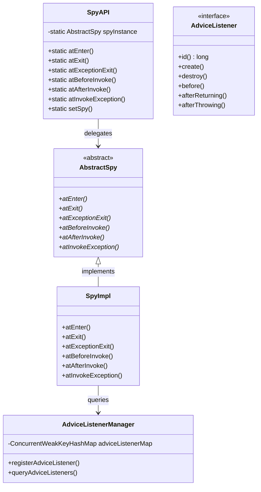
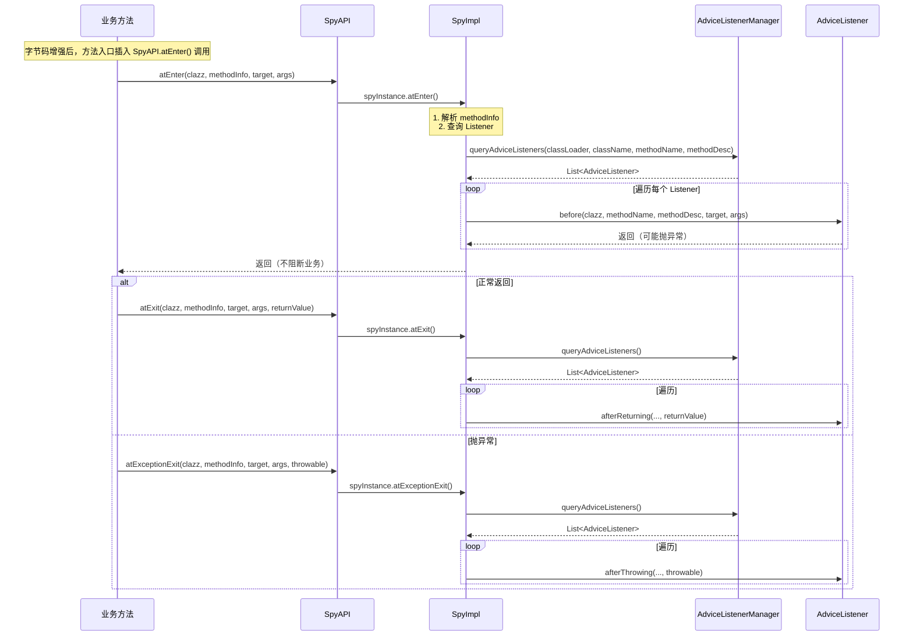
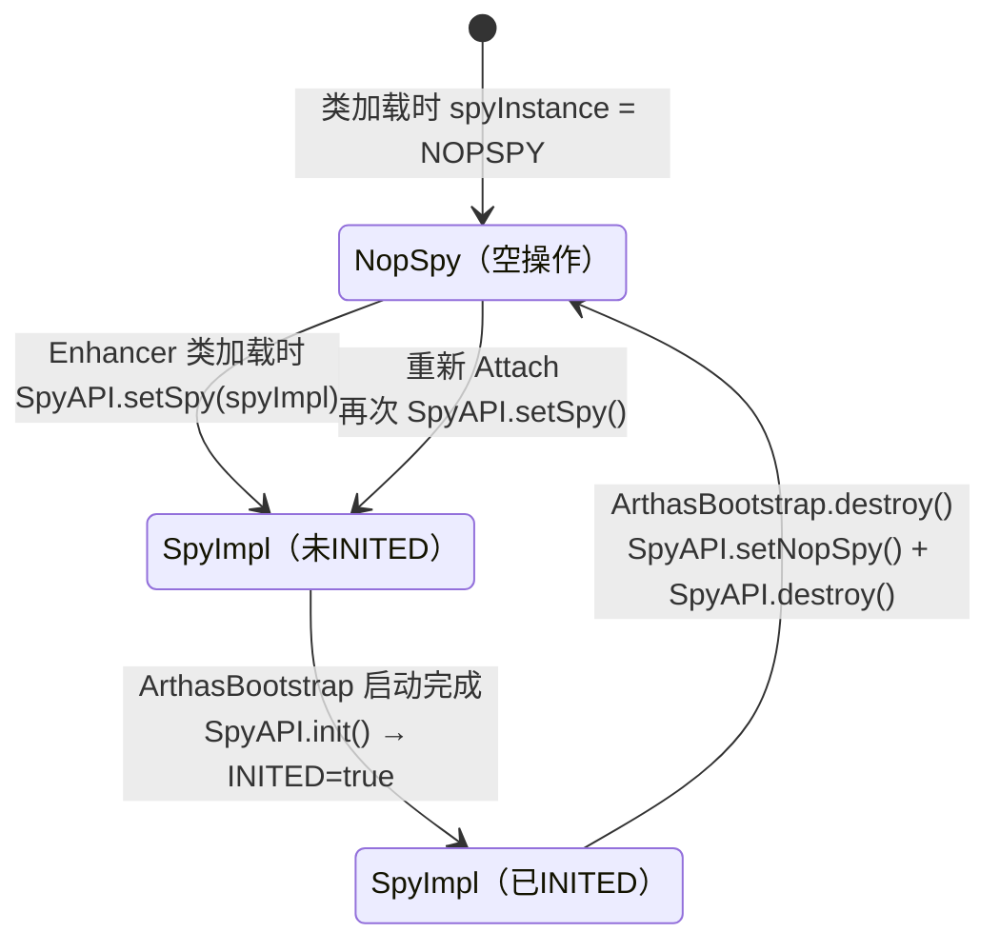
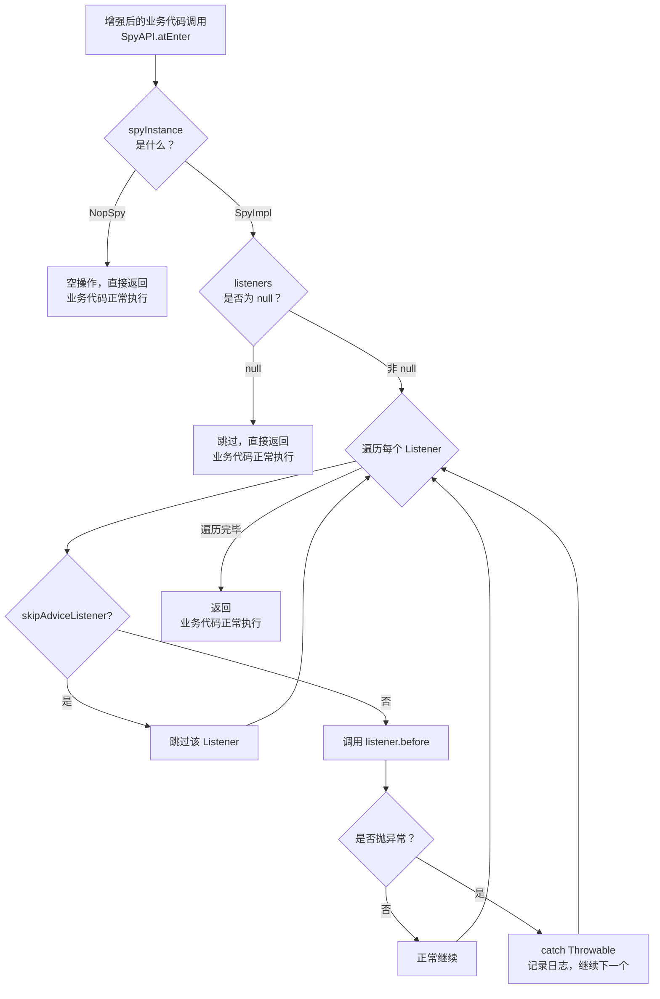

# Spy 拦截器机制 - 深度解析

> 基于 Arthas 4.1.2 源码分析
> 方法论：程序 = 数据结构 + 算法
> 标准环境：-Xms8g -Xmx8g -XX:+UseG1GC

---

## 第 0 部分：核心原理

### 0.1 本质是什么？

Spy 拦截器机制是 Arthas 字节码增强的**中转层**。它定义了方法拦截点的统一入口（SpyAPI），并在方法入口/出口/异常处插入对 SpyAPI 的调用，将执行流程从业务代码转交给 Arthas 的监听器。

### 0.2 为什么需要 Spy 类？

**问题**：字节码增强后，业务方法中需要调用增强逻辑。但：
1. **直接调用 AdviceListener 不可行** - 字节码中无法直接引用 Java 对象
2. **硬编码不灵活** - 增强逻辑变化需要重新修改字节码
3. **解耦需求** - 业务代码不应感知增强逻辑的存在

**解决方案**：引入 Spy 类作为中转站：
- 字节码只调用 `SpyAPI.atEnter/atExit` 等静态方法
- 运行时通过 `SpyAPI.setSpy(SpyImpl)` 绑定实际实现
- 实现切换只需调用 `setSpy()`，无需重新增强

### 0.3 怎么解决？

```
业务方法执行流程：

增强前：
  doSomething() → return result

增强后：
  doSomething()
    ↓
  SpyAPI.atEnter(clazz, methodInfo, target, args)  ← 字节码插入
    ↓
  SpyImpl.atEnter()  ← 实际实现
    ↓
  AdviceListenerManager.query() → Listener.before()  ← 触发回调
    ↓
  [业务代码原逻辑]
    ↓
  SpyAPI.atExit(...)  ← 字节码插入
    ↓
  SpyImpl.atExit() → Listener.afterReturning()
```

### 0.4 为什么这样设计？

| 设计选择 | 为什么？ | 替代方案 |
|----------|----------|----------|
| **静态方法** | 字节码中的 `invokestatic` 只需类名，无需对象 | 实例方法需要 `this` 引用 |
| **单例 SpyAPI** | 简化调用，避免每次创建对象 | 工厂模式增加复杂度 |
| **volatile 引用** | 多线程可见，运行时可切换实现 | 不可变则无法切换 |
| **BootstrapClassLoader** | 保证对所有类可见，避免 ClassNotFoundException | AppClassLoader 会有可见性问题 |

---

## 第 1 部分：数据结构全景

### 1.1 数据结构清单

| 结构名 | 源码位置 | 核心作用 | 分析深度 |
|--------|----------|----------|----------|
| **SpyAPI** | `spy/SpyAPI.java` | 拦截入口 API | 完整6项 |
| **AbstractSpy** | `spy/SpyAPI.java` | Spy 抽象基类 | 完整6项 |
| **SpyImpl** | `advisor/SpyImpl.java` | Spy 实际实现 | 完整6项 |
| **AdviceListener** | `advisor/AdviceListener.java` | 回调接口 | 完整6项 |
| **AdviceListenerManager** | `advisor/AdviceListenerManager.java` | 监听器管理 | 完整6项 |

---

### 1.2 SpyAPI 详细分析

#### 问题推导

**问题**：增强后的字节码需要回调 Arthas 的代码，但增强类由 Bootstrap ClassLoader 加载，Arthas 由自定义 ClassLoader 加载——怎么跨 ClassLoader 调用？

**需要什么信息？**
- 回调入口必须对**所有 ClassLoader 可见** → 必须在 Bootstrap ClassLoader 中
- 回调的**实际处理逻辑**在 Arthas ClassLoader 中 → 需要一个中间桥梁
- 运行时需要**动态切换**实现（Arthas 启动前用空实现，启动后切换为真实实现）→ 需要 volatile 引用

**推导出的结构**：一个放在 `java.arthas` 包（Bootstrap 可见）的静态类，持有 volatile 的实现引用，初始指向空实现 NopSpy。

#### 1.2.1 全部字段

```java
// SpyAPI.java:23-56
public class SpyAPI {
    
    // ★ 静态字段
    public static final AbstractSpy NOPSPY = new NopSpy();      // 空实现（默认）
    private static volatile AbstractSpy spyInstance = NOPSPY;  // ★ 当前 Spy 实例（volatile）
    public static volatile boolean INITED;                     // 是否已初始化
    
    // ★ 6 个拦截点方法入口
    public static void atEnter(Class<?> clazz, String methodInfo, Object target, Object[] args) {
        spyInstance.atEnter(clazz, methodInfo, target, args);
    }
    
    public static void atExit(Class<?> clazz, String methodInfo, Object target, Object[] args, Object returnObject) {
        spyInstance.atExit(clazz, methodInfo, target, args, returnObject);
    }
    
    public static void atExceptionExit(Class<?> clazz, String methodInfo, Object target, Object[] args, Throwable throwable) {
        spyInstance.atExceptionExit(clazz, methodInfo, target, args, throwable);
    }
    
    public static void atBeforeInvoke(Class<?> clazz, String invokeInfo, Object target) {
        spyInstance.atBeforeInvoke(clazz, invokeInfo, target);
    }
    
    public static void atAfterInvoke(Class<?> clazz, String invokeInfo, Object target) {
        spyInstance.atAfterInvoke(clazz, invokeInfo, target);
    }
    
    public static void atInvokeException(Class<?> clazz, String invokeInfo, Object target, Throwable throwable) {
        spyInstance.atInvokeException(clazz, invokeInfo, target, throwable);
    }
    
    // ★ 管理方法
    public static AbstractSpy getSpy() { return spyInstance; }
    public static void setSpy(AbstractSpy spy) { spyInstance = spy; }
    public static void setNopSpy() { setSpy(NOPSPY); }
    public static boolean isNopSpy() { return NOPSPY == spyInstance; }
    public static void init() { INITED = true; }
    public static boolean isInited() { return INITED; }
    public static void destroy() { setNopSpy(); INITED = false; }
}
```

#### 1.2.2 字段含义

| 字段 | 类型 | 含义 | 作用 | 核心 |
|------|------|------|------|------|
| `NOPSPY` | AbstractSpy | 空实现 | 默认状态，增强前使用 | |
| `spyInstance` | volatile AbstractSpy | 当前 Spy 实现 | 运行时动态切换 | ★ |
| `INITED` | volatile boolean | 初始化标志 | 防止过早调用 | ★ |

#### 1.2.3 创建与设置

```java
// Enhancer.java:84-88
private static SpyImpl spyImpl = new SpyImpl();

static {
    SpyAPI.setSpy(spyImpl);  // ★ Arthas 启动时设置
}
```

#### 1.2.4 关键字段生命周期

| 字段 | 谁设置 | 何时 | 值 | 谁读取 |
|------|--------|------|-----|--------|
| `spyInstance` | `SpyAPI.setSpy()` | Arthas 启动 | `new SpyImpl()` | 所有增强方法的调用点 |
| `INITED` | `SpyAPI.init()` | Agent 初始化 | `true` | 运行时检查 |

---

### 1.3 AbstractSpy 详细分析

#### 问题推导

**问题**：SpyAPI 的 volatile 引用指向谁？需要什么接口？

**需要什么信息？**
- 增强后的代码会在方法**入口、出口、异常**三个点回调 → 至少 3 个方法
- trace 命令还需要追踪**方法调用链**（invokeBeforeTracing/invokeAfterTracing）→ 再加 3 个方法
- 每个回调需要传递**类、方法信息、参数**等上下文 → 方法签名包含这些参数

**推导出的结构**：一个抽象类，定义 6 个抽象方法覆盖所有拦截点。

#### 1.3.1 全部字段

```java
// SpyAPI.java:84-99
public static abstract class AbstractSpy {
    
    // ★ 6 个抽象方法
    public abstract void atEnter(Class<?> clazz, String methodInfo, Object target, Object[] args);
    public abstract void atExit(Class<?> clazz, String methodInfo, Object target, Object[] args, Object returnObject);
    public abstract void atExceptionExit(Class<?> clazz, String methodInfo, Object target, Object[] args, Throwable throwable);
    public abstract void atBeforeInvoke(Class<?> clazz, String invokeInfo, Object target);
    public abstract void atAfterInvoke(Class<?> clazz, String invokeInfo, Object target);
    public abstract void atInvokeException(Class<?> clazz, String invokeInfo, Object target, Throwable throwable);
}
```

#### 1.3.2 方法说明

| 方法 | 触发时机 | 参数 |
|------|----------|------|
| `atEnter` | 方法入口执行前 | clazz, methodInfo, target, args |
| `atExit` | 方法正常返回后 | + returnObject |
| `atExceptionExit` | 方法抛出异常后 | + throwable |
| `atBeforeInvoke` | 被调用方法执行前（trace 用） | clazz, invokeInfo, target |
| `atAfterInvoke` | 被调用方法正常返回后 | + |
| `atInvokeException` | 被调用方法抛出异常后 | + throwable |

---

### 1.4 SpyImpl 详细分析

#### 问题推导

**问题**：AbstractSpy 的实际实现需要做什么？

**需要什么信息？**
- 收到回调后，需要找到**当前类对应的监听器** → 需要查询 AdviceListenerManager
- 查询路径：ClassLoader → 类名 → 方法名 → 监听器 → 调用对应回调
- 监听器代码可能抛异常 → 必须 **try-catch 包裹**，不能影响业务代码

**推导出的结构**：实现 AbstractSpy 的 6 个方法，每个方法内查询管理器获取监听器并安全调用。

#### 1.4.1 核心实现

```java
// SpyImpl.java:27-97（以 atEnter 为例）
@Override
public void atEnter(Class<?> clazz, String methodInfo, Object target, Object[] args) {
    // ★ Step 1: 获取 ClassLoader
    ClassLoader classLoader = clazz.getClassLoader();

    // ★ Step 2: 解析 methodInfo ("methodName|methodDesc")
    String[] info = StringUtils.splitMethodInfo(methodInfo);
    String methodName = info[0];
    String methodDesc = info[1];
    
    // ★ Step 3: 查询监听器
    // key = classLoaderHash + "|" + className + "#" + methodName + "|" + methodDesc
    List<AdviceListener> listeners = AdviceListenerManager.queryAdviceListeners(
        classLoader, clazz.getName(), methodName, methodDesc);
    
    if (listeners != null) {
        for (AdviceListener adviceListener : listeners) {
            try {
                // ★ Step 4: 检查命令状态
                if (skipAdviceListener(adviceListener)) {
                    continue;  // 跳过已终止的命令
                }
                // ★ Step 5: 触发 before 回调
                adviceListener.before(clazz, methodName, methodDesc, target, args);
            } catch (Throwable e) {
                // ★ Step 6: 捕获异常，不影响业务
                logger.error("class: {}, methodInfo: {}", clazz.getName(), methodInfo, e);
            }
        }
    }
}
```

#### 1.4.2 核心设计决策

1. **为什么解析 methodInfo？** 
   - 字节码中传递的是字符串 "methodName|methodDesc"
   - 运行时需要拆分获取方法名和方法描述符

2. **为什么用 ClassLoader 作为查询 key？**
   - 同一类名可能被不同 ClassLoader 加载
   - 需要隔离，否则会相互影响

3. **为什么捕获 Throwable？**
   - 监听器代码可能抛出任何异常
   - 不能因为监听器错误影响业务代码执行

---

### 1.5 AdviceListener 详细分析

#### 问题推导

**问题**：不同命令（watch、trace、monitor）需要在回调时做不同事情——怎么统一接口？

**需要什么信息？**
- 所有命令都关心方法的 **before、afterReturning、afterThrowing** 三个点 → 接口定义这 3 个方法
- 每个监听器需要**唯一标识** → 需要 `id()` 方法，用于注册/注销
- 监听器有**创建和销毁**的生命周期 → 需要 `create()` 和 `destroy()` 方法

**推导出的结构**：定义 id + create/destroy + before/afterReturning/afterThrowing 的接口。

#### 1.5.1 接口定义

```java
// AdviceListener.java:7-73
public interface AdviceListener {
    
    long id();  // ★ 监听器唯一 ID
    
    void create();   // 创建时回调
    void destroy();  // 销毁时回调
    
    // ★ 三个核心回调方法
    void before(Class<?> clazz, String methodName, String methodDesc,
                Object target, Object[] args) throws Throwable;
    
    void afterReturning(Class<?> clazz, String methodName, String methodDesc,
                        Object target, Object[] args, Object returnObject) throws Throwable;
    
    void afterThrowing(Class<?> clazz, String methodName, String methodDesc,
                        Object target, Object[] args, Throwable throwable) throws Throwable;
}
```

#### 1.5.2 回调时机

```
方法执行流程：

    ┌──────────────────────────────────────────────────────────┐
    │                    方法执行                              │
    │  ┌──────────┐                                         │
    │  │  before  │ ──────────────────────────────────┐      │
    │  └──────────┘                                   │      │
    │        ↓                                         │      │
    │  ┌──────────┐                                   │      │
    │  │  业务逻辑 │                                    │      │
    │  └──────────┘                                   │      │
    │        ↓                                         ↓      │
    │  ┌──────────────┐    ┌────────────────┐            │
    │  │afterReturning│    │ afterThrowing  │            │
    │  │  (正常返回)  │    │   (抛异常)     │            │
    │  └──────────────┘    └────────────────┘            │
    └──────────────────────────────────────────────────────┘
    
注意：afterReturning 和 afterThrowing 互斥，只会调用其中一个
```

#### 1.5.3 参数说明

| 参数 | 含义 | 说明 |
|------|------|------|
| `clazz` | 被拦截的类 | 运行时实际类型 |
| `methodName` | 方法名 | 不含包名 |
| `methodDesc` | 方法描述符 | 如 `(ILjava/lang/String;)V` |
| `target` | 调用者对象 | 静态方法时为 null |
| `args` | 方法参数数组 | 无参数时为 null 或空数组 |
| `returnObject` | 返回值 | void 方法时为 null |
| `throwable` | 异常对象 | 仅在 afterThrowing 时有效 |

---

### 1.6 AdviceListenerManager 详细分析

#### 问题推导

**问题**：SpyImpl 收到回调后，怎么快速找到对应的监听器？同一个类可能被多个命令同时增强。

**需要什么信息？**
- 回调信息包含 `ClassLoader` + `className` + `methodName` → 需要一个**多级索引**结构
- 第一级按 ClassLoader 分（不同 ClassLoader 加载的同名类是不同的）
- 第二级按 `className_methodName` 组合查找具体的监听器列表
- 多个命令可能同时增强同一个方法 → 一个方法对应**多个监听器**

**推导出的结构**：`Map<ClassLoader, Map<String, List<AdviceListener>>>` 的两级 Map。

#### 1.6.1 数据结构

```java
// AdviceListenerManager.java
public class AdviceListenerManager {
    
    // ★ 两级 Map 结构
    // 第一级：ClassLoader -> ClassLoaderAdviceListenerManager
    private static final ConcurrentWeakKeyHashMap<ClassLoader, ClassLoaderAdviceListenerManager> 
        adviceListenerMap = new ConcurrentWeakKeyHashMap<>();
    
    // 第二级：key -> Listener 列表
    static class ClassLoaderAdviceListenerManager {
        private ConcurrentHashMap<String, List<AdviceListener>> map = new ConcurrentHashMap<>();
        
        // ★ key 格式：
        // watch: className + methodName + methodDesc
        // trace: className + owner + methodName + methodDesc
    }
}
```

#### 1.6.2 查询与注册

```java
// 注册监听器
public void registerAdviceListener(String className, String methodName, String methodDesc,
        AdviceListener listener) {
    synchronized (this) {
        className = className.replace('/', '.');  // 统一转为 .
        String key = key(className, methodName, methodDesc);
        
        List<AdviceListener> listeners = map.get(key);
        if (listeners == null) {
            listeners = new ArrayList<>();
            map.put(key, listeners);
        }
        if (!listeners.contains(listener)) {
            listeners.add(listener);
        }
    }
}

// 查询监听器
public List<AdviceListener> queryAdviceListeners(String className, String methodName, String methodDesc) {
    className = className.replace('/', '.');
    String key = key(className, methodName, methodDesc);
    return map.get(key);
}
```

---

### 1.7 数据结构关系图



---

## 第 2 部分：算法/流程分析

### 2.1 拦截器注解体系

Arthas 使用 bytekit 的注解定义拦截点：

```java
// SpyInterceptors.java

// ★ 方法入口拦截
@AtEnter(inline = true)  // inline = true 表示内联，减少调用开销
public static void atEnter(
    @Binding.This Object target,       // this 引用
    @Binding.Class Class<?> clazz,     // 目标类
    @Binding.MethodInfo String methodInfo,  // "methodName|methodDesc"
    @Binding.Args Object[] args) {    // 方法参数
    SpyAPI.atEnter(clazz, methodInfo, target, args);
}

// ★ 方法正常返回拦截
@AtExit(inline = true)
public static void atExit(
    @Binding.This Object target,
    @Binding.Class Class<?> clazz,
    @Binding.MethodInfo String methodInfo, 
    @Binding.Args Object[] args,
    @Binding.Return Object returnObj) {  // ★ 额外绑定返回值
    SpyAPI.atExit(clazz, methodInfo, target, args, returnObj);
}

// ★ 方法异常拦截
@AtExceptionExit(inline = true)
public static void atExceptionExit(
    @Binding.This Object target,
    @Binding.Class Class<?> clazz,
    @Binding.MethodInfo String methodInfo,
    @Binding.Args Object[] args,
    @Binding.Throwable Throwable throwable) {  // ★ 额外绑定异常
    SpyAPI.atExceptionExit(clazz, methodInfo, target, args, throwable);
}
```

### 2.2 注解参数说明

| 注解 | 参数 | 作用 |
|------|------|------|
| `@AtEnter` | inline | 是否内联到方法体，减少调用开销 |
| `@AtExit` | inline | 同上 |
| `@AtExceptionExit` | inline | 同上 |
| `@AtInvoke` | name | 匹配的方法名（空字符串=所有方法） |
| `@AtInvoke` | excludes | 排除的方法（支持通配符如 `java.**`） |
| `@AtInvoke` | whenComplete | true=方法返回后，false=方法调用前 |

### 2.3 trace 拦截器的特殊处理

```java
// SpyTraceInterceptor1 - 方法调用前拦截（trace 核心）
@AtInvoke(name = "", inline = true, whenComplete = false, 
         excludes = {"java.arthas.SpyAPI", "java.lang.Byte", ...})
public static void onInvoke(
    @Binding.This Object target,
    @Binding.Class Class<?> clazz,
    @Binding.InvokeInfo String invokeInfo) {  // ★ 包含被调用方法信息
    SpyAPI.atBeforeInvoke(clazz, invokeInfo, target);
}

// invokeInfo 格式："owner|methodName|methodDesc|line"（line 为源码行号，来自 LineNumberNode）
// 例如："com/example/Service|doSomething|(I)Ljava/lang/String;|42"
```

### 2.4 拦截流程完整分析



---

## 第 3 部分：运行时验证

### 3.1 验证方法

1. **日志验证**：观察 SpyAPI 调用日志
2. **断点验证**：在 SpyImpl 方法中设断点
3. **字节码验证**：反编译增强后的类

### 3.2 验证步骤

```bash
# 1. 启动 Arthas
java -jar arthas-boot.jar

# 2. 使用 watch 命令观察方法
watch com.example.MyService doSomething '{params,returnObj}' -x 2

# 3. 触发方法执行
# 在另一个终端调用方法

# 4. 观察输出
# Arthas 会输出 before/afterReturning/afterThrowing 的回调结果
```

---

## 第 4 部分：异常/边界分支分析 ⭐

> 前面分析的是正常路径。本节补充 **SpyAPI 未初始化时的保护机制** 和 **SpyImpl 的三层防御**——理解"为什么增强后的业务代码永远不会因为 Arthas 而崩溃"。

### 4.1 问题：增强后的代码调用 SpyAPI.atEnter() 时，如果 Arthas 还没初始化怎么办？

字节码增强发生在类加载时（通过 `retransformClasses`），但增强后的方法可能在 Arthas 完全初始化之前就被调用。例如：
- `premain` 模式下，被增强的类在 `ArthasBootstrap.getInstance()` 之前就被加载和使用
- `agentmain` 模式下，Arthas 销毁（`destroy()`）后，已增强但尚未 reset 的类仍会调用 SpyAPI

如果 `SpyAPI.spyInstance` 为 null，每次方法调用都会触发 NullPointerException —— **这是绝对不能接受的**。

### 4.2 解决方案：Null Object Pattern（空对象模式）

```java
// SpyAPI.java:24-25 — 关键的两行代码
public static final AbstractSpy NOPSPY = new NopSpy();         // ★ 空对象常量
private static volatile AbstractSpy spyInstance = NOPSPY;       // ★ 初始值是 NopSpy，永不为 null
```

**`spyInstance` 永远不会为 null**。初始值是 `NOPSPY`，销毁后也恢复为 `NOPSPY`。

```java
// SpyAPI.java:101-132 — NopSpy：所有方法都是空操作
static class NopSpy extends AbstractSpy {
    @Override
    public void atEnter(Class<?> clazz, String methodInfo, Object target, Object[] args) {
        // 空方法体 → 什么都不做 → 不影响业务代码
    }
    @Override
    public void atExit(Class<?> clazz, String methodInfo, Object target, Object[] args,
            Object returnObj) {
        // 空方法体
    }
    @Override
    public void atExceptionExit(Class<?> clazz, String methodInfo, Object target, Object[] args,
            Throwable throwable) {
        // 空方法体
    }
    // ... atBeforeInvoke / atAfterInvoke / atInvokeException 全部空实现
}
```

**效果**：被增强的类在任何时候调用 `SpyAPI.atEnter()` 等方法，最坏情况只是执行空操作——**绝不会抛出 NPE**。

### 4.3 SpyAPI 的生命周期状态转换



**时序细节**：

```java
// 1. Enhancer.java:84-88 — Enhancer 类加载时设置 SpyImpl
private static SpyImpl spyImpl = new SpyImpl();
static {
    SpyAPI.setSpy(spyImpl);  // ★ 从 NopSpy 切换到 SpyImpl
}

// 2. ArthasBootstrap.java:490-494 — 服务器启动完成后
try {
    SpyAPI.init();  // ★ 设置 INITED = true
} catch (Throwable e) {
    // ignore
}

// 3. ArthasBootstrap.java:627-634 — 销毁时
private void cleanUpSpyReference() {
    try {
        SpyAPI.setNopSpy();  // ★ 恢复为 NopSpy
        SpyAPI.destroy();     // ★ INITED = false
    } catch (Throwable e) {
        // ignore
    }
}
```

### 4.4 SpyImpl 的三层防御

即使 SpyImpl 正在工作，每个回调方法仍有三层防御，确保**单个 Listener 的异常不影响业务代码**：

```java
// SpyImpl.java — 以 atEnter() 为例（其他 5 个方法结构相同）
@Override
public void atEnter(Class<?> clazz, String methodInfo, Object target, Object[] args) {
    ClassLoader classLoader = clazz.getClassLoader();
    String[] info = StringUtils.splitMethodInfo(methodInfo);
    String methodName = info[0];
    String methodDesc = info[1];

    List<AdviceListener> listeners = AdviceListenerManager
            .queryAdviceListeners(classLoader, clazz.getName(), methodName, methodDesc);

    if (listeners != null) {                          // ★ 第一层：null 检查
        for (AdviceListener adviceListener : listeners) {
            try {
                if (skipAdviceListener(adviceListener)) { // ★ 第二层：状态检查
                    continue;                              //   进程已终止 → 跳过
                }
                adviceListener.before(clazz, methodName, methodDesc, target, args);
            } catch (Throwable e) {                       // ★ 第三层：异常兜底
                // 单个 Listener 异常不影响其他 Listener，也不影响业务代码
                logger.error("class: {}, methodInfo: {}", clazz.getName(), methodInfo, e);
            }
        }
    }
}
```

| 防御层 | 代码位置 | 防御目标 |
|--------|---------|---------|
| **第一层：null 检查** | `if (listeners != null)` | 没有注册任何 Listener 时安全跳过 |
| **第二层：状态检查** | `skipAdviceListener()` | 进程已 TERMINATED/STOPPED 时跳过该 Listener |
| **第三层：异常兜底** | `catch (Throwable e)` | 单个 Listener 抛异常不影响其他 Listener |

**`skipAdviceListener()` 的实现**（`SpyImpl.java:177-186`）：

```java
private boolean skipAdviceListener(AdviceListener adviceListener) {
    if (adviceListener instanceof ProcessAware) {
        ProcessAware processAware = (ProcessAware) adviceListener;
        Process process = processAware.getProcess();
        if (process != null) {
            // ★ 检查命令进程是否已终止
            if (process.times().get() > 0 && process.times().decrementAndGet() == 0) {
                process.end();  // 达到 -n 参数指定的次数限制
            }
        }
    }
    return false;
}
```

### 4.5 防御总结：为什么 Arthas 永远不会搞崩业务



---

## 第 5 部分：总结

### 5.1 数据结构层面

| 结构 | 核心特征 |
|------|----------|
| **SpyAPI** | 静态代理，volatile 引用可切换实现 |
| **AbstractSpy** | 6 个抽象方法定义拦截点 |
| **NopSpy** | 空对象模式——所有方法空实现，保证 spyInstance 永不为 null |
| **SpyImpl** | 实际分发器，查询 Listener 并回调，三层异常防御 |
| **AdviceListener** | 回调接口，before/afterReturning/afterThrowing |
| **AdviceListenerManager** | 两级 Map，ClassLoader 隔离 |

### 5.2 算法层面

| 算法 | 设计决策 |
|------|----------|
| **拦截点定义** | bytekit 注解驱动，编译期解析 |
| **方法传递** | 字符串拼接 "methodName\|methodDesc" |
| **Listener 查询** | ClassLoader + 方法签名双重隔离 |
| **异常处理** | 捕获所有 Throwable，不阻断业务 |
| **初始化保护** | Null Object Pattern，NopSpy 空操作兜底 |

### 5.3 核心要点

1. **Spy 是中转层** - 字节码只调用 SpyAPI，运行时绑定实现
2. **6 个拦截点** - 方法入口/出口/异常 + 方法调用前/后/异常
3. **volatile 实现切换** - 不需要重新增强即可切换 Spy 实现
4. **字符串传递信息** - methodInfo/invokeInfo 格式，避免对象引用
5. **ClassLoader 隔离** - 防止同名类冲突
6. **NopSpy 空对象保护** - spyInstance 永不为 null，未初始化/销毁后都是空操作
7. **SpyImpl 三层防御** - null 检查 → 状态检查 → catch(Throwable) 兜底，单个 Listener 异常不影响业务

### 5.4 与 JVM 的关联

| Arthas 组件 | JVM 机制 | 关联点 |
|-------------|----------|--------|
| SpyAPI | BootstrapClassLoader | 保证对所有类可见 |
| AdviceListener | 方法调用 | 回调触发点 |
| methodInfo 字符串 | 方法描述符 | JVM 规范格式 |

---

## 附录：相关文档

| 文档 | 内容 |
|------|------|
| `Arthas-new/01-ASM-Framework-Prerequisite.md` | ASM 框架基础 |
| `Arthas-new/02-Enhancer-Deep-Dive.md` | Enhancer 字节码增强 |
| `Arthas-new/03-Advice-Listener-Deep-Dive.md` | Advice 上下文（下一步） |
