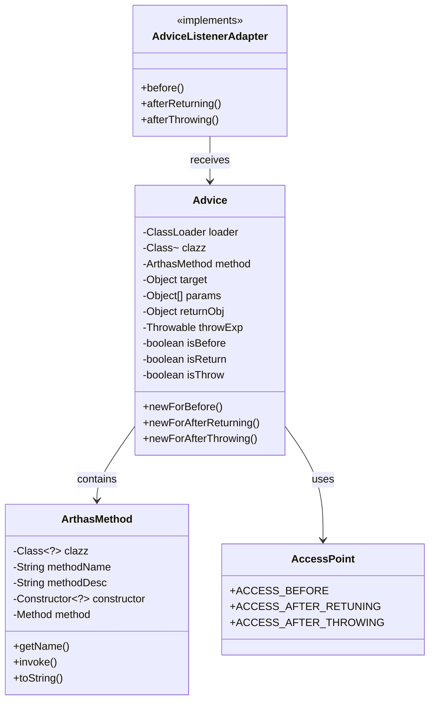

# Advice 上下文与回调接口 - 深度解析

> 基于 Arthas 4.1.2 源码分析
> 方法论：程序 = 数据结构 + 算法
> 标准环境：-Xms8g -Xmx8g -XX:+UseG1GC

---

## 第 0 部分：核心原理

### 0.1 本质是什么？

Advice 是 Arthas 封装方法调用上下文的**不可变对象**。它将方法调用的所有信息（类、方法、参数、返回值、异常等）封装成一个对象，传递给监听器的回调方法。

### 0.2 为什么需要 Advice？

**问题**：监听器回调时需要知道方法调用的完整信息：
- 方法参数值
- 返回值
- 抛出的异常
- 执行耗时

**解决方案**：创建 Advice 对象封装这些信息，监听器通过 Advice 获取所需数据。

### 0.3 怎么解决？

核心思路：**不可变对象 + 工厂方法**。

1. Advice 的所有字段都是 `final`，构造后不可修改
2. 通过 `newForBefore/newForAfterReturning/newForAfterThrowing` 三个工厂方法创建不同阶段的 Advice
3. 监听器通过 getter 方法获取所需数据

### 0.4 为什么这样设计？

- **为什么设计为不可变对象？** Advice 在多线程环境中被创建和传递——同一个方法可能被多个线程同时调用，每次调用各自创建独立的 Advice 对象。不可变对象天然线程安全，无需同步。
- **为什么每次回调都 new 而不复用？** 因为 tt 命令需要持久持有 Advice 引用（存入 TimeFragment 列表），如果复用则会被后续调用覆盖数据。不可变 + 每次新建虽然增加 GC 压力，但保证了数据正确性。

---

## 第 1 部分：数据结构全景

### 1.1 数据结构清单

| 结构名 | 源码位置 | 核心作用 |
|--------|----------|----------|
| **Advice** | `advisor/Advice.java` | 方法调用上下文封装 |
| **ArthasMethod** | `advisor/ArthasMethod.java` | 方法信息封装 |
| **AccessPoint** | `advisor/AccessPoint.java` | 拦截点标记 |
| **AdviceListenerAdapter** | `advisor/AdviceListenerAdapter.java` | 监听器适配器 |

---

### 1.2 Advice 详细分析

#### 问题推导

**问题**：Spy 回调监听器时，监听器需要哪些信息才能完成诊断任务？

**需要什么信息？**
- watch 需要观察**参数、返回值、异常** → 需要 `params`、`returnObj`、`throwExp`
- OGNL 表达式需要访问 **this 对象** → 需要 `target`
- 定位**是哪个类的哪个方法** → 需要 `clazz`、`method`
- ClassLoader 隔离场景下需要用**正确的 ClassLoader 加载类** → 需要 `loader`
- 判断当前处于**哪个阶段**（before/afterReturning/afterThrowing）→ 需要阶段标志位

**推导出的结构**：一个不可变的上下文对象，包含方法调用的完整信息 + 阶段标志，通过工厂方法创建。

#### 1.2.1 全部字段

```java
// Advice.java:6-17
public class Advice {
    
    // ========== 核心字段 ==========
    private final ClassLoader loader;       // 类加载器
    private final Class<?> clazz;          // 目标类
    private final ArthasMethod method;     // 方法信息
    private final Object target;           // 目标对象（静态方法为 null）
    private final Object[] params;         // 方法参数（可能为 null）
    private final Object returnObj;        // 返回值（仅 afterReturning 有效）
    private final Throwable throwExp;      // 异常（仅 afterThrowing 有效）
    
    // ========== 状态标记 ==========
    private final boolean isBefore;        // 是否在方法执行前
    private final boolean isThrow;         // 是否抛出异常
    private final boolean isReturn;         // 是否正常返回
}
```

#### 1.2.2 字段含义详解

| 字段 | 类型 | 含义 | 有效阶段 | 核心 |
|------|------|------|----------|------|
| `loader` | ClassLoader | 加载目标类的类加载器 | 所有阶段 | |
| `clazz` | Class<?> | 目标类 | 所有阶段 | ★ |
| `method` | ArthasMethod | 方法信息（名+描述符） | 所有阶段 | ★ |
| `target` | Object | 方法调用者（this），静态方法为 null | 所有阶段 | ★ |
| `params` | Object[] | 方法参数数组，无参数时可能为 null | before/afterReturning/afterThrowing | ★ |
| `returnObj` | Object | 方法返回值，void 方法为 null | afterReturning | ★ |
| `throwExp` | Throwable | 抛出的异常 | afterThrowing | ★ |
| `isBefore` | boolean | 是否在方法执行前触发 | 所有阶段 | |
| `isReturn` | boolean | 是否正常返回后触发 | afterReturning | |
| `isThrow` | boolean | 是否抛出异常后触发 | afterThrowing | |

#### 1.2.3 创建方式（工厂方法）

```java
// Advice.java:92-144

// ★ 创建 before 阶段的 Advice
public static Advice newForBefore(ClassLoader loader, Class<?> clazz, ArthasMethod method,
                                   Object target, Object[] params) {
    return new Advice(
        loader, clazz, method, target, params,
        null,  // returnObj = null
        null,  // throwExp = null
        AccessPoint.ACCESS_BEFORE.getValue()  // isBefore = true
    );
}

// ★ 创建 afterReturning 阶段的 Advice
public static Advice newForAfterReturning(ClassLoader loader, Class<?> clazz, ArthasMethod method,
                                           Object target, Object[] params, Object returnObj) {
    return new Advice(
        loader, clazz, method, target, params,
        returnObj,  // 有返回值
        null,       // throwExp = null
        AccessPoint.ACCESS_AFTER_RETUNING.getValue()  // isReturn = true
    );
}

// ★ 创建 afterThrowing 阶段的 Advice
public static Advice newForAfterThrowing(ClassLoader loader, Class<?> clazz, ArthasMethod method,
                                          Object target, Object[] params, Throwable throwExp) {
    return new Advice(
        loader, clazz, method, target, params,
        null,       // returnObj = null
        throwExp,   // 有异常
        AccessPoint.ACCESS_AFTER_THROWING.getValue()  // isThrow = true
    );
}
```

#### 1.2.4 状态判断方法

```java
// Advice.java:19-29
public boolean isBefore() { return isBefore; }
public boolean isAfterReturning() { return isReturn; }
public boolean isAfterThrowing() { return isThrow; }
```

#### 1.2.5 sizeof 与内存布局

> 基于 64 位 JVM，CompressedOops ON（-Xmx8g < 32GB 阈值）
> 详见 `31-Object-Memory-Layout-Analysis.md`

```
Advice 对象内存布局（CompressedOops ON）
┌──────────────────────────────────────┐ 偏移 0
│ mark word              (8 bytes)     │
├──────────────────────────────────────┤ 偏移 8
│ compressed klass ptr   (4 bytes)     │
├──────────────────────────────────────┤ 偏移 12
│ loader                 (4 bytes)     │  ★ 引用填入 12 偏移间隙
├──────────────────────────────────────┤ 偏移 16
│ clazz                  (4 bytes)     │
├──────────────────────────────────────┤ 偏移 20
│ method                 (4 bytes)     │
├──────────────────────────────────────┤ 偏移 24
│ target                 (4 bytes)     │
├──────────────────────────────────────┤ 偏移 28
│ params                 (4 bytes)     │
├──────────────────────────────────────┤ 偏移 32
│ returnObj              (4 bytes)     │
├──────────────────────────────────────┤ 偏移 36
│ throwExp               (4 bytes)     │
├──────────────────────────────────────┤ 偏移 40
│ isBefore(1) + isThrow(1)            │
│ + isReturn(1) + padding(1)          │  4 bytes
├──────────────────────────────────────┤ 偏移 44
│ padding                (4 bytes)     │  ★ 对齐到 8 的倍数
└──────────────────────────────────────┘ 偏移 48

Advice shallow size = 48 bytes
```

| 部分 | 大小 |
|------|------|
| 对象头 | 12 bytes（mark 8 + compressed klass 4）|
| 7 个引用字段 | 7 × 4 = 28 bytes（CompressedOops） |
| 3 个 boolean | 3 bytes + 1 byte padding |
| 尾部对齐 | 4 bytes |
| **Advice shallow size** | **48 bytes** |

**关键理解**：Advice 是**不可变对象**，每次方法回调都通过工厂方法 new 一个新实例。watch/trace/tt 命令在高频方法上会频繁创建 Advice 对象（48 bytes/次）。

#### 1.2.6 访问方法

```java
// Advice.java:31-57
public ClassLoader getLoader() { return loader; }
public Class<?> getClazz() { return clazz; }
public ArthasMethod getMethod() { return method; }
public Object getTarget() { return target; }
public Object[] getParams() { return params; }
public Object getReturnObj() { return returnObj; }
public Throwable getThrowExp() { return throwExp; }
```

---

### 1.3 AccessPoint 详细分析

#### 问题推导

**问题**：Advice 的 `isBefore/isReturn/isThrow` 三个布尔值怎么在构造时设置？总共有 3 种组合——能不能用枚举优化？

**推导出的结构**：一个枚举类型，3 个值分别代表 3 个拦截点，每个枚举携带对应的标志位编码。

#### 1.3.1 定义

```java
// AccessPoint.java
public enum AccessPoint {
    ACCESS_BEFORE(1),       // 方法执行前
    ACCESS_AFTER_RETUNING(2),  // 方法正常返回后
    ACCESS_AFTER_THROWING(4);  // 方法抛出异常后
    
    private final int value;
    AccessPoint(int value) { this.value = value; }
    public int getValue() { return value; }
}
```

#### 1.3.2 设计原理

使用位运算组合标志位：
- ACCESS_BEFORE = 1 (0001)
- ACCESS_AFTER_RETUNING = 2 (0010)
- ACCESS_AFTER_THROWING = 4 (0100)

在 Advice 构造函数中通过按位与判断：
```java
isBefore = (access & ACCESS_BEFORE.getValue()) == ACCESS_BEFORE.getValue();
isReturn = (access & ACCESS_AFTER_RETUNING.getValue()) == ACCESS_AFTER_RETUNING.getValue();
isThrow = (access & ACCESS_AFTER_THROWING.getValue()) == ACCESS_AFTER_THROWING.getValue();
```

---

### 1.4 ArthasMethod 详细分析

#### 问题推导

**问题**：Advice 中的 `method` 字段为什么不直接用 `java.lang.reflect.Method`？

**需要什么信息？**
- 增强阶段只有**类名、方法名、描述符**（ASM 层面的信息）→ 必须能用这三样构造
- `java.lang.reflect.Method` 需要**反射解析**，成本高且并非每次都需要 → 应该懒加载
- tt 命令重放时才真正需要 `Method` 对象做反射调用 → 只在 `invoke()` 时才解析

**推导出的结构**：3 个 final 字段（clazz、methodName、methodDesc）用于标识，2 个懒加载字段（constructor、method）按需反射解析。

> **注意**：ArthasMethod 不是简单的 2 字段封装，它有 5 个字段，其中 2 个是懒加载的反射对象。

#### 1.4.1 全部字段

```java
// ArthasMethod.java:18-24
public class ArthasMethod {
    // ========== 核心字段（构造时赋值，final）==========
    private final Class<?> clazz;         // ★ 目标类
    private final String methodName;      // ★ 方法名
    private final String methodDesc;      // ★ 方法描述符（如 "(Ljava/lang/String;)V"）

    // ========== 懒加载字段（首次 invoke/toString 时初始化）==========
    private Constructor<?> constructor;   // 仅 <init> 方法时使用
    private Method method;                // 普通方法的反射对象
}
```

#### 1.4.2 字段含义

| 字段 | 类型 | final? | 含义 | 核心 |
|------|------|--------|------|------|
| `clazz` | Class<?> | ✅ | 目标类，用于反射解析方法 | ★ |
| `methodName` | String | ✅ | 方法名，`<init>` 表示构造方法 | ★ |
| `methodDesc` | String | ✅ | ASM 方法描述符，包含参数类型和返回类型 | ★ |
| `constructor` | Constructor<?> | ❌ | 懒加载——仅当 methodName 是 `<init>` 时通过反射解析 | |
| `method` | Method | ❌ | 懒加载——普通方法通过反射解析，tt 重放时使用 | |

#### 1.4.3 构造函数

```java
// ArthasMethod.java:162-166
public ArthasMethod(Class<?> clazz, String methodName, String methodDesc) {
    this.clazz = clazz;           // 目标类
    this.methodName = methodName;  // 方法名
    this.methodDesc = methodDesc;  // 方法描述符
    // constructor 和 method 此时为 null，懒加载
}
```

#### 1.4.4 懒加载机制：initMethod()

```java
// ArthasMethod.java:26-102
private void initMethod() {
    if (constructor != null || method != null) {
        return;  // ★ 已初始化，直接返回
    }
    // ★ 从 methodDesc 解析参数类型（ASM Type → Java Class）
    final Type asmType = Type.getMethodType(methodDesc);
    final Class<?>[] argsClasses = new Class<?>[asmType.getArgumentTypes().length];
    // ... 逐个参数类型转换（处理 8 种基本类型 + 数组 + 对象）

    if ("<init>".equals(this.methodName)) {
        this.constructor = clazz.getDeclaredConstructor(argsClasses);  // ★ 构造方法
    } else {
        this.method = clazz.getDeclaredMethod(methodName, argsClasses);  // ★ 普通方法
    }
}
```

**为什么懒加载？** watch/trace 等命令通常只需要 `methodName` 和 `methodDesc`（日志输出），不需要反射调用。只有 **tt 命令的重放功能**（`tt -p`）才需要 `invoke()`，此时才触发 `initMethod()` 解析反射对象。这避免了每次回调都做昂贵的反射解析。

#### 1.4.5 sizeof 与内存布局

```
ArthasMethod 对象内存布局（CompressedOops ON）
┌──────────────────────────────────────┐ 偏移 0
│ mark word              (8 bytes)     │
├──────────────────────────────────────┤ 偏移 8
│ compressed klass ptr   (4 bytes)     │
├──────────────────────────────────────┤ 偏移 12
│ clazz                  (4 bytes)     │  ★ final
├──────────────────────────────────────┤ 偏移 16
│ methodName             (4 bytes)     │  ★ final
├──────────────────────────────────────┤ 偏移 20
│ methodDesc             (4 bytes)     │  ★ final
├──────────────────────────────────────┤ 偏移 24
│ constructor            (4 bytes)     │  懒加载，初始 null
├──────────────────────────────────────┤ 偏移 28
│ method                 (4 bytes)     │  懒加载，初始 null
└──────────────────────────────────────┘ 偏移 32

ArthasMethod shallow size = 32 bytes
```

| 部分 | 大小 |
|------|------|
| 对象头 | 12 bytes（mark 8 + compressed klass 4）|
| 5 个引用字段 | 5 × 4 = 20 bytes（CompressedOops）|
| **ArthasMethod shallow size** | **32 bytes**（12 + 20 = 32，已对齐到 8 倍数）|

#### 1.4.6 关键方法

```java
// ArthasMethod.java:117-119
public String getName() { return this.methodName; }  // 不触发 initMethod

// ArthasMethod.java:122-130  — toString 会触发懒加载
public String toString() {
    initMethod();  // ★ 触发反射解析
    if (constructor != null) return constructor.toString();
    else if (method != null) return method.toString();
    return "ERROR_METHOD";
}

// ArthasMethod.java:151-160  — tt 重放时调用
public Object invoke(Object target, Object... args) {
    initMethod();  // ★ 触发反射解析
    if (method != null) return method.invoke(target, args);
    else if (constructor != null) return constructor.newInstance(args);
    return null;
}
```

---

### 1.5 数据结构关系图



---

## 第 2 部分：监听器回调流程

### 2.1 AdviceListener 回调时机

```
┌─────────────────────────────────────────────────────────────┐
│                      方法执行流程                             │
├─────────────────────────────────────────────────────────────┤
│                                                             │
│  1. before 回调                                             │
│     └─ Advice.newForBefore(...)                            │
│        └─ listener.before(advice)                           │
│                                                             │
│  2. 执行业务逻辑                                            │
│     └─ [业务代码]                                           │
│                                                             │
│  ┌───────────────────────────────────────────────────────┐  │
│  │ 3a. 正常返回                                         │  │
│  │    └─ Advice.newForAfterReturning(...)               │  │
│  │       └─ listener.afterReturning(advice)             │  │
│  │                                                       │  │
│  │ 3b. 抛出异常                                         │  │
│  │    └─ Advice.newForAfterThrowing(...)               │  │
│  │       └─ listener.afterThrowing(advice)              │  │
│  └───────────────────────────────────────────────────────┘  │
│                                                             │
└─────────────────────────────────────────────────────────────┘

注意：afterReturning 和 afterThrowing 互斥，只会调用一个
```

### 2.2 Advice 状态判断

```java
// 在监听器中判断当前阶段
public void onBefore(Advice advice) {
    if (advice.isBefore()) {
        // 在方法执行前
    }
    if (advice.isAfterReturning()) {
        // 方法正常返回后
    }
    if (advice.isAfterThrowing()) {
        // 方法抛出异常后
    }
}
```

---

## 第 3 部分：总结

### 3.1 数据结构层面

| 结构 | 核心特征 |
|------|----------|
| **Advice** | 不可变对象，48 bytes，封装方法调用上下文，每次回调新建 |
| **ArthasMethod** | 5 字段（3 final + 2 懒加载），32 bytes，tt 重放时触发反射解析 |
| **AccessPoint** | 枚举，位运算组合标志位 |

### 3.2 算法层面

| 算法 | 设计决策 |
|------|----------|
| **状态判断** | 位运算，高效且节省内存 |
| **工厂方法** | newForBefore/newForAfterReturning/newForAfterThrowing |
| **不可变性** | final 字段，创建后不可修改 |

### 3.3 核心要点

1. **Advice 是不可变对象** - 所有字段 final，确保线程安全
2. **三个工厂方法** - 分别对应 before/afterReturning/afterThrowing
3. **状态位运算** - 高效判断当前阶段
4. **参数可能为 null** - 空参数时 params 可能为 null

---

## 附录：相关文档

| 文档 | 内容 |
|------|------|
| `Arthas-new/02-Enhancer-Deep-Dive.md` | Enhancer 字节码增强 |
| `Arthas-new/03-Spy-Interceptor-Deep-Dive.md` | Spy 拦截器机制 |
