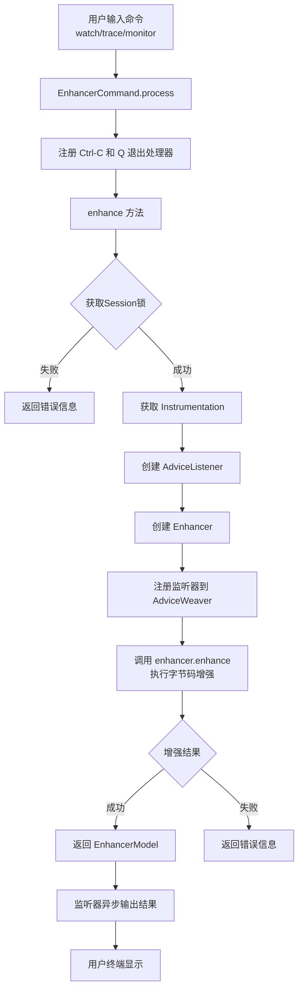
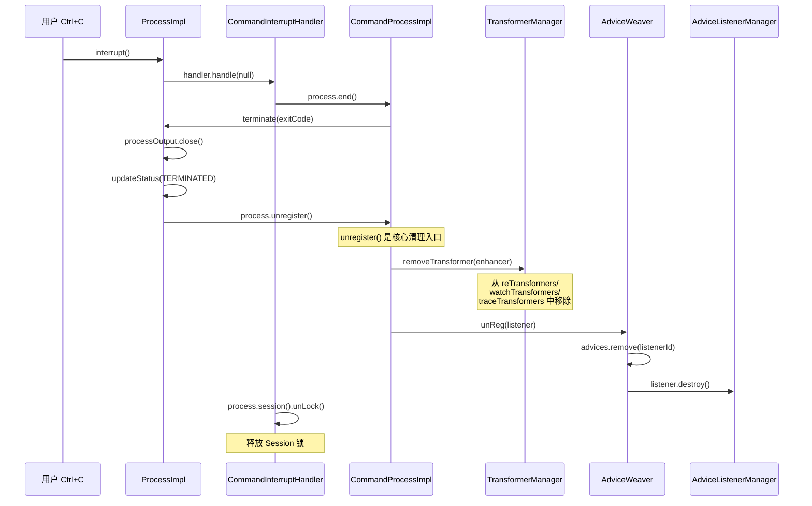

# EnhancerCommand 深度解析

> 基于 Arthas 4.1.2 源码分析
> 方法论：程序 = 数据结构 + 算法

---

## 第 0 部分：核心原理

### 0.1 本质是什么？

EnhancerCommand 是 Arthas 中所有**字节码增强命令**（watch/trace/monitor/stack/tt）的公共基类，封装了从获取 Instrumentation、创建 Enhancer、注册监听器到处理结果的通用流程。

### 0.2 为什么需要？

watch/trace/monitor/stack/tt 五个命令都需要字节码增强能力，核心逻辑高度相似：获取 Session 锁 → 获取 Instrumentation → 创建 AdviceListener → 创建 Enhancer → 执行增强 → 处理结果。如果每个命令都重复实现，代码冗余严重且维护困难。

### 0.3 怎么解决？

核心思路：**模板方法模式**。将通用流程固定在基类，子类只需实现 4 个抽象方法：
1. `getClassNameMatcher()` — 匹配哪些类
2. `getClassNameExcludeMatcher()` — 排除哪些类
3. `getMethodNameMatcher()` — 匹配哪些方法
4. `getAdviceListener()` — 提供 AOP 监听器

### 0.4 为什么这样设计？

- **为什么用模板方法而不是组合？** 五个增强命令的流程几乎完全相同，只有匹配规则和回调逻辑不同。模板方法直接继承比组合更简洁，且子类代码量极少（通常只有 50-100 行）。
- **为什么需要 Session 锁？** 防止同一 Session 中多个增强命令并发执行，避免字节码增强冲突。
- **为什么有 `maxNumOfMatchedClass` 限制（默认 50）？** 防止用户输入过于宽泛的匹配模式（如 `*`），导致增强几百个类拖慢 JVM。

---

## 第 1 部分：宏观理解

### 1.1 解决什么问题

EnhancerCommand 是 Arthas 中所有**字节码增强命令**的公共基类。watch、trace、monitor、stack、tt（TimeTunnel）等命令都通过继承它来实现方法拦截和增强。

**核心问题**：每个增强命令都有相似的逻辑——获取 Instrumentation、创建 Enhancer、注册监听器、处理结果。如果每个命令都重复实现这些逻辑，将导致代码冗余和维护困难。

**解决方案**：将公共逻辑抽象到 EnhancerCommand 基类中，子类只需实现 4 个抽象方法即可：
1. `getClassNameMatcher()` - 类名匹配器
2. `getClassNameExcludeMatcher()` - 排除类名匹配器
3. `getMethodNameMatcher()` - 方法名匹配器
4. `getAdviceListener()` - Advice 监听器

### 1.2 总体调用链（Mermaid 图）



### 1.3 涉及的数据结构清单

| 结构名 | 源码位置 | 核心作用 |
|--------|----------|----------|
| **EnhancerCommand** | monitor200/EnhancerCommand.java:34 | 增强命令公共基类 |
| **AnnotatedCommand** | shell/command/AnnotatedCommand.java:14 | 命令基类，定义 process 入口 |
| **AdviceListener** | advisor/AdviceListener.java | 监听器接口，定义 before/afterReturning/afterThrowing 回调 |
| **AdviceListenerAdapter** | advisor/AdviceListenerAdapter.java:18 | 监听器适配器，提供默认实现 |
| **Enhancer** | advisor/Enhancer.java | 字节码增强器，执行实际增强逻辑 |
| **AdviceWeaver** | advisor/AdviceWeaver.java:17 | 监听器注册表，管理所有 AdviceListener |
| **EnhancerAffect** | util/affect/EnhancerAffect.java | 增强结果统计 |
| **EnhancerModel** | command/model/EnhancerModel.java:10 | 命令返回模型 |
| **Session** | shell/session/Session.java:16 | 会话管理，提供锁机制 |
| **Instrumentation** | java.lang.instrument.Instrumentation | JVM 工具接口，用于类增强 |
| **Matcher** | util/matcher/Matcher.java | 匹配器接口，用于类名/方法名匹配 |

---

## 第 2 部分：数据结构全景 ⭐

### 2.1 EnhancerCommand（完整 6 项分析）

#### 问题推导

**问题**：watch、trace、monitor、stack 等命令都需要"匹配类→匹配方法→注册字节码增强"——这些共同逻辑怎么抽象？

**需要什么信息？**
- 所有增强命令都需要 **classPattern + methodPattern** → 抽取到父类
- 都需要 **listenerId** 用于注册/注销监听器 → 抽取到父类
- 都需要限制**最大匹配类数** → `maxNumOfMatchedClass` 防止误操作增强过多类
- 都需要 **enhance() 方法**把参数组装传给 Enhancer → 模板方法模式

**推导出的结构**：一个 abstract 类持有匹配器、listenerId、maxNumOfMatchedClass，提供 enhance() 模板方法。

#### 2.1.1 字段列表

```java
// EnhancerCommand.java:34-50
public abstract class EnhancerCommand extends AnnotatedCommand {
    
    // 日志记录器
    private static final Logger logger = LoggerFactory.getLogger(EnhancerCommand.class);
    
    // 空列表常量，用于无匹配时返回
    protected static final List<String> EMPTY = Collections.emptyList();
    
    // 表达式示例数组
    public static final String[] EXPRESS_EXAMPLES = { 
        "params", "returnObj", "throwExp", "target", "clazz", "method",
        "{params,returnObj}", "params[0]" 
    };
    
    // 排除类名模式（用户通过 --exclude-class-pattern 指定）
    private String excludeClassPattern;
    
    // 类名匹配器（子类实现）
    protected Matcher classNameMatcher;
    protected Matcher classNameExcludeMatcher;
    protected Matcher methodNameMatcher;
    
    // 监听器 ID（用于恢复/暂停监听）
    protected long listenerId;
    
    // 是否输出详细信息
    protected boolean verbose;
    
    // 最大匹配类数量（默认 50）
    protected int maxNumOfMatchedClass;
}
```

#### 2.1.2 每个字段的含义

| 字段 | 类型 | 含义 | 使用场景 | 核心 |
|------|------|------|----------|------|
| `logger` | Logger | SLF4J 日志记录器 | 记录错误日志 | |
| `EMPTY` | List<String> | 空列表常量 | 无匹配类时返回 | |
| `EXPRESS_EXAMPLES` | String[] | OGNL 表达式示例 | 命令补全提示 | |
| `excludeClassPattern` | String | 排除的类名模式 | `--exclude-class-pattern` 参数 | |
| `classNameMatcher` | Matcher | 类名匹配器 | 匹配需要增强的类 | ★ |
| `classNameExcludeMatcher` | Matcher | 排除类名匹配器 | 排除不需要增强的类 | |
| `methodNameMatcher` | Matcher | 方法名匹配器 | 匹配需要增强的方法 | ★ |
| `listenerId` | long | 监听器唯一 ID | 恢复/暂停监听 | ★ |
| `verbose` | boolean | 详细信息开关 | `-v` 参数控制 | |
| `maxNumOfMatchedClass` | int | 最大匹配类数 | `-m` 参数控制，默认 50 | ★ |

#### 2.1.3 sizeof 与内存布局

EnhancerCommand 是一个 abstract 类，不直接实例化。子类实例的内存布局：

```
+--------------------------------------------------+
| Object Header (12 bytes)                         |
|   - Mark Word: 8 bytes                           |
|   - Klass Pointer: 4 bytes                       |
+--------------------------------------------------+
| EnhancerCommand Fields (约 40 bytes)            |
|   - logger: reference (4 bytes)                  |
|   - EMPTY: reference (4 bytes)                   |
|   - EXPRESS_EXAMPLES: reference (4 bytes)        |
|   - excludeClassPattern: reference (4 bytes)     |
|   - classNameMatcher: reference (4 bytes)        |
|   - classNameExcludeMatcher: reference (4 bytes)|
|   - methodNameMatcher: reference (4 bytes)      |
|   - listenerId: long (8 bytes)                  |
|   - verbose: boolean (1 byte) + padding (3)     |
|   - maxNumOfMatchedClass: int (4 bytes)         |
+--------------------------------------------------+
| Subclass Fields (根据子类不同而不同)             |
|   - 例如 WatchCommand: classPattern, method...  |
+--------------------------------------------------+
| Total: 约 52 bytes + 子类字段                     |
+--------------------------------------------------+
```

#### 2.1.4 创建位置

**EnhancerCommand 本身是抽象类，不直接创建**。子类实例由 Arthas 命令解析器在用户输入命令时创建：

```java
// Arthas 命令解析流程
// 1. 用户输入: watch demo.MathGame run
// 2. CommandResolver 解析参数
// 3. 反射创建 WatchCommand 实例
// 4. 设置 @Argument 和 @Option 标注的字段
// 5. 调用 command.process(process) 开始执行
```

#### 2.1.5 关键字段的生命周期

| 字段 | 设置时机 | 设置方式 | 读取时机 | 读取位置 |
|------|----------|----------|----------|----------|
| `listenerId` | 命令行参数解析 | `setListenerId(long)` | enhance() 中 | EnhancerCommand.java:157 |
| `classNameMatcher` | 首次调用 getClassNameMatcher() | 延迟创建 (Lazy Init) | enhance() 中 | EnhancerCommand.java:170 |
| `maxNumOfMatchedClass` | 命令行参数解析 | `setMaxNumOfMatchedClass(int)` | enhance() 中 | EnhancerCommand.java:173 |
| `verbose` | 命令行参数解析 | `setVerbosee(boolean)` | enhance() 中 | WatchAdviceListener 构造 |

#### 2.1.6 值域图

`maxNumOfMatchedClass` 的值域：

```
┌─────────────────────────────────────────────────────────┐
│              maxNumOfMatchedClass 值域                   │
├─────────────────────────────────────────────────────────┤
│                                                         │
│   [1] ──────► [50] ──────► [Integer.MAX_VALUE]          │
│    ↑            ↑                ↑                      │
│    │            │                │                      │
│ 最小值       默认值            无限制                    │
│                                                         │
│ 边界情况:                                               │
│  - <= 0: 被 @DefaultValue("50") 覆盖                   │
│  - 过大值: 可能导致内存问题，Enhancer 有防护             │
│                                                         │
└─────────────────────────────────────────────────────────┘
```

---

### 2.2 AnnotatedCommand 详细分析

#### 问题推导

**问题**：Arthas 有几十个命令，命令行参数解析、补全提示等逻辑怎么统一？

**推导出的结构**：所有命令的最顶层基类，通过注解（@Argument、@Option）声明参数，框架自动解析注入。

#### 2.2.1 核心接口

#### 2.2.1 字段列表

```java
// AnnotatedCommand.java:14-47
public abstract class AnnotatedCommand {
    
    /**
     * @return 命令名称（子类可覆盖）
     */
    public String name() {
        return null;
    }
    
    /**
     * @return 命令行接口（通常为 null）
     */
    public CLI cli() {
        return null;
    }
    
    /**
     * 处理命令逻辑（子类必须实现）
     */
    public abstract void process(CommandProcess process);
    
    /**
     * 命令补全逻辑（可选覆盖）
     */
    public void complete(Completion completion) {
        CompletionUtils.complete(completion, this.getClass());
    }
}
```

#### 2.2.2 sizeof 与内存布局

AnnotatedCommand 是**空实现的抽象基类**，没有实例字段：

```
+--------------------------------------------------+
| Object Header (12 bytes)                         |
+--------------------------------------------------+
| 无实例字段                                        │
+--------------------------------------------------+
| Total: 12 bytes (仅对象头)                        │
+--------------------------------------------------+
```

#### 2.2.3 创建位置

AnnotatedCommand 由 Arthas CLI 框架在启动时扫描 classpath，发现带有 `@Name` 注解的类后反射创建实例。

#### 2.2.4 关键字段的生命周期

AnnotatedCommand 本身没有状态字段，其生命周期完全由子类控制。

---

### 2.3 AdviceWeaver 详细分析

#### 问题推导

**问题**：增强后的方法通过 SpyAPI 回调时，怎么根据 listenerId 找到对应的 AdviceListener？

**需要什么信息？**
- 每个监听器有唯一的 `id` → 需要一个 `id → listener` 的注册表
- 多个命令并发注册/注销 → 需要线程安全容器
- 全局只需要一份 → 静态字段

**推导出的结构**：一个工具类，持有 `static ConcurrentHashMap<Long, AdviceListener>`，提供 reg/unReg/getById 方法。

#### 2.3.1 字段列表

```java
// AdviceWeaver.java:17-23
public class AdviceWeaver {
    
    private static final Logger logger = LoggerFactory.getLogger(AdviceWeaver.class);
    
    // 监听器注册表：listenerId -> AdviceListener
    private final static Map<Long, AdviceListener> advices 
            = new ConcurrentHashMap<Long, AdviceListener>();
}
```

#### 2.3.2 每个字段的含义

| 字段 | 类型 | 含义 | 使用场景 | 核心 |
|------|------|------|----------|------|
| `logger` | Logger | 日志记录器 | 记录异常 | |
| `advices` | ConcurrentHashMap | 监听器注册表 | 存储所有活跃的 AdviceListener | ★ |

#### 2.3.3 sizeof

```java
// ConcurrentHashMap 初始容量 16，负载因子 0.75
// 空表约占用 96 bytes（包含 table 数组头）
// 随着监听器增加，内存会动态扩展
```

#### 2.3.4 创建位置

AdviceWeaver 是**工具类**，在 Arthas 启动时加载，advices Map 在类加载时初始化：

```java
// AdviceWeaver.java:22
private final static Map<Long, AdviceListener> advices 
        = new ConcurrentHashMap<Long, AdviceListener>();
//                              ↑ 类加载时创建（线程安全）
```

#### 2.3.5 关键字段的生命周期

| 字段 | 设置时机 | 设置方式 | 读取时机 |
|------|----------|----------|----------|
| `advices` | 类加载时 | `new ConcurrentHashMap<>()` | 任何需要查找监听器时 |
| `advices[key]` | `reg(listener)` | `put(listener.id(), listener)` | getAdviceListenerWithId() |
| `advices[key]` | `unReg(listener)` | `remove(listener.id())` | 监听器注销时 |

---

### 2.4 AdviceListenerAdapter 详细分析

#### 问题推导

**问题**：AdviceListener 接口有很多方法（before/afterReturning/afterThrowing/create/destroy...），每个命令都要全部实现太繁琐——怎么简化？

**需要什么信息？**
- 大部分命令只关心 before + afterReturning/afterThrowing → 需要默认空实现的适配器
- 每个监听器需要自动生成**唯一 ID** → 静态 AtomicLong 计数器
- 需要关联到**命令进程**（用于输出结果）→ Process 引用

**推导出的结构**：实现 AdviceListener 的抽象类，自动生成 id，持有 process 引用，空实现大部分方法。

#### 2.4.1 字段列表

```java
// AdviceListenerAdapter.java:18-23
public abstract class AdviceListenerAdapter implements AdviceListener, ProcessAware {
    
    // ID 生成器：原子自增
    private static final AtomicLong ID_GENERATOR = new AtomicLong(0);
    
    // 当前监听器关联的 Process
    private Process process;
    
    // 当前监听器的唯一 ID
    private long id = ID_GENERATOR.addAndGet(1);
    
    // 是否输出详细信息
    private boolean verbose;
}
```

#### 2.4.2 每个字段的含义

| 字段 | 类型 | 含义 | 使用场景 | 核心 |
|------|------|------|----------|------|
| `ID_GENERATOR` | AtomicLong | 原子 ID 生成器 | 确保每个监听器有唯一 ID | |
| `process` | Process | 关联的进程对象 | 用于输出结果、终止进程 | ★ |
| `id` | long | 监听器唯一 ID | 注册到 AdviceWeaver 时使用 | ★ |
| `verbose` | boolean | 详细信息开关 | 控制调试输出 | |

#### 2.4.3 sizeof

```
+--------------------------------------------------+
| Object Header (12 bytes)                         |
+--------------------------------------------------+
| ID_GENERATOR: static (不占实例空间)              |
+--------------------------------------------------+
| Instance Fields (约 24 bytes)                   |
|   - process: reference (4 bytes)                 |
|   - id: long (8 bytes)                           |
|   - verbose: boolean (1 byte) + padding (3)     |
+--------------------------------------------------+
| Total: 约 36 bytes                                |
+--------------------------------------------------+
```

#### 2.4.4 创建位置

AdviceListenerAdapter 在**子类构造时**创建：

```java
// WatchAdviceListener 构造（示例）
public WatchAdviceListener(WatchCommand command, CommandProcess process, boolean verbose) {
    // AdviceListenerAdapter 父类字段在此初始化
    // id = ID_GENERATOR.addAndGet(1);  ← 原子操作获取唯一 ID
    this.process = process;
    this.verbose = verbose;
}
```

#### 2.4.5 关键字段的生命周期

| 字段 | 设置时机 | 设置方式 | 设置值 | 读取时机 |
|------|----------|----------|--------|----------|
| `id` | 子类构造 | `ID_GENERATOR.addAndGet(1)` | 原子自增唯一值 | 注册到 AdviceWeaver |
| `process` | 子类构造 | 构造参数传入 | CommandProcess | 输出结果时 |
| `verbose` | 子类构造 | 构造参数传入 | boolean | 决定是否输出调试信息 |

---

### 2.5 Session 会话锁机制

#### 2.5.1 字段列表（Session 接口）

```java
// Session.java:79-99
public interface Session {
    
    // 检查会话是否被锁定
    boolean isLocked();
    
    // 解锁会话
    void unLock();
    
    // 尝试获取锁
    boolean tryLock();
    
    // 获取当前锁的序列号
    int getLock();
}
```

#### 2.5.2 锁机制的工作原理

```java
// EnhancerCommand.java:145-152
protected void enhance(CommandProcess process) {
    Session session = process.session();
    if (!session.tryLock()) {  // ← 尝试获取锁
        String msg = "someone else is enhancing classes, pls. wait.";
        process.appendResult(new EnhancerModel(null, false, msg));
        process.end(-1, msg);
        return;
    }
    // ... 增强逻辑 ...
}
```

**锁序列号的作用**：检测 enhance 过程中锁是否被外部修改：

```java
// EnhancerCommand.java:209-214
// 这里做个补偿,如果在enhance期间,unLock被调用了,则补偿性放弃
if (session.getLock() == lock) {  // ← 比较锁序列号
    if (process.isForeground()) {
        process.echoTips(Constants.Q_OR_CTRL_C_ABORT_MSG + "\n");
    }
}
```

---

## 第 3 部分：算法/流程分析（引用第二节的数据结构）

### 3.1 EnhancerCommand.process() 入口流程

#### 3.1.1 解决什么问题？

提供命令处理的统一入口，封装了 Ctrl-C 中断和 Q 退出处理逻辑，让子类专注于核心增强逻辑。

#### 3.1.2 函数签名与位置

```java
// EnhancerCommand.java:112-121
@Override
public void process(final CommandProcess process) {
    // ctrl-C support
    process.interruptHandler(new CommandInterruptHandler(process));
    // q exit support
    process.stdinHandler(new QExitHandler(process));

    // start to enhance
    enhance(process);
}
```

#### 3.1.3 真实源码 + 逐行注释

```java
// EnhancerCommand.java:112
@Override
public void process(final CommandProcess process) {
    // ★ 注册 Ctrl-C 中断处理器
    // 当用户按 Ctrl-C 时，CommandInterruptHandler 会调用 process.end() 终止命令
    process.interruptHandler(new CommandInterruptHandler(process));
    
    // ★ 注册 Q 退出处理器  
    // 当用户输入 q 时，QExitHandler 会调用 process.end() 终止命令
    process.stdinHandler(new QExitHandler(process));

    // ★ 开始执行增强逻辑
    // 这是一个模板方法模式：process() 是模板，子类实现 enhance()
    enhance(process);
}
```

#### 3.1.4 设计决策

**为什么需要两层退出处理器？**
- Ctrl-C 是 Unix 信号，进程可能任何时候收到
- Q 退出是用户输入，需要在标准输入流中监听
- 两者都需要优雅地终止正在执行的增强操作

---

### 3.2 EnhancerCommand.enhance() 核心流程

#### 3.2.1 解决什么问题？

执行完整的字节码增强流程，包括：获取会话锁 → 创建监听器 → 创建 Enhancer → 执行增强 → 返回结果。

这是 EnhancerCommand 的**核心算法**，约 100 行代码。

#### 3.2.2 整体流程（8 个阶段）

```
Phase 1: 获取会话锁（防止并发增强）
Phase 2: 获取 Instrumentation 实例
Phase 3: 创建 AdviceListener 监听器
Phase 4: 创建 Enhancer 并配置参数
Phase 5: 注册监听器到 AdviceWeaver
Phase 6: 执行字节码增强
Phase 7: 检查增强结果
Phase 8: 返回结果并释放锁
```

#### 3.2.3 函数签名与位置

```java
// EnhancerCommand.java:145-230
protected void enhance(CommandProcess process) {
```

#### 3.2.4 Phase 1-2: 获取会话锁和 Instrumentation

```java
// EnhancerCommand.java:145-156
protected void enhance(CommandProcess process) {
    // ★ Phase 1: 获取会话锁
    // Session.tryLock() 使用 CAS 或 synchronized 确保同一时刻只有一个增强命令执行
    // 如果获取失败，说明其他命令正在执行增强，直接返回错误
    Session session = process.session();
    if (!session.tryLock()) {
        String msg = "someone else is enhancing classes, pls. wait.";
        process.appendResult(new EnhancerModel(null, false, msg));
        process.end(-1, msg);
        return;
    }
    
    // 记录锁序列号，用于后续检测锁是否被外部释放
    EnhancerAffect effect = null;
    int lock = session.getLock();
    
    try {
        // ★ Phase 2: 获取 Instrumentation
        // Instrumentation 是 JVM 提供的工具接口，用于：
        // 1. 获取所有已加载的类 (getAllLoadedClasses)
        // 2. 重新转换类 (retransformClasses)
        // 3. 添加 Transformer (addTransformer)
        Instrumentation inst = session.getInstrumentation();
        
        // ★ Phase 3: 创建 AdviceListener
        // 如果 listenerId 不为 0，尝试从 AdviceWeaver 恢复已存在的监听器
        // 否则调用子类实现的 getAdviceListener() 创建新监听器
        AdviceListener listener = getAdviceListenerWithId(process);
        if (listener == null) {
            logger.error("advice listener is null");
            String msg = "advice listener is null, check arthas log";
            process.appendResult(new EnhancerModel(effect, false, msg));
            process.end(-1, msg);
            return;
        }
```

**设计决策**：
- **为什么需要会话锁？** 防止多个 watch/trace 命令同时执行增强，导致类被重复增强或状态混乱
- **为什么需要记录 lock 序列号？** detect 如果在 enhance 过程中用户按 Q 退出，锁会被释放，后续代码需要知道锁是否仍然有效

#### 3.2.5 Phase 4-6: 创建 Enhancer 并执行增强

```java
// EnhancerCommand.java:165-173
        // ★ Phase 4: 处理 JDK 类的跟踪选项
        // 如果监听器是 AbstractTraceAdviceListener，检查是否跳过 JDK 内部类
        boolean skipJDKTrace = false;
        if(listener instanceof AbstractTraceAdviceListener) {
            skipJDKTrace = ((AbstractTraceAdviceListener) listener).getCommand().isSkipJDKTrace();
        }

        // ★ 创建 Enhancer
        // 参数说明：
        // - listener: AdviceListener，用于接收方法调用通知
        // - InvokeTraceable: 是否支持方法调用链追踪
        // - skipJDKTrace: 是否跳过 JDK 类
        // - getClassNameMatcher(): 子类实现的类名匹配器
        // - getClassNameExcludeMatcher(): 子类实现的排除匹配器
        // - getMethodNameMatcher(): 子类实现的方法名匹配器
        Enhancer enhancer = new Enhancer(listener, listener instanceof InvokeTraceable, skipJDKTrace, 
                getClassNameMatcher(), getClassNameExcludeMatcher(), getMethodNameMatcher());
        
        // ★ Phase 5: 注册监听器到 AdviceWeaver
        // 这样 Spy 在方法增强后可以找到对应的监听器
        process.register(listener, enhancer);
        
        // ★ Phase 6: 执行字节码增强
        // 这是核心操作：
        // 1. 搜索匹配的类
        // 2. 对每个类进行字节码增强（插入 Spy 调用）
        // 3. 使用 Instrumentation.retransformClasses() 使增强生效
        // 4. 返回增强结果（影响了多少类多少方法）
        effect = enhancer.enhance(inst, this.maxNumOfMatchedClass);
```

**设计决策**：
- **为什么 listener 需要注册到 process？** process 是命令执行上下文，注册后可以在命令结束时自动清理监听器
- **为什么 enhancer.enhance() 需要 Instrumentation？** JVM 只允许通过 Instrumentation API 来修改已加载类的字节码

#### 3.2.6 Phase 7: 检查增强结果

```java
// EnhancerCommand.java:175-207
        // ★ Phase 7: 检查增强结果
        // 情况1: 增强过程中发生异常
        if (effect.getThrowable() != null) {
            String msg = "error happens when enhancing class: "+effect.getThrowable().getMessage();
            process.appendResult(new EnhancerModel(effect, false, msg));
            process.end(1, msg + ", check arthas log: " + LogUtil.loggingFile());
            return;
        }

        // 情况2: 没有影响到任何类或方法
        if (effect.cCnt() == 0 || effect.mCnt() == 0) {
            // 如果有超过限制的提示信息
            if (!StringUtils.isEmpty(effect.getOverLimitMsg())) {
                process.appendResult(new EnhancerModel(effect, false));
                process.end(-1);
                return;
            }
            
            // 方法体太大导致增强失败
            process.appendResult(new EnhancerModel(effect, false, "No class or method is affected"));

            // 构造详细的帮助信息
            String smCommand = Ansi.ansi().fg(Ansi.Color.GREEN).a("sm CLASS_NAME METHOD_NAME").reset().toString();
            String optionsCommand = Ansi.ansi().fg(Ansi.Color.GREEN).a("options unsafe true").reset().toString();
            String javaPackage = Ansi.ansi().fg(Ansi.Color.GREEN).a("java.*").reset().toString();
            String resetCommand = Ansi.ansi().fg(Ansi.Color.GREEN).a("reset CLASS_NAME").reset().toString();
            String logStr = Ansi.ansi().fg(Ansi.Color.GREEN).a(LogUtil.loggingFile()).reset().toString();
            String issueStr = Ansi.ansi().fg(Ansi.Color.GREEN).a("https://github.com/alibaba/arthas/issues/47").reset().toString();
            
            String msg = "No class or method is affected, try:\n"
                    + "1. Execute `" + smCommand + "` to make sure the method you are tracing actually exists (it might be in your parent class).\n"
                    + "2. Execute `" + optionsCommand + "`, if you want to enhance the classes under the `" + javaPackage + "` package.\n"
                    + "3. Execute `" + resetCommand + "` and try again, your method body might be too large.\n"
                    + "4. Match the constructor, use `<init>`, for example: `watch demo.MathGame <init>`\n"
                    + "5. Check arthas log: " + logStr + "\n"
                    + "6. Visit " + issueStr + " for more details.";
            process.end(-1, msg);
            return;
        }
```

**设计决策**：
- **为什么要提供详细的错误提示？** 用户可能不清楚为什么增强失败，详细的提示可以大幅减少用户困惑
- **为什么要区分 cCnt==0 和 mCnt==0？** 前者说明没有匹配到类，后者说明匹配到类但没有匹配到方法，处理方式不同

#### 3.2.7 Phase 8: 返回结果并释放锁

```java
// EnhancerCommand.java:209-230
        // ★ 检查锁是否仍然有效
        // 如果在增强过程中，用户按 Q 或 Ctrl-C 退出，锁会被释放
        // 这里做补偿：如果锁已被释放，则不再输出提示信息
        if (session.getLock() == lock) {
            if (process.isForeground()) {
                process.echoTips(Constants.Q_OR_CTRL_C_ABORT_MSG + "\n");
            }
        }

        // ★ 返回成功结果
        // EnhancerModel 包含：
        // - effect: 增强结果统计（影响了多少类、多少方法）
        // - success: true 表示增强成功
        process.appendResult(new EnhancerModel(effect, true));

        // 注意：这里没有调用 process.end()
        // 因为增强是异步的，结果会在 AdviceListener 的回调中持续输出
        // 直到达到限制次数（-n 参数）或用户退出
        
    } catch (Throwable e) {
        // 捕获所有异常
        String msg = "error happens when enhancing class: "+e.getMessage();
        logger.error(msg, e);
        process.appendResult(new EnhancerModel(effect, false, msg));
        process.end(-1, msg);
    } finally {
        // ★ 最终释放锁
        // 使用 finally 确保即使发生异常也会释放锁
        if (session.getLock() == lock) {
            process.session().unLock();
        }
    }
}
```

**设计决策**：
- **为什么不调用 process.end()？** 因为增强是"长时运行"的，结果会在方法调用时异步输出
- **为什么在 finally 中释放锁？** 确保异常情况下也能释放锁，防止死锁

---

### 3.3 getAdviceListenerWithId() 监听器获取

#### 3.3.1 解决什么问题？

支持监听器 ID 恢复机制，允许通过 `--listenerId` 参数恢复之前创建的监听器，而无需重新指定类名和方法名模式。

#### 3.3.2 函数签名与位置

```java
// EnhancerCommand.java:103-111
AdviceListener getAdviceListenerWithId(CommandProcess process) {
    // ★ 如果 listenerId 不为 0，说明用户想恢复之前的监听器
    if (listenerId != 0) {
        // 从 AdviceWeaver 注册表中查找
        AdviceListener listener = AdviceWeaver.listener(listenerId);
        if (listener != null) {
            return listener;  // 找到则返回
        }
        // 如果找不到（可能被清理了），fallback 到创建新监听器
    }
    // 创建新监听器（调用子类实现）
    return getAdviceListener(process);
}
```

#### 3.3.3 真实源码 + 逐行注释

```java
// EnhancerCommand.java:103
AdviceListener getAdviceListenerWithId(CommandProcess process) {
    // ★ 检查是否需要恢复已有监听器
    // listenerId 由命令行参数 --listenerId 传入
    if (listenerId != 0) {
        // ★ 从 AdviceWeaver 的 ConcurrentHashMap 中查找
        // 这是 O(1) 查找操作
        AdviceListener listener = AdviceWeaver.listener(listenerId);
        if (listener != null) {
            return listener;  // ★ 找到，直接返回
        }
        // ★ 找不到（可能被 reset 命令清理了）
        // 继续创建新监听器
    }
    // ★ 走到这里说明：
    // 1. listenerId 为 0（未指定）
    // 2. 或者 listenerId 不为 0 但找不到对应监听器
    // 调用子类实现的抽象方法创建新监听器
    return getAdviceListener(process);
}
```

#### 3.3.4 设计决策

**为什么需要监听器恢复机制？**
- 用户可能需要多次使用同一个增强配置
- 如果每次重新指定类名/都要方法名，很麻烦
- 通过 listenerId 可以快速恢复之前的增强配置

---

## 四、数据结构关系图（Mermaid）

```mermaid
classDiagram
    direction TB
    
    <<abstract>> AnnotatedCommand
    <<abstract>> EnhancerCommand
    <<interface>> AdviceListener
    <<interface>> Session
    <<interface>> Matcher
    
    AnnotatedCommand <|-- EnhancerCommand
    AdviceListener <|.. AdviceListenerAdapter
    AdviceListenerAdapter <|-- AbstractTraceAdviceListener
    
    EnhancerCommand --> Enhancer
    EnhancerCommand --> AdviceWeaver
    EnhancerCommand --> Session
    EnhancerCommand --> Instrumentation
    EnhancerCommand ..> AdviceListener : creates
    
    Enhancer --> EnhancerAffect
    AdviceWeaver --> AdviceListener : manages
    
    EnhancerCommand <|-- WatchCommand
    EnhancerCommand <|-- TraceCommand
    EnhancerCommand <|-- MonitorCommand
    EnhancerCommand <|-- StackCommand
    EnhancerCommand <|-- TimeTunnelCommand
    
    WatchCommand --> WatchAdviceListener
    
    class AnnotatedCommand {
        +process(CommandProcess)
        +complete(Completion)
    }
    
    class EnhancerCommand {
        +process(CommandProcess)
        +enhance(CommandProcess)
        +getAdviceListenerWithId(CommandProcess) AdviceListener
        #getClassNameMatcher() Matcher
        #getClassNameExcludeMatcher() Matcher
        #getMethodNameMatcher() Matcher
        #getAdviceListener(CommandProcess) AdviceListener
        -listenerId: long
        -verbose: boolean
        -maxNumOfMatchedClass: int
    }
    
    class AdviceListener {
        +before()
        +afterReturning()
        +afterThrowing()
        +create()
        +destroy()
        +id(): long
    }
    
    class AdviceWeaver {
        +reg(AdviceListener)
        +unReg(AdviceListener)
        +listener(long) AdviceListener
        -advices: ConcurrentHashMap
    }
```

---

## 补充：命令异常退出的清理保证 ⭐

> 当用户按 Ctrl+C 中断 watch/trace 命令，或命令异常退出时，字节码恢复和 Listener 清理怎么保证？

### 问题

watch/trace 等增强命令的生命周期是"长时运行"的——增强后命令不会立即结束，而是等待方法被调用时持续输出。在这期间：
1. 用户可能按 Ctrl+C 中断
2. 用户可能输入 `q` 退出
3. Arthas 整体可能被 `stop` 销毁
4. 命令达到 `-n` 参数指定的次数限制后自动结束

每种退出方式都必须保证：
- Transformer 从 TransformerManager 中移除（否则后续类加载会执行无效转换）
- Listener 从 AdviceListenerManager 中注销（否则方法调用仍会触发已失效的回调）
- Session 锁释放（否则其他增强命令无法执行）

### 完整的退出清理调用链



### 源码级分析

#### 1. Ctrl+C 处理入口

```java
// EnhancerCommand.java:112-121
public void process(final CommandProcess process) {
    // ★ 注册 Ctrl+C 处理器
    process.interruptHandler(new CommandInterruptHandler(process));
    // ★ 注册 Q 退出处理器
    process.stdinHandler(new QExitHandler(process));
    enhance(process);
}
```

#### 2. CommandInterruptHandler — Ctrl+C 处理

```java
// CommandInterruptHandler.java:9-22
public class CommandInterruptHandler implements Handler<Void> {
    private CommandProcess process;

    public CommandInterruptHandler(CommandProcess process) {
        this.process = process;
    }

    @Override
    public void handle(Void event) {
        process.end();              // ★ 触发进程终止
        process.session().unLock(); // ★ 释放 Session 锁
    }
}
```

#### 3. ProcessImpl.terminate() — 进程终止的核心

```java
// ProcessImpl.java:248-263
private synchronized boolean terminate(int exitCode, Handler<Void> completionHandler, String message) {
    if (processStatus != ExecStatus.TERMINATED) {
        this.appendResult(new StatusModel(exitCode, message));
        if (process != null) {
            processOutput.close();         // ★ 关闭输出流
        }
        updateStatus(ExecStatus.TERMINATED, exitCode, false, endHandler, terminatedHandler, completionHandler);
        if (process != null) {
            process.unregister();           // ★ 关键！触发 Transformer 和 Listener 清理
        }
        return true;
    }
    return false;  // 已经终止过了，防止重复清理
}
```

**防重复清理**：`if (processStatus != ExecStatus.TERMINATED)` 确保无论 Ctrl+C 被按多少次，清理只执行一次。

#### 4. CommandProcessImpl.unregister() — 核心清理逻辑

```java
// ProcessImpl.java:564-577（CommandProcessImpl 是 ProcessImpl 的内部类）
public void unregister() {
    if (transformer != null) {
        // ★ 从 TransformerManager 中移除 Enhancer
        ArthasBootstrap.getInstance().getTransformerManager().removeTransformer(transformer);
    }

    if (listener instanceof ProcessAware) {
        // ★ 安全检查：只注销属于当前进程的 Listener
        if (this.process.equals(((ProcessAware) listener).getProcess())) {
            AdviceWeaver.unReg(listener);
        }
    } else {
        AdviceWeaver.unReg(listener);
    }
}
```

**为什么需要 ProcessAware 检查？** 同一个 Listener 可能被多个命令共享（通过 `--listenerId` 恢复），只有当前进程"拥有"这个 Listener 时才能注销它。

#### 5. TransformerManager.removeTransformer() — 移除 Transformer

```java
// TransformerManager.java:85-88
public void removeTransformer(ClassFileTransformer transformer) {
    reTransformers.remove(transformer);     // 从三个链表中移除
    watchTransformers.remove(transformer);
    traceTransformers.remove(transformer);
    // ★ 注意：这里只是从内部列表移除
    // 全局的 classFileTransformer 仍然注册在 JVM 中
    // 但因为内部列表为空，transform() 方法不会做任何修改
}
```

#### 6. 兜底机制：AdviceListenerManager 的定时清理

```java
// AdviceListenerManager.java:57-99
static {
    // ★ 每 3 秒清理一次已终止进程的 Listener
    ArthasBootstrap.getInstance().getScheduledExecutorService()
        .scheduleWithFixedDelay(new Runnable() {
            @Override
            public void run() {
                // 遍历所有 ClassLoader → 方法 → Listener 列表
                // 移除 process 已 TERMINATED 的 Listener
            }
        }, 3, 3, TimeUnit.SECONDS);
}
```

**为什么需要兜底？** 如果 `unregister()` 因异常未能正确执行（极端情况），定时任务会在 3 秒内发现并清理已终止进程的 Listener，**防止 Listener 永久泄漏**。

### 四种退出方式的清理路径

| 退出方式 | 触发入口 | 清理路径 | 字节码恢复？ |
|---------|---------|---------|------------|
| **Ctrl+C** | `CommandInterruptHandler.handle()` | end → terminate → unregister | **否**，只移除 Transformer。字节码需用 `reset` 恢复 |
| **输入 q** | `QExitHandler.handle()` | end → terminate → unregister | **否**，同上 |
| **达到 -n 次数** | `SpyImpl.skipAdviceListener()` 中 `process.end()` | terminate → unregister | **否**，同上 |
| **Arthas stop** | `ArthasBootstrap.destroy()` | `TransformerManager.destroy()` + `Enhancer.reset(*, "*")` | **是**，全局 reset 恢复所有已增强的类 |

> **关键区分**：
> - Ctrl+C / q / -n 次数到达：**只移除 Transformer 和 Listener，不恢复字节码**。
>   已增强的字节码仍然包含 `SpyAPI.atEnter()` 调用，但因为 Listener 已注销，
>   SpyImpl 查询返回空列表 → 空操作 → 不影响业务。
> - `Arthas stop`：**完全恢复**。先 `destroy()` 清理所有 Transformer，
>   再 `Enhancer.reset(inst, "*")` 触发全局 retransform，JVM 恢复原始字节码。

---

## 第 5 部分：总结

### 5.1 数据结构层面

| 结构 | 核心特征 |
|------|----------|
| **EnhancerCommand** | 抽象基类，定义 4 个抽象方法（类名/方法名匹配器、监听器创建器），封装完整的增强流程模板 |
| **AnnotatedCommand** | 空实现基类，定义 process() 入口，仅负责命令解析框架集成 |
| **AdviceWeaver** | 监听器注册表，使用 ConcurrentHashMap 存储 listenerId → AdviceListener，支持动态注册/注销/恢复/暂停 |
| **AdviceListenerAdapter** | 监听器适配器，提供 ID 生成器和抽象方法模板，子类实现 before/afterReturning/afterThrowing |
| **Session** | 会话接口，提供 tryLock/unLock 机制防止并发增强，锁序列号用于检测锁有效性 |
| **CommandInterruptHandler** | Ctrl+C 处理器，调用 `process.end()` + `session.unLock()` |

### 5.2 算法层面

| 算法 | 核心设计决策 |
|------|-------------|
| **process() 入口** | 模板方法模式，封装 Ctrl-C/Q 退出处理，子类只需实现 enhance() |
| **enhance() 核心流程** | 8 阶段流程：获取锁 → 获取 Instrumentation → 创建监听器 → 创建 Enhancer → 注册监听器 → 执行增强 → 检查结果 → 返回（异步输出） |
| **会话锁机制** | 防止并发增强；锁序列号检测外部释放；finally 块确保释放 |
| **监听器恢复** | 通过 listenerId 从 AdviceWeaver 恢复，支持命令重入 |
| **错误处理** | 分层错误处理：异常捕获 → 结果检查 → 详细提示信息 |
| **退出清理** | Ctrl+C/q → end → terminate → unregister → 移除 Transformer + 注销 Listener + 释放锁 |

### 5.3 核心要点

1. **EnhancerCommand 是所有增强命令的抽象基类**，watch/trace/monitor/stack/tt 都继承它
2. **核心流程是模板方法模式**：process() 定义骨架，enhance() 是具体实现
3. **会话锁防止并发增强**：同一时刻只能有一个增强命令执行
4. **AdviceWeaver 管理监听器生命周期**：reg/unReg/listener 三种核心操作
5. **增强是异步的**：process.end() 不立即调用，结果在监听器回调中持续输出，直到达到限制或用户退出
6. **监听器 ID 支持恢复**：通过 --listenerId 可以恢复之前的增强配置
7. **Ctrl+C 退出保证三项清理**：移除 Transformer + 注销 Listener + 释放 Session 锁
8. **Ctrl+C 不恢复字节码**：已增强字节码保留但无效（Listener 已注销），需 `reset` 或 `stop` 才恢复
9. **定时清理兜底**：AdviceListenerManager 每 3 秒扫描清理已终止进程的 Listener，防泄漏
