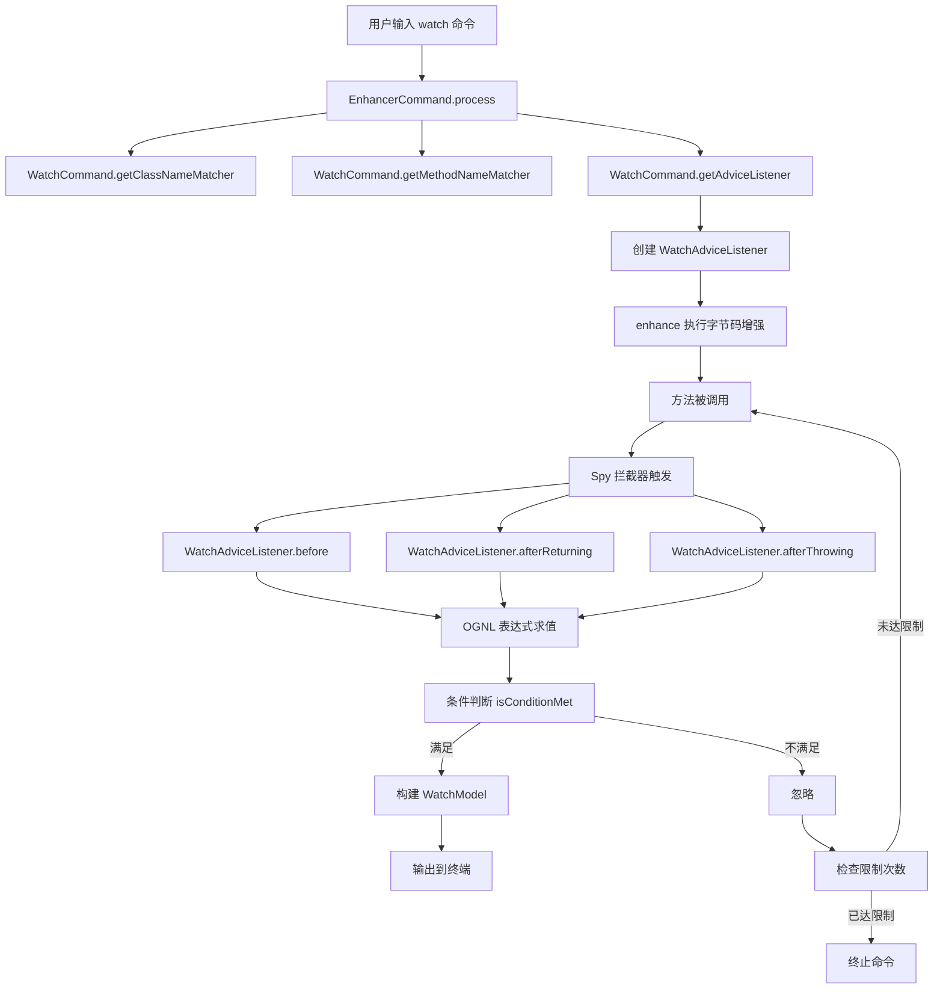

# WatchCommand 深度解析

> 基于 Arthas 4.1.2 源码分析
> 方法论：程序 = 数据结构 + 算法

---

## 第 0 部分：核心原理

### 0.1 本质是什么？

WatchCommand 是 Arthas 的**方法执行观察命令**，通过字节码增强在方法入口/出口/异常处插入 Spy 拦截，结合 OGNL 表达式实时输出方法的参数、返回值、异常等运行时数据。

### 0.2 为什么需要？

生产环境调试的核心矛盾：需要观察方法运行时状态（参数值、返回值），但不能修改代码、不能重启应用。传统方案（加日志→编译→部署→重启）周期太长，而 watch 命令通过运行时字节码增强实现**零侵入**的方法观察。

### 0.3 怎么解决？

核心思路：**字节码增强 + AOP 回调 + OGNL 表达式求值**。

1. 继承 `EnhancerCommand`，复用字节码增强通用流程
2. 创建 `WatchAdviceListener`，在 `before/afterReturning/afterThrowing` 回调中执行 OGNL 表达式
3. 通过条件表达式（`conditionExpress`）过滤不感兴趣的调用
4. 将结果封装为 `WatchModel` 输出到终端

### 0.4 为什么这样设计？

- **为什么基于 EnhancerCommand 而不是独立实现？** watch/trace/monitor/stack/tt 五个命令都需要字节码增强，EnhancerCommand 封装了通用流程，子类只需实现 4 个抽象方法。
- **为什么用 OGNL 表达式而不是固定输出？** 不同场景需要观察不同内容（只看第一个参数、只看返回值的某个字段等），OGNL 提供了灵活的运行时求值能力。
- **为什么有 `-n` 次数限制？** 高频方法（如每秒调用上万次）如果不限制次数，输出量会淹没终端并影响性能。默认 100 次是安全与实用的平衡。

---

## 第 1 部分：宏观理解

### 1.1 解决什么问题

watch 命令用于**观察方法的执行情况**，用户可以指定：
- 观察哪个类哪个方法
- 在哪个执行点观察（方法执行前/返回后/异常时）
- 观察什么内容（参数、返回值、异常、对象等）
- 什么条件下观察（条件表达式过滤）

### 1.2 总体调用链（Mermaid 图）



### 1.3 涉及的数据结构清单

| 结构名 | 源码位置 | 核心作用 |
|--------|----------|----------|
| **WatchCommand** | monitor200/WatchCommand.java:35 | watch 命令入口，解析命令行参数 |
| **WatchAdviceListener** | monitor200/WatchAdviceListener.java:20 | 方法回调处理，OGNL 表达式求值 |
| **WatchModel** | command/model/WatchModel.java:10 | 观察结果的数据模型 |
| **ExpressFactory** | command/express/ExpressFactory.java:8 | OGNL 表达式工厂，ThreadLocal 复用 |
| **OgnlExpress** | command/express/OgnlExpress.java:16 | OGNL 表达式实际求值实现 |
| **Advice** | advisor/Advice.java | 方法调用上下文封装 |
| **ObjectVO** | command/model/ObjectVO.java | 对象视图封装，控制输出格式 |

---

## 第 2 部分：数据结构全景 ⭐

### 2.1 WatchCommand（完整 6 项分析）

#### 问题推导

**问题**：watch 命令要实现"在方法执行前/后观察参数、返回值、异常"——需要哪些配置参数？

**需要什么信息？**
- **观察什么**（OGNL 表达式 express）和**什么条件下观察**（conditionExpress）→ 2 个表达式字段
- **在哪个时机观察**（before/finish/exception/success）→ 4 个布尔标志
- **观察多深**（对象展开层级 expand）→ 控制 ObjectView 递归深度
- 继承 EnhancerCommand 的 classPattern/methodPattern → 复用匹配逻辑

**推导出的结构**：继承 EnhancerCommand，新增 express + conditionExpress + 4 个时机标志 + expand 等参数字段。

#### 2.1.1 字段列表

```java
// WatchCommand.java:35-49
@Name("watch")
@Summary("Display the input/output parameter, return object, and thrown exception of specified method invocation")
public class WatchCommand extends EnhancerCommand {

    // 命令行参数
    private String classPattern;        // 类名模式
    private String methodPattern;       // 方法名模式
    private String express;             // 观察表达式
    private String conditionExpress;    // 条件表达式
    
    // 观察点选项
    private boolean isBefore = false;      // 观察方法执行前
    private boolean isFinish = false;      // 观察方法返回后（默认）
    private boolean isException = false;    // 观察异常时
    private boolean isSuccess = false;      // 观察成功返回时
    
    // 输出选项
    private Integer expand = 1;         // 对象展开层级
    private Integer sizeLimit = 10 * 1024 * 1024;  // 结果大小限制
    private boolean isRegEx = false;    // 是否使用正则表达式
    private int numberOfLimit = 100;   // 观察次数限制
}
```

#### 2.1.2 每个字段的含义

| 字段 | 类型 | 含义 | 使用场景 | 核心 |
|------|------|------|----------|------|
| `classPattern` | String | 要观察的类名模式 | 第一个位置参数 | ★ |
| `methodPattern` | String | 要观察的方法名模式 | 第二个位置参数 | ★ |
| `express` | String | OGNL 观察表达式 | 默认 `{params, target, returnObj}` | ★ |
| `conditionExpress` | String | OGNL 条件过滤表达式 | 只在满足条件时输出 | ★ |
| `isBefore` | boolean | 是否观察方法执行前 | `-b` 参数 | ★ |
| `isFinish` | boolean | 是否观察方法返回后 | `-f` 参数 | ★ |
| `isException` | boolean | 是否观察异常 | `-e` 参数 | |
| `isSuccess` | boolean | 是否观察成功返回 | `-s` 参数 | |
| `expand` | Integer | 对象展开层级 | `-x` 参数，控制输出深度 | ★ |
| `sizeLimit` | Integer | 单个结果大小限制 | `-M` 参数，默认 10MB | |
| `isRegEx` | boolean | 类名方法名是否正则匹配 | `-E` 参数 | |
| `numberOfLimit` | int | 最多观察次数 | `-n` 参数，默认 100 | |

#### 2.1.3 sizeof 与内存布局

> 详见 `31-Object-Memory-Layout-Analysis.md`

WatchCommand 继承 EnhancerCommand，自身新增 12 个字段。由于 EnhancerCommand 本身继承 AnnotatedCommand，完整继承链较深，这里只分析 WatchCommand 新增部分：

| 字段 | 类型 | 大小（CompressedOops ON） |
|------|------|--------------------------|
| classPattern | reference | 4 bytes |
| methodPattern | reference | 4 bytes |
| express | reference | 4 bytes |
| conditionExpress | reference | 4 bytes |
| isBefore | boolean | 1 byte |
| isFinish | boolean | 1 byte |
| isException | boolean | 1 byte |
| isSuccess | boolean | 1 byte |
| expand | Integer (ref) | 4 bytes |
| sizeLimit | Integer (ref) | 4 bytes |
| isRegEx | boolean | 1 byte |
| numberOfLimit | int | 4 bytes |

WatchCommand 新增字段合计：4×4(ref) + 4(int) + 2×4(Integer ref) + 5×1(boolean) = 29 bytes → 对齐后约 32 bytes。加上父类字段，WatchCommand 总大小估算约 **~80-120 bytes**（取决于 EnhancerCommand/AnnotatedCommand 父类字段数量）。WatchCommand 是命令生命周期内的**单例**，不频繁创建。

#### 2.1.4 创建位置

WatchCommand 由 Arthas CLI 框架在用户输入 watch 命令时创建：

```java
// 1. 用户输入: watch demo.MathGame run '{params, returnObj}'
// 2. CommandResolver 解析参数
// 3. 反射创建 WatchCommand 实例
// 4. @Argument 注解自动绑定位置参数
// 5. @Option 注解自动绑定命名参数
// 6. 调用 command.process(process)
```

#### 2.1.5 关键字段的生命周期

| 字段 | 设置时机 | 设置方式 | 读取时机 |
|------|----------|----------|----------|
| `classPattern` | 命令解析 | @Argument(index=0) | getClassNameMatcher() |
| `methodPattern` | 命令解析 | @Argument(index=1) | getMethodNameMatcher() |
| `express` | 命令解析 | @Argument(index=2) | WatchAdviceListener.watching() |
| `conditionExpress` | 命令解析 | @Argument(index=3) | WatchAdviceListener.watching() |
| `expand` | 命令解析 | @Option | ObjectVO 构造 |

#### 2.1.6 值域图

`expand` 参数的值域：

```
┌─────────────────────────────────────────────────────────┐
│                    expand 值域                           │
├─────────────────────────────────────────────────────────┤
│                                                         │
│   [0] ──────► [1] ──────► [2] ──────► [N]             │
│    ↑            ↑            ↑            ↑            │
│    │            │            │            │            │
│  不展开      默认值       两层展开     完全展开         │
│                                                         │
│  ObjectVO.MAX_DEEP 是最大限制                           │
│                                                         │
└─────────────────────────────────────────────────────────┘
```

---

### 2.2 WatchAdviceListener 详细分析

#### 问题推导

**问题**：watch 命令启动后，每次方法回调时需要做什么？需要保存什么状态？

**需要什么信息？**
- 需要计算方法**执行耗时** → ThreadLocalWatch（before 开始计时，after 结束计时）
- 需要获取**命令参数**（表达式、条件等）→ 持有 WatchCommand 引用
- 需要**输出结果**给用户 → 持有 CommandProcess 引用
- 耗时计算必须**线程隔离**（方法可能被多线程同时调用）→ ThreadLocal

**推导出的结构**：继承 AdviceListenerAdapter，持有 ThreadLocalWatch + command + process。

#### 2.2.1 字段列表

```java
// WatchAdviceListener.java:20-31
class WatchAdviceListener extends AdviceListenerAdapter {

    private static final Logger logger = LoggerFactory.getLogger(WatchAdviceListener.class);
    
    // 线程本地计时器：计算方法执行耗时
    private final ThreadLocalWatch threadLocalWatch = new ThreadLocalWatch();
    
    // 关联的命令对象
    private WatchCommand command;
    
    // 命令执行上下文
    private CommandProcess process;
}
```

#### 2.2.2 每个字段的含义

| 字段 | 类型 | 含义 | 使用场景 | 核心 |
|------|------|------|----------|------|
| `logger` | Logger | 日志记录器 | 记录 OGNL 求值异常 | |
| `threadLocalWatch` | ThreadLocalWatch | 线程本地计时器 | 计算方法执行耗时 | ★ |
| `command` | WatchCommand | 命令对象 | 获取观察表达式、条件表达式等参数 | ★ |
| `process` | CommandProcess | 命令进程 | 输出结果、控制命令生命周期 | ★ |

#### 2.2.3 sizeof 与内存布局

> 详见 `31-Object-Memory-Layout-Analysis.md`

继承链：`WatchAdviceListener → AdviceListenerAdapter → Object`

**注意**：`logger` 是 `static` 字段，不计入对象布局。WatchAdviceListener 有自己的 `process`(CommandProcess)，与父类 `process`(Process) 是两个不同字段。

```
WatchAdviceListener 对象内存布局（CompressedOops ON）
┌──────────────────────────────────────┐ 偏移 0
│ mark word              (8 bytes)     │
├──────────────────────────────────────┤ 偏移 8
│ compressed klass ptr   (4 bytes)     │
├──────────────────────────────────────┤ 偏移 12
│ [父] process (Process) (4 bytes)     │  ★ 引用填入间隙
├──────────────────────────────────────┤ 偏移 16
│ [父] id               (8 bytes)      │  ★ long 对齐到 8
├──────────────────────────────────────┤ 偏移 24
│ [父] verbose (1) + padding (3)       │  4 bytes
├──────────────────────────────────────┤ 偏移 28
│ threadLocalWatch       (4 bytes)     │
├──────────────────────────────────────┤ 偏移 32
│ command                (4 bytes)     │
├──────────────────────────────────────┤ 偏移 36
│ process (CommandProcess)(4 bytes)    │
└──────────────────────────────────────┘ 偏移 40

WatchAdviceListener shallow size = 40 bytes
```

#### 2.2.4 创建位置

```java
// WatchCommand.java:196-198
@Override
protected AdviceListener getAdviceListener(CommandProcess process) {
    return new WatchAdviceListener(this, process, GlobalOptions.verbose || this.verbose);
}
```

#### 2.2.5 关键字段的生命周期

| 字段 | 设置时机 | 设置方式 | 设置值 | 读取时机 |
|------|----------|----------|--------|----------|
| `threadLocalWatch` | 构造 | `new ThreadLocalWatch()` | 空计时器 | before() 开始计时 |
| `command` | 构造 | 构造参数传入 | WatchCommand | watching() 获取参数 |
| `process` | 构造 | 构造参数传入 | CommandProcess | watching() 输出结果 |

---

### 2.3 OGNL 表达式求值机制

#### 2.3.1 ExpressFactory

```java
// ExpressFactory.java:8-24
public class ExpressFactory {
    
    // ThreadLocal 复用 OGNL 上下文，避免重复创建开销
    private static final ThreadLocal<Express> expressRef = new ThreadLocal<Express>() {
        @Override
        protected Express initialValue() {
            return new OgnlExpress();
        }
    };
    
    // 获取线程本地的 Express 对象
    public static Express threadLocalExpress(Object object) {
        // reset() 清空上下文
        // bind(object) 绑定目标对象（Advice）
        return expressRef.get().reset().bind(object);
    }
}
```

#### 2.3.2 OgnlExpress

```java
// OgnlExpress.java:34-41
@Override
public Object get(String express) throws ExpressException {
    try {
        // Ognl.getValue() 是 OGNL 库的核心方法
        // 参数：表达式、上下文、根对象
        return Ognl.getValue(express, context, bindObject);
    } catch (Exception e) {
        logger.error("Error during evaluating the expression:", e);
        throw new ExpressException(express, e);
    }
}
```

#### 2.3.3 OGNL 上下文变量

在 watch 命令中，OGNL 表达式的根对象是 `Advice`：

| 变量名 | 来源 | 说明 |
|--------|------|------|
| `params` | Advice.params | 方法参数数组 |
| `returnObj` | Advice.returnObj | 返回值（仅在 afterReturning 有效）|
| `throwExp` | Advice.throwExp | 异常对象（仅在 afterThrowing 有效）|
| `target` | Advice.target | 目标对象（this）|
| `clazz` | Advice.clazz | 目标类 |
| `method` | Advice.method | 目标方法 |
| `#cost` | 额外绑定 | 方法执行耗时（毫秒）|

---

## 第 3 部分：算法/流程分析

### 3.1 WatchAdviceListener.before() 流程

#### 3.1.1 解决什么问题？

在方法执行前开始计时，如果配置了 `-b` 参数，则同时执行 OGNL 表达式求值并输出。

#### 3.1.2 函数签名与位置

```java
// WatchAdviceListener.java:37-45
@Override
public void before(ClassLoader loader, Class<?> clazz, ArthasMethod method, Object target, Object[] args)
        throws Throwable {
```

#### 3.1.3 真实源码 + 逐行注释

```java
// WatchAdviceListener.java:37
@Override
public void before(ClassLoader loader, Class<?> clazz, ArthasMethod method, Object target, Object[] args)
        throws Throwable {
    // ★ 开始计算方法执行耗时
    // 使用 ThreadLocalWatch 确保线程安全，避免多线程干扰
    threadLocalWatch.start();
    
    // ★ 判断是否需要观察方法执行前
    // command.isBefore() 对应 -b 参数
    if (command.isBefore()) {
        // ★ 创建 Advice 上下文对象
        // Advice.newForBefore() 会设置 stage = ACCESS_BEFORE
        // 这个 Advice 对象会被用于 OGNL 表达式求值
        watching(Advice.newForBefore(loader, clazz, method, target, args));
    }
}
```

**设计决策**：
- **为什么使用 ThreadLocalWatch？** watch 命令可能在多线程环境下运行，每个线程需要独立计时
- **为什么在 before() 中就开始计时？** 需要计算方法的实际执行时间，包括 before 回调本身的耗时

---

### 3.2 WatchAdviceListener.watching() 核心流程

#### 3.2.1 解决什么问题？

这是 watch 命令的**核心算法**，负责：
1. 计算方法执行耗时
2. 条件表达式判断
3. OGNL 表达式求值
4. 构建结果模型
5. 输出到终端

#### 3.2.2 整体流程（6 个阶段）

```
Phase 1: 计算耗时
Phase 2: 条件判断
Phase 3: OGNL 表达式求值
Phase 4: 构建 WatchModel
Phase 5: 输出结果
Phase 6: 检查限制次数
```

#### 3.2.3 函数签名与位置

```java
// WatchAdviceListener.java:76-116
private void watching(Advice advice) {
```

#### 3.2.4 Phase 1-2: 计算耗时 + 条件判断

```java
// WatchAdviceListener.java:76
private void watching(Advice advice) {
    try {
        // ★ Phase 1: 计算方法执行耗时（毫秒）
        // 这里是在 afterReturning/afterThrowing 时调用的
        // 所以可以获取到方法执行的实际耗时
        double cost = threadLocalWatch.costInMillis();
        
        // ★ Phase 2: 条件表达式判断
        // 如果没有设置条件表达式，默认返回 true
        // 如果设置了条件表达式，求值结果为 false 则不输出
        boolean conditionResult = isConditionMet(command.getConditionExpress(), advice, cost);
        
        // ★ 调试输出：如果开启了 verbose，会输出条件表达式的求值结果
        if (this.isVerbose()) {
            process.write("Condition express: " + command.getConditionExpress() + " , result: " + conditionResult + "\n");
        }
        
        // ★ 条件不满足，直接返回，不输出结果
        if (!conditionResult) {
            return;  // 不执行后续的 OGNL 求值，节省开销
        }
```

**设计决策**：
- **为什么先判断条件再求值 OGNL？** 避免不必要的 OGNL 求值开销，条件不满足时直接跳过
- **为什么要传递 cost 给条件表达式？** 允许用户按执行耗时过滤，如 `#cost > 100`

#### 3.2.5 Phase 3: OGNL 表达式求值

```java
        // ★ Phase 3: OGNL 表达式求值
        // ExpressFactory.threadLocalExpress(advice) 获取线程本地的 Express
        // .get(command.getExpress()) 执行实际的 OGNL 求值
        // express 默认值是 "{params, target, returnObj}"
        Object value = getExpressionResult(command.getExpress(), advice, cost);
```

**OGNL 求值过程**：

```java
// AdviceListenerAdapter.java:122-124
protected Object getExpressionResult(String express, Advice advice, double cost) throws ExpressException {
    // 将 Advice 和 #cost 绑定到 OGNL 上下文
    return ExpressFactory.threadLocalExpress(advice)
        .bind(Constants.COST_VARIABLE, cost)  // 绑定 #cost
        .get(express);                         // 求值
}
```

#### 3.2.6 Phase 4: 构建 WatchModel

```java
        // ★ Phase 4: 构建观察结果模型
        WatchModel model = new WatchModel();
        
        // 时间戳
        model.setTs(LocalDateTime.now());
        
        // 执行耗时
        model.setCost(cost);
        
        // OGNL 表达式求值结果（被 ObjectVO 封装）
        // ObjectVO 负责控制对象的展开层级和大小限制
        model.setValue(new ObjectVO(value, command.getExpand()));
        
        // 大小限制（用于字符串截断等）
        model.setSizeLimit(command.getSizeLimit());
        
        // 类名和方法名
        model.setClassName(advice.getClazz().getName());
        model.setMethodName(advice.getMethod().getName());
        
        // 观察点类型：方法执行前 / 正常返回 / 异常抛出
        if (advice.isBefore()) {
            model.setAccessPoint(AccessPoint.ACCESS_BEFORE.getKey());
        } else if (advice.isAfterReturning()) {
            model.setAccessPoint(AccessPoint.ACCESS_AFTER_RETUNING.getKey());
        } else if (advice.isAfterThrowing()) {
            model.setAccessPoint(AccessPoint.ACCESS_AFTER_THROWING.getKey());
        }
```

#### 3.2.7 Phase 5-6: 输出结果 + 检查限制

```java
        // ★ Phase 5: 输出结果到终端
        // process.appendResult() 是异步的，不会阻塞方法执行
        process.appendResult(model);
        
        // 增加执行次数计数
        process.times().incrementAndGet();
        
        // ★ Phase 6: 检查是否达到限制次数
        // 如果达到限制，调用 abortProcess() 终止命令
        if (isLimitExceeded(command.getNumberOfLimit(), process.times().get())) {
            abortProcess(process, command.getNumberOfLimit());
        }
        
    } catch (Throwable e) {
        // ★ 异常处理：OGNL 求值可能失败
        logger.warn("watch failed.", e);
        process.end(-1, "watch failed, condition is: " + command.getConditionExpress() + ", express is: "
                + command.getExpress() + ", " + e.getMessage() + ", visit " + LogUtil.loggingFile()
                + " for more details.");
    }
}
```

---

### 3.3 观察点组合逻辑

watch 命令支持多个观察点组合，通过 `isBefore()`、`isFinish()`、`isException()`、`isSuccess()` 控制：

```java
// WatchAdviceListener.java:33-35
private boolean isFinish() {
    // isFinish 为 true，或者
    // 没有任何特定观察点配置时（默认观察返回后）
    return command.isFinish() || !command.isBefore() && !command.isException() && !command.isSuccess();
}
```

**观察点组合表**：

| 参数组合 | before 调用? | afterReturning 调用? | afterThrowing 调用? |
|---------|-------------|---------------------|-------------------|
| `-b` | ✅ | ❌ | ❌ |
| `-f` (默认) | ❌ | ✅ | ❌ |
| `-e` | ❌ | ❌ | ✅ |
| `-s` | ❌ | ✅ (仅成功) | ❌ |
| `-b -f` | ✅ | ✅ | ❌ |
| `-b -e` | ✅ | ❌ | ✅ |
| 无参数 | ✅ (通过 finishing) | ✅ (通过 finishing) | ✅ (通过 finishing) |

---

### 3.4 条件表达式与观察表达式

#### 3.4.1 条件表达式 (condition-express)

用于**过滤**方法调用，只在满足条件时输出：

```bash
# 只观察参数 params[0] > 100 的调用
watch demo.MathGame run 'params[0] > 100'

# 只观察执行耗时超过 100ms 的调用
watch demo.MathGame run '#cost > 100'

# 只观察返回值不为 null 的调用  
watch demo.MathGame run 'returnObj != null'
```

#### 3.4.2 观察表达式 (express)

用于**指定要观察什么**：

```bash
# 观察所有：参数、目标对象、返回值
watch demo.MathGame run '{params, target, returnObj}'

# 只观察参数
watch demo.MathGame run 'params'

# 只观察返回值
watch demo.MathGame run 'returnObj'

# 观察异常
watch demo.MathGame run 'throwExp'

# 观察方法执行耗时
watch demo.MathGame run '#cost'

# 组合：参数 + 返回值 + 耗时
watch demo.MathGame run '{params, returnObj, #cost}'
```

---

## 四、数据结构关系图（Mermaid）

```mermaid
classDiagram
    direction TB
    
    <<abstract>> EnhancerCommand
    <<class>> WatchCommand
    <<class>> WatchAdviceListener
    <<class>> WatchModel
    <<class>> ExpressFactory
    <<class>> OgnlExpress
    <<class>> Advice
    
    EnhancerCommand <|-- WatchCommand
    AdviceListenerAdapter <|-- WatchAdviceListener
    WatchCommand --> WatchAdviceListener : creates
    WatchAdviceListener --> WatchModel : produces
    WatchAdviceListener --> ExpressFactory : uses
    ExpressFactory --> OgnlExpress : creates
    WatchAdviceListener --> Advice : receives
    
    class WatchCommand {
        +classPattern: String
        +methodPattern: String
        +express: String
        +conditionExpress: String
        +isBefore: boolean
        +isFinish: boolean
        +isException: boolean
        +isSuccess: boolean
        +expand: Integer
        +sizeLimit: Integer
    }
    
    class WatchAdviceListener {
        +threadLocalWatch: ThreadLocalWatch
        +command: WatchCommand
        +process: CommandProcess
        +before()
        +afterReturning()
        +afterThrowing()
        +watching()
    }
    
    class WatchModel {
        +ts: LocalDateTime
        +cost: double
        +value: ObjectVO
        +className: String
        +methodName: String
        +accessPoint: String
    }
    
    class ExpressFactory {
        +threadLocalExpress(Object) Express
    }
    
    class Advice {
        +loader: ClassLoader
        +clazz: Class
        +target: Object
        +method: Method
        +params: Object[]
        +returnObj: Object
        +throwExp: Throwable
        +isBefore: boolean
        +isThrow: boolean
        +isReturn: boolean
    }
```

---

## 第 5 部分：总结

### 5.1 数据结构层面

| 结构 | 核心特征 |
|------|----------|
| **WatchCommand** | 命令参数封装，定义观察点选项（-b/-f/-e/-s）和输出选项（-x/-M/-n） |
| **WatchAdviceListener** | 方法回调处理，核心算法在 watching() 方法中，包含 6 个阶段 |
| **WatchModel** | 结果数据模型，包含时间戳、耗时、观察值、类名方法名等 |
| **ExpressFactory** | OGNL 表达式工厂，使用 ThreadLocal 复用 Express 对象避免重复创建 |
| **OgnlExpress** | OGNL 表达式实际求值，使用 Ognl.getValue() 执行表达式 |

### 5.2 算法层面

| 算法 | 核心设计决策 |
|------|-------------|
| **before() 计时** | 使用 ThreadLocalWatch 独立计时，确保多线程环境准确 |
| **条件过滤** | 先判断条件再求值 OGNL，避免不必要的计算开销 |
| **OGNL 求值** | ThreadLocal 复用 + 绑定 #cost 变量到上下文 |
| **对象展开** | ObjectVO 控制 expand 层级，控制输出详细程度 |
| **结果输出** | 异步输出 + 次数限制，避免阻塞业务方法 |

### 5.3 线程安全分析

watch 命令在多线程环境下的安全性通过以下机制保障：

- **ThreadLocalWatch**（计时器）：每个线程独立的 `LongStack`，`start()/costInMillis()` 无竞争。
- **ExpressFactory.threadLocalExpress()**：OGNL 求值上下文通过 `ThreadLocal<Express>` 隔离，每个线程复用自己的 `OgnlExpress` 实例，`reset()` 清空前次状态后再 `bind()` 新对象。
- **Advice 不可变对象**：每次回调创建新的 Advice（`final` 字段），天然线程安全。
- **process.times().incrementAndGet()**：跨线程共享的输出计数器，使用 `AtomicInteger` 保证原子性。
- **process.appendResult()**：CommandProcess 内部通过 Netty EventLoop 实现线程安全的结果输出。

### 5.4 核心要点

1. **watch 是观察类命令的基座**，trace/monitor 都基于类似的模式
2. **OGNL 表达式是核心**，ExpressFactory 负责求值，支持丰富的上下文变量
3. **多观察点组合**：-b/-f/-e/-s 可以组合使用，before/afterReturning/afterThrowing 会被分别调用
4. **异步输出**：appendResult() 是异步的，不阻塞业务方法执行
5. **条件过滤**：condition-express 在 OGNL 求值之前执行，节省开销
6. **对象展示**：ObjectVO 封装结果，控制 expand 层级和 sizeLimit，避免输出过大
7. **线程安全通过 ThreadLocal 隔离**，ThreadLocalWatch 和 OgnlExpress 各线程独立
