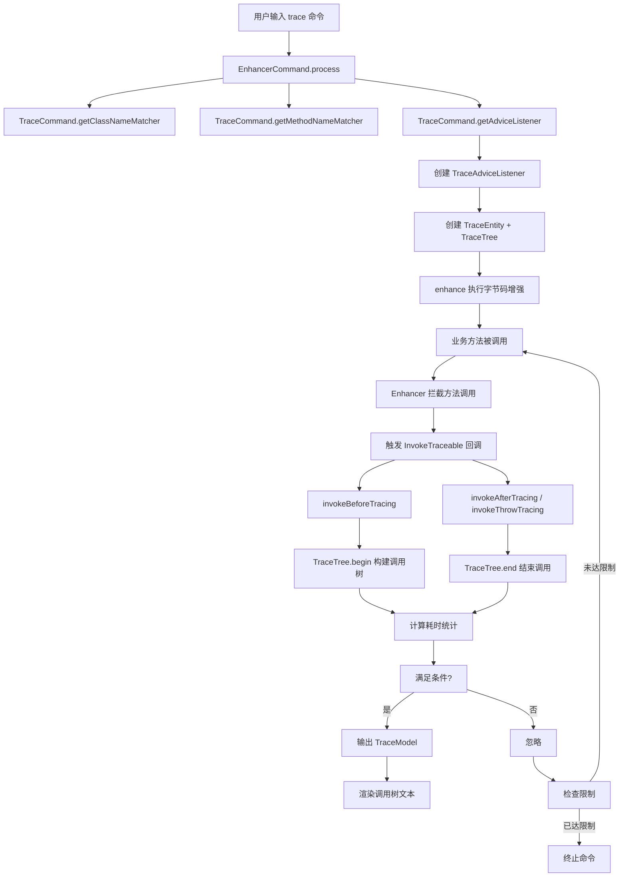

# TraceCommand 深度解析

> 基于 Arthas 4.1.2 源码分析
> 方法论：程序 = 数据结构 + 算法

---

## 第 0 部分：核心原理

### 0.1 本质是什么？

TraceCommand 是 Arthas 的**方法调用链追踪命令**，通过字节码增强在方法入口/出口及内部调用点插入追踪代码，构建调用树（TraceTree）并输出每个子方法的耗时，用于定位性能瓶颈。

### 0.2 为什么需要？

生产环境的性能分析核心需求：知道一个方法"慢在哪里"。watch 命令只能观察单个方法，无法深入到内部调用链。trace 通过在目标方法的每个 `invokevirtual/invokeinterface/invokestatic` 调用前后都插入计时代码，构建一棵完整的调用耗时树。

### 0.3 怎么解决？

核心思路：**字节码增强 + InvokeTraceable 接口 + TraceTree 调用树**。

1. 在目标方法入口/出口插入标准 Spy 拦截（与 watch 相同）
2. **额外**在目标方法内部的每个方法调用指令前后插入 `invokeBeforeTracing/invokeAfterTracing` 调用
3. 运行时通过 `TraceTree.begin()/end()` 构建调用树
4. 当目标方法执行完毕，输出完整的调用树及各节点耗时

### 0.4 为什么这样设计？

- **为什么需要 InvokeTraceable 接口？** trace 不仅在方法入口/出口拦截，还需要在方法内部的每个调用点拦截。InvokeTraceable 定义了 `invokeBeforeTracing/invokeAfterTracing` 两个额外回调，只有 trace 命令的 Listener 实现这个接口。
- **为什么用 TraceTree 而不是简单的列表？** 方法调用是嵌套的（A 调 B，B 调 C），只有树结构才能正确表示调用关系和耗时归属。
- **为什么默认跳过 JDK 方法？** JDK 内部调用链非常深（如 HashMap.put → hash → hashCode → ...），如果不跳过，输出量巨大且难以阅读。`--skipJDKMethod` 默认 true。

---

## 第 1 部分：宏观理解

### 1.1 解决什么问题

trace 命令用于**追踪方法调用链**，输出方法之间的调用关系和执行耗时。它不仅能追踪用户指定的方法，还能追踪该方法内部调用的所有子方法，形成一棵调用树。

### 1.2 与 watch 命令的区别

| 特性 | watch | trace |
|------|-------|-------|
| 观察粒度 | 单个方法 | 方法调用链 |
| 输出内容 | 参数/返回值/异常 | 调用树 + 耗时 |
| 适用场景 | 观察特定方法 | 性能分析/调用路径分析 |

### 1.3 总体调用链（Mermaid 图）



### 1.4 涉及的数据结构清单

| 结构名 | 源码位置 | 核心作用 |
|--------|----------|----------|
| **TraceCommand** | monitor200/TraceCommand.java:46 | trace 命令入口，解析命令行参数 |
| **TraceAdviceListener** | monitor200/TraceAdviceListener.java:9 | 方法调用追踪回调 |
| **AbstractTraceAdviceListener** | monitor200/AbstractTraceAdviceListener.java:17 | 追踪回调抽象基类 |
| **InvokeTraceable** | advisor/InvokeTraceable.java:8 | 方法调用追踪接口 |
| **TraceEntity** | monitor200/TraceEntity.java:11 | ThreadLocal 传递的追踪实体 |
| **TraceTree** | command/model/TraceTree.java:12 | 调用树结构管理 |
| **TraceNode** | command/model/TraceNode.java | 树节点基类 |
| **ThreadNode** | command/model/ThreadNode.java | 线程根节点 |
| **MethodNode** | command/model/MethodNode.java | 方法节点 |
| **TraceModel** | command/model/TraceModel.java | 追踪结果模型 |

---

## 第 2 部分：数据结构全景 ⭐

### 2.1 TraceCommand（完整 6 项分析）

#### 问题推导

**问题**：trace 命令要追踪方法内部的调用链路和耗时，除了 watch 有的参数外还需要什么？

**需要什么信息？**
- 需要追踪**方法内部调用的其他方法** → 需要插入 invokeBeforeTracing/invokeAfterTracing 拦截器（isTracing=true）
- 需要**路径过滤**（只追踪特定调用链路）→ pathPatterns 列表
- JDK 内部方法调用链很深 → 默认**跳过 JDK 方法**（skipJDKTrace=true）

**推导出的结构**：继承 EnhancerCommand，新增 pathPatterns + skipJDKTrace，构造 Enhancer 时设置 isTracing=true。

#### 2.1.1 字段列表

```java
// TraceCommand.java:46-55
public class TraceCommand extends EnhancerCommand {

    private String classPattern;       // 类名模式
    private String methodPattern;      // 方法名模式
    private String conditionExpress;   // 条件表达式
    private boolean isRegEx = false;  // 是否正则匹配
    private int numberOfLimit = 100;  // 执行次数限制
    private List<String> pathPatterns; // 路径追踪模式
    private boolean skipJDKTrace;     // 是否跳过 JDK 方法
}
```

#### 2.1.2 每个字段的含义

| 字段 | 类型 | 含义 | 使用场景 | 核心 |
|------|------|------|----------|------|
| `classPattern` | String | 要追踪的类名模式 | 第一个位置参数 | ★ |
| `methodPattern` | String | 要追踪的方法名模式 | 第二个位置参数 | ★ |
| `conditionExpress` | String | 条件过滤表达式 | 只追踪满足条件的调用 | |
| `isRegEx` | boolean | 是否使用正则匹配 | `-E` 参数 | |
| `numberOfLimit` | int | 最多追踪次数 | `-n` 参数，默认 100 | |
| `pathPatterns` | List<String> | 路径追踪模式列表 | `-p` 参数，可多次指定 | ★ |
| `skipJDKTrace` | boolean | 是否跳过 JDK 内部方法 | `--skipJDKMethod` 参数，默认 true | ★ |

#### 2.1.3 值域图

`skipJDKTrace` 参数的值域：

```
┌─────────────────────────────────────────────────────────┐
│              skipJDKTrace 值域                           │
├─────────────────────────────────────────────────────────┤
│                                                         │
│   true (默认) ──────────────► false                    │
│        ↑                              ↑                  │
│        │                              │                  │
│   跳过 JDK 方法                   追踪所有方法           │
│   (推荐，避免输出过于庞大)         (可观察 JDK 内部耗时)   │
│                                                         │
└─────────────────────────────────────────────────────────┘
```

---

### 2.2 InvokeTraceable 接口详细分析

#### 问题推导

**问题**：trace 的监听器除了 before/after 回调，还需要感知方法**内部调用**——怎么扩展 AdviceListener 接口？

**推导出的结构**：一个独立接口，声明 invokeBeforeTracing/invokeAfterTracing/invokeThrowTracing 三个方法，trace 的监听器同时实现 AdviceListener + InvokeTraceable。

#### 2.2.1 接口定义

#### 2.2.1 接口定义

```java
// InvokeTraceable.java:8-60
public interface InvokeTraceable {
    
    /**
     * 调用之前跟踪
     * 当被追踪方法内部调用其他方法时，在调用之前触发
     */
    void invokeBeforeTracing(
            ClassLoader classLoader,
            String tracingClassName,
            String tracingMethodName,
            String tracingMethodDesc,
            int tracingLineNumber) throws Throwable;

    /**
     * 抛异常后跟踪
     */
    void invokeThrowTracing(
            ClassLoader classLoader,
            String tracingClassName,
            String tracingMethodName,
            String tracingMethodDesc,
            int tracingLineNumber) throws Throwable;

    /**
     * 调用之后跟踪
     */
    void invokeAfterTracing(
            ClassLoader classLoader,
            String tracingClassName,
            String tracingMethodName,
            String tracingMethodDesc,
            int tracingLineNumber) throws Throwable;
}
```

#### 2.2.2 回调时机

```
业务方法执行
    │
    ├─► before()  ──► AdviceListener.before()
    │
    ├─► [方法体执行]
    │       │
    │       ├─► invokeBeforeTracing() ──► TraceTree.begin()
    │       │           (方法内部调用子方法前)
    │       │
    │       ├─► [子方法执行]
    │       │
    │       └─► invokeAfterTracing() ──► TraceTree.end()
    │                   (子方法调用返回后)
    │
    ├─► afterReturning() ──► AdviceListener.afterReturning()
    │              或
    └─► afterThrowing() ──► AdviceListener.afterThrowing()
```

---

### 2.3 TraceEntity（sizeof 补充）

#### 问题推导

**问题**：每个被 trace 的线程需要维护自己的调用树——这个"每线程一棵树"的状态保存在哪？

**推导出的结构**：TraceEntity 持有 TraceTree（调用树）+ deep（当前调用深度），通过 ThreadLocal 实现每线程隔离。

#### 2.3.1 字段

> 详见 `31-Object-Memory-Layout-Analysis.md`

TraceEntity 是在 ThreadLocal 中传递的追踪实体，包含 TraceTree 和调用深度计数器。

```java
// TraceEntity.java:13-14
protected TraceTree tree;    // 引用 (4 bytes)
protected int deep;          // int   (4 bytes)
```

```
TraceEntity shallow size = 24 bytes
布局：对象头(12) + deep(4, 填入间隙) + tree(4) + padding(4)
```

---

### 2.4 TraceTree 详细分析

#### 问题推导

**问题**：扁平的 invokeBeforeTracing/invokeAfterTracing 回调序列，怎么还原成嵌套的调用树？

**需要什么信息？**
- 需要一个**树形结构**存储调用关系 → root 节点（ThreadNode）
- 需要一个**游标**指向当前正在构建的节点 → current 指针
- invokeBeforeTracing 时**深入一层**（创建子节点，current 下移），invokeAfterTracing 时**返回一层**（current 上移到父节点）

**推导出的结构**：持有 root + current 指针的树结构，通过"进入下移/退出上移"的栈式操作构建。

#### 2.3.1 字段列表

```java
// TraceTree.java:12-21
public class TraceTree {
    private TraceNode root;        // 根节点（ThreadNode）
    private TraceNode current;     // 当前节点（用于构建调用树）
    private int nodeCount = 0;    // 节点计数器
}
```

#### 2.3.2 sizeof 与内存布局

> 详见 `31-Object-Memory-Layout-Analysis.md`

```
TraceTree 对象内存布局（CompressedOops ON）
┌──────────────────────────────────────┐ 偏移 0
│ mark word              (8 bytes)     │
├──────────────────────────────────────┤ 偏移 8
│ compressed klass ptr   (4 bytes)     │
├──────────────────────────────────────┤ 偏移 12
│ nodeCount              (4 bytes)     │  ★ int 填入间隙
├──────────────────────────────────────┤ 偏移 16
│ root                   (4 bytes)     │
├──────────────────────────────────────┤ 偏移 20
│ current                (4 bytes)     │
└──────────────────────────────────────┘ 偏移 24

TraceTree shallow size = 24 bytes
```

#### 2.3.3 调用树构建过程

```
┌─────────────────────────────────────────────────────────────────┐
│                     TraceTree 调用树构建                         │
├─────────────────────────────────────────────────────────────────┤
│                                                                 │
│  begin(className, methodName, lineNumber, isInvoking)          │
│      │                                                          │
│      ├─► findChild() 查找是否有现成的子节点                      │
│      │           │                                               │
│      │           ├─► 找到 → 复用该节点                          │
│      │           └─► 未找到 → 创建新的 MethodNode                │
│      │                                                          │
│      ├─► child.begin() 记录开始时间                             │
│      │                                                          │
│      └─► current = child 移动当前指针到子节点                    │
│                                                                 │
│  end()                                                          │
│      │                                                          │
│      ├─► current.end() 记录结束时间，计算耗时                   │
│      │                                                          │
│      └─► current = current.parent() 恢复到父节点                │
│                                                                 │
└─────────────────────────────────────────────────────────────────┘
```

---

### 2.4 MethodNode 详细分析

#### 问题推导

**问题**：调用树的每个节点需要记录什么信息，才能渲染出 trace 的树形输出？

**需要什么信息？**
- **哪个方法**被调用 → className + methodName + lineNumber
- **耗时多少** → beginTimestamp + endTimestamp
- **是否异常** → isThrow 标志
- 支持**聚合统计**（同一方法多次调用）→ minCost/maxCost/totalCost/times

**推导出的结构**：继承 TraceNode（树节点基类），新增方法标识 + 时间戳 + 聚合统计字段。

#### 2.4.1 字段列表

```java
// MethodNode.java:7-37
public class MethodNode extends TraceNode {
    private String className;           // 类名
    private String methodName;          // 方法名
    private int lineNumber;             // 调用行号
    private Boolean isThrow;            // 是否抛出异常
    
    private boolean isInvoking;         // 是否为 invoke 方法调用
    
    private long beginTimestamp;        // 开始时间戳（纳秒）
    private long endTimestamp;          // 结束时间戳（纳秒）
    
    // 统计信息：支持多次调用的聚合
    private long minCost = Long.MAX_VALUE;  // 最小耗时
    private long maxCost = Long.MIN_VALUE;  // 最大耗时
    private long totalCost = 0;            // 总耗时
    private long times = 0;                // 调用次数
}
```

#### 2.4.2 sizeof 与内存布局

> 详见 `31-Object-Memory-Layout-Analysis.md`

继承链：`MethodNode → TraceNode → Object`

MethodNode 是 trace 命令中**内存开销最大的单个对象**（shallow 104 bytes），每追踪一个子方法调用就创建一个。

```
MethodNode 对象内存布局（CompressedOops ON）
┌──────────────────────────────────────┐ 偏移 0
│ mark word              (8 bytes)     │
├──────────────────────────────────────┤ 偏移 8
│ compressed klass ptr   (4 bytes)     │
├──────────────────────────────────────┤ 偏移 12
│ [父 TraceNode] marks   (4 bytes)     │  ★ int 填入间隙
├──────────────────────────────────────┤ 偏移 16 ← 父类引用
│ [父] parent            (4 bytes)     │
├──────────────────────────────────────┤ 偏移 20
│ [父] children          (4 bytes)     │
├──────────────────────────────────────┤ 偏移 24
│ [父] type              (4 bytes)     │
├──────────────────────────────────────┤ 偏移 28
│ [父] mark              (4 bytes)     │
├──────────────────────────────────────┤ 偏移 32 ← 子类 long 字段
│ beginTimestamp          (8 bytes)     │
├──────────────────────────────────────┤ 偏移 40
│ endTimestamp            (8 bytes)     │
├──────────────────────────────────────┤ 偏移 48
│ minCost                 (8 bytes)     │
├──────────────────────────────────────┤ 偏移 56
│ maxCost                 (8 bytes)     │
├──────────────────────────────────────┤ 偏移 64
│ totalCost               (8 bytes)     │
├──────────────────────────────────────┤ 偏移 72
│ times                   (8 bytes)     │
├──────────────────────────────────────┤ 偏移 80 ← 子类 int/boolean
│ lineNumber              (4 bytes)     │
├──────────────────────────────────────┤ 偏移 84
│ isInvoking(1) + padding(3)           │
├──────────────────────────────────────┤ 偏移 88 ← 子类引用
│ className               (4 bytes)     │
├──────────────────────────────────────┤ 偏移 92
│ methodName              (4 bytes)     │
├──────────────────────────────────────┤ 偏移 96
│ isThrow (Boolean ref)   (4 bytes)     │
├──────────────────────────────────────┤ 偏移 100
│ throwExp                (4 bytes)     │
└──────────────────────────────────────┘ 偏移 104

MethodNode shallow size = 104 bytes
```

**trace 命令每次追踪内存开销估算**：
- TraceEntity(24) + TraceTree(24) + ThreadNode(~72) = ~120 bytes（固定开销）
- 每个子方法: MethodNode(104) + ArrayList 节点引用(~20) = ~124 bytes
- **N 个子方法总计 ≈ 120 + N × 124 bytes**（例如 N=10 ≈ 1.4KB）

#### 2.4.3 耗时统计机制

```java
// MethodNode.java:47-67
public void begin() {
    // ★ 记录方法开始时间（纳秒级精度）
    beginTimestamp = System.nanoTime();
}

public void end() {
    // ★ 记录方法结束时间
    endTimestamp = System.nanoTime();

    // ★ 计算单次耗时
    long cost = getCost();
    
    // ★ 聚合统计：更新 min/max/total/times
    if (cost < min minCost = costCost) {
       ;
    }
    if (cost > maxCost) {
        maxCost = cost;
    }
    times++;
    totalCost += cost;
}
```

**统计聚合的优势**：
- 同一个方法被调用多次时，自动合并统计
- 输出 min/max/avg 三种耗时
- 减少输出量，更易于分析

---

## 第 3 部分：算法/流程分析

### 3.1 TraceAdviceListener 核心流程

#### 3.1.1 解决什么问题？

TraceAdviceListener 负责在方法调用过程中记录调用树信息，包括：
1. 方法开始时间
2. 方法结束时间
3. 方法调用关系（父子）
4. 异常信息

#### 3.1.2 invokeBeforeTracing()

```java
// TraceAdviceListener.java:22-27
@Override
public void invokeBeforeTracing(ClassLoader classLoader, String tracingClassName, 
        String tracingMethodName, String tracingMethodDesc, int tracingLineNumber)
        throws Throwable {
    // ★ 构建调用树
    // 参数：
    // - tracingClassName: 被调用的类名
    // - tracingMethodName: 被调用的方法名
    // - tracingLineNumber: 调用发生的位置（行号）
    // - isInvoking: true 表示这是方法内部的调用
    threadLocalTraceEntity(classLoader).tree.begin(
        tracingClassName, tracingMethodName, tracingLineNumber, true);
}
```

#### 3.1.3 invokeAfterTracing()

```java
// TraceAdviceListener.java:29-33
@Override
public void invokeAfterTracing(ClassLoader classLoader, String tracingClassName, 
        String tracingMethodName, String tracingMethodDesc, int tracingLineNumber)
        throws Throwable {
    // ★ 结束方法调用
    // 记录结束时间，计算耗时
    // 恢复到调用者的节点
    threadLocalTraceEntity(classLoader).tree.end();
}
```

#### 3.1.4 invokeThrowTracing()

```java
// TraceAdviceListener.java:35-39
@Override
public void invokeThrowTracing(ClassLoader classLoader, String tracingClassName, 
        String tracingMethodName, String tracingMethodDesc, int tracingLineNumber)
        throws Throwable {
    // ★ 处理异常情况
    // 设置标记表示该方法调用抛出了异常
    threadLocalTraceEntity(classLoader).tree.end(true);
}
```

---

### 3.2 AbstractTraceAdviceListener 核心流程

#### 3.2.1 before() 回调

```java
// AbstractTraceAdviceListener.java:48-56
@Override
public void before(ClassLoader loader, Class<?> clazz, ArthasMethod method, 
        Object target, Object[] args) throws Throwable {
    // ★ 获取当前线程的 TraceEntity
    // 每个线程独立维护自己的调用树
    TraceEntity traceEntity = threadLocalTraceEntity(loader);
    
    // ★ 开始追踪
    // 参数：类名、方法名、行号、isInvoking=false
    traceEntity.tree.begin(clazz.getName(), method.getName(), -1, false);
    
    // ★ 增加调用深度计数
    traceEntity.deep++;
    
    // ★ 开始计时
    threadLocalWatch.start();
}
```

#### 3.2.2 afterReturning() 回调

```java
// AbstractTraceAdviceListener.java:58-64
@Override
public void afterReturning(ClassLoader loader, Class<?> clazz, ArthasMethod method, 
        Object target, Object[] args, Object returnObject) throws Throwable {
    // ★ 结束方法调用
    traceEntity.tree.end();
    
    // ★ 创建 Advice 上下文
    final Advice advice = Advice.newForAfterReturning(...);
    
    // ★ 处理结果（条件判断、输出）
    finishing(loader, advice);
}
```

#### 3.2.3 finishing() 核心处理

```java
// AbstractTraceAdviceListener.java:84-116
private void finishing(ClassLoader loader, Advice advice) {
    TraceEntity traceEntity = threadLocalTraceEntity(loader);
    
    // ★ 减少调用深度
    if (traceEntity.deep >= 1) {
        traceEntity.deep--;
    }
    
    // ★ 当深度为 0 时，表示顶层方法调用完成
    if (traceEntity.deep == 0) {
        // ★ 计算耗时
        double cost = threadLocalWatch.costInMillis();
        
        // ★ 条件判断
        boolean conditionResult = isConditionMet(command.getConditionExpress(), advice, cost);
        
        // ★ 如果满足条件，输出调用树
        if (conditionResult) {
            // 增加计数
            process.times().incrementAndGet();
            
            // 输出结果模型
            process.appendResult(traceEntity.getModel());
            
            // 检查是否达到限制
            if (isLimitExceeded(command.getNumberOfLimit(), process.times().get())) {
                abortProcess(process, command.getNumberOfLimit());
            }
        }
        
        // ★ 清理 ThreadLocal
        threadBoundEntity.remove();
    }
}
```

---

### 3.3 调用树构建示例

#### 3.3.1 示例代码

```java
// 业务代码
public class A {
    public void foo() {
        new B().bar();  // 行 3
        new C().baz();  // 行 4
    }
}

public class B { public void bar() { } }
public class C { public void baz() { } }
```

#### 3.3.2 追踪输出

```
A.foo()                               # 耗时 10ms
+-- B.bar()                          # 耗时 3ms
+-- C.baz()                          # 耗时 7ms
```

#### 3.3.3 对应的树结构

```
ThreadNode (根节点)
|
└── MethodNode: A.foo() [depth=0]
    |
    ├── MethodNode: B.bar() [depth=1, line=3]
    |
    └── MethodNode: C.baz() [depth=1, line=4]
```

---

## 第 4 部分：数据结构关系图（Mermaid）

```mermaid
classDiagram
    direction TB
    
    <<interface>> InvokeTraceable
    <<abstract>> AdviceListenerAdapter
    <<abstract>> AbstractTraceAdviceListener
    <<class>> TraceCommand
    <<class>> TraceAdviceListener
    <<class>> TraceEntity
    <<class>> TraceTree
    <<class>> TraceNode
    <<class>> ThreadNode
    <<class>> MethodNode
    
    AdviceListenerAdapter <|-- AbstractTraceAdviceListener
    InvokeTraceable <|.. TraceAdviceListener
    AbstractTraceAdviceListener <|-- TraceAdviceListener
    
    TraceCommand --> TraceAdviceListener : creates
    
    TraceAdviceListener --> TraceEntity : uses
    TraceEntity --> TraceTree : contains
    TraceTree --> TraceNode : manages
    TraceNode <|-- ThreadNode
    TraceNode <|-- MethodNode
    
    class InvokeTraceable {
        <<interface>>
        +invokeBeforeTracing()
        +invokeAfterTracing()
        +invokeThrowTracing()
    }
    
    class TraceCommand {
        +classPattern: String
        +methodPattern: String
        +conditionExpress: String
        +skipJDKTrace: boolean
        +pathPatterns: List
    }
    
    class TraceAdviceListener {
        +invokeBeforeTracing()
        +invokeAfterTracing()
        +invokeThrowTracing()
    }
    
    class TraceTree {
        +root: TraceNode
        +current: TraceNode
        +begin()
        +end()
    }
    
    class MethodNode {
        +className: String
        +methodName: String
        +lineNumber: int
        +beginTimestamp: long
        +endTimestamp: long
        +minCost: long
        +maxCost: long
        +totalCost: long
        +times: long
    }
```

---

## 第 5 部分：总结

### 5.1 数据结构层面

| 结构 | 核心特征 |
|------|----------|
| **TraceCommand** | trace 命令入口，支持 pathPatterns 实现路径追踪，支持 skipJDKTrace 过滤 JDK 方法 |
| **InvokeTraceable** | 方法调用追踪接口，在方法内部调用子方法时触发回调 |
| **TraceTree** | 调用树管理器，通过 current 指针维护父子调用关系 |
| **MethodNode** | 方法节点，记录调用信息 + 耗时统计（min/max/total/times） |
| **ThreadNode** | 线程根节点，作为调用树的根 |

### 5.2 算法层面

| 算法 | 核心设计决策 |
|------|-------------|
| **调用树构建** | 使用 current 指针维护调用栈，begin() 时下沉，end() 时回弹 |
| **耗时统计** | 使用 System.nanoTime() 纳秒精度，支持多次调用聚合（min/max/avg） |
| **JDK 过滤** | skipJDKTrace 参数默认为 true，避免输出过于庞大 |
| **路径追踪** | pathPatterns 支持 `-p` 参数多次指定，组合多个匹配模式 |
| **条件过滤** | 条件表达式在 finishing() 中判断，只有顶层方法完成时才判断 |

### 5.3 线程安全分析

trace 命令的核心数据结构 `TraceEntity`（包含 `TraceTree`）通过 **ThreadLocal** 实现线程隔离：

```java
// AbstractTraceAdviceListener.java:25-26
private final ThreadLocal<TraceEntity> threadBoundEntity = new ThreadLocal<TraceEntity>();
```

**线程安全设计**：
- **TraceTree/MethodNode 不需要并发保护**：每个线程独立持有自己的 TraceEntity → TraceTree → MethodNode 链，不存在跨线程共享。这是 trace 命令无锁高性能的关键。
- **finishing() 中的 `threadBoundEntity.remove()`**：根方法退出时清理 ThreadLocal，避免内存泄漏（线程池场景下线程复用时尤其重要）。
- **deep 计数器**：非 AtomicInteger，因为同一线程内串行执行，无竞争。
- **process.times().incrementAndGet()**：唯一跨线程共享的操作，使用 AtomicInteger 保证多线程同时完成 trace 时计数正确。

### 5.4 核心要点

1. **trace 是方法调用链追踪**，不仅仅是单个方法耗时分析
2. **InvokeTraceable 接口**是 trace 的核心，在方法内部调用子方法时触发
3. **TraceTree 构建调用树**，current 指针模拟调用栈
4. **MethodNode 支持聚合统计**，同一方法多次调用会合并 min/max/total
5. **深度控制**通过 deep 计数器实现，只有 depth==0 时才输出结果
6. **skipJDKTrace 默认为 true**，避免 JDK 内部方法导致输出爆炸
7. **线程安全通过 ThreadLocal 隔离**，TraceTree 无需同步，性能开销最小化
