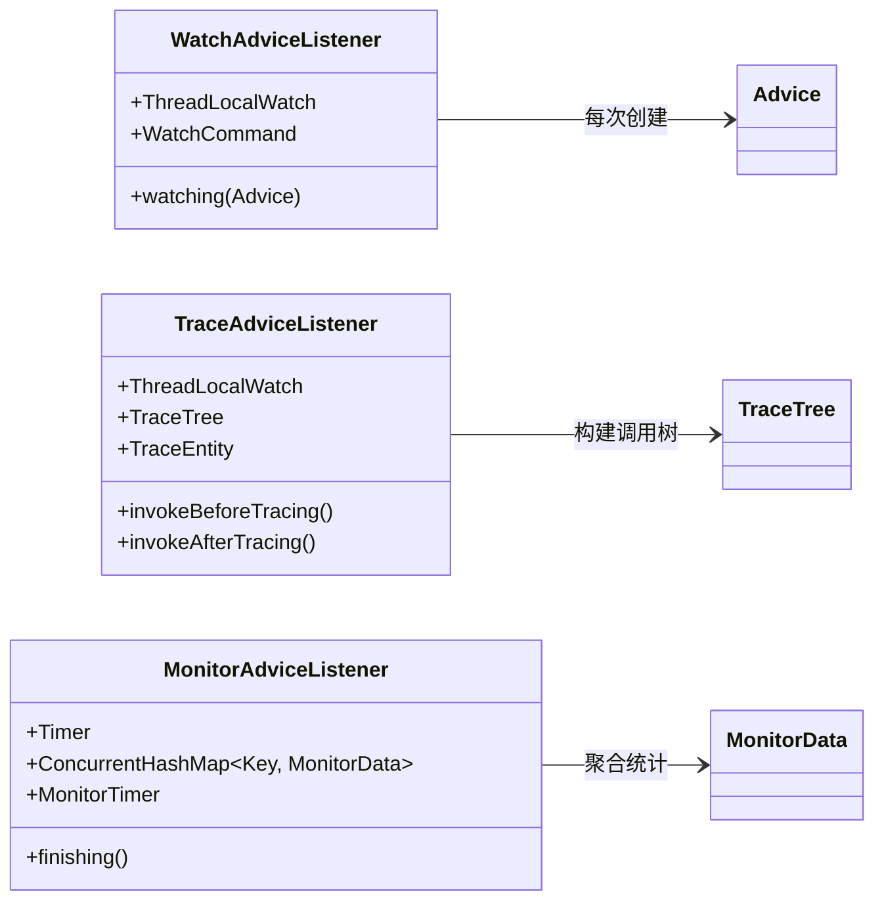

# Watch / Trace / Monitor 命令对比分析

> 基于 Arthas 4.1.2 源码分析
> 方法论：程序 = 数据结构 + 算法

---

## 第 0 部分：核心原理

### 0.1 本质是什么？

watch/trace/monitor 是 Arthas 三个最核心的增强命令，都基于字节码增强 + Spy 拦截，但观测维度不同：watch 看单次调用的数据，trace 看调用链耗时，monitor 看聚合统计。

### 0.2 为什么需要对比？

三个命令的使用场景容易混淆：调试问题用 watch 还是 trace？监控性能用 trace 还是 monitor？对比分析帮助快速选择正确的命令。

### 0.3 核心差异一句话

- **watch**：**看数据**（参数/返回值/异常，逐次输出）
- **trace**：**看耗时**（调用树 + 各方法耗时，逐次输出）
- **monitor**：**看趋势**（次数/成功率/平均耗时，周期性聚合输出）

---

## 第 1 部分：核心对比表

### 1.1 功能定位对比

| 维度 | watch | trace | monitor |
|------|-------|-------|---------|
| **核心目标** | 观察单次方法调用 | 追踪方法调用链 | 统计方法执行指标 |
| **输出内容** | 参数/返回值/异常 | 调用树 + 耗时 | 次数/成功率/平均耗时 |
| **时间维度** | 实时（每次调用） | 实时（每次调用链） | 周期性（聚合统计） |
| **适用场景** | 调试、问题定位 | 性能分析、调用路径 | 性能监控、趋势分析 |

### 1.2 实现机制对比

| 维度 | watch | trace | monitor |
|------|-------|-------|---------|
| **监听器基类** | AdviceListenerAdapter | AbstractTraceAdviceListener | AdviceListenerAdapter |
| **接口扩展** | 无 | InvokeTraceable | 无 |
| **数据存储** | 无状态 | TraceTree（调用树） | ConcurrentHashMap |
| **并发安全** | ThreadLocal | ThreadLocal | ConcurrentHashMap + CAS |
| **输出触发** | 每次调用 | 调用链完成时 | 定时器周期触发 |

### 1.3 命令参数对比

| 参数 | watch | trace | monitor |
|------|-------|-------|---------|
| `-b` (before) | ✅ | ❌ | ✅ |
| `-f` (finish) | ✅ | ❌（默认行为） | ❌ |
| `-e` (exception) | ✅ | ❌（默认行为） | ❌ |
| `-s` (success) | ✅ | ❌ | ❌ |
| `-n` (limit) | ✅ | ✅ | ✅ |
| `-x` (expand) | ✅ | ❌ | ❌ |
| `-c` (cycle) | ❌ | ❌ | ✅ |
| `--skipJDKMethod` | ❌ | ✅ | ❌ |
| `-p` (path) | ❌ | ✅ | ❌ |

---

## 第 2 部分：数据结构对比

### 2.1 核心数据结构



### 2.2 输出模型对比

| 命令 | 输出模型 | 核心字段 |
|------|----------|----------|
| watch | WatchModel | ts, cost, value, className, methodName, accessPoint |
| trace | TraceModel | root (ThreadNode), nodeCount |
| monitor | MonitorModel | List<MonitorData> (total, success, failed, cost) |

---

## 第 3 部分：算法流程对比

### 3.1 调用链对比

```mermaid
flowchart TB
    subgraph Watch["watch 命令流程"]
        W1[before] --> W2[watching]
        W2 --> W3[OGNL 求值]
        W3 --> W4[条件判断]
        W4 --> W5[输出 WatchModel]
    end
    
    subgraph Trace["trace 命令流程"]
        T1[before] --> T2[TraceTree.begin]
        T2 --> T3[invokeBeforeTracing]
        T3 --> T4[子方法执行]
        T4 --> T5[invokeAfterTracing]
        T5 --> T6[TraceTree.end]
        T6 --> T7[深度=0?]
        T7 -->|是| T8[输出 TraceModel]
        T7 -->|否| T4
    end
    
    subgraph Monitor["monitor 命令流程"]
        M1[before] --> M2[afterReturning/afterThrowing]
        M2 --> M3[finishing]
        M3 --> M4[条件判断]
        M4 --> M5[CAS 更新统计]
        M5 --> M6[定时器触发]
        M6 --> M7[输出 MonitorModel]
    end
```



### 3.2 核心方法对比

| 方法 | watch | trace | monitor |
|------|-------|-------|---------|
| **before()** | 计时 + 条件判断(-b) | TraceTree.begin() + 计时 | 计时 + 条件判断(-b) |
| **afterReturning()** | watching() 输出 | TraceTree.end() + finishing() | finishing() CAS 更新 |
| **afterThrowing()** | watching() 输出 | TraceTree.end(true) + finishing() | finishing() CAS 更新 |
| **特有方法** | - | invokeBeforeTracing() / invokeAfterTracing() | MonitorTimer.run() |

---

## 第 4 部分：性能特性对比

### 4.1 性能开销对比

| 维度 | watch | trace | monitor |
|------|-------|-------|---------|
| **每次调用开销** | 中（OGNL 求值） | 高（调用树构建） | 低（CAS 更新） |
| **内存开销** | 低（无状态） | 中（调用树） | 中（ConcurrentHashMap） |
| **对业务影响** | 中 | 高 | 低 |
| **建议使用场景** | 临时调试 | 短时间分析 | 长期监控 |

### 4.2 并发处理对比

| 维度 | watch | trace | monitor |
|------|-------|-------|---------|
| **线程安全机制** | ThreadLocal | ThreadLocal | ConcurrentHashMap + CAS |
| **数据竞争** | 无（隔离） | 无（隔离） | 有（CAS 重试） |
| **适用并发度** | 任意 | 任意 | 高并发 |

---

## 第 5 部分：使用场景决策表

### 5.1 场景选择指南

| 场景 | 推荐命令 | 原因 |
|------|----------|------|
| 排查特定参数导致的问题 | watch | 可以观察参数值 |
| 分析方法调用链路 | trace | 可以看到完整调用路径 |
| 监控方法性能趋势 | monitor | 周期性聚合统计 |
| 查看返回值是否符合预期 | watch | 可以观察 returnObj |
| 分析哪个子方法耗时长 | trace | 可以看到每个方法耗时 |
| 统计方法成功率 | monitor | 可以看到 success/failed |
| 生产环境长期监控 | monitor | 开销最低 |
| 临时问题排查 | watch | 最灵活 |

### 5.2 参数组合建议

**watch 命令典型用法**：

```bash
# 观察方法入参
watch com.example.Service method params

# 观察入参和返回值，展开 2 层
watch com.example.Service method '{params, returnObj}' -x 2

# 只观察耗时超过 100ms 的调用
watch com.example.Service method '#cost > 100'

# 观察异常情况
watch -e com.example.Service method throwExp
```

**trace 命令典型用法**：

```bash
# 追踪方法调用链
trace com.example.Service method

# 跳过 JDK 方法（默认）
trace com.example.Service method --skipJDKMethod true

# 追踪特定路径
trace com.example.Service method -p com.example.*

# 限制追踪次数
trace com.example.Service method -n 5
```

**monitor 命令典型用法**：

```bash
# 默认 60 秒周期监控
monitor com.example.Service method

# 5 秒周期监控
monitor -c 5 com.example.Service method

# 条件过滤统计
monitor com.example.Service method 'params[0] != null'
```

---

## 第 6 部分：源码实现差异

### 6.1 监听器继承关系

```
AdviceListener (接口)
    │
    └── AdviceListenerAdapter (抽象类)
            │
            ├── WatchAdviceListener ────────► 简单直接，每次调用输出
            │
            ├── AbstractTraceAdviceListener (抽象类)
            │       │
            │       └── TraceAdviceListener ─► 实现 InvokeTraceable，构建调用树
            │
            └── MonitorAdviceListener ──────► 使用 Timer + ConcurrentHashMap
```

### 6.2 关键差异点

| 差异点 | watch | trace | monitor |
|--------|-------|-------|---------|
| **是否实现 InvokeTraceable** | ❌ | ✅ | ❌ |
| **是否需要定时器** | ❌ | ❌ | ✅ |
| **是否有状态存储** | ❌ | ✅ (TraceTree) | ✅ (ConcurrentHashMap) |
| **输出时机** | 每次调用 | 调用链完成 | 定时器触发 |

---

## 第 7 部分：总结

### 7.1 核心要点

1. **watch**：灵活观察，适合临时调试，每次调用都输出
2. **trace**：调用链追踪，适合性能分析，能看到完整路径
3. **monitor**：聚合统计，适合长期监控，开销最低

### 7.2 选型决策树

```
需要观察什么？
│
├─► 单次调用详情 ──► watch
│
├─► 调用链路 ──► trace
│
└─► 统计指标 ──► monitor
```

### 7.3 注意事项

- **生产环境慎用 trace**：开销较大，可能影响性能
- **watch 条件表达式**：先判断条件再求值 OGNL，避免不必要开销
- **monitor 周期**：周期越短输出越频繁，根据实际需求设置
