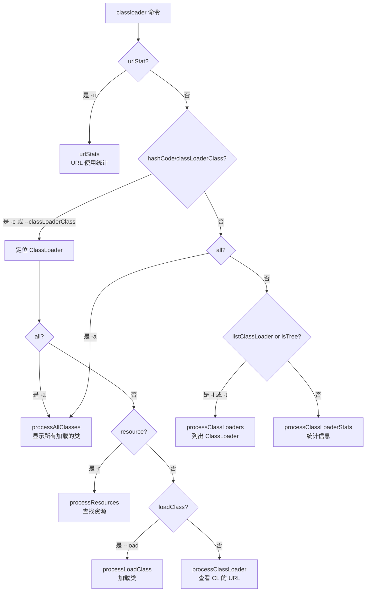
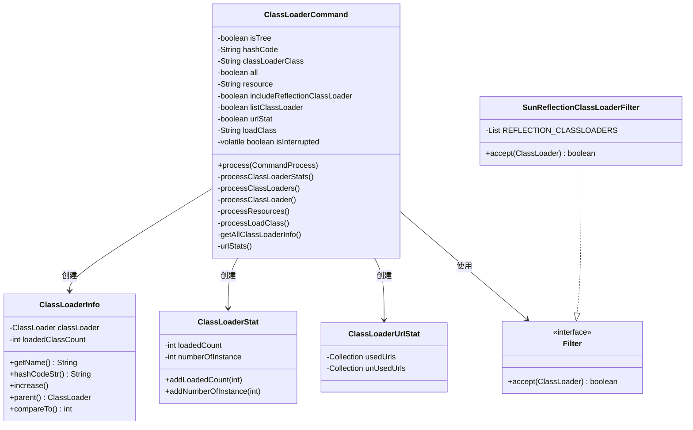
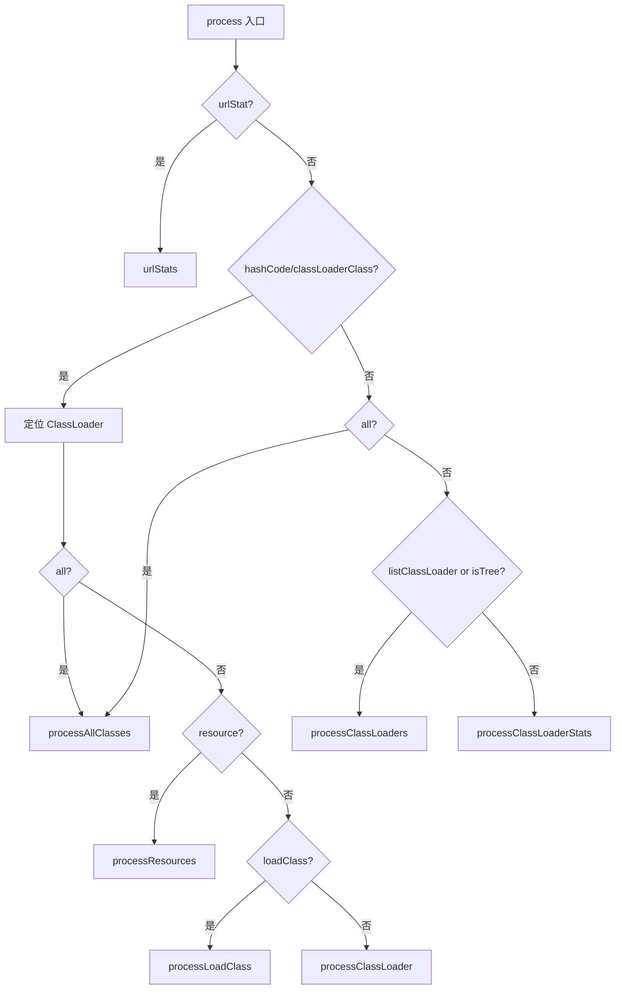
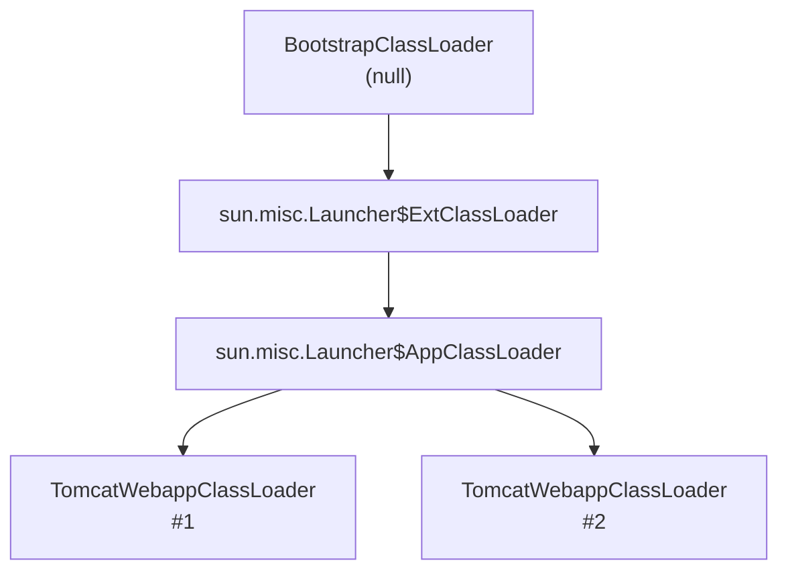

# ClassLoaderCommand 类加载器分析 - 深度解析

> 基于 Arthas 4.1.2 源码分析
> 方法论：程序 = 数据结构 + 算法
> 源码位置：`command/klass100/ClassLoaderCommand.java` (729行)

---

## 第 0 部分：核心原理

### 0.1 本质是什么？

ClassLoaderCommand 是 Arthas 提供的 **ClassLoader 诊断工具**，用于查看类加载器层次结构、统计加载类数量、查找资源、分析 URL 使用情况。

### 0.2 为什么需要？

JVM 的 ClassLoader 体系复杂，生产环境经常遇到类加载问题：
- 类找不到（ClassNotFoundException）
- 类版本冲突（同一个类被不同 ClassLoader 加载）
- ClassLoader 内存泄漏（大量 ClassLoader 未被回收）
- URLClassLoader 中的 jar 包占用问题

JDK 自带的工具（jmap、jstack）无法深入分析 ClassLoader 层次和资源使用情况。

### 0.3 怎么解决？

核心思路：**遍历所有已加载类 → 反推 ClassLoader → 构建层次结构**。

关键设计：
1. **Instrumentation.getAllLoadedClasses()** 获取所有已加载类
2. **Class.getClassLoader()** 反推 ClassLoader
3. **ClassLoader.getParent()** 构建层次树
4. **URLClassLoader.getURLs()** 查看加载路径

### 0.4 为什么这样设计？

**为什么遍历 Class 而不是直接遍历 ClassLoader？** JVM 没有提供直接获取所有 ClassLoader 的 API，但可以通过 `getAllLoadedClasses()` 间接获取。

**为什么要统计 URL 使用情况？** URLClassLoader 可能配置了多个 jar 包，但实际只用了其中几个，未使用的 jar 可能占用文件句柄。

**为什么要支持 `-t` 树形展示？** ClassLoader 有父子关系，树形展示比列表更直观。

---

## 第 1 部分：数据结构全景

### 1.1 数据结构清单

| 结构名 | 源码位置 | 核心作用 | sizeof (估算) |
|--------|----------|----------|---------------|
| **ClassLoaderCommand** | `ClassLoaderCommand.java:58` | 主命令类 | ~56 bytes |
| **ClassLoaderInfo** | 内部类 (行 566-626) | ClassLoader 信息封装 | ~24 bytes |
| **ClassLoaderStat** | 内部类 (行 672-691) | 统计信息 | ~8 bytes |
| **ClassLoaderUrlStat** | 内部类 (行 642-670) | URL 使用统计 | ~32 bytes |
| **Filter** | 接口 (行 628-630) | 过滤器接口 | 接口无大小 |
| **SunReflectionClassLoaderFilter** | 内部类 (行 632-640) | 过滤反射 CL | ~16 bytes |
| **ValueComparator** | 内部类 (行 693-714) | 排序比较器 | ~16 bytes |
| **ClassLoaderInterruptHandler** | 内部类 (行 716-728) | 中断处理器 | ~16 bytes |

### 1.2 ClassLoaderCommand 详细分析

#### 1.2.1 全部字段

```java
// ClassLoaderCommand.java:58-74
public class ClassLoaderCommand extends AnnotatedCommand {

    private static Logger logger = LoggerFactory.getLogger(ClassLoaderCommand.class);
    
    // ========== 命令参数 ==========
    private boolean isTree = false;                        // ★ 是否树形展示
    private String hashCode;                               // ★ 指定 ClassLoader 的 hash
    private String classLoaderClass;                       // ★ 指定 ClassLoader 的类名
    private boolean all = false;                           // ★ 是否显示所有加载的类
    private String resource;                               // ★ 查找的资源名
    private boolean includeReflectionClassLoader = true;  // ★ 是否包含反射 CL
    private boolean listClassLoader = false;               // ★ 是否列出 ClassLoader
    
    // ========== URL 统计 ==========
    private boolean urlStat = false;                       // ★ 是否统计 URL 使用
    
    // ========== 加载类 ==========
    private String loadClass = null;                       // ★ 要加载的类名
    
    // ========== 中断支持 ==========
    private volatile boolean isInterrupted = false;        // ★ 是否被中断
}
```

#### 1.2.2 sizeof 分析

**ClassLoaderCommand 对象大小估算**：

```
ClassLoaderCommand 对象头 (12 bytes)
├── Mark Word (8 bytes)
└── Class Pointer (4 bytes, 压缩指针)

实例字段：
├── 静态字段（不计入对象大小）
│   └── logger
│
├── 命令参数 (44 bytes)
│   ├── isTree (boolean)              1 byte
│   ├── hashCode (String ref)         4 bytes
│   ├── classLoaderClass (String ref) 4 bytes
│   ├── all (boolean)                 1 byte
│   ├── resource (String ref)         4 bytes
│   ├── includeReflectionClassLoader  1 byte
│   ├── listClassLoader (boolean)     1 byte
│   ├── urlStat (boolean)             1 byte
│   ├── loadClass (String ref)        4 bytes
│   ├── isInterrupted (boolean)       1 byte
│   └── padding                       22 bytes

总计：
- 对象头：12 bytes
- 实例字段：~44 bytes（含对齐填充）
- 总大小：~56 bytes（对齐到 8 字节边界）
```

**静态字段大小**（单独计算）：
- `logger`: ~32 bytes (Logger 对象)
- **总计**: ~32 bytes

#### 1.2.3 字段生命周期追踪表

| 字段 | 谁设置 | 何时设置 | 设置什么值 | 谁读取 | 用途 | 核心 |
|------|--------|----------|------------|--------|------|------|
| **isTree** | CLI 参数 | 用户输入 `-t` | `true`/`false` | `processClassLoaders()` | 决定是否树形展示 | ★ |
| **hashCode** | CLI 参数 | 用户输入 `-c 327a647b` | ClassLoader 的 hash | `process()` | 定位指定 ClassLoader | ★ |
| **classLoaderClass** | CLI 参数 | 用户输入 `--classLoaderClass xxx` | ClassLoader 类名 | `process()` | 按类名查找 ClassLoader | ★ |
| **all** | CLI 参数 | 用户输入 `-a` | `true`/`false` | `process()` | 是否显示所有加载的类 | |
| **resource** | CLI 参数 | 用户输入 `-r xxx` | 资源名 | `processResources()` | 查找资源 | |
| **loadClass** | CLI 参数 | 用户输入 `--load xxx` | 类名 | `processLoadClass()` | 加载指定类 | |
| **urlStat** | CLI 参数 | 用户输入 `-u` | `true`/`false` | `process()` | URL 统计 | |
| **isInterrupted** | 中断处理器 | 用户按 Ctrl+C | `true` | `checkInterrupted()` | 中断长时间操作 | |

#### 1.2.4 命令参数组合值域图

**参数组合决定执行路径**：



**参数组合示例表**：

| 参数组合 | 执行路径 | 功能 |
|----------|----------|------|
| 无参数 | `processClassLoaderStats()` | 统计各类型 CL 的实例数和加载类数 |
| `-l` | `processClassLoaders()` | 列出所有 ClassLoader |
| `-t` | `processClassLoaders()` + 树形 | 树形展示 ClassLoader 层次 |
| `-u` | `urlStats()` | 统计 URL 使用情况 |
| `-a` | `processAllClasses()` | 显示所有加载的类 |
| `-c <hash>` | `processClassLoader()` | 查看指定 ClassLoader 的 URL |
| `-c <hash> -r <resource>` | `processResources()` | 使用指定 CL 查找资源 |
| `-c <hash> --load <class>` | `processLoadClass()` | 使用指定 CL 加载类 |
| `-c <hash> -a` | `processAllClasses()` | 显示指定 CL 加载的所有类 |

### 1.3 ClassLoaderInfo 内部类详细分析

```java
// ClassLoaderCommand.java:566-626
private static class ClassLoaderInfo implements Comparable<ClassLoaderInfo> {
    private ClassLoader classLoader;       // ★ ClassLoader 实例
    private int loadedClassCount = 0;      // ★ 加载的类数量
    
    ClassLoaderInfo(ClassLoader classLoader) {
        this.classLoader = classLoader;
    }
    
    public String getName() {
        if (classLoader != null) {
            return classLoader.toString();
        }
        return "BootstrapClassLoader";
    }
    
    String hashCodeStr() {
        if (classLoader != null) {
            return "" + Integer.toHexString(classLoader.hashCode());
        }
        return "null";
    }
    
    void increase() {
        loadedClassCount++;
    }
    
    int loadedClassCount() {
        return loadedClassCount;
    }
    
    ClassLoader parent() {
        return classLoader == null ? null : classLoader.getParent();
    }
    
    String parentStr() {
        if (classLoader == null) {
            return "null";
        }
        ClassLoader parent = classLoader.getParent();
        if (parent == null) {
            return "null";
        }
        return parent.toString();
    }
    
    @Override
    public int compareTo(ClassLoaderInfo other) {
        // 按 ClassLoader 类名排序
        // null (BootstrapClassLoader) 排在最前面
        if (other == null) return -1;
        if (other.classLoader == null) return -1;
        if (this.classLoader == null) return -1;
        return this.classLoader.getClass().getName()
                .compareTo(other.classLoader.getClass().getName());
    }
}
```

**sizeof 分析**：
```
ClassLoaderInfo 对象：
├── 对象头 (12 bytes)
├── classLoader (引用)    4 bytes
├── loadedClassCount (int) 4 bytes
└── 总计：~24 bytes
```

### 1.4 ClassLoaderStat 统计类

```java
// ClassLoaderCommand.java:672-691
public static class ClassLoaderStat {
    private int loadedCount;        // ★ 加载的类总数
    private int numberOfInstance;   // ★ ClassLoader 实例数
    
    void addLoadedCount(int count) {
        this.loadedCount += count;
    }
    
    void addNumberOfInstance(int count) {
        this.numberOfInstance += count;
    }
    
    public int getLoadedCount() {
        return loadedCount;
    }
    
    public int getNumberOfInstance() {
        return numberOfInstance;
    }
}
```

**用途**：统计同一类型的 ClassLoader（如 GroovyClassLoader）有多少实例、总共加载了多少类。

### 1.5 ClassLoaderUrlStat URL 统计类

```java
// ClassLoaderCommand.java:642-670
public static class ClassLoaderUrlStat {
    private Collection<String> usedUrls;     // ★ 已使用的 URL
    private Collection<String> unUsedUrls;   // ★ 未使用的 URL
    
    public ClassLoaderUrlStat() {
    }
    
    public ClassLoaderUrlStat(Collection<String> usedUrls, Collection<String> unUsedUrls) {
        this.usedUrls = usedUrls;
        this.unUsedUrls = unUsedUrls;
    }
    
    // getter/setter 略
}
```

**用途**：分析 URLClassLoader 中哪些 jar 包被实际使用了，哪些没有被使用。

### 1.6 Filter 接口与实现

```java
// ClassLoaderCommand.java:628-630
private interface Filter {
    boolean accept(ClassLoader classLoader);
}

// ClassLoaderCommand.java:632-640
private static class SunReflectionClassLoaderFilter implements Filter {
    private static final List<String> REFLECTION_CLASSLOADERS = Arrays.asList(
        "sun.reflect.DelegatingClassLoader",
        "jdk.internal.reflect.DelegatingClassLoader"
    );
    
    @Override
    public boolean accept(ClassLoader classLoader) {
        return !REFLECTION_CLASSLOADERS.contains(classLoader.getClass().getName());
    }
}
```

**用途**：过滤掉反射相关的 ClassLoader（数量很多，干扰输出）。

### 1.7 数据结构关系图



---

## 第 2 部分：算法/流程分析

### 2.1 命令分支决策图



### 2.2 process() - 命令处理主流程

**解决什么问题？** 解析用户命令，决定执行哪个子流程。

**源码位置**：`ClassLoaderCommand.java:129-194`

```java
// ClassLoaderCommand.java:129-194
@Override
public void process(CommandProcess process) {
    // ★ 注册中断处理器（支持 Ctrl+C）
    process.interruptHandler(new ClassLoaderInterruptHandler(this));
    
    ClassLoader targetClassLoader = null;
    boolean classLoaderSpecified = false;

    Instrumentation inst = process.session().getInstrumentation();

    // ========== 分支 1：URL 统计 ==========
    if (urlStat) {
        // 例如：classloader -u
        Map<ClassLoaderVO, ClassLoaderUrlStat> urlStats = this.urlStats(inst);
        ClassLoaderModel model = new ClassLoaderModel();
        model.setUrlStats(urlStats);
        process.appendResult(model);
        process.end();
        return;
    }
    
    // ========== 分支 2：定位指定 ClassLoader ==========
    if (hashCode != null || classLoaderClass != null) {
        classLoaderSpecified = true;
    }
    
    if (hashCode != null) {
        // 通过 hash 定位 ClassLoader
        Set<ClassLoader> allClassLoader = getAllClassLoaders(inst);
        for (ClassLoader cl : allClassLoader) {
            if (Integer.toHexString(cl.hashCode()).equals(hashCode)) {
                targetClassLoader = cl;
                break;
            }
        }
    } else if (classLoaderClass != null) {
        // 通过类名定位 ClassLoader
        List<ClassLoader> matchedClassLoaders = 
            ClassLoaderUtils.getClassLoaderByClassName(inst, classLoaderClass);
        if (matchedClassLoaders.size() == 1) {
            targetClassLoader = matchedClassLoaders.get(0);
        } else if (matchedClassLoaders.size() > 1) {
            // 找到多个，提示用户用 -c 指定 hash
            Collection<ClassLoaderVO> classLoaderVOList = 
                ClassUtils.createClassLoaderVOList(matchedClassLoaders);
            process.appendResult(new ClassLoaderModel()
                .setClassLoaderClass(classLoaderClass)
                .setMatchedClassLoaders(classLoaderVOList));
            process.end(-1, "Found more than one classloader by class name, "
                + "please specify classloader with '-c <classloader hash>'");
            return;
        } else {
            process.end(-1, "Can not find classloader by class name: " 
                + classLoaderClass + ".");
            return;
        }
    }

    // ========== 分支 3：根据参数选择子流程 ==========
    if (all) {
        // 例如：classloader -a 或 classloader -a -c 327a647b
        String hashCode = this.hashCode;
        if (StringUtils.isBlank(hashCode) && targetClassLoader != null) {
            hashCode = "" + Integer.toHexString(targetClassLoader.hashCode());
        }
        processAllClasses(process, inst, hashCode);
        
    } else if (classLoaderSpecified && resource != null) {
        // 例如：classloader -c 327a647b -r META-INF/MANIFEST.MF
        processResources(process, inst, targetClassLoader);
        
    } else if (classLoaderSpecified && this.loadClass != null) {
        // 例如：classloader -c 327a647b --load demo.MathGame
        processLoadClass(process, inst, targetClassLoader);
        
    } else if (classLoaderSpecified) {
        // 例如：classloader -c 327a647b
        processClassLoader(process, inst, targetClassLoader);
        
    } else if (listClassLoader || isTree) {
        // 例如：classloader -l 或 classloader -t
        processClassLoaders(process, inst);
        
    } else {
        // 默认：统计信息
        // 例如：classloader
        processClassLoaderStats(process, inst);
    }
}
```

**命令参数映射**：

| 命令示例 | 执行路径 | 功能 |
|----------|----------|------|
| `classloader` | `processClassLoaderStats()` | 统计 ClassLoader |
| `classloader -l` | `processClassLoaders()` | 列出所有 ClassLoader |
| `classloader -t` | `processClassLoaders()` + 树形 | 树形展示 |
| `classloader -c 327a647b` | `processClassLoader()` | 查看指定 CL 的 URL |
| `classloader -c 327a647b -r xxx` | `processResources()` | 查找资源 |
| `classloader -c 327a647b --load xxx` | `processLoadClass()` | 加载类 |
| `classloader -a` | `processAllClasses()` | 所有加载的类 |
| `classloader -a -c 327a647b` | `processAllClasses()` | 指定 CL 的所有类 |
| `classloader -u` | `urlStats()` | URL 统计 |

### 2.3 processClassLoaderStats() - 统计 ClassLoader

**解决什么问题？** 统计各类型 ClassLoader 的实例数和加载类数量。

**源码位置**：`ClassLoaderCommand.java:202-226`

```java
// ClassLoaderCommand.java:202-226
private void processClassLoaderStats(CommandProcess process, Instrumentation inst) {
    RowAffect affect = new RowAffect();
    
    // ★ Step 1: 获取所有 ClassLoader 信息
    List<ClassLoaderInfo> classLoaderInfos = getAllClassLoaderInfo(inst);
    
    // ★ Step 2: 按类型统计
    // 例如：有 100 个 GroovyClassLoader 实例，总共加载了 200 个类
    Map<String, ClassLoaderStat> classLoaderStats = new HashMap<String, ClassLoaderStat>();
    for (ClassLoaderInfo info: classLoaderInfos) {
        // null 表示 BootstrapClassLoader
        String name = info.classLoader == null ? 
            "BootstrapClassLoader" : info.classLoader.getClass().getName();
        
        ClassLoaderStat stat = classLoaderStats.get(name);
        if (null == stat) {
            stat = new ClassLoaderStat();
            classLoaderStats.put(name, stat);
        }
        stat.addLoadedCount(info.loadedClassCount);  // 累加类数
        stat.addNumberOfInstance(1);                  // 累加实例数
    }

    // ★ Step 3: 按加载类数排序（降序）
    TreeMap<String, ClassLoaderStat> sorted =
            new TreeMap<String, ClassLoaderStat>(new ValueComparator(classLoaderStats));
    sorted.putAll(classLoaderStats);
    
    process.appendResult(new ClassLoaderModel().setClassLoaderStats(sorted));
    affect.rCnt(sorted.keySet().size());
    process.appendResult(new RowAffectModel(affect));
    process.end();
}
```

**输出示例**：
```
name                                                numberOfInstance  loadedCountTotal
BootstrapClassLoader                                 1                 3456
com.taobao.arthas.core.ArthasClassLoader             1                 567
org.apache.catalina.loader.WebappClassLoader         3                 1234
groovy.lang.GroovyClassLoader                        10                200
sun.reflect.DelegatingClassLoader                    50                100
```

### 2.4 getAllClassLoaderInfo() - 获取所有 ClassLoader 信息

**解决什么问题？** 遍历所有已加载类，反推 ClassLoader 及其层次关系。

**源码位置**：`ClassLoaderCommand.java:497-551`

```java
// ClassLoaderCommand.java:497-551
private static List<ClassLoaderInfo> getAllClassLoaderInfo(Instrumentation inst, Filter... filters) {
    // ★ Step 1: 创建 BootstrapClassLoader 信息（class.getClassLoader() 返回 null）
    ClassLoaderInfo bootstrapInfo = new ClassLoaderInfo(null);

    Map<ClassLoader, ClassLoaderInfo> loaderInfos = new HashMap<ClassLoader, ClassLoaderInfo>();

    // ★ Step 2: 遍历所有已加载类，反推 ClassLoader
    for (Class<?> clazz : inst.getAllLoadedClasses()) {
        ClassLoader classLoader = clazz.getClassLoader();
        
        if (classLoader == null) {
            // BootstrapClassLoader 加载的类（如 java.lang.String）
            bootstrapInfo.increase();
        } else {
            if (shouldInclude(classLoader, filters)) {
                // ★ 获取或创建 ClassLoaderInfo
                ClassLoaderInfo loaderInfo = loaderInfos.get(classLoader);
                if (loaderInfo == null) {
                    loaderInfo = new ClassLoaderInfo(classLoader);
                    loaderInfos.put(classLoader, loaderInfo);
                    
                    // ★★★ 关键：同时记录父 ClassLoader（构建层次关系）
                    // 例如：WebappClassLoader 的父是 SharedClassLoader
                    ClassLoader parent = classLoader.getParent();
                    while (parent != null) {
                        ClassLoaderInfo parentLoaderInfo = loaderInfos.get(parent);
                        if (parentLoaderInfo == null) {
                            parentLoaderInfo = new ClassLoaderInfo(parent);
                            loaderInfos.put(parent, parentLoaderInfo);
                        }
                        parent = parent.getParent();
                    }
                }
                loaderInfo.increase();  // 类计数 +1
            }
        }
    }

    // ★ Step 3: 排序（用户 ClassLoader 在前，sun. 在后）
    List<ClassLoaderInfo> sunClassLoaderList = new ArrayList<ClassLoaderInfo>();
    List<ClassLoaderInfo> otherClassLoaderList = new ArrayList<ClassLoaderInfo>();

    for (Entry<ClassLoader, ClassLoaderInfo> entry : loaderInfos.entrySet()) {
        ClassLoader classLoader = entry.getKey();
        if (classLoader.getClass().getName().startsWith("sun.")) {
            sunClassLoaderList.add(entry.getValue());
        } else {
            otherClassLoaderList.add(entry.getValue());
        }
    }

    Collections.sort(sunClassLoaderList);
    Collections.sort(otherClassLoaderList);

    List<ClassLoaderInfo> result = new ArrayList<ClassLoaderInfo>();
    result.add(bootstrapInfo);      // BootstrapClassLoader 在最前
    result.addAll(otherClassLoaderList);
    result.addAll(sunClassLoaderList);
    return result;
}
```

**设计要点**：
- **反推法**：JVM 没有直接获取所有 ClassLoader 的 API，通过 `getAllLoadedClasses()` 间接获取
- **层次构建**：遍历 ClassLoader 时同时记录 parent，为树形展示做准备
- **排序策略**：sun. 开头的 ClassLoader（如反射 CL）放在后面，避免干扰

### 2.5 processClassLoaderTree() - 构建 ClassLoader 树

**解决什么问题？** 将列表形式的 ClassLoader 转换为树形结构。

**源码位置**：`ClassLoaderCommand.java:451-480`

```java
// ClassLoaderCommand.java:451-480
private static List<ClassLoaderVO> processClassLoaderTree(List<ClassLoaderVO> classLoaders) {
    List<ClassLoaderVO> rootClassLoaders = new ArrayList<>();
    Map<String, List<ClassLoaderVO>> childMap = new HashMap<>();

    // ★ Step 1: 分离根节点和非根节点，构建父子关系映射
    for (ClassLoaderVO classLoaderVO : classLoaders) {
        if (classLoaderVO.getParent() == null) {
            // 没有 parent → 根节点（BootstrapClassLoader 或 ExtensionClassLoader）
            rootClassLoaders.add(classLoaderVO);
        } else {
            // 有 parent → 加入 parent 的 children 列表
            childMap.computeIfAbsent(classLoaderVO.getParent(), k -> new ArrayList<>())
                    .add(classLoaderVO);
        }
    }

    // ★ Step 2: 递归构建树
    for (ClassLoaderVO root : rootClassLoaders) {
        buildTree(root, childMap);
    }

    return rootClassLoaders;
}

private static void buildTree(ClassLoaderVO parent, Map<String, List<ClassLoaderVO>> childMap) {
    // 查找 parent 的所有 children
    List<ClassLoaderVO> children = childMap.get(parent.getName());
    if (children != null) {
        for (ClassLoaderVO child : children) {
            parent.addChild(child);
            buildTree(child, childMap);  // ★ 递归处理孙子节点
        }
    }
}
```

**树形结构示例**：



### 2.6 urlStats() - URL 使用统计

**解决什么问题？** 分析 URLClassLoader 中哪些 URL 被实际使用了。

**源码位置**：`ClassLoaderCommand.java:410-448`

```java
// ClassLoaderCommand.java:410-448
private Map<ClassLoaderVO, ClassLoaderUrlStat> urlStats(Instrumentation inst) {
    Map<ClassLoaderVO, ClassLoaderUrlStat> urlStats = new HashMap<>();
    Map<ClassLoader, Set<String>> usedUrlsMap = new HashMap<>();
    
    // ★ Step 1: 遍历所有类，记录实际使用的 URL
    for (Class<?> clazz : inst.getAllLoadedClasses()) {
        ClassLoader classLoader = clazz.getClassLoader();
        if (classLoader != null) {
            // 从 ProtectionDomain 获取类的来源 URL
            ProtectionDomain protectionDomain = clazz.getProtectionDomain();
            CodeSource codeSource = protectionDomain.getCodeSource();
            if (codeSource != null) {
                URL location = codeSource.getLocation();
                if (location != null) {
                    Set<String> urls = usedUrlsMap.get(classLoader);
                    if (urls == null) {
                        urls = new HashSet<String>();
                        usedUrlsMap.put(classLoader, urls);
                    }
                    urls.add(location.toString());
                }
            }
        }
    }
    
    // ★ Step 2: 对比 ClassLoader 的所有 URL，找出未使用的
    for (Entry<ClassLoader, Set<String>> entry : usedUrlsMap.entrySet()) {
        ClassLoader loader = entry.getKey();
        Set<String> usedUrls = entry.getValue();
        
        // 获取 URLClassLoader 配置的所有 URL
        URL[] allUrls = ClassLoaderUtils.getUrls(loader);
        List<String> unusedUrls = new ArrayList<String>();
        
        if (allUrls != null) {
            for (URL url : allUrls) {
                String urlStr = url.toString();
                if (!usedUrls.contains(urlStr)) {
                    unusedUrls.add(urlStr);  // ★ 未使用
                }
            }
        }

        urlStats.put(ClassUtils.createClassLoaderVO(loader), 
            new ClassLoaderUrlStat(usedUrls, unusedUrls));
    }
    return urlStats;
}
```

**用途场景**：
- 发现 URLClassLoader 配置了多个 jar，但有些 jar 从未被使用
- 排查 jar 包冲突：同一个类从哪个 jar 加载
- 排查文件句柄泄漏：未使用的 jar 可能占用文件句柄

---

## 第 3 部分：运行时验证

### 3.1 验证方法

```bash
# 1. 启动 Arthas
java -jar arthas-boot.jar

# 2. 统计 ClassLoader（默认）
classloader

# 输出：
# name                                                numberOfInstance  loadedCountTotal
# BootstrapClassLoader                                 1                 3456
# sun.misc.Launcher$AppClassLoader                     1                 567
# sun.misc.Launcher$ExtClassLoader                     1                 123

# 3. 列出所有 ClassLoader
classloader -l

# 4. 树形展示
classloader -t

# 5. 查看指定 ClassLoader 的 URL
classloader -c 327a647b

# 6. 查找资源
classloader -c 327a647b -r META-INF/MANIFEST.MF

# 7. 加载类
classloader -c 327a647b --load demo.MathGame

# 8. 查看所有加载的类
classloader -a

# 9. URL 统计
classloader -u
```

### 3.2 典型使用场景

#### 场景 1：排查类版本冲突

```bash
# 1. 查看类从哪个 ClassLoader 加载
classloader -a | grep MyClass

# 2. 查看 ClassLoader 的 URL
classloader -c <hash>

# 3. 对比多个版本的 jar
```

#### 场景 2：排查 ClassLoader 内存泄漏

```bash
# 1. 查看是否有大量 ClassLoader 实例
classloader -l

# 2. 发现 GroovyClassLoader 有 100 个实例
# 3. 排查是否有动态类加载未释放
```

#### 场景 3：排查 jar 包占用

```bash
# 1. 查看 URL 使用情况
classloader -u

# 2. 发现某个 jar 从未被使用
# 3. 考虑从 classpath 移除
```

---

## 第 4 部分：总结

### 4.1 数据结构层面

| 结构 | 核心特征 |
|------|----------|
| **ClassLoaderCommand** | 9 个参数，支持多种子流程，sizeof ~56 bytes |
| **ClassLoaderInfo** | 封装 ClassLoader 信息，支持排序，sizeof ~24 bytes |
| **ClassLoaderStat** | 统计实例数和类数，sizeof ~8 bytes |
| **ClassLoaderUrlStat** | URL 使用统计，区分已用/未用 |
| **Filter** | 过滤接口，支持自定义过滤策略 |

### 4.2 算法层面

| 算法 | 设计决策 |
|------|----------|
| **反推法获取 ClassLoader** | `getAllLoadedClasses()` → `getClassLoader()`，避免无 API 问题 |
| **层次构建** | 遍历时记录 parent，支持树形展示 |
| **排序策略** | BootstrapClassLoader 最前，sun. 开头的最后 |
| **URL 统计** | `ProtectionDomain.getCodeSource()` 获取类来源 URL |

### 4.3 核心要点

1. **反推法获取 ClassLoader**：JVM 无直接 API，通过已加载类反推
2. **支持 7 种查询模式**：统计、列表、树形、URL、资源、加载类、URL统计
3. **分批输出 + 中断支持**：避免大量数据时阻塞，支持 Ctrl+C 中断
4. **URL 使用统计**：发现未使用的 jar，排查文件句柄泄漏
5. **排序策略**：用户 ClassLoader 优先，sun. 开头的放后面

### 4.4 与 JVM 的关联

| Arthas 组件 | JVM 机制 | 关联点 |
|-------------|----------|--------|
| `getAllLoadedClasses()` | Instrumentation API | 获取所有已加载类 |
| `getClassLoader()` | Class 类 | 反推 ClassLoader |
| `getParent()` | ClassLoader 类 | 构建层次关系 |
| `getURLs()` | URLClassLoader | 查看加载路径 |
| `getProtectionDomain()` | Class 类 | 获取类来源 URL |

---

## 附录：面试要点

### 必问问题

1. **为什么 Arthas 能查看所有 ClassLoader？**
   - 通过 Instrumentation.getAllLoadedClasses() 获取所有类
   - 再通过 Class.getClassLoader() 反推 ClassLoader

2. **ClassLoader 树形结构怎么构建的？**
   - 遍历 ClassLoader 时记录 parent
   - 用 Map 存储父子关系
   - 递归构建树

3. **classloader -u 的作用？**
   - 统计 URLClassLoader 中哪些 URL 被实际使用
   - 帮助发现未使用的 jar 包

### 加分问题

1. **如何排查类版本冲突？**
   - `classloader -a | grep ClassName` 查看类从哪个 CL 加载
   - `classloader -c <hash>` 查看 CL 的 URL
   - 对比不同版本的 jar

2. **如何排查 ClassLoader 内存泄漏？**
   - `classloader -l` 查看是否有大量实例
   - 找出实例数异常多的 ClassLoader 类型
   - 排查动态类加载未释放的问题

3. **为什么 BootstrapClassLoader 的 hash 是 null？**
   - BootstrapClassLoader 是 JVM 内部实现，不是 Java 对象
   - `getClassLoader()` 返回 null 表示由 BootstrapClassLoader 加载

---

*文档版本：v1.0*
*更新日期：2026-02-28*
*符合规范：Doc-DataStructure-First + Source-Code-Depth*
