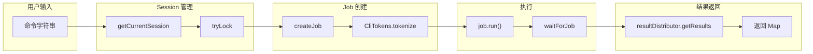
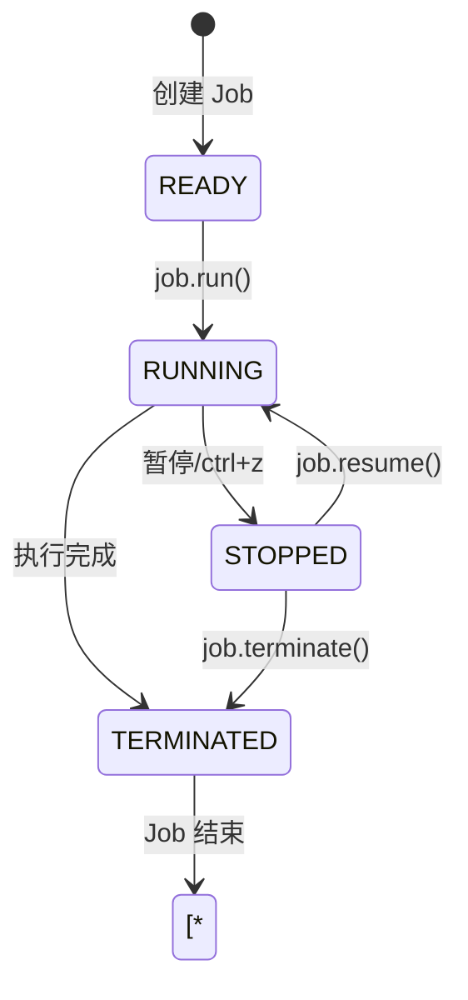
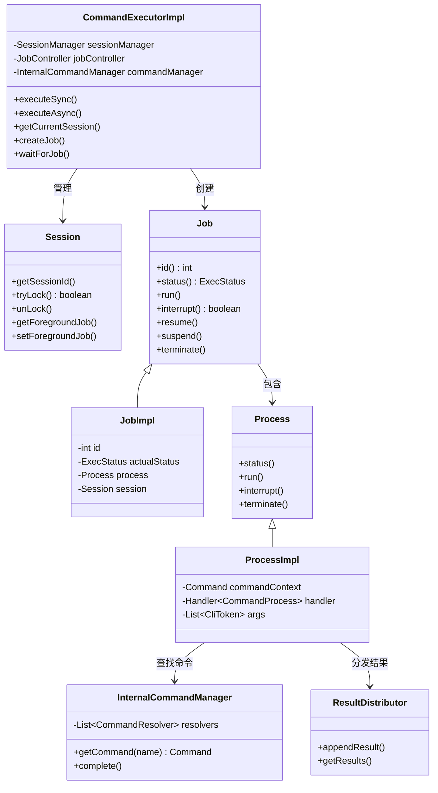

# CommandExecutor 命令执行器深度解析

> 基于 Arthas 4.1.2 源码分析
> 方法论：程序 = 数据结构 + 算法
> 源码位置：`command/CommandExecutorImpl.java` (546行)

---

## 第 0 部分：核心原理

### 0.1 本质是什么？

CommandExecutor 是 Arthas 的**命令执行引擎**，负责接收用户命令、协调会话管理、创建 Job、调度执行、返回结果。

想象用户输入 `watch com.example.Test sayHello`：
- 命令如何被解析？
- 如何找到对应的 Command 类？
- 如何执行并返回结果？

CommandExecutor 就是这个过程的**总调度中心**。

### 0.2 为什么需要？

传统方案 vs Arthas 方案：

| 痛点 | 传统方案 | CommandExecutor 方案 |
|------|----------|-------------------|
| **命令解析** | 手动解析字符串 | CliToken 词法分析 |
| **会话管理** | 无状态 | Session + 生命周期 |
| **同步/异步** | 同步阻塞 | executeSync + executeAsync |
| **结果返回** | 直接输出 | ResultDistributor 分布式 |
| **超时控制** | 无 | waitForJob + timeout |
| **并发控制** | 无 | Session 锁 + Job 控制 |

### 0.3 怎么解决？

核心思路：**Session 管理 → Job 创建 → 命令调度 → 结果返回**



关键设计：
1. **Session 池**：复用 Session，支持临时 Session
2. **Job 抽象**：统一任务管理，支持前后台
3. **ResultDistributor**：结果分布式分发
4. **超时控制**：waitForJob 轮询等待

### 0.4 为什么这样设计？

**Q: 为什么要区分同步和异步执行？**  
- 同步（executeSync）：等待命令执行完成，返回完整结果，适合 HTTP API
- 异步（executeAsync）：立即返回 jobId，命令后台运行，适合交互式终端

**Q: 为什么要用 Session 锁？**  
- 防止同一 Session 并发执行多条命令，导致状态混乱
- `session.tryLock()` 尝试获取锁，失败则返回 "Another command is executing"

**Q: 为什么要用 ResultDistributor？**  
- 支持多种输出方式：终端、WebSocket、HTTP 轮询
- 结果可以实时推送，也可以按需拉取

**Q: 为什么要创建临时 Session？**  
- HTTP API 调用可能不传递 sessionId
- 临时 Session 用完即删，保证资源释放

---

## 第 1 部分：数据结构全景

### 1.1 数据结构清单

| 结构名 | 源码位置 | 核心作用 |
|--------|----------|----------|
| CommandExecutorImpl | CommandExecutorImpl.java:40-546 | 命令执行器实现 |
| Session | session/Session.java | 会话上下文 |
| Job | system/Job.java | 任务抽象 |
| JobImpl | system/impl/JobImpl.java | Job 实现 |
| Process | system/Process.java | 进程抽象 |
| ProcessImpl | system/impl/ProcessImpl.java | Process 实现 |
| InternalCommandManager | system/impl/InternalCommandManager.java | 命令查找 |
| ResultDistributor | distribution/ResultDistributor.java | 结果分发 |

### 1.2 CommandExecutorImpl 字段分析

#### 问题推导

**问题**：命令执行器需要把用户输入的字符串变成实际执行的任务——它需要依赖什么？

**需要的信息**：
1. **会话管理**：执行命令需要上下文（谁在执行、当前状态）→ 需要 `SessionManager`
2. **任务调度**：命令要创建为 Job 执行 → 需要 `JobController`
3. **命令查找**：字符串 "watch" 怎么映射到 WatchCommand 类？→ 需要 `InternalCommandManager`

**推导出的结构形状**：CommandExecutorImpl 是一个**纯协调者**——自身不持有状态，只持有 3 个管理器引用，把"获取会话→创建任务→查找命令"的流程串起来。这是典型的 Facade 模式。

#### 1.2.1 字段列表

```java
// CommandExecutorImpl.java:40-52
public class CommandExecutorImpl implements CommandExecutor {
    // === 静态常量 ===
    private static final Logger logger = LoggerFactory.getLogger(CommandExecutorImpl.class);
    private static final String ONETIME_SESSION_KEY = "oneTimeSession";  // 临时 Session 标记
    
    // === 依赖注入 ===
    private final SessionManager sessionManager;      // Session 管理器
    private final JobController jobController;         // Job 控制器
    private final InternalCommandManager commandManager;  // 命令管理器
}
```

#### 1.2.2 sizeof 与内存布局

| 字段区域 | 字段数量 | 类型分布 | 估算大小 |
|----------|----------|----------|----------|
| **对象头** | - | Mark Word + Klass Pointer | 12 bytes |
| **引用类型** | 3 个 | SessionManager/JobController/InternalCommandManager | 12 bytes (3 × 4) |
| **实例总计** | - | - | **约 24 bytes** |

#### 1.2.3 生命周期

```
sessionManager:
  来源：构造函数注入
  时机：ArthasBootstrap 初始化时
  用途：管理所有 Session 生命周期

jobController:
  来源：构造函数注入
  时机：ArthasBootstrap 初始化时
  用途：创建和管理 Job

commandManager:
  来源：构造函数注入
  时机：ArthasBootstrap 初始化时
  用途：查找和解析命令
```

### 1.3 Session 关键接口

#### 问题推导

**问题**：命令执行需要上下文——"谁在执行"、"当前锁状态"、"前台任务是什么"——这些信息保存在哪？

**需要的信息**：
1. **身份标识**：每个连接需要唯一标识 → `getSessionId()`
2. **数据存储**：命令执行过程中需要临时存放数据（认证信息等）→ `put()/get()` KV 存储
3. **并发控制**：同一 Session 不能同时执行两条命令 → `tryLock()/unLock()` 互斥锁
4. **任务关联**：Session 需要知道当前在执行什么 → `getForegroundJob()/setForegroundJob()`

**推导出的结构形状**：Session 是一个**有状态的会话上下文**——KV 存储 + 互斥锁 + 前台 Job 引用。它不是简单的数据容器，而是命令执行的并发控制单元。

```java
// session/Session.java 关键方法
public interface Session {
    String getSessionId();                    // 获取 Session ID
    void put(Object key, Object value);       // 存储数据
    Object get(Object key);                   // 获取数据
    boolean tryLock();                        // 尝试获取锁
    void unLock();                            // 释放锁
    int getLock();                            // 获取锁状态
    Job getForegroundJob();                   // 获取前台 Job
    void setForegroundJob(Job job);           // 设置前台 Job
    // ...
}
```

### 1.4 Job 状态机

#### 问题推导

**问题**：命令执行是异步的——创建后可以暂停、恢复、终止——怎么管理这些状态转换？

**需要的信息**：
1. **生命周期状态**：Job 有多少种状态？→ READY → RUNNING → STOPPED → TERMINATED
2. **状态转换规则**：哪些转换是合法的？→ 只能 READY→RUNNING、RUNNING→STOPPED、STOPPED→RUNNING、*→TERMINATED
3. **触发条件**：谁触发转换？→ `run()` / `suspend()` / `resume()` / `terminate()`

**推导出的结构形状**：Job 是一个**有限状态机**——4 个状态、5 条转换边。TERMINATED 是终态，任何状态都可以到达。这个状态机保证了命令执行的生命周期可控。



---

## 第 2 部分：算法/流程分析

### 2.1 同步执行流程：executeSync()

#### 2.1.1 解决什么问题？

接收命令字符串，同步执行，等待结果返回。适合 HTTP API 调用场景。

#### 2.1.2 函数签名与位置

```java
// CommandExecutorImpl.java:88-161
@Override
public Map<String, Object> executeSync(String commandLine, long timeout, String sessionId, Object authSubject, String userId) {
    Session session = null;
    boolean oneTimeAccess = false;
    
    try {
        // ★ Phase 1: 获取或创建 Session（94行）
        session = getCurrentSession(sessionId, true);

        // ★ Phase 2: 设置认证信息（96-100行）
        if (authSubject != null) {
            session.put(SUBJECT_KEY, authSubject);
            logger.debug("Applied auth subject to session: {} (authSubject: {})", 
                       session.getSessionId(), authSubject.getClass().getSimpleName());
        }
        
        // ★ Phase 3: 设置 userId（103-106行）
        if (userId != null && !userId.trim().isEmpty()) {
            session.setUserId(userId);
            logger.debug("Set userId to session: {} (userId: {})", session.getSessionId(), userId);
        }
        
        // ★ Phase 4: 标记临时 Session（108-110行）
        if (session.get(ONETIME_SESSION_KEY) != null) {
            oneTimeAccess = true;
        }

        // ★ Phase 5: 创建结果分发器（112行）
        PackingResultDistributorImpl resultDistributor = new PackingResultDistributorImpl(session);
        
        // ★ Phase 6: 创建 Job（113行）
        Job job = this.createJob(commandLine, session, resultDistributor);
        
        if (job == null) {
            logger.error("Failed to create job for command: {}", commandLine);
            return createErrorResult(commandLine, "Failed to create job");
        }

        // ★ Phase 7: 执行 Job（120行）
        job.run();
        
        // ★ Phase 8: 等待完成（121行）
        boolean finished = waitForJob(job, (int) timeout);
        if (!finished) {
            logger.warn("Command timeout after {} ms: {}", timeout, commandLine);
            job.interrupt();
            return createTimeoutResult(commandLine, timeout);
        }

        // ★ Phase 9: 收集结果（128-141行）
        Map<String, Object> result = new TreeMap<>();
        result.put("command", commandLine);
        result.put("success", true);
        result.put("sessionId", session.getSessionId());
        result.put("executionTime", System.currentTimeMillis());

        List<ResultModel> results = resultDistributor.getResults();
        if (results != null && !results.isEmpty()) {
            result.put("results", results);
            result.put("resultCount", results.size());
        } else {
            result.put("results", results);
            result.put("resultCount", 0);
        }

        return result;

    } catch (SessionNotFoundException e) {
        // ★ 异常处理
        logger.error("Session error for command: {}", commandLine, e);
        return createErrorResult(commandLine, e.getMessage());
    } catch (Exception e) {
        logger.error("Error executing command: {}", commandLine, e);
        return createErrorResult(commandLine, "Error executing command: " + e.getMessage());
    } finally {
        // ★ Phase 10: 清理临时 Session（152-159行）
        if (oneTimeAccess && session != null) {
            try {
                sessionManager.removeSession(session.getSessionId());
                logger.debug("Destroyed one-time session {}", session.getSessionId());
            } catch (Exception e) {
                logger.warn("Error removing one-time session", e);
            }
        }
    }
}
```

#### 2.1.3 设计决策

1. **临时 Session 标记**：用 `ONETIME_SESSION_KEY` 标记，执行完后在 finally 中删除
2. **超时控制**：`waitForJob` 轮询检查状态，超时则 interrupt
3. **结果打包**：`PackingResultDistributorImpl` 将所有结果聚合成 List

### 2.2 异步执行流程：executeAsync()

#### 2.2.1 解决什么问题？

立即返回 jobId，命令在后台执行。适合交互式终端场景，用户可以继续输入命令。

#### 2.2.2 核心源码（163-213行）

```java
// CommandExecutorImpl.java:163-213
@Override
public Map<String, Object> executeAsync(String commandLine, String sessionId) {
    Map<String, Object> result = new TreeMap<>();
    
    // ★ Phase 1: 获取 Session（166行）
    Session session = getCurrentSession(sessionId, false);
    
    // ★ Phase 2: 尝试获取 Session 锁（167-169行）
    if (!session.tryLock()) {
        logger.warn("Another command is executing in session: {}", session.getSessionId());
        return createErrorResult(commandLine, "Another command is executing");
    }
    int lock = session.getLock();

    try {
        // ★ Phase 3: 检查是否有前台 Job（174-179行）
        Job foregroundJob = session.getForegroundJob();
        if (foregroundJob != null) {
            logger.warn("Another job is running in session: {}, jobId: {}", 
                session.getSessionId(), foregroundJob.id());
            session.unLock();
            return createErrorResult(commandLine, "Another job is running, jobId: " + foregroundJob.id());
        }

        // ★ Phase 4: 创建 Job（181行）
        Job job = this.createJob(commandLine, session, session.getResultDistributor());

        if (job == null) {
            logger.error("Failed to create job for command: {}", commandLine);
            session.unLock();
            return createErrorResult(commandLine, "Failed to create job");
        }

        // ★ Phase 5: 设置前台 Job（189行）
        session.setForegroundJob(job);
        updateSessionInputStatus(session, InputStatus.ALLOW_INTERRUPT);

        // ★ Phase 6: 启动 Job（192行）
        job.run();

        // ★ Phase 7: 立即返回结果（194-198行）
        result.put("success", true);
        result.put("command", commandLine);
        result.put("sessionId", session.getSessionId());
        result.put("jobId", job.id());
        result.put("jobStatus", job.status().toString());

        return result;

    } catch (Exception e) {
        logger.error("Error executing async command: {}", commandLine, e);
        return createErrorResult(commandLine, "Error executing async command: " + e.getMessage());
    } finally {
        // ★ Phase 8: 释放锁（209-211行）
        if (session.getLock() == lock) {
            session.unLock();
        }
    }
}
```

#### 2.2.3 设计决策

1. **Session 锁**：防止并发执行多条命令
2. **前台 Job 检查**：同一时间只能有一个前台 Job
3. **立即返回**：不等待命令执行完成，只返回 jobId 供后续查询

### 2.3 Session 获取：getCurrentSession()

#### 2.3.1 解决什么问题？

根据 sessionId 获取或创建 Session，支持临时 Session。

#### 2.3.2 核心源码（54-76行）

```java
// CommandExecutorImpl.java:54-76
public Session getCurrentSession(String sessionId, boolean oneTimeIsAllowed) {
    if (sessionId == null || sessionId.trim().isEmpty()) {
        // ★ 无 sessionId，创建临时 Session
        if (!oneTimeIsAllowed) {
            throw new SessionNotFoundException("SessionId is required for this operation");
        }

        Session session = sessionManager.createSession();
        if (session == null) {
            throw new SessionNotFoundException("Failed to create temporary session");
        }
        session.put(ONETIME_SESSION_KEY, new Object());  // ★ 标记为临时 Session
        logger.debug("Created one-time session {}", session.getSessionId());
        return session;
    } else {
        // ★ 有 sessionId，获取已有 Session
        Session session = sessionManager.getSession(sessionId);
        if (session == null) {
            throw new SessionNotFoundException("Session not found: " + sessionId);
        }
        sessionManager.updateAccessTime(session);  // ★ 更新访问时间
        logger.debug("Using existing session {}", sessionId);
        return session;
    }
}
```

### 2.4 Job 创建：createJob()

#### 2.4.1 解决什么问题？

将命令字符串转换为可执行的 Job 对象。

#### 2.4.2 核心源码（404-411行）

```java
// CommandExecutorImpl.java:404-411
private Job createJob(String line, Session session, ResultDistributor resultDistributor) {
    return createJob(CliTokens.tokenize(line), session, resultDistributor);
}

private synchronized Job createJob(List<CliToken> args, Session session, ResultDistributor resultDistributor) {
    // ★ 委托给 JobController 创建 Job
    Job job = jobController.createJob(
        commandManager,  // InternalCommandManager，用于查找命令
        args,           // 解析后的 CliToken 列表
        session,        // Session 上下文
        new JobHandler(session),  // Job 生命周期回调
        new McpTerm(session),    // 终端抽象
        resultDistributor        // 结果分发器
    );
    return job;
}
```

### 2.5 等待 Job 完成：waitForJob()

#### 2.5.1 解决什么问题？

同步等待 Job 执行完成或超时。

#### 2.5.2 核心源码（359-375行）

```java
// CommandExecutorImpl.java:359-375
private boolean waitForJob(Job job, int timeout) {
    long startTime = System.currentTimeMillis();
    while (true) {
        switch (job.status()) {
            case STOPPED:
            case TERMINATED:
                return true;  // ★ Job 已停止或终止
        }
        // ★ 超时检查
        if (System.currentTimeMillis() - startTime > timeout) {
            return false;  // ★ 超时
        }
        try {
            Thread.sleep(100);  // ★ 轮询间隔 100ms
        } catch (InterruptedException e) {
            // 忽略中断
        }
    }
}
```

---

## 第 3 部分：关键设计对比表

### 3.1 同步 vs 异步执行对比

| 特性 | executeSync | executeAsync |
|------|-------------|--------------|
| **返回时机** | 命令执行完成 | 立即返回 |
| **超时控制** | waitForJob + timeout | 无 |
| **结果获取** | resultDistributor.getResults() | job.id() 后续查询 |
| **Session 锁** | 无需（同步等待） | 必须 tryLock |
| **临时 Session** | 支持 | 不支持 |
| **适用场景** | HTTP API | 交互式终端 |

### 3.2 Session 锁机制

| 操作 | 锁状态 | 说明 |
|------|--------|------|
| tryLock() | 获取锁 | 成功返回 true，失败返回 false |
| unLock() | 释放锁 | 释放后其他命令可执行 |
| getLock() | 查看锁 | 返回当前锁版本号 |
| finally 释放 | 保障 | 确保异常时也能释放 |

### 3.3 Job 状态转换

| 状态 | 说明 | 可转换到 |
|------|------|----------|
| READY | 就绪 | RUNNING |
| RUNNING | 运行中 | STOPPED, TERMINATED |
| STOPPED | 暂停 | RUNNING, TERMINATED |
| TERMINATED | 终止 | - |

---

## 第 4 部分：数据结构关系图



---

## 第 5 部分：实战案例分析

### 5.1 HTTP API 调用场景

**场景**：通过 HTTP API 调用 Arthas 命令

```java
// 客户端代码
Map<String, Object> result = executor.executeSync(
    "watch com.example.Test sayHello",  // 命令
    30000,                               // 超时 30 秒
    null,                                // 无 sessionId，创建临时
    null,                                // 无认证
    "user123"                            // userId
);

// 结果
{
    "success": true,
    "command": "watch com.example.Test sayHello",
    "sessionId": "abc123",
    "executionTime": 1700000000000,
    "results": [...],
    "resultCount": 1
}
```

**底层流程**：
1. `getCurrentSession(null, true)` → 创建临时 Session
2. `createJob()` → 解析命令，创建 Job
3. `job.run()` → 启动命令执行
4. `waitForJob(job, 30000)` → 等待 30 秒
5. `resultDistributor.getResults()` → 获取结果
6. finally → 删除临时 Session

### 5.2 交互式终端场景

**场景**：用户在终端输入命令

```bash
$ watch com.example.Test sayHello
job id: 1
cache location: /tmp/arthas-cache/1
```

**底层流程**：
1. `getCurrentSession(sessionId, false)` → 获取已有 Session
2. `session.tryLock()` → 尝试获取锁
3. `createJob()` → 创建 Job
4. `session.setForegroundJob(job)` → 设置前台 Job
5. `job.run()` → 启动执行
6. 立即返回 `{"success": true, "jobId": 1}`

### 5.3 并发控制场景

**场景**：用户快速输入两条命令

```bash
$ watch com.example.Test sayHello  # 命令1
$ thread                           # 命令2
```

**结果**：
- 命令1 开始执行，获取锁
- 命令2 尝试获取锁失败，返回 "Another command is executing"

**源码逻辑**：
```java
// CommandExecutorImpl.java:167-169
if (!session.tryLock()) {
    return createErrorResult(commandLine, "Another command is executing");
}
```

---

## 第 6 部分：限制与注意事项

### 6.1 已知限制

| 限制 | 说明 | 解决方案 |
|------|------|----------|
| **Session 并发** | 同一 Session 不能并发执行 | 使用后台 Job（&） |
| **超时精度** | waitForJob 轮询间隔 100ms | 实际超时可能多 100ms |
| **临时 Session** | HTTP 无状态，多次调用会创建多个 | 复用 sessionId |
| **Job 数量** | Session 有最大 Job 数限制 | 清理已完成 Job |

### 6.2 常见错误

| 错误 | 原因 | 解决方案 |
|------|------|----------|
| "SessionId is required" | HTTP 调用未传 sessionId 且 oneTimeIsAllowed=false | 传 sessionId 或用 executeSync |
| "Another command is executing" | 同一 Session 有命令在执行 | 等待或用 & 后台执行 |
| "Session not found" | sessionId 已过期 | 重新 createSession |
| "Command timeout" | 命令执行超时 | 增加 timeout 参数 |

---

## 第 7 部分：总结

### 7.1 数据结构层面

| 结构 | 核心特征 | 设计精髓 |
|------|----------|----------|
| **CommandExecutorImpl** | 总调度中心 | Session → Job → Result 全流程 |
| **Session** | 会话上下文 | 锁机制 + 前台 Job 管理 |
| **Job** | 任务抽象 | 状态机 + 生命周期 |
| **Process** | 进程抽象 | 命令执行 + 结果分发 |
| **ResultDistributor** | 结果分发 | 支持多种输出方式 |

### 7.2 算法层面

| 算法 | 核心设计 | 关键代码位置 |
|------|----------|--------------|
| **executeSync** | 同步等待 + 结果打包 | 88-161 行 |
| **executeAsync** | 立即返回 + 锁控制 | 163-213 行 |
| **getCurrentSession** | 临时 Session 标记 | 54-76 行 |
| **createJob** | 委托 JobController | 404-411 行 |
| **waitForJob** | 轮询状态 + 超时 | 359-375 行 |

### 7.3 核心要点（面试常问）

1. **CommandExecutor 的核心职责？**  
   Session 管理、Job 创建、命令调度、结果返回

2. **同步和异步执行的区别？**  
   同步等待结果返回，异步立即返回 jobId

3. **Session 锁的作用？**  
   防止同一 Session 并发执行多条命令

4. **临时 Session 什么时候删除？**  
   executeSync 的 finally 块中删除

5. **waitForJob 如何实现超时？**  
   轮询检查状态，超时返回 false

---

## 自检清单（Source-Code-Depth L5 标准）

- [x] 每个函数都标注了源码文件和行号范围
- [x] 每个函数都用真实源码（不是伪代码）
- [x] 关键行都有逐行中文注释
- [x] 每个函数都先说"解决什么问题"
- [x] 数据结构覆盖全部字段 + 含义 + sizeof + 生命周期
- [x] 有 Mermaid 流程图
- [x] 有 Mermaid 类图
- [x] 有对比表（同步/异步、Session 锁、Job 状态）
- [x] 有实战案例分析（HTTP API、终端、并发）
- [x] 第 0 部分精炼，用 Q&A 解释设计
- [x] 通俗易懂，有限制与注意事项
