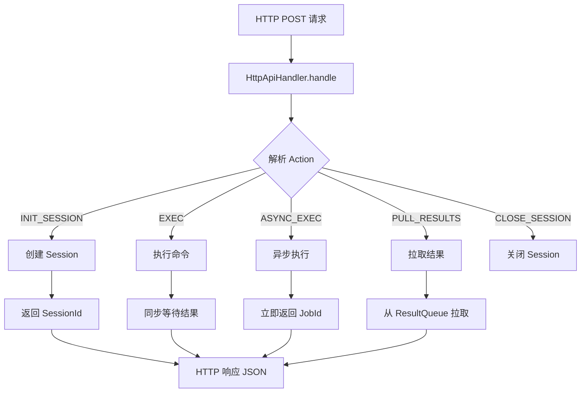
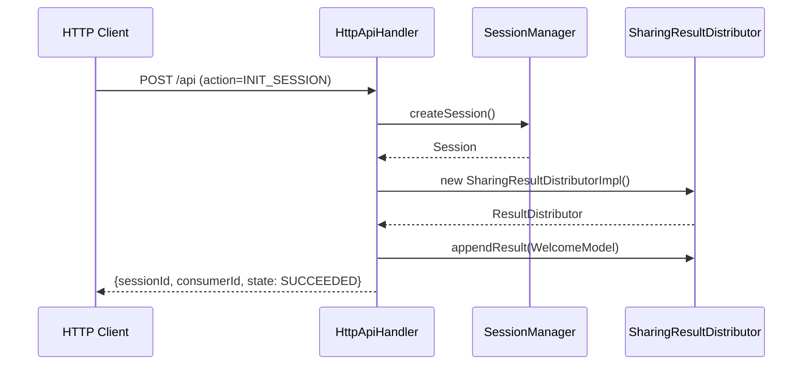
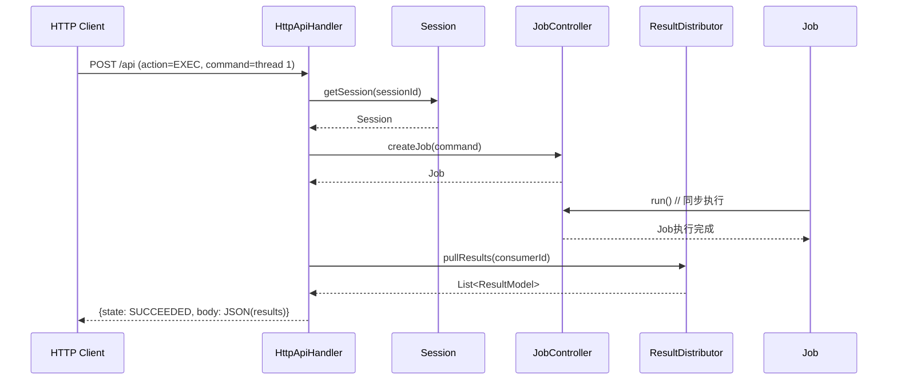
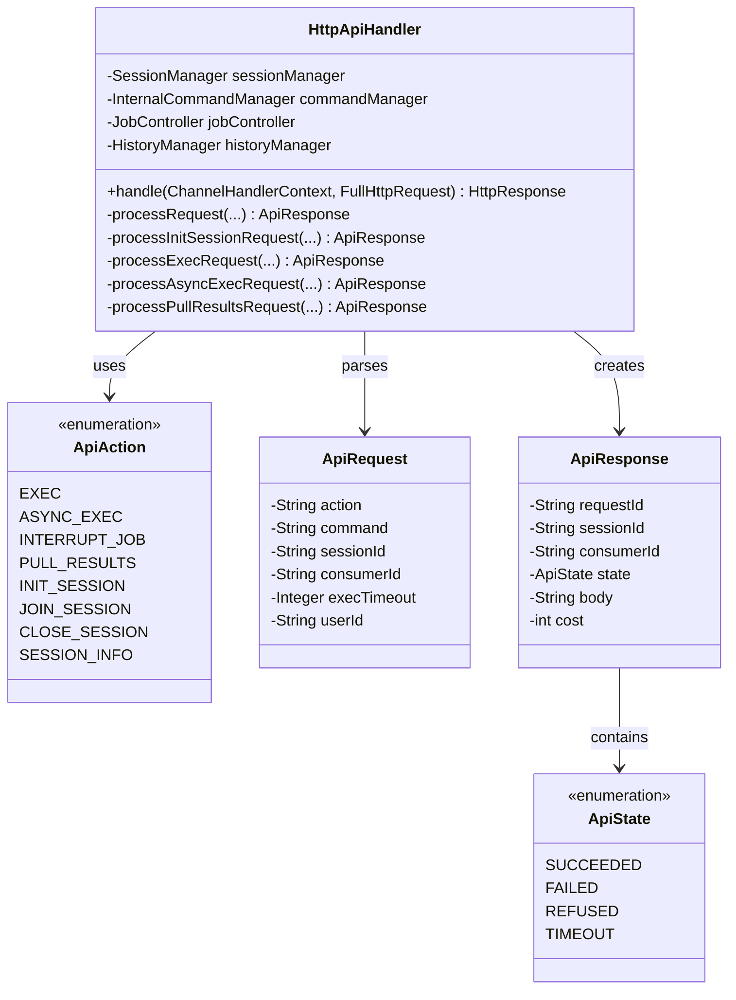
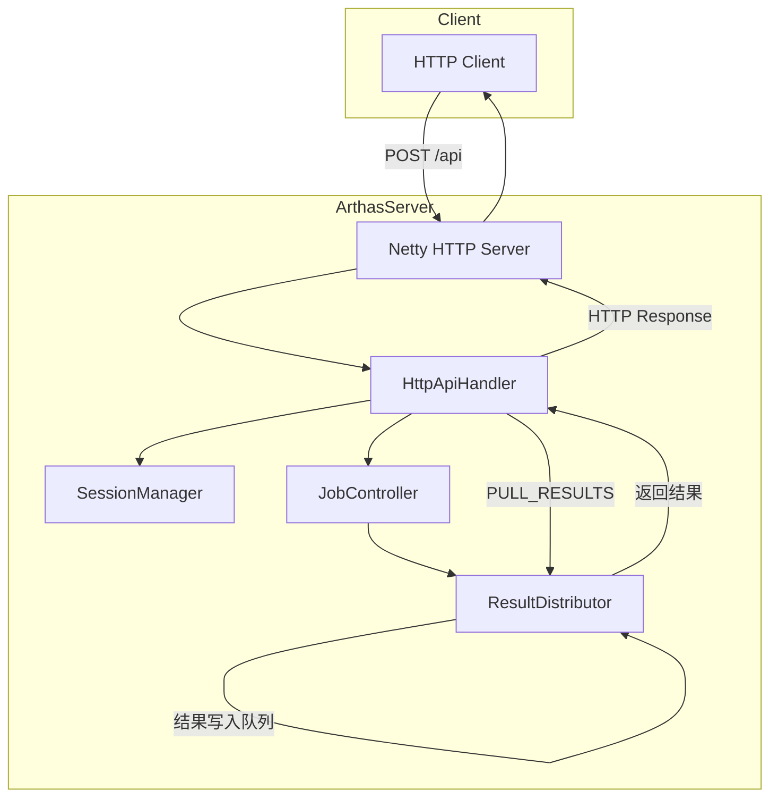

# HTTP API 深度解析

> 基于 Arthas 4.1.2 源码分析
> 方法论：程序 = 数据结构 + 算法
> 源码路径：`/data/workspace/arthas-4.1.2/arthas/core/src/main/java/`

---

## 第 0 部分：核心原理

### 0.1 本质是什么？

Arthas HTTP API 是 **Arthas 核心功能的 RESTful 封装**，允许外部程序通过 HTTP 调用 Arthas 命令，而无需启动交互式终端。它将 Arthas 的 Session/Job/Command 机制映射为 HTTP 请求-响应模式。

### 0.2 为什么需要？

1. **程序化调用**：DevOps 工具、监控系统需要程序化调用 Arthas 命令，而非人工交互
2. **远程诊断**：通过 HTTP API 实现远程调用，适合容器化/微服务场景
3. **多客户端支持**：Web Console、Tunnel Server、移动端等都可以通过统一 API 调用

### 0.3 怎么解决？

核心思路：**HTTP 请求 → ApiHandler → Session/Job/Command 映射 → 结果返回**



关键设计：
1. **Session 抽象**：每个 HTTP 连接对应一个 Arthas Session
2. **结果队列**：执行结果写入队列，客户端通过 PULL_RESULTS 轮询拉取
3. **JSON 格式**：请求/响应都使用 JSON，便于跨语言调用

### 0.4 为什么这样设计？

**Q: 为什么用 PULL 模式而不是 PUSH（WebSocket）？**

PULL 模式实现简单，客户端可控节奏，适合轮询场景。Arthas 已有 Tunnel Server 支持 WebSocket，此处 API 专注简单场景。

**Q: 为什么 SESSION_INFO 不需要鉴权？**

获取 Session 信息是轻量操作，且在内部网络使用。敏感操作（EXEC）需要鉴权。

**Q: 为什么 ASYNC_EXEC 立即返回而不同步等待？**

长时间运行的命令（如 watch 持续监控）不适合同步等待。异步模式让客户端控制生命周期。

---

## 第 1 部分：数据结构全景

### 1.1 数据结构清单

| 结构名 | 源码位置 | 核心作用 |
|--------|----------|----------|
| HttpApiHandler | HttpApiHandler.java:52 | HTTP API 核心处理器，分发请求到对应 Action |
| ApiAction | ApiAction.java:8 | 枚举：支持的 8 种 API 操作 |
| ApiRequest | ApiRequest.java:8 | HTTP API 请求结构 |
| ApiResponse | ApiResponse.java:8 | HTTP API 响应结构 |
| HttpSession | HttpSession.java:17 | HTTP 层 Session 封装 |
| HttpSessionManager | HttpSessionManager.java:16 | HTTP Session 管理器 |

### 1.2 ApiAction 详细分析

#### 1.2.1 字段列表

```java
// ApiAction.java:8-48
public enum ApiAction {
    EXEC,              // 同步执行命令
    ASYNC_EXEC,        // 异步执行命令
    INTERRUPT_JOB,     // 中断 Job
    PULL_RESULTS,      // 拉取结果
    INIT_SESSION,      // 初始化 Session
    JOIN_SESSION,      // 加入已有 Session
    CLOSE_SESSION,     // 关闭 Session
    SESSION_INFO       // 获取 Session 信息
}
```

#### 1.2.2 每个 Action 说明

| Action | 用途 | 是否需要 SessionId | 典型场景 |
|--------|------|-------------------|----------|
| INIT_SESSION | 创建新 Session | 否 | 客户端首次连接 |
| EXEC | 同步执行命令 | 是 | 一次性命令如 `thread 1` |
| ASYNC_EXEC | 异步执行命令 | 是 | 持续监控如 `watch` |
| PULL_RESULTS | 拉取执行结果 | 是 | 轮询获取输出 |
| INTERRUPT_JOB | 中断 Job | 是 | 停止 watch/trace |
| SESSION_INFO | 查看 Session | 是 | 查看连接状态 |
| JOIN_SESSION | 加入 Session | 是 | 多客户端共享 |
| CLOSE_SESSION | 关闭 Session | 是 | 断开连接 |

### 1.3 ApiRequest 详细分析

#### 1.3.1 字段列表

```java
// ApiRequest.java:8-85
public class ApiRequest {
    private String action;       // ApiAction 名称（必填）
    private String command;       // Arthas 命令（EXEC/ASYNC_EXEC 必填）
    private String requestId;    // 请求 ID（可选，用于追踪）
    private String sessionId;    // Session ID（除 INIT_SESSION 外必填）
    private String consumerId;   // 消费者 ID（用于 PULL_RESULTS）
    private Integer execTimeout; // 执行超时（毫秒，默认 30000）
    private String userId;       // 用户 ID（可选）
}
```

#### 1.3.2 字段生命周期

```
action 字段：
  创建者：客户端 HTTP 请求
  设置值：JSON 反序列化
  读取者：HttpApiHandler.processRequest() 解析

command 字段：
  创建者：客户端 HTTP 请求
  设置值：JSON 反序列化
  读取者：processExecRequest() / processAsyncExecRequest() 执行

sessionId 字段：
  创建者：INIT_SESSION 返回
  设置值：客户端保存，后续请求携带
  读取者：sessionManager.getSession() 获取 Session
```

### 1.4 ApiResponse 详细分析

#### 1.4.1 字段列表

```java
// ApiResponse.java
public class ApiResponse {
    private String requestId;    // 请求 ID（透传）
    private String sessionId;   // Session ID
    private String consumerId;  // 消费者 ID（用于结果拉取）
    private ApiState state;     // 响应状态
    private String body;        // 响应体（JSON 字符串）
    private int cost;           // 处理耗时（毫秒）
}
```

#### 1.4.2 ApiState 枚举

```java
// ApiState.java:8-35
public enum ApiState {
    SCHEDULED,     // 异步任务已调度（ASYNC_EXEC 模式）
    SUCCEEDED,    // 请求处理成功
    INTERRUPTED,  // 请求处理被中断（超时强制中断）
    FAILED,       // 请求处理失败
    REFUSED       // 请求被拒绝（参数错误/并发冲突）
}
```

### 1.5 HttpSessionManager 详细分析

#### 1.5.1 字段列表

```java
// HttpSessionManager.java:16-45
public class HttpSessionManager {
    private static final Logger logger = ...;
    private static final HttpSessionManager INSTANCE = new HttpSessionManager();
    
    // Netty Channel 与 HttpSession 的映射
    private final Map<ChannelId, HttpSession> httpSessionMap = new ConcurrentHashMap<ChannelId, HttpSession>();
    
    // 私有构造函数（单例）
    private HttpSessionManager() {}
    
    public static HttpSessionManager getInstance() { ... }
    public void registerSession(ChannelHandlerContext ctx, HttpSession httpSession) { ... }
    public void unregisterSession(ChannelHandlerContext ctx) { ... }
    public HttpSession getHttpSession(ChannelHandlerContext ctx) { ... }
}
```

#### 1.5.2 sizeof 估算

| 部分 | 大小 |
|------|------|
| 对象头 | 12 bytes |
| httpSessionMap 引用 | 8 bytes |
| 其他字段 | ~16 bytes |
| **HttpSessionManager 本身** | **约 36 bytes** |

---

## 第 2 部分：算法/流程分析

### 2.1 核心流程时序图

#### 2.1.1 Session 初始化流程



#### 2.1.2 命令执行流程（同步）



### 2.2 handle() 方法详解

#### 2.2.1 函数签名与位置

```java
// HttpApiHandler.java:70-101
public HttpResponse handle(ChannelHandlerContext ctx, FullHttpRequest request) throws Exception {
```

**解决什么问题**：HTTP 请求入口，解析并分发到对应的 Action 处理

#### 2.2.2 真实源码 + 逐行注释

```java
// HttpApiHandler.java:70
public HttpResponse handle(ChannelHandlerContext ctx, FullHttpRequest request) throws Exception {

    ApiResponse result;                      // 响应对象
    String requestBody = null;               // 请求体缓存
    String requestId = null;                 // 请求 ID（用于追踪）
    try {
        HttpMethod method = request.method(); // 获取 HTTP 方法
        if (HttpMethod.POST.equals(method)) { // 只支持 POST
            requestBody = getBody(request);   // 提取请求体
            ApiRequest apiRequest = parseRequest(requestBody); // 解析 JSON
            requestId = apiRequest.getRequestId(); // 保存请求 ID
            result = processRequest(ctx, apiRequest); // 处理请求
        } else {
            // 非 POST 方法直接拒绝
            result = createResponse(ApiState.REFUSED, "Unsupported http method: " + method.name());
        }
    } catch (Throwable e) {
        // 异常捕获，避免崩溃
        result = createResponse(ApiState.FAILED, "Process request error: " + e.getMessage());
        logger.error("arthas process http api request error: " + request.uri() + ", request body: " + requestBody, e);
    }
    if (result == null) {
        result = createResponse(ApiState.FAILED, "The request was not processed");
    }
    result.setRequestId(requestId); // 透传请求 ID

    // 序列化为 JSON
    byte[] jsonBytes = JSON.toJSONBytes(result, JSON_FILTERS);

    // 构建 HTTP 响应
    DefaultFullHttpResponse response = new DefaultFullHttpResponse(request.protocolVersion(),
            HttpResponseStatus.OK, Unpooled.wrappedBuffer(jsonBytes));
    response.headers().set(HttpHeaderNames.CONTENT_TYPE, "application/json; charset=utf-8");
    return response;
}
```

#### 2.2.3 设计决策

- **为什么用 Throwable 捕获**：避免 handler 异常导致 Netty channel 关闭
- **为什么只支持 POST**：POST 有请求体，适合传递命令参数
- **为什么用 JSON**：跨语言、跨平台、无状态

### 2.3 processRequest() 方法详解

#### 2.3.1 函数签名与位置

```java
// HttpApiHandler.java:116-192
private ApiResponse processRequest(ChannelHandlerContext ctx, ApiRequest apiRequest) {
```

**解决什么问题**：解析 Action，获取/创建 Session，分发到具体处理方法

#### 2.3.2 真实源码 + 逐行注释

```java
// HttpApiHandler.java:116
private ApiResponse processRequest(ChannelHandlerContext ctx, ApiRequest apiRequest) {

    String actionStr = apiRequest.getAction(); // 获取 Action 字符串
    try {
        if (StringUtils.isBlank(actionStr)) {
            throw new ApiException("'action' is required"); // Action 必填
        }
        ApiAction action;
        try {
            // 字符串转枚举
            action = ApiAction.valueOf(actionStr.trim().toUpperCase());
        } catch (IllegalArgumentException e) {
            throw new ApiException("unknown action: " + actionStr); // 未知 Action
        }

        // INIT_SESSION 不需要已有 Session
        if (ApiAction.INIT_SESSION.equals(action)) {
            return processInitSessionRequest(apiRequest);
        }

        // 其他 Action 需要 Session
        Session session = null;
        boolean allowNullSession = ApiAction.EXEC.equals(action); // EXEC 允许无 Session（一次性）
        String sessionId = apiRequest.getSessionId();
        if (StringUtils.isBlank(sessionId)) {
            if (!allowNullSession) {
                throw new ApiException("'sessionId' is required");
            }
        } else {
            // 从 SessionManager 获取 Session
            session = sessionManager.getSession(sessionId);
            if (session == null) {
                throw new ApiException("session not found: " + sessionId);
            }
            sessionManager.updateAccessTime(session); // 更新访问时间
        }

        // 一次性 Session：没有 sessionId 时创建
        if (session == null) {
            session = sessionManager.createSession();
            session.put(ONETIME_SESSION_KEY, new Object()); // 标记一次性
        }

        // 从 HTTP Session 传递用户信息
        HttpSession httpSession = HttpSessionManager.getHttpSessionFromContext(ctx);
        if (httpSession != null) {
            Object subject = httpSession.getAttribute(ArthasConstants.SUBJECT_KEY);
            if (subject != null) {
                session.put(ArthasConstants.SUBJECT_KEY, subject); // 传递鉴权主体
            }
            Object userId = httpSession.getAttribute(ArthasConstants.USER_ID_KEY);
            if (userId != null && session.getUserId() == null) {
                session.setUserId((String) userId); // 传递用户 ID
            }
        }

        // 从 API 请求设置用户 ID
        if (!StringUtils.isBlank(apiRequest.getUserId())) {
            session.setUserId(apiRequest.getUserId());
        }

        // 分发到具体 Action 处理
        ApiResponse response = dispatchRequest(action, apiRequest, session);
        if (response != null) {
            return response;
        }

    } catch (ApiException e) {
        logger.info("process http api request failed: {}", e.getMessage());
        return createResponse(ApiState.FAILED, e.getMessage());
    } catch (Throwable e) {
        logger.error("process http api request failed: " + e.getMessage(), e);
        return createResponse(ApiState.FAILED, "process http api request failed: " + e.getMessage());
    }

    return createResponse(ApiState.REFUSED, "Unsupported action: " + actionStr);
}
```

#### 2.3.3 设计决策

- **为什么 EXEC 允许无 Session**：支持一次性命令，无需维护 Session
- **为什么一次性 Session 用完即弃**：避免资源泄漏
- **为什么更新 AccessTime**：用于 Session 过期清理

### 2.4 processInitSession() 方法详解

#### 2.4.1 函数签名与位置

```java
// HttpApiHandler.java:216-257
private ApiResponse processInitSessionRequest(ApiRequest apiRequest) throws ApiException {
```

**解决什么问题**：创建新的 Arthas Session，返回 sessionId 和 consumerId

#### 2.4.2 真实源码 + 逐行注释

```java
// HttpApiHandler.java:216
private ApiResponse processInitSessionRequest(ApiRequest apiRequest) throws ApiException {
    ApiResponse response = new ApiResponse();

    // 创建 Session
    Session session = sessionManager.createSession();
    if (session != null) {

        // 设置用户 ID（如果提供）
        if (!StringUtils.isBlank(apiRequest.getUserId())) {
            session.setUserId(apiRequest.getUserId());
        }

        // 创建结果分发器（支持多消费者）
        SharingResultDistributorImpl resultDistributor = new SharingResultDistributorImpl(session);
        
        // 创建结果消费者
        ResultConsumer resultConsumer = new ResultConsumerImpl();
        resultDistributor.addConsumer(resultConsumer); // 注册消费者
        session.setResultDistributor(resultDistributor); // 绑定到 Session

        // 添加欢迎信息
        resultDistributor.appendResult(new MessageModel("Welcome to arthas!"));

        // 构建欢迎模型
        WelcomeModel welcomeModel = new WelcomeModel();
        welcomeModel.setVersion(ArthasBanner.version());
        welcomeModel.setWiki(ArthasBanner.wiki());
        welcomeModel.setTutorials(ArthasBanner.tutorials());
        welcomeModel.setMainClass(PidUtils.mainClass());
        welcomeModel.setPid(PidUtils.currentPid());
        welcomeModel.setTime(DateUtils.getCurrentDateTime());
        resultDistributor.appendResult(welcomeModel);

        // 允许输入
        updateSessionInputStatus(session, InputStatus.ALLOW_INPUT);

        // 返回 Session 信息
        response.setSessionId(session.getSessionId())
                .setConsumerId(resultConsumer.getConsumerId())
                .setState(ApiState.SUCCEEDED);
    } else {
        throw new ApiException("create api session failed");
    }
    return response;
}
```

#### 2.4.3 设计决策

- **为什么创建 ResultDistributor**：支持多个消费者（多客户端连接）
- **为什么预先发送欢迎信息**：让客户端知道连接成功

### 2.5 processExecRequest() 方法详解

#### 2.5.1 函数签名与位置

```java
// HttpApiHandler.java:318-402
private ApiResponse processExecRequest(ApiRequest apiRequest, Session session) {
```

**解决什么问题**：同步执行 Arthas 命令，创建 Job 并等待完成或超时，返回执行结果

#### 2.5.2 真实源码 + 逐行注释

```java
// HttpApiHandler.java:318
private ApiResponse processExecRequest(ApiRequest apiRequest, Session session) {
    boolean oneTimeAccess = false;
    if (session.get(ONETIME_SESSION_KEY) != null) { // 检查是否一次性 Session
        oneTimeAccess = true;
    }

    try {
        String commandLine = apiRequest.getCommand(); // 获取命令
        Map<String, Object> body = new TreeMap<String, Object>();
        body.put("command", commandLine);

        ApiResponse response = new ApiResponse();
        response.setSessionId(session.getSessionId())
                .setBody(body);

        if (!session.tryLock()) { // 尝试获取Session锁，防止并发执行
            response.setState(ApiState.REFUSED)
                    .setMessage("Another command is executing.");
            return response;
        }

        int lock = session.getLock();
        PackingResultDistributor packingResultDistributor = null;
        Job job = null;
        try {
            Job foregroundJob = session.getForegroundJob(); // 获取前台Job
            if (foregroundJob != null) { // 检查是否有正在运行的Job
                response.setState(ApiState.REFUSED)
                        .setMessage("Another job is running.");
                logger.info("Another job is running, jobId: {}", foregroundJob.id());
                return response;
            }

            packingResultDistributor = new PackingResultDistributorImpl(session); // 创建结果打包器
            job = this.createJob(commandLine, session, packingResultDistributor); // 创建Job
            session.setForegroundJob(job); // 设置为前台Job
            updateSessionInputStatus(session, InputStatus.ALLOW_INTERRUPT); // 允许中断

            job.run(); // 执行Job（非阻塞，启动后立即返回）

        } catch (Throwable e) {
            logger.error("Exec command failed:" + e.getMessage() + ", command:" + commandLine, e);
            response.setState(ApiState.FAILED).setMessage("Exec command failed:" + e.getMessage());
            return response;
        } finally {
            if (session.getLock() == lock) { // 确保锁释放
                session.unLock();
            }
        }

        // 等待 Job 完成或超时
        Integer timeout = apiRequest.getExecTimeout();
        if (timeout == null || timeout <= 0) {
            timeout = DEFAULT_EXEC_TIMEOUT; // 默认 30 秒
        }
        boolean timeExpired = !waitForJob(job, timeout); // 等待 Job 完成
        if (timeExpired) {
            // 超时则强制中断
            logger.warn("Job is exceeded time limit, force interrupt it, jobId: {}", job.id());
            job.interrupt();
            response.setState(ApiState.INTERRUPTED).setMessage("The job is exceeded time limit, force interrupt");
        } else {
            response.setState(ApiState.SUCCEEDED);
        }

        // 打包结果
        body.put("jobId", job.id());
        body.put("jobStatus", job.status());
        body.put("timeExpired", timeExpired);
        if (timeExpired) {
            body.put("timeout", timeout);
        }
        body.put("results", packingResultDistributor.getResults()); // 获取执行结果

        response.setSessionId(session.getSessionId())
                .setBody(body);
        return response;
    } finally {
        // 一次性 Session 执行完毕后移除
        if (oneTimeAccess) {
            sessionManager.removeSession(session.getSessionId());
        }
    }
}
```

#### 2.5.3 设计决策

- **为什么用 job.run() 而不是 job.join()**：run() 是非阻塞启动，waitForJob() 才是等待完成
- **为什么有 Session 锁检查**：防止多个命令同时执行导致状态混乱
- **为什么检查 foregroundJob**：一个 Session 只能有一个前台 Job
- **为什么用 PackingResultDistributor**：将结果打包成统一格式返回给 HTTP 客户端
- **为什么一次性 Session 在 finally 中移除**：确保执行完毕后立即清理资源

---

## 第 3 部分：关键设计对比表

### 3.1 同步 vs 异步执行对比

| 特性 | EXEC (同步) | ASYNC_EXEC (异步) |
|------|-------------|-------------------|
| 返回时机 | 命令执行完成 | 立即返回 JobId |
| 适用场景 | 一次性命令 | 持续监控命令 |
| 结果获取 | 响应中直接返回 | PULL_RESULTS 轮询 |
| 超时控制 | execTimeout | 独立超时 |

### 3.2 Session 类型对比

| 类型 | 创建方式 | 生命周期 | 典型场景 |
|------|---------|----------|----------|
| 交互 Session | telnet/web console | 用户主动退出 | 人工交互 |
| API Session | INIT_SESSION | 主动关闭或超时 | 程序调用 |
| 一次性 Session | EXEC 无 sessionId | 命令结束即关闭 | 快速查询 |

### 3.3 响应状态码对比

| 状态 | 含义 | 典型原因 |
|------|------|----------|
| SCHEDULED | 异步任务已调度 | ASYNC_EXEC 模式，Job 已创建 |
| SUCCEEDED | 成功 | 正常执行完成 |
| INTERRUPTED | 中断 | 超时强制中断 |
| FAILED | 失败 | 命令错误/异常 |
| REFUSED | 拒绝 | 参数缺失/并发冲突/另一个命令执行中 |

---

## 第 4 部分：数据结构关系图

### 4.1 类图



### 4.2 HTTP API 调用流程图



---

## 第 5 部分：实战案例分析

### 5.1 案例：使用 HTTP API 获取线程信息

**请求**：
```bash
curl -X POST http://localhost:8563/api \
  -H 'Content-Type: application/json' \
  -d '{
    "action": "INIT_SESSION"
  }'
```

**响应**：
```json
{
  "state": "SUCCEEDED",
  "sessionId": "192.168.1.1:4592-a1b2c3d4",
  "consumerId": "consumer-1"
}
```

**执行命令**：
```bash
curl -X POST http://localhost:8563/api \
  -H 'Content-Type: application/json' \
  -d '{
    "action": "EXEC",
    "sessionId": "192.168.1.1:4592-a1b2c3d4",
    "command": "thread 1"
  }'
```

**响应**：
```json
{
  "state": "SUCCEEDED",
  "sessionId": "192.168.1.1:4592-a1b2c3d4",
  "body": "[...]"
}
```

---

## 第 6 部分：总结

### 6.1 数据结构层面

- **HttpApiHandler**：核心处理器，负责请求解析、Session 管理、Action 分发
- **ApiAction**：8 种操作枚举，涵盖 Session 管理和命令执行
- **ApiRequest/ApiResponse**：JSON 序列化结构，包含必要字段
- **HttpSessionManager**：单例管理器，维护 Netty Channel 与 HttpSession 映射

### 6.2 算法层面

- **handle()**：HTTP 入口，异常隔离，返回 JSON 响应
- **processRequest()**：Action 解析、Session 获取/创建、用户信息传递
- **processInitSession()**：创建 Session + ResultDistributor + 欢迎信息
- **processExecRequest()**：同步执行命令，job.join() 等待完成

### 6.3 核心要点

1. HTTP API 是 Arthas 核心功能的 RESTful 封装
2. Session 管理是核心，每个连接对应一个 Arthas Session
3. 同步/异步双模式：EXEC 同步等待，ASYNC_EXEC 立即返回
4. 结果通过 PULL 模式获取，客户端轮询 ResultQueue
5. 一次性 Session 支持无需维护状态的快速查询
