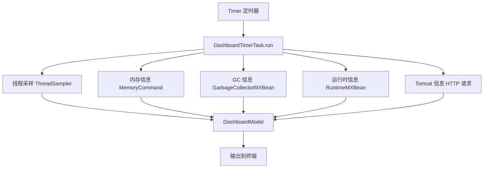
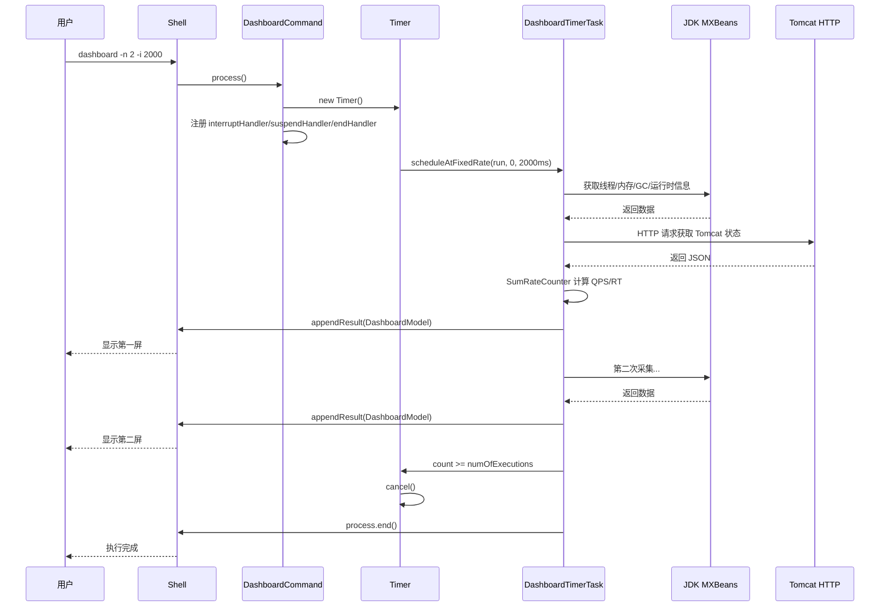
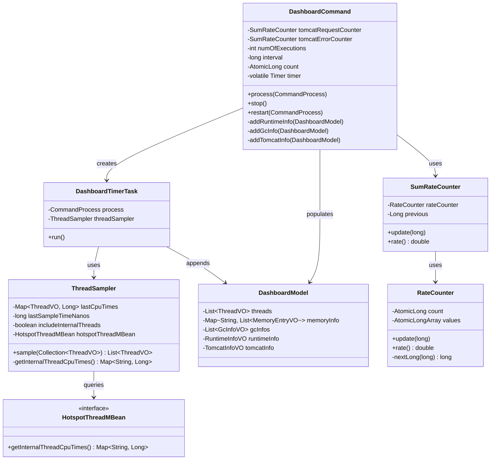
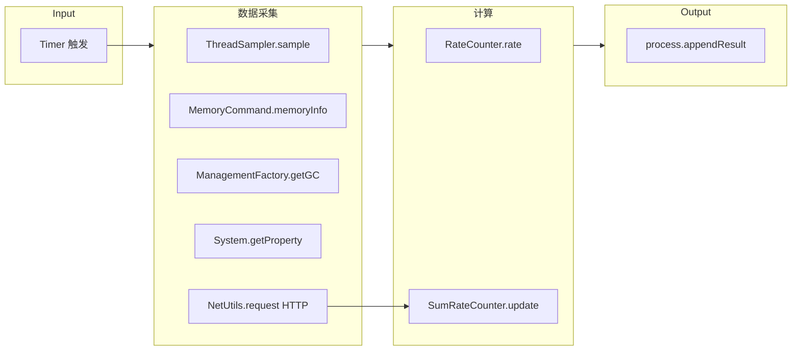

# DashboardCommand 深度解析

> 基于 Arthas 4.1.2 源码分析
> 方法论：程序 = 数据结构 + 算法
> 源码路径：`/data/workspace/arthas-4.1.2/arthas/core/src/main/java/`

---

## 第 0 部分：核心原理

### 0.1 本质是什么？

Dashboard 是 Arthas 的**实时监控面板**，定期采集并展示 JVM 的多维度运行时信息：线程状态、内存使用、GC 情况、系统负载、Tomcat 指标等。

### 0.2 为什么需要？

| 痛点 | 传统方案 | Dashboard 方案 |
|------|----------|---------------|
| 无法实时观察 | jstat/jmap 手工轮询 | 定时自动刷新 |
| 信息分散 | 多个工具来回切换 | 一屏展示所有关键指标 |
| 无法长时间观察 | 瞬时数据 | 持续监控 + 多次采样 |

### 0.3 怎么解决？

核心思路：**Timer 定时任务 → 多维度数据采集 → 周期性输出**



关键设计：
1. **Timer 定时驱动**：每 interval 毫秒执行一次数据采集
2. **多维度采集**：线程、内存、GC、运行时、Tomcat（可选）
3. **Handler 机制**：支持 ctrl-C 中断、suspend/resume、q 退出

### 0.4 为什么这样设计？

**Q: 为什么用 Timer 而不是 Thread + while 循环？**

Timer 是 JDK 提供的标准定时任务框架，支持：
- `scheduleAtFixedRate` 保证固定间隔
- `cancel()` 优雅停止
- daemon 线程不阻塞 JVM 退出

**Q: 为什么 Tomcat 信息采集用 HTTP 而不是 JMX？**

Tomcat 默认不暴露 JMX Port，需要额外配置。HTTP API 是更通用的方案，Tomcat 8+ 自带 `/manager/status` 接口。

**Q: 为什么用 SumRateCounter 计算 QPS？**

Tomcat 返回的是累计请求数（如 1000、1005、1010），需要计算差值（5、5、5）才能得到 QPS。SumRateCounter 自动处理增量计算。

---

## 第 1 部分：数据结构全景

### 1.1 数据结构清单

| 结构名 | 源码位置 | 核心作用 |
|--------|----------|----------|
| DashboardCommand | monitor200/DashboardCommand.java:46 | 主命令类，管理 Timer 和数据采集 |
| DashboardTimerTask | DashboardCommand.java:218 | TimerTask 子类，执行具体数据采集 |
| DashboardModel | model/DashboardModel.java | 存储所有采集数据 |
| RuntimeInfoVO | model/RuntimeInfoVO.java | 运行时信息（OS/Java版本/负载） |
| GcInfoVO | model/GcInfoVO.java | GC 信息（次数/耗时） |
| TomcatInfoVO | model/TomcatInfoVO.java | Tomcat 信息（线程池/Connector） |
| ThreadSampler | util/ThreadSampler.java:22 | 线程 CPU 采样器（两次采样差值） |
| SumRateCounter | util/metrics/SumRateCounter.java | 速率计算器（累计→增量） |
| RateCounter | util/metrics/RateCounter.java | 滑动窗口速率计算（Reservoir Sampling） |
| HotspotThreadMBean | sun.management.HotspotThreadMBean | 获取 JVM 内部线程 CPU 时间 |

### 1.2 DashboardCommand 详细分析

#### 1.2.1 字段列表

```java
// DashboardCommand.java:46-60
public class DashboardCommand extends AnnotatedCommand {

    private static final Logger logger = LoggerFactory.getLogger(DashboardCommand.class);

    // Tomcat 请求速率计数器（QPS 计算）
    private SumRateCounter tomcatRequestCounter = new SumRateCounter();
    private SumRateCounter tomcatErrorCounter = new SumRateCounter();
    private SumRateCounter tomcatReceivedBytesCounter = new SumRateCounter();
    private SumRateCounter tomcatSentBytesCounter = new SumRateCounter();

    private int numOfExecutions = Integer.MAX_VALUE;  // 执行次数（-n 参数）

    private long interval = 5000;  // 采样间隔（-i 参数，毫秒）

    private final AtomicLong count = new AtomicLong(0);  // 当前执行计数
    private volatile Timer timer;  // 定时器（可 volatile 保证可见性）
}
```

#### 1.2.2 字段生命周期

```
timer 字段：
  创建者：process() 方法（第 79 行）
  设置值：new Timer("Timer-for-arthas-dashboard-" + session.getSessionId(), true)
  读取者：stop()/restart() 方法
  销毁者：stop() 方法中 timer.cancel()

count 字段：
  创建者：构造函数（AtomicLong(0)）
  更新者：DashboardTimerTask.run() 中 count.getAndIncrement()
  重置者：无（每次命令独立）

numOfExecutions 字段：
  创建者：setNumOfExecutions()（CLI 参数注入）
  读取者：DashboardTimerTask.run() 中判断是否达到次数
```

#### 1.2.3 参数说明

| 参数 | 短名称 | 默认值 | 说明 |
|------|--------|--------|------|
| number-of-execution | -n | Integer.MAX_VALUE | 执行次数，达到后自动停止 |
| interval | -i | 5000 | 采样间隔（毫秒） |

### 1.3 DashboardTimerTask 详细分析

#### 1.3.1 内部类结构

```java
// DashboardCommand.java:218-270
private class DashboardTimerTask extends TimerTask {
    private CommandProcess process;  // 命令进程（用于输出结果）
    private ThreadSampler threadSampler;  // 线程采样器

    public DashboardTimerTask(CommandProcess process) {
        this.process = process;
        this.threadSampler = new ThreadSampler();  // 每个任务独立采样器
    }

    @Override
    public void run() {  // 核心采集逻辑
        // ... 采集逻辑
    }
}
```

#### 1.3.2 sizeof 估算

| 部分 | 大小 |
|------|------|
| 对象头 | 12 bytes |
| process 引用 | 8 bytes |
| threadSampler 引用 | 8 bytes |
| TimerTask 父类 | 16 bytes |
| **DashboardTimerTask 本身** | **约 44 bytes** |

### 1.4 RateCounter 详细分析（滑动窗口速率计算）

#### 1.4.1 字段列表

```java
// RateCounter.java:18-23
public class RateCounter {
    private static final int BITS_PER_LONG = 63;
    public static final int DEFAULT_SIZE = 5;  // 默认窗口大小

    private final AtomicLong count = new AtomicLong();  // 已更新次数
    private final AtomicLongArray values;  // 滑动窗口数组
}
```

#### 1.4.2 算法设计

```java
// RateCounter.java:45-55
public void update(long value) {
    final long c = count.incrementAndGet();  // 原子递增
    if (c <= values.length()) {
        // 窗口未满，直接填充
        values.set((int) c - 1, value);
    } else {
        // 窗口已满，使用 Reservoir Sampling 随机替换
        final long r = nextLong(c);
        if (r < values.length()) {
            values.set((int) r, value);
        }
    }
}
```

**核心算法**：Reservoir Sampling（蓄水池采样）
- 当窗口未满时，依次填满数组
- 当窗口已满时，每个新元素有 `size/c` 概率替换数组中随机位置
- 这样保证数组中每个位置被选中的概率相等

#### 1.4.3 rate() 方法

```java
// RateCounter.java:57-72
public double rate() {
    long c = count.get();
    int countLength = 0;
    long sum = 0;
    if (c > values.length()) {
        countLength = values.length();  // 窗口已满
    } else {
        countLength = (int) c;  // 窗口未满
    }

    for (int i = 0; i < countLength; ++i) {
        sum += values.get(i);
    }

    return sum / (double) countLength;  // 计算平均速率
}
```

---

## 第 2 部分：算法/流程分析

### 2.1 核心流程时序图



### 2.2 process() 方法详解

#### 2.2.1 函数签名与位置

```java
// DashboardCommand.java:76-109
@Override
public void process(final CommandProcess process) {
```

**解决什么问题**：命令入口，初始化 Timer，注册各种 Handler（中断/挂起/退出）

#### 2.2.2 真实源码 + 逐行注释

```java
// DashboardCommand.java:76
@Override
public void process(final CommandProcess process) {

    Session session = process.session();  // 获取 Session
    // 创建 Timer，daemon 线程不阻塞 JVM 退出
    timer = new Timer("Timer-for-arthas-dashboard-" + session.getSessionId(), true);

    // 注册 Ctrl-C 中断处理器
    process.interruptHandler(new DashboardInterruptHandler(process, timer));

    /*
     * 通过 handle 回调，在 suspend 和 end 时停止 timer，resume 时重启 timer
     */
    // 挂起时停止
    Handler<Void> stopHandler = new Handler<Void>() {
        @Override
        public void handle(Void event) {
            stop();  // 停止 Timer
        }
    };
    // 恢复时重启
    Handler<Void> restartHandler = new Handler<Void>() {
        @Override
        public void handle(Void event) {
            restart(process);  // 重启 Timer
        }
    };
    process.suspendHandler(stopHandler);   // 注册挂起处理器
    process.resumeHandler(restartHandler); // 注册恢复处理器
    process.endHandler(stopHandler);      // 结束时停止

    // q 退出支持
    process.stdinHandler(new QExitHandler(process));

    // 启动定时任务
    timer.scheduleAtFixedRate(new DashboardTimerTask(process), 0, getInterval());
}
```

#### 2.2.3 设计决策

- **为什么注册多个 Handler**：支持多种退出方式（Ctrl-C、suspend、end、q）
- **为什么用 daemon Timer**：避免 Timer 线程阻止 JVM 退出
- **为什么 suspend 时停止 Timer**：暂停输出但保持连接
- **为什么 restart 时重启 Timer**：恢复监控输出

### 2.3 DashboardTimerTask.run() 方法详解

#### 2.3.1 函数签名与位置

```java
// DashboardCommand.java:228-269
@Override
public void run() {
```

**解决什么问题**：定时采集多维度数据，输出到终端

#### 2.3.2 真实源码 + 逐行注释

```java
// DashboardCommand.java:228
@Override
public void run() {
    try {
        // 检查执行次数是否达到上限
        if (count.get() >= getNumOfExecutions()) {
            timer.cancel();      // 停止定时器
            timer.purge();      // 清除已取消任务
            process.end(0, "Process ends after " + getNumOfExecutions() + " time(s).");
            return;
        }

        DashboardModel dashboardModel = new DashboardModel();

        // 1. 线程采样
        List<ThreadVO> threads = ThreadUtil.getThreads();
        dashboardModel.setThreads(threadSampler.sample(threads));

        // 2. 内存信息（复用 MemoryCommand 逻辑）
        dashboardModel.setMemoryInfo(MemoryCommand.memoryInfo());

        // 3. GC 信息
        addGcInfo(dashboardModel);

        // 4. 运行时信息
        addRuntimeInfo(dashboardModel);

        // 5. Tomcat 信息（可能失败，吞掉异常）
        try {
            addTomcatInfo(dashboardModel);
        } catch (Throwable e) {
            logger.error("try to read tomcat info error", e);
        }

        // 输出结果到终端
        process.appendResult(dashboardModel);

        count.getAndIncrement();     // 计数 +1
        process.times().incrementAndGet();  // 记录执行次数
    } catch (Throwable e) {
        String msg = "process dashboard failed: " + e.getMessage();
        logger.error(msg, e);
        process.end(-1, msg);  // 出错时结束
    }
}
```

#### 2.3.3 设计决策

- **为什么先检查 count 再执行**：确保达到次数后立即停止，不多执行一次
- **为什么 Tomcat 信息用 try-catch**：Tomcat 可能未启动或无权限，失败不影响其他指标
- **为什么复用 MemoryCommand.memoryInfo()**：保持与 memory 命令数据一致

### 2.4 addRuntimeInfo() 方法详解

#### 2.4.1 函数签名与位置

```java
// DashboardCommand.java:135-146
private static void addRuntimeInfo(DashboardModel dashboardModel) {
```

**解决什么问题**：获取 JVM 运行时环境信息（OS、Java 版本、负载、运行时长）

#### 2.4.2 真实源码 + 逐行注释

```java
// DashboardCommand.java:135
private static void addRuntimeInfo(DashboardModel dashboardModel) {
    RuntimeInfoVO runtimeInfo = new RuntimeInfoVO();
    runtimeInfo.setOsName(System.getProperty("os.name"));      // 操作系统名
    runtimeInfo.setOsVersion(System.getProperty("os.version")); // 操作系统版本
    runtimeInfo.setJavaVersion(System.getProperty("java.version")); // Java 版本
    runtimeInfo.setJavaHome(System.getProperty("java.home"));      // JAVA_HOME
    // 系统负载（1 分钟平均），-1 表示不可用
    runtimeInfo.setSystemLoadAverage(ManagementFactory.getOperatingSystemMXBean().getSystemLoadAverage());
    // CPU 核心数
    runtimeInfo.setProcessors(Runtime.getRuntime().availableProcessors());
    // JVM 运行时长（秒）
    runtimeInfo.setUptime(ManagementFactory.getRuntimeMXBean().getUptime() / 1000);
    runtimeInfo.setTimestamp(System.currentTimeMillis()); // 时间戳
    dashboardModel.setRuntimeInfo(runtimeInfo);
}
```

#### 2.4.3 设计决策

- **为什么用 static 方法**：无状态，纯数据采集
- **为什么 getSystemLoadAverage 可能返回 -1**：某些 OS（如 Windows）不支持
- **为什么 uptime 除以 1000**：转换为秒，更易读

### 2.5 addGcInfo() 方法详解

#### 2.5.1 函数签名与位置

```java
// DashboardCommand.java:148-157
private static void addGcInfo(DashboardModel dashboardModel) {
```

**解决什么问题**：获取所有 GC 收集器的统计信息（收集次数、耗时）

#### 2.5.2 真实源码 + 逐行注释

```java
// DashboardCommand.java:148
private static void addGcInfo(DashboardModel dashboardModel) {
    List<GcInfoVO> gcInfos = new ArrayList<GcInfoVO>();
    dashboardModel.setGcInfos(gcInfos);

    // 获取所有 GC 收集器 MXBean
    List<GarbageCollectorMXBean> garbageCollectorMxBeans = ManagementFactory.getGarbageCollectorMXBeans();
    for (GarbageCollectorMXBean gcMXBean : garbageCollectorMxBeans) {
        String name = gcMXBean.getName(); // GC 名称（如 "G1 Young Generation"）
        gcInfos.add(new GcInfoVO(
            StringUtils.beautifyName(name),   // 美化名称（去掉空格等）
            gcMXBean.getCollectionCount(),    // GC 次数
            gcMXBean.getCollectionTime()      // GC 总耗时（毫秒）
        ));
    }
}
```

#### 2.5.3 设计决策

- **为什么遍历所有 GarbageCollectorMXBean**：JVM 可能有多个 GC 收集器（如 G1 Young + G1 Old）
- **为什么用 beautifyName**：原始名称可能有空格，美化后更适合展示
- **返回值可能为 -1 吗**：根据 JMX 规范，未实现时返回 -1

#### 2.5.4 典型输出示例

| GC 名称 | 收集次数 | 耗时 |
|---------|----------|------|
| G1 Young Generation | 150 | 5000ms |
| G1 Old Generation | 0 | 0ms |

### 2.6 addTomcatInfo() 方法详解

#### 2.6.1 函数签名与位置

```java
// DashboardCommand.java:159-216
private void addTomcatInfo(DashboardModel dashboardModel) {
```

**解决什么问题**：通过 HTTP 请求获取 Tomcat 运行时指标（线程池、Connector 统计）

#### 2.4.2 真实源码 + 逐行注释

```java
// DashboardCommand.java:159
private void addTomcatInfo(DashboardModel dashboardModel) {
    // 如果 Tomcat 未启动（请求失败），直接返回
    if (!NetUtils.request("http://localhost:8006").isSuccess()) {
        return;
    }

    TomcatInfoVO tomcatInfoVO = new TomcatInfoVO();
    dashboardModel.setTomcatInfo(tomcatInfoVO);

    // 1. 获取 Connector 统计（QPS/RT/错误率）
    String connectorStatPath = "http://localhost:8006/connector/stats";
    Response connectorStatResponse = NetUtils.request(connectorStatPath);
    if (connectorStatResponse.isSuccess()) {
        List<TomcatInfoVO.ConnectorStats> connectorStats = new ArrayList<TomcatInfoVO.ConnectorStats>();
        List<JSONObject> tomcatConnectorStats = JSON.parseArray(connectorStatResponse.getContent(), JSONObject.class);
        
        for (JSONObject stat : tomcatConnectorStats) {
            // 提取字段
            String connectorName = stat.getString("name").replace("\"", "");
            long bytesReceived = stat.getLongValue("bytesReceived");
            long bytesSent = stat.getLongValue("bytesSent");
            long processingTime = stat.getLongValue("processingTime");
            long requestCount = stat.getLongValue("requestCount");
            long errorCount = stat.getLongValue("errorCount");

            // 更新速率计数器（计算增量）
            tomcatRequestCounter.update(requestCount);      // 累计 → 增量
            tomcatErrorCounter.update(errorCount);
            tomcatReceivedBytesCounter.update(bytesReceived);
            tomcatSentBytesCounter.update(bytesSent);

            // 计算速率
            double qps = tomcatRequestCounter.rate();          // QPS
            double rt = processingTime / (double) requestCount;  // 平均响应时间
            double errorRate = tomcatErrorCounter.rate();      // 错误率
            long receivedBytesRate = Double.valueOf(tomcatReceivedBytesCounter.rate()).longValue();
            long sentBytesRate = Double.valueOf(tomcatSentBytesCounter.rate()).longValue();

            // 构建 VO
            TomcatInfoVO.ConnectorStats connectorStat = new TomcatInfoVO.ConnectorStats();
            connectorStat.setName(connectorName);
            connectorStat.setQps(qps);
            connectorStat.setRt(rt);
            connectorStat.setError(errorRate);
            connectorStat.setReceived(receivedBytesRate);
            connectorStat.setSent(sentBytesRate);
            connectorStats.add(connectorStat);
        }
        tomcatInfoVO.setConnectorStats(connectorStats);
    }

    // 2. 获取线程池信息
    String threadPoolPath = "http://localhost:8006/connector/threadpool";
    Response threadPoolResponse = NetUtils.request(threadPoolPath);
    if (threadPoolResponse.isSuccess()) {
        List<TomcatInfoVO.ThreadPool> threadPools = new ArrayList<TomcatInfoVO.ThreadPool>();
        List<JSONObject> threadPoolInfos = JSON.parseArray(threadPoolResponse.getContent(), JSONObject.class);
        for (JSONObject info : threadPoolInfos) {
            String name = info.getString("name").replace("\"", "");
            long busy = info.getLongValue("threadBusy");
            long total = info.getLongValue("threadCount");
            threadPools.add(new TomcatInfoVO.ThreadPool(name, busy, total));
        }
        tomcatInfoVO.setThreadPools(threadPools);
    }
}
```

#### 2.6.3 设计决策

- **为什么先检查 localhost:8006**：Tomcat 可能未启动，需要先探测
- **为什么用 8006 端口**：Tomcat 默认 ajp 端口，需确保已配置
- **为什么需要 replace("\"", "")**：JSON 解析可能带转义引号
- **为什么计算 rt 用除法而不是差值**：Tomcat 返回的是累计 processingTime，需要除以 requestCount 得到平均值

### 2.7 ThreadSampler.sample() 方法详解 ⭐

#### 2.7.1 函数签名与位置

```java
// ThreadSampler.java:34-155
public List<ThreadVO> sample(Collection<ThreadVO> originThreads) {
```

**解决什么问题**：计算线程 CPU 使用率，通过两次采样差值计算增量

#### 2.7.2 整体流程（3 个阶段）

```
Phase 1: 首次采样（lastCpuTimes 为空）
    - 记录每个线程的 CPU 时间基准值
    - 获取 JVM 内部线程（GC 线程、编译线程等）
    - 按 CPU 时间排序返回

Phase 2: 二次采样（lastCpuTimes 已有）
    - 获取新的 CPU 时间快照
    - 计算 delta = newTime - oldTime
    - 计算 CPU 使用率 = delta / sampleInterval

Phase 3: 输出结果
    - 设置 cpu/time/deltaTime 字段
    - 按 CPU 使用率排序返回
```

#### 2.7.3 真实源码 + 逐行注释（Phase 1：首次采样）

```java
// ThreadSampler.java:34
public List<ThreadVO> sample(Collection<ThreadVO> originThreads) {

    List<ThreadVO> threads = new ArrayList<ThreadVO>(originThreads);

    // ========== Phase 1: 首次采样（初始化基准值）==========
    if (lastCpuTimes.isEmpty()) {
        lastSampleTimeNanos = System.nanoTime();  // 记录采样时间戳
        for (ThreadVO thread : threads) {
            if (thread.getId() > 0) {  // 正常线程 ID > 0
                long cpu = threadMXBean.getThreadCpuTime(thread.getId()); // 获取 CPU 时间（纳秒）
                lastCpuTimes.put(thread, cpu);  // 保存基准值
                thread.setTime(cpu / 1000000);  // 纳秒 → 毫秒
            }
        }

        // 添加 JVM 内部线程（GC 线程、JIT 编译线程等）
        Map<String, Long> internalThreadCpuTimes = getInternalThreadCpuTimes();
        if (internalThreadCpuTimes != null) {
            for (Map.Entry<String, Long> entry : internalThreadCpuTimes.entrySet()) {
                String key = entry.getKey();  // 线程名（如 "G1 Main Marker"）
                ThreadVO thread = createThreadVO(key);  // 创建虚拟 ThreadVO
                thread.setTime(entry.getValue() / 1000000);
                threads.add(thread);
                lastCpuTimes.put(thread, entry.getValue());
            }
        }

        // 按 CPU 时间降序排序
        Collections.sort(threads, new Comparator<ThreadVO>() {
            @Override
            public int compare(ThreadVO o1, ThreadVO o2) {
                long l1 = o1.getTime();
                long l2 = o2.getTime();
                if (l1 < l2) return 1;   // 降序
                else if (l1 > l2) return -1;
                else return 0;
            }
        });
        return threads;  // 首次采样直接返回
    }
```

#### 2.7.4 真实源码 + 逐行注释（Phase 2：二次采样）

```java
    // ========== Phase 2: 二次采样（计算增量）==========
    long newSampleTimeNanos = System.nanoTime();  // 新采样时间戳
    Map<ThreadVO, Long> newCpuTimes = new HashMap<ThreadVO, Long>(threads.size());
    
    for (ThreadVO thread : threads) {
        if (thread.getId() > 0) {
            long cpu = threadMXBean.getThreadCpuTime(thread.getId()); // 新的 CPU 时间
            newCpuTimes.put(thread, cpu);
        }
    }
    
    // 获取 JVM 内部线程的新 CPU 时间
    Map<String, Long> newInternalThreadCpuTimes = getInternalThreadCpuTimes();
    if (newInternalThreadCpuTimes != null) {
        for (Map.Entry<String, Long> entry : newInternalThreadCpuTimes.entrySet()) {
            ThreadVO threadVO = createThreadVO(entry.getKey());
            threads.add(threadVO);
            newCpuTimes.put(threadVO, entry.getValue());
        }
    }

    // ========== Phase 3: 计算 delta = newTime - oldTime ==========
    final Map<ThreadVO, Long> deltas = new HashMap<ThreadVO, Long>(threads.size());
    for (ThreadVO thread : newCpuTimes.keySet()) {
        Long t = lastCpuTimes.get(thread);  // 获取旧值
        if (t == null) {
            t = 0L;  // 新线程，旧值为 0
        }
        long time1 = t;
        long time2 = newCpuTimes.get(thread);
        if (time1 == -1) {
            time1 = time2;  // 处理异常值
        } else if (time2 == -1) {
            time2 = time1;
        }
        long delta = time2 - time1;  // 增量
        deltas.put(thread, delta);
    }

    long sampleIntervalNanos = newSampleTimeNanos - lastSampleTimeNanos; // 采样间隔

    // ========== Phase 4: 计算 CPU 使用率 ==========
    final HashMap<ThreadVO, Double> cpuUsages = new HashMap<ThreadVO, Double>(threads.size());
    for (ThreadVO thread : threads) {
        // CPU 使用率 = delta / sampleInterval * 100
        // Math.rint 四舍五入到整数，除以 100 保留两位小数
        double cpu = sampleIntervalNanos == 0 ? 0 : 
            (Math.rint(deltas.get(thread) * 10000.0 / sampleIntervalNanos) / 100.0);
        cpuUsages.put(thread, cpu);
    }

    // 按 CPU delta 降序排序（CPU 使用率排序）
    Collections.sort(threads, new Comparator<ThreadVO>() {
        @Override
        public int compare(ThreadVO o1, ThreadVO o2) {
            long l1 = deltas.get(o1);
            long l2 = deltas.get(o2);
            if (l1 < l2) return 1;
            else if (l1 > l2) return -1;
            else return 0;
        }
    });

    // ========== Phase 5: 设置输出字段 ==========
    for (ThreadVO thread : threads) {
        long timeMills = newCpuTimes.get(thread) / 1000000; // 总 CPU 时间（毫秒）
        long deltaTime = deltas.get(thread) / 1000000;       // 增量（毫秒）
        double cpu = cpuUsages.get(thread);                  // CPU 使用率（%）

        thread.setCpu(cpu);
        thread.setTime(timeMills);
        thread.setDeltaTime(deltaTime);
    }
    
    // 更新基准值，为下次采样做准备
    lastCpuTimes = newCpuTimes;
    lastSampleTimeNanos = newSampleTimeNanos;

    return threads;
}
```

#### 2.7.5 设计决策

- **为什么需要两次采样**：CPU 使用率需要增量计算，单次只能得到累计值
- **为什么用 nanoTime 而非 currentTimeMillis**：nanoTime 精度更高，适合计算短时间间隔
- **为什么 getThreadCpuTime 返回纳秒**：CPU 时间精度高，适合计算使用率
- **为什么处理 time1 == -1**：线程可能已终止，JMX 返回 -1
- **为什么 CPU 使用率可能超过 100%**：多核 CPU，一个线程可能使用多个核

#### 2.7.6 getInternalThreadCpuTimes() 详解

```java
// ThreadSampler.java:157-170
private Map<String, Long> getInternalThreadCpuTimes() {
    if (hotspotThreadMBeanEnable && includeInternalThreads) {
        try {
            if (hotspotThreadMBean == null) {
                // HotspotThreadMBean 是 Sun 内部 API，获取 JVM 内部线程
                hotspotThreadMBean = ManagementFactoryHelper.getHotspotThreadMBean();
            }
            // 返回 JVM 内部线程 CPU 时间（如 GC 线程、JIT 编译线程）
            return hotspotThreadMBean.getInternalThreadCpuTimes();
        } catch (Throwable e) {
            // 某些 JVM 可能不支持此 API，标记为禁用
            hotspotThreadMBeanEnable = false;
        }
    }
    return null;
}
```

**设计决策**：
- **为什么用 HotspotThreadMBean 而非 ThreadMXBean**：ThreadMXBean 只能获取 Java 线程，无法获取 GC 线程等 JVM 内部线程
- **为什么用 try-catch 包裹**：ManagementFactoryHelper 是 Sun 内部 API，可能不存在或受限

### 2.8 RateCounter.nextLong() 算法详解 ⭐

#### 2.8.1 函数签名与位置

```java
// RateCounter.java:82-89
private static long nextLong(long n) {
```

**解决什么问题**：生成 [0, n) 范围内的均匀分布随机数，用于 Reservoir Sampling

#### 2.8.2 真实源码 + 逐行注释

```java
// RateCounter.java:82
private static long nextLong(long n) {
    long bits, val;
    do {
        // 获取随机 long，屏蔽最高位（保证非负）
        bits = ThreadLocalRandom.current().nextLong() & (~(1L << BITS_PER_LONG)); // BITS_PER_LONG = 63
        val = bits % n;  // 取模得到 [0, n-1] 范围的值
    } while (bits - val + (n - 1) < 0L);  // 拒绝采样，避免模偏差
    return val;
}
```

#### 2.8.3 算法原理

**问题**：直接用 `random.nextLong() % n` 会产生偏差（当 n 不是 2^64 的因数时）

**解决方案**：拒绝采样（Rejection Sampling）
1. 生成随机 bits
2. 计算 `val = bits % n`
3. 如果 `bits - val + (n - 1) < 0`，说明 bits 在高位区域，拒绝并重试
4. 否则返回 val

**数学解释**：
- 设 n = 5，则 2^63 = 9223372036854775808
- 9223372036854775808 / 5 = 1844674407370955161.6
- 不是整数，直接取模会导致某些值概率偏高
- 拒绝采样确保每个值概率相等

#### 2.8.4 设计决策

- **为什么用 ThreadLocalRandom**：无竞争，性能优于 Random
- **为什么屏蔽最高位**：保证 bits 为非负数
- **为什么用 do-while**：确保至少执行一次
- **为什么是 BITS_PER_LONG = 63 而非 64**：避免溢出

---

## 第 3 部分：关键设计对比表

### 3.1 Dashboard vs 其他监控方案对比

| 特性 | Arthas Dashboard | jstat/jmap | JConsole/VisualVM |
|------|------------------|------------|-------------------|
| 实时性 | ✅ 定时刷新 | ❌ 手工轮询 | ✅ 实时 |
| 信息维度 | 多维度集成 | 单一维度 | 多维度 |
| 性能开销 | 中等 | 高 | 高 |
| 远程支持 | ✅ HTTP/Telnet | ❌ 本地 | ✅ JMX |
| 导出能力 | ❌ | ❌ | ✅ |

### 3.2 RateCounter vs 简单平均对比

| 方案 | 实现 | 优点 | 缺点 |
|------|------|------|------|
| **RateCounter（滑动窗口）** | Reservoir Sampling | 渐变跟踪、新数据权重高 | 实现复杂 |
| 简单平均 | 全部历史求平均 | 简单 | 新数据被稀释 |
| 指数移动平均 | EMA 算法 | 平滑效果好 | 调参困难 |

### 3.3 Tomcat 数据获取方式对比

| 方式 | 端口 | 配置复杂度 | 数据完整性 |
|------|------|-----------|-----------|
| HTTP /manager/status | 8080/8006 | 低（Tomcat 内置） | 完整 |
| JMX | 需配置 | 高 | 完整 |
| Prometheus | 需安装 exporter | 高 | 最完整 |

---

## 第 4 部分：数据结构关系图

### 4.1 类图



### 4.2 数据流图



---

## 第 5 部分：实战案例分析

### 5.1 案例：观察 Full GC 频率

**场景**：线上服务响应变慢，怀疑 GC 问题

**命令**：
```bash
dashboard -n 10 -i 5000
```

**输出示例**：
```
ID   NAME                  GROUP           PRIORITY  STATE    %CPU    DELTA_TIME  TIME      INTERRUPTED
...省略...

Memory                     used      total      max       usage    garbage collector
Heap:        2048M        1024M     2048M      50.00%   G1 Young Generation
Metaspace:   256M         128M      -1         50.00%   
...

name                    collectionCountcollectionTime    gc1       150         5000ms
G1 Old Generation       0           0ms         G1 Young Generation   10        200ms
```

**分析**：
- G1 Young Generation 10 次，耗时 200ms
- G1 Old Generation 0 次，无 Full GC
- 堆使用率 50%，正常

### 5.2 案例：排查 Tomcat 线程池耗尽

**命令**：
```bash
dashboard -n 5 -i 2000
```

**输出**：
```
Tomcat:
connector: http-nio-8080
ThreadPool:
  busy: 200    ← 关键：已满
  total: 200   ← 关键：已达上限
Connector:
  qps: 1000
  rt: 50ms
  error: 0.1%
  received: 10MB/s
  sent: 50MB/s
```

**分析**：
- busy = total = 200，线程池已耗尽
- 需要增加 maxThreads 或优化业务代码

---

## 第 6 部分：总结

### 6.1 数据结构层面

| 类别 | 结构 | 核心特征 |
|------|------|----------|
| **命令层** | DashboardCommand | Timer 生命周期管理 + 4 个 Handler 注册 |
| **任务层** | DashboardTimerTask | 5 维度数据采集协调器 |
| **采样层** | ThreadSampler | 两次采样差值 + JVM 内部线程支持 |
| **计算层** | RateCounter | Reservoir Sampling 滑动窗口 |
| **计算层** | SumRateCounter | 累计值转增量值 |
| **数据层** | DashboardModel | 统一数据容器 |

### 6.2 算法层面

| 算法 | 核心思路 | 复杂度 | 应用场景 |
|------|----------|--------|----------|
| **两次采样差值** | newTime - oldTime | O(n) | 线程 CPU 使用率计算 |
| **Reservoir Sampling** | 随机替换窗口元素 | O(1) | 滑动窗口速率计算 |
| **拒绝采样** | nextLong 模偏差消除 | O(1) 期望 | 均匀随机数生成 |
| **增量计算** | 累计值差分 | O(1) | QPS/RT/错误率 |

### 6.3 核心要点

1. **Timer 是核心驱动**：daemon 线程 + scheduleAtFixedRate 保证定时执行
2. **ThreadSampler 是核心算法**：两次采样差值计算 CPU 使用率，支持 JVM 内部线程
3. **RateCounter 是关键优化**：Reservoir Sampling 保证窗口满后仍能反映新数据
4. **HotspotThreadMBean 是高级特性**：获取 GC 线程、JIT 编译线程等 JVM 内部线程
5. **Handler 链是用户体验保证**：Ctrl-C、suspend、q、次数限制多种退出方式

### 6.4 与 JDK 的关系

| Arthas 层 | JDK 层 | 说明 |
|-----------|--------|------|
| ThreadSampler.sample() | ThreadMXBean.getThreadCpuTime() | Java 线程 CPU 时间 |
| ThreadSampler.getInternalThreadCpuTimes() | HotspotThreadMBean.getInternalThreadCpuTimes() | JVM 内部线程（Sun 内部 API） |
| addRuntimeInfo() | RuntimeMXBean / OperatingSystemMXBean | 运行时环境信息 |
| addGcInfo() | GarbageCollectorMXBean | GC 收集器统计 |
| addTomcatInfo() | Tomcat HTTP API | 非 JDK，Web 容器特定 |

### 6.5 性能考量

| 操作 | 开销 | 说明 |
|------|------|------|
| threadMXBean.getThreadCpuTime() | O(1) | 单线程查询，系统调用 |
| getInternalThreadCpuTimes() | O(m) | m = 内部线程数，可能较慢 |
| NetUtils.request (HTTP) | 网络延迟 | Tomcat 信息采集，可能超时 |
| Reservoir Sampling | O(1) | 内存操作，极快 |

### 6.4 与 JDK 的关系

| Arthas 层 | JDK 层 |
|-----------|--------|
| DashboardCommand | 无直接对应 |
| ThreadSampler.sample() | ThreadMXBean.getThreadInfo() |
| MemoryCommand.memoryInfo() | MemoryMXBean / MemoryPoolMXBean |
| addGcInfo() | GarbageCollectorMXBean |
| addRuntimeInfo() | RuntimeMXBean / OperatingSystemMXBean |
| addTomcatInfo() | Tomcat HTTP API (非 JDK) |

**结论**：Dashboard 的 Arthas 端代码相对简洁，核心复杂度在 JDK 的 ManagementFactory 调用和 Tomcat HTTP 接口。
