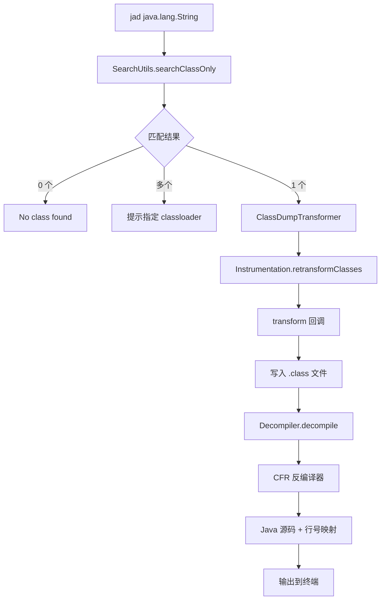
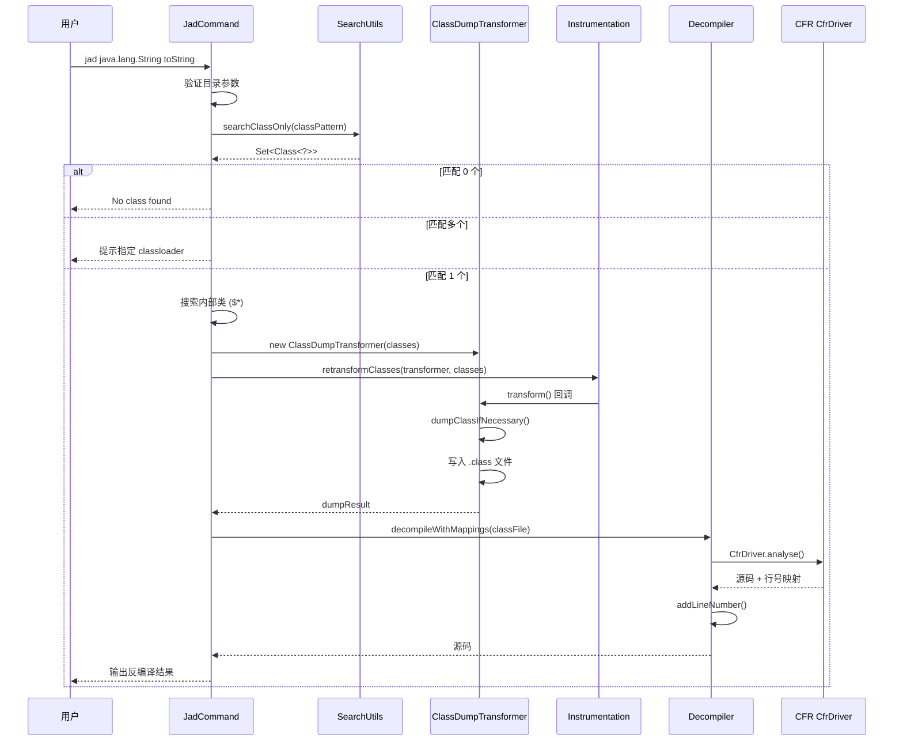
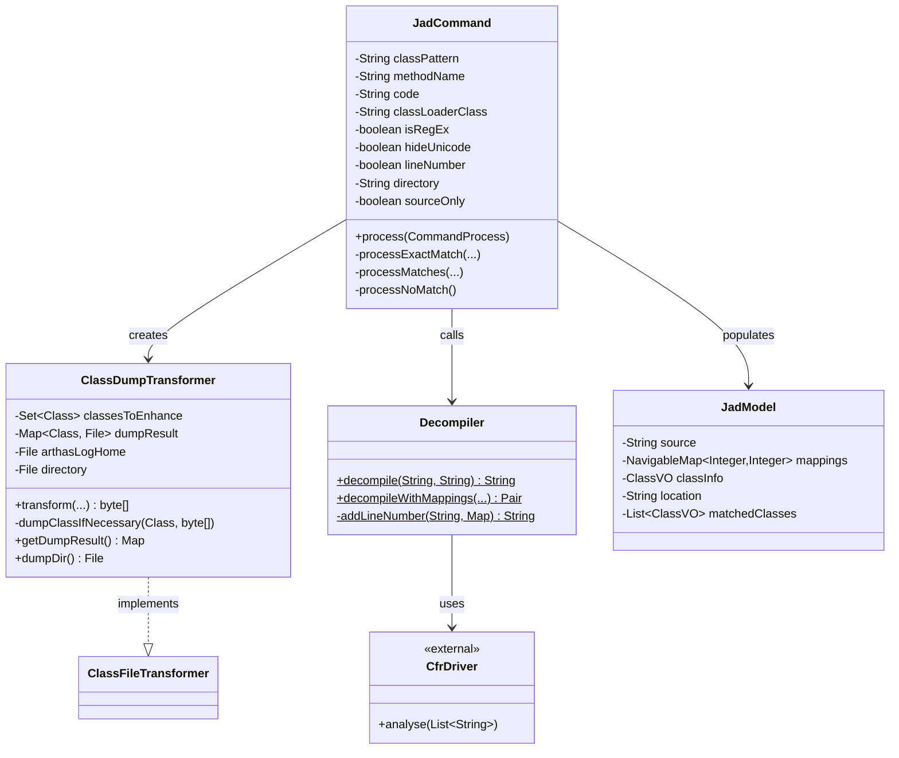
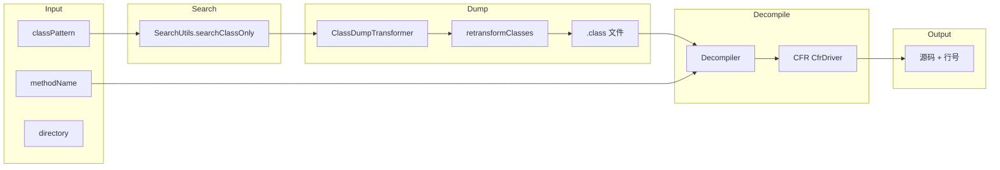

# JadCommand (jad 命令) 深度解析

> 基于 Arthas 4.1.2 源码分析
> 方法论：程序 = 数据结构 + 算法
> 源码路径：`/data/workspace/arthas-4.1.2/arthas/core/src/main/java/`

---

## 第 0 部分：核心原理

### 0.1 本质是什么？

jad 是 Arthas 的**字节码反编译命令**，将 JVM 内存中的 Class 字节码反编译为可读的 Java 源码，用于诊断线上问题、验证代码版本、分析类结构。

### 0.2 为什么需要？

| 痛点 | 传统方案 | jad 方案 |
|------|----------|----------|
| 看不到线上代码 | 问运维要 jar 包 | 直接反编译内存中的类 |
| 不确定代码版本 | 对比 jar 包 hash | 反编译后对比源码 |
| 内部类/匿名类难分析 | IDE 反编译静态文件 | 反编译内存中的实际类 |
| 需要看特定方法 | 只能看整个类 | 支持指定方法反编译 |

### 0.3 怎么解决？

核心思路：**内存字节码 → 转储到文件 → CFR 反编译器 → 源码输出**



关键设计：
1. **ClassDumpTransformer**：通过 ClassFileTransformer 拦截类字节码
2. **CFR 反编译器**：第三方库，支持 Lambda、Stream、try-with-resources 等 Java 8+ 特性
3. **行号映射**：反编译结果中保留原始源码行号，便于调试

### 0.4 为什么这样设计？

**Q: 为什么不直接读取 .class 文件而是用 retransformClasses？**

运行中的类可能被增强/修改（如 Spring AOP、Arthas 自身），磁盘上的 .class 文件与内存中的不一致。retransformClasses 获取的是**当前内存中的实际字节码**。

**Q: 为什么用 CFR 而非其他反编译器（JD-GUI、Procyon）？**

CFR 对 Java 8+ 特性支持最好：Lambda、Stream、try-with-resources、方法引用等，且持续维护更新。

**Q: 为什么需要写入临时文件？**

CFR 反编译器只接受文件路径，不支持内存字节码直接输入。这是 CFR 的限制。

**Q: 为什么支持指定方法名？**

大型类反编译后源码很长，指定方法名可以只输出目标方法，减少噪音。

---

## 第 1 部分：数据结构全景

### 1.1 数据结构清单

| 结构名 | 源码位置 | 核心作用 |
|--------|----------|----------|
| JadCommand | klass100/JadCommand.java:50 | 命令入口，处理参数和流程控制 |
| ClassDumpTransformer | klass100/ClassDumpTransformer.java:20 | 字节码转储，将类字节码写入文件 |
| Decompiler | util/Decompiler.java:24 | 反编译器封装，调用 CFR |
| JadModel | model/JadModel.java | 反编译结果数据模型 |
| CfrDriver | CFR 库 | 反编译核心引擎 |

### 1.2 JadCommand 详细分析

#### 1.2.1 字段列表

```java
// JadCommand.java:50-67
public class JadCommand extends AnnotatedCommand {
    private static final Logger logger = LoggerFactory.getLogger(JadCommand.class);
    // 匹配空注释块的正则（清理无用输出）
    private static Pattern pattern = Pattern.compile("(?m)^/\\*\\s*\\*/\\s*$" + System.getProperty("line.separator"));

    private String classPattern;      // 类名模式（必填）
    private String methodName;        // 方法名（可选）
    private String code = null;       // ClassLoader hash code
    private String classLoaderClass;  // ClassLoader 类名
    private boolean isRegEx = false;  // 是否正则匹配
    private boolean hideUnicode = false; // 隐藏 Unicode 字符
    private boolean lineNumber;       // 是否显示行号
    private String directory;         // 转储目录
    private boolean sourceOnly = false; // 只输出源码
}
```

#### 1.2.2 参数说明

| 参数 | 短名称 | 说明 | 示例 |
|------|--------|------|------|
| class-pattern | - | 类名模式（必填） | `java.lang.String` |
| method-name | - | 方法名（可选） | `toString` |
| code | -c | ClassLoader hash | `-c 39eb305e` |
| classLoaderClass | - | ClassLoader 类名 | `--classLoaderClass TomcatClassLoader` |
| regex | -E | 启用正则匹配 | `-E` |
| hideUnicode | - | 隐藏 Unicode | `--hideUnicode` |
| source-only | - | 只输出源码 | `--source-only` |
| lineNumber | - | 显示行号（默认 true） | `--lineNumber false` |
| directory | -d | 转储目录 | `-d /tmp/jad` |

#### 1.2.3 字段生命周期

```
classPattern 字段：
  创建者：setClassPattern()（CLI 参数注入）
  处理：StringUtils.normalizeClassName() 标准化类名
  读取者：SearchUtils.searchClassOnly() 搜索类

methodName 字段：
  创建者：setMethodName()（CLI 参数注入）
  读取者：Decompiler.decompileWithMappings() 反编译指定方法

directory 字段：
  创建者：setDirectory()（CLI 参数注入）
  验证：FileUtils.isDirectoryOrNotExist() 检查目录有效性
  读取者：ClassDumpTransformer 构造函数
```

### 1.3 ClassDumpTransformer 详细分析

#### 1.3.1 字段列表

```java
// ClassDumpTransformer.java:20-29
class ClassDumpTransformer implements ClassFileTransformer {

    private static final Logger logger = LoggerFactory.getLogger(ClassDumpTransformer.class);

    private Set<Class<?>> classesToEnhance;    // 需要转储的类集合
    private Map<Class<?>, File> dumpResult;     // 转储结果：类 → 文件
    private File arthasLogHome;                 // Arthas 日志目录
    private File directory;                     // 指定的转储目录
}
```

#### 1.3.2 sizeof 估算

| 部分 | 大小 |
|------|------|
| 对象头 | 12 bytes |
| 4 个字段 | 4 × 8 = 32 bytes |
| 继承开销 | ~8 bytes |
| **ClassDumpTransformer 本身** | **约 52 bytes** |

### 1.4 Decompiler 详细分析

#### 1.4.1 核心方法

```java
// Decompiler.java:34-97
public static Pair<String, NavigableMap<Integer, Integer>> decompileWithMappings(
    String classFilePath,     // .class 文件路径
    String methodName,        // 方法名（可选）
    boolean hideUnicode,      // 隐藏 Unicode
    boolean printLineNumber   // 打印行号
) {
    // 返回：Pair<源码, 行号映射>
}
```

#### 1.4.2 CFR 配置选项

| 选项 | 值 | 说明 |
|------|-----|------|
| showversion | false | 不显示 CFR 版本 |
| hideutf | true/false | 隐藏 Unicode 字符 |
| trackbytecodeloc | true | 跟踪字节码位置（行号映射必需） |
| methodname | 方法名 | 只反编译指定方法 |

---

## 第 2 部分：算法/流程分析

### 2.1 核心流程时序图



### 2.2 process() 方法详解

#### 2.2.1 函数签名与位置

```java
// JadCommand.java:125-175
@Override
public void process(CommandProcess process) {
```

**解决什么问题**：命令入口，处理参数验证、类搜索、结果分发

#### 2.2.2 真实源码 + 逐行注释

```java
// JadCommand.java:125
@Override
public void process(CommandProcess process) {
    // 验证目录参数
    if (directory != null && !FileUtils.isDirectoryOrNotExist(directory)) {
        process.end(-1, directory + " :is not a directory, please check it");
        return;
    }
    Instrumentation inst = process.session().getInstrumentation();

    // 处理 classLoaderClass 参数（转换为 hash code）
    if (code == null && classLoaderClass != null) {
        List<ClassLoader> matchedClassLoaders = ClassLoaderUtils.getClassLoaderByClassName(inst, classLoaderClass);
        if (matchedClassLoaders.size() == 1) {
            code = Integer.toHexString(matchedClassLoaders.get(0).hashCode());
        } else if (matchedClassLoaders.size() > 1) {
            // 多个匹配，提示用户指定 hash
            Collection<ClassLoaderVO> classLoaderVOList = ClassUtils.createClassLoaderVOList(matchedClassLoaders);
            JadModel jadModel = new JadModel()
                    .setClassLoaderClass(classLoaderClass)
                    .setMatchedClassLoaders(classLoaderVOList);
            process.appendResult(jadModel);
            process.end(-1, "Found more than one classloader by class name, please specify classloader with '-c <classloader hash>'");
            return;
        } else {
            process.end(-1, "Can not find classloader by class name: " + classLoaderClass + ".");
            return;
        }
    }
    
    // 搜索匹配的类
    Set<Class<?>> matchedClasses = SearchUtils.searchClassOnly(inst, classPattern, isRegEx, code);

    try {
        final RowAffect affect = new RowAffect();
        final ExitStatus status;
        if (matchedClasses == null || matchedClasses.isEmpty()) {
            // 无匹配
            status = processNoMatch(process);
        } else if (matchedClasses.size() > 1) {
            // 多个匹配
            status = processMatches(process, matchedClasses);
        } else {
            // 唯一匹配
            Set<Class<?>> withInnerClasses = SearchUtils.searchClassOnly(inst,  
                matchedClasses.iterator().next().getName() + "$*", false, code);
            if(withInnerClasses.isEmpty()) {
                withInnerClasses = matchedClasses;
            }
            status = processExactMatch(process, affect, inst, matchedClasses, withInnerClasses);
        }
        if (!this.sourceOnly) {
            process.appendResult(new RowAffectModel(affect));
        }
        CommandUtils.end(process, status);
    } catch (Throwable e){
        logger.error("processing error", e);
        process.end(-1, "processing error");
    }
}
```

#### 2.2.3 设计决策

- **为什么验证目录**：目录不存在时创建，非目录路径报错
- **为什么搜索内部类**：内部类 `$*` 模式匹配，一起转储
- **为什么分三种情况处理**：无匹配、多匹配、唯一匹配，用户反馈不同

### 2.3 processExactMatch() 方法详解

#### 2.3.1 函数签名与位置

```java
// JadCommand.java:177-217
private ExitStatus processExactMatch(CommandProcess process, RowAffect affect, 
    Instrumentation inst, Set<Class<?>> matchedClasses, Set<Class<?>> withInnerClasses) {
```

**解决什么问题**：处理唯一匹配的情况，执行字节码转储和反编译

#### 2.3.2 真实源码 + 逐行注释

```java
// JadCommand.java:177
private ExitStatus processExactMatch(CommandProcess process, RowAffect affect, 
    Instrumentation inst, Set<Class<?>> matchedClasses, Set<Class<?>> withInnerClasses) {
    
    Class<?> c = matchedClasses.iterator().next();  // 获取匹配的类
    Set<Class<?>> allClasses = new HashSet<>(withInnerClasses);
    allClasses.add(c);  // 合并主类和内部类
    
    try {
        final ClassDumpTransformer transformer;
        if (directory == null) {
            // 使用默认目录（arthas-log/classdump）
            transformer = new ClassDumpTransformer(allClasses);
        } else {
            // 使用指定目录
            transformer = new ClassDumpTransformer(allClasses, new File(directory));
        }
        
        // 关键：重新转换类，触发 transform 回调
        InstrumentationUtils.retransformClasses(inst, transformer, allClasses);

        Map<Class<?>, File> classFiles = transformer.getDumpResult();
        if (classFiles == null || classFiles.isEmpty()) {
            return ExitStatus.failure(-1, 
                "jad: fail to dump class file for decompiler, make sure you have write permission of the directory \"" + 
                transformer.dumpDir() + "\" or try with \"-d/--directory\" to specify the directory of dump files");
        }
        
        // 获取主类的 .class 文件
        File classFile = classFiles.get(c);
        
        // 核心：调用反编译器
        Pair<String,NavigableMap<Integer,Integer>> decompileResult = 
            Decompiler.decompileWithMappings(classFile.getAbsolutePath(), methodName, hideUnicode, lineNumber);
        String source = decompileResult.getFirst();
        
        if (source != null) {
            // 清理空注释块
            source = pattern.matcher(source).replaceAll("");
        } else {
            source = "unknown";
        }
        
        // 构建输出模型
        JadModel jadModel = new JadModel();
        jadModel.setSource(source);
        jadModel.setMappings(decompileResult.getSecond());  // 行号映射
        if (!this.sourceOnly) {
            jadModel.setClassInfo(ClassUtils.createSimpleClassInfo(c));
            jadModel.setLocation(ClassUtils.getCodeSource(c.getProtectionDomain().getCodeSource()));
        }
        process.appendResult(jadModel);
        affect.rCnt(classFiles.keySet().size());  // 统计转储的类数量
        return ExitStatus.success();
    } catch (Throwable t) {
        logger.error("jad: fail to decompile class: " + c.getName(), t);
        return ExitStatus.failure(-1, 
            "jad: fail to decompile class: " + c.getName() + ", please check $HOME/logs/arthas/arthas.log for more details.");
    }
}
```

#### 2.3.3 设计决策

- **为什么用 retransformClasses 而非直接读取**：获取内存中实际字节码
- **为什么清理空注释块**：CFR 可能输出 `/* */`，影响可读性
- **为什么返回行号映射**：便于用户关联源码位置

### 2.4 InstrumentationUtils.retransformClasses() 方法详解

#### 2.4.1 函数签名与位置

```java
// InstrumentationUtils.java:19-41
public static void retransformClasses(Instrumentation inst, ClassFileTransformer transformer,
        Set<Class<?>> classes) {
```

**解决什么问题**：安全地注册 Transformer、触发类重新转换、最终注销 Transformer，是字节码转储的**核心调度方法**

#### 2.4.2 真实源码 + 逐行注释

```java
// InstrumentationUtils.java:19
public static void retransformClasses(Instrumentation inst, ClassFileTransformer transformer,
        Set<Class<?>> classes) {
    try {
        inst.addTransformer(transformer, true);  // ★ 注册 Transformer（canRetransform=true）

        for (Class<?> clazz : classes) {
            if (ClassUtils.isLambdaClass(clazz)) {
                // ★ 跳过 Lambda 类：JDK 不支持 retransform Lambda 类
                // 参见 https://github.com/alibaba/arthas/issues/1512
                logger.info("ignore lambda class: {}, because jdk do not support retransform lambda class", 
                    clazz.getName());
                continue;
            }
            try {
                inst.retransformClasses(clazz);  // ★ 触发重新转换 → 回调 transform()
            } catch (Throwable e) {
                String errorMsg = "retransformClasses class error, name: " + clazz.getName();
                logger.error(errorMsg, e);  // ★ 单个类失败不影响其他类
            }
        }
    } finally {
        inst.removeTransformer(transformer);  // ★ 确保注销，避免影响后续类加载
    }
}
```

#### 2.4.3 设计决策

- **为什么在 finally 中注销 Transformer**：如果不注销，后续所有类加载/重新转换都会触发这个 Transformer，造成不可预期的副作用
- **为什么跳过 Lambda 类**：JDK 底层不支持对 Lambda 类进行 retransform（会抛 `UnsupportedOperationException`），这是 JDK 的已知限制
- **为什么单个类失败不中断循环**：批量转储时，一个类失败不应影响其他类的转储

### 2.5 processMatches() 方法详解

#### 2.5.1 函数签名与位置

```java
// JadCommand.java:219-231
private ExitStatus processMatches(CommandProcess process, Set<Class<?>> matchedClasses) {
```

**解决什么问题**：多个类匹配时，提示用户指定 ClassLoader hash 精确定位

#### 2.5.2 真实源码 + 逐行注释

```java
// JadCommand.java:219
private ExitStatus processMatches(CommandProcess process, Set<Class<?>> matchedClasses) {
    // 构建提示信息：建议用 -c 指定 ClassLoader hash
    String usage = "jad -c <hashcode> " + classPattern;
    String msg = " Found more than one class for: " + classPattern + ", Please use " + usage;
    process.appendResult(new MessageModel(msg));

    // 将匹配的类列表输出（含 ClassLoader 信息）
    List<ClassVO> classVOs = ClassUtils.createClassVOList(matchedClasses);
    JadModel jadModel = new JadModel();
    jadModel.setMatchedClasses(classVOs);
    process.appendResult(jadModel);

    return ExitStatus.failure(-1, msg);  // 返回失败状态
}
```

#### 2.5.3 设计决策

- **为什么返回失败而非自动选择**：同名类可能来自不同 ClassLoader（如 Tomcat 多 webapp 场景），自动选择可能反编译错误的类
- **为什么输出类列表**：帮助用户看到所有匹配项及其 ClassLoader hash，便于选择

### 2.6 ClassDumpTransformer.transform() 方法详解

#### 2.6.1 函数签名与位置

```java
// ClassDumpTransformer.java:42-49
@Override
public byte[] transform(ClassLoader loader, String className, Class<?> classBeingRedefined,
                        ProtectionDomain protectionDomain, byte[] classfileBuffer)
        throws IllegalClassFormatException {
```

**解决什么问题**：拦截类字节码，转储到文件。被 `InstrumentationUtils.retransformClasses()` 触发回调

#### 2.6.2 真实源码 + 逐行注释

```java
// ClassDumpTransformer.java:42
@Override
public byte[] transform(ClassLoader loader, String className, Class<?> classBeingRedefined,
                        ProtectionDomain protectionDomain, byte[] classfileBuffer)
        throws IllegalClassFormatException {
    // 检查是否需要转储这个类
    if (classesToEnhance.contains(classBeingRedefined)) {
        dumpClassIfNecessary(classBeingRedefined, classfileBuffer);
    }
    return null;  // 不修改字节码，直接返回 null
}
```

#### 2.6.3 设计决策

- **为什么返回 null**：不修改字节码，只是"借用"transform 回调获取字节码
- **为什么检查 classBeingRedefined**：只转储目标类，避免全量转储

### 2.7 dumpClassIfNecessary() 方法详解

#### 2.7.1 函数签名与位置

```java
// ClassDumpTransformer.java:66-94
private void dumpClassIfNecessary(Class<?> clazz, byte[] data) {
```

**解决什么问题**：将类字节码写入文件

#### 2.7.2 真实源码 + 逐行注释

```java
// ClassDumpTransformer.java:66
private void dumpClassIfNecessary(Class<?> clazz, byte[] data) {
    String className = clazz.getName();
    ClassLoader classLoader = clazz.getClassLoader();

    // 创建转储目录
    File dumpDir = dumpDir();
    if (!dumpDir.mkdirs() && !dumpDir.exists()) {
        logger.warn("create dump directory:{} failed.", dumpDir.getAbsolutePath());
        return;
    }

    String fileName;
    if (classLoader != null) {
        // 有 ClassLoader：添加 ClassLoader 信息到路径
        fileName = classLoader.getClass().getName() + "-" + 
                   Integer.toHexString(classLoader.hashCode()) +
                   File.separator + 
                   className.replace(".", File.separator) + ".class";
    } else {
        // Bootstrap ClassLoader：直接用类名
        fileName = className.replace(".", File.separator) + ".class";
    }

    File dumpClassFile = new File(dumpDir, fileName);

    // 写入字节码到文件
    try {
        FileUtils.writeByteArrayToFile(dumpClassFile, data);
        dumpResult.put(clazz, dumpClassFile);  // 记录结果
    } catch (IOException e) {
        logger.warn("dump class:{} to file {} failed.", className, dumpClassFile, e);
    }
}
```

#### 2.7.3 设计决策

- **为什么区分有无 ClassLoader**：不同 ClassLoader 可能加载同名类，需要区分存储
- **为什么用 ClassLoader hash**：唯一标识 ClassLoader 实例

### 2.8 Decompiler.decompileWithMappings() 方法详解

#### 2.8.1 函数签名与位置

```java
// Decompiler.java:34-97
public static Pair<String, NavigableMap<Integer, Integer>> decompileWithMappings(
        String classFilePath, String methodName, boolean hideUnicode, boolean printLineNumber) {
```

**解决什么问题**：调用 CFR 反编译器，返回源码和行号映射

#### 2.8.2 真实源码 + 逐行注释

```java
// Decompiler.java:34
public static Pair<String, NavigableMap<Integer, Integer>> decompileWithMappings(
        String classFilePath, String methodName, boolean hideUnicode, boolean printLineNumber) {
    
    final StringBuilder sb = new StringBuilder(8192);  // 源码缓存

    final NavigableMap<Integer, Integer> lineMapping = new TreeMap<Integer, Integer>();  // 行号映射

    // 定义输出接收器（CFR 回调）
    OutputSinkFactory mySink = new OutputSinkFactory() {
        @Override
        public List<SinkClass> getSupportedSinks(SinkType sinkType, Collection<SinkClass> collection) {
            return Arrays.asList(SinkClass.STRING, SinkClass.DECOMPILED, SinkClass.DECOMPILED_MULTIVER,
                    SinkClass.EXCEPTION_MESSAGE, SinkClass.LINE_NUMBER_MAPPING);
        }

        @Override
        public <T> Sink<T> getSink(final SinkType sinkType, final SinkClass sinkClass) {
            return new Sink<T>() {
                @Override
                public void write(T sinkable) {
                    // 跳过进度消息
                    if (sinkType == SinkType.PROGRESS) {
                        return;
                    }
                    // 处理行号映射
                    if (sinkType == SinkType.LINENUMBER) {
                        LineNumberMapping mapping = (LineNumberMapping) sinkable;
                        NavigableMap<Integer, Integer> classFileMappings = mapping.getClassFileMappings();
                        NavigableMap<Integer, Integer> mappings = mapping.getMappings();
                        if (classFileMappings != null && mappings != null) {
                            for (Entry<Integer, Integer> entry : mappings.entrySet()) {
                                Integer srcLineNumber = classFileMappings.get(entry.getKey());
                                lineMapping.put(entry.getValue(), srcLineNumber);
                            }
                        }
                        return;
                    }
                    sb.append(sinkable);  // 追加源码
                }
            };
        }
    };

    // 配置 CFR 选项
    HashMap<String, String> options = new HashMap<String, String>();
    options.put("showversion", "false");       // 不显示版本
    options.put("hideutf", String.valueOf(hideUnicode));  // Unicode 处理
    options.put("trackbytecodeloc", "true");   // 跟踪字节码位置（行号映射必需）
    if (!StringUtils.isBlank(methodName)) {
        options.put("methodname", methodName); // 只反编译指定方法
    }

    // 创建 CFR 驱动并执行
    CfrDriver driver = new CfrDriver.Builder()
        .withOptions(options)
        .withOutputSink(mySink)
        .build();
    List<String> toAnalyse = new ArrayList<String>();
    toAnalyse.add(classFilePath);
    driver.analyse(toAnalyse);

    String resultCode = sb.toString();
    // 添加行号前缀
    if (printLineNumber && !lineMapping.isEmpty()) {
        resultCode = addLineNumber(resultCode, lineMapping);
    }

    return Pair.make(resultCode, lineMapping);
}
```

#### 2.8.3 设计决策

- **为什么用 OutputSinkFactory**：CFR 使用回调模式输出结果，需要自定义接收器
- **为什么 trackbytecodeloc 必须为 true**：行号映射依赖字节码位置跟踪
- **为什么用 StringBuilder(8192)**：预估源码大小，减少扩容

### 2.9 addLineNumber() 方法详解

#### 2.9.1 函数签名与位置

```java
// Decompiler.java:104-140
private static String addLineNumber(String src, Map<Integer, Integer> lineMapping) {
```

**解决什么问题**：在反编译源码中添加原始行号前缀

#### 2.9.2 真实源码 + 逐行注释

```java
// Decompiler.java:104
private static String addLineNumber(String src, Map<Integer, Integer> lineMapping) {
    // 计算最大行号，决定格式字符串
    int maxLineNumber = 0;
    for (Integer value : lineMapping.values()) {
        if (value != null && value > maxLineNumber) {
            maxLineNumber = value;
        }
    }

    String formatStr = "/*%2d*/ ";   // 默认格式（两位数）
    String emptyStr = "       ";      // 默认空格

    // 按行号位数调整格式
    if (maxLineNumber >= 1000) {
        formatStr = "/*%4d*/ ";       // 四位数
        emptyStr = "         ";
    } else if (maxLineNumber >= 100) {
        formatStr = "/*%3d*/ ";       // 三位数
        emptyStr = "        ";
    }

    StringBuilder sb = new StringBuilder();
    List<String> lines = StringUtils.toLines(src);

    int index = 0;
    for (String line : lines) {
        // 获取源码行号（index + 1 是反编译后行号）
        Integer srcLineNumber = lineMapping.get(index + 1);
        if (srcLineNumber != null) {
            sb.append(String.format(formatStr, srcLineNumber));
        } else {
            sb.append(emptyStr);  // 无映射的行用空格
        }
        sb.append(line).append("\n");
        index++;
    }

    return sb.toString();
}
```

#### 2.9.3 设计决策

- **为什么按位数调整格式**：保证对齐美观
- **为什么 index + 1**：行号从 1 开始，数组索引从 0 开始
- **输出示例**：
```java
/*42*/ public String toString() {
/*43*/     return "Hello";
/*44*/ }
```

---

## 第 3 部分：关键设计对比表

### 3.1 反编译器对比

| 特性 | CFR | JD-GUI | Procyon | Fernflower |
|------|-----|--------|---------|------------|
| Java 8 Lambda | ✅ | ⚠️ | ✅ | ✅ |
| Java 8 Stream | ✅ | ❌ | ✅ | ✅ |
| try-with-resources | ✅ | ⚠️ | ✅ | ✅ |
| 方法引用 | ✅ | ❌ | ✅ | ✅ |
| 行号映射 | ✅ | ❌ | ⚠️ | ✅ |
| 持续维护 | ✅ | ❌ | ⚠️ | ⚠️ |
| **Arthas 选择** | **✅** | | | |

### 3.2 字节码获取方式对比

| 方式 | 获取的字节码 | 优点 | 缺点 |
|------|-------------|------|------|
| **retransformClasses** | 内存中实际字节码 | 包含运行时增强 | 需要触发转换 |
| 读取 .class 文件 | 编译时字节码 | 简单直接 | 可能被修改 |
| Class.getResourceAsStream | 编译时字节码 | 无需 Instrumentation | 可能被覆盖 |

### 3.3 jad vs javap 对比

| 特性 | jad | javap |
|------|-----|-------|
| 输出格式 | Java 源码 | 字节码指令 |
| 可读性 | 高 | 低（需要 JVM 知识） |
| 行号映射 | ✅ | ❌ |
| 指定方法 | ✅ | ✅ |
| 显示内部结构 | ❌ | ✅（常量池、局部变量表） |

---

## 第 4 部分：数据结构关系图

### 4.1 类图



### 4.2 数据流图



---

## 第 5 部分：实战案例分析

### 5.1 案例：反编译 String 类

**命令**：
```bash
jad java.lang.String
```

**输出**：
```java
/*
 * Decompiled with CFR.
 */
package java.lang;

public final class String
implements java.io.Serializable,
          Comparable<String>,
          CharSequence {
    private final char[] value;
    private int hash;
    
    public String() {
        this.value = new char[0];
    }
    // ...省略
}
```

### 5.2 案例：只反编译指定方法

**命令**：
```bash
jad java.lang.String toString
```

**输出**：
```java
/*
 * Decompiled with CFR.
 */
public String toString() {
    /*1469*/ return this;
}
```

### 5.3 案例：指定 ClassLoader

**命令**：
```bash
jad -c 39eb305e com.example.MyClass
```

**场景**：同一个类被多个 ClassLoader 加载，需要指定具体实例

---

## 第 6 部分：总结

### 6.1 数据结构层面

| 类别 | 结构 | 核心特征 |
|------|------|----------|
| **命令层** | JadCommand | 参数解析 + 流程控制 |
| **转储层** | ClassDumpTransformer | ClassFileTransformer 实现，不修改字节码 |
| **反编译层** | Decompiler | CFR 封装 + 行号映射 |
| **数据层** | JadModel | 源码 + 行号映射 + 类信息 |

### 6.2 算法层面

| 算法 | 核心思路 | 复杂度 |
|------|----------|--------|
| **类搜索** | 正则/通配符匹配 + ClassLoader 过滤 | O(n) |
| **retransform 调度** | 注册 Transformer → 逐类触发 → 注销 | O(类数量) |
| **字节码转储** | transform 回调 + 文件写入 | O(1) per class |
| **反编译** | CFR 分析字节码 → Java 源码 | O(类复杂度) |
| **行号映射** | CFR 回调 + 格式化输出 | O(行数) |

### 6.3 核心要点

1. **jad 获取的是内存中实际字节码**，而非磁盘 .class 文件
2. **使用 ClassDumpTransformer "借用" transform 回调**获取字节码
3. **CFR 是最佳反编译器选择**，对 Java 8+ 特性支持最完整
4. **行号映射帮助关联原始源码**，便于调试定位
5. **支持指定方法**，减少大型类的噪音输出

### 6.4 局限性

| 局限 | 原因 | 解决方案 |
|------|------|----------|
| 反编译结果可能与原码不同 | 编译优化、混淆 | 参考，不追求完全一致 |
| Lambda 表达式可能不完整 | invokedynamic 特殊处理 | CFR 优化中 |
| 匿名内部类命名复杂 | 编译器生成规则 | 使用 `--source-only` 简化 |
