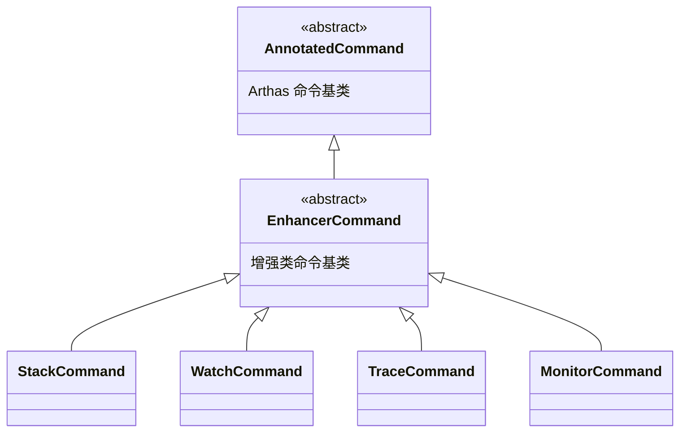
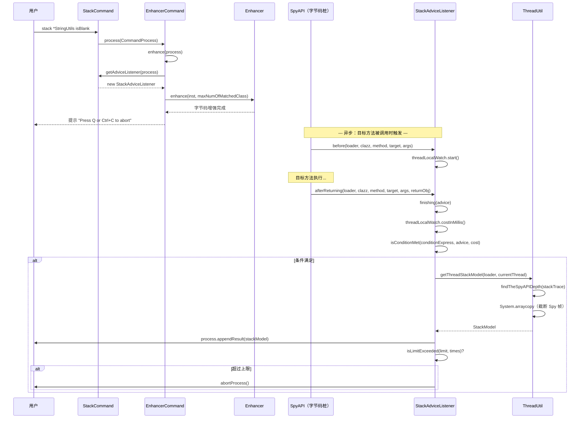
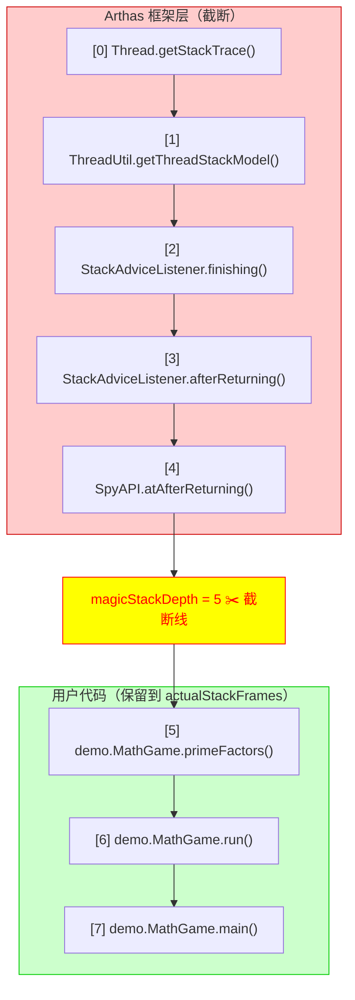
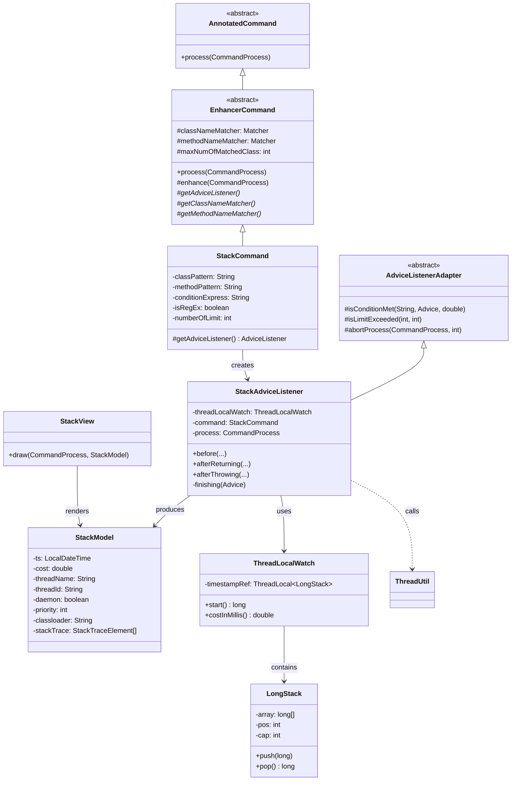
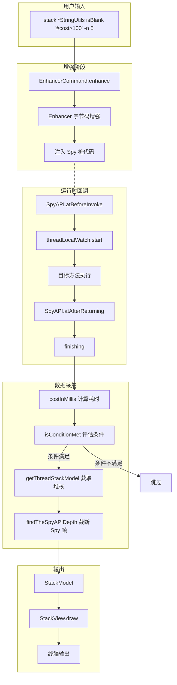

# StackCommand (stack 命令) 深度解析

> 基于 Arthas 4.1.2 源码分析
> 方法论：程序 = 数据结构 + 算法
> 源码路径：`/data/workspace/arthas-4.1.2/arthas/core/src/main/java/`

---

## 第 0 部分：核心原理

### 0.1 本质是什么？

stack 是 Arthas 的**方法调用栈追踪命令**，当目标方法被调用时，输出当前线程的完整调用栈，用于回答"这个方法是从哪里被调用的？"。

### 0.2 为什么需要？

线上排查时经常遇到一个方法被多个地方调用，无法确定本次调用来自哪条调用链路。传统方式（加日志、打断点）需要重启或影响生产环境。stack 命令通过字节码增强，在方法进入/退出时自动抓取当前线程堆栈，**零侵入**地回答调用来源问题。

### 0.3 怎么解决？

核心思路：**字节码增强 + AOP 切面 + Thread.getStackTrace()**

1. 通过 `Enhancer` 对目标类的目标方法进行字节码增强（插入 Spy 桩代码）
2. 方法进入时 `before()` 记录时间戳，方法退出时 `afterReturning()/afterThrowing()` 触发回调
3. 在回调中调用 `Thread.currentThread().getStackTrace()` 获取完整堆栈
4. 剔除 Arthas 自身注入的 Spy 框架层，只保留用户代码的真实调用栈

### 0.4 为什么这样设计？

**Q: 为什么用 Thread.getStackTrace() 而非 new Exception().getStackTrace()？**

两者底层都调用 JVM 的 `Thread::getStackTrace`，效果等价。`Thread.currentThread().getStackTrace()` 语义更清晰，且不需要创建 Exception 对象。

**Q: 为什么要剔除 Spy 框架层？**

Arthas 通过字节码增强注入了 `SpyAPI.atBeforeInvoke()` 等桩代码，这些帧出现在堆栈中会干扰用户理解真实调用链。必须找到 SpyAPI 的深度并截断。

**Q: 为什么继承 EnhancerCommand 而非直接实现 AnnotatedCommand？**

stack/watch/trace/monitor/tt 五个命令都需要字节码增强能力，EnhancerCommand 封装了增强的通用流程（获取锁、创建 Enhancer、注册监听器、处理错误），子类只需提供 Matcher 和 AdviceListener。

---

## 第 1 部分：数据结构全景

### 1.1 数据结构清单

| 结构名 | 源码位置 | 核心作用 |
|--------|----------|----------|
| StackCommand | monitor200/StackCommand.java:31 | 命令入口，继承 EnhancerCommand，定义参数 |
| EnhancerCommand | monitor200/EnhancerCommand.java:37 | 抽象基类，封装字节码增强通用流程 |
| StackAdviceListener | monitor200/StackAdviceListener.java:19 | AOP 监听器，方法进入/退出时采集堆栈 |
| AdviceListenerAdapter | advisor/AdviceListenerAdapter.java:18 | 监听器抽象基类，提供条件判断和限次控制 |
| StackModel | model/StackModel.java:9 | 堆栈数据模型（线程信息+调用栈） |
| StackView | view/StackView.java:12 | 视图渲染，将 StackModel 格式化为终端输出 |
| ThreadLocalWatch | util/ThreadLocalWatch.java:9 | 基于 ThreadLocal 的方法耗时计时器 |
| ThreadLocalWatch.LongStack | util/ThreadLocalWatch.java:45 | 固定容量的长整型栈（循环存储，防内存泄漏） |

### 1.2 StackCommand 详细分析

#### 1.2.1 字段列表

```java
// StackCommand.java:31-36
public class StackCommand extends EnhancerCommand {
    private String classPattern;       // 类名匹配模式（必填）
    private String methodPattern;      // 方法名匹配模式（可选）
    private String conditionExpress;   // OGNL 条件表达式（可选）
    private boolean isRegEx = false;   // 是否正则匹配（默认通配符）
    private int numberOfLimit = 100;   // 输出次数上限（默认 100）
}
```

#### 1.2.2 参数说明

| 参数 | 短名称 | 说明 | 示例 |
|------|--------|------|------|
| class-pattern | - | 类名模式（必填） | `*StringUtils` |
| method-pattern | - | 方法名模式（可选） | `isBlank` |
| condition-express | - | OGNL 条件表达式 | `params[0].length==1` |
| -E / --regex | -E | 启用正则匹配 | `-E org\\.apache\\..*` |
| -n / --limits | -n | 输出次数上限 | `-n 5` |

#### 1.2.3 继承关系



#### 1.2.4 字段生命周期

```
classPattern 字段：
  创建者：setClassPattern()（CLI 参数注入，@Argument(index=0)）
  读取者：getClassNameMatcher() → SearchUtils.classNameMatcher()

conditionExpress 字段：
  创建者：setConditionExpress()（CLI 参数注入，@Argument(index=2)）
  读取者：StackAdviceListener.finishing() → isConditionMet()

numberOfLimit 字段：
  创建者：setNumberOfLimit()（CLI 参数注入，@Option(shortName="n")），默认 100
  读取者：StackAdviceListener.finishing() → isLimitExceeded()
```

### 1.3 StackAdviceListener 详细分析

#### 1.3.1 字段列表

```java
// StackAdviceListener.java:19-24
public class StackAdviceListener extends AdviceListenerAdapter {
    private static final Logger logger = LoggerFactory.getLogger(StackAdviceListener.class);
    private final ThreadLocalWatch threadLocalWatch = new ThreadLocalWatch();  // 计时器
    private StackCommand command;    // 关联的命令对象
    private CommandProcess process;  // 命令进程（用于输出结果）
}
```

#### 1.3.2 关键方法映射

| 回调时机 | 方法 | 作用 |
|----------|------|------|
| 方法进入 | `before()` | 记录开始时间戳 |
| 正常返回 | `afterReturning()` | 构造 Advice → 调用 finishing() |
| 异常退出 | `afterThrowing()` | 构造 Advice → 调用 finishing() |
| 统一收尾 | `finishing()` | 计算耗时、判断条件、采集堆栈、输出结果 |

### 1.4 StackModel 详细分析

#### 1.4.1 字段列表

```java
// StackModel.java:9-21
public class StackModel extends ResultModel {
    private LocalDateTime ts;              // 时间戳
    private double cost;                   // 方法调用耗时（毫秒）
    private String traceId;                // EagleEye 链路追踪 ID（阿里内部）
    private String rpcId;                  // EagleEye RPC ID
    private String threadName;             // 线程名
    private String threadId;               // 线程 ID（字符串形式）
    private boolean daemon;                // 是否守护线程
    private int priority;                  // 线程优先级
    private String classloader;            // 线程上下文 ClassLoader
    private StackTraceElement[] stackTrace; // 完整调用栈（已剔除 Spy 框架层）
}
```

#### 1.4.2 sizeof 估算

| 部分 | 大小 |
|------|------|
| 对象头 | 12 bytes |
| 10 个字段引用/原始值 | ~72 bytes |
| stackTrace 数组（典型 20 帧） | ~20 × 8 = 160 bytes（引用） |
| **StackModel 本身** | **约 244 bytes**（不含字符串和 StackTraceElement 实际内容） |

### 1.5 ThreadLocalWatch 详细分析

#### 1.5.1 字段列表

```java
// ThreadLocalWatch.java:9-16
public class ThreadLocalWatch {
    // 每个线程独立的时间戳栈
    private final ThreadLocal<LongStack> timestampRef = new ThreadLocal<LongStack>() {
        @Override
        protected LongStack initialValue() {
            return new LongStack(1024 * 4);  // 固定容量 4096
        }
    };
}
```

#### 1.5.2 内部类 LongStack

```java
// ThreadLocalWatch.java:45-78
static class LongStack {
    private long[] array;  // 固定大小数组
    private int pos = 0;   // 栈顶指针
    private int cap;       // 容量
}
```

#### 1.5.3 设计要点

| 设计 | 原因 |
|------|------|
| 固定容量 4096 | push/pop 可能不配对（方法中途异常），避免无限增长导致 OOM |
| 循环存储 | pos 到达 cap 时重置为 0，极端情况下计时不准确，但安全 |
| ThreadLocal | 每个线程独立计时，无并发竞争 |

### 1.6 StackView 详细分析

#### 1.6.1 字段列表

```java
// StackView.java:12
public class StackView extends ResultView<StackModel> {
    // 无额外字段，仅覆写 draw() 方法
}
```

#### 1.6.2 输出格式

```
ts=2024-01-01 12:00:00;thread_name=main;id=1;is_daemon=false;priority=5;TCCL=sun.misc.Launcher$AppClassLoader@18b4aac2
    @demo.MathGame.primeFactors()
        at demo.MathGame.run(MathGame.java:25)
        at demo.MathGame.main(MathGame.java:16)
```

---

## 第 2 部分：算法/流程分析

### 2.1 核心流程时序图



### 2.2 EnhancerCommand.process() 方法详解

#### 2.2.1 函数签名与位置

```java
// EnhancerCommand.java:112-121
@Override
public void process(final CommandProcess process) {
```

**解决什么问题**：所有增强类命令的统一入口，注册中断处理器后启动增强流程

#### 2.2.2 真实源码 + 逐行注释

```java
// EnhancerCommand.java:112
@Override
public void process(final CommandProcess process) {
    // ★ 注册 Ctrl-C 中断处理器：用户按 Ctrl-C 时终止命令
    process.interruptHandler(new CommandInterruptHandler(process));
    // ★ 注册 Q 退出处理器：用户按 Q 时终止命令
    process.stdinHandler(new QExitHandler(process));
    // ★ 启动增强流程
    enhance(process);
}
```

#### 2.2.3 设计决策

- **为什么先注册中断处理器再增强**：增强可能耗时较长，用户需要随时中断
- **为什么支持两种退出方式**：Ctrl-C 是 Unix 惯例，Q 是交互式工具惯例

### 2.3 EnhancerCommand.enhance() 方法详解

#### 2.3.1 函数签名与位置

```java
// EnhancerCommand.java:145-229
protected void enhance(CommandProcess process) {
```

**解决什么问题**：执行字节码增强的通用流程——获取锁、创建 Enhancer、增强目标类、处理错误

#### 2.3.2 真实源码 + 逐行注释

```java
// EnhancerCommand.java:145
protected void enhance(CommandProcess process) {
    Session session = process.session();
    if (!session.tryLock()) {
        // ★ 同一时刻只能有一个增强操作，避免并发增强导致字节码冲突
        String msg = "someone else is enhancing classes, pls. wait.";
        process.appendResult(new EnhancerModel(null, false, msg));
        process.end(-1, msg);
        return;
    }
    EnhancerAffect effect = null;
    int lock = session.getLock();
    try {
        Instrumentation inst = session.getInstrumentation();
        // ★ 获取 AdviceListener（由子类实现，StackCommand 返回 StackAdviceListener）
        AdviceListener listener = getAdviceListenerWithId(process);
        if (listener == null) {
            // ... 省略：错误处理
            return;
        }
        boolean skipJDKTrace = false;
        if(listener instanceof AbstractTraceAdviceListener) {
            skipJDKTrace = ((AbstractTraceAdviceListener) listener).getCommand().isSkipJDKTrace();
        }
        // ★ 创建 Enhancer：传入 listener、类名匹配器、方法名匹配器
        Enhancer enhancer = new Enhancer(listener, listener instanceof InvokeTraceable, 
            skipJDKTrace, getClassNameMatcher(), getClassNameExcludeMatcher(), getMethodNameMatcher());
        // ★ 注册监听器和增强器到进程（用于退出时反增强恢复）
        process.register(listener, enhancer);
        // ★ 执行增强：扫描匹配类 → 修改字节码 → 注入 Spy 桩
        effect = enhancer.enhance(inst, this.maxNumOfMatchedClass);

        if (effect.getThrowable() != null) {
            // ... 省略：增强异常处理
            return;
        }
        if (effect.cCnt() == 0 || effect.mCnt() == 0) {
            // ... 省略：无类/方法匹配的错误提示
            return;
        }

        // ★ 增强成功，提示用户。此后命令进入异步模式，等待 AdviceListener 回调
        process.appendResult(new EnhancerModel(effect, true));
        // ... 省略：打印操作提示
    } catch (Throwable e) {
        // ... 省略：异常处理
    } finally {
        if (lock == session.getLock()) {
            // ★ 释放增强锁，允许其他命令增强
            session.unLock();
        }
    }
}
```

#### 2.3.3 设计决策

- **为什么需要 session 锁**：两个增强命令同时修改同一个类的字节码会导致不可预期的结果
- **为什么增强后不 end()**：增强后命令变为异步模式，等目标方法被调用时在 AdviceListener 中输出结果，直到用户按 Q/Ctrl-C 或达到次数上限才结束
- **为什么 finally 中释放锁**：确保即使增强失败也释放锁

### 2.4 StackCommand.getAdviceListener() 方法详解

#### 2.4.1 函数签名与位置

```java
// StackCommand.java:112-115
@Override
protected AdviceListener getAdviceListener(CommandProcess process) {
```

**解决什么问题**：创建 stack 命令专属的 AdviceListener

#### 2.4.2 真实源码 + 逐行注释

```java
// StackCommand.java:112
@Override
protected AdviceListener getAdviceListener(CommandProcess process) {
    // ★ 创建 StackAdviceListener，传入命令对象（携带条件表达式和次数上限）
    // ★ verbose 参数：GlobalOptions.verbose || this.verbose（任一为 true 则开启详细模式）
    return new StackAdviceListener(this, process, GlobalOptions.verbose || this.verbose);
}
```

#### 2.4.3 设计决策

- **为什么传入 command 对象**：Listener 需要访问 `conditionExpress` 和 `numberOfLimit`，直接持有命令引用比逐个传参更灵活
- **为什么 verbose 做 OR 运算**：全局 verbose 和命令级 verbose 任一开启即生效

### 2.5 StackAdviceListener.before() 方法详解

#### 2.5.1 函数签名与位置

```java
// StackAdviceListener.java:32-37
@Override
public void before(ClassLoader loader, Class<?> clazz, ArthasMethod method, Object target, Object[] args)
        throws Throwable {
```

**解决什么问题**：在目标方法进入时记录时间戳，作为耗时计算的起点

#### 2.5.2 真实源码 + 逐行注释

```java
// StackAdviceListener.java:32
@Override
public void before(ClassLoader loader, Class<?> clazz, ArthasMethod method, Object target, Object[] args)
        throws Throwable {
    // ★ 记录方法进入时间戳（纳秒级），压入 ThreadLocal 栈
    threadLocalWatch.start();
}
```

#### 2.5.3 设计决策

- **为什么用 ThreadLocal 栈而非普通变量**：同一线程可能递归调用同一方法（或嵌套调用多个被增强的方法），栈结构天然支持 LIFO 配对

### 2.6 StackAdviceListener.afterReturning() / afterThrowing() 方法详解

#### 2.6.1 函数签名与位置

```java
// StackAdviceListener.java:39-51
@Override
public void afterThrowing(ClassLoader loader, Class<?> clazz, ArthasMethod method, 
    Object target, Object[] args, Throwable throwable) throws Throwable {

@Override
public void afterReturning(ClassLoader loader, Class<?> clazz, ArthasMethod method, 
    Object target, Object[] args, Object returnObject) throws Throwable {
```

**解决什么问题**：方法正常返回或异常退出时，构造 Advice 对象并统一走 finishing() 流程

#### 2.6.2 真实源码 + 逐行注释

```java
// StackAdviceListener.java:39
@Override
public void afterThrowing(ClassLoader loader, Class<?> clazz, ArthasMethod method, Object target, Object[] args,
                          Throwable throwable) throws Throwable {
    // ★ 构造包含异常信息的 Advice 对象
    Advice advice = Advice.newForAfterThrowing(loader, clazz, method, target, args, throwable);
    finishing(advice);  // ★ 统一收尾处理
}

// StackAdviceListener.java:46
@Override
public void afterReturning(ClassLoader loader, Class<?> clazz, ArthasMethod method, Object target, Object[] args,
                           Object returnObject) throws Throwable {
    // ★ 构造包含返回值的 Advice 对象
    Advice advice = Advice.newForAfterReturning(loader, clazz, method, target, args, returnObject);
    finishing(advice);  // ★ 统一收尾处理
}
```

#### 2.6.3 设计决策

- **为什么两个回调都走 finishing()**：无论正常返回还是异常退出，stack 命令都需要输出调用栈，逻辑完全一致
- **为什么区分 Advice 类型**：虽然 stack 命令不关心返回值/异常，但条件表达式中可能引用 `returnObj` 或 `throwExp`，需要正确绑定

### 2.7 StackAdviceListener.finishing() 方法详解 ⭐

#### 2.7.1 函数签名与位置

```java
// StackAdviceListener.java:53-76
private void finishing(Advice advice) {
```

**解决什么问题**：stack 命令的**核心逻辑**——计算耗时、评估条件、采集堆栈、输出结果、控制次数

#### 2.7.2 真实源码 + 逐行注释

```java
// StackAdviceListener.java:53
private void finishing(Advice advice) {
    try {
        // ★ Phase 1：计算本次方法调用耗时（弹出 before() 压入的时间戳）
        double cost = threadLocalWatch.costInMillis();
        
        // ★ Phase 2：评估条件表达式（OGNL）
        //   如果 conditionExpress 为空，返回 true（无条件输出）
        //   否则通过 OGNL 引擎计算，可引用 params、returnObj、throwExp、cost 等变量
        boolean conditionResult = isConditionMet(command.getConditionExpress(), advice, cost);
        
        if (this.isVerbose()) {
            // ★ verbose 模式：输出条件表达式和计算结果（调试用）
            process.write("Condition express: " + command.getConditionExpress() + 
                " , result: " + conditionResult + "\n");
        }
        
        if (conditionResult) {
            // ★ Phase 3：采集当前线程的完整调用栈
            //   TODO 注释提到：process.write 存在并发问题（多线程同时触发时输出可能交错）
            StackModel stackModel = ThreadUtil.getThreadStackModel(advice.getLoader(), Thread.currentThread());
            stackModel.setTs(LocalDateTime.now());  // 设置时间戳
            
            // ★ Phase 4：输出结果
            process.appendResult(stackModel);
            
            // ★ Phase 5：次数控制
            process.times().incrementAndGet();  // 原子递增执行计数
            if (isLimitExceeded(command.getNumberOfLimit(), process.times().get())) {
                // 达到上限，终止命令
                abortProcess(process, command.getNumberOfLimit());
            }
        }
    } catch (Throwable e) {
        logger.warn("stack failed.", e);
        process.end(-1, "stack failed, condition is: " + command.getConditionExpress() + ", " + e.getMessage()
                      + ", visit " + LogUtil.loggingFile() + " for more details.");
    }
}
```

#### 2.7.3 5 个阶段划分

| Phase | 操作 | 关键方法 |
|-------|------|----------|
| 1 | 计算耗时 | `threadLocalWatch.costInMillis()` |
| 2 | 评估条件 | `isConditionMet()` |
| 3 | 采集堆栈 | `ThreadUtil.getThreadStackModel()` |
| 4 | 输出结果 | `process.appendResult()` |
| 5 | 次数控制 | `isLimitExceeded()` → `abortProcess()` |

#### 2.7.4 设计决策

- **为什么 cost 在条件判断之前计算**：条件表达式可能引用 `#cost>100`，必须先计算耗时
- **为什么用 AtomicLong 计数**：多线程可能同时触发回调，需要原子操作保证计数准确
- **为什么异常时 end(-1)**：条件表达式计算可能抛异常（语法错误、变量不存在），需要终止命令并提示
- **并发问题**：源码中 TODO 注释承认 `process.write` 存在并发问题，多线程同时输出时可能交错

### 2.8 AdviceListenerAdapter.isConditionMet() 方法详解

#### 2.8.1 函数签名与位置

```java
// AdviceListenerAdapter.java:117-119
protected boolean isConditionMet(String conditionExpress, Advice advice, double cost) throws ExpressException {
```

**解决什么问题**：评估用户指定的 OGNL 条件表达式，决定是否输出本次调用的堆栈

#### 2.8.2 真实源码 + 逐行注释

```java
// AdviceListenerAdapter.java:117
protected boolean isConditionMet(String conditionExpress, Advice advice, double cost) throws ExpressException {
    // ★ 条件表达式为空 → 无条件输出
    // ★ 否则：创建 OGNL Express 实例，绑定 advice 上下文和 cost 变量，计算表达式
    return StringUtils.isEmpty(conditionExpress)
            || ExpressFactory.threadLocalExpress(advice).bind(Constants.COST_VARIABLE, cost).is(conditionExpress);
}
```

#### 2.8.3 设计决策

- **为什么用 ThreadLocal Express**：OGNL 表达式引擎非线程安全，每个线程需要独立实例
- **为什么绑定 cost 变量**：允许用户写 `'#cost>100'` 这样的条件，只输出耗时超过 100ms 的调用
- **支持的变量**：`params`（参数数组）、`returnObj`（返回值）、`throwExp`（异常）、`target`（对象实例）、`#cost`（耗时）

### 2.9 AdviceListenerAdapter.isLimitExceeded() / abortProcess() 方法详解

#### 2.9.1 函数签名与位置

```java
// AdviceListenerAdapter.java:133-147
protected boolean isLimitExceeded(int limit, int currentTimes) {
protected void abortProcess(CommandProcess process, int limit) {
```

**解决什么问题**：控制命令输出次数，防止无限输出淹没终端

#### 2.9.2 真实源码 + 逐行注释

```java
// AdviceListenerAdapter.java:133
protected boolean isLimitExceeded(int limit, int currentTimes) {
    return currentTimes >= limit;  // ★ 当前次数 >= 上限即超限
}

// AdviceListenerAdapter.java:143
protected void abortProcess(CommandProcess process, int limit) {
    // ★ 输出超限提示信息
    process.write("Command execution times exceed limit: " + limit
            + ", so command will exit. You can set it with -n option.\n");
    // ★ 终止命令进程（移除 Transformer + 注销 Listener，但不恢复字节码）
    process.end();
}
```

#### 2.9.3 设计决策

- **为什么默认 100 次**：平衡"采集足够数据"和"不淹没终端"
- **process.end() 不恢复字节码**：只移除 Transformer 和注销 Listener，已增强的字节码保留但因 Listener 已注销而成为空操作（详见 05-EnhancerCommand §5.2 四种退出方式分析）。需要 `reset` 或 `stop` 命令才能真正恢复字节码

### 2.10 ThreadLocalWatch.start() / costInMillis() 方法详解

#### 2.10.1 函数签名与位置

```java
// ThreadLocalWatch.java:18-29
public long start() {
public double costInMillis() {
```

**解决什么问题**：线程安全的方法调用计时，支持嵌套调用

#### 2.10.2 真实源码 + 逐行注释

```java
// ThreadLocalWatch.java:18
public long start() {
    final long timestamp = System.nanoTime();  // ★ 纳秒级精度
    timestampRef.get().push(timestamp);         // ★ 压入当前线程的栈
    return timestamp;
}

// ThreadLocalWatch.java:28
public double costInMillis() {
    // ★ 弹出栈顶时间戳，计算差值并转换为毫秒
    return (System.nanoTime() - timestampRef.get().pop()) / 1000000.0;
}
```

#### 2.10.3 LongStack.push() / pop() 详解

```java
// ThreadLocalWatch.java:59
public void push(long value) {
    if (pos < cap) {
        array[pos++] = value;  // ★ 正常压栈
    } else {
        pos = 0;               // ★ 到达容量上限，循环回绕
        array[pos++] = value;
    }
}

// ThreadLocalWatch.java:69
public long pop() {
    if (pos > 0) {
        pos--;
        return array[pos];    // ★ 正常弹栈
    } else {
        pos = cap;            // ★ 栈空时回绕到末尾（容错处理）
        pos--;
        return array[pos];
    }
}
```

#### 2.10.4 设计决策

- **为什么固定容量 4096 而非动态扩容**：push/pop 可能不配对（方法中间异常导致 pop 未执行），如果用 ArrayList 会无限增长导致 OOM
- **为什么栈空时 pop 不抛异常**：容错设计——即使 push/pop 不配对，也不会崩溃，只是计时不准确
- **为什么用 System.nanoTime() 而非 currentTimeMillis()**：nanoTime() 单调递增，不受系统时钟调整影响

### 2.11 ThreadUtil.getThreadStackModel() 方法详解 ⭐

#### 2.11.1 函数签名与位置

```java
// ThreadUtil.java:402-420
public static StackModel getThreadStackModel(ClassLoader loader, Thread currentThread) {
```

**解决什么问题**：获取当前线程的完整调用栈，**剔除 Arthas Spy 框架注入的栈帧**，只保留用户代码的真实调用链

#### 2.11.2 真实源码 + 逐行注释

```java
// ThreadUtil.java:402
public static StackModel getThreadStackModel(ClassLoader loader, Thread currentThread) {
    StackModel stackModel = new StackModel();
    // ★ 填充线程元信息
    stackModel.setThreadName(currentThread.getName());
    stackModel.setThreadId(Long.toString(currentThread.getId()));
    stackModel.setDaemon(currentThread.isDaemon());
    stackModel.setPriority(currentThread.getPriority());
    stackModel.setClassloader(getTCCL(currentThread));  // Thread Context ClassLoader

    // ★ 尝试获取 EagleEye 链路追踪信息（阿里内部框架，外部环境下 skip）
    getEagleeyeTraceInfo(loader, currentThread, stackModel);

    // ★ 获取完整堆栈
    StackTraceElement[] stackTraceElementArray = currentThread.getStackTrace();
    
    // ★ 找到 SpyAPI 在堆栈中的深度（只计算一次，缓存结果）
    int magicStackDepth = findTheSpyAPIDepth(stackTraceElementArray);
    
    // ★ 截断 Spy 框架层：从 magicStackDepth 位置开始复制到新数组
    StackTraceElement[] actualStackFrames = new StackTraceElement[stackTraceElementArray.length - magicStackDepth];
    System.arraycopy(stackTraceElementArray, magicStackDepth, actualStackFrames, 0, actualStackFrames.length);
    
    stackModel.setStackTrace(actualStackFrames);
    return stackModel;
}
```

#### 2.11.3 设计决策

- **为什么用 System.arraycopy 而非 Arrays.copyOfRange**：性能考虑，arraycopy 是 native 方法，在热路径上更快
- **为什么 magicStackDepth 只计算一次**：所有被增强的方法注入的 Spy 桩结构相同，SpyAPI 在堆栈中的深度是固定的

### 2.12 ThreadUtil.findTheSpyAPIDepth() 方法详解

#### 2.12.1 函数签名与位置

```java
// ThreadUtil.java:381-395
private static int findTheSpyAPIDepth(StackTraceElement[] stackTraceElementArray) {
```

**解决什么问题**：在堆栈中定位 Arthas SpyAPI 类的位置，确定需要截断的帧数

#### 2.12.2 真实源码 + 逐行注释

```java
// ThreadUtil.java:379
private static int MAGIC_STACK_DEPTH = 0;  // ★ 缓存值，只计算一次

// ThreadUtil.java:381
private static int findTheSpyAPIDepth(StackTraceElement[] stackTraceElementArray) {
    if (MAGIC_STACK_DEPTH > 0) {
        return MAGIC_STACK_DEPTH;  // ★ 已计算过，直接返回缓存值
    }
    if (MAGIC_STACK_DEPTH > stackTraceElementArray.length) {
        return 0;  // ★ 防御性检查
    }
    for (int i = 0; i < stackTraceElementArray.length; ++i) {
        if (SpyAPI.class.getName().equals(stackTraceElementArray[i].getClassName())) {
            MAGIC_STACK_DEPTH = i + 1;  // ★ SpyAPI 帧的下一个位置就是用户代码起点
            break;
        }
    }
    return MAGIC_STACK_DEPTH;
}
```

#### 2.12.3 堆栈截断图示



#### 2.12.4 设计决策

- **为什么缓存 MAGIC_STACK_DEPTH**：所有增强方法注入的 Spy 桩结构相同（SpyAPI 在堆栈中的位置固定），计算一次即可复用
- **为什么返回 i + 1**：SpyAPI 帧本身也要截掉，从它的下一帧开始才是用户代码
- **线程安全问题**：`MAGIC_STACK_DEPTH` 是 static int，多线程首次调用可能存在竞态，但因为计算结果幂等（同一个值），所以不影响正确性

### 2.13 StackView.draw() 方法详解

#### 2.13.1 函数签名与位置

```java
// StackView.java:14-39
@Override
public void draw(CommandProcess process, StackModel result) {
```

**解决什么问题**：将 StackModel 渲染为用户友好的终端输出格式

#### 2.13.2 真实源码 + 逐行注释

```java
// StackView.java:14
@Override
public void draw(CommandProcess process, StackModel result) {
    StringBuilder sb = new StringBuilder();
    // ★ 第一行：线程标题（thread_name=xxx;id=xxx;is_daemon=xxx;priority=xxx;TCCL=xxx）
    sb.append(ThreadUtil.getThreadTitle(result)).append("\n");

    // ★ 第二行：触发点位置（堆栈第一帧 = 被增强的目标方法）
    StackTraceElement[] stackTraceElements = result.getStackTrace();
    StackTraceElement locationStackTraceElement = stackTraceElements[0];
    String locationString = String.format("    @%s.%s()", 
        locationStackTraceElement.getClassName(),
        locationStackTraceElement.getMethodName());
    sb.append(locationString).append("\n");

    // ★ 后续行：完整调用链（跳过第一帧，因为已在上面用 @ 格式输出）
    int skip = 1;
    for (int index = skip; index < stackTraceElements.length; index++) {
        StackTraceElement ste = stackTraceElements[index];
        sb.append("        at ")
                .append(ste.getClassName())
                .append(".")
                .append(ste.getMethodName())
                .append("(")
                .append(ste.getFileName())
                .append(":")
                .append(ste.getLineNumber())
                .append(")\n");
    }
    // ★ 最终输出：时间戳 + 堆栈
    process.write("ts=" + DateUtils.formatDateTime(result.getTs()) + ";" + sb.toString() + "\n");
}
```

#### 2.13.3 设计决策

- **为什么第一帧用 `@` 前缀而非 `at`**：`@` 表示"触发点"（被增强的目标方法），视觉上与调用链中的 `at` 区分
- **为什么跳过第一帧**：第一帧已经用 `@` 格式输出了，避免重复

---

## 第 3 部分：关键设计对比表

### 3.1 stack vs trace vs watch 对比

| 特性 | stack | trace | watch |
|------|-------|-------|-------|
| **核心功能** | 输出调用栈（谁调用了我） | 输出方法内部调用链（我调用了谁） | 观察方法参数/返回值 |
| **适用问题** | "这个方法是从哪里被调用的？" | "这个方法内部耗时在哪里？" | "这次调用传了什么参数？" |
| **数据来源** | Thread.getStackTrace() | 字节码增强内联追踪 | 方法参数/返回值 |
| **性能开销** | 中等（获取堆栈有成本） | 高（需要增强被调用的方法） | 低（只在目标方法出入口） |
| **AdviceListener** | StackAdviceListener | TraceAdviceListener | WatchAdviceListener |
| **条件表达式** | ✅ | ✅ | ✅ |
| **次数限制** | ✅（默认 100） | ✅（默认 100） | ✅（默认 100） |

### 3.2 ThreadLocalWatch vs System.currentTimeMillis() 对比

| 特性 | ThreadLocalWatch | System.currentTimeMillis() |
|------|-----------------|---------------------------|
| **精度** | 纳秒级（System.nanoTime()） | 毫秒级 |
| **单调性** | 单调递增（不受时钟调整） | 可能回退（NTP 校时） |
| **嵌套支持** | ✅（栈结构） | ❌（需要手动管理） |
| **线程安全** | ✅（ThreadLocal） | ✅（无状态） |
| **容错** | ✅（固定容量循环栈） | 不需要 |

### 3.3 堆栈获取方式对比

| 方式 | 获取的堆栈 | 优点 | 缺点 |
|------|-----------|------|------|
| **Thread.getStackTrace()** | 当前线程完整堆栈 | 语义清晰 | 有性能开销 |
| new Exception().getStackTrace() | 当前调用链 | 无需创建 Exception 语义 | 创建 Exception 对象 |
| Thread.getAllStackTraces() | 所有线程堆栈 | 全局快照 | 太重，不适合单线程场景 |
| jstack / HotSpotDiagnosticMXBean | 全量 dump | 最完整 | 不能编程使用 |

---

## 第 4 部分：数据结构关系图

### 4.1 类图



### 4.2 数据流图



---

## 第 5 部分：实战案例分析

### 5.1 案例：追踪方法调用来源

**问题**：`MathGame.primeFactors()` 被多处调用，想知道这次是从哪调用的

**命令**：
```bash
stack demo.MathGame primeFactors
```

**输出**：
```
ts=2024-01-01 12:00:00;thread_name=main;id=1;is_daemon=false;priority=5;TCCL=sun.misc.Launcher$AppClassLoader@18b4aac2
    @demo.MathGame.primeFactors()
        at demo.MathGame.run(MathGame.java:25)
        at demo.MathGame.main(MathGame.java:16)
```

### 5.2 案例：按耗时过滤

**问题**：只关注耗时超过 10ms 的调用

**命令**：
```bash
stack demo.MathGame primeFactors '#cost>10'
```

### 5.3 案例：按参数过滤

**问题**：只关注参数值为负数时的调用栈

**命令**：
```bash
stack demo.MathGame primeFactors 'params[0]<0'
```

### 5.4 案例：限制输出次数

**命令**：
```bash
stack demo.MathGame primeFactors -n 3
```

**说明**：只输出 3 次调用栈后自动终止命令

---

## 第 6 部分：Q&A 深度问答

### Q1: stack 命令为什么不在 before() 中采集堆栈？

在 `before()` 中采集也可以获得调用栈，但此时：
1. 无法获取方法的返回值和异常信息，条件表达式中无法引用 `returnObj` 或 `throwExp`
2. 无法计算方法耗时，条件表达式中无法引用 `#cost`
3. 如果条件不满足，白白付出了 `getStackTrace()` 的性能开销

在 `afterReturning()/afterThrowing()` 中采集，可以同时拥有**参数、返回值、异常、耗时**四项信息用于条件过滤。

### Q2: MAGIC_STACK_DEPTH 缓存是否有线程安全问题？

`MAGIC_STACK_DEPTH` 是 `static int`（非 volatile），多线程首次调用时可能存在竞态：

```
Thread A: 计算得到 MAGIC_STACK_DEPTH = 5，写入
Thread B: 同时计算得到 MAGIC_STACK_DEPTH = 5，写入（覆盖）
```

但因为计算结果是**幂等**的（同一个 JVM 中所有增强方法的 Spy 桩结构相同），所以即使竞态发生，写入的值也相同，不影响正确性。这是一种**安全的惰性初始化**模式。

### Q3: LongStack 的循环回绕会导致什么问题？

当 push/pop 不配对时（例如 before() 执行了但方法抛出未捕获异常，afterReturning/afterThrowing 的 finishing 中 pop 和下一次 before 的 push 错位），LongStack 可能出现：

1. **pop 弹出错误的时间戳**：计算出的耗时不准确（可能为负数或极大值）
2. **循环回绕后覆盖旧数据**：pos 重置为 0，覆盖之前的时间戳

这是**刻意的设计权衡**：牺牲极端情况下的计时准确性，换取不会 OOM 的安全性。对于 stack 命令来说，耗时只是附加信息，调用栈才是核心，所以影响可接受。

### Q4: process.appendResult() 的并发安全如何保证？

源码中 TODO 注释 `// TODO: concurrency issues for process.write` 承认了并发问题。当多个线程同时调用被增强的方法时：

1. `process.times().incrementAndGet()` 是原子的（AtomicInteger），计数准确
2. `process.appendResult()` 内部有同步机制，但输出到终端时可能交错
3. `isLimitExceeded()` 的判断和 `abortProcess()` 之间存在窗口，可能多输出 1-2 条

实际使用中影响不大：stack 是诊断工具，少量输出交错不影响问题排查。

---

## 第 7 部分：总结

### 7.1 数据结构层面

| 类别 | 结构 | 核心特征 |
|------|------|----------|
| **命令层** | StackCommand | 继承 EnhancerCommand，5 个参数 |
| **基类层** | EnhancerCommand | 封装增强通用流程（锁+增强+错误处理） |
| **监听层** | StackAdviceListener | before/after 回调 + finishing 核心逻辑 |
| **工具层** | ThreadLocalWatch | ThreadLocal + 固定容量 LongStack 循环栈 |
| **数据层** | StackModel | 线程信息 + 调用栈（已截断 Spy 帧） |
| **视图层** | StackView | @ 触发点 + at 调用链格式化 |

### 7.2 算法层面

| 算法 | 核心设计决策 |
|------|-------------|
| **字节码增强** | 复用 EnhancerCommand 通用流程，session 锁防止并发增强 |
| **方法计时** | ThreadLocal + 固定容量 LongStack，牺牲极端精度换安全性 |
| **条件过滤** | OGNL 表达式引擎 + ThreadLocal 实例，支持 params/returnObj/cost |
| **堆栈截断** | findTheSpyAPIDepth 一次计算永久缓存，System.arraycopy 高效截断 |
| **次数控制** | AtomicInteger 原子计数 + isLimitExceeded 判断 |

### 7.3 核心要点

1. **stack 的本质是 AOP 切面 + Thread.getStackTrace()**，在方法退出点（afterReturning/afterThrowing）采集堆栈
2. **继承 EnhancerCommand** 复用增强基础设施，子类只需提供 Matcher 和 AdviceListener
3. **SpyAPI 帧截断是关键设计**：`findTheSpyAPIDepth()` 幂等缓存，只计算一次
4. **ThreadLocalWatch 的 LongStack 是防御性设计**：固定容量 4096，循环存储防 OOM
5. **条件表达式让 stack 命令具备精准过滤能力**：`'#cost>100'`、`'params[0]<0'`、`'returnObj!=null'`
