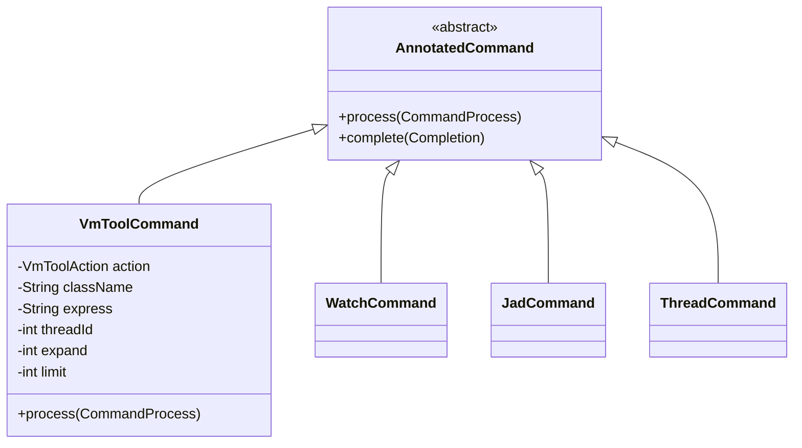
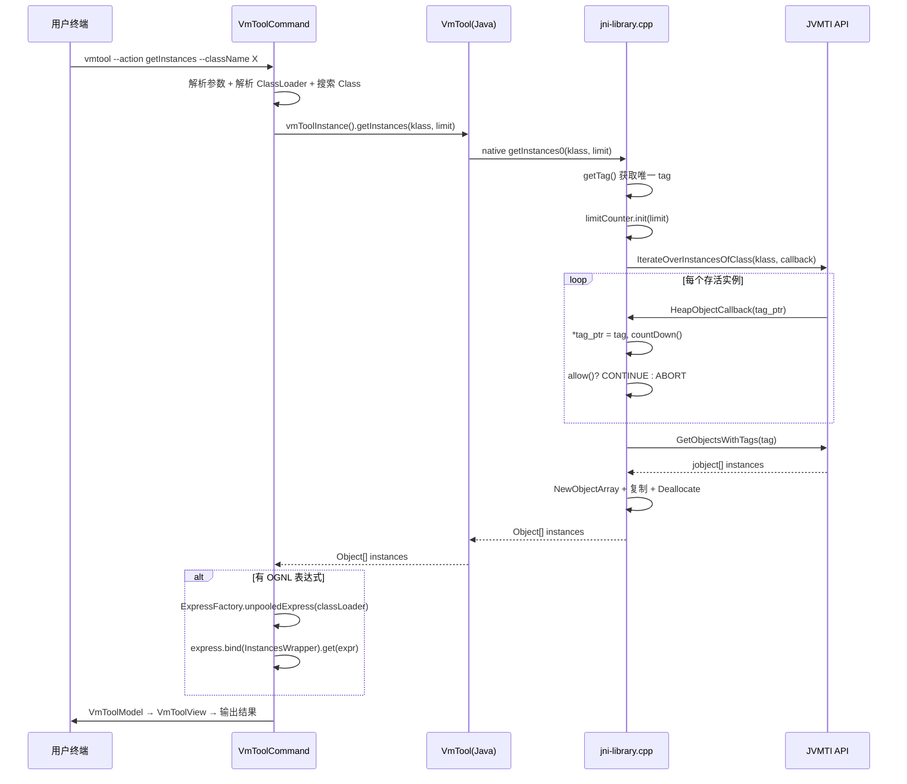
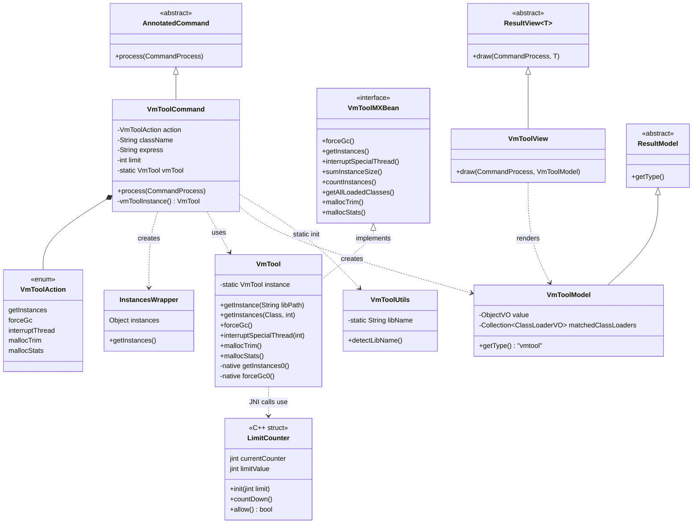
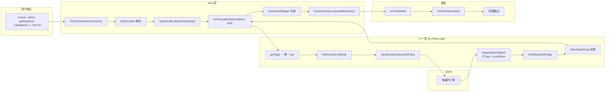

# VmToolCommand 深度解析 — JVMTI 原生能力封装

> 基于 Arthas 4.1.2 源码分析
> 方法论：程序 = 数据结构 + 算法

---

## 第 0 部分：核心原理

### 0.1 本质是什么？

vmtool 是 Arthas 对 JVMTI（JVM Tool Interface）原生能力的 Java 封装，通过 JNI 桥接 C++ 层的 JVMTI API，让用户可以直接操作 JVM 内部状态——获取存活实例、强制 GC、中断线程、释放 glibc 空闲内存。

### 0.2 为什么需要？

Java 标准 API 没有提供"获取某个类的所有存活实例"的能力。`Class.forName()` 只能拿到 `Class` 对象，无法遍历堆上的实例。而 JVMTI 作为 JVM 的调试接口，提供了 `IterateOverInstancesOfClass` 等底层 API，但这些 API 是 C/C++ 接口，Java 代码无法直接调用。需要一个 JNI 桥接层将 JVMTI 能力暴露给 Java 层。

### 0.3 怎么解决？

核心思路：**JNI 桥接 + JVMTI Tag 机制**。

1. 编译一个 C++ 动态库（`libArthasJniLibrary.so`），在库加载时通过 `GetEnv` 获取 `jvmtiEnv` 指针并开启 `can_tag_objects` 能力
2. Java 层通过 `System.load()` 加载动态库，声明 `native` 方法映射到 C++ 函数
3. 获取实例时，先用 `IterateOverInstancesOfClass` 遍历堆并给匹配对象打 tag，再用 `GetObjectsWithTags` 收集所有已标记对象

### 0.4 为什么这样设计？

- **为什么用 tag 机制而不是直接在回调中收集？** JVMTI 的 `HeapObjectCallback` 回调中不允许进行 JNI 调用（规范限制），不能在回调中创建 Java 数组或添加元素。所以先打 tag 标记，回调结束后再用 `GetObjectsWithTags` 批量收集。
- **为什么复制 .so 到临时文件？** JVM 的 `System.load()` 对同一路径的动态库只允许加载一次。多次 attach 时，前一个 classloader 加载过的库路径会被锁定，新 classloader 无法重复加载。复制到临时文件路径后，每次 attach 都是"新路径"，绕开限制。
- **为什么 `interruptThread` 用纯 Java 实现而不用 JVMTI？** JVMTI 没有"中断线程"的 API。`Thread.interrupt()` 是 Java 层的概念，JVMTI 只有 `StopThread`（抛异常）和 `SuspendThread`（暂停），语义不同。

---

## 第 1 部分：数据结构全景

### 1.1 数据结构清单

| 结构名 | 源码位置 | 核心作用 |
|--------|----------|----------|
| `VmToolCommand` | `monitor200/VmToolCommand.java` (358 行) | 命令入口，解析参数，分发 5 种 action |
| `VmToolAction` | `VmToolCommand.java:161-163` | 枚举，定义 5 种操作类型 |
| `InstancesWrapper` | `VmToolCommand.java:265-279` | 包装实例数组，为 OGNL 表达式提供 `instances` 变量绑定 |
| `VmTool` | `arthas-vmtool/.../VmTool.java` (132 行) | JNI 桥接单例，声明 8 个 native 方法 |
| `VmToolMXBean` | `arthas-vmtool/.../VmToolMXBean.java` (71 行) | JMX MBean 接口定义 |
| `LimitCounter` | `jni-library.cpp:14-33` | C++ 结构体，控制实例遍历数量上限 |
| `VmToolModel` | `model/VmToolModel.java` (49 行) | 命令结果数据模型 |
| `VmToolView` | `view/VmToolView.java` (29 行) | 终端视图渲染 |
| `VmToolUtils` | `common/VmToolUtils.java` (37 行) | 平台 native 库文件名检测 |

### 1.2 VmToolCommand

#### 1.2.1 核心作用

命令入口类，继承 `AnnotatedCommand`，通过 `@Name("vmtool")` 注解注册。解析用户参数后分发到 5 种 action 处理逻辑。

#### 1.2.2 继承关系



#### 1.2.3 全部字段

```java
// VmToolCommand.java:64-84
private static final Logger logger;             // 日志器
private VmToolAction action;                    // 用户指定的操作类型（必填）
private String className;                       // 目标类全限定名（getInstances 必填）
private String express;                         // OGNL 表达式（可选，对实例数组做二次处理）
private int threadId;                           // 要中断的线程 ID（interruptThread 用）
private String hashCode;                        // ClassLoader 的十六进制 hashCode（指定类加载器）
private String classLoaderClass;                // ClassLoader 的类名（指定类加载器的另一种方式）
private int expand;                             // 对象展开层级，默认 1
private int limit;                              // getInstances 返回实例数上限，默认 10，-1 表示无限
private String libPath;                         // 用户指定的 native 库路径（可选）
private static String defaultLibPath;           // 静态初始化块检测到的默认库路径
private static VmTool vmTool = null;            // VmTool 单例缓存（static，跨命令复用）
```

#### 1.2.4 静态初始化块（native 库路径检测）

```java
// VmToolCommand.java:86-103
static {
    // ★ 第一步：检测当前平台对应的 .so/.dylib/.dll 文件名
    String libName = VmToolUtils.detectLibName();
    if (libName != null) {
        // ★ 第二步：定位 arthas-core.jar 所在目录
        CodeSource codeSource = VmToolCommand.class.getProtectionDomain().getCodeSource();
        if (codeSource != null) {
            try {
                File bootJarPath = new File(codeSource.getLocation().toURI().getSchemeSpecificPart());
                // ★ 第三步：拼接路径 → jar同级目录/lib/libArthasJniLibrary-x64.so
                File soFile = new File(bootJarPath.getParentFile(), "lib" + File.separator + libName);
                if (soFile.exists()) {
                    defaultLibPath = soFile.getAbsolutePath();
                }
            } catch (Throwable e) {
                logger.error("can not find VmTool so", e);
            }
        }
    }
}
```

**设计决策**：使用 `CodeSource` 定位 jar 路径而不是硬编码，因为 Arthas 可以被安装到任意目录。

### 1.3 VmToolAction 枚举

```java
// VmToolCommand.java:161-163
public enum VmToolAction {
    getInstances,      // 获取某个类的存活实例
    forceGc,           // 强制垃圾回收
    interruptThread,   // 中断指定线程
    mallocTrim,        // glibc 释放空闲内存（Linux only）
    mallocStats        // glibc 内存统计输出到 stderr（Linux only）
}
```

| Action | 底层实现 | 平台限制 |
|--------|----------|----------|
| `getInstances` | JVMTI `IterateOverInstancesOfClass` + `GetObjectsWithTags` | 无 |
| `forceGc` | JVMTI `ForceGarbageCollection` | 无 |
| `interruptThread` | 纯 Java `Thread.interrupt()` | 无 |
| `mallocTrim` | glibc `malloc_trim(0)` | Linux（`__GLIBC__`） |
| `mallocStats` | glibc `malloc_stats()` | Linux（`__GLIBC__`） |

### 1.4 InstancesWrapper 内部类

```java
// VmToolCommand.java:265-279
static class InstancesWrapper {
    Object instances;                           // ★ 持有 getInstances0 返回的 Object[] 数组

    public InstancesWrapper(Object instances) {
        this.instances = instances;
    }

    public Object getInstances() {              // ★ OGNL 表达式通过 "instances" 访问此 getter
        return instances;
    }

    public void setInstances(Object instances) {
        this.instances = instances;
    }
}
```

**为什么需要这个包装类？** OGNL 表达式绑定需要一个"根对象"，表达式中的 `instances` 实际调用的是根对象的 `getInstances()` 方法。如果直接绑定数组，OGNL 无法通过 `instances` 变量名访问它。`InstancesWrapper` 提供了 `getInstances()` getter，使得 OGNL 表达式 `instances.length`、`instances[0]` 等能正确解析。

### 1.5 VmTool（JNI 桥接单例）

#### 1.5.1 核心作用

整个 vmtool 功能的核心类。实现 `VmToolMXBean` 接口，通过 `System.load()` 加载 native 动态库，声明 8 个 `native` 方法映射到 C++ 层的 JVMTI 调用。

#### 1.5.2 全部字段与方法

```java
// VmTool.java:10-39
public class VmTool implements VmToolMXBean {
    public final static String JNI_LIBRARY_NAME = "ArthasJniLibrary";  // ★ native 库名称常量
    private static VmTool instance;                                     // ★ 单例实例

    private VmTool() {}                                                 // 私有构造函数

    // ★ 单例获取（synchronized 保证线程安全）
    public static synchronized VmTool getInstance(String libPath) {
        if (instance != null) {
            return instance;                    // 已初始化直接返回
        }
        if (libPath == null) {
            System.loadLibrary(JNI_LIBRARY_NAME);  // 从 java.library.path 搜索
        } else {
            System.load(libPath);                   // 从绝对路径加载
        }
        instance = new VmTool();
        return instance;
    }
}
```

#### 1.5.3 native 方法声明

```java
// VmTool.java:41-68
private static synchronized native void forceGc0();
private static synchronized native <T> T[] getInstances0(Class<T> klass, int limit);
private static synchronized native long sumInstanceSize0(Class<?> klass);
private static native long getInstanceSize0(Object instance);          // ★ 注意：此方法没有 synchronized
private static synchronized native long countInstances0(Class<?> klass);
private static synchronized native Class<?>[] getAllLoadedClasses0(Class<?> klass);
private static synchronized native int mallocTrim0();
private static synchronized native boolean mallocStats0();
```

**关键观察**：除了 `getInstanceSize0`（获取单个对象大小），其余 native 方法都声明为 `synchronized`。原因是 `IterateOverInstancesOfClass` 会遍历整个堆，不能并发执行；而 `GetObjectSize` 只查询单个对象，无需串行化。

#### 1.5.4 interruptSpecialThread（纯 Java 实现）

```java
// VmTool.java:76-84
@Override
public void interruptSpecialThread(int threadId) {
    // ★ 通过 Thread.getAllStackTraces() 获取所有活跃线程的快照
    Map<Thread, StackTraceElement[]> allThread = Thread.getAllStackTraces();
    for (Map.Entry<Thread, StackTraceElement[]> entry : allThread.entrySet()) {
        // ★ 遍历查找目标线程 ID
        if (entry.getKey().getId() == threadId) {
            entry.getKey().interrupt();         // ★ 调用 Thread.interrupt() 设置中断标志
            return;
        }
    }
    // ★ 如果没找到线程，静默返回（不抛异常）
}
```

**设计决策**：使用 `Thread.getAllStackTraces()` 而不是 `Thread.getThreadGroup()` 遍历，因为前者返回所有线程（包括不同 ThreadGroup 的），覆盖更全面。

### 1.6 LimitCounter（C++ 结构体）

#### 1.6.1 核心作用

控制 `IterateOverInstancesOfClass` 的遍历数量上限，避免返回海量实例导致 OOM。

#### 1.6.2 完整定义

```cpp
// jni-library.cpp:14-33
struct LimitCounter {
    jint currentCounter;                        // ★ 当前已遍历的实例数
    jint limitValue;                            // ★ 上限值（<0 表示无限制）

    void init(jint limit) {                     // ★ 每次遍历前重置
        currentCounter = 0;
        limitValue = limit;
    }

    void countDown() {                          // ★ 在回调中递增计数
        currentCounter++;
    }

    bool allow() {                              // ★ 判断是否继续遍历
        if (limitValue < 0) {
            return true;                        // 负数 = 不限制
        }
        return limitValue > currentCounter;     // 未达上限 = 继续
    }
};

// ★ 全局静态实例（因为 JVMTI 回调不支持传递复杂 user_data）
static LimitCounter limitCounter = {0, 0};
```

**sizeof**：8 字节（2 × `jint`，`jint` = 4 字节）。

**生命周期**：全局静态变量，进程级单例。每次 `getInstances0` / `countInstances0` / `sumInstanceSize0` 调用前通过 `init()` 重置。

### 1.7 C++ 全局变量

```cpp
// jni-library.cpp:11-12
static jvmtiEnv *jvmti;                         // ★ JVMTI 环境指针（进程唯一）
static jlong tagCounter = 0;                     // ★ 全局递增的 tag 值（保证每次遍历使用唯一 tag）
```

**tagCounter 为什么要递增？** 每次 `getInstances0` 调用都会给对象打 tag。如果两次调用使用相同的 tag 值，第二次 `GetObjectsWithTags` 会收集到第一次遗留的标记对象，导致结果混淆。递增 `tagCounter` 保证每次调用的 tag 唯一。

### 1.8 VmToolModel

```java
// VmToolModel.java:10-48
public class VmToolModel extends ResultModel {
    private ObjectVO value;                     // ★ 命令执行结果（包装了任意对象 + 展开层级）
    private Collection<ClassLoaderVO> matchedClassLoaders;  // ★ 多 ClassLoader 匹配时的列表
    private String classLoaderClass;            // ★ ClassLoader 类名

    @Override
    public String getType() {
        return "vmtool";                        // ★ 命令类型标识
    }

    // ★ 链式 setter（返回 this）
    public VmToolModel setValue(ObjectVO value) { this.value = value; return this; }
    public VmToolModel setClassLoaderClass(String s) { this.classLoaderClass = s; return this; }
    public VmToolModel setMatchedClassLoaders(Collection<ClassLoaderVO> l) { this.matchedClassLoaders = l; return this; }
}
```

**设计决策**：链式 setter 模式（`return this`），使得构造过程可以写成一行：`new VmToolModel().setClassLoaderClass(x).setMatchedClassLoaders(y)`。

### 1.9 VmToolView

```java
// VmToolView.java:14-28
public class VmToolView extends ResultView<VmToolModel> {
    @Override
    public void draw(CommandProcess process, VmToolModel model) {
        // ★ 分支 1：多 ClassLoader 匹配，展示 ClassLoader 列表
        if (model.getMatchedClassLoaders() != null) {
            process.write("Matched classloaders: \n");
            ClassLoaderView.drawClassLoaders(process, model.getMatchedClassLoaders(), false);
            process.write("\n");
            return;
        }

        // ★ 分支 2：正常结果，通过 ObjectView 展开渲染
        ObjectVO objectVO = model.getValue();
        String resultStr = StringUtils.objectToString(
            objectVO.needExpand()
                ? new ObjectView(objectVO).draw()   // ★ 需要展开：ObjectView 递归展开
                : objectVO.getObject()              // ★ 不需要展开：直接 toString()
        );
        process.write(resultStr).write("\n");
    }
}
```

### 1.10 VmToolUtils

```java
// VmToolUtils.java:8-36
public class VmToolUtils {
    private static String libName = null;
    static {
        if (OSUtils.isMac()) {
            libName = "libArthasJniLibrary.dylib";           // macOS: 通用二进制
        }
        if (OSUtils.isLinux()) {
            if (OSUtils.isArm32()) {
                libName = "libArthasJniLibrary-arm.so";       // Linux ARM32
            } else if (OSUtils.isArm64()) {
                libName = "libArthasJniLibrary-aarch64.so";   // Linux ARM64
            } else if (OSUtils.isX86_64()) {
                libName = "libArthasJniLibrary-x64.so";       // Linux x86_64
            } else {
                libName = "libArthasJniLibrary-" + OSUtils.arch() + ".so";  // 其他架构：兜底
            }
        }
        if (OSUtils.isWindows()) {
            libName = "libArthasJniLibrary-x64.dll";          // Windows x64（默认）
            if (OSUtils.isX86()) {
                libName = "libArthasJniLibrary-x86.dll";      // Windows x86
            }
        }
    }

    public static String detectLibName() {
        return libName;                                        // ★ 返回检测到的库文件名（可能为 null）
    }
}
```

---

## 第 2 部分：算法/流程分析

### 2.1 核心流程概览



### 2.2 VmToolCommand.process()（命令入口）

#### 2.2.1 解决什么问题

命令入口方法，负责参数校验、ClassLoader 解析、Class 查找、分发到对应 action 处理。

#### 2.2.2 源码文件与位置

`VmToolCommand.java:165-263`

#### 2.2.3 真实源码 + 逐行注释

**Phase 1：getInstances — ClassLoader 解析**

```java
// VmToolCommand.java:166-204
@Override
public void process(final CommandProcess process) {
    try {
        Instrumentation inst = process.session().getInstrumentation();  // ★ 获取 Instrumentation 实例

        if (VmToolAction.getInstances.equals(action)) {
            if (className == null) {
                process.end(-1, "The className option cannot be empty!");  // ★ 参数校验
                return;
            }
            ClassLoader classLoader = null;
            if (hashCode != null) {
                // ★ 方式 1：通过 hashCode 精确定位 ClassLoader
                classLoader = ClassLoaderUtils.getClassLoader(inst, hashCode);
                if (classLoader == null) {
                    process.end(-1, "Can not find classloader with hashCode: " + hashCode + ".");
                    return;
                }
            } else if (classLoaderClass != null) {
                // ★ 方式 2：通过 ClassLoader 类名查找
                List<ClassLoader> matchedClassLoaders = ClassLoaderUtils.getClassLoaderByClassName(
                    inst, classLoaderClass);
                if (matchedClassLoaders.size() == 1) {
                    // ★ 唯一匹配：直接使用
                    classLoader = matchedClassLoaders.get(0);
                    hashCode = Integer.toHexString(matchedClassLoaders.get(0).hashCode());
                } else if (matchedClassLoaders.size() > 1) {
                    // ★ 多个匹配：返回列表让用户选择（不直接执行）
                    Collection<ClassLoaderVO> classLoaderVOList = ClassUtils
                            .createClassLoaderVOList(matchedClassLoaders);
                    VmToolModel vmToolModel = new VmToolModel()
                            .setClassLoaderClass(classLoaderClass)
                            .setMatchedClassLoaders(classLoaderVOList);
                    process.appendResult(vmToolModel);
                    process.end(-1, "Found more than one classloader ...");
                    return;
                } else {
                    process.end(-1, "Can not find classloader by class name: " + classLoaderClass);
                    return;
                }
            } else {
                // ★ 方式 3：默认使用系统类加载器
                classLoader = ClassLoader.getSystemClassLoader();
            }
```

**Phase 2：getInstances — Class 搜索 + 实例获取 + OGNL 处理**

```java
            // VmToolCommand.java:206-232
            // ★ 在已确定的 ClassLoader 范围内搜索目标类
            List<Class<?>> matchedClasses = new ArrayList<Class<?>>(
                    SearchUtils.searchClassOnly(inst, className, false, hashCode));
            int matchedClassSize = matchedClasses.size();
            if (matchedClassSize == 0) {
                process.end(-1, "Can not find class by class name: " + className + ".");
                return;
            } else if (matchedClassSize > 1) {
                // ★ 匹配到多个类：报错（通常因为不同 ClassLoader 加载了同名类）
                process.end(-1, "Found more than one class: " + matchedClasses
                    + ", please specify classloader with '-c <classloader hash>'");
                return;
            } else {
                // ★ 唯一匹配：调用 JVMTI 获取实例
                Object[] instances = vmToolInstance().getInstances(matchedClasses.get(0), limit);
                Object value = instances;
                if (express != null) {
                    // ★ 有 OGNL 表达式：创建独立的 Express 实例（unpooled，使用目标 ClassLoader）
                    Express unpooledExpress = ExpressFactory.unpooledExpress(classLoader);
                    try {
                        // ★ 将实例数组包装为 InstancesWrapper，绑定到 OGNL 上下文
                        // 用户可以写 "instances.length"、"instances[0].name" 等表达式
                        value = unpooledExpress.bind(new InstancesWrapper(instances)).get(express);
                    } catch (ExpressException e) {
                        logger.warn("ognl: failed execute express: " + express, e);
                        process.end(-1, "Failed to execute ognl ...");
                    }
                }

                // ★ 包装结果并输出
                VmToolModel vmToolModel = new VmToolModel()
                        .setValue(new ObjectVO(value, expand));
                process.appendResult(vmToolModel);
                process.end();
            }
```

**Phase 3：其他 action 处理**

```java
        // VmToolCommand.java:233-256
        } else if (VmToolAction.forceGc.equals(action)) {
            vmToolInstance().forceGc();                 // ★ JVMTI ForceGarbageCollection
            process.write("\n");
            process.end();
            return;
        } else if (VmToolAction.interruptThread.equals(action)) {
            vmToolInstance().interruptSpecialThread(threadId);  // ★ 纯 Java Thread.interrupt()
            process.write("\n");
            process.end();
            return;
        } else if (VmToolAction.mallocTrim.equals(action)) {
            int result = vmToolInstance().mallocTrim();  // ★ glibc malloc_trim(0)
            process.write("\n");
            // ★ result: 1=成功释放, 0=无可释放, -1=不支持（非 glibc）
            process.end(result == 1 ? 0 : -1, "mallocTrim result: " +
                (result == 1 ? "true" : (result == 0 ? "false" : "not supported")));
            return;
        } else if (VmToolAction.mallocStats.equals(action)) {
            boolean result = vmToolInstance().mallocStats();  // ★ glibc malloc_stats() → stderr
            process.write("\n");
            process.end(result ? 0 : -1, "mallocStats result: " +
                (result ? "true" : "not supported"));
            return;
        }
```

#### 2.2.4 设计决策

- **ClassLoader 三级降级策略**：hashCode > classLoaderClass > 系统类加载器。精确度递减，使用便捷度递增。
- **多匹配时中断而非猜测**：无论是 ClassLoader 多匹配还是 Class 多匹配，都报错让用户精确指定，避免操作到错误的对象。
- **OGNL 使用 unpooledExpress**：不使用 `threadLocalExpress`（线程复用），而是每次创建新实例。原因是需要传入目标 ClassLoader 作为 OGNL 的类解析器——`instances` 数组中的对象可能来自自定义 ClassLoader，默认的 AppClassLoader 无法识别其类型。

### 2.3 vmToolInstance()（native 库加载 + 单例获取）

#### 2.3.1 解决什么问题

延迟初始化 VmTool 单例，处理 native 库"同一路径不能重复加载"的问题。

#### 2.3.2 源码文件与位置

`VmToolCommand.java:281-310`

#### 2.3.3 真实源码 + 逐行注释

```java
// VmToolCommand.java:281-310
private VmTool vmToolInstance() {
    if (vmTool != null) {
        return vmTool;                          // ★ 快速路径：已初始化直接返回
    } else {
        if (libPath == null) {
            libPath = defaultLibPath;           // ★ 使用静态初始化块检测到的默认路径
        }

        // ★ 关键设计：复制 .so 到临时文件，避免 "Native Library already loaded" 错误
        FileOutputStream tmpLibOutputStream = null;
        FileInputStream libInputStream = null;
        try {
            // ★ 创建临时文件：前缀 "ArthasJniLibrary"，后缀由系统决定
            File tmpLibFile = File.createTempFile(VmTool.JNI_LIBRARY_NAME, null);
            tmpLibOutputStream = new FileOutputStream(tmpLibFile);
            libInputStream = new FileInputStream(libPath);

            IOUtils.copy(libInputStream, tmpLibOutputStream);   // ★ 复制 .so 内容
            libPath = tmpLibFile.getAbsolutePath();             // ★ 替换为临时路径
            logger.debug("copy {} to {}", libPath, tmpLibFile);
        } catch (Throwable e) {
            logger.error("try to copy lib error! libPath: {}", libPath, e);
            // ★ 复制失败：降级使用原始路径（可能因为"已加载"而失败）
        } finally {
            IOUtils.close(libInputStream);
            IOUtils.close(tmpLibOutputStream);
        }

        // ★ 调用 VmTool.getInstance(libPath) → System.load(libPath)
        vmTool = VmTool.getInstance(libPath);
    }
    return vmTool;
}
```

#### 2.3.4 设计决策

**为什么需要临时文件复制？**

JVM 的 `System.load(path)` 内部会检查：如果 `path` 指向的文件已经被某个 ClassLoader 加载过，其他 ClassLoader 调用 `System.load(path)` 时会抛出 `UnsatisfiedLinkError: Native Library ... already loaded in another classloader`。Arthas 每次 attach 都会创建新的 ClassLoader，如果直接使用同一个 `.so` 路径，第二次 attach 就会失败。复制到临时文件后，路径不同，绕开了 JVM 的这个限制。

### 2.4 init_agent()（C++ JVMTI 初始化）

#### 2.4.1 解决什么问题

在 native 库被加载时，获取 JVMTI 环境指针并开启 `can_tag_objects` 能力——这是使用 `IterateOverInstancesOfClass` 和 tag 机制的前置条件。

#### 2.4.2 源码文件与位置

`jni-library.cpp:38-57`

#### 2.4.3 真实源码 + 逐行注释

```cpp
// jni-library.cpp:38-73
extern "C"
int init_agent(JavaVM *vm, void *reserved) {
    jint rc;
    // ★ 通过 JavaVM 指针获取 JVMTI 环境（版本 1.2）
    rc = vm->GetEnv((void **)&jvmti, JVMTI_VERSION_1_2);
    if (rc != JNI_OK) {
        fprintf(stderr, "ERROR: arthas vmtool Unable to create jvmtiEnv, "
                "GetEnv failed, error=%d\n", rc);
        return -1;
    }

    // ★ 请求 can_tag_objects 能力
    // 没有这个能力，IterateOverInstancesOfClass 和 GetObjectsWithTags 都不能用
    jvmtiCapabilities capabilities = {0};       // 全部清零
    capabilities.can_tag_objects = 1;           // 只请求 tag 能力
    jvmtiError error = jvmti->AddCapabilities(&capabilities);
    if (error) {
        fprintf(stderr, "ERROR: arthas vmtool JVMTI AddCapabilities failed!%u\n", error);
        return JNI_FALSE;
    }

    return JNI_OK;
}

// ★ 三个入口点，统一调用 init_agent
extern "C" JNIEXPORT jint JNICALL
Agent_OnLoad(JavaVM *vm, char *options, void *reserved) {     // 启动时 -agentlib 加载
    return init_agent(vm, reserved);
}

extern "C" JNIEXPORT jint JNICALL
Agent_OnAttach(JavaVM* vm, char* options, void* reserved) {   // 运行时 Attach API 加载
    return init_agent(vm, reserved);
}

extern "C" JNIEXPORT jint JNICALL
JNI_OnLoad(JavaVM* vm, void* reserved) {                      // System.load() 加载
    init_agent(vm, reserved);
    return JNI_VERSION_1_6;                                    // ★ 返回支持的 JNI 版本
}
```

#### 2.4.4 设计决策

**为什么同时支持三个入口？**

| 入口 | 触发场景 | 说明 |
|------|----------|------|
| `Agent_OnLoad` | JVM 启动参数 `-agentlib:ArthasJniLibrary` | 启动时加载（少见） |
| `Agent_OnAttach` | Attach API 动态加载 agent | 运行时附加（少见） |
| `JNI_OnLoad` | `System.load(path)` 或 `System.loadLibrary(name)` | **Arthas 实际使用的方式** |

Arthas 实际通过 `VmTool.getInstance(libPath)` → `System.load(libPath)` → `JNI_OnLoad` 路径加载。但同时支持 `Agent_OnLoad/OnAttach` 是为了兼容其他使用方式（如直接作为 JVMTI agent 加载）。

### 2.5 getInstances0()（JVMTI 堆遍历 + Tag 收集）

#### 2.5.1 解决什么问题

遍历 JVM 堆上某个类的所有存活实例，支持数量限制（limit），返回 Java 对象数组。这是 vmtool 最核心、最复杂的功能。

#### 2.5.2 源码文件与位置

`jni-library.cpp:75-127`

#### 2.5.3 真实源码 + 逐行注释

**辅助函数：getTag() 和 HeapObjectCallback**

```cpp
// jni-library.cpp:81-98
extern "C"
jlong getTag() {
    return ++tagCounter;                        // ★ 全局递增，保证每次调用的 tag 唯一
}

extern "C"
jvmtiIterationControl JNICALL
HeapObjectCallback(jlong class_tag, jlong size, jlong *tag_ptr, void *user_data) {
    // ★ JVMTI 回调：对堆上每个匹配类的实例调用一次
    // class_tag: 该对象所属类的 tag（未使用）
    // size: 该对象的大小（未使用）
    // tag_ptr: 指向该对象的 tag 槽，写入值即"打 tag"
    // user_data: 传入的 tag 值指针

    jlong *data = static_cast<jlong *>(user_data);
    *tag_ptr = *data;                           // ★ 给当前对象打上唯一 tag

    limitCounter.countDown();                   // ★ 计数器递增
    if (limitCounter.allow()) {
        return JVMTI_ITERATION_CONTINUE;        // ★ 未达上限，继续遍历
    } else {
        return JVMTI_ITERATION_ABORT;           // ★ 达到上限，终止遍历
    }
}
```

**核心函数：getInstances0**

```cpp
// jni-library.cpp:100-127
extern "C"
JNIEXPORT jobjectArray JNICALL
Java_arthas_VmTool_getInstances0(JNIEnv *env, jclass thisClass, jclass klass, jint limit) {
    jlong tag = getTag();                       // ★ Step 1：获取本次遍历的唯一 tag
    limitCounter.init(limit);                   // ★ Step 2：重置计数器

    // ★ Step 3：遍历堆，对 klass 类型的每个存活/不可达实例调用 HeapObjectCallback
    // JVMTI_HEAP_OBJECT_EITHER = 遍历可达 + 不可达的对象（只要未被回收）
    jvmtiError error = jvmti->IterateOverInstancesOfClass(
        klass,                                  // 目标类
        JVMTI_HEAP_OBJECT_EITHER,               // 遍历策略：可达+不可达
        HeapObjectCallback,                     // 回调函数
        &tag);                                  // user_data：传递 tag 值
    if (error) {
        printf("ERROR: JVMTI IterateOverInstancesOfClass failed!%u\n", error);
        return NULL;
    }

    // ★ Step 4：收集所有打了 tag 的对象
    jint count = 0;
    jobject *instances;
    error = jvmti->GetObjectsWithTags(
        1,                                      // tag 数量
        &tag,                                   // tag 值数组
        &count,                                 // 输出：匹配对象数量
        &instances,                             // 输出：匹配对象数组（JVMTI 分配的内存）
        NULL);                                  // 不需要 tag 值输出
    if (error) {
        printf("ERROR: JVMTI GetObjectsWithTags failed!%u\n", error);
        return NULL;
    }

    // ★ Step 5：转换为 Java 数组
    jobjectArray array = env->NewObjectArray(count, klass, NULL);
    for (int i = 0; i < count; i++) {
        env->SetObjectArrayElement(array, i, instances[i]);
    }
    // ★ Step 6：释放 JVMTI 分配的内存（GetObjectsWithTags 的输出缓冲区）
    jvmti->Deallocate(reinterpret_cast<unsigned char *>(instances));
    return array;
}
```

#### 2.5.4 设计决策

**为什么使用 `JVMTI_HEAP_OBJECT_EITHER` 而不是 `JVMTI_HEAP_OBJECT_LIVE`？**

`JVMTI_HEAP_OBJECT_EITHER` 包含可达和不可达对象，这看似返回了"垃圾"对象。但实际上：
1. 不可达对象在 GC 完成前仍然有效，可以被安全引用
2. `GetObjectsWithTags` 返回的 `jobject` 会创建 JNI 引用，阻止 GC 回收这些对象
3. 使用 `EITHER` 可以在 GC 周期之间也能找到所有对象，结果更完整

**为什么不在 HeapObjectCallback 中直接收集到数组？**

JVMTI 规范规定：在 `IterateOverInstancesOfClass` 的回调函数中，**不允许进行 JNI 调用**（如 `NewObjectArray`、`SetObjectArrayElement`）。回调环境是受限的，只能做简单的内存操作（如打 tag）。所以必须先打 tag，等遍历结束后再用 `GetObjectsWithTags` 收集。

**为什么需要 `Deallocate`？**

`GetObjectsWithTags` 的 `instances` 输出缓冲区是 JVMTI 通过自己的内存分配器分配的，Java GC 不会回收它。必须手动调用 `jvmti->Deallocate()` 释放，否则会造成 native 内存泄漏。

### 2.6 forceGc0()（强制 GC）

#### 2.6.1 解决什么问题

强制触发一次完整的 GC 周期。`System.gc()` 只是"建议"，JVM 可以忽略（尤其是设置了 `-XX:+DisableExplicitGC` 时）。JVMTI 的 `ForceGarbageCollection` 是真正的"强制"。

#### 2.6.2 源码

```cpp
// jni-library.cpp:75-79
extern "C"
JNIEXPORT void JNICALL
Java_arthas_VmTool_forceGc0(JNIEnv *env, jclass thisClass) {
    jvmti->ForceGarbageCollection();            // ★ 一行代码，直接调用 JVMTI API
}
```

### 2.7 sumInstanceSize0()（实例总内存统计）

#### 2.7.1 解决什么问题

统计某个类所有存活实例的总内存占用（字节）。与 `getInstances0` 类似的 tag 机制，但不返回对象，只返回 `long` 总大小。

#### 2.7.2 源码

```cpp
// jni-library.cpp:129-157
extern "C"
JNIEXPORT jlong JNICALL
Java_arthas_VmTool_sumInstanceSize0(JNIEnv *env, jclass thisClass, jclass klass) {
    jlong tag = getTag();
    limitCounter.init(-1);                      // ★ 不限制数量（统计总量必须遍历全部）
    jvmtiError error = jvmti->IterateOverInstancesOfClass(klass, JVMTI_HEAP_OBJECT_EITHER,
                                               HeapObjectCallback, &tag);
    if (error) {
        printf("ERROR: JVMTI IterateOverInstancesOfClass failed!%u\n", error);
        return -1;
    }

    jint count = 0;
    jobject *instances;
    error = jvmti->GetObjectsWithTags(1, &tag, &count, &instances, NULL);
    if (error) {
        printf("ERROR: JVMTI GetObjectsWithTags failed!%u\n", error);
        return -1;
    }

    jlong sum = 0;
    for (int i = 0; i < count; i++) {
        jlong size = 0;
        jvmti->GetObjectSize(instances[i], &size);  // ★ 逐个查询对象大小
        sum = sum + size;
    }
    jvmti->Deallocate(reinterpret_cast<unsigned char *>(instances));
    return sum;
}
```

### 2.8 countInstances0()（实例计数）

#### 2.8.1 解决什么问题

统计某个类的存活实例总数，不返回对象。与 `sumInstanceSize0` 几乎相同的流程，但 `GetObjectsWithTags` 的 `instances` 参数传 `NULL`，只获取 count。

```cpp
// jni-library.cpp:170-189
extern "C"
JNIEXPORT jlong JNICALL
Java_arthas_VmTool_countInstances0(JNIEnv *env, jclass thisClass, jclass klass) {
    jlong tag = getTag();
    limitCounter.init(-1);
    jvmtiError error = jvmti->IterateOverInstancesOfClass(klass, JVMTI_HEAP_OBJECT_EITHER,
                                               HeapObjectCallback, &tag);
    if (error) { /* ... */ return -1; }

    jint count = 0;
    error = jvmti->GetObjectsWithTags(1, &tag, &count, NULL, NULL);  // ★ instances 传 NULL
    if (error) { /* ... */ return -1; }
    return count;                               // ★ 只返回数量
}
```

### 2.9 getAllLoadedClasses0()（获取所有已加载的类）

```cpp
// jni-library.cpp:191-210
extern "C"
JNIEXPORT jobjectArray JNICALL Java_arthas_VmTool_getAllLoadedClasses0
        (JNIEnv *env, jclass thisClass, jclass kclass) {
    jclass *classes;
    jint count = 0;

    // ★ JVMTI GetLoadedClasses：返回所有已加载的类
    jvmtiError error = jvmti->GetLoadedClasses(&count, &classes);
    if (error) { /* ... */ return NULL; }

    // ★ 转换为 Java 数组
    jobjectArray array = env->NewObjectArray(count, kclass, NULL);  // kclass = Class.class
    for (int i = 0; i < count; i++) {
        env->SetObjectArrayElement(array, i, classes[i]);
    }
    jvmti->Deallocate(reinterpret_cast<unsigned char *>(classes));
    return array;
}
```

**注意**：`getAllLoadedClasses` 在 `VmToolCommand` 中**没有对应的 action**（枚举中没有），只通过 `VmToolMXBean` JMX 接口和测试中使用。

### 2.10 mallocTrim0() / mallocStats0()（glibc 内存管理）

```cpp
// jni-library.cpp:212-230
extern "C"
JNIEXPORT jint JNICALL Java_arthas_VmTool_mallocTrim0(JNIEnv *env, jclass thisClass) {
#ifdef __GLIBC__
    return ::malloc_trim(0);                    // ★ 释放 glibc 空闲内存，返回 1=成功/0=未释放
#endif
    return -1;                                  // ★ 非 glibc 环境返回 -1（不支持）
}

extern "C"
JNIEXPORT jboolean JNICALL Java_arthas_VmTool_mallocStats0(JNIEnv *env, jclass thisClass) {
#ifdef __GLIBC__
    ::malloc_stats();                           // ★ 输出 malloc 内存统计到 stderr
    return JNI_TRUE;
#else
    return JNI_FALSE;
#endif
}
```

**使用场景**：当 JVM 的 native 内存（Metaspace、JNI 分配、Direct ByteBuffer 的 native 部分）过高时，`mallocTrim` 可以尝试将 glibc 空闲堆块归还给操作系统。`mallocStats` 用于诊断 glibc 的内存碎片情况。

### 2.11 VmToolView.draw()（视图渲染）

#### 2.11.1 解决什么问题

将 VmToolModel 渲染为终端可读的文本输出。

#### 2.11.2 源码

```java
// VmToolView.java:16-27
@Override
public void draw(CommandProcess process, VmToolModel model) {
    if (model.getMatchedClassLoaders() != null) {
        // ★ 多 ClassLoader 匹配场景：渲染 ClassLoader 列表
        process.write("Matched classloaders: \n");
        ClassLoaderView.drawClassLoaders(process, model.getMatchedClassLoaders(), false);
        process.write("\n");
        return;
    }

    // ★ 正常结果渲染
    ObjectVO objectVO = model.getValue();
    String resultStr = StringUtils.objectToString(
        objectVO.needExpand()
            ? new ObjectView(objectVO).draw()   // ★ expand > 0：递归展开对象字段
            : objectVO.getObject()              // ★ expand = 0 或 null：直接 toString()
    );
    process.write(resultStr).write("\n");
}
```

---

## 第 3 部分：深度 Q&A

### Q1：vmtool 获取的实例包含已死亡对象吗？

使用 `JVMTI_HEAP_OBJECT_EITHER` 遍历策略，理论上包含不可达对象。但在实际使用中：
1. `GetObjectsWithTags` 返回的 `jobject` 会创建 JNI 本地引用，使对象重新变为可达
2. 在返回给 Java 层后，数组持有强引用，GC 不会回收
3. 如果需要确保只获取可达对象，可以先 `vmtool --action forceGc` 再 `getInstances`

### Q2：getInstances 会导致 STW 吗？

`IterateOverInstancesOfClass` 是 JVMTI 的"堆遍历"操作。根据 JVMTI 规范：
- 遍历期间 GC 被暂停（JVMTI 保证遍历视图一致性）
- 遍历期间其他线程**可以继续运行**（不是完全 STW）
- 但遍历本身可能较慢（取决于堆大小和实例数量），对应用有性能影响
- **生产环境谨慎使用**，尤其是大堆 + 大量实例的情况

### Q3：tagCounter 溢出怎么办？

`tagCounter` 是 `jlong`（64 位有符号整数），最大值 2^63 - 1 ≈ 9.2 × 10^18。即使每秒调用 10 亿次，也需要约 292 年才会溢出。实际使用中不存在溢出风险。

### Q4：为什么 native 方法大部分用 synchronized？

`IterateOverInstancesOfClass` 遍历堆时使用全局的 `limitCounter` 和 `tagCounter`。如果两个线程同时调用 `getInstances0`，会互相覆盖 `limitCounter` 的状态，导致 limit 功能失效或结果混乱。`synchronized` 在 Java 层串行化所有调用，确保全局状态安全。

`getInstanceSize0` 不需要 `synchronized`，因为 `GetObjectSize` 只读取单个对象的大小，不使用任何全局状态。

---

## 第 4 部分：对比分析

### 4.1 vmtool 各 action 实现对比

| Action | 实现层 | JVMTI API | 全局状态 | synchronized | 返回类型 |
|--------|--------|-----------|----------|-------------|----------|
| `getInstances` | C++/JNI | `IterateOverInstancesOfClass` + `GetObjectsWithTags` | tagCounter + limitCounter | 是 | `Object[]` |
| `forceGc` | C++/JNI | `ForceGarbageCollection` | 无 | 是 | `void` |
| `interruptThread` | 纯 Java | `Thread.getAllStackTraces()` + `Thread.interrupt()` | 无 | 否 | `void` |
| `mallocTrim` | C++/JNI | glibc `malloc_trim(0)` | 无 | 是 | `int` |
| `mallocStats` | C++/JNI | glibc `malloc_stats()` | 无 | 是 | `boolean` |

### 4.2 vmtool vs JMX MXBean 访问方式对比

| 维度 | vmtool 命令行 | VmToolMXBean JMX |
|------|--------------|------------------|
| 使用方式 | Arthas 终端交互 | JMX 远程连接 / 编程 API |
| 支持的功能 | 5 种 action | 9 个方法（多了 sumInstanceSize/getInstanceSize/countInstances/getAllLoadedClasses） |
| OGNL 支持 | 是（--express） | 否 |
| 输出格式 | 终端文本 | Java 对象 |
| 适用场景 | 快速诊断 | 编程集成 / 监控系统 |

### 4.3 getInstances vs countInstances vs sumInstanceSize

| 方法 | 遍历 | 收集对象 | 查询大小 | 返回值 | limit 支持 |
|------|------|---------|---------|--------|-----------|
| `getInstances0` | 是 | 是（`instances` 非 NULL） | 否 | `Object[]` | 是 |
| `countInstances0` | 是 | 否（`instances` = NULL） | 否 | `long` count | 否（全量） |
| `sumInstanceSize0` | 是 | 是 | 是（逐个 `GetObjectSize`） | `long` 字节数 | 否（全量） |

---

## 第 5 部分：实战案例

### 案例 1：获取 Spring ApplicationContext 实例

```bash
# 指定 ClassLoader（Spring Boot 应用通常使用 LaunchedURLClassLoader）
vmtool --action getInstances \
    --classLoaderClass org.springframework.boot.loader.LaunchedURLClassLoader \
    --className org.springframework.context.ApplicationContext

# 获取后通过 OGNL 调用方法
vmtool --action getInstances \
    --classLoaderClass org.springframework.boot.loader.LaunchedURLClassLoader \
    --className org.springframework.context.ApplicationContext \
    --express 'instances[0].getBean("userService")'
```

### 案例 2：检查内存泄漏

```bash
# 查看某个类的实例数量
vmtool --action getInstances --className com.example.CacheEntry --limit -1 \
    --express 'instances.length'

# 强制 GC 后再查看，对比数量是否下降
vmtool --action forceGc
vmtool --action getInstances --className com.example.CacheEntry --limit -1 \
    --express 'instances.length'
```

### 案例 3：释放 glibc 空闲内存

```bash
# 诊断 native 内存碎片（输出到应用的 stderr）
vmtool --action mallocStats

# 尝试归还空闲内存给 OS
vmtool --action mallocTrim
```

### 案例 4：中断卡死线程

```bash
# 先用 thread 命令找到目标线程 ID
thread

# 中断指定线程
vmtool --action interruptThread -t 42
```

---

## 第 6 部分：数据结构关系图



### 数据流图



---

## 第 7 部分：总结

### 7.1 数据结构层面

| 结构 | 核心特征 |
|------|----------|
| `VmToolCommand` | 命令入口，继承 `AnnotatedCommand`，10+ 个参数字段，static `vmTool` 缓存 |
| `VmTool` | synchronized 单例，8 个 native 方法 + 1 个纯 Java 方法（interruptSpecialThread） |
| `VmToolMXBean` | JMX 接口，比命令行多暴露 4 个方法 |
| `LimitCounter` | C++ 全局 8 字节结构体，控制遍历上限 |
| `InstancesWrapper` | OGNL 绑定桥梁，提供 `instances` getter |
| `VmToolModel` | 链式 setter，type = "vmtool" |
| `VmToolView` | 两条分支：ClassLoader 列表 / ObjectView 展开渲染 |

### 7.2 算法层面

| 算法 | 核心设计决策 |
|------|-------------|
| getInstances | **Tag 两阶段法**：回调中打 tag → 回调后 GetObjectsWithTags 收集。因为回调中不允许 JNI 调用 |
| native 库加载 | **临时文件复制**：绕开 JVM "同路径不能重复 System.load" 的限制 |
| ClassLoader 解析 | **三级降级**：hashCode > classLoaderClass > 系统类加载器 |
| OGNL 处理 | **unpooled + 目标 ClassLoader**：保证 OGNL 能解析自定义 ClassLoader 加载的类型 |
| limit 控制 | **C++ 层 ABORT**：在 HeapObjectCallback 中判断，提前终止遍历而非遍历后截断 |
| JVMTI 初始化 | **三入口统一**：Agent_OnLoad / Agent_OnAttach / JNI_OnLoad 都调 init_agent |

### 7.3 核心要点

1. vmtool 是 Arthas 中唯一直接使用 JVMTI C++ API 的命令，其他命令（watch/trace/stack）通过 `java.lang.instrument` 间接使用字节码增强
2. Tag 两阶段法是 JVMTI 堆遍历的标准模式——回调中只打标记，事后批量收集
3. 临时文件复制 `.so` 是一个精巧的工程 trick，解决了 JVM ClassLoader 隔离带来的 native 库加载冲突
4. `interruptThread` 是唯一纯 Java 实现的 action，因为 JVMTI 没有"中断线程"语义的 API
5. `mallocTrim/mallocStats` 是 glibc 特有功能，用于诊断和缓解 native 内存碎片问题
