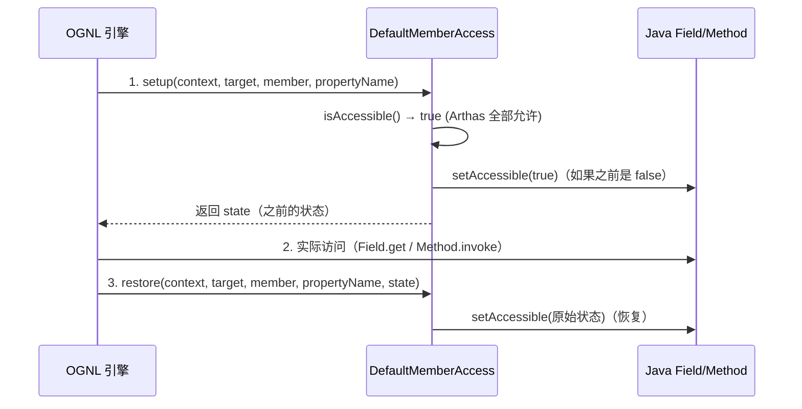
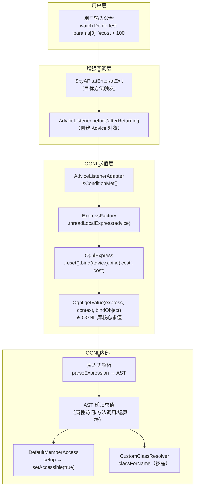
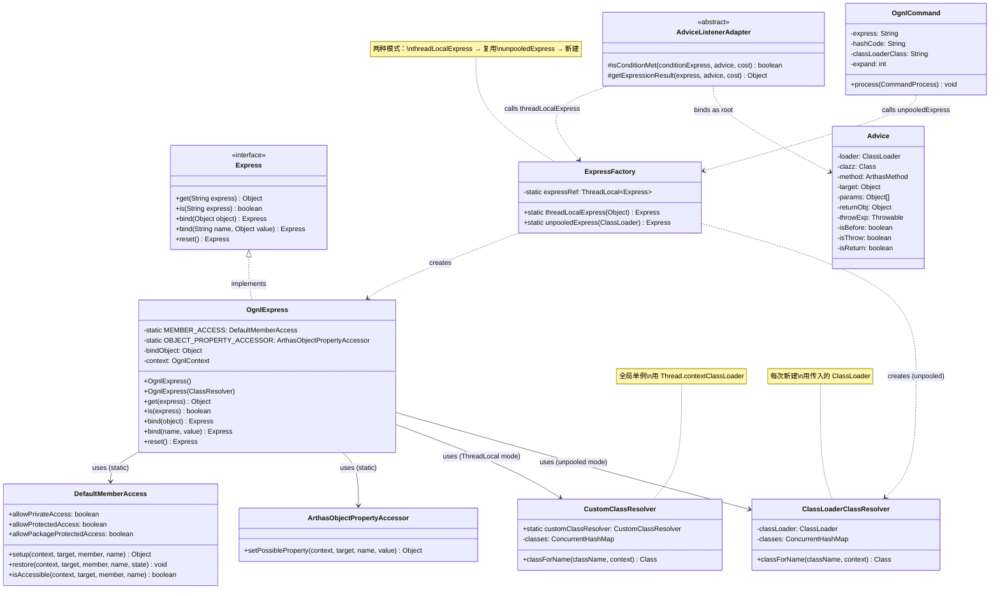

# OGNL 表达式引擎深度解析

> 基于 Arthas 4.1.2 本地源码分析
> 源码路径：`/data/workspace/arthas-4.1.2/arthas/core/src/main/java/com/taobao/arthas/core/command/express/`
> 方法论：程序 = 数据结构 + 算法

---

## 第 0 部分：核心原理 ⭐

### 0.1 本质是什么？

OGNL（Object-Graph Navigation Language）是 Arthas 的**运行时表达式求值引擎**，让 watch/trace/tt/ognl 等命令能用字符串表达式动态访问 Java 对象图。

### 0.2 为什么需要？

Arthas 的核心使用场景是：**在运行时，用户输入一条表达式字符串（如 `params[0].name`），Arthas 需要在目标方法的上下文中对这个字符串求值，提取出 Java 对象的字段值**。

这个问题无法用编译时方案解决——用户输入什么表达式是运行时才知道的。因此必须有一个**解释执行**的表达式引擎：接收字符串，在给定的对象上下文中求值，返回结果。

### 0.3 怎么解决？

核心思路：**封装 OGNL 库 + 解决 ClassLoader 隔离 + ThreadLocal 复用**。

Arthas 没有自己实现表达式引擎，而是封装了 Apache OGNL 库。关键设计有三点：
1. **双层 ClassResolver**：`CustomClassResolver`（用线程上下文 ClassLoader）和 `ClassLoaderClassResolver`（用指定 ClassLoader），解决 Arthas 与目标应用在不同 ClassLoader 下的类解析问题。
2. **ThreadLocal 复用**：watch/trace 等增强命令在每次方法回调中都要求值表达式（高频），用 `ThreadLocal<Express>` 避免每次创建新引擎实例。
3. **安全控制**：默认 strict 模式禁止 OGNL 修改对象属性，防止诊断工具意外改变业务状态。

### 0.4 为什么这样设计？

- **为什么用 OGNL 而不是自研表达式引擎？** OGNL 是成熟的 Java 表达式语言，支持方法调用、属性访问、集合操作、Lambda 等丰富语法，重新造轮子没有收益。
- **为什么需要 ThreadLocal 复用？** watch 命令在目标方法每次被调用时都要执行一次 OGNL 求值。如果被观察方法是高频方法（如每秒调用上万次），每次都 `new OgnlExpress()` 会产生大量短命对象和 GC 压力。ThreadLocal 保证每个线程只有一个引擎实例，`reset()` 后复用。
- **为什么有两种 ClassResolver？** `CustomClassResolver` 是全局单例，用于 ThreadLocal 模式（watch/trace），它通过 `Thread.currentThread().getContextClassLoader()` 动态获取当前线程的 ClassLoader——这在增强命令中是正确的，因为回调发生在目标应用线程上。而 `ClassLoaderClassResolver` 用于 `ognl` 独立命令和 `tt -w` 回放场景，需要**显式指定**目标 ClassLoader（因为 ognl 命令执行在 Arthas 线程，不能依赖线程上下文）。
- **为什么 DefaultMemberAccess 要开放 private 访问？** OGNL 默认只能访问 public 成员。但诊断场景恰恰需要访问 private 字段（如观察内部状态），因此 Arthas 将 allowPrivateAccess/allowProtectedAccess/allowPackageProtectedAccess 全部设为 true。

---

## 第 1 部分：数据结构全景 ⭐

### 1.1 数据结构清单

| # | 结构名 | 源码位置 | 行数 | 核心作用 |
|---|--------|----------|------|----------|
| 1 | **Express** | `express/Express.java` | 52 | 表达式引擎接口，定义求值/绑定/重置 API |
| 2 | **OgnlExpress** | `express/OgnlExpress.java` | 66 | OGNL 引擎实现类，封装 ognl 库 |
| 3 | **ExpressFactory** | `express/ExpressFactory.java` | 32 | 引擎工厂，ThreadLocal 复用 + unpooled 创建 |
| 4 | **DefaultMemberAccess** | `express/DefaultMemberAccess.java` | 111 | OGNL 成员访问控制，突破 private 限制 |
| 5 | **CustomClassResolver** | `express/CustomClassResolver.java` | 44 | 全局单例类解析器，用线程上下文 ClassLoader |
| 6 | **ClassLoaderClassResolver** | `express/ClassLoaderClassResolver.java` | 42 | 指定 ClassLoader 的类解析器 |
| 7 | **ArthasObjectPropertyAccessor** | `express/ArthasObjectPropertyAccessor.java` | 23 | OGNL 属性访问器，strict 模式安全控制 |
| 8 | **ExpressException** | `express/ExpressException.java` | 30 | 表达式求值异常封装 |
| 9 | **OgnlCommand** | `klass100/OgnlCommand.java` | 118 | ognl 独立命令入口 |
| 10 | **Advice** | `advisor/Advice.java` | 146 | OGNL 求值时的绑定根对象 |
| 11 | **AdviceListenerAdapter** | `advisor/AdviceListenerAdapter.java` | 157 | 增强命令回调基类，调用 OGNL 的统一入口 |

---

### 1.2 Express 接口

#### 问题推导

**问题**：OGNL 引擎需要对外暴露什么能力？

**需要的操作**：
1. **求值**：接收表达式字符串，返回结果对象 → 需要 `get(express)`
2. **条件判断**：`--condition-express` 需要布尔结果 → 需要 `is(express)`
3. **绑定上下文**：表达式中的 `params`/`returnObj` 指向什么对象？→ 需要 `bind(object)` 绑定根对象
4. **绑定额外变量**：`#cost` 不在根对象中 → 需要 `bind(name, value)` 绑定命名变量
5. **复用**：ThreadLocal 模式下同一实例反复使用 → 需要 `reset()` 清空上次状态

**推导出的结构形状**：Express 是一个 5 方法接口——get/is/bind(object)/bind(name,value)/reset。返回 `Express` 自身（Builder 模式）支持链式调用 `reset().bind(advice).get(expr)`。

**源码位置**：`express/Express.java:1-52`

**作用**：定义表达式引擎的统一 API，解耦引擎实现。

```java
// express/Express.java:7-52
public interface Express {

    // 对表达式求值，返回结果对象
    Object get(String express) throws ExpressException;

    // 对表达式求值，返回布尔结果（用于条件过滤）
    boolean is(String express) throws ExpressException;

    // 绑定根对象（OGNL 中的 #root / 默认对象）
    Express bind(Object object);

    // 绑定命名变量（如 #cost、#params 等）
    Express bind(String name, Object value);

    // 重置所有绑定（清空 context），复用前调用
    Express reset();
}
```

**5 个方法的职责划分**：

| 方法 | 返回类型 | 用途 | 调用频率 |
|------|----------|------|----------|
| `get(express)` | `Object` | 提取值（watch 表达式求值） | 极高（每次方法回调） |
| `is(express)` | `boolean` | 条件过滤（`--condition-express`） | 极高（每次方法回调） |
| `bind(object)` | `Express` | 绑定根对象（Advice） | 每次求值前 |
| `bind(name, value)` | `Express` | 绑定额外变量（cost） | 每次求值前 |
| `reset()` | `Express` | 清空上下文，复用实例 | 每次求值前（ThreadLocal 模式） |

**设计决策**：接口返回 `Express` 自身（Builder 模式），支持链式调用：
```java
ExpressFactory.threadLocalExpress(advice).bind("cost", cost).get(express);
```

---

### 1.3 OgnlExpress 实现类（核心）

#### 问题推导

**问题**：Express 接口有了，实现类需要持有什么状态才能完成 OGNL 求值？

**需要的信息**：
1. **求值根对象**：`Ognl.getValue(expr, context, root)` 需要 root → 需要 `bindObject` 字段
2. **OGNL 上下文**：存放命名变量（`#cost`）、MemberAccess、ClassResolver → 需要 `OgnlContext context`
3. **成员访问控制**：需要突破 private 限制 → 需要全局共享的 `DefaultMemberAccess`（static final）
4. **属性安全控制**：防止 OGNL 修改业务对象 → 需要全局共享的 `ArthasObjectPropertyAccessor`（static final）

**推导出的结构形状**：OgnlExpress 只有 2 个实例字段（bindObject + context）和 2 个 static final 全局对象。`get()` 的本质是调用 `Ognl.getValue(express, context, bindObject)` 这一行——整个类就是围绕这一行调用做的封装。

**源码位置**：`express/OgnlExpress.java:1-66`

**作用**：OGNL 引擎的唯一实现，封装 `ognl.Ognl` 库的核心 API。

```java
// express/OgnlExpress.java:16-66
public class OgnlExpress implements Express {
    // ★ 三个 static final 全局共享对象
    private static final MemberAccess MEMBER_ACCESS = new DefaultMemberAccess(true);  // 允许访问 private
    private static final Logger logger = LoggerFactory.getLogger(OgnlExpress.class);
    private static final ArthasObjectPropertyAccessor OBJECT_PROPERTY_ACCESSOR = new ArthasObjectPropertyAccessor();

    // ★ 两个实例字段
    private Object bindObject;           // OGNL 求值的根对象
    private final OgnlContext context;   // OGNL 上下文（持有 MemberAccess + ClassResolver）

    // ★ 无参构造：用全局单例 CustomClassResolver（线程上下文 ClassLoader）
    public OgnlExpress() {
        this(CustomClassResolver.customClassResolver);
    }

    // ★ 有参构造：用指定的 ClassResolver（如 ClassLoaderClassResolver）
    public OgnlExpress(ClassResolver classResolver) {
        // 注册自定义属性访问器（全局生效，所有 Object 类型都走这个访问器）
        OgnlRuntime.setPropertyAccessor(Object.class, OBJECT_PROPERTY_ACCESSOR);
        // 创建 OGNL 上下文：MemberAccess + ClassResolver + TypeConverter(null) + MemberAccess(null)
        context = new OgnlContext(MEMBER_ACCESS, classResolver, null, null);
    }

    @Override
    public Object get(String express) throws ExpressException {
        try {
            // ★ 核心求值调用：OGNL 库的静态方法
            // express: 用户输入的表达式字符串
            // context: OgnlContext（包含 MemberAccess、ClassResolver、绑定变量）
            // bindObject: 根对象（Advice 实例）
            return Ognl.getValue(express, context, bindObject);
        } catch (Exception e) {
            logger.error("Error during evaluating the expression:", e);
            throw new ExpressException(express, e);
        }
    }

    @Override
    public boolean is(String express) throws ExpressException {
        final Object ret = get(express);
        // ★ 只有返回 Boolean.TRUE 才为 true，其他类型/null 都是 false
        return ret instanceof Boolean && (Boolean) ret;
    }

    @Override
    public Express bind(Object object) {
        this.bindObject = object;  // 设置根对象
        return this;
    }

    @Override
    public Express bind(String name, Object value) {
        context.put(name, value);  // 在 OgnlContext（实质是一个 Map）中放入命名变量
        return this;
    }

    @Override
    public Express reset() {
        context.clear();  // 清空所有绑定变量（但 MemberAccess 和 ClassResolver 不变）
        return this;
    }
}
```

**字段分析**：

| 字段 | 类型 | static? | 含义 | 生命周期 | 核心 |
|------|------|---------|------|----------|------|
| `MEMBER_ACCESS` | `DefaultMemberAccess` | static final | 全局共享的成员访问控制器 | 进程级，永不销毁 | |
| `OBJECT_PROPERTY_ACCESSOR` | `ArthasObjectPropertyAccessor` | static final | 全局共享的属性访问器 | 进程级，永不销毁 | ★ |
| `bindObject` | `Object` | 实例 | 当前求值的根对象（通常是 Advice） | 每次 bind(object) 时设置 | ★ |
| `context` | `OgnlContext` | 实例 final | OGNL 上下文，持有绑定变量 Map | 构造时创建，reset() 清空内容 | ★ |

**关键设计决策**：

1. **`MEMBER_ACCESS` 是 static final**：所有 OgnlExpress 实例共享同一个 MemberAccess。这是安全的，因为 DefaultMemberAccess 的三个 allow 布尔值在构造后不会改变（虽然有 setter，但 Arthas 没有调用过）。
2. **`OBJECT_PROPERTY_ACCESSOR` 通过 `OgnlRuntime.setPropertyAccessor` 注册为全局的**：这意味着一旦 Arthas 加载，**JVM 进程中所有 OGNL 求值都会走这个 Accessor**。这是一个全局副作用，但在 Arthas 的使用场景下可接受。
3. **`Ognl.getValue(express, context, bindObject)` 是整个引擎的核心调用**：OGNL 库内部会对 `express` 字符串进行解析（parseExpression → AST）→ 递归求值（在 bindObject 上导航属性/调用方法）。

---

### 1.4 ExpressFactory 工厂

#### 问题推导

**问题**：watch/trace 每次方法回调都要求值 OGNL，每次都 `new OgnlExpress()` 太贵——怎么复用？

**需要的信息**：
1. **高频场景**：增强命令回调（每秒可能上万次）→ 必须复用引擎实例
2. **线程安全**：多个业务线程同时触发回调 → 不能共享一个实例 → ThreadLocal 是最合适的方案
3. **低频场景**：ognl 独立命令（用户手动触发）→ 每次新建即可，且需要指定 ClassLoader

**推导出的结构形状**：工厂提供两种模式——`threadLocalExpress(object)` 复用（高频）和 `unpooledExpress(classLoader)` 新建（低频）。两者的区别在于 ClassResolver：前者用全局单例 CustomClassResolver，后者用每次新建的 ClassLoaderClassResolver。

**源码位置**：`express/ExpressFactory.java:1-32`

**作用**：提供两种引擎创建方式——ThreadLocal 复用和每次新建。

```java
// express/ExpressFactory.java:8-32
public class ExpressFactory {

    // ★ ThreadLocal：每个线程持有一个 OgnlExpress 实例
    // 使用无参构造 → ClassResolver 是全局单例 CustomClassResolver
    private static final ThreadLocal<Express> expressRef = new ThreadLocal<Express>() {
        @Override
        protected Express initialValue() {
            return new OgnlExpress();  // 无参构造 → CustomClassResolver.customClassResolver
        }
    };

    // ★ ThreadLocal 模式：watch/trace/monitor/tt 增强命令使用
    // 高频调用（每次方法回调都调一次），必须复用
    public static Express threadLocalExpress(Object object) {
        return expressRef.get()  // 从 ThreadLocal 获取本线程的 OgnlExpress
                .reset()         // 清空上次的绑定变量
                .bind(object);   // 绑定新的根对象
    }

    // ★ Unpooled 模式：ognl 独立命令、vmtool 命令、tt -w 回放使用
    // 低频调用，每次新建（因为需要显式指定 ClassLoader）
    public static Express unpooledExpress(ClassLoader classloader) {
        if (classloader == null) {
            classloader = ClassLoader.getSystemClassLoader();
        }
        return new OgnlExpress(new ClassLoaderClassResolver(classloader));
    }
}
```

**两种模式对比表**：

| 维度 | `threadLocalExpress` | `unpooledExpress` |
|------|---------------------|-------------------|
| **创建方式** | ThreadLocal 复用 | 每次 new |
| **ClassResolver** | `CustomClassResolver`（全局单例） | `ClassLoaderClassResolver`（每次新建） |
| **ClassLoader 来源** | `Thread.currentThread().getContextClassLoader()` | 调用者显式指定 |
| **适用场景** | watch/trace/monitor/stack/tt 增强回调 | ognl 命令、vmtool 命令、tt -w 回放 |
| **调用频率** | 极高（每次方法回调） | 低（用户手动触发） |
| **调用者** | `AdviceListenerAdapter.isConditionMet()` / `getExpressionResult()` | `OgnlCommand.process()` / `VmToolCommand` / `TimeTunnelCommand` |

**关键质疑点**：

**Q1：ThreadLocal 模式下 `reset()` 真的安全吗？会不会残留上次绑定的变量？**

看 `reset()` 的实现：
```java
public Express reset() {
    context.clear();  // OgnlContext extends HashMap，clear() 清空所有 key-value
    return this;
}
```
`OgnlContext.clear()` 会清空 `context` 内部 Map 的所有条目。但注意：**`bindObject` 字段没有在 reset() 中清空**——它在下一行 `bind(object)` 中被覆盖。这是安全的，因为 `threadLocalExpress` 的调用链保证了 `reset()` 后紧跟 `bind()`。

**Q2：`reset()` 会不会清掉 MemberAccess 和 ClassResolver？**

不会。看 `OgnlContext` 的实现（OGNL 库内部）：`MemberAccess` 和 `ClassResolver` 是 OgnlContext 的独立字段，不在 HashMap 的 entry 中。`clear()` 只清空 Map 中用户绑定的变量（如 `cost`、`params` 等），不影响 MemberAccess 和 ClassResolver。

---

### 1.5 DefaultMemberAccess 成员访问控制器

#### 问题推导

**问题**：OGNL 默认只能访问 public 成员，但诊断场景恰恰需要访问 private 字段——怎么突破？

**需要的信息**：
1. **Java 反射限制**：非 public 成员默认 `isAccessible() == false`，反射调用会抛 IllegalAccessException
2. **OGNL 的扩展点**：OGNL 提供 `MemberAccess` 接口，在访问成员前/后调用 `setup()/restore()`
3. **安全要求**：打开访问后应该恢复原状，不能永久改变成员的可见性

**推导出的结构形状**：DefaultMemberAccess 实现三步协议——`setup()` 时 `setAccessible(true)` 并记录原始状态 → OGNL 实际访问 → `restore()` 恢复原始状态。Arthas 构造时传入 `allowAllAccess=true`，所以三个 allow 布尔值全为 true，所有成员都放行。

**源码位置**：`express/DefaultMemberAccess.java:1-111`

**作用**：控制 OGNL 引擎能否访问 Java 对象的 private/protected/package-private 成员。

```java
// express/DefaultMemberAccess.java:20-110
public class DefaultMemberAccess implements MemberAccess {

    // ★ Arthas 中全部设为 true（构造器参数 allowAllAccess=true）
    public boolean allowPrivateAccess = false;
    public boolean allowProtectedAccess = false;
    public boolean allowPackageProtectedAccess = false;

    // ★ Arthas 使用的构造方式：new DefaultMemberAccess(true)
    // → allowPrivateAccess = true, allowProtectedAccess = true, allowPackageProtectedAccess = true
    public DefaultMemberAccess(boolean allowAllAccess) {
        this(allowAllAccess, allowAllAccess, allowAllAccess);
    }

    // ★ 核心方法 1：setup — OGNL 访问成员前调用
    // 作用：如果成员不可访问，调用 setAccessible(true) 强制打开
    @Override
    public Object setup(Map context, Object target, Member member, String propertyName) {
        Object result = null;
        if (isAccessible(context, target, member, propertyName)) {
            AccessibleObject accessible = (AccessibleObject) member;
            if (!accessible.isAccessible()) {
                result = Boolean.TRUE;              // 记录"之前是不可访问的"
                accessible.setAccessible(true);     // ★ 强制打开访问权限
            }
        }
        return result;  // 返回值作为 state，传给 restore() 恢复
    }

    // ★ 核心方法 2：restore — OGNL 访问成员后调用
    // 作用：恢复原来的访问权限
    @Override
    public void restore(Map context, Object target, Member member, String propertyName, Object state) {
        if (state != null) {
            ((AccessibleObject) member).setAccessible((Boolean) state);
        }
    }

    // ★ 核心方法 3：isAccessible — 判断是否允许访问
    // Arthas 中 allowAll = true，所以所有成员都返回 true
    @Override
    public boolean isAccessible(Map context, Object target, Member member, String propertyName) {
        int modifiers = member.getModifiers();
        boolean result = Modifier.isPublic(modifiers);  // public 直接允许
        if (!result) {
            if (Modifier.isPrivate(modifiers)) {
                result = getAllowPrivateAccess();           // true
            } else if (Modifier.isProtected(modifiers)) {
                result = getAllowProtectedAccess();         // true
            } else {
                result = getAllowPackageProtectedAccess();  // true（package-private）
            }
        }
        return result;
    }
}
```

**OGNL 访问成员的三步协议**：



**性能影响**：`setAccessible(true)` 本身是比较快的（JDK 内部是设置一个标志位），但 `isAccessible()` 中的 `member.getModifiers()` + 多个 `Modifier.isXxx()` 调用在极高频场景下有一定开销。不过由于 OGNL 本身的解析+求值开销远大于此，这部分可以忽略。

---

### 1.6 CustomClassResolver 全局单例类解析器

#### 问题推导

**问题**：OGNL 表达式中写了 `@com.example.Foo@staticField`——引擎怎么把字符串 `"com.example.Foo"` 变成 `Class<?>` 对象？

**需要的信息**：
1. **ClassLoader 选择**：增强回调发生在业务线程，`Thread.currentThread().getContextClassLoader()` 就是应用 ClassLoader
2. **性能要求**：类名解析可能频繁发生 → 需要缓存（ConcurrentHashMap）
3. **便利性**：用户可能写 `String` 而不是 `java.lang.String` → 需要回退机制

**推导出的结构形状**：全局单例，ConcurrentHashMap 缓存类名→Class。用线程上下文 ClassLoader 加载，失败时尝试加 `java.lang.` 前缀回退。适用于 ThreadLocal 模式——因为回调线程的上下文 ClassLoader 就是正确的应用 ClassLoader。

**源码位置**：`express/CustomClassResolver.java:1-44`

**作用**：在 OGNL 表达式中遇到类名时，负责将类名字符串解析为 `Class<?>` 对象。用于 ThreadLocal 模式。

```java
// express/CustomClassResolver.java:12-44
public class CustomClassResolver implements ClassResolver {

    // ★ 全局单例
    public static final CustomClassResolver customClassResolver = new CustomClassResolver();

    // ★ 类名 → Class 的缓存（ConcurrentHashMap，初始容量 101）
    private Map<String, Class<?>> classes = new ConcurrentHashMap<String, Class<?>>(101);

    private CustomClassResolver() {}  // 私有构造，强制单例

    @Override
    public Class classForName(String className, Map context) throws ClassNotFoundException {
        Class<?> result = null;

        // 1. 先查缓存
        if ((result = classes.get(className)) == null) {
            try {
                // 2. ★ 用当前线程的上下文 ClassLoader 加载类
                ClassLoader classLoader = Thread.currentThread().getContextClassLoader();
                if (classLoader != null) {
                    result = classLoader.loadClass(className);
                } else {
                    result = Class.forName(className);
                }
            } catch (ClassNotFoundException ex) {
                // 3. 短类名回退：如 "String" → "java.lang.String"
                if (className.indexOf('.') == -1) {
                    result = Class.forName("java.lang." + className);
                    classes.put("java.lang." + className, result);
                }
            }
            // 4. 放入缓存
            classes.put(className, result);
        }
        return result;
    }
}
```

**关键设计决策**：

| 设计点 | 选择 | 理由 |
|--------|------|------|
| 单例 | `public static final` | ThreadLocal 模式下所有线程共享一个 ClassResolver |
| 缓存 | `ConcurrentHashMap(101)` | 多线程并发安全，初始容量 101（质数，减少哈希冲突） |
| ClassLoader | `Thread.currentThread().getContextClassLoader()` | 增强回调发生在目标应用线程，上下文 ClassLoader 就是应用的 ClassLoader |
| 回退 | `"java.lang." + className` | 支持短类名写法如 `String`、`Integer` |

**潜在问题**：

**Q：ConcurrentHashMap 缓存会不会导致 ClassLoader 泄漏？**

是的，存在这个风险。`classes` 缓存持有 `Class<?>` 引用，而 `Class<?>` 持有其 ClassLoader 的引用。如果目标应用的 ClassLoader 被卸载（如热部署场景），但 `classes` 缓存仍持有旧的 `Class<?>` 引用，会导致旧 ClassLoader 无法被 GC。

但在 Arthas 的实际使用中：
1. 通常是诊断完就 `stop` 退出，不是长期运行
2. 缓存的类数量有限（用户表达式中引用的类不会太多）
3. 这是 OGNL 库自身 `DefaultClassResolver` 的标准做法

---

### 1.7 ClassLoaderClassResolver 指定 ClassLoader 的类解析器

#### 问题推导

**问题**：ognl 独立命令在 Arthas 线程执行，线程上下文 ClassLoader 是 ArthasClassLoader——用它加载应用类会失败。怎么办？

**需要的信息**：
1. **线程不对**：ognl 命令执行在 Arthas ShellServer 线程，不在业务线程
2. **用户指定**：用户通过 `-c <hashcode>` 指定目标 ClassLoader
3. **独立缓存**：每个 ClassLoaderClassResolver 实例管理不同 ClassLoader 的缓存，不能共享

**推导出的结构形状**：与 CustomClassResolver 几乎相同，关键区别是 ClassLoader 来源——构造器传入而非从线程上下文获取。每次 `unpooledExpress()` 都新建一个实例，缓存也是独立的。

**源码位置**：`express/ClassLoaderClassResolver.java:1-42`

**作用**：用调用者**显式指定**的 ClassLoader 解析类名。用于 unpooled 模式。

```java
// express/ClassLoaderClassResolver.java:12-42
public class ClassLoaderClassResolver implements ClassResolver {

    // ★ 持有调用者传入的 ClassLoader（不是从线程上下文获取）
    private ClassLoader classLoader;

    // ★ 独立缓存（每个 ClassLoaderClassResolver 实例有自己的缓存）
    private Map<String, Class<?>> classes = new ConcurrentHashMap<String, Class<?>>(101);

    public ClassLoaderClassResolver(ClassLoader classLoader) {
        this.classLoader = classLoader;
    }

    @Override
    public Class classForName(String className, Map context) throws ClassNotFoundException {
        Class<?> result = null;

        if ((result = classes.get(className)) == null) {
            try {
                // ★ 与 CustomClassResolver 的关键区别：用传入的 classLoader，而非线程上下文
                result = classLoader.loadClass(className);
            } catch (ClassNotFoundException ex) {
                if (className.indexOf('.') == -1) {
                    result = Class.forName("java.lang." + className);
                    classes.put("java.lang." + className, result);
                }
            }
            if (result == null) {
                return null;  // ★ 这里与 CustomClassResolver 不同：找不到返回 null 而非抛异常
            }
            classes.put(className, result);
        }
        return result;
    }
}
```

**与 CustomClassResolver 的对比**：

| 维度 | CustomClassResolver | ClassLoaderClassResolver |
|------|--------------------|-----------------------|
| **实例化** | 全局单例 | 每次 new |
| **ClassLoader 来源** | `Thread.currentThread().getContextClassLoader()` | 构造器传入 |
| **缓存** | 全局共享一份 | 每个实例独立 |
| **找不到类时** | 不处理（最终抛 ClassNotFoundException） | 返回 null |
| **使用场景** | ThreadLocal 模式（增强回调线程） | unpooled 模式（Arthas 自身线程） |

**为什么需要两个实现？**

核心原因是 **ClassLoader 的获取方式不同**：
- 增强回调（watch/trace）发生在目标应用的业务线程上，`Thread.currentThread().getContextClassLoader()` 就是应用的 ClassLoader。全局单例 + 线程上下文 = 正确 + 高效。
- ognl 独立命令执行在 Arthas 的 ShellServer 线程上，上下文 ClassLoader 是 ArthasClassLoader，不是应用的 ClassLoader。**必须**由用户通过 `-c <hashcode>` 指定。

---

### 1.8 ArthasObjectPropertyAccessor 属性访问器

#### 问题推导

**问题**：OGNL 不仅能读属性还能写属性（`#target.name = "hack"`）——诊断工具如果能修改业务对象太危险了，怎么防护？

**关键设计**：只重写 `setPossibleProperty()`（写操作），检查 `GlobalOptions.strict` 标志。默认 strict=true 时直接抛 `IllegalAccessError`，禁止一切写入。用户可通过 `options strict false` 手动关闭。读操作（`getPossibleProperty`）不受限制。

**源码位置**：`express/ArthasObjectPropertyAccessor.java:1-23`

**作用**：在 OGNL 的属性设置操作前检查 strict 模式，防止意外修改业务对象。

```java
// express/ArthasObjectPropertyAccessor.java:13-23
public class ArthasObjectPropertyAccessor extends ObjectPropertyAccessor {

    @Override
    public Object setPossibleProperty(Map context, Object target, String name, Object value) throws OgnlException {
        // ★ strict 模式（默认 true）：禁止通过 OGNL 设置对象属性
        if (GlobalOptions.strict) {
            throw new IllegalAccessError(GlobalOptions.STRICT_MESSAGE);
            // "By default, strict mode is true, not allowed to set object properties.
            //  Want to set object properties, execute `options strict false`"
        }
        return super.setPossibleProperty(context, target, name, value);
    }
}
```

**设计原理**：
- OGNL 不仅能**读取**属性（`target.name`），还能**设置**属性（`#target.name = "newValue"`）
- 诊断工具如果能修改业务对象的属性，非常危险（可能导致线上事故）
- 因此 Arthas 默认 `strict = true`，**禁止 OGNL 的所有写入操作**
- 用户可以通过 `options strict false` 手动关闭，用于特殊调试场景

**注意**：这里只重写了 `setPossibleProperty`（属性写入），没有重写 `getPossibleProperty`（属性读取），读取不受限制。

---

### 1.9 ExpressException 异常封装

#### 问题推导

**问题**：OGNL 求值失败时（表达式语法错误、属性不存在等），怎么把错误信息传递给用户？

**关键设计**：封装原始表达式字符串 + cause 异常。上层 catch 后可以输出"表达式 `xxx` 求值失败"的友好错误提示，而不是裸的 NullPointerException。

**源码位置**：`express/ExpressException.java:1-30`

```java
// express/ExpressException.java:7-30
public class ExpressException extends Exception {
    private final String express;  // 出错的原始表达式

    public ExpressException(String express, Throwable cause) {
        super(cause);
        this.express = express;
    }

    public String getExpress() {
        return express;
    }
}
```

简单的异常封装，保留原始表达式字符串，便于错误报告。

---

### 1.10 Advice 对象（OGNL 的根对象）

#### 问题推导

**问题**：OGNL 表达式中的 `params`、`returnObj`、`target` 指向什么？引擎需要一个"根对象"来承载这些属性。

**需要的信息**：
1. **方法参数**：`params[0]` → 需要 `Object[] params`
2. **返回值**：`returnObj` → 需要 `Object returnObj`
3. **异常**：`throwExp` → 需要 `Throwable throwExp`
4. **目标对象**：`target.field` → 需要 `Object target`
5. **元信息**：`clazz.name`、`method.name` → 需要 `Class` 和 `ArthasMethod`
6. **调用位置**：在方法入口/正常返回/异常返回？→ 需要 `isBefore`/`isReturn`/`isThrow` 三个布尔值

**推导出的结构形状**：Advice 是一个**不可变值对象**——10 个 final 字段，在回调时通过 `Advice.newForBefore()`/`newForAfterReturning()`/`newForAfterThrowing()` 工厂方法一次性构造。OGNL 通过 getter 方法作为属性名导航这些字段。

**源码位置**：`advisor/Advice.java:1-146`

**作用**：Advice 是 OGNL 求值时绑定的**根对象**（`bindObject`），它携带了当前方法调用的全部上下文。

```java
// advisor/Advice.java:6-90
public class Advice {
    private final ClassLoader loader;     // 目标类的 ClassLoader
    private final Class<?> clazz;         // 目标类
    private final ArthasMethod method;    // 目标方法
    private final Object target;          // 目标实例（静态方法为 null）
    private final Object[] params;        // 方法参数
    private final Object returnObj;       // 返回值（afterReturning 时有值）
    private final Throwable throwExp;     // 异常（afterThrowing 时有值）
    private final boolean isBefore;       // 是否在方法入口
    private final boolean isThrow;        // 是否在异常出口
    private final boolean isReturn;       // 是否在正常返回出口
}
```

**Advice 字段 → OGNL 表达式变量映射**：

当 Advice 对象被 `bind(advice)` 绑定为根对象后，用户可以在 OGNL 表达式中直接使用这些 getter 方法作为属性名：

| OGNL 表达式 | 实际调用 | 含义 |
|-------------|----------|------|
| `params` | `advice.getParams()` | 方法参数数组 |
| `params[0]` | `advice.getParams()[0]` | 第一个参数 |
| `returnObj` | `advice.getReturnObj()` | 方法返回值 |
| `throwExp` | `advice.getThrowExp()` | 抛出的异常 |
| `target` | `advice.getTarget()` | 目标对象实例 |
| `clazz` | `advice.getClazz()` | 目标类 |
| `method` | `advice.getMethod()` | 目标方法 |
| `#cost` | 通过 `bind("cost", cost)` 绑定 | 方法执行耗时（ms） |

**示例**：

```bash
# 用户命令
watch com.example.Demo test "{params, returnObj, #cost}" "params[0] > 100" -x 2

# 对应 OGNL 求值过程：
# 1. 条件过滤：is("params[0] > 100") → advice.getParams()[0] > 100
# 2. 值提取：get("{params, returnObj, #cost}") → 返回一个 ArrayList
```

---

### 1.11 AdviceListenerAdapter 回调基类

#### 问题推导

**问题**：watch/trace/monitor/stack/tt 五种命令都需要在回调中做 OGNL 求值——怎么避免每个命令重复写一遍 `ExpressFactory.threadLocalExpress(advice).bind("cost", cost).get(expr)` 的样板代码？

**关键设计**：把 OGNL 求值逻辑抽到基类 AdviceListenerAdapter 的两个 protected 方法中——`isConditionMet()`（条件判断）和 `getExpressionResult()`（值提取）。所有子类 Listener 只需调用这两个方法，不需要关心 OGNL 引擎的创建、复用、绑定细节。这两个方法是整个 OGNL 引擎在 Arthas 中的**汇聚点**。

**源码位置**：`advisor/AdviceListenerAdapter.java:1-157`

**作用**：所有增强命令（watch/trace/monitor/stack/tt）的 Listener 基类，提供 OGNL 求值的**统一调用入口**。

```java
// advisor/AdviceListenerAdapter.java:117-124

// ★ 条件判断：用 OGNL 的 is() 方法
protected boolean isConditionMet(String conditionExpress, Advice advice, double cost)
        throws ExpressException {
    return StringUtils.isEmpty(conditionExpress)  // 无条件表达式 → 直接 true
            || ExpressFactory.threadLocalExpress(advice)  // ThreadLocal 获取引擎 + bind 根对象
                    .bind(Constants.COST_VARIABLE, cost)  // 额外绑定 #cost 变量
                    .is(conditionExpress);                // OGNL 条件求值
}

// ★ 值提取：用 OGNL 的 get() 方法
protected Object getExpressionResult(String express, Advice advice, double cost)
        throws ExpressException {
    return ExpressFactory.threadLocalExpress(advice)
            .bind(Constants.COST_VARIABLE, cost)
            .get(express);
}
```

**这两个方法是整个 OGNL 引擎在 Arthas 中的"汇聚点"**——所有增强命令（watch/trace/monitor/stack/tt）的 OGNL 求值都经过这里。

---

## 第 2 部分：算法/流程分析 ⭐

### 2.1 核心流程概览



### 2.2 watch 命令的 OGNL 完整求值链路（Read-DataFlow 追踪）

以 `watch com.example.Demo test "{params, returnObj}" "#cost > 100" -x 2` 为例，追踪 OGNL 的完整数据流：

#### Phase 1：目标方法触发 → 创建 Advice

```
目标方法 Demo.test() 被调用
  ↓
SpyAPI.atExit(clazz, methodInfo, target, args, returnObj)     // 字节码插桩的回调
  ↓
SpyImpl.atExit() → AdviceListenerManager.queryAdviceListeners()
  ↓
WatchAdviceListener.afterReturning(loader, clazz, method, target, args, returnObj)
  ↓
Advice advice = Advice.newForAfterReturning(loader, clazz, method, target, args, returnObj)
  // ★ 创建 Advice 对象，携带方法调用的全部上下文
```

#### Phase 2：条件过滤

```java
// WatchAdviceListener.java:79-84
double cost = threadLocalWatch.costInMillis();  // 获取方法执行耗时

// ★ 条件过滤：判断 "#cost > 100" 是否成立
boolean conditionResult = isConditionMet(command.getConditionExpress(), advice, cost);
```

深入 `isConditionMet()`：

```java
// AdviceListenerAdapter.java:117-120
protected boolean isConditionMet(String conditionExpress, Advice advice, double cost) {
    return StringUtils.isEmpty(conditionExpress)
            || ExpressFactory.threadLocalExpress(advice)  // Step 1: 获取/复用引擎
                    .bind(Constants.COST_VARIABLE, cost)  // Step 2: 绑定 #cost
                    .is(conditionExpress);                // Step 3: OGNL 求值
}
```

**Step 1：`ExpressFactory.threadLocalExpress(advice)`**：

```java
// ExpressFactory.java:22-24
public static Express threadLocalExpress(Object object) {
    return expressRef.get()   // ThreadLocal.get() → 获取当前线程的 OgnlExpress 实例
            .reset()          // context.clear() → 清空上次绑定的变量
            .bind(object);    // this.bindObject = advice → 设置根对象
}
```

**Step 2：`.bind(Constants.COST_VARIABLE, cost)`**：

```java
// OgnlExpress.java:57-59
public Express bind(String name, Object value) {
    context.put(name, value);  // context.put("cost", 150.0) → 在 OgnlContext 中绑定 #cost
    return this;
}
```

**Step 3：`.is(conditionExpress)`**：

```java
// OgnlExpress.java:44-47
public boolean is(String express) throws ExpressException {
    final Object ret = get(express);   // get("#cost > 100") → 调用 Ognl.getValue()
    return ret instanceof Boolean && (Boolean) ret;  // 结果必须是 Boolean
}

// OgnlExpress.java:34-41
public Object get(String express) throws ExpressException {
    try {
        return Ognl.getValue(express, context, bindObject);
        // ★ OGNL 库的核心调用：
        // express = "#cost > 100"
        // context = OgnlContext { "cost" → 150.0, MemberAccess → DefaultMemberAccess, ClassResolver → CustomClassResolver }
        // bindObject = Advice { params=[...], returnObj=..., target=..., ... }
        //
        // OGNL 内部处理：
        // 1. parseExpression("#cost > 100") → AST: GreaterThan(Variable("cost"), Constant(100))
        // 2. 求值 Variable("cost") → 在 context 中查找 "cost" → 150.0
        // 3. 求值 Constant(100) → 100
        // 4. 求值 GreaterThan(150.0, 100) → true
    } catch (Exception e) {
        logger.error("Error during evaluating the expression:", e);
        throw new ExpressException(express, e);
    }
}
```

#### Phase 3：值提取

条件满足后，提取用户表达式的值：

```java
// WatchAdviceListener.java:87
Object value = getExpressionResult(command.getExpress(), advice, cost);
// command.getExpress() = "{params, returnObj}"
```

深入 `getExpressionResult()`：

```java
// AdviceListenerAdapter.java:122-124
protected Object getExpressionResult(String express, Advice advice, double cost) {
    return ExpressFactory.threadLocalExpress(advice)
            .bind(Constants.COST_VARIABLE, cost)
            .get(express);  // get("{params, returnObj}")
}
```

OGNL 的 `get("{params, returnObj}")` 内部处理：
1. 解析表达式 `{params, returnObj}` → AST: `List(Property("params"), Property("returnObj"))`
2. 求值 `Property("params")` → 在 `bindObject`（Advice）上调用 `getParams()` → `Object[]`
3. 求值 `Property("returnObj")` → 在 `bindObject`（Advice）上调用 `getReturnObj()` → `Object`
4. 构造 `ArrayList` 返回 `[params数组, returnObj]`

#### Phase 4：ClassResolver 介入时机

当表达式中引用了类名（如 `@java.lang.System@out`）时，OGNL 需要解析类名：

```
OGNL 求值 "@java.lang.System@out"
  ↓
需要加载 "java.lang.System" 类
  ↓
调用 ClassResolver.classForName("java.lang.System", context)
  ↓
CustomClassResolver:
  1. 查缓存 → miss
  2. Thread.currentThread().getContextClassLoader().loadClass("java.lang.System")
  3. 放入缓存
  4. 返回 Class<System>
  ↓
OGNL 通过反射获取 System.out 静态字段
```

---

### 2.3 ognl 独立命令的求值链路

以 `ognl '@java.lang.System@getProperty("java.home")'` 为例：

```java
// OgnlCommand.java:74-116
public void process(CommandProcess process) {
    Instrumentation inst = process.session().getInstrumentation();
    ClassLoader classLoader = null;

    // ★ Phase 1：确定 ClassLoader
    if (hashCode != null) {
        // 用户通过 -c 指定了 ClassLoader hashcode
        classLoader = ClassLoaderUtils.getClassLoader(inst, hashCode);
    } else if (classLoaderClass != null) {
        // 用户通过 --classLoaderClass 指定了 ClassLoader 类名
        List<ClassLoader> matchedClassLoaders = ClassLoaderUtils.getClassLoaderByClassName(inst, classLoaderClass);
        if (matchedClassLoaders.size() == 1) {
            classLoader = matchedClassLoaders.get(0);
        } else if (matchedClassLoaders.size() > 1) {
            // 匹配到多个 ClassLoader → 报错，让用户用 -c 精确指定
            process.end(-1, "Found more than one classloader...");
            return;
        } else {
            process.end(-1, "Can not find classloader...");
            return;
        }
    } else {
        // 默认用 SystemClassLoader
        classLoader = ClassLoader.getSystemClassLoader();
    }

    // ★ Phase 2：创建 unpooled 引擎（每次新建）
    Express unpooledExpress = ExpressFactory.unpooledExpress(classLoader);
    // → new OgnlExpress(new ClassLoaderClassResolver(classLoader))

    try {
        // ★ Phase 3：绑定空对象 + 求值
        // bind(new Object()) 是因为 OGNL 要求 root 对象不能为 null
        // 实际表达式 @System@getProperty 不需要 root 对象
        Object value = unpooledExpress.bind(new Object()).get(express);

        // ★ Phase 4：包装结果 → 渲染输出
        OgnlModel ognlModel = new OgnlModel().setValue(new ObjectVO(value, expand));
        process.appendResult(ognlModel);
        process.end();
    } catch (ExpressException e) {
        logger.warn("ognl: failed execute express: " + express, e);
        process.end(-1, "Failed to execute ognl...");
    }
}
```

**与 watch 路径的关键差异**：

| 维度 | watch 路径 | ognl 路径 |
|------|-----------|-----------|
| 引擎创建 | `threadLocalExpress` (复用) | `unpooledExpress` (新建) |
| ClassResolver | `CustomClassResolver` (线程上下文) | `ClassLoaderClassResolver` (显式指定) |
| 根对象 | Advice (丰富的上下文) | `new Object()` (空占位) |
| 执行线程 | 目标应用的业务线程 | Arthas 的 ShellServer 线程 |
| 调用频率 | 每次目标方法调用 | 用户手动执行一次 |
| ClassLoader | 业务代码的 ClassLoader (自动) | 用户通过 -c 指定 |

---

### 2.4 OGNL 性能开销分析

`06-WatchCommand-Deep-Dive.md` 中提到"OGNL 占 watch 命令 80% 的开销"。这里分析开销来源。

#### 开销层级拆解

一次 `Ognl.getValue(express, context, bindObject)` 的开销组成：

```
Ognl.getValue() 总开销
├── 1. 表达式解析：parseExpression(express)
│   ├── 词法分析（正则匹配/状态机）
│   └── 语法分析（构建 AST）
│
├── 2. AST 求值
│   ├── 属性访问：PropertyAccessor.getPossibleProperty()
│   │   ├── Java 反射：Method.invoke() / Field.get()
│   │   └── MemberAccess.setup()/restore() → setAccessible()
│   │
│   ├── 方法调用：直接反射 Method.invoke()
│   │
│   ├── 运算符求值：比较/算术/逻辑
│   │
│   └── ClassResolver.classForName()（仅涉及类名时）
│
└── 3. 上下文查找：context.get(variableName)
```

#### 各环节开销估算

| 环节 | 单次开销量级 | 说明 |
|------|-------------|------|
| 表达式解析（parseExpression） | ~1-10 μs | OGNL 内部有缓存（`Ognl.parseExpression` 会缓存已解析的 AST） |
| 反射调用（Method.invoke） | ~50-200 ns | JDK 对高频反射有优化（MethodAccessor 生成字节码） |
| setAccessible(true) | ~10-50 ns | 仅首次慢，后续缓存 |
| context.get() | ~5-20 ns | HashMap 查找 |
| **总计（简单表达式如 `params[0]`）** | **~1-5 μs** | |
| **总计（复杂表达式如多层属性访问+方法调用）** | **~10-50 μs** | |

**对比**：一次空方法调用的开销约 ~1-5 ns（JIT 后），OGNL 求值的开销是方法调用的 **200-10000 倍**。这就是为什么 watch 会显著增加方法耗时。

#### OGNL 的内部缓存机制

OGNL 库内部并非每次都重新解析表达式。`Ognl.getValue(String expression, ...)` 会调用 `Ognl.parseExpression(expression)`，该方法内部维护一个 **expression → AST 的全局缓存**。因此：

- 第一次求值：解析 + 求值（慢）
- 后续求值：只需求值（快，跳过解析）

但**反射调用的开销无法缓存**——每次都要实际调用 `Method.invoke()` 或 `Field.get()`，这是主要的性能瓶颈。

---

### 2.5 OgnlView 结果渲染

**源码位置**：`view/OgnlView.java:1-28`

```java
// view/OgnlView.java:13-27
public class OgnlView extends ResultView<OgnlModel> {
    @Override
    public void draw(CommandProcess process, OgnlModel model) {
        // Case 1：如果有多个匹配的 ClassLoader，输出 ClassLoader 列表
        if (model.getMatchedClassLoaders() != null) {
            process.write("Matched classloaders: \n");
            ClassLoaderView.drawClassLoaders(process, model.getMatchedClassLoaders(), false);
            process.write("\n");
            return;
        }

        // Case 2：正常输出 OGNL 求值结果
        ObjectVO objectVO = model.getValue();
        // 如果需要展开（-x 参数 > 0），用 ObjectView 递归展开；否则直接 toString
        String resultStr = StringUtils.objectToString(
                objectVO.needExpand() ? new ObjectView(objectVO).draw() : objectVO.getObject());
        process.write(resultStr).write("\n");
    }
}
```

---

## 第 3 部分：数据结构关系图



---

## 第 4 部分：总结

### 4.1 数据结构层面

| 结构 | 核心特征 | 一句话总结 |
|------|----------|-----------|
| **Express** | 接口，5 个方法 | 表达式引擎的统一 API，Builder 模式链式调用 |
| **OgnlExpress** | 2 个实例字段 + 3 个 static 字段 | 封装 OGNL 库，核心是 `Ognl.getValue()` 一行调用 |
| **ExpressFactory** | 1 个 ThreadLocal | 双模式工厂：ThreadLocal 复用（增强回调）+ unpooled 新建（ognl 命令）|
| **DefaultMemberAccess** | 3 个 boolean 标志 | 突破 Java 访问控制，允许 OGNL 访问 private 成员 |
| **CustomClassResolver** | 全局单例 + ConcurrentHashMap 缓存 | 用线程上下文 ClassLoader 解析类名，适合增强回调场景 |
| **ClassLoaderClassResolver** | 持有指定 ClassLoader | 用显式传入的 ClassLoader 解析类名，适合 ognl/vmtool 命令 |
| **ArthasObjectPropertyAccessor** | 重写 setPossibleProperty | strict 模式安全守卫，禁止 OGNL 修改对象属性 |
| **Advice** | 10 个 final 字段 | OGNL 的根对象，携带方法调用的全部上下文（params/returnObj/target 等）|

### 4.2 算法层面

| 算法/流程 | 核心设计决策 |
|-----------|-------------|
| **watch 求值链路** | ThreadLocal 复用引擎 → reset + bind → Ognl.getValue() → 条件过滤 + 值提取 |
| **ognl 命令链路** | 每次 new 引擎 + 指定 ClassLoader → bind 空对象 → Ognl.getValue() |
| **ClassLoader 双策略** | 增强回调用线程上下文 ClassLoader（自动）；ognl 命令用用户指定 ClassLoader（手动）|
| **安全控制** | strict 模式默认禁止写入 + DefaultMemberAccess 允许读取 private |
| **性能优化** | ThreadLocal 复用避免 GC；OGNL 内部 AST 缓存避免重复解析 |

### 4.3 核心要点（面试用）

1. **OGNL 在 Arthas 中的角色**：运行时表达式求值引擎，让 watch/trace/tt/ognl 命令能用字符串表达式访问 Java 对象图。
2. **两种使用模式**：ThreadLocal 复用（增强回调，高频）和 unpooled 新建（ognl 命令，低频），区别在于 ClassLoader 的获取方式。
3. **ClassLoader 隔离问题**：增强回调在目标应用线程（上下文 ClassLoader 正确），ognl 命令在 Arthas 线程（需要用户手动指定 `-c`）。
4. **性能开销**：OGNL 求值（反射 + AST 解释执行）是方法调用的 200-10000 倍，这是 watch 命令开销大的根本原因。
5. **安全设计**：默认 strict 模式禁止 OGNL 写入对象属性，但允许读取所有访问级别的成员（含 private）。

---

*文档版本：v1.0*
*基于源码：Arthas 4.1.2*
*创建日期：2026-03-01*
