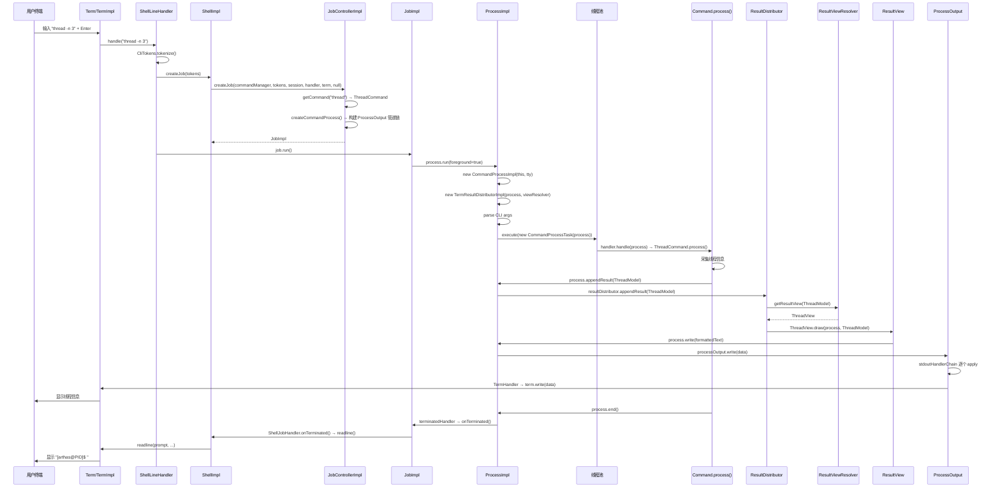
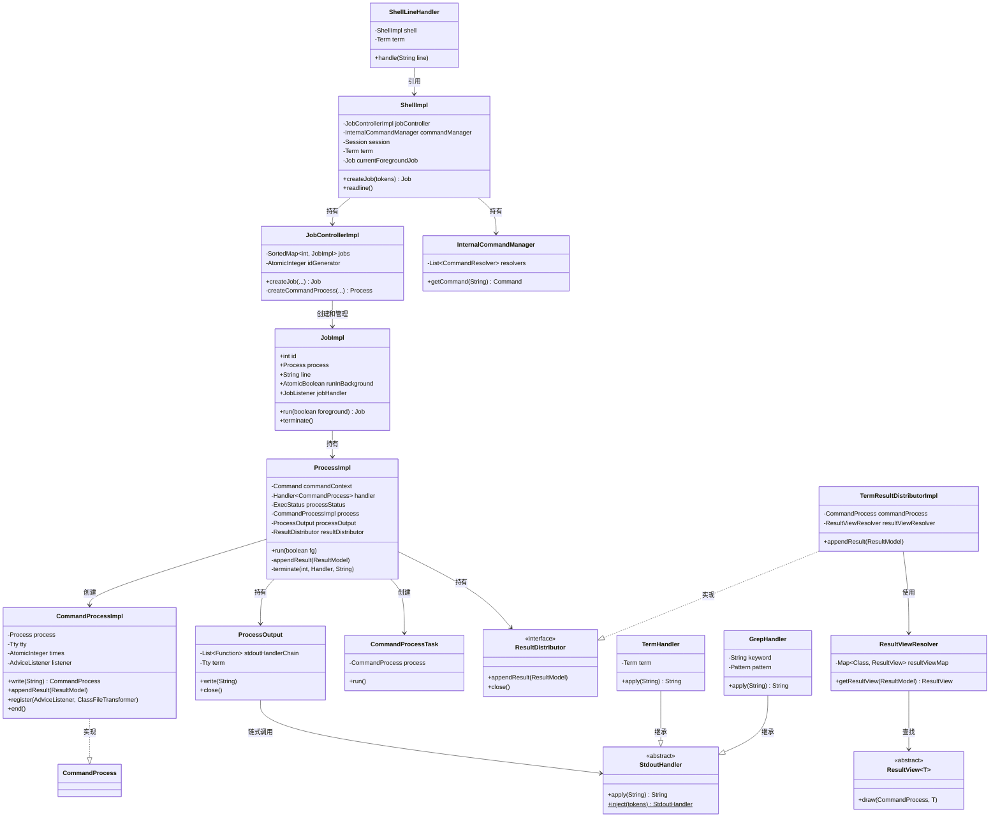

# 端到端数据流深度解析

> 基于 Arthas 4.1.2 源码分析
> 方法论：程序 = 数据结构 + 算法
> 数据流追踪法（Read-DataFlow）+ 自顶向下阅读法（Read-TopDown）

---

## 第 0 部分：核心原理

### 0.1 本质是什么？

用户在终端输入一条 Arthas 命令（如 `watch`），经过**七层管道**最终将结果渲染到终端——本文追踪这条数据从输入到输出的完整旅程。

### 0.2 为什么需要？

Arthas 的架构是 `Shell → Job → Process → Command → ResultModel → ResultDistributor → ResultView → Term` 多层管道。现有 23 篇文档各自聚焦一个组件，但**没有一条完整的线将所有组件串联起来**。缺少这条线，就无法回答"从用户敲下回车到看到输出，中间到底经历了什么"。

### 0.3 怎么解决？

追踪两条典型路径：
- **路径 A（同步命令 `thread`）**：`process()` 同步执行 → 直接 `appendResult()` → `process.end()` 结束
- **路径 B（异步增强命令 `watch`）**：`enhance()` 注册字节码增强后立即返回 → 目标方法被调用时由 SpyAPI 异步回调 → 持续 `appendResult()` → 达到次数上限或用户 Ctrl-C 时才结束

### 0.4 为什么这样设计？

- **为什么要 Job 层？** 支持后台执行（`bg`/`fg`/`jobs`/`kill`），一个 Shell 可以有多个并发运行的命令
- **为什么要 Process 层？** 封装命令执行上下文，管理 stdin/stdout、状态机（READY→RUNNING→TERMINATED）、管道链
- **为什么要 ResultDistributor？** 解耦结果产出和结果消费。终端客户端用 `TermResultDistributorImpl` 直接渲染；HTTP/WebSocket 客户端用 `SharingResultDistributorImpl` 实现多消费者共享

---

## 第 1 部分：数据结构全景

### 1.1 数据结构清单

| # | 结构名 | 源码位置 | 核心作用 |
|---|--------|----------|----------|
| 1 | ShellImpl | `shell/impl/ShellImpl.java` | 用户会话，持有 Term/Session/JobController |
| 2 | ShellLineHandler | `shell/handlers/shell/ShellLineHandler.java` | 命令行解析入口，tokenize → createJob → run |
| 3 | JobControllerImpl | `shell/system/impl/JobControllerImpl.java` | Job 工厂 + 注册表，管理所有活跃 Job |
| 4 | JobImpl | `shell/system/impl/JobImpl.java` | 单个命令任务，封装前台/后台状态和生命周期 |
| 5 | ProcessImpl | `shell/system/impl/ProcessImpl.java` | **核心枢纽**：命令执行编排、线程提交、状态机管理 |
| 6 | ProcessImpl.CommandProcessImpl | 同上（内部类） | `CommandProcess` 接口实现，命令的交互句柄 |
| 7 | ProcessImpl.ProcessOutput | 同上（内部类） | 输出管道链，串联 StdoutHandler → TermHandler |
| 8 | ProcessImpl.CommandProcessTask | 同上（内部类） | Runnable，提交到线程池执行 `handler.handle(process)` |
| 9 | InternalCommandManager | `shell/system/impl/InternalCommandManager.java` | 命令查找注册表，按名称遍历 CommandResolver 列表 |
| 10 | StdoutHandler | `shell/command/internal/StdoutHandler.java` | 输出过滤器基类（grep/wc/tee/plaintext） |
| 11 | TermHandler | `shell/command/internal/TermHandler.java` | 链尾 Handler，调用 `term.write(data)` 输出到终端 |
| 12 | RedirectHandler | `shell/command/internal/RedirectHandler.java` | 文件重定向 Handler（`>` / `>>`） |
| 13 | GrepHandler | `shell/command/internal/GrepHandler.java` | 管道 grep 过滤 Handler |
| 14 | ResultDistributor | `distribution/ResultDistributor.java` | 结果分发器接口：`appendResult()` + `close()` |
| 15 | TermResultDistributorImpl | `distribution/impl/TermResultDistributorImpl.java` | 终端分发器：直接调用 `ResultView.draw()` 渲染 |
| 15b | SharingResultDistributorImpl | `distribution/impl/SharingResultDistributorImpl.java` | HTTP/WS 分发器：异步队列 + 多消费者 |
| 16 | ResultViewResolver | `command/view/ResultViewResolver.java` | ResultModel → ResultView 映射表 |
| 17 | ResultView | `command/view/ResultView.java` | 结果视图抽象基类：`draw(process, result)` |
| 18 | CommandProcess | `shell/command/CommandProcess.java` | 命令进程交互接口（write/appendResult/end/register） |

### 1.2 ShellImpl

#### 问题推导

**问题**：用户通过 telnet/websocket 连接 Arthas 后，需要一个对象来代表这个"会话"——它需要管理什么资源？

**需要的信息**：
1. **终端 IO**：读取用户输入、写入输出 → 需要 `Term` 引用
2. **任务管理**：用户可以启动多个命令（前台/后台）→ 需要 `JobController`
3. **命令查找**：`watch`/`thread` 等字符串怎么映射到 Command 类 → 需要 `InternalCommandManager`
4. **会话数据**：Instrumentation、PID 等全局信息 → 需要 `Session`
5. **交互循环**：命令执行完后重新显示提示符 → `readline()` 方法

**推导出的结构形状**：ShellImpl 是**一个客户端连接的全部资源容器**——Term + JobController + CommandManager + Session + 前台 Job。`readline()` 启动事件循环，用户每输入一行就触发 `ShellLineHandler.handle(line)`。

**源码位置**：`shell/impl/ShellImpl.java`（278 行）

**解决什么问题**：代表一个客户端会话（telnet/websocket），管理该会话的所有资源。

**关键字段**：

```java
// ShellImpl.java:57-65
public class ShellImpl implements Shell {
    private JobControllerImpl jobController;  // ★ 该 Shell 的 Job 管理器
    final String id;                          // 会话 UUID
    final Future<Void> closedFuture;          // 关闭 Future
    private InternalCommandManager commandManager; // 命令管理器
    private Session session = new SessionImpl();   // 会话数据（Instrumentation/PID 等）
    private Term term;                        // ★ 终端 IO 接口
    private String welcome;                   // 欢迎消息
    private Job currentForegroundJob;         // 当前前台 Job
    private String prompt;                    // 提示符 "[arthas@PID]$ "
}
```

**创建位置**：`ShellServerImpl.createShell()` 在客户端连接时创建。

**关键方法**：

```java
// ShellImpl.java:129-131  ★ 创建 Job 的入口
public synchronized Job createJob(List<CliToken> args) {
    Job job = jobController.createJob(commandManager, args, session,
                                      new ShellJobHandler(this), term, null);
    return job;
}

// ShellImpl.java:201-203  ★ 进入 readline 循环
public void readline() {
    term.readline(prompt, new ShellLineHandler(this),
                  new CommandManagerCompletionHandler(commandManager));
}
```

**生命周期**：`readline()` 注册 `ShellLineHandler` 到 Term，当用户输入一行并按回车时，Term 回调 `ShellLineHandler.handle(line)`。

### 1.3 ShellLineHandler

#### 问题推导

**问题**：用户按回车后，原始字符串怎么变成可执行的任务？

**关键设计**：ShellLineHandler 是**分流器**——先分词（`CliTokens.tokenize`），然后判断首个 token：`exit/jobs/fg/bg/kill` 是内置命令直接处理（因为它们操作 Shell/Job 自身状态），其他命令走 `createJob() → job.run()` 标准链路。只持有 `shell` 和 `term` 两个引用。

**源码位置**：`shell/handlers/shell/ShellLineHandler.java`（176 行）

**解决什么问题**：接收用户输入的原始字符串，分流到内置命令（exit/jobs/fg/bg/kill）或创建 Job 执行。

**关键字段**：

```java
// ShellLineHandler.java:18-21
public class ShellLineHandler implements Handler<String> {
    private ShellImpl shell;  // 所属 Shell
    private Term term;        // 终端引用
}
```

**核心方法**：

```java
// ShellLineHandler.java:29-66
public void handle(String line) {
    if (line == null) { handleExit(); return; }              // ★ EOF
    List<CliToken> tokens = CliTokens.tokenize(line);        // ★ 分词
    CliToken first = TokenUtils.findFirstTextToken(tokens);
    if (first == null) { shell.readline(); return; }         // 空行
    String name = first.value();
    if (name.equals("exit") || name.equals("logout") || ...) { handleExit(); return; }
    if (name.equals("jobs")) { handleJobs(); return; }
    if (name.equals("fg")) { handleForeground(tokens); return; }
    if (name.equals("bg")) { handleBackground(tokens); return; }
    if (name.equals("kill")) { handleKill(tokens); return; }

    Job job = createJob(tokens);  // ★ 创建 Job
    if (job != null) {
        job.run();                // ★ 启动 Job
    }
}
```

**设计决策**：`exit/jobs/fg/bg/kill` 是内置命令，直接在 ShellLineHandler 中处理（不走 Job/Process 链路），因为它们需要操作 Shell/Job 本身的状态。

### 1.4 JobControllerImpl

#### 问题推导

**问题**：Job 从哪里创建？谁管理所有活跃的 Job？命令中的管道（`|`）和重定向（`>`）在哪里解析？

**需要的信息**：
1. **Job 工厂**：`createJob()` 分配 ID、创建 Process、注册到表中
2. **注册表**：按 ID 查找/遍历所有 Job → `TreeMap<Integer, JobImpl>`
3. **管道构建**：`|` 后的 `grep`/`wc`/`tee` 在 Job 创建时一次性解析为 `StdoutHandler` 链

**推导出的结构形状**：JobControllerImpl 只有 3 个字段——`jobs`（TreeMap 注册表）、`idGenerator`（AtomicInteger）、`closed`。它的核心价值在 `createJob()` 和 `createCommandProcess()` 两个方法——前者编排 Job，后者构建输出管道链。

**源码位置**：`shell/system/impl/JobControllerImpl.java`（255 行）

**解决什么问题**：Job 工厂 + 注册表。负责创建 Job、管理所有活跃 Job（按 ID 索引）、解析管道/重定向。

**关键字段**：

```java
// JobControllerImpl.java:46-48
public class JobControllerImpl implements JobController {
    private final SortedMap<Integer, JobImpl> jobs = new TreeMap<>(); // ★ Job 注册表
    private final AtomicInteger idGenerator = new AtomicInteger(0);  // Job ID 生成器
    private boolean closed = false;
}
```

**核心方法 `createJob()`**：

```java
// JobControllerImpl.java:80-93
public Job createJob(InternalCommandManager commandManager, List<CliToken> tokens,
                     Session session, JobListener jobHandler, Term term,
                     ResultDistributor resultDistributor) {
    checkPermission(session, tokens.get(0));           // ★ 安全鉴权
    int jobId = idGenerator.incrementAndGet();          // ★ 分配 Job ID
    StringBuilder line = new StringBuilder();
    for (CliToken arg : tokens) { line.append(arg.raw()); }
    boolean runInBackground = runInBackground(tokens);  // ★ 检查是否以 & 结尾
    Process process = createProcess(session, tokens, commandManager,
                                    jobId, term, resultDistributor); // ★ 创建 Process
    process.setJobId(jobId);
    JobImpl job = new JobImpl(jobId, this, process, line.toString(),
                              runInBackground, session, jobHandler);
    jobs.put(jobId, job);                               // ★ 注册到 Job 表
    return job;
}
```

**核心方法 `createCommandProcess()`** —— 构建输出管道链：

```java
// JobControllerImpl.java:178-229
private Process createCommandProcess(Command command, ListIterator<CliToken> tokens,
                                     int jobId, Term term,
                                     ResultDistributor resultDistributor) throws IOException {
    List<CliToken> remaining = new ArrayList<>();
    List<CliToken> pipelineTokens = new ArrayList<>();
    boolean isPipeline = false;
    RedirectHandler redirectHandler = null;
    List<Function<String, String>> stdoutHandlerChain = new ArrayList<>(); // ★ 输出管道链
    String cacheLocation = null;

    while (tokens.hasNext()) {
        CliToken remainingToken = tokens.next();
        if (remainingToken.isText()) {
            String tokenValue = remainingToken.value();
            if ("|".equals(tokenValue)) {
                isPipeline = true;
                injectHandler(stdoutHandlerChain, pipelineTokens); // ★ 管道符：注入过滤 Handler
                continue;
            } else if (">>".equals(tokenValue) || ">".equals(tokenValue)) {
                // ... 重定向逻辑 ...
                redirectHandler = new RedirectHandler(name, ">>".equals(tokenValue));
                break;
            }
        }
        // 按 pipeline 状态分别收集 token
        if (isPipeline) { pipelineTokens.add(remainingToken); }
        else { remaining.add(remainingToken); }
    }
    injectHandler(stdoutHandlerChain, pipelineTokens);

    if (redirectHandler != null) {
        stdoutHandlerChain.add(redirectHandler);      // ★ 重定向输出
    } else {
        stdoutHandlerChain.add(new TermHandler(term)); // ★ 默认：输出到终端
        if (GlobalOptions.isSaveResult) {
            stdoutHandlerChain.add(new RedirectHandler()); // 同时保存到日志
        }
    }
    ProcessOutput processOutput = new ProcessOutput(stdoutHandlerChain, cacheLocation, term);
    ProcessImpl process = new ProcessImpl(command, remaining,
                                          command.processHandler(), processOutput, resultDistributor);
    process.setTty(term);
    return process;
}
```

**设计决策**：管道解析在 Job 创建时一次性完成（`|` → `StdoutHandler.inject()` → 对应的 `GrepHandler`/`WordCountHandler`/`TeeHandler`），而不是运行时动态构建。这保证了管道链在命令执行期间是不可变的。

### 1.5 JobImpl

#### 问题推导

**问题**：Shell 支持 `bg`/`fg`/`kill` 操作——怎么表示一个命令的前台/后台状态和生命周期？

**需要的信息**：
1. **状态管理**：READY → RUNNING → STOPPED → TERMINATED 四状态机
2. **前后台切换**：`runInBackground` 标志 + `toBackground()`/`toForeground()` 方法
3. **委托执行**：`run()` 实际委托给内部 Process

**推导出的结构形状**：JobImpl 是**Process 的壳**——它不执行命令逻辑，只管理前台/后台状态和生命周期事件（`onForeground`/`onBackground`/`onTerminated`）。核心字段：id、process、jobHandler、runInBackground。

**源码位置**：`shell/system/impl/JobImpl.java`（287 行）

**解决什么问题**：封装单个命令任务的前台/后台状态和生命周期。Job 是 Shell 层面的概念，一个 Shell 可以有多个 Job（一个前台 + 多个后台）。

**关键字段**：

```java
// JobImpl.java:21-33
public class JobImpl implements Job {
    final int id;                         // Job ID
    final JobControllerImpl controller;   // 所属 JobController
    final Process process;                // ★ 内部 Process
    final String line;                    // 原始命令行字符串
    private volatile Session session;     // 所属 Session
    volatile JobListener jobHandler;      // ★ 回调处理器（ShellJobHandler）
    final Future<Void> terminateFuture;   // 终止 Future
    final AtomicBoolean runInBackground;  // 是否后台运行
}
```

**核心方法 `run()`**：

```java
// JobImpl.java:207-238
public Job run(boolean foreground) {
    actualStatus = ExecStatus.RUNNING;
    if (statusUpdateHandler != null) {
        statusUpdateHandler.handle(ExecStatus.RUNNING);
    }
    process.setSession(this.session);
    process.run(foreground);              // ★ 委托给 Process 执行

    if (this.status() == ExecStatus.RUNNING) {
        if (foreground) {
            jobHandler.onForeground(this); // ★ 通知 Shell 设置前台 Job
        } else {
            jobHandler.onBackground(this); // ★ 通知 Shell readline
        }
    }
    return this;
}
```

**生命周期**：`READY → RUNNING → STOPPED(suspend) / TERMINATED(end)`。当命令终止时，`TerminatedHandler` 回调 `ShellJobHandler.onTerminated()`，后者调用 `shell.readline()` 重新显示提示符。

### 1.6 ProcessImpl

#### 问题推导

**问题**：命令的实际执行逻辑在哪编排？参数解析、线程提交、状态机、结果分发——谁把这些串起来？

**需要的信息**：
1. **命令元数据**：命令是什么、处理器是谁 → `commandContext` + `handler`
2. **执行上下文**：参数、终端、会话 → `args` + `tty` + `session`
3. **状态机**：READY/RUNNING/STOPPED/TERMINATED → `processStatus`
4. **输出链**：结果怎么到终端 → `processOutput`（管道链）+ `resultDistributor`（结构化结果）

**推导出的结构形状**：ProcessImpl 是**整个数据流的核心枢纽**。`run()` 方法是真正的执行入口：创建 CommandProcess → 懒创建 ResultDistributor → 解析 CLI 参数 → 包装为 Runnable → 提交线程池。它是 687 行的大类，内含 3 个重要内部类。

**源码位置**：`shell/system/impl/ProcessImpl.java`（687 行）

**解决什么问题**：**整个数据流的核心枢纽**。负责命令参数解析、线程池提交、状态机管理、结果分发、事件处理。

**关键字段**：

```java
// ProcessImpl.java:38-64
public class ProcessImpl implements Process {
    private Command commandContext;           // 命令元数据
    private Handler<CommandProcess> handler;  // ★ 命令处理器（command.processHandler()）
    private List<CliToken> args;             // 参数 token 列表
    private Tty tty;                         // 终端
    private Session session;                 // 会话
    // ... 各种事件 Handler ...
    private ExecStatus processStatus;        // ★ 状态机：READY/RUNNING/STOPPED/TERMINATED
    private CommandProcessImpl process;      // ★ 内部 CommandProcess 实例
    private ProcessOutput processOutput;     // ★ 输出管道链
    private int jobId;                       // 所属 Job ID
    private ResultDistributor resultDistributor; // ★ 结果分发器
}
```

**核心方法 `run()`** —— 命令执行的真正入口：

```java
// ProcessImpl.java:320-372
public synchronized void run(boolean fg) {
    if (processStatus != ExecStatus.READY) {
        throw new IllegalStateException("Cannot run proces in " + processStatus + " state");
    }
    processStatus = ExecStatus.RUNNING;
    processForeground = fg;
    foreground = fg;
    startTime = new Date();

    final Tty tty = this.tty;
    if (tty == null) { throw new IllegalStateException("Cannot execute process without a TTY set"); }

    process = new CommandProcessImpl(this, tty);        // ★ 创建 CommandProcess
    if (resultDistributor == null) {
        resultDistributor = new TermResultDistributorImpl( // ★ 默认终端分发器
            process, ArthasBootstrap.getInstance().getResultViewResolver());
    }

    // 解析 CLI 参数
    final List<String> args2 = new LinkedList<>();
    for (CliToken arg : args) {
        if (arg.isText()) { args2.add(arg.value()); }
    }
    CommandLine cl = null;
    try {
        if (commandContext.cli() != null) {
            if (commandContext.cli().parse(args2, false).isAskingForHelp()) {
                appendResult(new HelpCommand().createHelpDetailModel(commandContext));
                terminate();
                return;                                    // ★ -h/--help 直接输出帮助并结束
            }
            cl = commandContext.cli().parse(args2);
            process.setArgs2(args2);
            process.setCommandLine(cl);
        }
    } catch (CLIException e) {
        terminate(-10, null, e.getMessage());
        return;                                            // ★ 参数解析失败直接终止
    }

    // ... cache location 提示 ...
    Runnable task = new CommandProcessTask(process);       // ★ 包装为 Runnable
    ArthasBootstrap.getInstance().execute(task);           // ★ 提交到线程池
}
```

**设计决策**：
- 命令执行在**独立线程池**中，不阻塞 readline 循环（后台 Job 可以在用户继续输入时执行）
- `TermResultDistributorImpl` 是懒创建的——只有 `resultDistributor == null` 时才创建默认实例。HTTP API 调用时会注入 `SharingResultDistributorImpl`

### 1.7 ProcessImpl.CommandProcessImpl

#### 问题推导

**问题**：命令代码（如 ThreadCommand.process()）需要读参数、写输出、注册监听器、结束自身——但不应该直接操作 ProcessImpl 内部状态。怎么提供安全的交互接口？

**关键设计**：CommandProcessImpl 是 ProcessImpl 的**内部类**，实现 `CommandProcess` 接口。命令通过这个句柄与执行引擎交互：`write()` 委托给 ProcessOutput 管道链，`appendResult()` 委托给 ResultDistributor，`register()` 注册增强监听器到全局 AdviceWeaver。内部类可以访问外部类的 private 字段，但对外只暴露接口方法。

**源码位置**：`ProcessImpl.java:394-622`（内部类）

**解决什么问题**：实现 `CommandProcess` 接口，是命令代码与执行引擎之间的**交互句柄**。命令通过它读参数、写输出、注册监听器、结束自身。

**关键方法**：

```java
// ProcessImpl.java:472-481  ★ write() — 文本输出
public CommandProcess write(String data) {
    synchronized (ProcessImpl.this) {
        if (processStatus != ExecStatus.RUNNING) {
            throw new IllegalStateException(
                "Cannot write to standard output when " + status().name().toLowerCase());
        }
    }
    processOutput.write(data);   // ★ 委托给 ProcessOutput 管道链
    return this;
}

// ProcessImpl.java:614-621  ★ appendResult() — 结构化结果输出
public void appendResult(ResultModel result) {
    if (processStatus != ExecStatus.RUNNING) {
        throw new IllegalStateException(...);
    }
    ProcessImpl.this.appendResult(result); // ★ 委托给外部类
}

// ProcessImpl.java:549-561  ★ register() — 注册增强监听器
public void register(AdviceListener adviceListener, ClassFileTransformer transformer) {
    if (adviceListener instanceof ProcessAware) {
        ProcessAware processAware = (ProcessAware) adviceListener;
        if (processAware.getProcess() == null) {
            processAware.setProcess(this.process);   // ★ 将 Process 关联到 Listener
        }
    }
    this.listener = adviceListener;
    AdviceWeaver.reg(listener);   // ★ 注册到全局 AdviceWeaver 表
    this.transformer = transformer;
}
```

### 1.8 ProcessImpl.ProcessOutput

#### 问题推导

**问题**：用户命令中的 `| grep error` 和 `> output.txt` 怎么实现？数据输出时怎么经过这些过滤器？

**关键设计**：ProcessOutput 持有 `List<Function<String, String>> stdoutHandlerChain`——每个 Handler 接收文本、处理后传给下一个。链在 Job 创建时一次性构建（不可变），运行时只做 `for` 循环逐个 `apply()`。链尾总是 `TermHandler`（写终端）或 `RedirectHandler`（写文件）。

**源码位置**：`ProcessImpl.java:624-686`（内部类）

**解决什么问题**：管理输出管道链 `Function<String, String>`。用户命令中的 `|` 和 `>` 被解析为链上的各个 Handler。

**关键字段与方法**：

```java
// ProcessImpl.java:624-653
static class ProcessOutput {
    private List<Function<String, String>> stdoutHandlerChain;  // ★ 输出链
    private StatisticsFunction statisticsHandler = null;        // wc 等统计类 Handler
    private List<Function<String, String>> flushHandlerChain = null;
    private String cacheLocation;   // 缓存文件路径（重定向时有值）
    private Tty term;               // 终端引用

    // ProcessImpl.java:655-663  ★ write() — 链式调用
    private void write(String data) {
        if (stdoutHandlerChain != null) {
            int size = stdoutHandlerChain.size();
            for (int i = 0; i < size; i++) {
                Function<String, String> function = stdoutHandlerChain.get(i);
                data = function.apply(data);  // ★ 逐个 Handler 处理
            }
        }
    }
}
```

**管道链示例**：

对于命令 `watch com.Foo bar | grep error`：

```
stdoutHandlerChain = [GrepHandler("error"), TermHandler(term)]
```

数据流：`原始文本 → GrepHandler.apply() 过滤 → TermHandler.apply() 写终端`

### 1.9 ProcessImpl.CommandProcessTask

#### 问题推导

**问题**：命令执行不能阻塞 readline 循环——怎么在独立线程中执行？

**关键设计**：CommandProcessTask 是最简单的 `Runnable` 包装——`run()` 方法就一行：`handler.handle(process)`，即调用命令的 `process()` 方法。关键在于异常兜底：任何未捕获异常都会被 catch 并调用 `process.end(1, msg)` 优雅终止，避免线程泄漏。

**源码位置**：`ProcessImpl.java:374-392`（内部类）

**解决什么问题**：将命令执行包装为 `Runnable`，提交到 `ArthasBootstrap` 的 `ScheduledExecutorService` 线程池。

```java
// ProcessImpl.java:374-392
private class CommandProcessTask implements Runnable {
    private CommandProcess process;

    public CommandProcessTask(CommandProcess process) {
        this.process = process;
    }

    @Override
    public void run() {
        try {
            handler.handle(process);  // ★ 调用命令的 process() 方法
        } catch (Throwable t) {
            logger.error("Error during processing the command:", t);
            process.end(1, "Error during processing the command: " + ...);
        }
    }
}
```

**设计决策**：异常兜底 — 任何命令的 `process()` 方法抛出未捕获异常，都会被这里 catch 并调用 `process.end(1, msg)` 优雅终止，避免线程泄漏。

### 1.10 InternalCommandManager

#### 问题推导

**问题**：字符串 `"watch"` 怎么找到 `WatchCommand` 类？

**关键设计**：遍历 `CommandResolver` 列表（通常只有 `BuiltinCommandPack` 一个），按名称匹配。命令总数约 40 个，遍历开销可忽略，不需要 HashMap。

**源码位置**：`shell/system/impl/InternalCommandManager.java`（147 行）

**解决什么问题**：命令注册表。按名称在 `CommandResolver` 列表（通常是 `BuiltinCommandPack`）中查找命令。

```java
// InternalCommandManager.java:36-48
public Command getCommand(String commandName) {
    Command command = null;
    for (CommandResolver resolver : resolvers) {
        if (resolver instanceof BuiltinCommandPack) {
            command = getCommand(resolver, commandName); // ★ 遍历查找
            if (command != null) { break; }
        }
    }
    return command;
}
```

**设计决策**：遍历查找而非 HashMap，因为命令总数约 40 个，遍历开销可忽略。

### 1.11 StdoutHandler 与子类

#### 问题推导

**问题**：管道符 `|` 后面可以接 `grep`/`wc`/`tee`/`plaintext`——怎么统一这些过滤器的接口？

**关键设计**：`StdoutHandler extends Function<String, String>`——所有过滤器统一为 `String → String` 的函数。工厂方法 `inject(tokens)` 根据管道命令名（grep/wc/tee/plaintext）创建对应子类实例。链式组合后，数据流过每个 Handler 的 `apply()` 方法逐级变换。

**源码位置**：`shell/command/internal/StdoutHandler.java`（57 行）

**解决什么问题**：输出过滤器抽象基类。实现 `Function<String, String>` 接口，对输出文本做变换。

```java
// StdoutHandler.java:12
public abstract class StdoutHandler implements Function<String, String> {
    // StdoutHandler.java:14-37  ★ 工厂方法：根据管道命令名创建对应 Handler
    public static StdoutHandler inject(List<CliToken> tokens) {
        CliToken firstTextToken = null;
        for (CliToken token : tokens) { if (token.isText()) { firstTextToken = token; break; } }
        if (firstTextToken == null) { return null; }

        if (firstTextToken.value().equals(GrepHandler.NAME)) { return GrepHandler.inject(tokens); }
        else if (firstTextToken.value().equals(PlainTextHandler.NAME)) { return PlainTextHandler.inject(tokens); }
        else if (firstTextToken.value().equals(WordCountHandler.NAME)) { return WordCountHandler.inject(tokens); }
        else if (firstTextToken.value().equals(TeeHandler.NAME)) { return TeeHandler.inject(tokens); }
        else { return null; }
    }
}
```

**子类对比**：

| Handler | 管道命令 | 作用 |
|---------|---------|------|
| `GrepHandler` | `grep` | 按关键词/正则过滤行，支持 `-i`/`-v`/`-n`/`-A`/`-B` |
| `PlainTextHandler` | `plaintext` | 去除 ANSI 颜色码 |
| `WordCountHandler` | `wc` | 统计行数/字数 |
| `TeeHandler` | `tee` | 同时输出到终端和文件 |
| `TermHandler` | — | **链尾**，调用 `term.write(data)` |
| `RedirectHandler` | `>` / `>>` | 输出到文件 |

### 1.12 TermHandler

#### 问题推导

**问题**：管道链的最后一环——谁负责把文本真正写到终端？

**关键设计**：TermHandler 是管道链的**终端结点**，只做一件事：`term.write(data)`。它继承 StdoutHandler，`apply()` 方法将数据写入 Term 后原样返回（以便后续 Handler 如 RedirectHandler 也能拿到数据）。

**源码位置**：`shell/command/internal/TermHandler.java`（22 行）

**解决什么问题**：输出管道链的**终端结点**，将文本写入终端。

```java
// TermHandler.java:10-22
public class TermHandler extends StdoutHandler {
    private Term term;

    public TermHandler(Term term) {
        this.term = term;
    }

    @Override
    public String apply(String data) {
        term.write(data);  // ★ 最终输出到终端
        return data;
    }
}
```

### 1.13 ResultDistributor 与 TermResultDistributorImpl

#### 问题推导

**问题**：命令产出的 `ResultModel` 怎么变成用户看到的文本？终端客户端和 HTTP 客户端的输出方式完全不同——怎么解耦？

**需要的信息**：
1. **终端客户端**：同步渲染——直接调用 `ResultView.draw()` 输出
2. **HTTP 客户端**：异步队列——结果入队，分发线程推送给多个消费者

**推导出的结构形状**：`ResultDistributor` 接口只有 2 个方法（`appendResult` + `close`）。`TermResultDistributorImpl` 极其轻量（直接同步调用 draw），`SharingResultDistributorImpl` 用 `ArrayBlockingQueue` + 分发线程实现异步多消费者。

**ResultDistributor 接口**（`distribution/ResultDistributor.java`，22 行）：

```java
// ResultDistributor.java:9-21
public interface ResultDistributor {
    void appendResult(ResultModel result);  // ★ 追加结构化结果
    void close();                           // 释放资源
}
```

**TermResultDistributorImpl**（`distribution/impl/TermResultDistributorImpl.java`，37 行）：

```java
// TermResultDistributorImpl.java:14-36
public class TermResultDistributorImpl implements ResultDistributor {
    private final CommandProcess commandProcess;
    private final ResultViewResolver resultViewResolver;

    // TermResultDistributorImpl.java:24-30
    @Override
    public void appendResult(ResultModel model) {
        ResultView resultView = resultViewResolver.getResultView(model); // ★ 查找 View
        if (resultView != null) {
            resultView.draw(commandProcess, model);  // ★ 渲染 + 输出
        }
    }
}
```

**设计决策**：`TermResultDistributorImpl` 极其轻量——直接同步调用 `ResultView.draw()`，draw 内部调用 `process.write()`，最终走 ProcessOutput 管道链。没有队列、没有异步线程，因为终端客户端不需要多消费者共享。

**SharingResultDistributorImpl**（`distribution/impl/SharingResultDistributorImpl.java`，221 行）：

```java
// SharingResultDistributorImpl.java:28-42
public class SharingResultDistributorImpl implements ResultDistributor {
    private ResultViewResolver resultViewResolver;
    private ArrayBlockingQueue<ResultModel> resultQueue;  // ★ 异步结果队列
    private Thread distributorThread;                      // ★ 分发线程
    private List<ResultConsumer> consumers = new ArrayList<>();  // ★ 多消费者列表

    // SharingResultDistributorImpl.java:67-70
    @Override
    public void appendResult(ResultModel result) {
        resultQueue.offer(result);  // ★ 非阻塞入队（满则丢弃）
    }
}
```

**与 TermResultDistributorImpl 的对比**：

| | TermResultDistributorImpl | SharingResultDistributorImpl |
|---|---|---|
| **使用场景** | telnet/websocket 终端客户端 | HTTP API / 多客户端共享 |
| **执行模型** | 同步：直接调用 `ResultView.draw()` | 异步：入队 → 分发线程 → 多消费者 |
| **消费者数量** | 1（当前终端） | 多个（每个 HTTP 长轮询连接一个 `ResultConsumer`） |
| **创建时机** | `ProcessImpl.run()` 中懒创建（`resultDistributor == null`） | HTTP API 调用时注入 |

### 1.14 ResultViewResolver

#### 问题推导

**问题**：`ThreadModel` 用 `ThreadView` 渲染、`WatchModel` 用 `WatchView` 渲染——这个 Model→View 的映射关系怎么管理？

**关键设计**：`ConcurrentHashMap<Class, ResultView>` 映射表。初始化时注册约 35 个 View，key 是通过反射获取 `draw()` 方法第二个参数的类型。查找是 O(1) 的 `map.get(model.getClass())`。

**源码位置**：`command/view/ResultViewResolver.java`（141 行）

**解决什么问题**：维护 `Map<Class<ResultModel>, ResultView>` 映射表，根据 ResultModel 的具体类型找到对应的 ResultView。

```java
// ResultViewResolver.java:17-21
public class ResultViewResolver {
    private Map<Class, ResultView> resultViewMap = new ConcurrentHashMap<>();

    // ResultViewResolver.java:89-91
    public ResultView getResultView(ResultModel model) {
        return resultViewMap.get(model.getClass());  // ★ 按 class 查找
    }
}
```

**初始化**：构造函数中调用 `initResultViews()`，注册约 35 个 View（`WatchView`、`TraceView`、`ThreadView`、`DashboardView` 等），每个通过反射获取其 `draw()` 方法第二个参数的类型作为 key。

### 1.15 ResultView

#### 问题推导

**问题**：每种命令的输出格式完全不同（线程表格、方法调用树、监控统计表）——怎么统一渲染抽象？

**关键设计**：`ResultView<T extends ResultModel>` 抽象基类，只有一个抽象方法 `draw(process, result)`。每个命令对应一个子类实现（WatchView/ThreadView/TraceView 等），都是**无状态的可复用单例**。渲染结果通过 `process.write()` 输出。

**源码位置**：`command/view/ResultView.java`（31 行）

```java
// ResultView.java:12-30
public abstract class ResultView<T extends ResultModel> {
    public abstract void draw(CommandProcess process, T result); // ★ 渲染入口

    protected void writeln(CommandProcess process, String str) {
        process.write(str).write("\n"); // 便捷方法：写一行
    }
}
```

**设计决策**：`ResultView` 是无状态的、可复用的单例实例（注释明确说明 "reusable and stateless instance"）。每个命令对应一个 View 实现（如 `WatchView`、`ThreadView`），在 `ResultViewResolver` 初始化时创建一次。

### 1.16 CommandProcess 接口

#### 问题推导

**问题**：命令代码需要一个"句柄"来与执行引擎交互——这个句柄需要提供什么操作？

**需要的信息**：
1. **读参数**：`args()`、`commandLine()` → 获取解析后的 CLI 参数
2. **写输出**：`write(String)` → 文本输出到管道链；`appendResult(ResultModel)` → 结构化结果到 ResultDistributor
3. **会话访问**：`session()` → 获取 Instrumentation 等全局对象
4. **增强注册**：`register(listener, transformer)` → 注册监听器到全局表
5. **生命周期**：`end()` → 终止命令执行
6. **限流**：`times()` → 执行计数，增强命令用于判断是否达到上限

**推导出的结构形状**：CommandProcess 是命令与执行引擎之间的**标准交互协议**。它不是数据容器，而是操作接口——命令通过它读参数、写输出、控制生命周期。

**源码位置**：`shell/command/CommandProcess.java`（186 行）

**解决什么问题**：命令代码与执行引擎之间的**标准交互协议**。命令通过它获取参数、写输出、注册监听器、结束执行。

**关键方法摘要**：

| 方法 | 作用 | 调用者 |
|------|------|--------|
| `args()` / `commandLine()` | 获取解析后的参数 | 命令 process() |
| `session()` | 获取会话（含 Instrumentation） | 增强命令 |
| `write(String)` | 写文本到 ProcessOutput 管道链 | 命令/ResultView |
| `appendResult(ResultModel)` | 写结构化结果到 ResultDistributor | 命令/AdviceListener |
| `register(listener, transformer)` | 注册增强监听器 | EnhancerCommand |
| `end()` / `end(int, String)` | 终止命令执行 | 命令完成时 |
| `times()` | 执行次数计数器 | AdviceListener 限流 |

---

## 第 2 部分：端到端数据流分析

### 2.1 全局数据流总览



### 2.2 路径 A：同步命令 `thread` 的完整数据流

**追踪目标**：用户输入 `thread -n 3`，追踪数据从输入到输出的完整路径。

#### 阶段 1：用户输入 → 命令行解析

```java
// ShellLineHandler.java:29-66  ★ 入口
public void handle(String line) {
    // line = "thread -n 3"
    List<CliToken> tokens = CliTokens.tokenize(line);
    // tokens = [CliToken("thread", text), CliToken(" ", blank),
    //           CliToken("-n", text), CliToken(" ", blank), CliToken("3", text)]
    CliToken first = TokenUtils.findFirstTextToken(tokens);
    // first = CliToken("thread", text)
    String name = first.value();
    // name = "thread" → 不是内置命令(exit/jobs/fg/bg/kill)

    Job job = createJob(tokens);  // ★ 进入 createJob
    if (job != null) {
        job.run();                // ★ 启动 Job
    }
}
```

#### 阶段 2：Job 创建 + Process 初始化

```java
// ShellImpl.java:129  ★ Shell.createJob
Job job = jobController.createJob(commandManager, args, session,
                                  new ShellJobHandler(this), term, null);
// 注意：resultDistributor = null，后续在 ProcessImpl.run() 中懒创建

// JobControllerImpl.java:80-93  ★ JobController.createJob
int jobId = idGenerator.incrementAndGet();  // jobId = 1
boolean runInBackground = runInBackground(tokens);  // false（没有 &）
Process process = createProcess(session, tokens, commandManager, jobId, term, null);
// ↓ 进入 createProcess → createCommandProcess

// JobControllerImpl.java:178-229  ★ 构建管道链
// 对于 "thread -n 3"（没有 | 和 >），管道链只有默认的 TermHandler：
stdoutHandlerChain = [TermHandler(term)]
// 如果命令是 "thread | grep RUNNABLE"，则：
// stdoutHandlerChain = [GrepHandler("RUNNABLE"), TermHandler(term)]

ProcessOutput processOutput = new ProcessOutput(stdoutHandlerChain, null, term);
ProcessImpl process = new ProcessImpl(command, remaining,
                                      command.processHandler(), processOutput, null);
```

#### 阶段 3：Job 启动 → 线程池提交

```java
// JobImpl.java:207-219  ★ job.run()
actualStatus = ExecStatus.RUNNING;
process.setSession(this.session);
process.run(foreground);  // foreground = true
// → jobHandler.onForeground(this)  → shell.setForegroundJob(job)

// ProcessImpl.java:320-372  ★ process.run(fg=true)
processStatus = ExecStatus.RUNNING;
process = new CommandProcessImpl(this, tty);
// resultDistributor == null, 所以创建默认分发器：
resultDistributor = new TermResultDistributorImpl(process,
    ArthasBootstrap.getInstance().getResultViewResolver());

// 解析 CLI：commandContext.cli().parse(["-n", "3"]) → CommandLine
// 包装为 Runnable 提交到线程池：
Runnable task = new CommandProcessTask(process);
ArthasBootstrap.getInstance().execute(task);
// → executorService.execute(task)  (ScheduledExecutorService, 核心线程数=1)
```

#### 阶段 4：命令执行（线程池线程中）

```java
// ProcessImpl.java:383-391  ★ CommandProcessTask.run()（在线程池线程中执行）
handler.handle(process);
// handler 就是 command.processHandler()，最终调用：

// ThreadCommand.java process()  ★ 命令的核心逻辑
public void process(CommandProcess process) {
    ExitStatus exitStatus;
    // topNBusy = 3（来自 -n 3）
    exitStatus = processTopBusyThreads(process);
    CommandUtils.end(process, exitStatus);  // ★ 同步结束
}

// ThreadCommand.java processTopBusyThreads()
// ... 采样线程 CPU 时间 → 排序取 Top 3 → 构建 BusyThreadInfo ...
process.appendResult(new ThreadModel(busyThreadInfos));  // ★ 输出结果
return ExitStatus.success();
```

#### 阶段 5：结果渲染 → 终端输出

```java
// ProcessImpl.CommandProcessImpl.java:614-621  ★ appendResult
ProcessImpl.this.appendResult(result);
// → ProcessImpl.java:265-270
result.setJobId(jobId);  // 设置 jobId
resultDistributor.appendResult(result);  // ★ 委托给分发器

// TermResultDistributorImpl.java:25-30  ★ 分发器处理
ResultView resultView = resultViewResolver.getResultView(model);
// resultViewResolver 的 map 中：ThreadModel.class → ThreadView
resultView.draw(commandProcess, model);
// → ThreadView.draw(process, ThreadModel)
// → 内部调用 process.write(formattedThreadInfo)

// ProcessImpl.CommandProcessImpl.java:472-481  ★ write()
processOutput.write(data);

// ProcessImpl.ProcessOutput.java:655-663  ★ 管道链执行
// stdoutHandlerChain = [TermHandler(term)]
data = TermHandler.apply(data);  // → term.write(data)
// 数据到达终端，用户看到线程信息
```

#### 阶段 6：命令结束 → 重新 readline

```java
// CommandUtils.end(process, ExitStatus.success())
// → process.end(0)
// → ProcessImpl.CommandProcessImpl.end(0, null)
// → ProcessImpl.terminate(0, null, null)

// ProcessImpl.java:248-263  ★ terminate()
this.appendResult(new StatusModel(exitCode, message));  // 输出状态信息
processOutput.close();                                   // 关闭管道链
updateStatus(ExecStatus.TERMINATED, 0, false, endHandler, terminatedHandler, null);
process.unregister();                                    // 注销监听器

// terminatedHandler (JobImpl.TerminatedHandler) 被触发：
// → jobHandler.onTerminated(job)
// → ShellJobHandler.onTerminated(job)
//   → shell.setForegroundJob(null)
//   → shell.readline()  ★ 重新显示提示符
```

### 2.3 路径 B：异步增强命令 `watch` 的完整数据流

**追踪目标**：用户输入 `watch com.example.Foo bar returnObj`，追踪从注册增强到异步输出结果的完整路径。

**与路径 A 的差异**：阶段 1-3 完全相同（ShellLineHandler → Job → Process → 线程池提交），差异从阶段 4 开始。

#### 阶段 4a：增强注册（线程池线程中）

```java
// CommandProcessTask.run() → handler.handle(process)
// handler 实际调用的是 WatchCommand（继承 EnhancerCommand）的 process()

// EnhancerCommand.java:process()
public void process(final CommandProcess process) {
    process.interruptHandler(new CommandInterruptHandler(process)); // Ctrl-C 处理
    process.stdinHandler(new QExitHandler(process));                // q 退出处理
    enhance(process);                                               // ★ 进入增强流程
}

// EnhancerCommand.java:enhance()
protected void enhance(CommandProcess process) {
    Session session = process.session();
    if (!session.tryLock()) { /* ... 有其他命令在增强中 ... */ return; }

    AdviceListener listener = getAdviceListenerWithId(process);
    // → WatchCommand.getAdviceListener(process)
    // → new WatchAdviceListener(this, process, verbose)

    Enhancer enhancer = new Enhancer(listener, ...);
    process.register(listener, enhancer);  // ★ 注册监听器到 AdviceWeaver
    // → AdviceWeaver.reg(listener) → advices.put(listener.id(), listener)
    // 注意：AdviceListenerManager 的注册发生在 Enhancer.enhance() 的增强过程中（按 ClassLoader+方法匹配），
    //       而非 process.register() 中

    effect = enhancer.enhance(inst, maxNumOfMatchedClass);
    // ★ 字节码增强：在目标方法中插入 SpyAPI.atEnter/atExit/atExceptionExit

    process.appendResult(new EnhancerModel(effect, true));
    // 注意：这里 **不调用 process.end()**！命令保持 RUNNING 状态
    // 等待目标方法被调用时异步触发回调
}
```

**关键点**：`enhance()` 方法执行完毕后，命令并**不结束**。`process.end()` 不被调用，命令保持 `RUNNING` 状态。从此刻起，数据流从"同步"变为"异步"。

#### 阶段 4b：等待目标方法被调用（异步回调路径）

当目标方法 `com.example.Foo.bar()` 被应用线程调用时，增强后的字节码触发 SpyAPI：

```java
// 目标方法字节码中被 bytekit 插入的调用：
SpyAPI.atEnter(Foo.class, "bar|()V", target, args);

// SpyAPI.java:atEnter()  ★ 静态入口
public static void atEnter(Class<?> clazz, String methodInfo,
                           Object target, Object[] args) {
    spyInstance.atEnter(clazz, methodInfo, target, args);
    // spyInstance = SpyImpl（在 ArthasBootstrap 初始化时设置）
}

// SpyImpl.java:atEnter()  ★ 查找并分发回调
public void atEnter(Class<?> clazz, String methodInfo,
                    Object target, Object[] args) {
    ClassLoader classLoader = clazz.getClassLoader();
    String[] info = StringUtils.splitMethodInfo(methodInfo);
    String methodName = info[0];
    String methodDesc = info[1];

    List<AdviceListener> listeners = AdviceListenerManager
        .queryAdviceListeners(classLoader, clazz.getName(), methodName, methodDesc);
    // ★ 按 ClassLoader+className+methodName+methodDesc 查找匹配的 listener

    if (listeners != null) {
        for (AdviceListener adviceListener : listeners) {
            if (skipAdviceListener(adviceListener)) { continue; } // 跳过已终止的
            adviceListener.before(clazz, methodName, methodDesc, target, args);
            // ★ 调用 listener 的 before 方法
        }
    }
}
```

#### 阶段 4c：WatchAdviceListener 处理回调

```java
// AdviceListenerAdapter.java:49-51  ★ 桥接：原始参数 → 富参数
final public void before(Class<?> clazz, String methodName, String methodDesc,
                         Object target, Object[] args) throws Throwable {
    before(clazz.getClassLoader(), clazz,
           new ArthasMethod(clazz, methodName, methodDesc), target, args);
}

// WatchAdviceListener.java:before()
public void before(ClassLoader loader, Class<?> clazz, ArthasMethod method,
                   Object target, Object[] args) throws Throwable {
    threadLocalWatch.start();  // ★ 开始计时
    if (command.isBefore()) {
        watching(Advice.newForBefore(loader, clazz, method, target, args));
    }
}

// WatchAdviceListener.java:afterReturning()  ★ 方法正常返回时（默认路径）
public void afterReturning(ClassLoader loader, Class<?> clazz, ArthasMethod method,
                           Object target, Object[] args, Object returnObject) throws Throwable {
    Advice advice = Advice.newForAfterReturning(loader, clazz, method, target, args, returnObject);
    if (command.isSuccess()) { watching(advice); }
    finishing(advice);  // → isFinish() 默认为 true → watching(advice)
}

// WatchAdviceListener.java:watching()  ★ 核心：OGNL 求值 + 输出
private void watching(Advice advice) {
    double cost = threadLocalWatch.costInMillis();
    boolean conditionResult = isConditionMet(command.getConditionExpress(), advice, cost);
    // → ExpressFactory.threadLocalExpress(advice).bind("cost", cost).is(conditionExpress)

    if (conditionResult) {
        Object value = getExpressionResult(command.getExpress(), advice, cost);
        // command.getExpress() = "returnObj"
        // → ExpressFactory.threadLocalExpress(advice).bind("cost", cost).get("returnObj")
        // → Ognl.getValue("returnObj", context, advice)  ★ OGNL 求值

        WatchModel model = new WatchModel();
        model.setTs(LocalDateTime.now());
        model.setCost(cost);
        model.setValue(new ObjectVO(value, command.getExpand()));
        // ... 设置其他字段 ...

        process.appendResult(model);           // ★ 输出结果（走路径 A 阶段 5 相同链路）
        process.times().incrementAndGet();     // 计数
        if (isLimitExceeded(command.getNumberOfLimit(), process.times().get())) {
            abortProcess(process, command.getNumberOfLimit());
            // → process.write("Command execution times exceed limit...")
            // → process.end()  ★ 达到上限才结束命令
        }
    }
}
```

**关键差异总结**：

| | 路径 A（同步命令 thread） | 路径 B（异步增强命令 watch） |
|---|---|---|
| **process() 返回时** | 命令已结束（`end()` 已调用） | 命令仍在运行（只做了增强注册） |
| **appendResult 的调用线程** | 线程池线程（与 process() 同一线程） | **应用业务线程**（被增强方法的调用者线程） |
| **输出次数** | 一次 | 多次（每次目标方法被调用都输出） |
| **结束方式** | `process.end()` 在 process() 末尾同步调用 | 达到 `-n` 次数上限 / 用户 Ctrl-C / 用户输入 `q` |
| **appendResult 的线程安全** | 单线程，无竞争 | 多线程并发（多个应用线程可能同时调用目标方法） |

### 2.4 两条输出路径的对比

`process.appendResult(ResultModel)` 之后，数据走两条路径到达终端：

**路径 1：结构化结果路径**（所有命令的主要输出）：

```
Command → process.appendResult(ResultModel)
  → ProcessImpl.appendResult() → result.setJobId(jobId)
    → resultDistributor.appendResult(result)
      → TermResultDistributorImpl.appendResult()
        → ResultViewResolver.getResultView(model) → ResultView
          → ResultView.draw(process, model)
            → process.write(formattedText)
              → ProcessOutput.write(data)
                → stdoutHandlerChain 逐个 apply
                  → [GrepHandler?] → TermHandler → term.write(data)
                    → 用户终端
```

**路径 2：直接文本路径**（辅助输出，如 verbose 日志）：

```
Command → process.write(text)
  → ProcessOutput.write(data)
    → stdoutHandlerChain 逐个 apply
      → [GrepHandler?] → TermHandler → term.write(data)
        → 用户终端
```

**关键区别**：路径 1 经过 `ResultDistributor` → `ResultViewResolver` → `ResultView`，支持**多客户端共享**和**格式化渲染**。路径 2 直接写原始文本，绕过了结构化分发。

### 2.5 ProcessOutput 管道链执行细节

对于命令 `watch com.Foo bar '{params, returnObj}' | grep error > /tmp/out.log`：

```
管道链构建（在 createCommandProcess 中）：
  1. 解析 "|" → StdoutHandler.inject(["grep", "error"]) → GrepHandler
  2. 解析 ">" → new RedirectHandler("/tmp/out.log", false)
  3. 由于有 redirect，不添加 TermHandler

stdoutHandlerChain = [GrepHandler("error"), RedirectHandler("/tmp/out.log")]

执行时（ProcessOutput.write）：
  data = GrepHandler.apply(data)     // 只保留含 "error" 的行
  data = RedirectHandler.apply(data) // 写入 /tmp/out.log
```

对于命令 `thread -n 3`（无管道无重定向）：

```
stdoutHandlerChain = [TermHandler(term)]
  
执行时：
  data = TermHandler.apply(data)  // term.write(data) → 输出到终端
```

### 2.6 命令结束后的清理链路

```java
// 触发源：process.end() 或 process.end(statusCode, message)
// → ProcessImpl.terminate(statusCode, completionHandler, message)

// ProcessImpl.java:248-263
private synchronized boolean terminate(int exitCode, Handler<Void> completionHandler,
                                       String message) {
    if (processStatus != ExecStatus.TERMINATED) {
        this.appendResult(new StatusModel(exitCode, message)); // ① 输出状态模型
        if (process != null) {
            processOutput.close();                              // ② 关闭管道链
            // → 对每个 CloseFunction Handler 调用 close()
            // → RedirectHandler.close() 关闭文件流
        }
        updateStatus(ExecStatus.TERMINATED, exitCode, false,
                     endHandler, terminatedHandler, completionHandler); // ③ 状态转移
        if (process != null) {
            process.unregister();                               // ④ 注销增强监听器
            // → TransformerManager.removeTransformer(transformer)
            // → AdviceWeaver.unReg(listener)
        }
        return true;
    }
    return false;  // 已经终止过了
}

// terminatedHandler 触发 JobImpl.TerminatedHandler：
// → jobHandler.onTerminated(job)  → ShellJobHandler.onTerminated(job)
//   → shell.setForegroundJob(null)
//   → shell.readline()  ★ 重新进入 readline 循环
```

---

## 第 3 部分：数据结构关系图



---

## 第 4 部分：总结

### 4.1 数据结构层面

| 结构 | 核心特征 | 一句话角色 |
|------|---------|-----------|
| ShellImpl | 会话容器 | 持有 JobController/Session/Term，管理客户端生命周期 |
| ShellLineHandler | 命令入口 | tokenize → 分流内置命令 / 创建 Job |
| JobControllerImpl | Job 工厂 + 注册表 | 管道/重定向解析，ProcessOutput 构建 |
| JobImpl | 任务封装 | 前台/后台状态管理，生命周期回调 |
| **ProcessImpl** | **核心枢纽** | **状态机 + 线程提交 + 结果分发 + 事件处理** |
| CommandProcessImpl | 命令交互句柄 | write/appendResult/register/end 的实现者 |
| ProcessOutput | 输出管道链 | 串联 grep/wc/tee/redirect/term 等 Handler |
| CommandProcessTask | 线程适配器 | 包装 handler.handle(process) 为 Runnable |
| InternalCommandManager | 命令注册表 | 按名称遍历 CommandResolver 查找命令 |
| ResultDistributor | 结果分发接口 | 解耦结果产出和消费 |
| TermResultDistributorImpl | 终端分发器 | 同步调用 ResultView.draw() |
| ResultViewResolver | Model→View 映射 | ConcurrentHashMap，按 ResultModel 的 class 查找 |
| ResultView | 渲染器 | 无状态单例，将 ResultModel 格式化为字符串 |
| StdoutHandler 族 | 输出过滤器 | grep/plaintext/wc/tee/term/redirect |

### 4.2 算法层面

| 算法/流程 | 核心设计决策 |
|-----------|-------------|
| **命令行解析** | 内置命令（exit/jobs/fg/bg/kill）在 ShellLineHandler 中短路处理，不走 Job/Process 链路 |
| **管道链构建** | Job 创建时一次性解析 `\|` 和 `>` 并构建不可变的 `stdoutHandlerChain`，运行时逐个 apply |
| **线程池提交** | 命令在独立线程执行，不阻塞 readline 循环。使用 `ScheduledExecutorService`（核心线程=1） |
| **同步 vs 异步命令** | 同步命令在 process() 末尾调用 end()；异步增强命令只注册监听器不调用 end()，由 SpyAPI 回调异步输出 |
| **结果分发** | 终端走 `TermResultDistributorImpl`（同步直接渲染）；HTTP/WS 走 `SharingResultDistributorImpl`（异步队列+多消费者） |
| **SpyAPI 回调链** | `SpyAPI.atEnter()` → `SpyImpl` → `AdviceListenerManager.query()` → `AdviceListener.before()` → `WatchAdviceListener.watching()` → `process.appendResult()` |
| **命令终止清理** | `terminate()` 按序执行：输出状态 → 关闭管道 → 状态转移 → 注销监听器 → 回调 onTerminated → readline |

### 4.3 面试一句话回答

**Q：从用户输入一条 Arthas 命令到看到结果，经历了哪些步骤？**

> 用户输入经 Term 到 ShellLineHandler 做 tokenize，创建 Job → Process，解析管道/重定向构建 ProcessOutput 管道链，然后提交到线程池执行命令的 `process()` 方法。同步命令（如 thread）直接 `appendResult(ResultModel)` 输出并 end；异步增强命令（如 watch）注册字节码增强后返回，由 SpyAPI 在目标方法被调用时异步回调 AdviceListener，再通过 `appendResult()` 输出。`appendResult()` 经 ResultDistributor → ResultViewResolver → ResultView.draw() 渲染为字符串，最后经 ProcessOutput 管道链（grep/redirect/term）输出到终端。

---

*文档版本：v1.0*
*创建日期：2026-03-01*
*基于 Arthas 4.1.2 源码*
