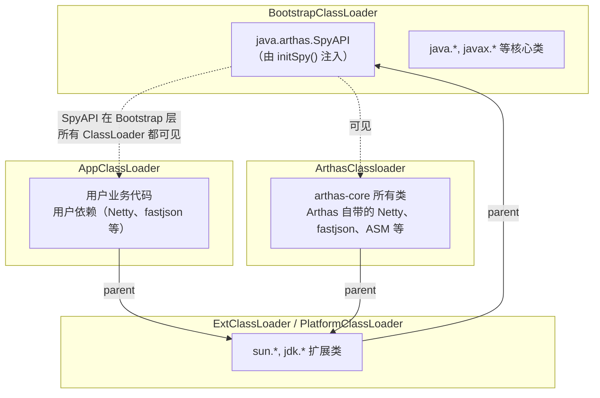
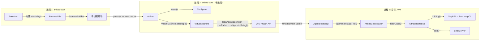
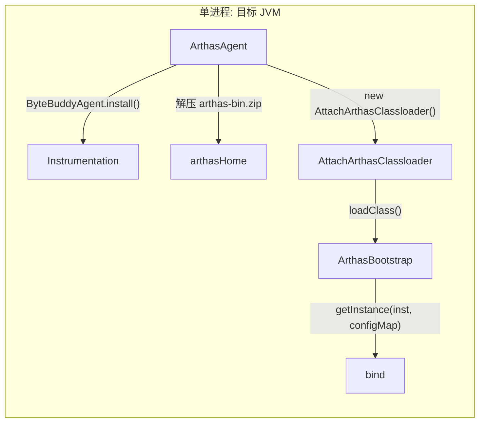
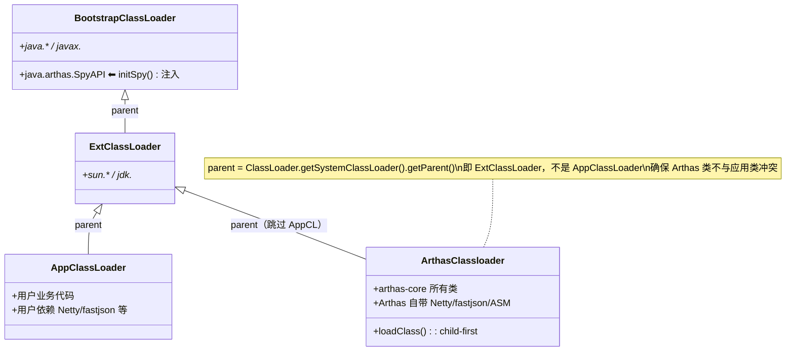

# Attach 机制深度解析

> 基于 Arthas 4.1.2 源码分析
> 方法论：程序 = 数据结构 + 算法

---

## 第 0 部分：核心原理

### 0.1 本质是什么？

Arthas 通过 JVM Attach API 在**不重启目标 JVM** 的情况下，将诊断 agent 动态注入到运行中的 Java 进程。

### 0.2 为什么需要？

Java 应用一旦启动，外部代码无法直接访问其内部状态。传统的 `-javaagent` 参数必须在启动时指定，无法满足"线上问题实时诊断"的需求。JDK 从 1.6 开始提供 Attach API（`com.sun.tools.attach.VirtualMachine`），允许**运行时**通过 Unix Domain Socket 连接目标 JVM 并加载 agent JAR。

Arthas 基于这个标准 API 构建了完整的动态注入链路。

### 0.3 怎么解决？

核心思路：**三进程协作 + 三级 JAR 包隔离**。

1. **arthas-boot.jar**（用户进程）：列出 Java 进程 → 用户选择 PID → 启动子进程
2. **arthas-core.jar**（子进程）：执行 `VirtualMachine.attach(pid)` + `loadAgent(arthas-agent.jar)` → 注入完成后退出
3. **arthas-agent.jar**（目标 JVM 内）：`agentmain()` 被 JVM 回调 → 创建隔离 ClassLoader → 反射调用 `ArthasBootstrap.bind()` 启动核心服务

### 0.4 为什么这样设计？

- **为什么分三个 JAR 而不是一个？** boot 依赖 CLI 交互库，agent 必须轻量（只做桥接），core 有大量依赖（Netty、ASM、logback 等）。合并会导致类冲突和 agent JAR 体积过大。
- **为什么 agent 需要自定义 ClassLoader？** arthas-core 的类（如 Netty、fastjson）不能进入应用的 AppClassLoader，否则与应用自身的同名依赖冲突。`ArthasClassloader` 的 parent 设为 ExtClassLoader，与 AppClassLoader 完全隔离。
- **为什么用子进程执行 attach 而不是 boot 进程直接 attach？** Attach API 依赖 `tools.jar`（JDK8），boot 进程可能用 JRE 启动。子进程可以独立设置 `-Xbootclasspath/a:tools.jar`。

---

## 第 1 部分：数据结构全景

### 1.1 数据结构清单

| # | 结构名 | 源码位置 | 核心作用 |
|---|--------|----------|----------|
| 1 | **Bootstrap** | `boot/.../Bootstrap.java` | arthas-boot 主入口，CLI 参数解析 + 进程选择 + 启动子进程 |
| 2 | **ProcessUtils** | `boot/.../ProcessUtils.java` | 工具类：列举 JVM 进程、启动 arthas-core 子进程 |
| 3 | **Arthas** | `core/.../Arthas.java` | arthas-core 主类：解析参数 + 执行 VirtualMachine.attach |
| 4 | **Configure** | `core/.../config/Configure.java` | 配置 POJO：承载从 boot → agent → core 传递的所有参数 |
| 5 | **AgentBootstrap** | `agent/.../AgentBootstrap.java` | Java Agent 入口：premain/agentmain + 创建 ClassLoader + 反射调用 core |
| 6 | **ArthasClassloader** | `agent/.../ArthasClassloader.java` | 隔离 ClassLoader：child-first 委派，加载 arthas-core 所有类 |
| 7 | **ArthasBootstrap** | `core/.../server/ArthasBootstrap.java` | 核心单例：初始化 Spy + 环境 + ClassLoader增强 + 端口绑定（详见文档 10） |
| 8 | **ArthasAgent** | `arthas-agent-attach/.../ArthasAgent.java` | 嵌入式 Attach：Spring Boot Starter 场景，不走 VirtualMachine.attach |
| 9 | **AttachArthasClassloader** | `arthas-agent-attach/.../AttachArthasClassloader.java` | 嵌入式 Attach 的隔离 ClassLoader，逻辑与 ArthasClassloader 相同 |

---

### 1.2 Bootstrap（arthas-boot 主入口）

#### 问题推导

**问题**：用户执行 `java -jar arthas-boot.jar`，需要交互选择进程、查找 arthas 安装目录、启动子进程执行 attach——这些 CLI 参数和逻辑放在哪？

**需要的信息**：
1. **目标进程**：`--pid` 或交互选择 → `long pid`
2. **安装目录**：`--arthas-home` 或多级回退查找 → `String arthasHome`
3. **连接参数**：IP、端口、认证信息 → `targetIp`/`telnetPort`/`httpPort`/`username`/`password`
4. **执行模式**：只 attach 不启动客户端？→ `attachOnly`；直接执行命令？→ `command`

**推导出的结构形状**：Bootstrap 是一个 CLI 注解驱动的配置类——约 20 个字段对应 20 个命令行参数。核心逻辑在 `main()` 中：解析参数 → 选择 PID → 查找 arthasHome → 调用 `ProcessUtils.startArthasCore()` 启动子进程。

> `boot/src/main/java/com/taobao/arthas/boot/Bootstrap.java`，899 行

#### 1.2.1 核心字段

```java
// Bootstrap.java — CLI 注解驱动的配置字段
public class Bootstrap {
    private boolean help = false;           // 显示帮助
    private long pid = -1;                  // 目标 JVM PID（-1 表示未指定，需交互选择）
    private String targetIp = "127.0.0.1";  // 目标 IP
    private Integer telnetPort;             // Telnet 端口（默认 3658）
    private Integer httpPort;               // HTTP 端口（默认 8563）
    private String arthasHome;              // arthas 安装目录
    private String useVersion;              // 指定版本号
    private String repoMirror;              // 下载镜像源（aliyun/center）
    private boolean useHttp = false;        // 是否用 HTTP 下载
    private boolean attachOnly = false;     // 只 attach 不启动客户端
    private String command;                 // -c 直接执行命令
    private String batchFile;               // -f 批处理文件
    private String select;                  // --select 按类名/JAR名自动匹配进程
    private String username;                // 认证用户名
    private String password;                // 认证密码
    private String tunnelServer;            // Tunnel Server 地址
    private String agentId;                 // Agent ID
    private String appName;                 // 应用名
    private Integer sessionTimeout;         // Session 超时（秒）
    private String statUrl;                 // 统计上报 URL
    private String disabledCommands;        // 禁用命令列表
    // ...
}
```

#### 1.2.2 创建位置

- **创建时机**：用户执行 `java -jar arthas-boot.jar` 时
- **创建方式**：`Bootstrap.main()` 中 `new Bootstrap()` + `CLIConfigurator.inject(commandLine, bootstrap)` 注入 CLI 参数

#### 1.2.3 关键字段生命周期

| 字段 | 设置时机 | 设置方式 | 读取方 | 核心 |
|------|---------|---------|--------|------|
| `pid` | main() 中 CLI 解析或交互选择 | `--pid` 参数 或 `ProcessUtils.select()` 返回值 | 传给 `startArthasCore()` | ★ |
| `arthasHome` | main() 中多级回退查找 | `--arthas-home` / CodeSource / `~/.arthas/lib/` / 远程下载 | 构建 attachArgs | ★ |
| `attachOnly` | CLI 解析 | `--attach-only` | 决定 attach 后是否启动 telnet 客户端 | |
| `select` | CLI 解析 | `--select className` | `ProcessUtils.select()` 中自动匹配 | |

---

### 1.3 ProcessUtils（进程工具类）

#### 问题推导

**问题**：怎么列出当前系统所有 Java 进程？怎么启动 arthas-core 子进程执行 attach？

**关键设计**：纯 static 工具类，核心方法：`select()` 用 jps/jcmd 列出进程让用户选择，`startArthasCore()` 用 ProcessBuilder 启动子进程。查找 JAVA_HOME 和 tools.jar 的逻辑也在这里——JDK8 需要 tools.jar 才能使用 Attach API。

> `boot/src/main/java/com/taobao/arthas/boot/ProcessUtils.java`，578 行

#### 1.3.1 核心方法（无实例字段，纯工具类）

| 方法 | 行号 | 作用 |
|------|------|------|
| `select(boolean, long, String)` | 55-123 | 列举 JVM 进程 → 用户交互选择 → 返回 PID |
| `listProcessByJps(boolean)` | 125-175 | 调用 jps 列出 Java 进程 |
| `listProcessByJcmd()` | 177-225 | 回退：调用 jcmd 列出 Java 进程 |
| `findJavaHome()` | 228-276 | 查找 JAVA_HOME（优先 `java.home` 系统属性） |
| `findJava(String)` | 静态 | 查找 java 可执行文件路径 |
| `findToolsJar(String)` | 静态 | JDK8 需要的 tools.jar 路径 |
| `startArthasCore(long, List<String>)` | 278-358 | **核心**：启动 arthas-core 子进程执行 attach |

#### 1.3.2 select() 进程选择算法

```
1. listProcessByJps() → 如果失败回退 listProcessByJcmd()
2. 如果 telnetPortPid > 0 且在列表中，移到第一位（已 attach 优先）
3. 如果指定了 --select，自动匹配：精确匹配一个则直接返回
4. 否则交互式选择：打印列表 → 读用户输入 → 返回 PID
```

---

### 1.4 Arthas（arthas-core 主类）

#### 问题推导

**问题**：子进程启动后，谁负责执行 `VirtualMachine.attach(pid)` + `loadAgent()`？

**关键设计**：Arthas 类没有实例字段，生命周期极短——构造函数中 `parse(args)` 解析参数为 Configure 对象，`attachAgent(configure)` 执行 attach，完成后子进程退出。它是"执行完即丢弃"的一次性对象。

> `core/src/main/java/com/taobao/arthas/core/Arthas.java`，168 行

#### 1.4.1 核心结构

Arthas 类没有实例字段，它的生命周期极短：构造函数中 `parse(args)` + `attachAgent(configure)` 完成后即退出。

```java
// Arthas.java:24-28
public class Arthas {
    private Arthas(String[] args) throws Exception {
        attachAgent(parse(args));  // 构造即执行：解析参数 + attach
    }
}
```

#### 1.4.2 创建位置

- **创建时机**：`ProcessUtils.startArthasCore()` 启动的子进程中
- **创建方式**：`Arthas.main(args)` → `new Arthas(args)`
- **参数来源**：Bootstrap.main() 中构建的 attachArgs 列表

#### 1.4.3 关键方法签名

| 方法 | 行号 | 作用 |
|------|------|------|
| `parse(String[])` | 30-86 | CLI 参数 → Configure 对象 |
| `attachAgent(Configure)` | 88-148 | VirtualMachine.attach + loadAgent |
| `encodeArg(String)` | 151-157 | URL 编码参数（处理中文路径） |
| `main(String[])` | 159-167 | 入口：new Arthas(args) |

---

### 1.5 Configure（配置 POJO）

#### 问题推导

**问题**：配置参数从 boot → 子进程 → agent → core 跨三个 JVM 传递——怎么序列化和反序列化？

**需要的信息**：
1. **传递方式**：`loadAgent()` 的第二个参数只能是 `String` → 必须序列化为字符串
2. **序列化格式**：`key=value&key=value`（URL query string 风格）
3. **反序列化**：目标 JVM 中 `FeatureCodec.toMap()` 解析为 Map → `BinderUtils.inject()` 注入到 Configure 对象

**推导出的结构形状**：18 个字段的纯 POJO，全部 private + getter/setter。`toString()` 输出 `k=v&k=v` 格式。它在整个 Attach 链路中被创建两次：子进程端 `Arthas.parse()` 和目标 JVM 端 `ArthasBootstrap.initArthasEnvironment()`。

> `core/src/main/java/com/taobao/arthas/core/config/Configure.java`，277 行

#### 1.5.1 全部字段

```java
// Configure.java — 18 个字段，全部 private，无默认值（用包装类型区分 null 和 0/false）
public class Configure {
    private String ip;                       // 监听 IP
    private Integer telnetPort;              // Telnet 端口
    private Integer httpPort;                // HTTP 端口
    private Long javaPid;                    // 目标 JVM PID
    private String arthasCore;               // arthas-core.jar 路径
    private String arthasAgent;              // arthas-agent.jar 路径
    private String tunnelServer;             // Tunnel Server 地址
    private String agentId;                  // Agent ID
    private String username;                 // 认证用户名
    private String password;                 // 认证密码
    private String outputPath;               // 输出目录
    private String enhanceLoaders;           // 需增强的 ClassLoader 全类名（逗号分隔）
    private String appName;                  // 应用名
    private String statUrl;                  // 统计上报 URL
    private Long sessionTimeout;             // Session 超时（秒）
    private String disabledCommands;         // 禁用的命令列表
    private Boolean localConnectionNonAuth;  // 本地连接免鉴权
    private String mcpEndpoint;              // MCP 端点路径
}
```

#### 1.5.2 创建位置和序列化

- **创建位置 1**（子进程端）：`Arthas.parse()` 中 `new Configure()` + 逐个 set
- **序列化**：`configure.toString()` 输出 `key=value&key=value` 格式
- **传输方式**：作为 `loadAgent()` 的第二个参数：`arthasCoreJar路径;key=value&key=value`
- **创建位置 2**（目标 JVM 端）：`ArthasBootstrap.initArthasEnvironment()` 中 `new Configure()` + `BinderUtils.inject(env, configure)`

#### 1.5.3 Configure 的传递链路

```
Bootstrap.main()            → 构建 attachArgs（命令行参数格式）
    ↓
Arthas.parse(args)          → new Configure() + 逐个 set
Arthas.attachAgent()        → configure.toString() 序列化为 "k=v&k=v"
    ↓ loadAgent(agentJar, "corePath;k=v&k=v")
AgentBootstrap.main()       → 分号分割 → agentArgs 原样传递
    ↓ bind(inst, agentLoader, agentArgs)
ArthasBootstrap.getInstance(inst, args)
    → FeatureCodec.toMap(args)   → Map<String,String>
    → 加 "arthas." 前缀
    → initArthasEnvironment(map) → BinderUtils.inject → Configure 对象
```

---

### 1.6 AgentBootstrap（Java Agent 入口）

#### 问题推导

**问题**：`loadAgent()` 成功后 JVM 回调 `agentmain()`——在目标 JVM 内部，谁负责创建隔离 ClassLoader、加载 arthas-core、启动服务？

**需要的信息**：
1. **防重复 attach**：`SpyAPI.isInited()` 检查 → 已运行则直接返回
2. **隔离加载**：创建 `ArthasClassloader`（child-first）→ 加载 arthas-core 所有类
3. **反射调用**：不能直接 import（不同 ClassLoader）→ 反射调用 `ArthasBootstrap.getInstance()`

**推导出的结构形状**：纯 static 类，只有 2 个 static 字段：`arthasClassLoader`（全局持有的隔离 ClassLoader）和 `ps`（日志流）。核心方法 `main()` → `bind()` 是整个 Attach 链路在目标 JVM 中的入口。

> `agent/src/main/java/com/taobao/arthas/agent334/AgentBootstrap.java`，199 行

#### 1.6.1 全部字段

```java
// AgentBootstrap.java
public class AgentBootstrap {
    // 常量
    private static final String ARTHAS_CORE_JAR = "arthas-core.jar";
    private static final String ARTHAS_BOOTSTRAP = "com.taobao.arthas.core.server.ArthasBootstrap";
    private static final String GET_INSTANCE = "getInstance";
    private static final String IS_BIND = "isBind";

    // 日志流：static 块中初始化，输出到 ~/logs/arthas/arthas.log
    private static PrintStream ps = System.err;

    // ⭐ 关键字段：全局持有的隔离 ClassLoader
    private static volatile ClassLoader arthasClassLoader;
}
```

#### 1.6.2 关键字段生命周期

| 字段 | 设置时机 | 设置方式 | 读取方 | 重置时机 | 核心 |
|------|---------|---------|--------|---------|------|
| `arthasClassLoader` | `main()` 中首次 attach | `loadOrDefineClassLoader()` → `new ArthasClassloader(urls)` | `bind()` 中 `agentLoader.loadClass()` | `resetArthasClassLoader()` 设为 null（stop 命令触发） | ★ |
| `ps` | static 块 | `new PrintStream(new FileOutputStream("~/logs/arthas/arthas.log"))` | 全类使用，记录 attach 日志 | 进程退出 | |

#### 1.6.3 创建位置

- **不由外部创建**：AgentBootstrap 只有 static 方法，由 JVM 在 `loadAgent()` 后自动回调 `agentmain(String, Instrumentation)`

#### 1.6.4 防重复 attach 机制

```java
// AgentBootstrap.java:92-98 — main() 方法入口
Class.forName("java.arthas.SpyAPI");   // ★ 尝试加载 SpyAPI
if (SpyAPI.isInited()) {                // ★ 如果已初始化 → 说明 Arthas 已在运行
    ps.println("Arthas server already stared, skip attach.");
    return;                             // ★ 直接退出，不重复 attach
}
```

**设计决策**：为什么用 `SpyAPI.isInited()` 而不是检查 `arthasClassLoader != null`？因为 `arthasClassLoader` 在 stop 命令时会被 `resetArthasClassLoader()` 置为 null，但 SpyAPI 的 `isInited` 标志只有在 `SpyAPI.destroy()` 时才会清除。用 SpyAPI 状态更准确。

---

### 1.7 ArthasClassloader（隔离 ClassLoader）

#### 问题推导

**问题**：arthas-core 依赖 Netty、ASM、fastjson 等库，如果这些类进入 AppClassLoader 会和应用自身的同名依赖冲突——怎么隔离？

**需要的信息**：
1. **标准双亲委派的问题**：parent-first 会先问 AppClassLoader，如果应用有 Netty 旧版本就会加载错误版本
2. **child-first 方案**：优先从自己的 URL（arthas-core.jar）查找，找不到再委派给 parent
3. **parent 选择**：不能用 AppClassLoader（否则又回到冲突问题），用 ExtClassLoader → 系统类可见，应用类不可见

**推导出的结构形状**：36 行的 URLClassLoader 子类，核心在 `loadClass()` 重写——`findLoadedClass` → `sun.*/java.*` 委派 → `findClass`（child-first）→ 回退 `super.loadClass`。parent = `ClassLoader.getSystemClassLoader().getParent()`（JDK8=ExtClassLoader，JDK9+=PlatformClassLoader）。

> `agent/src/main/java/com/taobao/arthas/agent/ArthasClassloader.java`，36 行

#### 1.7.1 完整源码（极短，全部列出）

```java
// ArthasClassloader.java:9-36
public class ArthasClassloader extends URLClassLoader {

    // ★ 构造函数：parent = SystemClassLoader 的 parent（即 ExtClassLoader/PlatformClassLoader）
    public ArthasClassloader(URL[] urls) {
        super(urls, ClassLoader.getSystemClassLoader().getParent());
    }

    @Override
    protected synchronized Class<?> loadClass(String name, boolean resolve) throws ClassNotFoundException {
        final Class<?> loadedClass = findLoadedClass(name);  // ★ 已加载过直接返回
        if (loadedClass != null) {
            return loadedClass;
        }

        // ★ sun.*/java.* 系统类委派给 parent（ExtClassLoader → BootstrapClassLoader）
        if (name != null && (name.startsWith("sun.") || name.startsWith("java."))) {
            return super.loadClass(name, resolve);
        }

        try {
            Class<?> aClass = findClass(name);  // ★ 优先从自己的 URL（arthas-core.jar）查找
            if (resolve) {
                resolveClass(aClass);
            }
            return aClass;
        } catch (Exception e) {
            // ignore
        }
        return super.loadClass(name, resolve);  // ★ 自己找不到再委派给 parent
    }
}
```

#### 1.7.2 设计决策：为什么 child-first？

标准双亲委派（parent-first）会先问 parent 能不能加载。如果 AppClassLoader 中有 Netty/fastjson 等类，parent-first 会加载应用版本而非 Arthas 版本，导致版本冲突。

child-first 确保 arthas-core.jar 中的类**优先**于应用的同名类被加载。

#### 1.7.3 为什么 parent 不是 null 而是 ExtClassLoader？

注释中说"parent=null 打破双亲委派"是不准确的。实际源码中 parent = `ClassLoader.getSystemClassLoader().getParent()`：

- JDK8：parent = `ExtClassLoader`
- JDK9+：parent = `PlatformClassLoader`

这样做的原因：`sun.*/java.*` 系统类必须能被加载到，而这些类由 BootstrapClassLoader 和 ExtClassLoader 加载。如果 parent=null，`super.loadClass()` 会调用 `findBootstrapClassOrNull()`，只能加载 Bootstrap 层的类，无法加载 ExtClassLoader 层的类。

#### 1.7.4 ClassLoader 隔离架构



**关键洞察**：SpyAPI 之所以放在 BootstrapClassLoader，是因为它需要被**所有 ClassLoader** 可见——用户代码被增强后会调用 SpyAPI 的方法，而用户代码由 AppClassLoader 加载。如果 SpyAPI 在 ArthasClassloader 中，AppClassLoader 的类访问不到它。

---

### 1.8 ArthasBootstrap（核心单例）

#### 问题推导

**问题**：ClassLoader 隔离后，arthas-core 的代码开始执行——谁负责初始化 Spy、环境配置、端口绑定等核心服务？

**关键设计**：全局单例，`getInstance(inst, args)` 有两个重载——标准 Attach（String 参数，从 AgentBootstrap 来）和嵌入式 Attach（Map 参数，从 ArthasAgent 来）。详细分析见文档 10。此处只关注与 Attach 链路直接相关的字段：`arthasEnvironment`（配置环境）、`configure`（配置 POJO）、`isBindRef`（端口绑定状态）、`instrumentation`（JVM 传入的 Instrumentation）。

> `core/src/main/java/com/taobao/arthas/core/server/ArthasBootstrap.java`，703 行
> **详细分析见文档 10（`10-ArthasBootstrap-Deep-Dive.md`）**

#### 1.8.1 与 Attach 相关的核心字段

```java
// ArthasBootstrap.java:94-135
public class ArthasBootstrap {
    private static ArthasBootstrap arthasBootstrap;     // ★ 全局单例
    private ArthasEnvironment arthasEnvironment;        // ★ 配置环境（多层优先级）
    private Configure configure;                        // ★ 配置 POJO
    private AtomicBoolean isBindRef = new AtomicBoolean(false);  // ★ 端口绑定状态
    private Instrumentation instrumentation;            // ★ JVM Instrumentation 实例
    private InstrumentTransformer classLoaderInstrumentTransformer;  // ClassLoader 增强 transformer
    private ShellServer shellServer;                    // Shell 服务器
    private TransformerManager transformerManager;      // 字节码转换管理器
    // ... 其余字段见文档 10
}
```

#### 1.8.2 两个 getInstance() 重载

```java
// ArthasBootstrap.java:582-608 — 两个入口，对应两种 Attach 路径

// ★ 路径 1：标准 Attach（AgentBootstrap.bind() 调用）
// args 格式：";key=value&key=value"
public synchronized static ArthasBootstrap getInstance(Instrumentation inst, String args) {
    Map<String, String> argsMap = FeatureCodec.DEFAULT_COMMANDLINE_CODEC.toMap(args);
    // 给配置全加上 "arthas." 前缀
    Map<String, String> mapWithPrefix = new HashMap<>(argsMap.size());
    for (Entry<String, String> entry : argsMap.entrySet()) {
        mapWithPrefix.put("arthas." + entry.getKey(), entry.getValue());
    }
    return getInstance(instrumentation, mapWithPrefix);
}

// ★ 路径 2：嵌入式 Attach（ArthasAgent.init() 调用）
// args 已经是 Map<String, String>
public synchronized static ArthasBootstrap getInstance(Instrumentation inst, Map<String, String> args) {
    if (arthasBootstrap == null) {
        arthasBootstrap = new ArthasBootstrap(instrumentation, args);
    }
    return arthasBootstrap;
}
```

---

### 1.9 ArthasAgent（嵌入式 Attach）

#### 问题推导

**问题**：Spring Boot 应用想在启动时自动加载 Arthas，不走三进程 Attach——怎么实现？

**需要的信息**：
1. **Instrumentation 来源**：没有 agentmain 回调 → 用 `ByteBuddyAgent.install()` 动态获取
2. **arthasHome 来源**：没有文件系统安装 → 从 classpath 解压 `arthas-bin.zip` 到临时目录
3. **ClassLoader**：用 `AttachArthasClassloader`（逻辑与 ArthasClassloader 相同，但在不同模块）

**推导出的结构形状**：5 个实例字段——`configMap`、`arthasHome`、`slientInit`、`instrumentation`、`errorMessage`。核心方法 `init()` 做与 AgentBootstrap 相同的事：创建隔离 ClassLoader → 反射调用 `ArthasBootstrap.getInstance(inst, map)`。

> `arthas-agent-attach/src/main/java/com/taobao/arthas/agent/attach/ArthasAgent.java`，157 行

#### 1.9.1 全部字段

```java
// ArthasAgent.java:19-33
public class ArthasAgent {
    private static final int TEMP_DIR_ATTEMPTS = 10000;   // 创建临时目录最大尝试次数
    private static final String ARTHAS_CORE_JAR = "arthas-core.jar";
    private static final String ARTHAS_BOOTSTRAP = "com.taobao.arthas.core.server.ArthasBootstrap";
    private static final String GET_INSTANCE = "getInstance";
    private static final String IS_BIND = "isBind";

    private String errorMessage;                          // 初始化失败时的错误信息
    private Map<String, String> configMap = new HashMap<>();  // 配置参数
    private String arthasHome;                            // arthas 安装目录
    private boolean slientInit;                           // 静默初始化（失败不抛异常）
    private Instrumentation instrumentation;              // JVM Instrumentation（可能由外部传入或 ByteBuddy 获取）
}
```

#### 1.9.2 与标准 Attach 的关键差异

| 维度 | 标准 Attach（三进程） | 嵌入式 Attach（ArthasAgent） |
|------|---------------------|---------------------------|
| 触发方式 | `java -jar arthas-boot.jar` | Spring Boot Starter 自动触发 / 代码调用 `ArthasAgent.attach()` |
| Instrumentation 来源 | JVM 通过 `agentmain(args, inst)` 传入 | `ByteBuddyAgent.install()` 动态获取 |
| arthasHome 来源 | 文件系统中已安装的目录 | classpath 中的 `arthas-bin.zip` 解压到临时目录 |
| ClassLoader | `ArthasClassloader` | `AttachArthasClassloader`（逻辑相同，类名不同） |
| getInstance 参数类型 | `(Instrumentation, String)` | `(Instrumentation, Map<String,String>)` |
| 进程模型 | 三个进程（boot、core、target） | 单进程（目标 JVM 自身） |

---

### 1.10 AttachArthasClassloader

#### 问题推导

**问题**：嵌入式 Attach 场景为什么需要一个独立的 ClassLoader 类，而不是复用 `ArthasClassloader`？

**关键设计**：逻辑与 ArthasClassloader 完全相同（36 行代码一字不差），但位于不同 Maven 模块（`arthas-agent-attach` vs `arthas-agent`）。嵌入式 Attach 不依赖 arthas-agent.jar，所以需要自己模块内的 ClassLoader 类。这是**模块隔离**的代价——代码重复换来的是部署独立性。

> `arthas-agent-attach/src/main/java/com/taobao/arthas/agent/attach/AttachArthasClassloader.java`，38 行

#### 1.10.1 与 ArthasClassloader 对比

```java
// AttachArthasClassloader.java — 与 ArthasClassloader 完全相同的逻辑
public class AttachArthasClassloader extends URLClassLoader {
    public AttachArthasClassloader(URL[] urls) {
        super(urls, ClassLoader.getSystemClassLoader().getParent());  // 同：parent = ExtClassLoader
    }

    @Override
    protected synchronized Class<?> loadClass(String name, boolean resolve) throws ClassNotFoundException {
        // 同：findLoadedClass → sun.*/java.* 委派 → findClass 优先 → 回退 parent
        // （代码与 ArthasClassloader 一字不差）
    }
}
```

**为什么有两个相同的类？** 因为 `ArthasClassloader` 在 `arthas-agent` 模块中，而 `AttachArthasClassloader` 在 `arthas-agent-attach` 模块中。两个模块打包成不同的 JAR，嵌入式 Attach 场景不依赖 arthas-agent.jar，所以需要自己的 ClassLoader 类。

---

## 第 2 部分：算法/流程分析

### 2.1 完整 Attach 链路概览

```mermaid
sequenceDiagram
    participant User as 用户
    participant Boot as arthas-boot.jar<br/>（用户进程）
    participant Core as arthas-core.jar<br/>（子进程）
    participant JVM as 目标 JVM
    participant Agent as AgentBootstrap<br/>（目标 JVM 内）
    participant AB as ArthasBootstrap<br/>（目标 JVM 内）

    User->>Boot: java -jar arthas-boot.jar
    Boot->>Boot: 1. CLI 解析参数
    Boot->>Boot: 2. ProcessUtils.select() 选择 PID
    Boot->>Core: 3. ProcessUtils.startArthasCore()<br/>（ProcessBuilder 启动子进程）
    
    Core->>Core: 4. Arthas.parse() → Configure
    Core->>JVM: 5. VirtualMachine.attach(pid)
    Core->>JVM: 6. vm.loadAgent(agent.jar, "corePath;args")
    Core->>Core: 7. vm.detach() 并退出
    
    JVM->>Agent: 8. 回调 agentmain(args, inst)
    Agent->>Agent: 9. SpyAPI.isInited() 防重复
    Agent->>Agent: 10. 解析 args → corePath + agentArgs
    Agent->>Agent: 11. new ArthasClassloader(coreJar)
    Agent->>AB: 12. 反射 ArthasBootstrap.getInstance()
    AB->>AB: 13. initSpy() → 注入 SpyAPI 到 BootstrapCL
    AB->>AB: 14. initArthasEnvironment()
    AB->>AB: 15. enhanceClassLoader()
    AB->>AB: 16. bind() → 启动 Shell 服务器
    AB-->>Agent: 17. 返回 isBind()=true
    Agent-->>JVM: 18. attach 完成
    
    Boot->>Boot: 19. 启动 arthas-client 连接
```

---

### 2.2 阶段 1：arthas-boot 进程选择与启动

#### 2.2.1 解决什么问题

用户需要选择要诊断的目标 JVM，然后启动一个独立的子进程来执行 attach 操作。

#### 2.2.2 Bootstrap.main() 主流程

```java
// Bootstrap.java:313-635 — main() 方法（简化后的核心流程）

// Phase 1: CLI 解析
Bootstrap bootstrap = new Bootstrap();
CLI cli = CLIConfigurator.define(Bootstrap.class);    // ★ 从 @Option 注解生成 CLI 定义
CommandLine commandLine = cli.parse(Arrays.asList(args));
CLIConfigurator.inject(commandLine, bootstrap);       // ★ 注入参数到 bootstrap 字段

// Phase 2: 端口冲突检查
long telnetPortPid = SocketUtils.findTcpListenProcess(bootstrap.getTelnetPortOrDefault());  // ★ 检查端口是否已被占用
long httpPortPid = SocketUtils.findTcpListenProcess(bootstrap.getHttpPortOrDefault());

// Phase 3: 选择目标 PID
long pid = bootstrap.getPid();
if (pid < 0) {
    pid = ProcessUtils.select(bootstrap.isVerbose(), telnetPortPid, bootstrap.getSelect());
    // ★ 列举 JVM 进程 → 交互选择或 --select 自动匹配
}

// Phase 4: 查找 arthasHome（多级回退）
File arthasHomeDir = null;
// 优先级：--arthas-home > --use-version > CodeSource 所在目录 > ~/.arthas/lib/ > 远程下载

// Phase 5: 构建 attachArgs 并启动子进程
List<String> attachArgs = new ArrayList<>();
attachArgs.add("-jar");
attachArgs.add(new File(arthasHomeDir, "arthas-core.jar").getAbsolutePath());
attachArgs.add("-pid");
attachArgs.add("" + pid);
// ... 添加 -target-ip, -telnet-port, -http-port, -core, -agent 等参数
ProcessUtils.startArthasCore(pid, attachArgs);        // ★ 启动子进程

// Phase 6: 启动 telnet 客户端连接
// （如果不是 --attach-only 模式）
```

#### 2.2.3 arthasHome 查找的 4 级回退

```java
// Bootstrap.java:420-510 — arthasHome 查找逻辑

// 级别 1：用户显式指定
if (bootstrap.getArthasHome() != null) {
    verifyArthasHome(bootstrap.getArthasHome());  // ★ 检查 arthas-core.jar/arthas-agent.jar/arthas-spy.jar 存在
    arthasHomeDir = new File(bootstrap.getArthasHome());
}

// 级别 2：指定版本号 → ~/.arthas/lib/<version>/arthas/
if (arthasHomeDir == null && bootstrap.getUseVersion() != null) {
    File specialVersionDir = new File(System.getProperty("user.home"),
        ".arthas/lib/" + bootstrap.getUseVersion() + "/arthas");
    if (!specialVersionDir.exists()) {
        DownloadUtils.downArthasPackaging(...);  // ★ 不存在则下载
    }
    arthasHomeDir = specialVersionDir;
}

// 级别 3：arthas-boot.jar 所在目录
if (arthasHomeDir == null) {
    CodeSource codeSource = Bootstrap.class.getProtectionDomain().getCodeSource();
    File bootJarPath = new File(codeSource.getLocation().toURI().getSchemeSpecificPart());
    verifyArthasHome(bootJarPath.getParent());    // ★ 检查同级目录下有没有核心 jar
    arthasHomeDir = bootJarPath.getParentFile();
}

// 级别 4：远程下载最新版本
if (arthasHomeDir == null) {
    String remoteLatestVersion = DownloadUtils.readLatestReleaseVersion();
    DownloadUtils.downArthasPackaging(...);
    arthasHomeDir = new File(ARTHAS_LIB_DIR, localLatestVersion + "/arthas");
}
```

**设计决策**：为什么要 4 级回退？不同使用场景对应不同的部署方式：开发环境手动指定、CI/CD 指定版本、全量安装（boot.jar 与 core 同目录）、首次使用自动下载。

---

### 2.3 阶段 2：startArthasCore 启动子进程

#### 2.3.1 解决什么问题

Attach API 依赖 `tools.jar`（JDK8），需要独立的 JVM 进程来执行 attach，避免 boot 进程自身的 classpath 限制。

#### 2.3.2 ProcessUtils.startArthasCore() 源码

```java
// ProcessUtils.java:278-358

public static void startArthasCore(long targetPid, List<String> attachArgs) {
    // Phase 1: 查找 JDK 工具
    String javaHome = findJavaHome();                 // ★ 查找 JAVA_HOME
    File javaPath = findJava(javaHome);               // ★ 查找 java 可执行文件
    File toolsJar = findToolsJar(javaHome);           // ★ 查找 tools.jar（JDK8 需要）

    if (JavaVersionUtils.isLessThanJava9()) {
        if (toolsJar == null || !toolsJar.exists()) {
            throw new IllegalArgumentException("Can not find tools.jar under java home: " + javaHome);
            // ★ JDK8 没有 tools.jar 则无法 attach
        }
    }

    // Phase 2: 构建子进程命令
    List<String> command = new ArrayList<>();
    command.add(javaPath.getAbsolutePath());           // ★ java 可执行文件路径
    if (toolsJar != null && toolsJar.exists()) {
        command.add("-Xbootclasspath/a:" + toolsJar.getAbsolutePath());
        // ★ JDK8: 将 tools.jar 追加到 bootstrap classpath，使 VirtualMachine 类可用
    }
    command.addAll(attachArgs);
    // 最终命令形如：
    // /path/to/java -Xbootclasspath/a:tools.jar -jar arthas-core.jar
    //   -pid 12345 -target-ip 127.0.0.1 -telnet-port 3658 -http-port 8563
    //   -core /path/to/arthas-core.jar -agent /path/to/arthas-agent.jar

    // Phase 3: 启动子进程
    ProcessBuilder pb = new ProcessBuilder(command);
    pb.environment().put("JAVA_TOOL_OPTIONS", "");     // ★ 清空，避免干扰子进程
    final Process proc = pb.start();

    // Phase 4: 重定向输出
    Thread redirectStdout = new Thread(() -> IOUtils.copy(proc.getInputStream(), System.out));
    Thread redirectStderr = new Thread(() -> IOUtils.copy(proc.getErrorStream(), System.err));
    redirectStdout.start();
    redirectStderr.start();
    redirectStdout.join();                             // ★ 阻塞等待子进程完成
    redirectStderr.join();

    int exitValue = proc.exitValue();
    if (exitValue != 0) {
        AnsiLog.error("attach fail, targetPid: " + targetPid);
        System.exit(1);
    }
}
```

**设计决策**：为什么清空 `JAVA_TOOL_OPTIONS`？这个环境变量会被 JVM 自动解析为启动参数。如果用户设置了调试参数（如 `-agentlib:jdwp`），子进程也会启用调试，导致端口冲突或 hang。

---

### 2.4 阶段 3：Arthas.attachAgent() 执行 VirtualMachine.attach

#### 2.4.1 解决什么问题

通过 JDK 标准 Attach API 连接目标 JVM，并将 arthas-agent.jar 加载到目标 JVM 中。

#### 2.4.2 Arthas.attachAgent() 源码

```java
// Arthas.java:88-148

private void attachAgent(Configure configure) throws Exception {
    // Phase 1: 查找目标 JVM 描述符
    VirtualMachineDescriptor virtualMachineDescriptor = null;
    for (VirtualMachineDescriptor descriptor : VirtualMachine.list()) {
        String pid = descriptor.id();
        if (pid.equals(Long.toString(configure.getJavaPid()))) {
            virtualMachineDescriptor = descriptor;        // ★ 通过 PID 匹配
            break;
        }
    }

    VirtualMachine virtualMachine = null;
    try {
        // Phase 2: 连接目标 JVM
        if (null == virtualMachineDescriptor) {
            virtualMachine = VirtualMachine.attach("" + configure.getJavaPid());
            // ★ 回退：如果 VirtualMachine.list() 找不到（如 JRE 环境），直接用 PID 字符串 attach
        } else {
            virtualMachine = VirtualMachine.attach(virtualMachineDescriptor);
            // ★ 优先用 descriptor attach（携带更多元信息）
        }

        // Phase 3: JDK 版本检查
        Properties targetSystemProperties = virtualMachine.getSystemProperties();
        String targetJavaVersion = JavaVersionUtils.javaVersionStr(targetSystemProperties);
        String currentJavaVersion = JavaVersionUtils.javaVersionStr();
        if (targetJavaVersion != null && currentJavaVersion != null) {
            if (!targetJavaVersion.equals(currentJavaVersion)) {
                AnsiLog.warn("Current VM java version: {} do not match target VM java version: {}, attach may fail.",
                    currentJavaVersion, targetJavaVersion);
                // ★ 版本不匹配警告，但不阻断（跨版本 attach 可能成功也可能失败）
            }
        }

        // Phase 4: 加载 Agent
        String arthasAgentPath = configure.getArthasAgent();
        configure.setArthasAgent(encodeArg(arthasAgentPath));   // ★ URL 编码（处理中文路径）
        configure.setArthasCore(encodeArg(configure.getArthasCore()));
        try {
            virtualMachine.loadAgent(arthasAgentPath,
                configure.getArthasCore() + ";" + configure.toString());
            // ★ loadAgent 的两个参数：
            //   参数1: agent JAR 的文件系统路径
            //   参数2: 传递给 agentmain 的 args 字符串
            //          格式: "arthasCoreJar路径;key=value&key=value"
        } catch (IOException e) {
            if (e.getMessage() != null && e.getMessage().contains("Non-numeric value found")) {
                AnsiLog.warn("It seems to use the lower version of JDK to attach the higher version of JDK.");
                // ★ 低版本 JDK attach 高版本：loadAgent 返回值格式不兼容
            } else {
                throw e;
            }
        } catch (com.sun.tools.attach.AgentLoadException ex) {
            if ("0".equals(ex.getMessage())) {
                AnsiLog.warn("It seems to use the higher version of JDK to attach the lower version of JDK.");
                // ★ 高版本 JDK attach 低版本：返回码 0 被解析为 AgentLoadException
            } else {
                throw ex;
            }
        }
    } finally {
        if (null != virtualMachine) {
            virtualMachine.detach();                    // ★ 断开连接，子进程即将退出
        }
    }
}
```

**设计决策**：为什么 `loadAgent` 的参数用分号分隔两部分？因为 JVM 的 `loadAgent(String jar, String options)` 只支持一个 options 字符串。Arthas 需要传递两个信息：(1) arthas-core.jar 的路径（让 agent 知道从哪里创建 ClassLoader），(2) 所有配置参数。分号是约定的分隔符。

---

### 2.5 阶段 4：AgentBootstrap.agentmain() 在目标 JVM 中执行

#### 2.5.1 解决什么问题

JVM 回调 `agentmain()` 后，需要在目标 JVM 中创建隔离的类加载环境，并启动 Arthas 核心服务。

#### 2.5.2 整体阶段划分

| Phase | 行号 | 描述 |
|-------|------|------|
| 1 | 92-98 | 防重复 attach 检测（SpyAPI.isInited()） |
| 2 | 104-118 | 解析 args：分号分割 → arthasCoreJar 路径 + agentArgs |
| 3 | 121-141 | 查找 arthas-core.jar 文件（回退：从 agent JAR 同级目录找） |
| 4 | 146 | 创建隔离 ClassLoader |
| 5 | 148-161 | 启动 arthas-binding-thread 线程执行 bind |
| 6 | 175-190 | bind()：反射调用 ArthasBootstrap.getInstance() |

#### 2.5.3 AgentBootstrap.main() 源码

```java
// AgentBootstrap.java:90-173 — synchronized 防并发

private static synchronized void main(String args, final Instrumentation inst) {
    // ★ Phase 1: 防重复 attach
    try {
        Class.forName("java.arthas.SpyAPI");
        if (SpyAPI.isInited()) {
            ps.println("Arthas server already stared, skip attach.");
            return;
        }
    } catch (Throwable e) {
        // ★ SpyAPI 还没被注入到 BootstrapClassLoader → ClassNotFoundException → 忽略，继续
    }

    try {
        ps.println("Arthas server agent start...");

        // ★ Phase 2: 解析 args
        if (args == null) {
            args = "";
        }
        args = decodeArg(args);                          // URL 解码

        String arthasCoreJar;
        final String agentArgs;
        int index = args.indexOf(';');                   // ★ 分号分割
        if (index != -1) {
            arthasCoreJar = args.substring(0, index);    // 前半部分：arthas-core.jar 路径
            agentArgs = args.substring(index);           // 后半部分：;key=value&key=value（注意保留了分号）
        } else {
            arthasCoreJar = "";
            agentArgs = args;
        }

        // ★ Phase 3: 查找 arthas-core.jar
        File arthasCoreJarFile = new File(arthasCoreJar);
        if (!arthasCoreJarFile.exists()) {
            // 回退：从 arthas-agent.jar 的同级目录查找
            CodeSource codeSource = AgentBootstrap.class.getProtectionDomain().getCodeSource();
            if (codeSource != null) {
                File arthasAgentJarFile = new File(codeSource.getLocation().toURI().getSchemeSpecificPart());
                arthasCoreJarFile = new File(arthasAgentJarFile.getParentFile(), ARTHAS_CORE_JAR);
            }
        }
        if (!arthasCoreJarFile.exists()) {
            return;                                      // ★ 找不到 core JAR，静默退出
        }

        // ★ Phase 4: 创建隔离 ClassLoader
        final ClassLoader agentLoader = getClassLoader(inst, arthasCoreJarFile);
        // → loadOrDefineClassLoader() → if null: new ArthasClassloader(new URL[]{coreJar.toURI().toURL()})

        // ★ Phase 5: 启动 binding 线程
        Thread bindingThread = new Thread() {
            @Override
            public void run() {
                try {
                    bind(inst, agentLoader, agentArgs);
                } catch (Throwable throwable) {
                    throwable.printStackTrace(ps);
                }
            }
        };
        bindingThread.setName("arthas-binding-thread");
        bindingThread.start();
        bindingThread.join();                            // ★ 等待 binding 完成
    } catch (Throwable t) {
        t.printStackTrace(ps);
        throw new RuntimeException(t);
    }
}
```

**设计决策**：为什么用独立的 `arthas-binding-thread` 而不是直接在 `agentmain` 线程中执行？注释引用了 issue #195：防止可能的内存泄漏。`agentmain` 由 JVM 的 Attach Listener 线程调用，如果在该线程中创建大量对象，线程局部变量不会被清理。独立线程执行完后退出，其线程栈和局部变量可以被 GC。

#### 2.5.4 AgentBootstrap.bind() 源码

```java
// AgentBootstrap.java:175-190

private static void bind(Instrumentation inst, ClassLoader agentLoader, String args) throws Throwable {
    // ★ 通过隔离 ClassLoader 加载 ArthasBootstrap
    Class<?> bootstrapClass = agentLoader.loadClass(ARTHAS_BOOTSTRAP);
    // ARTHAS_BOOTSTRAP = "com.taobao.arthas.core.server.ArthasBootstrap"

    // ★ 反射调用 ArthasBootstrap.getInstance(Instrumentation, String)
    Object bootstrap = bootstrapClass
        .getMethod(GET_INSTANCE, Instrumentation.class, String.class)
        .invoke(null, inst, args);
    // → 触发 ArthasBootstrap 构造函数 → initSpy() + initEnv() + enhanceCL() + bind()

    // ★ 检查端口是否绑定成功
    boolean isBind = (Boolean) bootstrapClass.getMethod(IS_BIND).invoke(bootstrap);
    if (!isBind) {
        String errorMsg = "Arthas server port binding failed! Please check $HOME/logs/arthas/arthas.log for more details.";
        ps.println(errorMsg);
        throw new RuntimeException(errorMsg);
    }
    ps.println("Arthas server already bind.");
}
```

**设计决策**：为什么用反射而不是直接调用？因为 `AgentBootstrap` 在 `arthas-agent.jar` 中，`ArthasBootstrap` 在 `arthas-core.jar` 中。agent 模块不依赖 core 模块（编译时没有 core 在 classpath 上），所以只能通过反射调用。这就是三级 JAR 隔离的代价——也是必要的解耦。

---

### 2.6 阶段 5：ArthasBootstrap 初始化链

#### 2.6.1 解决什么问题

在目标 JVM 中完成 Arthas 核心服务的初始化：注入 SpyAPI、配置环境、增强 ClassLoader、绑定网络端口。

#### 2.6.2 构造函数阶段划分

```java
// ArthasBootstrap.java:137-184 — 构造函数 6 个阶段

private ArthasBootstrap(Instrumentation instrumentation, Map<String, String> args) throws Throwable {
    this.instrumentation = instrumentation;

    initFastjson();                  // ★ 阶段 0: 配置 fastjson（忽略 getter 错误）
    initSpy();                       // ★ 阶段 1: SpyAPI 注入到 BootstrapClassLoader
    initArthasEnvironment(args);     // ★ 阶段 2: 多层配置优先级解析
    // outputPath 初始化
    outputPath = new File(configure.getOutputPath() != null ? configure.getOutputPath() : ArthasConstants.ARTHAS_OUTPUT);
    outputPath.mkdirs();

    loggerContext = LogUtil.initLogger(arthasEnvironment);  // ★ 阶段 3: 初始化日志
    enhanceClassLoader();            // ★ 阶段 4: 增强 ClassLoader#loadClass
    initBeans();                     // ★ 阶段 5: 初始化 ResultViewResolver + HistoryManager
    bind(configure);                 // ★ 阶段 6: 启动网络服务（Shell + HTTP + Telnet）

    executorService = Executors.newScheduledThreadPool(1, ...);  // 命令执行线程池
    shutdown = new Thread("as-shutdown-hooker") { ... };         // 关闭钩子
    transformerManager = new TransformerManager(instrumentation); // 字节码转换管理器
    Runtime.getRuntime().addShutdownHook(shutdown);
}
```

#### 2.6.3 阶段 1：initSpy() — 注入 SpyAPI 到 BootstrapClassLoader

```java
// ArthasBootstrap.java:197-220

private void initSpy() throws Throwable {
    // ★ 先检查 SpyAPI 是否已经在 ExtClassLoader 层可见
    ClassLoader parent = ClassLoader.getSystemClassLoader().getParent();  // ExtClassLoader
    Class<?> spyClass = null;
    if (parent != null) {
        try {
            spyClass = parent.loadClass("java.arthas.SpyAPI");
        } catch (Throwable e) {
            // ★ 加载不到 → 说明还没注入
        }
    }

    if (spyClass == null) {
        // ★ SpyAPI 尚未注入 → 通过 Instrumentation API 注入到 BootstrapClassLoader
        CodeSource codeSource = ArthasBootstrap.class.getProtectionDomain().getCodeSource();
        if (codeSource != null) {
            File arthasCoreJarFile = new File(codeSource.getLocation().toURI().getSchemeSpecificPart());
            File spyJarFile = new File(arthasCoreJarFile.getParentFile(), ARTHAS_SPY_JAR);
            // ★ arthas-spy.jar 必须在 arthas-core.jar 同级目录
            instrumentation.appendToBootstrapClassLoaderSearch(new JarFile(spyJarFile));
            // ★ 关键 API：将 spy JAR 追加到 BootstrapClassLoader 的搜索路径
            // 之后所有 ClassLoader 都能找到 java.arthas.SpyAPI
        } else {
            throw new IllegalStateException("can not find " + ARTHAS_SPY_JAR);
        }
    }
}
```

**设计决策**：`SpyAPI` 的包名是 `java.arthas`，以 `java.` 开头。这是**故意的**——`ArthasClassloader.loadClass()` 中对 `java.*` 开头的类委派给 parent（最终到 BootstrapClassLoader），确保所有 ClassLoader 加载到的 `SpyAPI` 是同一个类。如果用其他包名，不同 ClassLoader 可能加载到不同的 SpyAPI 类，导致通信断裂。

#### 2.6.4 阶段 2：initArthasEnvironment() — 多层配置优先级

```java
// ArthasBootstrap.java:252-283

private void initArthasEnvironment(Map<String, String> argsMap) throws IOException {
    if (arthasEnvironment == null) {
        arthasEnvironment = new ArthasEnvironment();
    }

    // ★ 配置优先级（从高到低）：
    // 1. 命令行参数（argsMap）
    // 2. System Environment（系统环境变量）
    // 3. System Properties（系统属性）
    // 4. arthas.properties 文件

    Map<String, Object> copyMap;
    if (argsMap != null) {
        copyMap = new HashMap<>(argsMap);
        if (!copyMap.containsKey(ARTHAS_HOME_PROPERTY)) {
            copyMap.put(ARTHAS_HOME_PROPERTY, arthasHome());  // ★ 自动推导 arthas.home
        }
    } else {
        copyMap = new HashMap<>(1);
        copyMap.put(ARTHAS_HOME_PROPERTY, arthasHome());
    }

    MapPropertySource mapPropertySource = new MapPropertySource("args", copyMap);
    arthasEnvironment.addFirst(mapPropertySource);             // ★ 命令行参数优先级最高

    tryToLoadArthasProperties();                               // ★ 加载 arthas.properties
    // 特殊配置：arthas.config.overrideAll=true 可以反转优先级（配置文件最高）

    configure = new Configure();
    BinderUtils.inject(arthasEnvironment, configure);          // ★ 从 Environment 注入到 Configure POJO
}
```

#### 2.6.5 阶段 4：enhanceClassLoader() — 增强 ClassLoader#loadClass

```java
// ArthasBootstrap.java:222-250

void enhanceClassLoader() throws IOException, UnmodifiableClassException {
    if (configure.getEnhanceLoaders() == null) {
        return;                                                 // ★ 未配置则跳过
    }
    Set<String> loaders = new HashSet<>();
    for (String s : configure.getEnhanceLoaders().split(",")) {
        loaders.add(s.trim());                                 // ★ 解析需增强的 ClassLoader 列表
    }

    // ★ 读取 ClassLoader_Instrument 的字节码（bytekit 增强模板）
    byte[] classBytes = IOUtils.getBytes(ArthasBootstrap.class.getClassLoader()
        .getResourceAsStream(ClassLoader_Instrument.class.getName().replace('.', '/') + ".class"));

    SimpleClassMatcher matcher = new SimpleClassMatcher(loaders);
    InstrumentConfig instrumentConfig = new InstrumentConfig(AsmUtils.toClassNode(classBytes), matcher);
    InstrumentParseResult instrumentParseResult = new InstrumentParseResult();
    instrumentParseResult.addInstrumentConfig(instrumentConfig);

    // ★ 创建并注册 ClassFileTransformer
    classLoaderInstrumentTransformer = new InstrumentTransformer(instrumentParseResult);
    instrumentation.addTransformer(classLoaderInstrumentTransformer, true);

    // ★ 触发 retransform
    if (loaders.size() == 1 && loaders.contains(ClassLoader.class.getName())) {
        instrumentation.retransformClasses(ClassLoader.class);
        // ★ 只增强 java.lang.ClassLoader 时直接 retransform，不用搜索所有已加载类
    } else {
        InstrumentationUtils.trigerRetransformClasses(instrumentation, loaders);
    }
}
```

**设计决策**：为什么要增强 `ClassLoader#loadClass`？解决 issue #1596：某些自定义 ClassLoader（如 OSGi、Spring Boot DevTools）加载不到 `java.arthas.SpyAPI`。增强后在 `loadClass` 中注入逻辑：如果目标类是 SpyAPI，直接委派到 BootstrapClassLoader，绕过自定义 ClassLoader 的隔离策略。

#### 2.6.6 阶段 6：bind() — 启动网络服务

```java
// ArthasBootstrap.java:354-502 — 简化后的核心流程

private void bind(Configure configure) throws Throwable {
    long start = System.currentTimeMillis();

    if (!isBindRef.compareAndSet(false, true)) {
        throw new IllegalStateException("already bind");       // ★ CAS 防重复绑定
    }

    // ★ 随机端口分配（当配置为 0 时）
    if (configure.getTelnetPort() != null && configure.getTelnetPort() == 0) {
        configure.setTelnetPort(SocketUtils.findAvailableTcpPort());
    }
    if (configure.getHttpPort() != null && configure.getHttpPort() == 0) {
        configure.setHttpPort(SocketUtils.findAvailableTcpPort());
    }

    // ★ TunnelClient（可选：连接远程 Tunnel Server）
    if (configure.getTunnelServer() != null) {
        tunnelClient = new TunnelClient();
        tunnelClient.setTunnelServerUrl(configure.getTunnelServer());
        tunnelClient.start().await(10, TimeUnit.SECONDS);
    }

    // ★ 创建 ShellServer
    ShellServerOptions options = new ShellServerOptions()
        .setInstrumentation(instrumentation)
        .setPid(PidUtils.currentLongPid());
    shellServer = new ShellServerImpl(options);

    // ★ 注册 TermServer（Telnet + HTTP）
    workerGroup = new NioEventLoopGroup(new DefaultThreadFactory("arthas-TermServer", true));
    if (configure.getTelnetPort() != null && configure.getTelnetPort() > 0) {
        shellServer.registerTermServer(new HttpTelnetTermServer(
            configure.getIp(), configure.getTelnetPort(), ...));
    }
    if (configure.getHttpPort() != null && configure.getHttpPort() > 0) {
        shellServer.registerTermServer(new HttpTermServer(
            configure.getIp(), configure.getHttpPort(), ...));
    }

    // ★ 注册命令
    BuiltinCommandPack builtinCommands = new BuiltinCommandPack(disabledCommands);
    shellServer.registerCommandResolver(builtinCommands);

    // ★ 启动监听
    shellServer.listen(new BindHandler(isBindRef));

    // ★ SpyAPI 初始化
    SpyAPI.init();

    logger().info("as-server started in {} ms", System.currentTimeMillis() - start);
}
```

---

### 2.7 嵌入式 Attach 路径（ArthasAgent）

#### 2.7.1 解决什么问题

Spring Boot 应用需要在启动时自动加载 Arthas，不需要外部执行 `arthas-boot.jar`，也不需要 `tools.jar`。

#### 2.7.2 ArthasAgent.init() 源码

```java
// ArthasAgent.java:77-134

public void init() throws IllegalStateException {
    // ★ Phase 1: 防重复（与 AgentBootstrap 相同）
    try {
        Class.forName("java.arthas.SpyAPI");
        if (SpyAPI.isInited()) {
            return;
        }
    } catch (Throwable e) {
        // ignore
    }

    try {
        // ★ Phase 2: 获取 Instrumentation
        if (instrumentation == null) {
            instrumentation = ByteBuddyAgent.install();
            // ★ ByteBuddy 内部通过 HotSpot Attach API self-attach 获取 Instrumentation
            // 不需要 tools.jar，ByteBuddy 自带了 attach 的实现
        }

        // ★ Phase 3: 准备 arthasHome
        if (arthasHome == null || arthasHome.trim().isEmpty()) {
            URL coreJarUrl = this.getClass().getClassLoader().getResource("arthas-bin.zip");
            // ★ 从 classpath 中查找 arthas-bin.zip（Spring Boot fat JAR 中打包）
            if (coreJarUrl != null) {
                File tempArthasDir = createTempDir();          // 创建临时目录
                ZipUtil.unpack(coreJarUrl.openStream(), tempArthasDir);  // 解压
                arthasHome = tempArthasDir.getAbsolutePath();
            } else {
                throw new IllegalArgumentException("can not getResources arthas-bin.zip");
            }
        }

        // ★ Phase 4: 创建隔离 ClassLoader
        File arthasCoreJarFile = new File(arthasHome, ARTHAS_CORE_JAR);
        AttachArthasClassloader arthasClassLoader = new AttachArthasClassloader(
            new URL[]{arthasCoreJarFile.toURI().toURL()});

        // ★ Phase 5: 反射调用（注意：用 Map 重载，不是 String 重载）
        Class<?> bootstrapClass = arthasClassLoader.loadClass(ARTHAS_BOOTSTRAP);
        Object bootstrap = bootstrapClass
            .getMethod(GET_INSTANCE, Instrumentation.class, Map.class)
            .invoke(null, instrumentation, configMap);
        // ★ 直接传 Map<String,String>，不需要序列化为 "k=v&k=v" 格式

        boolean isBind = (Boolean) bootstrapClass.getMethod(IS_BIND).invoke(bootstrap);
        if (!isBind) {
            throw new RuntimeException("Arthas server port binding failed!");
        }
    } catch (Throwable e) {
        errorMessage = e.getMessage();
        if (!slientInit) {
            throw new IllegalStateException(e);    // ★ 非静默模式抛异常
        }
    }
}
```

**设计决策**：为什么嵌入式 Attach 不用 `tools.jar`？`ByteBuddyAgent.install()` 内部使用了 JDK9+ 的 `ProcessHandle` API 或者 JDK8 的 native attach，是一个跨版本的 self-attach 方案。它直接在当前 JVM 内获取 `Instrumentation`，不需要跨进程通信。

---

## 第 3 部分：数据结构关系图

### 3.1 标准 Attach 路径——三进程数据流



### 3.2 嵌入式 Attach 路径



### 3.3 ClassLoader 层次关系图



---

## 第 4 部分：总结

### 4.1 数据结构层面

| 结构 | 核心特征 |
|------|---------|
| **Bootstrap** | CLI 驱动的参数解析器，4 级回退查找 arthasHome |
| **ProcessUtils** | 无状态工具类，核心方法 `startArthasCore()` 通过 ProcessBuilder 启动子进程 |
| **Arthas** | 极短生命周期，构造即执行 attach，之后子进程退出 |
| **Configure** | 18 字段的配置 POJO，全用包装类型（区分 null 和 0/false），从 boot→core→agent 全程传递 |
| **AgentBootstrap** | 纯静态类，JVM 回调入口，持有 volatile ClassLoader 引用支持 stop/re-attach |
| **ArthasClassloader** | 36 行的 child-first ClassLoader，parent=ExtClassLoader，确保 Arthas 类与应用类隔离 |
| **ArthasBootstrap** | 单例核心，6 阶段构造函数，两个 `getInstance()` 重载对应两种 Attach 路径 |
| **ArthasAgent** | 嵌入式 Attach 入口，用 ByteBuddyAgent 获取 Instrumentation，从 classpath 解压 arthas-bin.zip |
| **AttachArthasClassloader** | 与 ArthasClassloader 逻辑相同，独立类（模块隔离） |

### 4.2 算法层面

| 算法 | 核心设计决策 |
|------|------------|
| **进程选择** | jps → jcmd 回退；`--select` 自动匹配减少交互 |
| **子进程启动** | 独立 JVM 解决 tools.jar 依赖；清空 JAVA_TOOL_OPTIONS 避免干扰 |
| **VirtualMachine.attach** | descriptor 优先 → PID 回退；跨版本容错（吞掉特定异常） |
| **参数序列化** | 分号分隔 corePath 和 config；URL 编码处理中文路径 |
| **agentmain 入口** | SpyAPI.isInited() 防重复；独立线程防内存泄漏 |
| **ClassLoader 隔离** | child-first + parent=ExtClassLoader；SpyAPI 包名 `java.arthas` 确保全局可见 |
| **配置优先级** | 命令行 > 系统环境 > 系统属性 > arthas.properties；支持 overrideAll 反转 |
| **SpyAPI 注入** | `instrumentation.appendToBootstrapClassLoaderSearch()` 将 spy JAR 追加到 BootstrapCL |
| **ClassLoader 增强** | bytekit 增强 `ClassLoader#loadClass`，解决 OSGi 等场景找不到 SpyAPI 的问题 |

### 4.3 面试一句话

**Arthas 的 Attach 过程**：arthas-boot 选择目标 PID → 启动子进程执行 `VirtualMachine.attach()` + `loadAgent()` → JVM 回调 `agentmain()` → 创建 child-first ClassLoader（parent=ExtClassLoader）隔离加载 arthas-core → 反射调用 `ArthasBootstrap.getInstance()` 初始化核心服务（SpyAPI 注入 BootstrapCL + 增强 ClassLoader + 绑定 Telnet/HTTP 端口）。

### 4.4 三级 JAR 包隔离的设计智慧

```
arthas-boot.jar  → 用户交互层：依赖 CLI 库、下载工具，只在用户进程中使用
arthas-agent.jar → 桥接层：极轻量（< 10 个类），负责 agentmain 入口和 ClassLoader 创建
arthas-core.jar  → 核心层：依赖 Netty、ASM、fastjson、logback 等大量库，由独立 ClassLoader 加载

分层原因：
1. agent JAR 由 JVM loadAgent 加载，进入 SystemClassLoader → 必须极轻量，否则污染应用
2. core 的依赖（Netty 等）与应用可能冲突 → 必须用隔离 ClassLoader
3. boot 只在外部进程运行，不进入目标 JVM → 可以自由依赖
```
