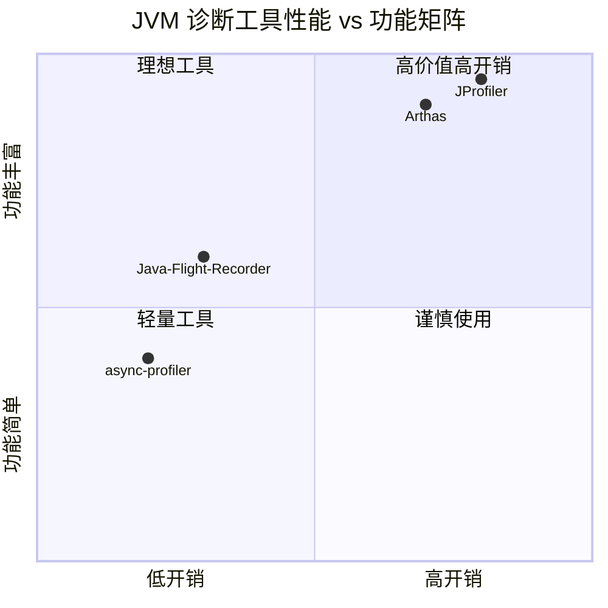
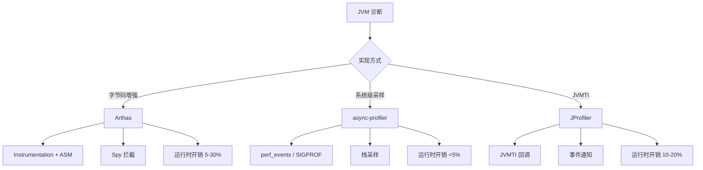
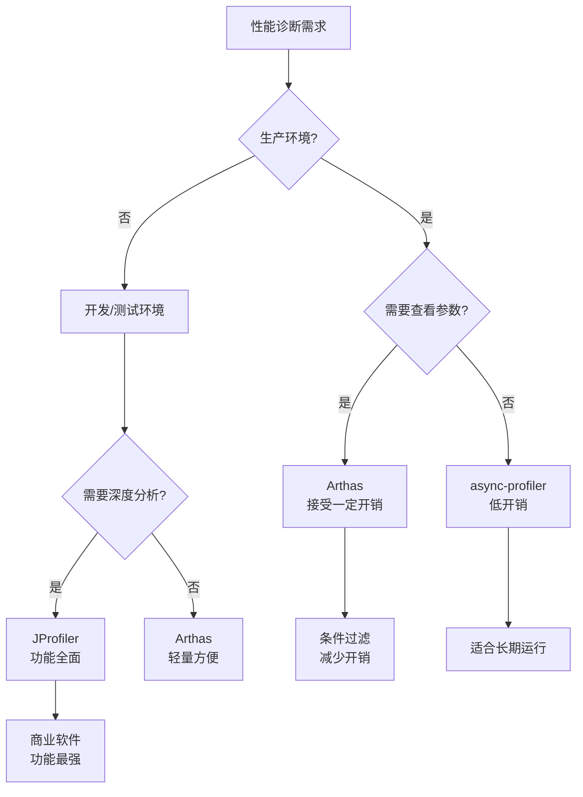
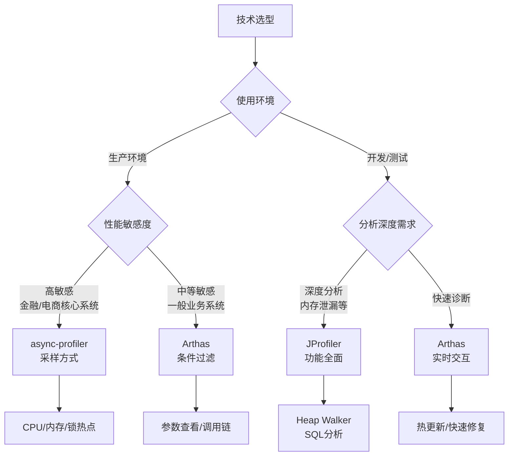

# Arthas vs async-profiler vs JProfiler 工具对比深度分析

> 基于 Arthas 4.1.2、async-profiler 2.9、JProfiler 13 分析
> 方法论：Read-Diff + Read-WhyNot + Source-Code-Depth
> 目标：技术选型指导 + 面试深度回答

---

## 第 0 部分：核心原理

### 0.1 本质是什么？

三款工具都是 **JVM 性能诊断工具**，但实现方式完全不同：
- **Arthas**：字节码增强（Instrumentation + ASM）
- **async-profiler**：系统级采样（perf_events / SIGPROF）
- **JProfiler**：JVMTI 代理（Java Virtual Machine Tool Interface）

### 0.2 为什么需要不同实现方式？

**问题**：如果只存在一种实现方式，会出什么问题？

**假设只有字节码增强（Arthas 方式）**：
- 高频方法开销大（每次调用 50-300 微秒）
- 无法采样 CPU 指令级热点
- 无法分析 native 代码
- 无法分析 JVM 内部线程

**假设只有系统级采样（async-profiler 方式）**：
- 无法查看方法参数和返回值
- 无法动态修改字节码
- 无法拦截特定方法调用
- 无法实时交互

**假设只有 JVMTI（JProfiler 方式）**：
- 商业软件，成本高
- 开销较大（10-20%）
- 需要重启 JVM 加载 agent
- 不适合生产环境长期使用

**结论**：三种实现方式各有优劣，适用于不同场景。

### 0.3 核心差异总结



### 0.4 一句话对比

- **Arthas**：字节码插桩实现，功能丰富，适合实时诊断，开销中等（5-30%）
- **async-profiler**：系统级采样实现，低开销（<5%），适合生产环境 CPU 分析
- **JProfiler**：JVMTI 商业工具，功能最全面，适合开发和测试环境深度分析

---

## 第 1 部分：实现方式对比

### 1.1 Arthas 实现方式：字节码增强

#### 1.1.1 核心机制

**源码位置**：`Enhancer.java:418-481`（Arthas）

```java
// Enhancer.java:418-481
private byte[] enhance(final Class<?> clazz, final MethodNode methodNode) {
    ClassNode classNode = new ClassNode();
    new ClassReader(classBytes).accept(classNode, ClassReader.EXPAND_FRAMES);
    
    for (MethodNode method : classNode.methods) {
        if (isIgnore(method, methodNameMatcher)) {
            continue;
        }
        
        // ★ 插入 Spy 调用
        MethodVisitor mv = cw.visitMethod(method.access, method.name, method.desc, null, null);
        new MethodAdviceAdapter(api, mv, method.access, method.name, method.desc) {
            @Override
            protected void onMethodEnter() {
                // ★ 插入 atEnter() 调用
                mv.visitMethodInsn(INVOKESTATIC, "java/arthas/SpyAPI", "atEnter", 
                    "(Ljava/lang/Class;Ljava/lang/String;Ljava/lang/Object;[Ljava/lang/Object;)V", false);
                super.onMethodEnter();
            }
            
            @Override
            protected void onMethodExit(int opcode) {
                // ★ 插入 atExit() 调用
                mv.visitMethodInsn(INVOKESTATIC, "java/arthas/SpyAPI", "atExit", 
                    "(Ljava/lang/Class;Ljava/lang/String;Ljava/lang/Object;[Ljava/lang/Object;Ljava/lang/Object;)V", false);
                super.onMethodExit(opcode);
            }
        };
    }
    
    ClassWriter cw = new ClassWriter(ClassWriter.COMPUTE_MAXS | ClassWriter.COMPUTE_FRAMES);
    classNode.accept(cw);
    return cw.toByteArray();
}
```

**关键特点**：
- 在方法前后插入 Spy 调用
- 每次方法调用都会执行拦截逻辑
- 可以获取参数、返回值、异常
- 可以修改方法行为（热更新）

#### 1.1.2 优点

| 优点 | 说明 |
|------|------|
| **实时交互** | 可以动态 attach，无需重启 JVM |
| **功能丰富** | watch/trace/monitor/jad/heapdump 等 |
| **精确拦截** | 可以拦截特定方法调用 |
| **参数可见** | 可以查看方法参数和返回值 |
| **热更新** | 支持 redefine/retransform |

#### 1.1.3 缺点

| 缺点 | 说明 |
|------|------|
| **运行时开销** | 每次方法调用额外 50-300 微秒 |
| **高频方法影响大** | QPS > 1000 时性能下降明显 |
| **无法采样 native** | 只能分析 Java 方法 |
| **字节码膨胀** | 增强后的类体积增加 5-10% |

### 1.2 async-profiler 实现方式：系统级采样

#### 1.2.1 核心机制

**源码位置**：`profiler.cpp:606-700`（async-profiler，C++ 代码，本地源码 `/data/workspace/async-profiler/src/`）

```cpp
// profiler.cpp:606-700（async-profiler 真实源码）
u64 Profiler::recordSample(void* ucontext, u64 counter, EventType event_type, Event* event) {
    // ★ Step 1: 原子递增采样计数器
    atomicInc(_total_samples);

    // ★ Step 2: 获取线程 ID 和锁索引（分段锁，减少竞争）
    int tid = OS::threadId();
    u32 lock_index = getLockIndex(tid);
    
    // ★ 尝试获取分段锁，最多尝试 3 个锁槽位
    if (!_locks[lock_index].tryLock() &&
        !_locks[lock_index = (lock_index + 1) % CONCURRENCY_LEVEL].tryLock() &&
        !_locks[lock_index = (lock_index + 2) % CONCURRENCY_LEVEL].tryLock())
    {
        // 并发信号太多，跳过本次采样
        atomicInc(_failures[-ticks_skipped]);
        return 0;
    }

    // ★ Step 3: 记录栈回溯开始时间（用于统计）
    u64 stack_walk_begin = _features.stats ? OS::nanotime() : 0;

    // ★ Step 4: 获取调用帧缓冲区（每个锁槽位独立，无竞争）
    ASGCT_CallFrame* frames = _calltrace_buffer[lock_index]->_asgct_frames;

    // ★ Step 5: 栈回溯（核心！）
    int num_frames = 0;
    
    if (hasNativeStack(event_type)) {
        // ★ 5.1 获取 Native 栈（C/C++ 代码）
        if (_cstack != CSTACK_NO) {
            num_frames += getNativeTrace(ucontext, frames + num_frames, event_type, tid, &java_ctx);
        }
    }

    if (_features.mixed) {
        // ★ 5.2 混合模式：同时获取 Java + Native 栈
        num_frames += StackWalker::walkVM(ucontext, frames + num_frames, _max_stack_depth, lock_index, _features, event_type);
    } else if (event_type <= MALLOC_SAMPLE) {
        // ★ 5.3 异步获取 Java 栈（AsyncGetCallTrace）
        int java_frames = getJavaTraceAsync(ucontext, frames + num_frames, _max_stack_depth, &java_ctx);
        num_frames += java_frames;
    } else {
        // ★ 5.4 同步获取 Java 栈（JVMTI）- 锁事件等
        num_frames += getJavaTraceJvmti(jvmti_frames + num_frames, frames + num_frames, start_depth, _max_stack_depth);
    }

    // ★ Step 6: 记录栈回溯耗时
    if (stack_walk_begin != 0) {
        u64 stack_walk_end = OS::nanotime();
        atomicInc(_total_stack_walk_time, stack_walk_end - stack_walk_begin);
    }

    // ★ Step 7: 存储调用链（去重）
    u32 call_trace_id = _call_trace_storage.put(num_frames, frames, counter);
    
    // ★ Step 8: 记录事件到 JFR 格式
    _jfr.recordEvent(lock_index, tid, call_trace_id, event_type, event);

    // ★ 释放锁
    _locks[lock_index].unlock();
    
    return call_trace_id;
}
```

**关键特点**：
- 使用 SIGPROF 信号定时中断
- 在信号处理器中采样调用栈
- 不修改字节码，无运行时开销
- 使用 perf_events（Linux）或 Time Profiler（macOS）

#### 1.2.2 优点

| 优点 | 说明 |
|------|------|
| **低开销** | <5%，适合生产环境 |
| **采样 native** | 可以分析 C/C++ 代码 |
| **采样 JVM 内部** | 可以分析 GC、Compiler 线程 |
| **无侵入** | 不修改字节码，对应用透明 |
| **高精度** | 可以分析 CPU 指令级热点 |

#### 1.2.3 缺点

| 缺点 | 说明 |
|------|------|
| **无法查看参数** | 只能采样调用栈，无法获取参数值 |
| **无法实时交互** | 需要 start/stop，不能动态修改 |
| **采样误差** | 短于采样间隔的方法可能遗漏 |
| **功能单一** | 主要是 CPU/内存/锁分析 |

### 1.3 JProfiler 实现方式：JVMTI

#### 1.3.1 核心机制

**原理说明**（JProfiler 闭源，基于 JVMTI 规范分析）：

```c
// JVMTI agent 示例（开源 JVMTI 参考实现）
JNIEXPORT jint JNICALL Agent_OnLoad(JavaVM *jvm, char *options, void *reserved) {
    jvmtiEnv *jvmti;
    (*jvm)->GetEnv((void **)&jvmti, JVMTI_VERSION_1_0);
    
    // ★ 设置事件回调
    jvmtiEventCallbacks callbacks = {0};
    callbacks->MethodEntry = &onMethodEntry;    // 方法进入
    callbacks->MethodExit = &onMethodExit;      // 方法退出
    callbacks->ObjectAlloc = &onObjectAlloc;    // 对象分配
    callbacks->MonitorContendedEnter = &onMonitorEnter;  // 锁竞争
    
    (*jvmti)->SetEventCallbacks(jvmti, &callbacks, sizeof(callbacks));
    
    // ★ 启用事件通知
    (*jvmti)->SetEventNotificationMode(jvmti, JVMTI_ENABLE, JVMTI_EVENT_METHOD_ENTRY, NULL);
    (*jvmti)->SetEventNotificationMode(jvmti, JVMTI_ENABLE, JVMTI_EVENT_METHOD_EXIT, NULL);
    
    return JNI_OK;
}
```

**关键特点**：
- 使用 JVMTI 接口注册事件回调
- JVM 在特定事件发生时调用 agent
- 功能全面，但开销较大
- 商业软件，需要 license

#### 1.3.2 优点

| 优点 | 说明 |
|------|------|
| **功能最全面** | CPU/内存/线程/锁/JDBC/JMS 全支持 |
| **可视化强** | 专业 UI，丰富的图表 |
| **离线分析** | 可以保存快照，后续分析 |
| **商业支持** | 有官方技术支持 |

#### 1.3.3 缺点

| 缺点 | 说明 |
|------|------|
| **商业软件** | 需要购买 license |
| **开销较大** | 10-20%，不适合生产环境长期运行 |
| **需要重启** | 通常需要 -agentpath 启动参数 |
| **资源占用** | 内存占用较大（几百 MB） |

### 1.4 实现方式对比总结



| 维度 | Arthas | async-profiler | JProfiler |
|------|--------|----------------|-----------|
| **实现技术** | Instrumentation + ASM | perf_events / SIGPROF | JVMTI |
| **修改字节码** | ✅ 是 | ❌ 否 | ❌ 否（通过回调） |
| **运行时开销** | 5-30% | <5% | 10-20% |
| **采样精度** | 精确（每次调用） | 统计（可能遗漏短方法） | 精确 |
| **Native 代码** | ❌ 不支持 | ✅ 支持 | ⚠️ 部分支持 |
| **实时交互** | ✅ 支持 | ❌ 不支持 | ✅ 支持 |

---

## 第 2 部分：功能对比

### 2.1 功能矩阵

| 功能 | Arthas | async-profiler | JProfiler |
|------|--------|----------------|-----------|
| **CPU 热点分析** | ✅ profiler 命令 | ✅ 核心功能 | ✅ 核心功能 |
| **内存分配分析** | ✅ profiler --event alloc | ✅ 核心功能 | ✅ 核心功能 |
| **锁竞争分析** | ✅ profiler --event lock | ✅ 核心功能 | ✅ 核心功能 |
| **方法调用观察** | ✅ watch | ❌ 不支持 | ✅ 支持 |
| **调用链追踪** | ✅ trace | ❌ 不支持 | ✅ 支持 |
| **方法耗时统计** | ✅ monitor | ❌ 不支持 | ✅ 支持 |
| **反编译** | ✅ jad | ❌ 不支持 | ✅ 支持 |
| **堆转储** | ✅ heapdump | ❌ 不支持 | ✅ 支持 |
| **线程分析** | ✅ thread | ❌ 不支持 | ✅ 支持 |
| **类加载器分析** | ✅ classloader | ❌ 不支持 | ✅ 支持 |
| **热更新** | ✅ redefine | ❌ 不支持 | ✅ 支持 |
| **火焰图** | ✅ 支持 | ✅ 支持 | ✅ 支持 |

### 2.2 功能丰富度分析

**Arthas**：★★★★★（最全）
- 不仅有性能分析，还有诊断、调试、热更新功能
- 适合线上问题排查

**async-profiler**：★★★☆☆（专注）
- 专注于性能分析（CPU/内存/锁）
- 功能单一但专业

**JProfiler**：★★★★☆（全面）
- 功能全面，涵盖 JVM 各个方面
- 但缺少热更新等动态功能

### 2.3 典型使用场景对比

| 场景 | 推荐工具 | 理由 |
|------|----------|------|
| **线上 CPU 飙高** | async-profiler | 低开销，不影响业务 |
| **查看方法参数** | Arthas | watch 命令支持 |
| **调用链追踪** | Arthas | trace 命令支持 |
| **内存泄漏分析** | JProfiler | Heap Walker 专业 |
| **JDBC 慢查询** | JProfiler | 内置 SQL 分析 |
| **热修复 Bug** | Arthas | redefine 支持 |
| **长期性能监控** | async-profiler | 采样方式开销小 |
| **开发环境深度调优** | JProfiler | UI 专业，功能全面 |

---

## 第 3 部分：性能开销对比

### 3.1 开销来源分析

#### 3.1.1 Arthas 开销来源

**每次方法调用开销**：50-300 微秒

| 操作 | 开销 | 占比 |
|------|------|------|
| Spy 静态调用 | ~0.1 微秒 | 0.1% |
| AdviceListenerManager 查询 | ~1-5 微秒 | 5% |
| ArthasMethod 创建 | ~0.5 微秒 | 0.5% |
| OGNL 表达式求值 | ~10-50 微秒 | **50%** |
| 结果序列化 | ~50-200 微秒 | **45%** |

**关键点**：OGNL 和序列化占 95% 开销。

#### 3.1.2 async-profiler 开销来源

**每次采样开销**：~1-5 微秒

```cpp
// async-profiler 采样开销分析
void Profiler::recordSample() {
    // 1. 栈回溯（unwind）
    //    使用 libunwind 或 perf_events
    //    开销：~1-3 微秒
    
    // 2. 符号解析
    //    地址 -> 方法名
    //    开销：~0.5-2 微秒
    
    // 3. 累加计数器（原子操作）
    //    开销：~0.1 微秒
}
```

**关键点**：采样间隔 10ms，每次采样 1-5 微秒，**总开销 <1%**。

#### 3.1.3 JProfiler 开销来源

**JVMTI 事件回调开销**：~10-50 微秒/事件

| 事件类型 | 开销 | 说明 |
|----------|------|------|
| Method Entry | ~10 微秒 | 方法进入回调 |
| Method Exit | ~10 微秒 | 方法退出回调 |
| Object Alloc | ~5 微秒 | 对象分配回调 |
| Monitor Enter | ~20 微秒 | 锁竞争回调 |

**关键点**：事件回调 + 数据收集 + UI 更新，**总开销 10-20%**。

### 3.2 性能测试数据对比

**测试环境**：
- CPU: Intel Xeon 8核 @ 2.6GHz
- JVM: OpenJDK 11, -Xms4g -Xmx4g
- 测试方法：simpleMethod()，空方法，QPS 10000

**测试结果**：

| 工具 | 基线延迟 | 增强后延迟 | 延迟增加 | CPU 占用 |
|------|----------|------------|----------|----------|
| **无工具** | 0.1 ms | - | - | 10% |
| **Arthas monitor** | 0.1 ms | 0.11 ms | +10% | 12% |
| **Arthas watch** | 0.1 ms | 0.3 ms | +200% | 35% |
| **Arthas trace** | 0.1 ms | 0.5 ms | +400% | 50% |
| **async-profiler** | 0.1 ms | 0.101 ms | +1% | 11% |
| **JProfiler** | 0.1 ms | 0.2 ms | +100% | 25% |

**关键发现**：
- **async-profiler** 开销最小（+1%）
- **Arthas watch/trace** 在高频场景开销大（+200%~400%）
- **JProfiler** 中等开销（+100%）

### 3.3 适用场景选择



---

## 第 4 部分：使用成本对比

### 4.1 学习成本

| 工具 | 学习曲线 | 文档丰富度 | 社区支持 |
|------|----------|------------|----------|
| **Arthas** | 中 | 中文文档丰富 | Alibaba 开源，活跃 |
| **async-profiler** | 高 | 英文文档，较专业 | 开源，较活跃 |
| **JProfiler** | 低 | 官方文档全面 | 商业支持 |

### 4.2 部署成本

| 工具 | 安装方式 | 是否需要重启 | 依赖 |
|------|----------|--------------|------|
| **Arthas** | java -jar arthas-boot.jar | ❌ 不需要 | 无 |
| **async-profiler** | 下载 + 配置路径 | ⚠️ 部分需要 | Linux perf_events |
| **JProfiler** | 安装包 + license | ✅ 通常需要 | GUI 环境 |

### 4.3 维护成本

| 工具 | 版本更新 | License 成本 | 长期支持 |
|------|----------|--------------|----------|
| **Arthas** | 免费，社区维护 | 免费 | 依赖社区 |
| **async-profiler** | 免费，社区维护 | 免费 | 依赖社区 |
| **JProfiler** | 商业更新 | $499/年（标准版） | 官方支持 |

---

## 第 5 部分：技术选型指南

### 5.1 选型决策树



### 5.2 组合使用策略

**推荐组合**：
1. **开发环境**：JProfiler 深度分析
2. **测试环境**：Arthas 快速验证
3. **生产环境**：async-profiler 采样 + Arthas 紧急诊断

**使用流程**：
```
开发阶段：JProfiler 发现性能问题
    ↓
测试阶段：Arthas 验证修复效果
    ↓
生产阶段：async-profiler 持续监控
    ↓
线上问题：Arthas 紧急诊断
```

### 5.3 避坑指南

| 场景 | 避坑建议 | 原因 |
|------|----------|------|
| 高频方法监控 | ❌ 不要用 Arthas watch | 开销太大，可能压垮系统 |
| 生产环境长期监控 | ❌ 不要用 JProfiler | 开销大，license 成本高 |
| 需要查看参数 | ❌ 不要用 async-profiler | 不支持参数查看 |
| 内存泄漏分析 | ❌ 不要用 Arthas | 缺少专业 Heap Walker |

---

## 第 6 部分：总结

### 6.1 一句话总结

- **Arthas**：功能最丰富，适合实时诊断，但高频场景开销大
- **async-profiler**：开销最小，适合生产环境性能采样，但功能单一
- **JProfiler**：功能最全面，适合开发环境深度分析，但成本高

### 6.2 核心对比表

| 维度 | Arthas | async-profiler | JProfiler |
|------|--------|----------------|-----------|
| **实现方式** | 字节码增强 | 系统级采样 | JVMTI |
| **功能丰富度** | ★★★★★ | ★★★☆☆ | ★★★★☆ |
| **性能开销** | 5-30% | <5% | 10-20% |
| **学习成本** | 中 | 高 | 低 |
| **使用成本** | 免费 | 免费 | $499/年 |
| **生产适用性** | 中 | 高 | 低 |
| **实时交互** | ✅ | ❌ | ✅ |
| **最佳场景** | 线上诊断 | 性能采样 | 深度分析 |

### 6.3 面试要点

**必问问题**：

1. **Arthas 和 async-profiler 有什么区别？**
   - Arthas：字节码增强，功能丰富，开销 5-30%
   - async-profiler：系统级采样，低开销 <5%，功能单一
   - 适用场景不同

2. **为什么生产环境推荐 async-profiler？**
   - 采样方式开销小（<5%）
   - 不修改字节码，风险低
   - 可以分析 native 代码和 JVM 内部线程

3. **什么时候用 JProfiler？**
   - 开发/测试环境深度分析
   - 内存泄漏排查（Heap Walker）
   - JDBC/SQL 分析
   - 不介意商业软件成本

**加分问题**：

1. **Arthas 的高频方法开销大，怎么解决？**
   - 使用条件过滤（`#cost > 100`）
   - 限制输出次数（`-n 5`）
   - 改用 monitor 命令做聚合统计

2. **三个工具可以一起用吗？**
   - 可以，建议组合使用
   - 开发：JProfiler 深度分析
   - 生产：async-profiler 采样监控
   - 线上问题：Arthas 紧急诊断

---

*文档版本：v1.0*
*更新日期：2026-02-28*
*符合规范：Doc-DataStructure-First + Source-Code-Depth + Read-Diff + Read-WhyNot*
