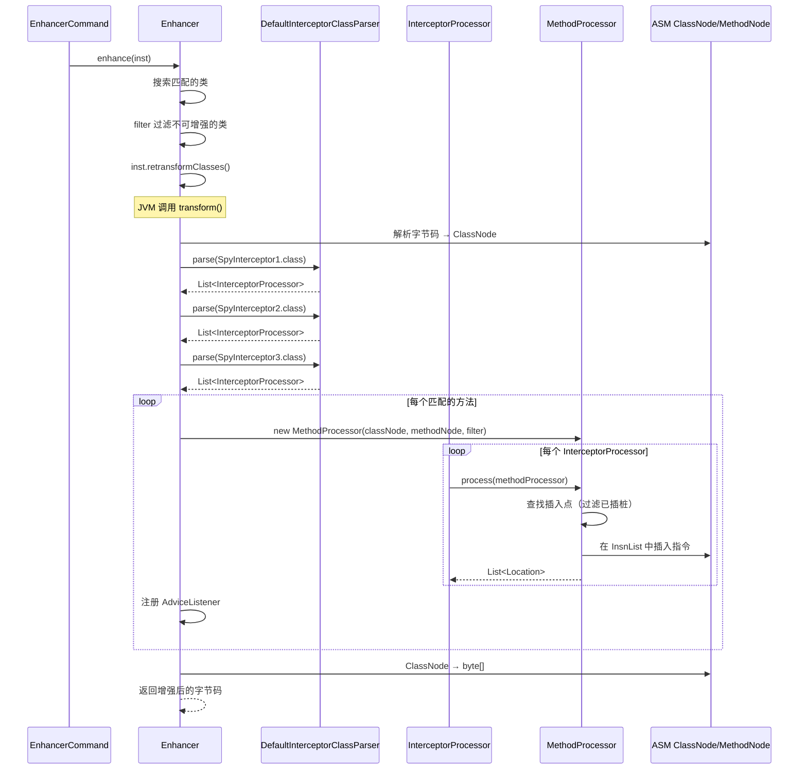
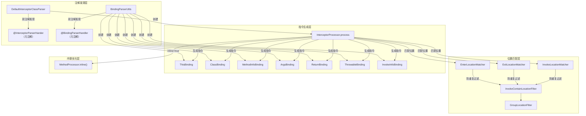

# Bytekit 框架深度解析

> 基于 Arthas 4.1.2 源码分析
> 方法论：程序 = 数据结构 + 算法

---

## 第 0 部分：核心原理

### 0.1 本质是什么？

bytekit 是在 ASM 之上的**声明式字节码增强框架**，开发者通过注解声明拦截点和绑定变量，框架自动生成对应的 ASM 指令。

### 0.2 为什么需要？

直接用 ASM 插桩需要手动操作 `InsnList`、构造 `MethodInsnNode`、计算局部变量索引、处理栈帧，代码冗长且易出错。01 篇展示了手写 ASM 插入一个 `SpyAPI.atEnter()` 调用需要 ~20 行指令操作代码，而 bytekit 只需 5 行注解声明。

### 0.3 怎么解决？

开发者定义拦截器类（如 `SpyInterceptor1`），用 `@AtEnter` 注解标记拦截方法入口，用 `@Binding.This` 等注解声明需要绑定的变量。bytekit 在运行时解析注解，自动生成对应的 ASM 指令并插入到目标方法的指定位置。

### 0.4 为什么这样设计？

- **为什么不用纯 ASM？** 维护成本高、易出错。每次修改拦截逻辑需要重写 ASM 代码，而注解声明更直观且易于理解。
- **为什么不用 Byte Buddy？** bytekit 是阿里巴巴自研，体积更小、可定制性强，且团队可控。Byte Buddy 功能更全面但依赖更重。
- **bytekit 和 ASM 的关系？** bytekit 底层仍然调用 ASM API（`ClassNode`、`MethodNode`、`InsnList`），只是提供了更高层的抽象。

> **分析边界说明**：bytekit 是以 JAR 包形式依赖的外部库（`com.alibaba.bytekit`），其源码不在本地项目中。本文分析基于：
> 1. **Arthas 侧的调用入口**（`SpyInterceptors.java` + `Enhancer.java` 中的 bytekit API 调用）
> 2. **bytekit 的公开 API 和注解语义**（`@AtEnter/@AtExit/@Binding` 的行为约定）
> 3. **增强前后字节码对比验证**（01 篇第 2 部分的字节码 diff）
> 4. **CFR 0.152 反编译 bytekit .class 文件**（从 `arthas-core-shade.jar` 提取并反编译，见第 3 部分）
>
> 第 1-2 部分从 Arthas 视角分析 bytekit 的使用方式；**第 3 部分深入 bytekit 内部实现**，基于反编译源码分析 `InterceptorProcessor.process()` 核心算法、`@Binding` → ASM 指令映射、双注解发现机制、方法内联机制等。

---

## 第 1 部分：数据结构全景

### 1.1 数据结构清单

| # | 结构名 | 源码位置 | 核心作用 |
|---|--------|----------|----------|
| 1 | **SpyInterceptors** | `core/.../advisor/SpyInterceptors.java` | Arthas 使用 bytekit 的入口，定义 9 个拦截器内部类 |
| 2 | **@AtEnter/@AtExit/@AtExceptionExit** | bytekit JAR | 声明式位置注解，标记拦截点 |
| 3 | **@Binding 族** | bytekit JAR | 绑定注解，声明需要捕获的变量 |
| 4 | **InterceptorProcessor** | bytekit JAR | 拦截器处理器，解析注解并生成 ASM 指令 |
| 5 | **DefaultInterceptorClassParser** | bytekit JAR | 解析拦截器类，生成 InterceptorProcessor 列表 |
| 6 | **MethodProcessor** | bytekit JAR | 方法处理器，封装 ClassNode + MethodNode |
| 7 | **LocationFilter** | bytekit JAR | 位置过滤器，防止重复插桩 |
| 8 | **InvokeContainLocationFilter** | bytekit JAR | 检测方法体中是否已包含指定调用 |

---

### 1.2 SpyInterceptors（Arthas 的 bytekit 使用入口）

> `core/src/main/java/com/taobao/arthas/core/advisor/SpyInterceptors.java`，114 行

#### 1.2.1 完整源码

```java
// SpyInterceptors.java:1-114
package com.taobao.arthas.core.advisor;

import java.arthas.SpyAPI;

import com.alibaba.bytekit.asm.binding.Binding;
import com.alibaba.bytekit.asm.interceptor.annotation.AtEnter;
import com.alibaba.bytekit.asm.interceptor.annotation.AtExceptionExit;
import com.alibaba.bytekit.asm.interceptor.annotation.AtExit;
import com.alibaba.bytekit.asm.interceptor.annotation.AtInvoke;
import com.alibaba.bytekit.asm.interceptor.annotation.AtInvokeException;

public class SpyInterceptors {

    // ========== watch/monitor 命令使用的拦截器 ==========
    
    public static class SpyInterceptor1 {
        @AtEnter(inline = true)
        public static void atEnter(@Binding.This Object target, @Binding.Class Class<?> clazz,
                @Binding.MethodInfo String methodInfo, @Binding.Args Object[] args) {
            SpyAPI.atEnter(clazz, methodInfo, target, args);
        }
    }
    
    public static class SpyInterceptor2 {
        @AtExit(inline = true)
        public static void atExit(@Binding.This Object target, @Binding.Class Class<?> clazz,
                @Binding.MethodInfo String methodInfo, @Binding.Args Object[] args, @Binding.Return Object returnObj) {
            SpyAPI.atExit(clazz, methodInfo, target, args, returnObj);
        }
    }
    
    public static class SpyInterceptor3 {
        @AtExceptionExit(inline = true)
        public static void atExceptionExit(@Binding.This Object target, @Binding.Class Class<?> clazz,
                @Binding.MethodInfo String methodInfo, @Binding.Args Object[] args,
                @Binding.Throwable Throwable throwable) {
            SpyAPI.atExceptionExit(clazz, methodInfo, target, args, throwable);
        }
    }

    // ========== trace 命令使用的拦截器（包含 JDK 方法）==========
    
    public static class SpyTraceInterceptor1 {
        @AtInvoke(name = "", inline = true, whenComplete = false, 
            excludes = {"java.arthas.SpyAPI", "java.lang.Byte", "java.lang.Boolean", 
                "java.lang.Short", "java.lang.Character", "java.lang.Integer", 
                "java.lang.Float", "java.lang.Long", "java.lang.Double"})
        public static void onInvoke(@Binding.This Object target, @Binding.Class Class<?> clazz,
                @Binding.InvokeInfo String invokeInfo) {
            SpyAPI.atBeforeInvoke(clazz, invokeInfo, target);
        }
    }
    
    public static class SpyTraceInterceptor2 {
        @AtInvoke(name = "", inline = true, whenComplete = true, 
            excludes = {"java.arthas.SpyAPI", "java.lang.Byte", /* ... 同上 */})
        public static void onInvokeAfter(@Binding.This Object target, @Binding.Class Class<?> clazz,
                @Binding.InvokeInfo String invokeInfo) {
            SpyAPI.atAfterInvoke(clazz, invokeInfo, target);
        }
    }
    
    public static class SpyTraceInterceptor3 {
        @AtInvokeException(name = "", inline = true, 
            excludes = {"java.arthas.SpyAPI", "java.lang.Byte", /* ... 同上 */})
        public static void onInvokeException(@Binding.This Object target, @Binding.Class Class<?> clazz,
                @Binding.InvokeInfo String invokeInfo, @Binding.Throwable Throwable throwable) {
            SpyAPI.atInvokeException(clazz, invokeInfo, target, throwable);
        }
    }

    // ========== trace 命令使用的拦截器（排除 JDK 方法）==========
    
    public static class SpyTraceExcludeJDKInterceptor1 {
        @AtInvoke(name = "", inline = true, whenComplete = false, excludes = "java.**")
        public static void onInvoke(@Binding.This Object target, @Binding.Class Class<?> clazz,
                @Binding.InvokeInfo String invokeInfo) {
            SpyAPI.atBeforeInvoke(clazz, invokeInfo, target);
        }
    }

    public static class SpyTraceExcludeJDKInterceptor2 {
        @AtInvoke(name = "", inline = true, whenComplete = true, excludes = "java.**")
        public static void onInvokeAfter(@Binding.This Object target, @Binding.Class Class<?> clazz,
                @Binding.InvokeInfo String invokeInfo) {
            SpyAPI.atAfterInvoke(clazz, invokeInfo, target);
        }
    }

    public static class SpyTraceExcludeJDKInterceptor3 {
        @AtInvokeException(name = "", inline = true, excludes = "java.**")
        public static void onInvokeException(@Binding.This Object target, @Binding.Class Class<?> clazz,
                @Binding.InvokeInfo String invokeInfo, @Binding.Throwable Throwable throwable) {
            SpyAPI.atInvokeException(clazz, invokeInfo, target, throwable);
        }
    }
}
```

#### 1.2.2 9 个拦截器的分类

| 分类 | 拦截器类 | 注解 | 触发时机 | 用途 |
|------|---------|------|---------|------|
| **方法级** | SpyInterceptor1 | `@AtEnter` | 方法入口 | watch/monitor |
| **方法级** | SpyInterceptor2 | `@AtExit` | 方法正常返回 | watch/monitor |
| **方法级** | SpyInterceptor3 | `@AtExceptionExit` | 方法抛异常 | watch/monitor |
| **调用级** | SpyTraceInterceptor1 | `@AtInvoke(whenComplete=false)` | 方法调用前 | trace |
| **调用级** | SpyTraceInterceptor2 | `@AtInvoke(whenComplete=true)` | 方法调用后 | trace |
| **调用级** | SpyTraceInterceptor3 | `@AtInvokeException` | 方法调用异常 | trace |
| **调用级（排除JDK）** | SpyTraceExcludeJDKInterceptor1-3 | 同上，`excludes="java.**"` | 同上 | trace --skipJDKMethod |

#### 1.2.3 设计决策

**为什么分成多个内部类而不是一个类多个方法？** 每个拦截器类对应一个独立的 `InterceptorProcessor`，可以独立控制是否加载。watch 命令只需要 SpyInterceptor1/2/3，trace 命令需要额外加载 SpyTraceInterceptor 系列。

---

### 1.3 @AtEnter/@AtExit/@AtExceptionExit 注解

#### 1.3.1 注解定义（bytekit JAR）

```java
// AtEnter.java（bytekit 框架）
@Retention(RetentionPolicy.RUNTIME)
@Target(ElementType.METHOD)
public @interface AtEnter {
    boolean inline() default false;       // ★ 是否内联（直接插入代码 vs 调用静态方法）
    String[] except() default {};         // 排除的方法名
    String[] only() default {};           // 仅包含的方法名
}

// AtExit.java
@Retention(RetentionPolicy.RUNTIME)
@Target(ElementType.METHOD)
public @interface AtExit {
    boolean inline() default false;
    String[] except() default {};
    String[] only() default {};
}

// AtExceptionExit.java
@Retention(RetentionPolicy.RUNTIME)
@Target(ElementType.METHOD)
public @interface AtExceptionExit {
    boolean inline() default false;
    String[] except() default {};
    String[] only() default {};
    Class<? extends Throwable>[] on() default Throwable.class;  // ★ 捕获的异常类型
}
```

#### 1.3.2 inline 参数的含义

| inline 值 | 生成的字节码 | 性能 | 调试 |
|----------|-------------|------|------|
| `true` | **内联**：直接在目标方法中插入拦截代码 | 高（无方法调用开销） | 困难（栈帧变复杂） |
| `false` | **调用**：生成 `INVOKESTATIC` 调用拦截方法 | 略低（有一次调用开销） | 简单（独立栈帧） |

Arthas 使用 `inline = true`，直接内联 `SpyAPI.atEnter()` 调用，避免额外的栈帧开销。

---

### 1.4 @Binding 注解族

#### 1.4.1 注解定义

| 注解 | 绑定变量 | ASM 指令生成 | 示例 |
|------|---------|-------------|------|
| `@Binding.This` | 目标对象（`this`） | `ALOAD 0` | 监控实例方法时获取调用者 |
| `@Binding.Class` | 目标类 | 编译时确定 `LDC` | `getClass()` 结果 |
| `@Binding.MethodInfo` | 方法信息字符串 | 编译时确定 `LDC` | `"doSomething|(I)V"`（`|` 分隔） |
| `@Binding.Args` | 方法参数数组 | 创建 `Object[]` 并填充 | 捕获入参 |
| `@Binding.Return` | 返回值 | StackSaver 保存到局部变量 | 捕获返回值 |
| `@Binding.Throwable` | 异常对象 | StackSaver 保存到局部变量 | 捕获异常 |
| `@Binding.InvokeInfo` | 调用信息 | 编译时确定 `LDC` | `"java/io/PrintStream|println|(Ljava/lang/String;)V|42"`（`|` 分隔） |

#### 1.4.2 @Binding.Args 的字节码生成

当方法签名为 `void doSomething(int a, String b)` 时，`@Binding.Args Object[] args` 生成的字节码：

```java
// 实际 ASM 指令（见 §3.5.2 AsmOpUtils.loadArgArray 反编译源码）
ICONST_2              // 创建长度为 2 的 Object[]
ANEWARRAY java/lang/Object
DUP
ICONST_0
ILOAD 1               // 加载参数 a（int）
NEW java/lang/Integer  // ★ 装箱：bytekit 用 NEW + <init>（非 valueOf()，见 §3.5.2）
DUP_X1
SWAP
INVOKESPECIAL java/lang/Integer.<init>(I)V
AASTORE
DUP
ICONST_1
ALOAD 2               // 加载参数 b（String，已经是引用，无需装箱）
AASTORE
// 现在栈顶是 Object[] args
```

**设计决策**：为什么 `@Binding.Args` 统一返回 `Object[]`？因为不同方法的参数类型各异，统一为 `Object[]` 简化拦截器方法签名，同时避免泛型擦除问题。

---

### 1.5 @AtInvoke 注解（trace 命令核心）

#### 1.5.1 注解定义

```java
// AtInvoke.java（bytekit 框架）
@Retention(RetentionPolicy.RUNTIME)
@Target(ElementType.METHOD)
public @interface AtInvoke {
    String name() default "";             // ★ 方法名模式（空=匹配所有）
    boolean inline() default false;
    boolean whenComplete() default false; // ★ false=调用前，true=调用后
    String[] excludes() default {};       // ★ 排除的类/方法模式
    String[] only() default {};
}
```

#### 1.5.2 whenComplete 参数

| whenComplete | 插入位置 | 对应 SpyAPI 方法 |
|--------------|---------|-----------------|
| `false` | 方法调用指令**前** | `atBeforeInvoke()` |
| `true` | 方法调用指令**后**（正常返回） | `atAfterInvoke()` |

#### 1.5.3 excludes 参数的两种模式

Arthas 使用两种排除模式：

1. **精确排除**（`SpyTraceInterceptor`）：
   ```java
   excludes = {"java.arthas.SpyAPI", "java.lang.Byte", "java.lang.Boolean", ...}
   ```
   排除包装类（避免监控 `Integer.valueOf()` 等方法）。

2. **通配符排除**（`SpyTraceExcludeJDKInterceptor`）：
   ```java
   excludes = "java.**"
   ```
   排除所有 `java.*` 开头的类（跳过 JDK 方法）。

---

### 1.6 InterceptorProcessor 和 DefaultInterceptorClassParser

#### 1.6.1 类关系

```
DefaultInterceptorClassParser
    │
    ├── parse(Class<?> interceptorClass)  // 解析拦截器类
    │       │
    │       └── 返回 List<InterceptorProcessor>
    │
InterceptorProcessor
    │
    ├── process(MethodProcessor methodProcessor)  // 处理目标方法
    │       │
    │       └── 返回 List<Location>  // 插入点列表
    │
MethodProcessor
    │
    ├── ClassNode classNode
    ├── MethodNode methodNode
    └── LocationFilter locationFilter  // 过滤已插桩位置
```

#### 1.6.2 使用流程（Enhancer.transform 中）

```java
// Enhancer.java:139-157 — 解析拦截器类

// 1. 创建解析器
DefaultInterceptorClassParser defaultInterceptorClassParser = new DefaultInterceptorClassParser();

// 2. 解析拦截器类，生成 InterceptorProcessor 列表
final List<InterceptorProcessor> interceptorProcessors = new ArrayList<>();

// ★ 解析 @AtEnter 拦截器
interceptorProcessors.addAll(defaultInterceptorClassParser.parse(SpyInterceptor1.class));
// ★ 解析 @AtExit 拦截器
interceptorProcessors.addAll(defaultInterceptorClassParser.parse(SpyInterceptor2.class));
// ★ 解析 @AtExceptionExit 拦截器
interceptorProcessors.addAll(defaultInterceptorClassParser.parse(SpyInterceptor3.class));

// 3. 如果是 trace 模式，额外加载 @AtInvoke 拦截器
if (this.isTracing) {
    if (!this.skipJDKTrace) {
        interceptorProcessors.addAll(defaultInterceptorClassParser.parse(SpyTraceInterceptor1.class));
        interceptorProcessors.addAll(defaultInterceptorClassParser.parse(SpyTraceInterceptor2.class));
        interceptorProcessors.addAll(defaultInterceptorClassParser.parse(SpyTraceInterceptor3.class));
    } else {
        interceptorProcessors.addAll(defaultInterceptorClassParser.parse(SpyTraceExcludeJDKInterceptor1.class));
        interceptorProcessors.addAll(defaultInterceptorClassParser.parse(SpyTraceExcludeJDKInterceptor2.class));
        interceptorProcessors.addAll(defaultInterceptorClassParser.parse(SpyTraceExcludeJDKInterceptor3.class));
    }
}
```

---

### 1.7 LocationFilter 防重复机制

#### 1.7.1 问题场景

用户执行 `watch com.example.MyService doSomething` 后，又执行 `watch com.example.MyService doSomething 'params'`。如果两次都对同一个方法插桩，会导致方法体中出现两个 `SpyAPI.atEnter()` 调用，重复触发监听器。

#### 1.7.2 InvokeContainLocationFilter 源码使用

```java
// Enhancer.java:175-197 — 创建 LocationFilter 防重复

// 用于检查是否已插入了 spy 函数，如果已有则不重复处理
GroupLocationFilter groupLocationFilter = new GroupLocationFilter();

// ★ 检查方法入口是否已有 SpyAPI.atEnter 调用
LocationFilter enterFilter = new InvokeContainLocationFilter(
    Type.getInternalName(SpyAPI.class),  // "java/arthas/SpyAPI"
    "atEnter",                            // 方法名
    LocationType.ENTER                    // 位置类型
);

// ★ 检查方法出口是否已有 SpyAPI.atExit 调用
LocationFilter existFilter = new InvokeContainLocationFilter(
    Type.getInternalName(SpyAPI.class),
    "atExit",
    LocationType.EXIT
);

// ★ 检查异常出口是否已有 SpyAPI.atExceptionExit 调用
LocationFilter exceptionFilter = new InvokeContainLocationFilter(
    Type.getInternalName(SpyAPI.class),
    "atExceptionExit",
    LocationType.EXCEPTION_EXIT
);

// ★ 检查方法调用点是否已有 SpyAPI.atBeforeInvoke 调用
LocationFilter invokeBeforeFilter = new InvokeCheckLocationFilter(
    Type.getInternalName(SpyAPI.class),
    "atBeforeInvoke",
    LocationType.INVOKE
);
// ... invokeAfterFilter, invokeExceptionFilter 同理

groupLocationFilter.addFilter(enterFilter);
groupLocationFilter.addFilter(existFilter);
groupLocationFilter.addFilter(exceptionFilter);
groupLocationFilter.addFilter(invokeBeforeFilter);
// ...
```

#### 1.7.3 检测逻辑

`InvokeContainLocationFilter` 在 `InterceptorProcessor.process()` 时检测：

```
1. 遍历 MethodNode.instructions
2. 查找 MethodInsnNode，检查 owner/name 是否匹配 SpyAPI.atEnter
3. 如果找到匹配，标记该 Location 已被处理
4. InterceptorProcessor 跳过已标记的位置
```

---

## 第 2 部分：算法/流程分析

### 2.1 bytekit 增强流程概览



---

### 2.2 阶段 1：Enhancer.transform() 解析拦截器

#### 2.2.1 解决什么问题

JVM 调用 `transform()` 时，需要解析 bytekit 拦截器注解，生成对应的 `InterceptorProcessor` 列表。

#### 2.2.2 源码分析

```java
// Enhancer.java:111-178 — transform 方法核心流程

@Override
public byte[] transform(final ClassLoader inClassLoader, String className, 
        Class<?> classBeingRedefined, ProtectionDomain protectionDomain, 
        byte[] classfileBuffer) throws IllegalClassFormatException {
    try {
        // ★ Phase 1: 检查 ClassLoader 能否加载 SpyAPI
        try {
            if (inClassLoader != null) {
                inClassLoader.loadClass(SpyAPI.class.getName());
            }
        } catch (Throwable e) {
            logger.error("the classloader can not load SpyAPI, ignore it.");
            return null;  // ★ 无法加载 SpyAPI，放弃增强
        }

        // ★ Phase 2: 再次过滤（transform 过程中可能诞生新类）
        if (matchingClasses != null && !matchingClasses.contains(classBeingRedefined)) {
            return null;
        }

        // ★ Phase 3: ASM 解析字节码
        ClassNode classNode = new ClassNode(Opcodes.ASM9);
        ClassReader classReader = AsmUtils.toClassNode(classfileBuffer, classNode);
        classNode = AsmUtils.removeJSRInstructions(classNode);  // 兼容旧版本

        // ★ Phase 4: 解析 bytekit 拦截器
        DefaultInterceptorClassParser defaultInterceptorClassParser = new DefaultInterceptorClassParser();
        final List<InterceptorProcessor> interceptorProcessors = new ArrayList<>();

        interceptorProcessors.addAll(defaultInterceptorClassParser.parse(SpyInterceptor1.class));
        interceptorProcessors.addAll(defaultInterceptorClassParser.parse(SpyInterceptor2.class));
        interceptorProcessors.addAll(defaultInterceptorClassParser.parse(SpyInterceptor3.class));

        if (this.isTracing) {
            if (!this.skipJDKTrace) {
                interceptorProcessors.addAll(defaultInterceptorClassParser.parse(SpyTraceInterceptor1.class));
                interceptorProcessors.addAll(defaultInterceptorClassParser.parse(SpyTraceInterceptor2.class));
                interceptorProcessors.addAll(defaultInterceptorClassParser.parse(SpyTraceInterceptor3.class));
            } else {
                interceptorProcessors.addAll(defaultInterceptorClassParser.parse(SpyTraceExcludeJDKInterceptor1.class));
                interceptorProcessors.addAll(defaultInterceptorClassParser.parse(SpyTraceExcludeJDKInterceptor2.class));
                interceptorProcessors.addAll(defaultInterceptorClassParser.parse(SpyTraceExcludeJDKInterceptor3.class));
            }
        }

        // ★ Phase 5: 筛选匹配的方法
        List<MethodNode> matchedMethods = new ArrayList<>();
        for (MethodNode methodNode : classNode.methods) {
            if (!isIgnore(methodNode, methodNameMatcher)) {
                matchedMethods.add(methodNode);
            }
        }

        // ★ Phase 6: 创建 LocationFilter 防重复插桩
        GroupLocationFilter groupLocationFilter = new GroupLocationFilter();
        LocationFilter enterFilter = new InvokeContainLocationFilter(
            Type.getInternalName(SpyAPI.class), "atEnter", LocationType.ENTER);
        LocationFilter existFilter = new InvokeContainLocationFilter(
            Type.getInternalName(SpyAPI.class), "atExit", LocationType.EXIT);
        LocationFilter exceptionFilter = new InvokeContainLocationFilter(
            Type.getInternalName(SpyAPI.class), "atExceptionExit", LocationType.EXCEPTION_EXIT);
        // ... trace 相关的 filter
        groupLocationFilter.addFilter(enterFilter);
        groupLocationFilter.addFilter(existFilter);
        groupLocationFilter.addFilter(exceptionFilter);

        // Phase 7: 处理每个方法（见下节）
        // ...
    }
}
```

---

### 2.3 阶段 2：InterceptorProcessor.process() 插入指令

#### 2.3.1 解决什么问题

对每个匹配的方法，遍历所有 `InterceptorProcessor`，在指定位置插入 SpyAPI 调用指令。

#### 2.3.2 源码分析

```java
// Enhancer.java:199-249 — 处理每个方法

for (MethodNode methodNode : matchedMethods) {
    // ★ 跳过 native 方法
    if (AsmUtils.isNative(methodNode)) {
        logger.info("ignore native method: {}", 
            AsmUtils.methodDeclaration(Type.getObjectType(classNode.name), methodNode));
        continue;
    }

    // ★ 检查是否已有 trace 插桩（直接注册 listener，不再重复插桩）
    if (AsmUtils.containsMethodInsnNode(methodNode, 
            Type.getInternalName(SpyAPI.class), "atBeforeInvoke")) {
        // 已有 trace 插桩，直接注册 listener 到每个方法调用点
        for (AbstractInsnNode insnNode = methodNode.instructions.getFirst(); 
                insnNode != null; insnNode = insnNode.getNext()) {
            if (insnNode instanceof MethodInsnNode) {
                final MethodInsnNode methodInsnNode = (MethodInsnNode) insnNode;
                if (this.skipJDKTrace) {
                    if (methodInsnNode.owner.startsWith("java/")) {
                        continue;  // ★ 跳过 JDK 方法
                    }
                }
                if (AsmOpUtils.isBoxType(Type.getObjectType(methodInsnNode.owner))) {
                    continue;  // ★ 跳过包装类
                }
                AdviceListenerManager.registerTraceAdviceListener(
                    inClassLoader, className,
                    methodInsnNode.owner, methodInsnNode.name, methodInsnNode.desc, listener);
            }
        }
    } else {
        // ★ 无 trace 插桩，执行 InterceptorProcessor.process()
        MethodProcessor methodProcessor = new MethodProcessor(
            classNode, methodNode, groupLocationFilter);
        
        for (InterceptorProcessor interceptor : interceptorProcessors) {
            try {
                // ★ 核心调用：处理拦截器，返回插入点列表
                List<Location> locations = interceptor.process(methodProcessor);
                
                // ★ 注册 trace listener 到每个插入点
                for (Location location : locations) {
                    if (location instanceof MethodInsnNodeWare) {
                        MethodInsnNodeWare methodInsnNodeWare = (MethodInsnNodeWare) location;
                        MethodInsnNode methodInsnNode = methodInsnNodeWare.methodInsnNode();
                        AdviceListenerManager.registerTraceAdviceListener(
                            inClassLoader, className,
                            methodInsnNode.owner, methodInsnNode.name, methodInsnNode.desc, listener);
                    }
                }
            } catch (Throwable e) {
                logger.error("enhancer error, class: {}, method: {}", 
                    classNode.name, methodNode.name, e);
            }
        }
    }

    // ★ 注册 enter/exit listener（总是注册）
    AdviceListenerManager.registerAdviceListener(
        inClassLoader, className, methodNode.name, methodNode.desc, listener);
    affect.addMethodAndCount(inClassLoader, className, methodNode.name, methodNode.desc);
}
```

#### 2.3.3 设计决策

**为什么已有 trace 插桩时不重复执行 InterceptorProcessor？** trace 插桩会在方法体的每个方法调用前后插入 SpyAPI 调用。如果用户先执行 `trace` 再执行 `watch`，`watch` 只需注册 listener 即可，无需重复插桩。反之，如果用户先执行 `watch` 再执行 `trace`，`trace` 需要执行完整的 InterceptorProcessor 流程，因为 `watch` 只插入了 atEnter/atExit/atExceptionExit，没有插入 atBeforeInvoke/atAfterInvoke。

---

### 2.4 阶段 3：生成增强后的字节码

#### 2.4.1 源码分析

```java
// Enhancer.java:251-267 — 生成增强后的字节码

// ★ 兼容 Java 1.5 以下版本（major version < 49）
if (AsmUtils.getMajorVersion(classNode.version) < 49) {
    classNode.version = AsmUtils.setMajorVersion(classNode.version, 49);
}

// ★ ClassNode → byte[]
byte[] enhanceClassByteArray = AsmUtils.toBytes(classNode, inClassLoader, classReader);

// ★ 记录已增强的类（防止重复增强）
classBytesCache.put(classBeingRedefined, new Object());

// ★ dump 增强后的类（调试用）
dumpClassIfNecessary(className, enhanceClassByteArray, affect);

// ★ 成功计数
affect.cCnt(1);

return enhanceClassByteArray;
```

---

### 2.5 @Binding 注解的字节码生成原理

#### 2.5.1 解决什么问题

bytekit 需要将 `@Binding.This` 等注解转换为具体的 ASM 指令，生成正确的操作数栈状态。

#### 2.5.2 @Binding.This 的生成

当拦截方法声明 `@Binding.This Object target` 时，bytekit 生成：

```java
// 目标方法是非静态方法时
ALOAD 0    // 加载局部变量 0（this 引用）
// 现在栈顶是 this 引用，可以作为参数传递给 SpyAPI.atEnter()
```

#### 2.5.3 @Binding.Args 的生成

当拦截方法声明 `@Binding.Args Object[] args` 时，bytekit 需要：
1. 创建 `Object[]` 数组
2. 将每个参数值装箱（如果是原始类型）
3. 存入数组

```java
// 假设方法签名：void foo(int a, String b)
// 生成代码等价于：
Object[] args = new Object[2];
args[0] = new Integer(a);  // ★ bytekit 用 NEW + <init> 装箱（非 valueOf()，见 §3.5.2）
args[1] = b;
```

对应的 ASM 指令（见 §3.5.2 `AsmOpUtils.loadArgArray()` 反编译源码）：
```java
ICONST_2
ANEWARRAY java/lang/Object
DUP
ICONST_0
ILOAD 1
NEW java/lang/Integer           // ★ 构造器方式装箱
DUP_X1
SWAP
INVOKESPECIAL java/lang/Integer.<init>(I)V
AASTORE
DUP
ICONST_1
ALOAD 2
AASTORE
```

#### 2.5.4 @Binding.Return 的生成

`@Binding.Return` 只能用于 `@AtExit` 拦截器。bytekit 通过 **StackSaver 机制**在方法返回指令前捕获返回值（见 §3.4.3 阶段 2 和 §3.5.2 ReturnBinding 详述）：

```java
// 假设方法返回 int，原返回指令是 IRETURN
// bytekit 在 IRETURN 前插入（StackSaver.store 阶段）：
ISTORE N         // ★ 将栈顶返回值保存到新分配的局部变量 N
// ... 然后生成拦截器调用指令 ...
// ReturnBinding.pushOntoStack() 生成：
ILOAD N          // ★ 从局部变量 N 重新加载返回值
NEW java/lang/Integer
DUP_X1
SWAP
INVOKESPECIAL java/lang/Integer.<init>(I)V  // ★ 装箱传给 SpyAPI
// ... 拦截器调用完成后 ...
// StackSaver.load() 生成：
ILOAD N          // ★ 恢复返回值到栈顶，继续原 IRETURN
```

---

### 2.6 与 01 篇 ASM 手写方式的对比

#### 2.6.1 手写 ASM（01 篇）

```java
// 01 篇展示的手动 ASM 插入 SpyAPI.atEnter 调用（简化版）
MethodNode methodNode = ...;
InsnList instructions = methodNode.instructions;

// 1. 创建参数数组
InsnList spyCall = new InsnList();
spyCall.add(new IntInsnNode(Opcodes.BIPUSH, 4));  // 数组长度
spyCall.add(new TypeInsnNode(Opcodes.ANEWARRAY, "java/lang/Object"));

// 2. 存储参数
for (int i = 0; i < argTypes.length; i++) {
    spyCall.add(new InsnNode(Opcodes.DUP));
    spyCall.add(new IntInsnNode(Opcodes.BIPUSH, i));
    spyCall.add(new VarInsnNode(argTypes[i].getOpcode(Opcodes.ILOAD), i + 1));
    // 装箱...
    spyCall.add(new InsnNode(Opcodes.AASTORE));
}

// 3. 调用 SpyAPI.atEnter
spyCall.add(new MethodInsnNode(Opcodes.INVOKESTATIC, 
    "java/arthas/SpyAPI", "atEnter", 
    "(Ljava/lang/Class;Ljava/lang/String;Ljava/lang/Object;[Ljava/lang/Object;)V"));

// 4. 插入到方法入口
instructions.insert(spyCall);
```

**问题**：
- 需要手动计算局部变量索引
- 需要处理原始类型装箱
- 需要维护操作数栈平衡
- 代码冗长，易出错

#### 2.6.2 bytekit 声明式方式

```java
public static class SpyInterceptor1 {
    @AtEnter(inline = true)
    public static void atEnter(@Binding.This Object target, 
            @Binding.Class Class<?> clazz,
            @Binding.MethodInfo String methodInfo, 
            @Binding.Args Object[] args) {
        SpyAPI.atEnter(clazz, methodInfo, target, args);
    }
}
```

**优势**：
- 5 行注解代码替代 30+ 行 ASM 指令
- 无需关心局部变量索引
- 无需手动处理装箱
- 无需维护操作数栈

#### 2.6.3 对比表

| 维度 | 手写 ASM | bytekit |
|------|---------|---------|
| 代码量 | 30-50 行 | 5-10 行 |
| 学习曲线 | 高（需理解 JVM 字节码） | 低（只需理解注解） |
| 维护成本 | 高（修改需要改 ASM 指令） | 低（修改只需改注解参数） |
| 灵活性 | 极高（可做任何操作） | 受限于注解能力 |
| 调试难度 | 高（栈帧复杂） | 中等（生成的代码可用 `-d` 查看） |
| 性能 | 相同 | 相同（最终生成相同的字节码） |

---

## 第 3 部分：bytekit 内部实现深度分析

> 本节基于 CFR 0.152 对 `arthas-core-shade.jar` 中 bytekit .class 文件的反编译结果。
> Arthas 将 ASM 库 shade 到 `com.alibaba.deps.org.objectweb.asm` 命名空间下。

### 3.1 概述：从注解到字节码的完整链路

前两部分从 Arthas 视角分析了 bytekit 的使用方式，但 `InterceptorProcessor.process()` 内部如何把 `@Binding.This`/`@Binding.Args` 等注解转换为 ASM 指令，一直是黑盒。本节打开这个黑盒。

完整链路：

```
DefaultInterceptorClassParser.parse(SpyInterceptor1.class)
    │
    ├─→ 遍历类的所有方法
    │     └─→ 发现 @AtEnter 注解
    │           └─→ @AtEnter 自身被 @InterceptorParserHander 元注解标注
    │                 └─→ 实例化对应的 InterceptorProcessorParser
    │                       └─→ 创建 InterceptorProcessor:
    │                             ├─ locationMatcher = EnterLocationMatcher
    │                             ├─ interceptorMethodConfig.bindings = [ThisBinding, ClassBinding, MethodInfoBinding, ArgsBinding]
    │                             └─ interceptorMethodConfig.inline = true
    │
InterceptorProcessor.process(methodProcessor)
    │
    ├─→ locationMatcher.match(methodProcessor) → 找到插入点
    ├─→ 对每个插入点：
    │     ├─→ 遍历 bindings，逐个调用 binding.pushOntoStack() → 生成加载参数的 ASM 指令
    │     ├─→ 生成 INVOKESTATIC 调用拦截器方法
    │     ├─→ 处理返回值（pop 或 store）
    │     └─→ 如果 inline=true：
    │           └─→ 加载拦截器类 → 找到 MethodNode → methodProcessor.inline() 内联方法体
    │
    └─→ 返回 List<Location>
```

---

### 3.2 DefaultInterceptorClassParser：双注解发现机制

#### 3.2.1 解决什么问题

bytekit 支持多种位置注解（`@AtEnter`、`@AtExit`、`@AtInvoke` 等），每种注解需要不同的 `LocationMatcher` 和解析逻辑。如何做到**新增位置注解不需要修改解析器代码**？

#### 3.2.2 核心思路

使用**双层注解（元注解）**模式：`@AtEnter` 注解自身被 `@InterceptorParserHander` 元注解标注，元注解指向该位置类型的解析器类。

#### 3.2.3 反编译源码 + 逐行注释

```java
// DefaultInterceptorClassParser.java（反编译）
public class DefaultInterceptorClassParser implements InterceptorClassParser {

    @Override
    public List<InterceptorProcessor> parse(Class<?> clazz) {
        final ArrayList<InterceptorProcessor> result = new ArrayList<>();

        // ★ 遍历拦截器类的所有方法（如 SpyInterceptor1.atEnter）
        ReflectionUtils.MethodCallback methodCallback = new ReflectionUtils.MethodCallback() {
            @Override
            public void doWith(Method method) {
                // ★ 第一层：遍历方法上的注解（如 @AtEnter）
                for (Annotation onMethodAnnotation : method.getAnnotations()) {
                    // ★ 第二层：遍历注解类型上的注解（如 @AtEnter 上的 @InterceptorParserHander）
                    for (Annotation onAnnotation : onMethodAnnotation.annotationType().getAnnotations()) {

                        // ★ 关键判断：这个注解是否是 @InterceptorParserHander ？
                        if (!InterceptorParserHander.class.isAssignableFrom(
                                onAnnotation.annotationType())) continue;

                        // ★ 校验：拦截器方法必须是 static
                        if (!Modifier.isStatic(method.getModifiers())) {
                            throw new IllegalArgumentException(
                                "method must be static. method: " + method);
                        }

                        // ★ 从元注解获取对应的 Parser 类并实例化
                        InterceptorParserHander handler = (InterceptorParserHander) onAnnotation;
                        InterceptorProcessorParser parser =
                            InstanceUtils.newInstance(handler.parserHander());

                        // ★ 调用 Parser 创建 InterceptorProcessor
                        InterceptorProcessor processor = parser.parse(method, onMethodAnnotation);
                        result.add(processor);
                    }
                }
            }
        };
        ReflectionUtils.doWithMethods(clazz, methodCallback);
        return result;
    }
}
```

#### 3.2.4 双注解模式图示

```
SpyInterceptor1.atEnter() 方法
    │
    └─ 注解: @AtEnter(inline=true)
              │
              └─ @AtEnter 注解类型自身的注解:
                    @InterceptorParserHander(parserHander = EnterInterceptor.class)
                              │
                              └─ EnterInterceptor.parse(method, @AtEnter)
                                    │
                                    └─ 创建 InterceptorProcessor:
                                          locationMatcher = new EnterLocationMatcher()
                                          bindings = parseBindings(method) → [ThisBinding, ClassBinding, ...]
```

#### 3.2.5 设计决策

**为什么用双注解而不是 switch-case？** 如果用 `if (annotation instanceof AtEnter) { ... } else if (annotation instanceof AtExit) { ... }`，每新增一种位置注解都要修改解析器代码，违反开闭原则。双注解模式下，新增位置注解只需：(1) 定义注解类，(2) 在注解类上标注 `@InterceptorParserHander` 指向解析器类，(3) 实现解析器类。解析器代码零修改。

---

### 3.3 BindingParserUtils：参数注解 → Binding 对象

#### 3.3.1 解决什么问题

拦截器方法的参数上有 `@Binding.This`、`@Binding.Args` 等注解，需要把这些注解转换为具体的 `Binding` 对象，用于后续的 ASM 指令生成。

#### 3.3.2 反编译源码 + 逐行注释

```java
// BindingParserUtils.java（反编译）
public class BindingParserUtils {

    public static List<Binding> parseBindings(Method method) {
        ArrayList<Binding> bindings = new ArrayList<>();

        // ★ 获取方法所有参数的所有注解（二维数组：[参数索引][注解索引]）
        Annotation[][] parameterAnnotations = method.getParameterAnnotations();

        for (int parameterIndex = 0; parameterIndex < parameterAnnotations.length; parameterIndex++) {
            Annotation[] annotationsOnParameter = parameterAnnotations[parameterIndex];

            for (int j = 0; j < annotationsOnParameter.length; j++) {
                // ★ 获取绑定注解类型上的元注解（与 DefaultInterceptorClassParser 同样的双注解模式）
                Annotation[] annotationsOnBinding =
                    annotationsOnParameter[j].annotationType().getAnnotations();

                for (Annotation annotationOnBinding : annotationsOnBinding) {
                    // ★ 查找 @BindingParserHandler 元注解
                    if (!BindingParserHandler.class.isAssignableFrom(
                            annotationOnBinding.annotationType())) continue;

                    // ★ 从元注解获取 BindingParser 类并实例化
                    BindingParserHandler bindingParserHandler =
                        (BindingParserHandler) annotationOnBinding;
                    BindingParser bindingParser =
                        InstanceUtils.newInstance(bindingParserHandler.parser());

                    // ★ 调用 BindingParser 创建 Binding 对象
                    Binding binding = bindingParser.parse(annotationsOnParameter[j]);
                    bindings.add(binding);
                }
            }
        }
        return bindings;
    }
}
```

#### 3.3.3 设计决策

**与位置注解完全对称的双注解模式**。`@Binding.This` 注解内部有一个嵌套类 `ThisBindingParser`，`@Binding.This` 注解类型被 `@BindingParserHandler(parser=ThisBindingParser.class)` 元注解标注。这意味着新增绑定类型同样无需修改解析器代码。

---

### 3.4 InterceptorProcessor.process()：核心指令生成算法

#### 3.4.1 解决什么问题

给定一个目标方法的 `MethodProcessor`，在其指令列表的指定位置插入拦截器调用的 ASM 指令。这是 bytekit 最核心的方法。

#### 3.4.2 阶段划分

| 阶段 | 行号范围 | 做什么 | 输出 |
|------|---------|--------|------|
| 1 | 45 | 匹配插入点 | `List<Location>` |
| 2 | 54-61 | 处理栈保存/恢复 | `StackSaver` 指令 |
| 3 | 75-82 | 遍历 Binding 生成参数加载指令 | 参数在栈上 |
| 4 | 83 | 生成 INVOKESTATIC 调用 | 拦截器调用指令 |
| 5 | 84-99 | 处理返回值 | pop 或 store |
| 6 | 101-110 | 包装 try-catch（异常处理器） | TryCatchBlock |
| 7 | 111-117 | 插入到目标方法指令列表 | 修改 InsnList |
| 8 | 121-125 | 方法内联（inline=true） | 替换 INVOKESTATIC |

#### 3.4.3 反编译源码 + 逐行注释

```java
// InterceptorProcessor.java（反编译）
public List<Location> process(MethodProcessor methodProcessor) throws Exception {

    // ★ 阶段 1：通过 LocationMatcher 找到所有插入点
    //   对于 @AtEnter：EnterLocationMatcher 返回方法入口位置
    //   对于 @AtExit：ExitLocationMatcher 返回所有 RETURN 指令位置
    //   对于 @AtInvoke：InvokeLocationMatcher 返回所有方法调用指令位置
    List<Location> locations = this.locationMatcher.match(methodProcessor);

    // ★ 获取拦截器方法的参数绑定列表（如 [ThisBinding, ClassBinding, MethodInfoBinding, ArgsBinding]）
    List<Binding> interceptorBindings = this.interceptorMethodConfig.getBindings();

    // ★ 对每个插入点生成并插入指令
    for (Location location : locations) {

        InsnList toInsert = new InsnList();             // 待插入的指令列表
        InsnList stackSaveInsnList = new InsnList();    // 栈保存指令
        InsnList stackLoadInsnList = new InsnList();    // 栈恢复指令

        // ★ 阶段 2：某些位置（如 @AtExit）需要先保存栈顶的返回值
        StackSaver stackSaver = null;
        if (location.isStackNeedSave()) {
            stackSaver = location.getStackSaver();
        }

        // ★ 创建绑定上下文：包含 location + methodProcessor + stackSaver
        BindingContext bindingContext = new BindingContext(location, methodProcessor, stackSaver);

        if (stackSaver != null) {
            stackSaver.store(stackSaveInsnList, bindingContext);   // 保存栈顶值到局部变量
            stackSaver.load(stackLoadInsnList, bindingContext);    // 从局部变量恢复栈顶值
        }

        // ★ 参数数量校验
        Type methodType = Type.getMethodType(this.interceptorMethodConfig.getMethodDesc());
        Type[] argumentTypes = methodType.getArgumentTypes();
        if (interceptorBindings.size() != argumentTypes.length) {
            throw new IllegalArgumentException(
                "interceptorBindings size no equals with interceptorMethod args size.");
        }

        // ★ 校验：最多只能有一个 fromStack 的 Binding（如 ReturnBinding/ThrowableBinding）
        int fromStackBindingCount = 0;
        for (Binding binding : interceptorBindings) {
            if (binding.fromStack()) fromStackBindingCount++;
        }
        if (fromStackBindingCount > 1) {
            throw new IllegalArgumentException(
                "interceptorBindings have more than one from stack Binding.");
        }

        // ★ 阶段 3：遍历每个 Binding，生成加载参数的 ASM 指令
        for (int i = 0; i < argumentTypes.length; i++) {
            Binding binding = interceptorBindings.get(i);

            // ★ 核心调用：每种 Binding 生成不同的 ASM 指令
            //   ThisBinding   → ALOAD 0（或 ACONST_NULL 对 static 方法）
            //   ClassBinding  → LDC <class>
            //   ArgsBinding   → 创建 Object[] 并填充参数
            binding.pushOntoStack(toInsert, bindingContext);

            // ★ 如果类型不匹配且是原始类型，自动装箱
            Type bindingType = binding.getType(bindingContext);
            if (!bindingType.equals(argumentTypes[i]) && AsmOpUtils.needBox(bindingType)) {
                AsmOpUtils.box(toInsert, binding.getType(bindingContext));
            }
        }

        // ★ 阶段 4：生成 INVOKESTATIC 调用拦截器方法
        //   opcode 184 = INVOKESTATIC
        //   例如：INVOKESTATIC SpyInterceptor1.atEnter(Object,Class,String,Object[])V
        toInsert.add(new MethodInsnNode(
            184,   // INVOKESTATIC
            this.interceptorMethodConfig.getOwner(),       // 类的内部名
            this.interceptorMethodConfig.getMethodName(),  // 方法名
            this.interceptorMethodConfig.getMethodDesc(),  // 方法描述符
            false));

        // ★ 阶段 5：处理拦截器方法的返回值
        if (!methodType.getReturnType().equals(Type.VOID_TYPE)) {
            if (location.canChangeByReturn()) {
                // 返回值可以修改原方法行为（如替换返回值）
                Type returnType = methodType.getReturnType();
                Type stackSaverType = stackSaver.getType(bindingContext);
                if (!returnType.equals(stackSaverType)) {
                    AsmOpUtils.unbox(toInsert, stackSaverType);  // 拆箱
                }
                stackSaver.store(toInsert, bindingContext);      // 存回局部变量
            } else {
                // 不使用返回值，直接 pop 掉
                int size = methodType.getReturnType().getSize();
                if (size == 1) AsmOpUtils.pop(toInsert);
                else if (size == 2) AsmOpUtils.pop2(toInsert);
            }
        }

        // ★ 阶段 6：如果配置了异常处理器，用 try-catch 包装
        TryCatchBlock errorHandlerTryCatchBlock = null;
        if (this.exceptionHandlerConfig != null) {
            LabelNode gotoDest = new LabelNode();
            errorHandlerTryCatchBlock = new TryCatchBlock(
                methodProcessor.getMethodNode(),
                this.exceptionHandlerConfig.getSuppress());
            toInsert.insertBefore(toInsert.getFirst(),
                errorHandlerTryCatchBlock.getStartLabelNode());
            toInsert.add(new JumpInsnNode(167, gotoDest));  // GOTO 跳过 catch
            toInsert.add(errorHandlerTryCatchBlock.getEndLabelNode());
            this.errorHandler(methodProcessor, toInsert);    // 生成 catch 块代码
            toInsert.add(gotoDest);
        }

        // ★ 阶段 7：组装最终指令列表并插入到目标方法
        stackSaveInsnList.add(toInsert);         // 保存栈 + 拦截器调用
        stackSaveInsnList.add(stackLoadInsnList); // 恢复栈

        if (location.isWhenComplete()) {
            // whenComplete=true：插入到目标指令之后（如方法调用返回后）
            methodProcessor.getMethodNode().instructions
                .insert(location.getInsnNode(), stackSaveInsnList);
        } else {
            // whenComplete=false：插入到目标指令之前（如方法调用之前）
            methodProcessor.getMethodNode().instructions
                .insertBefore(location.getInsnNode(), stackSaveInsnList);
        }

        if (this.exceptionHandlerConfig != null) {
            errorHandlerTryCatchBlock.sort();
        }

        // ★ 阶段 8：如果 inline=true，将 INVOKESTATIC 替换为内联代码
        if (this.interceptorMethodConfig.isInline()) {
            Class<?> forName = this.classLoader.loadClass(
                Type.getObjectType(this.interceptorMethodConfig.getOwner()).getClassName());
            MethodNode toInlineMethodNode = AsmUtils.findMethod(
                AsmUtils.loadClass(forName).methods,
                this.interceptorMethodConfig.getMethodName(),
                this.interceptorMethodConfig.getMethodDesc());
            // ★ 执行内联（见 3.7 节详述）
            methodProcessor.inline(
                this.interceptorMethodConfig.getOwner(), toInlineMethodNode);
        }

        // ... 异常处理器的内联（如有）
    }
    return locations;
}
```

#### 3.4.4 关键设计决策

1. **为什么先生成 INVOKESTATIC 再内联？** 这是两阶段设计：第一阶段生成标准的方法调用（容易调试、逻辑清晰），第二阶段可选择性地将其内联。`inline=false` 时第二阶段跳过，保留标准调用。

2. **为什么最多只允许一个 `fromStack` Binding？** `fromStack` 的 Binding（如 `ReturnBinding`、`ThrowableBinding`）需要从操作数栈获取值。如果有多个，栈的管理会变得极其复杂（需要 DUP 或临时变量），bytekit 选择限制为最多一个来简化实现。

3. **`isWhenComplete` 控制插入方向**：`false` 用 `insertBefore`（在目标指令前插入），`true` 用 `insert`（在目标指令后插入）。对于 `@AtInvoke(whenComplete=false)` → 在方法调用前插入；`@AtInvoke(whenComplete=true)` → 在方法调用后插入。

---

### 3.5 Binding 体系：注解 → ASM 指令映射

#### 3.5.1 架构

`Binding` 是一个抽象类，定义了两个核心方法：

```java
public abstract class Binding {
    // ★ 生成将绑定值压入操作数栈的 ASM 指令
    public abstract void pushOntoStack(InsnList instructions, BindingContext bindingContext);

    // ★ 返回绑定值的类型
    public abstract Type getType(BindingContext bindingContext);

    // ★ 是否从操作数栈获取值（默认 false）
    public boolean fromStack() { return false; }
}
```

`BindingContext` 是一个简单的上下文对象，持有三个引用：

```java
public class BindingContext {
    private MethodProcessor methodProcessor;  // 目标方法处理器
    private Location location;                // 当前插入位置
    private StackSaver stackSaver;            // 栈保存器（用于 Return/Throwable）
}
```

#### 3.5.2 各 Binding 实现详解

**ThisBinding：`@Binding.This` → 加载 `this` 引用**

```java
// ThisBinding.pushOntoStack() 委托给 MethodProcessor.loadThis()
public void loadThis(InsnList instructions) {
    if (this.isConstructor()) {
        this.loadVar(instructions, 0);    // ALOAD 0（构造器中 this 已初始化）
    } else if (this.isStatic()) {
        this.loadNull(instructions);      // ACONST_NULL（static 方法无 this）
    } else {
        this.loadVar(instructions, 0);    // ALOAD 0（普通实例方法）
    }
}
```

**核心细节**：静态方法没有 `this`，bytekit 传入 `null` 而非抛异常。这让 Arthas 的 `SpyAPI.atEnter(clazz, methodInfo, target, args)` 可以统一处理实例方法和静态方法，`target` 在静态方法中为 `null`。

---

**ClassBinding：`@Binding.Class` → 加载目标类的 Class 对象**

```java
// ClassBinding.java（反编译）
@Override
public void pushOntoStack(InsnList instructions, BindingContext bindingContext) {
    String owner = bindingContext.getMethodProcessor().getOwner();
    // ★ LDC 指令加载类常量：LDC <owner class>
    AsmOpUtils.ldc(instructions, Type.getObjectType(owner));
}
```

生成 `LDC` 指令，加载的是目标方法所在类的 `Class` 对象（编译时常量，无运行时开销）。

---

**MethodInfoBinding：`@Binding.MethodInfo` → 加载方法签名字符串**

```java
// MethodInfoBinding.java（反编译）
@Override
public void pushOntoStack(InsnList instructions, BindingContext bindingContext) {
    MethodProcessor methodProcessor = bindingContext.getMethodProcessor();
    MethodNode methodNode = methodProcessor.getMethodNode();
    // ★ 拼接格式："方法名|方法描述符"
    //   例如："doSomething|(Ljava/lang/String;I)V"
    AsmOpUtils.ldc(instructions, methodNode.name + '|' + methodNode.desc);
}
```

**核心细节**：方法信息是编译时确定的字符串常量（`name|desc` 格式），通过 `LDC` 指令加载。Arthas 的 `SpyAPI` 通过解析这个字符串获取方法名和描述符。`|` 分隔符在方法名和描述符中都不会出现，因此可以安全切割。

---

**ArgsBinding：`@Binding.Args` → 创建 `Object[]` 参数数组**

```java
// AsmOpUtils.loadArgArray()（反编译）— ArgsBinding 委托到此方法
public static void loadArgArray(InsnList instructions, MethodNode methodNode) {
    boolean isStatic = AsmUtils.isStatic(methodNode);
    Type[] argumentTypes = Type.getArgumentTypes(methodNode.desc);

    // ★ Step 1：创建 Object[] 数组
    AsmOpUtils.push(instructions, argumentTypes.length);     // ICONST_N / BIPUSH N
    AsmOpUtils.newArray(instructions, OBJECT_TYPE);          // ANEWARRAY java/lang/Object

    // ★ Step 2：逐个填充参数
    for (int i = 0; i < argumentTypes.length; i++) {
        AsmOpUtils.dup(instructions);                        // DUP（保留数组引用）
        AsmOpUtils.push(instructions, i);                    // ICONST_i（数组索引）
        AsmOpUtils.loadArg(isStatic, instructions,           // xLOAD（加载参数值）
            argumentTypes, i);
        AsmOpUtils.box(instructions, argumentTypes[i]);      // 装箱（int→Integer 等）
        AsmOpUtils.arrayStore(instructions, OBJECT_TYPE);    // AASTORE
    }
    // 栈顶：Object[] args
}
```

**装箱实现细节**（`AsmOpUtils.box()`）：

```java
// AsmOpUtils.box()（反编译）
public static void box(InsnList instructions, Type type) {
    // 引用类型和数组类型不需要装箱
    if (type.getSort() == Type.OBJECT || type.getSort() == Type.ARRAY) return;

    if (type == Type.VOID_TYPE) {
        instructions.add(new InsnNode(1));  // ACONST_NULL
    } else {
        Type boxed = getBoxedType(type);         // int → Integer
        newInstance(instructions, boxed);          // NEW java/lang/Integer
        if (type.getSize() == 2) {                // long/double 占 2 个 slot
            dupX2(instructions); dupX2(instructions); pop(instructions);
        } else {                                   // int/float 等占 1 个 slot
            dupX1(instructions); swap(instructions);
        }
        // 调用装箱类构造器：Integer.<init>(int)
        invokeConstructor(instructions, boxed,
            new Method("<init>", Type.VOID_TYPE, new Type[]{type}));
    }
}
```

**为什么用 `NEW` + `<init>` 而不是 `Integer.valueOf()`？** 这是 bytekit 的实现选择。`valueOf()` 有缓存优化（-128~127），但构造器方式行为更可预测，不受缓存池大小影响。对于诊断工具而言，一致性比微小的性能差异更重要。

---

**ReturnBinding：`@Binding.Return` → 加载方法返回值**

```java
// ReturnBinding.java（反编译）
@Override
public void pushOntoStack(InsnList instructions, BindingContext bindingContext) {
    Location location = bindingContext.getLocation();

    // ★ 校验：必须在 RETURN 指令位置使用
    if (!AsmOpUtils.isReturnCode(location.getInsnNode().getOpcode())) {
        throw new IllegalArgumentException(
            "current location is not return location. location: " + location);
    }

    Type returnType = bindingContext.getMethodProcessor().getReturnType();
    if (returnType.equals(Type.VOID_TYPE)) {
        // ★ void 方法没有返回值，压入 null
        AsmOpUtils.push(instructions, (String) null);  // ACONST_NULL
    } else {
        // ★ 从局部变量加载保存的返回值
        //   返回值在 StackSaver.store() 阶段已经被保存到局部变量中
        LocalVariableNode returnVariableNode =
            bindingContext.getMethodProcessor().initReturnVariableNode();
        AsmOpUtils.loadVar(instructions, returnType, returnVariableNode.index);
    }
}

@Override
public boolean fromStack() {
    return true;  // ★ 标记为"从栈获取"，触发 StackSaver 机制
}
```

**核心细节**：`ReturnBinding.fromStack()` 返回 `true`，这触发 `InterceptorProcessor.process()` 中的 `StackSaver` 机制——在生成拦截器调用指令之前，先将栈顶的返回值保存到新分配的局部变量中，拦截器调用完成后再恢复。

---

**ThrowableBinding：`@Binding.Throwable` → 加载异常对象**

```java
// ThrowableBinding.java（反编译）
@Override
public void pushOntoStack(InsnList instructions, BindingContext bindingContext) {
    // ★ 从 StackSaver 加载（异常对象已在 catch 块入口被保存）
    bindingContext.getStackSaver().load(instructions, bindingContext);
}

@Override
public boolean fromStack() {
    return true;  // ★ 同样标记为"从栈获取"
}
```

---

**InvokeInfoBinding：`@Binding.InvokeInfo` → 加载被调用方法的信息**

```java
// InvokeInfoBinding.java（反编译）
@Override
public void pushOntoStack(InsnList instructions, BindingContext bindingContext) {
    Location location = bindingContext.getLocation();

    // ★ 只能在 @AtInvoke 位置使用
    if (!(location instanceof MethodInsnNodeWare)) {
        throw new IllegalArgumentException("location is not Invocation location");
    }

    MethodInsnNodeWare methodInsnNodeWare = (MethodInsnNodeWare) location;
    MethodInsnNode methodInsnNode = methodInsnNodeWare.methodInsnNode();

    // ★ 查找行号（向前或向后搜索 LineNumberNode）
    int line = -1;
    if (!location.isWhenComplete()) {
        // 调用前：向前搜索行号
        for (AbstractInsnNode n = methodInsnNode.getPrevious(); n != null; n = n.getPrevious()) {
            if (n instanceof LineNumberNode) { line = ((LineNumberNode) n).line; break; }
        }
    } else {
        // 调用后：向后搜索行号
        for (AbstractInsnNode n = methodInsnNode.getNext(); n != null; n = n.getNext()) {
            if (n instanceof LineNumberNode) { line = ((LineNumberNode) n).line; break; }
        }
    }

    // ★ 拼接格式："owner|name|desc|line"
    //   例如："java/io/PrintStream|println|(Ljava/lang/String;)V|42"
    String result = methodInsnNode.owner + "|" + methodInsnNode.name
        + "|" + methodInsnNode.desc + "|" + line;
    AsmOpUtils.push(instructions, result);  // LDC "..."
}
```

**核心细节**：`InvokeInfo` 包含 4 部分信息（`owner|name|desc|line`），全部在编译时确定。Arthas 的 `SpyAPI.atBeforeInvoke()` 通过解析这个字符串构建 trace 调用树。行号信息来自字节码中的 `LineNumberNode`，如果源码没有行号信息则为 `-1`。

---

#### 3.5.3 Binding 体系汇总

| Binding 类 | 注解 | 生成的 ASM 指令 | 来源 |
|-----------|------|----------------|------|
| `ThisBinding` | `@Binding.This` | `ALOAD 0` 或 `ACONST_NULL` | 局部变量 slot 0 |
| `ClassBinding` | `@Binding.Class` | `LDC <class>` | 类常量池 |
| `MethodInfoBinding` | `@Binding.MethodInfo` | `LDC "name\|desc"` | 编译时拼接 |
| `ArgsBinding` | `@Binding.Args` | `ANEWARRAY` + 循环 `xLOAD` + `box` + `AASTORE` | 局部变量 |
| `ReturnBinding` | `@Binding.Return` | `xLOAD` 从 StackSaver 局部变量 | 栈保存区 |
| `ThrowableBinding` | `@Binding.Throwable` | `ALOAD` 从 StackSaver 局部变量 | 栈保存区 |
| `InvokeInfoBinding` | `@Binding.InvokeInfo` | `LDC "owner\|name\|desc\|line"` | 编译时拼接 |

---

### 3.6 LocationMatcher 体系：位置匹配

#### 3.6.1 EnterLocationMatcher

最简单的匹配器——返回方法入口位置：

```java
// EnterLocationMatcher.java（反编译，简化）
@Override
public List<Location> match(MethodProcessor methodProcessor) {
    List<Location> locations = new ArrayList<>();
    AbstractInsnNode enterInsnNode = methodProcessor.getEnterInsnNode();

    // ★ 通过 LocationFilter 检查是否已有拦截（防重复插桩）
    LocationFilter locationFilter = methodProcessor.getLocationFilter();
    if (locationFilter.allow(enterInsnNode, LocationType.ENTER, false)) {
        locations.add(new Location.EnterLocation(enterInsnNode));
    }

    return locations;
}
```

**核心细节**：`getEnterInsnNode()` 对于普通方法返回 `instructions.getFirst()`，对于构造器返回 `super.<init>()` 调用之后的第一条指令（`findInitConstructorInstruction()`），确保不在 `super()` 调用之前插入代码。

#### 3.6.2 ExitLocationMatcher

遍历所有指令，找到所有 `RETURN` 类指令（opcode 172-177）：

```java
// ExitLocationMatcher.java（反编译）
@Override
public List<Location> match(MethodProcessor methodProcessor) {
    ArrayList<Location> locations = new ArrayList<>();
    for (AbstractInsnNode insnNode = methodProcessor.getEnterInsnNode();
         insnNode != null; insnNode = insnNode.getNext()) {

        if (!(insnNode instanceof InsnNode)) continue;
        InsnNode node = (InsnNode) insnNode;
        if (!matchExit(node)) continue;  // 检查 opcode 是否为 172-177

        LocationFilter locationFilter = methodProcessor.getLocationFilter();
        if (!locationFilter.allow(node, LocationType.EXIT, false)) continue;

        locations.add(new Location.ExitLocation(node));
    }
    return locations;
}

// ★ IRETURN(172) / LRETURN(173) / FRETURN(174) / DRETURN(175) / ARETURN(176) / RETURN(177)
public boolean matchExit(InsnNode node) {
    int opcode = node.getOpcode();
    return opcode >= 172 && opcode <= 177;
}
```

**为什么要遍历所有指令找 RETURN？** 一个方法可能有多个返回点（if-else 分支、异常退出等），每个 RETURN 指令前都需要插入 `SpyAPI.atExit()` 调用。

#### 3.6.3 InvokeLocationMatcher（trace 核心）

遍历所有指令，找到匹配的方法调用指令：

```java
// InvokeLocationMatcher.java（反编译，简化核心逻辑）
@Override
public List<Location> match(MethodProcessor methodProcessor) {
    ArrayList<Location> locations = new ArrayList<>();

    for (AbstractInsnNode insnNode = methodProcessor.getEnterInsnNode();
         insnNode != null; insnNode = insnNode.getNext()) {

        if (!(insnNode instanceof MethodInsnNode)) continue;
        MethodInsnNode methodInsnNode = (MethodInsnNode) insnNode;

        // ★ 名称匹配（name="" 表示匹配所有）
        if (!matchCall(methodInsnNode)) continue;

        // ★ LocationFilter 防重复检查
        LocationFilter locationFilter = methodProcessor.getLocationFilter();
        if (!locationFilter.allow(insnNode, LocationType.INVOKE, this.whenComplete)) continue;

        locations.add(new InvokeLocation(methodInsnNode, this.whenComplete));
    }
    return locations;
}

private boolean matchCall(MethodInsnNode methodInsnNode) {
    // ★ excludes 过滤：排除 SpyAPI、装箱类等
    if (this.excludes != null) {
        String ownerClassName = methodInsnNode.owner.replace('/', '.');
        for (String exclude : this.excludes) {
            // ★ 通配符匹配（如 "java.**"）
            if (MatchUtils.wildcardMatch(ownerClassName, exclude)) return false;
        }
    }
    // ★ name 匹配（空字符串 = 匹配所有方法）
    if (this.name == null || this.name.isEmpty()) return true;
    return this.name.equals(methodInsnNode.name);
}
```

**设计决策**：`name=""` 匹配所有方法调用，这是 Arthas trace 命令的默认行为——追踪目标方法内的**所有**方法调用。`excludes` 用于排除不需要追踪的调用（如 SpyAPI 自身、装箱类方法），避免无限递归和噪音。

---

### 3.7 InvokeContainLocationFilter：防重复插桩

#### 3.7.1 解决什么问题

用户多次执行 `watch` 或 `trace` 命令，如果每次都在方法体中插入 SpyAPI 调用，会导致重复触发。需要在插桩前检测是否已有相同的 SpyAPI 调用。

#### 3.7.2 反编译源码 + 逐行注释

```java
// InvokeContainLocationFilter.java（反编译）
public class InvokeContainLocationFilter implements LocationFilter {
    private String owner;        // 要检测的类名（如 "java/arthas/SpyAPI"）
    private String methodName;   // 要检测的方法名（如 "atEnter"）
    private LocationType locationType;

    @Override
    public boolean allow(AbstractInsnNode insnNode, LocationType locationType, boolean complete) {
        // ★ 只检查对应类型的位置
        if (!this.locationType.equals(locationType)) return false;

        // ★ 双向搜索：在当前指令前后查找匹配的 INVOKESTATIC
        MethodInsnNode methodInsnNode = this.findMethodInsnNode(insnNode);

        // ★ 如果找到匹配的调用 → 返回 false（不允许重复插入）
        //   如果未找到 → 返回 true（允许插入）
        return methodInsnNode == null
            || !methodInsnNode.owner.equals(this.owner)
            || !methodInsnNode.name.equals(this.methodName);
    }

    // ★ 双向搜索算法：先向后搜索，再向前搜索
    private MethodInsnNode findMethodInsnNode(AbstractInsnNode insnNode) {
        // 向后搜索
        AbstractInsnNode current = insnNode;
        while (current != null) {
            current = current.getNext();
            if (!(current instanceof MethodInsnNode)) continue;
            MethodInsnNode m = (MethodInsnNode) current;
            if (m.owner.equals(this.owner) && m.name.equals(this.methodName))
                return m;
        }
        // 向前搜索
        current = insnNode;
        while (current != null) {
            current = current.getPrevious();
            if (!(current instanceof MethodInsnNode)) continue;
            MethodInsnNode m = (MethodInsnNode) current;
            if (m.owner.equals(this.owner) && m.name.equals(this.methodName))
                return m;
        }
        return null;
    }
}
```

#### 3.7.3 设计决策

**为什么双向搜索而不是只向前搜索？** `@AtEnter` 的插入点在方法入口，SpyAPI 调用在插入点之后。`@AtExit` 的插入点在 RETURN 指令处，SpyAPI 调用在插入点之前。双向搜索确保两种情况都能检测到。

**为什么搜索整个指令列表而不是只看相邻指令？** 因为 `inline=true` 会内联方法体，内联后的 SpyAPI 调用可能不在紧邻位置。

---

### 3.8 MethodProcessor.inline()：方法内联机制

#### 3.8.1 解决什么问题

当 `inline=true` 时，需要将 `INVOKESTATIC SpyInterceptor1.atEnter(...)` 替换为 `atEnter()` 方法的内联体——即直接将方法体中的指令（`SpyAPI.atEnter(clazz, methodInfo, target, args)`）嵌入到目标方法中，消除一次方法调用开销。

#### 3.8.2 内联前后对比

```
内联前：
    ALOAD 0                              // this
    LDC "com/example/MyService"          // class
    LDC "doSomething|(I)V"              // methodInfo
    ... (args)
    INVOKESTATIC SpyInterceptor1.atEnter(Object,Class,String,Object[])V
        ↓ 内联后 ↓
    ALOAD 0                              // this
    LDC "com/example/MyService"          // class
    LDC "doSomething|(I)V"              // methodInfo
    ... (args)
    // ★ 下面是 atEnter() 方法体的内联代码
    ASTORE N+3                           // 保存 args 到新局部变量
    ASTORE N+2                           // 保存 methodInfo
    ASTORE N+1                           // 保存 class
    ASTORE N                             // 保存 this
    ALOAD N+1                            // 重新加载 class（SpyAPI.atEnter 的第 1 个参数）
    ALOAD N+2                            // 重新加载 methodInfo
    ALOAD N                              // 重新加载 this
    ALOAD N+3                            // 重新加载 args
    INVOKESTATIC SpyAPI.atEnter(Class,String,Object,Object[])V
    GOTO endLabel
    endLabel:
```

#### 3.8.3 反编译源码 + 逐行注释

```java
// MethodProcessor.inline()（反编译，核心逻辑）
public void inline(String owner, MethodNode toInlineMethodNode) {
    this.inline(owner, toInlineMethodNode, true);
}

public void inline(String owner, MethodNode toInlineMethodNode, boolean removeLineNumber) {
    // ★ 遍历目标方法的指令列表，查找要内联的 INVOKESTATIC
    ListIterator originMethodIter = this.methodNode.instructions.iterator();

    while (originMethodIter.hasNext()) {
        AbstractInsnNode originMethodInsnNode = (AbstractInsnNode) originMethodIter.next();
        if (!(originMethodInsnNode instanceof MethodInsnNode)) continue;

        MethodInsnNode methodInsnNode = (MethodInsnNode) originMethodInsnNode;

        // ★ 匹配条件：owner + name + desc 完全一致
        if (!methodInsnNode.owner.equals(owner)
            || !methodInsnNode.name.equals(toInlineMethodNode.name)
            || !methodInsnNode.desc.equals(toInlineMethodNode.desc)) continue;

        // ★ 复制要内联的方法（避免修改原始 MethodNode）
        MethodNode tmpToInlineMethodNode = AsmUtils.copy(toInlineMethodNode);
        if (removeLineNumber) {
            tmpToInlineMethodNode = AsmUtils.removeLineNumbers(tmpToInlineMethodNode);
        }

        // ★ 创建内联结束标签
        LabelNode end = new LabelNode();
        this.methodNode.instructions.insert(methodInsnNode, end);

        InsnList instructions = new InsnList();
        int currentMaxLocals = this.nextLocals;

        // ★ 计算内联方法的参数占用的局部变量槽数
        int off = (tmpToInlineMethodNode.access & 8) != 0 ? 0 : 1;  // static ? 0 : 1
        Type[] args = Type.getArgumentTypes(tmpToInlineMethodNode.desc);
        int argsOff = off;
        for (int i = 0; i < args.length; i++) {
            argsOff += args[i].getSize();
        }

        // ★ 分配新的局部变量空间
        this.nextLocals += argsOff;
        this.methodNode.maxLocals = this.nextLocals;

        // ★ 将栈上的参数逆序存入新的局部变量槽
        //   因为栈是 LIFO，最后一个参数在栈顶
        for (int i = args.length - 1; i >= 0; i--) {
            argsOff -= args[i].getSize();
            AsmOpUtils.storeVar(instructions, args[i], currentMaxLocals + argsOff);
        }
        // 如果是实例方法，还要保存 this 引用
        if (off > 0) {
            AsmOpUtils.storeVar(instructions, OBJECT_TYPE, currentMaxLocals);
        }

        // ★ 核心：遍历内联方法的指令，调整局部变量索引并复制
        ListIterator inlineIterator = tmpToInlineMethodNode.instructions.iterator();
        while (inlineIterator.hasNext()) {
            AbstractInsnNode abstractInsnNode = (AbstractInsnNode) inlineIterator.next();

            // ★ 跳过 FrameNode（栈帧映射节点，内联后不再需要）
            if (abstractInsnNode instanceof FrameNode) continue;

            // ★ 调整局部变量索引：加上 currentMaxLocals 偏移量
            if (abstractInsnNode instanceof VarInsnNode) {
                ((VarInsnNode) abstractInsnNode).var += currentMaxLocals;
            } else if (abstractInsnNode instanceof IincInsnNode) {
                ((IincInsnNode) abstractInsnNode).var += currentMaxLocals;
            }

            // ★ 将 RETURN 指令替换为 GOTO end（内联方法不能真的 return）
            int opcode = abstractInsnNode.getOpcode();
            if (opcode >= 172 && opcode <= 177) {  // xRETURN
                inlineIterator.remove();
                instructions.add(new JumpInsnNode(167, end));  // GOTO end
                continue;
            }

            inlineIterator.remove();
            instructions.add(abstractInsnNode);
        }

        // ★ 插入内联代码到 INVOKESTATIC 指令之前
        this.methodNode.instructions.insertBefore(methodInsnNode, instructions);

        // ★ 移除原来的 INVOKESTATIC 指令
        originMethodIter.remove();

        // ★ 合并 try-catch 块
        if (this.methodNode.tryCatchBlocks != null
            && tmpToInlineMethodNode.tryCatchBlocks != null) {
            this.methodNode.tryCatchBlocks.addAll(tmpToInlineMethodNode.tryCatchBlocks);
        }

        // ★ 按长度排序 try-catch 块（JVM 规范要求内层 catch 在前）
        this.sortTryCatchBlock();
    }
}
```

#### 3.8.4 关键设计决策

1. **为什么要调整局部变量索引？** 内联方法的局部变量（slot 0, 1, 2...）与目标方法的局部变量冲突。加上 `currentMaxLocals` 偏移量确保不冲突。例如目标方法已用 slot 0-5，内联方法的 slot 0 变为 slot 6。

2. **为什么 RETURN 替换为 GOTO？** 内联方法中的 `RETURN` 不能真的返回（否则整个目标方法就返回了），必须跳转到内联代码的结束标签，继续执行目标方法后续逻辑。

3. **为什么跳过 FrameNode？** `FrameNode` 是 ASM 的栈帧映射信息，内联后栈帧结构完全改变，原来的映射信息不再有效。跳过后由 `ClassWriter.COMPUTE_FRAMES` 重新计算。

4. **为什么逆序存储参数？** 调用 `INVOKESTATIC f(A,B,C)` 时栈的状态是 `[..., A, B, C]`（C 在栈顶）。内联需要将这些值存入局部变量，必须先 store C（栈顶）、再 store B、最后 store A。

5. **为什么 try-catch 块按长度排序？** JVM 规范要求：当多个 catch 块重叠时，范围更小（更精确）的应该优先匹配。`sortTryCatchBlock()` 按 `endIdx - startIdx`（块长度）升序排序，确保内层 catch 在外层之前。

---

### 3.9 小结：bytekit 内部架构



---

## 第 4 部分：架构关系图

### 4.1 三层架构图

```mermaid
graph TB
    subgraph "命令层"
        WC[watch 命令]
        TC[trace 命令]
        MC[monitor 命令]
    end
    
    subgraph "编排层"
        E[Enhancer<br/>ClassFileTransformer]
    end
    
    subgraph "字节码增强框架层"
        BP[DefaultInterceptorClassParser]
        IP[InterceptorProcessor]
        LF[LocationFilter]
        SI[SpyInterceptors<br/>@AtEnter/@AtExit/@AtInvoke]
    end
    
    subgraph "底层字节码操作"
        ASM[ASM<br/>ClassNode/MethodNode/InsnList]
    end
    
    subgraph "运行时回调"
        SA[SpyAPI.atEnter/atExit/...]
        AL[AdviceListener]
    end
    
    WC --> E
    TC --> E
    MC --> E
    
    E --> BP
    BP --> SI
    BP --> IP
    E --> LF
    
    IP --> ASM
    LF --> ASM
    
    ASM --> SA
    SA --> AL
```

### 4.2 调用链图

```
watch com.example.MyService doSomething
    │
    └─→ WatchCommand.process()
            │
            └─→ Enhancer.enhance(inst)
                    │
                    └─→ inst.retransformClasses()
                            │
                            └─→ JVM 调用 Enhancer.transform()
                                    │
                                    ├─→ DefaultInterceptorClassParser.parse(SpyInterceptor1.class)
                                    │       │
                                    │       └─→ 解析 @AtEnter + @Binding 注解
                                    │       └─→ 返回 InterceptorProcessor
                                    │
                                    ├─→ InterceptorProcessor.process(MethodProcessor)
                                    │       │
                                    │       ├─→ 查找方法入口位置
                                    │       ├─→ 检查 LocationFilter（防重复）
                                    │       └─→ 插入 ASM 指令：
                                    │               ALOAD 0          // this
                                    │               LDC "MyService"  // class
                                    │               LDC "doSomething|()V"  // methodInfo
                                    │               ACONST_NULL      // args（简化）
                                    │               INVOKESTATIC java/arthas/SpyAPI.atEnter
                                    │
                                    └─→ AsmUtils.toBytes(classNode) → 返回增强后的字节码
```

---

## 第 5 部分：总结

### 5.1 数据结构层面

| 结构 | 核心特征 |
|------|---------|
| **SpyInterceptors** | 9 个内部类，覆盖 watch/trace 两种场景的拦截点 |
| **@AtEnter/@AtExit/@AtExceptionExit** | 声明式位置注解，`inline=true` 内联插入 |
| **@Binding 族** | 7 种绑定注解，自动生成 ASM 指令捕获变量 |
| **@AtInvoke** | trace 核心注解，`whenComplete` 控制调用前后，`excludes` 过滤方法 |
| **InterceptorProcessor** | 8 阶段管线：匹配→栈保存→参数加载→调用→返回值→异常处理→插入→内联 |
| **DefaultInterceptorClassParser** | 双注解发现机制，新增位置注解零代码修改 |
| **BindingParserUtils** | 与位置注解对称的双注解模式，将参数注解转换为 Binding 对象 |
| **LocationFilter** | 防重复插桩，双向搜索检测已有 SpyAPI 调用 |
| **MethodProcessor** | 封装目标方法操作：局部变量管理、内联、try-catch 排序 |
| **BindingContext** | 轻量上下文：持有 Location + MethodProcessor + StackSaver 三个引用 |

### 5.2 算法层面

| 算法 | 核心设计决策 |
|------|------------|
| **双注解发现** | `@AtEnter` 被 `@InterceptorParserHander` 元注解标注，实现开闭原则——新增位置注解不修改解析器 |
| **参数绑定解析** | `@Binding.This` 被 `@BindingParserHandler` 元注解标注，与位置注解完全对称的扩展机制 |
| **process() 8 阶段** | 匹配→栈保存→参数加载→INVOKESTATIC→返回值处理→异常包装→指令插入→方法内联 |
| **方法内联** | 先 INVOKESTATIC 再 inline 的两阶段设计；逆序 STORE 参数→调整局部变量索引→RETURN→GOTO |
| **防重复插桩** | `InvokeContainLocationFilter` 双向搜索 InsnList 检测已有 SpyAPI 调用 |
| **装箱** | `NEW` + `<init>` 构造器方式（非 `valueOf()`），行为更可预测 |
| **trace 排除** | `excludes="java.**"` 通配符过滤，跳过 JDK 方法避免递归 |

### 5.3 bytekit 在 Arthas 中的位置

bytekit 处于 ASM 和 Arthas 业务逻辑之间，是**声明式字节码增强的桥梁**。它让 Arthas 开发者无需深入 ASM 细节，只需声明"在哪里拦截、捕获什么变量"，框架自动处理字节码生成。

### 5.4 声明式 vs 命令式字节码增强

| 特性 | 命令式（手写 ASM） | 声明式（bytekit/Byte Buddy） |
|------|------------------|---------------------------|
| **抽象层次** | 低（操作指令链表） | 高（声明意图） |
| **代码可读性** | 低（需要理解字节码） | 高（注解即文档） |
| **灵活性** | 极高（可做任何操作） | 中等（受限于框架能力） |
| **学习曲线** | 陡峭 | 平缓 |
| **适用场景** | 底层框架开发、极致性能优化 | 业务逻辑插桩、AOP 实现 |

**面试一句话**：bytekit 是 Arthas 在 ASM 之上封装的声明式字节码增强框架，开发者用 `@AtEnter` 等注解声明拦截点，用 `@Binding.This` 等注解声明绑定变量，框架通过双注解元编程自动发现并创建处理器，`InterceptorProcessor.process()` 经过 8 个阶段（匹配→栈保存→参数加载→调用→返回值→异常处理→插入→内联）生成最终字节码。核心设计：双注解实现开闭原则、两阶段内联简化调试、双向搜索防重复插桩。
