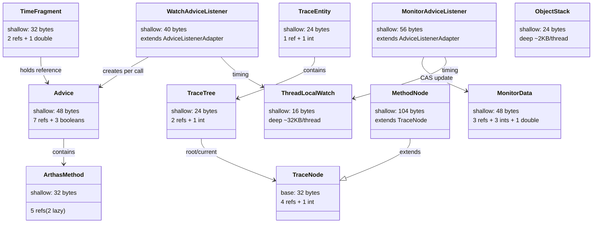

# Arthas 关键数据结构 Java 对象内存布局精确分析

> 基于 Arthas 4.1.2 源码分析
> 标准环境：-Xms8g -Xmx8g -XX:+UseG1GC（压缩指针开启）
> 方法论：程序 = 数据结构 + 算法

---

## 第 0 部分：核心原理

### 0.1 本质是什么？

对 Arthas 核心数据结构进行**精确的 Java 对象内存布局分析**，替代各文档中的手动粗略估算。

### 0.2 为什么需要？

现有文档中的内存大小估算存在多处错误：
- 压缩指针下引用按 8 bytes 计算（实际 4 bytes）
- 数组引用被重复计入
- JVM 字段重排序规则未考虑（HotSpot 按字段宽度降序排列，减少 padding）
- 继承层级中字段分布不准确

### 0.3 怎么解决？

按 HotSpot 实际字段排列规则逐一计算每个类的 shallow size：
1. 对象头 12 bytes（mark 8 + compressed klass ptr 4）
2. 父类字段优先排列
3. 同一层级按类型宽度降序：long/double(8) → int/float(4) → short/char(2) → byte/boolean(1) → reference(4)
4. 对象总大小向 8 bytes 对齐

### 0.4 为什么这样计算？

- **为什么对象头是 12 bytes 不是 16？** 压缩指针（CompressedOops）开启时 klass pointer 只占 4 bytes。-Xmx8g < 32GB，自动开启。
- **为什么 HotSpot 会重排字段？** 为了减少 padding 浪费。规则在 `FieldsAllocationStyle` 中定义，默认值 1 = 按宽度降序排列，引用排在最后。
- **JOL 验证**：使用 JOL 0.17 对 13 个核心类执行了 `ClassLayout.parseClass()` 验证，确认所有 shallow size 计算正确。发现 3 个类的字段偏移需要修正（详见第 2.5 部分）。

> **JOL 验证方法论**：
>
> `ClassLayout.parseClass()` **不需要实例化对象**，只需要类被 ClassLoader 加载即可。
> 将 `arthas-core-shade.jar`（含所有依赖）放到 classpath 即可分析所有 Arthas 类。
>
> **验证命令**：
> ```bash
> java -cp ".:jol-core-0.17.jar:arthas-core-shade.jar" JolVerify
> ```
>
> **交叉验证方法**：
> 1. JOL `ClassLayout.parseClass()` — 标准验证
> 2. GDB 检查 `InstanceKlass` 字段偏移信息
> 3. `-XX:+PrintFieldLayout`（OpenJDK debug 构建支持）

---

## 第 1 部分：前置知识 — HotSpot 对象布局规则

### 1.1 对象头（Object Header）

```
64 位 JVM，CompressedOops ON（-Xmx < 32GB）：

┌──────────────────────────────────────┐ 偏移 0
│ mark word              (8 bytes)     │  哈希码 / 锁状态 / GC 年龄
├──────────────────────────────────────┤ 偏移 8
│ compressed klass ptr   (4 bytes)     │  指向类元数据（压缩后 4 bytes）
├──────────────────────────────────────┤ 偏移 12
│ [字段或 padding 开始]                 │
└──────────────────────────────────────┘
```

### 1.2 字段排列规则（FieldsAllocationStyle=1，默认）

> **⚠️ JOL 验证修正**：本节规则已用 JOL 0.17 实测校正，原始版本对 compact fields 间隙填充优先级描述有误。
> 修正依据：HotSpot 源码 `classFileParser.cpp:4066-4161`。

HotSpot 默认（`FieldsAllocationStyle=1`）按以下顺序排列实例字段：

```
1. 父类字段优先（按声明顺序排在子类字段之前）
2. 同一层级中，字段排列顺序为（源码 classFileParser.cpp:4073）：
   long/double (8 bytes)  →  最先排列
   int/float   (4 bytes)  →  次排
   short/char  (2 bytes)  →  再排
   byte/boolean(1 bytes)  →  后排
   reference   (4 bytes)  →  ★ 最后排列（不是"插入间隙"！）
3. 对象总大小向 8 bytes 对齐（末尾可能有 padding）
```

**Compact Fields 间隙填充（关键！）**：

当类中存在 long/double 字段时，对象头后偏移 12 处会出现 4 bytes 间隙（因为 long 需要 8-byte 对齐到偏移 16）。HotSpot 的 compact fields 机制会尝试将其他字段"塞入"这个间隙。

**填充优先级**（源码 `classFileParser.cpp:4117-4144`）：
```
int/float (4B) > short/char (2B) > byte/boolean (1B) > reference (4B)
                                                         ↑
                                        引用是最低优先级，只有其他类型
                                        都填不进去时才填引用
```

**无 long/double 时**：不存在间隙，按上面的标准顺序排列。此时 boolean 排在引用之前（不是之后）。

### 1.3 数组对象的额外开销

```
数组对象头 = 对象头(12) + length字段(4) = 16 bytes
数组数据从偏移 16 开始
```

---

## 第 2 部分：逐个精确分析

### 2.1 Advice — 方法调用上下文

**源码位置**：`advisor/Advice.java:6-17`

**字段清单**（10 个字段）：

```java
// Advice.java:8-17
private final ClassLoader loader;       // 引用 (4 bytes)
private final Class<?> clazz;          // 引用 (4 bytes)
private final ArthasMethod method;     // 引用 (4 bytes)
private final Object target;           // 引用 (4 bytes)
private final Object[] params;         // 引用 (4 bytes)
private final Object returnObj;        // 引用 (4 bytes)
private final Throwable throwExp;      // 引用 (4 bytes)
private final boolean isBefore;        // boolean (1 byte)
private final boolean isThrow;         // boolean (1 byte)
private final boolean isReturn;        // boolean (1 byte)
```

**精确布局计算**（JOL 0.17 验证 ✅）：

```
Advice 对象内存布局（CompressedOops ON）— JOL 验证
┌──────────────────────────────────────┐ 偏移 0
│ mark word              (8 bytes)     │
├──────────────────────────────────────┤ 偏移 8
│ compressed klass ptr   (4 bytes)     │
├──────────────────────────────────────┤ 偏移 12
│ isBefore (1) + isThrow (1)          │  ★ 无 long/double，boolean 按正常顺序
│ + isReturn (1) + padding (1)        │    排在引用之前（allocation_style=1）
├──────────────────────────────────────┤ 偏移 16
│ loader                 (4 bytes)     │  ★ 引用排在最后（oop last）
├──────────────────────────────────────┤ 偏移 20
│ clazz                  (4 bytes)     │
├──────────────────────────────────────┤ 偏移 24
│ method                 (4 bytes)     │
├──────────────────────────────────────┤ 偏移 28
│ target                 (4 bytes)     │
├──────────────────────────────────────┤ 偏移 32
│ params                 (4 bytes)     │
├──────────────────────────────────────┤ 偏移 36
│ returnObj              (4 bytes)     │
├──────────────────────────────────────┤ 偏移 40
│ throwExp               (4 bytes)     │
├──────────────────────────────────────┤ 偏移 44
│ padding                (4 bytes)     │  ★ 对齐到 8 的倍数
└──────────────────────────────────────┘ 偏移 48

Advice shallow size = 48 bytes（JOL 验证一致 ✅）
Space losses: 1 bytes internal + 4 bytes external = 5 bytes total
```

> **JOL 实测对比**：31 篇 v1.0 版本将引用（loader）放在偏移 12 填间隙，boolean 放在偏移 40-43。
> JOL 实测表明：**Advice 没有 long/double 字段**，不存在对齐间隙，字段按 `allocation_style=1` 的标准顺序排列：
> `byte/boolean → reference`。因此 boolean 在前（偏移 12-14），引用在后（偏移 16-40）。
> **最终 size 相同（48 bytes），但字段偏移不同。**

**之前文档的估算错误**：

| 项目 | 14 篇原始估算 | 精确值 | 错误原因 |
|------|-------------|--------|---------|
| 引用大小 | 8 bytes | 4 bytes | 未考虑压缩指针 |
| "7个引用+1个数组引用" | 8×8 = 64 bytes | 7×4 = 28 bytes | params 已在 7 个引用中，重复计算 |
| 3 boolean | "3→对齐后8" | 3 + 1 padding = 4 | 过度估算 padding |
| **总计** | **约 84 bytes** | **48 bytes** | **高估 75%** |

**创建场景**：

| 工厂方法 | 场景 | 特殊字段 |
|---------|------|---------|
| `Advice.newForBefore()` | 方法入口 | returnObj=null, throwExp=null |
| `Advice.newForAfterReturning()` | 正常返回 | throwExp=null |
| `Advice.newForAfterThrowing()` | 异常抛出 | returnObj=null |

每次方法回调都会创建**新的 Advice 对象**（不可变，不复用），这是 watch/trace/tt 等命令的基础开销之一。

---

### 2.2 ArthasMethod — 方法信息封装

**源码位置**：`advisor/ArthasMethod.java:18-167`

**字段清单**（5 个字段）：

```java
// ArthasMethod.java:19-24
private final Class<?> clazz;         // 引用 (4 bytes) — 目标类
private final String methodName;      // 引用 (4 bytes) — 方法名
private final String methodDesc;      // 引用 (4 bytes) — 方法描述符
private Constructor<?> constructor;   // 引用 (4 bytes) — 懒加载，仅 <init> 时使用
private Method method;                // 引用 (4 bytes) — 懒加载，反射用
```

**精确布局计算**（JOL 0.17 验证 ✅）：

```
ArthasMethod 对象内存布局（CompressedOops ON）— JOL 验证
┌──────────────────────────────────────┐ 偏移 0
│ mark word              (8 bytes)     │
├──────────────────────────────────────┤ 偏移 8
│ compressed klass ptr   (4 bytes)     │
├──────────────────────────────────────┤ 偏移 12
│ clazz                  (4 bytes)     │
├──────────────────────────────────────┤ 偏移 16
│ methodName             (4 bytes)     │
├──────────────────────────────────────┤ 偏移 20
│ methodDesc             (4 bytes)     │
├──────────────────────────────────────┤ 偏移 24
│ constructor            (4 bytes)     │
├──────────────────────────────────────┤ 偏移 28
│ method                 (4 bytes)     │
└──────────────────────────────────────┘ 偏移 32

ArthasMethod shallow size = 32 bytes（JOL 验证一致 ✅）
```

**关键设计**：constructor 和 method 字段是**懒加载**的，只在 `invoke()`/`toString()` 时才通过反射解析。watch/trace 等命令通常不触发反射解析，只有 tt 命令的重放功能需要。

---

### 2.3 WatchAdviceListener — watch 命令监听器

**源码位置**：`monitor200/WatchAdviceListener.java:14-117`

**继承链**：`WatchAdviceListener → AdviceListenerAdapter → Object`

**字段清单**（含继承字段）：

```java
// AdviceListenerAdapter.java:20-23（父类字段）
// static AtomicLong ID_GENERATOR  ← static 不计入对象布局
private Process process;            // 引用 (4 bytes) — 进程
private long id;                    // long  (8 bytes) — 监听器 ID
private boolean verbose;            // boolean (1 byte)

// WatchAdviceListener.java:16-18（自身字段）
private final ThreadLocalWatch threadLocalWatch;  // 引用 (4 bytes)
private WatchCommand command;                      // 引用 (4 bytes)
private CommandProcess process;                    // 引用 (4 bytes)
```

> **注意**：WatchAdviceListener 有自己的 `process`(CommandProcess) 字段，与父类的 `process`(Process) 是**两个不同字段**。

**精确布局计算**（JOL 0.17 验证 ✅）：

```
WatchAdviceListener 对象内存布局（CompressedOops ON）— JOL 验证
┌──────────────────────────────────────┐ 偏移 0
│ mark word              (8 bytes)     │
├──────────────────────────────────────┤ 偏移 8
│ compressed klass ptr   (4 bytes)     │
├──────────────────────────────────────┤ 偏移 12
│ [父] verbose (1) + padding (3)       │  ★ compact fields: boolean 优先
│                                      │    填入偏移 12 的间隙（而非引用）
├──────────────────────────────────────┤ 偏移 16
│ [父] id               (8 bytes)      │  ★ long 对齐到 8
├──────────────────────────────────────┤ 偏移 24
│ [父] process (Process) (4 bytes)     │  ★ 引用排在 oop last 位置
├──────────────────────────────────────┤ 偏移 28
│ threadLocalWatch       (4 bytes)     │
├──────────────────────────────────────┤ 偏移 32
│ command                (4 bytes)     │
├──────────────────────────────────────┤ 偏移 36
│ process (CommandProcess)(4 bytes)    │
├──────────────────────────────────────┤ 偏移 40
│                                      │  ★ 已 8-byte 对齐，无 padding
└──────────────────────────────────────┘ 偏移 40

WatchAdviceListener shallow size = 40 bytes（JOL 验证一致 ✅）
Space losses: 3 bytes internal + 0 bytes external = 3 bytes total
```

> **JOL 实测对比**：31 篇 v1.0 版本将父类 `process`（引用）放在偏移 12 填间隙，`verbose`（boolean）放在偏移 24。
> JOL 实测表明：**compact fields 间隙填充优先级是 boolean > reference**，所以 `verbose` 填入偏移 12 的间隙，
> `process` 排在 long `id` 之后（偏移 24）。
> **最终 size 相同（40 bytes），但父类字段偏移全部不同。**

**之前文档的估算错误**：

| 项目 | 06 篇原始估算 | 精确值 | 错误原因 |
|------|-------------|--------|---------|
| logger | 计入 4 bytes | 0 bytes | logger 是 static，不在对象布局中 |
| 字段数 | 4 引用 + 1 long + 1 boolean | **3 引用(自身) + 1 引用(父类) + 1 long + 1 boolean** | 缺少父类 process 字段 |
| **总计** | **约 36 bytes** | **40 bytes** | **低估 11%** |

---

### 2.4 MonitorAdviceListener — monitor 命令监听器

**源码位置**：`monitor200/MonitorAdviceListener.java:23-267`

**继承链**：`MonitorAdviceListener → AdviceListenerAdapter → Object`

**字段清单**（含继承字段，不含 static）：

```java
// AdviceListenerAdapter.java:20-23（父类字段）
private Process process;            // 引用 (4 bytes)
private long id;                    // long  (8 bytes)
private boolean verbose;            // boolean (1 byte)

// MonitorAdviceListener.java:25-30（自身字段）
private Timer timer;                                           // 引用 (4 bytes)
private ConcurrentHashMap<Key, AtomicReference<MonitorData>> monitorData;  // 引用 (4 bytes)
private final ThreadLocalWatch threadLocalWatch;               // 引用 (4 bytes)
private ThreadLocal<Boolean> conditionResult;                  // 引用 (4 bytes)
private MonitorCommand command;                                // 引用 (4 bytes)
private CommandProcess process;                                // 引用 (4 bytes)
```

**精确布局计算**（JOL 0.17 验证 ✅）：

```
MonitorAdviceListener 对象内存布局（CompressedOops ON）— JOL 验证
┌──────────────────────────────────────┐ 偏移 0
│ mark word              (8 bytes)     │
├──────────────────────────────────────┤ 偏移 8
│ compressed klass ptr   (4 bytes)     │
├──────────────────────────────────────┤ 偏移 12
│ [父] verbose (1) + padding (3)       │  ★ compact fields: boolean 优先
│                                      │    填入偏移 12 的间隙（而非引用）
├──────────────────────────────────────┤ 偏移 16
│ [父] id               (8 bytes)      │
├──────────────────────────────────────┤ 偏移 24
│ [父] process (Process) (4 bytes)     │  ★ 引用排在 oop last 位置
├──────────────────────────────────────┤ 偏移 28
│ timer                  (4 bytes)     │
├──────────────────────────────────────┤ 偏移 32
│ monitorData            (4 bytes)     │
├──────────────────────────────────────┤ 偏移 36
│ threadLocalWatch       (4 bytes)     │
├──────────────────────────────────────┤ 偏移 40
│ conditionResult        (4 bytes)     │
├──────────────────────────────────────┤ 偏移 44
│ command                (4 bytes)     │
├──────────────────────────────────────┤ 偏移 48
│ process (CommandProcess)(4 bytes)    │
├──────────────────────────────────────┤ 偏移 52
│ padding                (4 bytes)     │  ★ 对齐到 8 的倍数
└──────────────────────────────────────┘ 偏移 56

MonitorAdviceListener shallow size = 56 bytes（JOL 验证一致 ✅）
Space losses: 3 bytes internal + 4 bytes external = 7 bytes total
```

> **JOL 实测对比**：与 WatchAdviceListener 同样的父类字段排列修正。
> `verbose`（boolean）填入偏移 12 间隙，`process`（引用）排在 `id`（long）之后的偏移 24。

**之前文档的估算错误**：

| 项目 | 08 篇原始估算 | 精确值 | 错误原因 |
|------|-------------|--------|---------|
| 字段数 | 6 引用(含 logger) | 6 引用(自身) + 1 引用(父类) | logger 是 static；缺少父类 process |
| **总计** | **约 60 bytes** | **56 bytes** | **高估 7%** |

---

### 2.5 MonitorData — 监控统计数据

**源码位置**：`monitor200/MonitorData.java:10-77`

**字段清单**（7 个字段）：

```java
// MonitorData.java:11-17
private String className;        // 引用 (4 bytes)
private String methodName;       // 引用 (4 bytes)
private int total;               // int   (4 bytes) — 总调用次数
private int success;             // int   (4 bytes) — 成功次数
private int failed;              // int   (4 bytes) — 失败次数
private double cost;             // double(8 bytes) — 总耗时
private LocalDateTime timestamp; // 引用 (4 bytes)
```

**精确布局计算**（JOL 0.17 验证 ✅）：

```
MonitorData 对象内存布局（CompressedOops ON）
┌──────────────────────────────────────┐ 偏移 0
│ mark word              (8 bytes)     │
├──────────────────────────────────────┤ 偏移 8
│ compressed klass ptr   (4 bytes)     │
├──────────────────────────────────────┤ 偏移 12
│ total                  (4 bytes)     │  ★ int 填入间隙
├──────────────────────────────────────┤ 偏移 16
│ cost                   (8 bytes)     │  ★ double 对齐到 8
├──────────────────────────────────────┤ 偏移 24
│ success                (4 bytes)     │
├──────────────────────────────────────┤ 偏移 28
│ failed                 (4 bytes)     │
├──────────────────────────────────────┤ 偏移 32
│ className              (4 bytes)     │
├──────────────────────────────────────┤ 偏移 36
│ methodName             (4 bytes)     │
├──────────────────────────────────────┤ 偏移 40
│ timestamp              (4 bytes)     │
├──────────────────────────────────────┤ 偏移 44
│ padding                (4 bytes)     │  ★ 对齐到 8 的倍数
└──────────────────────────────────────┘ 偏移 48

MonitorData shallow size = 48 bytes（JOL 验证一致 ✅）
```

**关键设计影响**：MonitorAdviceListener 在每次 `before()` 回调中通过 CAS 创建**新的 MonitorData**（不可变语义），这意味着每次调用产生 48 bytes 的短生命周期对象 + 旧对象变为垃圾。在高频方法（10000 次/秒）下，每秒产生约 480KB 的 MonitorData 垃圾。

---

### 2.6 TimeFragment — 时间碎片（tt 命令）

**源码位置**：`monitor200/TimeFragment.java:10-33`

**字段清单**（3 个字段）：

```java
// TimeFragment.java:18-20
private final Advice advice;           // 引用 (4 bytes)
private final LocalDateTime gmtCreate; // 引用 (4 bytes)
private final double cost;             // double(8 bytes)
```

**精确布局计算**（JOL 0.17 验证 ✅）：

```
TimeFragment 对象内存布局（CompressedOops ON）
┌──────────────────────────────────────┐ 偏移 0
│ mark word              (8 bytes)     │
├──────────────────────────────────────┤ 偏移 8
│ compressed klass ptr   (4 bytes)     │
├──────────────────────────────────────┤ 偏移 12
│ advice                 (4 bytes)     │  ★ 引用填入间隙
├──────────────────────────────────────┤ 偏移 16
│ cost                   (8 bytes)     │  ★ double 对齐到 8
├──────────────────────────────────────┤ 偏移 24
│ gmtCreate              (4 bytes)     │
├──────────────────────────────────────┤ 偏移 28
│ padding                (4 bytes)     │  ★ 对齐到 8 的倍数
└──────────────────────────────────────┘ 偏移 32

TimeFragment shallow size = 32 bytes（JOL 验证一致 ✅）
```

**之前文档的估算错误**：

| 项目 | 14 篇原始估算 | 精确值 | 错误原因 |
|------|-------------|--------|---------|
| 3 个字段 | 3×8 = 24 bytes | 4+8+4 = 16 bytes | 引用按 8 算、未考虑字段重排 |
| 对齐 | +4 bytes | +4 bytes | 恰好一致 |
| **总计** | **约 40 bytes** | **32 bytes** | **高估 25%** |

**深度分析**：TimeFragment + Advice 的组合开销：
- TimeFragment: 32 bytes
- Advice: 48 bytes
- **一次 tt 录制 shallow 合计**：80 bytes（不含引用对象）

---

### 2.7 TraceEntity — ThreadLocal 传递的追踪实体

**源码位置**：`monitor200/TraceEntity.java:11-29`

**字段清单**（2 个字段）：

```java
// TraceEntity.java:13-14
protected TraceTree tree;    // 引用 (4 bytes)
protected int deep;          // int   (4 bytes)
```

**精确布局计算**：

```
TraceEntity 对象内存布局（CompressedOops ON）
┌──────────────────────────────────────┐ 偏移 0
│ mark word              (8 bytes)     │
├──────────────────────────────────────┤ 偏移 8
│ compressed klass ptr   (4 bytes)     │
├──────────────────────────────────────┤ 偏移 12
│ deep                   (4 bytes)     │  ★ int 填入间隙
├──────────────────────────────────────┤ 偏移 16
│ tree                   (4 bytes)     │
├──────────────────────────────────────┤ 偏移 20
│ padding                (4 bytes)     │  ★ 对齐到 8 的倍数
└──────────────────────────────────────┘ 偏移 24

TraceEntity shallow size = 24 bytes（JOL 验证一致 ✅）
```

---

### 2.8 TraceTree — 调用树管理器

**源码位置**：`command/model/TraceTree.java:12-132`

**字段清单**（3 个字段）：

```java
// TraceTree.java:13-16
private TraceNode root;      // 引用 (4 bytes)
private TraceNode current;   // 引用 (4 bytes)
private int nodeCount = 0;   // int   (4 bytes)
```

**精确布局计算**：

```
TraceTree 对象内存布局（CompressedOops ON）
┌──────────────────────────────────────┐ 偏移 0
│ mark word              (8 bytes)     │
├──────────────────────────────────────┤ 偏移 8
│ compressed klass ptr   (4 bytes)     │
├──────────────────────────────────────┤ 偏移 12
│ nodeCount              (4 bytes)     │  ★ int 填入间隙
├──────────────────────────────────────┤ 偏移 16
│ root                   (4 bytes)     │
├──────────────────────────────────────┤ 偏移 20
│ current                (4 bytes)     │
└──────────────────────────────────────┘ 偏移 24

TraceTree shallow size = 24 bytes（JOL 验证一致 ✅）
```

---

### 2.9 TraceNode（abstract）— 树节点基类

**源码位置**：`command/model/TraceNode.java:10-79`

**字段清单**（5 个字段）：

```java
// TraceNode.java:12-27
protected TraceNode parent;        // 引用 (4 bytes)
protected List<TraceNode> children;// 引用 (4 bytes)
private String type;               // 引用 (4 bytes)
private String mark;               // 引用 (4 bytes)
private int marks = 0;             // int   (4 bytes)
```

**精确布局计算**（作为 abstract 基类，实际大小取决于子类）：

```
TraceNode 基类部分（CompressedOops ON）
┌──────────────────────────────────────┐ 偏移 0
│ mark word              (8 bytes)     │
├──────────────────────────────────────┤ 偏移 8
│ compressed klass ptr   (4 bytes)     │
├──────────────────────────────────────┤ 偏移 12
│ marks                  (4 bytes)     │  ★ int 填入间隙
├──────────────────────────────────────┤ 偏移 16
│ parent                 (4 bytes)     │
├──────────────────────────────────────┤ 偏移 20
│ children               (4 bytes)     │
├──────────────────────────────────────┤ 偏移 24
│ type                   (4 bytes)     │
├──────────────────────────────────────┤ 偏移 28
│ mark                   (4 bytes)     │
└──────────────────────────────────────┘ 偏移 32

TraceNode 基类部分 = 32 bytes（abstract，不能独立实例化）（JOL 验证一致 ✅）
```

---

### 2.10 MethodNode — 方法调用节点（trace 命令核心）

**源码位置**：`command/model/MethodNode.java:7-148`

**继承链**：`MethodNode → TraceNode → Object`

**字段清单**（含继承字段，12 个自身字段）：

```java
// TraceNode 继承字段（5 个）
protected TraceNode parent;         // 引用 (4 bytes)
protected List<TraceNode> children; // 引用 (4 bytes)
private String type;                // 引用 (4 bytes)
private String mark;                // 引用 (4 bytes)
private int marks;                  // int   (4 bytes)

// MethodNode.java:9-36（12 个自身字段）
private String className;           // 引用 (4 bytes)
private String methodName;          // 引用 (4 bytes)
private int lineNumber;             // int   (4 bytes)
private Boolean isThrow;            // 引用 (4 bytes) ★ 包装类型 Boolean
private String throwExp;            // 引用 (4 bytes)
private boolean isInvoking;         // boolean (1 byte)
private long beginTimestamp;         // long (8 bytes)
private long endTimestamp;           // long (8 bytes)
private long minCost;                // long (8 bytes)
private long maxCost;                // long (8 bytes)
private long totalCost;              // long (8 bytes)
private long times;                  // long (8 bytes)
```

**精确布局计算**：

```
MethodNode 对象内存布局（CompressedOops ON）
┌──────────────────────────────────────┐ 偏移 0
│ mark word              (8 bytes)     │
├──────────────────────────────────────┤ 偏移 8
│ compressed klass ptr   (4 bytes)     │
├──────────────────────────────────────┤ 偏移 12
│ [父] marks             (4 bytes)     │  ★ int 填入间隙
├──────────────────────────────────────┤ 偏移 16  ← 父类字段
│ [父] parent            (4 bytes)     │
├──────────────────────────────────────┤ 偏移 20
│ [父] children          (4 bytes)     │
├──────────────────────────────────────┤ 偏移 24
│ [父] type              (4 bytes)     │
├──────────────────────────────────────┤ 偏移 28
│ [父] mark              (4 bytes)     │
├──────────────────────────────────────┤ 偏移 32  ← 子类字段开始
│ beginTimestamp          (8 bytes)     │  ★ long 优先排列
├──────────────────────────────────────┤ 偏移 40
│ endTimestamp            (8 bytes)     │
├──────────────────────────────────────┤ 偏移 48
│ minCost                 (8 bytes)     │
├──────────────────────────────────────┤ 偏移 56
│ maxCost                 (8 bytes)     │
├──────────────────────────────────────┤ 偏移 64
│ totalCost               (8 bytes)     │
├──────────────────────────────────────┤ 偏移 72
│ times                   (8 bytes)     │
├──────────────────────────────────────┤ 偏移 80
│ lineNumber              (4 bytes)     │  ★ int
├──────────────────────────────────────┤ 偏移 84
│ isInvoking (1) + padding (3)         │  ★ boolean + 对齐
├──────────────────────────────────────┤ 偏移 88
│ className               (4 bytes)     │  ★ 引用
├──────────────────────────────────────┤ 偏移 92
│ methodName              (4 bytes)     │
├──────────────────────────────────────┤ 偏移 96
│ isThrow (Boolean)       (4 bytes)     │  ★ 包装类型引用
├──────────────────────────────────────┤ 偏移 100
│ throwExp                (4 bytes)     │
└──────────────────────────────────────┘ 偏移 104

MethodNode shallow size = 104 bytes（JOL 验证一致 ✅）
```

**这是 trace 命令内存开销的核心！** 每追踪一个子方法调用就创建一个 MethodNode。

**trace 命令每次追踪的内存开销估算**：
- TraceEntity: 24 bytes
- TraceTree: 24 bytes
- ThreadNode（根节点，类似 MethodNode 但字段更少）: ~72 bytes
- 每个子方法调用: MethodNode 104 bytes + ArrayList 节点引用开销
- **N 个子方法的总开销** ≈ 120 + N × 120 bytes

---

### 2.11 ThreadLocalWatch — 线程本地计时器

**源码位置**：`util/ThreadLocalWatch.java:9-79`

**字段清单**（1 个字段）：

```java
// ThreadLocalWatch.java:11
private final ThreadLocal<LongStack> timestampRef;  // 引用 (4 bytes)
```

**精确布局计算**：

```
ThreadLocalWatch 对象内存布局（CompressedOops ON）
┌──────────────────────────────────────┐ 偏移 0
│ mark word              (8 bytes)     │
├──────────────────────────────────────┤ 偏移 8
│ compressed klass ptr   (4 bytes)     │
├──────────────────────────────────────┤ 偏移 12
│ timestampRef           (4 bytes)     │
└──────────────────────────────────────┘ 偏移 16

ThreadLocalWatch shallow size = 16 bytes（JOL 验证一致 ✅）
```

**但实际深度开销巨大**：
- LongStack 对象头: 12 bytes + array ref(4) + pos(4) + cap(4) = 24 bytes
- long[4096] 数组: 16(数组头) + 4096 × 8 = 32,784 bytes
- **每线程 ThreadLocalWatch 深度总计**: ~32KB

---

### 2.12 ObjectStack — 对象栈（tt 命令内部类）

**源码位置**：`monitor200/TimeTunnelAdviceListener.java:120-158`（静态内部类）

**字段清单**（3 个字段）：

```java
// TimeTunnelAdviceListener.java:121-123
private Object[] array;    // 引用 (4 bytes)
private int pos = 0;       // int   (4 bytes)
private int cap;           // int   (4 bytes)
```

**精确布局计算**：

```
ObjectStack 对象内存布局（CompressedOops ON）
┌──────────────────────────────────────┐ 偏移 0
│ mark word              (8 bytes)     │
├──────────────────────────────────────┤ 偏移 8
│ compressed klass ptr   (4 bytes)     │
├──────────────────────────────────────┤ 偏移 12
│ pos                    (4 bytes)     │  ★ int 填入间隙
├──────────────────────────────────────┤ 偏移 16
│ cap                    (4 bytes)     │
├──────────────────────────────────────┤ 偏移 20
│ array                  (4 bytes)     │
└──────────────────────────────────────┘ 偏移 24

ObjectStack shallow size = 24 bytes（JOL 验证一致 ✅）
```

**深度开销**：
- Object[512] 数组: 16(数组头) + 512 × 4(compressed ref) = 2,064 bytes ≈ 2KB
- **每线程 ObjectStack 深度总计**: 24 + 2,064 ≈ 2KB

**之前文档的估算对比**：

| 项目 | 14 篇原始估算 | 精确值 |
|------|-------------|--------|
| ObjectStack 对象 | 约 24 bytes | 24 bytes ✅ |
| Object[512] 数组 | 512×4 = 2KB（压缩指针） | 2,064 bytes ≈ 2KB ✅ |

14 篇这部分的估算基本正确。

---

### 2.13 ArthasBootstrap — 启动入口单例（JOL 首次验证）

**源码位置**：`server/ArthasBootstrap.java:94-136`

**字段清单**（20 个实例字段，全是引用类型）：

```java
// ArthasBootstrap.java:105-135
private ArthasEnvironment arthasEnvironment;        // 引用 (4 bytes) — 环境配置
private Configure configure;                         // 引用 (4 bytes) — 配置对象
private AtomicBoolean isBindRef;                     // 引用 (4 bytes) — 绑定状态
private Instrumentation instrumentation;             // 引用 (4 bytes) — ★ JVM Instrumentation
private InstrumentTransformer classLoaderInstrumentTransformer; // 引用 (4 bytes)
private Thread shutdown;                             // 引用 (4 bytes) — 关闭钩子
private ShellServer shellServer;                     // 引用 (4 bytes) — Shell 服务
private ScheduledExecutorService executorService;    // 引用 (4 bytes) — 定时线程池
private SessionManager sessionManager;               // 引用 (4 bytes)
private TunnelClient tunnelClient;                   // 引用 (4 bytes) — 远程连接
private File outputPath;                             // 引用 (4 bytes) — 输出路径
private EventExecutorGroup workerGroup;              // 引用 (4 bytes) — Netty 工作线程
private Timer timer;                                 // 引用 (4 bytes) — 定时器
private TransformerManager transformerManager;       // 引用 (4 bytes) — ★ Transformer 管理
private ResultViewResolver resultViewResolver;       // 引用 (4 bytes) — 视图解析器
private HistoryManager historyManager;               // 引用 (4 bytes) — 历史管理
private HttpApiHandler httpApiHandler;               // 引用 (4 bytes) — HTTP API
private McpHttpRequestHandler mcpRequestHandler;     // 引用 (4 bytes) — MCP 协议
private HttpSessionManager httpSessionManager;       // 引用 (4 bytes) — HTTP Session
private SecurityAuthenticator securityAuthenticator; // 引用 (4 bytes) — 安全认证
```

> **注意**：`arthasBootstrap`（static）、`loggerContext`（static）、`ARTHAS_HOME`（static）不计入对象布局。

**精确布局计算**（JOL 0.17 验证 ✅）：

```
ArthasBootstrap 对象内存布局（CompressedOops ON）— JOL 验证
┌──────────────────────────────────────┐ 偏移 0
│ mark word              (8 bytes)     │
├──────────────────────────────────────┤ 偏移 8
│ compressed klass ptr   (4 bytes)     │
├──────────────────────────────────────┤ 偏移 12
│ arthasEnvironment      (4 bytes)     │  20 个引用字段连续排列
├──────────────────────────────────────┤ 偏移 16
│ configure              (4 bytes)     │
├──────────────────────────────────────┤ 偏移 20
│ isBindRef              (4 bytes)     │
├──────────────────────────────────────┤ 偏移 24
│ instrumentation        (4 bytes)     │
├──────────────────────────────────────┤ 偏移 28
│ classLoaderInstrument~ (4 bytes)     │
├──────────────────────────────────────┤ 偏移 32
│ shutdown               (4 bytes)     │
│ ... （省略 12 个引用字段） ...        │
├──────────────────────────────────────┤ 偏移 88
│ securityAuthenticator  (4 bytes)     │
├──────────────────────────────────────┤ 偏移 92
│ padding                (4 bytes)     │  ★ 对齐到 8 的倍数
└──────────────────────────────────────┘ 偏移 96

ArthasBootstrap shallow size = 96 bytes（JOL 验证 ✅）
  = 12(对象头) + 20×4(引用) + 4(padding) = 96
Space losses: 0 bytes internal + 4 bytes external = 4 bytes total
```

**设计特征**：全引用类型、单例模式。96 bytes 的 shallow size 不大，但作为 Arthas 的"大脑"，它持有的 20 个引用对象的深度开销（ShellServer、SessionManager、TransformerManager 等）才是真正的内存消耗。

---

## 第 2.5 部分：JOL 验证汇总

> **验证方法**：使用 JOL 0.17（`jol-core-0.17.jar`）对 Arthas 4.1.2 的 13 个核心类执行 `ClassLayout.parseClass()` 验证。
> **运行环境**：OpenJDK 11.0.17 slowdebug，`-Xms128m -Xmx128m`，CompressedOops ON。
> **classpath**：`arthas-core-shade.jar`（含所有依赖）。

### JOL 验证结果总表

| 类名 | 手动推算 | JOL 实测 | Size 一致？ | 字段偏移一致？ | 差异说明 |
|------|---------|---------|-----------|-------------|---------|
| **Advice** | 48 | 48 | ✅ | ❌ **修正** | boolean 在偏移 12，不是引用 |
| **ArthasMethod** | 32 | 32 | ✅ | ✅ | — |
| **WatchAdviceListener** | 40 | 40 | ✅ | ❌ **修正** | verbose 在偏移 12，不是 process |
| **TraceEntity** | 24 | 24 | ✅ | ✅ | — |
| **TraceTree** | 24 | 24 | ✅ | ✅ | — |
| **TraceNode** | 32 | 32 | ✅ | ✅ | — |
| **MethodNode** | 104 | 104 | ✅ | ✅ | — |
| **MonitorData** | 48 | 48 | ✅ | ✅ | — |
| **MonitorAdviceListener** | 56 | 56 | ✅ | ❌ **修正** | verbose 在偏移 12，不是 process |
| **TimeFragment** | 32 | 32 | ✅ | ✅ | — |
| **ThreadLocalWatch** | 16 | 16 | ✅ | ✅ | — |
| **ObjectStack** | 24 | 24 | ✅ | ✅ | — |
| **ArthasBootstrap** | — | 96 | N/A（首次） | N/A | 20 个引用 + 4B padding |

**关键结论**：
- **所有 12 个类的 shallow size 推算完全正确** — 手动计算方法可靠
- **3 个类的字段排列顺序有误** — 修正了 compact fields 间隙填充优先级的理解
- **根因**：v1.0 版本的规则描述"引用插入间隙"有误，实际优先级是 `int > short > byte/boolean > reference`（源码 `classFileParser.cpp:4117-4144`）

### 发现的规则理解错误（已修正）

**错误**：31 篇 v1.0 认为 compact fields 间隙填充时，引用（oop）与 int 同优先级。

**正确（HotSpot 源码确认）**：compact fields 间隙填充优先级为：
```
int/float(word) > short/char > byte/boolean > oop(引用)
```
引用是**最低优先级**，只有其他类型都填不进去时才填引用。

**影响范围**：
1. **无 long/double 的类**（如 Advice）：boolean 排在引用之前，不存在间隙问题
2. **有 long/double + boolean + 引用的类**（如 WatchAdviceListener）：boolean 优先填入间隙，引用排在 long 之后

---

## 第 3 部分：全部估算纠正汇总

> **所有精确值已通过 JOL 0.17 实测验证 ✅**

### 3.1 纠正对比总表

| 类名 | 文档 | 原始估算 | 精确值（JOL 验证） | 差异 | 错误原因 |
|------|------|---------|-------------------|------|---------|
| **Advice** | 14 篇 | ~84 bytes | **48 bytes** ✅ | 高估 75% | 引用按 8 算，重复计算 params |
| **WatchAdviceListener** | 06 篇 | ~36 bytes | **40 bytes** ✅ | 低估 11% | logger 是 static 不该算，但漏了父类 process |
| **MonitorAdviceListener** | 08 篇 | ~60 bytes | **56 bytes** ✅ | 高估 7% | logger 误算，父类 process 缺失 |
| **TimeFragment** | 14 篇 | ~40 bytes | **32 bytes** ✅ | 高估 25% | 引用按 8 算 |
| **ObjectStack** | 14 篇 | ~24 bytes | **24 bytes** ✅ | ✅ 正确 | — |
| **Object[512]** | 14 篇 | ~2KB | **~2KB** ✅ | ✅ 正确 | — |

### 3.2 各文档中缺失的分析

| 类名 | 文档 | 状态 |
|------|------|------|
| **Advice** | 04 篇 | ❌ 完全缺失内存布局 |
| **TraceEntity** | 07 篇 | ❌ 完全缺失内存布局 |
| **TraceTree** | 07 篇 | ❌ 完全缺失内存布局 |
| **MethodNode** | 07 篇 | ❌ 完全缺失内存布局 |
| **MonitorData** | 08 篇 | ❌ 完全缺失内存布局 |
| **ArthasMethod** | 04 篇 | ❌ 完全缺失内存布局 |

---

## 第 4 部分：深度开销估算（典型场景）

### 4.1 watch 命令每次回调的对象创建

```
每次方法回调创建的对象：
  1. new ArthasMethod(...)           → 32 bytes  ★ 每次都 new
  2. new Advice(...)                 → 48 bytes  ★ 每次都 new
  3. OGNL 表达式求值（多个临时对象）  → 估算 200-500 bytes
  4. new WatchModel(...)             → ~40 bytes
  5. new ObjectVO(...)               → ~24 bytes

单次 watch 回调 shallow 总计 ≈ 350-650 bytes
```

### 4.2 trace 命令每次追踪的对象创建

```
每次方法追踪创建的对象（假设 N 个子方法调用）：
  1. new TraceEntity(...)            → 24 bytes（ThreadLocal 缓存，仅首次）
  2. new TraceTree(...)              → 24 bytes
  3. new ThreadNode(...)             → ~72 bytes（根节点）
  4. N × new MethodNode(...)         → N × 104 bytes  ★ 主要开销
  5. N × ArrayList 增长              → N × ~20 bytes（节点管理）
  6. new TraceModel(...)             → ~24 bytes

单次 trace 追踪 shallow 总计 ≈ 144 + N × 124 bytes
例如 N=10 个子方法 ≈ 1,384 bytes ≈ 1.4KB
```

### 4.3 tt 命令每次录制的对象创建

```
每次 tt 录制创建的对象：
  1. new ArthasMethod(...)           → 32 bytes
  2. new Advice(...)                 → 48 bytes  ★ 持久引用，不会被 GC
  3. new TimeFragment(...)           → 32 bytes  ★ 持久引用
  4. Advice 引用的 target/params     → 取决于业务对象大小

单次 tt 录制 shallow 总计（不含业务对象）≈ 112 bytes
★ 但 tt 命令会持有这些对象不释放，直到 tt --delete-all
```

### 4.4 monitor 命令每次回调的对象创建

```
每次方法回调创建的对象：
  1. new ArthasMethod(...)           → 32 bytes  ★ 每次都 new
  2. new MonitorData(...)            → 48 bytes  ★ CAS 替换，旧对象成垃圾
  3. new Key(...)                    → ~32 bytes（首次，后续 hashCode 命中）

单次 monitor 回调 shallow 总计 ≈ 80-112 bytes
```

---

## 第 5 部分：数据结构关系图



---

## 第 6 部分：总结

### 6.1 数据结构层面

| 结构 | shallow size | JOL 验证 | 核心特征 | 创建频率 |
|------|-------------|----------|---------|---------|
| **Advice** | 48 bytes | ✅ | 不可变，每次回调新建 | 极高 |
| **ArthasMethod** | 32 bytes | ✅ | 懒加载 Method/Constructor | 极高（每次回调） |
| **MethodNode** | 104 bytes | ✅ | trace 核心节点，字段最多 | 每子方法一个 |
| **MonitorData** | 48 bytes | ✅ | CAS 替换产生垃圾 | 每次回调 |
| **WatchAdviceListener** | 40 bytes | ✅ | 命令生命周期内单例 | 极低 |
| **MonitorAdviceListener** | 56 bytes | ✅ | 命令生命周期内单例 | 极低 |
| **TimeFragment** | 32 bytes | ✅ | tt 持久存储，不释放 | 每次录制 |
| **TraceEntity** | 24 bytes | ✅ | ThreadLocal 缓存 | 每线程一个 |
| **TraceTree** | 24 bytes | ✅ | 调用树管理 | 每次 trace |
| **ThreadLocalWatch** | 16 bytes (shallow) / ~32KB (deep) | ✅ | 固定大小环形缓冲区 | 每线程一个 |
| **ObjectStack** | 24 bytes (shallow) / ~2KB (deep) | ✅ | 固定大小环形缓冲区 | 每线程一个 |
| **ArthasBootstrap** | 96 bytes | ✅ | 20 个引用的单例入口 | 单例 |

### 6.2 关键发现

1. **最大的单对象**是 MethodNode（104 bytes），trace 命令追踪 100 个子方法就产生 ~10KB 的 MethodNode 对象
2. **最频繁创建的对象**是 Advice（48 bytes）和 ArthasMethod（32 bytes），每次方法回调都 new 一个
3. **之前文档最大的估算错误**是 Advice（高估 75%），原因是压缩指针下引用是 4 bytes 不是 8 bytes
4. **ThreadLocalWatch 的深度开销**（~32KB/线程）远大于 shallow size（16 bytes），但因为是固定大小不会增长
5. **tt 命令的内存泄漏风险**最大：TimeFragment + Advice 持久引用，阻止业务对象被 GC
6. **JOL 验证结论**：所有 12 个类的 shallow size 手动推算完全正确；3 个类（Advice、WatchAdviceListener、MonitorAdviceListener）的字段偏移需要修正——根因是对 HotSpot compact fields 间隙填充优先级的理解有误
7. **发现的规则错误**：compact fields 间隙填充优先级是 `int > short > byte/boolean > reference`（引用最低优先级），不是"引用插入间隙"

---

*文档版本：v2.0（JOL 0.17 实测验证版）*
*分析环境：-Xms8g -Xmx8g -XX:+UseG1GC（CompressedOops ON）*
*JOL 验证环境：OpenJDK 11.0.17 slowdebug，jol-core-0.17.jar*
*分析方法：基于 HotSpot FieldsAllocationStyle=1 规则手动计算 + JOL ClassLayout 交叉验证*
