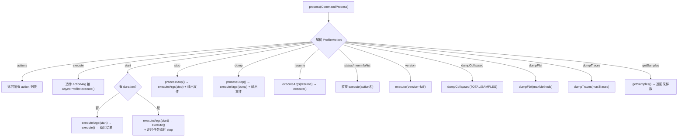

# Part 12: profiler 命令 — async-profiler 集成

> 源文件: `core/src/main/java/com/taobao/arthas/core/command/monitor200/ProfilerCommand.java` (1006行)
> 辅助文件: `one/profiler/AsyncProfiler.java` (293行) + `one/profiler/Counter.java` (14行)
> 辅助文件: `core/src/main/java/com/taobao/arthas/core/command/model/ProfilerModel.java` (78行)
> async-profiler 侧: `javaApi.cpp` (217行) + `arguments.cpp` (661行)
> **交叉引用**: 本章与 `jvm-md/AsyncProfiler/` 下的 12 章分析文档形成完整闭环
> 前置: Part 11 vmtool（JVMTI 直通车）

---

## 第 0 部分：核心原理 ⭐

### 0.1 本质是什么？

本文深入分析 **Part 12: profiler 命令 — async-profiler 集成**：从源码角度理解其设计原理、实现机制和关键细节。

### 0.2 为什么需要？

理解 JVM 内部实现是排查复杂问题、进行性能优化的基础。表面的 API 文档无法解释 JVM 的实际行为，只有深入源码才能建立精确的心智模型。

### 0.3 怎么解决？

结合源码阅读、数据结构分析和 GDB 运行时验证，从多个角度建立对该机制的完整理解。

### 0.4 为什么这样设计？

每个设计决策都有其权衡：性能 vs 正确性、简单性 vs 灵活性、内存占用 vs 查找速度。理解这些权衡是理解 JVM 设计的关键。

---


## 一、定位与设计哲学

### 1.1 profiler 命令是什么

`profiler` 是 Arthas 中**最大的单文件命令**（1006行），但它的核心逻辑却出人意料地简单——**它只是 async-profiler 的 Java 封装**。

与 Part 5-8 中的 watch/trace/monitor/stack 完全不同：
- watch/trace 等命令：Arthas 自己用 **ASM 字节码增强** 实现，是**侵入式**的
- profiler 命令：直接调用 **async-profiler 的 native 库**，是**非侵入式采样**

```
Arthas 增强类命令 (watch/trace/monitor/stack/tt):
  用户命令 → Arthas 解析 → ASM 字节码增强 → SpyAPI 回调 → AdviceListener 处理
  特点: 侵入式、方法级精确、有运行时开销

profiler 命令:
  用户命令 → Arthas 解析 → 拼接参数字符串 → AsyncProfiler.execute(命令) → async-profiler 原生引擎
  特点: 非侵入式、采样统计、开销极低（~1-2%）
```

### 1.2 为什么 profiler 有 1006 行

虽然核心只是"转发调用"，但 1006 行中的大部分代码是在做**参数翻译**——将 Arthas CLI 的 `@Option` 注解参数翻译成 async-profiler 理解的逗号分隔命令字符串。

```
代码行数分布:
━━━━━━━━━━━━━━━━━━━━━━━━━━━━━━━━━━━━━━━━━
字段声明 + @Option setter    ~400行   (40%)   ← Arthas CLI 参数定义
executeArgs() 参数拼接       ~110行   (11%)   ← 核心翻译逻辑
process() 命令分发           ~140行   (14%)   ← 不同 action 的处理
profilerInstance() 加载      ~50行    (5%)    ← native 库加载
processStop() + outputFile() ~80行    (8%)    ← 输出文件管理
static 初始化 + 补全等       ~226行   (22%)   ← 辅助逻辑
━━━━━━━━━━━━━━━━━━━━━━━━━━━━━━━━━━━━━━━━━
```

---

## 二、整体架构 — Arthas 与 async-profiler 的桥接

### 2.1 调用链全景

```
用户终端                        Arthas Core (Java)                     async-profiler (C++)
─────────                      ──────────────────                     ─────────────────────
profiler start --event cpu
    │
    ▼
┌── CommandProcess ──┐
│ ProfilerCommand    │
│   .process()       │
│      │             │
│      ▼             │
│ ProfilerAction     │
│   = start          │
│      │             │
│      ▼             │
│ executeArgs()      │── 参数拼接 ──→ "start,event=cpu,interval=10000000,"
│      │             │
│      ▼             │
│ AsyncProfiler      │
│   .execute(args)   │── JNI 调用 ──→ execute0(String command)
└────────────────────┘                      │
                                            ▼
                                   Java_one_profiler_AsyncProfiler_execute0()
                                            │
                                            ▼
                                   Arguments::parse("start,event=cpu,interval=10000000,")
                                            │
                                            ▼
                                   Profiler::runInternal(args, out)
                                            │
                                            ▼
                                   Profiler::start(args, true)
                                            │
                                   ┌────────┴────────┐
                                   │ selectEngine()  │ → PerfEvents
                                   │ perf_event_open │ → 每个线程一个 fd
                                   │ 信号绑定 SIGPROF │ → 采样开始
                                   └─────────────────┘
```

> **📖 交叉引用**: async-profiler 从 `Arguments::parse()` → `Profiler::start()` → `PerfEvents::start()` 的完整流程，
> 详见 [ch03_1_engine_hierarchy.md](../AsyncProfiler/ch03_1_engine_hierarchy.md) 和 [ch04_1_perf_event_open.md](../AsyncProfiler/ch04_1_perf_event_open.md)

### 2.2 三层架构

```
┌─────────────────────────────────────────────────────────────────┐
│  Layer 1: Arthas CLI 层 (ProfilerCommand.java)                  │
│  职责: 参数解析、校验、翻译、输出文件管理、Tab 补全             │
│  技术: @Name/@Option/@Argument 注解 + CommandProcess            │
├─────────────────────────────────────────────────────────────────┤
│  Layer 2: Java API 层 (AsyncProfiler.java)                      │
│  职责: native 库加载、JNI 方法声明、单例管理                    │
│  技术: System.load() + native 方法 + 单例模式                   │
├─────────────────────────────────────────────────────────────────┤
│  Layer 3: Native 引擎层 (javaApi.cpp → profiler.cpp → ...)     │
│  职责: 参数解析、引擎选择、信号采样、栈回溯、数据存储、输出     │
│  技术: JVMTI + perf_event + SIGPROF + AsyncGetCallTrace         │
└─────────────────────────────────────────────────────────────────┘
```

---

## 三、Native 库加载 — profilerInstance() 详解

### 3.1 静态初始化：查找 .so 路径

`ProfilerCommand` 的 `static {}` 块在类加载时执行，负责定位 async-profiler 的 native 库：

```java
// ProfilerCommand.java 静态初始化块
static {
    String profilerSoPath = null;
    if (OSUtils.isMac()) {
        // FAT_BINARY 同时支持 x86_64/arm64
        profilerSoPath = "async-profiler/libasyncProfiler-mac.dylib";
    }
    if (OSUtils.isLinux()) {
        if (OSUtils.isX86_64()) {
            profilerSoPath = "async-profiler/libasyncProfiler-linux-x64.so";
        } else if (OSUtils.isArm64()) {
            profilerSoPath = "async-profiler/libasyncProfiler-linux-arm64.so";
        }
    }
    // 通过 CodeSource 定位 arthas-core.jar 所在目录
    // → soFile = <arthas_home>/async-profiler/libasyncProfiler-linux-x64.so
    if (profilerSoPath != null) {
        CodeSource codeSource = ProfilerCommand.class.getProtectionDomain().getCodeSource();
        // ... 从 codeSource 推导 soFile 的绝对路径 → libPath
    }
}
```

**支持的平台矩阵：**

| 平台 | 库文件名 | 架构 |
|------|---------|------|
| Linux x86_64 | `libasyncProfiler-linux-x64.so` | amd64 |
| Linux arm64 | `libasyncProfiler-linux-arm64.so` | aarch64 |
| macOS (FAT) | `libasyncProfiler-mac.dylib` | x86_64 + arm64 |
| Windows / 其他 | ❌ 不支持 | — |

### 3.2 profilerInstance()：延迟加载 + 临时文件复制

```java
private AsyncProfiler profilerInstance() {
    if (profiler != null) {
        return profiler;  // ① 已加载，直接返回（单例）
    }

    // ② 特殊的 load action：用户显式指定路径
    if (ProfilerAction.load.toString().equals(action)) {
        profiler = AsyncProfiler.getInstance(this.actionArg);
    }

    if (libPath != null) {
        // ③ 关键！复制到临时文件再加载
        // 原因：避免多次 attach 时 "Native Library already loaded in another classloader"
        File tmpLibFile = File.createTempFile(VmTool.JNI_LIBRARY_NAME, null);
        IOUtils.copy(new FileInputStream(libPath), new FileOutputStream(tmpLibFile));
        libPath = tmpLibFile.getAbsolutePath();
        
        profiler = AsyncProfiler.getInstance(libPath);  // → System.load(libPath)
    }
    return profiler;
}
```

**为什么要复制到临时文件？**

这是一个经典的 ClassLoader 隔离问题（参见 [ch02_1_arthas_classloader.md](ch02_1_arthas_classloader.md)）：

```
第一次 attach:
  ArthasClassLoader_1 → System.load("/opt/arthas/libasyncProfiler.so") ✅

第二次 attach (重新连接):
  ArthasClassLoader_2 → System.load("/opt/arthas/libasyncProfiler.so") ❌
  → UnsatisfiedLinkError: Native Library already loaded in another classloader

解决方案:
  每次 attach 都复制到 /tmp/arthas-xxx-xxxx.tmp → System.load(临时路径) ✅
  → 每个 ClassLoader 加载的是不同路径的文件，绕过 JVM 的重复加载检测
```

### 3.3 AsyncProfiler.java — JNI 桥接层

`AsyncProfiler.java` 是 async-profiler 项目自带的 Java API 封装，Arthas 直接使用：

```java
public class AsyncProfiler implements AsyncProfilerMXBean {
    private static AsyncProfiler instance;  // 全局单例

    // 6 个 native 方法，对应 javaApi.cpp 中的 JNI 实现
    private native void start0(String event, long interval, boolean reset);
    private native void stop0();
    private native String execute0(String command);     // ← 最核心！
    private native byte[] execute1(String command);
    public native long getSamples();
    private native void filterThread0(Thread thread, boolean enable);
}
```

**核心方法 `execute0` 的 JNI 实现：**

```cpp
// javaApi.cpp
Java_one_profiler_AsyncProfiler_execute0(JNIEnv* env, jobject unused, jstring command) {
    Arguments args;
    const char* command_str = env->GetStringUTFChars(command, NULL);
    Error error = args.parse(command_str);  // ← 解析逗号分隔的参数字符串
    env->ReleaseStringUTFChars(command, command_str);
    
    if (!args.hasOutputFile()) {
        BufferWriter out;
        error = Profiler::instance()->runInternal(args, out);  // ← 执行命令
        return env->NewStringUTF(out.buf());  // 结果作为字符串返回
    } else {
        FileWriter out(args.file());
        error = Profiler::instance()->runInternal(args, out);  // ← 结果写入文件
        return env->NewStringUTF("OK");
    }
}
```

> **📖 交叉引用**: `Profiler::runInternal()` 的完整实现详见 [ch12_1_complete_flow.md](../AsyncProfiler/ch12_1_complete_flow.md)

### 3.4 JNI Native 方法注册的巧妙设计

async-profiler 的 JNI 注册使用了一种**反向查找**技巧——它不硬编码 `AsyncProfiler` 类名，而是通过栈帧查找调用者：

```cpp
// javaApi.cpp — registerNatives()
void JavaAPI::registerNatives(jvmtiEnv* jvmti, JNIEnv* jni) {
    jvmtiFrameInfo frame[10];
    jvmti->GetStackTrace(NULL, 0, 10, frame, &frame_count);
    
    // 在栈帧中查找 System.load() 或 System.loadLibrary()
    // 下一帧就是 AsyncProfiler 类（即使被 shade/重命名也能找到）
    for (int i = 0; i < frame_count - 1; i++) {
        if (frame[i].method == load || frame[i].method == loadLibrary) {
            jvmti->GetMethodDeclaringClass(frame[i + 1].method, &profiler_class);
            jni->RegisterNatives(profiler_class, profiler_natives, ...);
            break;
        }
    }
}
```

**为什么这么做？** 因为 Arthas 可能会 shade（重命名包名）AsyncProfiler 类，如果 JNI 硬编码 `one/profiler/AsyncProfiler`，shade 后就找不到了。通过栈帧反查，**无论类名怎么变，都能正确注册 native 方法**。

> **📖 交叉引用**: Agent 加载时的 JVMTI 环境建立详见 [ch01_1_agent_load_path.md](../AsyncProfiler/ch01_1_agent_load_path.md)

---

## 四、ProfilerAction 枚举 — 15 种操作

```java
public enum ProfilerAction {
    // 直接透传给 async-profiler 的 action（对应 arguments.cpp 中的 Action 枚举）
    start,      // 开始采样（会 reset 已有数据）
    resume,     // 恢复采样（不 reset，追加数据）
    stop,       // 停止采样 + 输出结果
    dump,       // 输出结果但不停止采样
    check,      // 检查 profiler 是否可用
    status,     // 查看当前状态（inactive / running for X seconds）
    meminfo,    // 查看 profiler 内存使用情况
    list,       // 列出所有支持的事件类型
    version,    // 查看 async-profiler 版本

    // Arthas 自定义的 action
    load,           // 显式指定 native 库路径并加载
    execute,        // 直接传递原始命令字符串（高级用法）
    dumpCollapsed,  // 导出 collapsed 格式（Brendan Gregg 格式）
    dumpFlat,       // 导出 flat 格式（方法热度排行）
    dumpTraces,     // 导出调用栈追踪
    getSamples,     // 获取当前采样数
    actions         // 列出所有可用 action
}
```

**与 async-profiler `Action` 枚举的映射：**

| Arthas ProfilerAction | async-profiler Action | 说明 |
|----------------------|----------------------|------|
| `start` | `ACTION_START` | 直接映射 |
| `resume` | `ACTION_RESUME` | 直接映射 |
| `stop` | `ACTION_STOP` | 直接映射 |
| `dump` | `ACTION_DUMP` | 直接映射 |
| `check` | `ACTION_CHECK` | 直接映射 |
| `status` | `ACTION_STATUS` | 直接映射 |
| `list` | `ACTION_LIST` | 直接映射 |
| `version` | `ACTION_VERSION` | 直接映射 |
| `execute` | (任意) | 原始命令透传 |
| `dumpCollapsed` | N/A | Arthas 调用 `dumpCollapsed(Counter)` API |
| `dumpFlat` | N/A | Arthas 调用 `dumpFlat(int)` API |
| `dumpTraces` | N/A | Arthas 调用 `dumpTraces(int)` API |
| `getSamples` | N/A | Arthas 调用 `getSamples()` API |
| `load` | N/A | Arthas 特有：显式加载 native 库 |
| `actions` | N/A | Arthas 特有：列出可用 action |

---

## 五、参数翻译 — executeArgs() 核心逻辑

### 5.1 翻译原理

`executeArgs()` 是整个 `ProfilerCommand` 的**核心方法**（~110行），它将 Arthas 的 `@Option` 参数翻译为 async-profiler 理解的逗号分隔格式：

```
Arthas 命令:
  profiler start --event cpu --interval 10000000 --threads --cstack fp --include 'java/*'

executeArgs() 翻译后:
  "start,event=cpu,interval=10000000,threads,cstack=fp,include=java/*,"
       ↑               ↑                   ↑          ↑              ↑
    action      key=value 参数        flag 参数    可选参数     多值参数

async-profiler arguments.cpp 解析:
  strtok(args_copy, ",") → 逐个解析每个 token
  → _action = ACTION_START
  → _event = "cpu"
  → _interval = 10000000
  → _threads = true
  → _cstack = CSTACK_FP
  → _include.push_back("java/*")
```

### 5.2 参数分类与映射表

**📋 完整参数映射表（Arthas ↔ async-profiler）：**

| 类别 | Arthas 参数 | 翻译格式 | async-profiler 解析 | 默认值 |
|------|-----------|---------|--------------------|----|
| **事件** | `-e/--event` | `event=cpu` | `_event = "cpu"` | `cpu` |
| | `--alloc` | `alloc=524287` | `_alloc = 524287` | - |
| | `--lock` | `lock=10000` | `_lock = 10000` | - |
| | `--live` | `live` | `_live = true` | false |
| | `--wall` | `wall=200` | `_wall = 200` | - |
| **采样** | `-i/--interval` | `interval=10000000` | `_interval = 10000000` | 10ms |
| | `-j/--jstackdepth` | `jstackdepth=2048` | `_jstackdepth = 2048` | 2048 |
| | `-F/--features` | `features=mixed` | `_features.mixed = 1` | - |
| | `--signal` | `signal=35` | `_signal = 35` | 0 |
| | `--clock` | `clock=tsc` | `_clock = CLK_TSC` | default |
| **栈回溯** | `--cstack` | `cstack=fp` | `_cstack = CSTACK_FP` | default(vm) |
| **过滤** | `-t/--threads` | `threads` | `_threads = true` | false |
| | `--sched` | `sched` | `_sched = true` | false |
| | `--all-user` | `alluser` | `_alluser = true` | false |
| | `-I/--include` | `include=java/*` | `_include[]={"java/*"}` | - |
| | `-X/--exclude` | `exclude=*Unsafe*` | `_exclude[]={"*Unsafe*"}` | - |
| **输出样式** | `-s` (simple) | `simple` | `STYLE_SIMPLE` | false |
| | `-g` (sig) | `sig` | `STYLE_SIGNATURES` | false |
| | `-a` (ann) | `ann` | `STYLE_ANNOTATE` | false |
| | `-l` (lib) | `lib` | `STYLE_LIB_NAMES` | false |
| | `--norm` | `norm` | `STYLE_NORMALIZE` | false |
| **输出控制** | `-f/--file` | `file=/tmp/out.html` | `_file = "/tmp/out.html"` | 自动生成 |
| | `-o/--format` | `flamegraph` | `_output = OUTPUT_FLAMEGRAPH` | html |
| | `--reverse` | `reverse` | `_reverse = true` | false |
| | `--total` | `total` | `_counter = COUNTER_TOTAL` | samples |
| **JFR** | `--jfrsync` | `jfrsync=default` | `_jfr_sync = "default"` | - |
| | `--chunksize` | `chunksize=100m` | `_chunk_size = 104857600` | 100MB |
| | `--chunktime` | `chunktime=3600` | `_chunk_time = 3600` | 1h |
| **时间控制** | `-d/--duration` | Arthas 端定时器 | N/A (Arthas 自己处理) | - |
| | `--timeout` | `timeout=300s` | `_timeout = 300` | - |
| | `--loop` | `loop=300s` | `_loop = 300` | - |
| **触发** | `--begin` | `begin=func` | `_begin = "func"` | - |
| | `--end` | `end=func` | `_end = "func"` | - |
| | `--ttsp` | begin+end | ttsp 别名 | - |
| **火焰图** | `--title` | `title=xxx` | `_title = "xxx"` | - |
| | `--minwidth` | `minwidth=0.5` | `_minwidth = 0.5` | 0 |

### 5.3 ttsp 参数的特殊处理

`--ttsp`（Time To Safepoint）是一个语法糖，会自动展开为 `begin` 和 `end`：

```java
if (this.ttsp) {
    this.begin = "SafepointSynchronize::begin";
    this.end = "RuntimeService::record_safepoint_synchronized";
}
```

这意味着 async-profiler 会在 JVM 进入 Safepoint 时自动开始采样，在 Safepoint 完成同步后自动停止。这对于诊断"哪些线程导致 Safepoint 延迟"非常有用。

> **📖 交叉引用**: Safepoint 的 `SafepointSynchronize::begin` 和同步完成机制详见我们已有的 `Safepoint/ch01-ch03` 分析。
> async-profiler 的 begin/end 触发机制详见 [ch03_1_engine_hierarchy.md](../AsyncProfiler/ch03_1_engine_hierarchy.md)

### 5.4 title 参数的 HTML 转义

```java
public void setTitle(String title) {
    title = title.replace("&", "&amp;")
            .replace("<", "&lt;")
            .replace(">", "&gt;")
            .replace("\"", "&quot;")
            .replace("'", "&apos;")
            .replace(",", "&#44;");  // ← 逗号必须转义！因为逗号是参数分隔符
    this.title = title;
}
```

逗号转义为 `&#44;` 是因为 async-profiler 的 `arguments.cpp` 用 `strtok(args_copy, ",")` 按逗号分割参数。如果 title 中包含逗号，会被错误分割。

---

## 六、process() 命令分发 — 完整流程

### 6.1 主流程时序图



### 6.2 start 操作的两种模式

**模式一：无 duration（持续运行直到手动 stop）**

```java
if (this.duration == null) {
    String executeArgs = executeArgs(ProfilerAction.start);
    // 例: "start,event=cpu,interval=10000000,"
    String result = execute(asyncProfiler, executeArgs);
    // → async-profiler 开始采样，立即返回 "Profiling started\n"
    process.appendResult(createProfilerModel(result));
}
```

**模式二：有 duration（自动定时停止）**

```java
else {
    final String outputFile = outputFile();  // 预先生成输出文件路径
    String executeArgs = executeArgs(ProfilerAction.start);
    String result = execute(asyncProfiler, executeArgs);
    
    // 用 ArthasBootstrap 的 ScheduledExecutorService 延时执行 stop
    ArthasBootstrap.getInstance().getScheduledExecutorService().schedule(new Runnable() {
        @Override
        public void run() {
            // 注意：这里在异步线程执行，profiler 命令已结束，无法输出到客户端
            ProfilerModel model = processStop(asyncProfiler, ProfilerAction.stop);
            logger.info("profiler output file: " + model.getOutputFile());
        }
    }, this.duration, TimeUnit.SECONDS);
}
```

**⚠️ 设计细节**：`duration` 模式下，stop 是在异步线程中执行的，profiler 命令已经 `process.end()` 返回了。这意味着 **stop 的结果不会显示在终端上**，只能通过日志查看输出文件路径。

这与 async-profiler 自身的 `timeout` 参数不同——`timeout` 是 async-profiler 内部的定时器，由 C++ 代码控制。而 `duration` 是 Arthas Java 层的定时器。

### 6.3 stop/dump 操作的文件管理

```java
private ProfilerModel processStop(AsyncProfiler asyncProfiler, ProfilerAction profilerAction) {
    String outputFile = null;
    
    // ① 如果 start 时指定了 file，stop 时复用
    if (profilerAction == ProfilerAction.stop && fileSpecifiedAtStart != null) {
        outputFile = fileSpecifiedAtStart;
        fileSpecifiedAtStart = null;  // 用完清空
    } else {
        // ② 否则自动生成输出文件
        outputFile = outputFile();
    }
    
    String executeArgs = executeArgs(profilerAction);  // "stop,file=/tmp/xxx.html,flamegraph,"
    String result = execute(asyncProfiler, executeArgs);
    
    ProfilerModel profilerModel = createProfilerModel(result);
    profilerModel.setOutputFile(outputFile);
    return profilerModel;
}
```

**自动文件命名逻辑：**

```java
private String outputFile() {
    if (this.file == null) {
        String fileExt = outputFileExt();  // 根据 format 决定扩展名
        File outputPath = ArthasBootstrap.getInstance().getOutputPath();
        // 格式: <outputPath>/20260210-143025.html
        this.file = new File(outputPath, 
            new SimpleDateFormat("yyyyMMdd-HHmmss").format(new Date()) + "." + fileExt)
            .getAbsolutePath();
    }
    return file;
}

private String outputFileExt() {
    if (format == null)                    return "html";      // 默认 HTML 火焰图
    if (format.startsWith("flat"))         return "txt";       // flat 文本
    if (format.startsWith("traces"))       return "txt";       // traces 文本
    if (format.equals("collapsed"))        return "txt";       // collapsed 文本
    if (format.equals("flamegraph"))       return "html";      // 火焰图 HTML
    if (format.equals("tree"))             return "html";      // 调用树 HTML
    if (format.equals("jfr"))             return "jfr";       // JFR 二进制
    return "txt";                                              // 兜底
}
```

### 6.4 execute 透传操作

`execute` action 允许用户直接传递 async-profiler 原始命令字符串，绕过 Arthas 的参数翻译：

```bash
# 直接传递原始命令
profiler execute 'start,event=cpu,interval=5000000,cstack=vm,features=mixed'
profiler execute 'stop,file=/tmp/result.html'
```

这对于使用 Arthas 尚未封装的 async-profiler 新参数特别有用（如 `nativemem`、`nativelock`、`trace` 等）。

### 6.5 dumpCollapsed/dumpFlat/dumpTraces — 直接 API 调用

这三个 action 不走 `execute()` 字符串解析路径，而是直接调用 Java API：

```java
// dumpCollapsed — 导出 collapsed stacktraces 格式
if (ProfilerAction.dumpCollapsed.equals(profilerAction)) {
    if (actionArg == null) actionArg = "TOTAL";  // 默认统计总值
    String result = asyncProfiler.dumpCollapsed(Counter.valueOf(actionArg));
    // Counter.SAMPLES = 按采样次数
    // Counter.TOTAL   = 按总值（时间/字节等）
}

// dumpFlat — 导出方法热度排行
if (ProfilerAction.dumpFlat.equals(profilerAction)) {
    int maxMethods = actionArg != null ? Integer.valueOf(actionArg) : 0;  // 0 = 不限
    String result = asyncProfiler.dumpFlat(maxMethods);
}

// dumpTraces — 导出调用栈
if (ProfilerAction.dumpTraces.equals(profilerAction)) {
    int maxTraces = actionArg != null ? Integer.valueOf(actionArg) : 0;
    String result = asyncProfiler.dumpTraces(maxTraces);
}
```

这些 API 在 `javaApi.cpp` 中最终也是走 `execute0`，只是传入的命令字符串不同：

```java
// AsyncProfiler.java
public String dumpCollapsed(Counter counter) {
    return execute0("collapsed," + counter.name().toLowerCase());
    // → "collapsed,total" 或 "collapsed,samples"
}

public String dumpFlat(int maxMethods) {
    return execute0(maxMethods == 0 ? "flat" : "flat=" + maxMethods);
    // → "flat" 或 "flat=20"
}
```

---

## 七、输出格式详解

### 7.1 支持的输出格式

| 格式 | Arthas `-o` 参数 | 文件扩展名 | 说明 |
|------|----------------|-----------|------|
| **火焰图** | `flamegraph` | `.html` | 交互式 HTML 火焰图（默认） |
| **调用树** | `tree` | `.html` | 交互式 HTML 调用树 |
| **JFR** | `jfr` | `.jfr` | Java Flight Recorder 格式，可用 JMC 打开 |
| **Collapsed** | `collapsed` | `.txt` | `frameA;frameB;frameC count` 格式 |
| **Flat** | `flat[=N]` | `.txt` | 方法热度排行榜 |
| **Traces** | `traces[=N]` | `.txt` | 带计数的调用栈 |

> **📖 交叉引用**: 各输出格式的实现原理（Trie 构建、HTML 模板嵌入、JFR Constant Pool 写入等）
> 详见 [ch11_storage_jfr_flamegraph.md](../AsyncProfiler/ch11_storage_jfr_flamegraph.md)

### 7.2 format 向后兼容

```java
public void setFormat(String format) {
    // html → flamegraph（向后兼容旧版本参数）
    if ("html".equals(format)) {
        format = "flamegraph";
    }
    this.format = format;
}
```

---

## 八、事件类型与 async-profiler 引擎的对应关系

### 8.1 事件 → 引擎映射

当用户通过 `--event` 指定事件类型时，async-profiler 的 `Profiler::selectEngine()` 会选择对应的采样引擎：

```
Arthas 命令                          async-profiler 引擎          采样方式
─────────────────────────────────────────────────────────────────────────────
profiler start --event cpu          → PerfEvents (或 CTimer/ITimer)  信号驱动
profiler start --event wall         → WallClock                      线程遍历
profiler start --event alloc        → AllocTracer (Trap)             代码注入
profiler start --event lock         → LockTracer (JVMTI)            事件回调
profiler start --event cache-misses → PerfEvents (硬件 PMU)         信号驱动
profiler start --event cycles       → PerfEvents (硬件 PMU)         信号驱动
profiler start --event itimer       → ITimer (setitimer)             进程级信号
profiler start --event ctimer       → CTimer (timer_create)          线程级定时器
```

**引擎继承体系：**

```
Engine (engine.h)
├── CpuEngine                    — CPU 采样基类
│   ├── PerfEvents               — perf_event_open (Linux, 推荐，精度最高)
│   ├── CTimer                   — timer_create (Linux, fallback)
│   └── ITimer                   — setitimer (跨平台, 进程级，精度最低)
├── WallClock                    — Wall clock 采样（包含等待/睡眠线程）
├── AllocTracer                  — TLAB 分配追踪 (Trap 机制)
├── ObjectSampler                — JVMTI 对象采样
├── LockTracer                   — Java 锁争用
├── NativeLockTracer             — 原生 pthread 锁争用
├── MallocTracer                 — malloc/free 追踪
└── Instrument                   — 字节码插桩
```

> **📖 交叉引用**:
> - CPU 采样引擎: [ch04_1_perf_event_open.md](../AsyncProfiler/ch04_1_perf_event_open.md)
> - WallClock: [ch06_1_wall_clock.md](../AsyncProfiler/ch06_1_wall_clock.md)
> - AllocTracer: [ch07_1_alloc_tracer.md](../AsyncProfiler/ch07_1_alloc_tracer.md)
> - LockTracer: [ch08_lock_tracer.md](../AsyncProfiler/ch08_lock_tracer.md)
> - Hook/Malloc/Instrument: [ch09_hooks_malloc_instrument.md](../AsyncProfiler/ch09_hooks_malloc_instrument.md)

### 8.2 cstack 参数的实际影响

`--cstack` 参数决定了 async-profiler 如何收集 **C/Native 栈帧**：

| 值 | 含义 | 适用场景 |
|----|------|---------|
| `fp` | Frame Pointer 链 | 需要 `-fno-omit-frame-pointer` 编译的库 |
| `dwarf` | DWARF CFI 信息 | 更通用但更慢 |
| `lbr` | Last Branch Record | Intel CPU 硬件特性 |
| `vm` | HotSpot VMStructs | 默认模式，混合 Java + Native 帧 |
| `no` | 不收集 C 栈 | 只看 Java 帧 |

> **📖 交叉引用**: 四种栈回溯方式的实现原理详见：
> - walkFP: [ch05_3_walk_fp.md](../AsyncProfiler/ch05_3_walk_fp.md)
> - walkDwarf: [ch05_4_walk_dwarf.md](../AsyncProfiler/ch05_4_walk_dwarf.md)
> - walkVM: [ch05_5_walk_vm.md](../AsyncProfiler/ch05_5_walk_vm.md)

---

## 九、profiler 与 Arthas 其他命令的对比

### 9.1 profiler vs trace — 方法性能分析

| 维度 | profiler (采样) | trace (增强) |
|------|---------------|-------------|
| **原理** | perf_event 信号 + AsyncGetCallTrace | ASM 字节码增强 + SpyAPI 回调 |
| **侵入性** | 非侵入（不修改字节码） | 侵入式（修改目标方法字节码） |
| **精度** | 统计采样（有误差） | 精确（每次调用都记录） |
| **开销** | ~1-2%（极低） | 视增强方法数而定（可能很高） |
| **适用场景** | 全局热点发现 | 特定方法调用链分析 |
| **Safepoint 偏差** | ❌ 无偏差 | N/A（不是采样） |
| **Native 帧** | ✅ 支持 | ❌ 只有 Java 帧 |
| **启用范围** | 全局（所有线程所有方法） | 指定类/方法 |

### 9.2 profiler vs dashboard — 系统监控

| 维度 | profiler | dashboard |
|------|---------|-----------|
| **原理** | perf_event 采样 | ThreadMXBean + MemoryMXBean |
| **数据** | CPU 热点、内存分配、锁争用 | CPU 使用率、内存用量、GC 信息 |
| **输出** | 火焰图/JFR/文本 | 实时刷新的文本面板 |
| **深度** | 方法级调用栈 | 线程级概览 |

### 9.3 profiler 与直接使用 asprof CLI 的区别

```
直接使用 asprof:
  $ asprof -d 30 -f /tmp/profile.html -e cpu <pid>
  → 通过 Attach API 加载 Agent → Agent_OnAttach → start → 30s → stop → dump

通过 Arthas profiler:
  [arthas]$ profiler start --event cpu --duration 30
  → Arthas 已在进程内 → 调用 AsyncProfiler.execute() → 同进程内直接调用 native
  
区别:
  1. asprof 每次需要 Attach（有一定开销），Arthas 已在进程内
  2. asprof 是独立进程，Arthas profiler 是进程内命令
  3. Arthas 提供 Tab 补全、Web 界面、Tunnel 远程连接等附加能力
  4. asprof 支持更多参数（如 nativemem, nativelock, trace），Arthas 尚未全部封装
```

---

## 十、Arthas profiler 的底层：async-profiler 完整采样流程

> 以下是 async-profiler 的核心机制概要。完整的源码分析详见 `jvm-md/AsyncProfiler/` 12 章文档。

### 10.1 为什么 async-profiler 不需要 Safepoint

这是 async-profiler 最核心的设计优势：

```
传统采样工具 (JFR JDK 11 / jstack):
  采样触发 → 请求 Safepoint → 所有线程到达安全点(STW) → 遍历栈 → 释放 Safepoint
  问题: Safepoint 偏差 — 紧密循环(counted loop)中的代码被严重低估

async-profiler:
  perf_event overflow → SIGPROF 信号直接投递到目标线程
  → 目标线程立即中断（无论在做什么）
  → 在信号处理器中调用 AsyncGetCallTrace（JVM 未公开 API）
  → 直接读取当前栈帧
  → 返回，线程继续执行
  
  不需要 STW！不需要其他线程配合！
```

> **📖 交叉引用**: async-profiler vs JFR vs jstack 深度对比详见 [ch12_2_comparison.md](../AsyncProfiler/ch12_2_comparison.md)

### 10.2 完整采样数据流

```
用户: profiler start --event cpu
  │
  ├─→ executeArgs() 翻译: "start,event=cpu,interval=10000000,"
  ├─→ AsyncProfiler.execute(args) → JNI → Arguments::parse()
  ├─→ Profiler::start()
  │     ├── selectEngine("cpu") → PerfEvents
  │     ├── perf_event_open(每个线程)
  │     └── fcntl(F_SETOWN_EX) → 信号绑定
  │
  │   [采样循环 ~10ms/次]
  │     perf_event overflow → SIGPROF
  │       → PerfEvents::signalHandler()
  │         → Profiler::recordSample()
  │           ├── getNativeTrace() → walkVM/walkFP/walkDwarf
  │           ├── getJavaTraceAsync() → AsyncGetCallTrace
  │           ├── CallTraceStorage::put() → 哈希去重
  │           └── FlightRecorder::recordEvent() → JFR buffer
  │
  ├─→ profiler stop
  │     ├── Profiler::stop() → close(perf_event fd)
  │     └── Profiler::dump() → dumpFlameGraph() → 构建 Trie → 输出 HTML
  │
  └─→ /tmp/arthas-output/20260210-143025.html → 交互式火焰图
```

> **📖 交叉引用**: 完整数据流时序图详见 [ch12_1_complete_flow.md](../AsyncProfiler/ch12_1_complete_flow.md)

### 10.3 热路径性能指标

```
信号处理器内操作            时间           说明
━━━━━━━━━━━━━━━━━━━━━━━━━━━━━━━━━━━━━━━━━━━━━━━━━━━
tryLock (SpinLock)          ~10ns        CAS 操作
readCounter (ring buffer)   ~50ns        mmap 内存读取
getNativeTrace (walkVM)     ~1-5μs       N = 帧数(20-40)
getJavaTraceAsync (ASGCT)   ~2-10μs      JVM 内部帧遍历
MurmurHash + CAS 存储       ~200ns       去重 + 计数
JFR buffer 写入             ~200ns       LEB128 编码
━━━━━━━━━━━━━━━━━━━━━━━━━━━━━━━━━━━━━━━━━━━━━━━━━━━
总计                        ~5-20μs/次   远小于 10ms 采样间隔
→ CPU 开销率: ~0.05-0.2%
```

---

## 十一、Tab 补全

`ProfilerCommand` 重写了 `complete()` 方法，提供上下文感知的 Tab 补全：

```java
@Override
public void complete(Completion completion) {
    List<CliToken> tokens = completion.lineTokens();
    String token = tokens.get(tokens.size() - 1).value();

    // 如果前一个 token 是 -e/--event，补全事件列表
    if (token_2.equals("-e") || token_2.equals("--event")) {
        CompletionUtils.complete(completion, events());
        // events() → AsyncProfiler.execute("list") → 解析输出
        // 返回: ["cpu", "alloc", "lock", "wall", "itimer", ...]
        return;
    }
    
    // 如果前一个 token 是 -f/--format，补全格式列表
    if (token_2.equals("-f") || token_2.equals("--format")) {
        CompletionUtils.complete(completion, Arrays.asList("html", "jfr"));
        return;
    }
    
    // 如果是 -xxx 开头，补全选项名
    if (token.startsWith("-")) {
        super.complete(completion);  // 基于 @Option 注解自动补全
        return;
    }
    
    // 默认补全 action 名
    CompletionUtils.complete(completion, actions());
    // → ["start", "stop", "resume", "dump", "status", "list", ...]
}
```

---

## 十二、常用场景示例

### 12.1 CPU 热点分析

```bash
# 基本用法：采样 30 秒，自动输出火焰图
profiler start --duration 30

# 高级用法：混合帧 + 线程分离 + 自定义输出
profiler start --event cpu --threads --cstack vm -f /tmp/cpu_profile.html
# ... 等待一段时间 ...
profiler stop
```

### 12.2 内存分配热点

```bash
# 追踪对象分配
profiler start --event alloc --alloc 512k

# 只看存活对象（排除已 GC 的）
profiler start --event alloc --live
```

> **📖 交叉引用**: AllocTracer 的 Trap 机制（在 JVM TLAB 分配入口植入 `int3` 断点）
> 详见 [ch07_1_alloc_tracer.md](../AsyncProfiler/ch07_1_alloc_tracer.md)

### 12.3 锁争用分析

```bash
# Java 锁争用
profiler start --event lock --lock 10us

# 配合 Wall clock 看等待
profiler start --event lock --wall 200
```

> **📖 交叉引用**: LockTracer 使用 JVMTI MonitorContendedEnter/Entered + Unsafe.park hook
> 详见 [ch08_lock_tracer.md](../AsyncProfiler/ch08_lock_tracer.md)

### 12.4 Wall Clock 分析（找 I/O/锁等待）

```bash
# Wall clock 采样：不管线程是否在 CPU 上都采样
profiler start --event wall --wall 200
```

> **📖 交叉引用**: WallClock 采样线程 `timerLoop()` 遍历所有线程发送 SIGPROF
> 详见 [ch06_1_wall_clock.md](../AsyncProfiler/ch06_1_wall_clock.md)

### 12.5 持续 Profiling（loop 模式）

```bash
# 每 300 秒输出一次，文件名自动加时间戳
profiler start --loop 300s -f /tmp/result-%t.html
```

### 12.6 JFR 联合录制

```bash
# async-profiler 采样 + JDK JFR 事件 → 写入同一个 .jfr 文件
profiler start --jfrsync default -f /tmp/combined.jfr
```

### 12.7 Time-to-Safepoint 分析

```bash
# 自动在 Safepoint 开始/结束时采样
profiler start --ttsp
# 等价于:
# profiler start --begin SafepointSynchronize::begin --end RuntimeService::record_safepoint_synchronized
```

---

## 十三、与 async-profiler 源码分析的完整交叉引用

| Arthas profiler 概念 | async-profiler 章节 | 核心关联 |
|---------------------|---------------------|---------|
| `profilerInstance()` 加载 .so | [Ch01 Agent 加载](../AsyncProfiler/ch01_1_agent_load_path.md) | Arthas 通过 `System.load()` 触发 JNI 注册 |
| `--cstack vm` | [Ch02 VMStructs](../AsyncProfiler/ch02_1_vmstructs_overview.md) | 偏移量推断，直接读 JVM 内部结构 |
| `--event cpu` | [Ch03 引擎体系](../AsyncProfiler/ch03_1_engine_hierarchy.md) + [Ch04 PerfEvents](../AsyncProfiler/ch04_1_perf_event_open.md) | perf_event_open + SIGPROF 信号驱动 |
| `executeArgs()` 参数字符串 | [Ch11 arguments.cpp](../AsyncProfiler/ch11_storage_jfr_flamegraph.md) | `Arguments::parse()` 逗号分隔解析 |
| 采样结果 | [Ch05 AsyncGetCallTrace](../AsyncProfiler/ch05_2_async_get_call_trace.md) | 信号处理器中的栈回溯 |
| `--event wall` | [Ch06 WallClock](../AsyncProfiler/ch06_1_wall_clock.md) | 独立线程遍历 + tgkill |
| `--event alloc` | [Ch07 AllocTracer](../AsyncProfiler/ch07_1_alloc_tracer.md) | Trap 机制(int3 断点) |
| `--event lock` | [Ch08 LockTracer](../AsyncProfiler/ch08_lock_tracer.md) | JVMTI 事件 + Unsafe.park hook |
| `dumpCollapsed/dumpFlat` | [Ch11 输出格式](../AsyncProfiler/ch11_storage_jfr_flamegraph.md) | CallTraceStorage → Trie → 输出 |
| `--format jfr` | [Ch11 FlightRecorder](../AsyncProfiler/ch11_storage_jfr_flamegraph.md) | JFR Chunk + Constant Pool |
| 火焰图 HTML | [Ch10 符号解析](../AsyncProfiler/ch10_symbols_codecache_framename.md) + [Ch11 FlameGraph](../AsyncProfiler/ch11_storage_jfr_flamegraph.md) | ELF 符号 + Trie DFS + HTML 模板 |
| 完整采样流程 | [Ch12 完整串联](../AsyncProfiler/ch12_1_complete_flow.md) | 端到端数据流 |
| profiler vs JFR/jstack | [Ch12 对比分析](../AsyncProfiler/ch12_2_comparison.md) | Safepoint 偏差、Native 帧支持 |

---

## 十四、总结

### 14.1 ProfilerCommand 的本质

`ProfilerCommand` 的设计哲学是**"不重复造轮子"**：
1. async-profiler 已经实现了世界一流的采样引擎
2. Arthas 只需要做好"翻译官"——将用户友好的 CLI 参数翻译成 async-profiler 理解的命令
3. 加上 Arthas 的基础设施（Tab 补全、Web 界面、Tunnel 远程、输出文件管理）

### 14.2 关键设计决策

| 决策 | 原因 |
|------|------|
| 复制 .so 到临时文件再加载 | 避免多次 attach 的 ClassLoader 冲突 |
| 用 `execute(String)` 而非独立 API | async-profiler 的参数不断增加，字符串透传最灵活 |
| `duration` 用 Java 定时器而非 `timeout` | 保持与 Arthas 命令框架的一致性 |
| 保留 `execute` action | 允许高级用户使用尚未封装的 async-profiler 参数 |
| `format` 兼容 `html` → `flamegraph` | 向后兼容旧版本 |

### 14.3 一句话总结

> **Arthas 的 profiler 命令 = async-profiler 的 Java 壳。Arthas 负责参数翻译和用户体验，async-profiler 负责底层的信号采样、栈回溯和数据输出。两者结合，让用户在 Arthas 会话中就能获得 async-profiler 的全部能力。**

---

*创建日期: 2026-02-10*
*源码版本: Arthas 4.1.2 + async-profiler (bundled)*
