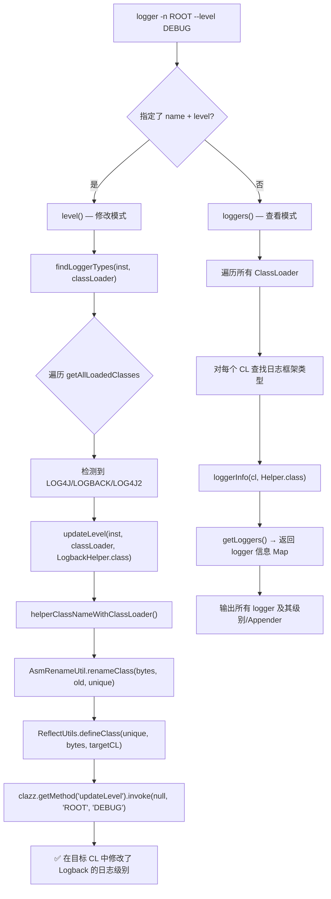

# Part 13: 内存编译 + 其他命令

> 本章覆盖三个子节：
> - **13.1**: mc 内存编译器 — `MemoryCompilerCommand.java` (168行) + `memorycompiler/` 模块 (908行)
> - **13.2**: heapdump/ognl/getstatic/logger — 独立工具命令 (~791行)
> - **13.3**: JFR 命令 — `JFRCommand.java` (427行)
>
> 前置: Part 9 (jad/redefine/retransform), Part 6 (OGNL 表达式引擎)

---

## 第 0 部分：核心原理 ⭐

### 0.1 本质是什么？

本文深入分析 **Part 13: 内存编译 + 其他命令**：从源码角度理解其设计原理、实现机制和关键细节。

### 0.2 为什么需要？

理解 JVM 内部实现是排查复杂问题、进行性能优化的基础。表面的 API 文档无法解释 JVM 的实际行为，只有深入源码才能建立精确的心智模型。

### 0.3 怎么解决？

结合源码阅读、数据结构分析和 GDB 运行时验证，从多个角度建立对该机制的完整理解。

### 0.4 为什么这样设计？

每个设计决策都有其权衡：性能 vs 正确性、简单性 vs 灵活性、内存占用 vs 查找速度。理解这些权衡是理解 JVM 设计的关键。

---


## 13.1 mc — 内存编译器

### 一、mc 命令解决什么问题

在线上环境中，你经常需要"改一行代码、立即生效"。传统方式需要：

```
1. 本地修改源码
2. 本地编译打包
3. 上传到服务器
4. 重启应用
```

Arthas 提供了一条快速通道：

```
1. jad --source-only com.example.MyClass > /tmp/MyClass.java    ← 反编译
2. vim /tmp/MyClass.java                                         ← 修改
3. mc -c <classloader-hash> /tmp/MyClass.java -d /tmp/output    ← 内存编译
4. retransform /tmp/output/com/example/MyClass.class             ← 热替换
```

`mc` (Memory Compiler) 让第 3 步在**进程内完成**，无需安装 JDK、无需 javac、无需离开 Arthas 会话。

### 二、整体架构 — JSR 199 内存编译

```
MemoryCompilerCommand (168行, Arthas 命令层)
         │
         │  new DynamicCompiler(classLoader)
         │  addSource(name, sourceCode)
         │  buildByteCodes()
         ▼
┌─────── DynamicCompiler (172行, 编译调度器) ────────┐
│                                                     │
│  JavaCompiler javaCompiler                          │  ← ToolProvider.getSystemJavaCompiler()
│  StandardJavaFileManager standardFileManager        │  ← 标准文件管理器
│  DynamicClassLoader dynamicClassLoader              │  ← 自定义 ClassLoader
│  Collection<JavaFileObject> compilationUnits        │  ← 待编译的源码
│                                                     │
│  buildByteCodes():                                  │
│    ① 创建 DynamicJavaFileManager(standard, DCL)    │
│    ② javaCompiler.getTask(fileManager, sources)     │
│    ③ task.call() — 编译！                           │
│    ④ return dynamicClassLoader.getByteCodes()       │
└─────────────────────────────────────────────────────┘
         │
         │  编译过程中的类查找与输出拦截
         ▼
┌─────── DynamicJavaFileManager (126行) ──────────────┐
│  extends ForwardingJavaFileManager                   │
│                                                      │
│  list():                                             │
│    PLATFORM_CLASS_PATH / SYSTEM_MODULES → 标准查找   │
│    CLASS_PATH + Kind.CLASS → 标准 + PackageInternals │  ← 关键！合并两个来源
│                                                      │
│  getJavaFileForOutput():                             │
│    创建 MemoryByteCode → 注册到 DynamicClassLoader  │  ← 编译产出写入内存
│                                                      │
│  inferBinaryName():                                  │
│    CustomJavaFileObject → 返回 className             │
└──────────────────────────────────────────────────────┘
```

### 三、9 个类的职责与协作

```
┌── 输入端 ────────────────────────────────────────────────┐
│ StringSource                  → 将 String 包装为 JavaFileObject (SOURCE)     │
│ MemoryCompilerCommand         → 读文件→addSource→buildByteCodes→写.class     │
├── 编译核心 ──────────────────────────────────────────────┤
│ DynamicCompiler               → 调度编译: getTask→call→收集结果              │
│ DynamicJavaFileManager        → 拦截编译器的类查找和输出请求                 │
│ PackageInternalsFinder        → 从 ClassLoader 的 URL 中查找已有 .class     │
│ JarFileIndex (内部类)          → 索引 jar 内容，加速包内类查找               │
├── 输出端 ────────────────────────────────────────────────┤
│ MemoryByteCode                → 内存中的 .class 字节码容器 (ByteArrayOS)    │
│ DynamicClassLoader            → 持有编译产出，可 defineClass 或返回 byte[]   │
│ CustomJavaFileObject          → 适配 ClassLoader URL 为 JavaFileObject       │
└──────────────────────────────────────────────────────────┘
```

### 四、编译流程 — 逐步剖析

#### 4.1 Step 1: 命令入口 — ClassLoader 选择

```java
// MemoryCompilerCommand.process()
ClassLoader classloader = null;
if (hashCode == null) {
    classloader = ClassLoader.getSystemClassLoader();  // ← 默认用 SystemCL
} else {
    classloader = ClassLoaderUtils.getClassLoader(inst, hashCode);  // ← 按 hashCode 查找
}
DynamicCompiler dynamicCompiler = new DynamicCompiler(classloader);
```

**为什么必须指定 ClassLoader？**

编译时需要解析源码中引用的类。如果你的类 `MyClass` 引用了 `com.example.UserService`，编译器必须找到 `UserService.class`。而 `UserService` 可能只存在于特定的 ClassLoader 中（比如 Spring 的 ClassLoader），用 SystemClassLoader 找不到。

```bash
# 正确用法：先用 sc 找到类的 ClassLoader hashCode
[arthas]$ sc -d com.example.MyClass | grep classLoaderHash
 classLoaderHash   327a647b

# 再用这个 hashCode 编译
[arthas]$ mc -c 327a647b /tmp/MyClass.java -d /tmp/output
```

#### 4.2 Step 2: 添加源码

```java
for (String sourceFile : sourcefiles) {
    String sourceCode = FileUtils.readFileToString(new File(sourceFile), charset);
    String name = new File(sourceFile).getName();
    if (name.endsWith(".java")) {
        name = name.substring(0, name.length() - ".java".length());
    }
    dynamicCompiler.addSource(name, sourceCode);
    // → new StringSource(name, sourceCode) 
    //   → URI: "string:///MyClass.java"
    //   → Kind: SOURCE
}
```

`StringSource` 是一个极简的 `SimpleJavaFileObject` 实现，将字符串包装为编译器能读取的源码：

```java
public class StringSource extends SimpleJavaFileObject {
    private final String contents;
    
    public StringSource(String className, String contents) {
        super(URI.create("string:///" + className.replace('.', '/') + Kind.SOURCE.extension), 
              Kind.SOURCE);
        this.contents = contents;
    }
    
    @Override
    public CharSequence getCharContent(boolean ignoreEncodingErrors) {
        return contents;  // ← 编译器调用此方法读取源码
    }
}
```

#### 4.3 Step 3: 编译执行 — JSR 199 核心流程

```java
// DynamicCompiler.buildByteCodes()
JavaFileManager fileManager = new DynamicJavaFileManager(standardFileManager, dynamicClassLoader);

DiagnosticCollector<JavaFileObject> collector = new DiagnosticCollector<>();
JavaCompiler.CompilationTask task = javaCompiler.getTask(
    null,                // Writer (null = 不输出日志)
    fileManager,         // ← 自定义的文件管理器！
    collector,           // ← 诊断信息收集器
    options,             // ["-Xlint:unchecked", "-g"] (生成调试信息)
    null,                // 注解处理器的类名
    compilationUnits     // ← 待编译的源码列表
);

boolean result = task.call();  // ← 真正执行编译！
```

**`task.call()` 的内部流程：**

```
task.call()
  │
  ├── 解析源码 → AST
  ├── 语义分析 → 类型检查
  │     ├── 需要查找引用的类 → fileManager.list(CLASS_PATH, packageName, CLASS)
  │     │     └── DynamicJavaFileManager.list()
  │     │           ├── super.list() → 标准 FileManager 查找（rt.jar 等）
  │     │           └── finder.find(packageName) → PackageInternalsFinder
  │     │                 └── classLoader.getResources(package) → 从目标 CL 查找
  │     │
  │     └── 找到引用类 → 继续分析
  │
  ├── 代码生成 → 字节码
  │     └── fileManager.getJavaFileForOutput(className)
  │           └── DynamicJavaFileManager.getJavaFileForOutput()
  │                 ├── new MemoryByteCode(className)  ← 创建内存容器
  │                 ├── classLoader.registerCompiledSource(byteCode) ← 注册
  │                 └── return byteCode  ← 编译器往这里写字节码
  │
  └── return true/false
```

#### 4.4 Step 4: DynamicJavaFileManager — 两个关键拦截

**拦截一：list() — 合并类查找来源**

```java
@Override
public Iterable<JavaFileObject> list(Location location, String packageName,
                                     Set<JavaFileObject.Kind> kinds, boolean recurse) throws IOException {
    // ① PLATFORM_CLASS_PATH / SYSTEM_MODULES → 直接走标准查找
    if (location instanceof StandardLocation) {
        String locationName = ((StandardLocation) location).name();
        for (String name : superLocationNames) {
            if (name.equals(locationName)) {
                return super.list(location, packageName, kinds, recurse);
            }
        }
    }

    // ② CLASS_PATH + CLASS 类型 → 合并标准查找 + 自定义查找
    if (location == StandardLocation.CLASS_PATH && kinds.contains(JavaFileObject.Kind.CLASS)) {
        return new IterableJoin<>(
            super.list(location, packageName, kinds, recurse),  // 标准路径
            finder.find(packageName)                             // 目标 ClassLoader 路径
        );
    }

    return super.list(location, packageName, kinds, recurse);
}
```

这是整个 mc 命令的**核心设计**——将目标应用的 ClassLoader 中的类"注入"到编译器的类查找路径中。

**拦截二：getJavaFileForOutput() — 编译产出写入内存**

```java
@Override
public JavaFileObject getJavaFileForOutput(Location location, String className,
                                            JavaFileObject.Kind kind, FileObject sibling) {
    // 检查是否已存在（处理内部类的情况）
    for (MemoryByteCode byteCode : byteCodes) {
        if (byteCode.getClassName().equals(className)) {
            return byteCode;
        }
    }
    // 创建新的内存容器
    MemoryByteCode innerClass = new MemoryByteCode(className);
    byteCodes.add(innerClass);
    classLoader.registerCompiledSource(innerClass);  // 注册到 DynamicClassLoader
    return innerClass;
}
```

#### 4.5 Step 5: PackageInternalsFinder — 从 ClassLoader URL 查找类

当编译器需要查找 `com.example.UserService` 时：

```java
public List<JavaFileObject> find(String packageName) throws IOException {
    String javaPackageName = packageName.replaceAll("\\.", "/");  // "com/example"
    
    // 通过目标 ClassLoader 获取该包下的所有资源 URL
    Enumeration<URL> urlEnumeration = classLoader.getResources(javaPackageName);
    
    while (urlEnumeration.hasMoreElements()) {
        URL packageFolderURL = urlEnumeration.nextElement();
        result.addAll(listUnder(packageName, packageFolderURL));
        // → 如果是目录: processDir() → 扫描 .class 文件
        // → 如果是 JAR:  processJar() → JarFileIndex 索引查找
    }
    return result;
}
```

**JarFileIndex 优化**：对于 JAR 文件，`PackageInternalsFinder` 使用 `ConcurrentHashMap` 缓存了每个 JAR 的索引 (`INDEXS`)。首次访问时建立 `package→List<ClassUriWrapper>` 的索引，后续查找 O(1)。

#### 4.6 Step 6: 输出 .class 文件

```java
// MemoryCompilerCommand.process() 最后阶段
Map<String, byte[]> byteCodes = dynamicCompiler.buildByteCodes();

File outputDir = (this.directory != null) ? new File(this.directory) : new File("").getAbsoluteFile();

for (Entry<String, byte[]> entry : byteCodes.entrySet()) {
    // "com.example.MyClass" → "com/example/MyClass.class"
    File byteCodeFile = new File(outputDir, entry.getKey().replace('.', '/') + ".class");
    FileUtils.writeByteArrayToFile(byteCodeFile, entry.getValue());
    files.add(byteCodeFile.getAbsolutePath());
}
```

### 五、mc 命令的完整数据流

```
用户: mc -c 327a647b /tmp/MyClass.java -d /tmp/output
  │
  ├── ① 通过 hashCode 找到目标 ClassLoader (如 WebAppClassLoader)
  ├── ② 读取 /tmp/MyClass.java → sourceCode 字符串
  ├── ③ new StringSource("MyClass", sourceCode)
  │       URI: "string:///MyClass.java", Kind: SOURCE
  │
  ├── ④ new DynamicCompiler(WebAppClassLoader)
  │       ├── javaCompiler = ToolProvider.getSystemJavaCompiler()
  │       ├── options = ["-Xlint:unchecked", "-g"]
  │       └── dynamicClassLoader = new DynamicClassLoader(WebAppClassLoader)
  │
  ├── ⑤ dynamicCompiler.buildByteCodes()
  │       ├── fileManager = new DynamicJavaFileManager(standard, DCL)
  │       ├── task = javaCompiler.getTask(null, fileManager, collector, options, null, sources)
  │       │
  │       ├── task.call() → 编译开始
  │       │     ├── 解析 MyClass.java → AST
  │       │     ├── 发现引用 com.example.UserService
  │       │     ├── fileManager.list(CLASS_PATH, "com.example", CLASS)
  │       │     │     ├── 标准路径: rt.jar, ...
  │       │     │     └── PackageInternalsFinder.find("com.example")
  │       │     │           └── WebAppClassLoader.getResources("com/example")
  │       │     │                 └── 找到 UserService.class ✅
  │       │     ├── 类型检查通过 ✅
  │       │     ├── 代码生成
  │       │     │     └── fileManager.getJavaFileForOutput("com.example.MyClass")
  │       │     │           └── new MemoryByteCode("com.example.MyClass")
  │       │     │                 └── openOutputStream() → ByteArrayOutputStream
  │       │     └── 字节码写入 MemoryByteCode ✅
  │       │
  │       └── return dynamicClassLoader.getByteCodes()
  │             → {"com.example.MyClass" → byte[...]}
  │
  └── ⑥ 写入 /tmp/output/com/example/MyClass.class
```

### 六、mc 的局限与注意事项

| 问题 | 原因 | 解决方案 |
|------|------|---------|
| **需要 JDK，不能在 JRE 上运行** | `ToolProvider.getSystemJavaCompiler()` 返回 null | 确保目标进程使用 JDK 而非 JRE |
| **ClassLoader 必须指定正确** | 编译时引用的类必须能被找到 | 先用 `sc -d` 查找类的 ClassLoader hashCode |
| **不支持增量编译** | 每次 `buildByteCodes()` 是全量编译 | 多个文件可以一起编译 |
| **不支持注解处理器** | `task.getTask()` 的 annotationProcessors 参数为 null | 需手动预处理 |
| **Lambda/方法引用可能产生额外类** | 编译器会生成 `MyClass$$Lambda$xxx` | `getJavaFileForOutput` 会处理内部类 |

### 七、mc + retransform 组合工作流

这是 Arthas **最强大的线上热修复能力**：

```
┌──────────────── Arthas 热修复完整流程 ────────────────┐
│                                                        │
│  Step 1: jad (Part 9)                                  │
│    反编译 → 获取源码                                    │
│    jad --source-only com.example.MyService > /tmp/s.java │
│                                                        │
│  Step 2: 手动修改源码                                   │
│    vim /tmp/s.java                                      │
│                                                        │
│  Step 3: mc (本章)                                      │
│    内存编译 → 获取字节码                                │
│    mc -c 327a647b /tmp/s.java -d /tmp/out              │
│                                                        │
│  Step 4: retransform (Part 9)                          │
│    热替换 → 立即生效                                    │
│    retransform /tmp/out/com/example/MyService.class     │
│                                                        │
│  ⚠️ 注意:                                              │
│    - retransform 不能增减方法/字段（JVM 限制）          │
│    - 方法签名必须保持不变                               │
│    - 修改只在当前 JVM 生命周期内有效                    │
└────────────────────────────────────────────────────────┘
```

---

## 13.2 其他工具命令

### 一、heapdump — 堆转储

`HeapDumpCommand` 是 Arthas 中**最简单的命令之一**（83行），但它调用的底层功能却是最重量级的。

#### 1.1 核心实现 — 仅 3 行

```java
private static void run(CommandProcess process, String file, boolean live) throws IOException {
    HotSpotDiagnosticMXBean hotSpotDiagnosticMXBean = ManagementFactory
                    .getPlatformMXBean(HotSpotDiagnosticMXBean.class);
    hotSpotDiagnosticMXBean.dumpHeap(file, live);
}
```

**调用链深度（Arthas → JVM 内部）：**

```
heapdump --live /tmp/heap.hprof
  │
  ├── ManagementFactory.getPlatformMXBean(HotSpotDiagnosticMXBean.class)
  │     → sun.management.HotSpotDiagnostic (HotSpot 内部实现)
  │
  └── hotSpotDiagnosticMXBean.dumpHeap(file, live)
        → HotSpotDiagnostic.dumpHeap0(file, live)  [native]
        → JVM_DumpHeap(file, live)
        → HeapDumper::dump(file, live)              [HotSpot C++]
          ├── if (live) → 先触发 Full GC 回收垃圾
          ├── VM_HeapDumper → VMThread::execute()    [STW!]
          │     ├── 暂停所有 Java 线程
          │     ├── 遍历堆中所有对象
          │     ├── 写入 HPROF 格式文件
          │     └── 恢复所有线程
          └── return
```

**⚠️ heapdump 是一个 STW 操作！** 对于大堆（8GB+），dump 可能需要数分钟，所有 Java 线程在此期间暂停。

#### 1.2 --live 参数的影响

| 参数 | 行为 | 适用场景 |
|------|------|---------|
| 无参数 | dump 所有对象（含已死对象） | 需要分析内存碎片 |
| `--live` | 先 Full GC 再 dump | 只看存活对象，文件更小 |

#### 1.3 自动文件命名

```java
if (dumpFile == null || dumpFile.isEmpty()) {
    String date = new SimpleDateFormat("yyyy-MM-dd-HH-mm").format(new Date());
    File file = File.createTempFile("heapdump" + date + (live ? "-live" : ""), ".hprof");
    dumpFile = file.getAbsolutePath();
    file.delete();  // 只用文件名，删除空文件，让 JVM 自己创建
}
```

---

### 二、ognl 命令 — 独立表达式执行

`OgnlCommand` (117行) 是 OGNL 表达式引擎的**独立入口**（与 watch/trace 中内嵌的 OGNL 不同）。

#### 2.1 与 watch 中 OGNL 的区别

| 维度 | ognl 命令 | watch 中的 OGNL |
|------|----------|----------------|
| **Express 实例** | `ExpressFactory.unpooledExpress(classLoader)` | `ExpressFactory.threadLocalExpress()` |
| **根对象** | `new Object()` (空对象) | `Advice` (含 params/returnObj/target 等) |
| **ClassLoader** | 用户指定或 SystemCL | 目标类的 ClassLoader |
| **使用场景** | 主动调用静态方法/获取静态字段 | 被动观测方法执行时的数据 |
| **执行时机** | 命令执行时立即执行 | 目标方法被调用时执行 |

#### 2.2 核心代码

```java
// OgnlCommand.process()
Express unpooledExpress = ExpressFactory.unpooledExpress(classLoader);

// 绑定一个空对象作为 root（因为 ognl 命令主要用静态访问 @Class@field）
Object value = unpooledExpress.bind(new Object()).get(express);

OgnlModel ognlModel = new OgnlModel().setValue(new ObjectVO(value, expand));
process.appendResult(ognlModel);
```

**为什么用 `unpooledExpress` 而不是 `threadLocalExpress`？**

`threadLocalExpress` 是为高频调用设计的（watch 每次方法执行都会调用），通过 ThreadLocal 复用 Express 实例。而 `ognl` 命令是一次性执行，创建新实例更安全，避免状态污染。

> **📖 交叉引用**: OGNL 表达式引擎的完整实现详见 [ch06_ognl_expression_engine.md](ch06_ognl_expression_engine.md)

#### 2.3 典型用法

```bash
# 调用静态方法
ognl '@java.lang.System@getProperty("java.version")'

# 获取静态字段
ognl '@com.example.Config@MAX_RETRY'

# 创建对象并调用方法
ognl '#ctx=new com.example.AppContext(), #ctx.getBean("userService").getUserCount()'

# 修改静态字段（⚠️ 危险！）
ognl '@com.example.Config@DEBUG_MODE=true'
```

---

### 三、getstatic 命令 — 静态字段查看

`GetStaticCommand` (208行) 是 `ognl` 命令的**前身**，专门用于查看静态字段。

#### 3.1 与 ognl 命令的关系

```
getstatic demo.MathGame random
  ↑ 等价于 ↓
ognl '@demo.MathGame@random'
```

`getstatic` 保留的原因：语法更简单，支持通配符匹配字段名。

#### 3.2 核心流程

```java
// 1. 通过 SearchUtils 找到目标类
Set<Class<?>> matchedClasses = SearchUtils.searchClassOnly(inst, classPattern, isRegEx, hashCode);

// 2. 遍历所有静态字段
for (Field field : clazz.getDeclaredFields()) {
    if (!Modifier.isStatic(field.getModifiers()) || !fieldNameMatcher.matching(field.getName())) {
        continue;  // 跳过非静态或不匹配的字段
    }
    field.setAccessible(true);  // 突破 private
    Object value = field.get(null);  // 获取静态字段值
    
    // 3. 如果指定了 express，用 OGNL 进一步求值
    if (!StringUtils.isEmpty(express)) {
        value = ExpressFactory.threadLocalExpress(value).get(express);
    }
}
```

**设计细节**：`getstatic` 用的是 `ExpressFactory.threadLocalExpress(value)`，以字段值为 root 进行 OGNL 求值。这允许你在获取静态字段后，进一步访问其属性：

```bash
# 获取 random 字段的 seed 值
getstatic demo.MathGame random 'seed.get()'
```

---

### 四、logger 命令 — 日志级别动态修改

`LoggerCommand` (383行) 是 Arthas 中**设计最巧妙的工具命令之一**，它解决了一个经典问题：**如何在不重启应用的情况下，动态修改日志级别？**

#### 4.1 核心挑战 — ClassLoader 隔离

问题不在于"修改日志级别"本身（反射调用一行代码），而在于：

```
Arthas 的 ClassLoader 层级:
  BootstrapCL → ExtCL → ArthasCL (Arthas 自己的类)
  
应用的 ClassLoader 层级:
  BootstrapCL → ExtCL → AppCL → WebAppCL (应用的类)
                                    └── Logback / Log4j2 / Log4j 类

问题：ArthasCL 看不到 WebAppCL 中的 Logback 类！
      直接 import ch.qos.logback.classic.Logger 会报 ClassNotFoundException
```

#### 4.2 解决方案 — Helper 类动态注入

`LoggerCommand` 采用了一种极其精巧的设计：

```
┌─ LoggerCommand (ArthasCL) ─────────────────────────────────────────┐
│                                                                     │
│  static {                                                           │
│    // 在类加载时，把 4 个 Helper 类的字节码读到内存                   │
│    LogbackHelperBytes = loadClassBytes(LogbackHelper.class);         │
│    Log4jHelperBytes   = loadClassBytes(Log4jHelper.class);           │
│    Log4j2HelperBytes  = loadClassBytes(Log4j2Helper.class);          │
│    LoggerHelperBytes  = loadClassBytes(LoggerHelper.class);          │
│  }                                                                  │
│                                                                     │
│  helperClassNameWithClassLoader(classLoader, helperClass):          │
│    ① 生成唯一类名: "LogbackHelper" + arthasCLHash + targetCLHash    │
│    ② 尝试 classLoader.loadClass(uniqueName)                         │
│    ③ 找不到？→ AsmRenameUtil.renameClass(bytes, old, new)           │
│    ④ ReflectUtils.defineClass(uniqueName, bytes, classLoader)        │
│    ⑤ → 在目标 ClassLoader 中定义了一个改名后的 Helper 类！           │
│                                                                     │
│  level(process):                                                    │
│    clazz = helperClassNameWithClassLoader(targetCL, LogbackHelper)  │
│    Method updateLevel = clazz.getMethod("updateLevel", ...)         │
│    updateLevel.invoke(null, name, level)                            │
│    // → 在目标 CL 中执行，能看到 Logback 类！✅                     │
└─────────────────────────────────────────────────────────────────────┘
```

**关键技术：ASM 类重命名**

```java
// AsmRenameUtil.renameClass()
public static byte[] renameClass(byte[] bytes, String oldName, String newName) {
    ClassReader reader = new ClassReader(bytes);
    ClassWriter writer = new ClassWriter(reader, 0);
    
    // 使用 ASM 的 ClassRemapper 将类名从 oldName 改为 newName
    ClassVisitor visitor = new ClassRemapper(writer, 
        new SimpleRemapper(internalOldName, internalNewName));
    
    reader.accept(visitor, 0);
    return writer.toByteArray();
}
```

**为什么要重命名？** 如果直接用 `LogbackHelper` 这个名字在目标 ClassLoader 中 `defineClass`，当多个 ClassLoader 都需要注入时会冲突。重命名为 `LogbackHelper<arthasCLHash><targetCLHash>` 确保每个 ClassLoader 中的 Helper 类名唯一。

#### 4.3 日志框架自动探测

```java
private void updateLoggerType(LoggerTypes loggerTypes, ClassLoader classLoader, String className) {
    if ("org.apache.log4j.Logger".equals(className)) {
        // 额外检查：排除 slf4j-over-log4j（它有 Logger 类但不是真正的 Log4j）
        if (classLoader.getResource("org/apache/log4j/AsyncAppender.class") != null) {
            loggerTypes.addType(LoggerType.LOG4J);
        }
    } else if ("ch.qos.logback.classic.Logger".equals(className)) {
        if (classLoader.getResource("ch/qos/logback/core/Appender.class") != null) {
            loggerTypes.addType(LoggerType.LOGBACK);
        }
    } else if ("org.apache.logging.log4j.Logger".equals(className)) {
        if (classLoader.getResource("org/apache/logging/log4j/core/LoggerContext.class") != null) {
            loggerTypes.addType(LoggerType.LOG4J2);
        }
    }
}
```

**支持的日志框架：**

| 框架 | 探测类 | 确认类(排除 shim) | Helper 类 |
|------|--------|-------------------|-----------|
| Log4j 1.x | `org.apache.log4j.Logger` | `AsyncAppender` | `Log4jHelper` |
| Logback | `ch.qos.logback.classic.Logger` | `Appender` (core) | `LogbackHelper` |
| Log4j 2.x | `org.apache.logging.log4j.Logger` | `LoggerContext` (core) | `Log4j2Helper` |

#### 4.4 logger 命令的完整流程图



---

## 13.3 JFR 命令 — Java Flight Recorder

`JFRCommand` (427行) 是 JDK Flight Recorder 的 Arthas 封装，提供在 Arthas 会话中管理 JFR 录制的能力。

### 一、JFR vs profiler 命令

| 维度 | jfr 命令 | profiler 命令 |
|------|---------|--------------|
| **底层技术** | JDK Flight Recorder (Java API) | async-profiler (C++ native) |
| **数据类型** | JVM 事件全覆盖(GC/类加载/线程/IO/编译等) | 主要是 CPU/内存/锁采样 |
| **开销** | ~1% (JVM 内置优化) | ~1-2% |
| **Native 帧** | ❌ 不支持 | ✅ 支持 |
| **Safepoint 偏差** | ✅ 有偏差 (JDK 11) | ❌ 无偏差 |
| **输出格式** | .jfr (用 JMC 打开) | .html/.jfr/.txt |
| **最低 JDK** | JDK 11+ (开源版) | 无限制 |
| **适用场景** | 全面的 JVM 行为分析 | 专注 CPU/内存热点 |

### 二、四种操作

```java
@Override
public void process(CommandProcess process) {
    if ("start".equals(cmd))   { /* 启动录制 */ }
    else if ("status".equals(cmd)) { /* 查看状态 */ }
    else if ("dump".equals(cmd))   { /* 导出数据 */ }
    else if ("stop".equals(cmd))   { /* 停止录制 */ }
}
```

### 三、start — 启动 JFR 录制

```java
// 1. 加载 JFR 配置（default 或 profile）
Configuration c = Configuration.getConfiguration(settings);
// default: 低开销，适合生产环境
// profile: 高精度，适合性能分析

// 2. 创建 Recording 对象
Recording r = new Recording(c);

// 3. 设置各种参数
if (getFilename() != null)  r.setDestination(Paths.get(getFilename()));
if (getMaxSize() != null)   r.setMaxSize(parseSize(getMaxSize()));
if (getMaxAge() != null)    r.setMaxAge(Duration.ofNanos(parseTimespan(getMaxAge())));
if (isDumpOnExit() != false) r.setDumpOnExit(isDumpOnExit());
if (getDuration() != null)  r.setDuration(Duration.ofNanos(parseTimespan(getDuration())));

// 4. 启动（支持延迟启动）
if (getDelay() != null) {
    r.scheduleStart(Duration.ofNanos(parseTimespan(getDelay())));
} else {
    r.start();
}

// 5. 默认限制
if (duration == null && maxAge == null && maxSize == null) {
    r.setMaxSize(250 * 1024L * 1024L);  // 默认 250MB 上限
}

// 6. 保存到全局 Map
recordings.put(id, r);
```

**⚠️ 设计注意**：`recordings` 是一个 `static ConcurrentHashMap`，JFR 录制在多次命令调用间保持。

### 四、stop — 停止并输出

```java
Recording r = recordings.remove(getRecording());

// 状态检查
if ("CLOSED".equals(r.getState().toString()) || "STOPPED".equals(r.getState().toString())) {
    process.end(-1, "Failed to stop recording, state can not be closed/stopped");
}

// 设置输出文件（自动生成或用户指定）
if (getFilename() == null) {
    setFilename(outputFile());  // → arthas-output/20260210-143025.jfr
}
r.setDestination(Paths.get(getFilename()));

// 停止并关闭
r.stop();
r.close();
```

### 五、dump — 不停止录制的快照

```java
Recording r = recordings.get(getRecording());
// dump 不会从 Map 中移除 Recording，也不会停止它
r.dump(Paths.get(getFilename()));
// → 拷贝当前 buffer 内容到文件，Recording 继续运行
```

### 六、JFR 命令与 profiler --jfrsync 的关系

async-profiler 的 `--jfrsync` 参数可以将采样数据注入到 JDK JFR 的录制中：

```bash
# 方式1：纯 JFR 录制（JDK 事件）
jfr start -f /tmp/jdk-only.jfr

# 方式2：纯 async-profiler 采样（CPU/内存热点）
profiler start -f /tmp/ap-only.jfr --format jfr

# 方式3：两者联合（最全面）
profiler start --jfrsync default -f /tmp/combined.jfr
# → JDK 事件 + async-profiler CPU 采样 → 同一个 .jfr 文件
```

### 七、时间/大小解析工具

`JFRCommand` 包含两个实用的解析方法：

```java
// 时间解析：支持 s/m/h/d 后缀
public long parseTimespan(String s) {
    if (s.endsWith("s")) return SECONDS.toNanos(...);
    if (s.endsWith("m")) return 60 * SECONDS.toNanos(...);
    if (s.endsWith("h")) return 3600 * SECONDS.toNanos(...);
    if (s.endsWith("d")) return 86400 * SECONDS.toNanos(...);
}

// 大小解析：支持 b/k/m/g 后缀
public long parseSize(String s) {
    if (s.endsWith("b")) return parseLong(...);
    if (s.endsWith("k")) return 1024 * parseLong(...);
    if (s.endsWith("m")) return 1024 * 1024 * parseLong(...);
    if (s.endsWith("g")) return 1024 * 1024 * 1024 * parseLong(...);
}
```

---

## 十三、Part 13 命令对比总结

| 命令 | 行数 | 技术栈 | 核心 API | 一句话 |
|------|------|--------|---------|--------|
| **mc** | 168+908 | JSR 199 (javax.tools) | `JavaCompiler.getTask().call()` | 进程内编译 Java 源码为字节码 |
| **heapdump** | 83 | JMX | `HotSpotDiagnosticMXBean.dumpHeap()` | 3 行代码触发堆转储 (STW!) |
| **ognl** | 117 | OGNL 引擎 | `ExpressFactory.unpooledExpress()` | 独立执行 OGNL 表达式 |
| **getstatic** | 208 | 反射 + OGNL | `Field.get(null)` | 查看/操作静态字段 |
| **logger** | 383+~600 | ASM + 反射 + ClassLoader 注入 | `AsmRenameUtil.renameClass()` | 跨 CL 动态修改日志级别 |
| **jfr** | 427 | JDK JFR API | `Recording.start()/stop()/dump()` | 管理 JFR 录制 |

### 设计模式对比

| 命令 | 与 JVM 的交互方式 | 是否 STW | 是否侵入 |
|------|------------------|---------|---------|
| mc | 调用 javac 编译器 | ❌ | ❌ |
| heapdump | JMX MBean → JVM 原生操作 | ⚠️ **是** | ❌ |
| ognl | OGNL 引擎 + 反射 | ❌ | ❌ |
| getstatic | 反射 | ❌ | ❌ |
| logger | ASM 类重命名 + defineClass + 反射 | ❌ | ⚠️ 注入 Helper |
| jfr | JDK JFR API | ❌ | ❌ |

---

## 十四、与前序章节的关系

```
mc 命令 ←→ Part 9 (jad + retransform): 三步热修复流程
  jad 反编译 → mc 编译 → retransform 替换

ognl 命令 ←→ Part 6 (OGNL 表达式引擎): unpooledExpress vs threadLocalExpress
  独立命令用 unpooledExpress, watch/trace 用 threadLocalExpress

getstatic ←→ Part 6 + Part 9 (sc): 搜索类 + OGNL 求值

logger ←→ Part 2 (ClassLoader 隔离): 解决 ArthasCL 与目标 CL 的隔离问题
  ←→ Part 5 (ASM): AsmRenameUtil 使用 ASM 重命名类

heapdump ←→ Part 11 (vmtool): 都是 JVM Native 操作
  vmtool: JVMTI (C++)
  heapdump: JMX MBean (Java API → JVM Native)

jfr ←→ Part 12 (profiler): 互补的诊断能力
  jfr: JVM 全面事件 (GC/类加载/IO)
  profiler: CPU/内存采样 (async-profiler)
  联合: profiler --jfrsync
```

---

*创建日期: 2026-02-10*
*源码版本: Arthas 4.1.2*
