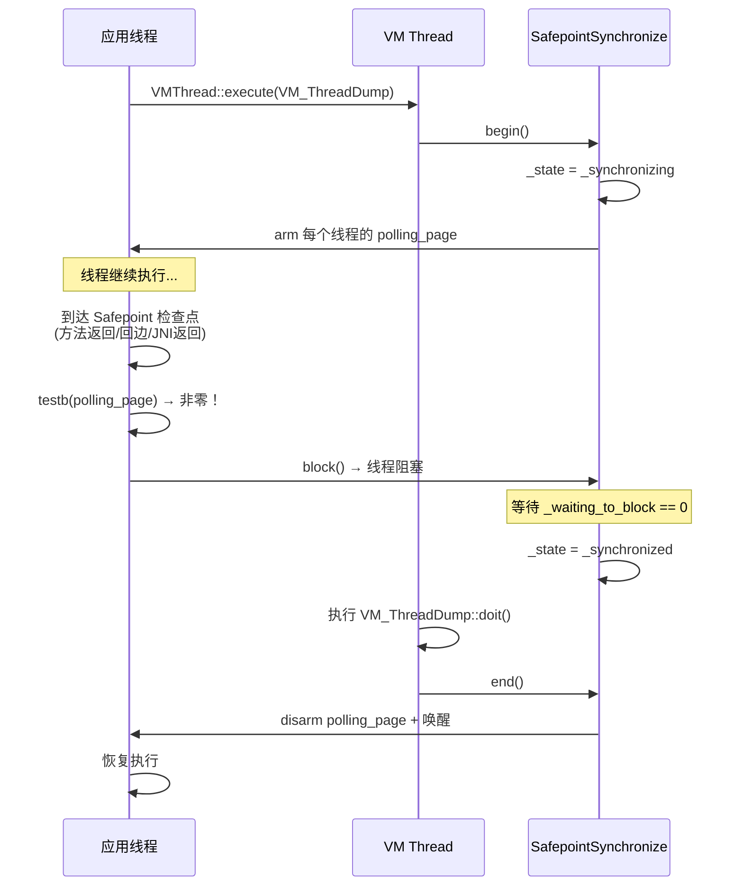
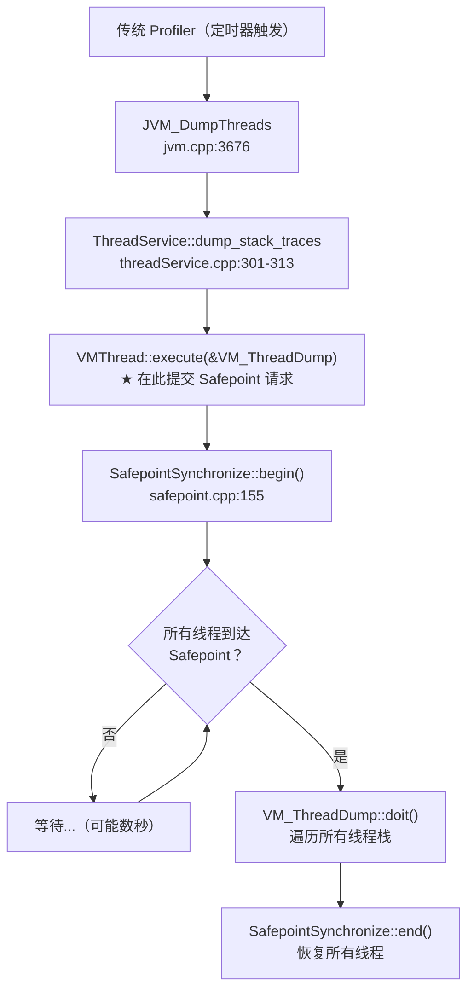
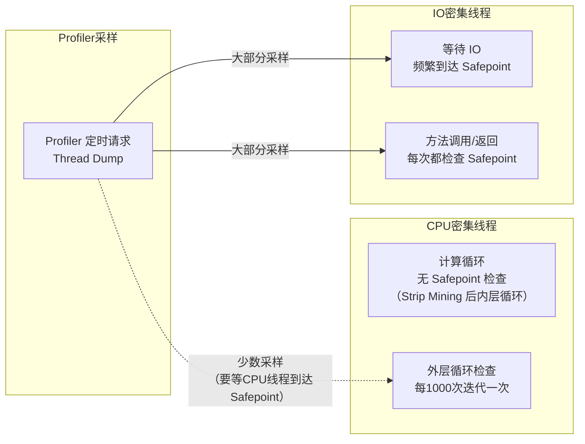
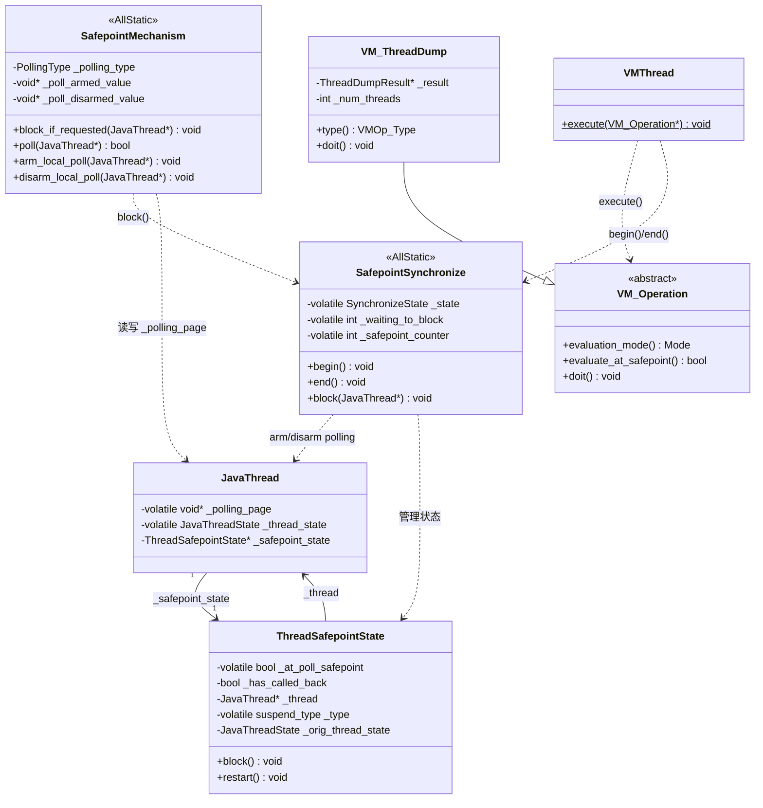

# 第一章：Safepoint Bias 问题深度解析

> **基于 OpenJDK 11 源码分析（纯源码验证，无网络搜索）**
> **标准环境**：`-Xms8g -Xmx8g -XX:+UseG1GC`，G1 Region = 4MB
> **方法论**：程序 = 数据结构 + 算法 | 问题驱动设计分析

---

## 第 0 部分：核心原理

### 0.1 本质是什么？

传统 Java Profiler（JProfiler、YourKit、VisualVM）采集调用栈时 **必须等待所有线程到达 Safepoint**，导致采样严重偏向"容易到达 Safepoint 的代码"，而 CPU 密集型热点代码被严重低估——这就是 **Safepoint Bias（安全点偏差）**。

### 0.2 为什么会有这个问题？

HotSpot JVM 的栈遍历 API（`JVM_DumpThreads`、JVMTI `GetAllStackTraces`）底层通过 `VMThread::execute(&op)` 提交 VM 操作。VM 操作默认在 Safepoint 执行（`VM_Operation::evaluation_mode()` 返回 `_safepoint`），这意味着 **必须先 stop-the-world、让所有 Java 线程暂停**，才能安全地遍历栈帧。

但 JIT 编译器为了性能，会通过 **Loop Strip Mining** 将 Safepoint 从计数循环内层移到外层——每 `LoopStripMiningIter`（默认 1000）次迭代才检查一次。对于纯计算密集循环，线程可能数秒都不到达 Safepoint。传统 Profiler 在这数秒内完全无法采样，导致热点被严重低估。

### 0.3 怎么解决？

async-profiler 使用 HotSpot 内部的非标准接口 `AsyncGetCallTrace`（`forte.cpp:523`），它在 SIGPROF 信号处理器中由 **被中断线程自身** 直接调用，不需要 stop-the-world，不需要等待 Safepoint。代价是可能遇到 GC 竞争导致栈帧不可遍历——但这只是丢失个别采样点，远好于传统 Profiler 的系统性偏差。

### 0.4 为什么传统 Profiler 不能绕过 Safepoint？

**为什么栈遍历需要 Safepoint？** 非 Safepoint 时刻，线程可能正在执行 JIT 编译代码，栈帧格式不固定（寄存器中的 oop 引用位置未知），GC 可能同时移动对象——贸然遍历栈会读到不一致的数据、发生段错误。

**为什么 AsyncGetCallTrace 能绕过？** 它不需要精确的 oop 遍历，只需要获取方法名和行号。它通过 `ucontext`（信号上下文）获取 PC/SP/FP，从当前帧逆向回溯。遇到不可解析的帧就返回错误码（`ticks_GC_active=-2`、`ticks_unknown_not_Java=-3`），而不是崩溃。

---

## 第 1 部分：数据结构全景

### 1.1 数据结构清单

| 结构名 | 源码位置 | 核心作用 |
|--------|----------|----------|
| `SafepointSynchronize` | `safepoint.hpp:59-211` | 全局安全点同步管理（纯静态类）|
| `ThreadSafepointState` | `safepoint.hpp:228-277` | 每线程的安全点状态 |
| `SafepointMechanism` | `safepointMechanism.hpp:34-92` | 安全点轮询机制抽象 |
| `VM_Operation`（及子类）| `vmOperations.hpp:123-210` | VM 操作基类，定义执行模式 |
| `VM_ThreadDump` | `vmOperations.hpp:452-480` | 线程转储操作，需要 Safepoint |
| `ThreadDumpResult` | `threadService.hpp:361-391` | 线程转储结果容器 |

### 1.2 SafepointSynchronize 详细分析

#### 1.2.1 核心设计

`SafepointSynchronize` 继承自 `AllStatic`（纯静态类），是全局唯一的 Safepoint 协调者。它管理一个三态状态机，控制所有 Java 线程的暂停和恢复。

#### 1.2.2 状态机枚举

```cpp
// safepoint.hpp:61-66
enum SynchronizeState {
    _not_synchronized = 0,  // 正常运行，无 Safepoint
    _synchronizing    = 1,  // 正在请求所有线程暂停
    _synchronized     = 2,  // 所有线程已暂停，VM 线程可执行操作
};
```

#### 1.2.3 核心静态字段

| 字段名 | 类型 | 行号(hpp/cpp) | 含义 |
|--------|------|---------------|------|
| `_state` | `volatile SynchronizeState` | 107 / 143 | **核心字段**：全局 Safepoint 状态 |
| `_waiting_to_block` | `volatile int` | 108 / 144 | 尚未到达 Safepoint 的线程数量 |
| `_safepoint_counter` | `volatile int` | 119 / 145 | Safepoint 计数器（偶数=非 Safepoint） |
| `_end_of_last_safepoint` | `long` | 121 / 147 | 上次 Safepoint 结束的时间戳 |

**`_state` 字段生命周期**：

```
begin():                           end():
  断言 _not_synchronized (L171)      _safepoint_counter++ (L503, 奇数→偶数)
  → _synchronizing      (L242)      → _not_synchronized  (L545/L557)
  → arm 所有线程 polling page
  → 自旋等待 still_running == 0
  → 等待 _waiting_to_block == 0
  → _safepoint_counter++ (L450, 偶数→奇数)
  → _synchronized        (L453)
```

**`_safepoint_counter` 值域图**：

```
偶数（0, 2, 4, ...）= 非 Safepoint 状态
奇数（1, 3, 5, ...）= 正在 Safepoint 中
每次 begin() 和 end() 各递增一次
```

#### 1.2.4 SafepointStats 统计结构

```cpp
// safepoint.hpp:92-104
struct SafepointStats {
    float  _time_stamp;                    // 安全点发生时间（秒）
    int    _vmop_type;                     // 触发 Safepoint 的 VM 操作类型
    int    _nof_total_threads;             // Java 线程总数
    int    _nof_initial_running_threads;   // 初始运行中的线程数
    int    _nof_threads_wait_to_block;     // 等待阻塞的线程数
    int    _nof_threads_hit_page_trap;     // 命中 page trap 的线程数
    jlong  _time_to_spin;                  // 自旋阶段耗时（毫秒）
    jlong  _time_to_wait_to_block;         // 等待阻塞阶段耗时（毫秒）
    jlong  _time_to_do_cleanups;           // 清理任务耗时（毫秒）
    jlong  _time_to_sync;                  // 达到 _synchronized 总耗时（毫秒）
    jlong  _time_to_exec_vmop;             // VM 操作执行时间（毫秒）
};
```

**JVM 参数**：添加 `-XX:+PrintSafepointStatistics` 可看到这些统计数据。

```
输出示例（-XX:+PrintSafepointStatistics -XX:PrintSafepointStatisticsCount=1）：
         vmop                    [threads: total initially_running wait_to_block]    [time: spin block sync cleanup vmop] page_trap_count
4.234: G1IncCollectionPause     [      12          2              10    ]      [     0     0     0     0     7    ]  1
```

#### 1.2.5 核心函数入口

| 函数 | 行号（safepoint.cpp）| 作用 |
|------|---------------------|------|
| `begin()` | 155-495 | 请求所有线程到达 Safepoint |
| `end()` | 499-601 | 唤醒所有线程恢复执行 |
| `block()` | 816-935 | Java 线程自愿阻塞在 Safepoint |

### 1.3 ThreadSafepointState 详细分析

#### 1.3.1 字段列表

```cpp
// safepoint.hpp:228-277
// 注意：位于 safepoint.hpp，不是 thread.hpp！
class ThreadSafepointState : public CHeapObj<mtThread> {
 private:
    volatile bool     _at_poll_safepoint;  // 是否在 polling safepoint
    bool              _has_called_back;    // 是否已回调安全点代码（调试用）
    JavaThread*       _thread;             // 关联的 JavaThread
    volatile suspend_type _type;           // 当前挂起状态
    JavaThreadState   _orig_thread_state;  // 进入 Safepoint 前的原始线程状态
};
```

#### 1.3.2 挂起状态枚举

```cpp
// safepoint.hpp:233-237
enum suspend_type {
    _running     = 0,  // 尚未确定（线程还在跑）
    _at_safepoint = 1, // 已在安全点（如阻塞在锁上）
    _call_back   = 2,  // 需要回调（线程在解释器或 VM 中）
};
```

#### 1.3.3 创建位置

在 `JavaThread` 构造期间创建，每个 `JavaThread` 持有一个实例：

```cpp
// thread.hpp:1013
ThreadSafepointState* _safepoint_state;  // 指向此线程的安全点状态
```

### 1.4 SafepointMechanism 详细分析

#### 1.4.1 两种轮询方式

```cpp
// safepointMechanism.hpp:35-38
enum PollingType {
    _global_page_poll,    // 全局页轮询（旧方式）
    _thread_local_poll,   // 线程本地轮询（JDK 11 默认）
};
```

#### 1.4.2 核心静态字段

| 字段名 | 类型 | 行号 | 含义 |
|--------|------|------|------|
| `_polling_type` | `PollingType` | 39 | 当前轮询类型 |
| `_poll_armed_value` | `void*` | 40 | 已激活值（指向 bad_page，低第3位=1）|
| `_poll_disarmed_value` | `void*` | 41 | 未激活值（指向 good_page，低第3位=0）|
| `_poll_bit` | `const intptr_t` | 61 | 值为 `8`，即地址第3位用于区分 armed/disarmed |

**线程本地轮询工作原理**：

```
armed 状态（需要暂停）:
  thread->_polling_page = _poll_armed_value  （bad_page | 0x8）
  → 编译代码 testb 检查第3位 → 非零 → 跳转慢路径 → block()

disarmed 状态（正常运行）:
  thread->_polling_page = _poll_disarmed_value  （good_page）
  → 编译代码 testb 检查第3位 → 零 → 继续执行
```

### 1.5 VM_Operation 与 VM_ThreadDump

#### 1.5.1 VM_Operation 基类

```cpp
// vmOperations.hpp:195
virtual Mode evaluation_mode() const { return _safepoint; }  // 默认模式：Safepoint

// vmOperations.hpp:207-210
virtual bool evaluate_at_safepoint() const {
    return evaluation_mode() == _safepoint ||
           evaluation_mode() == _async_safepoint;
}
```

**关键**：所有继承自 `VM_Operation` 且未覆盖 `evaluation_mode()` 的子类，提交给 `VMThread::execute()` 后都会触发 stop-the-world。

#### 1.5.2 VM_ThreadDump — 传统 Profiler 的底层实现

```cpp
// vmOperations.hpp:452-480
class VM_ThreadDump : public VM_Operation {
 private:
    ThreadDumpResult*  _result;           // 转储结果
    int                _num_threads;      // 线程数
    int                _max_depth;        // 最大栈深度
    bool               _with_locked_monitors;
    bool               _with_locked_synchronizers;
 public:
    VMOp_Type type() const { return VMOp_ThreadDump; }  // 第476行
    // 注意：没有覆盖 evaluation_mode()，因此默认为 _safepoint
    void doit();  // 在 Safepoint 由 VM 线程执行
};
```

**`VM_ThreadDump::doit()` 调用链**：
- `jvm.cpp:3710` → `ThreadService::dump_stack_traces()`
- `threadService.cpp:313` → `VMThread::execute(&op)` ← **这里触发 Safepoint**
- VM 线程在 Safepoint 中执行 `doit()`，遍历所有线程栈

---

## 第 2 部分：算法/流程分析

### 2.1 Safepoint 触发的完整流程

#### 2.1.1 解决什么问题？

JVM 需要在某些时刻获得全局一致的堆和栈状态（GC、Thread Dump、Deoptimization 等），必须让所有 Java 线程暂停。

#### 2.1.2 核心流程图



### 2.2 Safepoint 检查点位置（源码级分析）

#### 2.2.1 解决什么问题？

线程不能无限运行不到达 Safepoint，否则其他线程无法执行 GC 等操作。但每条指令都检查会严重影响性能。HotSpot 选择在以下位置插入检查，在性能和响应性之间取得平衡。

#### 2.2.2 位置 1：方法返回时

**C++ 字节码解释器**：

```cpp
// bytecodeInterpreter.cpp:1602-1634
CASE(_areturn):
CASE(_ireturn):
CASE(_freturn):
{
    // Allow a safepoint before returning to frame manager.
    SAFEPOINT;          // ← 每次方法返回都检查 Safepoint
    goto handle_return;
}

CASE(_lreturn):
CASE(_dreturn):
{
    SAFEPOINT;
    goto handle_return;
}

CASE(_return): {
    SAFEPOINT;
    goto handle_return;
}
```

**`SAFEPOINT` 宏的定义**：

```cpp
// bytecodeInterpreter.cpp:106-111
#define SAFEPOINT                                                    \
    {                                                                \
       HandleMarkCleaner __hmc(THREAD);                              \
       CALL_VM(SafepointMechanism::block_if_requested(THREAD),      \
               handle_exception);                                    \
    }
```

**核心**：直接调用 `SafepointMechanism::block_if_requested()`，如果有 Safepoint 请求则阻塞线程。

**模板解释器（x86）**：

```cpp
// templateTable_x86.cpp:2657-2673
// 在 _return 字节码模板中：
if (SafepointMechanism::uses_thread_local_poll() &&
    _desc->bytecode() != Bytecodes::_return_register_finalizer) {
    Label no_safepoint;
    // ★ 测试线程本地 polling page 的标志位
    __ testb(Address(r15_thread, Thread::polling_page_offset()),
             SafepointMechanism::poll_bit());
    __ jcc(Assembler::zero, no_safepoint);  // 标志位为0→跳过
    __ push(state);
    __ call_VM(noreg, CAST_FROM_FN_PTR(address,
                    InterpreterRuntime::at_safepoint));  // ★ 慢路径：检查 Safepoint
    __ pop(state);
    __ bind(no_safepoint);
}
```

**设计决策**：方法返回是天然的 Safepoint 检查点——栈帧即将销毁，此时寄存器状态已知，检查成本最低。

#### 2.2.3 位置 2：循环回边处

**C++ 字节码解释器**：

```cpp
// bytecodeInterpreter.cpp:311, 348-349
#define DO_BACKEDGE_CHECKS(skip, branch_pc)              \
    if ((skip) <= 0) {                                   \
      /* skip <= 0 表示向后跳转（回边）*/                  \
      MethodCounters* mcs;                               \
      GET_METHOD_COUNTERS(mcs);                          \
      if (UseLoopCounter) {                              \
        mcs->backedge_counter()->increment();            \
        /* ... OSR 编译触发 ... */                        \
      }                                                  \
      SAFEPOINT;    /* ★ 每次回边都检查 Safepoint */      \
    }
```

**模板解释器（x86）—— 分派表机制**：

```cpp
// interp_masm_x86.cpp:808-866
void InterpreterMacroAssembler::dispatch_base(TosState state,
                                              address* table,
                                              bool verifyoop,
                                              bool generate_poll) {
  address* const safepoint_table = Interpreter::safept_table(state);
  if (SafepointMechanism::uses_thread_local_poll() &&
      table != safepoint_table && generate_poll) {
    // ★ generate_poll=true 时（回边分支），检查 polling page
    testb(Address(r15_thread, Thread::polling_page_offset()),
          SafepointMechanism::poll_bit());
    jccb(Assembler::zero, no_safepoint);
    // 需要 Safepoint → 跳转到 safepoint 分派表
    lea(rscratch1, ExternalAddress((address)safepoint_table));
    // ...
  }
}
```

**C2 编译器 —— Loop Strip Mining**：

这是导致 Safepoint Bias 的核心优化。

```cpp
// loopnode.cpp:830-864
// ★ 条件：LoopStripMiningIter > 1 且是叶子循环（无子循环）且无调用
bool strip_mine_loop = LoopStripMiningIter > 1 &&
    loop->_child == NULL &&
    sfpt2->Opcode() == Op_SafePoint &&
    !loop->_has_call;

if (strip_mine_loop) {
    // ★ 创建外层 strip-mined 循环，SafePoint 节点放到外层
    outer_ilt = create_outer_strip_mined_loop(test, cmp, init_control, loop, ...);
}

// ★ 将 SafePoint 从内层循环移除，移到外层
if (LoopStripMiningIter == 0 || strip_mine_loop) {
    if (sfpt2->Opcode() == Op_SafePoint && ...) {
      if (strip_mine_loop) {
        Node* outer_le = outer_ilt->_tail->in(0);
        Node* sfpt = sfpt2->clone();
        sfpt->set_req(0, iffalse);
        outer_le->set_req(0, sfpt);  // SafePoint 放到外层循环的末尾
      }
    }
}
```

**变换效果**：

```
原始循环（每次迭代检查 Safepoint）:
  for (int i = 0; i < N; i++) {
      body;
      ← SafePoint
  }

变换后（每 LoopStripMiningIter 次才检查）:
  for (int i = 0; i < N; i += strip) {         // 外层循环
      for (int j = 0; j < strip; j++) {         // 内层循环
          body;                                  // ← 无 SafePoint！
      }
      ← SafePoint（只在外层检查）
  }
  // strip = LoopStripMiningIter（默认 1000）
```

**参数控制**（`compilerDefinitions.cpp:338-348`）：

```cpp
// ★ UseCountedLoopSafepoints 和 LoopStripMiningIter 联动
if (UseCountedLoopSafepoints && LoopStripMiningIter == 0) {
    warning("When counted loop safepoints are enabled, "
            "LoopStripMiningIter must be at least 1");
    LoopStripMiningIter = 1;
} else if (!UseCountedLoopSafepoints && LoopStripMiningIter > 0) {
    warning("Disabling counted safepoints implies no loop strip mining");
    LoopStripMiningIter = 0;
}
```

| 参数 | 默认值 | 作用 |
|------|--------|------|
| `-XX:+UseCountedLoopSafepoints` | true（JDK 10+）| 是否在计数循环中放 Safepoint |
| `-XX:LoopStripMiningIter=N` | 1000 | 每 N 次迭代检查一次 Safepoint |

**设计决策**：为什么不每次迭代都检查？每次检查 Safepoint 需要一条 `testb` + 一条 `jcc` 指令，对于循环体只有几条指令的热点循环，这个开销是不可接受的。Strip Mining 在性能（减少检查频率）和响应性（最终还是会到达 Safepoint）之间取得了平衡。

#### 2.2.4 位置 3：线程状态转换时

```cpp
// interfaceSupport.inline.hpp:114-128
static inline void transition(JavaThread *thread,
                              JavaThreadState from, JavaThreadState to) {
    // ★ 改为过渡状态（from + 1）
    thread->set_thread_state((JavaThreadState)(from + 1));
    InterfaceSupport::serialize_thread_state(thread);
    // ★ 在过渡状态中检查 Safepoint
    SafepointMechanism::block_if_requested(thread);
    thread->set_thread_state(to);
}
```

**从 Native 返回时（JNI 返回）**：

```cpp
// interfaceSupport.inline.hpp:158-177
static inline void transition_from_native(JavaThread *thread,
                                          JavaThreadState to) {
    thread->set_thread_state(_thread_in_native_trans);  // ★ 过渡状态
    InterfaceSupport::serialize_thread_state_with_handler(thread);
    if (SafepointMechanism::poll(thread) ||
        thread->is_suspend_after_native()) {
      // ★ 检查 Safepoint 并在必要时阻塞
      JavaThread::check_safepoint_and_suspend_for_native_trans(thread);
    }
    thread->set_thread_state(to);
}
```

每个 `JNI_ENTRY` 宏展开后包含 `ThreadInVMfromNative`（`interfaceSupport.inline.hpp:266-274`），其构造函数调用 `transition_from_native()`。所以 **每次 JNI 调用返回都会检查 Safepoint**。

#### 2.2.5 位置 4：分配触发 GC 时

分配本身不是 Safepoint 检查点，但分配失败会触发 GC——GC 是一个需要 Safepoint 的 VM 操作：

```cpp
// g1CollectedHeap.cpp:418-468
HeapWord* G1CollectedHeap::attempt_allocation_slow(size_t word_size) {
    // ...
    if (should_try_gc) {
        result = do_collection_pause(word_size, gc_count_before, &succeeded,
                                     GCCause::_g1_inc_collection_pause);
    }
}

// g1CollectedHeap.cpp:3238-3258
HeapWord* G1CollectedHeap::do_collection_pause(...) {
    VM_G1CollectForAllocation op(word_size, gc_count_before, gc_cause, ...);
    VMThread::execute(&op);  // ★ 这里触发 Safepoint
    // ...
}
```

### 2.3 Safepoint 如何导致 Profiler 偏差

#### 2.3.1 解决什么问题？

理解 Safepoint Bias 的根因：为什么传统 Profiler 的采样结果不准确？

#### 2.3.2 传统 Profiler 的调用链



**JVMTI 等价路径**：

| API | 源码位置 | 同样需要 Safepoint |
|-----|----------|-------------------|
| `GetAllStackTraces` | `jvmtiEnv.cpp:1558` → `VMThread::execute(&VM_GetAllStackTraces)` | 是 |
| `GetThreadListStackTraces` | `jvmtiEnv.cpp:1575` → `VMThread::execute(&VM_GetThreadListStackTraces)` | 是 |
| `GetStackTrace`（其他线程）| `jvmtiEnv.cpp:1540` → `VMThread::execute(&VM_GetStackTrace)` | 是 |

这些 VM 操作在 `doit()` 中都有断言验证：

```cpp
// jvmtiEnvBase.cpp:1297
void VM_GetAllStackTraces::doit() {
    assert(SafepointSynchronize::is_at_safepoint(),
           "must be at safepoint");  // ★ 必须在 Safepoint
    // ...
}
```

#### 2.3.3 偏差产生的机制



**量化分析**：

假设应用有两类线程：
- **CPU 线程**：纯计算循环，Safepoint 间隔 ~2秒（`LoopStripMiningIter=1000`，循环体很快）
- **IO 线程**：频繁方法调用/IO 阻塞，Safepoint 间隔 ~1ms

传统 Profiler 采样间隔 10ms，运行 10 秒：
- 理论采样次数：1000 次
- 实际成功采样次数：取决于 CPU 线程到达 Safepoint 的次数 ≈ 5 次
- **关键**：不是 Profiler 只在 Safepoint 时采样——而是每次采样都要等 **所有线程** 到达 Safepoint（stop-the-world），CPU 密集线程是瓶颈

### 2.4 AsyncGetCallTrace 如何绕过 Safepoint

#### 2.4.1 解决什么问题？

在不停止世界的情况下获取线程调用栈，消除 Safepoint Bias。

#### 2.4.2 核心设计对比

```cpp
// forte.cpp:523（AsyncGetCallTrace 入口）
extern "C" {
JNIEXPORT
void AsyncGetCallTrace(ASGCT_CallTrace *trace, jint depth, void* ucontext) {
    // ★ 关键断言：必须由被中断线程自身调用（不是 VM 线程）
    assert(JavaThread::current() == thread,
           "AsyncGetCallTrace must be called by the current "
           "interrupted thread");  // forte.cpp:541-542

    // ★ 检查 GC 是否活跃（无 Safepoint 保护，可能与 GC 冲突）
    if (Universe::heap()->is_gc_active()) {
        trace->num_frames = ticks_GC_active; // -2，放弃此次采样
        return;  // forte.cpp:549-552
    }

    // ★ 根据线程状态分别处理栈帧采集
    // 使用 pd_get_top_frame_for_signal_handler 而非安全点下的栈遍历
    // ...
}
```

| 特性 | 传统 API（VM_ThreadDump）| AsyncGetCallTrace |
|------|------------------------|-------------------|
| **调用方式** | `VMThread::execute(&op)` | SIGPROF 信号处理器中直接调用 |
| **执行线程** | VM 线程 | 被中断的目标线程自身 |
| **Stop-the-world** | **是**——所有线程暂停 | **否**——只影响当前线程 |
| **安全性** | 完全安全 | 可能遇到 GC 竞争（返回错误码） |
| **采样偏差** | 严重（Safepoint Bias）| 无系统性偏差 |

---

## 第 3 部分：Safepoint 检查点汇编级实现

### 3.1 底层 `safepoint_poll` 汇编

所有 Safepoint 检查最终都归结为一条汇编指令：

```cpp
// macroAssembler_x86.cpp:3743-3760
void MacroAssembler::safepoint_poll(Label& slow_path,
                                    Register thread_reg,
                                    Register temp_reg) {
  if (SafepointMechanism::uses_thread_local_poll()) {
    // ★ 线程本地轮询（JDK 11 默认）
    //   检查 thread->_polling_page 地址的第3位（poll_bit = 8）
    testb(Address(thread_reg, Thread::polling_page_offset()),
          SafepointMechanism::poll_bit());
    jcc(Assembler::notZero, slow_path);  // 第3位非零 → 需要 Safepoint
  } else {
    // ★ 全局轮询（旧方式）
    //   比较全局状态是否不等于 _not_synchronized
    cmp32(ExternalAddress(SafepointSynchronize::address_of_state()),
          SafepointSynchronize::_not_synchronized);
    jcc(Assembler::notEqual, slow_path);
  }
}
```

**性能开销**：正常运行时（disarmed），只需 1 条 `testb` + 1 条 `jcc`（不跳转），开销 ≈ 1-2 个时钟周期。

### 3.2 编译代码的三种 Safepoint Handler

```cpp
// sharedRuntime.cpp:113-117
// 为编译代码生成 3 种 safepoint polling 处理器：
_polling_page_vectors_safepoint_handler_blob =
    generate_handler_blob(..., POLL_AT_VECTOR_LOOP);  // SIMD 向量循环中
_polling_page_safepoint_handler_blob =
    generate_handler_blob(..., POLL_AT_LOOP);          // 普通循环回边
_polling_page_return_handler_blob =
    generate_handler_blob(..., POLL_AT_RETURN);         // 方法返回
```

---

## 第 4 部分：实际运行验证

### 4.1 验证计划

| 验证目标 | 验证方法 |
|----------|----------|
| Safepoint 触发频率 | JVM 参数 `-XX:+PrintSafepointStatistics` |
| SafepointSynchronize::begin 调用路径 | GDB 断点 + backtrace |
| ThreadSafepointState 字段真实值 | GDB 内存检查 |

### 4.2 验证脚本

```bash
# 方法1：使用 JVM 内置 Safepoint 统计（最简单直接）
/data/workspace/openjdk-cut-new/build/linux-x86_64-normal-server-slowdebug/jdk/bin/java \
    -Xms8g -Xmx8g -XX:+UseG1GC \
    -XX:+PrintSafepointStatistics \
    -XX:PrintSafepointStatisticsCount=1 \
    -Xint \
    -cp /data/workspace/demo/src com.wjcoder.Main
```

**预期输出格式**：

```
         vmop                    [threads: total initially_running wait_to_block]    [time: spin block sync cleanup vmop] page_trap_count
0.234: G1IncCollectionPause     [      8          2              6    ]      [     0     3     3     1    12    ]  0
2.567: RevokeBias               [      8          1              7    ]      [     0     0     0     0     0    ]  0
```

### 4.3 GDB 验证脚本

保存到 `new-jvm-md/tmp-file/safepoint-bias/verify_safepoint.gdb`：

```gdb
set pagination off
set confirm off

# 1. 验证 SafepointSynchronize 状态机字段
break SafepointSynchronize::begin
commands
  silent
  printf "\n=== Safepoint begin() ===\n"
  printf "_state before: %d\n", SafepointSynchronize::_state
  printf "_waiting_to_block: %d\n", SafepointSynchronize::_waiting_to_block
  printf "_safepoint_counter: %d\n", SafepointSynchronize::_safepoint_counter
  continue
end

# 2. 验证 ThreadSafepointState 字段
break SafepointSynchronize::block
commands
  silent
  printf "\n=== Thread block at safepoint ===\n"
  printf "thread: %p\n", thread
  printf "thread_state: %d\n", thread->_thread_state
  printf "safepoint_state type: %d\n", thread->_safepoint_state->_type
  continue
end

run -Xms8g -Xmx8g -XX:+UseG1GC -Xint -cp /data/workspace/demo/src com.wjcoder.Main

quit
```

> **注意**：此 GDB 脚本需要在实际环境中执行以获取真实数据。上述验证计划已列出，待实际运行后补充 GDB 输出。

---

## 第 5 部分：数据结构关系图



---

## 第 6 部分：总结

### 6.1 数据结构层面

| 数据结构 | 核心特征 |
|----------|----------|
| `SafepointSynchronize` | 纯静态类，三态状态机（`_not_synchronized` → `_synchronizing` → `_synchronized`），全局协调所有线程暂停 |
| `ThreadSafepointState` | 每线程一个实例，5 个字段，记录该线程在 Safepoint 中的挂起状态 |
| `SafepointMechanism` | 抽象轮询机制，JDK 11 默认使用线程本地 polling page（地址第3位区分 armed/disarmed）|
| `VM_Operation/VM_ThreadDump` | 所有传统栈遍历 API 的底层实现，默认模式 `_safepoint` 要求 stop-the-world |

### 6.2 算法层面

| 算法 | 核心设计决策 |
|------|-------------|
| Safepoint 检查点放置 | 方法返回 + 循环回边 + 线程状态转换 + 分配失败触发 GC；在性能和响应性之间取平衡 |
| Loop Strip Mining | 将 Safepoint 从内层循环移到外层，每 1000 次迭代检查一次；这是 Safepoint Bias 的直接原因 |
| 线程本地 Polling | 用地址第3位（`poll_bit=8`）区分 armed/disarmed，`testb` + `jcc` 只需 1-2 周期；比全局页轮询更高效 |
| 传统 Profiler 采样 | 必须通过 `VMThread::execute()` 触发 stop-the-world，被 CPU 密集线程的 Safepoint 间隔瓶颈 |
| AsyncGetCallTrace | 在信号处理器中由被中断线程自身调用，不需要 stop-the-world，遇到不安全状态返回错误码而非崩溃 |

### 6.3 核心要点

1. **Safepoint Bias 的根因**：传统 Profiler 通过 `VM_ThreadDump` 采样，需要 stop-the-world；CPU 密集线程因 Loop Strip Mining 导致 Safepoint 间隔长达数秒，严重拖慢采样频率
2. **不是采样间隔的问题**：采样间隔再短也没用，因为每次采样都要等所有线程到达 Safepoint
3. **AsyncGetCallTrace 的解法**：在 SIGPROF 信号处理器中直接采集栈帧，不需要 Safepoint，从根本上消除了偏差
4. **代价**：AsyncGetCallTrace 可能遇到 GC 竞争（`ticks_GC_active=-2`）或不可解析帧（`ticks_unknown_not_Java=-3`），但这只是丢失个别采样点，远好于系统性偏差
5. **关键 JVM 参数**：`-XX:LoopStripMiningIter=N` 控制计数循环的 Safepoint 频率，`-XX:+PrintSafepointStatistics` 可观测 Safepoint 统计数据
