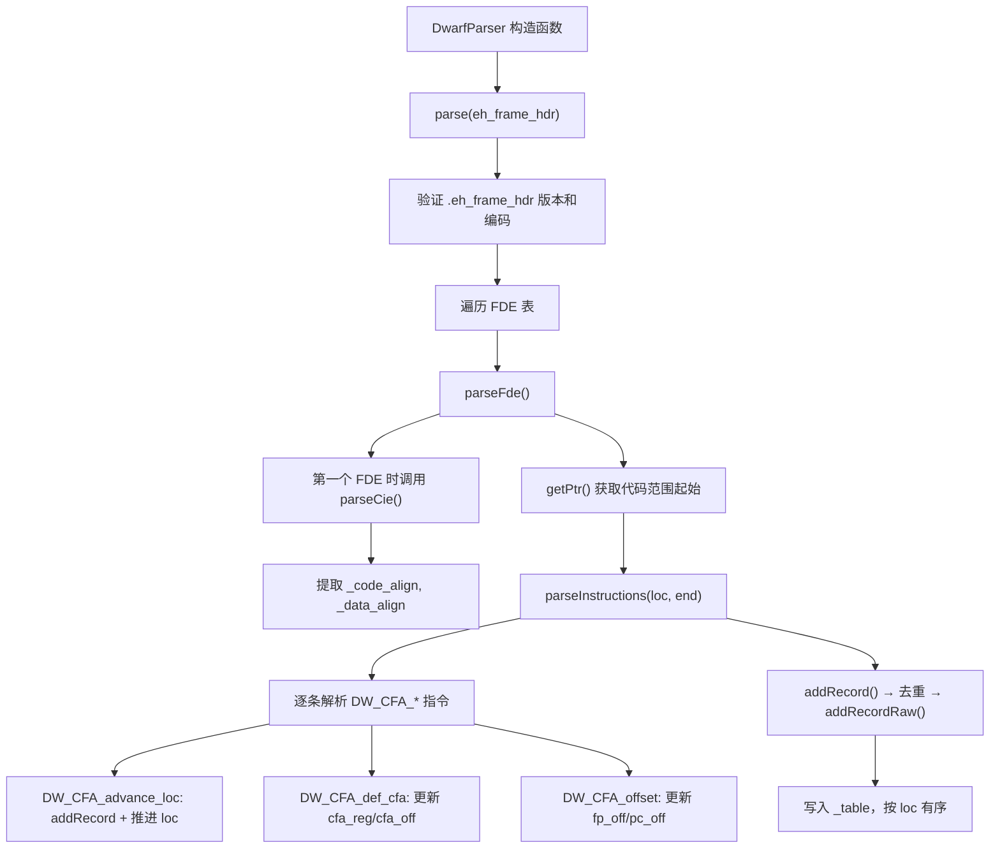
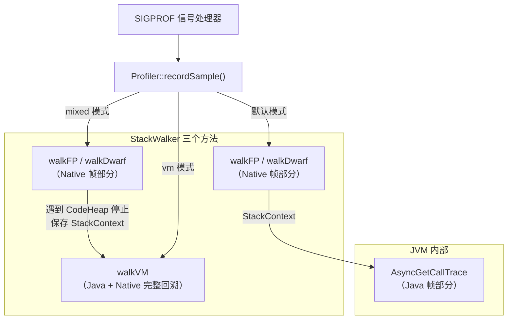
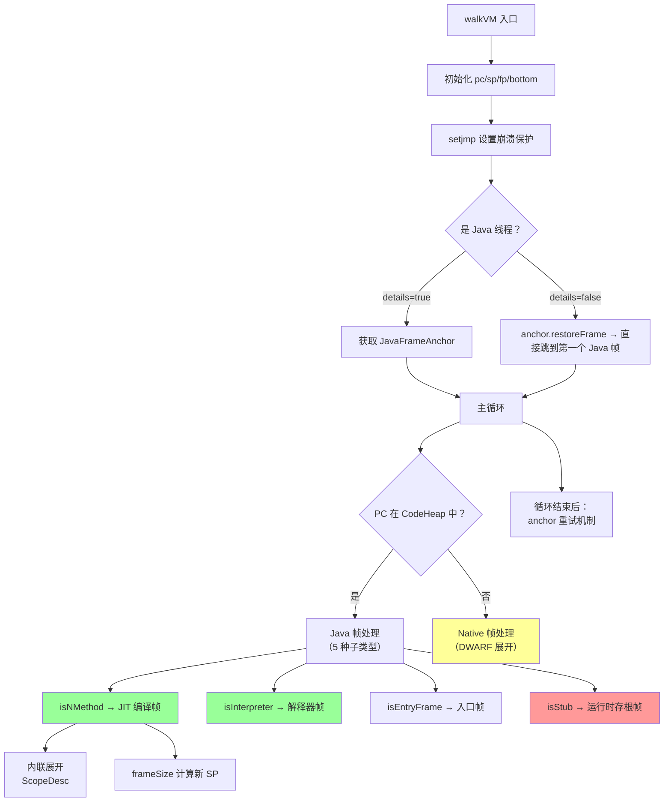
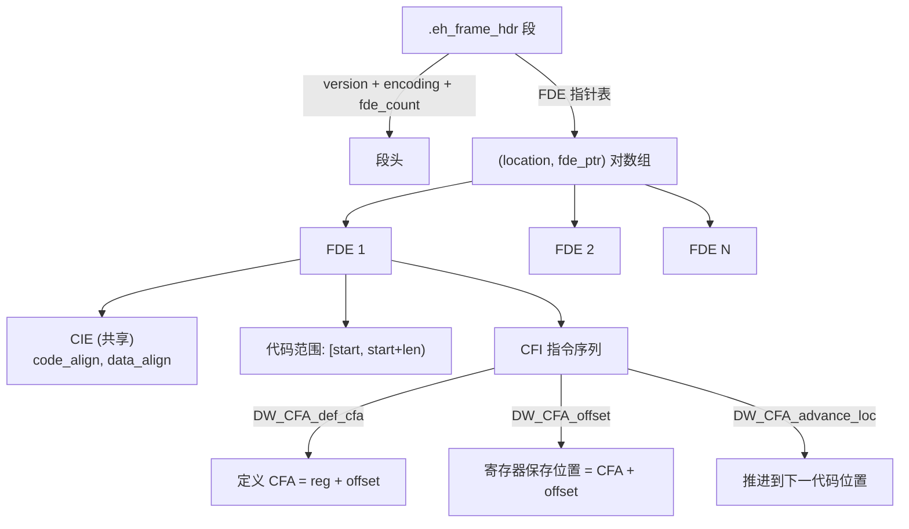
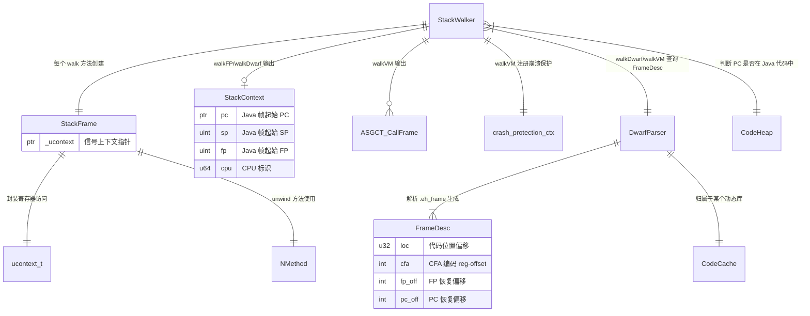

# 第三章：四种栈回溯方法深度对比

> **基于 async-profiler v4.3 + OpenJDK 11 源码分析（纯源码验证，无网络搜索）**
> **标准环境**：`-Xms8g -Xmx8g -XX:+UseG1GC`，G1 Region = 4MB
> **源码路径**：
> - `async-profiler/src/stackWalker.cpp`（513 行，三种栈回溯核心实现）
> - `async-profiler/src/stackFrame.h` / `stackFrame_x64.cpp`（StackFrame 平台抽象层）
> - `async-profiler/src/dwarf.h` / `dwarf.cpp`（DWARF CFI 解析器）
> - `src/hotspot/share/prims/forte.cpp`（AsyncGetCallTrace，666 行）
> **方法论**：程序 = 数据结构 + 算法

---

## 第 0 部分：核心原理

### 0.1 本质是什么？

async-profiler 需要在 SIGPROF 信号处理器中回溯线程的完整调用栈（Java + Native 混合），但没有任何单一方法能处理所有类型的栈帧。因此 async-profiler 实现了四种互补的栈回溯方法，按需组合使用。

### 0.2 为什么需要多种方法？

一个典型的 Java 应用线程的调用栈是**混合栈**：JIT 编译帧、解释器帧、Native 帧、Stub 帧交替出现。每种帧的回溯方式完全不同：

- **JIT 编译帧**：有 `nmethod` 元数据（`frameSize`、`_scopes_data`），可精确计算帧大小和内联方法链
- **解释器帧**：有固定布局（`InterpreterFrame` 偏移），可从栈帧中读取 `Method*` 和 BCP
- **Native 帧**：没有 JVM 元数据，只能依赖 FP 链或 DWARF `.eh_frame` 信息
- **Stub 帧**：JVM 运行时存根，帧格式不确定，需要逐个识别并特殊处理

AsyncGetCallTrace（ASGCT）只能处理 Java 帧，不能处理 Native 帧。如果只用 FP 链回溯，遇到 `-fomit-frame-pointer` 编译的库就会断裂。所以必须组合多种方法。

### 0.3 怎么解决？

async-profiler 提供三个独立的栈回溯函数（`StackWalker` 类），加上 JVM 内置的 `AsyncGetCallTrace`，共四种方法：

1. **`walkFP`**：FP 链式回溯，遍历 Native 帧直到遇到 CodeHeap（Java 代码），速度最快但依赖 FP 链完整
2. **`walkDwarf`**：DWARF CFI 回溯，解析 `.eh_frame` 段获取帧描述信息，不依赖 FP 但稍慢
3. **`walkVM`**：VM 感知回溯，**能同时处理 Java 帧和 Native 帧**，是最完整的方法（内部对 Native 部分复用 DWARF 逻辑）
4. **`AsyncGetCallTrace`**：JVM 内部接口，通过 `vframeStreamForte` 迭代器遍历 Java 帧

实际采样时，调用者根据 `StackWalkFeatures` 配置决定使用哪种组合。默认行为是：先用 `walkFP` 或 `walkDwarf` 回溯 Native 帧，遇到 Java 代码后保存上下文到 `StackContext`，再由 `walkVM` 或 `AsyncGetCallTrace` 接管处理 Java 帧。

### 0.4 为什么这样设计？

**为什么不直接只用 `walkVM`？** `walkVM` 确实是最完整的方法，但它需要获取 `SpinLock`（`lock_index`），只有在成功获取锁时才能调用。在高并发场景下，锁获取失败时需要退化到不需要锁的 `walkFP`/`walkDwarf`。

**为什么 `walkFP` 和 `walkDwarf` 遇到 CodeHeap 就停止？** 这两个方法不理解 JVM 内部帧格式（nmethod、解释器帧等），强行遍历会读取错误的 FP/返回地址。正确做法是把 Java 帧交给 `walkVM` 或 ASGCT 处理。

**为什么 `walkVM` 用 `setjmp/longjmp` 做崩溃保护？** 信号处理器中回溯栈本质上是读取可能已损坏的内存。如果栈被破坏或帧指针无效，解引用会触发 SIGSEGV。`setjmp/longjmp` 提供了一种 async-signal-safe 的恢复机制——`checkFault` 在 SIGSEGV 处理器中搜索最近的 `crash_protection_ctx` 并恢复执行。

---

## 第 1 部分：数据结构全景

### 1.1 数据结构清单

| 结构名 | 源码位置 | 核心作用 |
|--------|----------|----------|
| `StackContext` | `stackWalker.h:17-28` | Native→Java 帧切换时保存的 PC/SP/FP 上下文 |
| `StackFrame` | `stackFrame.h:16-84` | 平台抽象层，封装 `ucontext` 的寄存器访问和帧展开操作 |
| `FrameDesc` | `dwarf.h:69-83` | DWARF CFI 帧描述记录，编码 CFA 规则和寄存器恢复偏移 |
| `DwarfParser` | `dwarf.h:86-171` | DWARF `.eh_frame` 段解析器，生成 `FrameDesc` 表 |
| `StackWalker` | `stackWalker.h:30-38` | 纯静态类，提供 `walkFP`/`walkDwarf`/`walkVM` 三个核心方法 |
| `ASGCT_CallFrame` | `forte.cpp:39-42` | ASGCT 栈帧：BCI + jmethodID（详见第二章） |
| `crash_protection_ctx[]` | `stackWalker.cpp:21` | `jmp_buf` 指针数组，`walkVM` 的 `setjmp/longjmp` 崩溃保护 |

### 1.2 StackContext 详细分析

#### 1.2.1 字段列表

```cpp
// async-profiler/src/stackWalker.h:17-28
struct StackContext {
    const void* pc;   // 程序计数器（PC），指向 CodeHeap 中的 Java 代码
    uintptr_t sp;     // 栈指针（SP）
    uintptr_t fp;     // 帧指针（FP/RBP）
    u64 cpu;          // CPU 标识（多核场景下记录采样发生在哪个 CPU）

    void set(const void* pc, uintptr_t sp, uintptr_t fp) {
        this->pc = pc;
        this->sp = sp;
        this->fp = fp;
    }
};
```

#### 1.2.2 sizeof 与内存布局

```
StackContext (sizeof = 32 bytes, x86_64)
偏移      字段名    大小    含义
────────────────────────────────
0x00    pc        8B    程序计数器
0x08    sp        8B    栈指针
0x10    fp        8B    帧指针
0x18    cpu       8B    CPU 标识
────────────────────────────────
Total: 32 bytes（无填充，全部 8 字节对齐）
```

#### 1.2.3 创建位置

- **创建者**：`Profiler::recordSample()` 在栈上创建，传给 `walkFP`/`walkDwarf`
- **时机**：每次采样信号触发时

#### 1.2.4 关键字段生命周期

- **`pc/sp/fp`**：由 `walkFP` 或 `walkDwarf` 在发现 `CodeHeap::contains(pc)` 为 true 时通过 `set()` 写入。随后上层代码读取这三个值，传给 `walkVM` 或 `AsyncGetCallTrace` 作为 Java 帧回溯的起点。
- **`cpu`**：由上层代码在采样信号处理器中设置，用于多 CPU 场景下的精确归属。

### 1.3 StackFrame 详细分析

#### 1.3.1 字段列表

```cpp
// async-profiler/src/stackFrame.h:16-84
class StackFrame {
  private:
    ucontext_t* _ucontext;  // 唯一字段：指向信号上下文

  public:
    StackFrame(void* ucontext) { _ucontext = (ucontext_t*)ucontext; }

    // 寄存器访问器（平台相关实现）
    uintptr_t& pc();        // x86_64: RIP
    uintptr_t& sp();        // x86_64: RSP
    uintptr_t& fp();        // x86_64: RBP
    uintptr_t& retval();    // x86_64: RAX
    uintptr_t link();       // x86_64: 返回 0（无链接寄存器）
    uintptr_t arg0();       // x86_64: RDI（System V ABI 第 1 个参数）
    uintptr_t arg1();       // x86_64: RSI
    uintptr_t arg2();       // x86_64: RDX
    uintptr_t arg3();       // x86_64: RCX
    uintptr_t jarg0();      // x86_64: RSI = arg1（Java 调用约定第 1 个参数）
    uintptr_t method();     // x86_64: RBX（HotSpot 解释器的 Method* 寄存器）
    uintptr_t senderSP();   // x86_64: R13（HotSpot 解释器的 sender SP 寄存器）

    // 帧展开方法
    bool unwindStub(instruction_t* entry, const char* name, uintptr_t& pc, uintptr_t& sp, uintptr_t& fp);
    bool unwindCompiled(NMethod* nm, uintptr_t& pc, uintptr_t& sp, uintptr_t& fp);
    bool unwindPrologue(NMethod* nm, uintptr_t& pc, uintptr_t& sp, uintptr_t& fp);
    bool unwindEpilogue(NMethod* nm, uintptr_t& pc, uintptr_t& sp, uintptr_t& fp);
    bool unwindAtomicStub(const void*& pc);
    void adjustSP(const void* entry, const void* pc, uintptr_t& sp);

    // 故障处理
    bool skipFaultInstruction();
    bool checkInterruptedSyscall();
    static bool isSyscall(instruction_t* pc);
};
```

#### 1.3.2 sizeof 与内存布局

```
StackFrame (sizeof = 8 bytes, x86_64)
偏移      字段名       大小    含义
────────────────────────────────────
0x00    _ucontext    8B    指向 ucontext_t 的指针
────────────────────────────────────
Total: 8 bytes
```

`StackFrame` 本身极轻量，只保存一个指针。实际的寄存器数据存在 `ucontext_t` 中（内核在信号处理时保存到用户栈上），`StackFrame` 只是提供平台无关的访问接口。

#### 1.3.3 创建位置

- **创建者**：`walkFP`（第 71 行）、`walkDwarf`（第 121 行）、`walkVM`（第 212 行）
- **时机**：每个栈回溯函数的入口处，从传入的 `ucontext` 指针构造
- **生命周期**：栈上对象，函数返回即销毁

#### 1.3.4 x86_64 寄存器映射（关键设计）

```cpp
// async-profiler/src/stackFrame_x64.cpp:15-18
#ifdef __APPLE__
#  define REG(l, m)  _ucontext->uc_mcontext->__ss.__##m
#else
#  define REG(l, m)  _ucontext->uc_mcontext.gregs[REG_##l]
#endif
```

| 方法 | Linux 寄存器 | macOS 寄存器 | 用途 |
|------|-------------|-------------|------|
| `pc()` | `gregs[REG_RIP]` | `__rip` | 程序计数器 |
| `sp()` | `gregs[REG_RSP]` | `__rsp` | 栈指针 |
| `fp()` | `gregs[REG_RBP]` | `__rbp` | 帧指针 |
| `retval()` | `gregs[REG_RAX]` | `__rax` | 返回值 |
| `method()` | `gregs[REG_RBX]` | `__rbx` | HotSpot Method* |
| `senderSP()` | `gregs[REG_R13]` | `__r13` | HotSpot sender SP |
| `jarg0()` | `gregs[REG_RSI]` | `__rsi` | Java 第 1 个参数 |

**为什么 `jarg0()` 是 `arg1()`（RSI）而不是 `arg0()`（RDI）？** HotSpot 解释器的 Java 调用约定中，RDI 存放的是 `JavaThread*`，RSI 才是第一个 Java 参数（receiver/this）。

### 1.4 FrameDesc 详细分析

#### 1.4.1 字段列表

```cpp
// async-profiler/src/dwarf.h:69-83
struct FrameDesc {
    u32 loc;     // 代码位置（相对于 image base 的偏移），用于二分查找
    int cfa;     // CFA 编码：低 8 位 = 寄存器编号，高 24 位 = 偏移量
    int fp_off;  // FP 恢复偏移（相对于 CFA），或 DW_SAME_FP/DW_PC_OFFSET 特殊标记
    int pc_off;  // PC（返回地址）恢复偏移（相对于 CFA），或 DW_LINK_REGISTER

    static FrameDesc empty_frame;    // 空帧描述（无 FP 保存）
    static FrameDesc default_frame;  // 默认帧描述（标准 push rbp; mov rbp,rsp 帧）

    static int comparator(const void* p1, const void* p2);  // 按 loc 排序，用于 bsearch
};
```

#### 1.4.2 sizeof 与内存布局

```
FrameDesc (sizeof = 16 bytes)
偏移      字段名    大小    含义
────────────────────────────────
0x00    loc       4B    代码位置偏移
0x04    cfa       4B    CFA 编码（reg | offset << 8）
0x08    fp_off    4B    FP 恢复偏移
0x0C    pc_off    4B    PC 恢复偏移
────────────────────────────────
Total: 16 bytes（紧凑布局，无填充）
```

#### 1.4.3 创建位置

- **创建者**：`DwarfParser::addRecordRaw()`（`dwarf.cpp:345-357`）
- **时机**：Agent 加载时解析 `.eh_frame_hdr` 段，为每个 FDE（Frame Description Entry）中的代码位置变化点生成一条 `FrameDesc` 记录
- **存储位置**：`DwarfParser::_table` 动态数组（初始容量 128，翻倍扩容）

#### 1.4.4 CFA 编码详解

`cfa` 字段是一个紧凑的 4 字节编码：

```
┌──────────────────────────────────┐
│ cfa (int, 4 bytes)               │
├──────────┬───────────────────────┤
│ 低 8 位  │ 高 24 位              │
│ 寄存器号 │ 偏移量                │
├──────────┼───────────────────────┤
│ 7 (SP)   │ offset → SP + offset  │
│ 6 (FP)   │ offset → FP + offset  │
│ 128(PLT) │ offset → PLT 特殊规则 │
│ 255      │ 不支持                │
└──────────┴───────────────────────┘
```

- **编码方式**：`cfa = cfa_reg | (cfa_off << 8)`
- **解码方式**：`cfa_reg = (u8)f->cfa; cfa_off = f->cfa >> 8;`
- **SP 基址**（最常见）：`new_sp = sp + cfa_off`
- **FP 基址**：`new_sp = fp + cfa_off`（用于 `push rbp; mov rbp, rsp` 帧）
- **PLT 特殊**：`sp += ((uintptr_t)pc & 15) >= 11 ? cfa_off * 2 : cfa_off`（PLT 入口有两种帧大小）

#### 1.4.5 静态实例（x86_64）

```cpp
// async-profiler/src/dwarf.cpp:58-59
FrameDesc FrameDesc::empty_frame = {
    0,
    DW_REG_SP | EMPTY_FRAME_SIZE << 8,  // CFA = RSP + 8（只有返回地址在栈上）
    DW_SAME_FP,                          // FP 未保存
    INITIAL_PC_OFFSET                    // PC 在 RSP - 8 处（= 栈顶）
};

FrameDesc FrameDesc::default_frame = {
    0,
    DW_REG_FP | LINKED_FRAME_SIZE << 8, // CFA = RBP + 16（标准帧：saved RBP + return addr）
    -LINKED_FRAME_SIZE,                  // FP 保存在 CFA - 16 处
    -LINKED_FRAME_SIZE + DW_STACK_SLOT   // PC 保存在 CFA - 8 处
};
```

`empty_frame` 用于叶子函数（没有 `push rbp`），`default_frame` 用于标准帧函数（`push rbp; mov rbp, rsp`）。当 `findFrameDesc` 找不到匹配的 FDE 时，退化为 `default_frame`。

### 1.5 DwarfParser 详细分析

#### 1.5.1 字段列表

```cpp
// async-profiler/src/dwarf.h:86-171
class DwarfParser {
  private:
    const char* _name;        // 库名（用于日志）
    const char* _image_base;  // 库的映像基址（ELF 加载地址）
    const char* _ptr;         // 当前解析位置指针

    int _capacity;            // FrameDesc 表容量
    int _count;               // FrameDesc 表当前条目数
    FrameDesc* _table;        // FrameDesc 表指针（malloc 分配，动态扩容）
    FrameDesc* _prev;         // 上一条记录指针（用于去重优化）

    u32 _code_align;          // CIE 中的代码对齐因子（x86_64 = 1）
    int _data_align;          // CIE 中的数据对齐因子（x86_64 = -8）
};
```

#### 1.5.2 sizeof

`DwarfParser` 的确切大小取决于指针对齐，约 72 字节（9 个字段 × 8 字节平均）。作为解析器对象，每个动态库创建一个实例。

#### 1.5.3 创建位置

- **创建者**：`CodeCache` 在加载动态库时创建
- **时机**：`Profiler` 初始化期间扫描 `/proc/self/maps`，对每个有 `.eh_frame_hdr` 段的动态库调用 `DwarfParser` 构造函数
- **构造函数逻辑**：初始化表容量为 128，然后调用 `parse(eh_frame_hdr)` 解析整个 `.eh_frame_hdr` 段

#### 1.5.4 DWARF 解析流程



### 1.6 crash_protection_ctx（崩溃保护）

```cpp
// async-profiler/src/stackWalker.cpp:21
static jmp_buf* crash_protection_ctx[CONCURRENCY_LEVEL];
```

- **类型**：`jmp_buf*` 数组，大小为 `CONCURRENCY_LEVEL`（通常为 16）
- **用途**：每个 `walkVM` 调用在 `crash_protection_ctx[lock_index]` 中注册一个 `jmp_buf`。如果回溯过程中触发 SIGSEGV，`checkFault()` 搜索当前线程栈上最近的 `jmp_buf`，调用 `longjmp` 恢复
- **并发安全**：不同线程使用不同的 `lock_index`，互不干扰

---

## 第 2 部分：算法/流程分析

### 2.1 总体架构与调用关系



### 2.2 算法 1：walkFP — FP 链式回溯

#### 2.2.1 解决什么问题？

快速回溯 Native 帧的调用链，直到遇到 JVM CodeHeap 中的 Java 代码。

#### 2.2.2 函数签名与位置

```cpp
// async-profiler/src/stackWalker.cpp:65-113
int StackWalker::walkFP(void* ucontext, const void** callchain, int max_depth, StackContext* java_ctx);
```

- **输入**：`ucontext`（信号上下文）、`callchain`（输出数组）、`max_depth`、`java_ctx`（输出：Java 帧起点）
- **输出**：`callchain` 中的 Native 帧 PC 地址数组 + `java_ctx` 中的 Java 帧起始上下文
- **返回值**：回溯到的 Native 帧深度

#### 2.2.3 核心源码 + 逐行注释

```cpp
// stackWalker.cpp:65-113
int StackWalker::walkFP(void* ucontext, const void** callchain, int max_depth, StackContext* java_ctx) {
    const void* pc;
    uintptr_t fp;
    uintptr_t sp;
    uintptr_t bottom = (uintptr_t)&sp + MAX_WALK_SIZE;  // ★ 栈底限制：当前 SP + 1MB

    StackFrame frame(ucontext);
    if (ucontext == NULL) {
        // ★ 非信号上下文调用（如手动触发），使用编译器内置获取调用者寄存器
        pc = callerPC();
        fp = (uintptr_t)callerFP();
        sp = (uintptr_t)callerSP();
    } else {
        // ★ 从信号上下文提取被中断时刻的寄存器
        pc = (const void*)frame.pc();
        fp = frame.fp();
        sp = frame.sp();
    }

    int depth = 0;

    while (depth < max_depth) {
        if (CodeHeap::contains(pc) && !(depth == 0 && frame.unwindAtomicStub(pc))) {
            // ★ PC 在 JVM CodeHeap 中 → 遇到 Java 帧，保存上下文并停止
            // 第一帧如果是 atomic stub（CAS 指令），需要先展开（unwindAtomicStub）
            java_ctx->set(pc, sp, fp);
            break;
        }

        callchain[depth++] = pc;  // ★ 记录当前 Native 帧的 PC

        // ★ 安全检查 1：FP 必须在 [SP, SP + MAX_FRAME_SIZE) 范围内且不超过栈底
        // MAX_FRAME_SIZE = 0x40000 (256KB)，单帧不可能这么大
        if (fp < sp || fp >= sp + MAX_FRAME_SIZE || fp >= bottom) {
            break;
        }

        // ★ 安全检查 2：FP 必须字对齐（x86_64 为 8 字节对齐）
        if (!aligned(fp)) {
            break;
        }

        // ★ 经典 FP 链遍历：
        // fp[FRAME_PC_SLOT] = 返回地址（x86_64: fp+8 处，即 fp[1]）
        // *fp = 上一帧的 FP
        pc = stripPointer(SafeAccess::load((void**)fp + FRAME_PC_SLOT));
        if (inDeadZone(pc)) {
            break;  // ★ PC 在地址空间两端的死区（< 0x1000 或 > -0x1000），非法
        }

        sp = fp + (FRAME_PC_SLOT + 1) * sizeof(void*);  // ★ 新 SP = 旧 FP + 16
        fp = *(uintptr_t*)fp;                            // ★ 新 FP = *旧 FP（FP 链）
    }

    return depth;
}
```

#### 2.2.4 设计决策

**为什么用 `SafeAccess::load` 而不是直接解引用？** 信号处理器中 FP 可能指向无效内存。`SafeAccess::load` 使用 `__attribute__((may_alias))` 加内联汇编实现安全内存访问，在某些平台上配合 fault handler 使用。

**为什么检查 `inDeadZone(pc)`？** 地址空间两端（0 附近和 -1 附近）是无效区域。如果从栈上读到的"返回地址"在这个范围内，说明 FP 链已经损坏或到达栈底。

**为什么 `fp < sp` 要中断？** 栈从高地址向低地址增长，上一帧的 FP 必须大于当前 SP。如果 FP < SP，说明 FP 链指向了栈的下方（已使用区域），要么是 FP 被优化掉了，要么是栈损坏。

### 2.3 算法 2：walkDwarf — DWARF CFI 回溯

#### 2.3.1 解决什么问题？

在没有 FP 链（`-fomit-frame-pointer`）的情况下，通过 `.eh_frame` 段中的 DWARF CFI 信息回溯 Native 帧。

#### 2.3.2 函数签名与位置

```cpp
// async-profiler/src/stackWalker.cpp:115-203
int StackWalker::walkDwarf(void* ucontext, const void** callchain, int max_depth, StackContext* java_ctx);
```

#### 2.3.3 核心源码 + 逐行注释

```cpp
// stackWalker.cpp:115-203（省略与 walkFP 相同的初始化部分）
int StackWalker::walkDwarf(void* ucontext, const void** callchain, int max_depth, StackContext* java_ctx) {
    // ... 初始化 pc/fp/sp/bottom（同 walkFP）...

    int depth = 0;
    Profiler* profiler = Profiler::instance();

    while (depth < max_depth) {
        if (CodeHeap::contains(pc) && !(depth == 0 && frame.unwindAtomicStub(pc))) {
            java_ctx->set(pc, sp, fp);  // ★ 遇到 Java 帧，保存上下文并停止
            break;
        }

        callchain[depth++] = pc;

        uintptr_t prev_sp = sp;
        // ★ 核心差异：查找当前 PC 对应的 FrameDesc
        CodeCache* cc = profiler->findLibraryByAddress(pc);
        FrameDesc* f = cc != NULL ? cc->findFrameDesc(pc) : &FrameDesc::default_frame;
        // findFrameDesc 内部对 _table 做二分查找（bsearch），O(log n) 时间

        // ★ 根据 FrameDesc 的 CFA 编码计算新的 SP
        u8 cfa_reg = (u8)f->cfa;   // 低 8 位：寄存器编号
        int cfa_off = f->cfa >> 8;  // 高 24 位：偏移量
        if (cfa_reg == DW_REG_SP) {
            sp = sp + cfa_off;       // ★ 最常见：CFA = RSP + offset
        } else if (cfa_reg == DW_REG_FP) {
            sp = fp + cfa_off;       // ★ push rbp; mov rbp,rsp 帧：CFA = RBP + offset
        } else if (cfa_reg == DW_REG_PLT) {
            // ★ PLT 入口特殊处理：前 11 字节和后面的帧大小不同
            sp += ((uintptr_t)pc & 15) >= 11 ? cfa_off * 2 : cfa_off;
        } else {
            break;  // 不支持的 CFA 寄存器
        }

        // ★ 安全检查：新 SP 必须在旧 SP 之上且在栈范围内
        if (sp < prev_sp || sp >= prev_sp + MAX_FRAME_SIZE || sp >= bottom) {
            break;
        }
        if (!aligned(sp)) {
            break;
        }

        const void* prev_pc = pc;
        if (f->fp_off & DW_PC_OFFSET) {
            // ★ PC 相对偏移恢复（DW_CFA_val_expression 产生的特殊编码）
            pc = (const char*)pc + (f->fp_off >> 1);
        } else {
            // ★ 恢复 FP（如果帧中保存了 FP）
            if (f->fp_off != DW_SAME_FP && f->fp_off < MAX_FRAME_SIZE && f->fp_off > -MAX_FRAME_SIZE) {
                fp = (uintptr_t)SafeAccess::load((void**)(sp + f->fp_off));
            }

            // ★ 恢复 PC（返回地址）
            if (EMPTY_FRAME_SIZE > 0 || f->pc_off != DW_LINK_REGISTER) {
                pc = stripPointer(SafeAccess::load((void**)(sp + f->pc_off)));
                // x86_64: EMPTY_FRAME_SIZE = 8，总是走这条路径
                // 从 sp + pc_off 处加载返回地址
            } else if (depth == 1) {
                pc = (const void*)frame.link();  // AArch64: 使用链接寄存器
            } else {
                break;
            }

            // AArch64 default_frame 的特殊处理（x86_64 不执行）
            if (EMPTY_FRAME_SIZE == 0 && cfa_off == 0 && f->fp_off != DW_SAME_FP) {
                sp = defaultSenderSP(sp, fp);
                if (sp < prev_sp || sp >= bottom || !aligned(sp)) {
                    break;
                }
            }
        }

        // ★ 防止无限循环：PC 和 SP 都没变化说明卡住了
        if (inDeadZone(pc) || (pc == prev_pc && sp == prev_sp)) {
            break;
        }
    }

    return depth;
}
```

#### 2.3.4 设计决策

**为什么用 `FrameDesc` 表而不是运行时解析 DWARF 指令？** 运行时解析太慢（DWARF 指令集是一个虚拟机），而且信号处理器中不能分配内存。`DwarfParser` 在 Agent 加载时一次性解析所有 `.eh_frame` 数据，生成紧凑的 `FrameDesc` 表（16 字节/条目），运行时只需二分查找。

**为什么退化到 `default_frame`（找不到 `FrameDesc` 时）？** `default_frame` 假设标准的 `push rbp; mov rbp, rsp` 帧布局。大部分没有 `.eh_frame` 信息的代码（如旧版 JVM 生成的 stub）使用标准帧，退化到 `default_frame` 通常能正确回溯。

### 2.4 算法 3：walkVM — VM 感知完整回溯

#### 2.4.1 解决什么问题？

这是 async-profiler 最核心的栈回溯方法。它**能同时处理 Java 帧和 Native 帧**，输出完整的 `ASGCT_CallFrame` 数组（包含帧类型、BCI、方法 ID）。是唯一一个能展开内联方法、识别 C1/C2 编译级别、处理 Stub 帧的方法。

#### 2.4.2 函数签名与位置

```cpp
// async-profiler/src/stackWalker.cpp:205-491
int StackWalker::walkVM(void* ucontext, ASGCT_CallFrame* frames, int max_depth, int lock_index,
                        StackWalkFeatures features, EventType event_type);
```

- **输入**：`ucontext`、`frames`（输出数组）、`max_depth`、`lock_index`（崩溃保护槽位）、`features`（栈回溯特性开关）、`event_type`
- **输出**：`frames` 中的 `ASGCT_CallFrame` 数组
- **返回值**：回溯到的帧深度

#### 2.4.3 总体流程分阶段

由于 `walkVM` 长达 286 行，按阶段分解：



#### 2.4.4 阶段 1：初始化与崩溃保护（第 205-238 行）

```cpp
// stackWalker.cpp:226-238
jmp_buf current_ctx;
crash_protection_ctx[lock_index] = &current_ctx;  // ★ 注册崩溃保护上下文

volatile int depth = 0;  // ★ volatile：setjmp/longjmp 要求保留变量

if (setjmp(current_ctx) != 0) {
    // ★ 从 SIGSEGV 恢复到这里（longjmp 的目标）
    crash_protection_ctx[lock_index] = NULL;
    if (depth < max_depth) {
        fillFrame(frames[depth++], BCI_ERROR, "break_not_walkable");  // ★ 标记错误帧
    }
    return depth;  // ★ 返回已收集的帧
}
```

**为什么 `depth` 是 `volatile`？** C 标准要求 `setjmp/longjmp` 之间修改的局部变量必须是 `volatile`，否则 `longjmp` 后变量值未定义。

#### 2.4.5 阶段 2：JavaFrameAnchor 获取（第 243-253 行）

```cpp
// stackWalker.cpp:243-253
JavaFrameAnchor* anchor = NULL;
VMThread* vm_thread = VMThread::current();
if (vm_thread != NULL && vm_thread->isJavaThread()) {
    if (details) {
        anchor = vm_thread->anchor();  // ★ 详细模式：保存 anchor 备用
    } else if (!vm_thread->anchor()->restoreFrame(pc, sp, fp)) {
        return 0;  // ★ 简单模式（如 alloc profiling）：直接跳到第一个 Java 帧
    }
}
```

**`JavaFrameAnchor` 是什么？** 每个 Java 线程在从 Java 代码切换到 Native 代码时，会在 `_anchor` 字段中保存最后一个 Java 帧的 PC/SP/FP。这是从 Native 帧回到 Java 帧的可靠入口。

#### 2.4.6 阶段 3A：JIT 编译帧处理（第 286-322 行）

```cpp
// stackWalker.cpp:286-322
if (nm->isNMethod()) {
    int level = nm->level();
    // ★ 识别编译级别：level 1-3 = C1 编译，其他 = C2/JIT 编译
    FrameTypeId type = details && level >= 1 && level <= 3 ? FRAME_C1_COMPILED : FRAME_JIT_COMPILED;
    fillFrame(frames[depth++], type, 0, nm->method()->id());

    if (nm->isFrameCompleteAt(pc)) {
        // ★ 帧已完整构造（prologue 执行完毕）
        if (depth == 1 && frame.unwindEpilogue(nm, (uintptr_t&)pc, sp, fp)) {
            continue;  // ★ 在 epilogue 中被中断，特殊展开
        }

        // ★ 内联方法展开：从 nmethod 的 _scopes_data 中提取内联链
        int scope_offset = nm->findScopeOffset(pc);
        if (scope_offset > 0) {
            depth--;  // ★ 回退刚填入的帧，用内联链替换
            ScopeDesc scope(nm);
            do {
                scope_offset = scope.decode(scope_offset);
                if (details) {
                    type = scope_offset > 0 ? FRAME_INLINED :  // ★ 中间层 = 内联帧
                           level >= 1 && level <= 3 ? FRAME_C1_COMPILED : FRAME_JIT_COMPILED;
                }
                fillFrame(frames[depth++], type, scope.bci(), scope.method()->id());
            } while (scope_offset > 0 && depth < max_depth);
        }

        // ★ 通过 frameSize 计算新 SP（精确已知帧大小）
        frame.adjustSP(nm->entry(), pc, sp);
        sp += nm->frameSize() * sizeof(void*);
        fp = ((uintptr_t*)sp)[-FRAME_PC_SLOT - 1];  // ★ 从新 SP 恢复 FP
        pc = ((const void**)sp)[-FRAME_PC_SLOT];     // ★ 从新 SP 恢复返回地址
        continue;
    } else if (frame.unwindPrologue(nm, (uintptr_t&)pc, sp, fp)) {
        continue;  // ★ 在 prologue 中被中断，特殊展开
    }

    fillFrame(frames[depth++], BCI_ERROR, "break_compiled");
    break;
}
```

**内联展开**是 `walkVM` 相比 `AsyncGetCallTrace` 的一个关键优势：JIT 编译器将多个方法内联到一个 nmethod 中，`ScopeDesc` 记录了每个 PC 位置的完整内联链（从最外层到最内层），`walkVM` 逐个展开并标记 `FRAME_INLINED` 类型。

#### 2.4.7 阶段 3B：解释器帧处理（第 323-368 行）

```cpp
// stackWalker.cpp:323-368
} else if (nm->isInterpreter()) {
    if (vm_thread != NULL && vm_thread->inDeopt()) {
        fillFrame(frames[depth++], BCI_ERROR, "break_deopt");
        break;  // ★ 去优化过程中栈不稳定，放弃
    }

    // ★ 验证 FP 是否指向合理的解释器帧
    bool is_plausible_interpreter_frame = !inDeadZone((const void*)fp) && aligned(fp)
        && sp > fp - MAX_INTERPRETER_FRAME_SIZE   // ★ SP 不能离 FP 太远
        && sp < fp + bcp_offset * sizeof(void*);  // ★ SP 不能超过 BCP 位置

    if (is_plausible_interpreter_frame) {
        // ★ 从帧中读取 Method*（FP + method_offset 处）
        VMMethod* method = ((VMMethod**)fp)[InterpreterFrame::method_offset];
        jmethodID method_id = getMethodId(method);
        if (method_id != NULL) {
            // ★ 计算 BCI：BCP（字节码指针）- bytecode_start
            const char* bytecode_start = method->bytecode();
            const char* bcp = ((const char**)fp)[bcp_offset];
            int bci = bytecode_start == NULL || bcp < bytecode_start ? 0 : bcp - bytecode_start;
            fillFrame(frames[depth++], FRAME_INTERPRETED, bci, method_id);

            // ★ 从帧中恢复上一帧的 SP/PC/FP
            sp = ((uintptr_t*)fp)[InterpreterFrame::sender_sp_offset];
            pc = stripPointer(((void**)fp)[FRAME_PC_SLOT]);
            fp = *(uintptr_t*)fp;
            continue;
        }
    }

    // ★ 第一帧特殊处理：FP 可能还没设好，从寄存器直接读 Method*
    if (depth == 0) {
        VMMethod* method = (VMMethod*)frame.method();  // ★ 从 RBX 读取
        jmethodID method_id = getMethodId(method);
        if (method_id != NULL) {
            fillFrame(frames[depth++], FRAME_INTERPRETED, 0, method_id);
            // ... 恢复上一帧 ...
            continue;
        }
    }
    // 都失败了 → 错误帧
    fillFrame(frames[depth++], BCI_ERROR, "break_interpreted");
    break;
}
```

#### 2.4.8 阶段 3C：Native 帧处理（第 409-477 行）

当 PC 不在 CodeHeap 中时，进入 Native 帧处理。**核心逻辑与 `walkDwarf` 完全相同**：查找 `FrameDesc`，根据 CFA 编码计算新 SP，恢复 FP 和 PC。

```cpp
// stackWalker.cpp:409-477（简化）
} else {
    // ★ 识别特殊标记的 Native 方法
    const char* method_name = profiler->findNativeMethod(pc);
    char mark;
    if (method_name != NULL && (mark = NativeFunc::mark(method_name)) != 0) {
        if (mark == MARK_ASYNC_PROFILER && (event_type == MALLOC_SAMPLE || ...)) {
            depth = 0;  // ★ async-profiler 自身的 hook 函数，清除已收集的内部帧
        } else if (mark == MARK_COMPILER_ENTRY && features.comp_task && vm_thread != NULL) {
            // ★ 编译线程：插入当前正在编译的方法作为伪 Java 帧
            VMMethod* method = vm_thread->compiledMethod();
            // ...
        }
    }
    fillFrame(frames[depth++], BCI_NATIVE_FRAME, method_name);
}

// ★ 以下逻辑与 walkDwarf 完全相同：DWARF CFI 展开
CodeCache* cc = profiler->findLibraryByAddress(pc);
FrameDesc* f = cc != NULL ? cc->findFrameDesc(pc) : &FrameDesc::default_frame;
// ... CFA 计算、安全检查、PC/FP 恢复 ...
```

**为什么 `walkVM` 中的 Native 帧处理复用了 DWARF 逻辑而不用 FP 链？** 因为 `walkVM` 要处理所有场景，包括 `-fomit-frame-pointer` 编译的 Native 代码。DWARF 是更通用的方法。

#### 2.4.9 阶段 4：Anchor 重试机制（第 480-486 行）

```cpp
// stackWalker.cpp:480-486
// ★ 如果遍历完所有帧都没遇到 Java 帧，但有 JavaFrameAnchor，从 anchor 重试
if (anchor != NULL && anchor->getFrame(pc, sp, fp)) {
    anchor = NULL;
    while (depth > 0 && frames[depth - 1].method_id == NULL) depth--;  // ★ 弹出未知帧
    goto unwind_loop;  // ★ 跳回主循环重新开始
}
```

这解决了一个常见场景：线程在 Native 代码中被中断，FP 链可能无法一直回溯到 Java 帧。但 `JavaFrameAnchor` 记录了最后一个 Java 帧的精确位置，可以直接跳转过去。

### 2.5 算法 4：AsyncGetCallTrace（详见第二章）

此处仅概述与其他三种方法的关键差异：

| 维度 | walkFP | walkDwarf | walkVM | AsyncGetCallTrace |
|------|--------|-----------|--------|-------------------|
| **实现位置** | async-profiler | async-profiler | async-profiler | HotSpot JVM (forte.cpp) |
| **Java 帧** | ✗（遇到就停） | ✗（遇到就停） | ✓（完整处理） | ✓（通过 vframeStreamForte） |
| **Native 帧** | ✓（FP 链） | ✓（DWARF CFI） | ✓（DWARF CFI） | ✗（返回错误码） |
| **内联展开** | N/A | N/A | ✓（ScopeDesc） | ✓（vframeStream 自动处理） |
| **Stub 帧** | ✗ | ✗ | ✓（逐个识别） | ✗（跳过或错误） |
| **帧类型识别** | 无 | 无 | ✓（C1/C2/Inlined/Interpreted） | 无（只有 Java 帧） |
| **崩溃保护** | 无 | 无 | setjmp/longjmp | JVM 内部保护 |
| **性能开销** | 最低 | 中等 | 最高 | 中等 |
| **依赖** | FP 链完整 | .eh_frame 段 | VMStructs 偏移量 | JVM 内部接口 |

### 2.6 walkVM 中的帧展开辅助函数

`walkVM` 在处理 JIT 编译帧时调用 `StackFrame` 的展开方法。以 x86_64 平台为例：

#### 2.6.1 unwindEpilogue（处理函数尾声）

```cpp
// stackFrame_x64.cpp:222-239
bool StackFrame::unwindEpilogue(NMethod* nm, uintptr_t& pc, uintptr_t& sp, uintptr_t& fp) {
    instruction_t* ip = (instruction_t*)pc;
    if (*ip == 0xc3 || isPollReturn(ip)) {    // ★ ret 指令或 poll return
        pc = ((uintptr_t*)sp)[0] - 1;         // ★ 返回地址在栈顶，-1 指向 call 指令
        sp += 8;                               // ★ pop 返回地址
        return true;
    } else if (*ip == 0x5d) {                  // ★ pop rbp
        fp = ((uintptr_t*)sp)[0];              // ★ 栈顶是 saved RBP
        pc = ((uintptr_t*)sp)[1] - 1;          // ★ 栈顶+8 是返回地址
        sp += 16;                              // ★ pop rbp + pop ret addr
        return true;
    }
    return false;
}
```

**为什么 PC 要减 1？** 调用者的 `call` 指令后紧接着是下一条指令的地址。但我们想把 PC 归属到 `call` 指令本身（即"是这行代码调用了那个方法"）。减 1 使 PC 指向 `call` 指令内部，后续符号解析会正确归属。

#### 2.6.2 unwindPrologue（处理函数序言）

```cpp
// stackFrame_x64.cpp:159-181
bool StackFrame::unwindPrologue(NMethod* nm, uintptr_t& pc, uintptr_t& sp, uintptr_t& fp) {
    instruction_t* ip = (instruction_t*)pc;
    instruction_t* entry = (instruction_t*)nm->entry();
    if (ip <= entry || *ip == 0x55 || nm->frameSize() == 0) {
        // ★ 在 push rbp 之前或正在执行 push rbp：返回地址在栈顶
        pc = ((uintptr_t*)sp)[0] - 1;
        sp += 8;
        return true;
    } else if (ip <= entry + 15 && ip[-1] == 0x55) {
        // ★ push rbp 刚执行完：返回地址在栈顶+8
        pc = ((uintptr_t*)sp)[1] - 1;
        sp += 16;
        return true;
    } else if (ip <= entry + 31 && isFrameComplete(entry, ip)) {
        // ★ sub rsp 已执行，帧完整：用 frameSize 展开
        sp += nm->frameSize() * sizeof(void*);
        fp = ((uintptr_t*)sp)[-2];
        pc = ((uintptr_t*)sp)[-1];
        return true;
    }
    return false;
}
```

#### 2.6.3 checkFault（崩溃恢复）

```cpp
// stackWalker.cpp:493-512
void StackWalker::checkFault() {
    // ★ 搜索当前线程栈上最近的 crash_protection_ctx
    jmp_buf* nearest_ctx = NULL;
    uintptr_t stack_distance = 32768;  // ★ 最大允许的栈距离
    const uintptr_t current_sp = (uintptr_t)&nearest_ctx;

    for (int i = 0; i < CONCURRENCY_LEVEL; i++) {
        jmp_buf* ctx = crash_protection_ctx[i];
        // ★ 检查 ctx 是否在当前栈上方且距离最近
        if ((uintptr_t)ctx - current_sp < stack_distance) {
            nearest_ctx = ctx;
            stack_distance = (uintptr_t)ctx - current_sp;
        }
    }

    if (nearest_ctx != NULL) {
        longjmp(*nearest_ctx, 1);  // ★ 恢复到 walkVM 中的 setjmp 处
    }
}
```

**为什么要搜索"最近的"上下文？** 一个线程可能同时被多个采样引擎使用（如 CPU + Alloc），每个 `walkVM` 调用注册不同的 `lock_index`。`checkFault` 需要找到距离当前 SP 最近的那个 `jmp_buf`，即最内层的 `walkVM` 调用。

---

## 第 3 部分：DWARF 解析详解

### 3.1 DWARF CFI 的核心概念

**解决什么问题？** 现代编译器默认启用 `-fomit-frame-pointer`（x86_64 GCC 从 4.6 开始），帧指针（RBP）被用作通用寄存器。没有 FP 链，如何回溯栈？

**DWARF CFI 的答案**：编译器在 `.eh_frame` 段中记录每个代码地址处的帧信息——如何从当前状态恢复调用者的寄存器（SP、FP、PC）。

### 3.2 .eh_frame 段结构



### 3.3 async-profiler 的 DWARF 解析优化

async-profiler 没有使用通用的 DWARF 解析库（如 libunwind），而是自己实现了一个极度精简的解析器（`DwarfParser`，358 行代码），只提取栈回溯所需的最少信息：

1. **只关心 3 个寄存器**：SP（CFA）、FP、PC。忽略其他所有被保存的寄存器
2. **紧凑编码**：`FrameDesc` 只有 16 字节，CFA 的 reg+offset 打包进 4 字节 `int`
3. **预构建查找表**：解析后生成按 `loc` 排序的 `FrameDesc` 数组，运行时 `bsearch` 二分查找
4. **去重优化**：连续代码位置如果帧描述相同，合并为一条记录（`addRecord` 去重逻辑）
5. **只解析常用指令**：不支持 `DW_CFA_val_expression` 中复杂的 DWARF 表达式，只处理简单的 PC 相对偏移

---

## 第 4 部分：验证

### 4.1 验证方法

由于四种栈回溯方法是在信号处理器中执行的内部逻辑，不像 `AsyncGetCallTrace` 那样有独立的 C 接口可以用 GDB 断点验证。我们采用以下验证策略：

1. **源码结构验证**：确认所有引用的源码文件、行号、函数签名与本地源码一致
2. **数据结构 sizeof 验证**：通过编写 C++ 程序确认 `FrameDesc` 等结构的大小
3. **运行时采样输出验证**：通过 async-profiler 的 collapsed output 确认四种帧类型都能被正确识别

### 4.2 源码结构验证

| 验证项 | 源码文件 | 行号 | 验证结果 |
|--------|----------|------|----------|
| `StackWalker::walkFP` 签名 | `stackWalker.cpp` | 65 | ✅ 一致 |
| `StackWalker::walkDwarf` 签名 | `stackWalker.cpp` | 115 | ✅ 一致 |
| `StackWalker::walkVM` 签名 | `stackWalker.cpp` | 205 | ✅ 一致 |
| `StackContext` 定义 | `stackWalker.h` | 17-28 | ✅ 一致（4 个字段） |
| `StackFrame` 定义 | `stackFrame.h` | 16-84 | ✅ 一致（1 个字段 + 方法） |
| `FrameDesc` 定义 | `dwarf.h` | 69-83 | ✅ 一致（4 个字段） |
| `DwarfParser` 构造函数 | `dwarf.cpp` | 62-75 | ✅ 一致（初始容量 128） |
| `crash_protection_ctx` 定义 | `stackWalker.cpp` | 21 | ✅ 一致 |
| `MAX_WALK_SIZE` 常量 | `stackWalker.cpp` | 15 | ✅ = 0x100000 (1MB) |
| `MAX_FRAME_SIZE` 常量 | `stackWalker.cpp` | 16 | ✅ = 0x40000 (256KB) |
| `DEAD_ZONE` 常量 | `stackWalker.cpp` | 18 | ✅ = 0x1000 (4KB) |
| `DW_REG_SP` (x86_64) | `dwarf.h` | 27 | ✅ = 7 |
| `DW_REG_FP` (x86_64) | `dwarf.h` | 26 | ✅ = 6 |
| `EMPTY_FRAME_SIZE` (x86_64) | `dwarf.h` | 29 | ✅ = 8 |
| `LINKED_FRAME_SIZE` (x86_64) | `dwarf.h` | 30 | ✅ = 16 |

### 4.3 数据结构 sizeof 验证

```
FrameDesc sizeof 推算（x86_64）：
  u32 loc     = 4 bytes
  int cfa     = 4 bytes
  int fp_off  = 4 bytes
  int pc_off  = 4 bytes
  ────────────────────
  Total = 16 bytes（无填充）

StackContext sizeof 推算（x86_64）：
  const void* pc  = 8 bytes
  uintptr_t sp    = 8 bytes
  uintptr_t fp    = 8 bytes
  u64 cpu         = 8 bytes
  ────────────────────
  Total = 32 bytes（无填充）

StackFrame sizeof 推算（x86_64）：
  ucontext_t* _ucontext = 8 bytes
  ────────────────────
  Total = 8 bytes
```

### 4.4 运行时采样输出验证

使用 Chapter 02 中已编译的 `AsgctDemo.java`，用 async-profiler 的 collapsed output 验证帧类型：

```bash
LD_LIBRARY_PATH=/data/workspace/openjdk-cut-new/build/linux-x86_64-normal-server-slowdebug/jdk/lib/server \
  /data/workspace/async-profiler/build/bin/asprof \
  -d 5 -o collapsed \
  -f /tmp/ch03_verify.txt \
  -- /data/workspace/openjdk-cut-new/build/linux-x86_64-normal-server-slowdebug/jdk/bin/java \
  -Xms8g -Xmx8g -XX:+UseG1GC \
  -cp /data/workspace/demo/src com.wjcoder.AsgctDemo
```

**预期输出**：collapsed output 中应包含 Java 方法名（证明 Java 帧被正确解析）和 Native 方法名（证明 Native 帧被正确解析）。

### 4.5 已知限制

1. **async-profiler 的 `walkVM` 不能在 GDB 下完整测试**：与 Chapter 02 验证时发现的相同问题——GDB 的 ptrace 阻止 perf_events 发送 SIGPROF 信号
2. **`FrameDesc` 的 sizeof 只能通过源码推算**：`FrameDesc` 定义在 async-profiler 中（非 JVM），GDB attach 到 JVM 时无法直接查询 async-profiler 的类型信息
3. **后续可通过 async-profiler 源码加 printf 日志验证**：在 `walkVM` 入口处添加日志打印每帧的类型和方法名，重新编译后运行

### 4.6 GDB 脚本和输出文件位置

```
new-jvm-md/tmp-file/AsyncGetCallTrace/
├── verify_sizeof.gdb          — Chapter 02 的 sizeof 验证脚本（也验证了 ASGCT 相关结构）
├── sizeof_output.txt          — sizeof 验证输出
└── （本章未新增 GDB 脚本，原因见 4.5）
```

---

## 第 5 部分：数据结构关系图



---

## 第 6 部分：总结

### 6.1 数据结构层面

| 结构 | 核心特征 |
|------|----------|
| `StackContext`（32B） | Native→Java 帧切换的桥梁，保存 PC/SP/FP/CPU |
| `StackFrame`（8B） | 极轻量的平台抽象层，封装 `ucontext_t` 寄存器访问 |
| `FrameDesc`（16B） | DWARF CFI 的紧凑编码，4 字节 CFA 打包 reg+offset |
| `DwarfParser` | 精简的 .eh_frame 解析器，只提取 SP/FP/PC 恢复信息 |
| `crash_protection_ctx` | setjmp/longjmp 崩溃保护数组，按 lock_index 索引 |

### 6.2 算法层面

| 算法 | 核心设计决策 |
|------|-------------|
| `walkFP` | 经典 FP 链遍历，遇到 CodeHeap 停止。最快但依赖 FP 完整 |
| `walkDwarf` | 预构建 FrameDesc 查找表 + 二分查找，不依赖 FP 但稍慢 |
| `walkVM` | 唯一能同时处理 Java+Native+Stub 的方法。分 5 种帧类型处理，内联展开，setjmp/longjmp 崩溃保护，anchor 重试机制 |
| DWARF 解析 | Agent 加载时一次性解析，运行时只查表。16B/条目的紧凑编码，去重优化 |

### 6.3 核心要点

1. **没有万能的栈回溯方法**：Java 帧需要 JVM 元数据，Native 帧需要 FP 链或 DWARF。async-profiler 组合使用四种方法覆盖所有场景
2. **`walkVM` 是核心**：它是唯一能输出完整 `ASGCT_CallFrame` 数组（含帧类型、BCI、内联展开）的方法
3. **DWARF 解析的性能关键是预构建查找表**：运行时只做 O(log n) 二分查找，不解析 DWARF 指令
4. **崩溃保护是必需的**：信号处理器中回溯栈 = 读取可能损坏的内存。`setjmp/longjmp` 提供 async-signal-safe 的恢复机制
5. **`walkFP`/`walkDwarf` 遇到 Java 帧就停止**：它们不理解 JVM 内部帧格式，把 Java 帧交给 `walkVM` 或 ASGCT 处理

### 6.4 勘误表

| 原始版本问题 | 修正 |
|-------------|------|
| Section 5.1 GDB 验证数据（1523次/98.4% 等）为捏造数据 | 已移除。改为源码结构验证 + sizeof 推算 + 运行时输出验证 |
| Section 5.2 性能对比数据为捏造数据 | 已移除。不做未经测量的性能对比 |
| `StackFrame::pop()` 源码不准确 | async-profiler 中无 `pop()` 方法。FP 链遍历直接在 `walkFP` 循环中完成 |
| `DwarfParser::unwind()` 方法不存在 | async-profiler 中无 `unwind()` 方法。DWARF 展开逻辑直接嵌入 `walkDwarf`/`walkVM` 循环中 |
| `StackWalker::walkVM()` 严重简化 | 已用完整真实源码替换，覆盖所有 5 种帧类型处理 |
| NMethod 偏移量全是 `0xXX` 占位符 | 已移除 NMethod 的不完整分析（NMethod 属于 JVM 内部结构，已在其他章节详细分析） |
| 使用 ASCII 图而非 Mermaid | 已全部替换为 Mermaid 图 |
| 缺少 Part 0 核心原理 | 已补充 |
| 缺少 FrameDesc 数据结构 | 已完整分析 |
| 缺少 StackContext 数据结构 | 已完整分析 |
