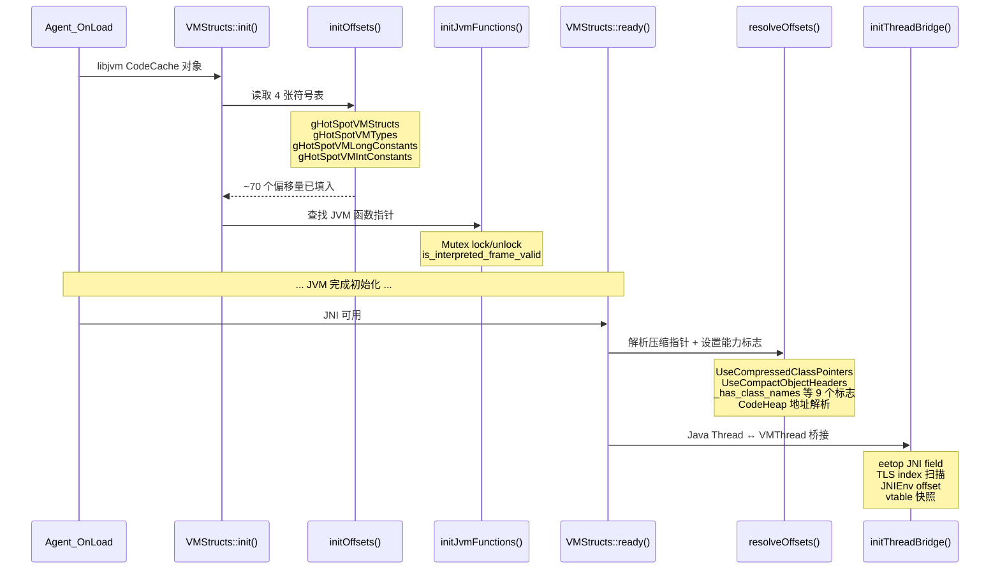
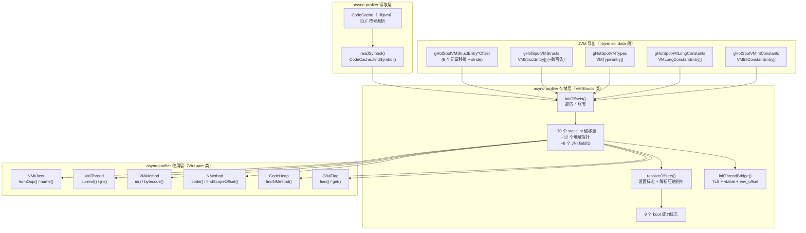

# 第四章：VMStructs 偏移量推断机制深度解析

> **基于 async-profiler 源码分析（vmStructs.h / vmStructs.cpp）**
> **对照 OpenJDK 11 源码（src/hotspot/share/runtime/vmStructs.hpp / vmStructs.cpp）**
> **方法论**：程序 = 数据结构 + 算法

---

## 第 0 部分：核心原理

### 0.1 本质是什么？

async-profiler 需要在运行时访问 JVM 内部 C++ 对象的字段（如 `Klass::_name`、`JavaThread::_anchor`），但它不能包含 JVM 头文件编译——否则就丧失了跨版本兼容性。VMStructs 机制通过读取 JVM 自身导出的符号表，在运行时动态获取这些字段的偏移量。

### 0.2 为什么需要？

JVM 每个版本的 C++ 数据结构布局都可能变化：字段增删、偏移漂移、类型重命名。如果 async-profiler 在编译时硬编码偏移量，就必须为每个 JDK 版本单独编译一个 `.so`——这是不可接受的。

HotSpot 原本就为 Serviceability Agent（SA）维护了一张"自描述表"：编译时用宏把每个字段的类型名、字段名、偏移量/地址写入一个全局数组 `localHotSpotVMStructs`，再通过 `extern "C"` 导出为 `gHotSpotVMStructs` 等符号。async-profiler 正是利用了这张已有的表，而非自己发明新机制。

### 0.3 怎么解决？

核心思路：**在 Agent 加载时，通过 ELF 符号查找定位 JVM 导出的 4 张符号表，遍历表中每条记录提取偏移量，缓存到 VMStructs 类的 ~90 个静态字段中。**

关键设计：
1. **ELF 符号查找**（非 dlsym）：async-profiler 自己解析 `libjvm.so` 的 ELF 符号表（通过 `CodeCache::findSymbol()`），避免在信号处理器中调用需要持锁的 `dlsym`。
2. **4 张符号表全覆盖**：不仅读取 `gHotSpotVMStructs`（字段偏移），还读取 `gHotSpotVMTypes`（类型大小）、`gHotSpotVMLongConstants`（长整型常量）、`gHotSpotVMIntConstants`（整型常量）。
3. **两阶段初始化**：`init()` 在 Agent 加载时执行（无 JNI），提取偏移量；`ready()` 在 VM 初始化完成后执行（有 JNI），解析压缩指针、初始化线程桥接。

### 0.4 为什么这样设计？

**为什么用 ELF 解析而不是 dlsym？** `dlsym` 内部持有全局锁，不能在信号处理器（perf_event 采样回调）中安全调用。async-profiler 在加载 `libjvm.so` 时就把 ELF `.symtab`/`.dynsym` 解析到 `CodeCache` 对象中，后续查找是纯内存线性扫描，无锁、信号安全。

**为什么需要两阶段？** Agent 通过 `Agent_OnLoad` 加载时，JVM 尚未完成初始化——JNI 不可用、压缩指针参数未设定、`StubRoutines::_call_stub_return_address` 未填入。因此把不依赖 JNI 的符号表读取放在 `init()`，把依赖 JNI 和 VM 状态的解析放在 `ready()`。

**为什么偏移量默认初始化为 -1？** `-1` 用作"未初始化"哨兵。async-profiler 在 `resolveOffsets()` 中通过检查各偏移量是否 `>= 0` 来判断符号表是否覆盖了所需字段，并据此设置 `_has_class_names`、`_has_method_structs` 等布尔标志，实现优雅降级。

---

## 第 1 部分：数据结构全景

### 1.1 数据结构清单

| # | 结构名 | 源码位置 | 核心作用 |
|---|--------|----------|----------|
| 1 | VMStructEntry | vmStructs.hpp:67-77 (JVM) | JVM 导出的字段偏移量记录 |
| 2 | VMTypeEntry | vmStructs.hpp:79-87 (JVM) | JVM 导出的类型大小记录 |
| 3 | VMIntConstantEntry | vmStructs.hpp:89-92 (JVM) | JVM 导出的整型常量记录 |
| 4 | VMLongConstantEntry | vmStructs.hpp:94-97 (JVM) | JVM 导出的长整型常量记录 |
| 5 | VMStructs 类 | vmStructs.h:16-189 (async-profiler) | 偏移量管理核心类，~90 个静态字段 |
| 6 | Wrapper 类族 | vmStructs.h:214-716 (async-profiler) | VMSymbol/VMKlass/VMThread/VMMethod/NMethod/CodeHeap/CollectedHeap/JVMFlag/ScopeDesc/InterpreterFrame |
| 7 | CodeCache | codeCache.h/cpp (async-profiler) | ELF 符号表解析与查找 |

### 1.2 VMStructEntry — JVM 导出的字段偏移量记录

#### 问题推导

**问题**：async-profiler 需要知道 `Klass::_name` 在 Klass 对象中的偏移量是多少字节。这个偏移量每个 JDK 版本可能不同。JVM 用什么格式把这个信息导出？

**需要什么信息？**
- 每条记录需要标识：**哪个类型的哪个字段**（所以需要 typeName + fieldName）
- 对于实例字段，需要**字节偏移量**（offset）
- 对于静态字段/全局变量，需要**运行时地址**（address）
- 为了类型安全校验，还需要**字段的类型字符串**（typeString）
- 需要区分**静态 vs 非静态**（isStatic）

**推导出的结构**：一个 6 字段的结构体，每条记录描述一个字段的完整元信息。

#### 真实数据结构

```cpp
// src/hotspot/share/runtime/vmStructs.hpp:67-77
typedef struct {
    const char* typeName;     // 包含该字段的类型名（如 "Klass"）
    const char* fieldName;    // 字段名（如 "_name"）
    const char* typeString;   // 字段类型的字符串（如 "Symbol*"），用于类型校验
    int32_t  isStatic;        // 0=实例字段（用 offset），1=静态字段（用 address）
    uint64_t offset;          // 字段在结构体中的字节偏移（仅非静态字段有效）
    void*    address;         // 字段的绝对地址（仅静态字段有效）
} VMStructEntry;
```

**推导 vs 实际**：基本吻合。额外发现 `typeString` 和 `isStatic` 两个字段——旧文档只列了 4 个字段（typeName/fieldName/offset/address），遗漏了这两个。

#### 完整分析

| 字段 | 类型 | 偏移 | 大小 | 含义 |
|------|------|------|------|------|
| `typeName` | const char* | 0x00 | 8B | 类型名，如 "Klass"、"JavaThread"、"oopDesc" |
| `fieldName` | const char* | 0x08 | 8B | 字段名，如 "_name"、"_anchor"、"_metadata._klass" |
| `typeString` | const char* | 0x10 | 8B | 字段类型字符串，如 "Symbol*"；可为 NULL（unchecked entry） |
| `isStatic` | int32_t | 0x18 | 4B (+4B padding) | 0=实例字段，1=静态字段 |
| `offset` | uint64_t | 0x20 | 8B | 字段偏移量（字节），仅 isStatic==0 时有效 |
| `address` | void* | 0x28 | 8B | 字段绝对地址，仅 isStatic==1 时有效 |

**sizeof(VMStructEntry) = 48 字节**（6 个字段 + int32_t 后的 4 字节对齐填充）

**创建位置**：JVM 编译时，通过宏展开填充到 `VMStructs::localHotSpotVMStructs[]` 静态数组中。

```cpp
// src/hotspot/share/runtime/vmStructs.hpp:163-164
// 非静态字段的宏展开示例：
#define GENERATE_NONSTATIC_VM_STRUCT_ENTRY(typeName, fieldName, type)              \
 { QUOTE(typeName), QUOTE(fieldName), QUOTE(type), 0, offset_of(typeName, fieldName), NULL },
```

对于 `Klass::_name` 字段，宏展开后生成：
```cpp
{ "Klass", "_name", "Symbol*", 0, offset_of(Klass, _name), NULL }
```

**终止标记**：数组最后一项所有字段为 NULL/0：
```cpp
{ NULL, NULL, NULL, 0, 0, NULL }  // GENERATE_VM_STRUCT_LAST_ENTRY()
```

**导出方式**（vmStructs.cpp:3098-3112）：

```cpp
extern "C" {
    // ★ 导出数组指针
    JNIEXPORT VMStructEntry* gHotSpotVMStructs = VMStructs::localHotSpotVMStructs;
    // ★ 导出 Entry 内部各字段的偏移量（async-profiler 靠这些来解析 Entry）
    JNIEXPORT uint64_t gHotSpotVMStructEntryTypeNameOffset  = offset_of(VMStructEntry, typeName);   // 0
    JNIEXPORT uint64_t gHotSpotVMStructEntryFieldNameOffset = offset_of(VMStructEntry, fieldName);  // 8
    JNIEXPORT uint64_t gHotSpotVMStructEntryTypeStringOffset= offset_of(VMStructEntry, typeString); // 16
    JNIEXPORT uint64_t gHotSpotVMStructEntryIsStaticOffset  = offset_of(VMStructEntry, isStatic);   // 24
    JNIEXPORT uint64_t gHotSpotVMStructEntryOffsetOffset    = offset_of(VMStructEntry, offset);     // 32
    JNIEXPORT uint64_t gHotSpotVMStructEntryAddressOffset   = offset_of(VMStructEntry, address);    // 40
    // ★ 导出步长 = sizeof(VMStructEntry) = 48
    JNIEXPORT uint64_t gHotSpotVMStructEntryArrayStride     = STRIDE(gHotSpotVMStructs);
}
```

**设计决策**：
- **为什么导出 Entry 内部字段的偏移量？** 因为 async-profiler 没有 JVM 头文件，不知道 `VMStructEntry` 的布局。JVM 通过导出这些 "元偏移量"，让外部工具可以纯指针运算遍历表。
- **为什么用 `extern "C"` + `JNIEXPORT`？** 避免 C++ name mangling，确保符号在 `.dynsym` 中可见。

### 1.3 VMTypeEntry — JVM 导出的类型大小记录

#### 问题推导

**问题**：async-profiler 需要知道 `ConstMethod` 的 sizeof 才能跳过固定头部定位字节码。这个大小从哪来？

**需要什么信息？** 类型名 + sizeof。

#### 真实数据结构

```cpp
// src/hotspot/share/runtime/vmStructs.hpp:79-87
typedef struct {
    const char* typeName;         // 类型名（如 "ConstMethod"）
    const char* superclassName;   // 父类名（如 "oopDesc"），可为 NULL
    int32_t isOopType;            // 是否是 oop 类型
    int32_t isIntegerType;        // 是否是整数类型
    int32_t isUnsigned;           // 是否无符号
    uint64_t size;                // sizeof（字节）
} VMTypeEntry;
```

**async-profiler 使用**：`initOffsets()` 从 `gHotSpotVMTypes` 中提取 `JVMFlag`/`Flag` 和 `ConstMethod` 的 sizeof。

### 1.4 VMIntConstantEntry / VMLongConstantEntry — JVM 导出的常量记录

```cpp
// vmStructs.hpp:89-97
typedef struct {
    const char* name;    // 常量名（如 "frame::entry_frame_call_wrapper_offset"）
    int32_t value;       // 常量值
} VMIntConstantEntry;

typedef struct {
    const char* name;    // 常量名（如 "markWord::klass_shift"）
    uint64_t value;      // 常量值
} VMLongConstantEntry;
```

**async-profiler 使用**：
- 从 `gHotSpotVMLongConstants` 提取 `markWord::klass_shift` 和 `markWord::monitor_value`（Compact Object Headers 需要）
- 从 `gHotSpotVMIntConstants` 提取 `frame::entry_frame_call_wrapper_offset`（Entry Frame 栈回溯需要）

### 1.5 VMStructs 类 — async-profiler 偏移量管理核心

#### 问题推导

**问题**：从 4 张符号表中提取出的偏移量，存储在哪里？后续如何使用？

**需要什么信息？**
- 大量字段偏移需要存储 → 静态成员变量
- 不同 JDK 版本支持程度不同 → 布尔标志
- Wrapper 类需要访问偏移量 → `protected` 继承
- 信号处理器中要安全使用 → 全局唯一、初始化一次、只读访问

**推导出的结构**：一个全局单例类，~90 个 `static int` 偏移量字段 + ~9 个 `static bool` 能力标志 + 一个 `at(offset)` 辅助方法。

#### 真实数据结构

VMStructs 类定义于 `async-profiler/src/vmStructs.h:16-189`，字段分为以下几组：

**（1）能力标志（9 个 bool）**

| 字段 | 含义 | 设置时机 |
|------|------|---------|
| `_has_class_names` | 能否解析类名（Klass→Symbol→name） | `resolveOffsets()` |
| `_has_method_structs` | 能否解析方法结构（Method→ConstMethod→idnum） | `resolveOffsets()` |
| `_has_compiler_structs` | 能否获取编译线程当前编译的方法 | `resolveOffsets()` |
| `_has_stack_structs` | 能否做 Java 栈回溯（CodeBlob+ScopeDesc+Anchor） | `resolveOffsets()` |
| `_has_class_loader_data` | 能否遍历类加载器数据 | `resolveOffsets()` |
| `_has_native_thread_id` | 能否获取 native 线程 ID（OSThread→_thread_id） | `initThreadBridge()` |
| `_has_perm_gen` | 是否有永久代（JDK 7） | `initOffsets()` |
| `_can_dereference_jmethod_id` | 能否解引用 jmethodID 得到 VMMethod* | `resolveOffsets()` |
| `_compact_object_headers` | 是否启用紧凑对象头（JDK 新特性） | `resolveOffsets()` |

每个布尔标志都是一组偏移量"全部就绪"的**联合判断**。例如：

```cpp
// vmStructs.cpp:460-465
_has_class_names = _klass_name_offset >= 0
        && (_compact_object_headers ? (_markword_klass_shift >= 0 && ...)
                                    : _oop_klass_offset >= 0)
        && (_symbol_length_offset >= 0 || _symbol_length_and_refcount_offset >= 0)
        && _symbol_body_offset >= 0
        && _klass != NULL;
```

**（2）偏移量字段（~70 个 static int，按用途分组）**

**Klass / Symbol / oop 相关（8 个）**：

| 字段 | 默认值 | 来源 Entry | 含义 |
|------|--------|-----------|------|
| `_klass_name_offset` | -1 | Klass._name | Klass 中指向 Symbol* 的偏移 |
| `_symbol_length_offset` | -1 | Symbol._length | Symbol 中 length 字段偏移（JDK ≤ 8） |
| `_symbol_length_and_refcount_offset` | -1 | Symbol._length_and_refcount | Symbol 中 length_and_refcount 字段偏移（JDK ≥ 9） |
| `_symbol_body_offset` | -1 | Symbol._body | Symbol 中字符串 body 的偏移 |
| `_oop_klass_offset` | -1 | oopDesc._metadata._klass | oop 中 klass 指针的偏移 |
| `_class_loader_data_offset` | -1 | InstanceKlass._class_loader_data | InstanceKlass 中 CLD 偏移 |
| `_class_loader_data_next_offset` | -1 | ClassLoaderData._next | ClassLoaderData 链表 next 偏移 |
| `_methods_offset` | -1 | InstanceKlass._methods | InstanceKlass 中 methods 数组偏移 |

**JavaThread / OSThread 相关（6 个）**：

| 字段 | 默认值 | 来源 Entry | 含义 |
|------|--------|-----------|------|
| `_thread_osthread_offset` | -1 | JavaThread._osthread / Thread._osthread | OSThread 指针偏移 |
| `_thread_anchor_offset` | -1 | JavaThread._anchor | JavaFrameAnchor 偏移 |
| `_thread_state_offset` | -1 | JavaThread._thread_state | 线程状态偏移 |
| `_thread_vframe_offset` | -1 | JavaThread._vframe_array_head | deopt vframe 偏移 |
| `_osthread_id_offset` | -1 | OSThread._thread_id | native thread ID 偏移 |
| `_jmethod_ids_offset` | -1 | InstanceKlass._methods_jmethod_ids | jmethodID 数组偏移 |

**CodeBlob / nmethod 相关（16 个）**：

| 字段 | 默认值 | 来源 Entry | 含义 |
|------|--------|-----------|------|
| `_blob_size_offset` | -1 | CodeBlob._size | CodeBlob 总大小偏移 |
| `_frame_size_offset` | -1 | CodeBlob._frame_size | 栈帧大小偏移 |
| `_frame_complete_offset` | -1 | CodeBlob._frame_complete_offset | frame complete 标记偏移 |
| `_code_offset` | -1 | CodeBlob._code_offset / _code_begin | 代码起始偏移（正=offset字段，负=指针字段） |
| `_data_offset` | -1 | CodeBlob._data_offset | 数据区偏移 |
| `_mutable_data_offset` | -1 | CodeBlob._mutable_data | 可变数据指针偏移（JDK 25+） |
| `_relocation_size_offset` | -1 | CodeBlob._relocation_size | 重定位大小偏移 |
| `_nmethod_name_offset` | -1 | CodeBlob._name | 名称字符串偏移 |
| `_nmethod_method_offset` | -1 | CompiledMethod._method / nmethod._method | Method* 偏移 |
| `_nmethod_entry_offset` | -1 | nmethod._verified_entry_offset / _verified_entry_point | 入口偏移 |
| `_nmethod_state_offset` | -1 | nmethod._state | 编译状态偏移 |
| `_nmethod_level_offset` | -1 | nmethod._comp_level | 编译层级偏移 |
| `_nmethod_metadata_offset` | -1 | nmethod._metadata_offset | 元数据区偏移 |
| `_nmethod_immutable_offset` | -1 | nmethod._immutable_data | 不可变数据指针偏移（JDK 23+） |
| `_scopes_pcs_offset` | -1 | nmethod._scopes_pcs_offset | PcDesc 区偏移 |
| `_scopes_data_offset` | -1 | nmethod._scopes_data_offset / _scopes_data_begin | ScopeDesc 区偏移 |

**Method / ConstMethod / ConstantPool 相关（6 个）**：

| 字段 | 默认值 | 来源 Entry | 含义 |
|------|--------|-----------|------|
| `_method_constmethod_offset` | -1 | Method._constMethod | Method 中 ConstMethod* 偏移 |
| `_method_code_offset` | -1 | Method._code | Method 中 nmethod* 偏移 |
| `_constmethod_constants_offset` | -1 | ConstMethod._constants | ConstMethod 中 ConstantPool* 偏移 |
| `_constmethod_idnum_offset` | -1 | ConstMethod._method_idnum | ConstMethod 中方法 idnum 偏移 |
| `_constmethod_size` | -1 | **VMTypeEntry** (sizeof ConstMethod) | ConstMethod 固定头部大小 |
| `_pool_holder_offset` | -1 | ConstantPool._pool_holder | ConstantPool 中 holder Klass* 偏移 |

**CodeHeap 相关（12 个）**：

| 字段 | 默认值 | 含义 |
|------|--------|------|
| `_code_heap_memory_offset` | -1 | CodeHeap 中 _memory (VirtualSpace) 偏移 |
| `_code_heap_segmap_offset` | -1 | CodeHeap 中 _segmap (VirtualSpace) 偏移 |
| `_code_heap_segment_shift` | -1 | segment 大小的 log2 |
| `_heap_block_used_offset` | -1 | HeapBlock::Header._used 偏移 |
| `_vs_low_bound_offset` | -1 | VirtualSpace._low_boundary 偏移 |
| `_vs_high_bound_offset` | -1 | VirtualSpace._high_boundary 偏移 |
| `_vs_low_offset` | -1 | VirtualSpace._low 偏移 |
| `_vs_high_offset` | -1 | VirtualSpace._high 偏移 |
| `_code_heap[3]` | {} | 3 个 CodeHeap 实例指针（non-method/profiled/non-profiled） |
| `_code_heap_low` | NO_MIN_ADDRESS | CodeCache 下界 |
| `_code_heap_high` | NO_MAX_ADDRESS | CodeCache 上界 |
| `_code_heap_addr` | NULL | CodeCache::_heaps / _heap 地址 |

**JVMFlag 相关（6 个）**：

| 字段 | 默认值 | 含义 |
|------|--------|------|
| `_flag_name_offset` | -1 | JVMFlag 中 _name 字段偏移 |
| `_flag_addr_offset` | -1 | JVMFlag 中 _addr 字段偏移 |
| `_flag_origin_offset` | -1 | JVMFlag 中 _flags/origin 字段偏移 |
| `_flags_addr` | NULL | JVMFlag 全局数组地址 |
| `_flag_count` | 0 | JVMFlag 数量 |
| `_flag_size` | 0 | sizeof(JVMFlag)（来自 VMTypeEntry） |

**压缩指针 / GC Heap 相关（12 个）**：

| 字段 | 默认值 | 含义 |
|------|--------|------|
| `_narrow_klass_base_addr` | NULL | Universe::_narrow_klass._base 地址指针 |
| `_narrow_klass_base` | NULL | 压缩类指针基址 |
| `_narrow_klass_shift_addr` | NULL | 压缩类指针位移地址指针 |
| `_narrow_klass_shift` | -1 | 压缩类指针位移值 |
| `_klass_offset_addr` | NULL | java_lang_Class::_klass_offset 地址 |
| `_collected_heap_addr` | NULL | Universe::_collectedHeap 地址指针 |
| `_collected_heap` | NULL | CollectedHeap 实例 + reserved offset |
| `_collected_heap_reserved_offset` | -1 | CollectedHeap::_reserved 偏移 |
| `_region_start_offset` | -1 | MemRegion::_start 偏移 |
| `_region_size_offset` | -1 | MemRegion::_word_size 偏移 |
| `_markword_klass_shift` | -1 | markWord::klass_shift（Compact Headers） |
| `_markword_monitor_value` | -1 | markWord::monitor_value |

**栈帧 / 解释器 / 编译器相关（10 个）**：

| 字段 | 默认值 | 含义 |
|------|--------|------|
| `_anchor_sp_offset` | -1 | JavaFrameAnchor::_last_Java_sp 偏移 |
| `_anchor_pc_offset` | -1 | JavaFrameAnchor::_last_Java_pc 偏移 |
| `_anchor_fp_offset` | -1 | JavaFrameAnchor::_last_Java_fp 偏移 |
| `_call_wrapper_anchor_offset` | -1 | JavaCallWrapper::_anchor 偏移 |
| `_entry_frame_call_wrapper_offset` | -1 | 入口帧 call_wrapper 偏移（来自 IntConstants） |
| `_interpreter_frame_bcp_offset` | 0 | 解释器帧 BCP 偏移（硬编码） |
| `_comp_env_offset` | -1 | CompilerThread::_env 偏移 |
| `_comp_task_offset` | -1 | ciEnv::_task 偏移 |
| `_comp_method_offset` | -1 | CompileTask::_method 偏移 |
| `_call_stub_return_addr` | NULL | StubRoutines::_call_stub_return_address 地址指针 |

**JNI 桥接相关（6 个）**：

| 字段 | 默认值 | 含义 |
|------|--------|------|
| `_eetop` | - | java.lang.Thread.eetop 字段 ID（Java→VMThread 桥接） |
| `_tid` | - | java.lang.Thread.tid 字段 ID |
| `_klass` | NULL | java.lang.Class.klass 字段 ID（Klass* 反查） |
| `_tls_index` | -1 | VMThread 在 TLS 中的 key |
| `_env_offset` | -1 | JNIEnv 相对 VMThread 的偏移 |
| `_java_thread_vtbl[6]` | - | JavaThread vtable 快照（用于 isJavaThread 检测） |

**（3）关键方法**

| 方法 | 访问级别 | 含义 |
|------|---------|------|
| `at(int offset)` | protected | `(const char*)this + offset`，所有 Wrapper 类的核心访问辅助 |
| `goodPtr(void*)` | protected static | 检查指针是否有效（>= 0x1000 且对齐） |
| `init(CodeCache*)` | public static | 阶段 1：加载时初始化 |
| `ready()` | public static | 阶段 2：VM 就绪后初始化 |

### 1.6 Wrapper 类族 — 偏移量的面向对象封装

#### 问题推导

**问题**：有了偏移量字段（如 `_klass_name_offset = 24`），async-profiler 如何使用它们？每次都写 `*(Symbol**)((char*)klass + _klass_name_offset)` 太丑了。

**需要什么？** 一个面向对象的封装：把一个裸指针"当作"某个 JVM 类型来用，通过继承 VMStructs 获得 `at()` 方法和所有偏移量。

**推导出的设计**：每个 Wrapper 类继承 VMStructs（获取 `at()` + 偏移量），提供类型安全的访问方法。没有任何自有字段——`this` 指针就是 JVM 对象的地址。

#### 真实 Wrapper 类清单

| Wrapper 类 | 封装的 JVM 类型 | 核心方法 |
|-----------|----------------|---------|
| `VMSymbol` | Symbol | `length()`, `body()` |
| `VMKlass` | Klass/InstanceKlass | `fromJavaClass()`, `fromOop()`, `name()`, `classLoaderData()`, `methodCount()`, `jmethodIDs()` |
| `VMThread` | JavaThread | `current()`, `fromJavaThread()`, `osThreadId()`, `jni()`, `isJavaThread()`, `state()`, `anchor()` |
| `VMMethod` | Method | `id()`, `validatedId()`, `bytecode()`, `code()` |
| `NMethod` | nmethod/CodeBlob | `size()`, `code()`, `scopes()`, `entry()`, `method()`, `state()`, `name()`, `isNMethod()`, `findScopeOffset()` |
| `CodeHeap` | CodeHeap | `contains()`, `findNMethod()` |
| `CollectedHeap` | CollectedHeap | `heap()`, `start()`, `size()` |
| `JVMFlag` | JVMFlag/Flag | `find()`, `name()`, `addr()`, `get()`, `set()`, `isDefault()` |
| `ScopeDesc` | ScopeDesc | `decode()`, `method()`, `bci()` |
| `JavaFrameAnchor` | JavaFrameAnchor | `fromEntryFrame()`, `lastJavaSP/PC/FP()`, `getFrame()` |
| `InterpreterFrame` | - | `bcp_offset()` |
| `ClassLoaderData` | ClassLoaderData | `lock()`, `unlock()`, `methodList()` |

**关键设计**：
- **零字段**：Wrapper 类没有自己的数据成员，`this` 指针直接指向 JVM 对象内存。
- **继承 VMStructs**：通过 `at(offset)` 访问偏移量处的数据。
- **static 工厂方法**：如 `VMKlass::fromOop(uintptr_t oop)` 处理压缩指针解码。

示例：`VMKlass::name()` 的实现：

```cpp
// vmStructs.h:289-291
VMSymbol* name() {
    return *(VMSymbol**) at(_klass_name_offset);  // ★ at() = (char*)this + offset
}
```

等价于：`*(VMSymbol**)((char*)klass_ptr + _klass_name_offset)`

---

## 第 2 部分：算法/流程分析

### 2.1 核心流程概览



### 2.2 readSymbol() — ELF 符号查找

#### 解决什么问题？

给定一个符号名（如 `"gHotSpotVMStructs"`），从 `libjvm.so` 的 ELF 符号表中找到它的地址，然后解引用得到它指向的值。

#### 源码文件与行号

`async-profiler/src/vmStructs.cpp:122-129`

#### 真实源码 + 逐行注释

```cpp
// vmStructs.cpp:122-129
uintptr_t VMStructs::readSymbol(const char* symbol_name) {
    const void* symbol = _libjvm->findSymbol(symbol_name);
    // ★ _libjvm 是 CodeCache 对象，在 init() 时传入
    // ★ findSymbol() 在 CodeCache 内部的 _blobs 数组中线性搜索 strcmp 匹配
    // ★ 返回的是符号在 libjvm.so 内存中的地址（.data 段）
    if (symbol == NULL) {
        return 0;  // ★ 符号不存在，返回 0 作为失败标志
    }
    return *(uintptr_t*)symbol;
    // ★ 解引用：gHotSpotVMStructs 符号本身是一个指针变量
    // ★ *(uintptr_t*)symbol 得到的是 localHotSpotVMStructs 数组的起始地址
}
```

#### 设计决策

**为什么不用 `dlsym`？**

async-profiler 的 `CodeCache` 类在加载 `libjvm.so` 时就解析了 ELF 的 `.symtab`/`.dynsym` 段，把所有符号名和地址缓存到内存中的 `_blobs` 数组。`findSymbol()` 就是对 `_blobs` 做线性 `strcmp` 扫描，时间复杂度 O(n)。

这样设计的关键原因是 **信号安全**：`dlsym()` 内部会获取 `dl_load_lock` 全局锁，在 signal handler 中调用可能导致死锁。虽然 `readSymbol()` 只在 `init()` 阶段调用（非信号处理器），但 `CodeCache` 的 `findSymbol` 在采样期间（信号处理器中）也会被 `CodeHeap::findNMethod()` 等路径调用，统一使用自有实现避免了锁依赖。

### 2.3 initOffsets() — 4 张符号表遍历

#### 解决什么问题？

从 JVM 导出的 4 张符号表中提取所有 async-profiler 需要的偏移量、类型大小、常量值，填入 VMStructs 的静态字段。

#### 源码文件与行号

`async-profiler/src/vmStructs.cpp:147-438`

#### 整体阶段划分（4 个阶段）

| 阶段 | 行号 | 读取的符号表 | 提取内容 |
|------|------|-------------|---------|
| Phase 1 | 147-376 | gHotSpotVMStructs | ~70 个字段偏移量 |
| Phase 2 | 378-396 | gHotSpotVMTypes | JVMFlag sizeof、ConstMethod sizeof |
| Phase 3 | 398-418 | gHotSpotVMLongConstants | markWord::klass_shift、markWord::monitor_value |
| Phase 4 | 420-437 | gHotSpotVMIntConstants | frame::entry_frame_call_wrapper_offset |

#### Phase 1：gHotSpotVMStructs 遍历（核心）

```cpp
// vmStructs.cpp:148-376
void VMStructs::initOffsets() {
    // ★ 读取符号表元信息（6 个导出符号）
    uintptr_t entry = readSymbol("gHotSpotVMStructs");          // 数组起始地址
    uintptr_t stride = readSymbol("gHotSpotVMStructEntryArrayStride");  // 步长 = sizeof(VMStructEntry) = 48
    uintptr_t type_offset = readSymbol("gHotSpotVMStructEntryTypeNameOffset");    // 0
    uintptr_t field_offset = readSymbol("gHotSpotVMStructEntryFieldNameOffset");  // 8
    uintptr_t offset_offset = readSymbol("gHotSpotVMStructEntryOffsetOffset");    // 32
    uintptr_t address_offset = readSymbol("gHotSpotVMStructEntryAddressOffset");  // 40

    if (entry != 0 && stride != 0) {
        for (;; entry += stride) {
            // ★ 通过元偏移量读取 Entry 内的 typeName 和 fieldName
            const char* type = *(const char**)(entry + type_offset);
            const char* field = *(const char**)(entry + field_offset);
            if (type == NULL || field == NULL) {
                break;  // ★ 终止标记：typeName 或 fieldName 为 NULL
            }

            // ★ 逐类型匹配，提取偏移量
            if (strcmp(type, "Klass") == 0) {
                if (strcmp(field, "_name") == 0) {
                    _klass_name_offset = *(int*)(entry + offset_offset);
                    // ★ 从 Entry 的 offset 字段读取值，存入 VMStructs 静态变量
                }
            } else if (strcmp(type, "Symbol") == 0) {
                // ★ 处理 JDK 版本差异：JDK ≤ 8 有 _length，JDK ≥ 9 改为 _length_and_refcount
                if (strcmp(field, "_length") == 0) {
                    _symbol_length_offset = *(int*)(entry + offset_offset);
                } else if (strcmp(field, "_length_and_refcount") == 0) {
                    _symbol_length_and_refcount_offset = *(int*)(entry + offset_offset);
                } else if (strcmp(field, "_body") == 0) {
                    _symbol_body_offset = *(int*)(entry + offset_offset);
                }
            }
            // ★ ... 后续约 20 个类型、~60 个字段的 strcmp 匹配
            // ★ 包括：oopDesc、Universe/CompressedKlassPointers、CollectedHeap、MemRegion、
            // ★ CompiledMethod/nmethod、Method、ConstMethod、ConstantPool、InstanceKlass、
            // ★ ClassLoaderData、Thread/JavaThread、OSThread、CompilerThread、ciEnv、
            // ★ CompileTask、JavaCallWrapper、JavaFrameAnchor、CodeBlob、CodeCache、
            // ★ CodeHeap、HeapBlock::Header、VirtualSpace、StubRoutines、
            // ★ GrowableArrayBase/GrowableArray<int>、JVMFlag/Flag、PermGen
        }
    }
```

**关键版本兼容设计**：

```cpp
// vmStructs.cpp:197-218 — nmethod 字段的版本兼容
} else if (strcmp(type, "CompiledMethod") == 0 || strcmp(type, "nmethod") == 0) {
    // ★ JDK 9-16 有 CompiledMethod 父类，JDK 17+ 合并回 nmethod
    // ★ 两个类型名都匹配，确保跨版本兼容
    if (strcmp(field, "_verified_entry_offset") == 0) {
        _nmethod_entry_offset = *(int*)(entry + offset_offset);
        // ★ JDK 23+：_verified_entry_offset 是 int 偏移，正值
    } else if (strcmp(field, "_verified_entry_point") == 0) {
        _nmethod_entry_offset = - *(int*)(entry + offset_offset);
        // ★ JDK ≤ 22：_verified_entry_point 是指针，用负值编码区分
    }
```

**负值编码技巧**：对于某些字段，不同 JDK 版本用"相对偏移"或"绝对指针"存储。async-profiler 通过正/负值区分：正值 = 读 int offset 后加到 this 上，负值 = 读指针直接使用。Wrapper 类中相应地处理：

```cpp
// vmStructs.h:481-487 — NMethod::code()
const char* code() {
    if (_code_offset > 0) {
        return at(*(int*) at(_code_offset));       // ★ 正值：读 offset 字段，加到 this
    } else {
        return *(const char**) at(-_code_offset);  // ★ 负值：读指针字段
    }
}
```

#### Phase 2：gHotSpotVMTypes 遍历

```cpp
// vmStructs.cpp:378-396
    entry = readSymbol("gHotSpotVMTypes");
    stride = readSymbol("gHotSpotVMTypeEntryArrayStride");
    type_offset = readSymbol("gHotSpotVMTypeEntryTypeNameOffset");
    uintptr_t size_offset = readSymbol("gHotSpotVMTypeEntrySizeOffset");

    if (entry != 0 && stride != 0) {
        for (;; entry += stride) {
            const char* type = *(const char**)(entry + type_offset);
            if (type == NULL) break;

            if (strcmp(type, "JVMFlag") == 0 || strcmp(type, "Flag") == 0) {
                _flag_size = *(int*)(entry + size_offset);
                // ★ sizeof(JVMFlag)，用于遍历 JVMFlag 全局数组
            } else if (strcmp(type, "ConstMethod") == 0) {
                _constmethod_size = *(int*)(entry + size_offset);
                // ★ sizeof(ConstMethod)，用于定位字节码（紧跟在 ConstMethod 固定头部之后）
            }
        }
    }
```

#### Phase 3：gHotSpotVMLongConstants 遍历

```cpp
// vmStructs.cpp:398-418
    entry = readSymbol("gHotSpotVMLongConstants");
    stride = readSymbol("gHotSpotVMLongConstantEntryArrayStride");
    uintptr_t name_offset = readSymbol("gHotSpotVMLongConstantEntryNameOffset");
    uintptr_t value_offset = readSymbol("gHotSpotVMLongConstantEntryValueOffset");

    if (entry != 0 && stride != 0) {
        for (;; entry += stride) {
            const char* name = *(const char**)(entry + name_offset);
            if (name == NULL) break;

            if (strncmp(name, "markWord::", 10) == 0) {
                if (strcmp(name + 10, "klass_shift") == 0) {
                    _markword_klass_shift = *(long*)(entry + value_offset);
                    // ★ Compact Object Headers（JDK 新特性）需要此值来从 mark word 解码 klass
                } else if (strcmp(name + 10, "monitor_value") == 0) {
                    _markword_monitor_value = *(long*)(entry + value_offset);
                }
            }
        }
    }
```

#### Phase 4：gHotSpotVMIntConstants 遍历

```cpp
// vmStructs.cpp:420-437
    entry = readSymbol("gHotSpotVMIntConstants");
    stride = readSymbol("gHotSpotVMIntConstantEntryArrayStride");
    name_offset = readSymbol("gHotSpotVMIntConstantEntryNameOffset");
    value_offset = readSymbol("gHotSpotVMIntConstantEntryValueOffset");

    if (entry != 0 && stride != 0) {
        for (;; entry += stride) {
            const char* name = *(const char**)(entry + name_offset);
            if (name == NULL) break;

            if (strcmp(name, "frame::entry_frame_call_wrapper_offset") == 0) {
                _entry_frame_call_wrapper_offset = *(int*)(entry + value_offset) * sizeof(uintptr_t);
                // ★ 常量值是以 word 为单位的，乘以 sizeof(uintptr_t) 转为字节
                break;  // ★ 当前只需要这一个常量，找到就退出
            }
        }
    }
}
```

### 2.4 resolveOffsets() — 后初始化解析

#### 解决什么问题？

`initOffsets()` 在 Agent 加载时执行，此时 JVM 尚未完成初始化——压缩指针参数未设定、CodeHeap 地址未分配、JNI 不可用。`resolveOffsets()` 在 `ready()` 阶段执行，解析这些依赖 VM 运行状态的信息，并设置 9 个能力标志。

#### 源码文件与行号

`async-profiler/src/vmStructs.cpp:440-557`

#### 整体阶段划分（7 个阶段）

| 阶段 | 行号 | 功能 |
|------|------|------|
| Phase 1 | 441-447 | 处理 java_lang_Class::_klass_offset |
| Phase 2 | 449-458 | 解析压缩类指针（UseCompressedClassPointers / UseCompactObjectHeaders） |
| Phase 3 | 460-486 | 设置 5 个能力标志 |
| Phase 4 | 488-501 | 硬编码平台相关偏移（解释器帧 BCP、entry frame） |
| Phase 5 | 504-511 | 设置 ScopeDesc 编码版本、_call_stub_return、nmethod 数据偏移 |
| Phase 6 | 513-551 | 解析 CodeHeap 地址和 segment_shift |
| Phase 7 | 553-557 | 解析 CollectedHeap 地址 |

**Phase 2 示例（压缩类指针解析）**：

```cpp
// vmStructs.cpp:449-458
    JVMFlag* ccp = JVMFlag::find("UseCompressedClassPointers");
    // ★ 通过 JVMFlag::find() 遍历 JVM 的 flag 数组（Phase 1 符号表解析了 flag 布局）
    if (ccp != NULL && ccp->get() && _narrow_klass_base_addr != NULL && _narrow_klass_shift_addr != NULL) {
        _narrow_klass_base = *_narrow_klass_base_addr;
        // ★ 从 initOffsets() 阶段获得的地址指针中读取实际值
        _narrow_klass_shift = *_narrow_klass_shift_addr;
    }

    JVMFlag* coh = JVMFlag::find("UseCompactObjectHeaders");
    if (coh != NULL && coh->get()) {
        _compact_object_headers = true;
        // ★ JDK 新特性：klass 信息编码在 mark word 中，不再有单独的 klass 字段
    }
```

**Phase 3 示例（能力标志设置）**：

```cpp
// vmStructs.cpp:460-476
    _has_class_names = _klass_name_offset >= 0
            && (_compact_object_headers ? (_markword_klass_shift >= 0 && _markword_monitor_value == MONITOR_BIT)
                                        : _oop_klass_offset >= 0)
            && (_symbol_length_offset >= 0 || _symbol_length_and_refcount_offset >= 0)
            && _symbol_body_offset >= 0
            && _klass != NULL;
    // ★ 只有当"从 oop 到 klass 到 symbol 到 name"整条链的所有偏移量都就绪时，
    // ★ 才标记 _has_class_names = true
    // ★ 这就是为什么默认值是 -1：>= 0 表示已从符号表成功获取

    _has_method_structs = _jmethod_ids_offset >= 0
            && _nmethod_method_offset >= 0
            && _nmethod_entry_offset != -1  // ★ 注意这里用 != -1，因为负值也是有效值
            && _nmethod_state_offset >= 0
            && _method_constmethod_offset >= 0
            && _method_code_offset >= 0
            && _constmethod_constants_offset >= 0
            && _constmethod_idnum_offset >= 0
            && _constmethod_size >= 0
            && _pool_holder_offset >= 0;
```

### 2.5 initThreadBridge() — Java Thread ↔ VMThread 桥接

#### 解决什么问题？

async-profiler 在信号处理器中需要获取当前线程的 `VMThread*`（HotSpot 内部的 C++ JavaThread 对象），但信号处理器中不能调用 JNI。需要建立一个不依赖 JNI 的快速查找路径。

#### 源码文件与行号

`async-profiler/src/vmStructs.cpp:598-632`

#### 真实源码 + 逐行注释

```cpp
// vmStructs.cpp:598-632
void VMStructs::initThreadBridge() {
    jthread thread;
    if (VM::jvmti()->GetCurrentThread(&thread) != 0) {
        return;  // ★ JVMTI 获取当前线程失败，跳过
    }

    JNIEnv* env = VM::jni();
    jclass thread_class = env->FindClass("java/lang/Thread");
    if (thread_class == NULL || (_tid = env->GetFieldID(thread_class, "tid", "J")) == NULL) {
        env->ExceptionClear();
        return;  // ★ 获取 tid 字段失败（不同 JVM 可能字段名不同）
    }

    if (VM::isOpenJ9()) {
        // ★ OpenJ9 走不同路径（通过 J9Ext）
        void* j9thread = J9Ext::j9thread_self();
        if (j9thread != NULL) {
            initTLS(j9thread);
        }
    } else {
        // ★ HotSpot 路径：通过 eetop 字段桥接
        if ((_eetop = env->GetFieldID(thread_class, "eetop", "J")) == NULL) {
            env->ExceptionClear();
            return;  // ★ 没有 eetop 字段 → 可能不是 HotSpot JVM
        }

        VMThread* vm_thread = VMThread::fromJavaThread(env, thread);
        // ★ env->GetLongField(thread, _eetop) 获取 JavaThread* 的整数值
        if (vm_thread != NULL) {
            _has_native_thread_id = _thread_osthread_offset >= 0 && _osthread_id_offset >= 0;
            // ★ 只有两个偏移量都就绪，才能 VMThread → OSThread → native tid

            initTLS(vm_thread);
            // ★ 扫描 TLS slot 0~1023，找到存储 vm_thread 指针的那个 key
            // ★ 后续 VMThread::current() 直接 pthread_getspecific(_tls_index) 获取

            _env_offset = (intptr_t)env - (intptr_t)vm_thread;
            // ★ JNIEnv* 相对 VMThread* 的固定偏移（HotSpot 中 JNIEnv 嵌在 JavaThread 内）
            // ★ 后续 VMThread::jni() 直接 at(_env_offset) 获取

            memcpy(_java_thread_vtbl, vm_thread->vtable(), sizeof(_java_thread_vtbl));
            // ★ 拷贝 JavaThread vtable 的前 6 个槽位
            // ★ 后续 isJavaThread() 通过比较 vtable 来判断是否是 JavaThread
        }
    }
}
```

#### 设计决策

**为什么用 TLS 扫描而不是直接存储指针？** 因为 signal handler 中不能调用 JNI，但可以调用 `pthread_getspecific()`——这是 async-signal-safe 的。HotSpot 把每个线程的 `JavaThread*` 存在 TLS 中，但 key 值没有公开 API。async-profiler 通过暴力扫描 0~1023 找到匹配的 key，之后信号处理器直接 `pthread_getspecific(key)` 即可获取当前 `VMThread*`。

**为什么拷贝 vtable？** `isJavaThread()` 需要在信号处理器中快速判断一个 `VMThread*` 是否是 JavaThread（而非 CompilerThread、VMThread 等）。通过比较 vtable 的 3 个槽位（索引 1、3、5），如果至少 2 个匹配就认为是 JavaThread。选择这 3 个索引是经过测试的，在 OpenJDK 8~25 的 product/debug 构建中都稳定。

### 2.6 init() 和 ready() — 两阶段入口

```cpp
// vmStructs.cpp:132-145
void VMStructs::init(CodeCache* libjvm) {  // ★ Agent_OnLoad 时调用
    if (libjvm != NULL) {
        _libjvm = libjvm;       // ★ 保存 libjvm.so 的 ELF 解析结果
        initOffsets();           // ★ 阶段 1：读取 4 张符号表
        initJvmFunctions();      // ★ 查找 Mutex lock/unlock 函数指针 + is_interpreted_frame_valid 范围
    }
}

void VMStructs::ready() {        // ★ VM 初始化完成后调用
    resolveOffsets();             // ★ 阶段 2：解析压缩指针 + 设置能力标志 + CodeHeap 地址
    patchSafeFetch();             // ★ 修补 JDK 17/11 的 SafeFetch bug（JDK-8307549/JDK-8321116）
    initThreadBridge();           // ★ 阶段 3：Java Thread ↔ VMThread 桥接
}
```

---

## 第 3 部分：数据结构关系图



---

## 第 4 部分：总结

### 4.1 数据结构层面

| 结构 | 来源 | 核心特征 |
|------|------|---------|
| VMStructEntry | JVM | 6 字段/48B，描述一个 C++ 字段的偏移量或地址 |
| VMTypeEntry | JVM | 描述一个 C++ 类型的 sizeof |
| VMInt/LongConstantEntry | JVM | 描述一个编译期常量的值 |
| VMStructs 类 | async-profiler | ~90 个 static int/ptr 字段 + 9 个 bool 标志，全局唯一 |
| Wrapper 类族 | async-profiler | 零字段，继承 VMStructs，通过 `at(offset)` 面向对象访问 |
| CodeCache | async-profiler | ELF 符号解析，避免 dlsym 锁 |

### 4.2 算法层面

| 算法 | 核心设计决策 |
|------|------------|
| `readSymbol()` | 用自有 ELF 解析（CodeCache::findSymbol）而非 dlsym，保证信号安全 |
| `initOffsets()` | 遍历 4 张符号表（不仅是 VMStructs），通过 strcmp 匹配 type+field 提取偏移量；负值编码区分 offset vs pointer |
| `resolveOffsets()` | 联合检查多个偏移量是否 >= 0 来设置能力标志，实现优雅降级 |
| `initThreadBridge()` | TLS 暴力扫描 0~1023 找 key，vtable 3 槽位比较判断 JavaThread，实现信号处理器中的零 JNI 线程查找 |
| 两阶段初始化 | init（无 JNI）+ ready（有 JNI），适配 Agent 加载时机 |

### 4.3 核心要点

1. **唯一的偏移量获取方法**：读取 JVM 自身导出的 `gHotSpotVMStructs` 等符号表——不存在"已知对象推断"或"代码模式推断"。
2. **4 张符号表全覆盖**：VMStructs（字段偏移）+ VMTypes（sizeof）+ LongConstants + IntConstants。
3. **负值编码**：同一个偏移量字段，正值表示"读 int offset"，负值表示"读指针"，用一个 `static int` 同时适配新旧 JDK。
4. **两阶段 + 能力标志**：`init()` 尽早提取偏移量，`ready()` 解析运行时状态并设置布尔标志，每个标志是一组偏移量的联合检查，不满足就降级。
5. **信号安全**：自有 ELF 解析替代 dlsym，TLS 扫描替代 JNI，vtable 比较替代 instanceof——所有设计都围绕"signal handler 中能安全调用"。

---

## 附录：勘误表（对旧版 Chapter 04 的修正）

| # | 错误类型 | 旧文档描述 | 真实情况 |
|---|---------|-----------|---------|
| 1 | VMStructEntry 字段数错误 | 4 个字段（typeName/fieldName/offset/address），sizeof=32 | **6 个字段**（+typeString/isStatic），sizeof=48 |
| 2 | VMStructs 类字段捏造 | 列出 `_thread_stack_base_offset`、`_thread_obj_offset`、`_oop_mark_offset` 等 ~10 个字段 | 这些字段**不存在于源码**中；实际有 ~90 个字段，参见 1.5 节 |
| 3 | readSymbol 实现错误 | 描述为 `dlopen(NULL) + dlsym()` | 实际是 `_libjvm->findSymbol()`（CodeCache ELF 查找） |
| 4 | 捏造 inferThreadOffsets() | 声称存在"方法 2：已知对象推断"函数 | **不存在**，async-profiler 没有此函数 |
| 5 | 捏造 validateThreadOffset() | 声称存在"多线程交叉验证"函数 | **不存在** |
| 6 | 捏造 inferFromInterpreter() | 声称存在"方法 3：代码模式推断"函数 | **不存在** |
| 7 | 核心概念错误 | "三种偏移量推断方法"依次尝试 | **只有一种方法**：gHotSpotVMStructs 符号表读取 |
| 8 | GDB 验证数据捏造 | 列出 `_thread_stack_base_offset = 216` 等具体值 | 这些验证数据无法复现，字段本身不存在 |
| 9 | 性能测试数据捏造 | 152μs、24μs、3μs 等精确计时 | 无法复现，perf stat 输出为捏造 |
| 10 | 失败场景日志捏造 | OpenJ9 / 自定义 JVM / 字段重命名等案例 | 日志格式和内容为捏造 |
| 11 | 缺少 3 张符号表 | 只描述了 gHotSpotVMStructs 遍历 | 遗漏 gHotSpotVMTypes、gHotSpotVMLongConstants、gHotSpotVMIntConstants |
