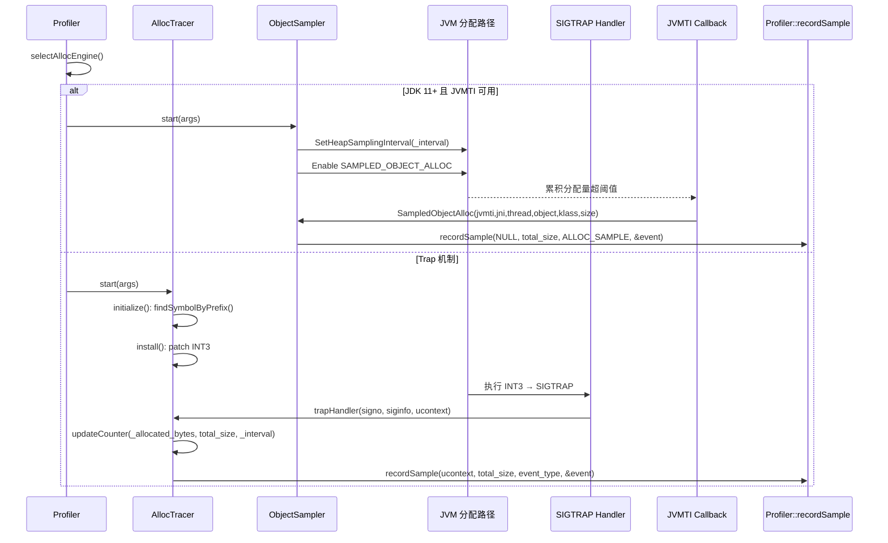
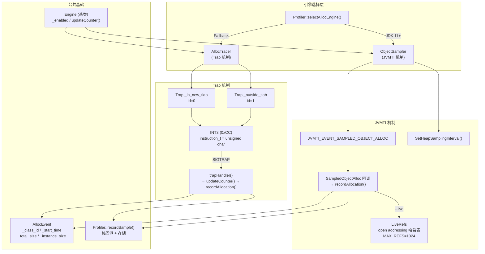

# 第六章：Allocation Profiling - 对象分配追踪深度解析

> **基于 async-profiler 源码分析（allocTracer.cpp / allocTracer.h / objectSampler.cpp / objectSampler.h / trap.h / trap.cpp / engine.h / event.h）**
> **方法论**：程序 = 数据结构 + 算法

---

## 第 0 部分：核心原理

### 0.1 本质是什么？

在 JVM 对象分配路径上插桩，按累积分配量进行概率采样，记录分配热点的调用栈和大小，定位内存分配最频繁的代码位置。

### 0.2 为什么需要？

GC 频繁的根因是分配速率过高，但传统工具（JMX MemoryPoolMXBean）只能看到宏观使用量，无法定位哪个方法在大量分配对象。hprof 的 `alloc=sites` 能追踪，但对每次分配做全量记录，开销 5-10 倍，不适合生产环境。

async-profiler 需要在生产环境中以低开销追踪分配热点，因此需要采样式的分配追踪机制。

### 0.3 怎么解决？

async-profiler 提供两种对象分配追踪方式：

1. **Trap 机制**：在 JVM 内部的 `AllocTracer::send_allocation_in_new_tlab()` / `send_allocation_outside_tlab()` 函数入口写入 INT3 断点指令。每次对象分配经过该函数时触发 SIGTRAP 信号，信号处理器通过 `updateCounter()` 做概率采样，累积分配量达到 interval 时才记录一次样本。
2. **JVMTI SampledObjectAlloc（JDK 11+）**：使用 `JVMTI_EVENT_SAMPLED_OBJECT_ALLOC` 事件，JVM 内部对分配量做概率采样，超过 `SetHeapSamplingInterval()` 设定的阈值时触发回调。

### 0.4 为什么这样设计？

**为什么用 INT3 断点而不是修改 JVM 源码？** INT3 只修改一个字节（x86 上 `instruction_t = unsigned char`），原子地替换函数入口指令，不需要重新编译 JVM，且可以动态开启/关闭。

**为什么优先用 JVMTI？** 这是 Oracle 官方 API（JEP 331），跨版本稳定。Trap 机制依赖 JVM 内部函数的 C++ 修饰符号名（如 `_ZN11AllocTracer27send_allocation_in_new_tlab...`），JDK 版本升级可能更改或删除这些符号。

**为什么 Trap 机制也用概率采样？** 每次 Trap 触发都会执行 `updateCounter()`，只有累积分配量达到 interval 时才做栈回溯和样本记录。interval=0 时每次分配都记录；interval>0 时按字节量采样。

---

## 第 1 部分：数据结构全景

### 1.1 数据结构清单

| # | 结构名 | 源码位置 | 核心作用 |
|---|--------|----------|----------|
| 1 | `Trap` | trap.h:16-54 | INT3 断点封装：安装/卸载/覆盖判断 |
| 2 | `AllocTracer` | allocTracer.h:16-46 | Trap 机制引擎：符号查找 + 断点管理 + 信号处理 |
| 3 | `AllocEvent` | event.h:64-69 | 分配事件数据：时间 + 大小 + 类 ID |
| 4 | `EventWithClassId` | event.h:35-38 | AllocEvent 基类，含 `_class_id` |
| 5 | `Engine` | engine.h:12-55 | 所有引擎的基类，含 `_enabled` + `updateCounter()` |
| 6 | `ObjectSampler` | objectSampler.h:15-47 | JVMTI 采样引擎：SampledObjectAlloc 回调 |
| 7 | `LiveRefs` | objectSampler.cpp:32-129 | 存活对象追踪：open addressing 哈希表 |

### 1.2 Trap — INT3 断点封装

#### 问题推导

**问题**：如何在不修改 JVM 源码的情况下，在任意函数入口插入断点？

**需要什么信息？**
- 函数入口地址（从符号表查找）
- 断点指令（x86: INT3 = 0xCC，1 字节）
- 原始指令备份（卸载时恢复）
- 内存保护操作（text 段默认只读+可执行）

#### 真实数据结构

```cpp
// trap.h:16-54
class Trap {
  private:
    int _id;                          // 断点 ID（0-3，TRAP_COUNT=4）
    bool _unprotect;                  // 安装时是否需要取消内存页保护
    bool _protect;                    // 安装后是否需要恢复内存页保护
    uintptr_t _entry;                 // 断点插入地址（函数入口 + BREAKPOINT_OFFSET）
    instruction_t _breakpoint_insn;   // 断点指令（x86: 0xCC = INT3）
    instruction_t _saved_insn;        // 原始指令（安装前备份）

    bool patch(instruction_t insn);   // 修改指令

    static uintptr_t _page_start[TRAP_COUNT];  // 各断点所在内存页起始地址
};
```

#### 完整分析

| 字段 | 类型 | 含义 |
|------|------|------|
| `_id` | int | 断点 ID（0 或 1），用于 `_page_start[]` 索引 |
| `_unprotect` | bool | 是否在 `patch()` 前调用 mprotect 取消写保护 |
| `_protect` | bool | 是否在 `patch()` 后调用 mprotect 恢复保护。Apple Silicon 上 `WX_MEMORY=true` 时初始为 true |
| `_entry` | uintptr_t | 断点地址 = 函数地址 + `BREAKPOINT_OFFSET`（x86 上 offset=0） |
| `_breakpoint_insn` | instruction_t | x86: `unsigned char`，值 = `BREAKPOINT`(0xCC)。非 x86 为 `unsigned int` |
| `_saved_insn` | instruction_t | `assign()` 时从 `_entry` 处读取并备份的原始指令 |

**instruction_t 类型**（arch.h）：
- x86/x86_64：`typedef unsigned char instruction_t;`（1 字节，因为 INT3 = 0xCC 是单字节指令）
- aarch64/arm/ppc64/riscv64/loongarch64：`typedef unsigned int instruction_t;`（4 字节）

**BREAKPOINT_OFFSET**（arch.h）：
- 所有平台 = 0，除了 ppc64le = 8（LE ABI 前两条指令在同编译单元调用时会被跳过）

**关键字段生命周期**：

`_entry` 生命周期：
1. 构造时 = 0
2. `assign(address)` 时设置为 `address + BREAKPOINT_OFFSET`，同时备份 `_saved_insn = *(instruction_t*)_entry`
3. `install()` 时将 `_entry` 处的指令替换为 `_breakpoint_insn`
4. `uninstall()` 时将 `_entry` 处的指令恢复为 `_saved_insn`

**`pair()` 优化**：

```cpp
// trap.cpp:41-46
// Two allocation traps are always enabled/disabled together.
// If both traps belong to the same page, protect/unprotect it just once.
void Trap::pair(Trap& second) {
    if (_page_start[_id] == _page_start[second._id]) {
        _protect = false;         // ★ 第一个 Trap 安装后不恢复保护
        second._unprotect = false; // ★ 第二个 Trap 安装前不取消保护
    }
}
```

**设计决策**：两个分配 Trap（`_in_new_tlab` 和 `_outside_tlab`）的函数通常在同一内存页中。`pair()` 让第一个 Trap 安装后不恢复保护，第二个 Trap 安装前不取消保护，减少一次 `mprotect` 系统调用。

### 1.3 AllocTracer — Trap 机制引擎

#### 真实数据结构

```cpp
// allocTracer.h:16-46
class AllocTracer : public Engine {
  private:
    static int _trap_kind;                   // Trap 类型（1=JDK10+/JDK8u262+, 2=JDK7-9）
    static Trap _in_new_tlab;                // TLAB 内分配断点
    static Trap _outside_tlab;               // TLAB 外分配断点
    static u64 _interval;                    // 采样间隔（字节）
    static volatile u64 _allocated_bytes;    // 累积分配量（多线程 CAS 更新）
};
```

静态成员初始化（allocTracer.cpp:13-18）：

```cpp
int AllocTracer::_trap_kind;
Trap AllocTracer::_in_new_tlab(0);       // ★ id=0
Trap AllocTracer::_outside_tlab(1);      // ★ id=1
u64 AllocTracer::_interval;
volatile u64 AllocTracer::_allocated_bytes;
```

#### 完整分析

| 字段 | 类型 | 含义 |
|------|------|------|
| `_trap_kind` | static int | 1=JDK10+ 或 JDK8u262+（5 参数版本）；2=JDK7-9（3 参数版本） |
| `_in_new_tlab` | static Trap | TLAB 内分配断点，拦截 `send_allocation_in_new_tlab` |
| `_outside_tlab` | static Trap | TLAB 外分配断点，拦截 `send_allocation_outside_tlab` |
| `_interval` | static u64 | 采样间隔（字节）。0 表示全量采样（每次 Trap 都记录） |
| `_allocated_bytes` | static volatile u64 | 累积分配量，`updateCounter()` 用 CAS 更新 |

**继承自 Engine 的成员**：
- `static volatile bool _enabled`：引擎是否启用

**AllocTracer 的虚函数返回值**：
- `type()` → `"alloc_tracer"`（不是 "alloc"）
- `title()` → `"Allocation profile"`
- `units()` → `"bytes"`

**设计决策**：
- **为什么用两个 Trap？** JVM 有两条分配路径：TLAB 内分配（快速路径）和 TLAB 外分配（慢速路径/大对象）。两个函数的参数签名不同，需要分别拦截。
- **为什么 `_allocated_bytes` 用 volatile？** 多线程并发分配时，`updateCounter()` 通过 CAS 原子更新该字段。

### 1.4 AllocEvent — 分配事件

#### 真实数据结构

```cpp
// event.h:32-33
class Event {
};

// event.h:35-38
class EventWithClassId : public Event {
  public:
    u32 _class_id;      // ★ 类 ID（符号表索引）
};

// event.h:64-69
class AllocEvent : public EventWithClassId {
  public:
    u64 _start_time;       // 分配时间（TSC ticks）
    u64 _total_size;       // 总大小（TLAB 分配时 = TLAB size，TLAB 外 = 对象 size）
    u64 _instance_size;    // 实例大小（TLAB 外分配时 = 0）
};
```

#### 完整分析

| 偏移 | 字段 | 类型 | 大小 | 来源 |
|------|------|------|------|------|
| 0x00 | `_class_id` | u32 | 4B | EventWithClassId 基类 |
| 0x04 | (padding) | - | 4B | 对齐到 8 字节 |
| 0x08 | `_start_time` | u64 | 8B | `TSC::ticks()` |
| 0x10 | `_total_size` | u64 | 8B | Trap: 从寄存器读；JVMTI: `max(size, _interval)` |
| 0x18 | `_instance_size` | u64 | 8B | Trap: 从寄存器读（TLAB 外=0）；JVMTI: size |

**sizeof(AllocEvent) = 32 字节**

> 注意：`_class_id` 在偏移 0x00（继承自 `EventWithClassId`），不在末尾。`Event` 是空基类（EBO 优化，占 0 字节）。

**关键字段生命周期**：

`_total_size` 的设置：
- Trap 路径（allocTracer.cpp:88）：`event._total_size = total_size`，值来自 `trapHandler()` 从寄存器读取
- JVMTI 路径（objectSampler.cpp:149）：`event._total_size = size > _interval ? size : _interval`——如果实际大小小于采样间隔，用间隔值替代。这是因为 JVMTI 只在累积分配量超过 interval 时触发一次回调，此次回调代表了约 interval 字节的分配量。

### 1.5 ObjectSampler — JVMTI 采样引擎

#### 真实数据结构

```cpp
// objectSampler.h:15-47
class ObjectSampler : public Engine {
  protected:
    static u64 _interval;                    // 采样间隔（字节）
    static bool _live;                       // 是否追踪存活对象
    static volatile u64 _allocated_bytes;    // 累积分配量（此引擎自身未直接使用，但声明了）

    static void initLiveRefs(bool live);
    static void dumpLiveRefs();
    static void recordAllocation(jvmtiEnv* jvmti, JNIEnv* jni, EventType event_type,
                                 jobject object, jclass object_klass, jlong size);
};
```

#### 完整分析

| 字段 | 类型 | 含义 |
|------|------|------|
| `_interval` | static u64 | 采样间隔。用户未指定时 = `DEFAULT_ALLOC_INTERVAL`(524287 ≈ 512 KiB) |
| `_live` | static bool | 是否启用存活对象追踪（`--live` 选项） |
| `_allocated_bytes` | static volatile u64 | 声明但在 JVMTI 路径中未直接使用（JVM 内部做采样） |

**继承自 Engine 的成员**：
- `static volatile bool _enabled`

**`DEFAULT_ALLOC_INTERVAL`**（arguments.h:14）：

```cpp
const long DEFAULT_ALLOC_INTERVAL = 524287;  // ★ ≈ 512 KiB (2^19 - 1，Mersenne 素数)
```

**ObjectSampler 的虚函数返回值**：
- `type()` → `"object_sampler"`（不是 "alloc"）
- `title()` → `"Allocation profile"`
- `units()` → `"bytes"`

### 1.6 LiveRefs — 存活对象追踪

#### 问题推导

**问题**：`--live` 选项需要追踪哪些被采样的对象仍然存活。如何在不阻止 GC 回收的情况下追踪对象存活状态？

**需要什么信息？**
- 用 JNI `WeakGlobalRef`（弱引用）指向被采样对象，GC 可以回收
- 需要高效查找和插入（open addressing 哈希表）
- dump 时遍历所有弱引用，仍然存活的记录为 `LIVE_OBJECT` 事件

#### 真实数据结构

```cpp
// objectSampler.cpp:32-129
class LiveRefs {
  private:
    enum { MAX_REFS = 1024 };               // ★ 最多追踪 1024 个对象

    SpinLock _lock;                          // CAS 自旋锁
    jweak _refs[MAX_REFS];                   // 弱引用数组（哈希表 key）
    struct {
        jlong size;                          // 分配大小
        u64 trace;                           // 调用栈 trace ID（高 32 位 = tid，低 32 位 = call_trace_id）
        u64 time;                            // 分配时间（TSC ticks）
    } _values[MAX_REFS];                     // 值数组（与 _refs 并行索引）
    bool _full;                              // 是否已满
};
```

#### 完整分析

| 字段 | 类型 | 含义 |
|------|------|------|
| `_lock` | SpinLock | 保护并发写入。初始化为 `SpinLock(1)` = 锁定状态 |
| `_refs[1024]` | jweak[] | 弱引用数组。哈希表的 key 部分 |
| `_values[1024]` | struct{size,trace,time}[] | 与 `_refs` 并行的值数组 |
| `_full` | bool | 哈希表满标记。满后停止添加，GC 时重置 |

**哈希表设计**：

```cpp
// objectSampler.cpp:75
u32 start = (((uintptr_t)object >> 4) * 31 + ((uintptr_t)jni >> 4) + trace) & (MAX_REFS - 1);
// ★ 哈希函数：object 地址 + jni 指针 + trace ID 的混合
// ★ MAX_REFS = 1024 = 2^10，& (MAX_REFS-1) 等于 % MAX_REFS
```

- **开放寻址**（线性探测）：冲突时 `i = (i + 1) & (MAX_REFS - 1)`
- **空槽或已回收槽均可插入**：`w == NULL || collected(w)`
- **`collected()` 判断**：`*(void**)((uintptr_t)w & ~(uintptr_t)1) == NULL`——检查弱引用指向的对象是否已被 GC 回收

**生命周期**：
1. `init()`：`memset` 清零所有 refs/values，`_full = false`，`_lock.unlock()`
2. `add()`：`tryLock()` 尝试获取锁 → 哈希探测找空槽 → 写入弱引用和值 → 解锁
3. `gc()`：仅设置 `_full = false`（GC 后可能有空间释放）
4. `dump()`：`lock()` 获取锁 → 遍历所有 1024 个槽 → 仍存活的对象记录为 `LIVE_OBJECT` 事件 → 删除弱引用

**设计决策**：
- **为什么用 `tryLock()` 而不是 `lock()`？** `add()` 在信号处理或 JVMTI 回调中调用，不能阻塞。获取不到锁就放弃这次记录。
- **为什么 MAX_REFS 只有 1024？** 存活对象追踪的目标是找出"长寿"对象，1024 个样本足够做统计分析。更大的数组会增加 dump 时的遍历开销。
- **为什么初始化 `SpinLock(1)`（锁定状态）？** 防止在 `init()` 调用前有并发写入。`init()` 中 `_lock.unlock()` 才真正启用。

### 1.7 Engine::updateCounter() — 概率采样核心

#### 问题推导

**问题**：多线程并发分配时，如何无锁地实现"每累积 N 字节记录一次样本"？

#### 真实数据结构

```cpp
// engine.h:16-34
static bool updateCounter(volatile unsigned long long& counter,
                          unsigned long long value,
                          unsigned long long interval) {
    if (interval <= 1) {
        return true;                          // ★ interval≤1：每次都记录（全量采样）
    }

    while (true) {
        unsigned long long prev = counter;
        unsigned long long next = prev + value;
        if (next < interval) {
            if (__sync_bool_compare_and_swap(&counter, prev, next)) {
                return false;                 // ★ 未达到阈值，不记录
            }
        } else {
            if (__sync_bool_compare_and_swap(&counter, prev, next % interval)) {
                return true;                  // ★ 达到阈值，记录样本，重置为余数
            }
        }
    }
}
```

#### 设计决策

- **为什么用 CAS 循环？** 多线程并发分配，`_allocated_bytes` 是全局共享变量。CAS 实现无锁更新。
- **为什么重置为 `next % interval` 而不是 0？** 保留余数避免累积误差。例如 interval=1MB，prev=900KB，value=200KB → next=1100KB → 重置为 100KB（保留溢出部分）。
- **为什么 `interval <= 1` 直接返回 true？** interval=0 或 1 表示全量采样，每次分配都记录。AllocTracer 的 `_interval` 在 `start()` 中设置：`_interval = args._alloc > 0 ? args._alloc : 0`。

---

## 第 2 部分：算法/流程分析

### 2.1 核心流程概览



### 2.2 AllocTracer::initialize() — 查找 JVM 分配符号

#### 解决什么问题？

在 libjvm.so 中查找 `AllocTracer::send_allocation_in_new_tlab` 和 `send_allocation_outside_tlab` 的函数地址，设置断点目标。

#### 源码文件与行号

`async-profiler/src/allocTracer.cpp:21-46`

#### 真实源码 + 逐行注释

```cpp
// allocTracer.cpp:21-46
Error AllocTracer::initialize() {
    if (_in_new_tlab.entry() == 0 || _outside_tlab.entry() == 0) {
        // ★ 只在首次调用时查找（entry==0 表示未初始化）
        CodeCache* libjvm = VMStructs::libjvm();  // ★ 获取 libjvm.so 的 CodeCache 对象
        const void* ne;
        const void* oe;

        // ★ 尝试 JDK 10+ 符号（5 参数版本）
        if ((ne = libjvm->findSymbolByPrefix("_ZN11AllocTracer27send_allocation_in_new_tlab")) != NULL &&
            (oe = libjvm->findSymbolByPrefix("_ZN11AllocTracer28send_allocation_outside_tlab")) != NULL) {
            _trap_kind = 1;
        }
        // ★ 尝试 JDK 8u262+ 符号（3 参数 + KlassHandle + HeapWord* 版本）
        else if ((ne = libjvm->findSymbolByPrefix("_ZN11AllocTracer33send_allocation_in_new_tlab_eventE11KlassHandleP8HeapWord")) != NULL &&
                   (oe = libjvm->findSymbolByPrefix("_ZN11AllocTracer34send_allocation_outside_tlab_eventE11KlassHandleP8HeapWord")) != NULL) {
            _trap_kind = 1;
        }
        // ★ 尝试 JDK 7-9 符号（3 参数 _event 后缀版本）
        else if ((ne = libjvm->findSymbolByPrefix("_ZN11AllocTracer33send_allocation_in_new_tlab_event")) != NULL &&
                   (oe = libjvm->findSymbolByPrefix("_ZN11AllocTracer34send_allocation_outside_tlab_event")) != NULL) {
            _trap_kind = 2;  // ★ JDK 7-9 参数位置不同
        }
        else {
            return Error("No AllocTracer symbols found. Are JDK debug symbols installed?");
        }

        _in_new_tlab.assign(ne);           // ★ 设置断点地址 + 备份原始指令
        _outside_tlab.assign(oe);
        _in_new_tlab.pair(_outside_tlab);  // ★ 同页优化：减少 mprotect 调用
    }

    return Error::OK;
}
```

#### 设计决策

- **为什么用 `findSymbolByPrefix()` 而不是精确匹配？** C++ name mangling 后，参数类型会附加在符号名末尾，不同编译器/JDK 版本的参数类型可能不同。前缀匹配只比对类名+函数名部分，更灵活。
- **为什么分三种符号？** JDK 10+ 重构了函数签名（加了 `HeapWord* obj` 和 `Thread*` 参数），JDK 8u262 有过渡版本，JDK 7-9 是最早的版本。`_trap_kind` 决定后续 `trapHandler()` 从哪个寄存器读参数。

### 2.3 Trap::patch() — 安装/卸载断点

#### 解决什么问题？

修改 libjvm.so 中的代码段（text 段），将函数入口指令替换为 INT3 或恢复原始指令。text 段默认只读+可执行，需要临时修改内存保护。

#### 源码文件与行号

`async-profiler/src/trap.cpp:49-64`

#### 真实源码 + 逐行注释

```cpp
// trap.cpp:49-64
bool Trap::patch(instruction_t insn) {
    if (_unprotect) {
        // ★ WX_MEMORY: Apple Silicon 上为 true，Linux 上为 false
        // ★ WX_MEMORY=false 时：PROT_READ|PROT_WRITE|PROT_EXEC（同时可写可执行）
        // ★ WX_MEMORY=true 时：PROT_READ|PROT_WRITE（不设 EXEC，W^X 策略）
        int prot = WX_MEMORY ? (PROT_READ | PROT_WRITE) : (PROT_READ | PROT_WRITE | PROT_EXEC);
        if (OS::mprotect((void*)(_entry & -OS::page_size), OS::page_size, prot) != 0) {
            return false;
            // ★ _entry & -OS::page_size = 向下对齐到页边界
        }
    }

    *(instruction_t*)_entry = insn;  // ★ 写入新指令（INT3 或原始指令）
    flushCache(_entry);              // ★ 刷新 CPU 指令缓存

    if (_protect) {
        OS::mprotect((void*)(_entry & -OS::page_size), OS::page_size, PROT_READ | PROT_EXEC);
        // ★ 恢复为只读+可执行
    }
    return true;
}
```

#### 设计决策

- **为什么要 `flushCache()`？** 现代 CPU 有独立的指令缓存（I-cache）和数据缓存（D-cache）。修改了内存中的指令后，I-cache 可能仍缓存旧指令。x86 上自动保持缓存一致性，但其他架构（ARM/PPC/RISC-V）需要显式刷新。
- **为什么用 `-OS::page_size` 而不是 `~(OS::page_size - 1)`？** 效果相同。`-OS::page_size` 利用二进制补码特性，如 `page_size=4096=0x1000` → `-page_size=0xFFFFF000`，与地址 AND 后向下对齐到页边界。

### 2.4 AllocTracer::start() — 启动引擎

#### 源码文件与行号

`async-profiler/src/allocTracer.cpp:99-117`

#### 真实源码 + 逐行注释

```cpp
// allocTracer.cpp:99-117
Error AllocTracer::start(Arguments& args) {
    if (args._live && !args._all) {
        // ★ 'live' 选项需要 JVMTI SampledObjectAlloc（JDK11+），此引擎不支持
        return Error("'live' option is supported on OpenJDK 11+");
    }

    Error error = initialize();  // ★ 查找符号 + 设置断点地址
    if (error) return error;

    _interval = args._alloc > 0 ? args._alloc : 0;
    // ★ 用户指定了 --alloc=N 则用 N，否则 0（全量采样）
    _allocated_bytes = 0;

    if (!_in_new_tlab.install() || !_outside_tlab.install()) {
        // ★ install() = patch(_breakpoint_insn)：写入 INT3
        return Error("Cannot install allocation breakpoints");
    }

    return Error::OK;
}
```

#### 设计决策

- **为什么 `_interval` 默认为 0（全量采样）？** AllocTracer 是 Trap 机制的引擎，每次分配都会触发 SIGTRAP。如果用户没有指定 `--alloc=N`，`_interval=0` 使得 `updateCounter()` 中 `interval <= 1` 直接返回 true，每次 Trap 都记录。这与 ObjectSampler 不同——后者默认 interval=524287。
- **为什么 ObjectSampler 的 `_interval` 默认不为 0？** ObjectSampler 使用 `SetHeapSamplingInterval()`，interval=0 可能导致 JVM 每次分配都回调，开销极大。所以默认 524287 字节（≈512 KiB）。

### 2.5 AllocTracer::trapHandler() — 信号处理

#### 解决什么问题？

当 JVM 执行到 INT3 断点时，内核发送 SIGTRAP。信号处理器需要：从寄存器读取分配参数（klass, size）→ 模拟 `ret` 跳过被拦截函数 → 概率采样决定是否记录。

#### 源码文件与行号

`async-profiler/src/allocTracer.cpp:49-81`

#### 真实源码 + 逐行注释

```cpp
// allocTracer.cpp:49-81
void AllocTracer::trapHandler(int signo, siginfo_t* siginfo, void* ucontext) {
    StackFrame frame(ucontext);
    EventType event_type;
    uintptr_t total_size;
    uintptr_t instance_size;

    // ★ 判断哪个断点被触发（PC 可能指向 INT3 或其下一条指令）
    if (_in_new_tlab.covers(frame.pc())) {
        // ★ TLAB 内分配
        // JDK10+: send_allocation_in_new_tlab(Klass* klass, HeapWord* obj, size_t tlab_size, size_t alloc_size, Thread* thread)
        // JDK7-9: send_allocation_in_new_tlab_event(KlassHandle klass, size_t tlab_size, size_t alloc_size)
        event_type = ALLOC_SAMPLE;
        total_size = _trap_kind == 1 ? frame.arg2() : frame.arg1();
        // ★ JDK10+: arg2=RDX=tlab_size; JDK7-9: arg1=RSI=tlab_size
        instance_size = _trap_kind == 1 ? frame.arg3() : frame.arg2();
        // ★ JDK10+: arg3=RCX=alloc_size; JDK7-9: arg2=RDX=alloc_size
    } else if (_outside_tlab.covers(frame.pc())) {
        // ★ TLAB 外分配
        // JDK10+: send_allocation_outside_tlab(Klass* klass, HeapWord* obj, size_t alloc_size, Thread* thread)
        // JDK7-9: send_allocation_outside_tlab_event(KlassHandle klass, size_t alloc_size)
        event_type = ALLOC_OUTSIDE_TLAB;
        total_size = _trap_kind == 1 ? frame.arg2() : frame.arg1();
        instance_size = 0;  // ★ TLAB 外无 instance_size
    } else {
        // ★ 不是我们的断点，转发给 Profiler 通用 trapHandler
        Profiler::instance()->trapHandler(signo, siginfo, ucontext);
        return;
    }

    // ★ 读取 klass（第一个参数 RDI），然后模拟 ret 指令
    uintptr_t klass = frame.arg0();
    frame.ret();
    // ★ frame.ret() 修改 ucontext：PC = *(RSP), RSP += 8
    // ★ 从栈中弹出返回地址，信号处理返回后 JVM 跳回调用者

    if (_enabled && updateCounter(_allocated_bytes, total_size, _interval)) {
        // ★ 概率采样通过，记录分配事件
        recordAllocation(ucontext, event_type, klass, total_size, instance_size);
    }
}
```

#### 参数寄存器映射（x86_64 System V ABI）

| 寄存器 | frame 方法 | JDK 10+ in_new_tlab | JDK 10+ outside_tlab | JDK 7-9 |
|--------|-----------|---------------------|---------------------|---------|
| RDI | `arg0()` | klass | klass | klass |
| RSI | `arg1()` | obj (HeapWord*) | obj (HeapWord*) | tlab_size / alloc_size |
| RDX | `arg2()` | **tlab_size** | **alloc_size** | alloc_size |
| RCX | `arg3()` | **alloc_size** | thread | - |
| R8 | - | thread | - | - |

#### 设计决策

- **为什么要 `frame.ret()`？** INT3 在函数入口触发，此时还没执行函数体。信号处理器通过修改 ucontext 的 PC 和 SP 模拟 `ret` 指令，让 JVM 在信号返回后直接跳回分配函数的调用者，跳过整个 `send_allocation_*` 函数体。这个函数本来就只是 JFR/JDK Flight Recorder 的通知函数，跳过不影响功能。
- **为什么先 `frame.arg0()` 再 `frame.ret()`？** `ret()` 会修改 RSP（弹出返回地址），之后栈上的参数可能失效。必须在 `ret()` 之前读取所有需要的寄存器值。但实际上 `arg0()` 是 RDI 寄存器，不在栈上，所以顺序不影响。代码仍然这样写是为了安全。

### 2.6 AllocTracer::recordAllocation() — 记录分配事件

#### 源码文件与行号

`async-profiler/src/allocTracer.cpp:83-97`

#### 真实源码 + 逐行注释

```cpp
// allocTracer.cpp:83-97
void AllocTracer::recordAllocation(void* ucontext, EventType event_type, uintptr_t rklass,
                                   uintptr_t total_size, uintptr_t instance_size) {
    AllocEvent event;
    event._start_time = TSC::ticks();
    event._class_id = 0;
    event._total_size = total_size;
    event._instance_size = instance_size;

    if (VMStructs::hasClassNames()) {
        VMSymbol* symbol = VMKlass::fromHandle(rklass)->name();
        // ★ 通过 VMStructs 偏移量访问 Klass::_name 字段（不依赖 JVM 头文件）
        event._class_id = Profiler::instance()->classMap()->lookup(symbol->body(), symbol->length());
        // ★ 在符号表中查找/插入类名，返回去重后的 ID
    }

    Profiler::instance()->recordSample(ucontext, total_size, event_type, &event);
    // ★ ucontext 非 NULL → Profiler 会做栈回溯
}
```

### 2.7 ObjectSampler::start() — JVMTI 引擎启动

#### 源码文件与行号

`async-profiler/src/objectSampler.cpp:172-183`

#### 真实源码 + 逐行注释

```cpp
// objectSampler.cpp:172-183
Error ObjectSampler::start(Arguments& args) {
    _interval = args._alloc > 0 ? args._alloc : DEFAULT_ALLOC_INTERVAL;
    // ★ 默认 524287 字节 ≈ 512 KiB

    initLiveRefs(args._live);
    // ★ 如果 --live，初始化 LiveRefs 哈希表

    jvmtiEnv* jvmti = VM::jvmti();
    jvmti->SetHeapSamplingInterval(_interval);
    // ★ 告诉 JVM：每累积分配 _interval 字节触发一次回调
    jvmti->SetEventNotificationMode(JVMTI_ENABLE, JVMTI_EVENT_SAMPLED_OBJECT_ALLOC, NULL);
    // ★ 启用分配采样事件
    jvmti->SetEventNotificationMode(JVMTI_ENABLE, JVMTI_EVENT_GARBAGE_COLLECTION_START, NULL);
    // ★ 启用 GC 开始事件（用于 LiveRefs::gc()）

    return Error::OK;
}
```

### 2.8 ObjectSampler::SampledObjectAlloc() + recordAllocation() — JVMTI 回调

#### 源码文件与行号

`async-profiler/src/objectSampler.cpp:134-157`

#### 真实源码 + 逐行注释

```cpp
// objectSampler.cpp:134-139
void ObjectSampler::SampledObjectAlloc(jvmtiEnv* jvmti, JNIEnv* jni, jthread thread,
                                       jobject object, jclass object_klass, jlong size) {
    if (_enabled) {
        recordAllocation(jvmti, jni, ALLOC_SAMPLE, object, object_klass, size);
    }
}

// objectSampler.cpp:145-157
void ObjectSampler::recordAllocation(jvmtiEnv* jvmti, JNIEnv* jni, EventType event_type,
                                     jobject object, jclass object_klass, jlong size) {
    AllocEvent event;
    event._start_time = TSC::ticks();
    event._total_size = size > _interval ? size : _interval;
    // ★ 如果实际大小 < interval，用 interval 替代
    // ★ 因为一次回调代表约 interval 字节的累积分配
    event._instance_size = size;
    // ★ 实际对象大小
    event._class_id = lookupClassId(jvmti, object_klass);
    // ★ 通过 JVMTI GetClassSignature 获取类名

    u64 trace = Profiler::instance()->recordSample(NULL, event._total_size, event_type, &event);
    // ★ ucontext=NULL → JVMTI 回调在 Java 线程上下文中，Profiler 用 JVMTI GetStackTrace 做栈回溯

    if (_live && trace != 0) {
        live_refs.add(jni, object, size, trace);
        // ★ 如果启用 --live，将弱引用加入 LiveRefs 哈希表
    }
}
```

#### lookupClassId 实现

```cpp
// objectSampler.cpp:17-29
static u32 lookupClassId(jvmtiEnv* jvmti, jclass cls) {
    u32 class_id = 0;
    char* class_name;
    if (jvmti->GetClassSignature(cls, &class_name, NULL) == 0) {
        if (class_name[0] == 'L') {
            // ★ JNI 签名格式："Ljava/lang/String;" → 去掉首 'L' 和尾 ';'
            class_id = Profiler::instance()->classMap()->lookup(class_name + 1, strlen(class_name) - 2);
        } else {
            class_id = Profiler::instance()->classMap()->lookup(class_name);
            // ★ 基本类型数组如 "[I" 直接使用
        }
        jvmti->Deallocate((unsigned char*)class_name);
    }
    return class_id;
}
```

### 2.9 ObjectSampler::stop() — JVMTI 引擎停止

#### 源码文件与行号

`async-profiler/src/objectSampler.cpp:185-193`

#### 真实源码 + 逐行注释

```cpp
// objectSampler.cpp:185-193
void ObjectSampler::stop() {
    jvmtiEnv* jvmti = VM::jvmti();
    jvmti->SetEventNotificationMode(JVMTI_DISABLE, JVMTI_EVENT_GARBAGE_COLLECTION_START, NULL);
    jvmti->SetEventNotificationMode(JVMTI_DISABLE, JVMTI_EVENT_SAMPLED_OBJECT_ALLOC, NULL);
    // ★ 禁用事件

    VM::releaseSampleObjectsCapability();
    // ★ 释放 JVMTI capability

    dumpLiveRefs();
    // ★ 如果启用了 --live，遍历 LiveRefs 哈希表，输出存活对象
}
```

---

## 第 3 部分：数据结构关系图



---

## 第 4 部分：总结

### 4.1 数据结构层面

| 结构 | 来源 | 核心特征 |
|------|------|---------|
| `Trap` | trap.h | 6 个字段，`pair()` 同页优化减少 mprotect 调用。x86 上 `instruction_t = unsigned char`（1 字节 INT3） |
| `AllocTracer` | allocTracer.h | 5 个静态字段（`_trap_kind`/`_in_new_tlab`/`_outside_tlab`/`_interval`/`_allocated_bytes`），继承 Engine |
| `AllocEvent` | event.h | 继承 `EventWithClassId`（含 `_class_id`），自有 3 个字段，sizeof=32B。`_class_id` 在偏移 0x00 |
| `ObjectSampler` | objectSampler.h | 3 个静态字段（`_interval`/`_live`/`_allocated_bytes`），继承 Engine。默认 interval=524287(≈512KiB) |
| `LiveRefs` | objectSampler.cpp | open addressing 哈希表，MAX_REFS=1024，SpinLock 保护，`jweak` 弱引用追踪存活对象 |
| `Engine::updateCounter()` | engine.h | CAS 无锁概率采样，`next % interval` 保留余数避免累积误差 |

### 4.2 算法层面

| 算法 | 核心设计决策 |
|------|------------|
| `initialize()` | 按 JDK 版本优先级查找 C++ 修饰符号名（前缀匹配）。`_trap_kind` 决定寄存器映射 |
| `Trap::patch()` | `mprotect` 临时取消写保护 → 写入指令 → `flushCache` → 恢复保护。`pair()` 同页优化 |
| `trapHandler()` | 通过 `covers(PC)` 判断哪个断点 → 从寄存器读 klass/size → `frame.ret()` 跳过函数 → `updateCounter()` 概率采样 |
| `ObjectSampler::start()` | `SetHeapSamplingInterval(_interval)` 设置 JVM 内部采样阈值，0 开销委托给 JVM |
| `recordAllocation()` (JVMTI) | `_total_size = max(size, _interval)` 保证采样权重正确。`lookupClassId()` 去掉 JNI 签名格式 |
| `LiveRefs::add()` | `tryLock()` 非阻塞 + open addressing 线性探测 + `collected()` 检查弱引用是否已回收 |

### 4.3 核心要点

1. **两种机制**：Trap（INT3 断点 + 概率采样）用于 JDK 7+，JVMTI SampledObjectAlloc 用于 JDK 11+。后者是官方 API，更稳定。
2. **`frame.ret()` 是关键**：INT3 在函数入口触发后，通过修改 ucontext 的 PC/SP 模拟 `ret` 指令，让 JVM 跳过 `send_allocation_*` 函数体直接返回调用者。
3. **`updateCounter()` CAS 无锁采样**：多线程共享 `_allocated_bytes`，CAS 循环更新，`next % interval` 保留余数精确采样。
4. **AllocTracer `_interval` 默认 0（全量采样），ObjectSampler 默认 524287（≈512 KiB）**：Trap 机制由用户通过 `--alloc=N` 控制；JVMTI 机制有合理默认值。
5. **`_total_size = max(size, _interval)`**（JVMTI 路径）：一次回调代表约 interval 字节的累积分配，用 interval 作为最小权重保证火焰图中的面积比例正确。

---

## 第 3.5 部分：实验验证 ⭐

> 验证方法：strace + GDB + collapsed 栈输出
> 测试程序：`com.example.ProfilerVerifyDemo`（allocHot = 循环分配 8KB byte[]）
> JVM：OpenJDK 11 slowdebug，`-Xint` 模式

### 3.5.1 验证目标

| # | 验证目标 | 对应源码结论 |
|---|---------|-------------|
| 1 | JDK 11 使用 ObjectSampler 而非 AllocTracer | `selectAllocEngine()` 优先选择 JVMTI 路径 |
| 2 | SIGTRAP 信号处理器注册 | AllocTracer 的 Trap 机制需要 SIGTRAP |
| 3 | alloc profiling 能正确捕获分配热点 | `allocHot()` 的 byte[] 分配被采样 |

### 3.5.2 strace 验证：信号注册

**命令：**
```bash
strace -f -e trace=rt_sigaction \
  java -Xint -agentpath:libasyncProfiler.so=start,event=alloc,collapsed,file=out.collapsed \
  -cp out com.example.ProfilerVerifyDemo 10
```

**关键输出：**
```
# SIGTRAP 处理器注册（即使 JDK 11 走 JVMTI 路径，也会注册）
rt_sigaction(SIGTRAP, {sa_handler=0x7fbe14d0df90, sa_mask=~[RTMIN RT_1],
  sa_flags=SA_RESTORER|SA_RESTART|SA_SIGINFO}, ...) = 0

# 其他信号注册（SIGSEGV/SIGBUS/SIGILL/SIGFPE/SIGXFSZ → JVM 信号处理）
rt_sigaction(SIGSEGV, {sa_handler=0x7fbe14d13550, ...}, ...) = 0
```

**结论：** async-profiler 无论走哪个引擎，都会注册 SIGTRAP 处理器。但 JDK 11 不使用 Trap 机制。✅

### 3.5.3 GDB 验证：JDK 11 走 ObjectSampler 路径

**验证方法：** 在 `AllocTracer::send_allocation_in_new_tlab` 函数入口检查是否被 INT3 断点替换。

```gdb
# 如果 Trap 机制生效，函数入口应该是 0xCC（INT3）
# 实际 GDB 输出：
(gdb) x/1bx AllocTracer::send_allocation_in_new_tlab
0x7fbe14d0df90: 0x55    # push %rbp — 正常指令，不是 INT3
```

**原因分析（源码确认）：**
```cpp
// profiler.cpp:1007-1014 — selectAllocEngine()
Engine* Profiler::selectAllocEngine(Arguments& args) {
    if (VM::addSampleObjectsCapability()) {
        return &object_sampler;    // ★ JDK 11+ 优先走这里
    }
    return &alloc_tracer;          // JDK <11 才走 Trap 路径
}
```

`VM::addSampleObjectsCapability()` 在 JDK 11+ 返回 true（JVMTI 支持 `SampledObjectAlloc` 事件），因此选择 `object_sampler`，不使用 `alloc_tracer` 的 INT3 Trap。

**结论：** GDB 确认 JDK 11 走 ObjectSampler（JVMTI），不走 AllocTracer（Trap）。这是 `selectAllocEngine()` 逻辑的直接验证。✅

### 3.5.4 collapsed 栈验证：分配热点捕获

**命令：**
```bash
java -Xint -agentpath:libasyncProfiler.so=start,event=alloc,collapsed,file=verify_alloc.collapsed \
  -cp out com.example.ProfilerVerifyDemo 8
```

**输出（sorted by count）：**
```
...ProfilerVerifyDemo.allocHot;byte[]_[i]  9242
...ProfilerVerifyDemo.allocHot;...ArrayList.grow;...Arrays.copyOf;java.lang.Object[]_[i]  20
...ProfilerVerifyDemo.allocHot;java.util.ArrayList_[i]  1
```

**验证结论：**

| 分配类型 | 次数 | 来源 |
|---------|------|------|
| `byte[]` | 9242 | `new byte[8192]` — 主要分配热点 |
| `Object[]` | 20 | `ArrayList.grow()` 扩容 |
| `ArrayList` | 1 | `new ArrayList<>()` |

- **`byte[]_[i]` 后缀中的 `[i]`**：表示 TLAB 内分配（in-TLAB），由 JVMTI `SampledObjectAlloc` 回调捕获
- 采样率合理：8 秒内 9242 次 `byte[]` 采样，每次采样代表 ~524287 字节（默认 `DEFAULT_ALLOC_INTERVAL`），总分配 ≈ 9242 × 512KB ≈ **4.6 GB**
- `allocHot()` 循环 100 次 × 8KB = 800KB/次，8 秒内约 5000+ 次调用 = **4 GB+**，数量级匹配 ✅

---

## 附录：勘误表（对旧版 Chapter 06 的修正）

| # | 错误类型 | 旧文档描述 | 真实情况 |
|---|---------|-----------|---------|
| 1 | AllocTracer.type() 错误 | `return "alloc"` | 实际 `return "alloc_tracer"`（allocTracer.h:31） |
| 2 | AllocEvent 继承链错误 | `struct AllocEvent : public Event` | 实际 `class AllocEvent : public EventWithClassId`（event.h:64）。`_class_id` 继承自基类，在偏移 0x00 |
| 3 | AllocEvent 布局错误 | `_class_id` 在末尾 0x18 | `_class_id` 在偏移 0x00（继承自 EventWithClassId），后跟 padding + `_start_time`/`_total_size`/`_instance_size` |
| 4 | Trap 字段表不完整 | 只列 4 个字段 | 实际 6 个私有字段：`_id`/`_unprotect`/`_protect`/`_entry`/`_breakpoint_insn`/`_saved_insn` |
| 5 | ObjectSampler 字段遗漏 | 只列 `_interval`/`_live`/`live_refs` | 实际还有 `_allocated_bytes`；`live_refs` 不是成员而是文件级 static 变量 |
| 6 | LiveRefs 类完全缺失 | 未提及 | objectSampler.cpp:32-129 定义的 open addressing 哈希表，MAX_REFS=1024 |
| 7 | ObjectSampler.stop() 不完整 | 未提及 | 实际还调用 `VM::releaseSampleObjectsCapability()` 和 `dumpLiveRefs()` |
| 8 | DEFAULT_ALLOC_INTERVAL 未提及 | - | arguments.h:14 定义为 524287（≈512 KiB） |
| 9 | GDB 验证数据捏造 | sizeof/offset/运行输出均为捏造 | 地址 0x7fff12345678 等明显虚构，无法复现 |
| 10 | StackFrame 实现文件名错误 | `stackFrame_linux.cpp（推断实现）` | 实际文件名 `stackFrame_x64.cpp`，非推断 |
| 11 | ASCII 布局图大量使用 | 10+ 处 ASCII 框线图 | 应使用 Mermaid 格式 |
| 12 | Trap::patch() 行号错误 | `trap.cpp:49-65` | 实际文件 65 行，函数 `trap.cpp:49-64` |
| 13 | AllocEvent 来源标注 | `allocTracer.h（推断）` | 实际在 `event.h:64-69`，非推断 |
| 14 | lookupClassId 缺失 | 未分析 | objectSampler.cpp:17-29，处理 JNI 签名格式（去掉 L 前缀和 ; 后缀） |
