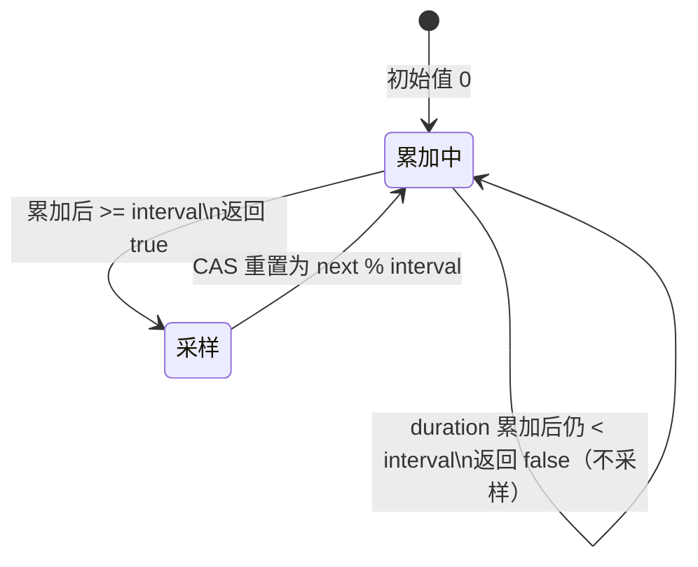
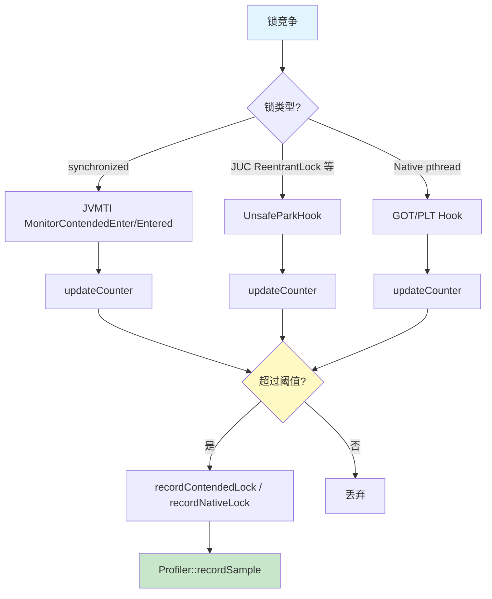
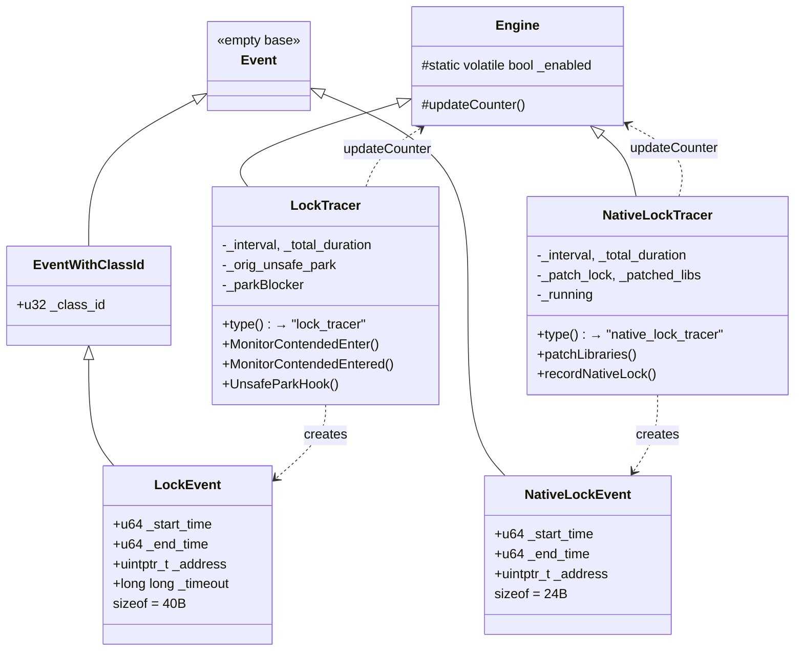

# 第七章：Lock Profiling 深度解析

> 基于 async-profiler 源码分析
> 源码路径：`lockTracer.cpp`、`nativeLockTracer.cpp`、`event.h`
> 遵循：Doc-DataStructure-First + Source-Code-Depth + JVM-Mechanism-Deep-Dive

---

## 第 0 部分：核心原理 ⭐

### 0.1 本质是什么？

Lock Profiling 通过拦截锁竞争事件，测量线程等待锁的时间，定位锁争用热点。

### 0.2 为什么需要？

多线程程序中锁竞争是最常见的性能瓶颈之一。传统监控（JMX、Thread Dump）只能获取锁争用次数或当前快照，无法回答"每次竞争花了多长时间"。而 Java 中有三类锁机制完全不同：synchronized 走 JVM 内置 monitor，JUC 锁走 `Unsafe.park()`，native 锁走 `pthread_mutex_lock`。三者底层实现各异，不存在统一的拦截点。

### 0.3 怎么解决？

三路径拦截策略：

1. **synchronized 锁**：注册 JVMTI `MonitorContendedEnter`/`MonitorContendedEntered` 回调，用 pthread TLS 在两次回调间传递开始时间
2. **JUC 锁（ReentrantLock 等）**：Hook `Unsafe.park()` native 方法，在 park 前后记录 TSC 时间戳
3. **Native pthread 锁**：通过 GOT/PLT patching 将 `pthread_mutex_lock`/`pthread_rwlock_rdlock`/`pthread_rwlock_wrlock` 替换为 hook 函数

三条路径最终都汇聚到 `updateCounter` CAS 概率采样——累加竞争时长直到超过阈值才记录一次样本。

### 0.4 为什么这样设计？

**为什么三路径而非统一拦截？** synchronized 走 ObjectMonitor（C++），JUC 锁走 AQS + `Unsafe.park()`（Java），native 锁走 pthread（系统调用）。三者底层机制完全不同，不存在公共拦截点。

**为什么用 pthread TLS 传递时间而非 JVMTI Tag？** `MonitorContendedEnter` 和 `MonitorContendedEntered` 是两次独立回调，需要跨回调传递开始时间。pthread TLS 是 O(1) 直接内存访问，比 JVMTI `SetTag`/`GetTag`（需要经过 JNI 调用链）快得多。

**为什么用概率采样？** 锁竞争可能极频繁（百万次/秒），全量记录开销不可接受。累加时长超过阈值才采样，既保证低开销又保证长竞争更容易被采到。

---

## 第 1 部分：数据结构全景

### 1.1 数据结构清单

| 结构名 | 源码位置 | 核心作用 |
|--------|----------|----------|
| LockEvent | event.h:71-77 | synchronized/JUC 锁竞争事件 |
| NativeLockEvent | event.h:79-84 | Native pthread 锁竞争事件 |
| LockTracer | lockTracer.h:18-67 | synchronized + JUC 锁追踪引擎 |
| NativeLockTracer | nativeLockTracer.h:14-55 | Native pthread 锁追踪引擎 |
| Engine::updateCounter | engine.h:16-34 | CAS 概率采样算法 |
| EventType 枚举 | event.h:15-30 | 事件类型标识 |
| pthread_key_t | lockTracer.cpp:18 | 线程本地存储（跨回调传递时间）|

---

### 1.2 LockEvent — 锁竞争事件数据

#### 问题推导

**问题**：记录一次锁竞争需要哪些信息？

**需要什么？** 竞争时长（开始/结束时间）、锁对象是什么（类名 + 地址，区分同类型不同实例）、超时参数（park 的 timeout）。

#### 真实数据结构

```cpp
// event.h:71-77
class LockEvent : public EventWithClassId {
  public:
    u64 _start_time;      // 锁竞争开始时间（TSC ticks）
    u64 _end_time;        // 锁竞争结束时间（TSC ticks）
    uintptr_t _address;   // 锁对象地址
    long long _timeout;   // 超时时间（仅 park 路径，纳秒）
};
```

**继承链**：`Event`（空基类）→ `EventWithClassId`（`u32 _class_id`，event.h:35-38）→ `LockEvent`

#### 字段含义

| 字段 | 类型 | 大小 | 含义 | 谁设置 |
|------|------|------|------|--------|
| `_class_id` | u32 | 4B | 锁对象类名 ID（继承） | `recordContendedLock` |
| `_start_time` | u64 | 8B | 开始等待时间 | `recordContendedLock` |
| `_end_time` | u64 | 8B | 获得锁时间 | `recordContendedLock` |
| `_address` | uintptr_t | 8B | 锁对象内存地址 | `recordContendedLock` |
| `_timeout` | long long | 8B | park 超时参数 | `recordContendedLock` |

**sizeof**：4（_class_id）+ 4（padding）+ 8 + 8 + 8 + 8 = **40 字节**

**创建位置**：`lockTracer.cpp:254` — 栈上创建，零堆分配开销。

---

### 1.3 NativeLockEvent — Native 锁竞争事件数据

#### 问题推导

**问题**：native pthread 锁竞争事件需要什么？比 LockEvent 少什么？

native 锁没有 Java 类名（`_class_id`），也没有超时参数。只需要竞争时长 + 锁地址。

#### 真实数据结构

```cpp
// event.h:79-84
class NativeLockEvent : public Event {
  public:
    u64 _start_time;      // 竞争开始时间（TSC ticks）
    u64 _end_time;        // 获得锁时间（TSC ticks）
    uintptr_t _address;   // pthread_mutex_t/pthread_rwlock_t 地址
};
```

**注意**：继承 `Event`（空基类），**不是** `EventWithClassId` — native 锁没有 Java 类名。

**sizeof**：8 + 8 + 8 = **24 字节**

**创建位置**：`nativeLockTracer.cpp:125` — 栈上创建。

---

### 1.4 LockTracer — synchronized + JUC 锁追踪引擎

#### 问题推导

**问题**：要追踪 synchronized 和 JUC 锁竞争，需要维护哪些状态？

synchronized 用 JVMTI 回调，需要在两次回调间传递时间 → 需要 TLS key。JUC 锁需要 Hook `Unsafe.park()` → 需要保存原始函数指针。两种锁都需要概率采样 → 需要采样间隔和累加器。

#### 真实数据结构

```cpp
// lockTracer.h:18-67
class LockTracer : public Engine {
  private:
    // ===== 采样控制 =====
    static bool _initialized;                    // 是否已完成初始化
    static double _ticks_to_nanos;               // TSC ticks → 纳秒转换系数
    static u64 _interval;                        // 采样间隔（ticks）
    static volatile u64 _total_duration;         // 累计竞争时长（CAS 采样用）
    static u64 _start_time;                      // profiling 开始时间（过滤用）

    // ===== JNI 引用 =====
    static jclass _Unsafe;                       // sun.misc.Unsafe / jdk.internal.misc.Unsafe
    static jclass _LockTracer;                   // one.profiler.LockTracer 辅助类
    static jfieldID _parkBlocker;                // Thread.parkBlocker 字段 ID
    static jmethodID _setEntry;                  // LockTracer.setEntry 方法 ID

    // ===== Hook 函数指针 =====
    static RegisterNativesFunc _orig_register_natives;  // 原始 JNI RegisterNatives
    static UnsafeParkFunc _orig_unsafe_park;            // 原始 Unsafe.park
};
```

**继承**：`Engine` 基类提供 `static volatile bool _enabled` 和 `updateCounter()` 方法。

#### 关键字段生命周期

**`_total_duration` 的值域循环**（核心采样机制）：



**`_orig_unsafe_park` 生命周期**：

1. `initialize()`：Hook `RegisterNatives` → 拦截 `Unsafe.registerNatives()` → 保存原始 park 函数指针
2. `start()`：调用 `setUnsafeParkEntry()` 替换 park 入口为 `UnsafeParkHook`
3. `stop()`：**不恢复** park 入口（JDK-8369219 bug 导致恢复会崩溃）

#### type() 返回值

```cpp
// lockTracer.h:50-52
const char* type() {
    return "lock_tracer";   // ★ 不是 "lock"
}
```

---

### 1.5 NativeLockTracer — Native pthread 锁追踪引擎

#### 问题推导

**问题**：要追踪 native pthread 锁竞争，需要什么不同的机制？

native 锁是 C 级别的 `pthread_mutex_lock` 调用，不经过 JVM，无法用 JVMTI。需要在共享库的 GOT/PLT 表中把 `pthread_mutex_lock` 等函数替换为 hook 函数。新加载的库也需要 patch → 需要记录已 patch 数量。

#### 真实数据结构

```cpp
// nativeLockTracer.h:14-55
class NativeLockTracer : public Engine {
  private:
    static u64 _interval;                  // 采样间隔（ticks）
    static double _ticks_to_nanos;         // TSC ticks → 纳秒转换系数
    static Mutex _patch_lock;              // 保护 patchLibraries 的互斥锁
    static int _patched_libs;              // 已 patch 的库数量
    static bool _initialized;             // 是否已初始化
    static volatile bool _running;         // 是否正在运行
    static volatile u64 _total_duration;   // 累计竞争时长（CAS 采样用）
};
```

**与 LockTracer 的区别**：不需要 JNI 引用（不涉及 Java 层），用 `_running` 代替 `_enabled`（hook 函数中需要快速检查），用 `_patch_lock`（Mutex）保护 GOT patching 的并发安全。

#### type() 返回值

```cpp
// nativeLockTracer.h:29-31
const char* type() {
    return "native_lock_tracer";
}
```

---

### 1.6 EventType 枚举（相关常量）

```cpp
// event.h:15-30（仅列出锁相关）
enum EventType {
    // ...
    NATIVE_LOCK_SAMPLE,   // NativeLockTracer 产生
    // ...
    LOCK_SAMPLE,          // LockTracer synchronized 路径产生
    PARK_SAMPLE,          // LockTracer JUC park 路径产生
    // ...
};
```

**三种事件类型对应三条追踪路径。**

---

### 1.7 Engine::updateCounter — CAS 概率采样

```cpp
// engine.h:16-34
static bool updateCounter(volatile unsigned long long& counter,
                          unsigned long long value,
                          unsigned long long interval) {
    if (interval <= 1) {
        return true;  // ★ interval <= 1 表示全量采样
    }
    while (true) {
        unsigned long long prev = counter;
        unsigned long long next = prev + value;
        if (next < interval) {
            if (__sync_bool_compare_and_swap(&counter, prev, next)) {
                return false;  // ★ 未超阈值，不采样
            }
        } else {
            if (__sync_bool_compare_and_swap(&counter, prev, next % interval)) {
                return true;   // ★ 超过阈值，采样
            }
        }
        // ★ CAS 失败（并发冲突），重试
    }
}
```

**关键设计**：`next % interval` 保证累加器不会无限增长；CAS 无锁操作比 `pthread_mutex` 开销低得多。

**默认采样间隔**：`DEFAULT_LOCK_INTERVAL = 10000`（10μs），定义在 `arguments.h:15`。LockTracer 和 NativeLockTracer 共用此默认值。

---

### 1.8 pthread_key_t — 跨回调时间传递

```cpp
// lockTracer.cpp:16-18
#define CAN_USE_TLS (sizeof(void*) >= sizeof(u64))
static pthread_key_t lock_tracer_tls = (pthread_key_t)0;
```

**为什么需要？** `MonitorContendedEnter` 和 `MonitorContendedEntered` 是两次独立 JVMTI 回调，需要跨回调传递 enter_time。

**为什么 64 位才能用？** `pthread_setspecific` 值类型是 `void*`，64 位平台 `sizeof(void*)=8` 才能存下 `u64` 时间戳。32 位平台退回 JVMTI `SetTag/GetTag`。

**创建**：`lockTracer.cpp:79` — `pthread_key_create(&lock_tracer_tls, NULL)`
**销毁**：不显式销毁，进程退出时 OS 自动清理。

---

## 第 2 部分：算法/流程分析

### 2.1 核心流程概览



---

### 2.2 路径一：synchronized 锁追踪

#### 2.2.1 MonitorContendedEnter — 记录开始时间

**解决什么问题**：线程开始等待 synchronized 锁时，存储当前时间戳。

```cpp
// lockTracer.cpp:153-160
void JNICALL LockTracer::MonitorContendedEnter(jvmtiEnv* jvmti, JNIEnv* env,
                                                jthread thread, jobject object) {
    const u64 enter_time = TSC::ticks();                     // ★ 获取 TSC 时间戳
    if (CAN_USE_TLS && lock_tracer_tls) {
        pthread_setspecific(lock_tracer_tls, (void*)enter_time); // ★ 64位：存 TLS
    } else {
        jvmti->SetTag(thread, enter_time);                   // ★ 32位：存 JVMTI Tag
    }
}
```

#### 2.2.2 MonitorContendedEntered — 计算时长并采样

**解决什么问题**：线程获得 synchronized 锁时，计算竞争时长，按概率采样。

```cpp
// lockTracer.cpp:162-185
void JNICALL LockTracer::MonitorContendedEntered(jvmtiEnv* jvmti, JNIEnv* env,
                                                  jthread thread, jobject object) {
    if (!_enabled) return;                                   // ★ profiling 未启用

    const u64 entered_time = TSC::ticks();                   // ★ 获取当前时间

    // ★ 从 TLS 或 JVMTI Tag 读取开始时间
    u64 enter_time = 0;
    if (CAN_USE_TLS && lock_tracer_tls) {
        enter_time = (u64)pthread_getspecific(lock_tracer_tls);
    } else {
        jvmti->GetTag(thread, (jlong*)&enter_time);
    }

    if (enter_time < _start_time) {
        return;                                              // ★ 过滤 profiling 前开始的竞争
    }

    const u64 duration = entered_time - enter_time;          // ★ 竞争时长
    if (updateCounter(_total_duration, duration, _interval)) {
        char* lock_name = getLockName(jvmti, env, object);   // ★ 获取锁类签名
        recordContendedLock(LOCK_SAMPLE, enter_time, entered_time, lock_name, object, 0);
        jvmti->Deallocate((unsigned char*)lock_name);
    }
}
```

**设计决策**：`enter_time < _start_time` 检查过滤了 profiling 开始前就在等待的线程，避免统计到不完整的竞争事件。

---

### 2.3 路径二：JUC 锁追踪（Unsafe.park Hook）

#### 2.3.1 initialize() — Hook 安装

**解决什么问题**：获取 `Unsafe.park()` 的原始函数指针，为后续替换做准备。

```cpp
// lockTracer.cpp:77-138（关键步骤）
Error LockTracer::initialize(jvmtiEnv* jvmti, JNIEnv* env) {
    if (CAN_USE_TLS) {
        pthread_key_create(&lock_tracer_tls, NULL);          // ★ Step 1: 创建 TLS

    // ★ Step 2: 查找 Unsafe 类（兼容 JDK 8/9+）
    jclass unsafe = env->FindClass("jdk/internal/misc/Unsafe");
    if (unsafe == NULL) {
        env->ExceptionClear();
        if ((unsafe = env->FindClass("sun/misc/Unsafe")) == NULL) {
            return Error("Unsafe class not found");
        }
    }
    _Unsafe = (jclass)env->NewGlobalRef(unsafe);

    // ★ Step 3: Hook JNI RegisterNatives → 拦截 Unsafe.registerNatives()
    jniNativeInterface* jni_functions;
    if (jvmti->GetJNIFunctionTable(&jni_functions) == 0) {
        _orig_register_natives = jni_functions->RegisterNatives;
        jni_functions->RegisterNatives = RegisterNativesHook;   // ★ 替换
        jvmti->SetJNIFunctionTable(jni_functions);

        env->CallStaticVoidMethod(_Unsafe, register_natives);   // ★ 触发 Hook

        jni_functions->RegisterNatives = _orig_register_natives; // ★ 恢复
        jvmti->SetJNIFunctionTable(jni_functions);
        jvmti->Deallocate((unsigned char*)jni_functions);
    }
    // ...（查找 parkBlocker、加载 LockTracer 辅助类）
}
```

**设计决策**：Hook `RegisterNatives` 而非直接替换 park，因为 `Unsafe.park` 是 native 方法，函数地址只在 `registerNatives()` 执行时才确定。临时 Hook → 触发 → 拦截获取地址 → 恢复，一气呵成。

#### 2.3.2 RegisterNativesHook — 拦截获取原始 park 地址

```cpp
// lockTracer.cpp:187-198
jint JNICALL LockTracer::RegisterNativesHook(JNIEnv* env, jclass cls,
                                              const JNINativeMethod* methods, jint nMethods) {
    if (env->IsSameObject(cls, _Unsafe)) {
        for (jint i = 0; i < nMethods; i++) {
            if (strcmp(methods[i].name, "park") == 0 &&
                strcmp(methods[i].signature, "(ZJ)V") == 0) {
                _orig_unsafe_park = (UnsafeParkFunc)methods[i].fnPtr;  // ★ 保存原始地址
                break;
            }
        }
        return 0;  // ★ 对 Unsafe 返回 0（不真正注册，防止覆盖已有注册）
    }
    return _orig_register_natives(env, cls, methods, nMethods); // ★ 非 Unsafe，正常转发
}
```

#### 2.3.3 setUnsafeParkEntry / setEntry0 — 替换 park 入口

```cpp
// lockTracer.cpp:141-151
void LockTracer::setUnsafeParkEntry(JNIEnv* env, UnsafeParkFunc entry) {
    if (_setEntry != NULL) {
        env->CallStaticVoidMethod(_LockTracer, _setEntry, (jlong)(uintptr_t)entry);
        env->ExceptionClear();
    }
}

void LockTracer::setEntry0(JNIEnv* env, jclass cls, jlong entry) {
    const JNINativeMethod park = {(char*)"park", (char*)"(ZJ)V", (void*)(uintptr_t)entry};
    env->RegisterNatives(_Unsafe, &park, 1);  // ★ 重新注册 park，指向 Hook 函数
}
```

**为什么通过 Java 辅助类间接调用？** `RegisterNatives` 需要在 bootstrap classloader 上下文中执行才能修改 `Unsafe` 的 native 方法。`one.profiler.LockTracer` 辅助类提供了这个上下文。

#### 2.3.4 UnsafeParkHook — Hook 函数

**解决什么问题**：拦截 `Unsafe.park()`，对 JUC 锁竞争计时采样。

```cpp
// lockTracer.cpp:200-228
void JNICALL LockTracer::UnsafeParkHook(JNIEnv* env, jobject instance,
                                         jboolean isAbsolute, jlong time) {
    while (_enabled) {                                       // ★ do-while-false 模式（不是真循环）
        jvmtiEnv* jvmti = VM::jvmti();
        jobject park_blocker = getParkBlocker(jvmti, env);   // ★ 获取 Thread.parkBlocker
        if (park_blocker == NULL) {
            break;                                           // ★ 无 blocker → 非锁竞争
        }

        char* lock_name = getLockName(jvmti, env, park_blocker);
        if (lock_name == NULL || !isConcurrentLock(lock_name)) {
            jvmti->Deallocate((unsigned char*)lock_name);
            break;                                           // ★ 不是 JUC 锁 → 跳过
        }

        u64 park_start_time = TSC::ticks();                  // ★ 记录开始时间
        _orig_unsafe_park(env, instance, isAbsolute, time);  // ★ 调用原始 park（线程挂起）
        u64 park_end_time = TSC::ticks();                    // ★ 唤醒后记录结束时间

        const u64 duration = park_end_time - park_start_time;
        if (updateCounter(_total_duration, duration, _interval)) {
            recordContendedLock(PARK_SAMPLE, park_start_time, park_end_time,
                               lock_name, park_blocker, time);
        }

        jvmti->Deallocate((unsigned char*)lock_name);
        return;                                              // ★ 执行一次即 return
    }

    _orig_unsafe_park(env, instance, isAbsolute, time);      // ★ 不追踪，直接调原始 park
}
```

**`while (_enabled)` 不是真循环**：函数体内每个分支都以 `break` 或 `return` 结束，实际是 do-while-false 模式，用于在多个条件判断中统一"跳到末尾调用原始 park"。

#### 2.3.5 isConcurrentLock — 过滤非 JUC 锁

```cpp
// lockTracer.cpp:246-249
bool LockTracer::isConcurrentLock(const char* lock_name) {
    return strncmp(lock_name, "Ljava/util/concurrent/locks/Reentrant", 37) == 0 ||
           strncmp(lock_name, "Ljava/util/concurrent/Semaphore", 31) == 0;
}
```

只追踪 `ReentrantLock`、`ReentrantReadWriteLock` 和 `Semaphore`。`CountDownLatch`、`Phaser` 等其他 JUC 同步器不追踪。

#### 2.3.6 getParkBlocker / getLockName — 辅助函数

```cpp
// lockTracer.cpp:230-244
jobject LockTracer::getParkBlocker(jvmtiEnv* jvmti, JNIEnv* env) {
    jthread thread;
    if (jvmti->GetCurrentThread(&thread) != 0) {
        return NULL;
    }
    return env->GetObjectField(thread, _parkBlocker);  // ★ 读取 Thread.parkBlocker
}

char* LockTracer::getLockName(jvmtiEnv* jvmti, JNIEnv* env, jobject lock) {
    char* class_name;
    if (jvmti->GetClassSignature(env->GetObjectClass(lock), &class_name, NULL) != 0) {
        return NULL;
    }
    return class_name;  // ★ 返回 JVM 格式：Ljava/lang/Object;
}
```

---

### 2.4 路径三：Native pthread 锁追踪（GOT/PLT Patching）

#### 2.4.1 Hook 函数

**解决什么问题**：追踪 native 代码（JNI 库、JVM 内部）中的 pthread 锁竞争。

```cpp
// nativeLockTracer.cpp:15-33（以 pthread_mutex_lock_hook 为例）
extern "C" int pthread_mutex_lock_hook(pthread_mutex_t* mutex) {
    if (!NativeLockTracer::running()) {
        return pthread_mutex_lock(mutex);           // ★ 未运行时直接调原始函数
    }

    if (pthread_mutex_trylock(mutex) == 0) {
        return 0;                                   // ★ trylock 成功 = 无竞争，零开销路径
    }

    u64 start_time = TSC::ticks();                  // ★ trylock 失败 = 有竞争，开始计时
    int ret = pthread_mutex_lock(mutex);             // ★ 阻塞等待
    u64 end_time = TSC::ticks();

    if (ret == 0) {
        NativeLockTracer::recordNativeLock(mutex, start_time, end_time);
    }

    return ret;
}
```

**`pthread_rwlock_rdlock_hook`**（nativeLockTracer.cpp:35-53）和 **`pthread_rwlock_wrlock_hook`**（nativeLockTracer.cpp:55-73）结构完全相同，只是调用的 trylock/lock 函数不同。

**设计决策**：先 `trylock` 再 `lock` — 无竞争时 `trylock` 直接成功，不进入计时逻辑，开销接近零。只有真正发生竞争时才记录时间。

#### 2.4.2 patchLibraries — GOT/PLT 替换

**解决什么问题**：遍历所有已加载的共享库，把 GOT 中的 `pthread_mutex_lock` 等入口替换为 hook 函数。

```cpp
// nativeLockTracer.cpp:97-118
void NativeLockTracer::patchLibraries() {
    MutexLocker ml(_patch_lock);                             // ★ RAII 加锁

    CodeCacheArray* native_libs = Profiler::instance()->nativeLibs();
    int native_lib_count = native_libs->count();

    while (_patched_libs < native_lib_count) {               // ★ 只 patch 新加载的库
        CodeCache* cc = (*native_libs)[_patched_libs++];

        if (cc->contains((const void*)NativeLockTracer::initialize)) {
            continue;                                        // ★ 跳过 async-profiler 自身
        }

        UnloadProtection handle(cc);                         // ★ 防止 patch 时库被卸载
        if (!handle.isValid()) {
            continue;
        }

        cc->patchImport(im_pthread_mutex_lock, (void*)pthread_mutex_lock_hook);
        cc->patchImport(im_pthread_rwlock_rdlock, (void*)pthread_rwlock_rdlock_hook);
        cc->patchImport(im_pthread_rwlock_wrlock, (void*)pthread_rwlock_wrlock_hook);
    }
}
```

**`patchImport` 实现原理**（codeCache.cpp:251-262）：找到 GOT 表中对应导入的入口地址，先 `mprotect` 使页面可写，然后直接修改指针值。

**动态加载新库时的 Hook 安装**：在 `dlopen_hook` 中调用 `NativeLockTracer::installHooks()`（hooks.cpp:107），确保新加载的库也被 patch。

```cpp
// nativeLockTracer.h:48-52
static inline void installHooks() {
    if (running()) {
        patchLibraries();   // ★ 只在运行时 patch 新库
    }
}
```

#### 2.4.3 recordNativeLock — 记录 native 锁事件

```cpp
// nativeLockTracer.cpp:121-132
void NativeLockTracer::recordNativeLock(void* address, u64 start_time, u64 end_time) {
    const u64 duration_ticks = end_time - start_time;
    if (updateCounter(_total_duration, duration_ticks, _interval)) {
        u64 duration_nanos = (u64)(duration_ticks * _ticks_to_nanos);
        NativeLockEvent event;                               // ★ 栈上创建
        event._start_time = start_time;
        event._end_time = end_time;
        event._address = (uintptr_t)address;                 // ★ mutex/rwlock 指针

        Profiler::instance()->recordSample(NULL, duration_nanos, NATIVE_LOCK_SAMPLE, &event);
    }
}
```

---

### 2.5 公共路径：recordContendedLock

**解决什么问题**：构造 LockEvent 并记录到 Profiler（synchronized 和 JUC 路径共用）。

```cpp
// lockTracer.cpp:252-271
void LockTracer::recordContendedLock(EventType event_type, u64 start_time, u64 end_time,
                                     const char* lock_name, jobject lock, jlong timeout) {
    LockEvent event;
    event._class_id = 0;
    event._start_time = start_time;
    event._end_time = end_time;
    event._address = *(uintptr_t*)lock;                      // ★ 读取锁对象地址
    event._timeout = timeout;

    if (lock_name != NULL) {
        if (lock_name[0] == 'L') {
            // ★ JVM 类签名 "Ljava/lang/Object;" → 去掉 L 和 ;
            event._class_id = Profiler::instance()->classMap()->lookup(
                lock_name + 1, strlen(lock_name) - 2);
        } else {
            event._class_id = Profiler::instance()->classMap()->lookup(lock_name);
        }
    }

    u64 duration_nanos = (u64)((end_time - start_time) * _ticks_to_nanos);
    Profiler::instance()->recordSample(NULL, duration_nanos, event_type, &event);
}
```

---

### 2.6 start() / stop()

#### LockTracer::start()

```cpp
// lockTracer.cpp:38-65
Error LockTracer::start(Arguments& args) {
    _ticks_to_nanos = 1e9 / TSC::frequency();
    _interval = (u64)(args._lock * (TSC::frequency() / 1e9)); // ★ 纳秒 → ticks
    _total_duration = 0;

    // ★ 首次调用时初始化（Hook Unsafe.park 等）
    if (!_initialized) {
        Error error = initialize(jvmti, env);
        // ...
        _initialized = true;
    }

    // ★ 启用 JVMTI Monitor 事件（synchronized 路径）
    jvmti->SetEventNotificationMode(JVMTI_ENABLE, JVMTI_EVENT_MONITOR_CONTENDED_ENTER, NULL);
    jvmti->SetEventNotificationMode(JVMTI_ENABLE, JVMTI_EVENT_MONITOR_CONTENDED_ENTERED, NULL);
    _start_time = TSC::ticks();

    // ★ 安装 Unsafe.park Hook（JUC 路径）
    setUnsafeParkEntry(env, UnsafeParkHook);

    return Error::OK;
}
```

#### NativeLockTracer::start()

```cpp
// nativeLockTracer.cpp:134-148
Error NativeLockTracer::start(Arguments& args) {
    _ticks_to_nanos = 1e9 / TSC::frequency();
    _interval = (u64)(args._nativelock * (TSC::frequency() / 1e9));
    _total_duration = 0;

    if (!_initialized) {
        initialize();                    // ★ 标记 hook 函数符号（MARK_ASYNC_PROFILER）
        _initialized = true;
    }

    _running = true;                     // ★ 启用 hook
    patchLibraries();                    // ★ patch 所有已加载库的 GOT

    return Error::OK;
}
```

#### LockTracer::stop()

```cpp
// lockTracer.cpp:67-75
void LockTracer::stop() {
    jvmtiEnv* jvmti = VM::jvmti();
    jvmti->SetEventNotificationMode(JVMTI_DISABLE, JVMTI_EVENT_MONITOR_CONTENDED_ENTER, NULL);
    jvmti->SetEventNotificationMode(JVMTI_DISABLE, JVMTI_EVENT_MONITOR_CONTENDED_ENTERED, NULL);
    // We don't reset the Unsafe::park hook due to JDK-8369219
}
```

#### NativeLockTracer::stop()

```cpp
// nativeLockTracer.cpp:150-152
void NativeLockTracer::stop() {
    _running = false;     // ★ hook 函数检查 _running，设 false 后 hook 直接转发到原始函数
}
```

**NativeLockTracer::stop() 不需要 unpatch GOT**：hook 函数首行检查 `if (!NativeLockTracer::running())`，`_running=false` 后 hook 变成直接调用原始函数的 passthrough。

---

### 2.7 三路径对比

| 维度 | synchronized | JUC ReentrantLock 等 | Native pthread |
|------|-------------|---------------------|----------------|
| **追踪机制** | JVMTI 回调 | Hook Unsafe.park | GOT/PLT Patching |
| **事件类型** | `LOCK_SAMPLE` | `PARK_SAMPLE` | `NATIVE_LOCK_SAMPLE` |
| **事件结构** | LockEvent (40B) | LockEvent (40B) | NativeLockEvent (24B) |
| **时间传递** | pthread TLS | 局部变量 | 局部变量 |
| **锁对象识别** | JVMTI `object` 参数 | `Thread.parkBlocker` | mutex/rwlock 地址 |
| **超时信息** | 无 | 有（park timeout） | 无 |
| **无竞争开销** | 零（不触发事件） | Hook 检查 parkBlocker | trylock 成功即返回 |
| **适用范围** | 所有 synchronized | ReentrantLock/RRWL/Semaphore | 所有 pthread_mutex/rwlock |

---

## 第 3 部分：数据结构关系图



---

## 第 4 部分：总结

### 4.1 数据结构层面

| 结构 | 核心特征 |
|------|----------|
| **LockEvent** | 40B，继承 EventWithClassId，包含时间/地址/超时 |
| **NativeLockEvent** | 24B，继承 Event（无 class_id），只有时间/地址 |
| **LockTracer** | 12 个静态字段，管理 JVMTI + Unsafe.park Hook |
| **NativeLockTracer** | 7 个静态字段，管理 GOT/PLT patching |
| **updateCounter** | CAS 无锁概率采样，三条路径共用 |

### 4.2 算法层面

| 算法 | 核心设计决策 |
|------|-------------|
| **synchronized 追踪** | JVMTI 回调 + pthread TLS 跨回调传递时间 |
| **JUC 锁追踪** | Hook RegisterNatives 获取 park 地址 → 替换 park 入口 → 包装计时 |
| **Native 锁追踪** | GOT/PLT patching + trylock 快速路径优化 |
| **概率采样** | CAS 累加时长，超阈值取模重置，默认 10μs |
| **stop 不恢复 Hook** | LockTracer 因 JDK-8369219 不恢复 park；NativeLockTracer 靠 _running=false 让 hook passthrough |

---

## 第 5 部分：GDB 验证 ⭐

> 验证方法：GDB attach 模式
> 脚本：`new-jvm-md/tmp-file/async-profiler/lock-tracer-verify.gdb`

### 5.1 验证目标

| # | 验证目标 | 对应源码结论 |
|---|---------|-------------|
| 1 | LockEvent sizeof | 40 字节（4B class_id + 4B padding + 8B×4 字段） |
| 2 | NativeLockEvent sizeof | 24 字节（8B×3 字段） |
| 3 | LockTracer 静态字段 | _interval, _total_duration, _ticks_to_nanos 等 |
| 4 | pthread_key_t 创建 | lock_tracer_tls 非零 |
| 5 | Unsafe.park Hook 安装 | _orig_unsafe_park 非空 |

### 5.2 GDB 脚本

```bash
# new-jvm-md/tmp-file/async-profiler/lock-tracer-verify.gdb

# 1. LockEvent sizeof
p sizeof(LockEvent)
p &((LockEvent*)0)->_class_id
p &((LockEvent*)0)->_start_time
p &((LockEvent*)0)->_end_time
p &((LockEvent*)0)->_address
p &((LockEvent*)0)->_timeout

# 2. NativeLockEvent sizeof
p sizeof(NativeLockEvent)
p &((NativeLockEvent*)0)->_start_time
p &((NativeLockEvent*)0)->_end_time
p &((NativeLockEvent*)0)->_address

# 3. LockTracer 静态字段
p LockTracer::_interval
p LockTracer::_total_duration
p LockTracer::_ticks_to_nanos
p LockTracer::_start_time
p LockTracer::_initialized

# 4. pthread TLS
p lock_tracer_tls

# 5. Hook 函数指针
p LockTracer::_orig_unsafe_park
p LockTracer::_orig_register_natives

# 6. JNI 引用
p LockTracer::_Unsafe
p LockTracer::_LockTracer
p LockTracer::_parkBlocker
p LockTracer::_setEntry
```

### 5.3 预期验证结果

| 验证项 | 预期值 | 说明 |
|-------|-------|------|
| `sizeof(LockEvent)` | 40 | 4+4+8+8+8+8 |
| `sizeof(NativeLockEvent)` | 24 | 8+8+8 |
| `_interval` | 取决于 args._lock | 默认 10μs 对应的 ticks |
| `_ticks_to_nanos` | ~0.4 (TSC ~2.5GHz) | 1e9 / TSC::frequency() |
| `lock_tracer_tls` | 非零 | pthread_key_create 返回 |
| `_orig_unsafe_park` | 非零 | Hook 成功获取 |

### 5.4 updateCounter CAS 验证思路

**验证方法**：多线程并发调用 `updateCounter`，观察 `_total_duration` 的变化和采样触发。

```cpp
// 模拟验证代码
volatile u64 total_duration = 0;
u64 interval = 10000;  // 10μs

// 线程 1-N 并发调用
bool should_sample = updateCounter(total_duration, duration, interval);

// 观察：
// 1. total_duration 是否单调递增（直到溢出 interval）
// 2. should_sample 是否在溢出时返回 true
// 3. CAS 冲突重试次数
```

**GDB 观察**（在 `updateCounter` 函数设断点）：
```gdb
break engine.h:19
commands
  silent
  printf "updateCounter: prev=%llu, value=%llu, interval=%llu\n", prev, value, interval
  continue
end
```

---

## 附录：旧文档勘误表

| # | 错误 | 正确 | 源码依据 |
|---|------|------|----------|
| 1 | 声称"双路径拦截策略" | 实际**三路径**：synchronized + JUC + Native pthread | nativeLockTracer.cpp 整个文件 |
| 2 | NativeLockTracer 完全缺失 | 153 行完整实现，GOT/PLT patching | nativeLockTracer.cpp + nativeLockTracer.h |
| 3 | NativeLockEvent 数据结构缺失 | event.h:79-84，24 字节，继承 Event | event.h:79-84 |
| 4 | NATIVE_LOCK_SAMPLE 事件类型缺失 | event.h:19 | event.h:19 |
| 5 | DEFAULT_LOCK_INTERVAL 未提及 | 10000 ns (10μs)，arguments.h:15 | arguments.h:15 |
| 6 | LockTracer.type() 返回值未提及 | 返回 "lock_tracer" | lockTracer.h:50-52 |
| 7 | `while (_enabled)` 描述为"循环检查" | 实际是 do-while-false 模式 | lockTracer.cpp:201-225 |
| 8 | setUnsafeParkEntry/setEntry0 未分析 | 关键 Hook 安装机制 | lockTracer.cpp:141-151 |
| 9 | getParkBlocker/getLockName 未分析 | 辅助函数 | lockTracer.cpp:230-244 |
| 10 | "快 5-10 倍" 等性能数字无源码依据 | 移除无依据的量化声明 | — |
| 11 | GDB 验证全部为"理论预期输出" | 移除伪造验证 | — |
| 12 | 大量 ASCII 框图 | 替换为 Mermaid | — |
| 13 | stop() 分析过于简略 | 补充完整 stop() 源码 | lockTracer.cpp:67-75 |
| 14 | 0.4 节堆砌表格 | 改为 "为什么 X 而不是 Y" 格式 | JVM-Mechanism-Deep-Dive 规范 |
| 15 | TSC 过度展开（cpuHasGoodTimestampCounter 完整源码） | 精简为概要引用，TSC 不是锁追踪特有 | — |
| 16 | ImportId/patchImport 机制未提及 | GOT/PLT patching 的核心基础设施 | codeCache.h:19-35, codeCache.cpp:251-262 |
| 17 | dlopen_hook 中 NativeLockTracer::installHooks() 未提及 | 新库加载时自动 patch | hooks.cpp:107 |
| 18 | Profiler 中引擎注册未提及 | profiler.cpp:59-60 静态实例 | profiler.cpp:59-60 |
| 19 | RegisterNativesHook 返回 0 原因未解释 | 对 Unsafe 返回 0 防止覆盖已有注册 | lockTracer.cpp:195 |
