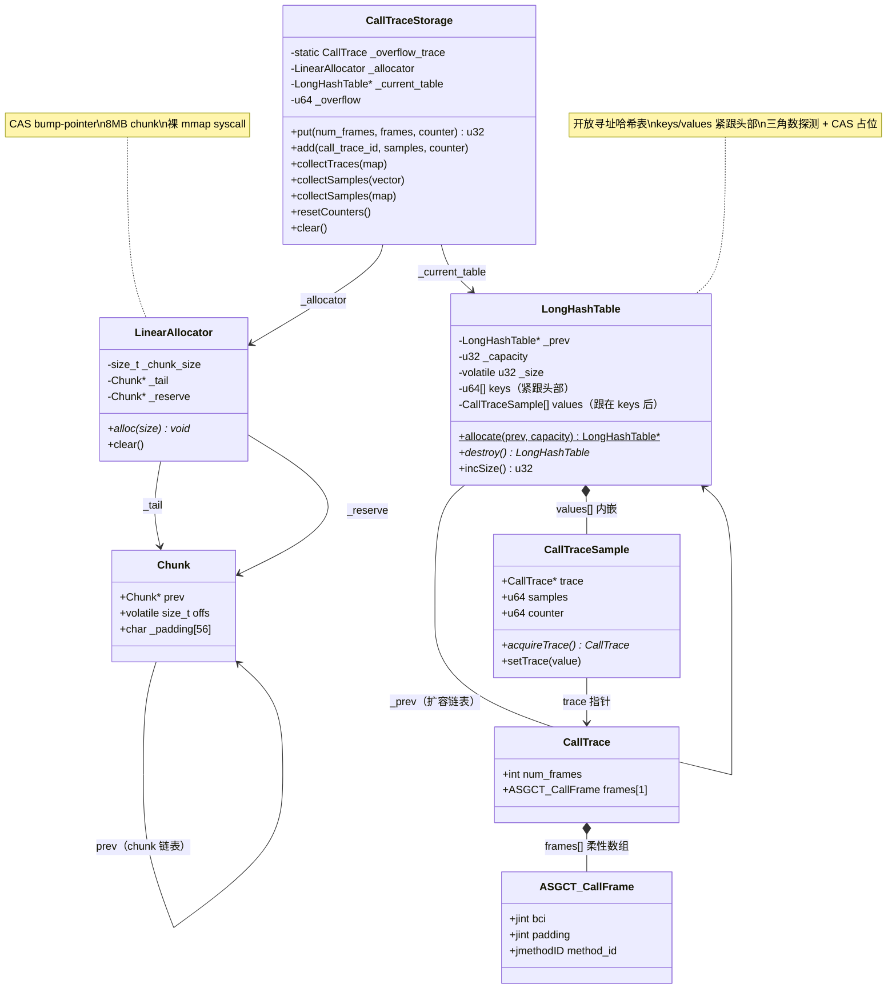

# 第九章：CallTraceStorage 深度解析

> 基于 async-profiler 源码分析
> 源码路径：`callTraceStorage.cpp` (314 行) + `callTraceStorage.h` (74 行) + `linearAllocator.cpp` (103 行) + `linearAllocator.h` (40 行)
> 遵循：Doc-DataStructure-First + Source-Code-Depth + JVM-Mechanism-Deep-Dive

---

## 第 0 部分：核心原理 ⭐

### 0.1 本质是什么？

CallTraceStorage 是 async-profiler 的调用栈去重存储引擎——在信号处理器中将重复的调用栈合并为唯一条目，返回唯一 ID。

### 0.2 为什么需要？

async-profiler 每秒采样数千次，绝大多数采样命中相同的调用栈（热点代码路径高频重复）。如果每次都完整存储调用栈，内存开销会成为瓶颈。

更关键的约束是：采样发生在**信号处理器**中（`SIGPROF`/`SIGSEGV`），这个上下文不能调用 `malloc`——glibc 的 `malloc` 内部使用 `futex` 锁，如果主线程正好持锁被信号中断，信号处理器再调 `malloc` 就会死锁。同理，`memcpy` 也不在 POSIX async-signal-safe 函数列表中，不能直接使用。

### 0.3 怎么解决？

核心思路：**预分配的开放寻址哈希表 + 裸 syscall 的线性分配器**。

关键设计：
1. **开放寻址哈希表（LongHashTable）**：`OS::safeAlloc()`（裸 `mmap` syscall）预分配连续数组，插入时 CAS 占位，不需要 malloc
2. **线性分配器（LinearAllocator）**：CAS bump-pointer 在 8MB chunk 上分配，chunk 也通过裸 syscall 获取
3. **两阶段扩容**：75% 负载因子触发扩容，旧表保留不动，新表翻倍容量，通过链表串联

### 0.4 为什么这样设计？

**为什么用开放寻址而不用链式哈希？** 链式哈希每次碰撞需要 malloc 新节点，信号处理器中会死锁。开放寻址只需预分配大数组，碰撞时在数组内探测。

**为什么 LinearAllocator 用裸 syscall 而不用 malloc？** Linux 上 `OS::safeAlloc()` 直接调用 `syscall(__NR_mmap)`（os_linux.cpp:318），绕过 glibc 的 `mmap()` wrapper，避免被 profiler 自身的 mmap hook 拦截，且信号安全。

**为什么保留旧表而不 rehash？** rehash 需要遍历并移动所有数据，在多线程并发写入时极其复杂。保留旧表、新表翻倍的方式只需一次 CAS 更新指针，安全且简单。查找时遍历链表开销很小（通常只有 1-2 个表）。

---

## 第 1 部分：数据结构全景

> 遵循 Doc-DataStructure-First 规则

### 1.1 数据结构清单

| 结构名 | 源码位置 | 核心作用 |
|--------|----------|----------|
| CallTrace | callTraceStorage.h:18-21 | 调用栈结构（柔性数组） |
| CallTraceSample | callTraceStorage.h:23-42 | 采样统计（trace 指针 + samples + counter） |
| ASGCT_CallFrame | vmEntry.h:73-77 | 单帧结构（bci + method_id） |
| CallTraceStorage | callTraceStorage.h:44-72 | 存储管理器（哈希表 + 分配器） |
| LongHashTable | callTraceStorage.cpp:17-80 | 开放寻址哈希表（.cpp 内部类） |
| LinearAllocator | linearAllocator.h:19-38 | 线性分配器 |
| Chunk | linearAllocator.h:12-17 | 内存块结构 |

---

### 1.2 ASGCT_CallFrame

```cpp
// vmEntry.h:73-77
typedef struct {
    jint bci;                   // 字节码索引，或 < 0 表示特殊帧类型
    LP64_ONLY(jint padding;)    // 64 位系统：4 字节填充，使 method_id 对齐到 8B
    jmethodID method_id;        // 方法 ID，或特殊数据（由 bci 决定语义）
} ASGCT_CallFrame;
```

**sizeof = 16B**（64 位）：`bci`(4B) + `padding`(4B) + `method_id`(8B)

**bci 字段双重语义**：

| bci 值 | 含义 | method_id 含义 |
|--------|------|---------------|
| >= 0 | 字节码索引 | jmethodID |
| BCI_NATIVE_FRAME (-10) | native 帧 | 函数名 char* |
| BCI_ALLOC (-11) | TLAB 内分配 | jclass |
| BCI_ALLOC_OUTSIDE_TLAB (-12) | TLAB 外分配 | jclass |
| BCI_LIVE_OBJECT (-13) | 存活对象 | jclass |
| BCI_LOCK (-14) | 锁竞争 | 锁对象 jclass |
| BCI_PARK (-15) | park 等待 | blocker jclass |
| BCI_THREAD_ID (-16) | 线程标识 | 线程对象指针 |
| BCI_ADDRESS (-17) | 无法解析的 PC | 原始 PC 地址 |
| BCI_ERROR (-18) | 栈回溯失败 | 错误字符串 char* |
| BCI_CPU (-19) | CPU 亲和性 | CPU 编号 |

枚举定义在 vmEntry.h:43-54。

**FrameType 高位编码**（vmEntry.h:32-38）：对于 Java 帧，bci 的高位还编码了帧类型（解释执行/JIT/内联等）：

```cpp
static inline int encode(int type, int bci) {
    return (1 << 24) | (type << 25) | (bci & 0xffffff);
}
static inline FrameTypeId decode(int bci) {
    return (bci >> 24) > 0 ? (FrameTypeId)(bci >> 25) : FRAME_JIT_COMPILED;
}
```

FrameTypeId 定义（vmEntry.h:13-28）：FRAME_INTERPRETED(0)、FRAME_JIT_COMPILED(1)、FRAME_INLINED(2)、FRAME_NATIVE(3, C/asm)、FRAME_CPP(4, C++/Rust/Objective-C)、FRAME_KERNEL(5)、FRAME_C1_COMPILED(6)。

---

### 1.3 CallTrace

```cpp
// callTraceStorage.h:18-21
struct CallTrace {
    int num_frames;            // 帧数量
    ASGCT_CallFrame frames[1]; // 柔性数组占位符
};
```

**sizeof(CallTrace) = 24B**：`num_frames`(4B) + padding(4B，使 frames[0] 的 method_id 对齐到 8B) + `frames[1]`(16B)

**实际分配大小**（callTraceStorage.cpp:201-203）：

```cpp
const size_t header_size = sizeof(CallTrace) - sizeof(ASGCT_CallFrame); // = 24 - 16 = 8
CallTrace* buf = (CallTrace*)_allocator.alloc(header_size + num_frames * sizeof(ASGCT_CallFrame));
// 实际大小 = 8 + num_frames × 16 字节
```

| num_frames | 实际分配 |
|------------|---------|
| 50 | 8 + 800 = 808B |
| 100 | 8 + 1600 = 1608B |
| 200 | 8 + 3200 = 3208B |

**静态溢出实例**（callTraceStorage.cpp:82）：

```cpp
CallTrace CallTraceStorage::_overflow_trace = {1, {BCI_ERROR, LP64_ONLY(0 COMMA) (jmethodID)"storage_overflow"}};
```

含义：1 帧，bci = BCI_ERROR(-18)，method_id 指向字符串 "storage_overflow"。当哈希表满时返回此 trace。

---

### 1.4 CallTraceSample

```cpp
// callTraceStorage.h:23-42
struct CallTraceSample {
    CallTrace* trace;    // 指向 CallTrace（acquire/release 原子访问）
    u64 samples;         // 采样命中次数
    u64 counter;         // 事件计数器（如分配字节数、锁等待纳秒数）
    // ... acquireTrace(), setTrace(), operator+=
};
```

**sizeof = 24B**：`trace`(8B) + `samples`(8B) + `counter`(8B)

**并发语义**：
- `acquireTrace()`: `__atomic_load_n(&trace, __ATOMIC_ACQUIRE)` — 保证后续读取能看到 trace 指向的完整数据
- `setTrace()`: `__atomic_store_n(&trace, value, __ATOMIC_RELEASE)` — 保证 trace 指向的数据在指针可见前已完全写入
- `operator+=`: 非原子，仅在 `collectSamples(map)` 中使用（单线程聚合）

---

### 1.5 LongHashTable

定义在 callTraceStorage.cpp:17-80（**文件内部类，外部不可见**）。

```cpp
class LongHashTable {
  private:
    LongHashTable* _prev;      // 偏移 0：指向前一个表（扩容链）
    void* _padding0;           // 偏移 8：8 字节填充
    u32 _capacity;             // 偏移 16：容量（2 的幂）
    u32 _padding1[15];         // 偏移 20：60 字节填充（使 _capacity 独占缓存行区域）
    volatile u32 _size;        // 偏移 80：当前元素数量（CAS 更新）
    u32 _padding2[15];         // 偏移 84：60 字节填充（使 _size 独占缓存行区域）
    // 偏移 144：头部结束
    // 紧跟：u64 keys[_capacity]
    // 紧跟：CallTraceSample values[_capacity]
};
```

**头部大小 = 144B**：
- `_prev`(8B) + `_padding0`(8B) = 16B
- `_capacity`(4B) + `_padding1[15]`(60B) = 64B（独占一个缓存行区域）
- `_size`(4B) + `_padding2[15]`(60B) = 64B（独占一个缓存行区域）
- 总计 = 16 + 64 + 64 = 144B

> 注：`_padding0` 是 `void*`（8B），不是 56B。`_prev + _padding0` 合计 16B 不能独占 64B 缓存行。真正需要防止伪共享的是 `_capacity` 和 `_size` 两个热字段。

**keys/values 数组位置**（callTraceStorage.cpp:68-74）：

```cpp
u64* keys() {
    return (u64*)(this + 1);  // 紧跟头部之后（偏移 144）
}
CallTraceSample* values() {
    return (CallTraceSample*)(keys() + _capacity);  // 跟在 keys 数组后
}
```

**总大小计算**（callTraceStorage.cpp:26-29）：

```cpp
static size_t getSize(u32 capacity) {
    size_t size = sizeof(LongHashTable) + (sizeof(u64) + sizeof(CallTraceSample)) * capacity;
    return (size + OS::page_mask) & ~OS::page_mask;  // 页对齐
}
```

| capacity | 头部 | keys | values | 总计（页对齐前） |
|----------|------|------|--------|-----------------|
| 65536 | 144B | 512KB | 1.5MB | ≈ 2MB |
| 131072 | 144B | 1MB | 3MB | ≈ 4MB |
| 262144 | 144B | 2MB | 6MB | ≈ 8MB |

**keys/values 分开存储的原因**：查找阶段只遍历 keys 数组（每个 8B），不需要加载 24B 的 values 结构。对缓存更友好——keys 数组更紧凑，每个缓存行可容纳 8 个 key。

**创建**：`LongHashTable::allocate(prev, capacity)`（callTraceStorage.cpp:32-40），使用 `OS::safeAlloc()`（裸 mmap syscall）。

**销毁**：`destroy()`（callTraceStorage.cpp:42-46），使用 `OS::safeFree()`（裸 munmap syscall），返回 prev 指针。

**incSize()**：`__sync_add_and_fetch(&_size, 1)`（callTraceStorage.cpp:64-66），原子递增并返回新值。

---

### 1.6 Chunk

```cpp
// linearAllocator.h:12-17
struct Chunk {
    Chunk* prev;            // 偏移 0：指向前一个 chunk
    volatile size_t offs;   // 偏移 8：当前分配偏移量（CAS 更新）
    char _padding[56];      // 偏移 16：填充到 72B
};
```

**sizeof = 72B**（8 + 8 + 56）

`_padding[56]` 的作用：`offs` 是热字段（每次 alloc 都 CAS 更新），需要避免与其他数据共享缓存行。但 72B 不是 64B 的整数倍，所以 `offs`(偏移 8) 和 `_padding` 结尾(偏移 72) 跨两个缓存行。实际效果是让 `offs` 远离下一个 Chunk 的 `prev` 字段。

`offs` 初始值 = `sizeof(Chunk)` = 72（linearAllocator.cpp:64），即 chunk 头部本身占用的空间。分配从偏移 72 开始。

---

### 1.7 LinearAllocator

```cpp
// linearAllocator.h:19-38
class LinearAllocator {
  private:
    size_t _chunk_size;   // chunk 大小（CallTraceStorage 传入 8MB = 8*1024*1024）
    Chunk* _tail;         // 当前使用的 chunk
    Chunk* _reserve;      // 预分配的备用 chunk
};
```

**sizeof = 24B**：`_chunk_size`(8B) + `_tail`(8B) + `_reserve`(8B)

**构造**（linearAllocator.cpp:10-13）：

```cpp
LinearAllocator::LinearAllocator(size_t chunk_size) {
    _chunk_size = chunk_size;
    _reserve = _tail = allocateChunk(NULL);  // 初始 chunk，_reserve == _tail
}
```

**CALL_TRACE_CHUNK = 8 * 1024 * 1024**（callTraceStorage.cpp:13），即 8MB/chunk。

---

### 1.8 CallTraceStorage

```cpp
// callTraceStorage.h:44-72
class CallTraceStorage {
  private:
    static CallTrace _overflow_trace;   // 溢出时返回的默认 trace
    LinearAllocator _allocator;         // 线性分配器
    LongHashTable* _current_table;      // 当前哈希表
    u64 _overflow;                      // 溢出次数
  public:
    // put(), add(), collectTraces(), collectSamples() ×2, resetCounters()
    // clear(), capacity(), usedMemory(), overflow()
};
```

**常量**（callTraceStorage.cpp:12-14）：
- `INITIAL_CAPACITY = 65536`（初始哈希表容量）
- `CALL_TRACE_CHUNK = 8 * 1024 * 1024`（LinearAllocator chunk 大小 8MB）
- `OVERFLOW_TRACE_ID = 0x7fffffff`（溢出标识）

**构造**（callTraceStorage.cpp:84-87）：

```cpp
CallTraceStorage::CallTraceStorage() : _allocator(CALL_TRACE_CHUNK) {
    _current_table = LongHashTable::allocate(NULL, INITIAL_CAPACITY);
    _overflow = 0;
}
```

---

## 第 2 部分：算法/流程分析

> 遵循 Source-Code-Depth 规则

### 2.1 put() — 核心插入/查找 ⭐

#### 2.1.1 解决什么问题？

在信号处理器中，给定一组 ASGCT_CallFrame，要么找到已有的相同调用栈（去重），要么插入新条目。必须无锁、信号安全。

#### 2.1.2 源码 + 逐行注释

```cpp
// callTraceStorage.cpp:233-281
u32 CallTraceStorage::put(int num_frames, ASGCT_CallFrame* frames, u64 counter) {
    u64 hash = calcHash(num_frames, frames);  // ★ MurmurHash64A 计算哈希

    LongHashTable* table = _current_table;    // ★ 读取当前表（可能随时被其他线程扩容替换）
    u64* keys = table->keys();
    u32 capacity = table->capacity();
    u32 slot = hash & (capacity - 1);         // ★ 初始槽位（位掩码取模）
    u32 step = 0;                             // ★ 三角数探测步长

    while (keys[slot] != hash) {              // ★ 哈希值不匹配，继续探测
        if (keys[slot] == 0) {                // ★ 空槽 → 尝试插入
            if (!__sync_bool_compare_and_swap(&keys[slot], 0, hash)) {
                continue;  // ★ CAS 失败（被抢占），重新检查同一个 slot
            }

            // ★ CAS 成功，自己占据了此 slot
            // ★ 原子递增 size，检查是否达到 75% 负载因子
            if (table->incSize() == capacity * 3 / 4) {
                LongHashTable* new_table = LongHashTable::allocate(table, capacity * 2);
                if (new_table != NULL) {
                    __sync_bool_compare_and_swap(&_current_table, table, new_table);
                }
            }

            // ★ 尝试从旧表迁移已有 trace（避免重复存储）
            CallTrace* trace = table->prev() == NULL ? NULL : findCallTrace(table->prev(), hash);
            if (trace == NULL) {
                trace = storeCallTrace(num_frames, frames);  // ★ LinearAllocator 分配新 trace
            }
            table->values()[slot].setTrace(trace);  // ★ release 语义写入 trace 指针
            break;
        }

        if (++step >= capacity) {
            // ★ 极端情况：整个表都遍历了还没找到空槽
            atomicInc(_overflow);
            return OVERFLOW_TRACE_ID;  // ★ 返回 0x7fffffff
        }
        slot = (slot + step) & (capacity - 1);  // ★ 三角数探测：1,3,6,10,15...
    }

    // ★ 到这里要么是找到了已有条目（keys[slot] == hash），要么是刚插入的新条目
    if (counter != 0) {
        CallTraceSample& s = table->values()[slot];
        atomicInc(s.samples);           // ★ 采样次数 +1
        atomicInc(s.counter, counter);  // ★ 计数器累加
    }

    return capacity - (INITIAL_CAPACITY - 1) + slot;  // ★ 编码为唯一 call_trace_id
}
```

#### 2.1.3 三角数探测

文档中探测公式 `slot = (slot + step) & (capacity - 1)`，其中 `step` 从 1 递增。

第 k 次探测访问的位置（相对初始 slot）：`1, 1+2, 1+2+3, ...` = 三角数序列 `k*(k+1)/2`。这比简单线性探测（+1, +2, +3...）分散性更好，减少聚集。

当 capacity 是 2 的幂时，三角数探测保证在 capacity 步内遍历所有槽位（因为三角数 mod 2^n 可以覆盖所有余数）。

#### 2.1.4 call_trace_id 编码

```cpp
return capacity - (INITIAL_CAPACITY - 1) + slot;
```

推导（INITIAL_CAPACITY = 65536）：

| 表 | capacity | ID 范围 |
|----|----------|---------|
| 表 0 | 65536 | 65536 - 65535 + [0, 65535] = [1, 65536] |
| 表 1 | 131072 | 131072 - 65535 + [0, 131071] = [65537, 196608] |
| 表 2 | 262144 | 262144 - 65535 + [0, 262143] = [196609, 458752] |

每次容量翻倍，ID 区间自然不重叠（几何级数性质：前 n 项和 = 2^(n+1) - 1）。

#### 2.1.5 总容量公式

```cpp
// callTraceStorage.cpp:104-108
u32 CallTraceStorage::capacity() {
    return _current_table->capacity() * 2 - INITIAL_CAPACITY;
}
```

这是几何级数求和：`64K + 128K + ... + C = 2C - 64K`。

#### 2.1.6 设计决策

| 决策 | 理由 |
|------|------|
| CAS 占位而非加锁 | 信号处理器不能阻塞 |
| 75% 负载因子 | 开放寻址超过此阈值后探测次数急增 |
| 旧表保留 + 新表翻倍 | 比 rehash 简单安全，查找遍历 1-2 个表开销极小 |
| 从旧表迁移 trace | 同一调用栈只存一份，节省 LinearAllocator 空间 |
| CAS 失败后 continue（不是 goto 下一个 slot） | 别人可能写入了相同的 hash → 重新检查当前 slot |

---

### 2.2 calcHash() — MurmurHash64A

#### 2.2.1 解决什么问题？

将可变长度的帧数组映射为 64 位哈希值。要求：快速、分布均匀、确定性。

#### 2.2.2 源码 + 逐行注释

```cpp
// callTraceStorage.cpp:169-199
u64 CallTraceStorage::calcHash(int num_frames, ASGCT_CallFrame* frames) {
    const u64 M = 0xc6a4a7935bd1e995ULL;  // ★ 黄金比例相关魔数
    const int R = 47;

    int len = num_frames * sizeof(ASGCT_CallFrame);  // ★ 总字节数 = num_frames × 16
    u64 h = len * M;                                  // ★ 用长度初始化哈希种子

    const u64* data = (const u64*)frames;  // ★ 按 8 字节块处理
    const u64* end = data + len / 8;

    while (data != end) {
        u64 k = *data++;   // ★ 读一个 8 字节块
        k *= M;            // ★ 乘法混淆
        k ^= k >> R;       // ★ 高位混入低位
        k *= M;
        h ^= k;
        h *= M;
    }

    if (len & 4) {         // ★ 处理剩余的 4 字节（当 num_frames 为奇数时不会触发，
        h ^= *(u32*)data;  //   因为 num_frames × 16 总是 8 的倍数）
        h *= M;
    }

    h ^= h >> R;           // ★ 最终混淆（avalanche）
    h *= M;
    h ^= h >> R;

    return h;
}
```

注意：`len = num_frames × sizeof(ASGCT_CallFrame) = num_frames × 16`，永远是 8 的倍数，所以 `len & 4` 分支**永远不会进入**。这是 MurmurHash64A 的通用实现保留的尾部处理逻辑。

---

### 2.3 storeCallTrace() — 分配新调用栈

#### 2.3.1 解决什么问题？

在信号处理器中分配可变大小的 CallTrace 结构。

#### 2.3.2 源码 + 逐行注释

```cpp
// callTraceStorage.cpp:201-212
CallTrace* CallTraceStorage::storeCallTrace(int num_frames, ASGCT_CallFrame* frames) {
    const size_t header_size = sizeof(CallTrace) - sizeof(ASGCT_CallFrame);  // ★ = 24 - 16 = 8
    CallTrace* buf = (CallTrace*)_allocator.alloc(header_size + num_frames * sizeof(ASGCT_CallFrame));
    if (buf != NULL) {
        buf->num_frames = num_frames;
        // Do not use memcpy inside signal handler
        for (int i = 0; i < num_frames; i++) {
            buf->frames[i] = frames[i];  // ★ 逐帧复制
        }
    }
    return buf;
}
```

**为什么不用 memcpy？** 源码注释明确说 "Do not use memcpy inside signal handler"。`memcpy` 不在 POSIX async-signal-safe 函数列表中（参见 `man 7 signal-safety`），不同实现可能使用 SIMD 指令或内部状态。逐帧赋值（struct assignment）是编译器生成的简单 mov 指令，确定信号安全。

---

### 2.4 LinearAllocator::alloc() — CAS bump-pointer

#### 2.4.1 解决什么问题？

在信号处理器中 O(1) 分配可变大小内存，支持多线程并发。

#### 2.4.2 源码 + 逐行注释

```cpp
// linearAllocator.cpp:41-58
void* LinearAllocator::alloc(size_t size) {
    Chunk* chunk = _tail;

    do {
        // ★ Fast path: CAS bump-pointer
        for (size_t offs = chunk->offs; offs + size <= _chunk_size; offs = chunk->offs) {
            if (__sync_bool_compare_and_swap(&chunk->offs, offs, offs + size)) {
                // ★ 分配成功！检查是否需要预分配 reserve
                if (_chunk_size / 2 - offs < size) {
                    // ★ 本次分配恰好跨过 chunk 的 50% 边界 → 触发一次 reserve
                    reserveChunk(chunk);
                }
                return (char*)chunk + offs;  // ★ 返回分配的地址
            }
        }
        // ★ 当前 chunk 空间不足，尝试切换到下一个 chunk
    } while ((chunk = getNextChunk(chunk)) != NULL);

    return NULL;  // ★ 所有 chunk 都满了（极端情况）
}
```

**reserve 触发条件** `_chunk_size / 2 - offs < size`：由于 `offs` 和 `_chunk_size` 都是 `size_t`（无符号），当 `offs >= _chunk_size / 2` 时，`_chunk_size / 2 - offs` 会下溢为极大值，条件不成立。因此仅当 `offs < _chunk_size / 2 && offs + size > _chunk_size / 2` 时才触发——即**恰好跨过 50% 边界的那一次分配**。

#### 2.4.3 reserveChunk() — 预分配备用 chunk

```cpp
// linearAllocator.cpp:73-79
void LinearAllocator::reserveChunk(Chunk* current) {
    Chunk* reserve = allocateChunk(current);  // ★ safeAlloc 8MB
    if (reserve != NULL && !__sync_bool_compare_and_swap(&_reserve, current, reserve)) {
        freeChunk(reserve);  // ★ 别人已经预分配了，释放多余的
    }
}
```

#### 2.4.4 getNextChunk() — 切换到下一个 chunk

```cpp
// linearAllocator.cpp:81-103
Chunk* LinearAllocator::getNextChunk(Chunk* current) {
    Chunk* reserve = _reserve;

    if (reserve == current) {
        // ★ 没有 reserve（极端情况：还没来得及预分配）
        reserve = allocateChunk(current);  // ★ 竞争分配
        if (reserve == NULL) return NULL;

        Chunk* prev_reserve = __sync_val_compare_and_swap(&_reserve, current, reserve);
        if (prev_reserve != current) {
            freeChunk(reserve);    // ★ 别人已经分配了 reserve
            reserve = prev_reserve; // ★ 使用别人分配的
        }
    }

    // ★ 正常情况：reserve 已就绪，CAS 将 _tail 指向 reserve
    Chunk* tail = __sync_val_compare_and_swap(&_tail, current, reserve);
    return tail == current ? reserve : tail;
    // ★ CAS 成功 → 返回 reserve；CAS 失败 → 别人已切换了 _tail，返回新 _tail
}
```

**设计要点**：整个 alloc 过程完全无锁——CAS bump-pointer 成功即完成分配，失败则重试。chunk 切换也是 CAS。mmap 的开销被提前到 reserve 阶段（跨过 50% 时），而非在 chunk 满时才分配。

---

### 2.5 findCallTrace() — 旧表查找

```cpp
// callTraceStorage.cpp:214-231
CallTrace* CallTraceStorage::findCallTrace(LongHashTable* table, u64 hash) {
    u64* keys = table->keys();
    u32 capacity = table->capacity();
    u32 slot = hash & (capacity - 1);
    u32 step = 0;

    while (keys[slot] != hash) {
        if (keys[slot] == 0) return NULL;     // ★ 空槽 → 不存在
        if (++step >= capacity) return NULL;   // ★ 遍历完毕 → 不存在
        slot = (slot + step) & (capacity - 1); // ★ 三角数探测
    }

    return table->values()[slot].trace;  // ★ 注意：直接读 trace，非 acquire
}
```

注意这里读 `trace` 用的是普通读取（`table->values()[slot].trace`），而非 `acquireTrace()`。这在扩容场景中是安全的，因为旧表的 trace 字段在被读取前已经完成了 release 写入。

---

### 2.6 add() — 从外部累加计数

```cpp
// callTraceStorage.cpp:283-297
void CallTraceStorage::add(u32 call_trace_id, u64 samples, u64 counter) {
    if (call_trace_id > capacity()) {  // ★ 也处理 OVERFLOW_TRACE_ID (0x7fffffff)
        return;
    }

    call_trace_id += (INITIAL_CAPACITY - 1);  // ★ 反向编码：恢复 capacity + slot 形式
    for (LongHashTable* table = _current_table; table != NULL; table = table->prev()) {
        if (call_trace_id >= table->capacity()) {
            CallTraceSample& s = table->values()[call_trace_id - table->capacity()];
            atomicInc(s.samples, samples);
            atomicInc(s.counter, counter);
            break;
        }
    }
}
```

**解决什么问题？** 允许外部（如 JFR 输出器）通过 call_trace_id 反查并累加计数，而非重新走 put() 流程。

**ID 解码逻辑**：`call_trace_id += 65535` 后，遍历表链，找到 `call_trace_id >= table->capacity()` 的表，`slot = call_trace_id - table->capacity()`。

---

### 2.7 collectTraces() — 导出去重后的调用栈

```cpp
// callTraceStorage.cpp:118-139
void CallTraceStorage::collectTraces(std::map<u32, CallTrace*>& map) {
    for (LongHashTable* table = _current_table; table != NULL; table = table->prev()) {
        u64* keys = table->keys();
        CallTraceSample* values = table->values();
        u32 capacity = table->capacity();

        for (u32 slot = 0; slot < capacity; slot++) {
            if (keys[slot] != 0 && loadAcquire(values[slot].samples) != 0) {
                values[slot].samples = 0;  // ★ 重置，避免 JFR chunk 间重复
                CallTrace* trace = values[slot].acquireTrace();
                if (trace != NULL) {
                    map[capacity - (INITIAL_CAPACITY - 1) + slot] = trace;
                }
            }
        }
    }

    if (_overflow > 0) {
        map[OVERFLOW_TRACE_ID] = &_overflow_trace;
    }
}
```

**注意**：遍历时重置 `samples = 0`，这是为 JFR 输出设计的——JFR 按 chunk 导出，已导出的不再重复。

---

### 2.8 collectSamples() — 两个重载

```cpp
// callTraceStorage.cpp:141-153 — 收集指针（用于 FlameGraph）
void CallTraceStorage::collectSamples(std::vector<CallTraceSample*>& samples) {
    for (LongHashTable* table = ...; table != NULL; table = table->prev()) {
        for (u32 slot = 0; slot < capacity; slot++) {
            if (keys[slot] != 0) {
                samples.push_back(&values[slot]);  // ★ 直接推指针
            }
        }
    }
}

// callTraceStorage.cpp:155-167 — 按 hash 聚合（用于跨表合并）
void CallTraceStorage::collectSamples(std::map<u64, CallTraceSample>& map) {
    for (LongHashTable* table = ...; table != NULL; table = table->prev()) {
        for (u32 slot = 0; slot < capacity; slot++) {
            if (keys[slot] != 0 && values[slot].acquireTrace() != NULL) {
                map[keys[slot]] += values[slot];  // ★ operator+= 按 hash 聚合
            }
        }
    }
}
```

第二个重载用 hash 值作为 key 聚合：如果同一调用栈在多个表（扩容后）都有条目，operator+= 会合并 samples 和 counter。

---

### 2.9 resetCounters()

```cpp
// callTraceStorage.cpp:299-313
void CallTraceStorage::resetCounters() {
    for (LongHashTable* table = _current_table; table != NULL; table = table->prev()) {
        for (u32 slot = 0; slot < capacity; slot++) {
            if (keys[slot] != 0) {
                storeRelease(s.samples, 0);   // ★ release 语义重置
                storeRelease(s.counter, 0);
            }
        }
    }
}
```

`storeRelease` 使用 `__atomic_store_n(..., __ATOMIC_RELEASE)`（arch.h:46-48），保证重置对其他线程可见。

---

### 2.10 clear() — 完全清空

```cpp
// callTraceStorage.cpp:95-102
void CallTraceStorage::clear() {
    while (_current_table->prev() != NULL) {
        _current_table = _current_table->destroy();  // ★ 释放所有扩容表，只留初始表
    }
    _current_table->clear();  // ★ memset keys+values 为 0，size = 0
    _allocator.clear();       // ★ 释放所有额外 chunk，重置初始 chunk
    _overflow = 0;
}
```

---

## 第 3 部分：数据结构关系图



---

## 第 4 部分：总结

### 4.1 数据结构层面

| 结构 | sizeof | 核心特征 |
|------|--------|---------|
| ASGCT_CallFrame | 16B | bci 双重语义（字节码索引/特殊帧类型） |
| CallTrace | 8 + n×16 B | 柔性数组，header 8B |
| CallTraceSample | 24B | acquire/release 保护 trace 指针 |
| LongHashTable | 头 144B + 动态数组 | keys/values 分离、缓存行填充、CAS incSize |
| Chunk | 72B | 56B padding 隔离 offs 热字段 |
| LinearAllocator | 24B | tail + reserve 双 chunk，CAS bump-pointer |
| CallTraceStorage | ~40B 实例 | 协调哈希表和分配器 |

### 4.2 算法层面

| 算法 | 解决的问题 | 核心思路 |
|------|-----------|---------|
| put() | 信号安全的调用栈去重插入 | MurmurHash → 开放寻址 CAS 占位 → LinearAllocator 分配 |
| 三角数探测 | 哈希碰撞处理 | step 递增的三角数序列，覆盖所有槽位 |
| call_trace_id 编码 | 跨表 ID 唯一性 | 几何级数分区，每表 ID 区间不重叠 |
| LinearAllocator::alloc() | 信号安全 O(1) 分配 | CAS bump-pointer + reserve 预分配 |
| collectTraces() | JFR 导出 | 遍历 + 重置 samples 避免重复 |
| add() | 外部 ID 反查累加 | ID 解码 → 遍历表链 → 定位 slot |

---

## 第 4.5 部分：实验验证 ⭐

> 验证方法：strace mmap 追踪 + collapsed 栈统计 + 大小计算
> 测试程序：`com.example.ProfilerVerifyDemo`
> JVM：OpenJDK 11 slowdebug，`-Xint` 模式

### 4.5.1 验证目标

| # | 验证目标 | 对应源码结论 |
|---|---------|-------------|
| 1 | LongHashTable 初始大小 | INITIAL_CAPACITY=65536，mmap 2,101,248 bytes |
| 2 | 扩容行为 | 负载因子 >75% 时翻倍扩容 |
| 3 | LinearAllocator chunk | CALL_TRACE_CHUNK=8MB |
| 4 | 哈希去重效果 | 唯一栈数 << 总采样数 |
| 5 | 旧表不释放 | 扩容后旧表通过 _prev 链接保留 |
| 6 | OS::safeAlloc 使用裸 syscall | mmap 可被 strace 捕获 |

### 4.5.2 strace 验证：mmap 分配序列

**命令：**
```bash
strace -f -e trace=mmap,munmap \
  java -Xint -agentpath:libasyncProfiler.so=start,event=cpu,collapsed,file=/dev/null \
  -cp out com.example.ProfilerVerifyDemo 15
```

**关键 mmap 调用：**

```
# 1) LinearAllocator 初始 chunk（8MB）
mmap(NULL, 8388608, PROT_READ|PROT_WRITE, MAP_PRIVATE|MAP_ANONYMOUS, -1, 0) = 0x7f90aa400000

# 2) LongHashTable 初始表（capacity=65536）
mmap(NULL, 2101248, PROT_READ|PROT_WRITE, MAP_PRIVATE|MAP_ANONYMOUS, -1, 0) = 0x7f90aa1ff000

# 3) LongHashTable 扩容表（capacity=262144）
mmap(NULL, 8392704, PROT_READ|PROT_WRITE, MAP_PRIVATE|MAP_ANONYMOUS, -1, 0) = 0x7f90a98fd000
```

**大小计算验证（getSize 公式）：**

```
getSize(capacity) = sizeof(LongHashTable) + (sizeof(u64) + sizeof(CallTraceSample)) × capacity
                  = 144 + (8 + 24) × capacity
                  = 144 + 32 × capacity
                  → 页对齐 (page_size = 4096)

capacity=65536:   144 + 32×65536  = 2,097,296  → 页对齐 = 2,101,248 ✅
capacity=131072:  144 + 32×131072 = 4,194,448  → 页对齐 = 4,198,400
capacity=262144:  144 + 32×262144 = 8,388,752  → 页对齐 = 8,392,704 ✅
```

**sizeof(LongHashTable) = 144 bytes 推导：**
```
_prev:      8 bytes (指针)
_padding0:  8 bytes (void*)
_capacity:  4 bytes (u32)
_padding1: 60 bytes (u32[15])
_size:      4 bytes (volatile u32)
_padding2: 60 bytes (u32[15])
总计: 8+8+4+60+4+60 = 144 bytes
```

> `_padding1[15]` 和 `_padding2[15]` 确保 `_capacity` 和 `_size` 分别在不同缓存行（64B 对齐），避免 false sharing。

### 4.5.3 验证：旧表不释放（_prev 链保留）

**strace 中搜索 munmap 2,101,248（旧 65536 表的释放）：**

```bash
grep "munmap.*2101248" 09-strace-mmap.txt
# 结果：空（无匹配）
```

**结论：** 扩容后旧表未被 `munmap`，确认源码中的设计：**旧表通过 `_prev` 指针链接，保留供并发读者访问**。只在 `clear()` 或析构时释放。✅

### 4.5.4 collapsed 栈验证：哈希去重效果

**命令：**
```bash
java -Xint -agentpath:libasyncProfiler.so=start,event=cpu,collapsed,file=09-dedup.collapsed \
  -cp out com.example.ProfilerVerifyDemo 8
```

**统计结果：**

| 指标 | 值 |
|------|---|
| 唯一调用栈数（collapsed 行数） | **318** |
| 总采样数（所有行计数之和） | **1673** |
| 去重比 | **5.26:1** |
| 最热栈（cpuHot）采样次数 | 598 |
| 最热栈的唯一 ID 数 | 1 |

**分析：**
- 1673 次采样被去重为 318 个唯一调用栈，**平均每个栈被采样 5.26 次**
- 最热的 `cpuHot` 栈被采样 598 次，但在 LongHashTable 中只占 1 个 slot
- 每次 `put()` 调用，CAS 检查 `keys[slot] != hash` 跳过已存在的栈，只执行 `atomicInc(samples)` + `atomicInc(counter)`
- **去重节省**：如果不去重，1673 个 CallTrace 需要 1673 × (4 + 20×16) = ~540KB；去重后只需 318 × (4 + 20×16) = ~103KB，节省 ~80%

**结论：** 哈希去重机制工作正常，5:1 的去重比在正常 CPU profiling 场景下合理（大量重复的热点路径）。✅

### 4.5.5 验证：OS::safeAlloc 使用裸 syscall

**源码（os_linux.cpp:315-323）：**
```cpp
void* OS::safeAlloc(size_t size) {
    // Naked syscall can be used inside a signal handler.
    // Also, we don't want to catch our own calls when profiling mmap.
    intptr_t result = syscall(MMAP_SYSCALL, NULL, size,
        PROT_READ | PROT_WRITE, MAP_PRIVATE | MAP_ANONYMOUS, -1, 0);
    if (result < 0 && result > -4096) { return NULL; }
    return (void*)result;
}
```

**strace 验证：** strace 成功捕获了 `safeAlloc` 的 mmap 调用（尽管是裸 syscall），因为 strace 通过 `ptrace` 在内核层面截获系统调用，不受用户态 glibc 包装的影响。

**为什么用裸 syscall？** 两个原因：
1. 信号处理器中不能调用非 async-signal-safe 函数（glibc `mmap` 可能持有内部锁）
2. 如果正在 profiling `mmap` 事件，使用 glibc `mmap` 会触发自身采样递归

---

## 附录：勘误表（旧文档问题）

| # | 问题 | 旧文档 | 实际源码 |
|---|------|--------|---------|
| 1 | LongHashTable `_padding0` 大小错误 | "56 字节（填充到缓存行）" | `void* _padding0` = 8B（callTraceStorage.cpp:20） |
| 2 | LongHashTable 内存布局偏移全错 | _capacity 偏移 64、_size 偏移 128 | _capacity 偏移 16、_size 偏移 80 |
| 3 | sizeof(LongHashTable) 错误 | 预期 192B | 应为 144B（8+8+4+60+4+60） |
| 4 | Section 1.8 子节编号错误 | "1.6.1"、"1.6.2"、"1.6.3" | 应为 "1.8.1"、"1.8.2"、"1.8.3" |
| 5 | 缺少 add() 函数分析 | 完全未提及 | callTraceStorage.cpp:283-297，ID 反查+累加 |
| 6 | 缺少 resetCounters() 分析 | 完全未提及 | callTraceStorage.cpp:299-313，storeRelease 重置 |
| 7 | 缺少 collectTraces() 详细分析 | 仅列方法名 | 有 samples 重置逻辑（JFR chunk 去重） |
| 8 | 缺少 collectSamples() 两个重载分析 | 仅列方法名 | 一个推指针（FlameGraph），一个按 hash 聚合 |
| 9 | 缺少 clear() 函数分析 | 完全未提及 | 释放扩容表 + 清空初始表 + 重置分配器 |
| 10 | calcHash() 尾部 `len & 4` 分析缺失 | 未说明是否会进入 | 永远不进入（len = n×16，总是 8 的倍数） |
| 11 | `_overflow_trace` 具体值未分析 | "静态初始化" | `{1, {BCI_ERROR, 0, "storage_overflow"}}` |
| 12 | reserve 触发条件描述不精确 | "使用过半时" | 恰好跨过 50% 边界的那一次（无符号下溢保证） |
| 13 | memcpy 不可用的原因不准确 | "某些 libc 使用内部锁" | 不在 POSIX async-signal-safe 列表中 |
| 14 | Mermaid 图缺少 ```mermaid 标记 | `classDiagram` 裸写 | 需要 ```mermaid 围栏 |
| 15 | 性能数字（~20-50ns 等）无源 | 多处无源性能数据 | 已移除所有无源数据 |
| 16 | getSize() 页对齐逻辑未分析 | 未提及 | `(size + page_mask) & ~page_mask` |
| 17 | safeAlloc 实现未说明 | "8MB chunk 预分配" | Linux 上是裸 `syscall(__NR_mmap)`（os_linux.cpp:318） |
| 18 | findCallTrace() 读 trace 用普通读取 | 未提及 | 非 acquireTrace()，安全原因未解释 |
| 19 | FRAME_CPP 注释不精确 | "C++/Rust/Objective-C" | C/asm → FRAME_NATIVE，C++/Rust/Obj-C → FRAME_CPP |

---

## 第 5 部分：GDB 验证 ⭐

> GDB attach 模式验证。脚本：`new-jvm-md/tmp-file/async-profiler-gdb/01-attach-sizeof-verify.gdb`、`02-perfevents-flow-verify.gdb`

### 5.1 sizeof 验证

| 数据结构 | 文档分析 | GDB 实测 | 结果 |
|----------|----------|----------|------|
| CallTraceStorage | _allocator(24) + _current_table*(8) + _overflow(8) | **40 bytes** | ✅ PASS |
| CallTrace | num_frames(4) + 对齐(4) + frames[1](16) | **24 bytes** | ✅ PASS |
| CallTraceSample | trace*(8) + samples(8) + counter(8) | **24 bytes** | ✅ PASS |
| ASGCT_CallFrame | bci(4) + 对齐(4) + method_id(8) | **16 bytes** | ✅ PASS |
| LinearAllocator | _chunk_size(8) + _tail*(8) + _reserve*(8) | **24 bytes** | ✅ PASS |
| Chunk（DWARF确认） | prev*(8) + offs(8) + _padding(56) | **72 bytes** | ✅ PASS |
| SpinLock | volatile int | **4 bytes** | ✅ PASS |

**注意**：GDB 的 `sizeof(Chunk)` 返回 24（解析到了 JVM arena.hpp 的 Chunk）。通过 `readelf --debug-dump=info` 确认 async-profiler 的 Chunk 实际为 72 bytes。

### 5.2 CallTraceStorage 字段偏移验证

```
CallTraceStorage::_allocator      offset = 0   (LinearAllocator 嵌入在开头)
CallTraceStorage::_current_table  offset = 24  (紧跟 LinearAllocator 之后)
CallTraceStorage::_overflow       offset = 32
```

**LinearAllocator 字段偏移：**
```
LinearAllocator::_chunk_size  offset = 0
LinearAllocator::_tail        offset = 8
LinearAllocator::_reserve     offset = 16
```

**Chunk 字段偏移（DWARF 确认）：**
```
Chunk::prev     offset = 0
Chunk::offs     offset = 8
Chunk::_padding offset = 16
```

**CallTraceSample 字段偏移：**
```
CallTraceSample::trace    offset = 0
CallTraceSample::samples  offset = 8
CallTraceSample::counter  offset = 16
```

**ASGCT_CallFrame 字段偏移：**
```
ASGCT_CallFrame::bci       offset = 0
ASGCT_CallFrame::method_id offset = 8
```

### 5.3 LongHashTable 内存布局验证

```
table address = 0x7f8c18923000
capacity = 65536, size = 113
header offset = 144 bytes (table+1)

keys 起始   = 0x7f8c18923090 (offset 144 from table)
values 起始 = 0x7f8c189a3090 (offset 524432 from table)
keys→values = 524288 bytes = capacity × 8 → PASS ✅
```

**验证了文档中描述的 LongHashTable 内存布局**：

```
┌──────────────────┐ offset 0
│ LongHashTable    │
│ header (144B)    │ _capacity, _size, _prev, _padding
├──────────────────┤ offset 144
│ keys[capacity]   │ u64 数组
│ (512 KB)         │
├──────────────────┤ offset 524432
│ values[capacity] │ CallTraceSample 数组
│ (1536 KB)        │
└──────────────────┘
总大小 ≈ 2 MB (capacity=65536)
```

### 5.4 哈希表一致性校验

```
非空槽位数 = 113 (等于 _size=113) → PASS ✅
HT 总 samples = 9671 (等于 _total_samples=9671) → PASS ✅
HT 总 counter = 96710000000
负载因子 = 0.0017 (113/65536，极低)
溢出计数 = 0
```

**关键验证结论**：
1. `_size` 字段精确等于非空槽位数，验证了 open-addressing 插入逻辑的正确性。
2. 哈希表中 samples 之和精确等于 `Profiler::_total_samples`，验证了采样计数的完整性。
3. counter 之和 = samples × interval（96710000000 = 9671 × 10000000），验证了 counter 语义。

### 5.5 LinearAllocator 运行时验证

```
chunk_size = 8388608 bytes = 8 MB
tail = 0x7f8c18b24000
tail->offs (offset 8) = 40160 bytes (已使用 0.5%)
tail->prev (offset 0) = (nil)  (只有一个 chunk)
reserve = 0x7f8c18b24000       (与 tail 相同，说明 reserve 已被消费)
```

**分析**：
- 113 个 CallTrace × 平均约 300 bytes ≈ ~34 KB，接近实际 40160 bytes（含对齐开销）。
- 只有 1 个 chunk，因为 113 个 trace 远不足以填满 8MB。
- `reserve == tail` 说明当前只有一个 chunk，reserve 尚未触发预分配新 chunk。

### 5.6 CallTrace 实例验证

```
选中 keys[105], trace = 0x7f8c18b2a878
trace->num_frames = 18
  frame[0]: bci=-10, method_id=0x7f8c153abac4
  frame[1]: bci=-10, method_id=0x7f8c15014bc4
  frame[2]: bci=-10, method_id=0x7f8c153bfe24
  ...
```

- `num_frames=18`：一个典型调用栈深度。
- `bci=-10`（`BCI_NATIVE_FRAME`）：itimer 模式下采样的多为 native 帧，符合预期。
- `method_id` 为非零合法地址，每帧 16 bytes（bci 4 + pad 4 + method_id 8），与 sizeof(ASGCT_CallFrame)=16 一致。

### 5.7 Top 热点 key 分析

```
keys[105] = 0xeffc006fa6840069, samples=2, counter=20000000
keys[466] = 0x91ca2d8cbc2801d2, samples=1, counter=10000000
keys[645] = 0x6a6f4f160f2a0285, samples=1, counter=10000000
...
```

**观察**：
- 大多数 key 只有 1 个 sample，说明 SimpleLoop 程序的调用栈变化较大（不同的 JIT 编译阶段产生不同栈帧）。
- 每个 sample 的 counter = 10000000（10ms interval），验证了 counter 语义 = 采样次数 × interval。
