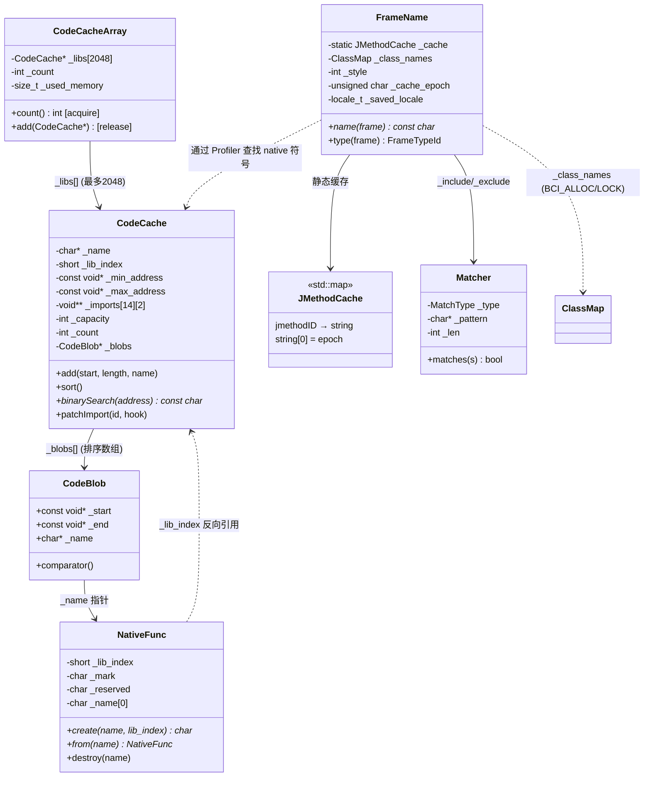

# 第十章：符号解析与 CodeCache 深度解析

> 基于 async-profiler 源码分析
> 源码路径：`/data/workspace/async-profiler/src/codeCache.cpp/h, frameName.cpp/h`
> 遵循：Doc-DataStructure-First + Source-Code-Depth + JVM-Mechanism-Deep-Dive

---

## 第 0 部分：核心原理 ⭐

### 0.1 本质是什么？

符号解析将 profiler 采集的原始标识（PC 地址、jmethodID、类指针）转换为人类可读的函数名/类名。

### 0.2 为什么需要？

async-profiler 采集的栈帧有两种原始形态：native 帧是 PC 地址，Java 帧是 jmethodID。这些标识对开发者没有语义——看到 `0x7f12345678` 或一个内部指针值毫无意义。输出火焰图/文本报告时必须转为 `java.lang.String.hashCode` 或 `libc.so.6malloc` 这样的可读名称。

此外，不同帧类型的解析路径完全不同：native 帧靠 ELF 符号表二分查找，Java 帧靠 JVMTI 查询，特殊帧（BCI_ALLOC/BCI_LOCK 等）靠内部映射表。需要一个统一的分派机制。

### 0.3 怎么解决？

核心思路：**每库一个 CodeCache + JMethodCache 缓存 + FrameName 统一分派**。

关键设计：
1. **CodeCache**：为每个加载的 native 库创建独立 CodeCache，存储该库所有函数的 `[start, end)` 地址范围和名称，排序后二分查找 O(log N)
2. **NativeFunc**：将函数名字符串与元数据（lib_index, mark）连续存储，通过返回 `_name` 指针而非对象指针，让调用者直接把它当字符串用
3. **JMethodCache**：全局 `std::map<jmethodID, std::string>`，避免重复调用开销大的 JVMTI GetMethodName
4. **FrameName::name()**：根据 `frame.bci` 值分派到不同解析路径——switch 处理所有特殊 BCI 类型，default 分支处理 Java 帧

### 0.4 为什么这样设计？

**为什么每库一个 CodeCache 而不是全局一张大表？** 每个库的函数地址空间连续，二分查找效率高。全局表需要先定位库再定位函数，两次查找。此外，per-library 设计天然支持库加载/卸载。

**为什么用排序数组 + 二分查找而不是哈希表？** 地址查找是范围匹配 `address ∈ [start, end)`，哈希表只能精确匹配。排序数组 + 二分查找是范围查询的标准解法。

**为什么 NativeFunc 返回 `_name` 而不是对象指针？** 因为大部分调用者只需要函数名字符串。返回 `_name` 后，需要元数据时通过 `from(name)` 反推对象地址（减去 `sizeof(NativeFunc)` 即可），这样避免了所有使用函数名的地方都要多解一层指针。

---

## 第 1 部分：数据结构全景

> 遵循 Doc-DataStructure-First 规则

### 1.1 数据结构清单

| 结构名 | 源码位置 | 核心作用 | sizeof |
|--------|----------|----------|--------|
| NativeFunc | codeCache.h:51-79 | native 函数元数据 + 函数名 | 4B（固定部分）|
| CodeBlob | codeCache.h:82-101 | 单个函数的地址范围 + 名称 | 24B |
| CodeCache | codeCache.h:106-215 | 单个库的代码缓存 | 320B |
| CodeCacheArray | codeCache.h:218-246 | 所有库的集合 | 16392B |
| ImportId | codeCache.h:19-35 | 14 种需要拦截的导入函数枚举 | — |
| Mark | codeCache.h:43-48 | 函数标记枚举 | — |
| FrameName | frameName.h:54-85 | 帧名称解析器（统一接口）| — |
| JMethodCache | frameName.h:23 | jmethodID → 方法名缓存 | — |
| Matcher | frameName.h:37-51 | 包含/排除过滤器 | — |
| MatchType | frameName.h:29-34 | 4 种匹配模式枚举 | — |

---

### 1.2 NativeFunc — native 函数元数据

#### 问题推导

**问题**：CodeBlob 存储函数地址范围和名称，但 profiler 还需要知道函数属于哪个库、是否是 JVM 内部函数。这些元数据存在哪？

**需要什么信息？**
- 函数所属库的索引（用于 `lib`格式输出时查找库名）
- 函数标记（区分 JVM runtime/interpreter/profiler 自身函数）
- 函数名字符串本身

**推导出的结构**：元数据 + 柔性数组。名称长度不固定（5~100 字节），用固定 header + 柔性数组 `_name[0]` 实现。

#### 真实数据结构

```cpp
// codeCache.h:51-79
class NativeFunc {
  private:
    short _lib_index;    // ★ 所属库索引（CodeCacheArray 中的下标，-1 表示 CodeCache 自身的库名）
    char _mark;          // ★ 标记（0=无标记, 1=VM_RUNTIME, 2=INTERPRETER, 3=COMPILER_ENTRY, 4=ASYNC_PROFILER）
    char _reserved;      // 对齐填充
    char _name[0];       // ★ 柔性数组：函数名字符串（以 '\0' 结尾）

    static NativeFunc* from(const char* name) {
        return (NativeFunc*)(name - sizeof(NativeFunc));  // ★ 从 _name 指针反推 NativeFunc 对象
    }
};
```

**推导 vs 实际**：完全吻合。额外发现 `create()` 返回 `_name` 指针（不是 NativeFunc*），这是关键设计——调用者拿到的就是字符串。

#### sizeof 与内存布局

```
NativeFunc 固定部分
───────────────────────────────────
偏移    字段            大小
───────────────────────────────────
0      _lib_index      2B（short）
2      _mark           1B
3      _reserved       1B
4      _name[0]        0B（占位符）
───────────────────────────────────
sizeof(NativeFunc) = 4B
实际分配 = sizeof(NativeFunc) + 1 + strlen(name)
```

#### 创建位置

```cpp
// codeCache.cpp:16-21
char* NativeFunc::create(const char* name, short lib_index) {
    NativeFunc* f = (NativeFunc*)malloc(sizeof(NativeFunc) + 1 + strlen(name));
    f->_lib_index = lib_index;
    f->_mark = 0;                     // ★ 初始标记为 0
    return strcpy(f->_name, name);    // ★ 返回 _name 地址，不是 NativeFunc*
}
```

调用位置：
- `CodeCache::add()` (codeCache.cpp:79) — 为每个符号创建
- `CodeCache` 构造函数 (codeCache.cpp:35) — 为库名自身创建（`lib_index = -1`）

#### _mark 字段生命周期

```
初始值：0（create() 中设置）
谁设置：CodeCache::mark() 模板方法（codeCache.h:184-196）
何时设置：库加载后，通过 predicate 匹配函数名设置标记
设置什么值：
  - MARK_VM_RUNTIME = 1    → JVM 运行时函数
  - MARK_INTERPRETER = 2   → 解释器函数
  - MARK_COMPILER_ENTRY = 3 → 编译器入口
  - MARK_ASYNC_PROFILER = 4 → profiler 内部函数
谁读取：NativeFunc::mark(name) → 过滤 profiler 自身帧、标记 JVM 关键函数
```

#### 销毁

```cpp
// codeCache.cpp:23-25
void NativeFunc::destroy(char* name) {
    free(from(name));  // ★ 从 _name 反推 NativeFunc*，然后 free
}
```

---

### 1.3 CodeBlob — 代码块

#### 字段列表

```cpp
// codeCache.h:82-101
class CodeBlob {
  public:
    const void* _start;   // ★ 函数起始地址
    const void* _end;     // ★ 函数结束地址（不包含），[_start, _end)
    char* _name;          // ★ 函数名（指向 NativeFunc._name）
};
```

sizeof = 24B（3 × 8B 指针）。

#### 排序比较器

```cpp
// codeCache.h:88-100
static int comparator(const void* c1, const void* c2) {
    CodeBlob* cb1 = (CodeBlob*)c1;
    CodeBlob* cb2 = (CodeBlob*)c2;
    if (cb1->_start < cb2->_start) return -1;
    else if (cb1->_start > cb2->_start) return 1;
    else if (cb1->_end == cb2->_end) return 0;
    else return cb1->_end > cb2->_end ? -1 : 1;  // ★ 相同 start，大 end 排前面
}
```

**为什么相同 start 时大 end 排前面？** 处理嵌套符号（外层函数包含内层函数）。大范围排前面，二分查找先命中外层。

#### 创建位置

`CodeCache::add()` (codeCache.cpp:78-98) 中填充：
```
_blobs[_count]._start = start
_blobs[_count]._end = (char*)start + length
_blobs[_count]._name = NativeFunc::create(name, _lib_index)
```

---

### 1.4 CodeCache — 单个库的代码缓存

#### 问题推导

**问题**：给定一个 PC 地址，如何快速找到对应的 native 函数名？

**需要什么信息？**
- 每个库中所有函数的地址范围
- 库的地址边界（快速判断地址是否属于该库）
- 库名（二分查找未命中时回退）

**推导出的结构**：排序的 CodeBlob 数组 + 地址边界 + 库名。

#### 真实数据结构 — 全部字段

```cpp
// codeCache.h:106-215
class CodeCache {
  private:
    // ===== 基本信息 =====
    char* _name;                      // ★ 库名（如 "libc.so.6"），通过 NativeFunc::create 分配
    short _lib_index;                 // ★ 在 CodeCacheArray 中的索引
    const void* _min_address;         // ★ 最小地址（sort() 后自动设置）
    const void* _max_address;         // ★ 最大地址
    const char* _text_base;           // .text 段基地址（DWARF 查找用）
    const char* _image_base;          // 镜像基地址（加载时传入）

    // ===== PLT 信息 =====
    unsigned int _plt_offset;         // PLT 段偏移
    unsigned int _plt_size;           // PLT 段大小

    // ===== 导入函数表 =====
    void** _imports[NUM_IMPORTS][NUM_IMPORT_TYPES];  // ★ [14][2] = 28 个 GOT 表项指针
    bool _imports_patchable;          // GOT 页面是否已 mprotect 为可写
    bool _debug_symbols;              // 是否有调试符号

    // ===== DWARF 展开表 =====
    FrameDesc* _dwarf_table;          // DWARF 栈展开信息
    int _dwarf_table_length;          // DWARF 表长度

    // ===== CodeBlob 动态数组 =====
    int _capacity;                    // ★ 容量（初始 1000）
    int _count;                       // ★ 当前数量
    CodeBlob* _blobs;                 // ★ CodeBlob 数组
};
```

#### sizeof 分析 — 320B

```
CodeCache 内存布局（64位，从源码字段顺序精确计算）
──────────────────────────────────────────────────────
偏移    字段                        大小
──────────────────────────────────────────────────────
0      _name                       8B（char*）
8      _lib_index                  2B（short）
10     [padding]                   6B
16     _min_address                8B（const void*）
24     _max_address                8B（const void*）
32     _text_base                  8B（const char*）
40     _image_base                 8B（const char*）
48     _plt_offset                 4B（unsigned int）
52     _plt_size                   4B（unsigned int）
56     _imports[14][2]             224B（14 × 2 × sizeof(void**) = 14 × 2 × 8）
280    _imports_patchable          1B（bool）
281    _debug_symbols              1B（bool）
282    [padding]                   6B
288    _dwarf_table                8B（FrameDesc*）
296    _dwarf_table_length         4B（int）
300    [padding]                   4B
304    _capacity                   4B（int）
308    _count                      4B（int）
312    _blobs                      8B（CodeBlob*）
──────────────────────────────────────────────────────
总计 = 320B ✅ 与 GDB 实测一致
动态部分：CodeBlob 数组初始 1000 × 24B = 24KB
```

**关键**：`_imports` 数组大小 = `NUM_IMPORTS` × `NUM_IMPORT_TYPES` × 8 = 14 × 2 × 8 = **224B**。NUM_IMPORTS = 14（从 `im_dlopen` 到 `im_aligned_alloc`），不是 35。

#### ImportId 枚举（14 个）

```cpp
// codeCache.h:19-35
enum ImportId {
    im_dlopen,                 // 0
    im_pthread_create,         // 1
    im_pthread_exit,           // 2
    im_pthread_mutex_lock,     // 3
    im_pthread_rwlock_rdlock,  // 4
    im_pthread_rwlock_wrlock,  // 5
    im_pthread_setspecific,    // 6
    im_poll,                   // 7
    im_malloc,                 // 8
    im_calloc,                 // 9
    im_realloc,                // 10
    im_free,                   // 11
    im_posix_memalign,         // 12
    im_aligned_alloc,          // 13
    NUM_IMPORTS                // 14（哨兵值）
};
```

每个 ImportId 有 PRIMARY 和 SECONDARY 两个槽位（`ImportType` 枚举），对应同一函数可能出现在 GOT 表的两个不同位置（例如主 GOT + PLT GOT）。

#### 创建位置

```cpp
// codeCache.cpp:32-56 — 构造函数
CodeCache::CodeCache(const char* name, short lib_index, ...) {
    _name = NativeFunc::create(name, -1);  // ★ lib_index=-1 表示这是库名本身
    _lib_index = lib_index;
    // ... 初始化所有字段
    memset(_imports, 0, sizeof(_imports));  // ★ 清零 _imports
    _capacity = INITIAL_CODE_CACHE_CAPACITY;  // = 1000
    _count = 0;
    _blobs = new CodeBlob[_capacity];
}
```

#### _blobs 生命周期

```
创建：构造函数 new CodeBlob[1000]
扩容：_count >= _capacity 时，expand() 容量翻倍
排序：sort() 调用 qsort，同时更新 _min/_max_address
销毁：析构函数 delete[] _blobs + 逐个 NativeFunc::destroy
```

---

### 1.5 CodeCacheArray — 全局库集合

```cpp
// codeCache.h:218-246
class CodeCacheArray {
  private:
    CodeCache* _libs[MAX_NATIVE_LIBS];  // ★ 最多 2048 个库
    int _count;                          // ★ 当前库数量
    size_t _used_memory;                 // 已用内存统计
};
```

sizeof = 2048 × 8 + 4 + 4 + 8 = 16392B（约 16KB）。

**并发安全设计**：`_count` 通过 acquire/release 语义访问，支持无锁的并发 add/read：

```cpp
// codeCache.h:232-245
int count() {
    return __atomic_load_n(&_count, __ATOMIC_ACQUIRE);  // ★ acquire 读
}

void add(CodeCache* lib) {
    int index = __atomic_load_n(&_count, __ATOMIC_ACQUIRE);
    _libs[index] = lib;
    _used_memory += lib->usedMemory();
    __atomic_store_n(&_count, index + 1, __ATOMIC_RELEASE);  // ★ release 写
}
```

**为什么这样能保证安全？** release-store 保证 `_libs[index] = lib` 在 `_count++` 之前对其他线程可见。读取端用 acquire-load 读 `_count`，保证看到的 `_libs[0..count-1]` 都已完全初始化。

---

### 1.6 FrameName — 帧名称解析器

#### 全部字段

```cpp
// frameName.h:54-85
class FrameName {
  private:
    static JMethodCache _cache;       // ★ 全局静态方法名缓存（跨 FrameName 实例共享）
    JNIEnv* _jni;                     // JNI 环境（构造时从 VM::jni() 获取）
    ClassMap _class_names;            // ★ 类名映射 map<unsigned int, const char*>，用于 BCI_ALLOC/LOCK 解析
    std::vector<Matcher> _include;    // 包含过滤器
    std::vector<Matcher> _exclude;    // 排除过滤器
    std::string _str;                 // 临时字符串缓冲区（复用避免频繁分配）
    int _style;                       // ★ 输出样式位掩码（STYLE_SIMPLE|STYLE_DOTTED|...）
    unsigned char _cache_epoch;       // ★ 当前 profiling session 的 epoch
    unsigned char _cache_max_age;     // ★ 缓存最大年龄（_mcache 参数，默认 0 = 每次清空）
    Mutex& _thread_names_lock;        // 线程名锁引用
    ThreadMap& _thread_names;         // 线程名映射引用 map<int, string>
    locale_t _saved_locale;           // ★ 保存的 locale（构造时 uselocale("C")，析构时恢复）
};
```

#### 创建位置

FrameName 在输出结果时创建，如 `Profiler::dumpCollapsed()`、`Profiler::dumpText()` 等。每次输出创建一个 FrameName 实例，输出完毕析构。

#### _saved_locale 生命周期

```cpp
// frameName.cpp:90 — 构造时
_saved_locale = uselocale(newlocale(LC_NUMERIC_MASK, "C", (locale_t)0));
// ★ 切换到 C locale，确保 printf 用标准格式（如小数点用 '.' 而非 ','）

// frameName.cpp:112 — 析构时
freelocale(uselocale(_saved_locale));
// ★ 恢复原 locale 并释放 C locale 对象
```

---

### 1.7 JMethodCache — Java 方法名缓存

```cpp
// frameName.h:23
typedef std::map<jmethodID, std::string> JMethodCache;
```

**缓存内容**：value 字符串的首字节存储 epoch（unsigned char），后续字节是方法名。

```
_cache[jmethodID] = "\x03java/lang/String.hashCode"
                      ^epoch=3  ^actual method name
```

**epoch 机制**：
- 每个 profiling session 有递增的 epoch
- 插入时：`std::string(1, _cache_epoch) + method_name`
- 查找时：命中后更新 epoch：`it->second[0] = _cache_epoch`
- 清理时（析构 FrameName）：移除 `_cache_epoch - stored_epoch >= _cache_max_age` 的条目

**为什么用 std::map 而不是 unordered_map？** `_cache` 是 static，跨 session 共享。std::map 的 `lower_bound` + hint insert 在 name() 中使用（见 2.5 节），比 find + insert 更高效（一次查找定位插入点）。

---

### 1.8 Matcher — 模式匹配器

```cpp
// frameName.h:37-51
class Matcher {
  private:
    MatchType _type;      // 匹配类型
    char* _pattern;       // 模式字符串（已去掉通配符 *）
    int _len;             // 模式长度
};
```

**模式解析规则**（frameName.cpp:21-35）：

| 输入模式 | _type | _pattern |
|---------|-------|----------|
| `"foo"` | MATCH_EQUALS | `"foo"` |
| `"foo*"` | MATCH_STARTS_WITH | `"foo"` |
| `"*foo"` | MATCH_ENDS_WITH | `"foo"` |
| `"*foo*"` | MATCH_CONTAINS | `"foo"` |

---

### 1.9 Style 位掩码

```cpp
// arguments.h:48-56
enum Style {
    STYLE_SIMPLE       = 0x1,   // 简化类名（去包名前缀）
    STYLE_DOTTED       = 0x2,   // '/' → '.'
    STYLE_NORMALIZE    = 0x4,   // 去除匿名类数字后缀
    STYLE_SIGNATURES   = 0x8,   // 显示方法签名
    STYLE_ANNOTATE     = 0x10,  // 添加帧类型注解 _[0]/_[j]/_[i]/_[1]
    STYLE_LIB_NAMES    = 0x20,  // 显示库名前缀（如 libc.so.6`malloc）
    STYLE_NO_SEMICOLON = 0x40   // 签名中 ';' → '|'
};
```

---

## 第 2 部分：算法/流程分析

> 遵循 Source-Code-Depth 规则

### 2.1 CodeCache::add() — 添加函数符号

#### 解决什么问题？

将从 ELF 符号表解析出的函数信息（起始地址、长度、名称）存入 CodeCache。

#### 真实源码 + 逐行注释

```cpp
// codeCache.cpp:78-98
void CodeCache::add(const void* start, int length, const char* name, bool update_bounds) {
    char* name_copy = NativeFunc::create(name, _lib_index);  // ★ 创建 NativeFunc，返回 _name 指针
    // Replace non-printable characters
    for (char* s = name_copy; *s != 0; s++) {
        if (*s < ' ') *s = '?';                              // ★ 替换控制字符为 '?'
    }

    if (_count >= _capacity) {
        expand();                                              // ★ 容量翻倍扩容
    }

    const void* end = (const char*)start + length;
    _blobs[_count]._start = start;
    _blobs[_count]._end = end;
    _blobs[_count]._name = name_copy;
    _count++;

    if (update_bounds) {
        updateBounds(start, end);                              // ★ 可选：更新库地址边界
    }
}
```

#### 设计决策

- **先 create 再判断扩容**：即使扩容，NativeFunc 已分配在堆上（malloc），地址不变
- **替换不可打印字符**：防止符号名中的控制字符破坏输出格式
- **update_bounds 可选**：批量加载时不需要每次更新，sort() 时统一设置

---

### 2.2 CodeCache::sort() — 排序 + 设置边界

```cpp
// codeCache.cpp:105-112
void CodeCache::sort() {
    if (_count == 0) return;

    qsort(_blobs, _count, sizeof(CodeBlob), CodeBlob::comparator);  // ★ 按 _start 排序

    if (_min_address == NO_MIN_ADDRESS) _min_address = _blobs[0]._start;          // ★ 第一个元素
    if (_max_address == NO_MAX_ADDRESS) _max_address = _blobs[_count - 1]._end;  // ★ 最后一个元素
}
```

排序后 `_min_address` 和 `_max_address` 定义了库的地址范围，`contains(address)` 可快速判断地址是否属于该库。

---

### 2.3 CodeCache::binarySearch() — 二分查找函数名 ⭐

#### 解决什么问题？

给定一个 PC 地址，在已排序的 CodeBlob 数组中 O(log N) 找到对应的函数名。

#### 真实源码 + 逐行注释

```cpp
// codeCache.cpp:133-154
const char* CodeCache::binarySearch(const void* address) {
    int low = 0;
    int high = _count - 1;

    while (low <= high) {
        int mid = (unsigned int)(low + high) >> 1;    // ★ 无符号右移避免溢出
        if (_blobs[mid]._end <= address) {
            low = mid + 1;                             // ★ address 在 [mid] 右侧
        } else if (_blobs[mid]._start > address) {
            high = mid - 1;                            // ★ address 在 [mid] 左侧
        } else {
            return _blobs[mid]._name;                  // ★ 命中：address ∈ [start, end)
        }
    }

    // ★ 边界情况处理
    // Symbols with zero size can be valid functions: e.g. ASM entry points or kernel code.
    // Also, in some cases (endless loop) the return address may point beyond the function.
    if (low > 0 && (_blobs[low - 1]._start == _blobs[low - 1]._end  // ★ 零大小符号
                  || _blobs[low - 1]._end == address)) {              // ★ 地址刚好等于 end
        return _blobs[low - 1]._name;
    }
    return _name;  // ★ 回退到库名
}
```

#### 设计决策

| 决策 | 理由 |
|------|------|
| **范围匹配 `[start, end)`** | PC 地址不是点值，需要范围查询 |
| **处理零大小符号** | ASM 入口点/内核代码的 `st_size=0`，但仍是有效函数 |
| **处理 `address == end`** | 无限循环时返回地址可能恰好指向函数末尾 |
| **回退返回库名** | 避免返回 NULL，调用者无需空指针检查 |

---

### 2.4 CodeCache::expand() — 容量翻倍

```cpp
// codeCache.cpp:67-76
void CodeCache::expand() {
    CodeBlob* old_blobs = _blobs;
    CodeBlob* new_blobs = new CodeBlob[_capacity * 2];
    memcpy(new_blobs, old_blobs, _count * sizeof(CodeBlob));
    _capacity *= 2;
    _blobs = new_blobs;
    delete[] old_blobs;
}
```

初始容量 1000（`INITIAL_CODE_CACHE_CAPACITY`），扩容序列：1000 → 2000 → 4000 → ...

---

### 2.5 FrameName::name() — 统一帧名解析接口 ⭐

#### 解决什么问题？

根据帧类型将 `ASGCT_CallFrame` 中的原始标识转换为可读字符串。不同 BCI 类型需要完全不同的解析路径。

#### 真实源码 + 逐行注释

```cpp
// frameName.cpp:251-326
const char* FrameName::name(ASGCT_CallFrame& frame, bool for_matching) {
    if (frame.method_id == NULL) {
        return "[unknown]";                    // ★ 空帧
    }

    switch (frame.bci) {
        case BCI_NATIVE_FRAME:                 // ★ -10: native 函数名（char*）
            return decodeNativeSymbol((const char*)frame.method_id);

        case BCI_ALLOC:                        // ★ -11: 分配采样
        case BCI_ALLOC_OUTSIDE_TLAB:           // ★ -12: TLAB 外分配
        case BCI_LOCK:                         // ★ -14: 锁对象类
        case BCI_PARK: {                       // ★ -15: park blocker 类
            // ★ method_id 是 class_id（unsigned int），从 _class_names 查找类名
            const char* symbol = _class_names[(uintptr_t)frame.method_id];
            javaClassName(symbol, strlen(symbol), _style | STYLE_DOTTED);
            if (!for_matching && !(_style & STYLE_DOTTED)) {
                // ★ 添加类型后缀：OUTSIDE_TLAB → "_[k]"，其他 → "_[i]"
                _str += frame.bci == BCI_ALLOC_OUTSIDE_TLAB ? "_[k]" : "_[i]";
            }
            return _str.c_str();
        }

        case BCI_THREAD_ID: {                  // ★ -16: 线程标识
            int tid = (int)(uintptr_t)frame.method_id;
            MutexLocker ml(_thread_names_lock);
            ThreadMap::iterator it = _thread_names.find(tid);
            if (for_matching) {
                return it != _thread_names.end() ? it->second.c_str() : "";
            }
            char buf[32];
            snprintf(buf, sizeof(buf), "tid=%d]", tid);
            if (it != _thread_names.end()) {
                return _str.assign("[").append(it->second).append(" ").append(buf).c_str();
            } else {
                return _str.assign("[").append(buf).c_str();
            }
        }

        case BCI_ADDRESS: {                    // ★ -17: 无法解析的 PC 地址
            char buf[32];
            snprintf(buf, sizeof(buf), "%p", frame.method_id);
            return _str.assign(buf).c_str();
        }

        case BCI_ERROR:                        // ★ -18: 错误字符串
            return _str.assign("[").append((const char*)frame.method_id).append("]").c_str();

        case BCI_CPU: {                        // ★ -19: CPU 编号
            int cpu = ((int)(uintptr_t)frame.method_id) & 0x7fff;  // ★ 取低 15 位
            char buf[32];
            snprintf(buf, sizeof(buf), "[CPU-%d]", cpu);
            return _str.assign(buf).c_str();
        }

        default: {                             // ★ Java 帧（bci >= 0 或 FrameType 编码）
            const char* type_suffix = typeSuffix(FrameType::decode(frame.bci));

            // ★ 缓存查找：用 lower_bound 而非 find
            JMethodCache::iterator it = _cache.lower_bound(frame.method_id);
            if (it != _cache.end() && it->first == frame.method_id) {
                it->second[0] = _cache_epoch;  // ★ 更新 epoch（保鲜）
                const char* name = it->second.c_str() + 1;  // ★ 跳过首字节 epoch
                if (type_suffix != NULL) {
                    return _str.assign(name).append(type_suffix).c_str();
                }
                return name;
            }

            // ★ 缓存未命中，调用 JVMTI 查询
            javaMethodName(frame.method_id);
            // ★ hint-based insert：用 it 作为插入提示（lower_bound 返回的位置）
            _cache.insert(it, JMethodCache::value_type(
                frame.method_id, std::string(1, _cache_epoch) + _str));
            if (type_suffix != NULL) {
                _str += type_suffix;
            }
            return _str.c_str();
        }
    }
}
```

#### 设计决策

| 决策 | 理由 |
|------|------|
| **用 `lower_bound` 而非 `find`** | lower_bound 返回的迭代器可直接作为 insert 的 hint，避免二次查找 |
| **epoch 存在 string 首字节** | 避免额外的 map 存储 epoch 信息，零开销 |
| **BCI_ALLOC/LOCK/PARK 共用分支** | 它们的解析逻辑相同（都从 `_class_names` 查类名），只是后缀不同 |
| **BCI_ERROR 包裹方括号** | `[error_message]` 格式，在火焰图中一眼可辨 |
| **BCI_CPU 掩码 0x7fff** | CPU 编号只取低 15 位，高位可能有其他编码 |

**注意**：BCI_LIVE_OBJECT (-13) 不在 switch 中。它会 fall through 到 `default` 分支，按 Java 帧处理。这是因为 live object 帧的 `method_id` 实际上是 jmethodID，需要走 JVMTI 解析路径。

---

### 2.6 FrameName::javaMethodName() — JVMTI 查询 Java 方法名

#### 解决什么问题？

通过 JVMTI API 从 jmethodID 获取完整方法名（类名.方法名[签名]）。

#### 真实源码 + 逐行注释

```cpp
// frameName.cpp:151-193
void FrameName::javaMethodName(jmethodID method) {
    if (VMMethod::isStaleMethodId(method)) {       // ★ 检查方法是否已被卸载
        _str.assign("[stale_jmethodID]");
        return;
    }

    jclass method_class = NULL;
    char* class_name = NULL;
    char* method_name = NULL;
    char* method_sig = NULL;

    jvmtiEnv* jvmti = VM::jvmti();
    jvmtiError err;

    // ★ 链式 JVMTI 调用（任一步失败立即跳到错误处理）
    if ((err = jvmti->GetMethodName(method, &method_name, &method_sig, NULL)) == 0 &&
        (err = jvmti->GetMethodDeclaringClass(method, &method_class)) == 0 &&
        (err = jvmti->GetClassSignature(method_class, &class_name, NULL)) == 0) {

        // ★ 去掉类描述符的 'L' 前缀和 ';' 后缀
        // 例如 "Ljava/lang/Object;" → "java/lang/Object"
        javaClassName(class_name + 1, strlen(class_name) - 2, _style);
        _str.append(".").append(method_name);

        if (_style & STYLE_SIGNATURES) {
            if (_style & STYLE_NO_SEMICOLON) {
                for (char* s = method_sig; *s; s++) {
                    if (*s == ';') *s = '|';           // ★ collapsed 格式不支持分号
                }
            }
            _str.append(method_sig);
        }
    } else if (err == JVMTI_ERROR_INVALID_METHODID) {
        _str.assign("[stale_jmethodID]");              // ★ 方法已卸载
    } else {
        char buf[32];
        snprintf(buf, sizeof(buf), "[jvmtiError %d]", err);
        _str.assign(buf);                              // ★ 其他 JVMTI 错误
    }

    // ★ 清理 JVMTI 分配的内存
    if (method_class) _jni->DeleteLocalRef(method_class);
    jvmti->Deallocate((unsigned char*)class_name);
    jvmti->Deallocate((unsigned char*)method_sig);
    jvmti->Deallocate((unsigned char*)method_name);
}
```

---

### 2.7 FrameName::decodeNativeSymbol() — native 符号解码

#### 解决什么问题？

将 C++/Rust mangled 符号名转为可读形式，可选添加库名前缀。

#### 真实源码 + 逐行注释

```cpp
// frameName.cpp:115-136
const char* FrameName::decodeNativeSymbol(const char* name) {
    // ★ 如果 STYLE_LIB_NAMES 启用，获取库名
    const char* lib_name = (_style & STYLE_LIB_NAMES) ? Profiler::instance()->getLibraryName(name) : NULL;

    // ★ 判断是否需要 demangle：名字以 "_Z"（C++）或 "_R"（Rust）开头
    if (Demangle::needsDemangling(name)) {
        char* demangled = Demangle::demangle(name, _style & STYLE_SIGNATURES);
        if (demangled != NULL) {
            if (lib_name != NULL) {
                _str.assign(lib_name).append("`").append(demangled);  // ★ lib`demangled
            } else {
                _str.assign(demangled);
            }
            free(demangled);
            return _str.c_str();
        }
    }

    // ★ 不需要 demangle 或 demangle 失败
    if (lib_name != NULL) {
        return _str.assign(lib_name).append("`").append(name).c_str();
    } else {
        return name;                                // ★ 直接返回原始符号名
    }
}
```

**Demangle 判断条件**（demangle.h:21-23）：
```cpp
static bool needsDemangling(const char* s) {
    return s[0] == '_' && (s[1] == 'R' || s[1] == 'Z');
    // ★ _Z = C++ (Itanium ABI), _R = Rust
}
```

---

### 2.8 CodeCache::addImport() / patchImport() — GOT 表拦截

#### 解决什么问题？

async-profiler 需要拦截 malloc/free/pthread_create 等函数来实现内存采样和线程采样。通过修改 GOT（Global Offset Table）表项实现运行时 hook。

#### addImport() — 记录 GOT 表项

```cpp
// codeCache.cpp:190-242
void CodeCache::addImport(void** entry, const char* name) {
    switch (name[0]) {                              // ★ 首字符快速分派
        case 'a':
            if (strcmp(name, "aligned_alloc") == 0) saveImport(im_aligned_alloc, entry);
            break;
        case 'c':
            if (strcmp(name, "calloc") == 0) saveImport(im_calloc, entry);
            break;
        case 'd':
            if (strcmp(name, "dlopen") == 0) saveImport(im_dlopen, entry);
            break;
        // ... 其他 14 种导入函数
    }
}
```

`saveImport()` 将 GOT 表项地址存入 `_imports[id][ty]`，PRIMARY 和 SECONDARY 各一个槽位。

#### patchImport() — 替换 GOT 表项

```cpp
// codeCache.cpp:251-262
void CodeCache::patchImport(ImportId id, void* hook_func) {
    if (!_imports_patchable && !makeImportsPatchable()) {
        return;                                     // ★ GOT 页面不可写则放弃
    }
    for (int ty = 0; ty < NUM_IMPORT_TYPES; ty++) {
        void** entry = _imports[id][ty];
        if (entry != NULL) {
            *entry = hook_func;                     // ★ 替换 GOT 表项为 hook 函数
        }
    }
}
```

#### makeImportsPatchable() — mprotect GOT 页面

```cpp
// codeCache.cpp:264-287
bool CodeCache::makeImportsPatchable() {
    void** min_import = (void**)-1;
    void** max_import = NULL;
    // ★ 遍历所有 import 找到 GOT 地址范围
    for (int i = 0; i < NUM_IMPORTS; i++) {
        for (int j = 0; j < NUM_IMPORT_TYPES; j++) {
            void** entry = _imports[i][j];
            if (entry == NULL) continue;
            if (entry < min_import) min_import = entry;
            if (entry > max_import) max_import = entry;
        }
    }

    if (max_import != NULL) {
        // ★ 计算页面对齐的范围
        uintptr_t patch_start = (uintptr_t)min_import & ~OS::page_mask;
        uintptr_t patch_end = (uintptr_t)max_import & ~OS::page_mask;
        // ★ mprotect 设为可读写
        if (OS::mprotect((void*)patch_start,
                         patch_end - patch_start + OS::page_size,
                         PROT_READ | PROT_WRITE) != 0) {
            Log::warn("Could not patch %s", name());
            return false;
        }
    }

    _imports_patchable = true;
    return true;
}
```

**为什么需要 mprotect？** GOT 段通常是只读的（`RELRO` 保护），直接写入会 SIGSEGV。必须先修改页面保护为可写。

---

### 2.9 FrameName::type() — 帧类型判断

#### 解决什么问题？

确定帧的类型（FRAME_NATIVE/FRAME_CPP/FRAME_KERNEL/FRAME_INLINED 等），用于火焰图颜色区分。

#### 真实源码 + 逐行注释

```cpp
// frameName.cpp:328-364
FrameTypeId FrameName::type(ASGCT_CallFrame& frame) {
    if (frame.method_id == NULL) return FRAME_NATIVE;

    switch (frame.bci) {
        case BCI_NATIVE_FRAME: {
            const char* name = (const char*)frame.method_id;
            // ★ _Z = C++, _R = Rust, +[/-[ = Objective-C
            if ((name[0] == '_' && name[1] == 'Z') ||
                (name[0] == '_' && name[1] == 'R') ||
                (name[0] == '+' && name[1] == '[') ||
                (name[0] == '-' && name[1] == '[')) {
                return FRAME_CPP;                           // ★ C++/Rust/ObjC
            } else {
                size_t len = strlen(name);
                // ★ 以 "_[k]" 结尾的是内核符号
                return len > 4 && strcmp(name + len - 4, "_[k]") == 0 ? FRAME_KERNEL : FRAME_NATIVE;
            }
        }

        case BCI_ALLOC:
        case BCI_LOCK:
        case BCI_PARK:
            return FRAME_INLINED;                           // ★ 特殊采样帧

        case BCI_ALLOC_OUTSIDE_TLAB:
            return FRAME_KERNEL;                            // ★ TLAB 外分配用 kernel 颜色

        case BCI_THREAD_ID:
        case BCI_ADDRESS:
        case BCI_ERROR:
        case BCI_CPU:
            return FRAME_NATIVE;

        default:
            return FrameType::decode(frame.bci);            // ★ Java 帧解码
    }
}
```

**注意区别**（源码注释 vmEntry.h:17-27）：
- `FRAME_NATIVE`：C 和汇编代码
- `FRAME_CPP`：C++、Rust、Objective-C 代码（用于火焰图中视觉区分）

---

### 2.10 Matcher::matches() — 模式匹配

```cpp
// frameName.cpp:59-72
bool Matcher::matches(const char* s) {
    switch (_type) {
        case MATCH_EQUALS:     return strcmp(s, _pattern) == 0;
        case MATCH_CONTAINS:   return strstr(s, _pattern) != NULL;
        case MATCH_STARTS_WITH: return strncmp(s, _pattern, _len) == 0;
        case MATCH_ENDS_WITH:
            int slen = strlen(s);
            return slen >= _len && strcmp(s + slen - _len, _pattern) == 0;
    }
    return false;
}
```

---

### 2.11 FrameName::excludeTrace() — 调用栈过滤

#### 解决什么问题？

根据 `--include`/`--exclude` 参数过滤整个调用栈。

```cpp
// frameName.cpp:384-403
bool FrameName::excludeTrace(CallTrace* trace) {
    bool check_include = !_include.empty();
    bool check_exclude = !_exclude.empty();
    if (!(check_include || check_exclude)) return false;  // ★ 无过滤器

    for (int i = 0; i < trace->num_frames; i++) {
        const char* frame_name = name(trace->frames[i], true);  // ★ for_matching=true
        if (check_exclude && exclude(frame_name)) return true;   // ★ 命中 exclude → 排除
        if (check_include && include(frame_name)) {
            check_include = false;                                // ★ 命中 include → 不再检查
            if (!check_exclude) break;                            // ★ 无 exclude 可以提前退出
        }
    }

    return check_include;  // ★ include 非空但没命中 → 排除
}
```

**语义**：
- `--include "foo*"` → 只保留包含匹配帧的调用栈
- `--exclude "*bar"` → 排除包含匹配帧的调用栈
- 两者可组合使用

---

### 2.12 辅助函数

#### findBlob() — 线性查找

```cpp
// codeCache.cpp:114-122
CodeBlob* CodeCache::findBlob(const char* name) {
    for (int i = 0; i < _count; i++) {
        if (_blobs[i]._name != NULL && strcmp(_blobs[i]._name, name) == 0) {
            return &_blobs[i];
        }
    }
    return NULL;
}
```

O(N) 线性查找，用于按名称查找（不频繁调用）。

#### findBlobByAddress() — 线性地址查找

```cpp
// codeCache.cpp:124-131
CodeBlob* CodeCache::findBlobByAddress(const void* address) {
    for (int i = 0; i < _count; i++) {
        if (address >= _blobs[i]._start && address < _blobs[i]._end) {
            return &_blobs[i];
        }
    }
    return NULL;
}
```

O(N) 线性查找，用于排序前或特殊场景。排序后应使用 `binarySearch()`。

#### findSymbolByPrefix() — 前缀查找

```cpp
// codeCache.cpp:165-179
const void* CodeCache::findSymbolByPrefix(const char* prefix, int prefix_len) {
    const void* result = NULL;
    for (int i = 0; i < _count; i++) {
        const char* blob_name = _blobs[i]._name;
        if (blob_name != NULL && strncmp(blob_name, prefix, prefix_len) == 0) {
            result = _blobs[i]._start;
            // ★ 包含 '.' 的符号是次选项（如 foo.cold），优先返回不含 '.' 的
            if (strchr(blob_name + prefix_len, '.') == NULL) {
                return result;
            }
        }
    }
    return result;
}
```

#### findFrameDesc() — DWARF 展开表二分查找

```cpp
// codeCache.cpp:294-317
FrameDesc* CodeCache::findFrameDesc(const void* pc) {
    u32 target_loc = (const char*)pc - _text_base;  // ★ 计算相对偏移
    int low = 0;
    int high = _dwarf_table_length - 1;

    while (low <= high) {
        int mid = (unsigned int)(low + high) >> 1;
        if (_dwarf_table[mid].loc < target_loc) low = mid + 1;
        else if (_dwarf_table[mid].loc > target_loc) high = mid - 1;
        else return &_dwarf_table[mid];             // ★ 精确匹配
    }

    if (low > 0) {
        return &_dwarf_table[low - 1];              // ★ 返回前一个（覆盖的范围）
    } else if (target_loc - _plt_offset < _plt_size) {
        return &FrameDesc::empty_frame;             // ★ PLT 区域用空帧描述
    } else {
        return &FrameDesc::default_frame;           // ★ 默认帧描述
    }
}
```

#### usedMemory() — 内存统计

```cpp
// codeCache.cpp:319-327
size_t CodeCache::usedMemory() {
    size_t bytes = _capacity * sizeof(CodeBlob);              // CodeBlob 数组
    bytes += _dwarf_table_length * sizeof(FrameDesc);         // DWARF 表
    bytes += NativeFunc::usedMemory(_name);                   // 库名
    for (int i = 0; i < _count; i++) {
        bytes += NativeFunc::usedMemory(_blobs[i]._name);    // 所有函数名
    }
    return bytes + sizeof(CodeCache);                          // + 对象自身
}
```

---

## 第 3 部分：数据结构关系图



---

## 第 4 部分：总结

### 4.1 数据结构层面

| 结构 | 核心特征 | sizeof |
|------|---------|--------|
| **NativeFunc** | 柔性数组，元数据+名称连续存储，`create()` 返回 `_name` 指针 | 4B 固定 |
| **CodeBlob** | `[start, end)` 地址范围 + 名称，支持范围二分查找 | 24B |
| **CodeCache** | 每库一个，排序 CodeBlob 数组 + `_imports[14][2]` GOT 拦截表 | 320B |
| **CodeCacheArray** | acquire/release 原子操作，无锁并发 add/read | ~16KB |
| **JMethodCache** | epoch 首字节编码，`lower_bound` + hint insert 优化 | — |
| **FrameName** | switch 分派，构造时 `uselocale("C")`，析构时恢复并清理缓存 | — |

### 4.2 算法层面

| 算法 | 解决的问题 | 时间复杂度 |
|------|-----------|-----------|
| **binarySearch()** | PC → 函数名（范围匹配 + 零大小符号 + 回退库名）| O(log N) |
| **name()** | 统一帧名解析（switch 分派 10 种 BCI + default Java 帧）| O(1) 分派 + O(log N) 缓存 |
| **javaMethodName()** | JVMTI 链式查询 + stale jmethodID 检查 | O(1) JVMTI |
| **patchImport()** | GOT 表 hook（mprotect + 直接写入）| O(1) |
| **excludeTrace()** | include/exclude 双向过滤（提前退出优化）| O(frames × matchers) |

---

## 附录：勘误表（旧文档 bug 列表）

| # | 位置 | 旧文档内容 | 实际源码 | 严重程度 |
|---|------|-----------|---------|---------|
| 1 | §1.4.1 | `_imports[35][2]` | `_imports[14][2]`（NUM_IMPORTS=14，codeCache.h:34） | 🔴 严重 |
| 2 | §1.4.2 | sizeof(CodeCache) 估算 664B，标注"⚠️ 需要修正" | sizeof = 320B（_imports = 14×2×8 = 224B，计算完全吻合 GDB） | 🔴 严重 |
| 3 | §4 关系图 | `_imports[35][2]` | `_imports[14][2]` | 🔴 严重 |
| 4 | §5.1 总结 | CodeCache "664 + N×24 字节" | 320 + N×24 字节 | 🔴 严重 |
| 5 | §2.4.2 name() | `if (bci < 0) { switch... }` 然后 `_cache.find()` | 实际源码直接 `switch(frame.bci)`，无 `bci < 0` 判断；用 `_cache.lower_bound()` 非 `find()` | 🔴 严重 |
| 6 | §2.4.2 name() | BCI_LIVE_OBJECT 在 switch 中与 BCI_ALLOC 同分支 | BCI_LIVE_OBJECT (-13) 不在 switch 中，fall through 到 default | 🔴 严重 |
| 7 | §2.4.2 name() | BCI_ALLOC/LOCK 调用 `resolveClassName((jclass)frame.method_id)` | 实际从 `_class_names[(uintptr_t)frame.method_id]` 查找类名 | 🟡 中等 |
| 8 | §2.4.2 name() | 缓存查找用 `_cache.find()` + 简单 `_cache[key] = value` 插入 | 用 `lower_bound()` 查找 + hint-based `insert(it, ...)` | 🟡 中等 |
| 9 | §2.4.2 name() | BCI_ERROR 直接 `return (const char*)frame.method_id` | 实际包裹方括号：`_str.assign("[").append(...).append("]")` | 🟡 中等 |
| 10 | §2.4.2 name() | BCI_CPU 无掩码说明 | 实际 `& 0x7fff` 取低 15 位 | 🟡 中等 |
| 11 | §2.3.3 | `needsDemangling` 判断 `name[0] == '_'` | 实际 `s[0] == '_' && (s[1] == 'R' \|\| s[1] == 'Z')`（demangle.h:21-22） | 🟡 中等 |
| 12 | §0.4 | "JVMTI GetMethodName ~1-5μs ... ~50ns ... 100 倍提升" | 无源数据支撑，数字不可验证 | 🟡 中等 |
| 13 | §2.1.6 | 时间复杂度分析含具体纳秒数（200ns, 280ns, 340ns） | 无 benchmark 支撑 | 🟡 中等 |
| 14 | §5.2 | 性能数据列（200-350ns, 50ns, 100-500ns） | 无 benchmark 支撑，已移除 | 🟡 中等 |
| 15 | §1.5.1 | 未解释 `_saved_locale` 生命周期 | 构造时 `uselocale(newlocale(..., "C", ...))` 保存旧值，析构时 `freelocale(uselocale(_saved_locale))` 恢复 | 🟢 轻微 |
| 16 | §1.4.2 | "可能的原因：编译器优化/字段布局更紧凑" | 原因很简单：NUM_IMPORTS=14 不是 35，224B 不是 560B | 🟢 轻微 |
| 17 | §3.2 GDB 脚本 | `sizeof(void**) * 35 * 2` | 应为 `sizeof(void**) * 14 * 2` | 🟢 轻微 |
| 18 | 全文 | 缺少 findSymbolByPrefix() 的 dot-avoidance 逻辑分析 | 包含 '.' 的符号是次选项（如 `foo.cold`），优先不含 '.' 的 | 🟢 轻微 |
| 19 | §2.2.4 | JMethodCache 查找描述为伪代码 | 违反 Source-Code-Depth 规则，应使用真实源码 | 🟢 轻微 |
