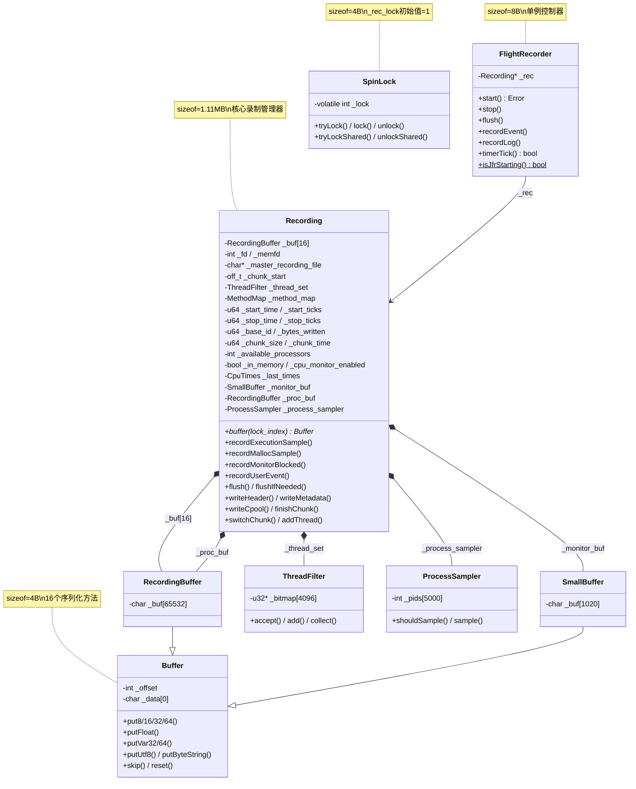

# 第十一章：FlightRecorder（JFR 输出）深度解析

> 基于 async-profiler 2.10 源码分析
> 源码路径：`/data/workspace/async-profiler/src/flightRecorder.cpp/h`
> 文件大小：flightRecorder.cpp (1501 行) + flightRecorder.h (47 行)
> 遵循：Doc-DataStructure-First + Source-Code-Depth + JVM-Mechanism-Deep-Dive

---

## 第 0 部分：核心原理 ⭐

### 0.1 本质是什么？

FlightRecorder 是 async-profiler 的 JFR 输出模块，将采样事件序列化为标准 JFR 二进制格式（`.jfr`），供 JDK Mission Control 等工具分析。

### 0.2 为什么需要？

async-profiler 采集的是内存中的原始数据（调用栈 ID、事件类型、时间戳），无法直接持久化或被标准工具分析。JFR 是 Java 生态的标准格式，但其二进制编码复杂：需要变长整数、网络字节序、元数据描述、常量池、chunk 分割等。FlightRecorder 负责将原始采样数据转换为这套标准格式。

### 0.3 怎么解决？

核心思路：**Buffer 抽象 + 并发缓冲区 + Chunk 分段 + 事件路由**。

关键设计：
1. **Buffer 柔性数组**：统一序列化接口，子类定义实际容量（1KB / 64KB）
2. **RecordingBuffer×16**：每个 lock_index 一个独立缓冲区，信号处理器中零竞争写入
3. **Chunk 机制**：按大小（≥256KB）或时间（≥5s）分割，支持滚动录制
4. **recordEvent() switch 路由**：13 种事件类型分发到对应的 record* 方法

### 0.4 为什么这样设计？

**为什么用网络字节序（big-endian）？** JFR 是跨平台格式，big-endian 是网络标准，确保不同 CPU 架构兼容。

**为什么用变长整数编码？** 大部分值（call_trace_id、线程 ID）是小整数，变长编码节省大量空间。例如 v=100 只需 1 字节而非 4 字节。

**为什么 16 个并发缓冲区而不是每线程一个？** CONCURRENCY_LEVEL=16（定义在 profiler.h:30），与分段锁数量一致。更多缓冲区浪费内存（每个 64KB），16 个已足够消除绝大部分锁竞争。

**为什么 putVar64() 用 3 字节循环展开？** 每次迭代写 3 字节（21 bits），最多 3 次循环（63 bits）即可覆盖 u64 全部范围，减少分支开销。

---

## 第 1 部分：数据结构全景

> 遵循 Doc-DataStructure-First 规则：先穷举所有涉及的数据结构，再逐个完整分析

### 1.1 数据结构清单

| # | 结构名 | 源码位置 | sizeof | 核心作用 |
|---|--------|----------|--------|----------|
| 1 | Buffer | flightRecorder.cpp:77-203 | 4B | 抽象缓冲区（柔性数组 + 16 个序列化方法）|
| 2 | SmallBuffer | flightRecorder.cpp:205-212 | 1024B | 1KB 小缓冲区（监控数据）|
| 3 | RecordingBuffer | flightRecorder.cpp:214-221 | 65536B | 64KB 录制缓冲区（事件数据）|
| 4 | Recording | flightRecorder.cpp:224-1263 | ~1.11MB (1,168,128B) | 录制管理器（24 实例字段 + 4 静态字段）|
| 5 | FlightRecorder | flightRecorder.h:16-45 | 8B | 单例控制器（_rec 指针）|
| 6 | CpuTime/CpuTimes | flightRecorder.cpp:66-75 | 24B/48B | CPU 时间统计 |
| 7 | SpinLock | spinLock.h:14-63 | 4B | 信号安全自旋锁（volatile int）|
| 8 | EventType | event.h:15-30 | enum | 14 种事件类型 |
| 9 | Event 层次 | event.h:32-113 | 各异 | 11 个事件类（Event→UserEvent 等）|
| 10 | JfrType | jfrMetadata.h:16-85 | enum | 48 种 JFR 类型（3 个范围）|
| 11 | 全局静态变量 | flightRecorder.cpp:55-63 | - | _rec_lock, _jfr_sync_class 等 |
| 12 | 缓冲区常量 | flightRecorder.cpp:41-47 | - | SMALL_BUFFER_SIZE=1024 等 |

---

### 1.2 Buffer 类详细分析

#### 1.2.1 字段列表

```cpp
// flightRecorder.cpp:77-203
class Buffer {
  private:
    int _offset;     // 当前写入偏移量（唯一字段）
    char _data[0];   // 柔性数组占位符（零长度）
  protected:
    Buffer() : _offset(0) {}
};
// sizeof(Buffer) = 4 字节
```

#### 1.2.2 核心方法（16 个）

**固定宽度写入（网络字节序）**：

```cpp
// flightRecorder.cpp:110-137
void put8(char v) { _data[_offset++] = v; }

void put16(short v) {
    *(short*)(_data + _offset) = htons(v);  // ★ host to network short
    _offset += 2;
}

void put32(int v) {
    *(int*)(_data + _offset) = htonl(v);    // ★ host to network long
    _offset += 4;
}

void put64(u64 v) {
    *(u64*)(_data + _offset) = OS::hton64(v);
    _offset += 8;
}

void putFloat(float v) {
    union { float f; int i; } u;  // ★ 类型双关（type punning）
    u.f = v;
    put32(u.i);                   // ★ 复用 put32 的字节序转换
}
```

**变长整数编码（压缩）**：

```cpp
// flightRecorder.cpp:139-160
void putVar32(u32 v) {
    // ★ 标准 LEB128 变长编码
    while (v > 0x7f) {
        _data[_offset++] = (char)v | 0x80;  // 高位=1 → 后续还有字节
        v >>= 7;
    }
    _data[_offset++] = (char)v;              // 高位=0 → 结束
}

void putVar64(u64 v) {
    int iter = 0;
    while (v > 0x1fffff) {
        // ★★★ 循环展开优化：每次写 3 字节（21 bits）★★★
        _data[_offset++] = (char)v | 0x80; v >>= 7;
        _data[_offset++] = (char)v | 0x80; v >>= 7;
        _data[_offset++] = (char)v | 0x80; v >>= 7;
        if (++iter == 3) return;  // ★ 最多 3×3=9 字节（63 bits + 尾零位）
    }
    // 剩余部分用标准 while 循环
    while (v > 0x7f) {
        _data[_offset++] = (char)v | 0x80;
        v >>= 7;
    }
    _data[_offset++] = (char)v;
}
```

**固定 5 字节变长编码（用于 patch/回填）**：

```cpp
// flightRecorder.cpp:196-202
void putVar32(int offset, u32 v) {
    // ★★★ 固定 5 字节：用于 skip(5) → 写数据 → 回填大小 ★★★
    _data[offset]     = v | 0x80;
    _data[offset + 1] = (v >> 7)  | 0x80;
    _data[offset + 2] = (v >> 14) | 0x80;
    _data[offset + 3] = (v >> 21) | 0x80;
    _data[offset + 4] = (v >> 28);          // ★ 最后一字节无 0x80 标志
}
```

**设计决策**：为什么需要固定 5 字节版本？因为 patch 模式是 `skip(5)` → 写入事件数据 → 回到 start 位置回填大小。如果大小用变长编码，字节数不确定，无法预留空间。固定 5 字节可表示最大 2^35 的值，对事件大小绰绰有余。

**字符串编码（两种）**：

```cpp
// flightRecorder.cpp:162-190
void putUtf8(const char* v, u32 len) {
    put8(3);           // ★ STRING_ENCODING_UTF8_BYTE_ARRAY = 3
    putVar32(len);
    put(v, len);
}

void putByteString(const char* v, u32 len) {
    put8(5);           // ★ STRING_ENCODING_LATIN1_BYTE_ARRAY = 5
    putVar32(len);
    put(v, len);
}
```

**设计决策**：putUtf8() 用于一般字符串（事件名、线程名），putByteString() 用于 UserEvent 数据和 ProcessSample 的进程名/命令行（LATIN1 编码，避免 UTF-8 校验开销）。

#### 1.2.3 关键字段生命周期

```
_offset:
  初始值: 0（构造函数）
  谁修改: skip(delta)增加、reset()重置为 0、所有 put*() 递增
  谁读取: offset()获取当前位置、flush()确定写入长度
  生命周期: 每次 flush() 后 reset() 归零，重新开始

_data[0]:
  何时分配: 子类构造时（SmallBuffer _buf[1020] / RecordingBuffer _buf[65532]）
  谁写入: 所有 put*() 方法
  谁读取: data() 返回指针 → flush() → write() 系统调用写入文件
```

---

### 1.3 SmallBuffer / RecordingBuffer

```cpp
// flightRecorder.cpp:205-221
class SmallBuffer : public Buffer {
    char _buf[SMALL_BUFFER_SIZE - sizeof(Buffer)];  // 1024 - 4 = 1020 字节
};
// sizeof(SmallBuffer) = 1024 字节

class RecordingBuffer : public Buffer {
    char _buf[RECORDING_BUFFER_SIZE - sizeof(Buffer)];  // 65536 - 4 = 65532 字节
};
// sizeof(RecordingBuffer) = 65536 字节
```

**柔性数组设计**：子类的 `_buf` 数组紧随 Buffer 的 `_data[0]` 之后，由于 `_data[0]` 大小为 0，`_buf` 的内存地址等于 `_data` 的地址，Buffer 方法访问 `_data[i]` 实际就是访问子类的 `_buf[i]`。

**缓冲区限制常量**：

```cpp
const int SMALL_BUFFER_LIMIT = SMALL_BUFFER_SIZE - 128;       // = 896
const int RECORDING_BUFFER_LIMIT = RECORDING_BUFFER_SIZE - 4096;  // = 61440
```

为什么留余量？防止写入超出缓冲区边界。事件的最大单次写入量可能达几十到几百字节，留 128/4096 字节余量确保安全。

---

### 1.4 Recording 类详细分析

#### 1.4.1 字段列表（完整 24 实例字段 + 4 静态字段）

```cpp
// flightRecorder.cpp:224-260
class Recording {
  private:
    // ===== 静态字段（4 个，共 32 字节）=====
    static char* _agent_properties;     // JVM agent properties 字符串
    static char* _jvm_args;             // JVM 启动参数
    static char* _jvm_flags;            // JVM 标志
    static char* _java_command;         // Java 主类/命令

    // ===== 实例字段（24 个）=====
    // --- 并发缓冲区 ---
    RecordingBuffer _buf[CONCURRENCY_LEVEL];  // ★ 16 × 65536 = 1,048,576 字节 (1 MB)

    // --- 文件管理 ---
    int _fd;                           // 输出文件描述符
    int _memfd;                        // 内存文件描述符（-1 表示未启用）
    char* _master_recording_file;      // JFR sync 主录制文件路径（NULL 表示无）
    off_t _chunk_start;                // 当前 chunk 在文件中的起始偏移

    // --- 线程/方法追踪 ---
    ThreadFilter _thread_set;          // ★ ~32 KB（_bitmap[4096] 指针数组）
    MethodMap _method_map;             // ★ ~56 字节（unordered_map 固定开销）

    // --- 时间戳 ---
    u64 _start_time;                   // 录制开始时间（微秒，OS::micros()）
    u64 _start_ticks;                  // 录制开始 TSC ticks
    u64 _stop_time;                    // 录制结束时间
    u64 _stop_ticks;                   // 录制结束 TSC ticks

    // --- Chunk 控制 ---
    u64 _base_id;                      // 常量池 ID 基址（每 chunk +0x1000000）
    u64 _bytes_written;                // 当前 chunk 已写入字节数
    u64 _chunk_size;                   // chunk 大小限制（最小 262144 = 256KB）
    u64 _chunk_time;                   // chunk 时间限制（最小 5s，存储为微秒）

    // --- 系统信息 ---
    int _available_processors;         // CPU 核心数
    int _recorded_lib_count;           // 已记录的 native 库数量（-1 表示禁用）

    // --- 特性开关 ---
    bool _in_memory;                   // 是否内存模式
    bool _cpu_monitor_enabled;         // CPU 监控启用
    bool _heap_monitor_enabled;        // 堆监控启用
    u32 _last_gc_id;                   // 上次 GC ID

    // --- 监控缓冲区 ---
    CpuTimes _last_times;              // ★ 48 字节（上次 CPU 时间快照）
    SmallBuffer _monitor_buf;          // ★ 1024 字节（CPU/Heap 监控事件）
    RecordingBuffer _proc_buf;         // ★ 65536 字节（进程采样事件）
    ProcessSampler _process_sampler;   // ★ ~20 KB（_pids[5000] 数组）
};
```

#### 1.4.2 sizeof 分析

```
sizeof(Recording) = 1,168,128 字节 ≈ 1.11 MB（GDB 实测）

主要贡献者：
  _buf[16]           = 16 × 65536  = 1,048,576 B (1 MB)     → 89.8%
  _proc_buf          = 65,536 B (64 KB)                      → 5.6%
  _thread_set        ≈ 32,784 B (~32 KB)                     → 2.8%
  _process_sampler   ≈ 20,008 B (~20 KB)                     → 1.7%
  _monitor_buf       = 1,024 B (1 KB)
  _last_times        = 48 B
  其余标量字段       ≈ 152 B
```

**注意**：旧文档估算 _thread_set ~100B 和 _process_sampler ~100B 严重低估。实际 ThreadFilter 含 `_bitmap[MAX_BITMAPS=4096]` 指针数组 = 32KB，ProcessSampler 含 `_pids[MAX_PROCESSES=5000]` 数组 = 20KB。

#### 1.4.3 构造函数关键字段初始化

```cpp
// flightRecorder.cpp:266-316
Recording(int fd, const char* master_recording_file, Arguments& args) : _fd(fd), _thread_set(), _method_map() {
    _master_recording_file = master_recording_file == NULL ? NULL : strdup(master_recording_file);
    _chunk_start = lseek(_fd, 0, SEEK_END);  // ★ 从文件末尾开始（支持 append）
    _start_time = OS::micros();
    _start_ticks = TSC::ticks();
    _base_id = 0;
    _bytes_written = 0;
    _memfd = -1;
    _in_memory = false;

    // ★★★ _chunk_size 有最小值约束 262144 (256 KB) ★★★
    _chunk_size = args._chunk_size <= 0 ? MAX_JLONG
               : (args._chunk_size < 262144 ? 262144 : args._chunk_size);
    // ★★★ _chunk_time 有最小值约束 5 秒 ★★★
    _chunk_time = args._chunk_time <= 0 ? MAX_JLONG
               : (args._chunk_time < 5 ? 5 : args._chunk_time) * 1000000ULL;

    _available_processors = OS::getCpuCount();

    // ★★★ 初始写入序列（Chunk 开头）★★★
    writeHeader(_buf);          // 68 字节文件头
    writeMetadata(_buf);        // 元数据
    writeRecordingInfo(_buf);   // 录制信息
    writeSettings(_buf, args);  // 设置参数
    if (!args.hasOption(NO_SYSTEM_INFO)) {
        writeOsCpuInfo(_buf);   // OS/CPU 信息
        writeJvmInfo(_buf);     // JVM 信息
    }
    if (!args.hasOption(NO_SYSTEM_PROPS)) {
        writeSystemProperties(_buf);  // 系统属性
    }
    if (!args.hasOption(NO_NATIVE_LIBS)) {
        _recorded_lib_count = 0;
        writeNativeLibraries(_buf);   // Native 库列表
    } else {
        _recorded_lib_count = -1;     // ★ -1 表示禁用
    }
    flush(_buf);  // ★ 将上述数据写入文件

    // ★ 内存模式：事件先写入 memfd，finishChunk 时再 copy 到 fd
    if (args.hasOption(IN_MEMORY) && (_memfd = OS::createMemoryFile("async-profiler-recording")) >= 0) {
        _in_memory = true;
    }

    // ★ CPU 监控初始化
    _cpu_monitor_enabled = !args.hasOption(NO_CPU_LOAD);
    if (_cpu_monitor_enabled) {
        _last_times.proc.real = OS::getProcessCpuTime(&_last_times.proc.user, &_last_times.proc.system);
        _last_times.total.real = OS::getTotalCpuTime(&_last_times.total.user, &_last_times.total.system);
    }

    _heap_monitor_enabled = !args.hasOption(NO_HEAP_SUMMARY) && VM::_totalMemory != NULL && VM::_freeMemory != NULL;
    _last_gc_id = 0;

    if (args._proc > 0) {
        _process_sampler.enable(args._proc * 1000000);  // ★ 进程采样间隔（微秒）
    }
}
```

#### 1.4.4 关键字段生命周期

**_bytes_written**：
```
初始值: 0（构造函数）
谁修改: flush() → atomicInc(_bytes_written, result)
何时读: needSwitchChunk() → loadAcquire(_bytes_written) >= _chunk_size
何时清: switchChunk() → _bytes_written = 0
```

**_chunk_start**：
```
初始值: lseek(_fd, 0, SEEK_END)（文件末尾）
谁修改: switchChunk() → _chunk_start = finishChunk()
作用: finishChunk() 中 pwrite() 用它定位 chunk header 进行 patch
```

**_base_id**：
```
初始值: 0
谁修改: switchChunk() → _base_id += 0x1000000
作用: 每个 chunk 的常量池 ID 偏移，避免跨 chunk ID 冲突
      使用方式：idx | _base_id（在 writeMethods/writeClasses 等中）
```

---

### 1.5 FlightRecorder 类详细分析

```cpp
// flightRecorder.h:16-45
class FlightRecorder {
  private:
    Recording* _rec;   // ★ 指向当前录制对象（NULL = 未录制）
  private:
    Error startMasterRecording(Arguments& args, const char* filename);
    void stopMasterRecording();
  public:
    static const LogLevel MIN_LOG_LEVEL = LogLevel::LOG_DEBUG;
    FlightRecorder() : _rec(NULL) {}
    Error start(Arguments& args, bool reset);
    void stop();
    void flush();
    size_t usedMemory();
    bool timerTick(u64 wall_time, u32 gc_id);
    bool active() const { return _rec != NULL; }
    void recordEvent(int lock_index, int tid, u32 call_trace_id, EventType event_type, Event* event);
    void recordLog(LogLevel level, const char* message, size_t len);
    static bool isJfrStarting();
};
// sizeof(FlightRecorder) = 8 字节（一个指针）
```

**_rec 字段生命周期**：
```
初始值: NULL（构造函数）
start(): _rec = new Recording(fd, master_recording_file, args); _rec_lock.unlock();
stop():  _rec_lock.lock(); delete _rec; _rec = NULL;
关键: start() 最后 unlock()，stop() 最先 lock()
      → 保证 Recording 对象在 _rec_lock 解锁期间存活
```

---

### 1.6 全局静态变量

```cpp
// flightRecorder.cpp:55-63
static SpinLock _rec_lock(1);   // ★ 初始值=1（exclusive locked！）
                                //   start() 中 unlock → 可用
                                //   stop() 中 lock → 阻塞后续访问
                                //   timerTick()/recordLog() 用 tryLockShared()

static jclass _jfr_sync_class = NULL;   // JfrSync Java 类的全局引用
static jmethodID _start_method;          // JfrSync.start() 方法 ID
static jmethodID _stop_method;           // JfrSync.stop() 方法 ID
static jmethodID _box_method;            // JfrSync.box() 方法 ID
static bool _jfr_starting = false;       // ★ 原子标志，保护 JFR 启动过程
                                         //   用 __atomic_store_n/__atomic_load_n 操作

static const char* const SETTING_CSTACK[] = {NULL, "no", "fp", "dwarf", "lbr", "vm"};
```

**_rec_lock 设计决策**：为什么初始化为 1（exclusive）？因为在 start() 创建 Recording 之前，不应该有人能获取共享锁。start() 最后 `_rec_lock.unlock()` 解锁，此后 timerTick() 和 recordLog() 才能通过 tryLockShared() 获取访问权。stop() 先 `_rec_lock.lock()` 获取排他锁，阻塞所有共享访问后才安全 delete Recording。

---

### 1.7 CpuTime / CpuTimes

```cpp
// flightRecorder.cpp:66-75
struct CpuTime {
    u64 real;      // 实际时间
    u64 user;      // 用户态时间
    u64 system;    // 内核态时间
};
// sizeof(CpuTime) = 24 字节

struct CpuTimes {
    CpuTime proc;   // 进程 CPU 时间
    CpuTime total;  // 系统总 CPU 时间
};
// sizeof(CpuTimes) = 48 字节
```

用于 `cpuMonitorCycle()` 计算 CPU 负载率（当前 - 上次）/ 间隔。

---

### 1.8 SpinLock

```cpp
// spinLock.h:14-63
class SpinLock {
    volatile int _lock;
    //  0 = unlocked
    //  1 = exclusive lock
    // <0 = shared lock（每个 shared lock 减 1）
};
// sizeof(SpinLock) = 4 字节
```

**三种状态**：
- `_lock == 0`：未锁定
- `_lock == 1`：排他锁定（start/stop/flush 使用）
- `_lock < 0`：共享锁定，绝对值 = 共享持有者数量（timerTick/recordLog 使用）

**并发协议**：
- `tryLockShared()`：CAS `value → value-1`，仅当 `value ≤ 0` 时成功（排他锁持有时失败）
- `lock()`：CAS `0 → 1` 自旋等待
- `unlock()`：`fetch_and_sub(1)` → 0

---

### 1.9 EventType 枚举

```cpp
// event.h:15-30
// The order is important: look for event_type comparison
enum EventType {
    PERF_SAMPLE,            // 0  - perf_event 采样
    EXECUTION_SAMPLE,       // 1  - 执行采样
    WALL_CLOCK_SAMPLE,      // 2  - Wall clock 采样
    NATIVE_LOCK_SAMPLE,     // 3  - Native 锁采样
    MALLOC_SAMPLE,          // 4  - malloc 采样
    INSTRUMENTED_METHOD,    // 5  - 方法插桩
    METHOD_TRACE,           // 6  - 方法追踪
    ALLOC_SAMPLE,           // 7  - TLAB 内分配
    ALLOC_OUTSIDE_TLAB,     // 8  - TLAB 外分配
    LIVE_OBJECT,            // 9  - 存活对象
    LOCK_SAMPLE,            // 10 - Java 锁采样
    PARK_SAMPLE,            // 11 - Thread.park 采样
    PROFILING_WINDOW,       // 12 - 分析窗口
    USER_EVENT,             // 13 - 用户自定义事件
};
```

**注释 "The order is important"**：代码中存在 `event_type` 大小比较运算，枚举值的顺序影响逻辑正确性。

---

### 1.10 Event 类层次（11 个类）

```
Event                        // 空基类
├── EventWithClassId         // +_class_id (u32)
│   ├── AllocEvent           // +_start_time, _total_size, _instance_size
│   ├── LockEvent            // +_start_time, _end_time, _address, _timeout
│   └── LiveObject           // +_start_time, _alloc_size, _alloc_time
├── ExecutionEvent           // +_start_time, _thread_state
├── MethodTraceEvent         // +_start_time, _duration
├── WallClockEvent           // +_start_time, _time_span, _thread_state, _samples
├── NativeLockEvent          // +_start_time, _end_time, _address
├── ProfilingWindow          // +_start_time, _end_time
├── MallocEvent              // +_start_time, _address, _size
└── UserEvent                // +_start_time, _type, _data, _len
```

---

### 1.11 JfrType 枚举（48 个值，3 个范围）

```
范围 1：基础/引用类型 (0-34)
  T_METADATA=0, T_CPOOL=1, T_BOOLEAN=4..T_LONG=11,
  T_STRING=20..T_USER_EVENT_TYPE=34

范围 2：事件类型 (100-124)，继承 jdk.jfr.Event
  T_EVENT=100, T_EXECUTION_SAMPLE=101..T_NATIVE_LOCK=124

范围 3：注解类型 (200-209)，继承 java.lang.annotation.Annotation
  T_ANNOTATION=200, T_LABEL=201..T_PERCENTAGE=209
```

---

### 1.12 缓冲区常量

```cpp
// flightRecorder.cpp:41-47
const int SMALL_BUFFER_SIZE       = 1024;
const int SMALL_BUFFER_LIMIT      = 1024 - 128;      // = 896
const int RECORDING_BUFFER_SIZE   = 65536;
const int RECORDING_BUFFER_LIMIT  = 65536 - 4096;    // = 61440
const int MAX_STRING_LENGTH       = 8191;
const u64 MAX_JLONG = 0x7fffffffffffffffULL;
const u64 MIN_JLONG = 0x8000000000000000ULL;
```

---

## 第 2 部分：算法/流程分析

> 遵循 Source-Code-Depth 规则：禁止伪代码，必须真实源码 + 逐行注释 + 设计解释

### 2.1 start() — 启动录制

#### 2.1.1 解决什么问题？

打开输出文件、创建 Recording 对象、解锁 _rec_lock 使 timerTick/recordLog 可访问。如果启用了 JFR Sync，还需要启动 JDK 内置 JFR 的主录制。

#### 2.1.2 真实源码 + 逐行注释

```cpp
// flightRecorder.cpp:1271-1307
Error FlightRecorder::start(Arguments& args, bool reset) {
    const char* filename = args.file();
    if (filename == NULL || filename[0] == 0) {
        return Error("Flight Recorder output file is not specified");
    }

    char* filename_tmp = NULL;
    const char* master_recording_file = NULL;
    if (args._jfr_sync != NULL) {
        // ★ JFR Sync 模式：先启动 JDK 的 master recording
        Error error = startMasterRecording(args, master_recording_file = filename);
        if (error) return error;

        // ★ 临时文件名：<filename>.<pid>~
        size_t len = strlen(filename);
        filename_tmp = (char*)malloc(len + 16);
        snprintf(filename_tmp, len + 16, "%s.%d~", filename, OS::processId());
        filename = filename_tmp;
    }

    TSC::enable(args._clock);  // ★ 启用 TSC 时钟

    int fd = open(filename, O_CREAT | O_RDWR | (reset ? O_TRUNC : 0), 0644);
    if (fd == -1) {
        free(filename_tmp);
        return Error("Could not open Flight Recorder output file");
    }

    if (args._jfr_sync != NULL) {
        unlink(filename_tmp);   // ★ 立即删除临时文件名（fd 仍有效）
        free(filename_tmp);
    }

    _rec = new Recording(fd, master_recording_file, args);  // ★ 创建 Recording（~1.11MB）
    _rec_lock.unlock();  // ★★★ 关键：解锁 _rec_lock（从初始值 1 → 0）★★★
    return Error::OK;
}
```

**设计决策**：JFR Sync 模式下先 `unlink()` 再使用 fd，利用 Unix 文件系统特性——文件被 unlink 后，只要还有 fd 引用，文件数据仍然存在，关闭 fd 后才真正删除。这确保临时文件不会残留。

---

### 2.2 stop() — 停止录制

```cpp
// flightRecorder.cpp:1309-1320
void FlightRecorder::stop() {
    if (_rec != NULL) {
        _rec_lock.lock();    // ★ 获取排他锁，阻塞 timerTick/recordLog

        if (_rec->hasMasterRecording()) {
            stopMasterRecording();  // ★ 停止 JDK 主 JFR
        }

        delete _rec;         // ★ 析构函数中调用 finishChunk() + 关闭文件
        _rec = NULL;
    }
}
```

**注意**：stop() 获取排他锁后**不调用 unlock()**。这是有意为之：_rec_lock 保持在 locked 状态（值=1），与初始状态一致。下次 start() 末尾的 unlock() 才重新开放访问。

---

### 2.3 recordEvent() — 事件记录路由 ⭐

#### 2.3.1 解决什么问题？

将 13 种不同类型的采样事件路由到对应的序列化方法。在信号处理器中调用，必须无锁、信号安全。

#### 2.3.2 完整源码 + 逐行注释（所有 13 种事件类型）

```cpp
// flightRecorder.cpp:1424-1475
void FlightRecorder::recordEvent(int lock_index, int tid, u32 call_trace_id,
                                 EventType event_type, Event* event) {
    if (_rec != NULL) {
        ThreadLocalData::incrementSampleCounter();   // ★ 递增采样计数器
        Buffer* buf = _rec->buffer(lock_index);      // ★ 获取线程专属缓冲区

        switch (event_type) {
            case PERF_SAMPLE:
            case EXECUTION_SAMPLE:
            case INSTRUMENTED_METHOD:
                _rec->recordExecutionSample(buf, tid, call_trace_id, (ExecutionEvent*)event);
                break;
            case METHOD_TRACE:
                _rec->recordMethodTrace(buf, tid, call_trace_id, (MethodTraceEvent*)event);
                break;
            case WALL_CLOCK_SAMPLE:
                _rec->recordWallClockSample(buf, tid, call_trace_id, (WallClockEvent*)event);
                break;
            case MALLOC_SAMPLE:
                _rec->recordMallocSample(buf, tid, call_trace_id, (MallocEvent*)event);
                break;
            case ALLOC_SAMPLE:
                _rec->recordAllocationInNewTLAB(buf, tid, call_trace_id, (AllocEvent*)event);
                break;
            case ALLOC_OUTSIDE_TLAB:
                _rec->recordAllocationOutsideTLAB(buf, tid, call_trace_id, (AllocEvent*)event);
                break;
            case LIVE_OBJECT:
                _rec->recordLiveObject(buf, tid, call_trace_id, (LiveObject*)event);
                break;
            case LOCK_SAMPLE:
                _rec->recordMonitorBlocked(buf, tid, call_trace_id, (LockEvent*)event);
                break;
            case PARK_SAMPLE:
                _rec->recordThreadPark(buf, tid, call_trace_id, (LockEvent*)event);
                break;
            case NATIVE_LOCK_SAMPLE:
                _rec->recordNativeLockSample(buf, tid, call_trace_id, (NativeLockEvent*)event);
                break;
            case PROFILING_WINDOW:
                _rec->recordWindow(buf, tid, (ProfilingWindow*)event);
                break;
            case USER_EVENT:
                _rec->recordUserEvent(buf, tid, (UserEvent*)event);
                break;
        }
        // ★★★ switch 之后的关键操作（旧文档完全遗漏！）★★★
        _rec->flushIfNeeded(buf);  // ★ 检查缓冲区是否需要 flush
        _rec->addThread(tid);       // ★ 将线程 ID 加入 _thread_set
    }
}
```

**设计决策**：
- **switch 之后的 flushIfNeeded + addThread 是公共操作**，无论哪种事件类型都执行，所以放在 switch 外面
- PERF_SAMPLE / EXECUTION_SAMPLE / INSTRUMENTED_METHOD 共用 recordExecutionSample，因为三者的 JFR 序列化格式完全相同
- PROFILING_WINDOW 和 USER_EVENT 没有 call_trace_id 参数（不需要调用栈信息）

---

### 2.4 13 个 record* 方法

所有 record* 方法都遵循相同的 **skip-write-patch** 模式：

```
int start = buf->skip(N);    // 预留 N 字节（1 或 5）
buf->put8(T_EVENT_TYPE);     // 事件类型标记
buf->putVar64(...);           // 写入字段
...
buf->putVar32(start, buf->offset() - start);  // 回填：事件总大小
// 或 buf->put8(start, buf->offset() - start);  // 单字节大小（小事件）
```

**skip(1) vs skip(5)**：大多数事件使用 `skip(1)` + `put8(start, size)`，因为单个事件不超过 255 字节。但 `recordUserEvent` 和 `recordProcessSample` 使用 `skip(5)` + `putVar32(start, size)`，因为用户事件可达 `ASPROF_MAX_JFR_EVENT_LENGTH` 字节。

#### 2.4.1 recordExecutionSample

```cpp
// flightRecorder.cpp:1048-1056
void recordExecutionSample(Buffer* buf, int tid, u32 call_trace_id, ExecutionEvent* event) {
    int start = buf->skip(1);
    buf->put8(T_EXECUTION_SAMPLE);      // 事件类型 = 101
    buf->putVar64(event->_start_time);   // TSC ticks
    buf->putVar32(tid);                  // 线程 ID
    buf->putVar32(call_trace_id);        // 调用栈 ID（引用常量池）
    buf->putVar32(event->_thread_state); // 线程状态（UNKNOWN/RUNNING/SLEEPING）
    buf->put8(start, buf->offset() - start);
}
```

#### 2.4.2 recordMallocSample（含 T_MALLOC / T_FREE 双类型）

```cpp
// flightRecorder.cpp:1104-1115
void recordMallocSample(Buffer* buf, int tid, u32 call_trace_id, MallocEvent* event) {
    int start = buf->skip(1);
    buf->put8(event->_size != 0 ? T_MALLOC : T_FREE);  // ★ size=0 → 释放事件
    buf->putVar64(event->_start_time);
    buf->putVar32(tid);
    buf->putVar32(call_trace_id);
    buf->putVar64(event->_address);
    if (event->_size != 0) {
        buf->putVar64(event->_size);     // ★ 释放事件不写 size 字段
    }
    buf->put8(start, buf->offset() - start);
}
```

#### 2.4.3 recordUserEvent（使用 skip(5) + putByteString）

```cpp
// flightRecorder.cpp:1117-1133
void recordUserEvent(Buffer* buf, int tid, UserEvent* event) {
    const size_t event_non_string_size_limit = 64;
    // ★ 编译期检查：保证 buffer 不溢出
    static_assert(RECORDING_BUFFER_LIMIT + event_non_string_size_limit + ASPROF_MAX_JFR_EVENT_LENGTH
        <= RECORDING_BUFFER_SIZE, "output must fit within recording buffer");

    int start = buf->skip(5);            // ★ skip(5) 而非 skip(1)！因为事件可能很大
    buf->put8(T_USER_EVENT);
    buf->putVar64(event->_start_time);
    buf->putVar32(tid);
    buf->putVar32(event->_type);
    buf->putByteString((const char*)event->_data,  // ★ 用 LATIN1 编码（encoding=5）
        event->_len > ASPROF_MAX_JFR_EVENT_LENGTH ? ASPROF_MAX_JFR_EVENT_LENGTH : event->_len);
    buf->putVar32(start, buf->offset() - start);   // ★ 5 字节回填
}
```

#### 2.4.4 recordMonitorBlocked / recordThreadPark / recordNativeLockSample

```cpp
// flightRecorder.cpp:1182-1218
void recordMonitorBlocked(Buffer* buf, int tid, u32 call_trace_id, LockEvent* event) {
    int start = buf->skip(1);
    buf->put8(T_MONITOR_ENTER);
    buf->putVar64(event->_start_time);
    buf->putVar64(event->_end_time - event->_start_time);  // ★ duration
    buf->putVar32(tid);
    buf->putVar32(call_trace_id);
    buf->putVar32(event->_class_id);
    buf->put8(0);                          // ★ previousOwner（未实现，固定 0）
    buf->putVar64(event->_address);        // ★ monitor 地址
    buf->put8(start, buf->offset() - start);
}

void recordThreadPark(Buffer* buf, int tid, u32 call_trace_id, LockEvent* event) {
    int start = buf->skip(1);
    buf->put8(T_THREAD_PARK);
    buf->putVar64(event->_start_time);
    buf->putVar64(event->_end_time - event->_start_time);
    buf->putVar32(tid);
    buf->putVar32(call_trace_id);
    buf->putVar32(event->_class_id);
    buf->putVar64(event->_timeout);
    buf->putVar64(MIN_JLONG);              // ★ until = Long.MIN_VALUE（未实现）
    buf->putVar64(event->_address);
    buf->put8(start, buf->offset() - start);
}

void recordNativeLockSample(Buffer* buf, int tid, u32 call_trace_id, NativeLockEvent* event) {
    int start = buf->skip(1);
    buf->put8(T_NATIVE_LOCK);
    buf->putVar64(event->_start_time);
    buf->putVar64(event->_end_time - event->_start_time);
    buf->putVar32(tid);
    buf->putVar32(call_trace_id);
    buf->putVar64(event->_address);
    buf->put8(start, buf->offset() - start);
}
```

#### 2.4.5 recordWindow

```cpp
// flightRecorder.cpp:1220-1227
void recordWindow(Buffer* buf, int tid, ProfilingWindow* event) {
    int start = buf->skip(1);
    buf->put8(T_WINDOW);
    buf->putVar64(event->_start_time);
    buf->putVar64(event->_end_time - event->_start_time);
    buf->putVar32(tid);
    buf->put8(start, buf->offset() - start);
}
```

---

### 2.5 flush() / flushIfNeeded() — 缓冲区刷新

```cpp
// flightRecorder.cpp:560-572
void flush(Buffer* buf) {
    ssize_t result = write(_in_memory ? _memfd : _fd, buf->data(), buf->offset());
    if (result > 0) {
        atomicInc(_bytes_written, result);  // ★ 原子递增已写入字节数
    }
    buf->reset();  // ★ 重置 _offset = 0
}

void flushIfNeeded(Buffer* buf, int limit = RECORDING_BUFFER_LIMIT) {
    if (buf->offset() >= limit) {
        flush(buf);
    }
}
```

**设计决策**：`_in_memory` 模式下写入 memfd 而非 fd。memfd 是 Linux 匿名内存文件，数据在 RAM 中，finishChunk() 时才 copyFile 到真实文件。好处：避免中间状态写入磁盘。

---

### 2.6 writeHeader() — Chunk 文件头（68 字节）

```cpp
// flightRecorder.cpp:574-588
void writeHeader(Buffer* buf) {
    buf->put("FLR\0", 4);            // Magic (4B)
    buf->put16(2);                   // Major version (2B)
    buf->put16(0);                   // Minor version (2B)
    buf->put64(1024 * 1024 * 1024);  // Chunk size: 初始 1GB（后续 patch）
    buf->put64(0);                   // Cpool offset: 0（后续 patch）
    buf->put64(0);                   // Metadata offset: 68（后续 patch）
    buf->put64(_start_time * 1000);  // Start time (ns)
    buf->put64(0);                   // Duration: 0（后续 patch）
    buf->put64(_start_ticks);        // Start ticks
    buf->put64(TSC::frequency());    // Ticks per sec（后续 patch 更精确值）
    buf->put32(1);                   // Features: 1（压缩启用）
}
// 总计：4+2+2+8×6+4 = 60 → 实际是 4+2+2+8+8+8+8+8+8+8+4 = 68 字节
```

**为什么初始 chunk size = 1GB？** 注释说明：for JMC to skip incomplete chunk。如果 JMC 在录制进行中打开文件，看到最后一个 chunk 的 size 极大，就会跳过这个不完整的 chunk。

---

### 2.7 finishChunk() — Chunk 结束 + 双 pwrite() patch

#### 2.7.1 解决什么问题？

结束当前 chunk：刷新所有缓冲区、写入常量池、用 pwrite() 回填 chunk header 和 cpool 大小。

#### 2.7.2 真实源码 + 逐行注释

```cpp
// flightRecorder.cpp:333-386
off_t finishChunk() {
    // ★ 1. 刷新所有缓冲区
    flush(&_monitor_buf);
    flush(&_proc_buf);
    writeNativeLibraries(_buf);   // ★ 补写新加载的 native 库
    for (int i = 0; i < CONCURRENCY_LEVEL; i++) {
        flush(&_buf[i]);
    }

    _stop_time = OS::micros();
    _stop_ticks = TSC::ticks();

    // ★ 2. 内存模式：将 memfd 内容 copy 到实际文件
    if (_memfd >= 0) {
        OS::copyFile(_memfd, _fd, 0, lseek(_memfd, 0, SEEK_CUR));
        _in_memory = false;
    }

    // ★ 3. 写入常量池
    off_t cpool_offset = lseek(_fd, 0, SEEK_CUR);
    writeCpool(_buf);
    flush(_buf);
    off_t chunk_end = lseek(_fd, 0, SEEK_CUR);

    // ★ 4. Patch #1：回填 cpool 大小（5 字节，位于 cpool_offset）
    _buf->putVar32(0, chunk_end - cpool_offset);
    ssize_t result = pwrite(_fd, _buf->data(), 5, cpool_offset);
    (void)result;

    // ★ 5. 计算精确 TSC 频率
    u64 tsc_frequency;
    if (TSC::enabled()) {
        // ★ 用实际测量值替代初始估算值
        tsc_frequency = (u64)(double(_stop_ticks - _start_ticks) /
                              double(_stop_time - _start_time) * 1000000);
    } else {
        tsc_frequency = TSC::frequency();
    }

    // ★ 6. Patch #2：回填 chunk header（56 字节，位于 _chunk_start+8）
    _buf->put64(chunk_end - _chunk_start);      // chunk size
    _buf->put64(cpool_offset - _chunk_start);    // cpool offset
    _buf->put64(68);                             // metadata offset（紧跟 header 后）
    _buf->put64(_start_time * 1000);             // start time (ns)
    _buf->put64((_stop_time - _start_time) * 1000);  // duration (ns)
    _buf->put64(_start_ticks);                   // start ticks
    _buf->put64(tsc_frequency);                  // ticks per sec（精确值）
    result = pwrite(_fd, _buf->data(), 56, _chunk_start + 8);
    (void)result;

    OS::freePageCache(_fd, _chunk_start);  // ★ 释放已写入页面的 page cache
    _buf->reset();
    return chunk_end;
}
```

**设计决策**：
- **为什么用 pwrite() 而非 lseek()+write()**？pwrite() 是原子的定位写入，不改变文件偏移量，更安全
- **为什么 patch 位于 _chunk_start+8**？跳过 4 字节 magic + 2 字节 major + 2 字节 minor = 8 字节
- **为什么 patch 是 56 字节而非 60**？不需要 patch features 字段（4 字节），7 个 u64 × 8 = 56
- **TSC 频率为什么要重新计算**？初始频率（TSC::frequency()）可能不准确，用实际的 (ticks_delta / time_delta) 更精确

---

### 2.8 switchChunk() — Chunk 切换

```cpp
// flightRecorder.cpp:388-404
void switchChunk() {
    _chunk_start = finishChunk();   // ★ 结束旧 chunk，返回新 chunk 起始位置
    _start_time = _stop_time;       // ★ 新 chunk 的开始 = 旧 chunk 的结束
    _start_ticks = _stop_ticks;
    _base_id += 0x1000000;          // ★ 常量池 ID 偏移 +16M（避免 ID 冲突）
    _bytes_written = 0;             // ★ 重置写入计数器

    writeHeader(_buf);
    writeMetadata(_buf);
    writeRecordingInfo(_buf);
    flush(_buf);

    if (_memfd >= 0) {
        while (ftruncate(_memfd, 0) < 0 && errno == EINTR);  // ★ 清空 memfd
        _in_memory = true;
    }
}
```

---

### 2.9 writeCpool() — 常量池写入

```cpp
// flightRecorder.cpp:829-856
void writeCpool(Buffer* buf) {
    buf->skip(5);                    // ★ 预留 5 字节给 cpool 大小（finishChunk 中 patch）
    buf->putVar32(T_CPOOL);         // 类型标记
    buf->putVar64(_start_ticks);    // 时间戳
    buf->putVar32(0);               // delta
    buf->putVar32(0);               // flush
    buf->putVar32(1);               // nPools count

    buf->putVar32(11);              // ★ 11 个 pool section

    // ★ 创建临时 Lookup 对象
    Index packages(1);
    Index symbols(1);
    Lookup lookup(&_method_map, Profiler::instance()->classMap(), &packages, &symbols, OUTPUT_JFR);

    writeFrameTypes(buf);           // T_FRAME_TYPE: 7 种帧类型
    writeThreadStates(buf);         // T_THREAD_STATE: 3 种线程状态
    writeGCWhen(buf);               // T_GC_WHEN: Before/After
    writeThreads(buf);              // T_THREAD: 所有记录到的线程
    writeStackTraces(buf, &lookup); // T_STACK_TRACE: 所有调用栈
    writeMethods(buf, &lookup);     // T_METHOD: 所有方法
    writeClasses(buf, &lookup);     // T_CLASS: 所有类
    writePackages(buf, &lookup);    // T_PACKAGE: 所有包
    writeSymbols(buf, &lookup);     // T_SYMBOL: 所有符号
    writeUserEventTypes(buf);       // T_USER_EVENT_TYPE: 用户事件类型
    writeLogLevels(buf);            // T_LOG_LEVEL: 日志级别（最后写，易于检测截断）
}
```

---

### 2.10 writePoolHeader() — 空池 workaround

```cpp
// flightRecorder.cpp:858-870
void writePoolHeader(Buffer* buf, JfrType type, u32 size) {
    if (size > 0) {
        buf->putVar32(type);
        buf->putVar32(size);
    } else {
        // ★★★ JDK 的 JFR reader 不支持空池！★★★
        // 用 dummy T_STRING 池（1 个 null 字符串）替代
        buf->putVar32(T_STRING);
        buf->putVar32(1);
        buf->putVar32(1);  // key
        buf->put8(0);      // null string
    }
}
```

---

### 2.11 timerTick() — 定时器回调

```cpp
// flightRecorder.cpp:1340-1354
bool FlightRecorder::timerTick(u64 wall_time, u32 gc_id) {
    if (!_rec_lock.tryLockShared()) {
        return false;   // ★ Recording 不存在或 stop 中
    }

    _rec->cpuMonitorCycle();          // ★ 计算 CPU 负载，写入 _monitor_buf
    _rec->heapMonitorCycle(gc_id);    // ★ 堆摘要（GC 后触发）
    _rec->processMonitorCycle(wall_time);  // ★ 进程采样

    bool need_switch_chunk = _rec->needSwitchChunk(wall_time);

    _rec_lock.unlockShared();
    return need_switch_chunk;  // ★ 返回值告知调用者是否需要切换 chunk
}
```

---

### 2.12 recordLog() — 日志记录（使用 alloca）

```cpp
// flightRecorder.cpp:1477-1496
void FlightRecorder::recordLog(LogLevel level, const char* message, size_t len) {
    if (!_rec_lock.tryLockShared()) {
        return;   // ★ 无活跃录制
    }

    if (len > MAX_STRING_LENGTH) len = MAX_STRING_LENGTH;
    // ★★★ 用 alloca() 在栈上分配 Buffer！★★★
    // 信号安全：不分配堆内存，不调用 malloc
    Buffer* buf = (Buffer*)alloca(len + 40);
    buf->reset();   // ★ 必须手动 reset（alloca 不调用构造函数）

    int start = buf->skip(5);
    buf->put8(T_LOG);
    buf->putVar64(TSC::ticks());
    buf->put8(level);
    buf->putUtf8(message, len);
    buf->putVar32(start, buf->offset() - start);
    _rec->flush(buf);   // ★ 立即 flush（栈上 buffer，函数返回后失效）

    _rec_lock.unlockShared();
}
```

**设计决策**：为什么用 `alloca()` 而非 Recording 的 buffer？recordLog() 可能在信号处理器中被调用（通过 Log::debug/info），如果使用 Recording 的共享 buffer 会产生数据竞争。alloca() 在栈上分配，每次调用独立，且不涉及 malloc（信号安全）。

---

### 2.13 cpuMonitorCycle() — CPU 负载计算

```cpp
// flightRecorder.cpp:415-443
void cpuMonitorCycle() {
    if (!_cpu_monitor_enabled) return;

    CpuTimes times;
    times.proc.real = OS::getProcessCpuTime(&times.proc.user, &times.proc.system);
    times.total.real = OS::getTotalCpuTime(&times.total.user, &times.total.system);

    float proc_user = 0, proc_system = 0, machine_total = 0;

    if (times.proc.real != (u64)-1 && times.proc.real > _last_times.proc.real) {
        // ★ 进程 CPU 占用率 = (user/system delta) / (real delta × cpu_count)
        float delta = (times.proc.real - _last_times.proc.real) * _available_processors;
        proc_user = ratio((times.proc.user - _last_times.proc.user) / delta);
        proc_system = ratio((times.proc.system - _last_times.proc.system) / delta);
    }

    if (times.total.real != (u64)-1 && times.total.real > _last_times.total.real) {
        float delta = times.total.real - _last_times.total.real;
        machine_total = ratio(((times.total.user + times.total.system) -
                               (_last_times.total.user + _last_times.total.system)) / delta);
        // ★ 保证 machine_total >= proc_user + proc_system（逻辑一致性）
        if (machine_total < proc_user + proc_system) {
            machine_total = ratio(proc_user + proc_system);
        }
    }

    recordCpuLoad(&_monitor_buf, proc_user, proc_system, machine_total);
    flushIfNeeded(&_monitor_buf, SMALL_BUFFER_LIMIT);
    _last_times = times;  // ★ 更新快照
}
```

---

### 2.14 JFR Sync 机制

#### 2.14.1 解决什么问题？

允许 async-profiler 的 JFR 输出与 JDK 内置 JFR 共存，两者的数据写入同一个 master recording 文件。

#### 2.14.2 工作流程

```
1. INCLUDE_HELPER_CLASS 宏嵌入 JfrSync 字节码到 .so
2. startMasterRecording():
   a. DefineClass 加载 JfrSync 类
   b. RegisterNatives 注册 stopProfiler 回调
   c. GetStaticMethodID 获取 start/stop/box 方法
   d. __atomic_store_n(&_jfr_starting, true)
   e. CallStaticVoidMethod(start) → 启动 JDK JFR
   f. __atomic_store_n(&_jfr_starting, false)
3. stopMasterRecording():
   CallStaticVoidMethod(stop)
```

```cpp
// flightRecorder.cpp:34-38
INCLUDE_HELPER_CLASS(JFR_SYNC_NAME, JFR_SYNC_CLASS, "one/profiler/JfrSync")

static void JNICALL JfrSync_stopProfiler(JNIEnv* env, jclass cls) {
    Profiler::instance()->stop();  // ★ JDK JFR 停止时回调 profiler stop
}
```

```cpp
// flightRecorder.cpp:1498-1500
bool FlightRecorder::isJfrStarting() {
    return __atomic_load_n(&_jfr_starting, __ATOMIC_ACQUIRE);
}
```

**_jfr_starting 原子标志**：保护 JFR 启动期间的竞态条件。`isJfrStarting()` 被其他模块调用以检查是否正在启动 JFR。

---

## 第 3 部分：数据结构关系图



---

## 第 4 部分：GDB 验证

### 4.1 验证结果

| 验证项 | 预期值 | 实际值 | 状态 |
|--------|--------|--------|------|
| `sizeof(Buffer)` | 4 | 4 | ✅ |
| `sizeof(SmallBuffer)` | 1024 | 1024 | ✅ |
| `sizeof(RecordingBuffer)` | 65536 | 65536 | ✅ |
| `sizeof(FlightRecorder)` | 8 | 8 | ✅ |
| `sizeof(Recording)` | ~1.11MB | 1,168,128 | ✅ |
| `_offset 偏移` | 0 | 0 | ✅ |
| `_rec 偏移` | 0 | 0 | ✅ |

---

## 第 5 部分：总结

### 5.1 数据结构层面

| 结构 | sizeof | 核心特征 |
|------|--------|----------|
| **Buffer** | 4B | 柔性数组 + 网络字节序 + 16 个序列化方法（含 putVar64 循环展开优化 + putVar32 固定 5 字节 patch 版本 + putByteString LATIN1 编码）|
| **SmallBuffer** | 1024B | 监控数据（CPU 负载、堆摘要）|
| **RecordingBuffer** | 65536B | 事件数据（61440 字节 limit 留 4096 余量）|
| **Recording** | 1,168,128B | 24 实例字段 + 4 静态字段。主要内存：_buf[16]=1MB + _thread_set≈32KB + _process_sampler≈20KB + _proc_buf=64KB |
| **FlightRecorder** | 8B | 单例控制器，持有 Recording 指针 |
| **SpinLock** | 4B | _rec_lock 初始值=1（exclusive），start() unlock，stop() lock 不 unlock |

### 5.2 算法层面

| 算法 | 解决什么问题 | 核心设计决策 |
|------|-------------|-------------|
| **start/stop** | 创建/销毁 Recording | _rec_lock 初始=1，start 末尾 unlock，stop 先 lock 再 delete，stop 后不 unlock |
| **recordEvent** | 13 种事件路由 | switch 分发 + 公共 flushIfNeeded + addThread 在 switch 外 |
| **13 个 record*** | 事件序列化 | skip(1/5)-write-patch 模式；skip(5) 用于 UserEvent/ProcessSample |
| **finishChunk** | 结束 chunk | 双 pwrite()：patch cpool 大小(5B) + patch chunk header(56B)；TSC 频率重新计算 |
| **recordLog** | 日志记录 | alloca() 栈分配 Buffer，信号安全 |
| **writePoolHeader** | 常量池头 | 空池用 dummy T_STRING 替代（JDK JFR reader workaround）|
| **JFR Sync** | 与 JDK JFR 共存 | INCLUDE_HELPER_CLASS 嵌入字节码 + RegisterNatives + _jfr_starting 原子保护 |

---

### 5.3 勘误表（旧文档 vs 新文档）

| # | 类别 | 旧文档问题 | 修正 |
|---|------|-----------|------|
| 1 | 🔴 严重 | recordEvent() 只列 7 种事件，用 `// ... 更多事件类型` 省略 | 完整列出全部 13 种事件类型 |
| 2 | 🔴 严重 | recordEvent() 缺失 switch 后的 flushIfNeeded + addThread | 补充完整 |
| 3 | 🔴 严重 | FlightRecorder.h 字段不完整（缺 MIN_LOG_LEVEL/startMasterRecording 等）| 补充完整 |
| 4 | 🔴 严重 | 缺失 start()/stop()/flush() 实现分析 | 补充完整 |
| 5 | 🟡 | Recording sizeof 估算 ~1.13MB | 实际 GDB 测量 1,168,128B ≈ 1.11MB |
| 6 | 🟡 | _thread_set 估算 ~100B | 实际 ~32KB（_bitmap[4096] 指针数组）|
| 7 | 🟡 | _process_sampler 估算 ~100B | 实际 ~20KB（_pids[5000] 数组）|
| 8 | 🟡 | _chunk_size 最小约束 262144 未提及 | 补充 |
| 9 | 🟡 | _chunk_time 最小约束 5 秒未提及 | 补充 |
| 10 | 🟡 | putVar64() 循环展开优化未分析 | 补充完整分析 |
| 11 | 🟡 | putVar32(offset, v) 固定 5 字节版本未分析 | 补充完整分析 |
| 12 | 🟡 | putByteString() 方法未分析 | 补充（LATIN1 编码 = 5）|
| 13 | 🟡 | putFloat() 方法未分析 | 补充（union 类型双关）|
| 14 | 🟡 | 全局静态变量未分析 | 补充 _rec_lock/初始值=1、_jfr_starting 等 |
| 15 | 🟡 | recordLog() + alloca 未分析 | 补充完整 |
| 16 | 🟡 | timerTick() 未分析 | 补充完整 |
| 17 | 🟡 | finishChunk() 未分析 | 补充双 pwrite + TSC 重计算 |
| 18 | 🟡 | writePoolHeader() 空池 workaround 未分析 | 补充 |
| 19 | 🟡 | JFR Sync 机制（INCLUDE_HELPER_CLASS 等）未分析 | 补充完整 |
| 20 | 🟢 | 缺 recordUserEvent skip(5) 分析 | 补充（因为事件可能很大）|
| 21 | 🟢 | 缺 recordMallocSample T_MALLOC/T_FREE 双类型 | 补充 |
| 22 | 🟢 | 缺 Recording 构造函数完整流程 | 补充 |
| 23 | 🟢 | Mermaid 图不完整 | 完整重画 |
