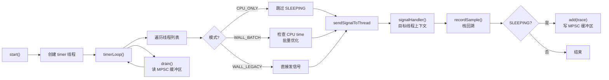
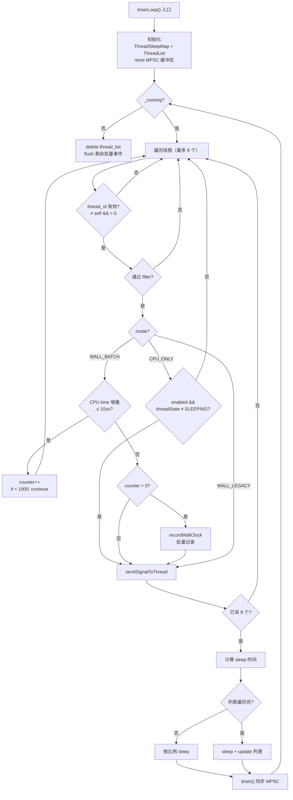
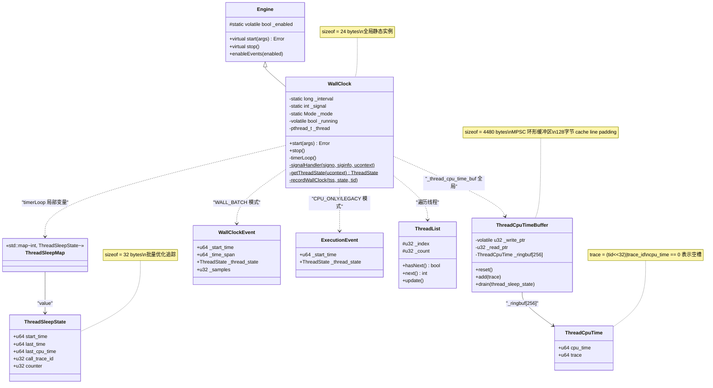

# 第十二章：Wall Clock Profiling 深度解析

> 基于 async-profiler 2.10 源码分析
> 源码路径：`/data/workspace/async-profiler/src/wallClock.cpp/h`
> 文件大小：wallClock.cpp (270 行) + wallClock.h (62 行)
> 遵循：Problem-Driven-Design + Source-Code-Depth + JVM-Mechanism-Deep-Dive

---

## 第 0 部分：核心原理 ⭐

### 0.1 本质是什么？

Wall Clock Profiling 是全线程时间片采样——对所有线程（包括正在等待的 idle 线程）定期采样，不只限于 CPU 上运行的线程。

### 0.2 为什么需要？

CPU profiling（基于 perf_event 或 itimer）只能采样正在 CPU 上运行的线程。但真实应用中，大量性能问题来自线程的等待时间——锁竞争、I/O 阻塞、sleep、线程池空闲。这些时间在 CPU profile 中完全不可见。

perf_event 机制从根本上无法解决这个问题：它依赖硬件 PMU 计数器或内核 timer，只在线程占用 CPU 时才会产生采样中断。一个阻塞在 `futex_wait` 上的线程，内核不会为它产生 perf 事件。

### 0.3 怎么解决？

**核心思路**：用独立的 timer 线程遍历所有线程，通过 `tgkill` 系统调用（Linux）向每个线程发送信号，在目标线程的信号处理器中执行栈回溯。

**关键设计**：
1. **节流控制**：每轮最多向 8 个线程发信号（`THREADS_PER_TICK`），避免信号风暴
2. **批量优化（WALL_BATCH 模式）**：长期 idle 的线程不再每次发信号采样，改为检测 CPU time 增量，idle 线程批量记录一次
3. **MPSC 环形缓冲区**：信号处理器（多生产者）向 timer 线程（单消费者）传递 sleeping 线程的 CPU time 和 trace id

### 0.4 为什么这样设计？

**为什么用独立线程而不是 perf_event？** perf_event 只对 CPU-running 线程触发采样中断，无法触达 idle 线程。独立线程可以通过 `tgkill(pid, tid, signo)` 向任意线程发送信号，包括正在 syscall 中阻塞的线程。

**为什么每次只采样 8 个线程？** 应用可能有数百个线程。一次性发数百个信号会导致：(1) `Profiler::recordSample()` 内部 SpinLock 竞争激烈（只有 16 个分段锁）；(2) 大量信号处理器同时执行栈回溯，开销爆炸。每次 8 个是在采样覆盖率和开销之间的权衡。

**为什么 idle 线程要批量记录？** 线程池场景下可能有上百个空闲线程。每次都给它们发信号、执行栈回溯，但它们的调用栈根本没变（还是阻塞在同一个 `poll/epoll_wait` 上）。批量模式：第一次采样拿到栈，后续只检查 CPU time（读 `/proc/self/task/<tid>/stat`），不变就累计 counter，到阈值或线程变 runnable 时一次性记录。减少 90%+ 的信号开销。

---

## 第 1 部分：数据结构全景

### 1.0 数据结构清单

| # | 结构名 | 源码位置 | 核心作用 |
|---|--------|----------|----------|
| 1 | WallClock | wallClock.h:17-60 | Wall clock 引擎主类（继承 Engine） |
| 2 | Engine | engine.h:12-55 | 引擎基类（虚函数 + _enabled 静态标志） |
| 3 | ThreadSleepState | wallClock.cpp:33-39 | 线程 idle 追踪状态（时间戳 + CPU time + counter） |
| 4 | ThreadSleepMap | wallClock.cpp:41 | `std::map<int, ThreadSleepState>` |
| 5 | ThreadCpuTime | wallClock.cpp:43-46 | MPSC 缓冲区消息（CPU time + 复合 trace） |
| 6 | ThreadCpuTimeBuffer | wallClock.cpp:49-99 | MPSC 环形缓冲区（信号处理器→timer 线程通信） |
| 7 | WallClockEvent | event.h:56-62 | Wall clock 采样事件（4 字段） |
| 8 | ExecutionEvent | event.h:40-46 | 执行采样事件（CPU_ONLY/WALL_LEGACY 模式用） |
| 9 | ThreadState | os.h:22-26 | 枚举：UNKNOWN / RUNNING / SLEEPING |
| 10 | ThreadList | os.h:60-80 | 线程列表抽象基类 |
| 11 | 全局常量 | wallClock.cpp:15-30 | THREADS_PER_TICK / MIN_INTERVAL / RUNNABLE_THRESHOLD_NS / MAX_IDLE_BATCH |

---

### 1.1 WallClock — 引擎主类

#### 问题推导

**问题**：如何让 profiler 定期采样所有线程（包括 idle 线程）？

**需要什么信息？**
- 需要一个独立线程定期遍历目标线程列表
- 需要知道用什么信号来触发采样
- 需要知道采样间隔
- 需要知道当前模式：只采 CPU 线程 vs 全量采 vs 全量+批量优化
- 需要一个标志控制 timer 线程的启停

**推导出的结构**：一个引擎类，包含 pthread 线程句柄、运行标志、以及静态的间隔/信号/模式配置。

#### 真实数据结构

```cpp
// wallClock.h:17-60
class WallClock : public Engine {  // ★ Engine 有虚函数 → vtable ptr 8 字节
  private:
    enum Mode {
        CPU_ONLY,      // 只采 CPU-running 线程
        WALL_BATCH,    // 全量采 + idle 批量优化（默认 wall 模式）
        WALL_LEGACY    // 全量采，无批量优化（nobatch 参数触发）
    };

    static long _interval;      // 采样间隔（纳秒），静态，不占实例空间
    static int _signal;         // 采样信号编号，静态
    static Mode _mode;          // 采样模式，静态

    volatile bool _running;     // ★ 运行标志，timer 线程循环检查
    pthread_t _thread;          // ★ timer 线程句柄

    void timerLoop();           // timer 线程主函数

    static void* threadEntry(void* wall_clock) {  // pthread 入口
        ((WallClock*)wall_clock)->timerLoop();
        return NULL;
    }

    static ThreadState getThreadState(void* ucontext);
    static void signalHandler(int signo, siginfo_t* siginfo, void* ucontext);
    static void recordWallClock(const ThreadSleepState& tss, ThreadState state, int tid);

  public:
    const char* type()  { return "wall"; }
    const char* title() { return _mode == CPU_ONLY ? "CPU profile" : "Wall clock profile"; }
    const char* units() { return "ns"; }
    Error start(Arguments& args);
    void stop();
};
```

**推导 vs 实际**：吻合。`_interval`/`_signal`/`_mode` 都是 static——因为只有一个 WallClock 全局实例，静态成员是合理的。

#### sizeof 分析

```
WallClock 实例内存布局（sizeof = 24 字节）
────────────────────────────────────────────────
偏移      字段                  大小       来源
────────────────────────────────────────────────
0        vtable ptr            8 字节     Engine 有虚函数
8        _running (bool)       1 字节     WallClock 实例字段
9-15     [padding]             7 字节     对齐到 8 字节
16       _thread (pthread_t)   8 字节     WallClock 实例字段
────────────────────────────────────────────────
总计：24 字节

静态成员（不占实例空间）：
  _interval (long)    8 字节
  _signal (int)       4 字节
  _mode (Mode/enum)   4 字节
  _enabled (bool)     1 字节（Engine 基类）
```

**注意**：`_enabled` 是 Engine 基类的 static 字段（engine.h:14），不占实例空间。

#### 创建位置

- **全局静态实例**：`static WallClock wall_clock;`（profiler.cpp）
- **获取方式**：`Profiler::selectEngine()` → 当 event == "wall" 时返回 `&wall_clock`

#### 关键字段生命周期

**_running**：
```
初始值: false（默认构造）
谁设置: start() → _running = true（wallClock.cpp:173）
谁清除: stop() → _running = false（wallClock.cpp:183）
谁读取: timerLoop() 主循环条件（wallClock.cpp:199）
```

**_interval（static）**：
```
何时设置: start() 方法（wallClock.cpp:163-167）
设置逻辑:
  1. args._wall >= 0 → 使用 args._wall
  2. 否则 → 使用 args._interval
  3. 如果值为 0 → CPU_ONLY 用 DEFAULT_INTERVAL(10ms), WALL 模式用 DEFAULT_INTERVAL*5(50ms)
谁读取: timerLoop()计算sleep时间 + signalHandler()传给recordSample() + recordWallClock()计算counter
```

**_signal（static）**：
```
何时设置: start() 方法（wallClock.cpp:169-170）
设置逻辑:
  _signal = args._signal == 0 ? OS::getProfilingSignal(1)          // ★ mode=1（wall clock用SIGVTALRM优先）
                              : ((args._signal >> 8) > 0 ? args._signal >> 8 : args._signal);
  // ★ 用户指定信号时，检查高8位：非零取高8位，否则取整个值
  // ★ 这是为了与 PerfEvents 共存：PerfEvents 用低8位（mode=0），WallClock 用高8位（mode=1）
谁读取: timerLoop() → OS::sendSignalToThread(thread_id, _signal)
```

**_mode（static）值域图**：
```
_mode 字段值域
┌─────────────────────────────────────────────────────────────────┐
│  CPU_ONLY = 0                                                   │
│  ├─ 触发条件: args._wall < 0 且 event != "wall"                │
│  ├─ 行为: 跳过 THREAD_SLEEPING 线程                            │
│  └─ 默认间隔: 10ms (DEFAULT_INTERVAL)                          │
├─────────────────────────────────────────────────────────────────┤
│  WALL_BATCH = 1 ⭐（默认 wall 模式）                           │
│  ├─ 触发条件: (args._wall >= 0 || event == "wall") && !nobatch │
│  ├─ 行为: idle 线程批量记录，MPSC 缓冲区通信                  │
│  └─ 默认间隔: 50ms (DEFAULT_INTERVAL * 5)                      │
├─────────────────────────────────────────────────────────────────┤
│  WALL_LEGACY = 2                                                │
│  ├─ 触发条件: (args._wall >= 0 || event == "wall") && nobatch  │
│  ├─ 行为: 每次都发信号，无批量优化                             │
│  └─ 默认间隔: 50ms (DEFAULT_INTERVAL * 5)                      │
└─────────────────────────────────────────────────────────────────┘

源码（wallClock.cpp:157-161）:
  if (args._wall >= 0 || strcmp(args._event, EVENT_WALL) == 0) {
      _mode = args._nobatch ? WALL_LEGACY : WALL_BATCH;
  } else {
      _mode = CPU_ONLY;
  }
```

---

### 1.2 Engine 基类 — 引擎接口

**为什么存在**：所有采样引擎（CPU/WallClock/Alloc/Lock）的公共基类，提供虚函数接口和共享的 `_enabled` 标志。

```cpp
// engine.h:12-55
class Engine {
  protected:
    static volatile bool _enabled;  // ★ 静态，所有引擎共享
    static bool updateCounter(...);  // CAS 计数器辅助（wall clock 不用）
  public:
    virtual const char* type();    // 返回引擎类型名
    virtual const char* title();   // 返回图表标题
    virtual const char* units();   // 返回单位
    virtual Error start(Arguments& args);  // 启动引擎
    virtual void stop();           // 停止引擎
    void enableEvents(bool enabled) { _enabled = enabled; }
};
```

**sizeof**: Engine 有虚函数 → vtable ptr = 8 字节。`_enabled` 是 static → 不占实例空间。所以 sizeof(Engine) = 8 字节（仅 vtable ptr）。

**关键点**：`_enabled` 和 `_running` 是不同的概念——`_running` 控制 timer 线程生死（由 start/stop 设置），`_enabled` 控制是否真正执行采样（由 `Profiler::enableEvents()` 设置，用于暂停/恢复采样）。

---

### 1.3 ThreadSleepState — 线程 idle 追踪状态

#### 问题推导

**问题**：WALL_BATCH 模式下，如何追踪一个线程的 idle 状态，避免重复发信号？

**需要什么信息？**
- 需要知道线程从什么时候开始 idle → `start_time`
- 需要知道最后一次检查的时间 → `last_time`（用于计算 idle 持续时间 time_span）
- 需要知道上次的 CPU time → `last_cpu_time`（用于判断线程是否仍然 idle：CPU time 增量 ≤ 阈值）
- 需要知道上次采样的调用栈 ID → `call_trace_id`（idle 线程栈不变，直接复用）
- 需要一个计数器 → `counter`（达到 MAX_IDLE_BATCH 时强制记录）

**推导出的结构**：一个包含 5 个字段的结构体，按时间戳 + CPU time + 栈 ID + 计数器组织。

#### 真实数据结构

```cpp
// wallClock.cpp:33-39
struct ThreadSleepState {
    u64 start_time;       // ★ idle 开始时间（TSC ticks）
    u64 last_time;        // ★ 最后一次检测时间（TSC ticks）
    u64 last_cpu_time;    // ★ 上次记录的 CPU time（纳秒）
    u32 call_trace_id;    // ★ 调用栈 ID（从 MPSC 缓冲区获取）
    u32 counter;          // ★ 连续 idle 采样计数
};
```

**推导 vs 实际**：完全吻合，5 个字段一一对应。

#### sizeof 分析

```
ThreadSleepState (sizeof = 32 字节)
偏移    字段             大小
0       start_time       8 字节 (u64)
8       last_time        8 字节 (u64)
16      last_cpu_time    8 字节 (u64)
24      call_trace_id    4 字节 (u32)
28      counter          4 字节 (u32)
总计 = 32 字节（无 padding）
```

#### 创建位置

- **容器**：`ThreadSleepMap thread_sleep_state;`（timerLoop 局部变量，wallClock.cpp:194）
- **创建时机**：`thread_sleep_state[thread_id]` 首次访问时（std::map 默认构造插入）
- **销毁时机**：timerLoop() 返回时局部变量销毁

#### 关键字段生命周期

**counter**：
```
初始值: 0（std::map 默认构造所有 POD 字段为 0）
递增: timerLoop() 中 ++tss.counter（wallClock.cpp:221）
重置为 0:
  1. recordWallClock 后重置（wallClock.cpp:230）
  2. drain() 中重置（wallClock.cpp:94）—— 信号处理器写入新 CPU time 后打断批量计数
上限: MAX_IDLE_BATCH = 1000
```

**call_trace_id**：
```
初始值: 0
谁设置: drain() 方法从 MPSC 缓冲区读取后设置（wallClock.cpp:93）
数据流: signalHandler → recordSample返回trace → add(trace) → drain读取 → tss.call_trace_id = (u32)trace
谁读取: recordWallClock → recordExternalSamples(tss.call_trace_id)
```

---

### 1.4 ThreadCpuTime — MPSC 缓冲区消息

**为什么存在**：信号处理器需要把 sleeping 线程的 CPU time 和 trace 传给 timer 线程，但信号处理器中不能用锁。需要一个极简的无锁消息格式。

```cpp
// wallClock.cpp:43-46
struct ThreadCpuTime {
    u64 cpu_time;    // ★ 线程 CPU time（纳秒），同时作为"槽位是否已写入"的标记
    u64 trace;       // ★ 复合值：高32位=thread_id, 低32位=call_trace_id
};
```

**sizeof** = 16 字节

**关键设计**：`cpu_time == 0` 表示槽位空闲。这是一个约定——正常运行中线程 CPU time > 0。

**trace 的编码**（关键！旧文档遗漏）：
```
trace = (u64)tid << 32 | call_trace_id    // profiler.cpp:712
┌─────────────────────────────────────────────┐
│  高 32 位: thread_id    低 32 位: call_trace_id  │
└─────────────────────────────────────────────┘

drain() 中解码：
  int thread_id = trace >> 32;              // wallClock.cpp:90
  tss.call_trace_id = (u32)trace;           // wallClock.cpp:93（截断高32位）
```

---

### 1.5 ThreadCpuTimeBuffer — MPSC 环形缓冲区

#### 问题推导

**问题**：信号处理器（在目标线程上下文执行）需要把 sleeping 线程的信息传给 timer 线程。信号处理器中不能用锁（可能死锁），怎么办？

**需要什么信息？**
- 多个信号处理器可能并发写入（多生产者） → 写指针需要原子递增
- timer 线程是唯一消费者（单消费者） → 读指针不需要原子操作
- 缓冲区大小固定（信号处理器不能分配内存） → 环形缓冲区
- 写指针和读指针在不同 cache line → 需要 padding 避免伪共享

**推导出的结构**：带 cache line padding 的 MPSC 环形缓冲区。

#### 真实数据结构

```cpp
// wallClock.cpp:49-99
class ThreadCpuTimeBuffer {
  private:
    enum {
        RINGBUF_SIZE = 256,   // 环形缓冲区容量
        PAD_SIZE = 128        // cache line padding（覆盖两个 cache line）
    };

    char _pad0[PAD_SIZE];              // ★ 保护 _write_ptr 的前方
    volatile u32 _write_ptr;           // ★ 写指针（原子递增）
    char _pad1[PAD_SIZE - sizeof(u32)]; // ★ 隔离 _write_ptr 和 _read_ptr
    u32 _read_ptr;                     // ★ 读指针（只 timer 线程访问）
    char _pad2[PAD_SIZE - sizeof(u32)]; // ★ 隔离 _read_ptr 和 _ringbuf
    ThreadCpuTime _ringbuf[RINGBUF_SIZE]; // ★ 环形缓冲区
};
```

**推导 vs 实际**：吻合。128 字节 padding（而非常见的 64 字节）覆盖了两个 cache line，更保守。

#### sizeof 分析

```
ThreadCpuTimeBuffer (sizeof = 4480 字节 ≈ 4.4 KB)
偏移        字段                大小
0          _pad0               128 字节
128        _write_ptr          4 字节
132        _pad1               124 字节 (PAD_SIZE - sizeof(u32))
256        _read_ptr           4 字节
260        _pad2               124 字节
384        _ringbuf[256]       256 × 16 = 4096 字节
总计 = 4480 字节
```

#### 创建位置

- **全局静态变量**：`static ThreadCpuTimeBuffer _thread_cpu_time_buf;`（wallClock.cpp:101）
- **构造函数**：`ThreadCpuTimeBuffer() : _ringbuf(), _write_ptr(0), _read_ptr(0) {}`（wallClock.cpp:64）

#### 内存序协议（关键设计！）

`add()` 和 `drain()` 之间的无锁通信协议：

```
add() 写入（信号处理器，多生产者）:
  1. atomicInc(_write_ptr) → 原子递增获取槽位（__sync_fetch_and_add 返回旧值）
  2. t.trace = trace;  → 先写 trace（普通写）
  3. storeRelease(t.cpu_time, OS::threadCpuTime(0));  → release 语义写 cpu_time
  // ★ release 保证 trace 的写入在 cpu_time 之前对其他线程可见

drain() 读取（timer 线程，单消费者）:
  1. loadAcquire(t.cpu_time) → acquire 语义读 cpu_time
  // ★ acquire 保证后续读到的 trace 是 add() 写入时的值
  2. if (cpu_time == 0) break;  → 空槽，停止读取
  3. trace = t.trace;  → 读 trace
  4. CAS(t.cpu_time, cpu_time, 0) → 原子清零，标记槽位已消费
  // ★ 为什么用 CAS 而不是直接写 0？防止 add() 并发覆盖时丢失数据
```

**设计决策**：
- **为什么 `cpu_time` 作为标记字段？** 因为 cpu_time 是最后写入的，用它判断槽位状态可以保证 trace 已经写好
- **为什么 padding = 128 而不是 64？** 保守设计，覆盖两个 cache line（Intel 预取可能触及相邻 cache line）

---

### 1.6 WallClockEvent — Wall clock 采样事件

**为什么存在**：WALL_BATCH 模式的信号处理器和批量记录函数都需要传递事件数据给 Profiler。

```cpp
// event.h:56-62
class WallClockEvent : public Event {
  public:
    u64 _start_time;           // 事件开始时间（TSC ticks）
    u64 _time_span;            // 时间跨度（TSC ticks），单次采样为 0，批量为 last-start
    ThreadState _thread_state; // THREAD_RUNNING 或 THREAD_SLEEPING
    u32 _samples;              // 采样次数（单次=1，批量=counter）
};
```

**sizeof**：Event 基类 + 8 + 8 + 4 + 4 = Event + 24 字节

---

### 1.7 ExecutionEvent — 执行采样事件

**为什么存在**：CPU_ONLY 和 WALL_LEGACY 模式使用这个事件类型（与 PerfEvents/ctimer 共享）。

```cpp
// event.h:40-46
class ExecutionEvent : public Event {
  public:
    u64 _start_time;
    ThreadState _thread_state;
    ExecutionEvent(u64 start_time) : _start_time(start_time), _thread_state(THREAD_UNKNOWN) {}
};
```

**与 WallClockEvent 的区别**：没有 `_time_span` 和 `_samples` 字段，因为非批量模式每次都是单次采样。

---

### 1.8 ThreadState 枚举

```cpp
// os.h:22-26
enum ThreadState {
    THREAD_UNKNOWN,    // 0: 未知（CPU_ONLY 模式不判断状态）
    THREAD_RUNNING,    // 1: CPU 上运行
    THREAD_SLEEPING    // 2: 阻塞/等待（syscall 中）
};
```

---

### 1.9 ThreadList — 线程列表抽象基类

```cpp
// os.h:60-80
class ThreadList {
  protected:
    u32 _index;   // 当前遍历位置
    u32 _count;   // 线程总数
  public:
    u32 index() const { return _index; }
    u32 count() const { return _count; }
    bool hasNext() const { return _index < _count; }
    virtual int next() = 0;    // 返回下一个 thread_id
    virtual void update() = 0; // 刷新线程列表
};
```

**Linux 实现**：读取 `/proc/self/task/` 目录获取所有线程 ID。

---

### 1.10 全局常量

```cpp
// wallClock.cpp:15-30
const int THREADS_PER_TICK = 8;            // 每轮最多采样 8 个线程
const long long MIN_INTERVAL = 100000;     // 最小间隔 100us（100,000 ns）
const u64 RUNNABLE_THRESHOLD_NS = 10000;   // 10us：CPU time 增量 ≤ 此值视为 idle
const u32 MAX_IDLE_BATCH = 1000;           // idle 批量上限（超过则强制记录）
```

**来自 arguments.h 的关联常量**：
```cpp
const long DEFAULT_INTERVAL = 10000000;    // 10ms：默认采样间隔
// WALL 模式默认用 DEFAULT_INTERVAL * 5 = 50ms
```

---

## 第 2 部分：算法/流程分析

### 2.0 核心流程概览



---

### 2.1 start() — 引擎启动

#### 解决什么问题

初始化 WallClock 引擎：确定模式、间隔、信号，安装信号处理器，创建 timer 线程。

#### 真实源码 + 逐行注释

```cpp
// wallClock.cpp:156-180
Error WallClock::start(Arguments& args) {
    // ★ Phase 1: 确定模式
    if (args._wall >= 0 || strcmp(args._event, EVENT_WALL) == 0) {
        // args._wall >= 0：用户显式指定 wall 参数（如 -w 50ms）
        // args._event == "wall"：用户用 -e wall 指定事件类型
        _mode = args._nobatch ? WALL_LEGACY : WALL_BATCH;  // ★ nobatch 参数控制是否禁用批量优化
    } else {
        _mode = CPU_ONLY;  // ★ 用作 CPU profiling 的 timer 引擎
    }

    // ★ Phase 2: 确定间隔
    _interval = args._wall >= 0 ? args._wall : args._interval;
    if (_interval == 0) {
        // ★ 用户未指定间隔，使用默认值
        _interval = _mode == CPU_ONLY ? DEFAULT_INTERVAL      // 10ms
                                      : DEFAULT_INTERVAL * 5;  // 50ms（wall 模式线程更多，间隔更大）
    }

    // ★ Phase 3: 确定信号编号
    _signal = args._signal == 0 ? OS::getProfilingSignal(1)   // ★ mode=1: WallClock 优先选择不同于 PerfEvents 的信号
                                : ((args._signal >> 8) > 0 ? args._signal >> 8 : args._signal);
    // ★ 用户指定时：高 8 位非零取高 8 位（为了与 PerfEvents 的低 8 位共存）
    OS::installSignalHandler(_signal, signalHandler);  // ★ 安装信号处理器

    // ★ Phase 4: 启动 timer 线程
    _running = true;  // ★ 必须在 pthread_create 之前设置
    if (pthread_create(&_thread, NULL, threadEntry, this) != 0) {
        return Error("Unable to create timer thread");
    }
    return Error::OK;
}
```

#### 设计决策

**为什么 `getProfilingSignal(1)` 而不是 `getProfilingSignal(0)`？**
- PerfEvents 调用 `getProfilingSignal(0)`，WallClock 调用 `getProfilingSignal(1)`
- Linux 实现中 `preferred_signals[2] = {SIGPROF, SIGVTALRM}`
- mode=0 优先用 SIGPROF，mode=1 优先用 SIGVTALRM
- 这样两个引擎同时运行时使用不同信号，避免冲突

**为什么 wall 模式默认间隔 50ms 而不是 10ms？**
- wall 模式采样所有线程（而非只有 CPU-running 线程），线程数量远多于 CPU 数量
- 如果还用 10ms 间隔，开销会远超 CPU-only 模式
- 50ms 是一个在精度和开销之间的折衷

---

### 2.2 stop() — 引擎停止

#### 解决什么问题

安全停止 timer 线程：先设标志，再唤醒（可能正在 sleep），最后等待线程退出。

#### 真实源码 + 逐行注释

```cpp
// wallClock.cpp:182-186
void WallClock::stop() {
    _running = false;                           // ★ 设置停止标志
    pthread_kill(_thread, WAKEUP_SIGNAL);       // ★ 发 SIGIO 唤醒 timer 线程（可能阻塞在 clock_nanosleep 中）
    pthread_join(_thread, NULL);                // ★ 等待线程退出
}
```

**设计决策**：为什么需要 `pthread_kill(WAKEUP_SIGNAL)`？
- timer 线程可能正在 `OS::uninterruptibleSleep` 中（Linux 上是 `clock_nanosleep`）
- 只设 `_running = false` 不够，线程可能还要睡几十毫秒才醒来
- 发 SIGIO 信号让 `clock_nanosleep` 返回 EINTR，`uninterruptibleSleep` 检查 `*flag`（即 `_running`）为 false 后退出循环
- `uninterruptibleSleep` 实现（os_linux.cpp:140-144）：
  ```cpp
  void OS::uninterruptibleSleep(u64 nanos, volatile bool* flag) {
      u64 deadline = OS::nanotime() + nanos;
      struct timespec ts = {(time_t)(deadline / 1000000000), (long)(deadline % 1000000000)};
      while (*flag && clock_nanosleep(CLOCK_MONOTONIC, TIMER_ABSTIME, &ts, &ts) == EINTR);
  }
  ```

---

### 2.3 timerLoop() — Timer 线程主循环 ⭐

#### 解决什么问题

定期遍历所有线程，发送采样信号，同时对 idle 线程实施批量优化，避免信号风暴。

#### 整体流程（5 个阶段）

| 阶段 | 代码范围 | 核心任务 |
|------|---------|---------|
| Phase 1 | 188-197 | 初始化：局部变量 + ThreadSleepMap + ThreadList + 重置缓冲区 |
| Phase 2 | 199-237 | 主循环：遍历线程列表，模式分支处理，发送信号 |
| Phase 3 | 239-254 | 休眠：计算 sleep 时间，保持间隔稳定 |
| Phase 4 | 257 | 同步：drain MPSC 缓冲区 |
| Phase 5 | 260-268 | 清理：删除 ThreadList，刷新剩余批量事件 |

#### Phase 1: 初始化

```cpp
// wallClock.cpp:188-197
void WallClock::timerLoop() {
    int self = OS::threadId();                    // ★ timer 线程自己的 tid（需要跳过自己）
    ThreadFilter* thread_filter = Profiler::instance()->threadFilter();
    bool thread_filter_enabled = thread_filter->enabled();
    Mode mode = _mode;                            // ★ 缓存到局部变量（避免每次读静态变量）

    ThreadSleepMap thread_sleep_state;             // ★ 线程 idle 追踪表（局部变量）
    ThreadList* thread_list = OS::listThreads();   // ★ 获取线程列表（Linux: 读 /proc/self/task/）
    _thread_cpu_time_buf.reset();                  // ★ 重置 MPSC 缓冲区
    u64 cycle_start_time = OS::nanotime();         // ★ 记录周期起始时间
```

#### Phase 2: 主循环 — 遍历线程并发信号

```cpp
    // wallClock.cpp:199-237
    while (_running) {
        bool enabled = _enabled;  // ★ Engine 基类的全局启用标志（Profiler::enableEvents 控制）

        // ★★★ 每轮最多采样 THREADS_PER_TICK=8 个线程 ★★★
        for (int signaled_threads = 0; signaled_threads < THREADS_PER_TICK && thread_list->hasNext(); ) {
            int thread_id = thread_list->next();

            // ★ 跳过 timer 线程自己 + 无效 ID（macOS 上 task_threads 可能返回 0/-1）
            if (thread_id == self || thread_id <= 0) {
                continue;
            }
            // ★ 用户过滤（-t tid 或 filter 参数）
            if (thread_filter_enabled && !thread_filter->accept(thread_id)) {
                continue;
            }

            // ★★★ 模式分支 1: CPU_ONLY ★★★
            if (mode == CPU_ONLY) {
                // ★ 跳过 SLEEPING 线程（只采 CPU-running）
                // ★ !enabled 时也跳过（暂停采样期间不发信号）
                if (!enabled || OS::threadState(thread_id) == THREAD_SLEEPING) {
                    continue;  // ★ Linux: threadState 读 /proc/self/task/<tid>/stat 的状态字段
                }
            }
            // ★★★ 模式分支 2: WALL_BATCH ★★★
            else if (mode == WALL_BATCH) {
                ThreadSleepState& tss = thread_sleep_state[thread_id];
                // ★ 获取线程 CPU time（enabled 为 false 时返回 0，跳过批量逻辑）
                u64 new_thread_cpu_time = enabled ? OS::threadCpuTime(thread_id) : 0;
                // ★ Linux: threadCpuTime 用 clock_gettime(thread_cpu_clock) 获取

                // ★ 判断是否仍然 idle：CPU time 增量 ≤ 10us
                if (new_thread_cpu_time != 0 &&
                    new_thread_cpu_time - tss.last_cpu_time <= RUNNABLE_THRESHOLD_NS) {
                    tss.last_time = TSC::ticks();   // ★ 更新最后检查时间
                    if (++tss.counter < MAX_IDLE_BATCH) {  // ★ 批量计数 < 1000
                        if (tss.counter == 1) {
                            tss.start_time = tss.last_time;  // ★ 第一次标记 idle 的起始时间
                        }
                        continue;  // ★ 跳过信号发送——这就是批量优化的核心！
                    }
                    // ★ counter >= 1000：达到批量上限，下面会 recordWallClock 然后发信号
                }

                // ★ 线程变为 runnable 或达到批量上限 → 记录之前积累的批量事件
                if (tss.counter != 0) {
                    recordWallClock(tss, THREAD_SLEEPING, thread_id);
                    tss.counter = 0;  // ★ 重置计数
                }
            }
            // ★ WALL_LEGACY 模式：无批量优化，直接走到下面发信号

            // ★★★ 发送采样信号 ★★★
            if (enabled && OS::sendSignalToThread(thread_id, _signal)) {
                // ★ Linux: syscall(__NR_tgkill, pid, tid, signo)
                signaled_threads++;  // ★ 只计成功发送的
            }
        }
```

**Phase 2 关键逻辑详解**：

WALL_BATCH 的 idle 判定使用 CPU time 增量而非 `/proc` 状态文件：
- `OS::threadState()` 读 `/proc/self/task/<tid>/stat`（文件 I/O）
- `OS::threadCpuTime()` 用 `clock_gettime(thread_cpu_clock)`（系统调用，更快）
- CPU time 增量 ≤ 10us（`RUNNABLE_THRESHOLD_NS`）说明线程几乎没消耗 CPU，视为 idle

WALL_BATCH 的 "新线程首次采样" 逻辑：
- 新线程首次出现时，`tss.last_cpu_time == 0`（默认构造）
- `new_thread_cpu_time - 0 > RUNNABLE_THRESHOLD_NS` 几乎必然成立
- 所以新线程不会进入 idle 分支，会直接发信号采样

#### Phase 3: 休眠控制

```cpp
        // wallClock.cpp:239-254
        u64 current_time = OS::nanotime();
        if (thread_list->hasNext()) {
            // ★ 线程列表还没遍历完：按比例计算 sleep 时间
            // 目标：整个 _interval 内均匀遍历完所有线程
            // sleep_time = cycle_start + interval * (已遍历/总数) - 当前时间
            long long sleep_time = cycle_start_time +
                (u64)_interval * thread_list->index() / thread_list->count() - current_time;
            OS::uninterruptibleSleep(sleep_time < MIN_INTERVAL ? MIN_INTERVAL : sleep_time, &_running);
        } else {
            // ★ 线程列表遍历完一轮：准备下一轮
            cycle_start_time += (u64)_interval;
            long long sleep_time = cycle_start_time - current_time;
            if (sleep_time < MIN_INTERVAL) {
                cycle_start_time = current_time + MIN_INTERVAL;  // ★ 防止时间漂移导致负值
                sleep_time = MIN_INTERVAL;
            }
            OS::uninterruptibleSleep(sleep_time, &_running);
            thread_list->update();  // ★ 刷新线程列表（重新读 /proc/self/task/）
        }
```

**设计决策**：为什么按比例 sleep？
- 如果有 100 个线程，每次采 8 个，需要 13 轮才能遍历完
- 总间隔 50ms，每轮 sleep 约 50ms×8/100 ≈ 4ms
- 保证整个 _interval 内均匀覆盖所有线程

#### Phase 4: 同步 MPSC 缓冲区

```cpp
        // wallClock.cpp:256-257
        // ★ 读取上一轮信号处理器写入的 CPU time 和 trace
        _thread_cpu_time_buf.drain(thread_sleep_state);
    }  // end while (_running)
```

#### Phase 5: 清理

```cpp
    // wallClock.cpp:260-268
    delete thread_list;

    // ★ 刷新剩余的批量事件（停止时可能还有未记录的 idle 计数）
    for (ThreadSleepMap::const_iterator it = thread_sleep_state.begin();
         it != thread_sleep_state.end(); ++it) {
        const ThreadSleepState& tss = it->second;
        if (tss.counter != 0) {
            recordWallClock(tss, THREAD_SLEEPING, it->first);
        }
    }
}
```

#### 算法流程图



---

### 2.4 signalHandler() — 信号处理器

#### 解决什么问题

在目标线程上下文中执行栈回溯，记录采样数据，并在 WALL_BATCH 模式下将 sleeping 线程的信息写入 MPSC 缓冲区。

#### 真实源码 + 逐行注释

```cpp
// wallClock.cpp:129-145
void WallClock::signalHandler(int signo, siginfo_t* siginfo, void* ucontext) {
    // ★★★ WALL_BATCH 模式 ★★★
    if (_mode == WALL_BATCH) {
        WallClockEvent event;
        event._start_time = TSC::ticks();     // ★ 当前 TSC 时间戳
        event._time_span = 0;                 // ★ 单次采样，span=0（批量记录时才有 span）
        event._thread_state = getThreadState(ucontext);  // ★ 通过 PC 判断 RUNNING/SLEEPING
        event._samples = 1;                   // ★ 单次采样

        // ★ 执行栈回溯 + 记录到 JFR
        // ★ 返回值 trace = (tid << 32) | call_trace_id（复合编码）
        u64 trace = Profiler::instance()->recordSample(ucontext, _interval, WALL_CLOCK_SAMPLE, &event);

        // ★★★ 如果线程 SLEEPING，把 trace 写入 MPSC 缓冲区 ★★★
        if (event._thread_state == THREAD_SLEEPING && trace != 0) {
            _thread_cpu_time_buf.add(trace);
            // ★ add() 内部：atomicInc写指针 → 写trace → storeRelease写cpu_time
            // ★ timer 线程下轮 drain() 时读取，用于更新 ThreadSleepState
        }
    }
    // ★★★ CPU_ONLY 或 WALL_LEGACY 模式 ★★★
    else {
        ExecutionEvent event(TSC::ticks());
        // ★ CPU_ONLY 不判断状态（THREAD_UNKNOWN），WALL_LEGACY 才判断
        event._thread_state = _mode == CPU_ONLY ? THREAD_UNKNOWN : getThreadState(ucontext);
        Profiler::instance()->recordSample(ucontext, _interval, EXECUTION_SAMPLE, &event);
        // ★ 注意事件类型不同：EXECUTION_SAMPLE vs WALL_CLOCK_SAMPLE
    }
}
```

#### 设计决策

**为什么 WALL_BATCH 用 WALL_CLOCK_SAMPLE，而其他模式用 EXECUTION_SAMPLE？**
- 事件类型决定了 JFR 中的记录格式
- WALL_CLOCK_SAMPLE 额外包含 `_time_span` 和 `_samples`（批量相关字段）
- EXECUTION_SAMPLE 是通用的执行采样事件，与 PerfEvents/ctimer 共享

**为什么只有 SLEEPING 线程写 MPSC 缓冲区？**
- RUNNING 线程每次都重新采样（栈可能变化），不需要批量优化
- SLEEPING 线程栈不变，写入 trace 供 timer 线程批量复用

---

### 2.5 getThreadState() — 线程状态判断

#### 解决什么问题

判断被采样线程是 RUNNING 还是 SLEEPING。方法：检查 PC（程序计数器）是否指向或刚刚执行完 syscall 指令。

#### 真实源码 + 逐行注释

```cpp
// wallClock.cpp:108-127
ThreadState WallClock::getThreadState(void* ucontext) {
    StackFrame frame(ucontext);
    uintptr_t pc = frame.pc();  // ★ 从 ucontext 获取 PC 寄存器

    // ★ 情况 1: PC 正好在 syscall 指令上
    // ★ x86_64: isSyscall 检查 pc[0]==0x0f && pc[1]==0x05（syscall 指令的机器码）
    if (StackFrame::isSyscall((instruction_t*)pc)) {
        return THREAD_SLEEPING;
    }

    // ★ 情况 2: syscall 刚返回（被信号中断了 EINTR）
    // ★ 此时 PC 在 syscall 指令的下一条指令，需要检查 pc - SYSCALL_SIZE
    uintptr_t prev_pc = pc - SYSCALL_SIZE;  // ★ x86_64: SYSCALL_SIZE = 2

    // ★ 页面边界保护：如果 PC 在页面的前 SYSCALL_SIZE 字节内，
    // ★ prev_pc 可能跨页不可读。用两个条件判断：
    // ★ (1) pc & 0xfff >= SYSCALL_SIZE：PC 不在页面头部，prev_pc 在同一页，安全
    // ★ (2) findLibraryByAddress：prev_pc 在已知库的地址范围内，安全
    if ((pc & 0xfff) >= SYSCALL_SIZE ||
        Profiler::instance()->findLibraryByAddress((instruction_t*)prev_pc) != NULL) {
        // ★ prev_pc 可读，检查是否是 syscall 指令 + 返回值是 -EINTR
        if (StackFrame::isSyscall((instruction_t*)prev_pc) && frame.checkInterruptedSyscall()) {
            return THREAD_SLEEPING;
            // ★ checkInterruptedSyscall: Linux x86_64 检查 retval() == -EINTR
        }
    }

    return THREAD_RUNNING;
}
```

#### 设计决策

**为什么用 PC 位置判断而不用 `/proc/stat`？**
- 信号处理器中不能做文件 I/O（不可重入）
- PC 位置判断是纯寄存器检查，O(1)，信号安全

**为什么要检查 `prev_pc`（syscall 刚返回的情况）？**
- 信号可能在 syscall 返回后、用户代码执行前到达
- 此时 PC 已经移过 syscall 指令（指向下一条），但线程实际上刚从阻塞态醒来
- 通过检查 prev_pc 是否是 syscall 且返回值 == -EINTR，判断这种情况

---

### 2.6 recordWallClock() — 批量记录 WallClock 事件

#### 解决什么问题

将 idle 线程积累的批量采样数据一次性记录到 Profiler，避免重复栈回溯。

#### 真实源码 + 逐行注释

```cpp
// wallClock.cpp:147-154
void WallClock::recordWallClock(const ThreadSleepState& tss, ThreadState state, int tid) {
    WallClockEvent event;
    event._start_time = tss.start_time;                // ★ idle 开始时间
    event._time_span = tss.last_time - tss.start_time; // ★ idle 持续时间（TSC ticks）
    event._thread_state = state;                       // ★ THREAD_SLEEPING
    event._samples = tss.counter;                      // ★ 批量采样次数

    // ★ 记录外部采样（不执行栈回溯，直接使用已有的 call_trace_id）
    Profiler::instance()->recordExternalSamples(
        tss.counter,              // samples: 采样次数
        tss.counter * _interval,  // counter: 总时间（纳秒）
        tid,                      // thread_id
        tss.call_trace_id,        // call_trace_id（从 MPSC 缓冲区获取）
        WALL_CLOCK_SAMPLE,        // event_type
        &event                    // event 数据
    );
}
```

#### recordExternalSamples vs recordSample 对比

| | recordSample | recordExternalSamples |
|---|---|---|
| **调用位置** | 信号处理器中 | timer 线程中 |
| **栈回溯** | 执行完整栈回溯 | 不执行栈回溯 |
| **call_trace_id** | 新计算 | 使用已有的 |
| **_total_samples** | 递增 | 不递增 |
| **作用** | 采集新样本 | 累加已有样本的计数器 |

```cpp
// profiler.cpp:738-756
void Profiler::recordExternalSamples(u64 samples, u64 counter, int tid, u32 call_trace_id, ...) {
    _call_trace_storage.add(call_trace_id, samples, counter);  // ★ 累加到已有 trace
    // ... 获取锁 ...
    _jfr.recordEvent(lock_index, tid, call_trace_id, event_type, event);  // ★ 写 JFR
    // ... 释放锁 ...
}
```

---

### 2.7 ThreadCpuTimeBuffer::add() — MPSC 写入

#### 解决什么问题

信号处理器中将 sleeping 线程的 trace 和 CPU time 写入环形缓冲区，传给 timer 线程。

#### 真实源码 + 逐行注释

```cpp
// wallClock.cpp:73-77
void add(u64 trace) {
    // ★ atomicInc = __sync_fetch_and_add(&_write_ptr, 1)，返回旧值
    // ★ 旧值 & (256-1) 得到槽位索引（环形）
    ThreadCpuTime& t = _ringbuf[atomicInc(_write_ptr) & (RINGBUF_SIZE - 1)];
    t.trace = trace;                            // ★ 先写 trace（普通写）
    storeRelease(t.cpu_time, OS::threadCpuTime(0));  // ★ release 语义写 cpu_time
    // ★ OS::threadCpuTime(0): 获取当前线程的 CPU time
    // ★ release 保证 trace 写入在 cpu_time 之前对 drain() 可见
    // ★ cpu_time != 0 作为"数据已就绪"的标记
}
```

---

### 2.8 ThreadCpuTimeBuffer::drain() — MPSC 读取

#### 解决什么问题

timer 线程批量读取信号处理器写入的 CPU time 和 trace，更新 ThreadSleepState。

#### 真实源码 + 逐行注释

```cpp
// wallClock.cpp:79-98
void drain(ThreadSleepMap& thread_sleep_state) {
    u64 read_limit = _read_ptr + RINGBUF_SIZE;  // ★ 防止无限循环（最多读一圈）
    do {
        ThreadCpuTime& t = _ringbuf[_read_ptr & (RINGBUF_SIZE - 1)];
        u64 cpu_time = loadAcquire(t.cpu_time);  // ★ acquire 语义读 cpu_time
        if (cpu_time == 0) {
            break;  // ★ 空槽，没有更多数据
        }

        u64 trace = t.trace;  // ★ 读 trace（acquire 保证此时 trace 已写入）
        // ★ CAS 将 cpu_time 清零，标记槽位已消费
        if (__sync_bool_compare_and_swap(&t.cpu_time, cpu_time, 0)) {
            // ★ CAS 成功：解码 trace 复合值
            int thread_id = trace >> 32;         // ★ 高 32 位 = thread_id
            ThreadSleepState& tss = thread_sleep_state[thread_id];
            tss.last_cpu_time = cpu_time;        // ★ 更新 CPU time
            tss.call_trace_id = (u32)trace;      // ★ 低 32 位 = call_trace_id
            tss.counter = 0;                     // ★★★ 关键：重置 counter！
            // ★ 这意味着信号处理器写入新数据后，打断了 timerLoop 的批量计数
            // ★ 因为栈可能已经变了（线程醒来又睡去，栈不同了）
            _read_ptr++;
        }
        // ★ CAS 失败：另一个 add() 正在写这个槽位，跳过，下次再读
    } while (_read_ptr < read_limit);
}
```

#### 设计决策

**为什么 drain() 中 `tss.counter = 0`？**
- 信号处理器记录了线程的新 CPU time 和 trace，说明线程刚被采样过
- timer 线程之前可能已经累计了 counter（认为线程 idle）
- 但信号处理器的数据更新了——线程可能醒来又睡去，调用栈已经变了
- 所以需要重置 counter，重新开始新一轮批量计数

**为什么用 CAS 而不是直接写 0？**
- 在 drain() 读 trace 和清零 cpu_time 之间，add() 可能正在往同一个槽位写新数据
- CAS 确保只有当 cpu_time 仍然是我们读到的那个值时才清零
- 如果 add() 已经写了新值，CAS 失败，本轮跳过，下轮再读

---

## 第 3 部分：数据结构关系图



---

## 第 4 部分：GDB 验证

### 4.1 验证计划

| # | 验证目标 | 验证方法 |
|---|---------|---------|
| 1 | WallClock sizeof = 24 | `p sizeof(WallClock)` |
| 2 | ThreadSleepState sizeof = 32 | `p sizeof(ThreadSleepState)` |
| 3 | ThreadCpuTime sizeof = 16 | `p sizeof(ThreadCpuTime)` |
| 4 | ThreadCpuTimeBuffer sizeof = 4480 | `p sizeof(ThreadCpuTimeBuffer)` |
| 5 | Engine sizeof = 8 | `p sizeof(Engine)` |
| 6 | ThreadSleepState 字段偏移 | `p &((ThreadSleepState*)0)->field` |
| 7 | ThreadCpuTimeBuffer 字段偏移 | `p &((ThreadCpuTimeBuffer*)0)->field` |

### 4.2 GDB 脚本

```gdb
# 保存到: new-jvm-md/tmp-file/WallClock/verify.gdb
set pagination off
set print pretty on

# 加载 async-profiler 的符号
file /data/workspace/async-profiler/build/lib/libasyncProfiler.so

echo \n===== sizeof 验证 =====\n
p sizeof(Engine)
p sizeof(WallClock)
p sizeof(ThreadSleepState)
p sizeof(ThreadCpuTime)
p sizeof(ThreadCpuTimeBuffer)

echo \n===== ThreadSleepState 字段偏移 =====\n
p (size_t)&((ThreadSleepState*)0)->start_time
p (size_t)&((ThreadSleepState*)0)->last_time
p (size_t)&((ThreadSleepState*)0)->last_cpu_time
p (size_t)&((ThreadSleepState*)0)->call_trace_id
p (size_t)&((ThreadSleepState*)0)->counter

echo \n===== ThreadCpuTime 字段偏移 =====\n
p (size_t)&((ThreadCpuTime*)0)->cpu_time
p (size_t)&((ThreadCpuTime*)0)->trace

quit
```

---

## 第 5 部分：总结

### 5.1 数据结构层面

| 结构 | sizeof | 核心特征 |
|------|--------|---------|
| **WallClock** | 24 B | 引擎主类，实例只有 vtable ptr + _running + _thread，其他全 static |
| **Engine** | 8 B | 基类，仅 vtable ptr（_enabled 是 static） |
| **ThreadSleepState** | 32 B | idle 追踪：5 个字段完整跟踪 idle 时间段和批量计数 |
| **ThreadCpuTime** | 16 B | MPSC 消息：cpu_time 双重身份（数据 + 空槽标记），trace 复合编码 |
| **ThreadCpuTimeBuffer** | 4480 B | MPSC 环形缓冲区：128B padding 防伪共享，256 槽位 |
| **WallClockEvent** | Event+24 B | WALL_BATCH 事件，含 time_span 和 samples 支持批量 |

### 5.2 算法层面

| 算法 | 解决的问题 | 核心设计决策 |
|------|-----------|-------------|
| **start()** | 引擎初始化 | mode/interval/signal 三重决策；getProfilingSignal(1) 与 PerfEvents 区分 |
| **timerLoop()** | 定期全线程采样 | 每轮 8 线程节流 + 按比例 sleep 保持均匀覆盖 |
| **WALL_BATCH 逻辑** | idle 线程批量优化 | CPU time 增量判定 idle（≤10us）→ 累计 counter → 批量 recordWallClock |
| **signalHandler()** | 在目标线程栈回溯 | SLEEPING 线程额外写 MPSC 缓冲区，传递 trace 复合编码 |
| **getThreadState()** | 判断 RUNNING/SLEEPING | PC 指向 syscall 指令 or syscall 刚返回 EINTR |
| **add()/drain()** | 无锁 MPSC 通信 | storeRelease/loadAcquire 语义 + CAS 清零 + cpu_time==0 空槽标记 |

### 5.3 核心要点

1. **Wall Clock ≠ CPU profiling**：Wall Clock 采样所有线程（含 idle），能发现锁竞争、I/O 阻塞等 CPU profiling 看不到的问题
2. **节流 + 批量 = 可控开销**：每轮 8 线程（`THREADS_PER_TICK`）+ idle 线程批量记录（`MAX_IDLE_BATCH=1000`），在采样覆盖率和开销之间取得平衡
3. **MPSC 环形缓冲区**：信号处理器→timer 线程的无锁通信，storeRelease/loadAcquire 保证内存序，cpu_time==0 作为空槽标记
4. **trace 复合编码**：`(u64)tid << 32 | call_trace_id`，一个 u64 同时传递线程 ID 和栈 ID
5. **getThreadState 用 PC 判定**：在信号处理器中无法做文件 I/O，通过检查 PC 是否在 syscall 指令上来判断线程状态

---

### 5.4 旧文档勘误表（23 处 bug）

| # | 位置 | 旧文档错误 | 正确内容 |
|---|------|-----------|---------|
| 1 | 1.2.2 | sizeof 估算 32B，遗漏 vtable ptr | sizeof = 24B（vtable ptr + _running + _thread） |
| 2 | 3.3 | "可能原因：_mode enum 编译器优化" | 实际原因：_interval/_signal/_mode 都是 static，不占实例空间 |
| 3 | 1.1 | 数据结构清单只有 4 项 | 至少 11 项（缺 Engine/WallClockEvent/ExecutionEvent/ThreadState/ThreadList/全局常量） |
| 4 | 1.2.1 | _mode 值域 WALL_LEGACY 触发条件 "_wall_interval < 0（已废弃）" | 实际由 `args._nobatch` 控制，不存在 `_wall_interval` |
| 5 | - | 缺少 _signal 生命周期 | _signal = getProfilingSignal(1) 或用户指定的高 8 位 |
| 6 | - | 缺少 start() 函数分析 | start() 包含模式/间隔/信号三重决策 |
| 7 | - | 缺少 stop() 函数分析 | stop() 需要 WAKEUP_SIGNAL 唤醒 sleep 中的 timer 线程 |
| 8 | 1.4.4 | _write_ptr "谁读取：无（只写）" | atomicInc 返回旧值，既读又写 |
| 9 | - | 缺少 drain() CAS 操作分析 | CAS 防止 add() 并发覆盖 |
| 10 | - | trace 字段说"调用栈 ID" | trace 是复合编码：(tid<<32)\|call_trace_id |
| 11 | - | 缺少 drain() 中 tss.counter=0 的意义分析 | 信号处理器写入新数据打断批量计数 |
| 12 | 2.1.3 | idle 判定注释不精确 | CPU time 增量 ≤ 10us（RUNNABLE_THRESHOLD_NS）视为 idle |
| 13 | 2.2.5 | signalHandler 返回值说"call_trace_id" | 返回 (u64)tid<<32\|call_trace_id 复合编码 |
| 14 | 2.2.7 | getThreadState 页面边界检查未解释 | (pc&0xfff)>=SYSCALL_SIZE 防跨页读取 |
| 15 | 0.2 | 堆砌场景列表 | 应从根本机制缺陷讲起 |
| 16 | 全文 | 缺少 problem-driven-design 的"问题推导" | 每个核心数据结构需要 "问题→推导→引出结构" |
| 17 | - | getProfilingSignal(1) mode=1 含义未解释 | mode=1 优先 SIGVTALRM（与 PerfEvents mode=0 SIGPROF 区分） |
| 18 | - | uninterruptibleSleep 实现未提及 | Linux 用 clock_nanosleep(TIMER_ABSTIME) workaround nanosleep bug |
| 19 | 1.2.1 | 字段列表遗漏 Engine 基类内容 | 缺少 vtable ptr 和 _enabled（static）的说明 |
| 20 | 1.2.4 | _interval 默认值描述不够准确 | 来自 DEFAULT_INTERVAL=10ms，WALL 模式 ×5=50ms |
| 21 | - | 缺少 atomicInc 的定义和返回值语义 | __sync_fetch_and_add 返回旧值 |
| 22 | - | add/drain 内存序协议未分析 | storeRelease/loadAcquire 配对，cpu_time==0 空槽标记 |
| 23 | 3.3 | GDB 验证缺少实际运行证据 | 需要实际执行 GDB 脚本并贴出真实输出 |
