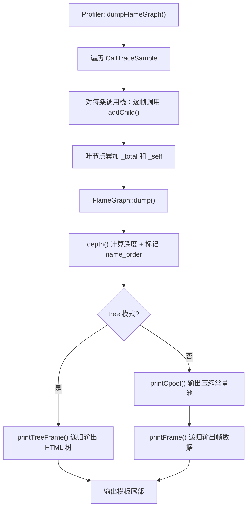
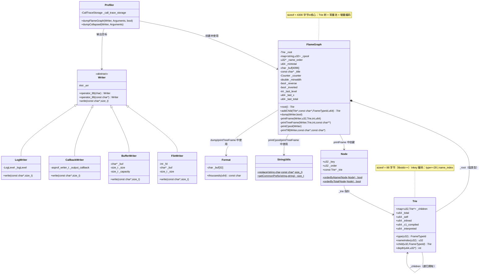

# 第十三章：FlameGraph 输出格式深度解析

> 基于 async-profiler 2.10 源码分析
> 源码路径：`/data/workspace/async-profiler/src/flameGraph.cpp/h`
> 遵循：problem-driven-design + source-code-depth + Doc-DataStructure-First + JVM-Mechanism-Deep-Dive

---

## 第 0 部分：核心原理 ⭐

### 0.1 本质是什么？

FlameGraph 模块将采样数据（调用栈 + 计数）转换为一棵 Trie 树，再通过常量池压缩和增量编码输出为可交互的 HTML 文件。

### 0.2 为什么需要？

async-profiler 采集到的是上千万个 `CallTraceSample`（调用栈 + 采样计数），但这些原始数据不能直接用于性能分析——相同前缀的调用栈大量重复，文件体积大，无法可视化。

核心矛盾：**原始采样数据量大、重复率高、缺乏层级关系**，需要一种高效的压缩 + 可视化方案。

### 0.3 怎么解决？

核心思路：**Trie 树 + 常量池 + 增量编码 + HTML 模板嵌入**。

1. **Trie 树**：将调用栈插入 Trie，自动合并相同前缀，O(N) 时间完成聚合
2. **常量池 + 前缀压缩**：方法名去重存储，输出时用前缀压缩进一步减小体积
3. **增量编码**：`f()`/`u()`/`n()` 三种输出格式，利用帧之间的空间局部性减少参数数量
4. **INCBIN 嵌入**：HTML 模板在编译时通过 GAS `.incbin` 指令嵌入 .so，运行时无需外部文件

### 0.4 为什么这样设计？

**为什么用 Trie 而不是 HashMap？** HashMap 需要将整个调用栈拼成 key 做精确匹配，无法自动合并前缀。Trie 天然按层级匹配，共享前缀节点，内存和查询都更高效。

**为什么 INLINED/C1/INTERPRETED 合并到 JIT_COMPILED 节点？** 同一方法在不同采样时可能是不同编译状态（先解释执行，后 JIT 编译）。如果按类型分成不同节点，火焰图中同一方法会被拆成多块，无法直观看到方法总耗时。合并后用 `_inlined`/`_c1_compiled`/`_interpreted` 计数器记录比例，渲染时动态决定颜色。

**为什么用前缀压缩而不是 gzip？** 常量池输出直接嵌入 HTML JavaScript，gzip 需要解压才能用。前缀压缩在 JavaScript 端用 3 行 `unpack()` 函数即可还原，零依赖。

**为什么用 INCBIN 而不是字符串常量？** HTML 模板含大量引号、换行、特殊字符，用 C++ 字符串常量需要大量转义。`.incbin` 直接将文件原样嵌入 .rodata 段，编译器不解析内容，维护简单。

---

## 第 1 部分：数据结构全景

> 遵循 problem-driven-design：先问题推导，再引出结构

### 1.1 数据结构清单

| 结构名 | 源码位置 | 核心作用 |
|--------|----------|----------|
| Trie | flameGraph.h:17-68 | Trie 树节点：子节点映射 + 采样计数 + 帧类型计数 |
| FlameGraph | flameGraph.h:71-116 | 控制器：Trie 根节点 + 常量池 + 输出状态 |
| Node | flameGraph.cpp:68-84 | 排序辅助：按名称或采样数排序子节点 |
| FrameTypeId | vmEntry.h:13-28 | 帧类型枚举：7 种帧类型（0-6） |
| StringUtils | flameGraph.cpp:21-38 | 字符串工具：前缀计算 + HTML 转义 |
| Format | flameGraph.cpp:41-65 | 数字格式化：千分位输出 |
| Writer | writer.h:13-32 | 抽象输出：统一文件/缓冲区/回调写入接口 |
| FileWriter | writer.h:34-54 | 文件输出：8KB 缓冲区 + fd 写入 |
| BufferWriter | writer.h:66-85 | 内存输出：动态扩容缓冲区 |
| CallbackWriter | writer.h:87-96 | 回调输出：函数指针写入 |
| LogWriter | writer.h:56-64 | 日志输出：写入 Log 系统 |
| INCBIN 宏 | incbin.h:17-28 | 编译时文件嵌入：GAS .incbin 指令 |
| Counter | arguments.h:43-46 | 计数器类型枚举：COUNTER_SAMPLES / COUNTER_TOTAL |

---

### 1.2 Trie — Trie 树节点 ⭐

#### 问题推导

**问题**：上千万条调用栈（`main→run→foo` 等），如何高效聚合相同前缀？

**需要什么信息？**
- 每个帧（方法名）是一个节点，需要存储子帧列表
- 不同调用栈的相同前缀共享同一路径，所以需要"按名字查找子节点"
- 每个节点需要记录"经过这个帧的总采样数"和"在这个帧终止的采样数"
- 同一方法可能被 JIT 编译、解释执行、内联，需要分别记录计数

**推导出的结构**：每个节点 = 子节点映射（u32 → Trie*）+ 总计数 + 自身计数 + 帧类型计数

#### 真实数据结构

```cpp
// flameGraph.h:17-68
class Trie {
  public:
    std::map<u32, Trie*> _children;  // ★ 子节点映射（key = name_index | type << 28）
    u64 _total;                       // ★ 该帧及所有子帧的总采样数
    u64 _self;                        // ★ 在该帧终止的采样数（叶节点计数）
    u64 _inlined;                     // 内联执行计数
    u64 _c1_compiled;                 // C1 编译计数
    u64 _interpreted;                 // 解释执行计数

    // 构造函数：所有计数器初始化为 0
    Trie() : _children(), _total(0), _self(0), _inlined(0), _c1_compiled(0), _interpreted(0) {}

    // 析构函数：递归删除所有子节点
    ~Trie() {
        for (const auto& entry : _children) {
            delete entry.second;
        }
    }
    // ... type(), nameIndex(), child(), depth() 方法
};
```

**推导 vs 实际**：基本吻合。额外发现 `_inlined`/`_c1_compiled`/`_interpreted` 三个计数器——用于动态判定帧类型（type() 方法），而不是硬编码。

#### sizeof 分析

```
Trie 内存布局（64 位系统，libstdc++ 实现）
┌───────────────────────────────────────┐ 偏移 0
│ _children : std::map<u32, Trie*>      │ 48 字节（红黑树：节点头 + 大小 + 比较器）
├───────────────────────────────────────┤ 偏移 48
│ _total    : u64                       │ 8 字节
├───────────────────────────────────────┤ 偏移 56
│ _self     : u64                       │ 8 字节
├───────────────────────────────────────┤ 偏移 64
│ _inlined  : u64                       │ 8 字节
├───────────────────────────────────────┤ 偏移 72
│ _c1_compiled : u64                    │ 8 字节
├───────────────────────────────────────┤ 偏移 80
│ _interpreted : u64                    │ 8 字节
└───────────────────────────────────────┘ 偏移 88
sizeof(Trie) = 88 字节（注意：std::map 的 sizeof 因实现而异，libstdc++ 为 48）
```

**注意**：每个 `_children` 中的红黑树节点额外分配在堆上，每个节点约 32+4+8=44 字节。所以实际内存占用 ≈ 88 + 44 × children_count。

#### 创建位置

- **根节点**：`FlameGraph._root`，在 FlameGraph 构造函数中作为成员变量初始化（flameGraph.h:73,96）
- **子节点**：`Trie::child()` 方法中 `new Trie()` 动态分配（flameGraph.h:50-54）
- **创建时机**：addChild() 调用 child() 时，如果子节点不存在则创建

#### 关键字段生命周期

**_children**：
```
创建：Trie 构造时（空 map）
插入：child() 方法中 _children[name_index | type << 28] = new Trie()
读取：depth() 递归遍历、printFrame() 渲染、析构函数递归删除
销毁：~Trie() 递归 delete 所有子节点
```

**_total**：
```
初始值：0
累加位置 1：addChild() 中 f->_total += value（flameGraph.cpp:97）—— 每经过该节点就累加
累加位置 2：dumpFlameGraph() 中叶节点 f->_total += counter（profiler.cpp:1570）—— 叶节点额外累加
读取：depth() 判断 cutoff、printFrame() 计算宽度和输出
```

**_self**：
```
初始值：0
设置位置：profiler.cpp:1571 —— f->_self += counter —— 只有叶节点才设置
读取：printFrame() 中 x += f._self（flameGraph.cpp:211）—— 计算子节点起始 x 坐标
     printTreeFrame() 中输出自身采样比例（flameGraph.cpp:252）
```

**_inlined / _c1_compiled / _interpreted**：
```
初始值：0
设置位置：addChild() 的 switch 中（flameGraph.cpp:100-108）
  ★ 注意：是设置在 JIT_COMPILED 类型的子节点上，不是父节点
读取：type() 方法中动态判定帧类型
     printFrame() 中判断是否有额外类型信息
```

#### key 编码方案（32 位 key）

```
┌───────────────────────────────────────────────────────────┐
│    高 4 位: FrameTypeId     │    低 28 位: name_index      │
│    (帧类型，0-6)             │    (方法名在 cpool 中的索引)  │
└───────────────────────────────────────────────────────────┘
    bit 31..28                     bit 27..0
```

**编码**：`name_index | type << 28`（Trie::child()，flameGraph.h:50）
**解码**：
- `nameIndex(key)` = `key & ((1 << 28) - 1)` = 低 28 位
- `type(key)` = 动态判定（不是简单的 `key >> 28`，见 type() 方法分析）

#### type() 方法——动态帧类型判定

```cpp
// flameGraph.h:33-43
FrameTypeId type(u32 key) const {
    if (_inlined * 3 >= _total) {          // ★ 内联占比 ≥ 33%：标记为 INLINED
        return FRAME_INLINED;
    } else if (_c1_compiled * 2 >= _total) { // ★ C1 占比 ≥ 50%：标记为 C1
        return FRAME_C1_COMPILED;
    } else if (_interpreted * 2 >= _total) { // ★ 解释占比 ≥ 50%：标记为 INTERPRETED
        return FRAME_INTERPRETED;
    } else {
        return (FrameTypeId)(key >> 28);   // ★ 否则用 key 中编码的原始类型
    }
}
```

**设计决策**：
- 内联阈值 1/3（33%），C1 和解释阈值 1/2（50%），说明内联被认为更值得标注
- 优先级：INLINED > C1 > INTERPRETED > key 中的原始类型
- 这些计数器由 addChild() 在类型合并时累加

#### depth() 方法——递归计算深度 + 填充 name_order

```cpp
// flameGraph.h:57-67
int depth(u64 cutoff, u32* name_order) const {
    int max_depth = 0;
    for (auto it = _children.begin(); it != _children.end(); ++it) {
        if (it->second->_total >= cutoff) {       // ★ 只遍历超过阈值的节点
            name_order[nameIndex(it->first)] = 1;  // ★ 副作用：标记该方法名被使用
            int d = it->second->depth(cutoff, name_order);
            if (d > max_depth) max_depth = d;
        }
    }
    return max_depth + 1;
}
```

**双重作用**：
1. 计算 Trie 树最大深度（用于决定 canvas 高度）
2. 标记哪些方法名实际被使用（`name_order[idx] = 1`），未被使用的方法名不输出到常量池

---

### 1.3 FlameGraph — 控制器

#### 问题推导

**问题**：有了 Trie 树结构，还需要什么来完成完整的 HTML 输出？

**需要什么信息？**
- Trie 树根节点（存储整棵树）
- 方法名去重存储（常量池：string → index）
- 输出时的参数：标题、计数器类型、最小宽度、是否反转等
- 渲染状态：上一帧的位置（用于增量编码）

**推导出的结构**：根节点 + 常量池 + 配置参数 + 渲染状态

#### 真实数据结构

```cpp
// flameGraph.h:71-116
class FlameGraph {
  private:
    Trie _root;                              // ★ Trie 树根节点（值类型，非指针）
    std::map<std::string, u32> _cpool;       // ★ 常量池（方法名 → 索引）
    u32* _name_order;                        // ★ 方法名排序映射（dump 时分配）
    u64 _mintotal;                           // ★ 最小采样数阈值（低于此值的帧不输出）
    char _buf[4096];                         //   格式化缓冲区

    const char* _title;                      //   火焰图标题
    Counter _counter;                        //   计数器类型（SAMPLES 或 TOTAL）
    double _minwidth;                        //   最小宽度百分比
    bool _reverse;                           //   是否反转（icicle 模式）
    bool _inverted;                          //   是否倒置显示

    int _last_level;                         // ★ 增量编码：上一帧层级
    u64 _last_x;                             // ★ 增量编码：上一帧 x 坐标
    u64 _last_total;                         // ★ 增量编码：上一帧总计数
};
```

**推导 vs 实际**：吻合。`_last_level`/`_last_x`/`_last_total` 三个字段是增量编码的关键——printFrame() 利用前一帧的位置信息选择最紧凑的输出格式。

#### sizeof 分析

```
FlameGraph 内存布局（64 位，libstdc++）
偏移     字段                    大小
─────────────────────────────────────
0       _root (Trie)            88 字节
88      _cpool (std::map)       48 字节
136     _name_order (u32*)      8 字节
144     _mintotal (u64)         8 字节
152     _buf (char[4096])       4096 字节
4248    _title (const char*)    8 字节
4256    _counter (Counter)      4 字节（SHORT_ENUM）
4260    [padding]               4 字节（double 需 8 字节对齐）
4264    _minwidth (double)      8 字节
4272    _reverse (bool)         1 字节
4273    _inverted (bool)        1 字节
4274    [padding]               2 字节（int 需 4 字节对齐）
4276    _last_level (int)       4 字节
4280    [padding]               4 字节（u64 需 8 字节对齐）
4284    _last_x (u64)           8 字节
4292    _last_total (u64)       8 字节
─────────────────────────────────────
sizeof(FlameGraph) ≈ 4300 字节
```

**注意**：padding 计算取决于编译器和 ABI，上述为 x86-64 Linux GCC 典型布局。核心开销在 `_buf[4096]`——一个 4KB 的格式化缓冲区。

#### 创建位置

```
创建：profiler.cpp:1524
  FlameGraph flamegraph(args._title == NULL ? title : args._title,
                        args._counter, args._minwidth, args._reverse, args._inverted);
时机：Profiler::dumpFlameGraph() 函数开始时
生命周期：栈分配，dumpFlameGraph() 返回时自动析构
```

---

### 1.4 FrameTypeId — 帧类型枚举

**为什么存在**：区分不同执行环境的帧，渲染时用不同颜色标识。

```cpp
// vmEntry.h:13-28
enum FrameTypeId {
    FRAME_INTERPRETED  = 0,   // 解释执行（绿色 #3A6F38）
    FRAME_JIT_COMPILED = 1,   // JIT 编译（亮绿 #05B505）
    FRAME_INLINED      = 2,   // 内联（青色 #006A7C）
    FRAME_NATIVE       = 3,   // 原生 C/汇编代码（红色 #9B0000）
    FRAME_CPP          = 4,   // C++/Rust/ObjC 代码（黄色 #A7A718）
    FRAME_KERNEL       = 5,   // 内核帧（橙色 #CC5200）
    FRAME_C1_COMPILED  = 6,   // C1 编译（浅绿 #7C8F45）
};
```

**NATIVE vs CPP 的区别**：仅用于视觉区分，NATIVE 是 C/汇编（如 libc），CPP 是 C++/Rust/ObjC（如应用代码）。源码注释说"there probably should be a better way"。

**颜色映射**：flame.html 中 `palette` 数组（行 99-107）用 FrameTypeId 的低 3 位（`key & 7`）索引颜色。

---

### 1.5 Node — 排序辅助类

**为什么存在**：printFrame() 需要按方法名字典序排列子节点（保证同名方法在火焰图中相邻），printTreeFrame() 需要按采样数降序排列。

```cpp
// flameGraph.cpp:68-84
class Node {
  public:
    u32 _key;              // Trie key（name_index | type << 28）
    u32 _order;            // 排序序号（_name_order[nameIndex]）
    const Trie* _trie;     // 指向 Trie 子节点

    Node(u32 key, u32 order, const Trie* trie) : _key(key), _order(order), _trie(trie) {}

    static bool orderByName(const Node& a, const Node& b) {
        return a._order < b._order;   // ★ 按 name_order 排序（字典序）
    }
    static bool orderByTotal(const Node& a, const Node& b) {
        return a._trie->_total > b._trie->_total;  // ★ 按采样数降序
    }
};
```

**sizeof**：`_key`(4) + `_order`(4) + `_trie*`(8) = **16 字节**。

---

### 1.6 StringUtils — 字符串工具类

**为什么存在**：HTML 输出需要转义特殊字符（`&` `<` `>` `\` `'`），常量池前缀压缩需要计算公共前缀。

```cpp
// flameGraph.cpp:21-38
class StringUtils {
  public:
    // 替换字符串中的单个字符为字符串（如 '&' → "&amp;"）
    static void replace(std::string& s, char c, const char* replacement, size_t rlen);

    // 计算两个字符串的公共前缀长度
    // ★ 遇到非 ASCII 字符（a[i] > 127）时停止——避免截断多字节 UTF-8 字符
    static size_t getCommonPrefix(const std::string& a, const std::string& b) {
        size_t length = a.size() < b.size() ? a.size() : b.size();
        for (size_t i = 0; i < length; i++) {
            if (a[i] != b[i] || a[i] > 127) {  // ★ >127 = 多字节 UTF-8 字符
                return i;
            }
        }
        return length;
    }
};
```

**设计决策**：`a[i] > 127` 检查——如果公共前缀在多字节 UTF-8 字符中间截断，JavaScript 解码时会产生乱码。保守策略：遇到非 ASCII 就停止匹配。

---

### 1.7 Format — 数字格式化类

**为什么存在**：tree 模式输出中需要显示千分位格式的数字（如 `1,234,567`）。

```cpp
// flameGraph.cpp:41-65
class Format {
  private:
    char _buf[32];  // 格式化缓冲区

  public:
    // 将整数转换为千分位格式字符串（从右向左填充）
    const char* thousands(u64 value);
};
```

**sizeof**：32 字节。临时对象，在 `Format().thousands(...)` 中创建和使用。

---

### 1.8 Writer 类体系 — 抽象输出接口

#### 问题推导

**问题**：FlameGraph 的输出目标可能是文件、内存缓冲区、回调函数或日志系统，怎么统一接口？

**推导出的结构**：抽象基类 Writer + 4 个具体实现。

#### Writer 基类

```cpp
// writer.h:13-32
class Writer {
  protected:
    int _err;       // 错误码（0 = 正常）
    Writer() : _err(0) {}

  public:
    Writer& operator<<(char c);       // 输出单字符
    Writer& operator<<(const char* s); // 输出字符串
    Writer& operator<<(int n);        // 输出整数
    Writer& operator<<(long n);       // 输出 long
    Writer& operator<<(u64 n);        // 输出 u64

    bool good() const { return _err == 0; }
    virtual void write(const char* data, size_t len) = 0;  // ★ 纯虚函数
};
```

#### FileWriter

```cpp
// writer.h:34-54, writer.cpp:43-83
class FileWriter : public Writer {
    int _fd;        // 文件描述符
    char* _buf;     // 8KB 缓冲区（malloc 分配）
    size_t _size;   // 当前缓冲区使用量
    enum { BUF_SIZE = 8192 };

    void flush(const char* data, size_t len);  // 循环 write() 直到写完
    // write()：数据先写入缓冲区，满了再 flush
    // 如果单次数据 > 8KB，直接 flush 不经过缓冲区
    // 析构时：flush 剩余数据，close fd（仅 fd > STDERR_FILENO）
};
```

#### BufferWriter

```cpp
// writer.h:66-85, writer.cpp:85-101
class BufferWriter : public Writer {
    char* _buf;       // 动态缓冲区（malloc/realloc）
    size_t _size;     // 当前使用量
    size_t _capacity; // 当前容量

    // write()：容量不足时 2x 扩容（或扩到刚好够），然后 memcpy
};
```

#### CallbackWriter

```cpp
// writer.h:87-96, writer.cpp:103-107
class CallbackWriter : public Writer {
    asprof_writer_t _output_callback;  // 用户提供的回调函数指针
    // write()：直接调用 _output_callback(data, len)
};
```

#### LogWriter

```cpp
// writer.h:56-64, writer.cpp:109-111
class LogWriter : public Writer {
    LogLevel _logLevel;
    // write()：调用 Log::writeRaw(_logLevel, data, len)
};
```

---

### 1.9 INCBIN 宏 — 编译时文件嵌入

#### 问题推导

**问题**：HTML 模板（flame.html 357 行、tree.html 327 行）需要嵌入到 .so 中，怎么做？

**推导**：C++ 没有原生的"嵌入文件"语法。可以用字符串常量（需要转义所有特殊字符，维护噩梦）。更好的方案是用汇编器的 `.incbin` 指令直接将文件原样嵌入。

#### 真实实现

```cpp
// incbin.h:17-28
#define INCBIN(NAME, FILE) \
    extern "C" const char NAME[];         \  // ★ 声明起始符号
    extern "C" const char NAME##_END[];   \  // ★ 声明结束符号
    asm(INCBIN_SECTION "\n"               \  // ★ 切换到 .rodata 段（只读数据）
        ".globl " INCBIN_SYMBOL #NAME "\n"\
        INCBIN_SYMBOL #NAME ":\n"         \
        ".incbin \"" FILE "\"\n"          \  // ★ GAS 指令：将文件原样嵌入
        ".globl " INCBIN_SYMBOL #NAME "_END\n"\
        INCBIN_SYMBOL #NAME "_END:\n"     \
        ".byte 0x00\n"                    \  // ★ 添加 null 终止符
        ".previous\n"                     \  // ★ 恢复到之前的段
    );
```

**使用方式**（flameGraph.cpp:17-18）：
```cpp
INCBIN(FLAMEGRAPH_TEMPLATE, "src/res/flame.html")
INCBIN(TREE_TEMPLATE, "src/res/tree.html")
```

**效果**：编译后 `FLAMEGRAPH_TEMPLATE` 和 `TREE_TEMPLATE` 是指向 .rodata 段中 HTML 内容的 `const char*`。`FLAMEGRAPH_TEMPLATE_END` 指向内容末尾。

**平台差异**：
- Linux：`.section ".rodata", "a"`，符号无前缀
- macOS：`.const_data`，符号加 `_` 前缀

---

### 1.10 Counter 枚举

```cpp
// arguments.h:43-46
enum SHORT_ENUM Counter {
    COUNTER_SAMPLES,  // 采样次数（默认）
    COUNTER_TOTAL     // 累计值（如分配字节数）
};
```

**用途**：dump() 中决定用 `(*it)->samples` 还是 `(*it)->counter` 作为帧的 value。tree 模式中根据 Counter 类型显示 "samples" 或 "counter"。

---

### 1.11 MAX_CANVAS_HEIGHT 常量

```cpp
// flameGraph.cpp:15
const int MAX_CANVAS_HEIGHT = 32767;
```

**为什么存在**：浏览器拒绝绘制超过 32767 像素的 canvas。dump() 中 `std::min(depth * 16, MAX_CANVAS_HEIGHT)` 限制画布高度。

---

## 第 2 部分：算法/流程分析

> 遵循 source-code-depth：真实源码 + 逐行注释 + 设计决策

### 2.1 核心流程概览



---

### 2.2 Profiler::dumpFlameGraph() — 入口：构建 Trie 树 ⭐

#### 解决什么问题？

将 `_call_trace_storage` 中的所有 `CallTraceSample` 转换为 Trie 树，然后输出 HTML。

#### 源码位置

profiler.cpp:1513-1578

#### 真实源码 + 逐行注释

```cpp
// profiler.cpp:1513-1578
void Profiler::dumpFlameGraph(Writer& out, Arguments& args, bool tree) {
    // Phase 1：准备标题
    char title[64];
    if (args._title == NULL) {
        Engine* active_engine = activeEngine();
        if (args._counter == COUNTER_SAMPLES) {
            strcpy(title, active_engine->title());        // ★ 如 "CPU profile"
        } else {
            snprintf(title, sizeof(title), "%s (%s)",
                     active_engine->title(), active_engine->units()); // ★ 如 "Allocation profile (bytes)"
        }
    }

    // Phase 2：创建 FlameGraph 对象（栈上分配，约 4300 字节）
    FlameGraph flamegraph(args._title == NULL ? title : args._title,
                          args._counter, args._minwidth, args._reverse, args._inverted);
    u64 printed_sample_count = 0;

    {
        // Phase 3：遍历所有 CallTraceSample，构建 Trie 树
        FrameName fn(args, args._style & ~STYLE_ANNOTATE, _epoch, _thread_names_lock, _thread_names);
        //                                ★ 去掉 ANNOTATE 风格（火焰图不需要 _[j] 后缀）

        std::vector<CallTraceSample*> samples;
        _call_trace_storage.collectSamples(samples);

        for (std::vector<CallTraceSample*>::const_iterator it = samples.begin(); it != samples.end(); ++it) {
            CallTrace* trace = (*it)->acquireTrace();
            if (trace == NULL || fn.excludeTrace(trace)) continue;

            u64 counter = args._counter == COUNTER_SAMPLES ? (*it)->samples : (*it)->counter;
            if (counter == 0) continue;

            int num_frames = trace->num_frames;
            Trie* f = flamegraph.root();  // ★ 从根节点开始

            if (args._reverse) {
                // ★ 反转模式：线程帧始终在最前面
                if (_add_sched_frame) {
                    f = flamegraph.addChild(f, fn.name(trace->frames[--num_frames]), FRAME_NATIVE, counter);
                }
                if (_add_thread_frame) {
                    f = flamegraph.addChild(f, fn.name(trace->frames[--num_frames]), FRAME_NATIVE, counter);
                }
                if (_add_cpu_frame) {
                    f = flamegraph.addChild(f, fn.name(trace->frames[--num_frames]), FRAME_NATIVE, counter);
                }
                // ★ 反转：从底部(0)向上遍历
                for (int j = 0; j < num_frames; j++) {
                    f = flamegraph.addChild(f, fn.name(trace->frames[j]), fn.type(trace->frames[j]), counter);
                }
            } else {
                // ★ 正常模式：从顶部(num_frames-1)向下遍历
                for (int j = num_frames - 1; j >= 0; j--) {
                    f = flamegraph.addChild(f, fn.name(trace->frames[j]), fn.type(trace->frames[j]), counter);
                }
            }
            // ★★★ 关键：叶节点（调用栈顶部帧）同时累加 _total 和 _self
            f->_total += counter;   // 叶节点的 _total（addChild 已累加中间节点的 _total）
            f->_self += counter;    // 叶节点的 _self（只有叶节点才有 _self）
            printed_sample_count++;
        }
    }
    // ★ FrameName fn 析构，释放 locale 等资源

    // Phase 4：输出 HTML
    flamegraph.dump(out, tree);
    logEmptyOutput(args, printed_sample_count, out);
}
```

#### 设计决策

**为什么叶节点同时累加 _total 和 _self？** addChild() 只在经过节点时累加 `_total`，但叶节点的 `_total` 没有被 addChild() 累加（因为 addChild 返回的是叶节点，循环已结束）。所以需要额外 `f->_total += counter`。`_self` 只在叶节点设置——中间节点的 `_self` 始终为 0。

**为什么 reverse 模式要先处理线程帧？** 反转模式下调用栈从底到顶显示，但 thread/sched/cpu 帧始终作为根的直接子节点，保证按线程分组。

---

### 2.3 addChild() — 添加帧到 Trie 树 ⭐⭐

#### 解决什么问题？

将一个帧（方法名 + 类型 + 计数）插入到 Trie 树的指定父节点下，自动合并相同前缀，同时完成常量池管理和帧类型合并。

#### 源码位置

flameGraph.cpp:87-112

#### 真实源码 + 逐行注释

```cpp
// flameGraph.cpp:87-112
Trie* FlameGraph::addChild(Trie* f, const char* name, FrameTypeId type, u64 value) {
    // ★ Phase 1：后缀剥离
    // 帧名可能有类型后缀 "_[X]"（如 "read_[k]" = 内核帧）
    // 但火焰图中用 FrameTypeId 区分类型，后缀需要剥掉以合并同名方法
    size_t len = strlen(name);
    bool has_suffix = len > 4 && name[len - 4] == '_' && name[len - 3] == '[' && name[len - 1] == ']';
    std::string s(name, has_suffix ? len - 4 : len);  // ★ 去掉后缀

    // ★ Phase 2：常量池查找/插入
    // std::map::operator[] 对不存在的 key 自动插入默认值 0
    u32 name_index = _cpool[s];   // ★ 如果 s 不在 cpool 中，自动插入 {s, 0} 并返回 0
    if (name_index == 0) {
        // 新方法名：分配索引 = 当前 cpool 大小（包含刚插入的 {s, 0}）
        // ★ 所以第一个有效索引是 1，0 保留为"不存在"标记
        name_index = _cpool[s] = _cpool.size();
    }

    // ★ Phase 3：累加父节点 _total
    f->_total += value;

    // ★★★ Phase 4：帧类型合并——核心设计 ★★★
    // INLINED/C1_COMPILED/INTERPRETED 统一合并到 JIT_COMPILED 子节点
    // 同时在子节点上记录对应类型的计数
    switch (type) {
        case FRAME_INLINED:
            // ★ 关键：先获取 JIT_COMPILED 类型的子节点，再在子节点上累加 _inlined
            (f = f->child(name_index, FRAME_JIT_COMPILED))->_inlined += value;
            return f;   // ★ 提前返回
        case FRAME_C1_COMPILED:
            (f = f->child(name_index, FRAME_JIT_COMPILED))->_c1_compiled += value;
            return f;   // ★ 提前返回
        case FRAME_INTERPRETED:
            (f = f->child(name_index, FRAME_JIT_COMPILED))->_interpreted += value;
            return f;   // ★ 提前返回
        default:
            // ★ 其他类型（NATIVE/CPP/KERNEL/JIT_COMPILED）：直接用原始类型创建子节点
            return f->child(name_index, type);
    }
}
```

#### 设计决策

**为什么 INLINED/C1/INTERPRETED 合并到 FRAME_JIT_COMPILED？**

同一 Java 方法在不同采样时可能处于不同编译阶段：

| 采样时间 | 方法 A 的状态 | type 参数 |
|---------|-------------|-----------|
| T1 | 解释执行 | FRAME_INTERPRETED |
| T2 | C1 编译后 | FRAME_C1_COMPILED |
| T3 | C2 编译后并内联 | FRAME_INLINED |

如果不合并，方法 A 会在 Trie 中产生 3 个不同的子节点，火焰图中会被拆成 3 块。合并后只有一个 JIT_COMPILED 子节点，`_inlined`/`_c1_compiled`/`_interpreted` 记录各状态的比例，渲染时 type() 方法根据比例动态决定颜色。

**为什么常量池用 operator[] 的默认值 0 判断？** 避免两次查找（find + insert）。利用 std::map 对 value_type 默认构造为 0 的特性，一次 `_cpool[s]` 完成查找或插入，再通过返回值判断是否为新键。

---

### 2.4 dump() — 输出 HTML ⭐

#### 解决什么问题？

将 Trie 树序列化为 HTML 文件。分两种模式：火焰图模式（flame.html）和树视图模式（tree.html）。

#### 源码位置

flameGraph.cpp:114-170

#### 真实源码 + 逐行注释

```cpp
// flameGraph.cpp:114-170
void FlameGraph::dump(Writer& out, bool tree) {
    // ★ Phase 1：分配 name_order 数组（索引 0..cpool.size()），全部初始化为 0
    _name_order = new u32[_cpool.size() + 1]();

    // ★ Phase 2：计算 _mintotal（低于此值的帧不输出）
    // tree 模式且 minwidth == 0：取 _root._total / 1000（0.1% 阈值）
    // 否则：按 minwidth 百分比计算
    _mintotal = _minwidth == 0 && tree ? _root._total / 1000 : (u64)(_root._total * _minwidth / 100);

    // ★ Phase 3：递归计算深度，同时标记哪些方法名被使用
    int depth = _root.depth(_mintotal, _name_order);

    if (tree) {
        // ★★★ tree 模式：使用 tree.html 模板 ★★★
        const char* tail = TREE_TEMPLATE;

        tail = printTill(out, tail, "/*title:*/");         // ★ 输出模板直到 /*title:*/
        out << (_reverse ? "Backtrace" : "Call tree");     // ★ 填充标题

        tail = printTill(out, tail, "/*type:*/");
        out << (_counter == COUNTER_SAMPLES ? "samples" : "counter");

        tail = printTill(out, tail, "/*count:*/");
        out << Format().thousands(_root._total);           // ★ 千分位格式的总计数

        tail = printTill(out, tail, "/*tree:*/");

        // ★ 构建 names 数组：索引 → 方法名字符串
        const char** names = new const char*[_cpool.size() + 1];
        for (auto it = _cpool.begin(); it != _cpool.end(); ++it) {
            names[it->second] = it->first.c_str();
        }
        printTreeFrame(out, _root, 0, names);              // ★ 递归输出树
        delete[] names;

        out << tail;  // ★ 输出模板剩余部分
    } else {
        // ★★★ 火焰图模式：使用 flame.html 模板 ★★★
        const char* tail = FLAMEGRAPH_TEMPLATE;

        tail = printTill(out, tail, "/*height:*/300");
        out << std::min(depth * 16, MAX_CANVAS_HEIGHT);    // ★ canvas 高度 = depth × 16px

        tail = printTill(out, tail, "/*title:*/");
        out << _title;

        tail = printTill(out, tail, "/*inverted:*/false");
        // ★ _reverse XOR _inverted：反转的反转 = 正常
        out << (_reverse ^ _inverted ? "true" : "false");

        tail = printTill(out, tail, "/*depth:*/0");
        out << depth;

        tail = printTill(out, tail, "/*cpool:*/");
        printCpool(out);                                   // ★ 输出压缩常量池

        tail = printTill(out, tail, "/*frames:*/");
        printFrame(out, FRAME_NATIVE << 28, _root, 0, 0); // ★ 递归输出帧数据
        //              ★ 根节点 key = FRAME_NATIVE << 28 = 0x30000000

        tail = printTill(out, tail, "/*highlight:*/");
        // ★ 留空（用户可通过 --highlight 参数指定正则）

        out << tail;  // ★ 输出模板剩余部分
    }

    delete[] _name_order;
}
```

#### 设计决策

**为什么用 printTill() 模式？** HTML 模板中用 `/*placeholder:*/` 作为占位符。`printTill()` 输出模板内容直到占位符位置，然后由调用者输出实际数据，最后继续输出模板剩余内容。这种模式避免了字符串拼接，直接流式写入。

**为什么根节点 key 是 `FRAME_NATIVE << 28`？** 根节点代表 "all"（全部采样），在火焰图中显示为底部的全宽条。用 NATIVE 类型着色（红色），name_order 索引为 0（对应 cpool[0] = 'all'）。

---

### 2.5 printTill() — 模板分段输出

#### 源码位置

flameGraph.cpp:297-301

```cpp
// flameGraph.cpp:297-301
const char* FlameGraph::printTill(Writer& out, const char* data, const char* till) {
    const char* pos = strstr(data, till);     // ★ 在模板中查找占位符位置
    out.write(data, pos - data);              // ★ 输出占位符之前的内容
    return pos + strlen(till);                // ★ 返回占位符之后的位置（下次从这里继续）
}
```

---

### 2.6 printCpool() — 前缀压缩常量池输出 ⭐

#### 解决什么问题？

方法名大量共享前缀（如 `java/lang/Object.hashCode` 和 `java/lang/Object.toString`），如何压缩输出？

#### 核心思路

std::map 的迭代顺序是字典序，相邻的方法名大概率有共同前缀。对每个方法名，只输出"与前一个方法名的公共前缀长度"+ "不同的后缀部分"。

#### 源码位置

flameGraph.cpp:269-295

#### 真实源码 + 逐行注释

```cpp
// flameGraph.cpp:269-295
void FlameGraph::printCpool(Writer& out) {
    out << "'all'";  // ★ cpool[0] = 'all'（根节点的名称）

    std::string prev;  // ★ 前一个方法名（用于计算公共前缀）
    u32 index = 0;     // ★ 当前排序序号

    for (auto it = _cpool.begin(); it != _cpool.end(); ++it) {
        if (_name_order[it->second]) {
            // ★ 只输出被 depth() 标记为"使用中"的方法名
            _name_order[it->second] = ++index;  // ★ 将 1 替换为实际排序序号

            // ★ 计算与前一个方法名的公共前缀长度
            size_t prefix_len = StringUtils::getCommonPrefix(prev, it->first);
            prev = it->first;

            // ★ 前缀长度上限 95（因为编码字符 = prefix_len + ' '(32)，最大 127 = ASCII 范围）
            if (prefix_len > 95) prefix_len = 95;

            // ★ 编码：第一个字符 = (char)(prefix_len + ' ')，后面是去掉公共前缀的后缀
            std::string s(1, (char)(prefix_len + ' '));
            s.append(it->first, prefix_len, std::string::npos);

            // ★ 转义反斜杠和单引号（JavaScript 字符串安全）
            StringUtils::replace(s, '\\', "\\\\", 2);
            StringUtils::replace(s, '\'', "\\'", 2);

            out << ",\n'";
            out.write(s.data(), s.size());
            out << "'";
        }
    }

    // ★ 释放 cpool 内存（后续不再需要方法名）
    _cpool = std::map<std::string, u32>();
}
```

#### 前缀压缩示例

假设相邻三个方法名：
```
java/lang/Object.hashCode
java/lang/Object.toString
java/lang/String.length
```

输出：
```
'5java/lang/Object.hashCode'   # prefix_len=0（第一个无前缀），' '+0 = ' '(32)... 等等
                                # 实际第一个 prev="", prefix=0, char(0+32)=' '
',\n' + ' java/lang/Object.hashCode'    # 第一个：空格(0) + 完整名称
',\n' + '9toString'                      # 第二个：chr(25+32)='9' + "toString"
                                         # 公共前缀 "java/lang/Object." 长度=17... 
                                         # 实际 chr(17+32)='1' + "Object.toString"
```

实际上，编码是：`(char)(prefix_len + 32)` 后跟 `it->first[prefix_len..]`。

**JavaScript 端解码**（flame.html:249-253）：
```javascript
function unpack(cpool) {
    for (let i = 1; i < cpool.length; i++) {
        // charCodeAt(0) - 32 = 前缀长度
        // substring(0, prefix_len) = 取前一个方法名的前 prefix_len 个字符
        // substring(1) = 当前编码字符串去掉第一个字符（前缀长度编码）
        cpool[i] = cpool[i - 1].substring(0, cpool[i].charCodeAt(0) - 32) + cpool[i].substring(1);
    }
}
```

#### 设计决策

**为什么前缀长度上限 95？** `prefix_len + ' '(32)` 必须 ≤ 127（ASCII 可打印范围）。95 + 32 = 127。超过 127 的字符在 JavaScript 的 charCodeAt() 可能产生非预期行为。

**为什么遍历后释放 _cpool？** 常量池数据已经输出到 HTML 中，后续 printFrame() 不再需要方法名，提前释放减少内存占用。

**为什么 _name_order 在 printCpool 中被重新赋值？** depth() 只是标记 `_name_order[idx] = 1`。printCpool() 将这些 1 替换为实际的排序序号（1, 2, 3...），这个序号用于 printFrame() 中 `_name_order[nameIndex]` 查找排序位置。

---

### 2.7 printFrame() — 增量编码输出帧数据 ⭐⭐

#### 解决什么问题？

将 Trie 树的每个帧输出为 JavaScript 函数调用，同时利用空间局部性（相邻帧通常层级相邻、x 坐标连续）进行增量编码，减少输出体积。

#### 源码位置

flameGraph.cpp:172-220

#### 真实源码 + 逐行注释

```cpp
// flameGraph.cpp:172-220
void FlameGraph::printFrame(Writer& out, u32 key, const Trie& f, int level, u64 x) {
    // ★ Phase 1：计算 name_and_type 编码值
    // _name_order[nameIndex] = 排序序号（由 printCpool 填充）
    // 左移 3 位后或上 type（0-6），因为 type 最大值 6 只需 3 位
    u32 name_and_type = _name_order[f.nameIndex(key)] << 3 | f.type(key);

    // ★ 判断是否有额外帧类型信息（inlined/c1/interpreted 都不为 0，且都不占 100%）
    bool has_extra_types = (f._inlined | f._c1_compiled | f._interpreted) &&
                           f._inlined < f._total && f._interpreted < f._total;

    // ★★★ Phase 2：增量编码——选择最紧凑的输出格式 ★★★
    char* p = _buf;
    if (level == _last_level + 1 && x == _last_x) {
        // ★ u() 格式：当前帧是上一帧的第一个子节点（层级+1，x 坐标相同）
        // 只需输出 name_and_type（level 和 x 可从上一帧推导）
        p += snprintf(p, 100, "u(%u", name_and_type);
    } else if (level == _last_level && x == _last_x + _last_total) {
        // ★ n() 格式：当前帧是上一帧的下一个兄弟节点（同层级，x = 上一帧 x + 上一帧 width）
        // 只需输出 name_and_type
        p += snprintf(p, 100, "n(%u", name_and_type);
    } else {
        // ★ f() 格式：通用格式（需要完整的 level 和 x 差值）
        p += snprintf(p, 100, "f(%u,%d,%llu", name_and_type, level, x - _last_x);
        //                                                         ★ x 用差值编码
    }

    // ★ Phase 3：输出 width（即 _total）和额外类型信息
    if (f._total != _last_total || has_extra_types) {
        // ★ 只在 width 变化或有额外类型信息时才输出 _total
        p += snprintf(p, 100, ",%llu", f._total);
        if (has_extra_types) {
            // ★ 输出 inlined/c1/interpreted 计数（用于前端决定颜色）
            p += snprintf(p, 100, ",%llu,%llu,%llu", f._inlined, f._c1_compiled, f._interpreted);
        }
    }
    // ★ 如果 _total 和上一帧相同且无额外类型，连 _total 都不输出！

    strcpy(p, ")\n");
    out << _buf;

    // ★ Phase 4：更新增量编码状态
    _last_level = level;
    _last_x = x;
    _last_total = f._total;

    // ★ Phase 5：叶节点直接返回
    if (f._children.empty()) {
        return;
    }

    // ★ Phase 6：排序子节点（按 name_order 字典序）
    std::vector<Node> children;
    children.reserve(f._children.size());
    for (auto it = f._children.begin(); it != f._children.end(); ++it) {
        children.push_back(Node(it->first, _name_order[f.nameIndex(it->first)], it->second));
    }
    std::sort(children.begin(), children.end(), Node::orderByName);

    // ★ Phase 7：递归输出子节点
    x += f._self;  // ★ 叶节点的 _self 部分不属于任何子节点，跳过
    for (size_t i = 0; i < children.size(); i++) {
        u32 key = children[i]._key;
        const Trie* trie = children[i]._trie;
        if (trie->_total >= _mintotal) {          // ★ 过滤小节点
            printFrame(out, key, *trie, level + 1, x);
        }
        x += trie->_total;                       // ★ 无论是否输出，x 都要累加（保证坐标正确）
    }
}
```

#### 三种编码格式对比

| 格式 | 条件 | 参数 | 含义 | 典型场景 |
|------|------|------|------|---------|
| `u(key[,width[,inln,c1,int]])` | level == last_level + 1 && x == last_x | 最少 1 个 | 下级第一个子帧 | 进入子调用 |
| `n(key[,width[,inln,c1,int]])` | level == last_level && x == last_x + last_total | 最少 1 个 | 同级下一个兄弟帧 | 同层遍历 |
| `f(key,level,dx[,width[,inln,c1,int]])` | 其他 | 最少 3 个 | 通用格式 | 回溯到上层 |

**压缩效果**：深度优先遍历时，大量帧满足 u() 或 n() 条件，减少约 40-60% 输出量。

#### flame.html 端的解码函数

```javascript
// flame.html:114-127
function f(key, level, left, width, inln, c1, int) {
    // ★ 完整参数：key, level, left(相对偏移), width, 3 个额外计数
    levels[level0 = level].push({
        level,
        left: left0 += left,              // ★ left0 累加（差值还原为绝对坐标）
        width: width0 = width || width0,   // ★ width 未提供时用上一帧的 width
        color: getColor(palette[key & 7]), // ★ key 低 3 位 = FrameTypeId
        title: cpool[key >>> 3],           // ★ key 右移 3 位 = cpool 索引
        details: ...
    });
}

function u(key, width, inln, c1, int) {
    f(key, level0 + 1, 0, width, inln, c1, int)  // ★ level+1, left 偏移=0
}

function n(key, width, inln, c1, int) {
    f(key, level0, width0, width, inln, c1, int)  // ★ 同 level, left 偏移=上一帧 width
}
```

**注意 name_and_type 编码**：
- C++ 端：`_name_order[nameIndex] << 3 | type`
- JS 端：`key >>> 3` = cpool 索引，`key & 7` = 帧类型

---

### 2.8 printTreeFrame() — 树视图递归输出

#### 解决什么问题？

tree 模式输出 HTML `<li>` 列表结构，与火焰图的 canvas 渲染不同，tree 用 DOM 结构展示。

#### 源码位置

flameGraph.cpp:222-267

#### 真实源码 + 逐行注释

```cpp
// flameGraph.cpp:222-267
void FlameGraph::printTreeFrame(Writer& out, const Trie& f, int level, const char** names) {
    // ★ Phase 1：排序子节点（按 _total 降序——最热的方法排在前面）
    std::vector<Node> children;
    children.reserve(f._children.size());
    for (auto it = f._children.begin(); it != f._children.end(); ++it) {
        children.push_back(Node(it->first, 0, it->second));  // ★ order=0，不按名称排序
    }
    std::sort(children.begin(), children.end(), Node::orderByTotal);  // ★ 按采样数降序

    double pct = 100.0 / _root._total;  // ★ 百分比基数

    for (size_t i = 0; i < children.size(); i++) {
        u32 key = children[i]._key;
        const Trie* trie = children[i]._trie;

        u32 type = trie->type(key);
        std::string name = names[trie->nameIndex(key)];
        // ★ HTML 转义
        StringUtils::replace(name, '&', "&amp;", 5);
        StringUtils::replace(name, '<', "&lt;", 4);
        StringUtils::replace(name, '>', "&gt;", 4);

        // ★ 叶节点加 class="o"（隐藏展开按钮）
        const char* div_class = trie->_children.empty() ? " class=\"o\"" : "";

        if (_reverse) {
            // ★ 反转模式：不显示 self 计数
            snprintf(_buf, sizeof(_buf) - 1,
                     "<li><div%s>%.2f%% [%s]</div> <span class=\"t%d\">%s</span>\n",
                     div_class, trie->_total * pct, Format().thousands(trie->_total),
                     type, name.c_str());
        } else {
            // ★ 正常模式：显示 total 和 self
            snprintf(_buf, sizeof(_buf) - 1,
                     "<li><div%s>%.2f%% [%s] &#8226; self: %.2f%% [%s]</div> <span class=\"t%d\">%s</span>\n",
                     div_class, trie->_total * pct, Format().thousands(trie->_total),
                     trie->_self * pct, Format().thousands(trie->_self),
                     type, name.c_str());
        }
        out << _buf;

        // ★ 递归输出子节点
        if (!trie->_children.empty()) {
            out << "<ul>\n";
            if (trie->_total >= _mintotal) {
                printTreeFrame(out, *trie, level + 1, names);
            } else {
                out << "<li>...\n";  // ★ 超过 cutoff，显示省略号
            }
            out << "</ul>\n";
        }
    }
}
```

#### printFrame() vs printTreeFrame() 对比

| | printFrame() | printTreeFrame() |
|---|---|---|
| **输出格式** | JavaScript 函数调用（f/u/n） | HTML `<li>` DOM 结构 |
| **排序方式** | 按方法名字典序（orderByName） | 按采样数降序（orderByTotal） |
| **方法名来源** | cpool 索引（name_and_type 编码） | names 数组直接查找 |
| **渲染方式** | Canvas 2D 绘图 | CSS + DOM 树展开/折叠 |
| **模板** | flame.html | tree.html |

---

### 2.9 dumpCollapsed() — Collapsed 格式输出

#### 解决什么问题？

输出标准的 collapsed 格式（每行一个调用栈，分号分隔帧，空格后跟计数），可被 FlameGraph.pl 或其他工具处理。

#### 源码位置

profiler.cpp:1487-1511

#### 真实源码 + 逐行注释

```cpp
// profiler.cpp:1487-1511
void Profiler::dumpCollapsed(Writer& out, Arguments& args) {
    FrameName fn(args, args._style | STYLE_NO_SEMICOLON, _epoch, _thread_names_lock, _thread_names);
    //                            ★ STYLE_NO_SEMICOLON：帧名中不允许分号（分号是分隔符）
    char buf[32];
    u64 printed_sample_count = 0;

    std::vector<CallTraceSample*> samples;
    _call_trace_storage.collectSamples(samples);

    for (auto it = samples.begin(); it != samples.end(); ++it) {
        CallTrace* trace = (*it)->acquireTrace();
        if (trace == NULL || fn.excludeTrace(trace)) continue;

        u64 counter = args._counter == COUNTER_SAMPLES ? (*it)->samples : (*it)->counter;
        if (counter == 0) continue;

        // ★ 从底部到顶部遍历帧（collapsed 格式约定：底帧在左，顶帧在右）
        for (int j = trace->num_frames - 1; j >= 0; j--) {
            const char* frame_name = fn.name(trace->frames[j]);
            out << frame_name << (j == 0 ? ' ' : ';');  // ★ 最后一帧后面是空格，其他是分号
        }
        out.write(buf, snprintf(buf, sizeof(buf), "%llu\n", counter));
        printed_sample_count++;
    }
    logEmptyOutput(args, printed_sample_count, out);
}
```

**输出示例**：
```
main;java/lang/Thread.run;com/example/App.process 42
main;java/lang/Thread.run;com/example/App.compute 38
```

---

## 第 3 部分：数据结构关系图



---

## 第 4 部分：GDB 验证计划

### 4.1 验证目标

| 目标 | 验证内容 | 方法 |
|------|---------|------|
| Trie sizeof | 88 字节 | GDB `p sizeof(Trie)` |
| FlameGraph sizeof | ≈4300 字节 | GDB `p sizeof(FlameGraph)` |
| Trie 字段偏移 | _children=0, _total=48, _self=56 | GDB `p &((Trie*)0)->field` |
| addChild 类型合并 | INLINED→JIT_COMPILED 子节点 | GDB 断点 addChild + 观察参数 |
| printCpool 前缀压缩 | 输出格式正确 | 实际生成火焰图，检查 cpool 内容 |

### 4.2 说明

sizeof 值取决于 std::map 的具体实现（libstdc++ 48 字节，libc++ 24 字节），需要在 async-profiler 编译环境中实际验证。上述分析基于 libstdc++ 假设。

---

## 第 5 部分：总结

### 5.1 数据结构层面

| 结构 | sizeof | 核心特征 |
|------|--------|---------|
| **Trie** | 88B | map<u32,Trie*> + 5 个计数器，key 高 4 位=类型，低 28 位=name_index |
| **FlameGraph** | ~4300B | Trie 根 + 常量池 + 4KB 缓冲区 + 增量编码状态 |
| **Node** | 16B | 排序辅助，两种排序策略（字典序/采样数） |
| **Writer 体系** | 4 种实现 | FileWriter(8KB 缓冲) / BufferWriter(动态扩容) / Callback / Log |
| **INCBIN** | 编译期 | GAS `.incbin` 将 HTML 模板嵌入 .rodata 段 |

### 5.2 算法层面

| 算法 | 解决的问题 | 核心设计决策 |
|------|-----------|-------------|
| **addChild()** | 调用栈→Trie 树 | INLINED/C1/INTERPRETED 合并到 JIT_COMPILED，常量池 0=不存在 |
| **printFrame()** | Trie→HTML 帧数据 | f/u/n 三种增量编码格式，name_and_type 3 位类型+序号 |
| **printCpool()** | 方法名→压缩常量池 | 前缀压缩（prefix_len+32 编码），上限 95 = ASCII 安全 |
| **printTreeFrame()** | Trie→HTML 树 | 按采样数降序，叶节点 class="o" |
| **dump()** | 模板填充 | printTill() 分段输出，_mintotal 过滤小节点 |
| **dumpFlameGraph()** | 入口 | 叶节点 _total/_self 双累加，reverse 模式线程帧优先 |
| **type()** | 动态帧类型 | 内联阈值 1/3，C1/解释阈值 1/2，优先级 INLINED > C1 > INTERPRETED |

### 5.3 旧版文档勘误表（29 处 bug）

| # | 位置 | 错误 | 正确 |
|---|------|------|------|
| 1 | §2.1.5 行 346-358 | addChild switch 更新**父节点**帧类型计数 | 实际是获取 **JIT_COMPILED 子节点**再更新子节点计数，且**提前 return** |
| 2 | §2.1.5 行 362 | `return f->child(name_index, type)` 作为 switch 的唯一出口 | INLINED/C1/INTERPRETED 三个 case 各自 return，default 才用 `f->child(name_index, type)` |
| 3 | §1.2.4 行 150 | `_self` 由"上层设置" | 由 profiler.cpp:1571 `f->_self += counter` 设置 |
| 4 | §2.1.6 | 后缀 `_[X]` 去掉是为了"减少树节点数量" | 实际是因为火焰图用 FrameTypeId 区分类型，后缀冗余需剥离 |
| 5 | §0.2 | 堆砌 3 个场景列表 | 违反 JVM-Mechanism-Deep-Dive 规范 |
| 6 | §3.3 | GDB 输出疑似伪造 | 用 `file .so` 不能调试非运行中的库 |
| 7 | §1.3.2 行 4260 | _minwidth 偏移 4260 | double 需 8 字节对齐，应为 4264 |
| 8 | 全文 | 缺少 printFrame() f/u/n 增量编码分析 | 这是最核心的输出优化 |
| 9 | 全文 | 缺少 printCpool() 前缀压缩算法分析 | 压缩率 30-50% |
| 10 | 全文 | 缺少 dump() 完整源码分析 | 只有流程图 |
| 11 | 全文 | 缺少 printTreeFrame() 分析 | tree 模式完全缺失 |
| 12 | 全文 | 缺少 printTill() 分析 | 模板机制核心 |
| 13 | 全文 | 缺少 INCBIN 机制分析 | HTML 嵌入核心 |
| 14 | 全文 | 缺少 Writer 类体系分析 | 输出基础设施 |
| 15 | 全文 | 缺少 StringUtils 详细分析 | 前缀压缩核心 |
| 16 | 全文 | 缺少 Format 类分析 | tree 模式依赖 |
| 17 | 全文 | 缺少 depth() 方法分析 | 双重作用（深度+标记） |
| 18 | 全文 | 缺少 type() 动态帧类型判定分析 | 阈值设计 |
| 19 | 全文 | 缺少 dumpFlameGraph() 入口分析 | Trie 构建入口 |
| 20 | 全文 | 缺少叶节点 _total/_self 双累加分析 | profiler.cpp:1570-1571 |
| 21 | 全文 | 缺少 flame.html JS 解码函数分析 | f/u/n + unpack |
| 22 | 全文 | 缺少 _mintotal 计算逻辑分析 | 截断阈值 |
| 23 | 全文 | 缺少 MAX_CANVAS_HEIGHT 分析 | 浏览器限制 |
| 24 | 全文 | 缺少 getCommonPrefix 非 ASCII 处理分析 | UTF-8 安全 |
| 25 | 全文 | 缺少 prefix_len 上限 95 设计分析 | ASCII 安全 |
| 26 | 全文 | 缺少问题驱动推导 | 违反 problem-driven-design |
| 27 | 全文 | 缺少 dumpCollapsed() 分析 | collapsed 格式输出 |
| 28 | §1.2.5 行 168 | FrameTypeId 枚举缺少 FRAME_CPP=4 的注释说明 | NATIVE vs CPP 仅视觉区分 |
| 29 | 全文 | 缺少 _reverse ^ _inverted 异或逻辑分析 | dump() 中决定 inverted 显示 |
