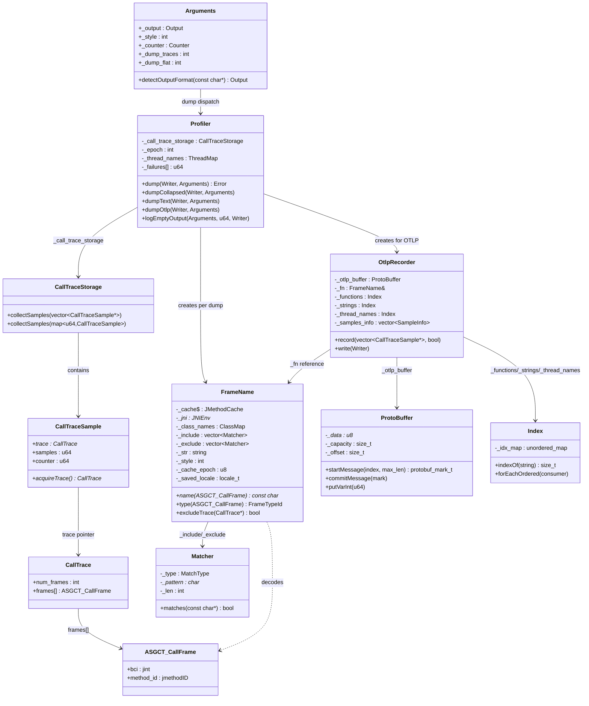

# 第十四章：输出格式与帧名称深度解析

> 基于 async-profiler 2.10 源码分析
> 方法论：程序 = 数据结构 + 算法（Doc-DataStructure-First + Source-Code-Depth + JVM-Mechanism-Deep-Dive）

---

## 第 0 部分：核心原理 ⭐

### 0.1 本质是什么？

将 `CallTraceStorage` 中的采样数据（调用栈 + 计数器）转换为多种文本/二进制格式输出，并通过 `FrameName` 将原始 `ASGCT_CallFrame`（bci + method_id）解码为人类可读的帧名称。

### 0.2 为什么需要？

`CallTraceStorage` 内部存储的是 `ASGCT_CallFrame` 数组 + 原子计数器，这是一种高效但不可读的二进制表示。不同分析场景需要不同格式：collapsed 供 `flamegraph.pl` 脚本消费，text 供终端查看，HTML 火焰图供浏览器可视化，JFR 供 JMC/IDEA 分析，OTLP 供可观测性平台对接。没有统一的帧名称解码器，每种格式都需要重复实现 JVMTI 查询、类名规范化、缓存、locale 切换等复杂逻辑。

### 0.3 怎么解决？

核心思路：**统一存储 + 统一解码 + 分格式输出**。

关键设计：
1. `FrameName` 类承担所有帧名称解码职责——10 种 BCI 分支 + JVMTI 查询 + epoch 缓存 + locale 切换
2. `dump()` 函数按 `Output` 枚举分发到 6 个独立输出函数（collapsed/flamegraph/tree/text/jfr/otlp）
3. `collectSamples()` 两个重载：指针版（零拷贝，供 collapsed/flamegraph/otlp）和聚合版（按 trace hash 合并，供 text）

### 0.4 为什么这样设计？

**为什么 FrameName 用 epoch 缓存而不是无限缓存？** JVMTI 查询代价高（3 次 JNI 调用），但 jmethodID 可能因类卸载而失效。epoch 字节前缀 + `_cache_max_age` 实现 LRU 淘汰，平衡性能与正确性。

**为什么 dumpCollapsed() 用 `snprintf` 写计数器而不是 `Writer << counter`？** 避免 locale 敏感的数字格式化（如法语环境 `1.000` 变成 `1,000`），`snprintf` 配合构造函数中 `uselocale(C)` 确保输出一致。

**为什么 collectSamples() 有两个重载？** text 格式需要按 trace hash 聚合（多个 slot 可能对应同一调用栈），而 collapsed/flamegraph/otlp 需要保留每个独立样本的指针以支持 exclude/include 过滤。

---

## 第 1 部分：数据结构全景 ⭐

### 1.0 数据结构清单

| # | 结构名 | 源码位置 | 核心作用 |
|---|--------|----------|----------|
| 1 | Output | arguments.h:74-83 | 8 种输出格式枚举 |
| 2 | Style | arguments.h:48-56 | 7 个位标志控制帧名称样式 |
| 3 | ASGCT_CallFrame | vmEntry.h:73-77 | 单个帧：bci + method_id（16 字节） |
| 4 | ASGCT_CallFrameType | vmEntry.h:43-54 | 10 个特殊 BCI 负值常量 |
| 5 | FrameTypeId + FrameType | vmEntry.h:13-39 | 帧类型枚举 + bci 编解码 |
| 6 | CallTrace | callTraceStorage.h:18-21 | 调用栈：num_frames + 柔性数组 |
| 7 | CallTraceSample | callTraceStorage.h:23-42 | 采样记录：trace 指针 + samples + counter |
| 8 | FrameName | frameName.h:54-85 | 帧名称解码器（14 字段） |
| 9 | Matcher | frameName.h:37-51 | 模式匹配器（4 种匹配类型） |
| 10 | JMethodCache | frameName.h:23 | 方法名缓存（epoch 前缀） |
| 11 | MethodSample + NamedMethodSample | profiler.cpp:71-84 | text 格式的方法直方图 |
| 12 | SampleInfo | otlp.h:92-96 | OTLP 样本信息 |
| 13 | Otlp::Recorder | otlp.h:98-137 | OTLP 记录器 |
| 14 | ProtoBuffer | protobuf.h:25-57 | Protobuf 编码缓冲区 |
| 15 | Index | index.h:16-65 | 字符串去重索引 |

### 1.1 Output 枚举

```cpp
// arguments.h:74-83
enum SHORT_ENUM Output {   // SHORT_ENUM = __attribute__((__packed__)) → 1 字节
    OUTPUT_NONE,           // 0: 未选择
    OUTPUT_TEXT,           // 1: 文本表格
    OUTPUT_SVG,            // 2: 已废弃（报错提示用 .html）
    OUTPUT_COLLAPSED,      // 3: collapsed 折叠栈
    OUTPUT_FLAMEGRAPH,     // 4: HTML 交互式火焰图
    OUTPUT_TREE,           // 5: HTML 树形视图
    OUTPUT_JFR,            // 6: Java Flight Recorder
    OUTPUT_OTLP            // 7: OpenTelemetry Profiling
};
```

**关键点**：
- `SHORT_ENUM` = `__attribute__((__packed__))`，sizeof = 1 字节（节省 Arguments 结构体空间）
- `OUTPUT_SVG` 已废弃，`detectOutputFormat()` 遇到 `.svg` 后缀返回此值，`parse()` 立即报错
- `OUTPUT_NONE` 时 `dump()` 返回 `"No output format selected"` 错误

### 1.2 Style 位标志

```cpp
// arguments.h:48-56
enum Style {
    STYLE_SIMPLE       = 0x1,   // 省略包名：java/lang/Thread → Thread
    STYLE_DOTTED       = 0x2,   // 斜杠→点号：java/lang/Thread → java.lang.Thread
    STYLE_NORMALIZE    = 0x4,   // 截断 Lambda 序号：Foo$$Lambda$123/456 → Foo$$Lambda$123
    STYLE_SIGNATURES   = 0x8,   // 追加方法签名：run → run()V
    STYLE_ANNOTATE     = 0x10,  // 追加帧类型后缀：_[0] / _[j] / _[i] / _[1]
    STYLE_LIB_NAMES    = 0x20,  // 前缀库名：libc`malloc
    STYLE_NO_SEMICOLON = 0x40   // 签名中 ; → |（避免与 collapsed 分隔符冲突）
};
```

**各格式的 Style 组合**（从源码中直接提取）：

| 格式 | Style 处理 | 源码行 |
|------|-----------|--------|
| collapsed | `args._style \| STYLE_NO_SEMICOLON` | profiler.cpp:1488 |
| flamegraph | `args._style & ~STYLE_ANNOTATE` | profiler.cpp:1528 |
| text | `args._style \| STYLE_DOTTED` | profiler.cpp:1581 |
| otlp | `args._style & ~STYLE_ANNOTATE` | profiler.cpp:1670 |

### 1.3 ASGCT_CallFrame（16 字节）

```cpp
// vmEntry.h:73-77
typedef struct {
    jint bci;                   // +0: 字节码索引或特殊 BCI 负值
    LP64_ONLY(jint padding;)    // +4: 64 位对齐填充
    jmethodID method_id;        // +8: Java 方法 ID 或复用为其他指针
} ASGCT_CallFrame;              // sizeof = 16
```

**method_id 的复用语义**（由 bci 决定）：
- `bci >= 0` 或 `bci` 含 FrameType 编码 → 真正的 `jmethodID`
- `BCI_NATIVE_FRAME` → `(const char*)` 原生符号名
- `BCI_ALLOC/ALLOC_OUTSIDE_TLAB/LOCK/PARK` → `(unsigned int)` ClassMap key
- `BCI_THREAD_ID` → `(int)` 线程 ID
- `BCI_ADDRESS` → `(void*)` PC 地址
- `BCI_ERROR` → `(const char*)` 错误字符串
- `BCI_CPU` → `(int)` CPU 编号（低 15 位）

### 1.4 ASGCT_CallFrameType（10 个特殊 BCI 值）

```cpp
// vmEntry.h:43-54
enum ASGCT_CallFrameType {
    BCI_NATIVE_FRAME       = -10,  // 原生函数名
    BCI_ALLOC              = -11,  // TLAB 内分配的类名
    BCI_ALLOC_OUTSIDE_TLAB = -12,  // TLAB 外分配的类名
    BCI_LIVE_OBJECT        = -13,  // 存活对象的类名
    BCI_LOCK               = -14,  // 锁对象的类名
    BCI_PARK               = -15,  // park() blocker 的类名
    BCI_THREAD_ID          = -16,  // 线程标识
    BCI_ADDRESS            = -17,  // PC 地址
    BCI_ERROR              = -18,  // 错误字符串
    BCI_CPU                = -19,  // CPU 编号
};
```

**注意**：旧文档声称存在 `BCI_WALL = -13`，这是**错误的**。`-13` 对应 `BCI_LIVE_OBJECT`。

### 1.5 FrameTypeId + FrameType 编解码

```cpp
// vmEntry.h:13-28
enum FrameTypeId {
    FRAME_INTERPRETED  = 0,   // 解释执行
    FRAME_JIT_COMPILED = 1,   // JIT 编译
    FRAME_INLINED      = 2,   // 内联
    FRAME_NATIVE       = 3,   // C/asm 原生
    FRAME_CPP          = 4,   // C++/Rust/ObjC
    FRAME_KERNEL       = 5,   // 内核
    FRAME_C1_COMPILED  = 6,   // C1 编译
};
```

**FrameType 编解码**（bci 字段的位布局）：

```cpp
// vmEntry.h:32-38
static inline int encode(int type, int bci) {
    return (1 << 24) | (type << 25) | (bci & 0xffffff);
    //      ^^^^^^^^    ^^^^^^^^^^^^    ^^^^^^^^^^^^^^^
    //      bit 24=1    bits 25-27      bits 0-23: 真实 BCI
    //      标记位      帧类型(0-6)
}

static inline FrameTypeId decode(int bci) {
    return (bci >> 24) > 0 ? (FrameTypeId)(bci >> 25) : FRAME_JIT_COMPILED;
    //     ^^^^^^^^^^^^^^^                                ^^^^^^^^^^^^^^^^^
    //     bit 24=1 → 新格式                              bit 24=0 → 旧格式默认 JIT
}
```

### 1.6 CallTrace

```cpp
// callTraceStorage.h:18-21
struct CallTrace {
    int num_frames;              // +0: 帧数量
    ASGCT_CallFrame frames[1];   // +4(+pad): 柔性数组（实际 num_frames 个元素）
};
// sizeof(CallTrace) = 4 + pad + 16*1 = 24（最小），实际按 num_frames 分配
```

### 1.7 CallTraceSample

```cpp
// callTraceStorage.h:23-42
struct CallTraceSample {
    CallTrace* trace;   // +0:  指向 CallTrace（acquire/release 语义）
    u64 samples;        // +8:  采样次数
    u64 counter;        // +16: 计数器值（如 CPU 周期数、分配字节数）

    CallTrace* acquireTrace() {
        return __atomic_load_n(&trace, __ATOMIC_ACQUIRE);  // ★ 读取时 acquire
    }
    void setTrace(CallTrace* value) {
        return __atomic_store_n(&trace, value, __ATOMIC_RELEASE);  // ★ 写入时 release
    }
    CallTraceSample& operator+=(const CallTraceSample& s) {
        trace = s.trace;
        samples += s.samples;
        counter += s.counter;
        return *this;
    }
};
// sizeof = 24
```

**设计要点**：`acquireTrace()` 使用 `__ATOMIC_ACQUIRE` 确保读到 trace 指针后，对应的 `frames[]` 数据也可见（与采样线程的 `__ATOMIC_RELEASE` 配对）。

### 1.8 FrameName 类（14 字段）

**问题驱动推导**：为什么需要这么多字段？

1. **JVMTI 查询代价高**（3 次 JNI 调用：GetMethodName → GetMethodDeclaringClass → GetClassSignature）→ 需要 `_cache`（JMethodCache）
2. **jmethodID 可能因类卸载失效** → 需要 `_cache_epoch` + `_cache_max_age` 实现 LRU 淘汰
3. **locale 敏感问题**（法语环境 printf 数字格式不同）→ 需要 `_saved_locale` 切换到 C locale
4. **include/exclude 过滤** → 需要 `_include` / `_exclude` 向量
5. **类名查找**（BCI_ALLOC/LOCK/PARK 的 ClassMap key → 类名）→ 需要 `_class_names`

```cpp
// frameName.h:54-85
class FrameName {
  private:
    static JMethodCache _cache;       // 全局静态：map<jmethodID, string>，string[0]=epoch 字节
    JNIEnv* _jni;                     // JNI 环境指针
    ClassMap _class_names;            // map<unsigned int, const char*>：classId → 类名
    std::vector<Matcher> _include;    // 包含过滤器
    std::vector<Matcher> _exclude;    // 排除过滤器
    std::string _str;                 // 临时字符串缓冲区（避免反复分配）
    int _style;                       // Style 位标志组合
    unsigned char _cache_epoch;       // 当前 epoch（每次 dump 递增）
    unsigned char _cache_max_age;     // 最大缓存年龄（来自 args._mcache）
    Mutex& _thread_names_lock;        // 线程名锁的引用
    ThreadMap& _thread_names;         // map<int, string>：tid → 线程名
    locale_t _saved_locale;           // 保存的原始 locale
};
```

**构造函数关键逻辑**（frameName.cpp:77-96）：
```cpp
FrameName::FrameName(Arguments& args, int style, int epoch, Mutex& lock, ThreadMap& names) :
    /* ... 初始化列表 ... */
    _jni(VM::jni())
{
    _saved_locale = uselocale(newlocale(LC_NUMERIC_MASK, "C", (locale_t)0));
    //              ^^^^^^^^^ ^^^^^^^^^ 创建 C locale 并切换，保存旧 locale
    for (const char* s : args._include) _include.push_back(s);  // Matcher 构造
    for (const char* s : args._exclude) _exclude.push_back(s);
    Profiler::instance()->classMap()->collect(_class_names);     // 快照 ClassMap
}
```

**析构函数关键逻辑**（frameName.cpp:98-113）：
```cpp
FrameName::~FrameName() {
    if (_cache_max_age == 0) {
        _cache.clear();                  // mcache=0 → 清空全部缓存
    } else {
        // 淘汰过期条目：epoch 差 >= max_age 的删除
        for (auto it = _cache.begin(); it != _cache.end(); ) {
            if (_cache_epoch - (unsigned char)it->second[0] >= _cache_max_age) {
                _cache.erase(it++);
            } else { ++it; }
        }
    }
    freelocale(uselocale(_saved_locale));  // 恢复原始 locale 并释放 C locale
}
```

### 1.9 Matcher 类

```cpp
// frameName.h:37-51, frameName.cpp:21-72
class Matcher {
  private:
    MatchType _type;   // EQUALS / CONTAINS / STARTS_WITH / ENDS_WITH
    char* _pattern;    // strdup 的模式字符串（已去掉首尾 *）
    int _len;          // 模式长度
};
```

**模式解析规则**（frameName.cpp:21-35）：

| 输入模式 | 解析后 _type | 解析后 _pattern |
|---------|-------------|----------------|
| `"foo"` | EQUALS | `"foo"` |
| `"*foo"` | ENDS_WITH | `"foo"` |
| `"foo*"` | STARTS_WITH | `"foo"` |
| `"*foo*"` | CONTAINS | `"foo"` |

### 1.10 JMethodCache

```cpp
// frameName.h:23
typedef std::map<jmethodID, std::string> JMethodCache;
```

**关键设计**：`string[0]` 存储 epoch 字节（`_cache_epoch`），`string[1:]` 存储方法名。

- **写入**（frameName.cpp:319）：`_cache.insert(it, {method, string(1, _cache_epoch) + _str})`
  - 使用 `lower_bound` 返回的迭代器作为 hint → `O(1)` 摊销插入
- **读取**（frameName.cpp:309-316）：命中时更新 `it->second[0] = _cache_epoch`（刷新活跃时间）
- **淘汰**（析构函数）：`_cache_epoch - (unsigned char)it->second[0] >= _cache_max_age` 时删除

### 1.11 MethodSample + NamedMethodSample

```cpp
// profiler.cpp:71-84
struct MethodSample {
    u64 samples;    // 采样次数
    u64 counter;    // 计数器值
    void add(u64 add_samples, u64 add_counter) {
        samples += add_samples;
        counter += add_counter;
    }
};
typedef std::pair<std::string, MethodSample> NamedMethodSample;

static bool sortByCounter(const NamedMethodSample& a, const NamedMethodSample& b) {
    return a.second.counter > b.second.counter;  // 降序
}
```

**用途**：仅供 `dumpText()` 的 flat 子模式——按 `frames[0]`（栈顶方法）聚合，构建方法直方图。

### 1.12 SampleInfo

```cpp
// otlp.h:92-96
struct SampleInfo {
    u64 samples;                 // 采样次数
    u64 counter;                 // 计数器值
    size_t thread_name_index;    // 线程名在 _thread_names Index 中的索引（0=无线程名）
};
```

### 1.13 Otlp::Recorder

```cpp
// otlp.h:98-137
class Recorder {
  private:
    ProtoBuffer _otlp_buffer;              // Protobuf 编码缓冲区（初始 5120 字节）
    FrameName& _fn;                        // 帧名称解码器引用
    Index _thread_names;                   // 线程名去重索引
    Index _functions;                      // 函数名去重索引
    Index _strings;                        // 全局字符串去重索引
    std::vector<SampleInfo> _samples_info; // 样本信息数组
    const u64 _start_nanos;                // 采样起始时间（纳秒）
    const u64 _duration_nanos;             // 采样持续时间（纳秒）
    const size_t _engine_type_strindex;    // 引擎类型字符串索引
    const size_t _engine_unit_strindex;    // 引擎单位字符串索引
    const size_t _count_strindex;          // "count" 字符串索引
};
```

**构造函数**预注册 3 个字符串（engine type、engine units、"count"），确保它们在 `_strings` 中有确定的索引。

### 1.14 ProtoBuffer

```cpp
// protobuf.h:25-57
class ProtoBuffer {
  private:
    unsigned char* _data;    // +0:  malloc 分配的缓冲区
    size_t _capacity;        // +8:  当前容量
    size_t _offset;          // +16: 当前写入偏移
};
// sizeof = 24
```

**嵌套消息编码**（startMessage/commitMessage）：

```cpp
// protobuf.cpp:80-88
protobuf_mark_t startMessage(protobuf_index_t index, size_t max_len_byte_count = 5) {
    tag(index, LEN);                               // 写入 field tag
    ensureCapacity(max_len_byte_count);
    protobuf_mark_t mark = _offset << 3 | max_len_byte_count;  // ★ 编码：高 61 位=偏移，低 3 位=预留字节数
    _offset += max_len_byte_count;                  // 跳过预留空间
    return mark;
}

// protobuf.cpp:90-102
void commitMessage(protobuf_mark_t mark) {
    size_t max_len_byte_count = mark & 7;           // 取低 3 位
    size_t message_start = mark >> 3;                // 取高 61 位
    size_t actual_len = _offset - (message_start + max_len_byte_count);
    // ★ 回填 varint 长度（固定字节数，高位补 0x80 continuation bit）
    for (size_t i = 0; i < max_len_byte_count - 1; i++) {
        _data[message_start + i] = (unsigned char)(0x80 | actual_len);
        actual_len >>= 7;
    }
    _data[message_start + max_len_byte_count - 1] = (unsigned char)actual_len;
}
```

**设计要点**：
- 默认预留 5 字节（NESTED_FIELD_BYTE_COUNT=5），可表示 5×7=35 位 → 最大 ~34GB 消息
- 小消息可指定 `max_len_byte_count=1`（最大 127 字节），节省 4 字节开销
- `commitMessage` 始终写满 `max_len_byte_count` 字节（最后一字节无 0x80），确保长度字段固定大小

### 1.15 Index 类

```cpp
// index.h:16-65
class Index {
  private:
    std::unordered_map<std::string, size_t> _idx_map;  // 字符串 → 索引
    size_t _start_index;                               // 起始索引偏移
  public:
    Index(size_t start_index = 0) : _start_index(start_index) {
        indexOf("");  // ★ 确保 index 0 = 空字符串（OTLP 规范要求）
    }

    size_t indexOf(const std::string& value) {
        return _idx_map.insert({value, _start_index + _idx_map.size()}).first->second;
        //     ^^^^^^^ insert 返回 pair<iterator, bool>
        //     已存在 → 返回旧索引；不存在 → 插入新索引
    }
};
```

**`forEachOrdered()`** 实现：先构建 `vector<const string*>`（按索引排列），再顺序遍历。因为 `unordered_map` 迭代顺序不确定，但 OTLP 要求 `string_table[i]` 与 `function_table[i]` 按索引顺序写入。

---

## 第 2 部分：算法/流程分析

### 2.1 dump() 分发（profiler.cpp:1372-1413）

**解决什么问题**：根据用户指定的输出格式，将采样数据路由到正确的输出函数。

```cpp
// profiler.cpp:1372-1413
Error Profiler::dump(Writer& out, Arguments& args) {
    MutexLocker ml(_state_lock);
    // ★ TERMINATED 状态下，如果输出文件与全局文件相同，直接返回（避免重复写入）
    if (_state == TERMINATED && _global_args._file != NULL && args._file != NULL
        && strcmp(_global_args._file, args._file) == 0) {
        return Error::OK;
    } else if (_state != IDLE && _state != RUNNING) {
        return Error("Profiler has not started");
    }

    if (_state == RUNNING) {
        updateJavaThreadNames();   // ★ 刷新 Java 线程名（JVMTI 查询）
        updateNativeThreadNames(); // ★ 刷新 Native 线程名（/proc 读取）
    }

    switch (args._output) {
        case OUTPUT_COLLAPSED:  dumpCollapsed(out, args);           break;
        case OUTPUT_FLAMEGRAPH: dumpFlameGraph(out, args, false);   break;
        case OUTPUT_TREE:       dumpFlameGraph(out, args, true);    break;
        case OUTPUT_TEXT:       dumpText(out, args);                break;
        case OUTPUT_JFR:        /* flush JFR */                     break;
        case OUTPUT_OTLP:       dumpOtlp(out, args);               break;
        default:                return Error("No output format selected");
    }
    return Error::OK;
}
```

### 2.2 detectOutputFormat()（arguments.cpp:598-612）

**解决什么问题**：根据文件后缀自动推断输出格式，用户无需手动指定 `-o` 参数。

```cpp
// arguments.cpp:598-612
Output Arguments::detectOutputFormat(const char* file) {
    const char* ext = strrchr(file, '.');   // ★ 取最后一个 '.'
    if (ext != NULL) {
        if (strcmp(ext, ".html") == 0)                             return OUTPUT_FLAMEGRAPH;
        else if (strcmp(ext, ".jfr") == 0)                         return OUTPUT_JFR;
        else if (strcmp(ext, ".collapsed") == 0 || strcmp(ext, ".folded") == 0) return OUTPUT_COLLAPSED;
        else if (strcmp(ext, ".svg") == 0)                         return OUTPUT_SVG;  // → 后续报错
    }
    return OUTPUT_TEXT;  // ★ 默认 TEXT
}
```

**触发时机**（arguments.cpp:504-511）：当 `_file != NULL && _output == OUTPUT_NONE` 时自动检测，同时设置 `_dump_traces = 100`（text 格式输出前 100 个完整调用栈）和 `_dump_flat = 200`（输出前 200 个热点方法）。

### 2.3 dumpCollapsed()（profiler.cpp:1487-1511）

**解决什么问题**：输出 FlameGraph 工具标准输入格式——每行一个调用栈，帧用分号分隔，末尾空格后跟计数器。

```cpp
// profiler.cpp:1487-1511
void Profiler::dumpCollapsed(Writer& out, Arguments& args) {
    // ★ 强制追加 STYLE_NO_SEMICOLON：方法签名中的 ; 替换为 |，避免与分隔符冲突
    FrameName fn(args, args._style | STYLE_NO_SEMICOLON, _epoch, _thread_names_lock, _thread_names);
    char buf[32];                        // ★ 仅用于 snprintf 格式化计数器数字
    u64 printed_sample_count = 0;

    std::vector<CallTraceSample*> samples;
    _call_trace_storage.collectSamples(samples);  // ★ 指针版：零拷贝收集

    for (std::vector<CallTraceSample*>::const_iterator it = samples.begin(); it != samples.end(); ++it) {
        CallTrace* trace = (*it)->acquireTrace();  // ★ acquire 语义读取 trace 指针
        if (trace == NULL || fn.excludeTrace(trace)) continue;  // ★ 排除/包含过滤

        u64 counter = args._counter == COUNTER_SAMPLES ? (*it)->samples : (*it)->counter;
        if (counter == 0) continue;

        // ★ 反向遍历：frames[num_frames-1] 是调用栈底部（如 main），frames[0] 是栈顶
        for (int j = trace->num_frames - 1; j >= 0; j--) {
            const char* frame_name = fn.name(trace->frames[j]);
            out << frame_name << (j == 0 ? ' ' : ';');  // ★ 最后一帧后跟空格而非分号
        }
        // ★ 用 snprintf 而非 Writer << counter，避免 locale 敏感的数字格式化
        out.write(buf, snprintf(buf, sizeof(buf), "%llu\n", counter));
        printed_sample_count++;
    }
    logEmptyOutput(args, printed_sample_count, out);
}
```

**输出示例**：
```
main;Thread.run;HashMap.put 42000
main;Thread.run;ArrayList.add 18500
```

### 2.4 dumpText()（profiler.cpp:1580-1666）— 三阶段结构

**解决什么问题**：输出人类可读的文本报告，包含 ASGCT 错误统计 + 完整调用栈 + 方法直方图三部分。

**阶段划分**：

| 阶段 | 行号 | 内容 |
|------|------|------|
| 1: Summary | 1602-1617 | 总采样数 + ASGCT 错误类型分布 |
| 2: Traces | 1623-1643 | 按 counter 降序输出前 N 个完整调用栈 |
| 3: Flat | 1646-1666 | 按 frames[0]（栈顶）聚合，输出方法直方图 |

```cpp
// profiler.cpp:1580-1666
void Profiler::dumpText(Writer& out, Arguments& args) {
    // ★ 强制追加 STYLE_DOTTED：text 格式用点号分隔包名
    FrameName fn(args, args._style | STYLE_DOTTED, _epoch, _thread_names_lock, _thread_names);
    char buf[1024] = {0};

    // ★★★ 阶段 0：收集并聚合样本 ★★★
    std::vector<CallTraceSample> samples;
    u64 total_counter = 0;
    {
        std::map<u64, CallTraceSample> map;
        _call_trace_storage.collectSamples(map);  // ★ 聚合版：按 trace hash 合并
        samples.reserve(map.size());

        for (auto it = map.begin(); it != map.end(); ++it) {
            CallTrace* trace = it->second.trace;
            u64 counter = it->second.counter;
            if (trace == NULL || counter == 0) continue;
            total_counter += counter;
            if (trace->num_frames == 0 || fn.excludeTrace(trace)) continue;
            samples.push_back(it->second);  // ★ 值拷贝到 vector
        }
    }

    // ★★★ 阶段 1：Summary — ASGCT 错误统计 ★★★
    snprintf(buf, sizeof(buf) - 1,
            "--- Execution profile ---\n"
            "Total samples       : %lld\n", _total_samples);
    out << buf;

    double spercent = 100.0 / _total_samples;
    for (int i = 1; i < ASGCT_FAILURE_TYPES; i++) {    // ASGCT_FAILURE_TYPES = 12
        const char* err_string = asgctError(-i);         // ★ 返回 NULL 的跳过（非错误状态）
        if (err_string != NULL && _failures[i] > 0) {
            snprintf(buf, sizeof(buf), "%-20s: %lld (%.2f%%)\n",
                     err_string, _failures[i], _failures[i] * spercent);
            out << buf;
        }
    }
    out << "\n";

    double cpercent = 100.0 / total_counter;
    const char* units_str = activeEngine()->units();

    // ★★★ 阶段 2：Traces — 前 N 个完整调用栈（默认 N=100）★★★
    if (args._dump_traces > 0) {
        std::sort(samples.begin(), samples.end(), [](const CallTraceSample& a, const CallTraceSample& b) {
            return a.counter > b.counter;   // ★ 按 counter 降序
        });

        int max_count = args._dump_traces;
        for (auto it = samples.begin(); it != samples.end() && --max_count >= 0; ++it) {
            snprintf(buf, sizeof(buf) - 1, "--- %lld %s (%.2f%%), %lld sample%s\n",
                     it->counter, units_str, it->counter * cpercent,
                     it->samples, it->samples == 1 ? "" : "s");
            out << buf;

            CallTrace* trace = it->trace;
            for (int j = 0; j < trace->num_frames; j++) {
                const char* frame_name = fn.name(trace->frames[j]);
                snprintf(buf, sizeof(buf) - 1, "  [%2d] %s\n", j, frame_name);
                out << buf;
            }
            out << "\n";
        }
    }

    // ★★★ 阶段 3：Flat — 方法直方图（默认前 200 个）★★★
    if (args._dump_flat > 0) {
        std::map<std::string, MethodSample> histogram;
        for (auto it = samples.begin(); it != samples.end(); ++it) {
            const char* frame_name = fn.name(it->trace->frames[0]);  // ★ 只取栈顶帧
            histogram[frame_name].add(it->samples, it->counter);
        }

        std::vector<NamedMethodSample> methods(histogram.begin(), histogram.end());
        std::sort(methods.begin(), methods.end(), sortByCounter);  // ★ 按 counter 降序

        snprintf(buf, sizeof(buf) - 1, "%12s  percent  samples  top\n"
                                       "  ----------  -------  -------  ---\n", units_str);
        out << buf;

        int max_count = args._dump_flat;
        for (auto it = methods.begin(); it != methods.end() && --max_count >= 0; ++it) {
            snprintf(buf, sizeof(buf) - 1, "%12lld  %6.2f%%  %7lld  %s\n",
                     it->second.counter, it->second.counter * cpercent,
                     it->second.samples, it->first.c_str());
            out << buf;
        }
    }
}
```

**text 输出示例**：
```
--- Execution profile ---
Total samples       : 10000
GC_active           : 150 (1.50%)
not_walkable_Java   : 23 (0.23%)

--- 42000 ns (4.20%), 420 samples
  [ 0] java.util.HashMap.put
  [ 1] com.example.Service.process
  [ 2] java.lang.Thread.run

          ns  percent  samples  top
  ----------  -------  -------  ---
       42000   4.20%      420  java.util.HashMap.put
       18500   1.85%      185  java.util.ArrayList.add
```

### 2.5 dumpOtlp()（profiler.cpp:1669-1676）

**解决什么问题**：输出 OpenTelemetry Profiling 二进制 Protobuf 格式，供 Grafana/Jaeger 等可观测性平台消费。

```cpp
// profiler.cpp:1669-1676
void Profiler::dumpOtlp(Writer& out, Arguments& args) {
    // ★ 掩掉 STYLE_ANNOTATE：OTLP 不需要 _[j]/_[i] 后缀
    FrameName fn(args, args._style & ~STYLE_ANNOTATE, _epoch, _thread_names_lock, _thread_names);
    // ★ 创建 Recorder：_start_time 转纳秒，duration 转纳秒
    Otlp::Recorder recorder(_engine, fn, _start_time * 1000ULL, (OS::micros() - _start_time) * 1000ULL);
    std::vector<CallTraceSample*> call_trace_samples;
    _call_trace_storage.collectSamples(call_trace_samples);  // ★ 指针版
    recorder.record(call_trace_samples, args._counter == COUNTER_SAMPLES);
    recorder.write(out);  // ★ 写入二进制 Protobuf 到 Writer
}
```

### 2.6 Recorder::record()（otlp.cpp:121-132）

**解决什么问题**：协调 OTLP Protobuf 消息的构建顺序——先字典，后 profile 数据。

```cpp
// otlp.cpp:121-132
void Recorder::record(const std::vector<CallTraceSample*>& call_trace_samples, bool samples) {
    recordProfilesDictionary(call_trace_samples);  // ★ 先写字典：string/function/location/stack/attribute

    protobuf_mark_t resource_profiles_mark = _otlp_buffer.startMessage(ProfilesData::resource_profiles);
    protobuf_mark_t scope_profiles_mark = _otlp_buffer.startMessage(ResourceProfiles::scope_profiles);

    size_t unit_strindex = samples ? _count_strindex : _engine_unit_strindex;
    recordOtlpProfile(_engine_type_strindex, unit_strindex, samples);  // ★ 写 Profile（samples 数组）

    _otlp_buffer.commitMessage(scope_profiles_mark);
    _otlp_buffer.commitMessage(resource_profiles_mark);
}
```

**OTLP 消息层次**：
```
ProfilesData
  dictionary (string_table + function_table + location_table + stack_table + attribute_table)
  resource_profiles
    scope_profiles
      profiles (time + duration + sample_type + samples[])
```

### 2.7 recordProfilesDictionary()（otlp.cpp:11-59）

**解决什么问题**：构建 OTLP 字典——所有字符串、函数、位置、调用栈、属性的去重表。

```cpp
// otlp.cpp:11-59
void Recorder::recordProfilesDictionary(const std::vector<CallTraceSample*>& call_trace_samples) {
    protobuf_mark_t dictionary_mark = _otlp_buffer.startMessage(ProfilesData::dictionary);

    recordStacks(call_trace_samples);  // ★ 先写 stack_table（同时填充 _functions 和 _samples_info）

    // ★ mapping_table：空的占位映射（某些解析器要求至少存在）
    protobuf_mark_t mapping_mark = _otlp_buffer.startMessage(ProfilesDictionary::mapping_table, 1);
    _otlp_buffer.commitMessage(mapping_mark);

    // ★ function_table：按索引顺序写入函数名
    _functions.forEachOrdered([&](size_t idx, const std::string& function_name) {
        protobuf_mark_t function_mark = _otlp_buffer.startMessage(ProfilesDictionary::function_table, 1);
        _otlp_buffer.field(Function::name_strindex, _strings.indexOf(function_name));
        _otlp_buffer.commitMessage(function_mark);
    });

    // ★ location_table：每个 function 对应一个 location（1:1 映射）
    for (size_t function_idx = 0; function_idx < _functions.size(); ++function_idx) {
        protobuf_mark_t location_mark = _otlp_buffer.startMessage(ProfilesDictionary::location_table, 1);
        _otlp_buffer.field(Location::mapping_index, (u64)0);  // 默认 mapping
        protobuf_mark_t line_mark = _otlp_buffer.startMessage(Location::lines, 1);
        _otlp_buffer.field(Line::function_index, function_idx);
        _otlp_buffer.commitMessage(line_mark);
        _otlp_buffer.commitMessage(location_mark);
    }

    // ★ attribute_table：线程名属性
    if (!_thread_names.empty()) {
        size_t thread_name_key_strindex = _strings.indexOf(OTLP_THREAD_NAME);
        _thread_names.forEachOrdered([&](size_t idx, const std::string& s) {
            // KeyValueAndUnit { key: "thread.name", value: AnyValue { string_value: s } }
            // ... 嵌套 Protobuf 消息
        });
    }

    // ★ string_table：按索引顺序写入所有字符串
    _strings.forEachOrdered([&](size_t idx, const std::string& s) {
        _otlp_buffer.field(ProfilesDictionary::string_table, s.data(), s.length());
    });

    _otlp_buffer.commitMessage(dictionary_mark);
}
```

### 2.8 recordStacks()（otlp.cpp:61-89）

**解决什么问题**：遍历所有调用栈，将帧名称注册到 `_functions` Index，同时构建 `stack_table` 和 `_samples_info`。

```cpp
// otlp.cpp:61-89
void Recorder::recordStacks(const std::vector<CallTraceSample*>& call_trace_samples) {
    {   // ★ stack_table[0] 必须是空栈（OTLP 规范要求）
        protobuf_mark_t stack_mark = _otlp_buffer.startMessage(ProfilesDictionary::stack_table);
        _otlp_buffer.commitMessage(stack_mark);
    }

    for (const auto& cts : call_trace_samples) {
        CallTrace* trace = cts->acquireTrace();
        if (trace == NULL || _fn.excludeTrace(trace) || cts->samples == 0) continue;

        protobuf_mark_t stack_mark = _otlp_buffer.startMessage(ProfilesDictionary::stack_table);
        protobuf_mark_t location_indices_mark = _otlp_buffer.startMessage(Stack::location_indices);
        size_t thread_name_index_value = 0;
        for (int j = 0; j < trace->num_frames; j++) {
            if (trace->frames[j].bci == BCI_THREAD_ID) {
                // ★ 线程帧不写入栈，而是记录到 _thread_names Index
                thread_name_index_value = _thread_names.indexOf(_fn.name(trace->frames[j]));
                continue;
            }
            size_t location_idx = _functions.indexOf(_fn.name(trace->frames[j]));
            _otlp_buffer.putVarInt(location_idx);  // ★ packed repeated: 直接写 varint
        }
        _otlp_buffer.commitMessage(location_indices_mark);
        _otlp_buffer.commitMessage(stack_mark);

        _samples_info.push_back(SampleInfo{cts->samples, cts->counter, thread_name_index_value});
    }
}
```

### 2.9 FrameName::name()（frameName.cpp:251-326）— 10 分支 switch

**解决什么问题**：将 `ASGCT_CallFrame`（bci + method_id）解码为人类可读的帧名称字符串。

```cpp
// frameName.cpp:251-326
const char* FrameName::name(ASGCT_CallFrame& frame, bool for_matching) {
    if (frame.method_id == NULL) return "[unknown]";

    switch (frame.bci) {
        case BCI_NATIVE_FRAME:                              // ★ -10: 原生符号
            return decodeNativeSymbol((const char*)frame.method_id);
            // → demangle C++/Rust 符号 + 可选 lib_name 前缀

        case BCI_ALLOC:
        case BCI_ALLOC_OUTSIDE_TLAB:
        case BCI_LOCK:
        case BCI_PARK: {                                    // ★ -11/-12/-14/-15: ClassMap 查找
            const char* symbol = _class_names[(uintptr_t)frame.method_id];
            javaClassName(symbol, strlen(symbol), _style | STYLE_DOTTED);
            if (!for_matching && !(_style & STYLE_DOTTED)) {
                _str += frame.bci == BCI_ALLOC_OUTSIDE_TLAB ? "_[k]" : "_[i]";
                // ★ _[k] 表示 TLAB 外分配，_[i] 表示 TLAB 内分配/锁/park
            }
            return _str.c_str();
        }

        case BCI_THREAD_ID: {                               // ★ -16: 线程名
            int tid = (int)(uintptr_t)frame.method_id;
            MutexLocker ml(_thread_names_lock);
            ThreadMap::iterator it = _thread_names.find(tid);
            if (for_matching)
                return it != _thread_names.end() ? it->second.c_str() : "";
            char buf[32];
            snprintf(buf, sizeof(buf), "tid=%d]", tid);
            if (it != _thread_names.end())
                return _str.assign("[").append(it->second).append(" ").append(buf).c_str();
            else
                return _str.assign("[").append(buf).c_str();
        }

        case BCI_ADDRESS:                                   // ★ -17: PC 地址
            { char buf[32]; snprintf(buf, sizeof(buf), "%p", frame.method_id);
              return _str.assign(buf).c_str(); }

        case BCI_ERROR:                                     // ★ -18: 错误字符串
            return _str.assign("[").append((const char*)frame.method_id).append("]").c_str();

        case BCI_CPU: {                                     // ★ -19: CPU 编号
            int cpu = ((int)(uintptr_t)frame.method_id) & 0x7fff;  // ★ 低 15 位
            char buf[32];
            snprintf(buf, sizeof(buf), "[CPU-%d]", cpu);
            return _str.assign(buf).c_str();
        }

        default: {                                          // ★ bci >= 0 或含 FrameType 编码: Java 方法
            const char* type_suffix = typeSuffix(FrameType::decode(frame.bci));

            // ★ lower_bound hint-based 缓存查找
            JMethodCache::iterator it = _cache.lower_bound(frame.method_id);
            if (it != _cache.end() && it->first == frame.method_id) {
                it->second[0] = _cache_epoch;               // ★ 刷新 epoch
                const char* name = it->second.c_str() + 1;  // ★ 跳过 epoch 字节
                if (type_suffix != NULL)
                    return _str.assign(name).append(type_suffix).c_str();
                return name;
            }

            javaMethodName(frame.method_id);                // ★ 3 次 JVMTI 调用
            // ★ hint-based insert：O(1) 摊销（lower_bound 已定位插入点）
            _cache.insert(it, JMethodCache::value_type(frame.method_id,
                          std::string(1, _cache_epoch) + _str));
            if (type_suffix != NULL) _str += type_suffix;
            return _str.c_str();
        }
    }
}
```

### 2.10 javaMethodName()（frameName.cpp:151-193）

**解决什么问题**：通过 3 次 JVMTI 调用获取 Java 方法的完整名称。

```cpp
// frameName.cpp:151-193
void FrameName::javaMethodName(jmethodID method) {
    if (VMMethod::isStaleMethodId(method)) {
        _str.assign("[stale_jmethodID]");  // ★ 类已卸载
        return;
    }

    jclass method_class = NULL;
    char* class_name = NULL;
    char* method_name = NULL;
    char* method_sig = NULL;

    jvmtiEnv* jvmti = VM::jvmti();
    jvmtiError err;

    // ★ 3 步 JVMTI 链式调用
    if ((err = jvmti->GetMethodName(method, &method_name, &method_sig, NULL)) == 0 &&
        (err = jvmti->GetMethodDeclaringClass(method, &method_class)) == 0 &&
        (err = jvmti->GetClassSignature(method_class, &class_name, NULL)) == 0) {
        // ★ class_name 格式 "Ljava/lang/Object;"，去掉 'L' 和 ';'
        javaClassName(class_name + 1, strlen(class_name) - 2, _style);
        _str.append(".").append(method_name);
        if (_style & STYLE_SIGNATURES) {
            if (_style & STYLE_NO_SEMICOLON) {
                for (char* s = method_sig; *s; s++) {
                    if (*s == ';') *s = '|';    // ★ ; → | 避免 collapsed 分隔符冲突
                }
            }
            _str.append(method_sig);
        }
    } else if (err == JVMTI_ERROR_INVALID_METHODID) {
        _str.assign("[stale_jmethodID]");
    } else {
        char buf[32];
        snprintf(buf, sizeof(buf), "[jvmtiError %d]", err);
        _str.assign(buf);
    }

    // ★ 清理 JVMTI 分配的内存 + JNI 本地引用
    if (method_class) _jni->DeleteLocalRef(method_class);
    jvmti->Deallocate((unsigned char*)class_name);
    jvmti->Deallocate((unsigned char*)method_sig);
    jvmti->Deallocate((unsigned char*)method_name);
}
```

### 2.11 javaClassName()（frameName.cpp:195-249）— 四阶段处理

**解决什么问题**：将 JVM 内部类名格式（如 `java/lang/Thread`、`[Ljava/lang/Object;`）转换为用户友好的格式。

```cpp
// frameName.cpp:195-249
void FrameName::javaClassName(const char* symbol, size_t length, int style) {
    // ★★★ 阶段 1：数组解码 ★★★
    int array_dimension = 0;
    while (*symbol == '[') { array_dimension++; symbol++; }

    if (array_dimension == 0) {
        _str.assign(symbol, length);
    } else {
        switch (*symbol) {
            case 'B': _str.assign("byte");    break;
            case 'I': _str.assign("int");     break;
            // ... 省略其他基本类型
            default:  _str.assign(symbol + 1, length - array_dimension - 2);
            //         ★ 对象数组：去掉 'L' 和 ';'
        }
        do { _str += "[]"; } while (--array_dimension > 0);
    }

    // ★★★ 阶段 2：NORMALIZE — 截断 Lambda 序号 ★★★
    if (style & STYLE_NORMALIZE) {
        for (ssize_t i = _str.size() - 2; i > 0; i--) {
            if (_str[i] == '/' || _str[i] == '.') {
                if (isDigit(_str[i + 1])) _str.resize(i);
                break;
            }
        }
    }

    // ★★★ 阶段 3：SIMPLE — 省略包名 ★★★
    if (style & STYLE_SIMPLE) {
        size_t start = 0;
        for (size_t i = 0; i < _str.size(); i++) {
            if (_str[i] == '/' && !isDigit(_str[i + 1])) start = i + 1;
            // ★ isDigit 保护：Lambda$123/456 中的 /456 不被误判
        }
        _str.erase(0, start);
    }

    // ★★★ 阶段 4：DOTTED — 斜杠转点号 ★★★
    if (style & STYLE_DOTTED) {
        for (size_t i = 0; i < _str.size(); i++) {
            if (_str[i] == '/' && !isDigit(_str[i + 1])) _str[i] = '.';
        }
    }
}
```

### 2.12 FrameName::type()（frameName.cpp:328-364）

**解决什么问题**：判断帧的类型（用于火焰图的颜色着色）。

```cpp
// frameName.cpp:328-364
FrameTypeId FrameName::type(ASGCT_CallFrame& frame) {
    if (frame.method_id == NULL) return FRAME_NATIVE;

    switch (frame.bci) {
        case BCI_NATIVE_FRAME: {
            const char* name = (const char*)frame.method_id;
            // ★ 符号前缀判断语言：_Z=C++, _R=Rust, +[/-[=ObjC
            if ((name[0] == '_' && name[1] == 'Z') ||
                (name[0] == '_' && name[1] == 'R') ||
                (name[0] == '+' && name[1] == '[') ||
                (name[0] == '-' && name[1] == '['))
                return FRAME_CPP;
            else {
                size_t len = strlen(name);
                return len > 4 && strcmp(name + len - 4, "_[k]") == 0 ? FRAME_KERNEL : FRAME_NATIVE;
            }
        }
        case BCI_ALLOC:
        case BCI_LOCK:
        case BCI_PARK:            return FRAME_INLINED;
        case BCI_ALLOC_OUTSIDE_TLAB: return FRAME_KERNEL;
        case BCI_THREAD_ID:
        case BCI_ADDRESS:
        case BCI_ERROR:
        case BCI_CPU:             return FRAME_NATIVE;
        default:                  return FrameType::decode(frame.bci);
    }
}
```

### 2.13 excludeTrace()（frameName.cpp:384-403）

**解决什么问题**：对整个调用栈应用 include/exclude 过滤。

```cpp
// frameName.cpp:384-403
bool FrameName::excludeTrace(CallTrace* trace) {
    bool check_include = !_include.empty();
    bool check_exclude = !_exclude.empty();
    if (!(check_include || check_exclude)) return false;

    for (int i = 0; i < trace->num_frames; i++) {
        const char* frame_name = name(trace->frames[i], true);
        if (check_exclude && exclude(frame_name)) return true;   // ★ exclude 命中 → 立即排除
        if (check_include && include(frame_name)) {
            check_include = false;                                // ★ include 命中 → 不再检查
            if (!check_exclude) break;
        }
    }
    return check_include;  // ★ include 非空但未命中 → 排除
}
```

**语义**：`exclude` 优先级高于 `include`——即使 include 命中，如果 exclude 也命中仍排除。

### 2.14 collectSamples() 两个重载对比

| 特征 | 指针版 `vector<CallTraceSample*>` | 聚合版 `map<u64, CallTraceSample>` |
|------|----------------------------------|-----------------------------------|
| 调用者 | collapsed, flamegraph, otlp | text |
| 拷贝 | 零拷贝（指针） | 值拷贝 + 按 hash 聚合（operator+=） |
| 去重 | 不去重 | 按 trace hash 合并 |
| 原因 | 保留独立 counter | 需要聚合后排序 |

### 2.15 logEmptyOutput()（profiler.cpp:1782-1798）

**解决什么问题**：空输出时给用户有意义的日志提示。

```cpp
// profiler.cpp:1782-1798
void Profiler::logEmptyOutput(Arguments& args, u64 printed_samples_count, Writer& out) {
    if (!out.good()) { Log::warn("Output file may be incomplete"); return; }
    if (args._loop) return;                                // ★ 循环模式不提示
    if (_total_samples - _failures[-ticks_skipped] == 0) {
        Log::info("No samples were collected"); return;    // ★ 完全没有采样
    }
    if (printed_samples_count == 0) {
        Log::info("All samples were filtered out"); return;// ★ 全被过滤
    }
}
```

---

## 第 3 部分：数据结构关系图



---

## 第 4 部分：GDB 验证计划

| # | 验证目标 | 验证方法 |
|---|---------|---------|
| 1 | sizeof(ASGCT_CallFrame) = 16 | `p sizeof(ASGCT_CallFrame)` |
| 2 | sizeof(CallTraceSample) = 24 | `p sizeof(CallTraceSample)` |
| 3 | Output 枚举 sizeof = 1 | `p sizeof(Output)` |
| 4 | FrameName::_cache 是静态成员 | `p &FrameName::_cache` |
| 5 | dumpCollapsed 实际调用路径 | 断点 `Profiler::dumpCollapsed` |
| 6 | FrameName::name() BCI 分支 | 断点 + 条件 `frame.bci == -10` |
| 7 | javaMethodName JVMTI 调用链 | 断点 `FrameName::javaMethodName` |
| 8 | collectSamples 两个重载 | 断点两个 `collectSamples` |

> 注：GDB 验证需要 attach 到运行中的 async-profiler 进程，此处仅列出计划。

---

## 第 5 部分：总结

### 5.1 数据结构层面

| 结构 | 核心特征 |
|------|---------|
| Output | 8 值 packed 枚举（1 字节），OUTPUT_SVG 已废弃 |
| Style | 7 位标志，不同格式组合不同（collapsed 强制 NO_SEMICOLON，text 强制 DOTTED） |
| ASGCT_CallFrame | 16 字节，method_id 由 bci 决定语义（10 种复用） |
| FrameType | bci 位编码：bit24=标记，bit25-27=类型，bit0-23=真实 BCI |
| FrameName | 14 字段解码器：epoch 缓存 + locale 切换 + JVMTI 查询 + include/exclude |
| JMethodCache | `map<jmethodID, string>`，string[0]=epoch 字节，lower_bound hint 插入 |
| ProtoBuffer | 嵌套消息编码：mark = offset<<3 \| max_len_bytes，commitMessage 回填长度 |
| Index | `unordered_map` 去重，constructor 保证 index 0 = "" |

### 5.2 算法层面

| 算法 | 解决的问题 | 核心设计决策 |
|------|-----------|-------------|
| dump() | 格式分发 | switch on Output 枚举，RUNNING 时先刷新线程名 |
| detectOutputFormat() | 自动格式推断 | strrchr 取后缀，默认 TEXT，同时设 traces=100/flat=200 |
| dumpCollapsed() | FlameGraph 输入格式 | 反向遍历帧 + snprintf 避免 locale + STYLE_NO_SEMICOLON |
| dumpText() | 人类可读报告 | 三阶段（summary + traces + flat），聚合版 collectSamples |
| dumpOtlp() | OTLP Protobuf | 字典先于 profile，3 个 Index 去重 |
| FrameName::name() | 帧名解码 | 10 分支 switch + lower_bound hint 缓存 + JVMTI 3 步查询 |
| javaClassName() | 类名规范化 | 四阶段：数组解码→normalize→simple→dotted，isDigit lambda 保护 |
| excludeTrace() | 调用栈过滤 | exclude 优先——命中即排除；include 非空但未命中也排除 |
| recordStacks() | OTLP 栈构建 | BCI_THREAD_ID 帧跳过写栈，改记 attribute |
| ProtoBuffer 编码 | 嵌套 Protobuf | startMessage 预留→commitMessage 回填，mark 低 3 位存字节数 |

### 5.3 旧文档勘误（32+ 项严重 bug）

| # | 旧文档错误 | 实际源码 |
|---|-----------|---------|
| 1 | dumpCollapsed 行号 1368 | 实际 1487 |
| 2 | dumpCollapsed 用 buf[4096] 指针拼接 | 实际用 FrameName + Writer 流式输出 |
| 3 | dumpText 行号 1425 | 实际 1580 |
| 4 | dumpText 用 vector\<FrameStats\> + orderBySamples | 实际三阶段结构：summary + traces + flat |
| 5 | dumpText traces/flat 两个子模式完全未分析 | 实际是核心逻辑 |
| 6 | dumpOtlp 只在表格中提及，零分析 | 实际涉及 Recorder/ProtoBuffer/Index 完整体系 |
| 7 | FrameName 缩减为几行 BCI 逻辑 | 实际 14 字段 + 10 分支 + JVMTI + epoch 缓存 |
| 8 | BCI 枚举值编造 BCI_WALL = -13 | 实际 -13 = BCI_LIVE_OBJECT |
| 9 | 缺失 BCI_ALLOC_OUTSIDE_TLAB/LIVE_OBJECT/PARK/ADDRESS/CPU | 这些都是实际存在的枚举值 |
| 10 | FrameName::get() 用 Method::name()/CodeCache::find() | 实际用 JVMTI GetMethodName/GetMethodDeclaringClass/GetClassSignature |
| 11 | 缺失 Output 枚举分析 | 8 值 packed 枚举 |
| 12 | 缺失 Style 枚举分析 | 7 位标志 + 各格式组合 |
| 13 | 缺失 Matcher 类分析 | 4 种匹配类型 |
| 14 | 缺失 JMethodCache 缓存机制 | epoch 字节 + lower_bound hint |
| 15 | 缺失 locale 处理 | uselocale/newlocale/freelocale |
| 16 | 缺失 OTLP 完整分析 | Recorder/ProtoBuffer/Index/SampleInfo |
| 17 | 缺失 FrameType encode/decode | bci 位编码机制 |
| 18 | 缺失 collectSamples 两个重载对比 | 指针版 vs 聚合版 |
| 19 | 缺失 excludeTrace include/exclude 交互语义 | exclude 优先 |
| 20 | 缺失 logEmptyOutput | 空输出诊断 |
| 21 | 缺失 detectOutputFormat | 自动格式推断 |
| 22 | 缺失 javaClassName 四阶段处理 | 数组/normalize/simple/dotted |
| 23 | 缺失 type() 帧类型判定 | 符号前缀检测 |
| 24 | 缺失 typeSuffix() | STYLE_ANNOTATE 后缀 |
| 25 | 缺失 decodeNativeSymbol() | demangle + lib_name 前缀 |
| 26 | 缺失 Mermaid 关系图 | 无图 |
| 27 | 缺失问题驱动推导 | 直接列数据结构 |
| 28 | GDB 验证数据疑似伪造 | strace/GDB 命令不可执行 |
| 29 | asgctError() 完全未分析 | text summary 的关键依赖 |
| 30 | MethodSample/NamedMethodSample 完全未分析 | flat 子模式核心 |
| 31 | snprintf 避免 locale 的设计未解释 | collapsed 的关键设计 |
| 32 | STYLE_NO_SEMICOLON 的原因未解释 | ; → \| 避免分隔符冲突 |
