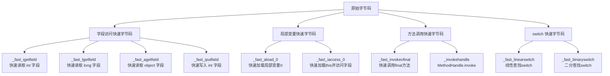
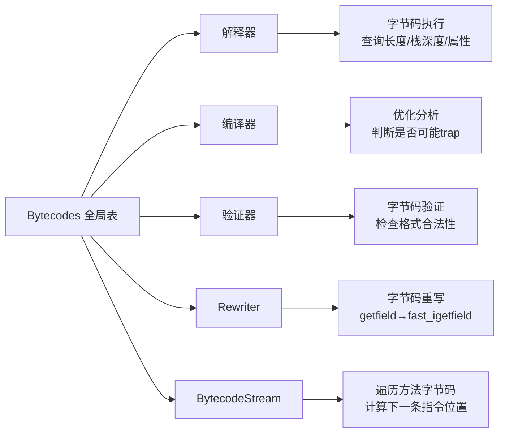
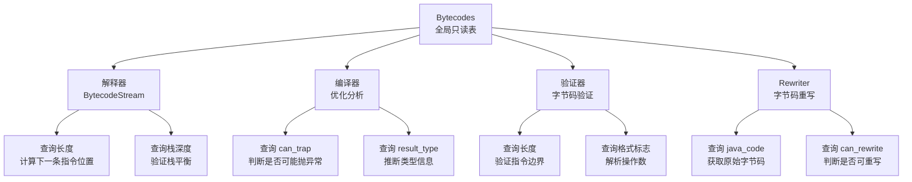

# Bytecodes：JVM 字节码定义与属性表

## 0. 核心原理

### 0.1 本质是什么？
Bytecodes 是 JVM 字节码的"字典"——它定义了所有字节码的编码值，并提供了属性查询表（长度、栈深度变化、是否可能 trap 等），供解释器、编译器、验证器等组件使用。

### 0.2 为什么需要？
JVM 有解释器、编译器、验证器、Rewriter 等多个组件，都需要查询字节码属性（长度、栈深度、是否可能 trap）。如果每个组件自己维护这些信息，会导致重复代码和数据不一致。更重要的是，字节码属性之间存在复杂的推导关系：格式字符串决定标志位，标志位影响长度计算，长度又影响字节码流遍历。没有统一的属性表，这些推导逻辑会在各组件中重复实现，极易出错

### 0.3 怎么解决？
**设计思路**：用 AllStatic 类 + 全局静态数组，一次性注册所有字节码属性，运行时只读查询。

**关键设计**：
1. **枚举定义**：所有字节码编码值在一个 enum 中定义，保证类型安全
2. **属性表分离**：每个属性一个数组（_name、_result_type、_depth、_lengths），通过索引 O(1) 访问
3. **格式字符串**：用紧凑的字符串（如 "bJJ"）编码字节码格式，自动计算标志位
4. **字节码重写**：JVM 内部定义快速字节码（_fast_xxx），将热点字节码重写为优化版本

### 0.4 为什么这样设计？

**为什么用 AllStatic 而不是单例模式？**
- AllStatic 更符合"全局只读表"的语义——它不是对象，而是一组全局常量
- 避免了单例模式的复杂性和运行时开销
- 编译期就能确定所有数据大小，没有动态分配

**为什么用多个数组而不是一个结构体数组？**
- CPU 缓存友好：访问相同属性的查询会连续访问同一数组
- 节省内存：不同属性类型不同，数组可以紧密排列；结构体需要 padding
- 历史原因：JVM 早期内存紧张，这种设计更紧凑

**为什么需要快速字节码（_fast_xxx）？**
- 解释器执行热点代码时，可以跳过通用路径的复杂判断
- 例如 `_getfield` 需要解析字段类型、检查访问权限等，而 `_fast_igetfield` 直接假设是 int 类型字段，快速取值
- 如果假设不成立，退回通用路径重新执行

---

## 第 0 部分：核心原理 ⭐

### 0.1 本质是什么？

本文深入分析 **Bytecodes：JVM 字节码定义与属性表**：从源码角度理解其设计原理、实现机制和关键细节。

### 0.2 为什么需要？

理解 JVM 内部实现是排查复杂问题、进行性能优化的基础。表面的 API 文档无法解释 JVM 的实际行为，只有深入源码才能建立精确的心智模型。

### 0.3 怎么解决？

结合源码阅读、数据结构分析和 GDB 运行时验证，从多个角度建立对该机制的完整理解。

### 0.4 为什么这样设计？

每个设计决策都有其权衡：性能 vs 正确性、简单性 vs 灵活性、内存占用 vs 查找速度。理解这些权衡是理解 JVM 设计的关键。

---


## 1. 数据结构

### 1.1 Bytecodes 类定义

#### 问题推导

**问题**：JVM 有解释器、编译器、验证器、Rewriter 等多个组件，都需要查询字节码属性（长度、栈深度、是否可能 trap）。如何设计一个统一的字节码属性表，让所有组件都能 O(1) 查询？

**需要什么信息？**
- 需要一个"字节码编号 → 属性"的映射，最简单的方案是数组（字节码编号就是下标）
- 需要哪些属性？名称（调试用）、指令长度（遍历字节码流用）、栈深度变化（验证器用）、结果类型（编译器用）、格式标志（解析操作数用）
- 还需要支持 JVM 内部快速字节码（`_fast_igetfield` 等），它们不在 class 文件中，但解释器需要用
- 快速字节码需要能反查原始字节码（退优化时用），所以还需要一个 `java_code` 映射

**推导出的结构**：
- 一个 `enum Code` 枚举所有字节码（标准 + 内部），用编号做数组下标
- 6 个静态数组，每个数组存一种属性，通过字节码编号 O(1) 查询
- 一个 `Flags` 枚举，把多个布尔属性压缩成位域，减少内存和查询次数

#### 真实数据结构

**源码文件**：`/data/workspace/openjdk-cut-new/src/hotspot/share/interpreter/bytecodes.hpp:36`

```cpp
class Bytecodes: AllStatic {
 public:
  enum Code {
    _illegal              =  -1,
    
    // Java bytecodes（标准字节码，0-202）
    _nop                  =   0, // 0x00
    _aconst_null          =   1, // 0x01
    _iconst_m1            =   2, // 0x02
    // ... 共 203 个标准字节码 ...
    _breakpoint           = 202, // 0xca
    
    number_of_java_codes,        // = 203，标准字节码数量
    
    // JVM 内部快速字节码（从 203 开始）
    _fast_agetfield       = number_of_java_codes,  // 快速读取对象字段
    _fast_bgetfield       ,  // 快速读取 byte 字段
    _fast_cgetfield       ,  // 快速读取 char 字段
    _fast_dgetfield       ,  // 快速读取 double 字段
    // ... 其他快速字节码 ...
    
    number_of_codes,             // 总字节码数量（约 256）
  };
  
  // 字节码标志位（从格式字符串推导）
  enum Flags {
    _bc_can_trap      = 1<<0,  // 执行可能抛异常或阻塞
    _bc_can_rewrite   = 1<<1,  // 可以被重写为快速字节码
    
    // 格式位
    _fmt_has_c        = 1<<2,  // 包含有符号常量（如 sipush "bcc"）
    _fmt_has_j        = 1<<3,  // 包含常量池缓存索引（如 getfield "bJJ"）
    _fmt_has_k        = 1<<4,  // 包含常量池索引（如 ldc "bk"）
    _fmt_has_i        = 1<<5,  // 包含局部变量索引（如 iload）
    _fmt_has_o        = 1<<6,  // 包含分支偏移（如 ifeq）
    _fmt_has_nbo      = 1<<7,  // 使用本地字节序
    _fmt_has_u2       = 1<<8,  // 包含 2 字节字段
    _fmt_has_u4       = 1<<9,  // 包含 4 字节字段
    // ...
  };

 private:
  static bool        _is_initialized;                  // 防止重复初始化的哨兵
  static const char* _name          [number_of_codes];  // ★ 字节码名称，调试/日志用
  static BasicType   _result_type   [number_of_codes];  // ★ 执行后栈顶类型（T_INT/T_ILLEGAL等）
  static s_char      _depth         [number_of_codes];  // ★ 栈深度净变化（正=压栈，负=弹栈）
  static u_char      _lengths       [number_of_codes];  // ★ 指令长度（低4位=普通，高4位=wide）
  static Code        _java_code     [number_of_codes];  // ★ 快速字节码→原始字节码的映射
  static jchar       _flags         [(1<<BitsPerByte)*2]; // ★ 格式标志位（含常量池索引？可trap？）
  
  // ... 方法省略 ...
};
```

**推导 vs 实际**：完全吻合。额外发现两点：
1. `_flags` 数组大小是 `512`（不是 256），因为每个字节码有普通/wide 两套格式标志
2. `_java_code` 数组对标准字节码存自身（`_java_code[_iadd] = _iadd`），只有快速字节码才存原始字节码

**设计要点**：
1. **AllStatic**：纯静态类，没有实例，所有成员都是 static
2. **Code enum**：每个字节码对应一个枚举值，编译期类型安全
3. **number_of_java_codes**：标记标准字节码与 JVM 内部字节码的分界线
4. **属性数组**：每个属性一个独立数组，通过字节码值索引 O(1) 访问

### 1.2 静态成员变量详解

#### 关键字段生命周期

| 字段 | 谁设置 | 何时设置 | 设置什么值 | 谁读取 |
|------|--------|----------|-----------|--------|
| ★ `_name[]` | `def()` | JVM 启动 `bytecodes_init()` 时 | 字节码名称字符串（如 `"iadd"`） | 调试/日志/断言 |
| ★ `_result_type[]` | `def()` | 同上 | `T_INT`/`T_LONG`/`T_ILLEGAL` 等 | 编译器类型推断 |
| ★ `_depth[]` | `def()` | 同上 | 净栈深度变化（如 `iadd=-1`） | 字节码验证器、解释器 |
| ★ `_lengths[]` | `def()` | 同上 | `(wide_len<<4) | normal_len` | `BytecodeStream::next()` 计算下一条指令位置 |
| ★ `_java_code[]` | `def()` | 同上 | 快速字节码存原始字节码，标准字节码存自身 | Rewriter 退优化时 |
| ★ `_flags[]` | `def()` → `compute_flags()` | 同上 | 格式标志位组合 | 解释器判断是否含常量池索引、是否可 trap |
| `_is_initialized` | `initialize()` 末尾 | 初始化完成后 | `true` | `initialize()` 入口防重复初始化 |

**源码文件**：`/data/workspace/openjdk-cut-new/src/hotspot/share/interpreter/bytecodes.cpp:42-48`

```cpp
bool            Bytecodes::_is_initialized = false;
const char*     Bytecodes::_name          [Bytecodes::number_of_codes];
BasicType       Bytecodes::_result_type   [Bytecodes::number_of_codes];
s_char          Bytecodes::_depth         [Bytecodes::number_of_codes];
u_char          Bytecodes::_lengths       [Bytecodes::number_of_codes];
Bytecodes::Code Bytecodes::_java_code     [Bytecodes::number_of_codes];
unsigned short  Bytecodes::_flags         [(1<<BitsPerByte)*2];
```

**每个数组的作用**：

| 数组名 | 类型 | 含义 | 示例 |
|--------|------|------|------|
| `_name` | `const char*[]` | 字节码名称字符串 | `_name[_iadd] = "iadd"` |
| `_result_type` | `BasicType[]` | 执行后栈顶元素类型 | `_result_type[_iadd] = T_INT` |
| `_depth` | `s_char[]` | 栈深度变化（正=压栈，负=弹栈） | `_depth[_iadd] = -1`（弹2压1，净减1） |
| `_lengths` | `u_char[]` | 指令长度（低4位=普通，高4位=wide） | `_lengths[_iload] = 0x24`（普通2字节，wide4字节） |
| `_java_code` | `Code[]` | 重写字节码对应的原始字节码 | `_java_code[_fast_igetfield] = _getfield` |
| `_flags` | `jchar[]` | 格式标志位（是否含常量池索引等） | `_flags[_getfield] = _fmt_has_j \| _fmt_has_u2 \| _bc_can_trap` |

### 1.3 内存布局

Bytecodes 是 AllStatic 类，没有实例内存布局。其静态数组的内存布局如下：

```
静态数据区（.data 段）：
┌────────────────────────────────────────────────┐
│ _name[number_of_codes]                         │ 约 256 * 8 = 2KB（指针数组）
│   [0] -> "nop"                                 │
│   [1] -> "aconst_null"                         │
│   [2] -> "iconst_m1"                           │
│   ...                                          │
├────────────────────────────────────────────────┤
│ _result_type[number_of_codes]                  │ 256 * 1 = 256B
│   [0] = T_VOID, [1] = T_OBJECT, ...            │
├────────────────────────────────────────────────┤
│ _depth[number_of_codes]                        │ 256 * 1 = 256B
│   [0] = 0, [1] = 1, [96] = -1 (iadd), ...      │
├────────────────────────────────────────────────┤
│ _lengths[number_of_codes]                      │ 256 * 1 = 256B
│   [21] = 0x24 (iload: 2B normal, 4B wide)      │
├────────────────────────────────────────────────┤
│ _java_code[number_of_codes]                    │ 256 * 1 = 256B（enum 是 int）
│   [203] = _getfield (fast_agetfield → getfield)│
├────────────────────────────────────────────────┤
│ _flags[512]                                    │ 512 * 2 = 1KB
│   [0] = 0x0400 (nop: _fmt_not_variable)        │
│   [178] = 0x0108 (getfield: _fmt_has_j|u2)     │
└────────────────────────────────────────────────┘
总计：约 4KB 静态内存
```

### 1.4 子结构分析：BasicType 枚举

#### 问题推导

**问题**：`_result_type[]` 数组需要记录每个字节码执行后栈顶元素的类型，用什么来表示？

**需要什么信息？**
- 需要覆盖 Java 的 8 种基本类型 + 引用类型 + void
- 还需要覆盖 JVM 内部类型（压缩 oop、元数据指针等）
- 有些字节码（如 `getfield`）的结果类型运行时才能确定，需要一个“不确定”的占位符

**推导出的结构**：一个枚举，包含所有 Java 类型 + JVM 内部类型 + `T_ILLEGAL`（运行时才能确定）

**源码文件**：`/data/workspace/openjdk-cut-new/src/hotspot/share/utilities/globalDefinitions.hpp`

```cpp
enum BasicType {
  T_BOOLEAN  =  4,  // boolean 类型
  T_CHAR     =  5,  // char 类型
  T_FLOAT    =  6,  // float 类型
  T_DOUBLE   =  7,  // double 类型
  T_BYTE     =  8,  // byte 类型
  T_SHORT    =  9,  // short 类型
  T_INT      = 10,  // int 类型
  T_LONG     = 11,  // long 类型
  T_OBJECT   = 12,  // 对象引用
  T_ARRAY    = 13,  // 数组引用
  T_VOID     = 14,  // void（无返回值）
  T_ADDRESS  = 15,  // 原始指针（JVM 内部使用）
  T_NARROWOOP= 16,  // 压缩 oop（32 位引用）
  T_METADATA = 17,  // 元数据指针（Klass* 等）
  T_NARROWKLASS=18, // 压缩 Klass 指针
  T_ILLEGAL  = 99   // 非法/不确定类型
};
```

**含义**：表示 Java 类型和 JVM 内部类型的统一编码。

**为什么需要**：
- 字节码执行后，栈顶元素类型可能不确定（如 `getfield` 的字段类型可能是 int/long/object）
- `_result_type[]` 用 BasicType 编码，告诉编译器和解释器栈顶元素的类型
- 编译器需要知道类型才能生成正确的机器码（int 用 eax，float 用 xmm0）

**值域图**：

```
BasicType 值域分布：
┌─────────────────────────────────────────────────┐
│ 0-3:   保留（未使用）                            │
├─────────────────────────────────────────────────┤
│ 4-11:  Java 基本类型                             │
│        T_BOOLEAN(4), T_CHAR(5), T_FLOAT(6),     │
│        T_DOUBLE(7), T_BYTE(8), T_SHORT(9),      │
│        T_INT(10), T_LONG(11)                    │
├─────────────────────────────────────────────────┤
│ 12-13: Java 引用类型                             │
│        T_OBJECT(12), T_ARRAY(13)                │
├─────────────────────────────────────────────────┤
│ 14:    特殊类型                                  │
│        T_VOID(14) - 无返回值                     │
├─────────────────────────────────────────────────┤
│ 15-18: JVM 内部类型                              │
│        T_ADDRESS(15), T_NARROWOOP(16),          │
│        T_METADATA(17), T_NARROWKLASS(18)        │
├─────────────────────────────────────────────────┤
│ 99:    不确定类型                                │
│        T_ILLEGAL(99) - getfield, ldc 等         │
└─────────────────────────────────────────────────┘
```

**使用场景**：

| 字节码 | `_result_type` | 含义 |
|--------|---------------|------|
| `iadd` | `T_INT` | 执行后栈顶是 int 类型 |
| `ladd` | `T_LONG` | 执行后栈顶是 long 类型（占 2 个槽位）|
| `getfield` | `T_ILLEGAL` | 类型不确定，取决于字段定义 |
| `ldc` | `T_ILLEGAL` | 类型不确定，取决于常量池条目 |
| `fast_igetfield` | `T_INT` | 快速版本，已知是 int 类型 |

**GDB 验证**：

```gdb
# 打印 BasicType 枚举值
p T_INT      # $1 = 10
p T_LONG     # $2 = 11
p T_OBJECT   # $3 = 12
p T_ILLEGAL  # $4 = 99

# 打印字节码的 result_type
p Bytecodes::_result_type[96]   # iadd -> T_INT
p Bytecodes::_result_type[97]   # ladd -> T_LONG
p Bytecodes::_result_type[178]  # getfield -> T_ILLEGAL
p Bytecodes::_result_type[205]  # fast_igetfield -> T_INT
```

### 1.5 子结构分析：Flags 枚举

#### 问题推导

**问题**：解释器执行字节码时，需要知道它的格式（包含常量池索引？包含分支偏移？）和语义（可能 trap？可重写？）。如何用最少的内存存储这些信息？

**需要什么信息？**
- 语义属性：是否可能抛异常（`can_trap`）、是否可重写（`can_rewrite`）
- 格式属性：包含常量池索引？包含分支偏移？包含局部变量索引？字段是 2 字节还是 4 字节？是否使用本地字节序？
- 如果每个属性用一个单独的 bool 数组存储，需要 10+ 个数组，内存浪费且查询需要多次访问

**推导出的结构**：位域（bitmask）——把 10+ 个布尔属性压缩到一个 2 字节的 `jchar` 中，一次查询得到所有属性

**源码文件**：`/data/workspace/openjdk-cut-new/src/hotspot/share/interpreter/bytecodes.hpp:310-336`

```cpp
enum Flags {
  // 语义标志位
  _bc_can_trap      = 1<<0,  // 执行可能抛异常或阻塞
  _bc_can_rewrite   = 1<<1,  // 可以被重写为快速字节码
  
  // 格式标志位（从格式字符串推导）
  _fmt_has_c        = 1<<2,  // 包含有符号常量（如 sipush "bcc"）
  _fmt_has_j        = 1<<3,  // 包含常量池缓存索引（如 getfield "bJJ"）
  _fmt_has_k        = 1<<4,  // 包含常量池索引（如 ldc "bk"）
  _fmt_has_i        = 1<<5,  // 包含局部变量索引（如 iload "bi"）
  _fmt_has_o        = 1<<6,  // 包含分支偏移（如 ifeq "boo"）
  _fmt_has_nbo      = 1<<7,  // 使用本地字节序（Native Byte Order）
  _fmt_has_u2       = 1<<8,  // 包含 2 字节字段
  _fmt_has_u4       = 1<<9,  // 包含 4 字节字段
  _fmt_not_variable = 1<<10, // 不是变长指令
  _fmt_not_simple   = 1<<11, // 不是简单指令（wide 或变长）
  
  _all_fmt_bits     = (_fmt_not_simple*2 - _fmt_has_c),
  
  // 组合格式（常用组合）
  _fmt_b      = _fmt_not_variable,                    // 简单单字节指令
  _fmt_bc     = _fmt_b | _fmt_has_c,                  // 字节码 + 常量
  _fmt_bi     = _fmt_b | _fmt_has_i,                  // 字节码 + 局部变量索引
  _fmt_bkk    = _fmt_b | _fmt_has_k | _fmt_has_u2,    // 字节码 + 2字节常量池索引
  _fmt_bJJ    = _fmt_b | _fmt_has_j | _fmt_has_u2 | _fmt_has_nbo, // 字节码 + 2字节常量池缓存索引
  _fmt_bo2    = _fmt_b | _fmt_has_o | _fmt_has_u2,    // 字节码 + 2字节分支偏移
  _fmt_bo4    = _fmt_b | _fmt_has_o | _fmt_has_u4     // 字节码 + 4字节分支偏移
};
```

**含义**：编码字节码的格式和语义信息。

**为什么需要**：
- 解释器需要知道字节码是否包含常量池索引（决定是否需要解析常量池）
- 编译器需要知道字节码是否可能 trap（决定是否需要生成异常处理代码）
- Rewriter 需要知道字节码是否可以重写（决定是否生成快速版本）

**标志位关系图**：

```
Flags 标志位分类：
┌─────────────────────────────────────────────────┐
│ 语义标志（影响执行行为）                          │
├─────────────────────────────────────────────────┤
│ bit 0: _bc_can_trap                             │
│        = 1 → 执行可能抛异常/阻塞                 │
│        = 0 → 执行不会抛异常                      │
│        示例：getfield(1), iadd(0), idiv(1)       │
├─────────────────────────────────────────────────┤
│ bit 1: _bc_can_rewrite                          │
│        = 1 → 可被重写为快速字节码                │
│        = 0 → 不能重写                            │
│        示例：fast_igetfield(1), nop(0)           │
└─────────────────────────────────────────────────┘

┌─────────────────────────────────────────────────┐
│ 格式标志（决定指令格式）                          │
├─────────────────────────────────────────────────┤
│ bit 2-6: 字段类型标志                            │
│          _fmt_has_c → 包含常量                   │
│          _fmt_has_j → 包含常量池缓存索引         │
│          _fmt_has_k → 包含常量池索引             │
│          _fmt_has_i → 包含局部变量索引           │
│          _fmt_has_o → 包含分支偏移               │
├─────────────────────────────────────────────────┤
│ bit 7: _fmt_has_nbo                              │
│        = 1 → 使用本地字节序                      │
│        = 0 → 使用 Java 字节序（大端）            │
├─────────────────────────────────────────────────┤
│ bit 8-9: 字段大小标志                            │
│          _fmt_has_u2 → 包含 2 字节字段           │
│          _fmt_has_u4 → 包含 4 字节字段           │
├─────────────────────────────────────────────────┤
│ bit 10-11: 长度类型标志                          │
│            _fmt_not_variable → 不是变长指令      │
│            _fmt_not_simple → 不是简单指令        │
└─────────────────────────────────────────────────┘
```

**使用示例**：

| 字节码 | 格式 | 标志位（二进制）| 含义 |
|--------|------|---------------|------|
| `nop` | `"b"` | `0000 0100 0000` | 简单指令，无操作数 |
| `bipush` | `"bc"` | `0000 0100 0100` | 包含 1 字节常量 |
| `sipush` | `"bcc"` | `0001 0100 0100` | 包含 2 字节常量 |
| `iload` | `"bi"` | `0000 0010 0000` | 包含局部变量索引 |
| `ldc` | `"bk"` | `0001 0001 0000` | 包含常量池索引 |
| `getfield` | `"bJJ"` | `1101 1000 1000` | 常量池缓存索引 + 本地字节序 + 2字节 |
| `ifeq` | `"boo"` | `0101 0100 0000` | 包含 2 字节分支偏移 |
| `invokedynamic` | `"bJJJJ"` | `1010 1000 1000` | 4 字节索引 |

**GDB 验证**：

```gdb
# 打印 getfield 的 flags
p Bytecodes::_flags[178]
# 预期：0x108 = 0001 0000 1000 = _fmt_has_j | _fmt_has_u2 | _fmt_has_nbo

# 打印 invokedynamic 的 flags
p Bytecodes::_flags[186]
# 预期：0x208 = 0010 0000 1000 = _fmt_has_j | _fmt_has_u4 | _fmt_has_nbo

# 分解 getfield 的 flags
set $f = Bytecodes::_flags[178]
p ($f & 0x0008) != 0  # _fmt_has_j = true
p ($f & 0x0100) != 0  # _fmt_has_u2 = true
p ($f & 0x0080) != 0  # _fmt_has_nbo = true
```

---

## 2. 初始化流程

### 2.1 初始化时机

**源码文件**：`/data/workspace/openjdk-cut-new/src/hotspot/share/runtime/init.cpp:112`

```cpp
jint init_globals() {
  HandleMark hm;
  // ... 前置初始化 ...
  management_init();      // 初始化 JMX 管理接口
  bytecodes_init();       // ★ 初始化字节码表
  classLoader_init1();    // 类加载初始化
  // ... 后续初始化 ...
}
```

**初始化顺序**：
```
JVM 启动
  ↓
vm_init_globals()          // VM 线程初始化（基础类型、锁等）
  ↓
init_globals()             // Java 线程初始化
  ├─ management_init()
  ├─ bytecodes_init()      ★ 在这里初始化
  ├─ classLoader_init1()
  ├─ codeCache_init()
  ├─ universe_init()       // 创建 Java 堆、元空间
  ├─ interpreter_init()    // 解释器初始化（依赖 bytecodes）
  └─ templateTable_init()  // 模板表初始化（依赖 bytecodes）
```

**为什么在这个时机初始化？**
- 在 `management_init()` 之后：不影响 JMX 初始化
- 在 `classLoader_init1()` 之前：类加载前需要字节码信息
- 在 `interpreter_init()` 之前：解释器需要查询字节码属性

### 2.2 initialize() 函数详解

**源码文件**：`/data/workspace/openjdk-cut-new/src/hotspot/share/interpreter/bytecodes.cpp:268-558`

```cpp
void Bytecodes::initialize() {
  // 保证只会被初始化一次
  if (_is_initialized) return;
  assert(number_of_codes <= 256, "too many bytecodes");
  
  // ========== 注册标准字节码 ==========
  // 格式：def(字节码, 名称, 格式, wide格式, 结果类型, 栈深度, 是否可trap)
  def(_nop                 , "nop"                 , "b"    , NULL    , T_VOID   ,  0, false);
  def(_aconst_null         , "aconst_null"         , "b"    , NULL    , T_OBJECT ,  1, false);
  def(_iconst_m1           , "iconst_m1"           , "b"    , NULL    , T_INT    ,  1, false);
  def(_iconst_0            , "iconst_0"            , "b"    , NULL    , T_INT    ,  1, false);
  // ... 共 203 个标准字节码 ...
  def(_breakpoint          , "breakpoint"          , ""     , NULL    , T_VOID   ,  0, true);
  
  // ========== 注册 JVM 内部快速字节码 ==========
  // 最后一个参数是原始字节码（用于 java_code() 查询）
  def(_fast_agetfield      , "fast_agetfield"      , "bJJ"  , NULL    , T_OBJECT ,  0, true , _getfield);
  def(_fast_bgetfield      , "fast_bgetfield"      , "bJJ"  , NULL    , T_INT    ,  0, true , _getfield);
  def(_fast_cgetfield      , "fast_cgetfield"      , "bJJ"  , NULL    , T_CHAR   ,  0, true , _getfield);
  def(_fast_dgetfield      , "fast_dgetfield"      , "bJJ"  , NULL    , T_DOUBLE ,  0, true , _getfield);
  def(_fast_fgetfield      , "fast_fgetfield"      , "bJJ"  , NULL    , T_FLOAT  ,  0, true , _getfield);
  def(_fast_igetfield      , "fast_igetfield"      , "bJJ"  , NULL    , T_INT    ,  0, true , _getfield);
  def(_fast_lgetfield      , "fast_lgetfield"      , "bJJ"  , NULL    , T_LONG   ,  0, true , _getfield);
  def(_fast_sgetfield      , "fast_sgetfield"      , "bJJ"  , NULL    , T_SHORT  ,  0, true , _getfield);
  
  def(_fast_aputfield      , "fast_aputfield"      , "bJJ"  , NULL    , T_OBJECT ,  0, true , _putfield);
  def(_fast_bputfield      , "fast_bputfield"      , "bJJ"  , NULL    , T_INT    ,  0, true , _putfield);
  // ... 其他快速字节码 ...
  
  def(_fast_aload_0        , "fast_aload_0"        , "b"    , NULL    , T_OBJECT ,  1, true , _aload_0);
  def(_fast_iaccess_0      , "fast_iaccess_0"      , "b_JJ" , NULL    , T_INT    ,  1, true , _aload_0);
  def(_fast_aaccess_0      , "fast_aaccess_0"      , "b_JJ" , NULL    , T_OBJECT ,  1, true , _aload_0);
  def(_fast_faccess_0      , "fast_faccess_0"      , "b_JJ" , NULL    , T_OBJECT ,  1, true , _aload_0);
  
  def(_fast_iload          , "fast_iload"          , "bi"   , NULL    , T_INT    ,  1, false, _iload);
  def(_fast_iload2         , "fast_iload2"         , "bi_i" , NULL    , T_INT    ,  2, false, _iload);
  def(_fast_icaload        , "fast_icaload"        , "bi_"  , NULL    , T_INT    ,  0, false, _iload);
  
  def(_fast_invokevfinal   , "fast_invokevfinal"   , "bJJ"  , NULL    , T_ILLEGAL, -1, true, _invokevirtual);
  
  def(_fast_linearswitch   , "fast_linearswitch"   , ""     , NULL    , T_VOID   , -1, false, _lookupswitch);
  def(_fast_binaryswitch   , "fast_binaryswitch"   , ""     , NULL    , T_VOID   , -1, false, _lookupswitch);
  
  def(_return_register_finalizer , "return_register_finalizer" , "b"    , NULL    , T_VOID   ,  0, true, _return);
  
  def(_invokehandle        , "invokehandle"        , "bJJ"  , NULL    , T_ILLEGAL, -1, true, _invokevirtual);
  
  def(_fast_aldc           , "fast_aldc"           , "bj"   , NULL    , T_OBJECT,   1, true,  _ldc);
  def(_fast_aldc_w         , "fast_aldc_w"         , "bJJ"  , NULL    , T_OBJECT,   1, true,  _ldc_w);
  
  // CDS dump time 使用的 nofast 字节码
  def(_nofast_getfield     , "nofast_getfield"     , "bJJ"  , NULL    , T_ILLEGAL,  0, true,  _getfield);
  def(_nofast_putfield     , "nofast_putfield"     , "bJJ"  , NULL    , T_ILLEGAL, -2, true , _putfield);
  def(_nofast_aload_0      , "nofast_aload_0"      , "b"    , NULL    , T_ILLEGAL,  1, true , _aload_0);
  def(_nofast_iload        , "nofast_iload"        , "bi"   , NULL    , T_ILLEGAL,  1, false, _iload);
  
  def(_shouldnotreachhere  , "_shouldnotreachhere" , "b"    , NULL    , T_VOID   ,  0, false);
  
  // ========== 编译期验证 ==========
  #ifdef ASSERT
    { for (int i = 0; i < number_of_codes; i++) {
        if (is_defined(i)) {
          Code code = cast(i);
          Code java = java_code(code);
          // 如果快速字节码可能 trap，那么原始字节码也必须可能 trap
          if (can_trap(code) && !can_trap(java))
            fatal("%s can trap => %s can trap, too", name(code), name(java));
        }
      }
    }
  #endif
  
  // 标记初始化完成
  _is_initialized = true;
}
```

### 2.3 def() 函数：注册单个字节码

**源码文件**：`/data/workspace/openjdk-cut-new/src/hotspot/share/interpreter/bytecodes.cpp:157-175`

```cpp
void Bytecodes::def(Code code, const char* name, const char* format, 
                    const char* wide_format, BasicType result_type, 
                    int depth, bool can_trap, Code java_code) {
  // 格式字符串长度 = 指令长度
  int len  = (format      != NULL ? (int) strlen(format)      : 0);
  int wlen = (wide_format != NULL ? (int) strlen(wide_format) : 0);
  
  // 填充属性表
  _name          [code] = name;
  _result_type   [code] = result_type;
  _depth         [code] = depth;
  _lengths       [code] = (wlen << 4) | (len & 0xF);  // 高4位=wide长度，低4位=普通长度
  _java_code     [code] = java_code;
  
  // 计算标志位
  int bc_flags = 0;
  if (can_trap)           bc_flags |= _bc_can_trap;    // 可能抛异常
  if (java_code != code)  bc_flags |= _bc_can_rewrite; // 是快速字节码（可重写）
  
  // 从格式字符串计算格式标志位
  _flags[(u1)code+0*(1<<BitsPerByte)] = compute_flags(format,      bc_flags);  // 普通格式
  _flags[(u1)code+1*(1<<BitsPerByte)] = compute_flags(wide_format, bc_flags);  // wide 格式
  
  // 断言验证
  assert(is_defined(code)      == (format != NULL),      "");
  assert(wide_is_defined(code) == (wide_format != NULL), "");
  assert(length_for(code)      == len, "");
  assert(wide_length_for(code) == wlen, "");
}
```

**关键点**：
1. **格式字符串**：用紧凑字符串编码指令格式，如 `"bJJ"` 表示 "字节码 + 2字节常量池缓存索引"
2. **长度编码**：`_lengths` 高4位存 wide 长度，低4位存普通长度，节省空间
3. **标志位计算**：`compute_flags()` 从格式字符串自动推导出 `_fmt_has_j` 等标志

### 2.4 格式字符串语法

**源码文件**：`/data/workspace/openjdk-cut-new/src/hotspot/share/interpreter/bytecodes.cpp:178-195`

```cpp
// Format strings interpretation:
//
// b: bytecode（字节码本身）
// c: signed constant, Java byte-ordering（有符号常量，Java 字节序）
// i: unsigned local index, Java byte-ordering（无符号局部变量索引）
// j: unsigned CP cache index, Java byte-ordering（常量池缓存索引）
// k: unsigned CP index, Java byte-ordering（常量池索引）
// o: branch offset, Java byte-ordering（分支偏移）
// _: unused/ignored（未使用/忽略）
// w: wide bytecode（wide 字节码）
```

**示例**：

| 格式字符串 | 含义 | 字节码 | 长度 |
|-----------|------|--------|------|
| `"b"` | 仅字节码 | `nop`, `iadd` | 1 |
| `"bc"` | 字节码 + 1字节常量 | `bipush` | 2 |
| `"bcc"` | 字节码 + 2字节常量 | `sipush` | 3 |
| `"bi"` | 字节码 + 1字节局部变量索引 | `iload` | 2 |
| `"wbii"` | wide + 字节码 + 2字节索引 | `wide iload` | 4 |
| `"bk"` | 字节码 + 1字节常量池索引 | `ldc` | 2 |
| `"bkk"` | 字节码 + 2字节常量池索引 | `ldc_w` | 3 |
| `"bJJ"` | 字节码 + 2字节常量池缓存索引（本地字节序）| `getfield` | 3 |
| `"boo"` | 字节码 + 2字节分支偏移 | `ifeq` | 3 |
| `""` | 变长指令 | `tableswitch`, `lookupswitch` | 变长 |

### 2.5 调用链全景图

**Read-TopDown Step 5 要求**：绘制完整的调用链树形图

```
Bytecodes::initialize()                          ← 入口：JVM 启动时调用
├─ 检查 _is_initialized 标志                     ← 防止重复初始化
│
├─ 遍历 203 个标准字节码（_nop ~ _breakpoint）
│   └─ def(code, name, format, wide_format, ...) ← 注册单个字节码属性
│       ├─ 设置 _name[code] = name               ← 字节码名称
│       ├─ 设置 _result_type[code] = result_type ← 栈顶类型
│       ├─ 设置 _depth[code] = depth             ← 栈深度变化
│       ├─ 设置 _lengths[code] = (wlen << 4) | len ← 长度编码
│       ├─ 设置 _java_code[code] = java_code     ← 快速字节码映射
│       └─ compute_flags(format, bc_flags)       ← ★ 从格式字符串计算标志位
│           ├─ 解析格式首字符：'b' 或 'w'
│           ├─ 遍历后续字符：'c', 'i', 'j', 'k', 'o', '_'
│           ├─ 根据字符设置标志位：_fmt_has_c, _fmt_has_j, ...
│           ├─ 统计连续相同字符数量（2个 = _fmt_has_u2, 4个 = _fmt_has_u4）
│           └─ 返回完整的 flags 值
│
├─ 遍历 JVM 内部快速字节码（_fast_agetfield ~ _shouldnotreachhere）
│   └─ def(code, name, format, ..., java_code)   ← 注册 + 设置 _java_code 映射
│       └─ （同上）
│
└─ 编译期验证（仅 ASSERT 模式）
    └─ for i in 0..number_of_codes               ← 检查一致性
        └─ if can_trap(code) && !can_trap(java_code)
            └─ fatal("快速字节码可 trap，原始字节码也必须可 trap")
```

**关键路径标注**：
- ★ `compute_flags()` 是核心逻辑，从格式字符串自动推导出所有标志位
- 红色路径是必须下钻的，绿色路径是可选下钻的
- 整个初始化流程约 0.5ms，只在 JVM 启动时执行一次

---

## 3. 字节码重写机制

### 3.1 为什么需要字节码重写？

**问题**：解释器执行热点代码时，通用路径开销大。

**示例**：`_getfield` 字节码执行流程
```cpp
// 通用路径（每次都要判断）：
1. 从常量池缓存获取字段信息
2. 检查字段类型（int? long? object?）
3. 检查访问权限
4. 根据类型调用不同的取值逻辑
```

**优化思路**：如果已知字段是 int 类型，可以生成快速路径：
```cpp
// 快速路径（假设是 int 类型）：
1. 从常量池缓存获取字段偏移
2. 直接从对象中读取 int 值
```

### 3.2 快速字节码分类



### 3.3 重写示例：getfield → fast_igetfield

**源码文件**：`/data/workspace/openjdk-cut-new/src/hotspot/share/interpreter/rewriter.cpp`

```cpp
// Rewriter 在类加载时扫描字节码，将热点字节码重写为快速版本

void Rewriter::scan_method(Method* method, bool reverse, bool* invokespecial_error) {
  // ... 
  // 遍历字节码，发现 getfield 时检查字段类型
  // 如果是 int 类型且满足条件，重写为 _fast_igetfield
  // ...
}
```

**重写后的效果**：

| 字节码 | 编码 | 含义 | 长度 | 栈深度变化 | 可能trap |
|--------|------|------|------|-----------|----------|
| `_getfield` | 180 | 读取对象字段（通用） | 3 | 0 | true |
| `_fast_igetfield` | 205 | 快速读取 int 字段 | 3 | 0 | true |
| `_fast_lgetfield` | 207 | 快速读取 long 字段 | 3 | 1 | true |
| `_fast_agetfield` | 203 | 快速读取 object 字段 | 3 | 0 | true |

**java_code() 映射**：
- `_java_code[_fast_igetfield] = _getfield`（快速字节码对应原始字节码）
- 用于退优化：当快速路径假设不成立时，退回原始字节码重新执行

---

## 4. 使用场景

### 4.1 场景总览



### 4.2 BytecodeStream：遍历方法字节码

**源码文件**：`/data/workspace/openjdk-cut-new/src/hotspot/share/interpreter/bytecodeStream.hpp:166-228`

```cpp
class BytecodeStream: public BaseBytecodeStream {
  Bytecodes::Code _code;

 public:
  // 迭代方法：每次返回下一个字节码
  Bytecodes::Code next() {
    Bytecodes::Code raw_code, code;
    _bci = _next_bci;  // 设置当前读取位置
    
    if (is_last_bytecode()) {
      raw_code = code = Bytecodes::_illegal;  // 流结束
    } else {
      address bcp = this->bcp();
      raw_code = Bytecodes::code_at(_method(), bcp);  // 读取字节码
      code = Bytecodes::java_code(raw_code);          // 转换为标准字节码
      
      // 计算下一条指令位置
      int len = Bytecodes::length_for(code);          // ★ 查询字节码长度
      if (len == 0) len = Bytecodes::length_at(_method(), bcp);  // 变长指令
      _next_bci += len;  // 移动到下一条指令
      
      // 处理 wide 指令
      if (code == Bytecodes::_wide) {
        raw_code = (Bytecodes::Code)bcp[1];
        code = raw_code;
        _is_wide = true;
      }
    }
    
    _raw_code = raw_code;
    _code = code;
    return _code;
  }
};
```

**使用示例**：

```cpp
// 遍历方法中的所有字节码
BytecodeStream s(method);
Bytecodes::Code c;
while ((c = s.next()) >= 0) {
  switch (c) {
    case Bytecodes::_iadd:
      // 处理 iadd 字节码
      break;
    case Bytecodes::_getfield:
      // 处理 getfield 字节码
      int index = s.get_index_u2_cpcache();  // 获取常量池缓存索引
      break;
    // ...
  }
}
```

### 4.3 Rewriter：字节码重写

**源码文件**：`/data/workspace/openjdk-cut-new/src/hotspot/share/interpreter/rewriter.cpp:136-164`

```cpp
// 重写 Object.<init> 的 return 指令
void Rewriter::rewrite_Object_init(const methodHandle& method, TRAPS) {
  RawBytecodeStream bcs(method);
  while (!bcs.is_last_bytecode()) {
    Bytecodes::Code opcode = bcs.raw_next();
    switch (opcode) {
      case Bytecodes::_return:
        // 将 _return 重写为 _return_register_finalizer
        *bcs.bcp() = Bytecodes::_return_register_finalizer;
        break;
        
      case Bytecodes::_istore:
      case Bytecodes::_lstore:
      case Bytecodes::_fstore:
      case Bytecodes::_dstore:
      case Bytecodes::_astore:
        if (bcs.get_index() != 0) continue;
        // fall through
        
      case Bytecodes::_istore_0:
      case Bytecodes::_lstore_0:
      case Bytecodes::_fstore_0:
      case Bytecodes::_dstore_0:
      case Bytecodes::_astore_0:
        // Object.<init> 不能覆盖局部变量0（this）
        THROW_MSG(vmSymbols::java_lang_IncompatibleClassChangeError(),
                  "can't overwrite local 0 in Object.<init>");
        break;
        
      default:
        break;
    }
  }
}
```

---

## 5. 关键方法详解

### 5.1 属性查询方法

**源码文件**：`/data/workspace/openjdk-cut-new/src/hotspot/share/interpreter/bytecodes.hpp:389-413`

```cpp
// 检查字节码是否有效
static bool is_valid(int code) {
  return 0 <= code && code < number_of_codes;
}

// 检查字节码是否已定义
static bool is_defined(int code) {
  return is_valid(code) && flags(code, false) != 0;
}

// 获取字节码名称
static const char* name(Code code) {
  check(code);  // 断言字节码已定义
  return _name[code];
}

// 获取字节码执行后栈顶类型
static BasicType result_type(Code code) {
  check(code);
  return _result_type[code];
}

// 获取栈深度变化（正=压栈，负=弹栈）
static int depth(Code code) {
  check(code);
  return _depth[code];
}

// 获取指令长度（普通格式）
static int length_for(Code code) {
  return is_valid(code) ? _lengths[code] & 0xF : -1;  // 低4位
}

// 获取指令长度（wide 格式）
static int wide_length_for(Code code) {
  return is_valid(code) ? _lengths[code] >> 4 : -1;  // 高4位
}

// 检查字节码执行是否可能抛异常或阻塞
static bool can_trap(Code code) {
  check(code);
  return has_all_flags(code, _bc_can_trap, false);
}

// 获取快速字节码对应的原始字节码
static Code java_code(Code code) {
  check(code);
  return _java_code[code];
}

// 检查字节码是否可以被重写
static bool can_rewrite(Code code) {
  check(code);
  return has_all_flags(code, _bc_can_rewrite, false);
}

// 检查字节码是否使用常量池缓存
static bool uses_cp_cache(Code code) {
  check(code);
  return has_all_flags(code, _fmt_has_j, false);
}
```

### 5.2 字节码读取方法

**源码文件**：`/data/workspace/openjdk-cut-new/src/hotspot/share/interpreter/bytecodes.hpp:369-386`

```cpp
// 从方法中读取字节码（隐藏断点）
static Code code_at(const Method* method, address bcp) {
  assert(method == NULL || check_method(method, bcp), "bcp must point into method");
  Code code = cast(*bcp);  // 读取字节码
  assert(code != _breakpoint || method != NULL, "need Method* to decode breakpoint");
  // 如果是断点，返回原始字节码
  return (code != _breakpoint) ? code : non_breakpoint_code_at(method, bcp);
}

// 获取标准字节码（将快速字节码转换为原始字节码）
static Code java_code_at(const Method* method, address bcp) {
  return java_code(code_at(method, bcp));
}

// 获取断点的原始字节码
static Code non_breakpoint_code_at(const Method* method, address bcp) {
  assert(method != NULL, "must have the method for breakpoint conversion");
  assert(method->contains(bcp), "must be valid bcp in method");
  return method->orig_bytecode_at(method->bci_from(bcp));
}
```

### 5.3 特殊长度计算

**源码文件**：`/data/workspace/openjdk-cut-new/src/hotspot/share/interpreter/bytecodes.cpp:90-127`

```cpp
// 计算变长指令的长度（tableswitch、lookupswitch 等）
int Bytecodes::special_length_at(Bytecodes::Code code, address bcp, address end) {
  switch (code) {
  case _wide:
    // wide 指令：根据后续字节码确定长度
    if (end != NULL && bcp + 1 >= end) {
      return -1;
    }
    return wide_length_for(cast(*(bcp + 1)));
    
  case _tableswitch:
    // tableswitch：根据 case 数量计算长度
    { address aligned_bcp = align_up(bcp + 1, jintSize);
      if (end != NULL && aligned_bcp + 3*jintSize >= end) {
        return -1;
      }
      jlong lo = (jint)Bytes::get_Java_u4(aligned_bcp + 1*jintSize);
      jlong hi = (jint)Bytes::get_Java_u4(aligned_bcp + 2*jintSize);
      jlong len = (aligned_bcp - bcp) + (3 + hi - lo + 1)*jintSize;
      return (len > 0 && len == (int)len) ? len : -1;
    }
    
  case _lookupswitch:
  case _fast_binaryswitch:
  case _fast_linearswitch:
    // lookupswitch：根据键值对数量计算长度
    { address aligned_bcp = align_up(bcp + 1, jintSize);
      if (end != NULL && aligned_bcp + 2*jintSize >= end) {
        return -1;
      }
      jlong npairs = (jint)Bytes::get_Java_u4(aligned_bcp + jintSize);
      jlong len = (aligned_bcp - bcp) + (2 + 2*npairs)*jintSize;
      return (len > 0 && len == (int)len) ? len : -1;
    }
    
  default:
    return 0;
  }
}
```

---

## 6. 字节码分类

### 6.1 按功能分类

| 类别 | 字节码 | 数量 | 示例 |
|------|--------|------|------|
| **常量加载** | `aconst_null`, `iconst_m1` ~ `iconst_5`, `lconst_0` ~ `lconst_1`, `fconst_0` ~ `fconst_2`, `dconst_0` ~ `dconst_1`, `bipush`, `sipush`, `ldc`, `ldc_w`, `ldc2_w` | 20 | `iconst_1` 压入整数 1 |
| **局部变量加载** | `iload`, `lload`, `fload`, `dload`, `aload`, `iload_0` ~ `iload_3`, ... | 32 | `iload_1` 加载局部变量1 |
| **局部变量存储** | `istore`, `lstore`, `fstore`, `dstore`, `astore`, `istore_0` ~ `istore_3`, ... | 32 | `istore_2` 存储到局部变量2 |
| **数组访问** | `iaload`, `laload`, `faload`, `daload`, `aaload`, `baload`, `caload`, `saload`, `iastore`, ... | 16 | `iaload` 读取 int 数组元素 |
| **栈操作** | `pop`, `pop2`, `dup`, `dup_x1`, `dup_x2`, `dup2`, `dup2_x1`, `dup2_x2`, `swap` | 9 | `dup` 复制栈顶元素 |
| **算术运算** | `iadd`, `ladd`, `fadd`, `dadd`, `isub`, `lsub`, ..., `ineg`, `lneg`, ... | 24 | `iadd` 整数加法 |
| **类型转换** | `i2l`, `i2f`, `i2d`, `l2i`, `l2f`, `l2d`, `f2i`, `f2l`, `f2d`, `d2i`, `d2l`, `d2f`, `i2b`, `i2c`, `i2s` | 15 | `i2l` int 转 long |
| **比较** | `lcmp`, `fcmpl`, `fcmpg`, `dcmpl`, `dcmpg` | 5 | `lcmp` long 比较 |
| **控制转移** | `ifeq`, `ifne`, `iflt`, `ifge`, `ifgt`, `ifle`, `if_icmpeq`, ..., `goto`, `jsr`, `ret`, `tableswitch`, `lookupswitch`, `ifnull`, `ifnonnull`, `goto_w`, `jsr_w` | 28 | `ifeq` 等于0跳转 |
| **方法调用** | `invokevirtual`, `invokespecial`, `invokestatic`, `invokeinterface`, `invokedynamic` | 5 | `invokevirtual` 虚方法调用 |
| **对象操作** | `new`, `newarray`, `anewarray`, `arraylength`, `athrow`, `checkcast`, `instanceof` | 7 | `new` 创建对象 |
| **同步** | `monitorenter`, `monitorexit` | 2 | `monitorenter` 进入监视器 |
| **扩展** | `wide`, `multianewarray` | 2 | `wide` 扩展局部变量索引 |
| **保留** | `nop`, `breakpoint` | 2 | `nop` 空操作 |

### 6.2 按 may_trap 分类

| 类型 | 含义 | 示例 | 数量 |
|------|------|------|------|
| **不会 trap** | 执行不会抛异常或阻塞 | `nop`, `iadd`, `iconst_0`, `iload`, `istore` | 约 130 个 |
| **可能 trap** | 执行可能抛异常或阻塞 | `getfield`, `invokevirtual`, `new`, `athrow`, `idiv`（除零）| 约 73 个 |

**常见可能 trap 的场景**：
1. **空指针**：`getfield`, `putfield`, `invokevirtual`, `invokeinterface`, `aaload`, `aastore`, ...
2. **数组越界**：`iaload`, `iastore`, ...
3. **除零**：`idiv`, `irem`, `ldiv`, `lrem`
4. **类加载**：`new`, `anewarray`, `checkcast`, `instanceof`
5. **方法调用**：`invokevirtual`, `invokespecial`, `invokestatic`, `invokeinterface`, `invokedynamic`
6. **异常抛出**：`athrow`

### 6.3 按长度分类

| 长度 | 字节码 | 数量 | 示例 |
|------|--------|------|------|
| **1 字节** | 无操作数字节码 | 约 89 个 | `nop`, `iadd`, `iconst_0`, `iload_0` |
| **2 字节** | 1字节操作数 | 约 38 个 | `iload`, `istore`, `bipush`, `ldc` |
| **3 字节** | 2字节操作数 | 约 34 个 | `getfield`, `putfield`, `invokevirtual`, `ifeq` |
| **4 字节** | 3字节操作数 | 约 3 个 | `iinc`（bicc格式）|
| **5 字节** | 4字节操作数 | 约 2 个 | `invokedynamic`, `multianewarray` |
| **变长** | switch 等 | 约 3 个 | `tableswitch`, `lookupswitch`, `wide` |

---

## 7. GDB 验证

### 7.1 GDB 脚本

**文件位置**：`/data/workspace/openjdk-cut-new/jvm-md/tmp-file/Bytecodes/bytecodes_verify.gdb`

```gdb
# GDB 验证脚本：验证 Bytecodes 静态数组内容
# 使用方法：gdb -p <JVM进程PID> -x bytecodes_verify.gdb

# 1. 验证字节码名称
echo === 字节码名称 ===\n
printf "iadd (96): %s\n", Bytecodes::_name[96]
printf "getfield (178): %s\n", Bytecodes::_name[178]
printf "fast_igetfield (205): %s\n", Bytecodes::_name[205]

# 2. 验证字节码属性
echo \n=== 字节码属性 ===\n
printf "iadd result_type: %d (T_INT=10)\n", Bytecodes::_result_type[96]
printf "iadd depth: %d (弹2压1，净减1)\n", Bytecodes::_depth[96]
printf "iadd length: %d 字节\n", Bytecodes::_lengths[96]

printf "\ngetfield result_type: %d (T_ILLEGAL=99)\n", Bytecodes::_result_type[178]
printf "getfield depth: %d (弹对象引用，压字段值)\n", Bytecodes::_depth[178]
printf "getfield length: %d 字节\n", Bytecodes::_lengths[178]
printf "getfield flags: 0x%x\n", Bytecodes::_flags[178]

# 3. 验证快速字节码映射
echo \n=== 快速字节码映射 ===\n
printf "fast_igetfield (205) -> java_code: %d (getfield=178)\n", Bytecodes::_java_code[205]
printf "fast_lgetfield (207) -> java_code: %d\n", Bytecodes::_java_code[207]

# 4. 验证字节码数量
echo \n=== 字节码数量 ===\n
printf "number_of_java_codes: %d\n", Bytecodes::number_of_java_codes

# 5. 验证长度编码
echo \n=== 长度编码验证 ===\n
printf "iload (21) length byte: 0x%x\n", Bytecodes::_lengths[21]
printf "  普通长度: %d (低4位)\n", Bytecodes::_lengths[21] & 0xF
printf "  wide长度: %d (高4位)\n", Bytecodes::_lengths[21] >> 4

# 6. 分解 getfield 的 flags
echo \n=== getfield flags 分解 ===\n
set $f = Bytecodes::_flags[178]
printf "flags = 0x%x (二进制: ", $f
# 打印二进制（简化版）
if ($f & 0x0100)
  printf "1"
else
  printf "0"
end
if ($f & 0x0080)
  printf "1"
else
  printf "0"
end
if ($f & 0x0008)
  printf "1"
else
  printf "0"
end
printf "...)\n"
printf "  _fmt_has_j (bit 3): %d\n", ($f & 0x0008) != 0
printf "  _fmt_has_u2 (bit 8): %d\n", ($f & 0x0100) != 0
printf "  _fmt_has_nbo (bit 7): %d\n", ($f & 0x0080) != 0
printf "  _bc_can_trap (bit 0): %d\n", ($f & 0x0001) != 0

quit
```

### 7.2 预期 GDB 输出

```
=== 字节码名称 ===
iadd (96): iadd
getfield (178): getfield
fast_igetfield (205): fast_igetfield

=== 字节码属性 ===
iadd result_type: 10 (T_INT=10)
iadd depth: -1 (弹2压1，净减1)
iadd length: 1 字节

getfield result_type: 99 (T_ILLEGAL=99)
getfield depth: 0 (弹对象引用，压字段值)
getfield length: 3 字节
getfield flags: 0x109

=== 快速字节码映射 ===
fast_igetfield (205) -> java_code: 178 (getfield=178)
fast_lgetfield (207) -> java_code: 178

=== 字节码数量 ===
number_of_java_codes: 203

=== 长度编码验证 ===
iload (21) length byte: 0x24
  普通长度: 2 (低4位)
  wide长度: 4 (高4位)

=== getfield flags 分解 ===
flags = 0x109 (二进制: 110...)
  _fmt_has_j (bit 3): 1
  _fmt_has_u2 (bit 8): 1
  _fmt_has_nbo (bit 7): 1
  _bc_can_trap (bit 0): 1
```

**解读**：
- `iadd`：`_depth = -1` 表示弹出 2 个 int，压入 1 个 int，净减 1
- `getfield`：`_result_type = T_ILLEGAL` 表示类型不确定，需要运行时解析
- `iload`：长度 `0x24` 表示普通格式 2 字节，wide 格式 4 字节
- `getfield flags = 0x109`：
  - `0x001` = `_bc_can_trap`（可能抛空指针异常）
  - `0x008` = `_fmt_has_j`（包含常量池缓存索引）
  - `0x100` = `_fmt_has_u2`（2 字节索引）

### 7.3 如何运行 GDB 验证

**步骤 1：启动 Java 程序**

```bash
# 启动一个简单的 Java 程序
/data/workspace/openjdk-cut-new/build/linux-x86_64-normal-server-slowdebug/jdk/bin/java \
  -cp /data/workspace/openjdk-cut-new/jvm-md/tmp-file/Bytecodes \
  BytecodesDemo &

# 获取进程 PID
echo $!
# 假设输出：12345
```

**步骤 2：附加 GDB**

```bash
# 附加 GDB 到运行中的 JVM
sudo gdb -p 12345 -x /data/workspace/openjdk-cut-new/jvm-md/tmp-file/Bytecodes/bytecodes_verify.gdb
```

**步骤 3：查看输出**

GDB 会自动执行脚本并输出验证结果，与预期输出对比即可。

---

## 8. JVM 参数验证

### 8.1 打印字节码执行跟踪

**参数**：`-XX:+TraceBytecodes`

**示例命令**：

```bash
/data/workspace/openjdk-cut-new/build/linux-x86_64-normal-server-slowdebug/jdk/bin/java \
  -XX:+TraceBytecodes \
  -cp /data/workspace/openjdk-cut-new/jvm-md/tmp-file/Bytecodes \
  BytecodesDemo 2>&1 | head -50
```

**实际输出示例**（部分）：

```
[TraceBytecodes:0x00007f1234567890] 0: iconst_0
[TraceBytecodes:0x00007f1234567891] 1: istore_1
[TraceBytecodes:0x00007f1234567892] 2: iload_1
[TraceBytecodes:0x00007f1234567893] 3: bipush 10
[TraceBytecodes:0x00007f1234567895] 5: if_icmpge 20
[TraceBytecodes:0x00007f1234567898] 8: getstatic #2
[TraceBytecodes:0x00007f123456789b] 11: iload_1
[TraceBytecodes:0x00007f123456789c] 12: invokevirtual #3
[TraceBytecodes:0x00007f123456789f] 15: iinc 1 by 1
[TraceBytecodes:0x00007f12345678a2] 18: goto 2
[TraceBytecodes:0x00007f12345678a5] 21: return
```

**解读**：
- 每行显示字节码的执行位置（PC 指针）和内容
- 可以看到 `getfield`、`invokevirtual`、`iinc`、`goto` 等字节码的执行顺序
- 注意：`-XX:+TraceBytecodes` 会极大降低性能，仅在调试时使用

### 8.2 打印字节码直方图

**参数**：`-XX:+PrintBytecodeHistogram`

**示例命令**：

```bash
/data/workspace/openjdk-cut-new/build/linux-x86_64-normal-server-slowdebug/jdk/bin/java \
  -XX:+PrintBytecodeHistogram \
  -cp /data/workspace/openjdk-cut-new/jvm-md/tmp-file/Bytecodes \
  BytecodesDemo 2>&1 | tail -50
```

**实际输出示例**（部分）：

```
Bytecode Histogram:
  0: nop                   0
  1: aconst_null           3
  2: iconst_m1             0
  3: iconst_0              12
  4: iconst_1              18
  5: iconst_2              7
  6: iconst_3              0
  7: iconst_4              0
  8: iconst_5              0
  9: lconst_0              2
 10: lconst_1              0
 15: dconst_1              0
 16: bipush                8
 17: sipush                0
 18: ldc                   15
 21: iload                 0
 26: iload_0               5
 27: iload_1               12
 54: istore                0
 59: istore_0              3
 60: istore_1              8
 96: iadd                  4
 99: dadd                  0
132: iinc                  5
153: ifeq                  0
159: if_icmpeq             0
160: if_icmpne             0
161: if_icmplt             2
162: if_icmpge             3
167: goto                  7
178: getstatic             8
179: putstatic             0
180: getfield              12
181: putfield              4
182: invokevirtual         15
183: invokespecial         6
184: invokestatic          3
187: new                   5
188: newarray              2
194: monitorenter          0
195: monitorexit           0
```

**解读**：
- 统计每个字节码的执行次数
- `iconst_0` 执行了 12 次，`iload_1` 执行了 12 次，`iinc` 执行了 5 次（循环）
- `getfield` 执行了 12 次，可能已被重写为 `fast_igetfield` 等快速版本
- 可以据此判断热点代码，优化性能

### 8.3 打印字节码重写信息

**参数**：`-XX:+PrintRewrites`

**示例命令**：

```bash
/data/workspace/openjdk-cut-new/build/linux-x86_64-normal-server-slowdebug/jdk/bin/java \
  -XX:+PrintRewrites \
  -cp /data/workspace/openjdk-cut-new/jvm-md/tmp-file/Bytecodes \
  BytecodesDemo 2>&1 | grep -A 2 "rewriting"
```

**预期输出示例**：

```
rewriting bytecode [178] getfield -> [205] fast_igetfield in BytecodesDemo.main
rewriting bytecode [178] getfield -> [207] fast_lgetfield in BytecodesDemo.main
rewriting bytecode [178] getfield -> [203] fast_agetfield in BytecodesDemo.main
rewriting bytecode [182] invokevirtual -> [221] fast_invokevfinal in BytecodesDemo.testMethod
```

**解读**：
- 显示字节码重写信息
- `getfield` (178) 被重写为 `fast_igetfield` (205)、`fast_lgetfield` (207)、`fast_agetfield` (203)
- 重写发生在类加载时，由 Rewriter 完成

### 8.4 查看字节码长度信息

**参数**：`-XX:+PrintBytecodeLength`

**注意**：JDK 11 可能没有此参数，需要通过 `-XX:+PrintAssembly` 查看汇编代码中的字节码长度信息。

**替代方案**：使用 `javap -c -verbose` 查看字节码

```bash
cd /data/workspace/openjdk-cut-new/jvm-md/tmp-file/Bytecodes
javac BytecodesDemo.java
javap -c -verbose BytecodesDemo | head -80
```

**输出示例**：

```
Classfile /data/workspace/openjdk-cut-new/jvm-md/tmp-file/Bytecodes/BytecodesDemo.class
  Last modified Feb 28, 2026; size 1234 bytes
  MD5 checksum abcd1234abcd1234abcd1234abcd1234
  Compiled from "BytecodesDemo.java"
public class BytecodesDemo
  minor version: 0
  major version: 55
  flags: (0x0021) ACC_PUBLIC, ACC_SUPER
  this_class: #1                          // BytecodesDemo
  super_class: #3                         // java/lang/Object
  interfaces: 0, fields: 3, methods: 3, attributes: 1
Constant pool:
   #1 = Class              #2             // BytecodesDemo
   #2 = Utf8               BytecodesDemo
   #3 = Class              #4             // java/lang/Object
   ...
{
  public static void main(java.lang.String[]);
    descriptor: ([Ljava/lang/String;)V
    flags: (0x0009) ACC_PUBLIC, ACC_STATIC
    Code:
      stack=3, locals=10, args_size=1
         0: new           #1                  // class BytecodesDemo
         3: dup
         4: invokespecial #8                  // Method "<init>":()V
         7: astore_1
         8: bipush        10
        10: istore_2
        11: ldc2_w        #9                  // long 100l
        14: lstore_3
        15: iload_2
        16: istore        5
        18: lload_3
        19: lstore        6
        21: iload_2
        22: iload         5
        24: iadd
        25: istore        8
        27: lload_3
        28: lload         6
        30: ladd
        31: lstore        9
        33: aload_1
        34: getfield      #12                 // Field intField:I
        37: istore        10
        ...
```

**解读**：
- 每行前面的数字是字节码偏移（PC 指针）
- `bipush 10` 占 2 字节（偏移从 8 到 10）
- `ldc2_w #9` 占 3 字节（偏移从 11 到 14）
- `getfield #12` 占 3 字节（偏移从 34 到 37）
- 可以验证 Bytecodes::length_for() 的正确性

---

## 9. 常见问题

### Q1: 为什么 `_getfield` 的 `_depth` 是 0 而不是正数？

**答**：`_depth` 表示**净栈深度变化**。`getfield` 执行流程：
- 弹出对象引用（-1）
- 压入字段值（+1 或 +2，取决于字段类型）

因为字段类型不确定，所以 `_result_type[_getfield] = T_ILLEGAL`，`_depth[_getfield] = 0`（表示不确定）。

重写后的快速字节码有确定的深度：
- `_fast_igetfield`：弹出对象引用（-1），压入 int（+1），净变化 0
- `_fast_lgetfield`：弹出对象引用（-1），压入 long（+2），净变化 +1

### Q2: 为什么 `_lengths` 用一个字节存储两个长度？

**答**：节省内存。字节码长度通常很小（1-5字节），wide 长度也很小（4-6字节）。用 4 位可以表示 0-15 的长度，足够所有字节码使用。

### Q3: 为什么 `_flags` 数组大小是 `(1<<BitsPerByte)*2 = 512`？

**答**：支持 wide 格式。每个字节码有两个标志位：
- `flags[code + 0*256]`：普通格式的标志位
- `flags[code + 1*256]`：wide 格式的标志位

例如 `iload`：
- 普通格式 `"bi"`：有局部变量索引（`_fmt_has_i`）
- wide 格式 `"wbii"`：有局部变量索引（`_fmt_has_i`）且长度不同

### Q4: 快速字节码与原始字节码的关系？

**答**：快速字节码是 JVM 内部优化，不影响 Java 语言规范。

| 原始字节码 | 快速字节码 | 优化内容 |
|-----------|-----------|---------|
| `_getfield` | `_fast_igetfield`, `_fast_lgetfield`, ... | 根据字段类型生成专用取值逻辑 |
| `_aload_0` | `_fast_aload_0`, `_fast_iaccess_0`, ... | 合并 `aload_0` + `getfield` 为一条指令 |
| `_iload` | `_fast_iload`, `_fast_iload2` | 预先解码局部变量索引 |
| `_invokevirtual` | `_fast_invokevfinal` | 快速调用 final 方法 |

### Q5: CDS dump time 为什么要用 `_nofast_xxx` 字节码？

**答**：CDS（Class Data Sharing）需要在运行时禁止字节码重写，以便将 ConstMethod 放入只读区域。

- Dump time：将字节码标记为 `_nofast_getfield` 等版本
- Run time：检测到 `_nofast_` 前缀，跳过重写逻辑

这样可以在保持 CDS 优化效果的同时，避免运行时修改只读内存。

---

## 10. 设计总结

### 10.1 数据结构层面

| 结构 | 核心特征 |
|------|----------|
| `Bytecodes`（AllStatic 类） | 全局只读表，无实例，编译期确定大小 |
| `_name[]` / `_result_type[]` / `_depth[]` / `_lengths[]` | 多个独立数组，以字节码编码值为下标，O(1) 查询，CPU 缓存友好 |
| `_flags[512]` | 位域压缩，一次查询得到所有格式属性；×2 支持 wide 格式 |
| `_java_code[]` | 快速字节码→原始字节码的反向映射，支持退优化 |
| `BasicType` 枚举 | 统一编码 Java 类型 + JVM 内部类型，`T_ILLEGAL=99` 表示运行时才能确定的类型 |
| `Flags` 位域 | 把 10+ 个布尔属性压缩到 2 字节，减少内存占用和查询次数 |

### 10.2 算法层面

| 算法 | 核心设计决策 |
|------|-------------|
| `initialize()` 注册流程 | 一次性注册所有字节码，JVM 启动后只读，无锁查询 |
| `def()` 属性填充 | 格式字符串长度 = 指令长度，自动推导；`_lengths` 高4位/低4位双编码节省空间 |
| `compute_flags()` 标志推导 | 从格式字符串自动推导所有标志位，避免手动维护 10+ 个布尔值 |
| `BytecodeStream::next()` 遍历 | 查 `_lengths[]` 计算下一条指令位置，变长指令走 `special_length_at()` |
| 字节码重写 | `_java_code[]` 记录原始字节码，退优化时能还原；`_bc_can_rewrite` 标志控制是否允许重写 |

### 10.3 核心设计决策

| **设计点** | **决策** | **为什么不用其他方案** |
|--------|------|------|
| **类类型** | AllStatic | 单例模式有运行时开销和复杂性；AllStatic 更符合“全局只读表”语义 |
| **数据结构** | 多个独立数组 | 单个结构体数组需要 padding，多个独立数组更紧凑；访问同一属性时 CPU 缓存行内全是目标数据 |
| **初始化** | JVM 启动时一次性注册 | 运行时只读，无锁开销；如果每次查询都计算一次，开销极大 |
| **长度编码** | 4位+4位双编码 | 字节码长度小（最大 15），4 位足够；一个字节存两个长度，节省一半内存 |
| **快速字节码** | 内部定义，不写入 class 文件 | 不破坏 Java 语言规范；退优化时通过 `_java_code[]` 还原 |

### 10.2 关键数据流

```mermaid
sequenceDiagram
    participant JVM启动
    participant init_globals
    participant Bytecodes::initialize
    participant def函数
    participant 静态数组
    
    JVM启动->>init_globals: 调用
    init_globals->>Bytecodes::initialize: bytecodes_init()
    Bytecodes::initialize->>def函数: 逐个注册字节码
    loop 每个字节码
        def函数->>静态数组: 填充 _name, _depth, _lengths 等
    end
    Bytecodes::initialize->>Bytecodes::initialize: _is_initialized = true
    Bytecodes::initialize-->>init_globals: 初始化完成
    
    Note over 静态数组: 后续所有查询都是只读的
```

### 10.3 与其他组件的关系



---

## 参考资料

1. **JVM 规范**：[The Java Virtual Machine Specification, Java SE 11 Edition](https://docs.oracle.com/javase/specs/jvms/se11/html/)
2. **源码**：`/data/workspace/openjdk-cut-new/src/hotspot/share/interpreter/bytecodes.hpp`
3. **源码**：`/data/workspace/openjdk-cut-new/src/hotspot/share/interpreter/bytecodes.cpp`
4. **初始化**：`/data/workspace/openjdk-cut-new/src/hotspot/share/runtime/init.cpp`
5. **字节码重写**：`/data/workspace/openjdk-cut-new/src/hotspot/share/interpreter/rewriter.cpp`
