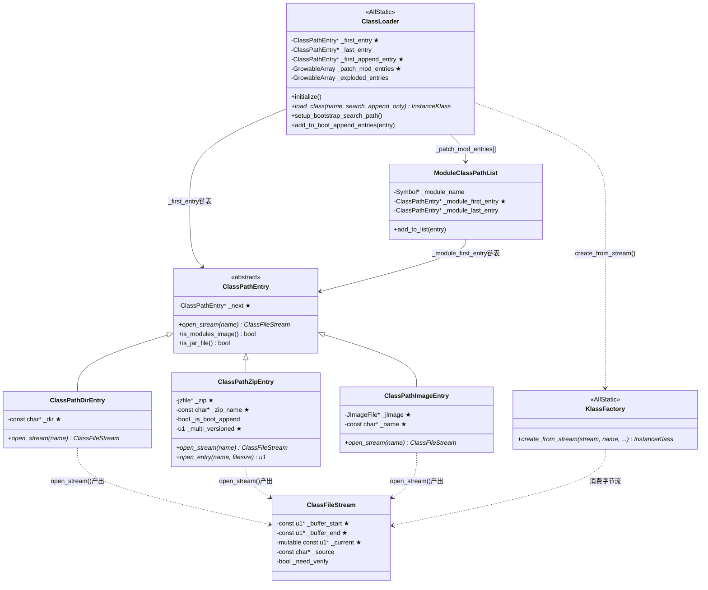

# Bootstrap ClassLoader：引导类加载器完整分析

> 源码基线：OpenJDK 11 (`src/hotspot/share/classfile/classLoader.cpp` — 2218 行)
> 标准环境：`-Xms8g -Xmx8g -XX:+UseG1GC`
> 前置阅读：`ClassLoading/classloading_complete_flow.md`（类加载总流程）

---

## 第 0 部分：核心原理 ⭐

### 0.1 本质是什么？

Bootstrap ClassLoader 的本质是**一个 C++ 实现的类路径搜索器**：维护一条 `ClassPathEntry` 链表（jimage → patch-module → Xbootclasspath/a），按顺序搜索 `.class` 字节流，找到后交给 `KlassFactory::create_from_stream` 解析。它没有对应的 Java 对象（`class_loader == null`），是 JVM 中唯一一个纯 C++ 实现的类加载器。

### 0.2 为什么需要？

**先有鸡还是先有蛋问题**：`ClassLoader` 类本身需要被加载，如果用 Java 实现 Bootstrap ClassLoader，谁来加载 `ClassLoader` 类？C++ 实现打破了这个循环依赖。此外：

- **系统级操作**：需要直接操作 jimage 文件（`lib/modules`，JDK 9+ 的核心类库格式）、ZIP/JAR 文件、文件系统目录，C++ 更适合底层操作
- **性能**：核心类库加载是热点路径，C++ 实现避免 Java 层调用开销
- **安全性**：核心类（`java.lang.Object`、`java.lang.String` 等）必须由 Bootstrap 加载，防止被用户代码替换

### 0.3 怎么解决？

**三层结构**：
- **路径抽象层**（`ClassPathEntry` 体系）：用策略模式统一处理目录/JAR/jimage 三种路径类型，每种实现 `open_stream()` 接口
- **搜索层**（`ClassLoader::load_class()`）：按 patch-module → jimage → Xbootclasspath/a 顺序遍历 `ClassPathEntry` 链表
- **解析层**（`KlassFactory::create_from_stream()`）：找到字节流后交给 `ClassFileParser` 解析

### 0.4 为什么这样设计？

- **为什么用链表而不是数组？** 类路径在 JVM 启动后可以动态追加（`-Xbootclasspath/a`、`Instrumentation.appendToBootstrapClassLoaderSearch()`），链表支持 O(1) 尾部追加
- **为什么 jimage 优先于 Xbootclasspath/a？** jimage 包含 JDK 核心类库，必须优先搜索；Xbootclasspath/a 是用户追加的路径，用于扩展或调试，不应覆盖核心类
- **为什么 patch-module 最优先？** `--patch-module` 是 JDK 9+ 的模块补丁机制，用于替换模块中的特定类（如调试 JDK 内部类），必须最优先
- **为什么 `search_append_only` 参数存在？** 模块可见性规则：非 boot 模块包中的类只能在 Xbootclasspath/a 中搜索，不能在 jimage 中搜索（防止绕过模块边界）

---

## 目录

1. [数据结构全景](#1-数据结构全景)
2. [ClassLoader 初始化流程](#2-classloader-初始化流程)
3. [load_class 核心加载方法](#3-load_class-核心加载方法)
4. [ClassPathEntry 三种实现](#4-classpathentry-三种实现)
5. [数据结构关系图](#5-数据结构关系图)
6. [总结](#6-总结)

---

## 1. 数据结构全景

### 1.1 数据结构清单

| 结构名 | 源码位置 | 核心作用 |
|--------|----------|----------|
| `ClassPathEntry` | `classLoader.hpp:47` | 类路径入口抽象基类（策略模式） |
| `ClassPathDirEntry` | `classLoader.hpp:68` | 目录类路径实现 |
| `ClassPathZipEntry` | `classLoader.hpp:98` | ZIP/JAR 类路径实现 |
| `ClassPathImageEntry` | `classLoader.hpp:130` | jimage 模块映像实现（JDK 9+） |
| `ModuleClassPathList` | `classLoader.hpp:155` | `--patch-module` 模块补丁路径 |
| `ClassLoader` | `classLoader.hpp:175` | Bootstrap ClassLoader 主体（AllStatic） |

### 1.2 ClassPathEntry — 抽象基类

```cpp
// classLoader.hpp:47
class ClassPathEntry : public CHeapObj<mtClass> {
private:
  ClassPathEntry* volatile _next;  // ★ 链表指针（volatile 保证多线程可见性）
public:
  virtual bool is_modules_image() const = 0;  // 是否是 jimage
  virtual bool is_jar_file() const = 0;        // 是否是 JAR/ZIP
  virtual const char* name() const = 0;        // 路径名称（用于日志）
  virtual JImageFile* jimage() const = 0;      // jimage 句柄（非 jimage 返回 NULL）
  virtual void close_jimage() = 0;             // 关闭 jimage 句柄
  virtual ClassFileStream* open_stream(const char* name, TRAPS) = 0;  // ★ 核心接口
};
```

**sizeof(ClassPathEntry)**：1 个指针 = **8 字节**（纯虚基类，实际大小由子类决定）

**创建位置**：`ClassLoader::setup_bootstrap_search_path()` 中根据路径类型创建对应子类实例；`ClassLoader::add_to_boot_append_entries()` 中追加到链表尾部。

**关键字段生命周期**：
- `_next`：`set_next()` 设置，构建链表时使用；`ClassLoader::_first_entry` 是链表头；JVM 运行期间不释放（Bootstrap ClassLoader 生命周期 = JVM 生命周期）

### 1.3 ClassPathDirEntry — 目录类路径

```cpp
// classLoader.hpp:68
class ClassPathDirEntry: public ClassPathEntry {
 private:
  const char* _dir;  // ★ 目录路径字符串（如 "/home/user/classes"）
 public:
  ClassPathDirEntry(const char* dir);
  ClassFileStream* open_stream(const char* name, TRAPS);
};
```

**sizeof(ClassPathDirEntry)**：基类 8B + `_dir` 指针 8B = **16 字节**（不含 vtable 指针，实际 24B）

**创建位置**：`ClassLoader::setup_bootstrap_search_path()` 解析 `-Xbootclasspath` 时，遇到目录路径创建 `ClassPathDirEntry`。

**`open_stream` 实现**：拼接 `_dir + "/" + name`（如 `java/lang/Object.class`），调用 `os::open()` 打开文件，返回 `ClassFileStream`。

### 1.4 ClassPathZipEntry — ZIP/JAR 类路径

```cpp
// classLoader.hpp:98
class ClassPathZipEntry: public ClassPathEntry {
 private:
  jzfile* _zip;              // ★ ZIP 文件句柄（libzip 的不透明指针）
  const char* _zip_name;     // ★ JAR 文件路径（用于日志和错误信息）
  bool _is_boot_append;      // 是否来自 -Xbootclasspath/a（影响多版本 JAR 处理）
  u1 _multi_versioned;       // ★ 是否是多版本 JAR（_unknown=0/_yes=1/_no=2）
 public:
  ClassPathZipEntry(jzfile* zip, const char* zip_name, bool is_boot_append);
  u1* open_entry(const char* name, jint* filesize, bool nul_terminate, TRAPS);
  ClassFileStream* open_stream(const char* name, TRAPS);
};
```

**sizeof(ClassPathZipEntry)**：基类 8B + 3 个字段 = **约 32 字节**（8+8+1+1+对齐）

**创建位置**：`ClassLoader::setup_bootstrap_search_path()` 遇到 `.jar`/`.zip` 文件时，调用 `ZipOpen()` 打开 ZIP 句柄，创建 `ClassPathZipEntry`。

**关键字段生命周期**：
- `_zip`：构造时通过 `ZipOpen(zip_name, ...)` 获取；`open_entry()` 中通过 `FindEntry(_zip, name, ...)` 查找条目；析构时 `ZipClose(_zip)` 关闭
- `_multi_versioned`：首次 `open_stream()` 时通过 `is_multiple_versioned()` 检测（读取 JAR Manifest）；`_yes` 时优先搜索 `META-INF/versions/<version>/` 下的类

### 1.5 ClassPathImageEntry — jimage 模块映像

```cpp
// classLoader.hpp:130
class ClassPathImageEntry: public ClassPathEntry {
private:
  JImageFile* _jimage;   // ★ jimage 文件句柄（libjimage 的不透明指针）
  const char* _name;     // ★ jimage 文件路径（通常是 "lib/modules"）
public:
  ClassPathImageEntry(JImageFile* jimage, const char* name);
  ClassFileStream* open_stream(const char* name, TRAPS);
};
```

**sizeof(ClassPathImageEntry)**：基类 8B + 2 个指针 16B = **约 32 字节**（含 vtable 指针）

**创建位置**：`ClassLoader::setup_bootstrap_search_path()` 中，`ClassLoader::open_jrt_image()` 打开 `lib/modules` 文件后创建 `ClassPathImageEntry`，作为 `_first_entry`（最高优先级）。

**关键字段生命周期**：
- `_jimage`：`JImageOpen("lib/modules", ...)` 获取；`open_stream()` 中通过 `JImageGetResource(_jimage, location, buffer, size)` 读取；JVM 退出时 `close_jimage()` 关闭
- `open_stream` 实现：将类名转换为 jimage 资源路径（如 `java/lang/Object.class` → `/java.base/java/lang/Object.class`），调用 `JImageGetResource` 读取

### 1.6 ClassLoader — Bootstrap ClassLoader 主体

```cpp
// classLoader.hpp:175（关键静态字段）
class ClassLoader: AllStatic {
 protected:
  // 类路径链表
  static ClassPathEntry* _first_entry;          // ★ 链表头（jimage 条目）
  static ClassPathEntry* _last_entry;           // 链表尾（追加用）
  static int             _num_entries;          // 链表长度
  static ClassPathEntry* _first_append_entry;   // ★ Xbootclasspath/a 起始位置

  // --patch-module 补丁路径
  static GrowableArray<ModuleClassPathList*>* _patch_mod_entries;  // ★ 模块补丁列表

  // exploded build 路径（开发模式，无 jimage）
  static GrowableArray<ModuleClassPathList*>* _exploded_entries;

  // 性能计数器（PerfData）
  static PerfCounter* _perf_accumulated_time;
  // ... 约 20 个性能计数器 ...
};
```

**sizeof(ClassLoader)**：`AllStatic` 类，无实例，所有字段都是静态的，不占对象内存。

**创建位置**：`ClassLoader::initialize()` 在 `init_globals()` 阶段调用，初始化所有静态字段。

**关键字段生命周期**：
- `_first_entry`：`setup_bootstrap_search_path()` 时设置为 jimage 的 `ClassPathImageEntry`；`load_class()` 遍历此链表搜索类
- `_first_append_entry`：`add_to_boot_append_entries()` 时设置为第一个 Xbootclasspath/a 条目；`load_class(search_append_only=true)` 时从此处开始搜索
- `_patch_mod_entries`：`setup_patch_mod_entries()` 时填充；`load_class()` 最优先搜索此列表

---

## 2. ClassLoader 初始化流程

`ClassLoader::initialize()` 在 `init_globals()` 阶段调用（`init.cpp:100`），分 4 步：

```cpp
// classLoader.cpp:1800（简化）
void ClassLoader::initialize() {
  // Step 1: 加载 zip 动态库，获取函数指针
  load_zip_library();
  // ZipOpen, ZipClose, FindEntry, ReadEntry, GetNextEntry 等函数指针
  // 存储在全局变量 ZipOpen, ZipClose 等中

  // Step 2: 加载 jimage 动态库，获取函数指针
  load_jimage_library();
  // JImageOpen, JImageClose, JImageGetResource 等函数指针

  // Step 3: 设置启动类路径（构建 ClassPathEntry 链表）
  setup_bootstrap_search_path();
  // 解析 -Xbootclasspath 参数，创建 ClassPathEntry 链表
  // 默认：打开 lib/modules → ClassPathImageEntry（_first_entry）

  // Step 4: 初始化性能计数器（PerfData）
  // 约 20 个 PerfCounter，用于 jstat 监控
}
```

**`setup_bootstrap_search_path()` 详细流程**（`classLoader.cpp:1650`）：

```cpp
// classLoader.cpp:1650
void ClassLoader::setup_bootstrap_search_path() {
  // 1. 打开 jimage（lib/modules）
  //    JVM 启动时 lib/modules 必须存在（除非是 exploded build）
  JImageFile* jimage = open_jrt_image();
  if (jimage != NULL) {
    // 创建 ClassPathImageEntry，插入链表头部（最高优先级）
    _first_entry = new ClassPathImageEntry(jimage, "lib/modules");
  }

  // 2. 处理 --patch-module（模块补丁，最优先）
  //    在 setup_patch_mod_entries() 中填充 _patch_mod_entries

  // 3. 处理 -Xbootclasspath/a（追加路径）
  //    解析路径字符串，创建 ClassPathDirEntry 或 ClassPathZipEntry
  //    追加到链表尾部，_first_append_entry 指向第一个追加条目
}
```

---

## 3. load_class 核心加载方法

`ClassLoader::load_class()` 是 Bootstrap ClassLoader 的核心，`systemDictionary.cpp` 中 `load_instance_class` 的 Bootstrap 路径调用它：

```cpp
// classLoader.cpp:1434
InstanceKlass* ClassLoader::load_class(Symbol* name, bool search_append_only, TRAPS) {
  assert(name != NULL, "invariant");
  assert(THREAD->is_Java_thread(), "must be a JavaThread");

  ResourceMark rm(THREAD);   // ★ 自动释放 ResourceArea 内存（函数返回时）
  HandleMark hm(THREAD);     // ★ 自动释放 Handle（函数返回时）

  // 类名转文件名：java/lang/Object → java/lang/Object.class
  const char* const class_name = name->as_C_string();
  const char* const file_name = file_name_for_class_name(class_name, name->utf8_length());

  ClassFileStream* stream = NULL;
  s2 classpath_index = 0;
  ClassPathEntry* e = NULL;

  // ★ search_append_only=true 时只搜索 Xbootclasspath/a（模块可见性规则）
  //    search_append_only=false 时从链表头开始搜索（包含 jimage）
  ClassPathEntry* const start = search_append_only ? _first_append_entry : _first_entry;

  // 阶段 1：搜索 --patch-module（最优先，search_append_only=false 时才搜索）
  if (!search_append_only) {
    stream = search_module_entries(_patch_mod_entries, class_name, file_name, CHECK_NULL);
  }

  // 阶段 2：遍历 ClassPathEntry 链表
  if (stream == NULL) {
    e = start;
    while (e != NULL) {
      stream = e->open_stream(file_name, CHECK_NULL);  // ★ 多态调用
      if (stream != NULL) {
        break;  // 找到，停止搜索
      }
      e = e->next();
      classpath_index++;  // ★ 记录来源索引（用于模块可见性检查）
    }
  }

  if (stream == NULL) {
    return NULL;  // 未找到，返回 NULL（调用方抛 ClassNotFoundException）
  }

  // 阶段 3：解析字节流 → InstanceKlass
  ClassLoaderData* loader_data = ClassLoaderData::the_null_class_loader_data();
  Handle protection_domain;

  // ★ 注意：这里直接调用 KlassFactory，不经过 SystemDictionary
  //    注册到 Dictionary 由调用方（load_instance_class）完成
  InstanceKlass* result = KlassFactory::create_from_stream(
      stream, name, loader_data, protection_domain,
      NULL, NULL, CHECK_NULL);

  // ★ classpath_index 存入 InstanceKlass，用于后续模块可见性检查
  if (result != NULL) {
    result->set_classpath_index(classpath_index, THREAD);
  }

  return result;
}
```

**三阶段搜索顺序**：

```
搜索阶段 #1: --patch-module 路径（search_append_only=false 时）
  └── search_module_entries(_patch_mod_entries, ...)
      └── 遍历 _patch_mod_entries，找到对应模块的 ClassPathEntry 链表搜索

搜索阶段 #2: jimage 或 exploded build 模块路径
  ├── ClassPathImageEntry::open_stream()  // lib/modules (jimage)
  │     └── JImageGetResource(_jimage, location, buffer, size)
  └── search_module_entries(_exploded_entries, ...)  // exploded build

搜索阶段 #3: -Xbootclasspath/a 追加路径
  └── 遍历 _first_append_entry 链表
      ├── ClassPathDirEntry::open_stream()   // 目录：拼接路径 + os::open()
      └── ClassPathZipEntry::open_stream()   // JAR：ZipFindEntry() + ReadEntry()
```

---

## 4. ClassPathEntry 三种实现

### 4.1 ClassPathDirEntry::open_stream

```cpp
// classLoader.cpp:130
ClassFileStream* ClassPathDirEntry::open_stream(const char* name, TRAPS) {
  // 拼接完整路径：_dir + "/" + name
  // 如："/home/user/classes" + "/" + "java/lang/Object.class"
  char* path = NEW_RESOURCE_ARRAY_IN_THREAD(THREAD, char, strlen(_dir) + strlen(name) + 2);
  sprintf(path, "%s%s%s", _dir, os::file_separator(), name);

  // 打开文件
  struct stat st;
  if (os::stat(path, &st) == 0) {
    // 文件存在，读取内容
    int file_handle = os::open(path, 0, 0);
    if (file_handle != -1) {
      // 分配缓冲区，读取字节码
      u1* buffer = NEW_RESOURCE_ARRAY(u1, st.st_size);
      size_t num_read = os::read(file_handle, (char*)buffer, st.st_size);
      os::close(file_handle);
      if (num_read == (size_t)st.st_size) {
        return new ClassFileStream(buffer, st.st_size, _dir, ClassFileStream::verify);
      }
    }
  }
  return NULL;
}
```

### 4.2 ClassPathZipEntry::open_stream

```cpp
// classLoader.cpp:200（简化）
ClassFileStream* ClassPathZipEntry::open_stream(const char* name, TRAPS) {
  // 多版本 JAR 处理：优先搜索 META-INF/versions/<version>/
  if (_multi_versioned == _yes) {
    ClassFileStream* stream = open_versioned_entry(name, &filesize, CHECK_NULL);
    if (stream != NULL) return stream;
  }

  // 在 ZIP 中查找条目
  jint filesize;
  u1* buffer = open_entry(name, &filesize, false, CHECK_NULL);
  if (buffer == NULL) return NULL;

  // 返回 ClassFileStream（buffer 由 ResourceArea 管理）
  return new ClassFileStream(buffer, filesize, _zip_name, ClassFileStream::verify);
}
```

### 4.3 ClassPathImageEntry::open_stream

```cpp
// classLoader.cpp:280（简化）
ClassFileStream* ClassPathImageEntry::open_stream(const char* name, TRAPS) {
  // 将类名转换为 jimage 资源路径
  // java/lang/Object.class → /java.base/java/lang/Object.class
  // （模块名由 JImageFindResource 内部查找）

  JImageLocationRef location = JImageFindResource(_jimage, "", JAVA_VERSION, name, &size);
  if (location == 0) return NULL;

  // 读取资源内容
  u1* buffer = NEW_RESOURCE_ARRAY(u1, size);
  JImageGetResource(_jimage, location, (char*)buffer, size);

  return new ClassFileStream(buffer, size, _name, ClassFileStream::verify);
}
```

---

## 5. 数据结构关系图



**关系说明**：
- `ClassLoader` 维护两条链表：`_first_entry`（全部路径）和 `_first_append_entry`（仅 Xbootclasspath/a 部分）
- `_patch_mod_entries` 是模块补丁列表，每个 `ModuleClassPathList` 对应一个 `--patch-module=<module>=<path>` 参数
- `ClassPathEntry` 的三种实现对应三种路径类型，`open_stream()` 是统一接口
- `ClassFileStream` 是字节流的轻量级包装，`_current` 指针随解析推进

---

## 6. 总结

### 数据结构层面

| 结构 | sizeof | 核心特征 |
|------|--------|----------|
| `ClassPathEntry`（基类） | 8B（仅 `_next`） | 策略模式基类；`_next` 构建链表；`open_stream()` 是统一接口 |
| `ClassPathDirEntry` | ~24B | `_dir` 字符串指针；`open_stream` = 拼接路径 + `os::open()` |
| `ClassPathZipEntry` | ~32B | `_zip` 句柄 + `_multi_versioned` 标志；支持多版本 JAR（JDK 9+） |
| `ClassPathImageEntry` | ~32B | `_jimage` 句柄；`open_stream` = `JImageGetResource()`；JDK 9+ 核心类库格式 |
| `ModuleClassPathList` | ~32B | `--patch-module` 补丁路径；每个模块一个列表 |
| `ClassLoader` | 0（AllStatic） | Bootstrap ClassLoader 主体；`_first_entry` 和 `_first_append_entry` 是两个关键链表入口 |

### 算法层面

| 算法 | 核心设计决策 |
|------|-------------|
| `load_class()` 三阶段搜索 | patch-module → jimage → Xbootclasspath/a；`search_append_only` 参数实现模块可见性规则 |
| `ClassPathEntry` 链表遍历 | 顺序搜索，找到即停；`classpath_index` 记录来源用于可见性检查 |
| `ClassPathImageEntry::open_stream` | 类名 → jimage 资源路径转换；`JImageFindResource` + `JImageGetResource` 两步读取 |
| `ClassPathZipEntry::open_stream` | 多版本 JAR 优先搜索 `META-INF/versions/<version>/`；`_multi_versioned` 懒检测 |
| `setup_bootstrap_search_path()` | jimage 作为 `_first_entry`（最高优先级）；Xbootclasspath/a 追加到链表尾部 |

---

*最后更新: 2026-03-02（全量重写：补充第0节核心原理、完整数据结构分析、真实源码+逐行注释、Mermaid关系图、总结节）*
